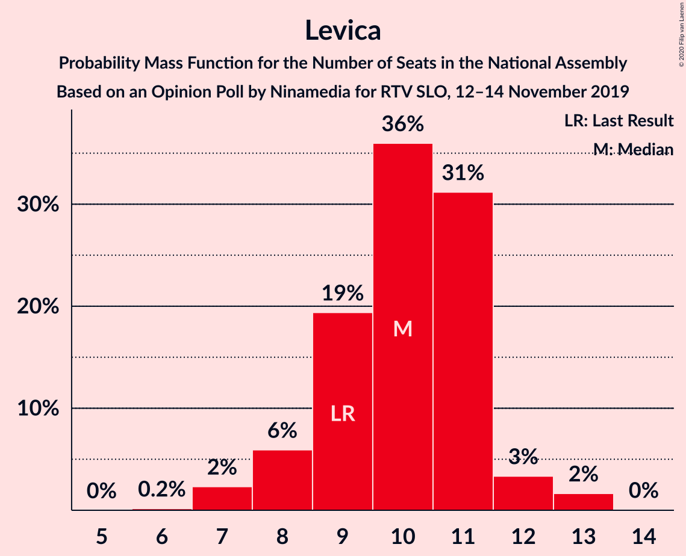
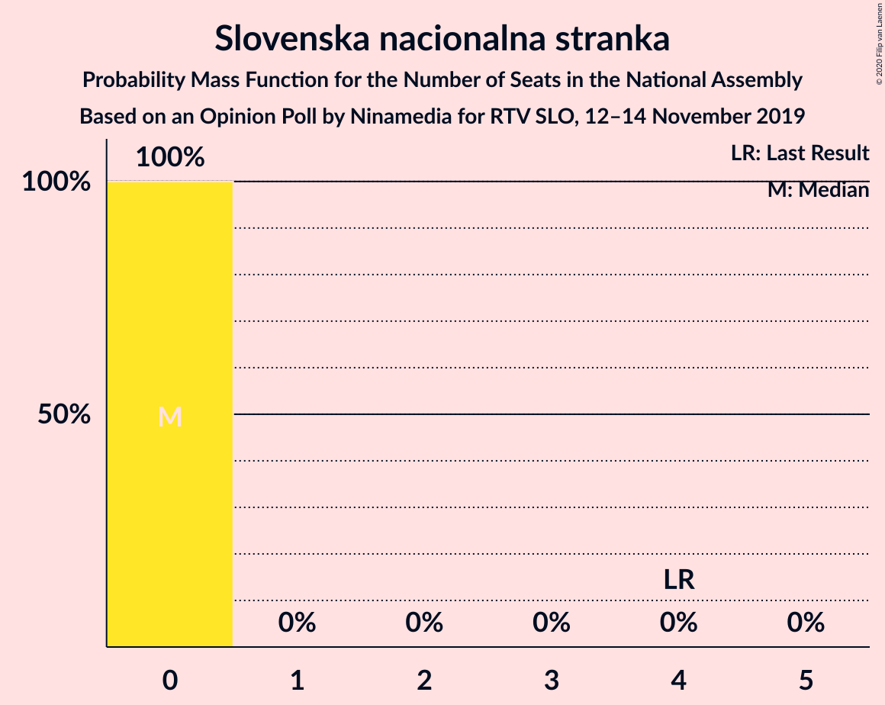
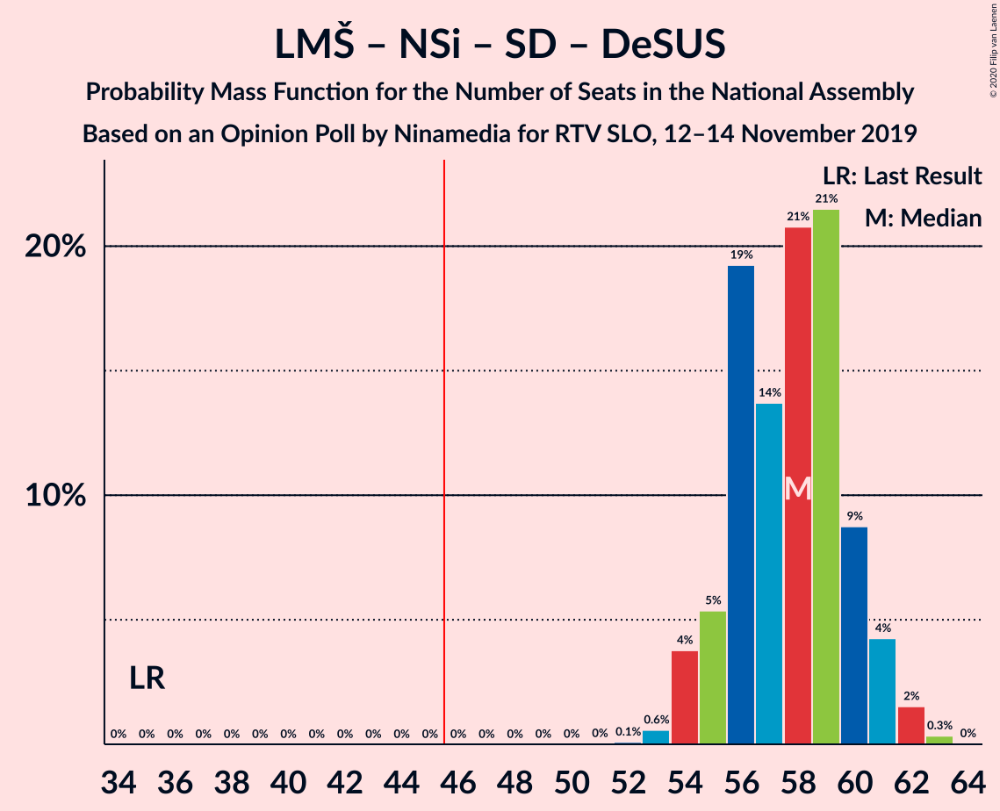
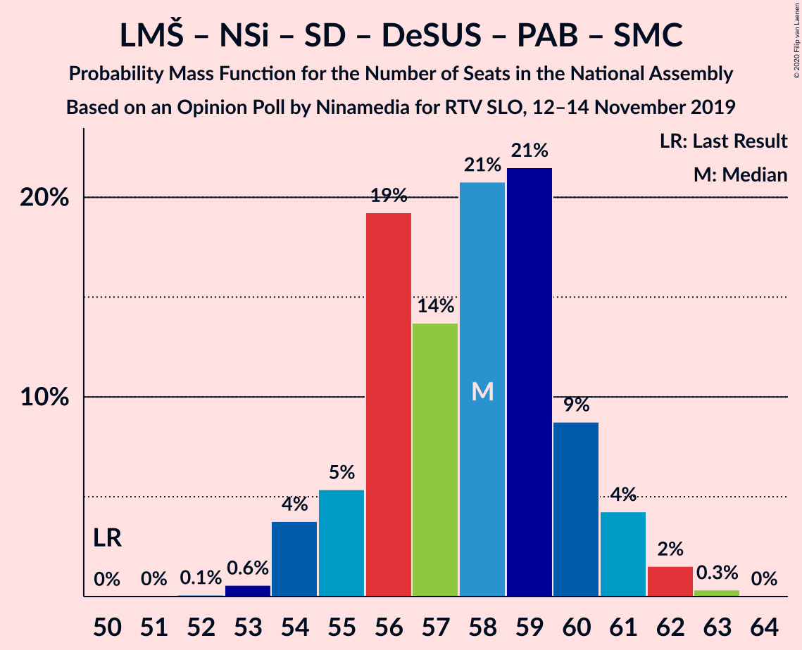
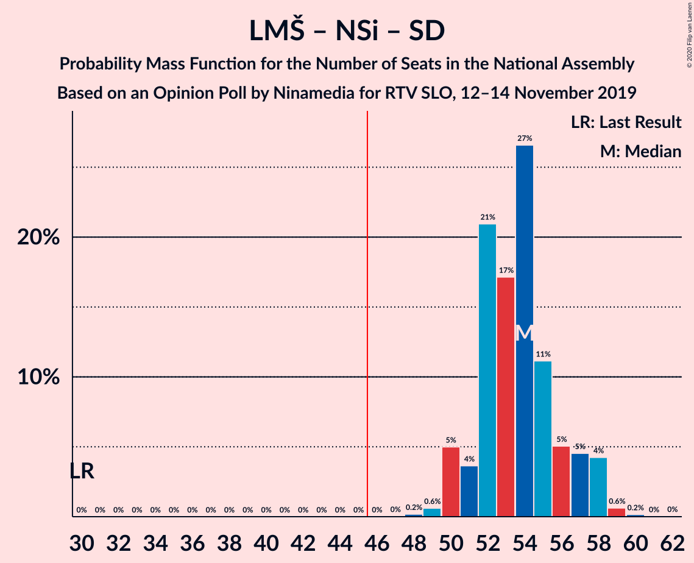
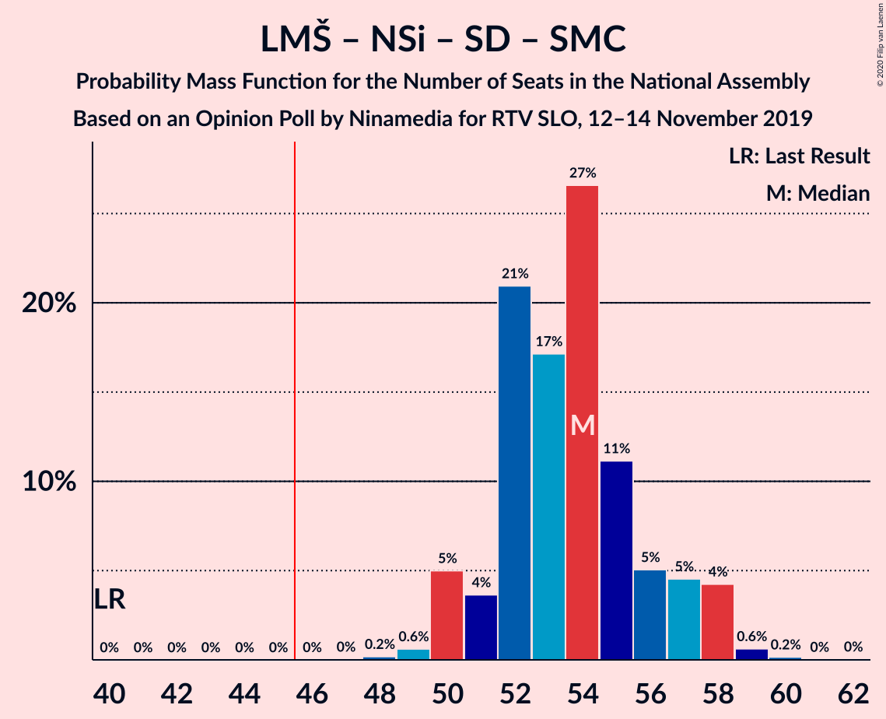
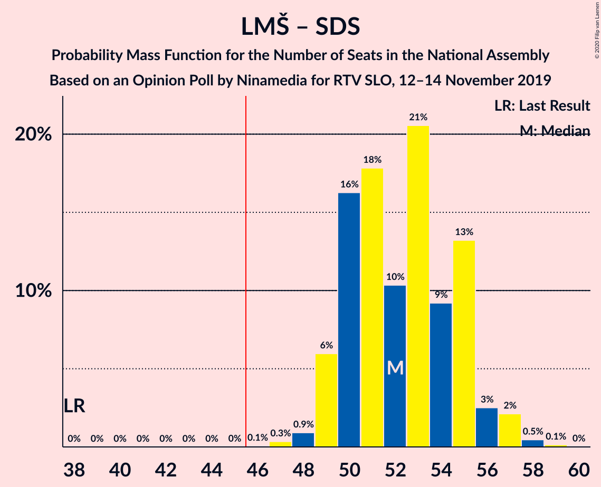
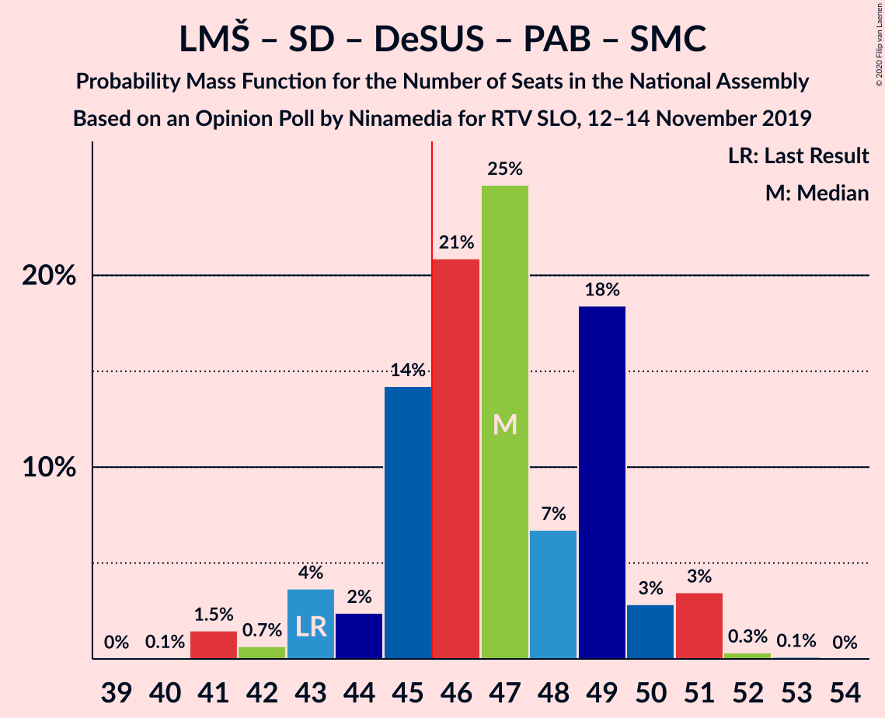
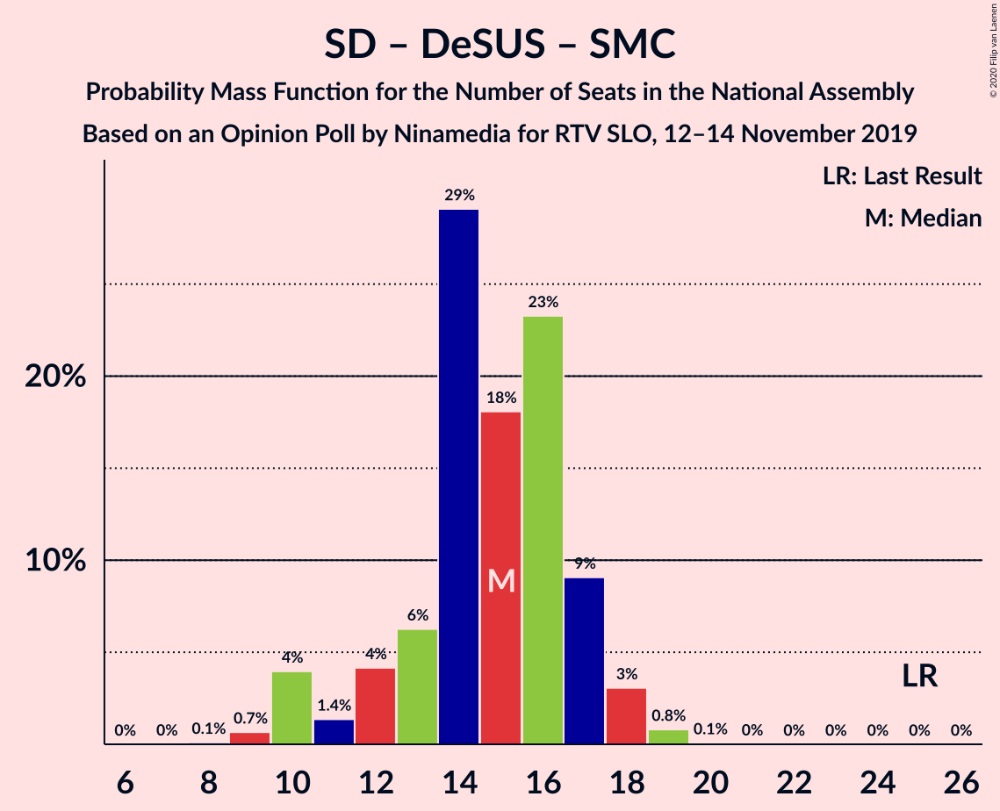

# Opinion Poll by Ninamedia for RTV SLO, 12–14 November 2019

<a href="#voting-intentions">Voting Intentions</a> | <a href="#seats">Seats</a> | <a href="#coalitions">Coalitions</a> | <a href="#technical-information">Technical Information</a>

## Voting Intentions

### Confidence Intervals

| Party | Last Result | Poll Result | 80% Confidence Interval | 90% Confidence Interval | 95% Confidence Interval | 99% Confidence Interval |
|:-----:|:-----------:|:-----------:|:-----------------------:|:-----------------------:|:-----------------------:|:-----------------------:|
| Lista Marjana Šarca | 12.6% | 33.1% | 30.9–35.5% |30.3–36.2% |29.8–36.7% |28.7–37.9% |
| Slovenska demokratska stranka | 24.9% | 21.0% | 19.1–23.1% |18.6–23.7% |18.1–24.2% |17.3–25.2% |
| Nova Slovenija–Krščanski demokrati | 7.2% | 11.6% | 10.2–13.3% |9.7–13.7% |9.4–14.2% |8.8–15.0% |
| Socialni demokrati | 9.9% | 11.0% | 9.6–12.7% |9.2–13.1% |8.9–13.5% |8.3–14.4% |
| Levica | 9.3% | 10.1% | 8.8–11.8% |8.4–12.2% |8.1–12.6% |7.5–13.4% |
| Demokratična stranka upokojencev Slovenije | 4.9% | 5.0% | 4.1–6.2% |3.8–6.6% |3.6–6.9% |3.2–7.5% |
| Slovenska ljudska stranka | 2.6% | 2.6% | 2.0–3.5% |1.8–3.8% |1.6–4.0% |1.4–4.5% |
| Slovenska nacionalna stranka | 4.2% | 1.7% | 1.2–2.5% |1.1–2.8% |1.0–3.0% |0.8–3.4% |
| Stranka Alenke Bratušek | 5.1% | 1.4% | 1.0–2.2% |0.9–2.4% |0.8–2.6% |0.6–3.0% |
| Stranka modernega centra | 9.7% | 0.9% | 0.5–1.5% |0.5–1.7% |0.4–1.9% |0.3–2.2% |

*Note:* The poll result column reflects the actual value used in the calculations. Published results may vary slightly, and in addition be rounded to fewer digits.

## Seats

### Confidence Intervals

| Party | Last Result | Median | 80% Confidence Interval | 90% Confidence Interval | 95% Confidence Interval | 99% Confidence Interval |
|:-----:|:-----------:|:------:|:-----------------------:|:-----------------------:|:-----------------------:|:-----------------------:|
| <a href="#lista-marjana-šarca">Lista Marjana Šarca</a> | 13 | 33 | 30–34 |30–36 |29–37 |28–37 |
| <a href="#slovenska-demokratska-stranka">Slovenska demokratska stranka</a> | 25 | 20 | 19–22 |18–23 |18–23 |17–25 |
| <a href="#nova-slovenija–krščanski-demokrati">Nova Slovenija–Krščanski demokrati</a> | 7 | 11 | 9–12 |9–13 |9–13 |8–14 |
| <a href="#socialni-demokrati">Socialni demokrati</a> | 10 | 10 | 9–12 |8–12 |8–12 |8–14 |
| <a href="#levica">Levica</a> | 9 | 10 | 9–11 |8–11 |7–11 |7–13 |
| <a href="#demokratična-stranka-upokojencev-slovenije">Demokratična stranka upokojencev Slovenije</a> | 5 | 5 | 4–6 |0–6 |0–6 |0–7 |
| <a href="#slovenska-ljudska-stranka">Slovenska ljudska stranka</a> | 0 | 0 | 0 |0 |0 |0–4 |
| <a href="#slovenska-nacionalna-stranka">Slovenska nacionalna stranka</a> | 4 | 0 | 0 |0 |0 |0 |
| <a href="#stranka-alenke-bratušek">Stranka Alenke Bratušek</a> | 5 | 0 | 0 |0 |0 |0 |
| <a href="#stranka-modernega-centra">Stranka modernega centra</a> | 10 | 0 | 0 |0 |0 |0 |

### Lista Marjana Šarca

*For a full overview of the results for this party, see the [Lista Marjana Šarca](party-listamarjanašarca.html) page.*

| Number of Seats | Probability | Accumulated | Special Marks |
|:---------------:|:-----------:|:-----------:|:-------------:|
| 13 | 0% | 100% | Last Result |
| 14 | 0% | 100% |  |
| 15 | 0% | 100% |  |
| 16 | 0% | 100% |  |
| 17 | 0% | 100% |  |
| 18 | 0% | 100% |  |
| 19 | 0% | 100% |  |
| 20 | 0% | 100% |  |
| 21 | 0% | 100% |  |
| 22 | 0% | 100% |  |
| 23 | 0% | 100% |  |
| 24 | 0% | 100% |  |
| 25 | 0% | 100% |  |
| 26 | 0.1% | 100% |  |
| 27 | 0.2% | 99.9% |  |
| 28 | 0.4% | 99.8% |  |
| 29 | 2% | 99.4% |  |
| 30 | 29% | 97% |  |
| 31 | 4% | 68% |  |
| 32 | 12% | 64% |  |
| 33 | 41% | 52% | Median |
| 34 | 3% | 10% |  |
| 35 | 2% | 7% |  |
| 36 | 1.1% | 5% |  |
| 37 | 4% | 4% |  |
| 38 | 0.1% | 0.1% |  |
| 39 | 0% | 0% |  |

### Slovenska demokratska stranka

*For a full overview of the results for this party, see the [Slovenska demokratska stranka](party-slovenskademokratskastranka.html) page.*

| Number of Seats | Probability | Accumulated | Special Marks |
|:---------------:|:-----------:|:-----------:|:-------------:|
| 16 | 0.2% | 100% |  |
| 17 | 1.1% | 99.8% |  |
| 18 | 7% | 98.7% |  |
| 19 | 34% | 92% |  |
| 20 | 32% | 58% | Median |
| 21 | 12% | 26% |  |
| 22 | 9% | 14% |  |
| 23 | 4% | 5% |  |
| 24 | 0.4% | 1.5% |  |
| 25 | 0.8% | 1.1% | Last Result |
| 26 | 0.2% | 0.3% |  |
| 27 | 0.1% | 0.1% |  |
| 28 | 0% | 0% |  |

### Nova Slovenija–Krščanski demokrati

*For a full overview of the results for this party, see the [Nova Slovenija–Krščanski demokrati](party-novaslovenija–krščanskidemokrati.html) page.*

| Number of Seats | Probability | Accumulated | Special Marks |
|:---------------:|:-----------:|:-----------:|:-------------:|
| 7 | 0% | 100% | Last Result |
| 8 | 2% | 100% |  |
| 9 | 9% | 98% |  |
| 10 | 8% | 89% |  |
| 11 | 34% | 81% | Median |
| 12 | 37% | 47% |  |
| 13 | 8% | 9% |  |
| 14 | 1.2% | 2% |  |
| 15 | 0.2% | 0.5% |  |
| 16 | 0.2% | 0.2% |  |
| 17 | 0% | 0% |  |

### Socialni demokrati

*For a full overview of the results for this party, see the [Socialni demokrati](party-socialnidemokrati.html) page.*

| Number of Seats | Probability | Accumulated | Special Marks |
|:---------------:|:-----------:|:-----------:|:-------------:|
| 7 | 0.5% | 100% |  |
| 8 | 8% | 99.5% |  |
| 9 | 38% | 92% |  |
| 10 | 16% | 54% | Last Result, Median |
| 11 | 5% | 37% |  |
| 12 | 30% | 32% |  |
| 13 | 0.9% | 2% |  |
| 14 | 0.7% | 1.0% |  |
| 15 | 0.3% | 0.3% |  |
| 16 | 0% | 0% |  |

### Levica

*For a full overview of the results for this party, see the [Levica](party-levica.html) page.*

| Number of Seats | Probability | Accumulated | Special Marks |
|:---------------:|:-----------:|:-----------:|:-------------:|
| 6 | 0.4% | 100% |  |
| 7 | 2% | 99.6% |  |
| 8 | 4% | 97% |  |
| 9 | 13% | 93% | Last Result |
| 10 | 49% | 80% | Median |
| 11 | 28% | 31% |  |
| 12 | 2% | 2% |  |
| 13 | 0.5% | 0.6% |  |
| 14 | 0.1% | 0.1% |  |
| 15 | 0% | 0% |  |

### Demokratična stranka upokojencev Slovenije

*For a full overview of the results for this party, see the [Demokratična stranka upokojencev Slovenije](party-demokratičnastrankaupokojencevslovenije.html) page.*

| Number of Seats | Probability | Accumulated | Special Marks |
|:---------------:|:-----------:|:-----------:|:-------------:|
| 0 | 6% | 100% |  |
| 1 | 0% | 94% |  |
| 2 | 0% | 94% |  |
| 3 | 0% | 94% |  |
| 4 | 40% | 94% |  |
| 5 | 41% | 54% | Last Result, Median |
| 6 | 12% | 13% |  |
| 7 | 0.6% | 0.7% |  |
| 8 | 0.1% | 0.1% |  |
| 9 | 0% | 0% |  |

### Slovenska ljudska stranka

*For a full overview of the results for this party, see the [Slovenska ljudska stranka](party-slovenskaljudskastranka.html) page.*

| Number of Seats | Probability | Accumulated | Special Marks |
|:---------------:|:-----------:|:-----------:|:-------------:|
| 0 | 98% | 100% | Last Result, Median |
| 1 | 0% | 2% |  |
| 2 | 0% | 2% |  |
| 3 | 0% | 2% |  |
| 4 | 2% | 2% |  |
| 5 | 0.1% | 0.1% |  |
| 6 | 0% | 0% |  |

### Slovenska nacionalna stranka

*For a full overview of the results for this party, see the [Slovenska nacionalna stranka](party-slovenskanacionalnastranka.html) page.*

| Number of Seats | Probability | Accumulated | Special Marks |
|:---------------:|:-----------:|:-----------:|:-------------:|
| 0 | 100% | 100% | Median |
| 1 | 0% | 0% |  |
| 2 | 0% | 0% |  |
| 3 | 0% | 0% |  |
| 4 | 0% | 0% | Last Result |

### Stranka Alenke Bratušek

*For a full overview of the results for this party, see the [Stranka Alenke Bratušek](party-strankaalenkebratušek.html) page.*

| Number of Seats | Probability | Accumulated | Special Marks |
|:---------------:|:-----------:|:-----------:|:-------------:|
| 0 | 100% | 100% | Median |
| 1 | 0% | 0% |  |
| 2 | 0% | 0% |  |
| 3 | 0% | 0% |  |
| 4 | 0% | 0% |  |
| 5 | 0% | 0% | Last Result |

### Stranka modernega centra

*For a full overview of the results for this party, see the [Stranka modernega centra](party-strankamodernegacentra.html) page.*

| Number of Seats | Probability | Accumulated | Special Marks |
|:---------------:|:-----------:|:-----------:|:-------------:|
| 0 | 100% | 100% | Median |
| 1 | 0% | 0% |  |
| 2 | 0% | 0% |  |
| 3 | 0% | 0% |  |
| 4 | 0% | 0% |  |
| 5 | 0% | 0% |  |
| 6 | 0% | 0% |  |
| 7 | 0% | 0% |  |
| 8 | 0% | 0% |  |
| 9 | 0% | 0% |  |
| 10 | 0% | 0% | Last Result |

## Coalitions

### Confidence Intervals

| Coalition | Last Result | Median | Majority? | 80% Confidence Interval | 90% Confidence Interval | 95% Confidence Interval | 99% Confidence Interval |
|:---------:|:-----------:|:------:|:---------:|:-----------------------:|:-----------------------:|:-----------------------:|:-----------------------:|
| Lista Marjana Šarca – Nova Slovenija–Krščanski demokrati – Socialni demokrati – Demokratična stranka upokojencev Slovenije | 35 | 58 | 100% | 57–60 | 56–60 | 55–61 | 54–63 |
| Lista Marjana Šarca – Nova Slovenija–Krščanski demokrati – Socialni demokrati – Demokratična stranka upokojencev Slovenije – Stranka Alenke Bratušek – Stranka modernega centra | 50 | 58 | 100% | 57–60 | 56–60 | 55–61 | 54–63 |
| Lista Marjana Šarca – Nova Slovenija–Krščanski demokrati – Socialni demokrati – Demokratična stranka upokojencev Slovenije – Stranka modernega centra | 45 | 58 | 100% | 57–60 | 56–60 | 55–61 | 54–63 |
| Lista Marjana Šarca – Slovenska demokratska stranka – Demokratična stranka upokojencev Slovenije | 43 | 57 | 100% | 53–60 | 53–60 | 53–61 | 52–61 |
| Lista Marjana Šarca – Nova Slovenija–Krščanski demokrati – Socialni demokrati | 30 | 53 | 100% | 52–55 | 51–57 | 50–59 | 49–59 |
| Lista Marjana Šarca – Nova Slovenija–Krščanski demokrati – Socialni demokrati – Stranka modernega centra | 40 | 53 | 100% | 52–55 | 51–57 | 50–59 | 49–59 |
| Lista Marjana Šarca – Slovenska demokratska stranka | 38 | 53 | 100% | 49–55 | 49–56 | 49–56 | 47–58 |
| Lista Marjana Šarca – Socialni demokrati – Demokratična stranka upokojencev Slovenije | 28 | 47 | 89% | 45–48 | 45–49 | 44–50 | 42–52 |
| Lista Marjana Šarca – Socialni demokrati – Demokratična stranka upokojencev Slovenije – Stranka Alenke Bratušek – Stranka modernega centra | 43 | 47 | 89% | 45–48 | 45–49 | 44–50 | 42–52 |
| Lista Marjana Šarca – Socialni demokrati – Demokratična stranka upokojencev Slovenije – Stranka modernega centra | 38 | 47 | 89% | 45–48 | 45–49 | 44–50 | 42–52 |
| Lista Marjana Šarca – Socialni demokrati | 23 | 42 | 5% | 41–44 | 41–45 | 40–47 | 39–47 |
| Lista Marjana Šarca – Socialni demokrati – Stranka modernega centra | 33 | 42 | 5% | 41–44 | 41–45 | 40–47 | 39–47 |
| Socialni demokrati – Demokratična stranka upokojencev Slovenije – Stranka modernega centra | 25 | 15 | 0% | 12–16 | 11–17 | 10–17 | 9–19 |

### Lista Marjana Šarca – Nova Slovenija–Krščanski demokrati – Socialni demokrati – Demokratična stranka upokojencev Slovenije

| Number of Seats | Probability | Accumulated | Special Marks |
|:---------------:|:-----------:|:-----------:|:-------------:|
| 35 | 0% | 100% | Last Result |
| 36 | 0% | 100% |  |
| 37 | 0% | 100% |  |
| 38 | 0% | 100% |  |
| 39 | 0% | 100% |  |
| 40 | 0% | 100% |  |
| 41 | 0% | 100% |  |
| 42 | 0% | 100% |  |
| 43 | 0% | 100% |  |
| 44 | 0% | 100% |  |
| 45 | 0% | 100% |  |
| 46 | 0% | 100% | Majority |
| 47 | 0% | 100% |  |
| 48 | 0% | 100% |  |
| 49 | 0% | 100% |  |
| 50 | 0% | 100% |  |
| 51 | 0.2% | 100% |  |
| 52 | 0.2% | 99.8% |  |
| 53 | 0.1% | 99.7% |  |
| 54 | 0.9% | 99.6% |  |
| 55 | 3% | 98.7% |  |
| 56 | 5% | 95% |  |
| 57 | 15% | 91% |  |
| 58 | 58% | 76% |  |
| 59 | 7% | 18% | Median |
| 60 | 7% | 11% |  |
| 61 | 2% | 3% |  |
| 62 | 0.8% | 1.5% |  |
| 63 | 0.6% | 0.7% |  |
| 64 | 0% | 0% |  |

### Lista Marjana Šarca – Nova Slovenija–Krščanski demokrati – Socialni demokrati – Demokratična stranka upokojencev Slovenije – Stranka Alenke Bratušek – Stranka modernega centra

| Number of Seats | Probability | Accumulated | Special Marks |
|:---------------:|:-----------:|:-----------:|:-------------:|
| 50 | 0% | 100% | Last Result |
| 51 | 0.2% | 100% |  |
| 52 | 0.2% | 99.8% |  |
| 53 | 0.1% | 99.7% |  |
| 54 | 0.9% | 99.6% |  |
| 55 | 3% | 98.7% |  |
| 56 | 5% | 95% |  |
| 57 | 15% | 91% |  |
| 58 | 58% | 76% |  |
| 59 | 7% | 18% | Median |
| 60 | 7% | 11% |  |
| 61 | 2% | 3% |  |
| 62 | 0.8% | 1.5% |  |
| 63 | 0.6% | 0.7% |  |
| 64 | 0% | 0% |  |

### Lista Marjana Šarca – Nova Slovenija–Krščanski demokrati – Socialni demokrati – Demokratična stranka upokojencev Slovenije – Stranka modernega centra

| Number of Seats | Probability | Accumulated | Special Marks |
|:---------------:|:-----------:|:-----------:|:-------------:|
| 45 | 0% | 100% | Last Result |
| 46 | 0% | 100% | Majority |
| 47 | 0% | 100% |  |
| 48 | 0% | 100% |  |
| 49 | 0% | 100% |  |
| 50 | 0% | 100% |  |
| 51 | 0.2% | 100% |  |
| 52 | 0.2% | 99.8% |  |
| 53 | 0.1% | 99.7% |  |
| 54 | 0.9% | 99.6% |  |
| 55 | 3% | 98.7% |  |
| 56 | 5% | 95% |  |
| 57 | 15% | 91% |  |
| 58 | 58% | 76% |  |
| 59 | 7% | 18% | Median |
| 60 | 7% | 11% |  |
| 61 | 2% | 3% |  |
| 62 | 0.8% | 1.5% |  |
| 63 | 0.6% | 0.7% |  |
| 64 | 0% | 0% |  |

### Lista Marjana Šarca – Slovenska demokratska stranka – Demokratična stranka upokojencev Slovenije

| Number of Seats | Probability | Accumulated | Special Marks |
|:---------------:|:-----------:|:-----------:|:-------------:|
| 43 | 0% | 100% | Last Result |
| 44 | 0% | 100% |  |
| 45 | 0% | 100% |  |
| 46 | 0% | 100% | Majority |
| 47 | 0% | 100% |  |
| 48 | 0% | 100% |  |
| 49 | 0% | 100% |  |
| 50 | 0.1% | 100% |  |
| 51 | 0.4% | 99.9% |  |
| 52 | 0.6% | 99.5% |  |
| 53 | 26% | 98.9% |  |
| 54 | 2% | 73% |  |
| 55 | 2% | 71% |  |
| 56 | 13% | 69% |  |
| 57 | 6% | 56% |  |
| 58 | 35% | 50% | Median |
| 59 | 4% | 15% |  |
| 60 | 8% | 10% |  |
| 61 | 2% | 3% |  |
| 62 | 0.3% | 0.3% |  |
| 63 | 0% | 0% |  |

### Lista Marjana Šarca – Nova Slovenija–Krščanski demokrati – Socialni demokrati

| Number of Seats | Probability | Accumulated | Special Marks |
|:---------------:|:-----------:|:-----------:|:-------------:|
| 30 | 0% | 100% | Last Result |
| 31 | 0% | 100% |  |
| 32 | 0% | 100% |  |
| 33 | 0% | 100% |  |
| 34 | 0% | 100% |  |
| 35 | 0% | 100% |  |
| 36 | 0% | 100% |  |
| 37 | 0% | 100% |  |
| 38 | 0% | 100% |  |
| 39 | 0% | 100% |  |
| 40 | 0% | 100% |  |
| 41 | 0% | 100% |  |
| 42 | 0% | 100% |  |
| 43 | 0% | 100% |  |
| 44 | 0% | 100% |  |
| 45 | 0% | 100% |  |
| 46 | 0% | 100% | Majority |
| 47 | 0.1% | 100% |  |
| 48 | 0.1% | 99.9% |  |
| 49 | 0.3% | 99.8% |  |
| 50 | 3% | 99.4% |  |
| 51 | 4% | 97% |  |
| 52 | 11% | 93% |  |
| 53 | 36% | 81% |  |
| 54 | 35% | 46% | Median |
| 55 | 2% | 11% |  |
| 56 | 3% | 8% |  |
| 57 | 1.2% | 6% |  |
| 58 | 0.5% | 5% |  |
| 59 | 4% | 4% |  |
| 60 | 0.1% | 0.1% |  |
| 61 | 0% | 0% |  |

### Lista Marjana Šarca – Nova Slovenija–Krščanski demokrati – Socialni demokrati – Stranka modernega centra

| Number of Seats | Probability | Accumulated | Special Marks |
|:---------------:|:-----------:|:-----------:|:-------------:|
| 40 | 0% | 100% | Last Result |
| 41 | 0% | 100% |  |
| 42 | 0% | 100% |  |
| 43 | 0% | 100% |  |
| 44 | 0% | 100% |  |
| 45 | 0% | 100% |  |
| 46 | 0% | 100% | Majority |
| 47 | 0.1% | 100% |  |
| 48 | 0.1% | 99.9% |  |
| 49 | 0.3% | 99.8% |  |
| 50 | 3% | 99.4% |  |
| 51 | 4% | 97% |  |
| 52 | 11% | 93% |  |
| 53 | 36% | 81% |  |
| 54 | 35% | 46% | Median |
| 55 | 2% | 11% |  |
| 56 | 3% | 8% |  |
| 57 | 1.2% | 6% |  |
| 58 | 0.5% | 5% |  |
| 59 | 4% | 4% |  |
| 60 | 0.1% | 0.1% |  |
| 61 | 0% | 0% |  |

### Lista Marjana Šarca – Slovenska demokratska stranka

| Number of Seats | Probability | Accumulated | Special Marks |
|:---------------:|:-----------:|:-----------:|:-------------:|
| 38 | 0% | 100% | Last Result |
| 39 | 0% | 100% |  |
| 40 | 0% | 100% |  |
| 41 | 0% | 100% |  |
| 42 | 0% | 100% |  |
| 43 | 0% | 100% |  |
| 44 | 0% | 100% |  |
| 45 | 0% | 100% |  |
| 46 | 0.1% | 100% | Majority |
| 47 | 0.6% | 99.9% |  |
| 48 | 0.4% | 99.3% |  |
| 49 | 26% | 98.9% |  |
| 50 | 8% | 73% |  |
| 51 | 3% | 64% |  |
| 52 | 4% | 61% |  |
| 53 | 35% | 58% | Median |
| 54 | 7% | 22% |  |
| 55 | 8% | 15% |  |
| 56 | 6% | 7% |  |
| 57 | 0.6% | 2% |  |
| 58 | 0.9% | 1.0% |  |
| 59 | 0.1% | 0.2% |  |
| 60 | 0.1% | 0.1% |  |
| 61 | 0% | 0% |  |

### Lista Marjana Šarca – Socialni demokrati – Demokratična stranka upokojencev Slovenije

| Number of Seats | Probability | Accumulated | Special Marks |
|:---------------:|:-----------:|:-----------:|:-------------:|
| 28 | 0% | 100% | Last Result |
| 29 | 0% | 100% |  |
| 30 | 0% | 100% |  |
| 31 | 0% | 100% |  |
| 32 | 0% | 100% |  |
| 33 | 0% | 100% |  |
| 34 | 0% | 100% |  |
| 35 | 0% | 100% |  |
| 36 | 0% | 100% |  |
| 37 | 0% | 100% |  |
| 38 | 0% | 100% |  |
| 39 | 0.1% | 100% |  |
| 40 | 0.1% | 99.9% |  |
| 41 | 0.3% | 99.9% |  |
| 42 | 0.3% | 99.5% |  |
| 43 | 2% | 99.3% |  |
| 44 | 1.3% | 98% |  |
| 45 | 7% | 96% |  |
| 46 | 29% | 89% | Majority |
| 47 | 45% | 59% |  |
| 48 | 9% | 15% | Median |
| 49 | 1.3% | 6% |  |
| 50 | 3% | 4% |  |
| 51 | 0.7% | 1.3% |  |
| 52 | 0.3% | 0.5% |  |
| 53 | 0.2% | 0.2% |  |
| 54 | 0% | 0% |  |

### Lista Marjana Šarca – Socialni demokrati – Demokratična stranka upokojencev Slovenije – Stranka Alenke Bratušek – Stranka modernega centra

| Number of Seats | Probability | Accumulated | Special Marks |
|:---------------:|:-----------:|:-----------:|:-------------:|
| 39 | 0.1% | 100% |  |
| 40 | 0.1% | 99.9% |  |
| 41 | 0.3% | 99.9% |  |
| 42 | 0.3% | 99.5% |  |
| 43 | 2% | 99.3% | Last Result |
| 44 | 1.3% | 98% |  |
| 45 | 7% | 96% |  |
| 46 | 29% | 89% | Majority |
| 47 | 45% | 59% |  |
| 48 | 9% | 15% | Median |
| 49 | 1.3% | 6% |  |
| 50 | 3% | 4% |  |
| 51 | 0.7% | 1.3% |  |
| 52 | 0.3% | 0.5% |  |
| 53 | 0.2% | 0.2% |  |
| 54 | 0% | 0% |  |

### Lista Marjana Šarca – Socialni demokrati – Demokratična stranka upokojencev Slovenije – Stranka modernega centra

| Number of Seats | Probability | Accumulated | Special Marks |
|:---------------:|:-----------:|:-----------:|:-------------:|
| 38 | 0% | 100% | Last Result |
| 39 | 0.1% | 100% |  |
| 40 | 0.1% | 99.9% |  |
| 41 | 0.3% | 99.9% |  |
| 42 | 0.3% | 99.5% |  |
| 43 | 2% | 99.3% |  |
| 44 | 1.3% | 98% |  |
| 45 | 7% | 96% |  |
| 46 | 29% | 89% | Majority |
| 47 | 45% | 59% |  |
| 48 | 9% | 15% | Median |
| 49 | 1.3% | 6% |  |
| 50 | 3% | 4% |  |
| 51 | 0.7% | 1.3% |  |
| 52 | 0.3% | 0.5% |  |
| 53 | 0.2% | 0.2% |  |
| 54 | 0% | 0% |  |

### Lista Marjana Šarca – Socialni demokrati

| Number of Seats | Probability | Accumulated | Special Marks |
|:---------------:|:-----------:|:-----------:|:-------------:|
| 23 | 0% | 100% | Last Result |
| 24 | 0% | 100% |  |
| 25 | 0% | 100% |  |
| 26 | 0% | 100% |  |
| 27 | 0% | 100% |  |
| 28 | 0% | 100% |  |
| 29 | 0% | 100% |  |
| 30 | 0% | 100% |  |
| 31 | 0% | 100% |  |
| 32 | 0% | 100% |  |
| 33 | 0% | 100% |  |
| 34 | 0% | 100% |  |
| 35 | 0% | 100% |  |
| 36 | 0% | 100% |  |
| 37 | 0.1% | 100% |  |
| 38 | 0.3% | 99.9% |  |
| 39 | 2% | 99.6% |  |
| 40 | 2% | 98% |  |
| 41 | 13% | 95% |  |
| 42 | 61% | 82% |  |
| 43 | 10% | 21% | Median |
| 44 | 4% | 11% |  |
| 45 | 3% | 8% |  |
| 46 | 0.6% | 5% | Majority |
| 47 | 4% | 4% |  |
| 48 | 0% | 0.4% |  |
| 49 | 0.3% | 0.3% |  |
| 50 | 0% | 0% |  |

### Lista Marjana Šarca – Socialni demokrati – Stranka modernega centra

| Number of Seats | Probability | Accumulated | Special Marks |
|:---------------:|:-----------:|:-----------:|:-------------:|
| 33 | 0% | 100% | Last Result |
| 34 | 0% | 100% |  |
| 35 | 0% | 100% |  |
| 36 | 0% | 100% |  |
| 37 | 0.1% | 100% |  |
| 38 | 0.3% | 99.9% |  |
| 39 | 2% | 99.6% |  |
| 40 | 2% | 98% |  |
| 41 | 13% | 95% |  |
| 42 | 61% | 82% |  |
| 43 | 10% | 21% | Median |
| 44 | 4% | 11% |  |
| 45 | 3% | 8% |  |
| 46 | 0.6% | 5% | Majority |
| 47 | 4% | 4% |  |
| 48 | 0% | 0.4% |  |
| 49 | 0.3% | 0.3% |  |
| 50 | 0% | 0% |  |

### Socialni demokrati – Demokratična stranka upokojencev Slovenije – Stranka modernega centra

| Number of Seats | Probability | Accumulated | Special Marks |
|:---------------:|:-----------:|:-----------:|:-------------:|
| 7 | 0.1% | 100% |  |
| 8 | 0.1% | 99.9% |  |
| 9 | 0.7% | 99.9% |  |
| 10 | 4% | 99.2% |  |
| 11 | 0.9% | 95% |  |
| 12 | 6% | 94% |  |
| 13 | 3% | 88% |  |
| 14 | 33% | 85% |  |
| 15 | 14% | 52% | Median |
| 16 | 33% | 38% |  |
| 17 | 3% | 5% |  |
| 18 | 0.9% | 2% |  |
| 19 | 0.8% | 1.2% |  |
| 20 | 0.3% | 0.3% |  |
| 21 | 0.1% | 0.1% |  |
| 22 | 0% | 0% |  |
| 23 | 0% | 0% |  |
| 24 | 0% | 0% |  |
| 25 | 0% | 0% | Last Result |

## Technical Information

### Opinion Poll

+ **Polling firm:** Ninamedia
+ **Commissioner(s):** RTV SLO
+ **Fieldwork period:** 12–14 November 2019

### Calculations

+ **Sample size:** 700
+ **Simulations done:** 131,072
+ **Error estimate:** 3.17%

