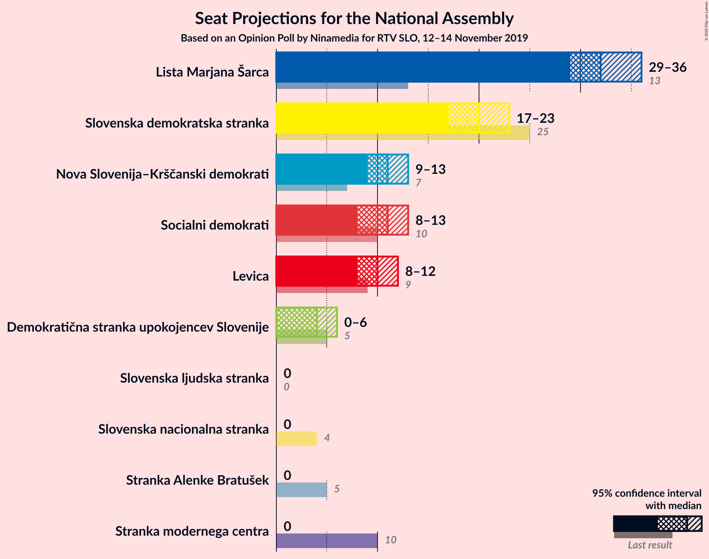
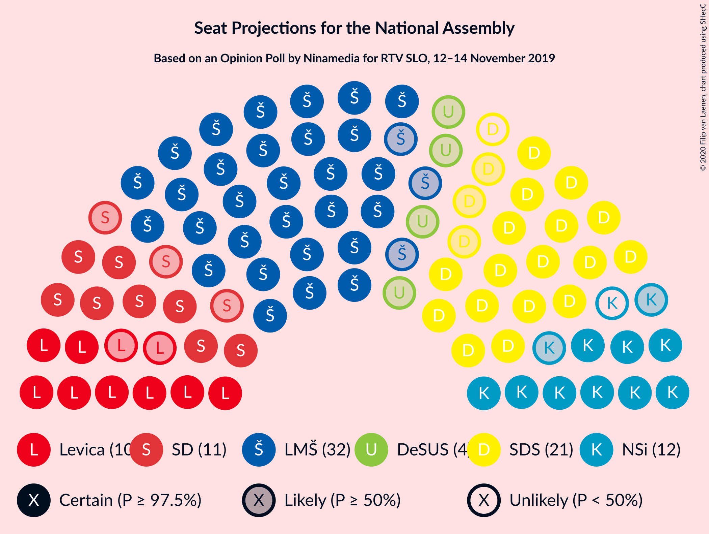
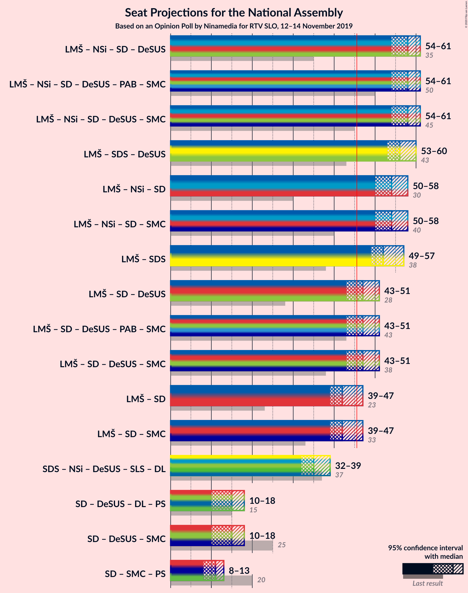
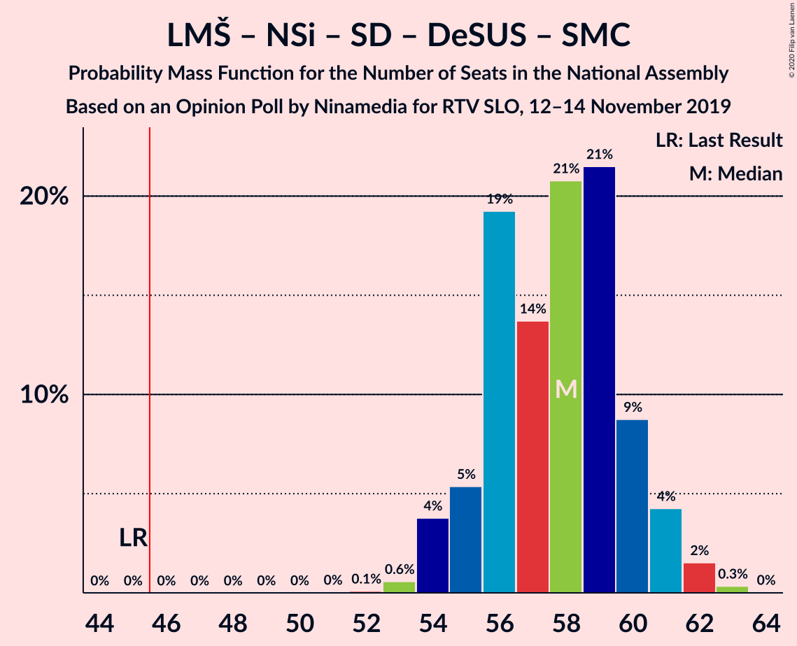
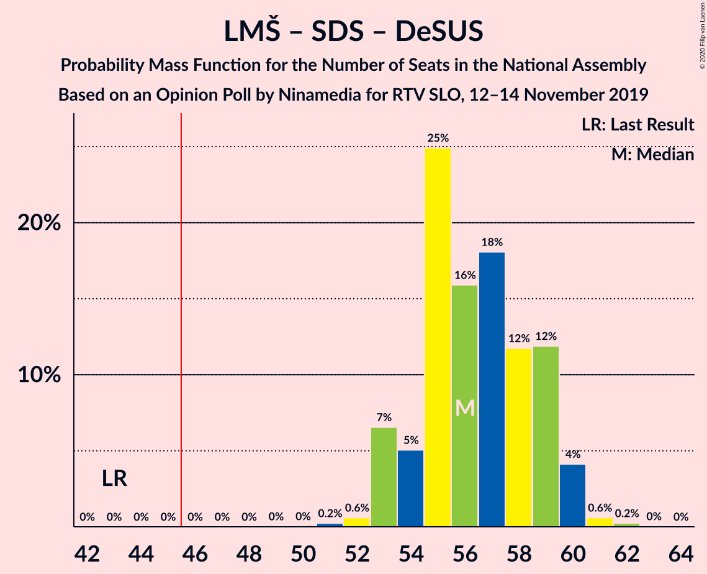
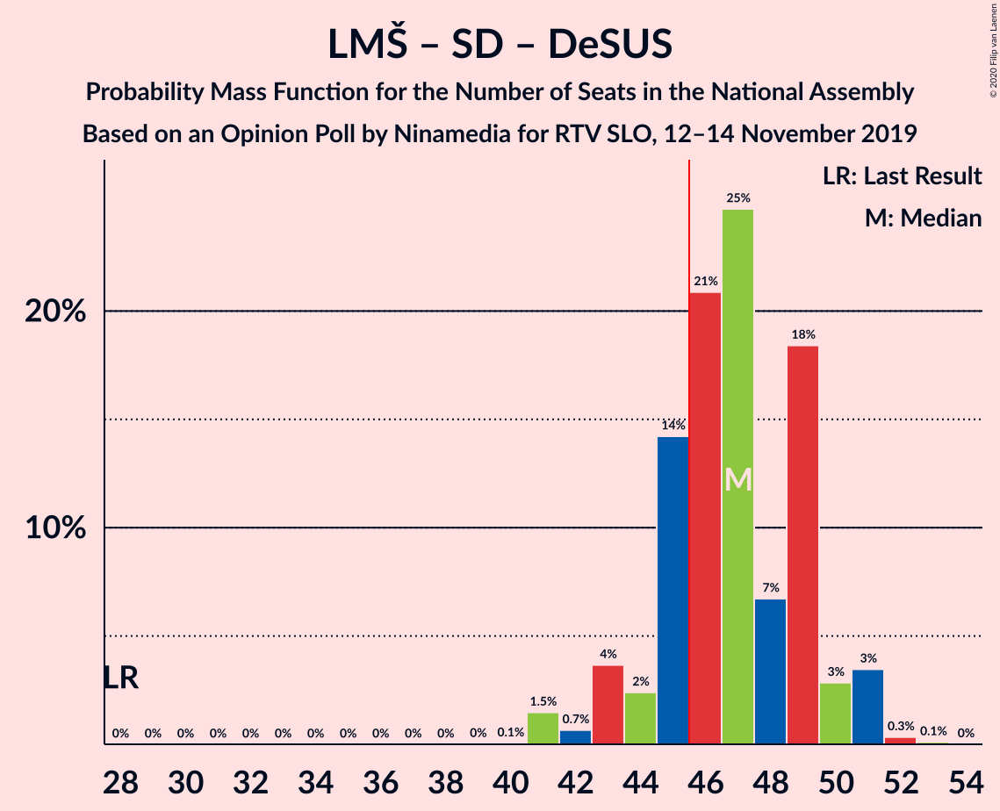
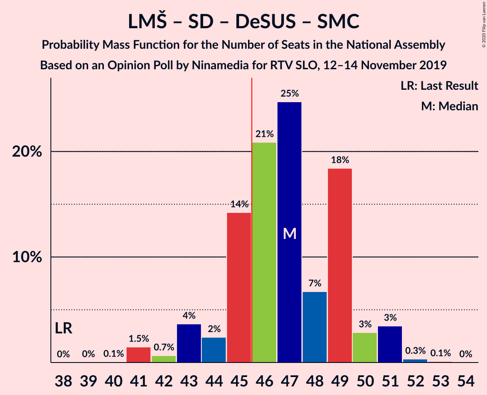
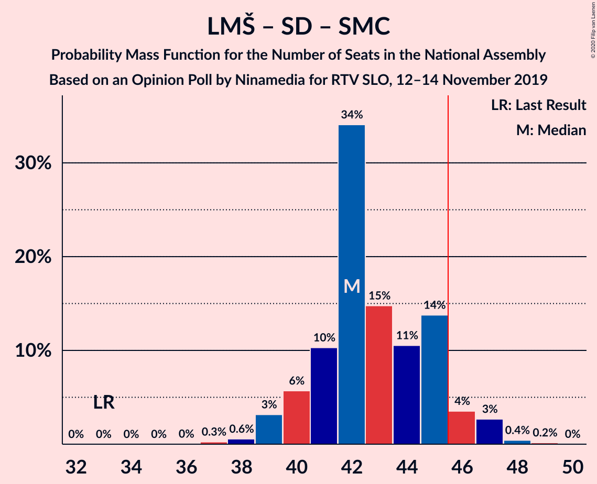

# Opinion Poll by Ninamedia for RTV SLO, 12–14 November 2019

<a href="#voting-intentions">Voting Intentions</a> | <a href="#seats">Seats</a> | <a href="#coalitions">Coalitions</a> | <a href="#technical-information">Technical Information</a>

## Voting Intentions

### Confidence Intervals

| Party | Last Result | Poll Result | 80% Confidence Interval | 90% Confidence Interval | 95% Confidence Interval | 99% Confidence Interval |
|:-----:|:-----------:|:-----------:|:-----------------------:|:-----------------------:|:-----------------------:|:-----------------------:|
| Lista Marjana Šarca | 12.6% | 33.1% | 30.9–35.5% |30.3–36.2% |29.8–36.7% |28.7–37.9% |
| Slovenska demokratska stranka | 24.9% | 21.0% | 19.1–23.1% |18.6–23.7% |18.1–24.2% |17.3–25.2% |
| Nova Slovenija–Krščanski demokrati | 7.2% | 11.6% | 10.2–13.3% |9.7–13.7% |9.4–14.2% |8.8–15.0% |
| Socialni demokrati | 9.9% | 11.0% | 9.6–12.7% |9.2–13.1% |8.9–13.5% |8.3–14.4% |
| Levica | 9.3% | 10.1% | 8.8–11.8% |8.4–12.2% |8.1–12.6% |7.5–13.4% |
| Demokratična stranka upokojencev Slovenije | 4.9% | 5.0% | 4.1–6.2% |3.8–6.6% |3.6–6.9% |3.2–7.5% |
| Slovenska ljudska stranka | 2.6% | 2.6% | 2.0–3.5% |1.8–3.8% |1.6–4.0% |1.4–4.5% |
| Slovenska nacionalna stranka | 4.2% | 1.7% | 1.2–2.5% |1.1–2.8% |1.0–3.0% |0.8–3.4% |
| Stranka Alenke Bratušek | 5.1% | 1.4% | 1.0–2.2% |0.9–2.4% |0.8–2.6% |0.6–3.0% |
| Stranka modernega centra | 9.7% | 0.9% | 0.5–1.5% |0.5–1.7% |0.4–1.9% |0.3–2.2% |

*Note:* The poll result column reflects the actual value used in the calculations. Published results may vary slightly, and in addition be rounded to fewer digits.

## Seats

### Confidence Intervals

| Party | Last Result | Median | 80% Confidence Interval | 90% Confidence Interval | 95% Confidence Interval | 99% Confidence Interval |
|:-----:|:-----------:|:------:|:-----------------------:|:-----------------------:|:-----------------------:|:-----------------------:|
| <a href="#lista-marjana-šarca">Lista Marjana Šarca</a> | 13 | 32 | 30–35 |30–37 |29–37 |28–37 |
| <a href="#slovenska-demokratska-stranka">Slovenska demokratska stranka</a> | 25 | 20 | 18–22 |18–23 |17–23 |17–24 |
| <a href="#nova-slovenija–krščanski-demokrati">Nova Slovenija–Krščanski demokrati</a> | 7 | 10 | 9–13 |9–13 |9–13 |8–14 |
| <a href="#socialni-demokrati">Socialni demokrati</a> | 10 | 11 | 9–12 |8–12 |8–12 |8–13 |
| <a href="#levica">Levica</a> | 9 | 10 | 9–11 |8–11 |8–11 |7–13 |
| <a href="#demokratična-stranka-upokojencev-slovenije">Demokratična stranka upokojencev Slovenije</a> | 5 | 4 | 0–5 |0–6 |0–6 |0–7 |
| <a href="#slovenska-ljudska-stranka">Slovenska ljudska stranka</a> | 0 | 0 | 0 |0 |0 |0–4 |
| <a href="#slovenska-nacionalna-stranka">Slovenska nacionalna stranka</a> | 4 | 0 | 0 |0 |0 |0 |
| <a href="#stranka-alenke-bratušek">Stranka Alenke Bratušek</a> | 5 | 0 | 0 |0 |0 |0 |
| <a href="#stranka-modernega-centra">Stranka modernega centra</a> | 10 | 0 | 0 |0 |0 |0 |

### Lista Marjana Šarca

*For a full overview of the results for this party, see the [Lista Marjana Šarca](party-listamarjanašarca.html) page.*

| Number of Seats | Probability | Accumulated | Special Marks |
|:---------------:|:-----------:|:-----------:|:-------------:|
| 13 | 0% | 100% | Last Result |
| 14 | 0% | 100% |  |
| 15 | 0% | 100% |  |
| 16 | 0% | 100% |  |
| 17 | 0% | 100% |  |
| 18 | 0% | 100% |  |
| 19 | 0% | 100% |  |
| 20 | 0% | 100% |  |
| 21 | 0% | 100% |  |
| 22 | 0% | 100% |  |
| 23 | 0% | 100% |  |
| 24 | 0% | 100% |  |
| 25 | 0% | 100% |  |
| 26 | 0% | 100% |  |
| 27 | 0.2% | 100% |  |
| 28 | 0.4% | 99.8% |  |
| 29 | 3% | 99.4% |  |
| 30 | 18% | 97% |  |
| 31 | 7% | 79% |  |
| 32 | 34% | 72% | Median |
| 33 | 19% | 38% |  |
| 34 | 2% | 20% |  |
| 35 | 11% | 18% |  |
| 36 | 1.5% | 7% |  |
| 37 | 5% | 5% |  |
| 38 | 0.1% | 0.1% |  |
| 39 | 0% | 0% |  |

### Slovenska demokratska stranka

*For a full overview of the results for this party, see the [Slovenska demokratska stranka](party-slovenskademokratskastranka.html) page.*

| Number of Seats | Probability | Accumulated | Special Marks |
|:---------------:|:-----------:|:-----------:|:-------------:|
| 16 | 0.2% | 100% |  |
| 17 | 3% | 99.7% |  |
| 18 | 11% | 97% |  |
| 19 | 30% | 86% |  |
| 20 | 25% | 56% | Median |
| 21 | 11% | 31% |  |
| 22 | 14% | 20% |  |
| 23 | 6% | 7% |  |
| 24 | 0.8% | 1.2% |  |
| 25 | 0.3% | 0.4% | Last Result |
| 26 | 0.1% | 0.1% |  |
| 27 | 0% | 0% |  |

### Nova Slovenija–Krščanski demokrati

*For a full overview of the results for this party, see the [Nova Slovenija–Krščanski demokrati](party-novaslovenija–krščanskidemokrati.html) page.*

| Number of Seats | Probability | Accumulated | Special Marks |
|:---------------:|:-----------:|:-----------:|:-------------:|
| 7 | 0.1% | 100% | Last Result |
| 8 | 1.0% | 99.9% |  |
| 9 | 24% | 98.9% |  |
| 10 | 28% | 75% | Median |
| 11 | 18% | 46% |  |
| 12 | 18% | 28% |  |
| 13 | 9% | 10% |  |
| 14 | 1.4% | 2% |  |
| 15 | 0.2% | 0.3% |  |
| 16 | 0.1% | 0.1% |  |
| 17 | 0% | 0% |  |

### Socialni demokrati

*For a full overview of the results for this party, see the [Socialni demokrati](party-socialnidemokrati.html) page.*

| Number of Seats | Probability | Accumulated | Special Marks |
|:---------------:|:-----------:|:-----------:|:-------------:|
| 7 | 0.4% | 100% |  |
| 8 | 6% | 99.6% |  |
| 9 | 17% | 94% |  |
| 10 | 19% | 77% | Last Result |
| 11 | 20% | 58% | Median |
| 12 | 36% | 38% |  |
| 13 | 0.7% | 1.1% |  |
| 14 | 0.3% | 0.4% |  |
| 15 | 0.1% | 0.1% |  |
| 16 | 0% | 0% |  |

### Levica

*For a full overview of the results for this party, see the [Levica](party-levica.html) page.*

| Number of Seats | Probability | Accumulated | Special Marks |
|:---------------:|:-----------:|:-----------:|:-------------:|
| 6 | 0.2% | 100% |  |
| 7 | 1.3% | 99.8% |  |
| 8 | 7% | 98.5% |  |
| 9 | 17% | 92% | Last Result |
| 10 | 26% | 75% | Median |
| 11 | 47% | 49% |  |
| 12 | 2% | 2% |  |
| 13 | 0.5% | 0.6% |  |
| 14 | 0.1% | 0.1% |  |
| 15 | 0% | 0% |  |

### Demokratična stranka upokojencev Slovenije

*For a full overview of the results for this party, see the [Demokratična stranka upokojencev Slovenije](party-demokratičnastrankaupokojencevslovenije.html) page.*

| Number of Seats | Probability | Accumulated | Special Marks |
|:---------------:|:-----------:|:-----------:|:-------------:|
| 0 | 10% | 100% |  |
| 1 | 0% | 90% |  |
| 2 | 0% | 90% |  |
| 3 | 0.1% | 90% |  |
| 4 | 41% | 89% | Median |
| 5 | 41% | 48% | Last Result |
| 6 | 6% | 8% |  |
| 7 | 1.3% | 1.4% |  |
| 8 | 0.1% | 0.1% |  |
| 9 | 0% | 0% |  |

### Slovenska ljudska stranka

*For a full overview of the results for this party, see the [Slovenska ljudska stranka](party-slovenskaljudskastranka.html) page.*

| Number of Seats | Probability | Accumulated | Special Marks |
|:---------------:|:-----------:|:-----------:|:-------------:|
| 0 | 98% | 100% | Last Result, Median |
| 1 | 0% | 2% |  |
| 2 | 0% | 2% |  |
| 3 | 0.2% | 2% |  |
| 4 | 2% | 2% |  |
| 5 | 0.1% | 0.1% |  |
| 6 | 0% | 0% |  |

### Slovenska nacionalna stranka

*For a full overview of the results for this party, see the [Slovenska nacionalna stranka](party-slovenskanacionalnastranka.html) page.*

| Number of Seats | Probability | Accumulated | Special Marks |
|:---------------:|:-----------:|:-----------:|:-------------:|
| 0 | 100% | 100% | Median |
| 1 | 0% | 0% |  |
| 2 | 0% | 0% |  |
| 3 | 0% | 0% |  |
| 4 | 0% | 0% | Last Result |

### Stranka Alenke Bratušek

*For a full overview of the results for this party, see the [Stranka Alenke Bratušek](party-strankaalenkebratušek.html) page.*

| Number of Seats | Probability | Accumulated | Special Marks |
|:---------------:|:-----------:|:-----------:|:-------------:|
| 0 | 100% | 100% | Median |
| 1 | 0% | 0% |  |
| 2 | 0% | 0% |  |
| 3 | 0% | 0% |  |
| 4 | 0% | 0% |  |
| 5 | 0% | 0% | Last Result |

### Stranka modernega centra

*For a full overview of the results for this party, see the [Stranka modernega centra](party-strankamodernegacentra.html) page.*

| Number of Seats | Probability | Accumulated | Special Marks |
|:---------------:|:-----------:|:-----------:|:-------------:|
| 0 | 100% | 100% | Median |
| 1 | 0% | 0% |  |
| 2 | 0% | 0% |  |
| 3 | 0% | 0% |  |
| 4 | 0% | 0% |  |
| 5 | 0% | 0% |  |
| 6 | 0% | 0% |  |
| 7 | 0% | 0% |  |
| 8 | 0% | 0% |  |
| 9 | 0% | 0% |  |
| 10 | 0% | 0% | Last Result |

## Coalitions

### Confidence Intervals

| Coalition | Last Result | Median | Majority? | 80% Confidence Interval | 90% Confidence Interval | 95% Confidence Interval | 99% Confidence Interval |
|:---------:|:-----------:|:------:|:---------:|:-----------------------:|:-----------------------:|:-----------------------:|:-----------------------:|
| Lista Marjana Šarca – Nova Slovenija–Krščanski demokrati – Socialni demokrati – Demokratična stranka upokojencev Slovenije | 35 | 58 | 100% | 55–60 | 55–61 | 54–61 | 53–62 |
| Lista Marjana Šarca – Nova Slovenija–Krščanski demokrati – Socialni demokrati – Demokratična stranka upokojencev Slovenije – Stranka Alenke Bratušek – Stranka modernega centra | 50 | 58 | 100% | 55–60 | 55–61 | 54–61 | 53–62 |
| Lista Marjana Šarca – Nova Slovenija–Krščanski demokrati – Socialni demokrati – Demokratična stranka upokojencev Slovenije – Stranka modernega centra | 45 | 58 | 100% | 55–60 | 55–61 | 54–61 | 53–62 |
| Lista Marjana Šarca – Slovenska demokratska stranka – Demokratična stranka upokojencev Slovenije | 43 | 56 | 100% | 53–59 | 53–60 | 53–60 | 52–61 |
| Lista Marjana Šarca – Nova Slovenija–Krščanski demokrati – Socialni demokrati | 30 | 53 | 100% | 52–56 | 51–57 | 50–58 | 50–59 |
| Lista Marjana Šarca – Nova Slovenija–Krščanski demokrati – Socialni demokrati – Stranka modernega centra | 40 | 53 | 100% | 52–56 | 51–57 | 50–58 | 50–59 |
| Lista Marjana Šarca – Slovenska demokratska stranka | 38 | 52 | 100% | 49–55 | 49–57 | 49–57 | 48–57 |
| Lista Marjana Šarca – Socialni demokrati – Demokratična stranka upokojencev Slovenije | 28 | 47 | 82% | 45–50 | 43–51 | 43–51 | 41–51 |
| Lista Marjana Šarca – Socialni demokrati – Demokratična stranka upokojencev Slovenije – Stranka Alenke Bratušek – Stranka modernega centra | 43 | 47 | 82% | 45–50 | 43–51 | 43–51 | 41–51 |
| Lista Marjana Šarca – Socialni demokrati – Demokratična stranka upokojencev Slovenije – Stranka modernega centra | 38 | 47 | 82% | 45–50 | 43–51 | 43–51 | 41–51 |
| Lista Marjana Šarca – Socialni demokrati | 23 | 43 | 12% | 41–46 | 40–47 | 39–47 | 38–47 |
| Lista Marjana Šarca – Socialni demokrati – Stranka modernega centra | 33 | 43 | 12% | 41–46 | 40–47 | 39–47 | 38–47 |
| Socialni demokrati – Demokratična stranka upokojencev Slovenije – Stranka modernega centra | 25 | 15 | 0% | 12–17 | 10–17 | 10–17 | 10–19 |

### Lista Marjana Šarca – Nova Slovenija–Krščanski demokrati – Socialni demokrati – Demokratična stranka upokojencev Slovenije

| Number of Seats | Probability | Accumulated | Special Marks |
|:---------------:|:-----------:|:-----------:|:-------------:|
| 35 | 0% | 100% | Last Result |
| 36 | 0% | 100% |  |
| 37 | 0% | 100% |  |
| 38 | 0% | 100% |  |
| 39 | 0% | 100% |  |
| 40 | 0% | 100% |  |
| 41 | 0% | 100% |  |
| 42 | 0% | 100% |  |
| 43 | 0% | 100% |  |
| 44 | 0% | 100% |  |
| 45 | 0% | 100% |  |
| 46 | 0% | 100% | Majority |
| 47 | 0% | 100% |  |
| 48 | 0% | 100% |  |
| 49 | 0% | 100% |  |
| 50 | 0% | 100% |  |
| 51 | 0.1% | 100% |  |
| 52 | 0.1% | 99.9% |  |
| 53 | 0.4% | 99.8% |  |
| 54 | 2% | 99.5% |  |
| 55 | 9% | 97% |  |
| 56 | 4% | 89% |  |
| 57 | 24% | 84% | Median |
| 58 | 37% | 61% |  |
| 59 | 9% | 24% |  |
| 60 | 8% | 15% |  |
| 61 | 5% | 7% |  |
| 62 | 1.3% | 2% |  |
| 63 | 0.3% | 0.3% |  |
| 64 | 0% | 0% |  |

### Lista Marjana Šarca – Nova Slovenija–Krščanski demokrati – Socialni demokrati – Demokratična stranka upokojencev Slovenije – Stranka Alenke Bratušek – Stranka modernega centra

| Number of Seats | Probability | Accumulated | Special Marks |
|:---------------:|:-----------:|:-----------:|:-------------:|
| 50 | 0% | 100% | Last Result |
| 51 | 0.1% | 100% |  |
| 52 | 0.1% | 99.9% |  |
| 53 | 0.4% | 99.8% |  |
| 54 | 2% | 99.5% |  |
| 55 | 9% | 97% |  |
| 56 | 4% | 89% |  |
| 57 | 24% | 84% | Median |
| 58 | 37% | 61% |  |
| 59 | 9% | 24% |  |
| 60 | 8% | 15% |  |
| 61 | 5% | 7% |  |
| 62 | 1.3% | 2% |  |
| 63 | 0.3% | 0.3% |  |
| 64 | 0% | 0% |  |

### Lista Marjana Šarca – Nova Slovenija–Krščanski demokrati – Socialni demokrati – Demokratična stranka upokojencev Slovenije – Stranka modernega centra

| Number of Seats | Probability | Accumulated | Special Marks |
|:---------------:|:-----------:|:-----------:|:-------------:|
| 45 | 0% | 100% | Last Result |
| 46 | 0% | 100% | Majority |
| 47 | 0% | 100% |  |
| 48 | 0% | 100% |  |
| 49 | 0% | 100% |  |
| 50 | 0% | 100% |  |
| 51 | 0.1% | 100% |  |
| 52 | 0.1% | 99.9% |  |
| 53 | 0.4% | 99.8% |  |
| 54 | 2% | 99.5% |  |
| 55 | 9% | 97% |  |
| 56 | 4% | 89% |  |
| 57 | 24% | 84% | Median |
| 58 | 37% | 61% |  |
| 59 | 9% | 24% |  |
| 60 | 8% | 15% |  |
| 61 | 5% | 7% |  |
| 62 | 1.3% | 2% |  |
| 63 | 0.3% | 0.3% |  |
| 64 | 0% | 0% |  |

### Lista Marjana Šarca – Slovenska demokratska stranka – Demokratična stranka upokojencev Slovenije

| Number of Seats | Probability | Accumulated | Special Marks |
|:---------------:|:-----------:|:-----------:|:-------------:|
| 43 | 0% | 100% | Last Result |
| 44 | 0% | 100% |  |
| 45 | 0% | 100% |  |
| 46 | 0% | 100% | Majority |
| 47 | 0% | 100% |  |
| 48 | 0% | 100% |  |
| 49 | 0.1% | 100% |  |
| 50 | 0% | 99.9% |  |
| 51 | 0.3% | 99.9% |  |
| 52 | 0.4% | 99.6% |  |
| 53 | 11% | 99.2% |  |
| 54 | 3% | 88% |  |
| 55 | 2% | 85% |  |
| 56 | 39% | 83% | Median |
| 57 | 12% | 44% |  |
| 58 | 19% | 31% |  |
| 59 | 7% | 13% |  |
| 60 | 4% | 5% |  |
| 61 | 1.1% | 1.4% |  |
| 62 | 0.2% | 0.2% |  |
| 63 | 0.1% | 0.1% |  |
| 64 | 0% | 0% |  |

### Lista Marjana Šarca – Nova Slovenija–Krščanski demokrati – Socialni demokrati

| Number of Seats | Probability | Accumulated | Special Marks |
|:---------------:|:-----------:|:-----------:|:-------------:|
| 30 | 0% | 100% | Last Result |
| 31 | 0% | 100% |  |
| 32 | 0% | 100% |  |
| 33 | 0% | 100% |  |
| 34 | 0% | 100% |  |
| 35 | 0% | 100% |  |
| 36 | 0% | 100% |  |
| 37 | 0% | 100% |  |
| 38 | 0% | 100% |  |
| 39 | 0% | 100% |  |
| 40 | 0% | 100% |  |
| 41 | 0% | 100% |  |
| 42 | 0% | 100% |  |
| 43 | 0% | 100% |  |
| 44 | 0% | 100% |  |
| 45 | 0% | 100% |  |
| 46 | 0% | 100% | Majority |
| 47 | 0.1% | 100% |  |
| 48 | 0.1% | 99.9% |  |
| 49 | 0.3% | 99.8% |  |
| 50 | 4% | 99.5% |  |
| 51 | 2% | 95% |  |
| 52 | 9% | 93% |  |
| 53 | 44% | 84% | Median |
| 54 | 15% | 40% |  |
| 55 | 12% | 24% |  |
| 56 | 3% | 12% |  |
| 57 | 6% | 9% |  |
| 58 | 1.4% | 3% |  |
| 59 | 2% | 2% |  |
| 60 | 0.1% | 0.1% |  |
| 61 | 0% | 0% |  |

### Lista Marjana Šarca – Nova Slovenija–Krščanski demokrati – Socialni demokrati – Stranka modernega centra

| Number of Seats | Probability | Accumulated | Special Marks |
|:---------------:|:-----------:|:-----------:|:-------------:|
| 40 | 0% | 100% | Last Result |
| 41 | 0% | 100% |  |
| 42 | 0% | 100% |  |
| 43 | 0% | 100% |  |
| 44 | 0% | 100% |  |
| 45 | 0% | 100% |  |
| 46 | 0% | 100% | Majority |
| 47 | 0.1% | 100% |  |
| 48 | 0.1% | 99.9% |  |
| 49 | 0.3% | 99.8% |  |
| 50 | 4% | 99.5% |  |
| 51 | 2% | 95% |  |
| 52 | 9% | 93% |  |
| 53 | 44% | 84% | Median |
| 54 | 15% | 40% |  |
| 55 | 12% | 24% |  |
| 56 | 3% | 12% |  |
| 57 | 6% | 9% |  |
| 58 | 1.4% | 3% |  |
| 59 | 2% | 2% |  |
| 60 | 0.1% | 0.1% |  |
| 61 | 0% | 0% |  |

### Lista Marjana Šarca – Slovenska demokratska stranka

| Number of Seats | Probability | Accumulated | Special Marks |
|:---------------:|:-----------:|:-----------:|:-------------:|
| 38 | 0% | 100% | Last Result |
| 39 | 0% | 100% |  |
| 40 | 0% | 100% |  |
| 41 | 0% | 100% |  |
| 42 | 0% | 100% |  |
| 43 | 0% | 100% |  |
| 44 | 0% | 100% |  |
| 45 | 0% | 100% |  |
| 46 | 0% | 100% | Majority |
| 47 | 0.3% | 99.9% |  |
| 48 | 0.3% | 99.6% |  |
| 49 | 13% | 99.4% |  |
| 50 | 5% | 87% |  |
| 51 | 19% | 82% |  |
| 52 | 19% | 63% | Median |
| 53 | 19% | 44% |  |
| 54 | 7% | 24% |  |
| 55 | 7% | 17% |  |
| 56 | 3% | 10% |  |
| 57 | 6% | 7% |  |
| 58 | 0.4% | 0.5% |  |
| 59 | 0.1% | 0.1% |  |
| 60 | 0% | 0% |  |

### Lista Marjana Šarca – Socialni demokrati – Demokratična stranka upokojencev Slovenije

| Number of Seats | Probability | Accumulated | Special Marks |
|:---------------:|:-----------:|:-----------:|:-------------:|
| 28 | 0% | 100% | Last Result |
| 29 | 0% | 100% |  |
| 30 | 0% | 100% |  |
| 31 | 0% | 100% |  |
| 32 | 0% | 100% |  |
| 33 | 0% | 100% |  |
| 34 | 0% | 100% |  |
| 35 | 0% | 100% |  |
| 36 | 0% | 100% |  |
| 37 | 0% | 100% |  |
| 38 | 0% | 100% |  |
| 39 | 0% | 100% |  |
| 40 | 0.2% | 100% |  |
| 41 | 0.7% | 99.8% |  |
| 42 | 0.5% | 99.1% |  |
| 43 | 4% | 98.6% |  |
| 44 | 0.9% | 95% |  |
| 45 | 11% | 94% |  |
| 46 | 17% | 82% | Majority |
| 47 | 32% | 66% | Median |
| 48 | 4% | 34% |  |
| 49 | 18% | 30% |  |
| 50 | 3% | 11% |  |
| 51 | 8% | 8% |  |
| 52 | 0.2% | 0.4% |  |
| 53 | 0.2% | 0.2% |  |
| 54 | 0% | 0% |  |

### Lista Marjana Šarca – Socialni demokrati – Demokratična stranka upokojencev Slovenije – Stranka Alenke Bratušek – Stranka modernega centra

| Number of Seats | Probability | Accumulated | Special Marks |
|:---------------:|:-----------:|:-----------:|:-------------:|
| 40 | 0.2% | 100% |  |
| 41 | 0.7% | 99.8% |  |
| 42 | 0.5% | 99.1% |  |
| 43 | 4% | 98.6% | Last Result |
| 44 | 0.9% | 95% |  |
| 45 | 11% | 94% |  |
| 46 | 17% | 82% | Majority |
| 47 | 32% | 66% | Median |
| 48 | 4% | 34% |  |
| 49 | 18% | 30% |  |
| 50 | 3% | 11% |  |
| 51 | 8% | 8% |  |
| 52 | 0.2% | 0.4% |  |
| 53 | 0.2% | 0.2% |  |
| 54 | 0% | 0% |  |

### Lista Marjana Šarca – Socialni demokrati – Demokratična stranka upokojencev Slovenije – Stranka modernega centra

| Number of Seats | Probability | Accumulated | Special Marks |
|:---------------:|:-----------:|:-----------:|:-------------:|
| 38 | 0% | 100% | Last Result |
| 39 | 0% | 100% |  |
| 40 | 0.2% | 100% |  |
| 41 | 0.7% | 99.8% |  |
| 42 | 0.5% | 99.1% |  |
| 43 | 4% | 98.6% |  |
| 44 | 0.9% | 95% |  |
| 45 | 11% | 94% |  |
| 46 | 17% | 82% | Majority |
| 47 | 32% | 66% | Median |
| 48 | 4% | 34% |  |
| 49 | 18% | 30% |  |
| 50 | 3% | 11% |  |
| 51 | 8% | 8% |  |
| 52 | 0.2% | 0.4% |  |
| 53 | 0.2% | 0.2% |  |
| 54 | 0% | 0% |  |

### Lista Marjana Šarca – Socialni demokrati

| Number of Seats | Probability | Accumulated | Special Marks |
|:---------------:|:-----------:|:-----------:|:-------------:|
| 23 | 0% | 100% | Last Result |
| 24 | 0% | 100% |  |
| 25 | 0% | 100% |  |
| 26 | 0% | 100% |  |
| 27 | 0% | 100% |  |
| 28 | 0% | 100% |  |
| 29 | 0% | 100% |  |
| 30 | 0% | 100% |  |
| 31 | 0% | 100% |  |
| 32 | 0% | 100% |  |
| 33 | 0% | 100% |  |
| 34 | 0% | 100% |  |
| 35 | 0% | 100% |  |
| 36 | 0% | 100% |  |
| 37 | 0.2% | 100% |  |
| 38 | 0.4% | 99.8% |  |
| 39 | 4% | 99.4% |  |
| 40 | 4% | 95% |  |
| 41 | 8% | 91% |  |
| 42 | 27% | 83% |  |
| 43 | 17% | 56% | Median |
| 44 | 18% | 38% |  |
| 45 | 9% | 21% |  |
| 46 | 5% | 12% | Majority |
| 47 | 6% | 7% |  |
| 48 | 0.1% | 0.3% |  |
| 49 | 0.3% | 0.3% |  |
| 50 | 0% | 0% |  |

### Lista Marjana Šarca – Socialni demokrati – Stranka modernega centra

| Number of Seats | Probability | Accumulated | Special Marks |
|:---------------:|:-----------:|:-----------:|:-------------:|
| 33 | 0% | 100% | Last Result |
| 34 | 0% | 100% |  |
| 35 | 0% | 100% |  |
| 36 | 0% | 100% |  |
| 37 | 0.2% | 100% |  |
| 38 | 0.4% | 99.8% |  |
| 39 | 4% | 99.4% |  |
| 40 | 4% | 95% |  |
| 41 | 8% | 91% |  |
| 42 | 27% | 83% |  |
| 43 | 17% | 56% | Median |
| 44 | 18% | 38% |  |
| 45 | 9% | 21% |  |
| 46 | 5% | 12% | Majority |
| 47 | 6% | 7% |  |
| 48 | 0.1% | 0.3% |  |
| 49 | 0.3% | 0.3% |  |
| 50 | 0% | 0% |  |

### Socialni demokrati – Demokratična stranka upokojencev Slovenije – Stranka modernega centra

| Number of Seats | Probability | Accumulated | Special Marks |
|:---------------:|:-----------:|:-----------:|:-------------:|
| 8 | 0% | 100% |  |
| 9 | 0.3% | 99.9% |  |
| 10 | 7% | 99.6% |  |
| 11 | 1.3% | 93% |  |
| 12 | 7% | 92% |  |
| 13 | 3% | 85% |  |
| 14 | 19% | 82% |  |
| 15 | 19% | 63% | Median |
| 16 | 22% | 44% |  |
| 17 | 21% | 22% |  |
| 18 | 0.7% | 1.2% |  |
| 19 | 0.4% | 0.5% |  |
| 20 | 0.1% | 0.2% |  |
| 21 | 0% | 0% |  |
| 22 | 0% | 0% |  |
| 23 | 0% | 0% |  |
| 24 | 0% | 0% |  |
| 25 | 0% | 0% | Last Result |

## Technical Information

### Opinion Poll

+ **Polling firm:** Ninamedia
+ **Commissioner(s):** RTV SLO
+ **Fieldwork period:** 12–14 November 2019

### Calculations

+ **Sample size:** 700
+ **Simulations done:** 262,144
+ **Error estimate:** 2.87%

