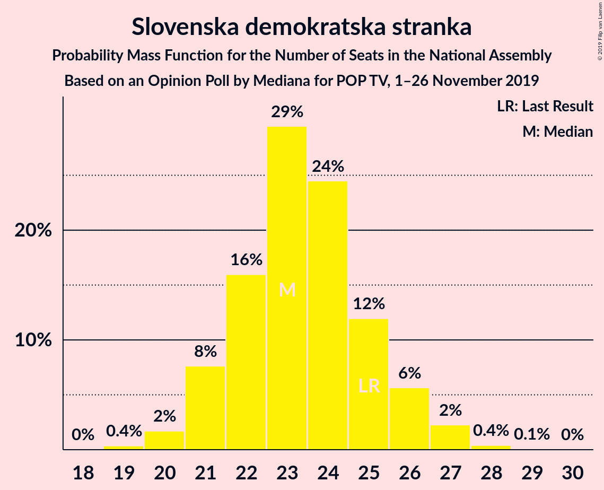
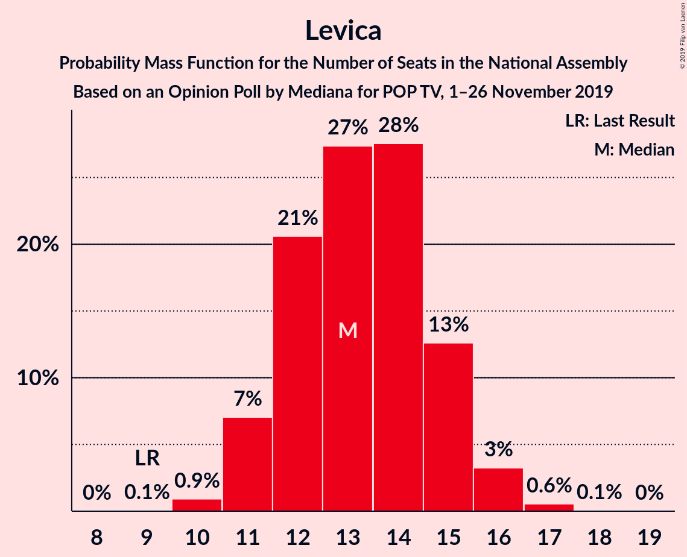
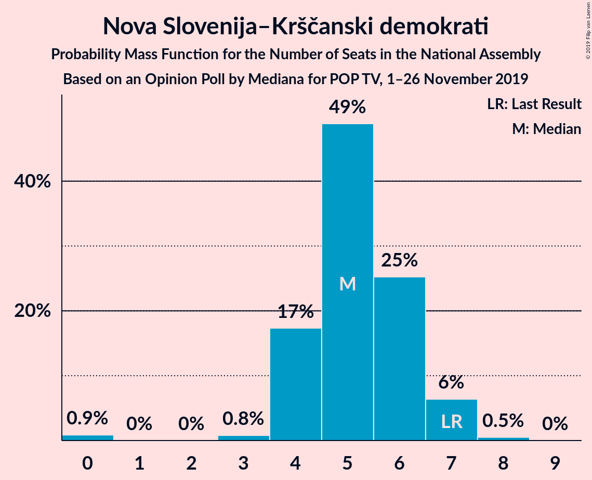
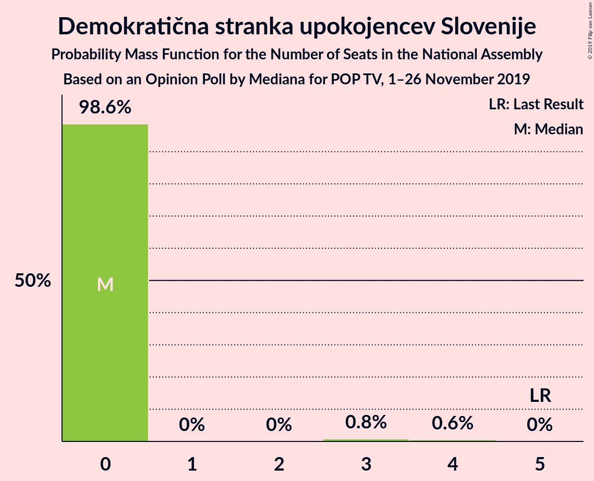
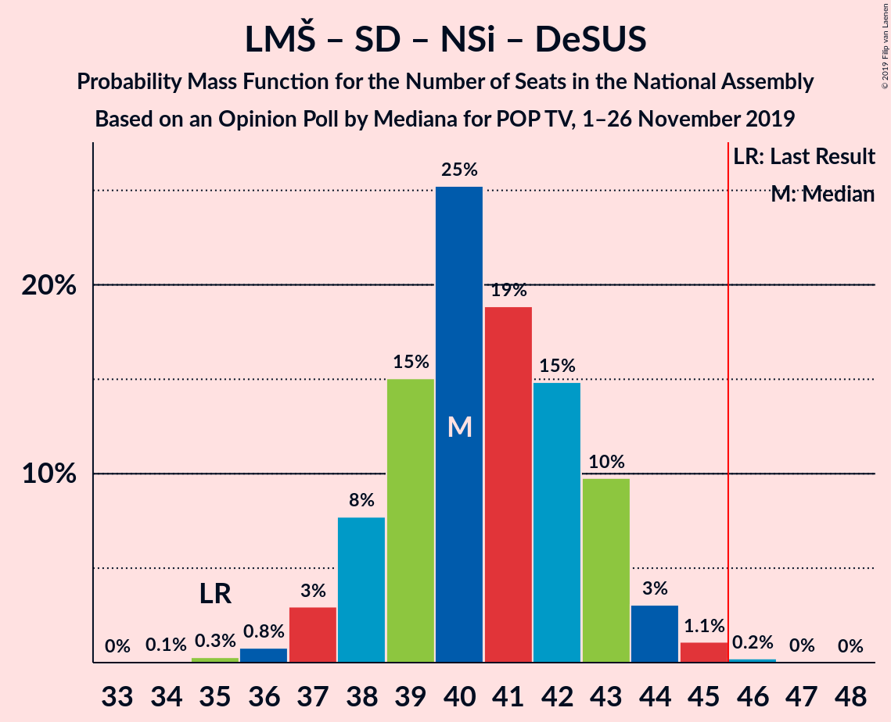

# Opinion Poll by Mediana for POP TV, 1–26 November 2019

<a href="#voting-intentions">Voting Intentions</a> | <a href="#seats">Seats</a> | <a href="#coalitions">Coalitions</a> | <a href="#technical-information">Technical Information</a>

## Voting Intentions

### Confidence Intervals

| Party | Last Result | Poll Result | 80% Confidence Interval | 90% Confidence Interval | 95% Confidence Interval | 99% Confidence Interval |
|:-----:|:-----------:|:-----------:|:-----------------------:|:-----------------------:|:-----------------------:|:-----------------------:|
| Slovenska demokratska stranka | 24.9% | 25.1% | 23.2–27.3% |22.6–27.9% |22.1–28.4% |21.2–29.5% |
| Lista Marjana Šarca | 12.6% | 22.5% | 20.7–24.6% |20.1–25.2% |19.7–25.7% |18.8–26.7% |
| Socialni demokrati | 9.9% | 15.4% | 13.8–17.3% |13.4–17.8% |13.0–18.2% |12.3–19.1% |
| Levica | 9.3% | 14.3% | 12.8–16.1% |12.4–16.6% |12.0–17.1% |11.3–18.0% |
| Nova Slovenija–Krščanski demokrati | 7.2% | 5.9% | 4.9–7.1% |4.6–7.5% |4.4–7.8% |4.0–8.5% |
| Slovenska nacionalna stranka | 4.2% | 5.9% | 4.9–7.1% |4.6–7.5% |4.4–7.8% |4.0–8.5% |
| Demokratična stranka upokojencev Slovenije | 4.9% | 2.5% | 1.9–3.4% |1.7–3.6% |1.6–3.9% |1.3–4.3% |
| Stranka Alenke Bratušek | 5.1% | 2.0% | 1.5–2.9% |1.4–3.1% |1.2–3.4% |1.0–3.8% |

*Note:* The poll result column reflects the actual value used in the calculations. Published results may vary slightly, and in addition be rounded to fewer digits.

## Seats

### Confidence Intervals

| Party | Last Result | Median | 80% Confidence Interval | 90% Confidence Interval | 95% Confidence Interval | 99% Confidence Interval |
|:-----:|:-----------:|:------:|:-----------------------:|:-----------------------:|:-----------------------:|:-----------------------:|
| <a href="#slovenska-demokratska-stranka">Slovenska demokratska stranka</a> | 25 | 24 | 24–25 |23–25 |23–25 |23–26 |
| <a href="#lista-marjana-šarca">Lista Marjana Šarca</a> | 13 | 21 | 20–22 |20–22 |20–22 |18–22 |
| <a href="#socialni-demokrati">Socialni demokrati</a> | 10 | 14 | 10–14 |10–14 |10–15 |9–20 |
| <a href="#levica">Levica</a> | 9 | 12 | 10–14 |10–14 |10–16 |10–16 |
| <a href="#nova-slovenija–krščanski-demokrati">Nova Slovenija–Krščanski demokrati</a> | 7 | 5 | 4–6 |4–6 |4–7 |4–7 |
| <a href="#slovenska-nacionalna-stranka">Slovenska nacionalna stranka</a> | 4 | 6 | 6–7 |6–7 |6–7 |5–7 |
| <a href="#demokratična-stranka-upokojencev-slovenije">Demokratična stranka upokojencev Slovenije</a> | 5 | 0 | 0 |0 |0 |0 |
| <a href="#stranka-alenke-bratušek">Stranka Alenke Bratušek</a> | 5 | 0 | 0 |0 |0 |0 |

### Slovenska demokratska stranka

*For a full overview of the results for this party, see the [Slovenska demokratska stranka](party-slovenskademokratskastranka.html) page.*

| Number of Seats | Probability | Accumulated | Special Marks |
|:---------------:|:-----------:|:-----------:|:-------------:|
| 22 | 0.1% | 100% |  |
| 23 | 10% | 99.8% |  |
| 24 | 72% | 90% | Median |
| 25 | 18% | 18% | Last Result |
| 26 | 0.6% | 0.6% |  |
| 27 | 0% | 0% |  |

### Lista Marjana Šarca

*For a full overview of the results for this party, see the [Lista Marjana Šarca](party-listamarjanašarca.html) page.*

| Number of Seats | Probability | Accumulated | Special Marks |
|:---------------:|:-----------:|:-----------:|:-------------:|
| 13 | 0% | 100% | Last Result |
| 14 | 0% | 100% |  |
| 15 | 0% | 100% |  |
| 16 | 0% | 100% |  |
| 17 | 0% | 100% |  |
| 18 | 2% | 100% |  |
| 19 | 0% | 98% |  |
| 20 | 10% | 98% |  |
| 21 | 75% | 88% | Median |
| 22 | 13% | 13% |  |
| 23 | 0% | 0% |  |

### Socialni demokrati

*For a full overview of the results for this party, see the [Socialni demokrati](party-socialnidemokrati.html) page.*

| Number of Seats | Probability | Accumulated | Special Marks |
|:---------------:|:-----------:|:-----------:|:-------------:|
| 9 | 1.0% | 100% |  |
| 10 | 9% | 99.0% | Last Result |
| 11 | 0% | 90% |  |
| 12 | 0% | 90% |  |
| 13 | 0% | 90% |  |
| 14 | 87% | 90% | Median |
| 15 | 1.2% | 3% |  |
| 16 | 0% | 2% |  |
| 17 | 0% | 2% |  |
| 18 | 0% | 2% |  |
| 19 | 0% | 2% |  |
| 20 | 2% | 2% |  |
| 21 | 0% | 0% |  |

### Levica

*For a full overview of the results for this party, see the [Levica](party-levica.html) page.*

| Number of Seats | Probability | Accumulated | Special Marks |
|:---------------:|:-----------:|:-----------:|:-------------:|
| 9 | 0% | 100% | Last Result |
| 10 | 11% | 100% |  |
| 11 | 0.8% | 89% |  |
| 12 | 77% | 88% | Median |
| 13 | 1.3% | 11% |  |
| 14 | 7% | 10% |  |
| 15 | 0.8% | 3% |  |
| 16 | 3% | 3% |  |
| 17 | 0% | 0% |  |

### Nova Slovenija–Krščanski demokrati

*For a full overview of the results for this party, see the [Nova Slovenija–Krščanski demokrati](party-novaslovenija–krščanskidemokrati.html) page.*

| Number of Seats | Probability | Accumulated | Special Marks |
|:---------------:|:-----------:|:-----------:|:-------------:|
| 3 | 0.5% | 100% |  |
| 4 | 11% | 99.5% |  |
| 5 | 78% | 88% | Median |
| 6 | 7% | 10% |  |
| 7 | 3% | 3% | Last Result |
| 8 | 0% | 0% |  |

### Slovenska nacionalna stranka

*For a full overview of the results for this party, see the [Slovenska nacionalna stranka](party-slovenskanacionalnastranka.html) page.*

| Number of Seats | Probability | Accumulated | Special Marks |
|:---------------:|:-----------:|:-----------:|:-------------:|
| 4 | 0% | 100% | Last Result |
| 5 | 2% | 100% |  |
| 6 | 81% | 98% | Median |
| 7 | 17% | 17% |  |
| 8 | 0% | 0% |  |

### Demokratična stranka upokojencev Slovenije

*For a full overview of the results for this party, see the [Demokratična stranka upokojencev Slovenije](party-demokratičnastrankaupokojencevslovenije.html) page.*

| Number of Seats | Probability | Accumulated | Special Marks |
|:---------------:|:-----------:|:-----------:|:-------------:|
| 0 | 100% | 100% | Median |
| 1 | 0% | 0% |  |
| 2 | 0% | 0% |  |
| 3 | 0% | 0% |  |
| 4 | 0% | 0% |  |
| 5 | 0% | 0% | Last Result |

### Stranka Alenke Bratušek

*For a full overview of the results for this party, see the [Stranka Alenke Bratušek](party-strankaalenkebratušek.html) page.*

| Number of Seats | Probability | Accumulated | Special Marks |
|:---------------:|:-----------:|:-----------:|:-------------:|
| 0 | 100% | 100% | Median |
| 1 | 0% | 0% |  |
| 2 | 0% | 0% |  |
| 3 | 0% | 0% |  |
| 4 | 0% | 0% |  |
| 5 | 0% | 0% | Last Result |

## Coalitions

### Confidence Intervals

| Coalition | Last Result | Median | Majority? | 80% Confidence Interval | 90% Confidence Interval | 95% Confidence Interval | 99% Confidence Interval |
|:---------:|:-----------:|:------:|:---------:|:-----------------------:|:-----------------------:|:-----------------------:|:-----------------------:|
| Slovenska demokratska stranka – Lista Marjana Šarca – Demokratična stranka upokojencev Slovenije | 43 | 45 | 19% | 44–47 | 43–47 | 43–47 | 41–48 |
| Slovenska demokratska stranka – Lista Marjana Šarca | 38 | 45 | 19% | 44–47 | 43–47 | 43–47 | 41–48 |
| Lista Marjana Šarca – Socialni demokrati – Nova Slovenija–Krščanski demokrati – Demokratična stranka upokojencev Slovenije | 35 | 40 | 0% | 38–40 | 37–40 | 37–42 | 36–43 |
| Lista Marjana Šarca – Socialni demokrati – Nova Slovenija–Krščanski demokrati | 30 | 40 | 0% | 38–40 | 37–40 | 37–42 | 36–43 |
| Lista Marjana Šarca – Socialni demokrati – Demokratična stranka upokojencev Slovenije | 28 | 35 | 0% | 32–36 | 31–36 | 30–37 | 30–38 |
| Lista Marjana Šarca – Socialni demokrati | 23 | 35 | 0% | 32–36 | 31–36 | 30–37 | 30–38 |

### Slovenska demokratska stranka – Lista Marjana Šarca – Demokratična stranka upokojencev Slovenije

| Number of Seats | Probability | Accumulated | Special Marks |
|:---------------:|:-----------:|:-----------:|:-------------:|
| 40 | 0.1% | 100% |  |
| 41 | 2% | 99.8% |  |
| 42 | 0% | 98% |  |
| 43 | 8% | 98% | Last Result |
| 44 | 3% | 90% |  |
| 45 | 68% | 88% | Median |
| 46 | 8% | 19% | Majority |
| 47 | 11% | 12% |  |
| 48 | 0.6% | 0.6% |  |
| 49 | 0% | 0% |  |

### Slovenska demokratska stranka – Lista Marjana Šarca

| Number of Seats | Probability | Accumulated | Special Marks |
|:---------------:|:-----------:|:-----------:|:-------------:|
| 38 | 0% | 100% | Last Result |
| 39 | 0% | 100% |  |
| 40 | 0.1% | 100% |  |
| 41 | 2% | 99.8% |  |
| 42 | 0% | 98% |  |
| 43 | 8% | 98% |  |
| 44 | 3% | 90% |  |
| 45 | 68% | 88% | Median |
| 46 | 8% | 19% | Majority |
| 47 | 11% | 12% |  |
| 48 | 0.6% | 0.6% |  |
| 49 | 0% | 0% |  |

### Lista Marjana Šarca – Socialni demokrati – Nova Slovenija–Krščanski demokrati – Demokratična stranka upokojencev Slovenije

| Number of Seats | Probability | Accumulated | Special Marks |
|:---------------:|:-----------:|:-----------:|:-------------:|
| 35 | 0% | 100% | Last Result |
| 36 | 1.0% | 100% |  |
| 37 | 9% | 99.0% |  |
| 38 | 0% | 90% |  |
| 39 | 7% | 90% |  |
| 40 | 79% | 83% | Median |
| 41 | 0% | 3% |  |
| 42 | 1.2% | 3% |  |
| 43 | 2% | 2% |  |
| 44 | 0% | 0.1% |  |
| 45 | 0% | 0% |  |

### Lista Marjana Šarca – Socialni demokrati – Nova Slovenija–Krščanski demokrati

| Number of Seats | Probability | Accumulated | Special Marks |
|:---------------:|:-----------:|:-----------:|:-------------:|
| 30 | 0% | 100% | Last Result |
| 31 | 0% | 100% |  |
| 32 | 0% | 100% |  |
| 33 | 0% | 100% |  |
| 34 | 0% | 100% |  |
| 35 | 0% | 100% |  |
| 36 | 1.0% | 100% |  |
| 37 | 9% | 99.0% |  |
| 38 | 0% | 90% |  |
| 39 | 7% | 90% |  |
| 40 | 79% | 83% | Median |
| 41 | 0% | 3% |  |
| 42 | 1.2% | 3% |  |
| 43 | 2% | 2% |  |
| 44 | 0% | 0.1% |  |
| 45 | 0% | 0% |  |

### Lista Marjana Šarca – Socialni demokrati – Demokratična stranka upokojencev Slovenije

| Number of Seats | Probability | Accumulated | Special Marks |
|:---------------:|:-----------:|:-----------:|:-------------:|
| 28 | 0% | 100% | Last Result |
| 29 | 0% | 100% |  |
| 30 | 4% | 100% |  |
| 31 | 6% | 96% |  |
| 32 | 0% | 90% |  |
| 33 | 0% | 90% |  |
| 34 | 7% | 90% |  |
| 35 | 68% | 83% | Median |
| 36 | 11% | 15% |  |
| 37 | 1.2% | 3% |  |
| 38 | 2% | 2% |  |
| 39 | 0% | 0% |  |

### Lista Marjana Šarca – Socialni demokrati

| Number of Seats | Probability | Accumulated | Special Marks |
|:---------------:|:-----------:|:-----------:|:-------------:|
| 23 | 0% | 100% | Last Result |
| 24 | 0% | 100% |  |
| 25 | 0% | 100% |  |
| 26 | 0% | 100% |  |
| 27 | 0% | 100% |  |
| 28 | 0% | 100% |  |
| 29 | 0% | 100% |  |
| 30 | 4% | 100% |  |
| 31 | 6% | 96% |  |
| 32 | 0% | 90% |  |
| 33 | 0% | 90% |  |
| 34 | 7% | 90% |  |
| 35 | 68% | 83% | Median |
| 36 | 11% | 15% |  |
| 37 | 1.2% | 3% |  |
| 38 | 2% | 2% |  |
| 39 | 0% | 0% |  |

## Technical Information

### Opinion Poll

+ **Polling firm:** Mediana
+ **Commissioner(s):** POP TV
+ **Fieldwork period:** 1–26 November 2019

### Calculations

+ **Sample size:** 732
+ **Simulations done:** 128
+ **Error estimate:** 4.74%

