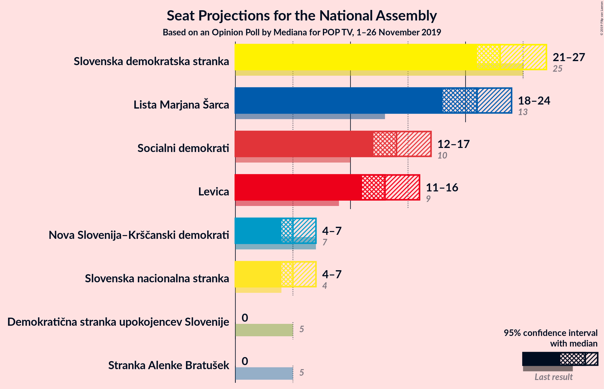
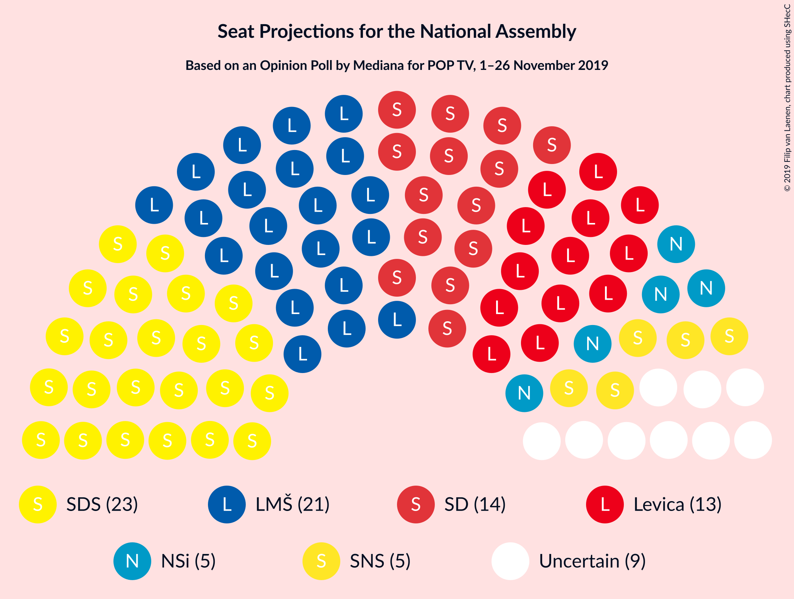
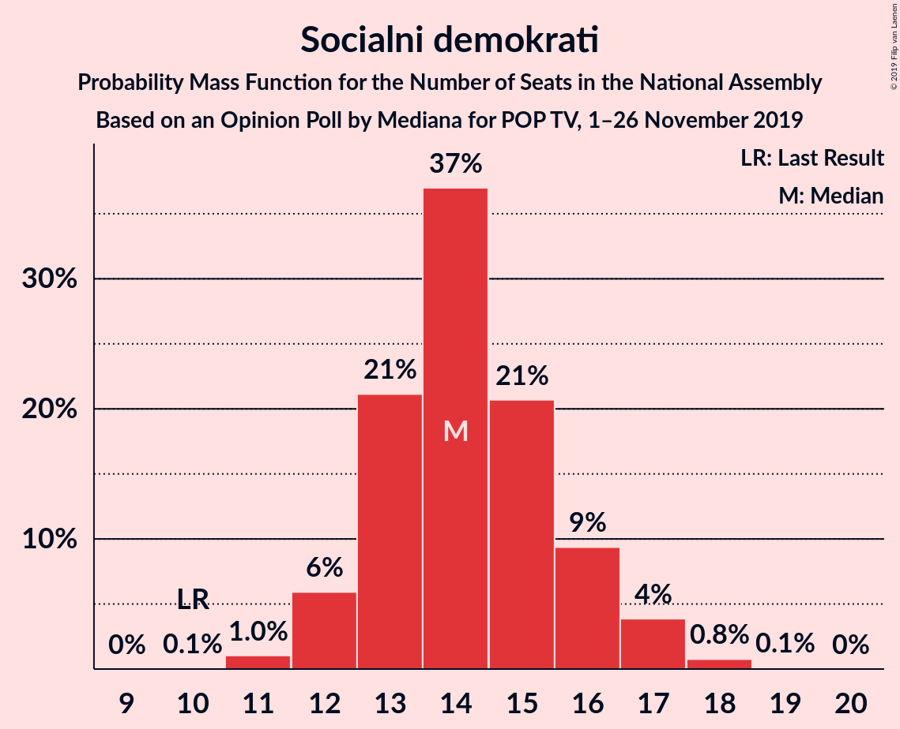
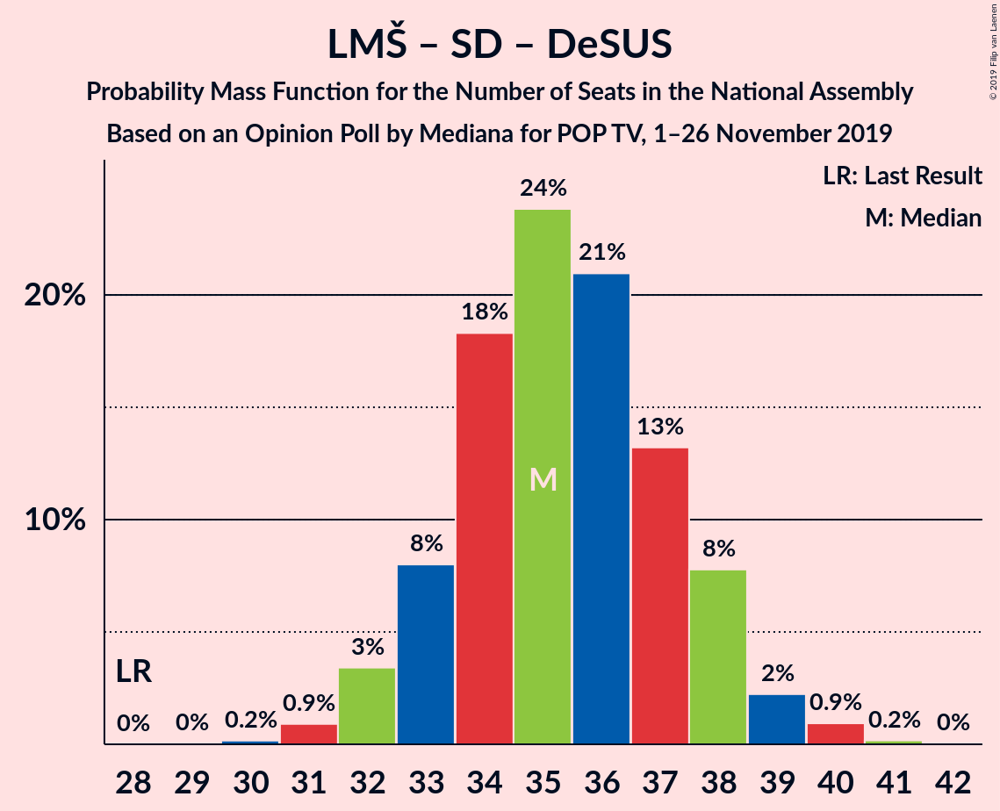

# Opinion Poll by Mediana for POP TV, 1–26 November 2019

<a href="#voting-intentions">Voting Intentions</a> | <a href="#seats">Seats</a> | <a href="#coalitions">Coalitions</a> | <a href="#technical-information">Technical Information</a>

## Voting Intentions

### Confidence Intervals

| Party | Last Result | Poll Result | 80% Confidence Interval | 90% Confidence Interval | 95% Confidence Interval | 99% Confidence Interval |
|:-----:|:-----------:|:-----------:|:-----------------------:|:-----------------------:|:-----------------------:|:-----------------------:|
| Slovenska demokratska stranka | 24.9% | 25.1% | 23.2–27.3% |22.6–27.9% |22.1–28.4% |21.2–29.5% |
| Lista Marjana Šarca | 12.6% | 22.5% | 20.7–24.6% |20.1–25.2% |19.7–25.7% |18.8–26.7% |
| Socialni demokrati | 9.9% | 15.4% | 13.8–17.3% |13.4–17.8% |13.0–18.2% |12.3–19.1% |
| Levica | 9.3% | 14.3% | 12.8–16.1% |12.4–16.6% |12.0–17.1% |11.3–18.0% |
| Nova Slovenija–Krščanski demokrati | 7.2% | 5.9% | 4.9–7.1% |4.6–7.5% |4.4–7.8% |4.0–8.5% |
| Slovenska nacionalna stranka | 4.2% | 5.9% | 4.9–7.1% |4.6–7.5% |4.4–7.8% |4.0–8.5% |
| Demokratična stranka upokojencev Slovenije | 4.9% | 2.5% | 1.9–3.4% |1.7–3.6% |1.6–3.9% |1.3–4.3% |
| Stranka Alenke Bratušek | 5.1% | 2.0% | 1.5–2.9% |1.4–3.1% |1.2–3.4% |1.0–3.8% |

*Note:* The poll result column reflects the actual value used in the calculations. Published results may vary slightly, and in addition be rounded to fewer digits.

## Seats

### Confidence Intervals

| Party | Last Result | Median | 80% Confidence Interval | 90% Confidence Interval | 95% Confidence Interval | 99% Confidence Interval |
|:-----:|:-----------:|:------:|:-----------------------:|:-----------------------:|:-----------------------:|:-----------------------:|
| <a href="#slovenska-demokratska-stranka">Slovenska demokratska stranka</a> | 25 | 23 | 22–25 |21–26 |21–27 |20–27 |
| <a href="#lista-marjana-šarca">Lista Marjana Šarca</a> | 13 | 21 | 19–23 |19–23 |18–24 |17–25 |
| <a href="#socialni-demokrati">Socialni demokrati</a> | 10 | 14 | 13–16 |12–16 |12–17 |11–18 |
| <a href="#levica">Levica</a> | 9 | 13 | 12–15 |11–15 |11–16 |10–17 |
| <a href="#nova-slovenija–krščanski-demokrati">Nova Slovenija–Krščanski demokrati</a> | 7 | 5 | 4–6 |4–7 |4–7 |0–8 |
| <a href="#slovenska-nacionalna-stranka">Slovenska nacionalna stranka</a> | 4 | 5 | 4–6 |4–7 |4–7 |0–8 |
| <a href="#demokratična-stranka-upokojencev-slovenije">Demokratična stranka upokojencev Slovenije</a> | 5 | 0 | 0 |0 |0 |0–4 |
| <a href="#stranka-alenke-bratušek">Stranka Alenke Bratušek</a> | 5 | 0 | 0 |0 |0 |0 |

### Slovenska demokratska stranka

*For a full overview of the results for this party, see the [Slovenska demokratska stranka](party-slovenskademokratskastranka.html) page.*

| Number of Seats | Probability | Accumulated | Special Marks |
|:---------------:|:-----------:|:-----------:|:-------------:|
| 19 | 0.4% | 100% |  |
| 20 | 2% | 99.6% |  |
| 21 | 8% | 98% |  |
| 22 | 16% | 90% |  |
| 23 | 29% | 74% | Median |
| 24 | 24% | 45% |  |
| 25 | 12% | 20% | Last Result |
| 26 | 6% | 8% |  |
| 27 | 2% | 3% |  |
| 28 | 0.4% | 0.5% |  |
| 29 | 0.1% | 0.1% |  |
| 30 | 0% | 0% |  |

### Lista Marjana Šarca

*For a full overview of the results for this party, see the [Lista Marjana Šarca](party-listamarjanašarca.html) page.*

| Number of Seats | Probability | Accumulated | Special Marks |
|:---------------:|:-----------:|:-----------:|:-------------:|
| 13 | 0% | 100% | Last Result |
| 14 | 0% | 100% |  |
| 15 | 0% | 100% |  |
| 16 | 0% | 100% |  |
| 17 | 0.6% | 100% |  |
| 18 | 4% | 99.4% |  |
| 19 | 10% | 96% |  |
| 20 | 13% | 85% |  |
| 21 | 33% | 72% | Median |
| 22 | 23% | 39% |  |
| 23 | 12% | 16% |  |
| 24 | 2% | 4% |  |
| 25 | 1.4% | 2% |  |
| 26 | 0.2% | 0.2% |  |
| 27 | 0% | 0% |  |

### Socialni demokrati

*For a full overview of the results for this party, see the [Socialni demokrati](party-socialnidemokrati.html) page.*

| Number of Seats | Probability | Accumulated | Special Marks |
|:---------------:|:-----------:|:-----------:|:-------------:|
| 10 | 0.1% | 100% | Last Result |
| 11 | 1.0% | 99.9% |  |
| 12 | 6% | 98.9% |  |
| 13 | 21% | 93% |  |
| 14 | 37% | 72% | Median |
| 15 | 21% | 35% |  |
| 16 | 9% | 14% |  |
| 17 | 4% | 5% |  |
| 18 | 0.8% | 0.9% |  |
| 19 | 0.1% | 0.1% |  |
| 20 | 0% | 0% |  |

### Levica

*For a full overview of the results for this party, see the [Levica](party-levica.html) page.*

| Number of Seats | Probability | Accumulated | Special Marks |
|:---------------:|:-----------:|:-----------:|:-------------:|
| 9 | 0.1% | 100% | Last Result |
| 10 | 0.9% | 99.9% |  |
| 11 | 7% | 99.0% |  |
| 12 | 21% | 92% |  |
| 13 | 27% | 71% | Median |
| 14 | 28% | 44% |  |
| 15 | 13% | 16% |  |
| 16 | 3% | 4% |  |
| 17 | 0.6% | 0.6% |  |
| 18 | 0.1% | 0.1% |  |
| 19 | 0% | 0% |  |

### Nova Slovenija–Krščanski demokrati

*For a full overview of the results for this party, see the [Nova Slovenija–Krščanski demokrati](party-novaslovenija–krščanskidemokrati.html) page.*

| Number of Seats | Probability | Accumulated | Special Marks |
|:---------------:|:-----------:|:-----------:|:-------------:|
| 0 | 0.9% | 100% |  |
| 1 | 0% | 99.1% |  |
| 2 | 0% | 99.1% |  |
| 3 | 0.8% | 99.1% |  |
| 4 | 17% | 98% |  |
| 5 | 49% | 81% | Median |
| 6 | 25% | 32% |  |
| 7 | 6% | 7% | Last Result |
| 8 | 0.5% | 0.5% |  |
| 9 | 0% | 0% |  |

### Slovenska nacionalna stranka

*For a full overview of the results for this party, see the [Slovenska nacionalna stranka](party-slovenskanacionalnastranka.html) page.*

| Number of Seats | Probability | Accumulated | Special Marks |
|:---------------:|:-----------:|:-----------:|:-------------:|
| 0 | 0.6% | 100% |  |
| 1 | 0% | 99.4% |  |
| 2 | 0% | 99.4% |  |
| 3 | 0.6% | 99.4% |  |
| 4 | 18% | 98.7% | Last Result |
| 5 | 47% | 81% | Median |
| 6 | 27% | 34% |  |
| 7 | 6% | 7% |  |
| 8 | 0.5% | 0.6% |  |
| 9 | 0% | 0% |  |

### Demokratična stranka upokojencev Slovenije

*For a full overview of the results for this party, see the [Demokratična stranka upokojencev Slovenije](party-demokratičnastrankaupokojencevslovenije.html) page.*

| Number of Seats | Probability | Accumulated | Special Marks |
|:---------------:|:-----------:|:-----------:|:-------------:|
| 0 | 98.6% | 100% | Median |
| 1 | 0% | 1.4% |  |
| 2 | 0% | 1.4% |  |
| 3 | 0.8% | 1.4% |  |
| 4 | 0.6% | 0.6% |  |
| 5 | 0% | 0% | Last Result |

### Stranka Alenke Bratušek

*For a full overview of the results for this party, see the [Stranka Alenke Bratušek](party-strankaalenkebratušek.html) page.*

| Number of Seats | Probability | Accumulated | Special Marks |
|:---------------:|:-----------:|:-----------:|:-------------:|
| 0 | 99.8% | 100% | Median |
| 1 | 0% | 0.2% |  |
| 2 | 0% | 0.2% |  |
| 3 | 0.1% | 0.2% |  |
| 4 | 0.1% | 0.1% |  |
| 5 | 0% | 0% | Last Result |

## Coalitions

### Confidence Intervals

| Coalition | Last Result | Median | Majority? | 80% Confidence Interval | 90% Confidence Interval | 95% Confidence Interval | 99% Confidence Interval |
|:---------:|:-----------:|:------:|:---------:|:-----------------------:|:-----------------------:|:-----------------------:|:-----------------------:|
| Slovenska demokratska stranka – Lista Marjana Šarca – Demokratična stranka upokojencev Slovenije | 43 | 44 | 32% | 42–47 | 42–47 | 41–48 | 40–49 |
| Slovenska demokratska stranka – Lista Marjana Šarca | 38 | 44 | 31% | 42–47 | 42–47 | 41–48 | 40–49 |
| Lista Marjana Šarca – Socialni demokrati – Nova Slovenija–Krščanski demokrati – Demokratična stranka upokojencev Slovenije | 35 | 40 | 0.3% | 38–43 | 38–43 | 37–44 | 36–45 |
| Lista Marjana Šarca – Socialni demokrati – Nova Slovenija–Krščanski demokrati | 30 | 40 | 0.2% | 38–43 | 38–43 | 37–44 | 36–45 |
| Lista Marjana Šarca – Socialni demokrati – Demokratična stranka upokojencev Slovenije | 28 | 35 | 0% | 33–38 | 33–38 | 32–39 | 31–40 |
| Lista Marjana Šarca – Socialni demokrati | 23 | 35 | 0% | 33–38 | 33–38 | 32–39 | 31–40 |

### Slovenska demokratska stranka – Lista Marjana Šarca – Demokratična stranka upokojencev Slovenije

| Number of Seats | Probability | Accumulated | Special Marks |
|:---------------:|:-----------:|:-----------:|:-------------:|
| 39 | 0.2% | 100% |  |
| 40 | 0.9% | 99.8% |  |
| 41 | 3% | 98.9% |  |
| 42 | 7% | 96% |  |
| 43 | 17% | 90% | Last Result |
| 44 | 25% | 73% | Median |
| 45 | 16% | 47% |  |
| 46 | 17% | 32% | Majority |
| 47 | 11% | 15% |  |
| 48 | 2% | 4% |  |
| 49 | 1.2% | 2% |  |
| 50 | 0.4% | 0.5% |  |
| 51 | 0.1% | 0.1% |  |
| 52 | 0% | 0% |  |

### Slovenska demokratska stranka – Lista Marjana Šarca

| Number of Seats | Probability | Accumulated | Special Marks |
|:---------------:|:-----------:|:-----------:|:-------------:|
| 38 | 0% | 100% | Last Result |
| 39 | 0.2% | 100% |  |
| 40 | 1.0% | 99.8% |  |
| 41 | 3% | 98.8% |  |
| 42 | 7% | 96% |  |
| 43 | 17% | 89% |  |
| 44 | 25% | 72% | Median |
| 45 | 15% | 47% |  |
| 46 | 17% | 31% | Majority |
| 47 | 11% | 14% |  |
| 48 | 2% | 4% |  |
| 49 | 1.1% | 2% |  |
| 50 | 0.3% | 0.4% |  |
| 51 | 0% | 0.1% |  |
| 52 | 0% | 0% |  |

### Lista Marjana Šarca – Socialni demokrati – Nova Slovenija–Krščanski demokrati – Demokratična stranka upokojencev Slovenije

| Number of Seats | Probability | Accumulated | Special Marks |
|:---------------:|:-----------:|:-----------:|:-------------:|
| 34 | 0.1% | 100% |  |
| 35 | 0.3% | 99.9% | Last Result |
| 36 | 0.8% | 99.6% |  |
| 37 | 3% | 98.9% |  |
| 38 | 8% | 96% |  |
| 39 | 15% | 88% |  |
| 40 | 25% | 73% | Median |
| 41 | 19% | 48% |  |
| 42 | 15% | 29% |  |
| 43 | 10% | 14% |  |
| 44 | 3% | 4% |  |
| 45 | 1.1% | 1.4% |  |
| 46 | 0.2% | 0.3% | Majority |
| 47 | 0% | 0.1% |  |
| 48 | 0% | 0% |  |

### Lista Marjana Šarca – Socialni demokrati – Nova Slovenija–Krščanski demokrati

| Number of Seats | Probability | Accumulated | Special Marks |
|:---------------:|:-----------:|:-----------:|:-------------:|
| 30 | 0% | 100% | Last Result |
| 31 | 0% | 100% |  |
| 32 | 0% | 100% |  |
| 33 | 0% | 100% |  |
| 34 | 0.1% | 100% |  |
| 35 | 0.3% | 99.9% |  |
| 36 | 0.9% | 99.6% |  |
| 37 | 3% | 98.7% |  |
| 38 | 8% | 96% |  |
| 39 | 15% | 88% |  |
| 40 | 25% | 72% | Median |
| 41 | 19% | 47% |  |
| 42 | 15% | 28% |  |
| 43 | 9% | 14% |  |
| 44 | 3% | 4% |  |
| 45 | 1.0% | 1.3% |  |
| 46 | 0.2% | 0.2% | Majority |
| 47 | 0% | 0% |  |

### Lista Marjana Šarca – Socialni demokrati – Demokratična stranka upokojencev Slovenije

| Number of Seats | Probability | Accumulated | Special Marks |
|:---------------:|:-----------:|:-----------:|:-------------:|
| 28 | 0% | 100% | Last Result |
| 29 | 0% | 100% |  |
| 30 | 0.2% | 100% |  |
| 31 | 0.9% | 99.8% |  |
| 32 | 3% | 98.9% |  |
| 33 | 8% | 95% |  |
| 34 | 18% | 87% |  |
| 35 | 24% | 69% | Median |
| 36 | 21% | 45% |  |
| 37 | 13% | 24% |  |
| 38 | 8% | 11% |  |
| 39 | 2% | 3% |  |
| 40 | 0.9% | 1.2% |  |
| 41 | 0.2% | 0.2% |  |
| 42 | 0% | 0% |  |

### Lista Marjana Šarca – Socialni demokrati

| Number of Seats | Probability | Accumulated | Special Marks |
|:---------------:|:-----------:|:-----------:|:-------------:|
| 23 | 0% | 100% | Last Result |
| 24 | 0% | 100% |  |
| 25 | 0% | 100% |  |
| 26 | 0% | 100% |  |
| 27 | 0% | 100% |  |
| 28 | 0% | 100% |  |
| 29 | 0% | 100% |  |
| 30 | 0.2% | 100% |  |
| 31 | 1.0% | 99.8% |  |
| 32 | 4% | 98.8% |  |
| 33 | 8% | 95% |  |
| 34 | 19% | 87% |  |
| 35 | 24% | 68% | Median |
| 36 | 21% | 44% |  |
| 37 | 13% | 23% |  |
| 38 | 8% | 11% |  |
| 39 | 2% | 3% |  |
| 40 | 0.8% | 1.0% |  |
| 41 | 0.1% | 0.2% |  |
| 42 | 0% | 0% |  |

## Technical Information

### Opinion Poll

+ **Polling firm:** Mediana
+ **Commissioner(s):** POP TV
+ **Fieldwork period:** 1–26 November 2019

### Calculations

+ **Sample size:** 732
+ **Simulations done:** 1,048,576
+ **Error estimate:** 1.23%

