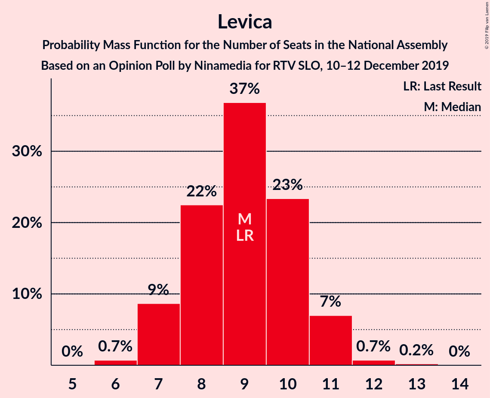
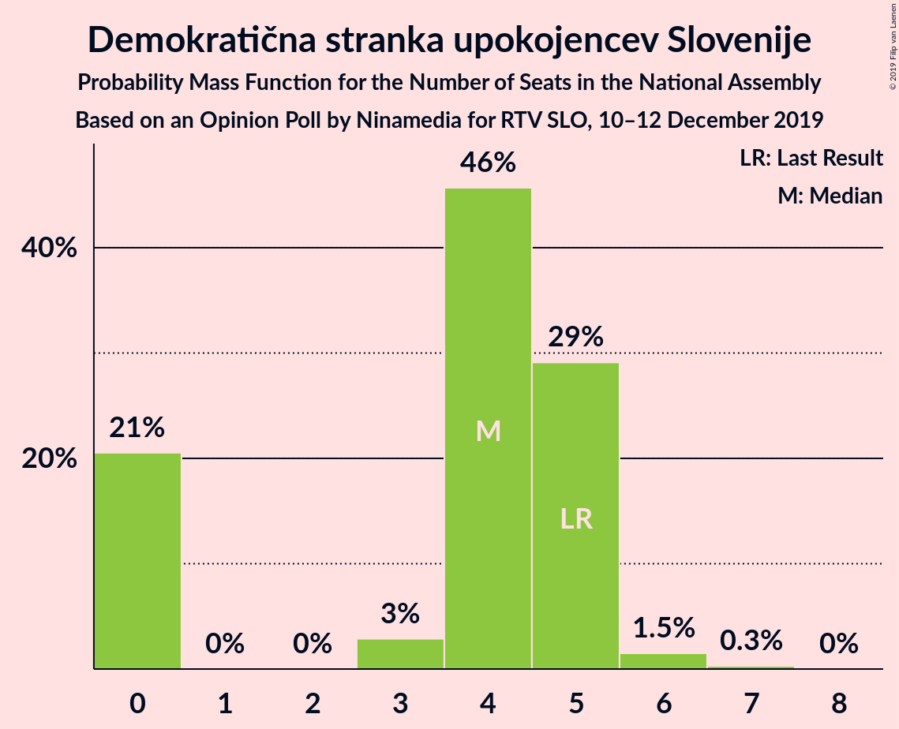
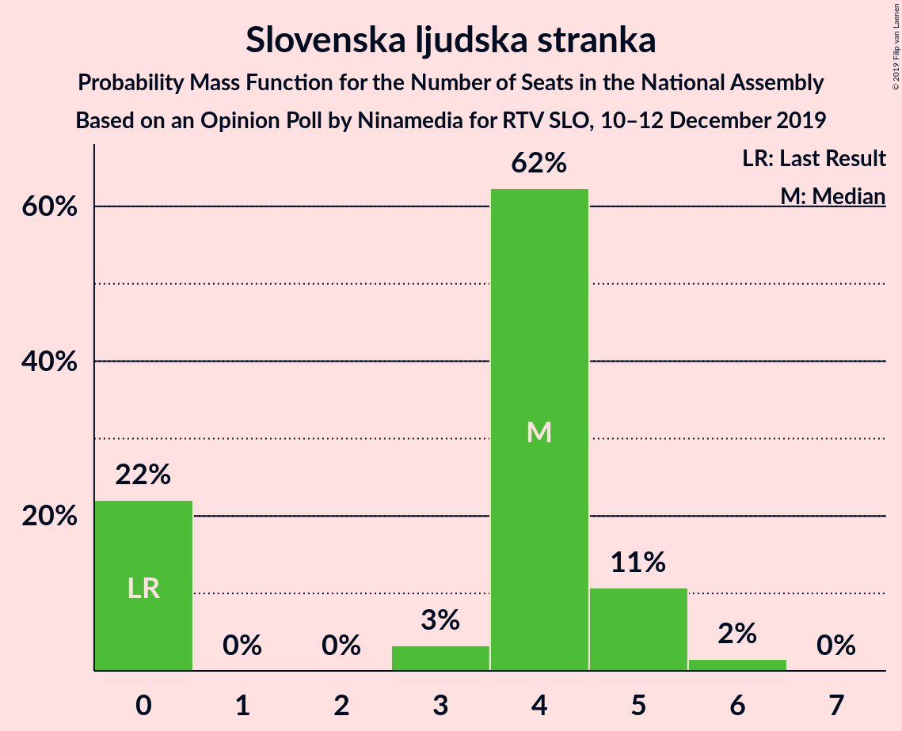
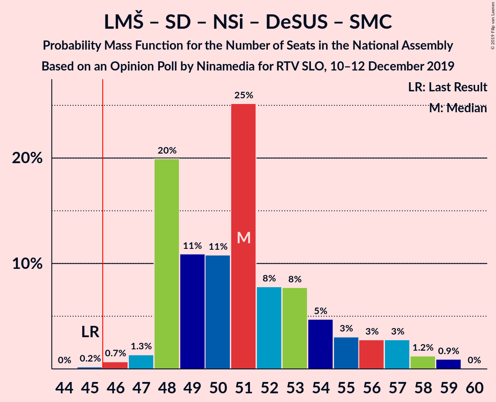
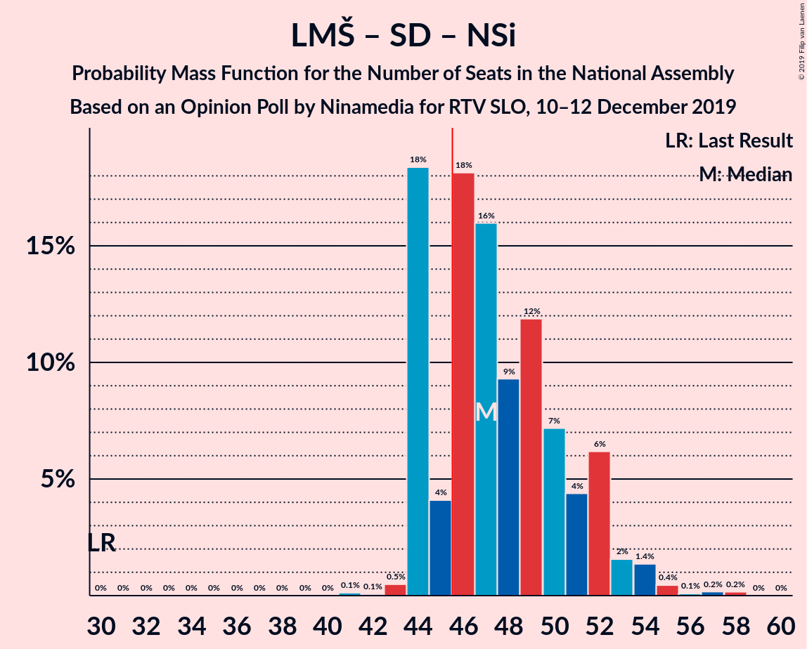
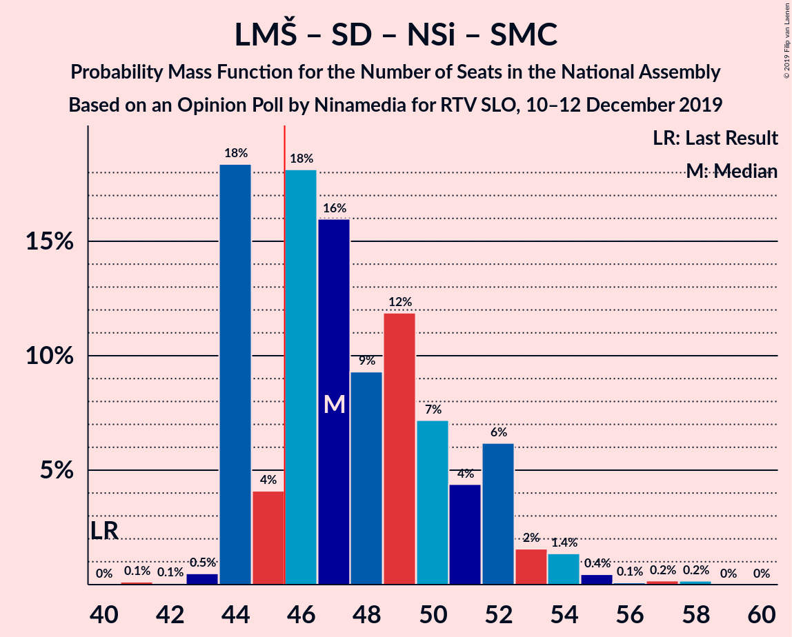
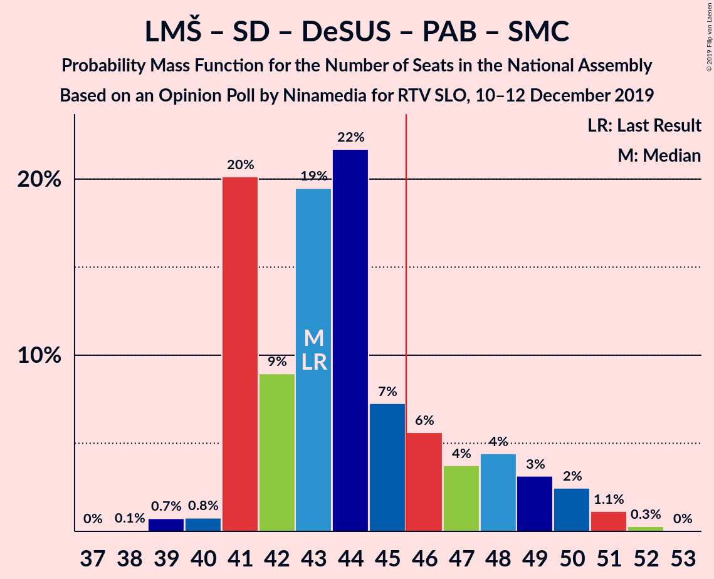

# Opinion Poll by Ninamedia for RTV SLO, 10–12 December 2019

<a href="#voting-intentions">Voting Intentions</a> | <a href="#seats">Seats</a> | <a href="#coalitions">Coalitions</a> | <a href="#technical-information">Technical Information</a>

## Voting Intentions

### Confidence Intervals

| Party | Last Result | Poll Result | 80% Confidence Interval | 90% Confidence Interval | 95% Confidence Interval | 99% Confidence Interval |
|:-----:|:-----------:|:-----------:|:-----------------------:|:-----------------------:|:-----------------------:|:-----------------------:|
| Lista Marjana Šarca | 12.6% | 29.6% | 27.4–31.9% |26.8–32.5% |26.3–33.1% |25.3–34.2% |
| Slovenska demokratska stranka | 24.9% | 24.3% | 22.3–26.5% |21.7–27.1% |21.2–27.6% |20.3–28.7% |
| Socialni demokrati | 9.9% | 14.1% | 12.6–16.0% |12.1–16.5% |11.8–16.9% |11.0–17.8% |
| Levica | 9.3% | 9.6% | 8.3–11.1% |7.9–11.6% |7.6–12.0% |7.0–12.8% |
| Nova Slovenija–Krščanski demokrati | 7.2% | 7.7% | 6.6–9.2% |6.2–9.6% |6.0–9.9% |5.4–10.7% |
| Demokratična stranka upokojencev Slovenije | 4.9% | 4.6% | 3.7–5.8% |3.5–6.1% |3.3–6.4% |2.9–7.0% |
| Slovenska ljudska stranka | 2.6% | 4.1% | 3.3–5.3% |3.1–5.6% |2.9–5.9% |2.5–6.5% |
| Slovenska nacionalna stranka | 4.2% | 3.6% | 2.8–4.6% |2.6–5.0% |2.4–5.2% |2.1–5.8% |
| Stranka Alenke Bratušek | 5.1% | 1.0% | 0.7–1.7% |0.6–1.9% |0.5–2.1% |0.4–2.4% |
| Stranka modernega centra | 9.7% | 0.3% | 0.2–0.8% |0.1–0.9% |0.1–1.0% |0.0–1.3% |

*Note:* The poll result column reflects the actual value used in the calculations. Published results may vary slightly, and in addition be rounded to fewer digits.

## Seats

### Confidence Intervals

| Party | Last Result | Median | 80% Confidence Interval | 90% Confidence Interval | 95% Confidence Interval | 99% Confidence Interval |
|:-----:|:-----------:|:------:|:-----------------------:|:-----------------------:|:-----------------------:|:-----------------------:|
| <a href="#lista-marjana-šarca">Lista Marjana Šarca</a> | 13 | 28 | 25–30 |25–31 |25–32 |24–34 |
| <a href="#slovenska-demokratska-stranka">Slovenska demokratska stranka</a> | 25 | 23 | 21–25 |21–26 |20–27 |19–28 |
| <a href="#socialni-demokrati">Socialni demokrati</a> | 10 | 13 | 11–15 |11–16 |11–16 |10–17 |
| <a href="#levica">Levica</a> | 9 | 9 | 8–10 |7–11 |7–11 |6–12 |
| <a href="#nova-slovenija–krščanski-demokrati">Nova Slovenija–Krščanski demokrati</a> | 7 | 7 | 6–8 |6–9 |5–9 |5–10 |
| <a href="#demokratična-stranka-upokojencev-slovenije">Demokratična stranka upokojencev Slovenije</a> | 5 | 4 | 0–5 |0–5 |0–5 |0–6 |
| <a href="#slovenska-ljudska-stranka">Slovenska ljudska stranka</a> | 0 | 4 | 0–5 |0–5 |0–5 |0–6 |
| <a href="#slovenska-nacionalna-stranka">Slovenska nacionalna stranka</a> | 4 | 0 | 0–4 |0–4 |0–4 |0–5 |
| <a href="#stranka-alenke-bratušek">Stranka Alenke Bratušek</a> | 5 | 0 | 0 |0 |0 |0 |
| <a href="#stranka-modernega-centra">Stranka modernega centra</a> | 10 | 0 | 0 |0 |0 |0 |

### Lista Marjana Šarca

*For a full overview of the results for this party, see the [Lista Marjana Šarca](party-listamarjanašarca.html) page.*

| Number of Seats | Probability | Accumulated | Special Marks |
|:---------------:|:-----------:|:-----------:|:-------------:|
| 13 | 0% | 100% | Last Result |
| 14 | 0% | 100% |  |
| 15 | 0% | 100% |  |
| 16 | 0% | 100% |  |
| 17 | 0% | 100% |  |
| 18 | 0% | 100% |  |
| 19 | 0% | 100% |  |
| 20 | 0% | 100% |  |
| 21 | 0% | 100% |  |
| 22 | 0% | 100% |  |
| 23 | 0.4% | 100% |  |
| 24 | 1.2% | 99.5% |  |
| 25 | 22% | 98% |  |
| 26 | 8% | 76% |  |
| 27 | 15% | 68% |  |
| 28 | 25% | 53% | Median |
| 29 | 11% | 28% |  |
| 30 | 8% | 17% |  |
| 31 | 7% | 10% |  |
| 32 | 2% | 3% |  |
| 33 | 0.8% | 1.3% |  |
| 34 | 0.4% | 0.5% |  |
| 35 | 0.1% | 0.2% |  |
| 36 | 0% | 0% |  |

### Slovenska demokratska stranka

*For a full overview of the results for this party, see the [Slovenska demokratska stranka](party-slovenskademokratskastranka.html) page.*

| Number of Seats | Probability | Accumulated | Special Marks |
|:---------------:|:-----------:|:-----------:|:-------------:|
| 18 | 0.3% | 100% |  |
| 19 | 1.2% | 99.7% |  |
| 20 | 2% | 98% |  |
| 21 | 13% | 96% |  |
| 22 | 10% | 83% |  |
| 23 | 31% | 73% | Median |
| 24 | 23% | 41% |  |
| 25 | 10% | 18% | Last Result |
| 26 | 4% | 8% |  |
| 27 | 3% | 4% |  |
| 28 | 1.0% | 1.5% |  |
| 29 | 0.4% | 0.5% |  |
| 30 | 0% | 0% |  |

### Socialni demokrati

*For a full overview of the results for this party, see the [Socialni demokrati](party-socialnidemokrati.html) page.*

| Number of Seats | Probability | Accumulated | Special Marks |
|:---------------:|:-----------:|:-----------:|:-------------:|
| 9 | 0.1% | 100% |  |
| 10 | 0.8% | 99.9% | Last Result |
| 11 | 18% | 99.1% |  |
| 12 | 30% | 81% |  |
| 13 | 24% | 51% | Median |
| 14 | 13% | 27% |  |
| 15 | 9% | 14% |  |
| 16 | 4% | 5% |  |
| 17 | 1.2% | 1.4% |  |
| 18 | 0.2% | 0.2% |  |
| 19 | 0% | 0% |  |

### Levica

*For a full overview of the results for this party, see the [Levica](party-levica.html) page.*

| Number of Seats | Probability | Accumulated | Special Marks |
|:---------------:|:-----------:|:-----------:|:-------------:|
| 6 | 0.7% | 100% |  |
| 7 | 9% | 99.3% |  |
| 8 | 22% | 91% |  |
| 9 | 37% | 68% | Last Result, Median |
| 10 | 23% | 31% |  |
| 11 | 7% | 8% |  |
| 12 | 0.7% | 0.9% |  |
| 13 | 0.2% | 0.2% |  |
| 14 | 0% | 0% |  |

### Nova Slovenija–Krščanski demokrati

*For a full overview of the results for this party, see the [Nova Slovenija–Krščanski demokrati](party-novaslovenija–krščanskidemokrati.html) page.*

| Number of Seats | Probability | Accumulated | Special Marks |
|:---------------:|:-----------:|:-----------:|:-------------:|
| 4 | 0.1% | 100% |  |
| 5 | 3% | 99.9% |  |
| 6 | 22% | 97% |  |
| 7 | 46% | 75% | Last Result, Median |
| 8 | 21% | 29% |  |
| 9 | 7% | 8% |  |
| 10 | 1.2% | 1.3% |  |
| 11 | 0.1% | 0.1% |  |
| 12 | 0% | 0% |  |

### Demokratična stranka upokojencev Slovenije

*For a full overview of the results for this party, see the [Demokratična stranka upokojencev Slovenije](party-demokratičnastrankaupokojencevslovenije.html) page.*

| Number of Seats | Probability | Accumulated | Special Marks |
|:---------------:|:-----------:|:-----------:|:-------------:|
| 0 | 21% | 100% |  |
| 1 | 0% | 79% |  |
| 2 | 0% | 79% |  |
| 3 | 3% | 79% |  |
| 4 | 46% | 77% | Median |
| 5 | 29% | 31% | Last Result |
| 6 | 1.5% | 2% |  |
| 7 | 0.3% | 0.3% |  |
| 8 | 0% | 0% |  |

### Slovenska ljudska stranka

*For a full overview of the results for this party, see the [Slovenska ljudska stranka](party-slovenskaljudskastranka.html) page.*

| Number of Seats | Probability | Accumulated | Special Marks |
|:---------------:|:-----------:|:-----------:|:-------------:|
| 0 | 22% | 100% | Last Result |
| 1 | 0% | 78% |  |
| 2 | 0% | 78% |  |
| 3 | 3% | 78% |  |
| 4 | 62% | 75% | Median |
| 5 | 11% | 12% |  |
| 6 | 2% | 2% |  |
| 7 | 0% | 0% |  |

### Slovenska nacionalna stranka

*For a full overview of the results for this party, see the [Slovenska nacionalna stranka](party-slovenskanacionalnastranka.html) page.*

| Number of Seats | Probability | Accumulated | Special Marks |
|:---------------:|:-----------:|:-----------:|:-------------:|
| 0 | 55% | 100% | Median |
| 1 | 0% | 45% |  |
| 2 | 0% | 45% |  |
| 3 | 20% | 45% |  |
| 4 | 23% | 25% | Last Result |
| 5 | 2% | 2% |  |
| 6 | 0.2% | 0.2% |  |
| 7 | 0% | 0% |  |

### Stranka Alenke Bratušek

*For a full overview of the results for this party, see the [Stranka Alenke Bratušek](party-strankaalenkebratušek.html) page.*

| Number of Seats | Probability | Accumulated | Special Marks |
|:---------------:|:-----------:|:-----------:|:-------------:|
| 0 | 100% | 100% | Median |
| 1 | 0% | 0% |  |
| 2 | 0% | 0% |  |
| 3 | 0% | 0% |  |
| 4 | 0% | 0% |  |
| 5 | 0% | 0% | Last Result |

### Stranka modernega centra

*For a full overview of the results for this party, see the [Stranka modernega centra](party-strankamodernegacentra.html) page.*

| Number of Seats | Probability | Accumulated | Special Marks |
|:---------------:|:-----------:|:-----------:|:-------------:|
| 0 | 100% | 100% | Median |
| 1 | 0% | 0% |  |
| 2 | 0% | 0% |  |
| 3 | 0% | 0% |  |
| 4 | 0% | 0% |  |
| 5 | 0% | 0% |  |
| 6 | 0% | 0% |  |
| 7 | 0% | 0% |  |
| 8 | 0% | 0% |  |
| 9 | 0% | 0% |  |
| 10 | 0% | 0% | Last Result |

## Coalitions

### Confidence Intervals

| Coalition | Last Result | Median | Majority? | 80% Confidence Interval | 90% Confidence Interval | 95% Confidence Interval | 99% Confidence Interval |
|:---------:|:-----------:|:------:|:---------:|:-----------------------:|:-----------------------:|:-----------------------:|:-----------------------:|
| Lista Marjana Šarca – Slovenska demokratska stranka – Demokratična stranka upokojencev Slovenije | 43 | 54 | 100% | 51–57 | 51–59 | 50–59 | 48–60 |
| Lista Marjana Šarca – Socialni demokrati – Nova Slovenija–Krščanski demokrati – Demokratična stranka upokojencev Slovenije | 35 | 51 | 99.8% | 48–55 | 48–56 | 48–57 | 46–59 |
| Lista Marjana Šarca – Socialni demokrati – Nova Slovenija–Krščanski demokrati – Demokratična stranka upokojencev Slovenije – Stranka Alenke Bratušek – Stranka modernega centra | 50 | 51 | 99.8% | 48–55 | 48–56 | 48–57 | 46–59 |
| Lista Marjana Šarca – Socialni demokrati – Nova Slovenija–Krščanski demokrati – Demokratična stranka upokojencev Slovenije – Stranka modernega centra | 45 | 51 | 99.8% | 48–55 | 48–56 | 48–57 | 46–59 |
| Lista Marjana Šarca – Slovenska demokratska stranka | 38 | 51 | 99.4% | 48–54 | 48–55 | 47–56 | 45–59 |
| Lista Marjana Šarca – Socialni demokrati – Nova Slovenija–Krščanski demokrati | 30 | 47 | 77% | 44–51 | 44–52 | 44–53 | 43–55 |
| Lista Marjana Šarca – Socialni demokrati – Nova Slovenija–Krščanski demokrati – Stranka modernega centra | 40 | 47 | 77% | 44–51 | 44–52 | 44–53 | 43–55 |
| Lista Marjana Šarca – Socialni demokrati – Demokratična stranka upokojencev Slovenije | 28 | 43 | 21% | 41–48 | 41–49 | 41–50 | 39–51 |
| Lista Marjana Šarca – Socialni demokrati – Demokratična stranka upokojencev Slovenije – Stranka Alenke Bratušek – Stranka modernega centra | 43 | 43 | 21% | 41–48 | 41–49 | 41–50 | 39–51 |
| Lista Marjana Šarca – Socialni demokrati – Demokratična stranka upokojencev Slovenije – Stranka modernega centra | 38 | 43 | 21% | 41–48 | 41–49 | 41–50 | 39–51 |
| Lista Marjana Šarca – Socialni demokrati | 23 | 40 | 3% | 37–44 | 37–45 | 37–46 | 36–48 |
| Lista Marjana Šarca – Socialni demokrati – Stranka modernega centra | 33 | 40 | 3% | 37–44 | 37–45 | 37–46 | 36–48 |
| Socialni demokrati – Demokratična stranka upokojencev Slovenije – Stranka modernega centra | 25 | 16 | 0% | 13–19 | 13–20 | 12–21 | 12–22 |

### Lista Marjana Šarca – Slovenska demokratska stranka – Demokratična stranka upokojencev Slovenije

| Number of Seats | Probability | Accumulated | Special Marks |
|:---------------:|:-----------:|:-----------:|:-------------:|
| 43 | 0% | 100% | Last Result |
| 44 | 0% | 100% |  |
| 45 | 0% | 100% |  |
| 46 | 0% | 100% | Majority |
| 47 | 0.1% | 100% |  |
| 48 | 0.5% | 99.9% |  |
| 49 | 0.4% | 99.4% |  |
| 50 | 4% | 99.0% |  |
| 51 | 8% | 95% |  |
| 52 | 8% | 88% |  |
| 53 | 26% | 80% |  |
| 54 | 9% | 54% |  |
| 55 | 11% | 45% | Median |
| 56 | 18% | 34% |  |
| 57 | 7% | 16% |  |
| 58 | 3% | 8% |  |
| 59 | 4% | 5% |  |
| 60 | 1.1% | 1.4% |  |
| 61 | 0.2% | 0.3% |  |
| 62 | 0.1% | 0.1% |  |
| 63 | 0% | 0% |  |

### Lista Marjana Šarca – Socialni demokrati – Nova Slovenija–Krščanski demokrati – Demokratična stranka upokojencev Slovenije

| Number of Seats | Probability | Accumulated | Special Marks |
|:---------------:|:-----------:|:-----------:|:-------------:|
| 35 | 0% | 100% | Last Result |
| 36 | 0% | 100% |  |
| 37 | 0% | 100% |  |
| 38 | 0% | 100% |  |
| 39 | 0% | 100% |  |
| 40 | 0% | 100% |  |
| 41 | 0% | 100% |  |
| 42 | 0% | 100% |  |
| 43 | 0% | 100% |  |
| 44 | 0% | 100% |  |
| 45 | 0.2% | 100% |  |
| 46 | 0.7% | 99.8% | Majority |
| 47 | 1.3% | 99.1% |  |
| 48 | 20% | 98% |  |
| 49 | 11% | 78% |  |
| 50 | 11% | 67% |  |
| 51 | 25% | 56% |  |
| 52 | 8% | 31% | Median |
| 53 | 8% | 23% |  |
| 54 | 5% | 15% |  |
| 55 | 3% | 11% |  |
| 56 | 3% | 8% |  |
| 57 | 3% | 5% |  |
| 58 | 1.2% | 2% |  |
| 59 | 0.9% | 1.0% |  |
| 60 | 0% | 0% |  |

### Lista Marjana Šarca – Socialni demokrati – Nova Slovenija–Krščanski demokrati – Demokratična stranka upokojencev Slovenije – Stranka Alenke Bratušek – Stranka modernega centra

| Number of Seats | Probability | Accumulated | Special Marks |
|:---------------:|:-----------:|:-----------:|:-------------:|
| 45 | 0.2% | 100% |  |
| 46 | 0.7% | 99.8% | Majority |
| 47 | 1.3% | 99.1% |  |
| 48 | 20% | 98% |  |
| 49 | 11% | 78% |  |
| 50 | 11% | 67% | Last Result |
| 51 | 25% | 56% |  |
| 52 | 8% | 31% | Median |
| 53 | 8% | 23% |  |
| 54 | 5% | 15% |  |
| 55 | 3% | 11% |  |
| 56 | 3% | 8% |  |
| 57 | 3% | 5% |  |
| 58 | 1.2% | 2% |  |
| 59 | 0.9% | 1.0% |  |
| 60 | 0% | 0% |  |

### Lista Marjana Šarca – Socialni demokrati – Nova Slovenija–Krščanski demokrati – Demokratična stranka upokojencev Slovenije – Stranka modernega centra

| Number of Seats | Probability | Accumulated | Special Marks |
|:---------------:|:-----------:|:-----------:|:-------------:|
| 45 | 0.2% | 100% | Last Result |
| 46 | 0.7% | 99.8% | Majority |
| 47 | 1.3% | 99.1% |  |
| 48 | 20% | 98% |  |
| 49 | 11% | 78% |  |
| 50 | 11% | 67% |  |
| 51 | 25% | 56% |  |
| 52 | 8% | 31% | Median |
| 53 | 8% | 23% |  |
| 54 | 5% | 15% |  |
| 55 | 3% | 11% |  |
| 56 | 3% | 8% |  |
| 57 | 3% | 5% |  |
| 58 | 1.2% | 2% |  |
| 59 | 0.9% | 1.0% |  |
| 60 | 0% | 0% |  |

### Lista Marjana Šarca – Slovenska demokratska stranka

| Number of Seats | Probability | Accumulated | Special Marks |
|:---------------:|:-----------:|:-----------:|:-------------:|
| 38 | 0% | 100% | Last Result |
| 39 | 0% | 100% |  |
| 40 | 0% | 100% |  |
| 41 | 0% | 100% |  |
| 42 | 0% | 100% |  |
| 43 | 0% | 100% |  |
| 44 | 0.1% | 100% |  |
| 45 | 0.5% | 99.9% |  |
| 46 | 2% | 99.4% | Majority |
| 47 | 1.3% | 98% |  |
| 48 | 8% | 97% |  |
| 49 | 25% | 88% |  |
| 50 | 9% | 63% |  |
| 51 | 25% | 54% | Median |
| 52 | 8% | 29% |  |
| 53 | 7% | 20% |  |
| 54 | 4% | 13% |  |
| 55 | 6% | 9% |  |
| 56 | 1.0% | 3% |  |
| 57 | 0.8% | 2% |  |
| 58 | 0.6% | 1.5% |  |
| 59 | 0.8% | 0.9% |  |
| 60 | 0.1% | 0.1% |  |
| 61 | 0% | 0% |  |

### Lista Marjana Šarca – Socialni demokrati – Nova Slovenija–Krščanski demokrati

| Number of Seats | Probability | Accumulated | Special Marks |
|:---------------:|:-----------:|:-----------:|:-------------:|
| 30 | 0% | 100% | Last Result |
| 31 | 0% | 100% |  |
| 32 | 0% | 100% |  |
| 33 | 0% | 100% |  |
| 34 | 0% | 100% |  |
| 35 | 0% | 100% |  |
| 36 | 0% | 100% |  |
| 37 | 0% | 100% |  |
| 38 | 0% | 100% |  |
| 39 | 0% | 100% |  |
| 40 | 0% | 100% |  |
| 41 | 0.1% | 100% |  |
| 42 | 0.1% | 99.9% |  |
| 43 | 0.5% | 99.8% |  |
| 44 | 18% | 99.3% |  |
| 45 | 4% | 81% |  |
| 46 | 18% | 77% | Majority |
| 47 | 16% | 59% |  |
| 48 | 9% | 43% | Median |
| 49 | 12% | 33% |  |
| 50 | 7% | 22% |  |
| 51 | 4% | 14% |  |
| 52 | 6% | 10% |  |
| 53 | 2% | 4% |  |
| 54 | 1.4% | 2% |  |
| 55 | 0.4% | 0.9% |  |
| 56 | 0.1% | 0.4% |  |
| 57 | 0.2% | 0.4% |  |
| 58 | 0.2% | 0.2% |  |
| 59 | 0% | 0% |  |

### Lista Marjana Šarca – Socialni demokrati – Nova Slovenija–Krščanski demokrati – Stranka modernega centra

| Number of Seats | Probability | Accumulated | Special Marks |
|:---------------:|:-----------:|:-----------:|:-------------:|
| 40 | 0% | 100% | Last Result |
| 41 | 0.1% | 100% |  |
| 42 | 0.1% | 99.9% |  |
| 43 | 0.5% | 99.8% |  |
| 44 | 18% | 99.3% |  |
| 45 | 4% | 81% |  |
| 46 | 18% | 77% | Majority |
| 47 | 16% | 59% |  |
| 48 | 9% | 43% | Median |
| 49 | 12% | 33% |  |
| 50 | 7% | 22% |  |
| 51 | 4% | 14% |  |
| 52 | 6% | 10% |  |
| 53 | 2% | 4% |  |
| 54 | 1.4% | 2% |  |
| 55 | 0.4% | 0.9% |  |
| 56 | 0.1% | 0.4% |  |
| 57 | 0.2% | 0.4% |  |
| 58 | 0.2% | 0.2% |  |
| 59 | 0% | 0% |  |

### Lista Marjana Šarca – Socialni demokrati – Demokratična stranka upokojencev Slovenije

| Number of Seats | Probability | Accumulated | Special Marks |
|:---------------:|:-----------:|:-----------:|:-------------:|
| 28 | 0% | 100% | Last Result |
| 29 | 0% | 100% |  |
| 30 | 0% | 100% |  |
| 31 | 0% | 100% |  |
| 32 | 0% | 100% |  |
| 33 | 0% | 100% |  |
| 34 | 0% | 100% |  |
| 35 | 0% | 100% |  |
| 36 | 0% | 100% |  |
| 37 | 0% | 100% |  |
| 38 | 0.1% | 100% |  |
| 39 | 0.7% | 99.9% |  |
| 40 | 0.8% | 99.2% |  |
| 41 | 20% | 98% |  |
| 42 | 9% | 78% |  |
| 43 | 19% | 69% |  |
| 44 | 22% | 50% |  |
| 45 | 7% | 28% | Median |
| 46 | 6% | 21% | Majority |
| 47 | 4% | 15% |  |
| 48 | 4% | 11% |  |
| 49 | 3% | 7% |  |
| 50 | 2% | 4% |  |
| 51 | 1.1% | 1.5% |  |
| 52 | 0.3% | 0.3% |  |
| 53 | 0% | 0% |  |

### Lista Marjana Šarca – Socialni demokrati – Demokratična stranka upokojencev Slovenije – Stranka Alenke Bratušek – Stranka modernega centra

| Number of Seats | Probability | Accumulated | Special Marks |
|:---------------:|:-----------:|:-----------:|:-------------:|
| 38 | 0.1% | 100% |  |
| 39 | 0.7% | 99.9% |  |
| 40 | 0.8% | 99.2% |  |
| 41 | 20% | 98% |  |
| 42 | 9% | 78% |  |
| 43 | 19% | 69% | Last Result |
| 44 | 22% | 50% |  |
| 45 | 7% | 28% | Median |
| 46 | 6% | 21% | Majority |
| 47 | 4% | 15% |  |
| 48 | 4% | 11% |  |
| 49 | 3% | 7% |  |
| 50 | 2% | 4% |  |
| 51 | 1.1% | 1.5% |  |
| 52 | 0.3% | 0.3% |  |
| 53 | 0% | 0% |  |

### Lista Marjana Šarca – Socialni demokrati – Demokratična stranka upokojencev Slovenije – Stranka modernega centra

| Number of Seats | Probability | Accumulated | Special Marks |
|:---------------:|:-----------:|:-----------:|:-------------:|
| 38 | 0.1% | 100% | Last Result |
| 39 | 0.7% | 99.9% |  |
| 40 | 0.8% | 99.2% |  |
| 41 | 20% | 98% |  |
| 42 | 9% | 78% |  |
| 43 | 19% | 69% |  |
| 44 | 22% | 50% |  |
| 45 | 7% | 28% | Median |
| 46 | 6% | 21% | Majority |
| 47 | 4% | 15% |  |
| 48 | 4% | 11% |  |
| 49 | 3% | 7% |  |
| 50 | 2% | 4% |  |
| 51 | 1.1% | 1.5% |  |
| 52 | 0.3% | 0.3% |  |
| 53 | 0% | 0% |  |

### Lista Marjana Šarca – Socialni demokrati

| Number of Seats | Probability | Accumulated | Special Marks |
|:---------------:|:-----------:|:-----------:|:-------------:|
| 23 | 0% | 100% | Last Result |
| 24 | 0% | 100% |  |
| 25 | 0% | 100% |  |
| 26 | 0% | 100% |  |
| 27 | 0% | 100% |  |
| 28 | 0% | 100% |  |
| 29 | 0% | 100% |  |
| 30 | 0% | 100% |  |
| 31 | 0% | 100% |  |
| 32 | 0% | 100% |  |
| 33 | 0% | 100% |  |
| 34 | 0% | 100% |  |
| 35 | 0.1% | 100% |  |
| 36 | 0.6% | 99.9% |  |
| 37 | 16% | 99.3% |  |
| 38 | 7% | 84% |  |
| 39 | 26% | 77% |  |
| 40 | 6% | 51% |  |
| 41 | 13% | 45% | Median |
| 42 | 12% | 32% |  |
| 43 | 9% | 21% |  |
| 44 | 6% | 12% |  |
| 45 | 3% | 7% |  |
| 46 | 2% | 3% | Majority |
| 47 | 0.5% | 1.4% |  |
| 48 | 0.5% | 0.9% |  |
| 49 | 0.1% | 0.4% |  |
| 50 | 0.1% | 0.3% |  |
| 51 | 0.2% | 0.2% |  |
| 52 | 0% | 0% |  |

### Lista Marjana Šarca – Socialni demokrati – Stranka modernega centra

| Number of Seats | Probability | Accumulated | Special Marks |
|:---------------:|:-----------:|:-----------:|:-------------:|
| 33 | 0% | 100% | Last Result |
| 34 | 0% | 100% |  |
| 35 | 0.1% | 100% |  |
| 36 | 0.6% | 99.9% |  |
| 37 | 16% | 99.3% |  |
| 38 | 7% | 84% |  |
| 39 | 26% | 77% |  |
| 40 | 6% | 51% |  |
| 41 | 13% | 45% | Median |
| 42 | 12% | 32% |  |
| 43 | 9% | 21% |  |
| 44 | 6% | 12% |  |
| 45 | 3% | 7% |  |
| 46 | 2% | 3% | Majority |
| 47 | 0.5% | 1.4% |  |
| 48 | 0.5% | 0.9% |  |
| 49 | 0.1% | 0.4% |  |
| 50 | 0.1% | 0.3% |  |
| 51 | 0.2% | 0.2% |  |
| 52 | 0% | 0% |  |

### Socialni demokrati – Demokratična stranka upokojencev Slovenije – Stranka modernega centra

| Number of Seats | Probability | Accumulated | Special Marks |
|:---------------:|:-----------:|:-----------:|:-------------:|
| 11 | 0.3% | 100% |  |
| 12 | 4% | 99.6% |  |
| 13 | 6% | 95% |  |
| 14 | 6% | 89% |  |
| 15 | 7% | 83% |  |
| 16 | 39% | 76% |  |
| 17 | 13% | 37% | Median |
| 18 | 11% | 24% |  |
| 19 | 5% | 12% |  |
| 20 | 4% | 8% |  |
| 21 | 3% | 4% |  |
| 22 | 0.5% | 0.6% |  |
| 23 | 0.1% | 0.1% |  |
| 24 | 0% | 0% |  |
| 25 | 0% | 0% | Last Result |

## Technical Information

### Opinion Poll

+ **Polling firm:** Ninamedia
+ **Commissioner(s):** RTV SLO
+ **Fieldwork period:** 10–12 December 2019

### Calculations

+ **Sample size:** 700
+ **Simulations done:** 1,048,576
+ **Error estimate:** 2.36%

