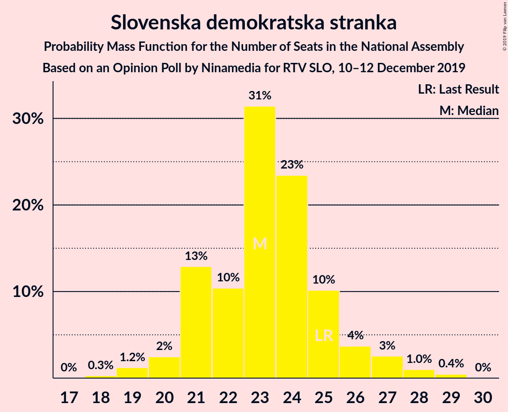
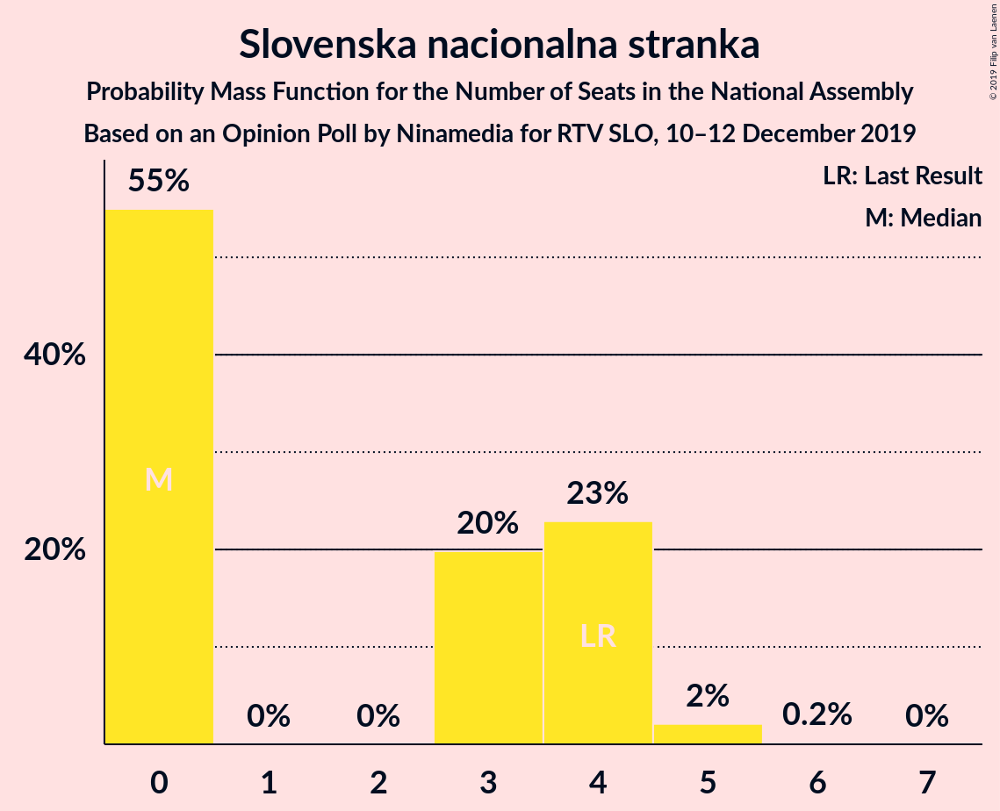
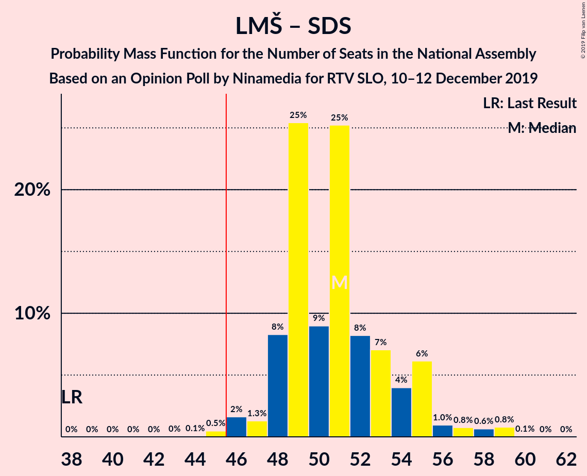
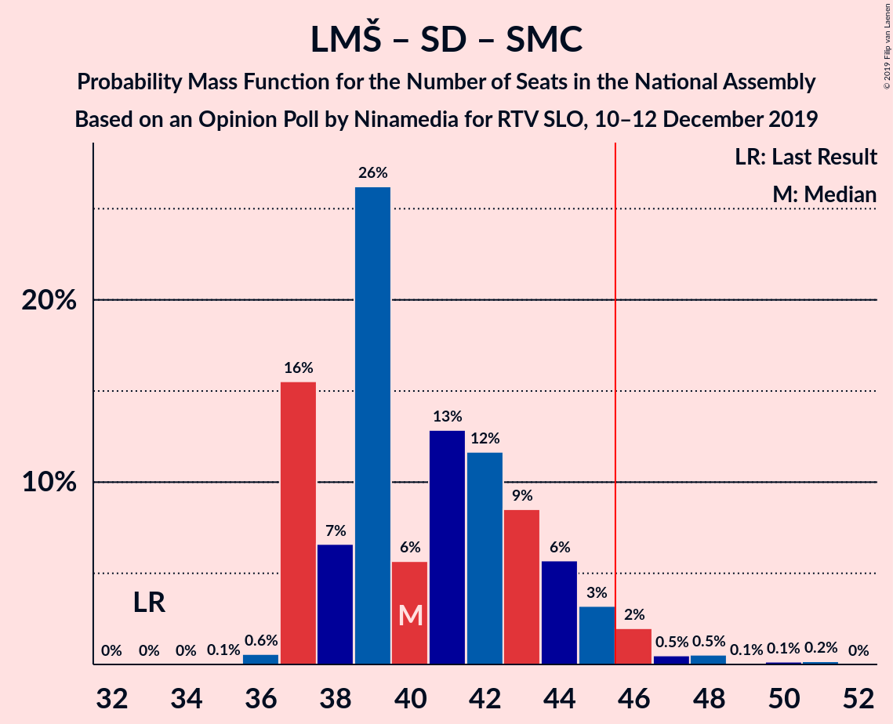

# Opinion Poll by Ninamedia for RTV SLO, 10–12 December 2019

<a href="#voting-intentions">Voting Intentions</a> | <a href="#seats">Seats</a> | <a href="#coalitions">Coalitions</a> | <a href="#technical-information">Technical Information</a>

## Voting Intentions

### Confidence Intervals

| Party | Last Result | Poll Result | 80% Confidence Interval | 90% Confidence Interval | 95% Confidence Interval | 99% Confidence Interval |
|:-----:|:-----------:|:-----------:|:-----------------------:|:-----------------------:|:-----------------------:|:-----------------------:|
| Lista Marjana Šarca | 12.6% | 29.6% | 27.4–31.9% |26.8–32.5% |26.3–33.1% |25.3–34.2% |
| Slovenska demokratska stranka | 24.9% | 24.3% | 22.3–26.5% |21.7–27.1% |21.2–27.6% |20.3–28.7% |
| Socialni demokrati | 9.9% | 14.1% | 12.6–16.0% |12.1–16.5% |11.8–16.9% |11.0–17.8% |
| Levica | 9.3% | 9.6% | 8.3–11.1% |7.9–11.6% |7.6–12.0% |7.0–12.8% |
| Nova Slovenija–Krščanski demokrati | 7.2% | 7.7% | 6.6–9.2% |6.2–9.6% |6.0–9.9% |5.4–10.7% |
| Demokratična stranka upokojencev Slovenije | 4.9% | 4.6% | 3.7–5.8% |3.5–6.1% |3.3–6.4% |2.9–7.0% |
| Slovenska ljudska stranka | 2.6% | 4.1% | 3.3–5.3% |3.1–5.6% |2.9–5.9% |2.5–6.5% |
| Slovenska nacionalna stranka | 4.2% | 3.6% | 2.8–4.6% |2.6–5.0% |2.4–5.2% |2.1–5.8% |
| Stranka Alenke Bratušek | 5.1% | 1.0% | 0.7–1.7% |0.6–1.9% |0.5–2.1% |0.4–2.4% |
| Stranka modernega centra | 9.7% | 0.3% | 0.2–0.8% |0.1–0.9% |0.1–1.0% |0.0–1.3% |

*Note:* The poll result column reflects the actual value used in the calculations. Published results may vary slightly, and in addition be rounded to fewer digits.

## Seats

### Confidence Intervals

| Party | Last Result | Median | 80% Confidence Interval | 90% Confidence Interval | 95% Confidence Interval | 99% Confidence Interval |
|:-----:|:-----------:|:------:|:-----------------------:|:-----------------------:|:-----------------------:|:-----------------------:|
| <a href="#lista-marjana-šarca">Lista Marjana Šarca</a> | 13 | 28 | 26–31 |24–31 |24–33 |23–33 |
| <a href="#slovenska-demokratska-stranka">Slovenska demokratska stranka</a> | 25 | 23 | 21–27 |21–27 |20–27 |19–28 |
| <a href="#socialni-demokrati">Socialni demokrati</a> | 10 | 12 | 11–15 |11–15 |10–16 |10–17 |
| <a href="#levica">Levica</a> | 9 | 9 | 7–10 |7–11 |7–11 |6–13 |
| <a href="#nova-slovenija–krščanski-demokrati">Nova Slovenija–Krščanski demokrati</a> | 7 | 8 | 6–9 |5–9 |5–9 |5–10 |
| <a href="#demokratična-stranka-upokojencev-slovenije">Demokratična stranka upokojencev Slovenije</a> | 5 | 4 | 3–5 |0–5 |0–6 |0–6 |
| <a href="#slovenska-ljudska-stranka">Slovenska ljudska stranka</a> | 0 | 3 | 0–5 |0–5 |0–5 |0–6 |
| <a href="#slovenska-nacionalna-stranka">Slovenska nacionalna stranka</a> | 4 | 0 | 0–4 |0–4 |0–4 |0–6 |
| <a href="#stranka-alenke-bratušek">Stranka Alenke Bratušek</a> | 5 | 0 | 0 |0 |0 |0 |
| <a href="#stranka-modernega-centra">Stranka modernega centra</a> | 10 | 0 | 0 |0 |0 |0 |

### Lista Marjana Šarca

*For a full overview of the results for this party, see the [Lista Marjana Šarca](party-listamarjanašarca.html) page.*

| Number of Seats | Probability | Accumulated | Special Marks |
|:---------------:|:-----------:|:-----------:|:-------------:|
| 13 | 0% | 100% | Last Result |
| 14 | 0% | 100% |  |
| 15 | 0% | 100% |  |
| 16 | 0% | 100% |  |
| 17 | 0% | 100% |  |
| 18 | 0% | 100% |  |
| 19 | 0% | 100% |  |
| 20 | 0% | 100% |  |
| 21 | 0% | 100% |  |
| 22 | 0% | 100% |  |
| 23 | 0.9% | 100% |  |
| 24 | 5% | 99.1% |  |
| 25 | 3% | 94% |  |
| 26 | 11% | 92% |  |
| 27 | 30% | 80% |  |
| 28 | 21% | 50% | Median |
| 29 | 6% | 29% |  |
| 30 | 11% | 23% |  |
| 31 | 8% | 12% |  |
| 32 | 1.1% | 4% |  |
| 33 | 2% | 3% |  |
| 34 | 0.1% | 0.1% |  |
| 35 | 0% | 0.1% |  |
| 36 | 0% | 0% |  |

### Slovenska demokratska stranka

*For a full overview of the results for this party, see the [Slovenska demokratska stranka](party-slovenskademokratskastranka.html) page.*

| Number of Seats | Probability | Accumulated | Special Marks |
|:---------------:|:-----------:|:-----------:|:-------------:|
| 18 | 0.2% | 100% |  |
| 19 | 0.5% | 99.8% |  |
| 20 | 3% | 99.3% |  |
| 21 | 23% | 97% |  |
| 22 | 14% | 73% |  |
| 23 | 23% | 59% | Median |
| 24 | 13% | 36% |  |
| 25 | 9% | 24% | Last Result |
| 26 | 3% | 15% |  |
| 27 | 11% | 12% |  |
| 28 | 0.1% | 0.6% |  |
| 29 | 0.2% | 0.4% |  |
| 30 | 0.3% | 0.3% |  |
| 31 | 0% | 0% |  |

### Socialni demokrati

*For a full overview of the results for this party, see the [Socialni demokrati](party-socialnidemokrati.html) page.*

| Number of Seats | Probability | Accumulated | Special Marks |
|:---------------:|:-----------:|:-----------:|:-------------:|
| 10 | 4% | 100% | Last Result |
| 11 | 7% | 96% |  |
| 12 | 39% | 89% | Median |
| 13 | 20% | 50% |  |
| 14 | 16% | 30% |  |
| 15 | 10% | 14% |  |
| 16 | 3% | 4% |  |
| 17 | 0.8% | 1.0% |  |
| 18 | 0.2% | 0.2% |  |
| 19 | 0% | 0% |  |

### Levica

*For a full overview of the results for this party, see the [Levica](party-levica.html) page.*

| Number of Seats | Probability | Accumulated | Special Marks |
|:---------------:|:-----------:|:-----------:|:-------------:|
| 5 | 0.1% | 100% |  |
| 6 | 0.6% | 99.9% |  |
| 7 | 11% | 99.4% |  |
| 8 | 17% | 88% |  |
| 9 | 40% | 71% | Last Result, Median |
| 10 | 24% | 31% |  |
| 11 | 6% | 7% |  |
| 12 | 0.5% | 1.2% |  |
| 13 | 0.7% | 0.7% |  |
| 14 | 0.1% | 0.1% |  |
| 15 | 0% | 0% |  |

### Nova Slovenija–Krščanski demokrati

*For a full overview of the results for this party, see the [Nova Slovenija–Krščanski demokrati](party-novaslovenija–krščanskidemokrati.html) page.*

| Number of Seats | Probability | Accumulated | Special Marks |
|:---------------:|:-----------:|:-----------:|:-------------:|
| 4 | 0.1% | 100% |  |
| 5 | 7% | 99.9% |  |
| 6 | 11% | 93% |  |
| 7 | 31% | 82% | Last Result |
| 8 | 26% | 51% | Median |
| 9 | 23% | 25% |  |
| 10 | 2% | 2% |  |
| 11 | 0.1% | 0.1% |  |
| 12 | 0% | 0% |  |

### Demokratična stranka upokojencev Slovenije

*For a full overview of the results for this party, see the [Demokratična stranka upokojencev Slovenije](party-demokratičnastrankaupokojencevslovenije.html) page.*

| Number of Seats | Probability | Accumulated | Special Marks |
|:---------------:|:-----------:|:-----------:|:-------------:|
| 0 | 8% | 100% |  |
| 1 | 0% | 92% |  |
| 2 | 0% | 92% |  |
| 3 | 2% | 92% |  |
| 4 | 59% | 90% | Median |
| 5 | 27% | 31% | Last Result |
| 6 | 3% | 4% |  |
| 7 | 0.3% | 0.3% |  |
| 8 | 0% | 0% |  |

### Slovenska ljudska stranka

*For a full overview of the results for this party, see the [Slovenska ljudska stranka](party-slovenskaljudskastranka.html) page.*

| Number of Seats | Probability | Accumulated | Special Marks |
|:---------------:|:-----------:|:-----------:|:-------------:|
| 0 | 46% | 100% | Last Result |
| 1 | 0% | 54% |  |
| 2 | 0% | 54% |  |
| 3 | 24% | 54% | Median |
| 4 | 15% | 30% |  |
| 5 | 14% | 15% |  |
| 6 | 2% | 2% |  |
| 7 | 0% | 0% |  |

### Slovenska nacionalna stranka

*For a full overview of the results for this party, see the [Slovenska nacionalna stranka](party-slovenskanacionalnastranka.html) page.*

| Number of Seats | Probability | Accumulated | Special Marks |
|:---------------:|:-----------:|:-----------:|:-------------:|
| 0 | 56% | 100% | Median |
| 1 | 0% | 44% |  |
| 2 | 0% | 44% |  |
| 3 | 26% | 44% |  |
| 4 | 16% | 18% | Last Result |
| 5 | 1.3% | 2% |  |
| 6 | 0.6% | 0.6% |  |
| 7 | 0% | 0% |  |

### Stranka Alenke Bratušek

*For a full overview of the results for this party, see the [Stranka Alenke Bratušek](party-strankaalenkebratušek.html) page.*

| Number of Seats | Probability | Accumulated | Special Marks |
|:---------------:|:-----------:|:-----------:|:-------------:|
| 0 | 100% | 100% | Median |
| 1 | 0% | 0% |  |
| 2 | 0% | 0% |  |
| 3 | 0% | 0% |  |
| 4 | 0% | 0% |  |
| 5 | 0% | 0% | Last Result |

### Stranka modernega centra

*For a full overview of the results for this party, see the [Stranka modernega centra](party-strankamodernegacentra.html) page.*

| Number of Seats | Probability | Accumulated | Special Marks |
|:---------------:|:-----------:|:-----------:|:-------------:|
| 0 | 100% | 100% | Median |
| 1 | 0% | 0% |  |
| 2 | 0% | 0% |  |
| 3 | 0% | 0% |  |
| 4 | 0% | 0% |  |
| 5 | 0% | 0% |  |
| 6 | 0% | 0% |  |
| 7 | 0% | 0% |  |
| 8 | 0% | 0% |  |
| 9 | 0% | 0% |  |
| 10 | 0% | 0% | Last Result |

## Coalitions

### Confidence Intervals

| Coalition | Last Result | Median | Majority? | 80% Confidence Interval | 90% Confidence Interval | 95% Confidence Interval | 99% Confidence Interval |
|:---------:|:-----------:|:------:|:---------:|:-----------------------:|:-----------------------:|:-----------------------:|:-----------------------:|
| Lista Marjana Šarca – Slovenska demokratska stranka – Demokratična stranka upokojencev Slovenije | 43 | 55 | 100% | 52–59 | 51–59 | 51–59 | 50–60 |
| Lista Marjana Šarca – Socialni demokrati – Nova Slovenija–Krščanski demokrati – Demokratična stranka upokojencev Slovenije | 35 | 52 | 99.7% | 49–57 | 49–57 | 48–58 | 46–59 |
| Lista Marjana Šarca – Socialni demokrati – Nova Slovenija–Krščanski demokrati – Demokratična stranka upokojencev Slovenije – Stranka Alenke Bratušek – Stranka modernega centra | 50 | 52 | 99.7% | 49–57 | 49–57 | 48–58 | 46–59 |
| Lista Marjana Šarca – Socialni demokrati – Nova Slovenija–Krščanski demokrati – Demokratična stranka upokojencev Slovenije – Stranka modernega centra | 45 | 52 | 99.7% | 49–57 | 49–57 | 48–58 | 46–59 |
| Lista Marjana Šarca – Slovenska demokratska stranka | 38 | 51 | 99.6% | 48–55 | 48–55 | 47–55 | 46–57 |
| Lista Marjana Šarca – Socialni demokrati – Nova Slovenija–Krščanski demokrati | 30 | 48 | 91% | 46–52 | 44–52 | 43–54 | 43–55 |
| Lista Marjana Šarca – Socialni demokrati – Nova Slovenija–Krščanski demokrati – Stranka modernega centra | 40 | 48 | 91% | 46–52 | 44–52 | 43–54 | 43–55 |
| Lista Marjana Šarca – Socialni demokrati – Demokratična stranka upokojencev Slovenije | 28 | 44 | 34% | 42–49 | 42–50 | 41–50 | 39–52 |
| Lista Marjana Šarca – Socialni demokrati – Demokratična stranka upokojencev Slovenije – Stranka Alenke Bratušek – Stranka modernega centra | 43 | 44 | 34% | 42–49 | 42–50 | 41–50 | 39–52 |
| Lista Marjana Šarca – Socialni demokrati – Demokratična stranka upokojencev Slovenije – Stranka modernega centra | 38 | 44 | 34% | 42–49 | 42–50 | 41–50 | 39–52 |
| Lista Marjana Šarca – Socialni demokrati | 23 | 40 | 4% | 38–44 | 37–45 | 37–48 | 37–48 |
| Lista Marjana Šarca – Socialni demokrati – Stranka modernega centra | 33 | 40 | 4% | 38–44 | 37–45 | 37–48 | 37–48 |
| Socialni demokrati – Demokratična stranka upokojencev Slovenije – Stranka modernega centra | 25 | 16 | 0% | 15–19 | 14–20 | 13–21 | 12–21 |

### Lista Marjana Šarca – Slovenska demokratska stranka – Demokratična stranka upokojencev Slovenije

| Number of Seats | Probability | Accumulated | Special Marks |
|:---------------:|:-----------:|:-----------:|:-------------:|
| 43 | 0% | 100% | Last Result |
| 44 | 0% | 100% |  |
| 45 | 0% | 100% |  |
| 46 | 0% | 100% | Majority |
| 47 | 0% | 100% |  |
| 48 | 0.2% | 99.9% |  |
| 49 | 0.2% | 99.7% |  |
| 50 | 2% | 99.5% |  |
| 51 | 3% | 98% |  |
| 52 | 28% | 95% |  |
| 53 | 1.3% | 67% |  |
| 54 | 8% | 66% |  |
| 55 | 11% | 57% | Median |
| 56 | 12% | 46% |  |
| 57 | 14% | 34% |  |
| 58 | 1.4% | 20% |  |
| 59 | 18% | 19% |  |
| 60 | 0.6% | 0.7% |  |
| 61 | 0.1% | 0.1% |  |
| 62 | 0.1% | 0.1% |  |
| 63 | 0% | 0% |  |

### Lista Marjana Šarca – Socialni demokrati – Nova Slovenija–Krščanski demokrati – Demokratična stranka upokojencev Slovenije

| Number of Seats | Probability | Accumulated | Special Marks |
|:---------------:|:-----------:|:-----------:|:-------------:|
| 35 | 0% | 100% | Last Result |
| 36 | 0% | 100% |  |
| 37 | 0% | 100% |  |
| 38 | 0% | 100% |  |
| 39 | 0% | 100% |  |
| 40 | 0% | 100% |  |
| 41 | 0% | 100% |  |
| 42 | 0% | 100% |  |
| 43 | 0% | 100% |  |
| 44 | 0.2% | 100% |  |
| 45 | 0.1% | 99.8% |  |
| 46 | 0.5% | 99.7% | Majority |
| 47 | 1.0% | 99.2% |  |
| 48 | 3% | 98% |  |
| 49 | 7% | 96% |  |
| 50 | 4% | 89% |  |
| 51 | 29% | 85% |  |
| 52 | 28% | 56% | Median |
| 53 | 5% | 28% |  |
| 54 | 2% | 23% |  |
| 55 | 7% | 21% |  |
| 56 | 2% | 14% |  |
| 57 | 9% | 11% |  |
| 58 | 0.5% | 3% |  |
| 59 | 2% | 2% |  |
| 60 | 0% | 0% |  |

### Lista Marjana Šarca – Socialni demokrati – Nova Slovenija–Krščanski demokrati – Demokratična stranka upokojencev Slovenije – Stranka Alenke Bratušek – Stranka modernega centra

| Number of Seats | Probability | Accumulated | Special Marks |
|:---------------:|:-----------:|:-----------:|:-------------:|
| 44 | 0.2% | 100% |  |
| 45 | 0.1% | 99.8% |  |
| 46 | 0.5% | 99.7% | Majority |
| 47 | 1.0% | 99.2% |  |
| 48 | 3% | 98% |  |
| 49 | 7% | 96% |  |
| 50 | 4% | 89% | Last Result |
| 51 | 29% | 85% |  |
| 52 | 28% | 56% | Median |
| 53 | 5% | 28% |  |
| 54 | 2% | 23% |  |
| 55 | 7% | 21% |  |
| 56 | 2% | 14% |  |
| 57 | 9% | 11% |  |
| 58 | 0.5% | 3% |  |
| 59 | 2% | 2% |  |
| 60 | 0% | 0% |  |

### Lista Marjana Šarca – Socialni demokrati – Nova Slovenija–Krščanski demokrati – Demokratična stranka upokojencev Slovenije – Stranka modernega centra

| Number of Seats | Probability | Accumulated | Special Marks |
|:---------------:|:-----------:|:-----------:|:-------------:|
| 44 | 0.2% | 100% |  |
| 45 | 0.1% | 99.8% | Last Result |
| 46 | 0.5% | 99.7% | Majority |
| 47 | 1.0% | 99.2% |  |
| 48 | 3% | 98% |  |
| 49 | 7% | 96% |  |
| 50 | 4% | 89% |  |
| 51 | 29% | 85% |  |
| 52 | 28% | 56% | Median |
| 53 | 5% | 28% |  |
| 54 | 2% | 23% |  |
| 55 | 7% | 21% |  |
| 56 | 2% | 14% |  |
| 57 | 9% | 11% |  |
| 58 | 0.5% | 3% |  |
| 59 | 2% | 2% |  |
| 60 | 0% | 0% |  |

### Lista Marjana Šarca – Slovenska demokratska stranka

| Number of Seats | Probability | Accumulated | Special Marks |
|:---------------:|:-----------:|:-----------:|:-------------:|
| 38 | 0% | 100% | Last Result |
| 39 | 0% | 100% |  |
| 40 | 0% | 100% |  |
| 41 | 0% | 100% |  |
| 42 | 0% | 100% |  |
| 43 | 0.1% | 100% |  |
| 44 | 0% | 99.9% |  |
| 45 | 0.2% | 99.8% |  |
| 46 | 0.3% | 99.6% | Majority |
| 47 | 4% | 99.3% |  |
| 48 | 27% | 95% |  |
| 49 | 4% | 69% |  |
| 50 | 12% | 64% |  |
| 51 | 7% | 52% | Median |
| 52 | 9% | 45% |  |
| 53 | 12% | 35% |  |
| 54 | 7% | 23% |  |
| 55 | 15% | 17% |  |
| 56 | 0.6% | 2% |  |
| 57 | 1.0% | 1.1% |  |
| 58 | 0.1% | 0.1% |  |
| 59 | 0% | 0% |  |

### Lista Marjana Šarca – Socialni demokrati – Nova Slovenija–Krščanski demokrati

| Number of Seats | Probability | Accumulated | Special Marks |
|:---------------:|:-----------:|:-----------:|:-------------:|
| 30 | 0% | 100% | Last Result |
| 31 | 0% | 100% |  |
| 32 | 0% | 100% |  |
| 33 | 0% | 100% |  |
| 34 | 0% | 100% |  |
| 35 | 0% | 100% |  |
| 36 | 0% | 100% |  |
| 37 | 0% | 100% |  |
| 38 | 0% | 100% |  |
| 39 | 0% | 100% |  |
| 40 | 0% | 100% |  |
| 41 | 0% | 100% |  |
| 42 | 0.1% | 100% |  |
| 43 | 3% | 99.9% |  |
| 44 | 6% | 97% |  |
| 45 | 1.1% | 92% |  |
| 46 | 9% | 91% | Majority |
| 47 | 24% | 82% |  |
| 48 | 28% | 58% | Median |
| 49 | 4% | 30% |  |
| 50 | 0.8% | 25% |  |
| 51 | 10% | 25% |  |
| 52 | 10% | 14% |  |
| 53 | 0.8% | 4% |  |
| 54 | 1.1% | 4% |  |
| 55 | 2% | 2% |  |
| 56 | 0% | 0.1% |  |
| 57 | 0% | 0% |  |

### Lista Marjana Šarca – Socialni demokrati – Nova Slovenija–Krščanski demokrati – Stranka modernega centra

| Number of Seats | Probability | Accumulated | Special Marks |
|:---------------:|:-----------:|:-----------:|:-------------:|
| 40 | 0% | 100% | Last Result |
| 41 | 0% | 100% |  |
| 42 | 0.1% | 100% |  |
| 43 | 3% | 99.9% |  |
| 44 | 6% | 97% |  |
| 45 | 1.1% | 92% |  |
| 46 | 9% | 91% | Majority |
| 47 | 24% | 82% |  |
| 48 | 28% | 58% | Median |
| 49 | 4% | 30% |  |
| 50 | 0.8% | 25% |  |
| 51 | 10% | 25% |  |
| 52 | 10% | 14% |  |
| 53 | 0.8% | 4% |  |
| 54 | 1.1% | 4% |  |
| 55 | 2% | 2% |  |
| 56 | 0% | 0.1% |  |
| 57 | 0% | 0% |  |

### Lista Marjana Šarca – Socialni demokrati – Demokratična stranka upokojencev Slovenije

| Number of Seats | Probability | Accumulated | Special Marks |
|:---------------:|:-----------:|:-----------:|:-------------:|
| 28 | 0% | 100% | Last Result |
| 29 | 0% | 100% |  |
| 30 | 0% | 100% |  |
| 31 | 0% | 100% |  |
| 32 | 0% | 100% |  |
| 33 | 0% | 100% |  |
| 34 | 0% | 100% |  |
| 35 | 0% | 100% |  |
| 36 | 0% | 100% |  |
| 37 | 0.2% | 100% |  |
| 38 | 0% | 99.8% |  |
| 39 | 0.5% | 99.8% |  |
| 40 | 1.2% | 99.3% |  |
| 41 | 2% | 98% |  |
| 42 | 8% | 96% |  |
| 43 | 31% | 88% |  |
| 44 | 20% | 58% | Median |
| 45 | 4% | 38% |  |
| 46 | 10% | 34% | Majority |
| 47 | 10% | 24% |  |
| 48 | 3% | 13% |  |
| 49 | 3% | 11% |  |
| 50 | 5% | 7% |  |
| 51 | 0.1% | 2% |  |
| 52 | 2% | 2% |  |
| 53 | 0% | 0% |  |

### Lista Marjana Šarca – Socialni demokrati – Demokratična stranka upokojencev Slovenije – Stranka Alenke Bratušek – Stranka modernega centra

| Number of Seats | Probability | Accumulated | Special Marks |
|:---------------:|:-----------:|:-----------:|:-------------:|
| 37 | 0.2% | 100% |  |
| 38 | 0% | 99.8% |  |
| 39 | 0.5% | 99.8% |  |
| 40 | 1.2% | 99.3% |  |
| 41 | 2% | 98% |  |
| 42 | 8% | 96% |  |
| 43 | 31% | 88% | Last Result |
| 44 | 20% | 58% | Median |
| 45 | 4% | 38% |  |
| 46 | 10% | 34% | Majority |
| 47 | 10% | 24% |  |
| 48 | 3% | 13% |  |
| 49 | 3% | 11% |  |
| 50 | 5% | 7% |  |
| 51 | 0.1% | 2% |  |
| 52 | 2% | 2% |  |
| 53 | 0% | 0% |  |

### Lista Marjana Šarca – Socialni demokrati – Demokratična stranka upokojencev Slovenije – Stranka modernega centra

| Number of Seats | Probability | Accumulated | Special Marks |
|:---------------:|:-----------:|:-----------:|:-------------:|
| 37 | 0.2% | 100% |  |
| 38 | 0% | 99.8% | Last Result |
| 39 | 0.5% | 99.8% |  |
| 40 | 1.2% | 99.3% |  |
| 41 | 2% | 98% |  |
| 42 | 8% | 96% |  |
| 43 | 31% | 88% |  |
| 44 | 20% | 58% | Median |
| 45 | 4% | 38% |  |
| 46 | 10% | 34% | Majority |
| 47 | 10% | 24% |  |
| 48 | 3% | 13% |  |
| 49 | 3% | 11% |  |
| 50 | 5% | 7% |  |
| 51 | 0.1% | 2% |  |
| 52 | 2% | 2% |  |
| 53 | 0% | 0% |  |

### Lista Marjana Šarca – Socialni demokrati

| Number of Seats | Probability | Accumulated | Special Marks |
|:---------------:|:-----------:|:-----------:|:-------------:|
| 23 | 0% | 100% | Last Result |
| 24 | 0% | 100% |  |
| 25 | 0% | 100% |  |
| 26 | 0% | 100% |  |
| 27 | 0% | 100% |  |
| 28 | 0% | 100% |  |
| 29 | 0% | 100% |  |
| 30 | 0% | 100% |  |
| 31 | 0% | 100% |  |
| 32 | 0% | 100% |  |
| 33 | 0% | 100% |  |
| 34 | 0% | 100% |  |
| 35 | 0.1% | 100% |  |
| 36 | 0.3% | 99.9% |  |
| 37 | 5% | 99.6% |  |
| 38 | 7% | 95% |  |
| 39 | 31% | 88% |  |
| 40 | 15% | 57% | Median |
| 41 | 11% | 42% |  |
| 42 | 3% | 31% |  |
| 43 | 14% | 28% |  |
| 44 | 4% | 13% |  |
| 45 | 5% | 9% |  |
| 46 | 0.8% | 4% | Majority |
| 47 | 0.4% | 3% |  |
| 48 | 2% | 3% |  |
| 49 | 0% | 0.1% |  |
| 50 | 0% | 0% |  |

### Lista Marjana Šarca – Socialni demokrati – Stranka modernega centra

| Number of Seats | Probability | Accumulated | Special Marks |
|:---------------:|:-----------:|:-----------:|:-------------:|
| 33 | 0% | 100% | Last Result |
| 34 | 0% | 100% |  |
| 35 | 0.1% | 100% |  |
| 36 | 0.3% | 99.9% |  |
| 37 | 5% | 99.6% |  |
| 38 | 7% | 95% |  |
| 39 | 31% | 88% |  |
| 40 | 15% | 57% | Median |
| 41 | 11% | 42% |  |
| 42 | 3% | 31% |  |
| 43 | 14% | 28% |  |
| 44 | 4% | 13% |  |
| 45 | 5% | 9% |  |
| 46 | 0.8% | 4% | Majority |
| 47 | 0.4% | 3% |  |
| 48 | 2% | 3% |  |
| 49 | 0% | 0.1% |  |
| 50 | 0% | 0% |  |

### Socialni demokrati – Demokratična stranka upokojencev Slovenije – Stranka modernega centra

| Number of Seats | Probability | Accumulated | Special Marks |
|:---------------:|:-----------:|:-----------:|:-------------:|
| 11 | 0.2% | 100% |  |
| 12 | 1.4% | 99.7% |  |
| 13 | 2% | 98% |  |
| 14 | 6% | 97% |  |
| 15 | 2% | 91% |  |
| 16 | 41% | 90% | Median |
| 17 | 20% | 49% |  |
| 18 | 11% | 29% |  |
| 19 | 8% | 17% |  |
| 20 | 6% | 10% |  |
| 21 | 4% | 4% |  |
| 22 | 0.3% | 0.3% |  |
| 23 | 0% | 0% |  |
| 24 | 0% | 0% |  |
| 25 | 0% | 0% | Last Result |

## Technical Information

### Opinion Poll

+ **Polling firm:** Ninamedia
+ **Commissioner(s):** RTV SLO
+ **Fieldwork period:** 10–12 December 2019

### Calculations

+ **Sample size:** 700
+ **Simulations done:** 131,072
+ **Error estimate:** 5.15%

