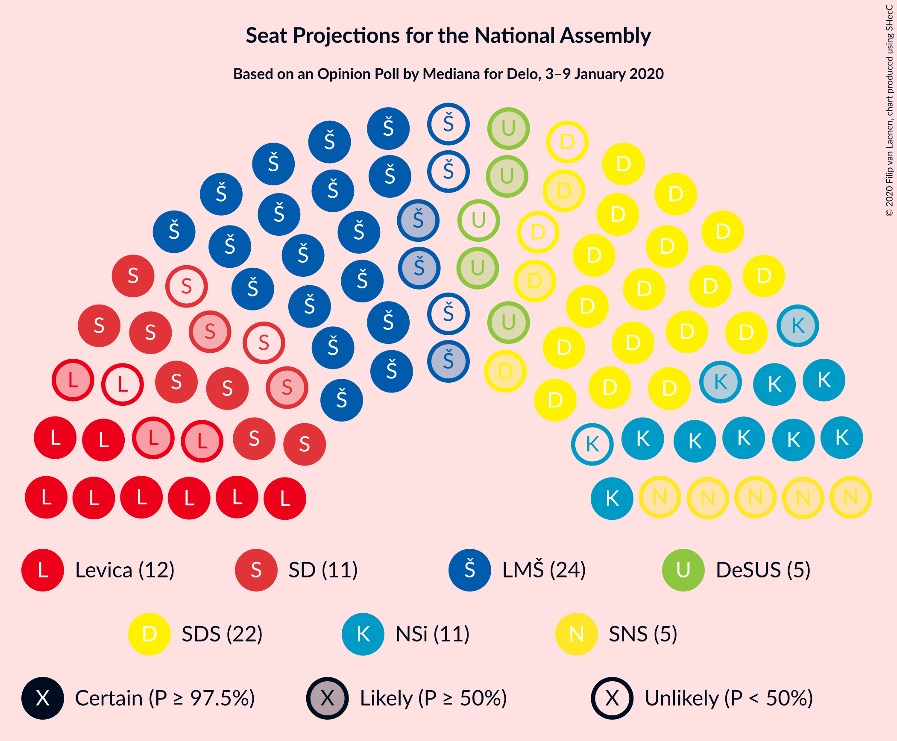
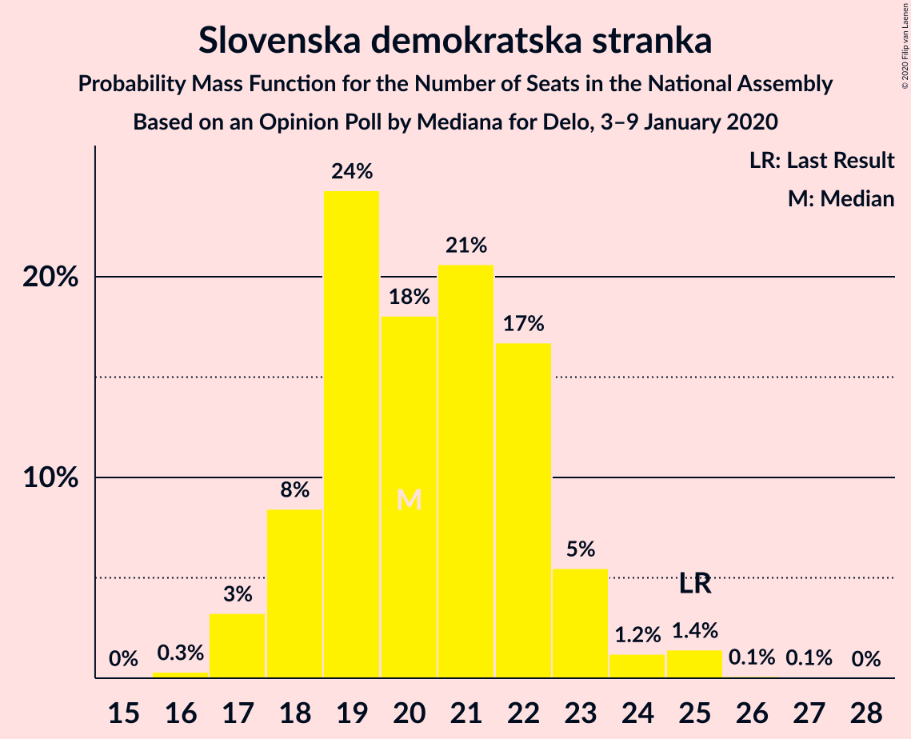
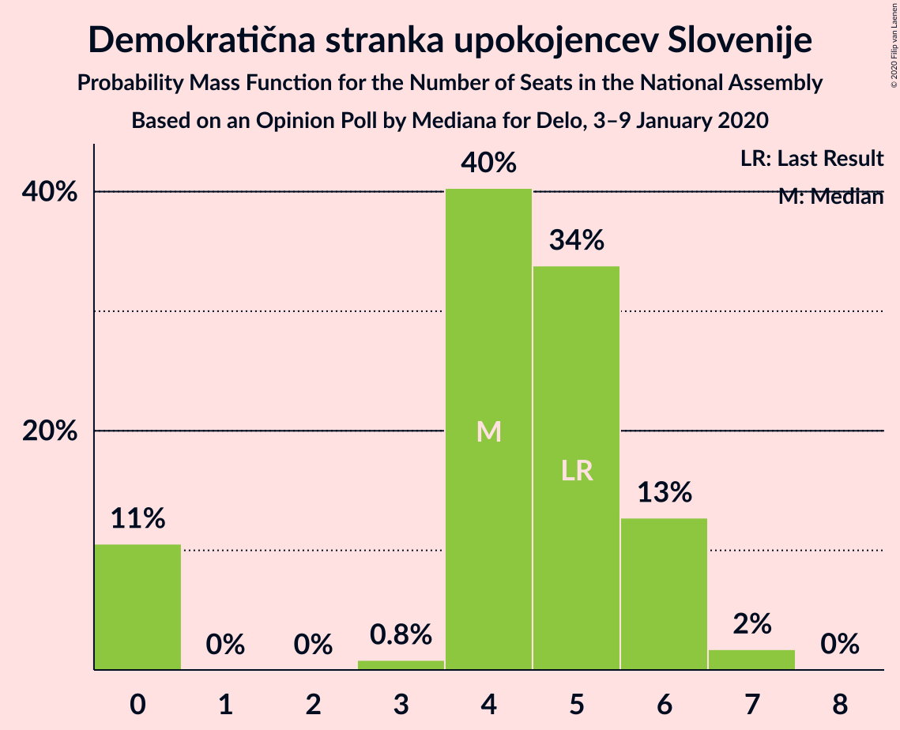
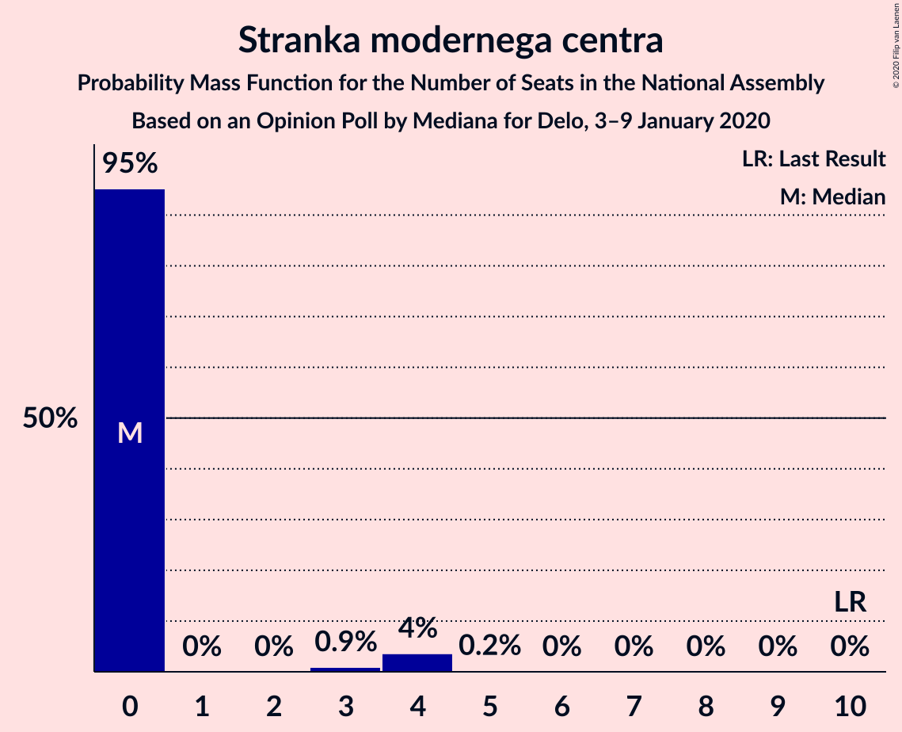
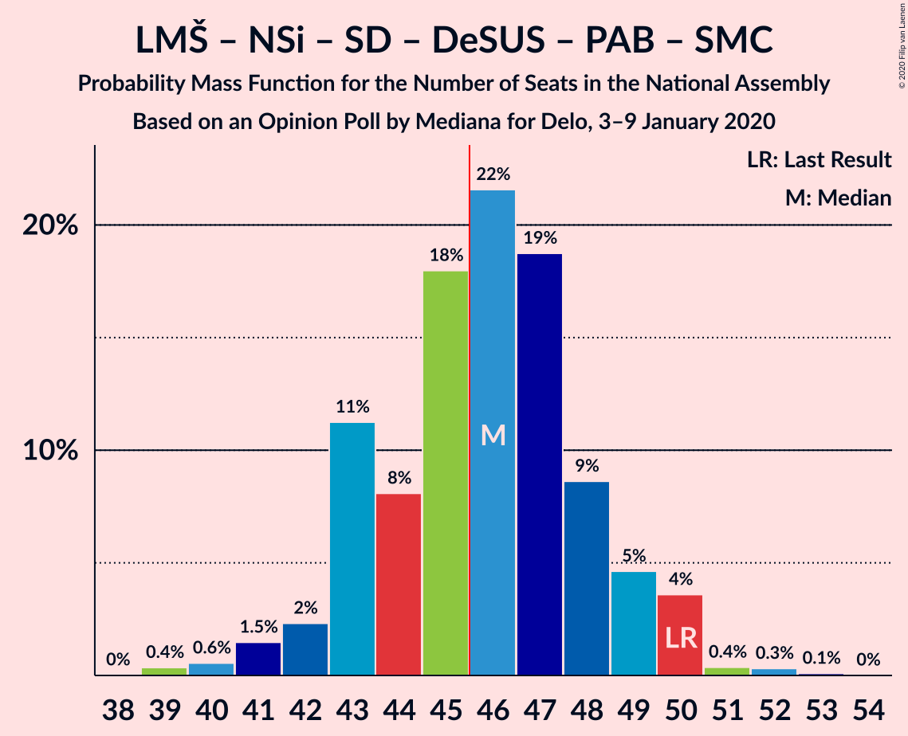
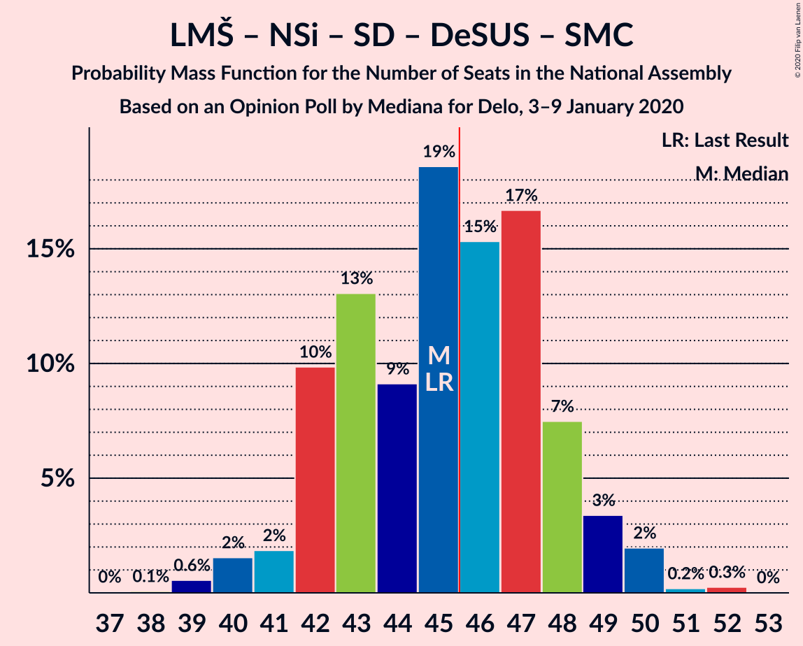
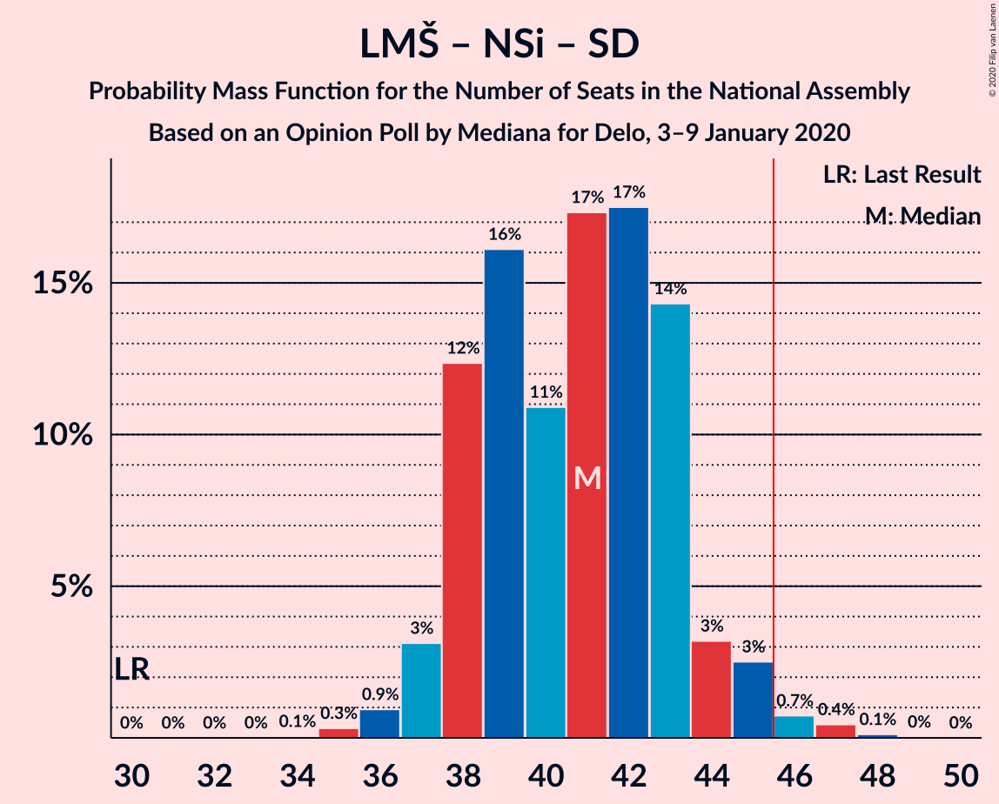
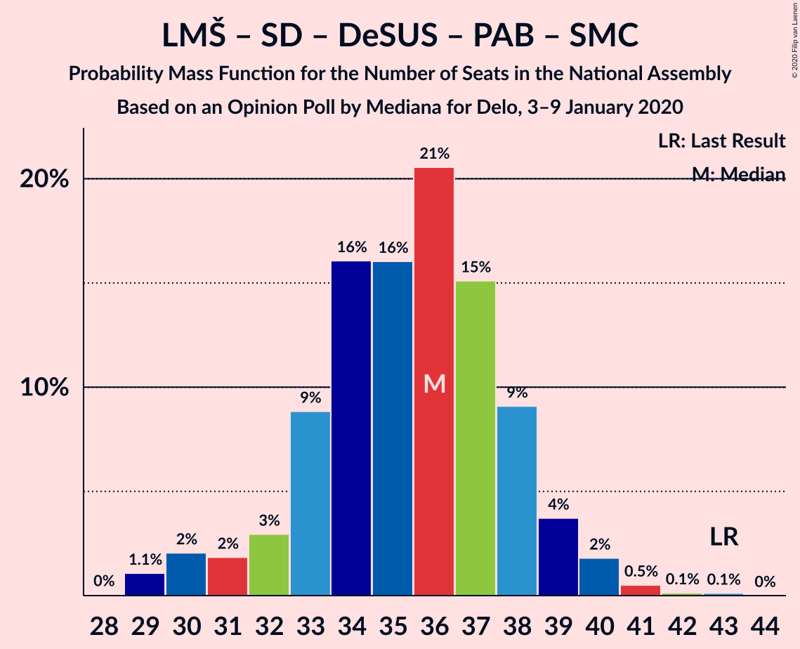
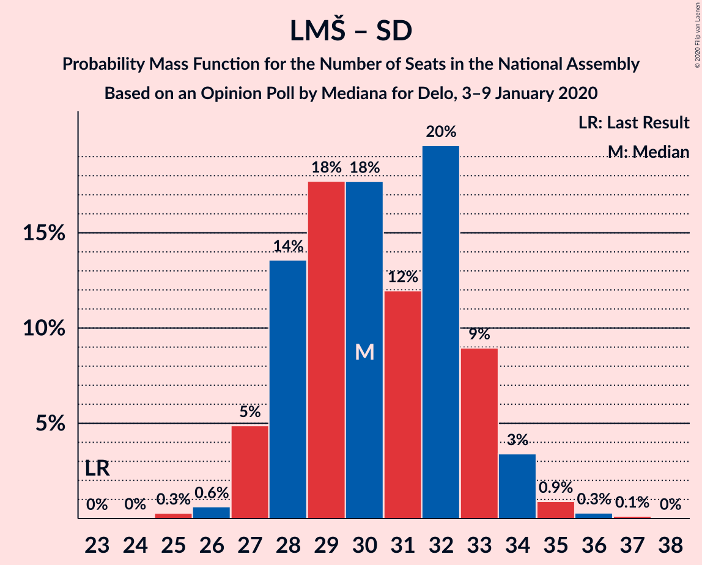

# Opinion Poll by Mediana for Delo, 3–9 January 2020

<a href="#voting-intentions">Voting Intentions</a> | <a href="#seats">Seats</a> | <a href="#coalitions">Coalitions</a> | <a href="#technical-information">Technical Information</a>

## Voting Intentions

### Confidence Intervals

| Party | Last Result | Poll Result | 80% Confidence Interval | 90% Confidence Interval | 95% Confidence Interval | 99% Confidence Interval |
|:-----:|:-----------:|:-----------:|:-----------------------:|:-----------------------:|:-----------------------:|:-----------------------:|
| Lista Marjana Šarca | 12.6% | 22.3% | 20.4–24.4% |19.8–24.9% |19.4–25.5% |18.5–26.5% |
| Slovenska demokratska stranka | 24.9% | 21.2% | 19.3–23.2% |18.8–23.8% |18.3–24.3% |17.5–25.3% |
| Levica | 9.3% | 11.2% | 9.8–12.8% |9.4–13.3% |9.1–13.7% |8.5–14.5% |
| Nova Slovenija–Krščanski demokrati | 7.2% | 10.9% | 9.6–12.6% |9.2–13.0% |8.9–13.4% |8.2–14.2% |
| Socialni demokrati | 9.9% | 9.5% | 8.3–11.1% |7.9–11.5% |7.6–11.9% |7.0–12.7% |
| Slovenska nacionalna stranka | 4.2% | 5.3% | 4.3–6.5% |4.1–6.8% |3.9–7.1% |3.4–7.8% |
| Demokratična stranka upokojencev Slovenije | 4.9% | 4.8% | 3.9–6.0% |3.7–6.4% |3.5–6.7% |3.1–7.3% |
| Stranka Alenke Bratušek | 5.1% | 3.2% | 2.5–4.2% |2.3–4.5% |2.1–4.7% |1.8–5.3% |
| Stranka modernega centra | 9.7% | 2.8% | 2.1–3.7% |2.0–4.0% |1.8–4.2% |1.5–4.7% |
| Slovenska ljudska stranka | 2.6% | 1.9% | 1.4–2.8% |1.3–3.0% |1.2–3.2% |0.9–3.7% |

*Note:* The poll result column reflects the actual value used in the calculations. Published results may vary slightly, and in addition be rounded to fewer digits.

## Seats

### Confidence Intervals

| Party | Last Result | Median | 80% Confidence Interval | 90% Confidence Interval | 95% Confidence Interval | 99% Confidence Interval |
|:-----:|:-----------:|:------:|:-----------------------:|:-----------------------:|:-----------------------:|:-----------------------:|
| <a href="#lista-marjana-šarca">Lista Marjana Šarca</a> | 13 | 21 | 19–24 |19–24 |18–25 |18–26 |
| <a href="#slovenska-demokratska-stranka">Slovenska demokratska stranka</a> | 25 | 20 | 18–22 |18–23 |17–24 |17–25 |
| <a href="#levica">Levica</a> | 9 | 11 | 9–12 |9–13 |8–13 |8–14 |
| <a href="#nova-slovenija–krščanski-demokrati">Nova Slovenija–Krščanski demokrati</a> | 7 | 10 | 9–12 |8–12 |8–13 |8–13 |
| <a href="#socialni-demokrati">Socialni demokrati</a> | 10 | 9 | 7–11 |7–11 |7–12 |6–12 |
| <a href="#slovenska-nacionalna-stranka">Slovenska nacionalna stranka</a> | 4 | 5 | 4–6 |3–6 |0–7 |0–7 |
| <a href="#demokratična-stranka-upokojencev-slovenije">Demokratična stranka upokojencev Slovenije</a> | 5 | 4 | 0–6 |0–6 |0–6 |0–7 |
| <a href="#stranka-alenke-bratušek">Stranka Alenke Bratušek</a> | 5 | 0 | 0–4 |0–4 |0–4 |0–5 |
| <a href="#stranka-modernega-centra">Stranka modernega centra</a> | 10 | 0 | 0 |0 |0–4 |0–4 |
| <a href="#slovenska-ljudska-stranka">Slovenska ljudska stranka</a> | 0 | 0 | 0 |0 |0 |0 |

### Lista Marjana Šarca

*For a full overview of the results for this party, see the [Lista Marjana Šarca](party-listamarjanašarca.html) page.*

| Number of Seats | Probability | Accumulated | Special Marks |
|:---------------:|:-----------:|:-----------:|:-------------:|
| 13 | 0% | 100% | Last Result |
| 14 | 0% | 100% |  |
| 15 | 0% | 100% |  |
| 16 | 0% | 100% |  |
| 17 | 0.3% | 100% |  |
| 18 | 4% | 99.7% |  |
| 19 | 6% | 95% |  |
| 20 | 19% | 89% |  |
| 21 | 26% | 70% | Median |
| 22 | 16% | 43% |  |
| 23 | 15% | 27% |  |
| 24 | 9% | 12% |  |
| 25 | 2% | 3% |  |
| 26 | 0.5% | 0.8% |  |
| 27 | 0.2% | 0.3% |  |
| 28 | 0% | 0% |  |

### Slovenska demokratska stranka

*For a full overview of the results for this party, see the [Slovenska demokratska stranka](party-slovenskademokratskastranka.html) page.*

| Number of Seats | Probability | Accumulated | Special Marks |
|:---------------:|:-----------:|:-----------:|:-------------:|
| 16 | 0.3% | 100% |  |
| 17 | 3% | 99.7% |  |
| 18 | 8% | 96% |  |
| 19 | 24% | 88% |  |
| 20 | 18% | 64% | Median |
| 21 | 21% | 46% |  |
| 22 | 17% | 25% |  |
| 23 | 5% | 8% |  |
| 24 | 1.2% | 3% |  |
| 25 | 1.4% | 2% | Last Result |
| 26 | 0.1% | 0.2% |  |
| 27 | 0.1% | 0.1% |  |
| 28 | 0% | 0% |  |

### Levica

*For a full overview of the results for this party, see the [Levica](party-levica.html) page.*

| Number of Seats | Probability | Accumulated | Special Marks |
|:---------------:|:-----------:|:-----------:|:-------------:|
| 7 | 0.2% | 100% |  |
| 8 | 4% | 99.8% |  |
| 9 | 14% | 96% | Last Result |
| 10 | 24% | 82% |  |
| 11 | 28% | 58% | Median |
| 12 | 22% | 30% |  |
| 13 | 7% | 9% |  |
| 14 | 1.1% | 1.4% |  |
| 15 | 0.2% | 0.3% |  |
| 16 | 0% | 0% |  |

### Nova Slovenija–Krščanski demokrati

*For a full overview of the results for this party, see the [Nova Slovenija–Krščanski demokrati](party-novaslovenija–krščanskidemokrati.html) page.*

| Number of Seats | Probability | Accumulated | Special Marks |
|:---------------:|:-----------:|:-----------:|:-------------:|
| 7 | 0.4% | 100% | Last Result |
| 8 | 5% | 99.5% |  |
| 9 | 13% | 95% |  |
| 10 | 38% | 82% | Median |
| 11 | 30% | 44% |  |
| 12 | 9% | 13% |  |
| 13 | 4% | 4% |  |
| 14 | 0.4% | 0.5% |  |
| 15 | 0.1% | 0.1% |  |
| 16 | 0% | 0% |  |

### Socialni demokrati

*For a full overview of the results for this party, see the [Socialni demokrati](party-socialnidemokrati.html) page.*

| Number of Seats | Probability | Accumulated | Special Marks |
|:---------------:|:-----------:|:-----------:|:-------------:|
| 6 | 0.6% | 100% |  |
| 7 | 9% | 99.4% |  |
| 8 | 29% | 90% |  |
| 9 | 32% | 61% | Median |
| 10 | 18% | 29% | Last Result |
| 11 | 8% | 11% |  |
| 12 | 3% | 3% |  |
| 13 | 0.1% | 0.2% |  |
| 14 | 0% | 0% |  |

### Slovenska nacionalna stranka

*For a full overview of the results for this party, see the [Slovenska nacionalna stranka](party-slovenskanacionalnastranka.html) page.*

| Number of Seats | Probability | Accumulated | Special Marks |
|:---------------:|:-----------:|:-----------:|:-------------:|
| 0 | 4% | 100% |  |
| 1 | 0% | 96% |  |
| 2 | 0% | 96% |  |
| 3 | 0.6% | 96% |  |
| 4 | 34% | 95% | Last Result |
| 5 | 43% | 61% | Median |
| 6 | 14% | 18% |  |
| 7 | 4% | 4% |  |
| 8 | 0.4% | 0.4% |  |
| 9 | 0% | 0% |  |

### Demokratična stranka upokojencev Slovenije

*For a full overview of the results for this party, see the [Demokratična stranka upokojencev Slovenije](party-demokratičnastrankaupokojencevslovenije.html) page.*

| Number of Seats | Probability | Accumulated | Special Marks |
|:---------------:|:-----------:|:-----------:|:-------------:|
| 0 | 11% | 100% |  |
| 1 | 0% | 89% |  |
| 2 | 0% | 89% |  |
| 3 | 0.8% | 89% |  |
| 4 | 40% | 89% | Median |
| 5 | 34% | 48% | Last Result |
| 6 | 13% | 15% |  |
| 7 | 2% | 2% |  |
| 8 | 0% | 0% |  |

### Stranka Alenke Bratušek

*For a full overview of the results for this party, see the [Stranka Alenke Bratušek](party-strankaalenkebratušek.html) page.*

| Number of Seats | Probability | Accumulated | Special Marks |
|:---------------:|:-----------:|:-----------:|:-------------:|
| 0 | 83% | 100% | Median |
| 1 | 0% | 17% |  |
| 2 | 0% | 17% |  |
| 3 | 2% | 17% |  |
| 4 | 14% | 14% |  |
| 5 | 0.5% | 0.5% | Last Result |
| 6 | 0% | 0% |  |

### Stranka modernega centra

*For a full overview of the results for this party, see the [Stranka modernega centra](party-strankamodernegacentra.html) page.*

| Number of Seats | Probability | Accumulated | Special Marks |
|:---------------:|:-----------:|:-----------:|:-------------:|
| 0 | 95% | 100% | Median |
| 1 | 0% | 5% |  |
| 2 | 0% | 5% |  |
| 3 | 0.9% | 5% |  |
| 4 | 4% | 4% |  |
| 5 | 0.2% | 0.2% |  |
| 6 | 0% | 0% |  |
| 7 | 0% | 0% |  |
| 8 | 0% | 0% |  |
| 9 | 0% | 0% |  |
| 10 | 0% | 0% | Last Result |

### Slovenska ljudska stranka

*For a full overview of the results for this party, see the [Slovenska ljudska stranka](party-slovenskaljudskastranka.html) page.*

| Number of Seats | Probability | Accumulated | Special Marks |
|:---------------:|:-----------:|:-----------:|:-------------:|
| 0 | 99.9% | 100% | Last Result, Median |
| 1 | 0% | 0.1% |  |
| 2 | 0% | 0.1% |  |
| 3 | 0% | 0.1% |  |
| 4 | 0.1% | 0.1% |  |
| 5 | 0% | 0% |  |

## Coalitions

### Confidence Intervals

| Coalition | Last Result | Median | Majority? | 80% Confidence Interval | 90% Confidence Interval | 95% Confidence Interval | 99% Confidence Interval |
|:---------:|:-----------:|:------:|:---------:|:-----------------------:|:-----------------------:|:-----------------------:|:-----------------------:|
| Lista Marjana Šarca – Nova Slovenija–Krščanski demokrati – Socialni demokrati – Demokratična stranka upokojencev Slovenije – Stranka Alenke Bratušek – Stranka modernega centra | 50 | 46 | 58% | 43–48 | 43–49 | 42–50 | 40–51 |
| Lista Marjana Šarca – Slovenska demokratska stranka – Demokratična stranka upokojencev Slovenije | 43 | 46 | 51% | 43–49 | 42–50 | 41–50 | 40–52 |
| Lista Marjana Šarca – Nova Slovenija–Krščanski demokrati – Socialni demokrati – Demokratična stranka upokojencev Slovenije – Stranka modernega centra | 45 | 45 | 45% | 42–48 | 42–49 | 41–49 | 39–50 |
| Lista Marjana Šarca – Nova Slovenija–Krščanski demokrati – Socialni demokrati – Demokratična stranka upokojencev Slovenije | 35 | 45 | 42% | 42–48 | 42–48 | 40–49 | 39–50 |
| Lista Marjana Šarca – Slovenska demokratska stranka | 38 | 42 | 6% | 39–45 | 38–46 | 37–47 | 37–48 |
| Lista Marjana Šarca – Nova Slovenija–Krščanski demokrati – Socialni demokrati | 30 | 41 | 1.3% | 38–43 | 38–44 | 37–45 | 36–47 |
| Lista Marjana Šarca – Nova Slovenija–Krščanski demokrati – Socialni demokrati – Stranka modernega centra | 40 | 41 | 2% | 38–43 | 38–44 | 37–45 | 36–47 |
| Lista Marjana Šarca – Socialni demokrati – Demokratična stranka upokojencev Slovenije – Stranka Alenke Bratušek – Stranka modernega centra | 43 | 36 | 0% | 33–38 | 31–39 | 30–40 | 29–41 |
| Lista Marjana Šarca – Socialni demokrati – Demokratična stranka upokojencev Slovenije | 28 | 35 | 0% | 32–38 | 31–38 | 30–39 | 29–40 |
| Lista Marjana Šarca – Socialni demokrati – Demokratična stranka upokojencev Slovenije – Stranka modernega centra | 38 | 35 | 0% | 32–38 | 31–38 | 30–39 | 29–40 |
| Lista Marjana Šarca – Socialni demokrati | 23 | 30 | 0% | 28–33 | 27–33 | 27–34 | 26–35 |
| Lista Marjana Šarca – Socialni demokrati – Stranka modernega centra | 33 | 30 | 0% | 28–33 | 27–34 | 27–34 | 26–36 |
| Socialni demokrati – Demokratična stranka upokojencev Slovenije – Stranka modernega centra | 25 | 13 | 0% | 11–16 | 9–17 | 8–17 | 7–18 |

### Lista Marjana Šarca – Nova Slovenija–Krščanski demokrati – Socialni demokrati – Demokratična stranka upokojencev Slovenije – Stranka Alenke Bratušek – Stranka modernega centra

| Number of Seats | Probability | Accumulated | Special Marks |
|:---------------:|:-----------:|:-----------:|:-------------:|
| 39 | 0.4% | 100% |  |
| 40 | 0.6% | 99.6% |  |
| 41 | 1.5% | 99.1% |  |
| 42 | 2% | 98% |  |
| 43 | 11% | 95% |  |
| 44 | 8% | 84% | Median |
| 45 | 18% | 76% |  |
| 46 | 22% | 58% | Majority |
| 47 | 19% | 36% |  |
| 48 | 9% | 18% |  |
| 49 | 5% | 9% |  |
| 50 | 4% | 4% | Last Result |
| 51 | 0.4% | 0.8% |  |
| 52 | 0.3% | 0.4% |  |
| 53 | 0.1% | 0.1% |  |
| 54 | 0% | 0% |  |

### Lista Marjana Šarca – Slovenska demokratska stranka – Demokratična stranka upokojencev Slovenije

| Number of Seats | Probability | Accumulated | Special Marks |
|:---------------:|:-----------:|:-----------:|:-------------:|
| 38 | 0.1% | 100% |  |
| 39 | 0.4% | 99.9% |  |
| 40 | 0.5% | 99.5% |  |
| 41 | 4% | 99.0% |  |
| 42 | 2% | 95% |  |
| 43 | 6% | 93% | Last Result |
| 44 | 13% | 87% |  |
| 45 | 23% | 74% | Median |
| 46 | 8% | 51% | Majority |
| 47 | 15% | 43% |  |
| 48 | 15% | 28% |  |
| 49 | 5% | 12% |  |
| 50 | 5% | 7% |  |
| 51 | 1.4% | 2% |  |
| 52 | 0.4% | 0.7% |  |
| 53 | 0.3% | 0.3% |  |
| 54 | 0% | 0% |  |

### Lista Marjana Šarca – Nova Slovenija–Krščanski demokrati – Socialni demokrati – Demokratična stranka upokojencev Slovenije – Stranka modernega centra

| Number of Seats | Probability | Accumulated | Special Marks |
|:---------------:|:-----------:|:-----------:|:-------------:|
| 37 | 0% | 100% |  |
| 38 | 0.1% | 99.9% |  |
| 39 | 0.6% | 99.9% |  |
| 40 | 2% | 99.3% |  |
| 41 | 2% | 98% |  |
| 42 | 10% | 96% |  |
| 43 | 13% | 86% |  |
| 44 | 9% | 73% | Median |
| 45 | 19% | 64% | Last Result |
| 46 | 15% | 45% | Majority |
| 47 | 17% | 30% |  |
| 48 | 7% | 13% |  |
| 49 | 3% | 6% |  |
| 50 | 2% | 2% |  |
| 51 | 0.2% | 0.5% |  |
| 52 | 0.3% | 0.3% |  |
| 53 | 0% | 0% |  |

### Lista Marjana Šarca – Nova Slovenija–Krščanski demokrati – Socialni demokrati – Demokratična stranka upokojencev Slovenije

| Number of Seats | Probability | Accumulated | Special Marks |
|:---------------:|:-----------:|:-----------:|:-------------:|
| 35 | 0% | 100% | Last Result |
| 36 | 0% | 100% |  |
| 37 | 0.1% | 100% |  |
| 38 | 0.1% | 99.9% |  |
| 39 | 0.8% | 99.8% |  |
| 40 | 2% | 99.0% |  |
| 41 | 2% | 97% |  |
| 42 | 11% | 95% |  |
| 43 | 13% | 84% |  |
| 44 | 10% | 70% | Median |
| 45 | 19% | 60% |  |
| 46 | 14% | 42% | Majority |
| 47 | 15% | 28% |  |
| 48 | 7% | 12% |  |
| 49 | 3% | 5% |  |
| 50 | 1.4% | 2% |  |
| 51 | 0.1% | 0.3% |  |
| 52 | 0.2% | 0.2% |  |
| 53 | 0% | 0% |  |

### Lista Marjana Šarca – Slovenska demokratska stranka

| Number of Seats | Probability | Accumulated | Special Marks |
|:---------------:|:-----------:|:-----------:|:-------------:|
| 36 | 0.4% | 100% |  |
| 37 | 3% | 99.6% |  |
| 38 | 3% | 97% | Last Result |
| 39 | 5% | 93% |  |
| 40 | 17% | 88% |  |
| 41 | 21% | 71% | Median |
| 42 | 16% | 51% |  |
| 43 | 18% | 34% |  |
| 44 | 6% | 17% |  |
| 45 | 4% | 10% |  |
| 46 | 3% | 6% | Majority |
| 47 | 2% | 3% |  |
| 48 | 0.7% | 1.0% |  |
| 49 | 0.3% | 0.4% |  |
| 50 | 0% | 0% |  |

### Lista Marjana Šarca – Nova Slovenija–Krščanski demokrati – Socialni demokrati

| Number of Seats | Probability | Accumulated | Special Marks |
|:---------------:|:-----------:|:-----------:|:-------------:|
| 30 | 0% | 100% | Last Result |
| 31 | 0% | 100% |  |
| 32 | 0% | 100% |  |
| 33 | 0% | 100% |  |
| 34 | 0.1% | 100% |  |
| 35 | 0.3% | 99.9% |  |
| 36 | 0.9% | 99.6% |  |
| 37 | 3% | 98.7% |  |
| 38 | 12% | 96% |  |
| 39 | 16% | 83% |  |
| 40 | 11% | 67% | Median |
| 41 | 17% | 56% |  |
| 42 | 17% | 39% |  |
| 43 | 14% | 21% |  |
| 44 | 3% | 7% |  |
| 45 | 3% | 4% |  |
| 46 | 0.7% | 1.3% | Majority |
| 47 | 0.4% | 0.6% |  |
| 48 | 0.1% | 0.2% |  |
| 49 | 0% | 0% |  |

### Lista Marjana Šarca – Nova Slovenija–Krščanski demokrati – Socialni demokrati – Stranka modernega centra

| Number of Seats | Probability | Accumulated | Special Marks |
|:---------------:|:-----------:|:-----------:|:-------------:|
| 35 | 0.2% | 100% |  |
| 36 | 0.8% | 99.8% |  |
| 37 | 3% | 98.9% |  |
| 38 | 11% | 96% |  |
| 39 | 15% | 85% |  |
| 40 | 10% | 70% | Last Result, Median |
| 41 | 17% | 60% |  |
| 42 | 19% | 43% |  |
| 43 | 15% | 24% |  |
| 44 | 3% | 8% |  |
| 45 | 3% | 5% |  |
| 46 | 0.8% | 2% | Majority |
| 47 | 0.6% | 0.8% |  |
| 48 | 0.2% | 0.2% |  |
| 49 | 0% | 0.1% |  |
| 50 | 0% | 0% |  |

### Lista Marjana Šarca – Socialni demokrati – Demokratična stranka upokojencev Slovenije – Stranka Alenke Bratušek – Stranka modernega centra

| Number of Seats | Probability | Accumulated | Special Marks |
|:---------------:|:-----------:|:-----------:|:-------------:|
| 28 | 0% | 100% |  |
| 29 | 1.1% | 99.9% |  |
| 30 | 2% | 98.9% |  |
| 31 | 2% | 97% |  |
| 32 | 3% | 95% |  |
| 33 | 9% | 92% |  |
| 34 | 16% | 83% | Median |
| 35 | 16% | 67% |  |
| 36 | 21% | 51% |  |
| 37 | 15% | 31% |  |
| 38 | 9% | 15% |  |
| 39 | 4% | 6% |  |
| 40 | 2% | 3% |  |
| 41 | 0.5% | 0.8% |  |
| 42 | 0.1% | 0.3% |  |
| 43 | 0.1% | 0.1% | Last Result |
| 44 | 0% | 0% |  |

### Lista Marjana Šarca – Socialni demokrati – Demokratična stranka upokojencev Slovenije

| Number of Seats | Probability | Accumulated | Special Marks |
|:---------------:|:-----------:|:-----------:|:-------------:|
| 27 | 0.1% | 100% |  |
| 28 | 0.1% | 99.8% | Last Result |
| 29 | 1.4% | 99.7% |  |
| 30 | 3% | 98% |  |
| 31 | 5% | 95% |  |
| 32 | 8% | 90% |  |
| 33 | 14% | 82% |  |
| 34 | 17% | 68% | Median |
| 35 | 14% | 51% |  |
| 36 | 16% | 37% |  |
| 37 | 11% | 21% |  |
| 38 | 8% | 11% |  |
| 39 | 2% | 3% |  |
| 40 | 0.3% | 0.5% |  |
| 41 | 0.2% | 0.2% |  |
| 42 | 0% | 0% |  |

### Lista Marjana Šarca – Socialni demokrati – Demokratična stranka upokojencev Slovenije – Stranka modernega centra

| Number of Seats | Probability | Accumulated | Special Marks |
|:---------------:|:-----------:|:-----------:|:-------------:|
| 27 | 0.1% | 100% |  |
| 28 | 0.1% | 99.9% |  |
| 29 | 1.3% | 99.8% |  |
| 30 | 3% | 98.5% |  |
| 31 | 5% | 96% |  |
| 32 | 8% | 91% |  |
| 33 | 13% | 83% |  |
| 34 | 16% | 70% | Median |
| 35 | 13% | 54% |  |
| 36 | 16% | 41% |  |
| 37 | 13% | 25% |  |
| 38 | 8% | 12% | Last Result |
| 39 | 3% | 4% |  |
| 40 | 0.4% | 0.7% |  |
| 41 | 0.3% | 0.3% |  |
| 42 | 0.1% | 0.1% |  |
| 43 | 0% | 0% |  |

### Lista Marjana Šarca – Socialni demokrati

| Number of Seats | Probability | Accumulated | Special Marks |
|:---------------:|:-----------:|:-----------:|:-------------:|
| 23 | 0% | 100% | Last Result |
| 24 | 0% | 100% |  |
| 25 | 0.3% | 100% |  |
| 26 | 0.6% | 99.7% |  |
| 27 | 5% | 99.1% |  |
| 28 | 14% | 94% |  |
| 29 | 18% | 81% |  |
| 30 | 18% | 63% | Median |
| 31 | 12% | 45% |  |
| 32 | 20% | 33% |  |
| 33 | 9% | 14% |  |
| 34 | 3% | 5% |  |
| 35 | 0.9% | 1.3% |  |
| 36 | 0.3% | 0.4% |  |
| 37 | 0.1% | 0.1% |  |
| 38 | 0% | 0% |  |

### Lista Marjana Šarca – Socialni demokrati – Stranka modernega centra

| Number of Seats | Probability | Accumulated | Special Marks |
|:---------------:|:-----------:|:-----------:|:-------------:|
| 25 | 0.2% | 100% |  |
| 26 | 0.3% | 99.8% |  |
| 27 | 5% | 99.4% |  |
| 28 | 13% | 95% |  |
| 29 | 16% | 82% |  |
| 30 | 16% | 65% | Median |
| 31 | 12% | 49% |  |
| 32 | 20% | 37% |  |
| 33 | 11% | 17% | Last Result |
| 34 | 5% | 6% |  |
| 35 | 1.1% | 2% |  |
| 36 | 0.4% | 0.7% |  |
| 37 | 0.2% | 0.3% |  |
| 38 | 0% | 0.1% |  |
| 39 | 0% | 0% |  |

### Socialni demokrati – Demokratična stranka upokojencev Slovenije – Stranka modernega centra

| Number of Seats | Probability | Accumulated | Special Marks |
|:---------------:|:-----------:|:-----------:|:-------------:|
| 6 | 0.1% | 100% |  |
| 7 | 0.5% | 99.9% |  |
| 8 | 3% | 99.4% |  |
| 9 | 2% | 97% |  |
| 10 | 3% | 94% |  |
| 11 | 5% | 91% |  |
| 12 | 11% | 87% |  |
| 13 | 32% | 76% | Median |
| 14 | 19% | 44% |  |
| 15 | 12% | 25% |  |
| 16 | 7% | 14% |  |
| 17 | 5% | 6% |  |
| 18 | 1.2% | 1.4% |  |
| 19 | 0.2% | 0.2% |  |
| 20 | 0.1% | 0.1% |  |
| 21 | 0% | 0% |  |
| 22 | 0% | 0% |  |
| 23 | 0% | 0% |  |
| 24 | 0% | 0% |  |
| 25 | 0% | 0% | Last Result |

## Technical Information

### Opinion Poll

+ **Polling firm:** Mediana
+ **Commissioner(s):** Delo
+ **Fieldwork period:** 3–9 January 2020

### Calculations

+ **Sample size:** 723
+ **Simulations done:** 1,048,576
+ **Error estimate:** 2.91%

