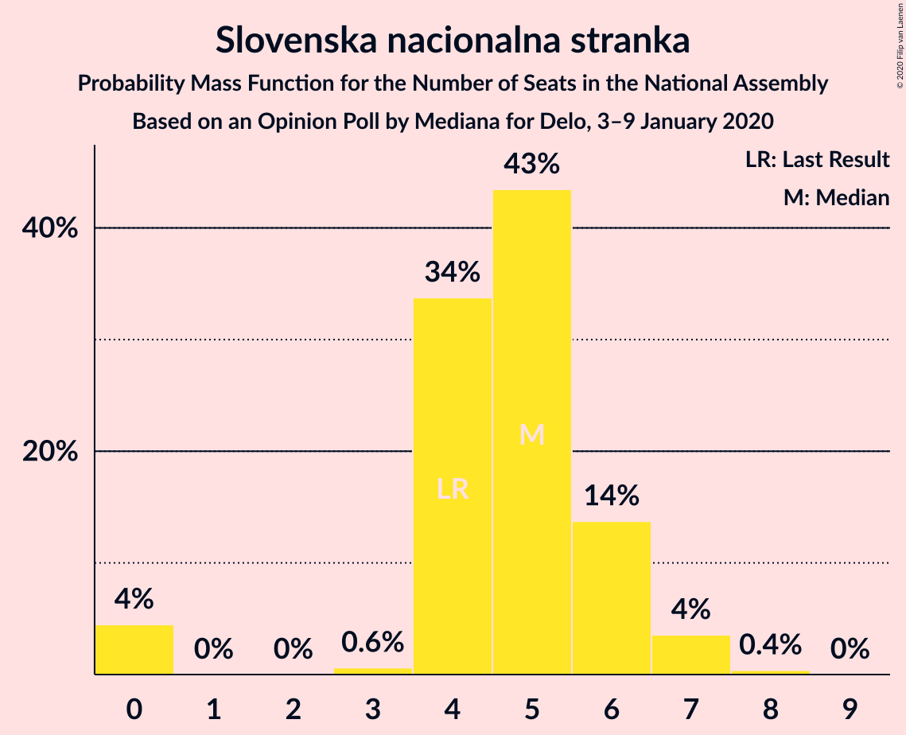
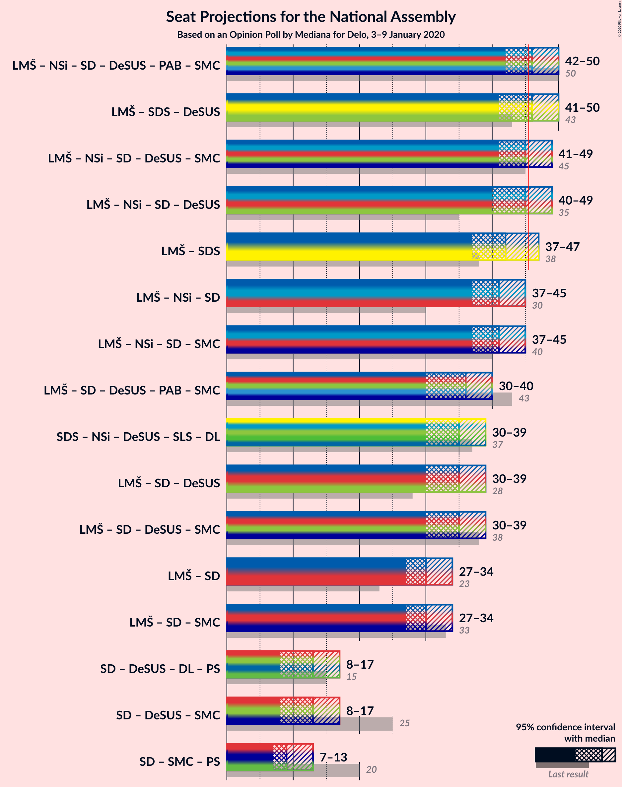
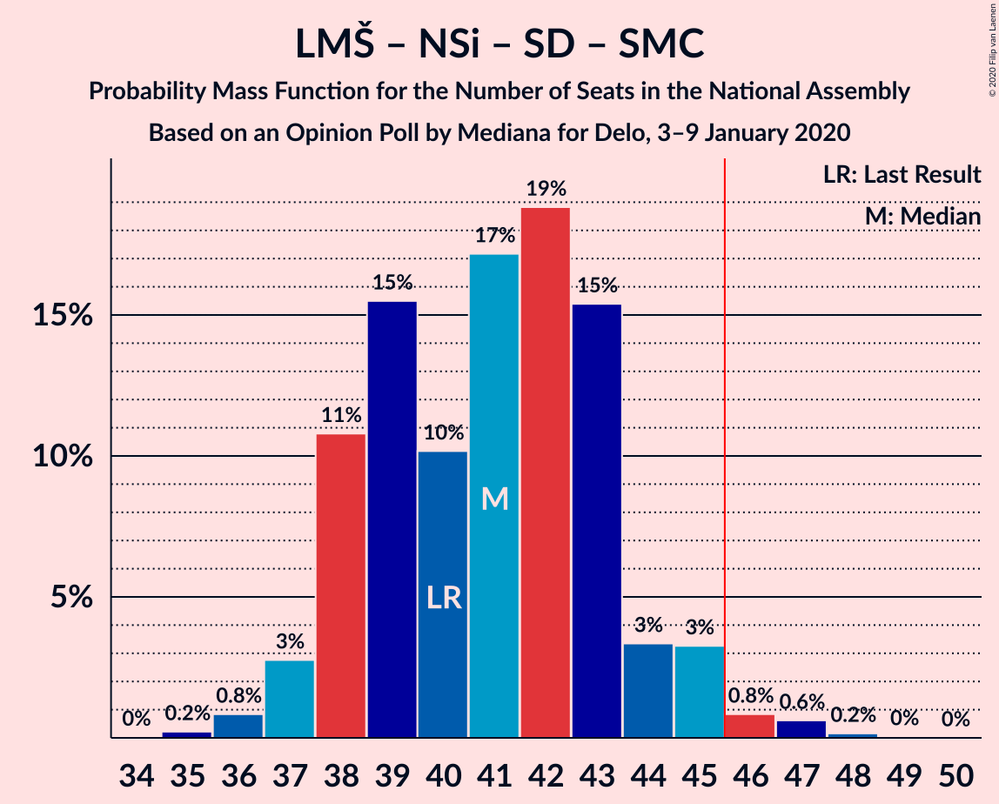

# Opinion Poll by Mediana for Delo, 3–9 January 2020

<a href="#voting-intentions">Voting Intentions</a> | <a href="#seats">Seats</a> | <a href="#coalitions">Coalitions</a> | <a href="#technical-information">Technical Information</a>

## Voting Intentions

### Confidence Intervals

| Party | Last Result | Poll Result | 80% Confidence Interval | 90% Confidence Interval | 95% Confidence Interval | 99% Confidence Interval |
|:-----:|:-----------:|:-----------:|:-----------------------:|:-----------------------:|:-----------------------:|:-----------------------:|
| Lista Marjana Šarca | 12.6% | 22.3% | 20.4–24.4% |19.8–24.9% |19.4–25.5% |18.5–26.5% |
| Slovenska demokratska stranka | 24.9% | 21.2% | 19.3–23.2% |18.8–23.8% |18.3–24.3% |17.5–25.3% |
| Levica | 9.3% | 11.2% | 9.8–12.8% |9.4–13.3% |9.1–13.7% |8.5–14.5% |
| Nova Slovenija–Krščanski demokrati | 7.2% | 10.9% | 9.6–12.6% |9.2–13.0% |8.9–13.4% |8.2–14.2% |
| Socialni demokrati | 9.9% | 9.5% | 8.3–11.1% |7.9–11.5% |7.6–11.9% |7.0–12.7% |
| Slovenska nacionalna stranka | 4.2% | 5.3% | 4.3–6.5% |4.1–6.8% |3.9–7.1% |3.4–7.8% |
| Demokratična stranka upokojencev Slovenije | 4.9% | 4.8% | 3.9–6.0% |3.7–6.4% |3.5–6.7% |3.1–7.3% |
| Stranka Alenke Bratušek | 5.1% | 3.2% | 2.5–4.2% |2.3–4.5% |2.1–4.7% |1.8–5.3% |
| Stranka modernega centra | 9.7% | 2.8% | 2.1–3.7% |2.0–4.0% |1.8–4.2% |1.5–4.7% |
| Slovenska ljudska stranka | 2.6% | 1.9% | 1.4–2.8% |1.3–3.0% |1.2–3.2% |0.9–3.7% |

*Note:* The poll result column reflects the actual value used in the calculations. Published results may vary slightly, and in addition be rounded to fewer digits.

## Seats

### Confidence Intervals

| Party | Last Result | Median | 80% Confidence Interval | 90% Confidence Interval | 95% Confidence Interval | 99% Confidence Interval |
|:-----:|:-----------:|:------:|:-----------------------:|:-----------------------:|:-----------------------:|:-----------------------:|
| <a href="#lista-marjana-šarca">Lista Marjana Šarca</a> | 13 | 23 | 21–26 |21–26 |21–26 |19–26 |
| <a href="#slovenska-demokratska-stranka">Slovenska demokratska stranka</a> | 25 | 21 | 16–21 |16–21 |16–21 |16–22 |
| <a href="#levica">Levica</a> | 9 | 9 | 7–11 |7–12 |7–12 |7–12 |
| <a href="#nova-slovenija–krščanski-demokrati">Nova Slovenija–Krščanski demokrati</a> | 7 | 11 | 9–14 |9–14 |9–14 |8–14 |
| <a href="#socialni-demokrati">Socialni demokrati</a> | 10 | 9 | 8–11 |8–11 |8–12 |8–12 |
| <a href="#slovenska-nacionalna-stranka">Slovenska nacionalna stranka</a> | 4 | 4 | 4–5 |4–5 |4–5 |0–6 |
| <a href="#demokratična-stranka-upokojencev-slovenije">Demokratična stranka upokojencev Slovenije</a> | 5 | 4 | 0–6 |0–6 |0–6 |0–6 |
| <a href="#stranka-alenke-bratušek">Stranka Alenke Bratušek</a> | 5 | 0 | 0–4 |0–4 |0–4 |0–5 |
| <a href="#stranka-modernega-centra">Stranka modernega centra</a> | 10 | 0 | 0–4 |0–4 |0–4 |0–4 |
| <a href="#slovenska-ljudska-stranka">Slovenska ljudska stranka</a> | 0 | 0 | 0 |0 |0 |0 |

### Lista Marjana Šarca

*For a full overview of the results for this party, see the [Lista Marjana Šarca](party-listamarjanašarca.html) page.*

| Number of Seats | Probability | Accumulated | Special Marks |
|:---------------:|:-----------:|:-----------:|:-------------:|
| 13 | 0% | 100% | Last Result |
| 14 | 0% | 100% |  |
| 15 | 0.1% | 100% |  |
| 16 | 0% | 99.9% |  |
| 17 | 0% | 99.9% |  |
| 18 | 0% | 99.9% |  |
| 19 | 0.8% | 99.8% |  |
| 20 | 0% | 99.1% |  |
| 21 | 21% | 99.0% |  |
| 22 | 22% | 78% |  |
| 23 | 26% | 56% | Median |
| 24 | 0.6% | 30% |  |
| 25 | 0% | 29% |  |
| 26 | 29% | 29% |  |
| 27 | 0% | 0% |  |

### Slovenska demokratska stranka

*For a full overview of the results for this party, see the [Slovenska demokratska stranka](party-slovenskademokratskastranka.html) page.*

| Number of Seats | Probability | Accumulated | Special Marks |
|:---------------:|:-----------:|:-----------:|:-------------:|
| 15 | 0.4% | 100% |  |
| 16 | 15% | 99.6% |  |
| 17 | 0.1% | 85% |  |
| 18 | 3% | 85% |  |
| 19 | 23% | 82% |  |
| 20 | 0.2% | 59% |  |
| 21 | 58% | 59% | Median |
| 22 | 0.5% | 0.7% |  |
| 23 | 0% | 0.2% |  |
| 24 | 0.1% | 0.2% |  |
| 25 | 0% | 0.2% | Last Result |
| 26 | 0.2% | 0.2% |  |
| 27 | 0% | 0% |  |

### Levica

*For a full overview of the results for this party, see the [Levica](party-levica.html) page.*

| Number of Seats | Probability | Accumulated | Special Marks |
|:---------------:|:-----------:|:-----------:|:-------------:|
| 7 | 25% | 100% |  |
| 8 | 0.3% | 75% |  |
| 9 | 29% | 75% | Last Result, Median |
| 10 | 1.0% | 45% |  |
| 11 | 38% | 44% |  |
| 12 | 6% | 7% |  |
| 13 | 0% | 0.1% |  |
| 14 | 0% | 0.1% |  |
| 15 | 0% | 0.1% |  |
| 16 | 0% | 0.1% |  |
| 17 | 0.1% | 0.1% |  |
| 18 | 0% | 0% |  |

### Nova Slovenija–Krščanski demokrati

*For a full overview of the results for this party, see the [Nova Slovenija–Krščanski demokrati](party-novaslovenija–krščanskidemokrati.html) page.*

| Number of Seats | Probability | Accumulated | Special Marks |
|:---------------:|:-----------:|:-----------:|:-------------:|
| 7 | 0% | 100% | Last Result |
| 8 | 1.2% | 100% |  |
| 9 | 26% | 98.8% |  |
| 10 | 7% | 73% |  |
| 11 | 20% | 67% | Median |
| 12 | 0.4% | 47% |  |
| 13 | 28% | 46% |  |
| 14 | 18% | 18% |  |
| 15 | 0% | 0% |  |

### Socialni demokrati

*For a full overview of the results for this party, see the [Socialni demokrati](party-socialnidemokrati.html) page.*

| Number of Seats | Probability | Accumulated | Special Marks |
|:---------------:|:-----------:|:-----------:|:-------------:|
| 7 | 0.3% | 100% |  |
| 8 | 26% | 99.7% |  |
| 9 | 56% | 74% | Median |
| 10 | 0.4% | 18% | Last Result |
| 11 | 15% | 17% |  |
| 12 | 2% | 3% |  |
| 13 | 0.4% | 0.4% |  |
| 14 | 0% | 0% |  |

### Slovenska nacionalna stranka

*For a full overview of the results for this party, see the [Slovenska nacionalna stranka](party-slovenskanacionalnastranka.html) page.*

| Number of Seats | Probability | Accumulated | Special Marks |
|:---------------:|:-----------:|:-----------:|:-------------:|
| 0 | 0.5% | 100% |  |
| 1 | 0% | 99.5% |  |
| 2 | 0% | 99.5% |  |
| 3 | 0% | 99.5% |  |
| 4 | 55% | 99.5% | Last Result, Median |
| 5 | 43% | 44% |  |
| 6 | 1.4% | 1.4% |  |
| 7 | 0.1% | 0.1% |  |
| 8 | 0% | 0% |  |

### Demokratična stranka upokojencev Slovenije

*For a full overview of the results for this party, see the [Demokratična stranka upokojencev Slovenije](party-demokratičnastrankaupokojencevslovenije.html) page.*

| Number of Seats | Probability | Accumulated | Special Marks |
|:---------------:|:-----------:|:-----------:|:-------------:|
| 0 | 46% | 100% |  |
| 1 | 0% | 54% |  |
| 2 | 0% | 54% |  |
| 3 | 0.6% | 54% |  |
| 4 | 27% | 53% | Median |
| 5 | 0.3% | 26% | Last Result |
| 6 | 25% | 26% |  |
| 7 | 0.4% | 0.5% |  |
| 8 | 0% | 0% |  |

### Stranka Alenke Bratušek

*For a full overview of the results for this party, see the [Stranka Alenke Bratušek](party-strankaalenkebratušek.html) page.*

| Number of Seats | Probability | Accumulated | Special Marks |
|:---------------:|:-----------:|:-----------:|:-------------:|
| 0 | 82% | 100% | Median |
| 1 | 0% | 18% |  |
| 2 | 0% | 18% |  |
| 3 | 0% | 18% |  |
| 4 | 17% | 18% |  |
| 5 | 0.6% | 0.6% | Last Result |
| 6 | 0% | 0% |  |

### Stranka modernega centra

*For a full overview of the results for this party, see the [Stranka modernega centra](party-strankamodernegacentra.html) page.*

| Number of Seats | Probability | Accumulated | Special Marks |
|:---------------:|:-----------:|:-----------:|:-------------:|
| 0 | 75% | 100% | Median |
| 1 | 0% | 25% |  |
| 2 | 0% | 25% |  |
| 3 | 0% | 25% |  |
| 4 | 25% | 25% |  |
| 5 | 0% | 0% |  |
| 6 | 0% | 0% |  |
| 7 | 0% | 0% |  |
| 8 | 0% | 0% |  |
| 9 | 0% | 0% |  |
| 10 | 0% | 0% | Last Result |

### Slovenska ljudska stranka

*For a full overview of the results for this party, see the [Slovenska ljudska stranka](party-slovenskaljudskastranka.html) page.*

| Number of Seats | Probability | Accumulated | Special Marks |
|:---------------:|:-----------:|:-----------:|:-------------:|
| 0 | 100% | 100% | Last Result, Median |

## Coalitions

### Confidence Intervals

| Coalition | Last Result | Median | Majority? | 80% Confidence Interval | 90% Confidence Interval | 95% Confidence Interval | 99% Confidence Interval |
|:---------:|:-----------:|:------:|:---------:|:-----------------------:|:-----------------------:|:-----------------------:|:-----------------------:|
| Lista Marjana Šarca – Nova Slovenija–Krščanski demokrati – Socialni demokrati – Demokratična stranka upokojencev Slovenije – Stranka Alenke Bratušek – Stranka modernega centra | 50 | 48 | 93% | 46–50 | 44–50 | 44–50 | 44–52 |
| Lista Marjana Šarca – Nova Slovenija–Krščanski demokrati – Socialni demokrati – Demokratična stranka upokojencev Slovenije – Stranka modernega centra | 45 | 48 | 75% | 45–50 | 44–50 | 44–50 | 41–52 |
| Lista Marjana Šarca – Slovenska demokratska stranka – Demokratična stranka upokojencev Slovenije | 43 | 47 | 59% | 41–50 | 41–50 | 41–50 | 38–50 |
| Lista Marjana Šarca – Nova Slovenija–Krščanski demokrati – Socialni demokrati – Demokratična stranka upokojencev Slovenije | 35 | 46 | 75% | 45–48 | 44–48 | 44–49 | 41–52 |
| Lista Marjana Šarca – Nova Slovenija–Krščanski demokrati – Socialni demokrati | 30 | 43 | 30% | 40–48 | 40–48 | 40–48 | 38–52 |
| Lista Marjana Šarca – Nova Slovenija–Krščanski demokrati – Socialni demokrati – Stranka modernega centra | 40 | 44 | 30% | 42–48 | 40–48 | 40–48 | 38–52 |
| Lista Marjana Šarca – Slovenska demokratska stranka | 38 | 44 | 28% | 37–47 | 37–47 | 37–47 | 35–47 |
| Lista Marjana Šarca – Socialni demokrati – Demokratična stranka upokojencev Slovenije – Stranka Alenke Bratušek – Stranka modernega centra | 43 | 35 | 0% | 35–41 | 34–41 | 34–41 | 33–41 |
| Lista Marjana Šarca – Socialni demokrati – Demokratična stranka upokojencev Slovenije – Stranka modernega centra | 38 | 35 | 0% | 31–41 | 31–41 | 31–41 | 29–41 |
| Lista Marjana Šarca – Socialni demokrati – Demokratična stranka upokojencev Slovenije | 28 | 35 | 0% | 31–37 | 31–37 | 31–38 | 29–40 |
| Lista Marjana Šarca – Socialni demokrati | 23 | 31 | 0% | 31–35 | 30–35 | 30–35 | 29–38 |
| Lista Marjana Šarca – Socialni demokrati – Stranka modernega centra | 33 | 35 | 0% | 31–35 | 30–35 | 30–35 | 29–38 |
| Socialni demokrati – Demokratična stranka upokojencev Slovenije – Stranka modernega centra | 25 | 13 | 0% | 9–18 | 9–18 | 9–18 | 8–18 |

### Lista Marjana Šarca – Nova Slovenija–Krščanski demokrati – Socialni demokrati – Demokratična stranka upokojencev Slovenije – Stranka Alenke Bratušek – Stranka modernega centra

| Number of Seats | Probability | Accumulated | Special Marks |
|:---------------:|:-----------:|:-----------:|:-------------:|
| 42 | 0.1% | 100% |  |
| 43 | 0% | 99.9% |  |
| 44 | 7% | 99.9% |  |
| 45 | 0% | 93% |  |
| 46 | 7% | 93% | Majority |
| 47 | 14% | 86% | Median |
| 48 | 27% | 72% |  |
| 49 | 17% | 44% |  |
| 50 | 25% | 27% | Last Result |
| 51 | 0% | 2% |  |
| 52 | 2% | 2% |  |
| 53 | 0.1% | 0.1% |  |
| 54 | 0% | 0% |  |

### Lista Marjana Šarca – Nova Slovenija–Krščanski demokrati – Socialni demokrati – Demokratična stranka upokojencev Slovenije – Stranka modernega centra

| Number of Seats | Probability | Accumulated | Special Marks |
|:---------------:|:-----------:|:-----------:|:-------------:|
| 40 | 0.2% | 100% |  |
| 41 | 0.6% | 99.8% |  |
| 42 | 0.6% | 99.2% |  |
| 43 | 0% | 98.6% |  |
| 44 | 7% | 98.6% |  |
| 45 | 16% | 92% | Last Result |
| 46 | 6% | 75% | Majority |
| 47 | 14% | 70% | Median |
| 48 | 27% | 56% |  |
| 49 | 0.7% | 28% |  |
| 50 | 25% | 27% |  |
| 51 | 0% | 2% |  |
| 52 | 2% | 2% |  |
| 53 | 0% | 0% |  |

### Lista Marjana Šarca – Slovenska demokratska stranka – Demokratična stranka upokojencev Slovenije

| Number of Seats | Probability | Accumulated | Special Marks |
|:---------------:|:-----------:|:-----------:|:-------------:|
| 38 | 0.6% | 100% |  |
| 39 | 0.6% | 99.4% |  |
| 40 | 0.1% | 98.8% |  |
| 41 | 30% | 98.8% |  |
| 42 | 0.4% | 69% |  |
| 43 | 0.1% | 68% | Last Result |
| 44 | 9% | 68% |  |
| 45 | 0% | 59% |  |
| 46 | 0.6% | 59% | Majority |
| 47 | 33% | 59% |  |
| 48 | 0.3% | 26% | Median |
| 49 | 0% | 25% |  |
| 50 | 25% | 25% |  |
| 51 | 0% | 0.2% |  |
| 52 | 0.2% | 0.2% |  |
| 53 | 0% | 0% |  |

### Lista Marjana Šarca – Nova Slovenija–Krščanski demokrati – Socialni demokrati – Demokratična stranka upokojencev Slovenije

| Number of Seats | Probability | Accumulated | Special Marks |
|:---------------:|:-----------:|:-----------:|:-------------:|
| 35 | 0% | 100% | Last Result |
| 36 | 0% | 100% |  |
| 37 | 0% | 100% |  |
| 38 | 0.1% | 100% |  |
| 39 | 0% | 99.9% |  |
| 40 | 0.2% | 99.9% |  |
| 41 | 0.6% | 99.7% |  |
| 42 | 0.5% | 99.1% |  |
| 43 | 0% | 98.6% |  |
| 44 | 7% | 98.6% |  |
| 45 | 16% | 92% |  |
| 46 | 31% | 75% | Majority |
| 47 | 14% | 45% | Median |
| 48 | 27% | 30% |  |
| 49 | 0.7% | 3% |  |
| 50 | 0% | 2% |  |
| 51 | 0% | 2% |  |
| 52 | 2% | 2% |  |
| 53 | 0% | 0% |  |

### Lista Marjana Šarca – Nova Slovenija–Krščanski demokrati – Socialni demokrati

| Number of Seats | Probability | Accumulated | Special Marks |
|:---------------:|:-----------:|:-----------:|:-------------:|
| 30 | 0% | 100% | Last Result |
| 31 | 0% | 100% |  |
| 32 | 0% | 100% |  |
| 33 | 0% | 100% |  |
| 34 | 0% | 100% |  |
| 35 | 0% | 100% |  |
| 36 | 0% | 100% |  |
| 37 | 0.2% | 100% |  |
| 38 | 0.6% | 99.7% |  |
| 39 | 0.2% | 99.1% |  |
| 40 | 32% | 99.0% |  |
| 41 | 0% | 67% |  |
| 42 | 6% | 67% |  |
| 43 | 14% | 61% | Median |
| 44 | 0% | 46% |  |
| 45 | 17% | 46% |  |
| 46 | 0.2% | 30% | Majority |
| 47 | 0.2% | 30% |  |
| 48 | 27% | 29% |  |
| 49 | 0% | 2% |  |
| 50 | 0% | 2% |  |
| 51 | 0% | 2% |  |
| 52 | 2% | 2% |  |
| 53 | 0% | 0% |  |

### Lista Marjana Šarca – Nova Slovenija–Krščanski demokrati – Socialni demokrati – Stranka modernega centra

| Number of Seats | Probability | Accumulated | Special Marks |
|:---------------:|:-----------:|:-----------:|:-------------:|
| 37 | 0.2% | 100% |  |
| 38 | 0.6% | 99.8% |  |
| 39 | 0.1% | 99.2% |  |
| 40 | 7% | 99.1% | Last Result |
| 41 | 0% | 92% |  |
| 42 | 7% | 92% |  |
| 43 | 14% | 86% | Median |
| 44 | 25% | 71% |  |
| 45 | 17% | 46% |  |
| 46 | 0.2% | 30% | Majority |
| 47 | 0.2% | 30% |  |
| 48 | 27% | 29% |  |
| 49 | 0% | 2% |  |
| 50 | 0% | 2% |  |
| 51 | 0% | 2% |  |
| 52 | 2% | 2% |  |
| 53 | 0% | 0% |  |

### Lista Marjana Šarca – Slovenska demokratska stranka

| Number of Seats | Probability | Accumulated | Special Marks |
|:---------------:|:-----------:|:-----------:|:-------------:|
| 35 | 0.6% | 100% |  |
| 36 | 0% | 99.4% |  |
| 37 | 14% | 99.3% |  |
| 38 | 0.5% | 85% | Last Result |
| 39 | 0.6% | 85% |  |
| 40 | 7% | 84% |  |
| 41 | 16% | 77% |  |
| 42 | 0% | 61% |  |
| 43 | 6% | 61% |  |
| 44 | 27% | 55% | Median |
| 45 | 0.2% | 28% |  |
| 46 | 0.2% | 28% | Majority |
| 47 | 27% | 27% |  |
| 48 | 0% | 0% |  |

### Lista Marjana Šarca – Socialni demokrati – Demokratična stranka upokojencev Slovenije – Stranka Alenke Bratušek – Stranka modernega centra

| Number of Seats | Probability | Accumulated | Special Marks |
|:---------------:|:-----------:|:-----------:|:-------------:|
| 31 | 0.1% | 100% |  |
| 32 | 0% | 99.9% |  |
| 33 | 0.5% | 99.9% |  |
| 34 | 7% | 99.4% |  |
| 35 | 50% | 93% |  |
| 36 | 14% | 43% | Median |
| 37 | 0% | 29% |  |
| 38 | 3% | 29% |  |
| 39 | 0.2% | 26% |  |
| 40 | 0.8% | 26% |  |
| 41 | 25% | 25% |  |
| 42 | 0% | 0.1% |  |
| 43 | 0% | 0.1% | Last Result |
| 44 | 0% | 0.1% |  |
| 45 | 0% | 0% |  |

### Lista Marjana Šarca – Socialni demokrati – Demokratična stranka upokojencev Slovenije – Stranka modernega centra

| Number of Seats | Probability | Accumulated | Special Marks |
|:---------------:|:-----------:|:-----------:|:-------------:|
| 29 | 0.5% | 100% |  |
| 30 | 0% | 99.5% |  |
| 31 | 16% | 99.5% |  |
| 32 | 0.2% | 83% |  |
| 33 | 0.6% | 83% |  |
| 34 | 7% | 82% |  |
| 35 | 33% | 76% |  |
| 36 | 14% | 42% | Median |
| 37 | 0% | 28% |  |
| 38 | 2% | 28% | Last Result |
| 39 | 0.2% | 26% |  |
| 40 | 0.8% | 26% |  |
| 41 | 25% | 25% |  |
| 42 | 0% | 0% |  |

### Lista Marjana Šarca – Socialni demokrati – Demokratična stranka upokojencev Slovenije

| Number of Seats | Probability | Accumulated | Special Marks |
|:---------------:|:-----------:|:-----------:|:-------------:|
| 27 | 0.1% | 100% |  |
| 28 | 0% | 99.9% | Last Result |
| 29 | 0.5% | 99.9% |  |
| 30 | 0% | 99.4% |  |
| 31 | 16% | 99.4% |  |
| 32 | 0.2% | 83% |  |
| 33 | 0.6% | 83% |  |
| 34 | 7% | 82% |  |
| 35 | 33% | 76% |  |
| 36 | 14% | 42% | Median |
| 37 | 25% | 28% |  |
| 38 | 2% | 3% |  |
| 39 | 0.2% | 1.0% |  |
| 40 | 0.8% | 0.8% |  |
| 41 | 0% | 0% |  |

### Lista Marjana Šarca – Socialni demokrati

| Number of Seats | Probability | Accumulated | Special Marks |
|:---------------:|:-----------:|:-----------:|:-------------:|
| 23 | 0% | 100% | Last Result |
| 24 | 0% | 100% |  |
| 25 | 0% | 100% |  |
| 26 | 0% | 100% |  |
| 27 | 0.1% | 99.9% |  |
| 28 | 0.3% | 99.8% |  |
| 29 | 0.7% | 99.6% |  |
| 30 | 7% | 98.9% |  |
| 31 | 47% | 92% |  |
| 32 | 14% | 45% | Median |
| 33 | 0% | 30% |  |
| 34 | 0.2% | 30% |  |
| 35 | 28% | 30% |  |
| 36 | 0.4% | 2% |  |
| 37 | 0% | 2% |  |
| 38 | 2% | 2% |  |
| 39 | 0% | 0% |  |

### Lista Marjana Šarca – Socialni demokrati – Stranka modernega centra

| Number of Seats | Probability | Accumulated | Special Marks |
|:---------------:|:-----------:|:-----------:|:-------------:|
| 28 | 0.3% | 100% |  |
| 29 | 0.7% | 99.7% |  |
| 30 | 7% | 99.0% |  |
| 31 | 22% | 92% |  |
| 32 | 14% | 70% | Median |
| 33 | 0% | 55% | Last Result |
| 34 | 0.2% | 55% |  |
| 35 | 53% | 55% |  |
| 36 | 0.4% | 2% |  |
| 37 | 0% | 2% |  |
| 38 | 2% | 2% |  |
| 39 | 0% | 0% |  |

### Socialni demokrati – Demokratična stranka upokojencev Slovenije – Stranka modernega centra

| Number of Seats | Probability | Accumulated | Special Marks |
|:---------------:|:-----------:|:-----------:|:-------------:|
| 8 | 0.7% | 100% |  |
| 9 | 44% | 99.3% |  |
| 10 | 0% | 56% |  |
| 11 | 0% | 56% |  |
| 12 | 2% | 56% |  |
| 13 | 12% | 54% | Median |
| 14 | 0.8% | 41% |  |
| 15 | 14% | 40% |  |
| 16 | 0.3% | 26% |  |
| 17 | 0.8% | 26% |  |
| 18 | 25% | 25% |  |
| 19 | 0.1% | 0.1% |  |
| 20 | 0% | 0% |  |
| 21 | 0% | 0% |  |
| 22 | 0% | 0% |  |
| 23 | 0% | 0% |  |
| 24 | 0% | 0% |  |
| 25 | 0% | 0% | Last Result |

## Technical Information

### Opinion Poll

+ **Polling firm:** Mediana
+ **Commissioner(s):** Delo
+ **Fieldwork period:** 3–9 January 2020

### Calculations

+ **Sample size:** 723
+ **Simulations done:** 1,024
+ **Error estimate:** 2.85%

