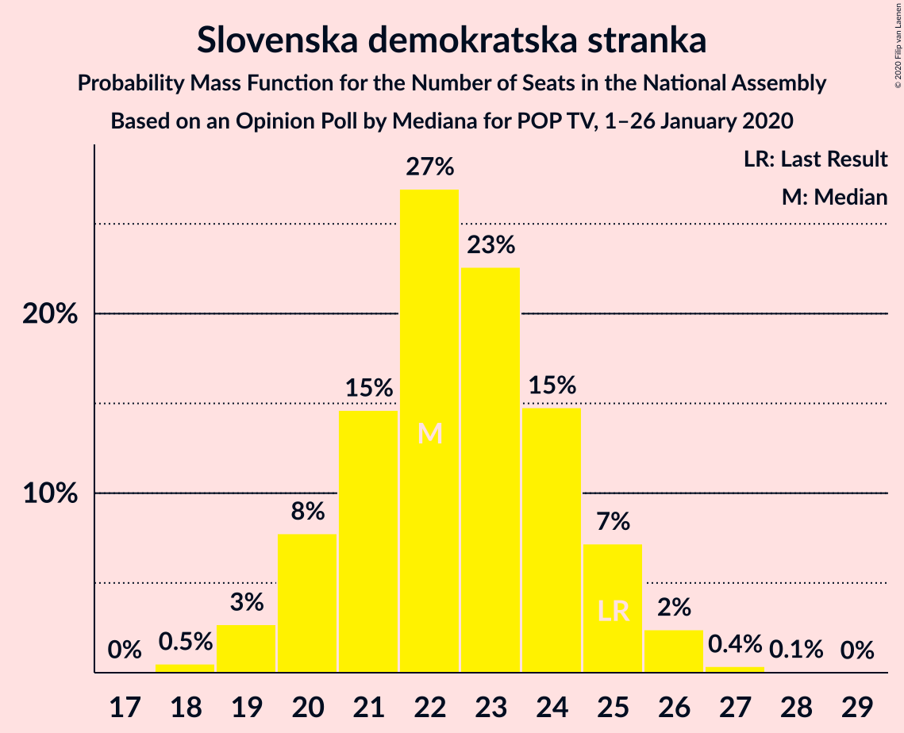
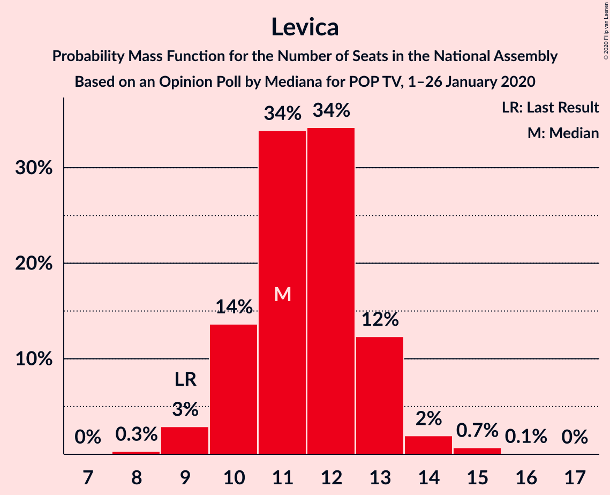
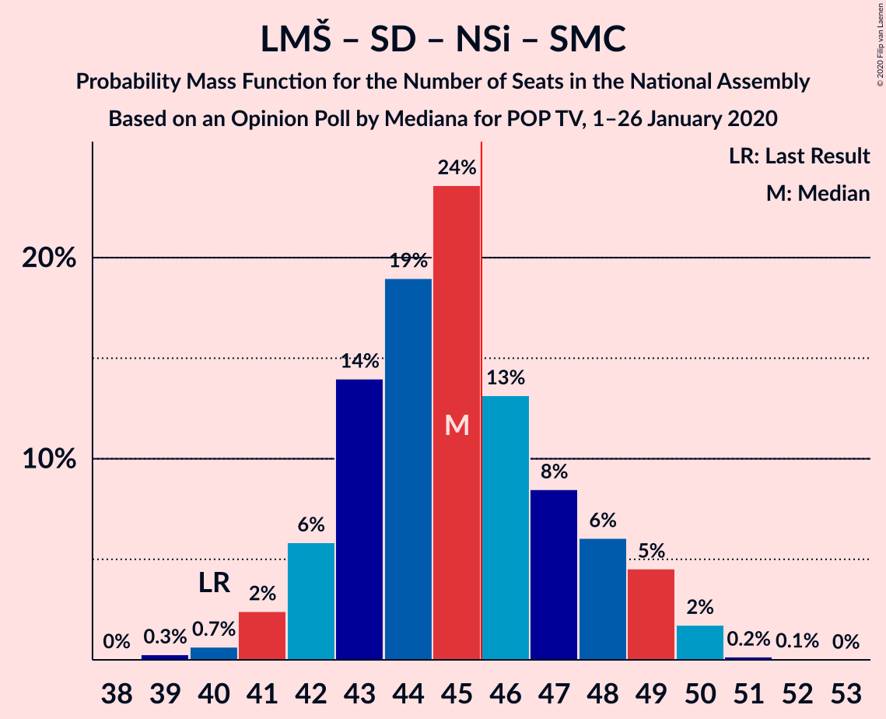
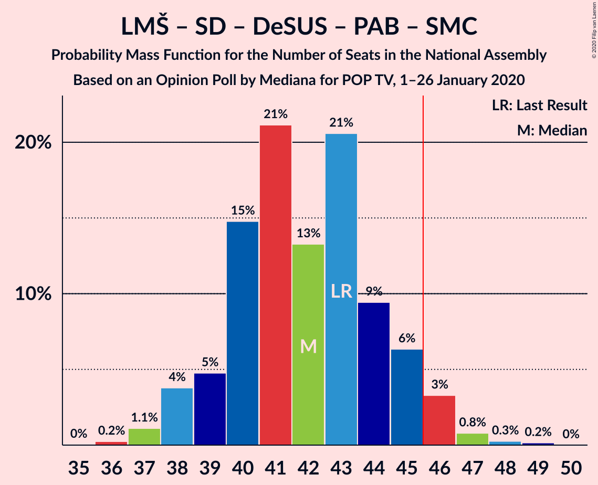
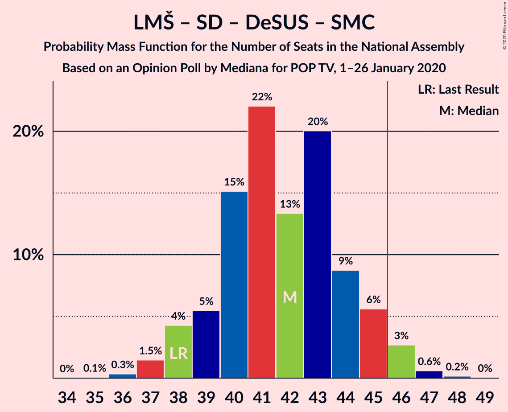
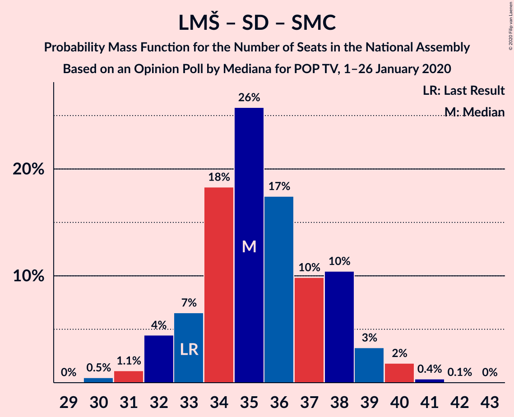
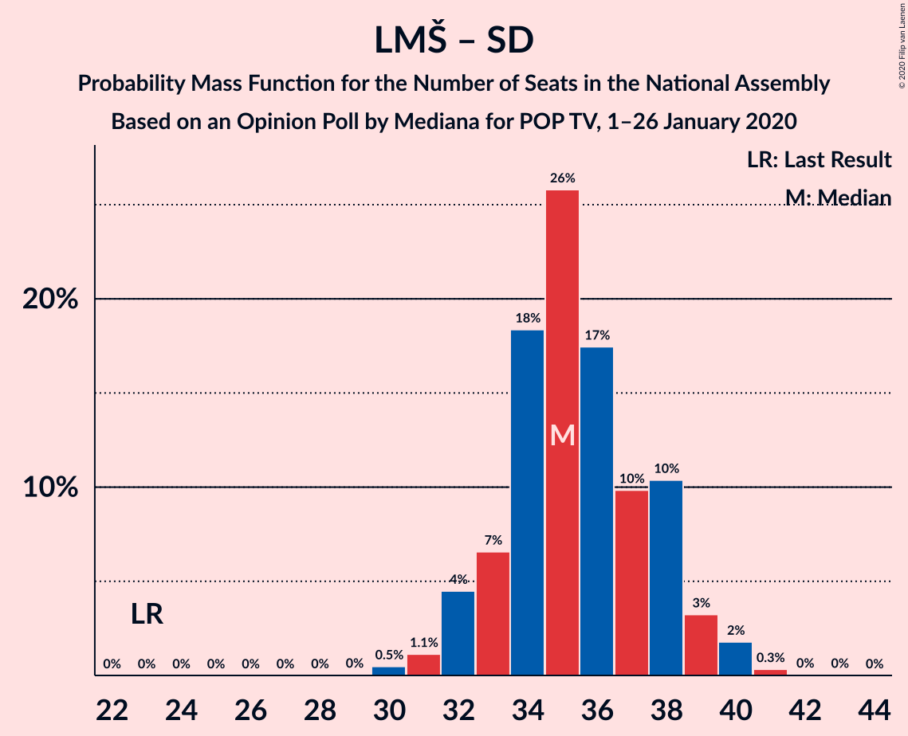

# Opinion Poll by Mediana for POP TV, 1–26 January 2020

<a href="#voting-intentions">Voting Intentions</a> | <a href="#seats">Seats</a> | <a href="#coalitions">Coalitions</a> | <a href="#technical-information">Technical Information</a>

## Voting Intentions

### Confidence Intervals

| Party | Last Result | Poll Result | 80% Confidence Interval | 90% Confidence Interval | 95% Confidence Interval | 99% Confidence Interval |
|:-----:|:-----------:|:-----------:|:-----------------------:|:-----------------------:|:-----------------------:|:-----------------------:|
| Lista Marjana Šarca | 12.6% | 24.6% | 22.7–26.7% |22.2–27.3% |21.7–27.8% |20.8–28.8% |
| Slovenska demokratska stranka | 24.9% | 22.9% | 21.1–25.0% |20.6–25.6% |20.1–26.1% |19.2–27.1% |
| Socialni demokrati | 9.9% | 11.9% | 10.5–13.5% |10.1–13.9% |9.8–14.4% |9.1–15.2% |
| Levica | 9.3% | 11.9% | 10.5–13.5% |10.1–13.9% |9.8–14.4% |9.1–15.2% |
| Nova Slovenija–Krščanski demokrati | 7.2% | 10.0% | 8.8–11.6% |8.4–12.0% |8.1–12.4% |7.5–13.1% |
| Demokratična stranka upokojencev Slovenije | 4.9% | 6.6% | 5.6–8.0% |5.3–8.3% |5.1–8.6% |4.6–9.3% |
| Slovenska nacionalna stranka | 4.2% | 4.2% | 3.4–5.3% |3.2–5.6% |3.0–5.8% |2.6–6.4% |
| Stranka Alenke Bratušek | 5.1% | 2.9% | 2.2–3.8% |2.0–4.1% |1.9–4.3% |1.6–4.8% |
| Stranka modernega centra | 9.7% | 2.5% | 1.9–3.4% |1.7–3.6% |1.6–3.8% |1.3–4.3% |

*Note:* The poll result column reflects the actual value used in the calculations. Published results may vary slightly, and in addition be rounded to fewer digits.

## Seats

### Confidence Intervals

| Party | Last Result | Median | 80% Confidence Interval | 90% Confidence Interval | 95% Confidence Interval | 99% Confidence Interval |
|:-----:|:-----------:|:------:|:-----------------------:|:-----------------------:|:-----------------------:|:-----------------------:|
| <a href="#lista-marjana-šarca">Lista Marjana Šarca</a> | 13 | 25 | 22–27 |21–27 |21–28 |20–28 |
| <a href="#slovenska-demokratska-stranka">Slovenska demokratska stranka</a> | 25 | 22 | 20–25 |20–25 |19–25 |18–27 |
| <a href="#socialni-demokrati">Socialni demokrati</a> | 10 | 11 | 9–13 |9–13 |9–13 |9–14 |
| <a href="#levica">Levica</a> | 9 | 12 | 10–13 |9–14 |9–14 |8–14 |
| <a href="#nova-slovenija–krščanski-demokrati">Nova Slovenija–Krščanski demokrati</a> | 7 | 9 | 8–11 |8–11 |7–12 |7–12 |
| <a href="#demokratična-stranka-upokojencev-slovenije">Demokratična stranka upokojencev Slovenije</a> | 5 | 7 | 5–7 |5–8 |5–8 |4–9 |
| <a href="#slovenska-nacionalna-stranka">Slovenska nacionalna stranka</a> | 4 | 3 | 0–5 |0–5 |0–5 |0–6 |
| <a href="#stranka-alenke-bratušek">Stranka Alenke Bratušek</a> | 5 | 0 | 0 |0–4 |0–4 |0–4 |
| <a href="#stranka-modernega-centra">Stranka modernega centra</a> | 10 | 0 | 0 |0 |0 |0 |

### Lista Marjana Šarca

*For a full overview of the results for this party, see the [Lista Marjana Šarca](party-listamarjanašarca.html) page.*

| Number of Seats | Probability | Accumulated | Special Marks |
|:---------------:|:-----------:|:-----------:|:-------------:|
| 13 | 0% | 100% | Last Result |
| 14 | 0% | 100% |  |
| 15 | 0% | 100% |  |
| 16 | 0% | 100% |  |
| 17 | 0% | 100% |  |
| 18 | 0% | 100% |  |
| 19 | 0.1% | 100% |  |
| 20 | 2% | 99.9% |  |
| 21 | 3% | 98% |  |
| 22 | 10% | 94% |  |
| 23 | 11% | 85% |  |
| 24 | 17% | 74% |  |
| 25 | 16% | 57% | Median |
| 26 | 16% | 41% |  |
| 27 | 21% | 26% |  |
| 28 | 4% | 5% |  |
| 29 | 0.1% | 0.5% |  |
| 30 | 0.4% | 0.4% |  |
| 31 | 0% | 0% |  |

### Slovenska demokratska stranka

*For a full overview of the results for this party, see the [Slovenska demokratska stranka](party-slovenskademokratskastranka.html) page.*

| Number of Seats | Probability | Accumulated | Special Marks |
|:---------------:|:-----------:|:-----------:|:-------------:|
| 17 | 0.1% | 100% |  |
| 18 | 1.3% | 99.9% |  |
| 19 | 3% | 98.6% |  |
| 20 | 10% | 96% |  |
| 21 | 13% | 86% |  |
| 22 | 29% | 73% | Median |
| 23 | 26% | 44% |  |
| 24 | 8% | 18% |  |
| 25 | 8% | 10% | Last Result |
| 26 | 2% | 2% |  |
| 27 | 0.5% | 0.6% |  |
| 28 | 0% | 0.1% |  |
| 29 | 0% | 0% |  |

### Socialni demokrati

*For a full overview of the results for this party, see the [Socialni demokrati](party-socialnidemokrati.html) page.*

| Number of Seats | Probability | Accumulated | Special Marks |
|:---------------:|:-----------:|:-----------:|:-------------:|
| 8 | 0.4% | 100% |  |
| 9 | 10% | 99.5% |  |
| 10 | 15% | 89% | Last Result |
| 11 | 41% | 74% | Median |
| 12 | 17% | 33% |  |
| 13 | 13% | 15% |  |
| 14 | 2% | 2% |  |
| 15 | 0.4% | 0.5% |  |
| 16 | 0.1% | 0.1% |  |
| 17 | 0% | 0% |  |

### Levica

*For a full overview of the results for this party, see the [Levica](party-levica.html) page.*

| Number of Seats | Probability | Accumulated | Special Marks |
|:---------------:|:-----------:|:-----------:|:-------------:|
| 8 | 0.8% | 100% |  |
| 9 | 5% | 99.2% | Last Result |
| 10 | 8% | 94% |  |
| 11 | 23% | 87% |  |
| 12 | 38% | 63% | Median |
| 13 | 20% | 26% |  |
| 14 | 5% | 5% |  |
| 15 | 0.2% | 0.2% |  |
| 16 | 0% | 0% |  |

### Nova Slovenija–Krščanski demokrati

*For a full overview of the results for this party, see the [Nova Slovenija–Krščanski demokrati](party-novaslovenija–krščanskidemokrati.html) page.*

| Number of Seats | Probability | Accumulated | Special Marks |
|:---------------:|:-----------:|:-----------:|:-------------:|
| 6 | 0.1% | 100% |  |
| 7 | 2% | 99.9% | Last Result |
| 8 | 37% | 97% |  |
| 9 | 27% | 61% | Median |
| 10 | 15% | 33% |  |
| 11 | 15% | 19% |  |
| 12 | 3% | 3% |  |
| 13 | 0.3% | 0.3% |  |
| 14 | 0.1% | 0.1% |  |
| 15 | 0% | 0% |  |

### Demokratična stranka upokojencev Slovenije

*For a full overview of the results for this party, see the [Demokratična stranka upokojencev Slovenije](party-demokratičnastrankaupokojencevslovenije.html) page.*

| Number of Seats | Probability | Accumulated | Special Marks |
|:---------------:|:-----------:|:-----------:|:-------------:|
| 4 | 2% | 100% |  |
| 5 | 24% | 98% | Last Result |
| 6 | 18% | 74% |  |
| 7 | 47% | 56% | Median |
| 8 | 8% | 9% |  |
| 9 | 0.7% | 0.8% |  |
| 10 | 0.1% | 0.1% |  |
| 11 | 0% | 0% |  |

### Slovenska nacionalna stranka

*For a full overview of the results for this party, see the [Slovenska nacionalna stranka](party-slovenskanacionalnastranka.html) page.*

| Number of Seats | Probability | Accumulated | Special Marks |
|:---------------:|:-----------:|:-----------:|:-------------:|
| 0 | 50% | 100% |  |
| 1 | 0% | 50% |  |
| 2 | 0% | 50% |  |
| 3 | 0.5% | 50% | Median |
| 4 | 33% | 50% | Last Result |
| 5 | 15% | 17% |  |
| 6 | 2% | 2% |  |
| 7 | 0% | 0% |  |

### Stranka Alenke Bratušek

*For a full overview of the results for this party, see the [Stranka Alenke Bratušek](party-strankaalenkebratušek.html) page.*

| Number of Seats | Probability | Accumulated | Special Marks |
|:---------------:|:-----------:|:-----------:|:-------------:|
| 0 | 93% | 100% | Median |
| 1 | 0% | 7% |  |
| 2 | 0% | 7% |  |
| 3 | 2% | 7% |  |
| 4 | 5% | 5% |  |
| 5 | 0.1% | 0.1% | Last Result |
| 6 | 0% | 0% |  |

### Stranka modernega centra

*For a full overview of the results for this party, see the [Stranka modernega centra](party-strankamodernegacentra.html) page.*

| Number of Seats | Probability | Accumulated | Special Marks |
|:---------------:|:-----------:|:-----------:|:-------------:|
| 0 | 99.7% | 100% | Median |
| 1 | 0% | 0.3% |  |
| 2 | 0% | 0.3% |  |
| 3 | 0% | 0.3% |  |
| 4 | 0.2% | 0.3% |  |
| 5 | 0% | 0% |  |
| 6 | 0% | 0% |  |
| 7 | 0% | 0% |  |
| 8 | 0% | 0% |  |
| 9 | 0% | 0% |  |
| 10 | 0% | 0% | Last Result |

## Coalitions

### Confidence Intervals

| Coalition | Last Result | Median | Majority? | 80% Confidence Interval | 90% Confidence Interval | 95% Confidence Interval | 99% Confidence Interval |
|:---------:|:-----------:|:------:|:---------:|:-----------------------:|:-----------------------:|:-----------------------:|:-----------------------:|
| Lista Marjana Šarca – Slovenska demokratska stranka – Demokratična stranka upokojencev Slovenije | 43 | 53 | 100% | 50–57 | 49–57 | 49–57 | 47–58 |
| Lista Marjana Šarca – Socialni demokrati – Nova Slovenija–Krščanski demokrati – Demokratična stranka upokojencev Slovenije | 35 | 51 | 99.6% | 49–54 | 48–55 | 47–56 | 46–56 |
| Lista Marjana Šarca – Socialni demokrati – Nova Slovenija–Krščanski demokrati – Demokratična stranka upokojencev Slovenije – Stranka Alenke Bratušek – Stranka modernega centra | 50 | 52 | 99.7% | 49–54 | 48–56 | 47–56 | 46–57 |
| Lista Marjana Šarca – Socialni demokrati – Nova Slovenija–Krščanski demokrati – Demokratična stranka upokojencev Slovenije – Stranka modernega centra | 45 | 51 | 99.6% | 49–54 | 48–55 | 47–56 | 46–56 |
| Lista Marjana Šarca – Slovenska demokratska stranka | 38 | 48 | 71% | 44–50 | 43–50 | 42–50 | 41–52 |
| Lista Marjana Šarca – Socialni demokrati – Nova Slovenija–Krščanski demokrati | 30 | 45 | 47% | 43–48 | 42–48 | 41–49 | 40–50 |
| Lista Marjana Šarca – Socialni demokrati – Nova Slovenija–Krščanski demokrati – Stranka modernega centra | 40 | 45 | 48% | 43–48 | 42–48 | 41–49 | 40–50 |
| Lista Marjana Šarca – Socialni demokrati – Demokratična stranka upokojencev Slovenije – Stranka Alenke Bratušek – Stranka modernega centra | 43 | 42 | 6% | 39–45 | 39–46 | 38–46 | 37–47 |
| Lista Marjana Šarca – Socialni demokrati – Demokratična stranka upokojencev Slovenije | 28 | 42 | 5% | 39–45 | 38–46 | 37–46 | 36–47 |
| Lista Marjana Šarca – Socialni demokrati – Demokratična stranka upokojencev Slovenije – Stranka modernega centra | 38 | 42 | 5% | 39–45 | 38–46 | 37–46 | 37–47 |
| Lista Marjana Šarca – Socialni demokrati – Stranka modernega centra | 33 | 36 | 0% | 33–38 | 32–39 | 32–39 | 31–40 |
| Lista Marjana Šarca – Socialni demokrati | 23 | 36 | 0% | 33–38 | 32–39 | 31–39 | 31–40 |
| Socialni demokrati – Demokratična stranka upokojencev Slovenije – Stranka modernega centra | 25 | 18 | 0% | 16–19 | 16–21 | 15–21 | 14–22 |

### Lista Marjana Šarca – Slovenska demokratska stranka – Demokratična stranka upokojencev Slovenije

| Number of Seats | Probability | Accumulated | Special Marks |
|:---------------:|:-----------:|:-----------:|:-------------:|
| 43 | 0% | 100% | Last Result |
| 44 | 0% | 100% |  |
| 45 | 0% | 100% |  |
| 46 | 0.1% | 100% | Majority |
| 47 | 0.9% | 99.9% |  |
| 48 | 0.8% | 99.0% |  |
| 49 | 4% | 98% |  |
| 50 | 13% | 94% |  |
| 51 | 8% | 81% |  |
| 52 | 4% | 73% |  |
| 53 | 21% | 68% |  |
| 54 | 8% | 48% | Median |
| 55 | 14% | 39% |  |
| 56 | 5% | 25% |  |
| 57 | 20% | 20% |  |
| 58 | 0.6% | 0.7% |  |
| 59 | 0.1% | 0.1% |  |
| 60 | 0% | 0% |  |

### Lista Marjana Šarca – Socialni demokrati – Nova Slovenija–Krščanski demokrati – Demokratična stranka upokojencev Slovenije

| Number of Seats | Probability | Accumulated | Special Marks |
|:---------------:|:-----------:|:-----------:|:-------------:|
| 35 | 0% | 100% | Last Result |
| 36 | 0% | 100% |  |
| 37 | 0% | 100% |  |
| 38 | 0% | 100% |  |
| 39 | 0% | 100% |  |
| 40 | 0% | 100% |  |
| 41 | 0% | 100% |  |
| 42 | 0% | 100% |  |
| 43 | 0% | 100% |  |
| 44 | 0.1% | 100% |  |
| 45 | 0.3% | 99.9% |  |
| 46 | 0.9% | 99.6% | Majority |
| 47 | 3% | 98.7% |  |
| 48 | 5% | 96% |  |
| 49 | 12% | 91% |  |
| 50 | 13% | 79% |  |
| 51 | 17% | 66% |  |
| 52 | 8% | 49% | Median |
| 53 | 26% | 41% |  |
| 54 | 7% | 14% |  |
| 55 | 2% | 7% |  |
| 56 | 4% | 4% |  |
| 57 | 0.2% | 0.4% |  |
| 58 | 0.1% | 0.1% |  |
| 59 | 0% | 0% |  |

### Lista Marjana Šarca – Socialni demokrati – Nova Slovenija–Krščanski demokrati – Demokratična stranka upokojencev Slovenije – Stranka Alenke Bratušek – Stranka modernega centra

| Number of Seats | Probability | Accumulated | Special Marks |
|:---------------:|:-----------:|:-----------:|:-------------:|
| 44 | 0% | 100% |  |
| 45 | 0.3% | 99.9% |  |
| 46 | 0.4% | 99.7% | Majority |
| 47 | 3% | 99.3% |  |
| 48 | 3% | 97% |  |
| 49 | 12% | 93% |  |
| 50 | 11% | 81% | Last Result |
| 51 | 16% | 70% |  |
| 52 | 9% | 54% | Median |
| 53 | 27% | 45% |  |
| 54 | 10% | 18% |  |
| 55 | 3% | 8% |  |
| 56 | 4% | 5% |  |
| 57 | 0.4% | 0.6% |  |
| 58 | 0.2% | 0.2% |  |
| 59 | 0% | 0% |  |

### Lista Marjana Šarca – Socialni demokrati – Nova Slovenija–Krščanski demokrati – Demokratična stranka upokojencev Slovenije – Stranka modernega centra

| Number of Seats | Probability | Accumulated | Special Marks |
|:---------------:|:-----------:|:-----------:|:-------------:|
| 44 | 0.1% | 100% |  |
| 45 | 0.3% | 99.9% | Last Result |
| 46 | 0.8% | 99.6% | Majority |
| 47 | 3% | 98.8% |  |
| 48 | 5% | 96% |  |
| 49 | 12% | 91% |  |
| 50 | 13% | 79% |  |
| 51 | 16% | 66% |  |
| 52 | 9% | 49% | Median |
| 53 | 26% | 41% |  |
| 54 | 7% | 14% |  |
| 55 | 2% | 7% |  |
| 56 | 4% | 5% |  |
| 57 | 0.2% | 0.4% |  |
| 58 | 0.2% | 0.2% |  |
| 59 | 0% | 0% |  |

### Lista Marjana Šarca – Slovenska demokratska stranka

| Number of Seats | Probability | Accumulated | Special Marks |
|:---------------:|:-----------:|:-----------:|:-------------:|
| 38 | 0% | 100% | Last Result |
| 39 | 0% | 100% |  |
| 40 | 0.1% | 100% |  |
| 41 | 0.9% | 99.9% |  |
| 42 | 2% | 98.9% |  |
| 43 | 4% | 97% |  |
| 44 | 8% | 93% |  |
| 45 | 14% | 85% |  |
| 46 | 12% | 71% | Majority |
| 47 | 8% | 59% | Median |
| 48 | 19% | 51% |  |
| 49 | 10% | 32% |  |
| 50 | 20% | 22% |  |
| 51 | 0.5% | 1.2% |  |
| 52 | 0.6% | 0.6% |  |
| 53 | 0.1% | 0.1% |  |
| 54 | 0% | 0% |  |

### Lista Marjana Šarca – Socialni demokrati – Nova Slovenija–Krščanski demokrati

| Number of Seats | Probability | Accumulated | Special Marks |
|:---------------:|:-----------:|:-----------:|:-------------:|
| 30 | 0% | 100% | Last Result |
| 31 | 0% | 100% |  |
| 32 | 0% | 100% |  |
| 33 | 0% | 100% |  |
| 34 | 0% | 100% |  |
| 35 | 0% | 100% |  |
| 36 | 0% | 100% |  |
| 37 | 0% | 100% |  |
| 38 | 0.1% | 100% |  |
| 39 | 0.4% | 99.9% |  |
| 40 | 0.7% | 99.5% |  |
| 41 | 3% | 98.8% |  |
| 42 | 3% | 96% |  |
| 43 | 15% | 92% |  |
| 44 | 18% | 77% |  |
| 45 | 12% | 60% | Median |
| 46 | 28% | 47% | Majority |
| 47 | 9% | 20% |  |
| 48 | 6% | 11% |  |
| 49 | 4% | 5% |  |
| 50 | 0.5% | 0.9% |  |
| 51 | 0.2% | 0.3% |  |
| 52 | 0.1% | 0.1% |  |
| 53 | 0.1% | 0.1% |  |
| 54 | 0% | 0% |  |

### Lista Marjana Šarca – Socialni demokrati – Nova Slovenija–Krščanski demokrati – Stranka modernega centra

| Number of Seats | Probability | Accumulated | Special Marks |
|:---------------:|:-----------:|:-----------:|:-------------:|
| 38 | 0.1% | 100% |  |
| 39 | 0.4% | 99.9% |  |
| 40 | 0.7% | 99.5% | Last Result |
| 41 | 3% | 98.8% |  |
| 42 | 3% | 96% |  |
| 43 | 15% | 92% |  |
| 44 | 18% | 78% |  |
| 45 | 12% | 60% | Median |
| 46 | 28% | 48% | Majority |
| 47 | 9% | 20% |  |
| 48 | 6% | 11% |  |
| 49 | 4% | 5% |  |
| 50 | 0.5% | 0.9% |  |
| 51 | 0.2% | 0.4% |  |
| 52 | 0.1% | 0.2% |  |
| 53 | 0.1% | 0.1% |  |
| 54 | 0% | 0% |  |

### Lista Marjana Šarca – Socialni demokrati – Demokratična stranka upokojencev Slovenije – Stranka Alenke Bratušek – Stranka modernega centra

| Number of Seats | Probability | Accumulated | Special Marks |
|:---------------:|:-----------:|:-----------:|:-------------:|
| 36 | 0.4% | 100% |  |
| 37 | 2% | 99.6% |  |
| 38 | 3% | 98% |  |
| 39 | 5% | 95% |  |
| 40 | 6% | 90% |  |
| 41 | 19% | 84% |  |
| 42 | 19% | 65% |  |
| 43 | 6% | 45% | Last Result, Median |
| 44 | 5% | 39% |  |
| 45 | 28% | 34% |  |
| 46 | 5% | 6% | Majority |
| 47 | 0.8% | 1.1% |  |
| 48 | 0.2% | 0.2% |  |
| 49 | 0% | 0.1% |  |
| 50 | 0% | 0% |  |

### Lista Marjana Šarca – Socialni demokrati – Demokratična stranka upokojencev Slovenije

| Number of Seats | Probability | Accumulated | Special Marks |
|:---------------:|:-----------:|:-----------:|:-------------:|
| 28 | 0% | 100% | Last Result |
| 29 | 0% | 100% |  |
| 30 | 0% | 100% |  |
| 31 | 0% | 100% |  |
| 32 | 0% | 100% |  |
| 33 | 0% | 100% |  |
| 34 | 0% | 100% |  |
| 35 | 0% | 100% |  |
| 36 | 0.5% | 100% |  |
| 37 | 3% | 99.5% |  |
| 38 | 3% | 96% |  |
| 39 | 6% | 94% |  |
| 40 | 6% | 88% |  |
| 41 | 22% | 82% |  |
| 42 | 20% | 60% |  |
| 43 | 6% | 41% | Median |
| 44 | 4% | 35% |  |
| 45 | 25% | 30% |  |
| 46 | 4% | 5% | Majority |
| 47 | 0.7% | 0.8% |  |
| 48 | 0.1% | 0.1% |  |
| 49 | 0% | 0% |  |

### Lista Marjana Šarca – Socialni demokrati – Demokratična stranka upokojencev Slovenije – Stranka modernega centra

| Number of Seats | Probability | Accumulated | Special Marks |
|:---------------:|:-----------:|:-----------:|:-------------:|
| 36 | 0.5% | 100% |  |
| 37 | 3% | 99.5% |  |
| 38 | 3% | 96% | Last Result |
| 39 | 6% | 94% |  |
| 40 | 6% | 88% |  |
| 41 | 22% | 82% |  |
| 42 | 20% | 60% |  |
| 43 | 6% | 41% | Median |
| 44 | 4% | 35% |  |
| 45 | 25% | 31% |  |
| 46 | 4% | 5% | Majority |
| 47 | 0.7% | 0.9% |  |
| 48 | 0.1% | 0.2% |  |
| 49 | 0% | 0% |  |

### Lista Marjana Šarca – Socialni demokrati – Stranka modernega centra

| Number of Seats | Probability | Accumulated | Special Marks |
|:---------------:|:-----------:|:-----------:|:-------------:|
| 29 | 0% | 100% |  |
| 30 | 0.4% | 99.9% |  |
| 31 | 2% | 99.6% |  |
| 32 | 4% | 98% |  |
| 33 | 4% | 94% | Last Result |
| 34 | 9% | 90% |  |
| 35 | 24% | 80% |  |
| 36 | 18% | 56% | Median |
| 37 | 8% | 39% |  |
| 38 | 25% | 31% |  |
| 39 | 5% | 6% |  |
| 40 | 1.1% | 2% |  |
| 41 | 0.3% | 0.5% |  |
| 42 | 0.1% | 0.1% |  |
| 43 | 0% | 0% |  |

### Lista Marjana Šarca – Socialni demokrati

| Number of Seats | Probability | Accumulated | Special Marks |
|:---------------:|:-----------:|:-----------:|:-------------:|
| 23 | 0% | 100% | Last Result |
| 24 | 0% | 100% |  |
| 25 | 0% | 100% |  |
| 26 | 0% | 100% |  |
| 27 | 0% | 100% |  |
| 28 | 0% | 100% |  |
| 29 | 0% | 100% |  |
| 30 | 0.4% | 99.9% |  |
| 31 | 2% | 99.6% |  |
| 32 | 4% | 97% |  |
| 33 | 4% | 94% |  |
| 34 | 9% | 89% |  |
| 35 | 24% | 80% |  |
| 36 | 18% | 56% | Median |
| 37 | 8% | 39% |  |
| 38 | 25% | 31% |  |
| 39 | 5% | 6% |  |
| 40 | 1.0% | 1.5% |  |
| 41 | 0.3% | 0.4% |  |
| 42 | 0.1% | 0.1% |  |
| 43 | 0% | 0% |  |

### Socialni demokrati – Demokratična stranka upokojencev Slovenije – Stranka modernega centra

| Number of Seats | Probability | Accumulated | Special Marks |
|:---------------:|:-----------:|:-----------:|:-------------:|
| 13 | 0.1% | 100% |  |
| 14 | 2% | 99.9% |  |
| 15 | 3% | 98% |  |
| 16 | 22% | 95% |  |
| 17 | 23% | 74% |  |
| 18 | 32% | 51% | Median |
| 19 | 11% | 19% |  |
| 20 | 3% | 8% |  |
| 21 | 4% | 5% |  |
| 22 | 0.5% | 0.6% |  |
| 23 | 0.1% | 0.2% |  |
| 24 | 0% | 0% |  |
| 25 | 0% | 0% | Last Result |

## Technical Information

### Opinion Poll

+ **Polling firm:** Mediana
+ **Commissioner(s):** POP TV
+ **Fieldwork period:** 1–26 January 2020

### Calculations

+ **Sample size:** 767
+ **Simulations done:** 131,072
+ **Error estimate:** 1.28%

