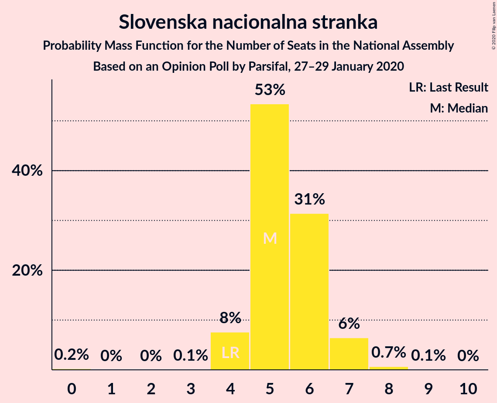
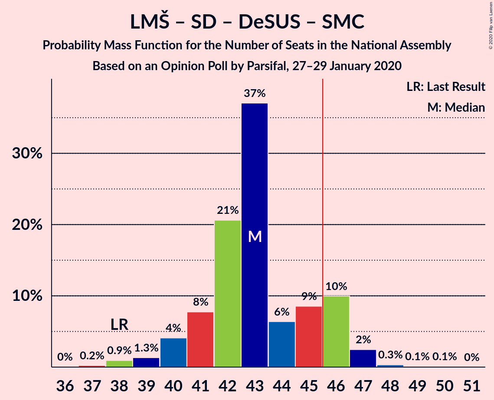
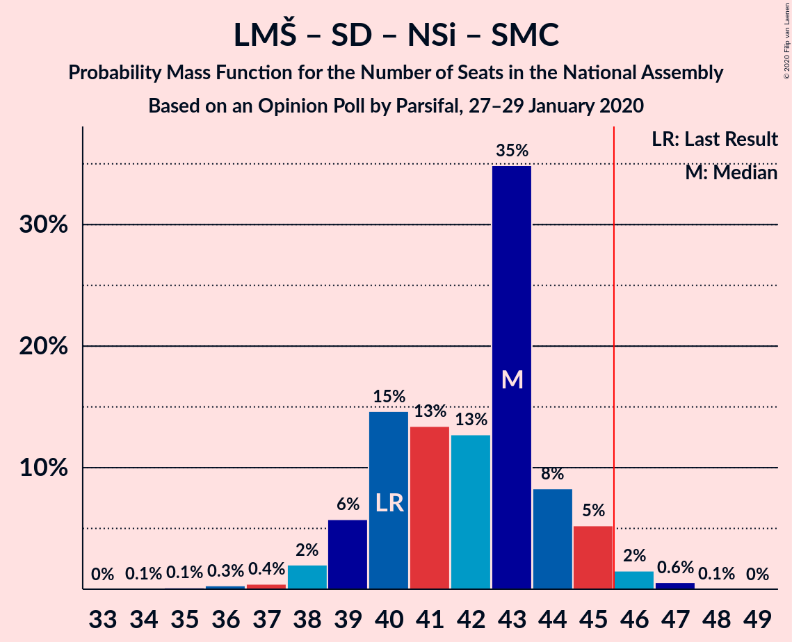

# Opinion Poll by Parsifal, 27–29 January 2020

<a href="#voting-intentions">Voting Intentions</a> | <a href="#seats">Seats</a> | <a href="#coalitions">Coalitions</a> | <a href="#technical-information">Technical Information</a>

## Voting Intentions

### Confidence Intervals

| Party | Last Result | Poll Result | 80% Confidence Interval | 90% Confidence Interval | 95% Confidence Interval | 99% Confidence Interval |
|:-----:|:-----------:|:-----------:|:-----------------------:|:-----------------------:|:-----------------------:|:-----------------------:|
| Slovenska demokratska stranka | 24.9% | 27.2% | 25.4–29.1% |24.9–29.7% |24.5–30.1% |23.6–31.1% |
| Lista Marjana Šarca | 12.6% | 27.1% | 25.3–29.0% |24.8–29.6% |24.4–30.0% |23.5–30.9% |
| Socialni demokrati | 9.9% | 10.5% | 9.3–11.9% |9.0–12.3% |8.7–12.6% |8.2–13.3% |
| Levica | 9.3% | 7.2% | 6.3–8.4% |6.0–8.8% |5.8–9.1% |5.3–9.7% |
| Demokratična stranka upokojencev Slovenije | 4.9% | 5.8% | 4.9–6.9% |4.7–7.2% |4.5–7.5% |4.1–8.0% |
| Slovenska nacionalna stranka | 4.2% | 5.8% | 4.9–6.9% |4.7–7.2% |4.5–7.5% |4.1–8.0% |
| Nova Slovenija–Krščanski demokrati | 7.2% | 4.9% | 4.1–6.0% |3.9–6.2% |3.7–6.5% |3.4–7.0% |
| Stranka Alenke Bratušek | 5.1% | 3.4% | 2.7–4.2% |2.5–4.5% |2.4–4.7% |2.1–5.2% |
| Slovenska ljudska stranka | 2.6% | 3.2% | 2.5–4.0% |2.4–4.3% |2.2–4.5% |2.0–4.9% |
| Stranka modernega centra | 9.7% | 2.8% | 2.3–3.7% |2.1–3.9% |2.0–4.1% |1.7–4.5% |

*Note:* The poll result column reflects the actual value used in the calculations. Published results may vary slightly, and in addition be rounded to fewer digits.

## Seats

### Confidence Intervals

| Party | Last Result | Median | 80% Confidence Interval | 90% Confidence Interval | 95% Confidence Interval | 99% Confidence Interval |
|:-----:|:-----------:|:------:|:-----------------------:|:-----------------------:|:-----------------------:|:-----------------------:|
| <a href="#slovenska-demokratska-stranka">Slovenska demokratska stranka</a> | 25 | 28 | 25–29 |24–30 |24–30 |23–32 |
| <a href="#lista-marjana-šarca">Lista Marjana Šarca</a> | 13 | 27 | 26–29 |25–30 |24–31 |23–31 |
| <a href="#socialni-demokrati">Socialni demokrati</a> | 10 | 10 | 9–12 |9–12 |8–12 |8–13 |
| <a href="#levica">Levica</a> | 9 | 7 | 6–8 |5–8 |5–9 |5–9 |
| <a href="#demokratična-stranka-upokojencev-slovenije">Demokratična stranka upokojencev Slovenije</a> | 5 | 5 | 5–6 |4–7 |4–7 |4–8 |
| <a href="#slovenska-nacionalna-stranka">Slovenska nacionalna stranka</a> | 4 | 5 | 5–6 |4–7 |4–7 |4–8 |
| <a href="#nova-slovenija–krščanski-demokrati">Nova Slovenija–Krščanski demokrati</a> | 7 | 5 | 4–5 |0–6 |0–6 |0–7 |
| <a href="#stranka-alenke-bratušek">Stranka Alenke Bratušek</a> | 5 | 0 | 0–4 |0–4 |0–4 |0–4 |
| <a href="#slovenska-ljudska-stranka">Slovenska ljudska stranka</a> | 0 | 0 | 0 |0–4 |0–4 |0–4 |
| <a href="#stranka-modernega-centra">Stranka modernega centra</a> | 10 | 0 | 0 |0 |0 |0–4 |

### Slovenska demokratska stranka

*For a full overview of the results for this party, see the [Slovenska demokratska stranka](party-slovenskademokratskastranka.html) page.*

| Number of Seats | Probability | Accumulated | Special Marks |
|:---------------:|:-----------:|:-----------:|:-------------:|
| 22 | 0% | 100% |  |
| 23 | 0.8% | 99.9% |  |
| 24 | 5% | 99.1% |  |
| 25 | 8% | 95% | Last Result |
| 26 | 12% | 87% |  |
| 27 | 16% | 75% |  |
| 28 | 44% | 59% | Median |
| 29 | 7% | 16% |  |
| 30 | 7% | 9% |  |
| 31 | 0.8% | 1.4% |  |
| 32 | 0.5% | 0.6% |  |
| 33 | 0.1% | 0.1% |  |
| 34 | 0% | 0% |  |

### Lista Marjana Šarca

*For a full overview of the results for this party, see the [Lista Marjana Šarca](party-listamarjanašarca.html) page.*

| Number of Seats | Probability | Accumulated | Special Marks |
|:---------------:|:-----------:|:-----------:|:-------------:|
| 13 | 0% | 100% | Last Result |
| 14 | 0% | 100% |  |
| 15 | 0% | 100% |  |
| 16 | 0% | 100% |  |
| 17 | 0% | 100% |  |
| 18 | 0% | 100% |  |
| 19 | 0% | 100% |  |
| 20 | 0% | 100% |  |
| 21 | 0% | 100% |  |
| 22 | 0.1% | 100% |  |
| 23 | 0.7% | 99.9% |  |
| 24 | 3% | 99.2% |  |
| 25 | 6% | 96% |  |
| 26 | 23% | 90% |  |
| 27 | 22% | 67% | Median |
| 28 | 28% | 45% |  |
| 29 | 8% | 17% |  |
| 30 | 6% | 10% |  |
| 31 | 3% | 3% |  |
| 32 | 0.1% | 0.1% |  |
| 33 | 0% | 0% |  |

### Socialni demokrati

*For a full overview of the results for this party, see the [Socialni demokrati](party-socialnidemokrati.html) page.*

| Number of Seats | Probability | Accumulated | Special Marks |
|:---------------:|:-----------:|:-----------:|:-------------:|
| 7 | 0.1% | 100% |  |
| 8 | 3% | 99.9% |  |
| 9 | 15% | 97% |  |
| 10 | 42% | 82% | Last Result, Median |
| 11 | 29% | 40% |  |
| 12 | 10% | 11% |  |
| 13 | 2% | 2% |  |
| 14 | 0.3% | 0.3% |  |
| 15 | 0% | 0% |  |

### Levica

*For a full overview of the results for this party, see the [Levica](party-levica.html) page.*

| Number of Seats | Probability | Accumulated | Special Marks |
|:---------------:|:-----------:|:-----------:|:-------------:|
| 4 | 0.1% | 100% |  |
| 5 | 6% | 99.9% |  |
| 6 | 20% | 94% |  |
| 7 | 54% | 74% | Median |
| 8 | 17% | 20% |  |
| 9 | 2% | 3% | Last Result |
| 10 | 0.2% | 0.2% |  |
| 11 | 0% | 0% |  |

### Demokratična stranka upokojencev Slovenije

*For a full overview of the results for this party, see the [Demokratična stranka upokojencev Slovenije](party-demokratičnastrankaupokojencevslovenije.html) page.*

| Number of Seats | Probability | Accumulated | Special Marks |
|:---------------:|:-----------:|:-----------:|:-------------:|
| 0 | 0.3% | 100% |  |
| 1 | 0% | 99.7% |  |
| 2 | 0% | 99.7% |  |
| 3 | 0% | 99.7% |  |
| 4 | 6% | 99.7% |  |
| 5 | 55% | 93% | Last Result, Median |
| 6 | 32% | 38% |  |
| 7 | 6% | 6% |  |
| 8 | 0.6% | 0.6% |  |
| 9 | 0% | 0% |  |

### Slovenska nacionalna stranka

*For a full overview of the results for this party, see the [Slovenska nacionalna stranka](party-slovenskanacionalnastranka.html) page.*

| Number of Seats | Probability | Accumulated | Special Marks |
|:---------------:|:-----------:|:-----------:|:-------------:|
| 0 | 0.2% | 100% |  |
| 1 | 0% | 99.8% |  |
| 2 | 0% | 99.8% |  |
| 3 | 0.1% | 99.8% |  |
| 4 | 8% | 99.6% | Last Result |
| 5 | 53% | 92% | Median |
| 6 | 31% | 39% |  |
| 7 | 6% | 7% |  |
| 8 | 0.7% | 0.7% |  |
| 9 | 0.1% | 0.1% |  |
| 10 | 0% | 0% |  |

### Nova Slovenija–Krščanski demokrati

*For a full overview of the results for this party, see the [Nova Slovenija–Krščanski demokrati](party-novaslovenija–krščanskidemokrati.html) page.*

| Number of Seats | Probability | Accumulated | Special Marks |
|:---------------:|:-----------:|:-----------:|:-------------:|
| 0 | 8% | 100% |  |
| 1 | 0% | 92% |  |
| 2 | 0% | 92% |  |
| 3 | 0% | 92% |  |
| 4 | 34% | 92% |  |
| 5 | 49% | 57% | Median |
| 6 | 7% | 9% |  |
| 7 | 1.2% | 1.2% | Last Result |
| 8 | 0% | 0% |  |

### Stranka Alenke Bratušek

*For a full overview of the results for this party, see the [Stranka Alenke Bratušek](party-strankaalenkebratušek.html) page.*

| Number of Seats | Probability | Accumulated | Special Marks |
|:---------------:|:-----------:|:-----------:|:-------------:|
| 0 | 85% | 100% | Median |
| 1 | 0% | 15% |  |
| 2 | 0% | 15% |  |
| 3 | 0.3% | 15% |  |
| 4 | 14% | 14% |  |
| 5 | 0.4% | 0.4% | Last Result |
| 6 | 0% | 0% |  |

### Slovenska ljudska stranka

*For a full overview of the results for this party, see the [Slovenska ljudska stranka](party-slovenskaljudskastranka.html) page.*

| Number of Seats | Probability | Accumulated | Special Marks |
|:---------------:|:-----------:|:-----------:|:-------------:|
| 0 | 92% | 100% | Last Result, Median |
| 1 | 0% | 8% |  |
| 2 | 0% | 8% |  |
| 3 | 0.3% | 8% |  |
| 4 | 7% | 7% |  |
| 5 | 0.3% | 0.3% |  |
| 6 | 0% | 0% |  |

### Stranka modernega centra

*For a full overview of the results for this party, see the [Stranka modernega centra](party-strankamodernegacentra.html) page.*

| Number of Seats | Probability | Accumulated | Special Marks |
|:---------------:|:-----------:|:-----------:|:-------------:|
| 0 | 98% | 100% | Median |
| 1 | 0% | 2% |  |
| 2 | 0% | 2% |  |
| 3 | 0.1% | 2% |  |
| 4 | 2% | 2% |  |
| 5 | 0% | 0% |  |
| 6 | 0% | 0% |  |
| 7 | 0% | 0% |  |
| 8 | 0% | 0% |  |
| 9 | 0% | 0% |  |
| 10 | 0% | 0% | Last Result |

## Coalitions

### Confidence Intervals

| Coalition | Last Result | Median | Majority? | 80% Confidence Interval | 90% Confidence Interval | 95% Confidence Interval | 99% Confidence Interval |
|:---------:|:-----------:|:------:|:---------:|:-----------------------:|:-----------------------:|:-----------------------:|:-----------------------:|
| Slovenska demokratska stranka – Lista Marjana Šarca – Demokratična stranka upokojencev Slovenije | 43 | 60 | 100% | 57–62 | 57–63 | 55–64 | 54–66 |
| Slovenska demokratska stranka – Lista Marjana Šarca | 38 | 55 | 100% | 52–57 | 51–58 | 50–59 | 49–60 |
| Lista Marjana Šarca – Socialni demokrati – Demokratična stranka upokojencev Slovenije – Nova Slovenija–Krščanski demokrati – Stranka Alenke Bratušek – Stranka modernega centra | 50 | 48 | 93% | 46–51 | 45–51 | 45–51 | 43–53 |
| Lista Marjana Šarca – Socialni demokrati – Demokratična stranka upokojencev Slovenije – Nova Slovenija–Krščanski demokrati – Stranka modernega centra | 45 | 48 | 88% | 45–49 | 45–51 | 44–51 | 42–52 |
| Lista Marjana Šarca – Socialni demokrati – Demokratična stranka upokojencev Slovenije – Nova Slovenija–Krščanski demokrati | 35 | 48 | 88% | 45–49 | 45–51 | 43–51 | 42–52 |
| Lista Marjana Šarca – Socialni demokrati – Demokratična stranka upokojencev Slovenije – Stranka Alenke Bratušek – Stranka modernega centra | 43 | 43 | 21% | 42–46 | 41–47 | 40–47 | 39–49 |
| Lista Marjana Šarca – Socialni demokrati – Demokratična stranka upokojencev Slovenije | 28 | 43 | 12% | 41–46 | 40–46 | 39–47 | 38–47 |
| Lista Marjana Šarca – Socialni demokrati – Demokratična stranka upokojencev Slovenije – Stranka modernega centra | 38 | 43 | 13% | 41–46 | 40–46 | 39–47 | 38–48 |
| Lista Marjana Šarca – Socialni demokrati – Nova Slovenija–Krščanski demokrati | 30 | 42 | 1.3% | 40–44 | 39–45 | 38–45 | 36–47 |
| Lista Marjana Šarca – Socialni demokrati – Nova Slovenija–Krščanski demokrati – Stranka modernega centra | 40 | 43 | 2% | 40–44 | 39–45 | 38–45 | 37–47 |
| Lista Marjana Šarca – Socialni demokrati | 23 | 38 | 0% | 35–40 | 35–40 | 34–41 | 33–42 |
| Lista Marjana Šarca – Socialni demokrati – Stranka modernega centra | 33 | 38 | 0% | 35–40 | 35–41 | 34–41 | 33–42 |
| Socialni demokrati – Demokratična stranka upokojencev Slovenije – Stranka modernega centra | 25 | 16 | 0% | 14–17 | 14–18 | 13–19 | 13–20 |

### Slovenska demokratska stranka – Lista Marjana Šarca – Demokratična stranka upokojencev Slovenije

| Number of Seats | Probability | Accumulated | Special Marks |
|:---------------:|:-----------:|:-----------:|:-------------:|
| 43 | 0% | 100% | Last Result |
| 44 | 0% | 100% |  |
| 45 | 0% | 100% |  |
| 46 | 0% | 100% | Majority |
| 47 | 0% | 100% |  |
| 48 | 0% | 100% |  |
| 49 | 0% | 100% |  |
| 50 | 0% | 100% |  |
| 51 | 0% | 100% |  |
| 52 | 0% | 100% |  |
| 53 | 0.1% | 100% |  |
| 54 | 0.5% | 99.8% |  |
| 55 | 2% | 99.3% |  |
| 56 | 2% | 97% |  |
| 57 | 7% | 95% |  |
| 58 | 12% | 88% |  |
| 59 | 6% | 76% |  |
| 60 | 25% | 70% | Median |
| 61 | 28% | 45% |  |
| 62 | 7% | 17% |  |
| 63 | 5% | 10% |  |
| 64 | 2% | 5% |  |
| 65 | 0.5% | 2% |  |
| 66 | 2% | 2% |  |
| 67 | 0.1% | 0.1% |  |
| 68 | 0% | 0% |  |

### Slovenska demokratska stranka – Lista Marjana Šarca

| Number of Seats | Probability | Accumulated | Special Marks |
|:---------------:|:-----------:|:-----------:|:-------------:|
| 38 | 0% | 100% | Last Result |
| 39 | 0% | 100% |  |
| 40 | 0% | 100% |  |
| 41 | 0% | 100% |  |
| 42 | 0% | 100% |  |
| 43 | 0% | 100% |  |
| 44 | 0% | 100% |  |
| 45 | 0% | 100% |  |
| 46 | 0% | 100% | Majority |
| 47 | 0% | 100% |  |
| 48 | 0.2% | 100% |  |
| 49 | 0.8% | 99.8% |  |
| 50 | 3% | 99.0% |  |
| 51 | 5% | 96% |  |
| 52 | 9% | 91% |  |
| 53 | 7% | 82% |  |
| 54 | 13% | 74% |  |
| 55 | 22% | 61% | Median |
| 56 | 24% | 39% |  |
| 57 | 9% | 15% |  |
| 58 | 4% | 7% |  |
| 59 | 0.6% | 3% |  |
| 60 | 2% | 2% |  |
| 61 | 0.1% | 0.1% |  |
| 62 | 0% | 0% |  |

### Lista Marjana Šarca – Socialni demokrati – Demokratična stranka upokojencev Slovenije – Nova Slovenija–Krščanski demokrati – Stranka Alenke Bratušek – Stranka modernega centra

| Number of Seats | Probability | Accumulated | Special Marks |
|:---------------:|:-----------:|:-----------:|:-------------:|
| 41 | 0% | 100% |  |
| 42 | 0.2% | 99.9% |  |
| 43 | 0.6% | 99.7% |  |
| 44 | 1.1% | 99.2% |  |
| 45 | 5% | 98% |  |
| 46 | 12% | 93% | Majority |
| 47 | 16% | 81% | Median |
| 48 | 33% | 64% |  |
| 49 | 13% | 32% |  |
| 50 | 8% | 19% | Last Result |
| 51 | 8% | 11% |  |
| 52 | 1.4% | 2% |  |
| 53 | 0.8% | 1.1% |  |
| 54 | 0.2% | 0.3% |  |
| 55 | 0% | 0% |  |

### Lista Marjana Šarca – Socialni demokrati – Demokratična stranka upokojencev Slovenije – Nova Slovenija–Krščanski demokrati – Stranka modernega centra

| Number of Seats | Probability | Accumulated | Special Marks |
|:---------------:|:-----------:|:-----------:|:-------------:|
| 39 | 0% | 100% |  |
| 40 | 0.1% | 99.9% |  |
| 41 | 0.1% | 99.9% |  |
| 42 | 1.0% | 99.8% |  |
| 43 | 1.1% | 98.7% |  |
| 44 | 1.5% | 98% |  |
| 45 | 8% | 96% | Last Result |
| 46 | 17% | 88% | Majority |
| 47 | 19% | 72% | Median |
| 48 | 33% | 53% |  |
| 49 | 11% | 20% |  |
| 50 | 3% | 9% |  |
| 51 | 5% | 6% |  |
| 52 | 0.5% | 0.6% |  |
| 53 | 0.1% | 0.1% |  |
| 54 | 0% | 0% |  |

### Lista Marjana Šarca – Socialni demokrati – Demokratična stranka upokojencev Slovenije – Nova Slovenija–Krščanski demokrati

| Number of Seats | Probability | Accumulated | Special Marks |
|:---------------:|:-----------:|:-----------:|:-------------:|
| 35 | 0% | 100% | Last Result |
| 36 | 0% | 100% |  |
| 37 | 0% | 100% |  |
| 38 | 0% | 100% |  |
| 39 | 0.1% | 100% |  |
| 40 | 0.1% | 99.9% |  |
| 41 | 0.1% | 99.8% |  |
| 42 | 1.2% | 99.7% |  |
| 43 | 1.3% | 98.5% |  |
| 44 | 2% | 97% |  |
| 45 | 8% | 96% |  |
| 46 | 18% | 88% | Majority |
| 47 | 19% | 70% | Median |
| 48 | 33% | 51% |  |
| 49 | 11% | 18% |  |
| 50 | 2% | 8% |  |
| 51 | 5% | 5% |  |
| 52 | 0.4% | 0.5% |  |
| 53 | 0.1% | 0.1% |  |
| 54 | 0% | 0% |  |

### Lista Marjana Šarca – Socialni demokrati – Demokratična stranka upokojencev Slovenije – Stranka Alenke Bratušek – Stranka modernega centra

| Number of Seats | Probability | Accumulated | Special Marks |
|:---------------:|:-----------:|:-----------:|:-------------:|
| 37 | 0.1% | 100% |  |
| 38 | 0.1% | 99.9% |  |
| 39 | 0.7% | 99.8% |  |
| 40 | 3% | 99.1% |  |
| 41 | 4% | 96% |  |
| 42 | 16% | 92% | Median |
| 43 | 37% | 76% | Last Result |
| 44 | 7% | 39% |  |
| 45 | 11% | 33% |  |
| 46 | 16% | 21% | Majority |
| 47 | 3% | 6% |  |
| 48 | 1.4% | 2% |  |
| 49 | 0.7% | 0.9% |  |
| 50 | 0.1% | 0.2% |  |
| 51 | 0% | 0% |  |

### Lista Marjana Šarca – Socialni demokrati – Demokratična stranka upokojencev Slovenije

| Number of Seats | Probability | Accumulated | Special Marks |
|:---------------:|:-----------:|:-----------:|:-------------:|
| 28 | 0% | 100% | Last Result |
| 29 | 0% | 100% |  |
| 30 | 0% | 100% |  |
| 31 | 0% | 100% |  |
| 32 | 0% | 100% |  |
| 33 | 0% | 100% |  |
| 34 | 0% | 100% |  |
| 35 | 0% | 100% |  |
| 36 | 0% | 100% |  |
| 37 | 0.3% | 100% |  |
| 38 | 1.1% | 99.7% |  |
| 39 | 1.5% | 98.6% |  |
| 40 | 5% | 97% |  |
| 41 | 8% | 93% |  |
| 42 | 21% | 85% | Median |
| 43 | 37% | 63% |  |
| 44 | 6% | 26% |  |
| 45 | 8% | 20% |  |
| 46 | 9% | 12% | Majority |
| 47 | 2% | 3% |  |
| 48 | 0.3% | 0.4% |  |
| 49 | 0.1% | 0.1% |  |
| 50 | 0.1% | 0.1% |  |
| 51 | 0% | 0% |  |

### Lista Marjana Šarca – Socialni demokrati – Demokratična stranka upokojencev Slovenije – Stranka modernega centra

| Number of Seats | Probability | Accumulated | Special Marks |
|:---------------:|:-----------:|:-----------:|:-------------:|
| 37 | 0.2% | 100% |  |
| 38 | 0.9% | 99.7% | Last Result |
| 39 | 1.3% | 98.8% |  |
| 40 | 4% | 97% |  |
| 41 | 8% | 93% |  |
| 42 | 21% | 86% | Median |
| 43 | 37% | 65% |  |
| 44 | 6% | 28% |  |
| 45 | 9% | 22% |  |
| 46 | 10% | 13% | Majority |
| 47 | 2% | 3% |  |
| 48 | 0.3% | 0.5% |  |
| 49 | 0.1% | 0.2% |  |
| 50 | 0.1% | 0.1% |  |
| 51 | 0% | 0% |  |

### Lista Marjana Šarca – Socialni demokrati – Nova Slovenija–Krščanski demokrati

| Number of Seats | Probability | Accumulated | Special Marks |
|:---------------:|:-----------:|:-----------:|:-------------:|
| 30 | 0% | 100% | Last Result |
| 31 | 0% | 100% |  |
| 32 | 0% | 100% |  |
| 33 | 0% | 100% |  |
| 34 | 0.1% | 100% |  |
| 35 | 0.1% | 99.9% |  |
| 36 | 0.3% | 99.8% |  |
| 37 | 0.5% | 99.5% |  |
| 38 | 2% | 98.9% |  |
| 39 | 6% | 97% |  |
| 40 | 15% | 91% |  |
| 41 | 14% | 76% |  |
| 42 | 13% | 62% | Median |
| 43 | 35% | 49% |  |
| 44 | 8% | 14% |  |
| 45 | 5% | 6% |  |
| 46 | 0.8% | 1.3% | Majority |
| 47 | 0.5% | 0.6% |  |
| 48 | 0% | 0% |  |

### Lista Marjana Šarca – Socialni demokrati – Nova Slovenija–Krščanski demokrati – Stranka modernega centra

| Number of Seats | Probability | Accumulated | Special Marks |
|:---------------:|:-----------:|:-----------:|:-------------:|
| 34 | 0.1% | 100% |  |
| 35 | 0.1% | 99.9% |  |
| 36 | 0.3% | 99.8% |  |
| 37 | 0.4% | 99.5% |  |
| 38 | 2% | 99.1% |  |
| 39 | 6% | 97% |  |
| 40 | 15% | 91% | Last Result |
| 41 | 13% | 77% |  |
| 42 | 13% | 63% | Median |
| 43 | 35% | 51% |  |
| 44 | 8% | 16% |  |
| 45 | 5% | 7% |  |
| 46 | 2% | 2% | Majority |
| 47 | 0.6% | 0.7% |  |
| 48 | 0.1% | 0.1% |  |
| 49 | 0% | 0% |  |

### Lista Marjana Šarca – Socialni demokrati

| Number of Seats | Probability | Accumulated | Special Marks |
|:---------------:|:-----------:|:-----------:|:-------------:|
| 23 | 0% | 100% | Last Result |
| 24 | 0% | 100% |  |
| 25 | 0% | 100% |  |
| 26 | 0% | 100% |  |
| 27 | 0% | 100% |  |
| 28 | 0% | 100% |  |
| 29 | 0% | 100% |  |
| 30 | 0% | 100% |  |
| 31 | 0% | 100% |  |
| 32 | 0.3% | 100% |  |
| 33 | 0.8% | 99.7% |  |
| 34 | 4% | 98.9% |  |
| 35 | 8% | 95% |  |
| 36 | 14% | 87% |  |
| 37 | 14% | 74% | Median |
| 38 | 38% | 59% |  |
| 39 | 3% | 22% |  |
| 40 | 14% | 19% |  |
| 41 | 4% | 5% |  |
| 42 | 0.5% | 0.6% |  |
| 43 | 0.1% | 0.1% |  |
| 44 | 0% | 0% |  |

### Lista Marjana Šarca – Socialni demokrati – Stranka modernega centra

| Number of Seats | Probability | Accumulated | Special Marks |
|:---------------:|:-----------:|:-----------:|:-------------:|
| 32 | 0.2% | 100% |  |
| 33 | 0.7% | 99.7% | Last Result |
| 34 | 3% | 99.1% |  |
| 35 | 7% | 96% |  |
| 36 | 14% | 88% |  |
| 37 | 14% | 75% | Median |
| 38 | 37% | 61% |  |
| 39 | 3% | 23% |  |
| 40 | 15% | 20% |  |
| 41 | 4% | 6% |  |
| 42 | 1.2% | 1.4% |  |
| 43 | 0.2% | 0.2% |  |
| 44 | 0% | 0.1% |  |
| 45 | 0% | 0% |  |

### Socialni demokrati – Demokratična stranka upokojencev Slovenije – Stranka modernega centra

| Number of Seats | Probability | Accumulated | Special Marks |
|:---------------:|:-----------:|:-----------:|:-------------:|
| 10 | 0.1% | 100% |  |
| 11 | 0.1% | 99.9% |  |
| 12 | 0.3% | 99.8% |  |
| 13 | 2% | 99.5% |  |
| 14 | 9% | 97% |  |
| 15 | 31% | 88% | Median |
| 16 | 34% | 57% |  |
| 17 | 15% | 24% |  |
| 18 | 6% | 9% |  |
| 19 | 2% | 3% |  |
| 20 | 0.5% | 0.8% |  |
| 21 | 0.2% | 0.2% |  |
| 22 | 0.1% | 0.1% |  |
| 23 | 0% | 0% |  |
| 24 | 0% | 0% |  |
| 25 | 0% | 0% | Last Result |

## Technical Information

### Opinion Poll

+ **Polling firm:** Parsifal
+ **Commissioner(s):** —
+ **Fieldwork period:** 27–29 January 2020

### Calculations

+ **Sample size:** 952
+ **Simulations done:** 1,048,576
+ **Error estimate:** 1.39%

