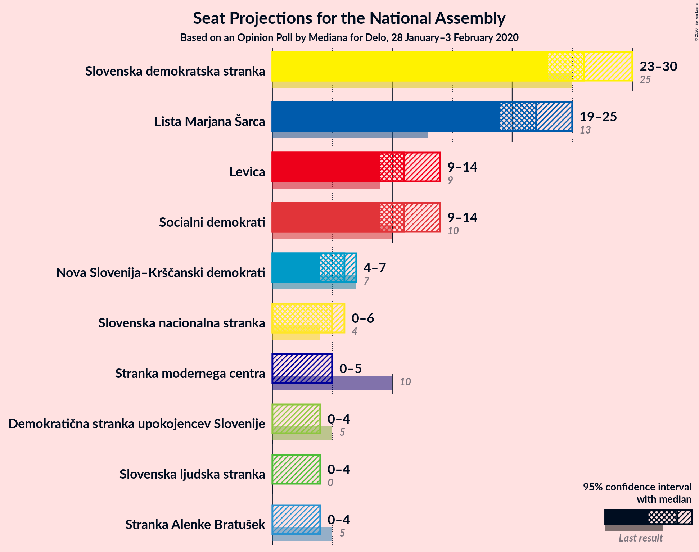
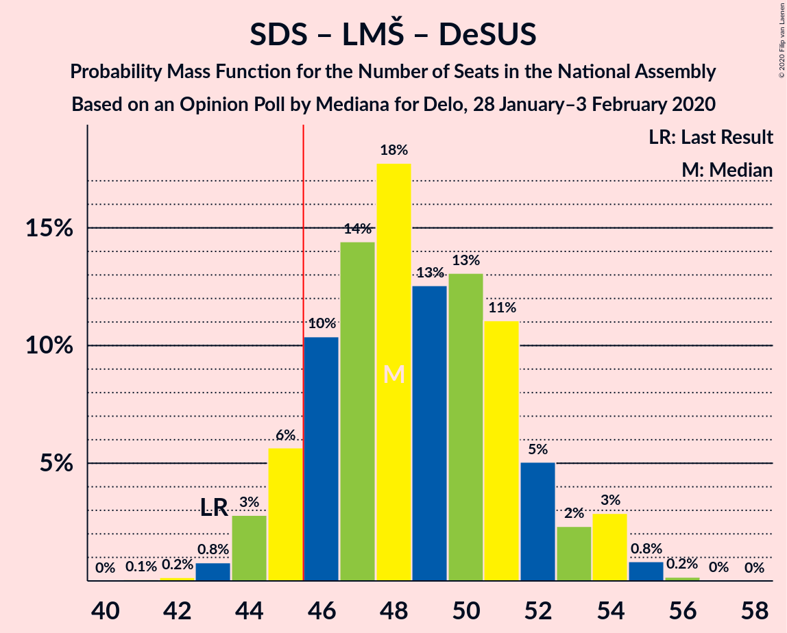
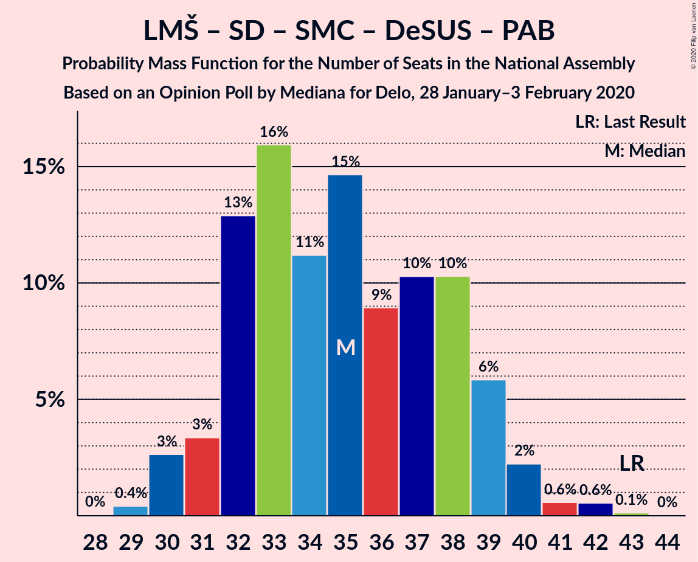

# Opinion Poll by Mediana for Delo, 28 January–3 February 2020

<a href="#voting-intentions">Voting Intentions</a> | <a href="#seats">Seats</a> | <a href="#coalitions">Coalitions</a> | <a href="#technical-information">Technical Information</a>

## Voting Intentions

### Confidence Intervals

| Party | Last Result | Poll Result | 80% Confidence Interval | 90% Confidence Interval | 95% Confidence Interval | 99% Confidence Interval |
|:-----:|:-----------:|:-----------:|:-----------------------:|:-----------------------:|:-----------------------:|:-----------------------:|
| Slovenska demokratska stranka | 24.9% | 26.0% | 24.1–28.1% |23.5–28.7% |23.0–29.2% |22.1–30.2% |
| Lista Marjana Šarca | 12.6% | 22.3% | 20.4–24.3% |19.9–24.8% |19.5–25.3% |18.6–26.3% |
| Socialni demokrati | 9.9% | 11.3% | 10.0–12.9% |9.6–13.4% |9.3–13.7% |8.7–14.5% |
| Levica | 9.3% | 11.3% | 10.0–12.9% |9.6–13.4% |9.3–13.7% |8.7–14.5% |
| Nova Slovenija–Krščanski demokrati | 7.2% | 5.9% | 5.0–7.1% |4.7–7.5% |4.5–7.8% |4.0–8.4% |
| Slovenska nacionalna stranka | 4.2% | 5.1% | 4.3–6.3% |4.0–6.6% |3.8–6.9% |3.4–7.5% |
| Stranka modernega centra | 9.7% | 3.5% | 2.8–4.5% |2.6–4.8% |2.4–5.0% |2.1–5.5% |
| Demokratična stranka upokojencev Slovenije | 4.9% | 3.1% | 2.4–4.1% |2.2–4.3% |2.1–4.6% |1.8–5.1% |
| Stranka Alenke Bratušek | 5.1% | 2.8% | 2.2–3.8% |2.0–4.0% |1.9–4.3% |1.6–4.7% |
| Slovenska ljudska stranka | 2.6% | 2.7% | 2.1–3.6% |1.9–3.9% |1.8–4.1% |1.5–4.6% |

*Note:* The poll result column reflects the actual value used in the calculations. Published results may vary slightly, and in addition be rounded to fewer digits.

## Seats

### Confidence Intervals

| Party | Last Result | Median | 80% Confidence Interval | 90% Confidence Interval | 95% Confidence Interval | 99% Confidence Interval |
|:-----:|:-----------:|:------:|:-----------------------:|:-----------------------:|:-----------------------:|:-----------------------:|
| <a href="#slovenska-demokratska-stranka">Slovenska demokratska stranka</a> | 25 | 25 | 24–28 |23–29 |23–29 |22–30 |
| <a href="#lista-marjana-šarca">Lista Marjana Šarca</a> | 13 | 23 | 20–24 |20–24 |20–25 |19–27 |
| <a href="#socialni-demokrati">Socialni demokrati</a> | 10 | 12 | 10–14 |9–14 |9–14 |8–14 |
| <a href="#levica">Levica</a> | 9 | 11 | 9–13 |9–14 |9–14 |9–14 |
| <a href="#nova-slovenija–krščanski-demokrati">Nova Slovenija–Krščanski demokrati</a> | 7 | 5 | 4–7 |4–7 |4–8 |4–8 |
| <a href="#slovenska-nacionalna-stranka">Slovenska nacionalna stranka</a> | 4 | 5 | 0–6 |0–6 |0–6 |0–7 |
| <a href="#stranka-modernega-centra">Stranka modernega centra</a> | 10 | 0 | 0–4 |0–4 |0–4 |0–5 |
| <a href="#demokratična-stranka-upokojencev-slovenije">Demokratična stranka upokojencev Slovenije</a> | 5 | 0 | 0–4 |0–4 |0–4 |0–4 |
| <a href="#stranka-alenke-bratušek">Stranka Alenke Bratušek</a> | 5 | 0 | 0 |0 |0–4 |0–4 |
| <a href="#slovenska-ljudska-stranka">Slovenska ljudska stranka</a> | 0 | 0 | 0 |0 |0 |0–4 |

### Slovenska demokratska stranka

*For a full overview of the results for this party, see the [Slovenska demokratska stranka](party-slovenskademokratskastranka.html) page.*

| Number of Seats | Probability | Accumulated | Special Marks |
|:---------------:|:-----------:|:-----------:|:-------------:|
| 20 | 0.1% | 100% |  |
| 21 | 0.4% | 99.9% |  |
| 22 | 0.5% | 99.5% |  |
| 23 | 7% | 99.1% |  |
| 24 | 8% | 92% |  |
| 25 | 36% | 83% | Last Result, Median |
| 26 | 18% | 47% |  |
| 27 | 5% | 29% |  |
| 28 | 17% | 25% |  |
| 29 | 6% | 7% |  |
| 30 | 0.8% | 0.9% |  |
| 31 | 0.1% | 0.1% |  |
| 32 | 0% | 0% |  |

### Lista Marjana Šarca

*For a full overview of the results for this party, see the [Lista Marjana Šarca](party-listamarjanašarca.html) page.*

| Number of Seats | Probability | Accumulated | Special Marks |
|:---------------:|:-----------:|:-----------:|:-------------:|
| 13 | 0% | 100% | Last Result |
| 14 | 0% | 100% |  |
| 15 | 0% | 100% |  |
| 16 | 0% | 100% |  |
| 17 | 0.1% | 100% |  |
| 18 | 0.3% | 99.9% |  |
| 19 | 2% | 99.6% |  |
| 20 | 15% | 98% |  |
| 21 | 13% | 83% |  |
| 22 | 19% | 70% |  |
| 23 | 29% | 51% | Median |
| 24 | 19% | 22% |  |
| 25 | 1.3% | 3% |  |
| 26 | 1.1% | 2% |  |
| 27 | 0.4% | 0.6% |  |
| 28 | 0.2% | 0.2% |  |
| 29 | 0% | 0% |  |

### Socialni demokrati

*For a full overview of the results for this party, see the [Socialni demokrati](party-socialnidemokrati.html) page.*

| Number of Seats | Probability | Accumulated | Special Marks |
|:---------------:|:-----------:|:-----------:|:-------------:|
| 8 | 1.2% | 100% |  |
| 9 | 5% | 98.8% |  |
| 10 | 6% | 94% | Last Result |
| 11 | 31% | 88% |  |
| 12 | 21% | 57% | Median |
| 13 | 25% | 36% |  |
| 14 | 10% | 10% |  |
| 15 | 0.2% | 0.2% |  |
| 16 | 0% | 0% |  |

### Levica

*For a full overview of the results for this party, see the [Levica](party-levica.html) page.*

| Number of Seats | Probability | Accumulated | Special Marks |
|:---------------:|:-----------:|:-----------:|:-------------:|
| 7 | 0.1% | 100% |  |
| 8 | 0.3% | 99.9% |  |
| 9 | 17% | 99.6% | Last Result |
| 10 | 9% | 83% |  |
| 11 | 48% | 74% | Median |
| 12 | 12% | 26% |  |
| 13 | 7% | 14% |  |
| 14 | 6% | 6% |  |
| 15 | 0.1% | 0.2% |  |
| 16 | 0% | 0% |  |

### Nova Slovenija–Krščanski demokrati

*For a full overview of the results for this party, see the [Nova Slovenija–Krščanski demokrati](party-novaslovenija–krščanskidemokrati.html) page.*

| Number of Seats | Probability | Accumulated | Special Marks |
|:---------------:|:-----------:|:-----------:|:-------------:|
| 0 | 0.2% | 100% |  |
| 1 | 0% | 99.8% |  |
| 2 | 0% | 99.8% |  |
| 3 | 0% | 99.8% |  |
| 4 | 11% | 99.8% |  |
| 5 | 44% | 89% | Median |
| 6 | 25% | 44% |  |
| 7 | 15% | 19% | Last Result |
| 8 | 4% | 4% |  |
| 9 | 0.1% | 0.1% |  |
| 10 | 0% | 0% |  |

### Slovenska nacionalna stranka

*For a full overview of the results for this party, see the [Slovenska nacionalna stranka](party-slovenskanacionalnastranka.html) page.*

| Number of Seats | Probability | Accumulated | Special Marks |
|:---------------:|:-----------:|:-----------:|:-------------:|
| 0 | 26% | 100% |  |
| 1 | 0% | 74% |  |
| 2 | 0% | 74% |  |
| 3 | 0.5% | 74% |  |
| 4 | 6% | 74% | Last Result |
| 5 | 49% | 67% | Median |
| 6 | 17% | 18% |  |
| 7 | 1.4% | 2% |  |
| 8 | 0.2% | 0.2% |  |
| 9 | 0% | 0% |  |

### Stranka modernega centra

*For a full overview of the results for this party, see the [Stranka modernega centra](party-strankamodernegacentra.html) page.*

| Number of Seats | Probability | Accumulated | Special Marks |
|:---------------:|:-----------:|:-----------:|:-------------:|
| 0 | 78% | 100% | Median |
| 1 | 0% | 22% |  |
| 2 | 0% | 22% |  |
| 3 | 0.4% | 22% |  |
| 4 | 20% | 21% |  |
| 5 | 2% | 2% |  |
| 6 | 0% | 0% |  |
| 7 | 0% | 0% |  |
| 8 | 0% | 0% |  |
| 9 | 0% | 0% |  |
| 10 | 0% | 0% | Last Result |

### Demokratična stranka upokojencev Slovenije

*For a full overview of the results for this party, see the [Demokratična stranka upokojencev Slovenije](party-demokratičnastrankaupokojencevslovenije.html) page.*

| Number of Seats | Probability | Accumulated | Special Marks |
|:---------------:|:-----------:|:-----------:|:-------------:|
| 0 | 82% | 100% | Median |
| 1 | 0% | 18% |  |
| 2 | 0% | 18% |  |
| 3 | 0.1% | 18% |  |
| 4 | 18% | 18% |  |
| 5 | 0.4% | 0.4% | Last Result |
| 6 | 0% | 0% |  |

### Stranka Alenke Bratušek

*For a full overview of the results for this party, see the [Stranka Alenke Bratušek](party-strankaalenkebratušek.html) page.*

| Number of Seats | Probability | Accumulated | Special Marks |
|:---------------:|:-----------:|:-----------:|:-------------:|
| 0 | 97% | 100% | Median |
| 1 | 0% | 3% |  |
| 2 | 0% | 3% |  |
| 3 | 0.1% | 3% |  |
| 4 | 2% | 3% |  |
| 5 | 0.3% | 0.3% | Last Result |
| 6 | 0% | 0% |  |

### Slovenska ljudska stranka

*For a full overview of the results for this party, see the [Slovenska ljudska stranka](party-slovenskaljudskastranka.html) page.*

| Number of Seats | Probability | Accumulated | Special Marks |
|:---------------:|:-----------:|:-----------:|:-------------:|
| 0 | 98.6% | 100% | Last Result, Median |
| 1 | 0% | 1.4% |  |
| 2 | 0% | 1.4% |  |
| 3 | 0.5% | 1.4% |  |
| 4 | 0.7% | 0.9% |  |
| 5 | 0.3% | 0.3% |  |
| 6 | 0% | 0% |  |

## Coalitions

### Confidence Intervals

| Coalition | Last Result | Median | Majority? | 80% Confidence Interval | 90% Confidence Interval | 95% Confidence Interval | 99% Confidence Interval |
|:---------:|:-----------:|:------:|:---------:|:-----------------------:|:-----------------------:|:-----------------------:|:-----------------------:|
| Slovenska demokratska stranka – Lista Marjana Šarca – Demokratična stranka upokojencev Slovenije | 43 | 48 | 91% | 46–54 | 45–54 | 45–54 | 43–55 |
| Slovenska demokratska stranka – Lista Marjana Šarca | 38 | 48 | 89% | 45–50 | 45–52 | 44–52 | 42–53 |
| Lista Marjana Šarca – Socialni demokrati – Nova Slovenija–Krščanski demokrati – Stranka modernega centra – Demokratična stranka upokojencev Slovenije – Stranka Alenke Bratušek | 50 | 41 | 1.1% | 39–45 | 36–45 | 36–45 | 36–46 |
| Lista Marjana Šarca – Socialni demokrati – Nova Slovenija–Krščanski demokrati – Stranka modernega centra – Demokratična stranka upokojencev Slovenije | 45 | 41 | 0.8% | 38–45 | 36–45 | 36–45 | 35–46 |
| Lista Marjana Šarca – Socialni demokrati – Nova Slovenija–Krščanski demokrati – Demokratična stranka upokojencev Slovenije | 35 | 41 | 0.4% | 36–45 | 36–45 | 35–45 | 34–45 |
| Lista Marjana Šarca – Socialni demokrati – Nova Slovenija–Krščanski demokrati – Stranka modernega centra | 40 | 41 | 0.2% | 37–43 | 36–43 | 36–44 | 34–45 |
| Lista Marjana Šarca – Socialni demokrati – Nova Slovenija–Krščanski demokrati | 30 | 41 | 0.1% | 36–41 | 36–41 | 35–42 | 33–44 |
| Lista Marjana Šarca – Socialni demokrati – Demokratična stranka upokojencev Slovenije | 28 | 34 | 0% | 32–39 | 31–39 | 31–39 | 29–39 |
| Lista Marjana Šarca – Socialni demokrati – Stranka modernega centra – Demokratična stranka upokojencev Slovenije – Stranka Alenke Bratušek | 43 | 36 | 0% | 33–39 | 32–39 | 31–39 | 30–41 |
| Lista Marjana Šarca – Socialni demokrati – Stranka modernega centra – Demokratična stranka upokojencev Slovenije | 38 | 36 | 0% | 33–39 | 32–39 | 31–39 | 30–40 |
| Lista Marjana Šarca – Socialni demokrati – Stranka modernega centra | 33 | 35 | 0% | 32–38 | 31–38 | 31–38 | 29–39 |
| Lista Marjana Šarca – Socialni demokrati | 23 | 34 | 0% | 32–36 | 31–36 | 30–36 | 29–39 |
| Socialni demokrati – Stranka modernega centra – Demokratična stranka upokojencev Slovenije | 25 | 13 | 0% | 11–16 | 10–16 | 10–17 | 8–18 |

### Slovenska demokratska stranka – Lista Marjana Šarca – Demokratična stranka upokojencev Slovenije

| Number of Seats | Probability | Accumulated | Special Marks |
|:---------------:|:-----------:|:-----------:|:-------------:|
| 41 | 0.1% | 100% |  |
| 42 | 0.1% | 99.9% |  |
| 43 | 0.4% | 99.8% | Last Result |
| 44 | 0.7% | 99.4% |  |
| 45 | 8% | 98.7% |  |
| 46 | 4% | 91% | Majority |
| 47 | 18% | 87% |  |
| 48 | 33% | 68% | Median |
| 49 | 6% | 35% |  |
| 50 | 6% | 29% |  |
| 51 | 2% | 23% |  |
| 52 | 6% | 22% |  |
| 53 | 0.5% | 16% |  |
| 54 | 15% | 15% |  |
| 55 | 0.5% | 0.5% |  |
| 56 | 0% | 0.1% |  |
| 57 | 0% | 0% |  |

### Slovenska demokratska stranka – Lista Marjana Šarca

| Number of Seats | Probability | Accumulated | Special Marks |
|:---------------:|:-----------:|:-----------:|:-------------:|
| 38 | 0% | 100% | Last Result |
| 39 | 0% | 100% |  |
| 40 | 0.2% | 100% |  |
| 41 | 0.1% | 99.7% |  |
| 42 | 0.5% | 99.7% |  |
| 43 | 2% | 99.2% |  |
| 44 | 0.7% | 98% |  |
| 45 | 8% | 97% |  |
| 46 | 4% | 89% | Majority |
| 47 | 18% | 85% |  |
| 48 | 33% | 67% | Median |
| 49 | 6% | 34% |  |
| 50 | 20% | 28% |  |
| 51 | 1.2% | 8% |  |
| 52 | 6% | 7% |  |
| 53 | 0.3% | 0.8% |  |
| 54 | 0.1% | 0.4% |  |
| 55 | 0.3% | 0.3% |  |
| 56 | 0% | 0% |  |

### Lista Marjana Šarca – Socialni demokrati – Nova Slovenija–Krščanski demokrati – Stranka modernega centra – Demokratična stranka upokojencev Slovenije – Stranka Alenke Bratušek

| Number of Seats | Probability | Accumulated | Special Marks |
|:---------------:|:-----------:|:-----------:|:-------------:|
| 34 | 0.3% | 100% |  |
| 35 | 0.2% | 99.7% |  |
| 36 | 5% | 99.5% |  |
| 37 | 2% | 94% |  |
| 38 | 2% | 93% |  |
| 39 | 7% | 90% |  |
| 40 | 12% | 83% | Median |
| 41 | 34% | 71% |  |
| 42 | 2% | 36% |  |
| 43 | 15% | 35% |  |
| 44 | 3% | 20% |  |
| 45 | 16% | 17% |  |
| 46 | 0.6% | 1.1% | Majority |
| 47 | 0.3% | 0.4% |  |
| 48 | 0.2% | 0.2% |  |
| 49 | 0% | 0% |  |
| 50 | 0% | 0% | Last Result |

### Lista Marjana Šarca – Socialni demokrati – Nova Slovenija–Krščanski demokrati – Stranka modernega centra – Demokratična stranka upokojencev Slovenije

| Number of Seats | Probability | Accumulated | Special Marks |
|:---------------:|:-----------:|:-----------:|:-------------:|
| 34 | 0.3% | 100% |  |
| 35 | 0.4% | 99.6% |  |
| 36 | 6% | 99.3% |  |
| 37 | 2% | 94% |  |
| 38 | 2% | 92% |  |
| 39 | 7% | 89% |  |
| 40 | 13% | 82% | Median |
| 41 | 35% | 70% |  |
| 42 | 2% | 34% |  |
| 43 | 14% | 33% |  |
| 44 | 3% | 18% |  |
| 45 | 15% | 16% | Last Result |
| 46 | 0.6% | 0.8% | Majority |
| 47 | 0.1% | 0.2% |  |
| 48 | 0.1% | 0.1% |  |
| 49 | 0% | 0% |  |

### Lista Marjana Šarca – Socialni demokrati – Nova Slovenija–Krščanski demokrati – Demokratična stranka upokojencev Slovenije

| Number of Seats | Probability | Accumulated | Special Marks |
|:---------------:|:-----------:|:-----------:|:-------------:|
| 32 | 0.1% | 100% |  |
| 33 | 0.2% | 99.9% |  |
| 34 | 0.4% | 99.8% |  |
| 35 | 2% | 99.4% | Last Result |
| 36 | 8% | 97% |  |
| 37 | 2% | 89% |  |
| 38 | 3% | 87% |  |
| 39 | 19% | 84% |  |
| 40 | 12% | 66% | Median |
| 41 | 36% | 54% |  |
| 42 | 2% | 18% |  |
| 43 | 1.4% | 16% |  |
| 44 | 0.6% | 15% |  |
| 45 | 14% | 14% |  |
| 46 | 0.2% | 0.4% | Majority |
| 47 | 0% | 0.1% |  |
| 48 | 0.1% | 0.1% |  |
| 49 | 0% | 0% |  |

### Lista Marjana Šarca – Socialni demokrati – Nova Slovenija–Krščanski demokrati – Stranka modernega centra

| Number of Seats | Probability | Accumulated | Special Marks |
|:---------------:|:-----------:|:-----------:|:-------------:|
| 33 | 0.5% | 100% |  |
| 34 | 0.8% | 99.5% |  |
| 35 | 0.5% | 98.7% |  |
| 36 | 6% | 98% |  |
| 37 | 2% | 92% |  |
| 38 | 2% | 90% |  |
| 39 | 7% | 88% |  |
| 40 | 13% | 80% | Last Result, Median |
| 41 | 48% | 67% |  |
| 42 | 2% | 19% |  |
| 43 | 14% | 17% |  |
| 44 | 2% | 3% |  |
| 45 | 0.9% | 1.0% |  |
| 46 | 0.1% | 0.2% | Majority |
| 47 | 0% | 0.1% |  |
| 48 | 0% | 0% |  |

### Lista Marjana Šarca – Socialni demokrati – Nova Slovenija–Krščanski demokrati

| Number of Seats | Probability | Accumulated | Special Marks |
|:---------------:|:-----------:|:-----------:|:-------------:|
| 30 | 0% | 100% | Last Result |
| 31 | 0% | 100% |  |
| 32 | 0.1% | 100% |  |
| 33 | 0.6% | 99.9% |  |
| 34 | 1.0% | 99.3% |  |
| 35 | 2% | 98% |  |
| 36 | 8% | 96% |  |
| 37 | 3% | 88% |  |
| 38 | 3% | 84% |  |
| 39 | 19% | 82% |  |
| 40 | 12% | 63% | Median |
| 41 | 48% | 51% |  |
| 42 | 1.4% | 3% |  |
| 43 | 1.2% | 2% |  |
| 44 | 0.3% | 0.6% |  |
| 45 | 0.2% | 0.3% |  |
| 46 | 0% | 0.1% | Majority |
| 47 | 0% | 0.1% |  |
| 48 | 0% | 0% |  |

### Lista Marjana Šarca – Socialni demokrati – Demokratična stranka upokojencev Slovenije

| Number of Seats | Probability | Accumulated | Special Marks |
|:---------------:|:-----------:|:-----------:|:-------------:|
| 27 | 0.1% | 100% |  |
| 28 | 0.1% | 99.9% | Last Result |
| 29 | 1.2% | 99.8% |  |
| 30 | 0.9% | 98.6% |  |
| 31 | 4% | 98% |  |
| 32 | 9% | 93% |  |
| 33 | 6% | 85% |  |
| 34 | 30% | 78% |  |
| 35 | 12% | 48% | Median |
| 36 | 20% | 37% |  |
| 37 | 1.2% | 17% |  |
| 38 | 0.5% | 16% |  |
| 39 | 15% | 15% |  |
| 40 | 0.1% | 0.4% |  |
| 41 | 0.2% | 0.2% |  |
| 42 | 0% | 0% |  |

### Lista Marjana Šarca – Socialni demokrati – Stranka modernega centra – Demokratična stranka upokojencev Slovenije – Stranka Alenke Bratušek

| Number of Seats | Probability | Accumulated | Special Marks |
|:---------------:|:-----------:|:-----------:|:-------------:|
| 29 | 0.2% | 100% |  |
| 30 | 0.7% | 99.7% |  |
| 31 | 2% | 99.1% |  |
| 32 | 6% | 97% |  |
| 33 | 6% | 91% |  |
| 34 | 16% | 84% |  |
| 35 | 11% | 68% | Median |
| 36 | 22% | 57% |  |
| 37 | 2% | 35% |  |
| 38 | 14% | 33% |  |
| 39 | 18% | 19% |  |
| 40 | 0.6% | 1.2% |  |
| 41 | 0.4% | 0.6% |  |
| 42 | 0.1% | 0.2% |  |
| 43 | 0.1% | 0.1% | Last Result |
| 44 | 0% | 0% |  |

### Lista Marjana Šarca – Socialni demokrati – Stranka modernega centra – Demokratična stranka upokojencev Slovenije

| Number of Seats | Probability | Accumulated | Special Marks |
|:---------------:|:-----------:|:-----------:|:-------------:|
| 29 | 0.4% | 100% |  |
| 30 | 0.8% | 99.5% |  |
| 31 | 2% | 98.7% |  |
| 32 | 6% | 96% |  |
| 33 | 7% | 90% |  |
| 34 | 16% | 83% |  |
| 35 | 12% | 67% | Median |
| 36 | 22% | 55% |  |
| 37 | 1.4% | 33% |  |
| 38 | 14% | 32% | Last Result |
| 39 | 16% | 17% |  |
| 40 | 0.6% | 0.9% |  |
| 41 | 0.3% | 0.3% |  |
| 42 | 0% | 0.1% |  |
| 43 | 0% | 0.1% |  |
| 44 | 0% | 0% |  |

### Lista Marjana Šarca – Socialni demokrati – Stranka modernega centra

| Number of Seats | Probability | Accumulated | Special Marks |
|:---------------:|:-----------:|:-----------:|:-------------:|
| 28 | 0% | 100% |  |
| 29 | 1.0% | 99.9% |  |
| 30 | 1.3% | 98.9% |  |
| 31 | 4% | 98% |  |
| 32 | 7% | 94% |  |
| 33 | 6% | 87% | Last Result |
| 34 | 16% | 81% |  |
| 35 | 25% | 65% | Median |
| 36 | 22% | 40% |  |
| 37 | 1.4% | 18% |  |
| 38 | 14% | 16% |  |
| 39 | 2% | 2% |  |
| 40 | 0.1% | 0.2% |  |
| 41 | 0.1% | 0.1% |  |
| 42 | 0% | 0% |  |

### Lista Marjana Šarca – Socialni demokrati

| Number of Seats | Probability | Accumulated | Special Marks |
|:---------------:|:-----------:|:-----------:|:-------------:|
| 23 | 0% | 100% | Last Result |
| 24 | 0% | 100% |  |
| 25 | 0% | 100% |  |
| 26 | 0% | 100% |  |
| 27 | 0.1% | 100% |  |
| 28 | 0.3% | 99.9% |  |
| 29 | 2% | 99.6% |  |
| 30 | 1.5% | 98% |  |
| 31 | 6% | 96% |  |
| 32 | 9% | 90% |  |
| 33 | 6% | 81% |  |
| 34 | 30% | 75% |  |
| 35 | 24% | 46% | Median |
| 36 | 19% | 22% |  |
| 37 | 1.3% | 2% |  |
| 38 | 0.4% | 1.2% |  |
| 39 | 0.8% | 0.8% |  |
| 40 | 0% | 0% |  |

### Socialni demokrati – Stranka modernega centra – Demokratična stranka upokojencev Slovenije

| Number of Seats | Probability | Accumulated | Special Marks |
|:---------------:|:-----------:|:-----------:|:-------------:|
| 8 | 0.5% | 100% |  |
| 9 | 1.4% | 99.5% |  |
| 10 | 4% | 98% |  |
| 11 | 14% | 94% |  |
| 12 | 9% | 81% | Median |
| 13 | 27% | 72% |  |
| 14 | 11% | 45% |  |
| 15 | 18% | 34% |  |
| 16 | 12% | 16% |  |
| 17 | 2% | 4% |  |
| 18 | 2% | 2% |  |
| 19 | 0.1% | 0.5% |  |
| 20 | 0.3% | 0.3% |  |
| 21 | 0% | 0% |  |
| 22 | 0% | 0% |  |
| 23 | 0% | 0% |  |
| 24 | 0% | 0% |  |
| 25 | 0% | 0% | Last Result |

## Technical Information

### Opinion Poll

+ **Polling firm:** Mediana
+ **Commissioner(s):** Delo
+ **Fieldwork period:** 28 January–3 February 2020

### Calculations

+ **Sample size:** 777
+ **Simulations done:** 131,072
+ **Error estimate:** 2.33%

