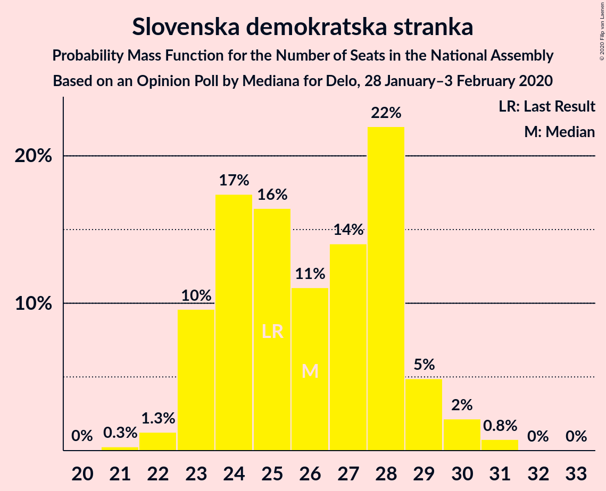
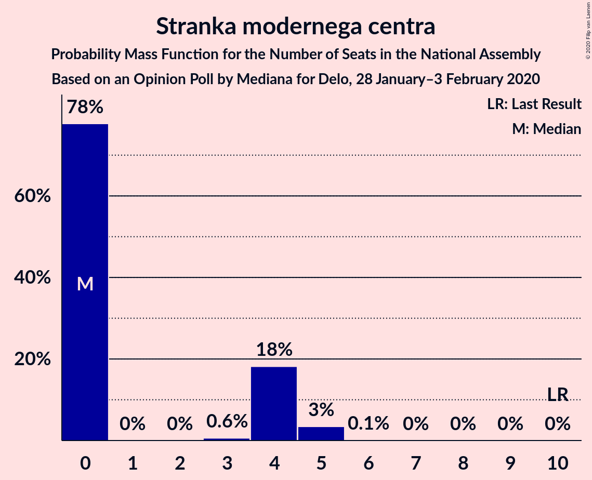
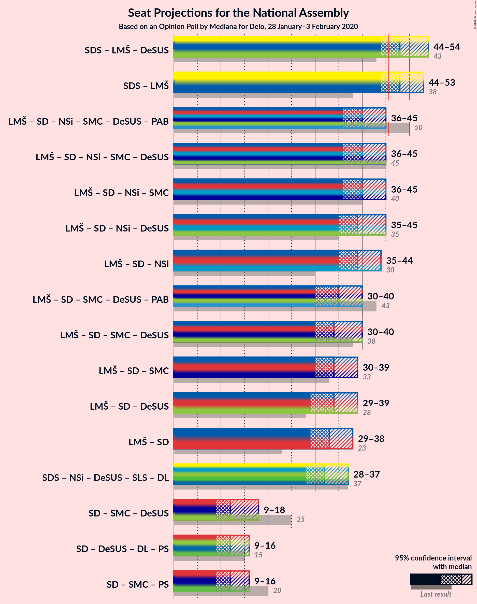
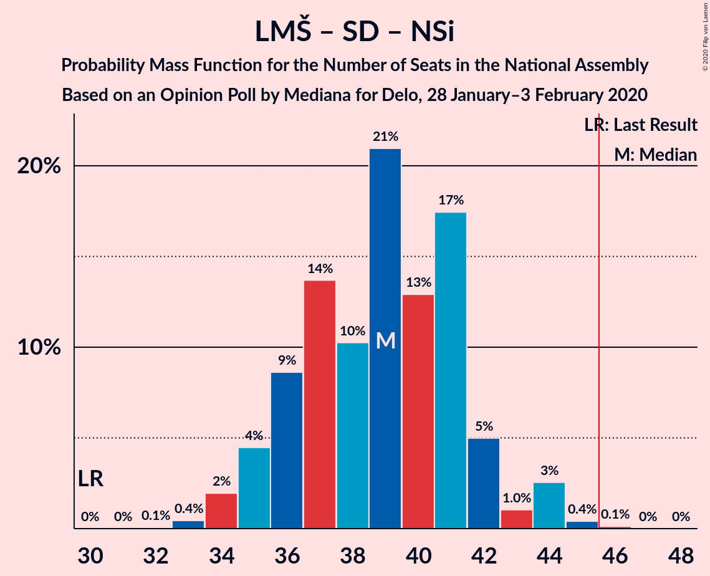
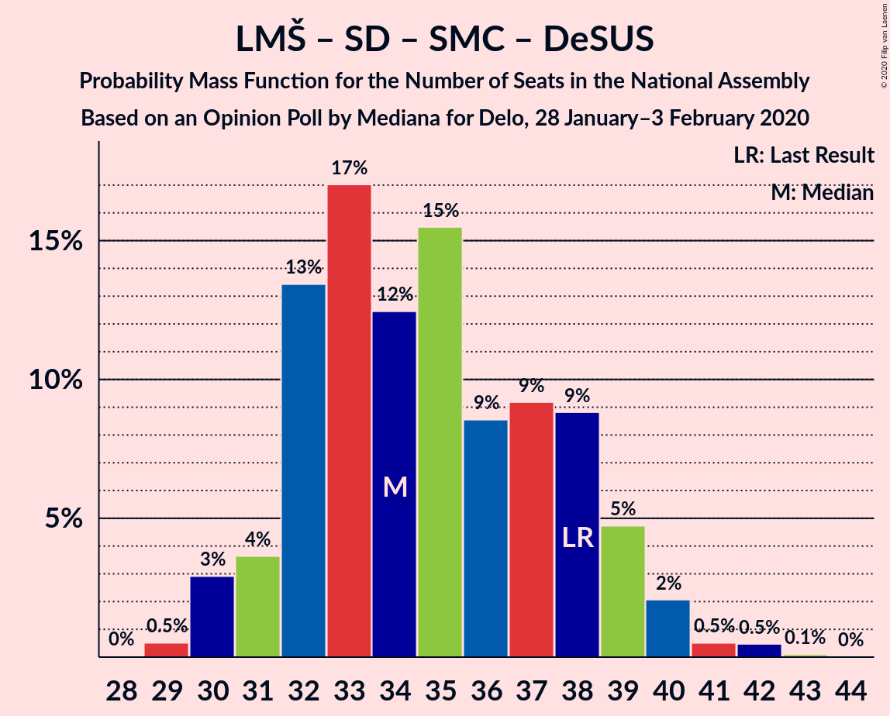
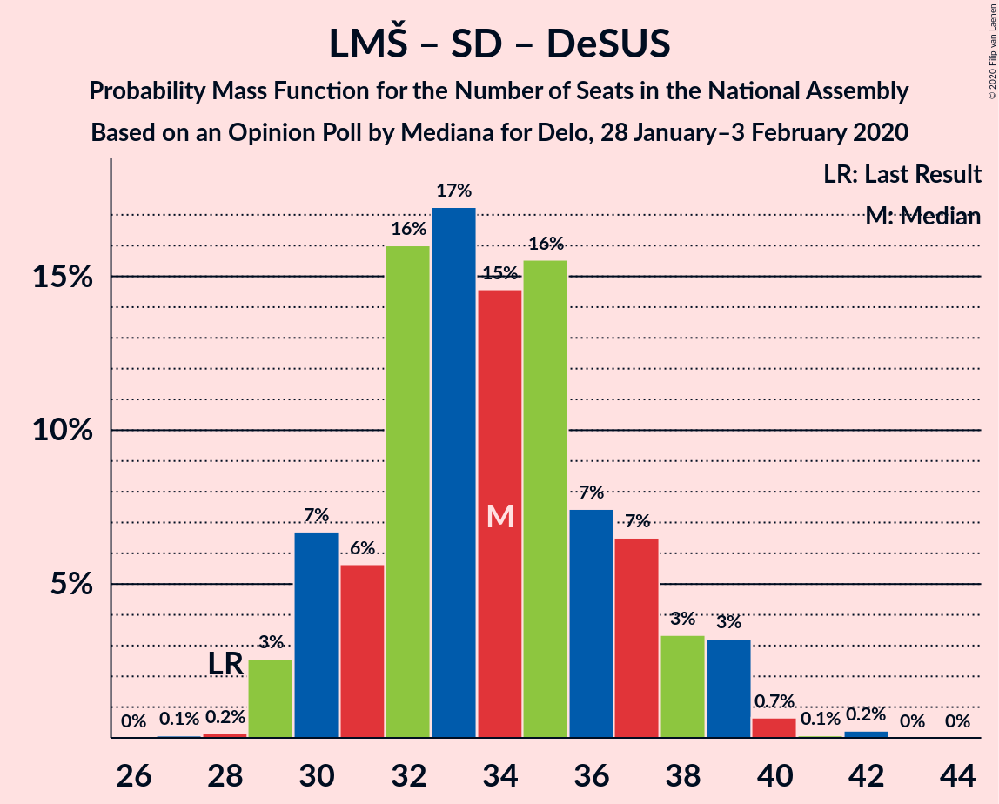

# Opinion Poll by Mediana for Delo, 28 January–3 February 2020

<a href="#voting-intentions">Voting Intentions</a> | <a href="#seats">Seats</a> | <a href="#coalitions">Coalitions</a> | <a href="#technical-information">Technical Information</a>

## Voting Intentions

### Confidence Intervals

| Party | Last Result | Poll Result | 80% Confidence Interval | 90% Confidence Interval | 95% Confidence Interval | 99% Confidence Interval |
|:-----:|:-----------:|:-----------:|:-----------------------:|:-----------------------:|:-----------------------:|:-----------------------:|
| Slovenska demokratska stranka | 24.9% | 26.0% | 24.1–28.1% |23.5–28.7% |23.0–29.2% |22.1–30.2% |
| Lista Marjana Šarca | 12.6% | 22.3% | 20.4–24.3% |19.9–24.8% |19.5–25.3% |18.6–26.3% |
| Socialni demokrati | 9.9% | 11.3% | 10.0–12.9% |9.6–13.4% |9.3–13.7% |8.7–14.5% |
| Levica | 9.3% | 11.3% | 10.0–12.9% |9.6–13.4% |9.3–13.7% |8.7–14.5% |
| Nova Slovenija–Krščanski demokrati | 7.2% | 5.9% | 5.0–7.1% |4.7–7.5% |4.5–7.8% |4.0–8.4% |
| Slovenska nacionalna stranka | 4.2% | 5.1% | 4.3–6.3% |4.0–6.6% |3.8–6.9% |3.4–7.5% |
| Stranka modernega centra | 9.7% | 3.5% | 2.8–4.5% |2.6–4.8% |2.4–5.0% |2.1–5.5% |
| Demokratična stranka upokojencev Slovenije | 4.9% | 3.1% | 2.4–4.1% |2.2–4.3% |2.1–4.6% |1.8–5.1% |
| Stranka Alenke Bratušek | 5.1% | 2.8% | 2.2–3.8% |2.0–4.0% |1.9–4.3% |1.6–4.7% |
| Slovenska ljudska stranka | 2.6% | 2.7% | 2.1–3.6% |1.9–3.9% |1.8–4.1% |1.5–4.6% |

*Note:* The poll result column reflects the actual value used in the calculations. Published results may vary slightly, and in addition be rounded to fewer digits.

## Seats

### Confidence Intervals

| Party | Last Result | Median | 80% Confidence Interval | 90% Confidence Interval | 95% Confidence Interval | 99% Confidence Interval |
|:-----:|:-----------:|:------:|:-----------------------:|:-----------------------:|:-----------------------:|:-----------------------:|
| <a href="#slovenska-demokratska-stranka">Slovenska demokratska stranka</a> | 25 | 26 | 23–28 |23–29 |23–30 |22–31 |
| <a href="#lista-marjana-šarca">Lista Marjana Šarca</a> | 13 | 22 | 20–24 |19–25 |19–25 |18–27 |
| <a href="#socialni-demokrati">Socialni demokrati</a> | 10 | 11 | 10–13 |9–13 |9–14 |8–14 |
| <a href="#levica">Levica</a> | 9 | 11 | 10–13 |9–14 |9–14 |8–14 |
| <a href="#nova-slovenija–krščanski-demokrati">Nova Slovenija–Krščanski demokrati</a> | 7 | 6 | 4–7 |4–7 |4–7 |4–8 |
| <a href="#slovenska-nacionalna-stranka">Slovenska nacionalna stranka</a> | 4 | 5 | 4–6 |0–6 |0–6 |0–7 |
| <a href="#stranka-modernega-centra">Stranka modernega centra</a> | 10 | 0 | 0–4 |0–4 |0–5 |0–5 |
| <a href="#demokratična-stranka-upokojencev-slovenije">Demokratična stranka upokojencev Slovenije</a> | 5 | 0 | 0–4 |0–4 |0–4 |0–4 |
| <a href="#stranka-alenke-bratušek">Stranka Alenke Bratušek</a> | 5 | 0 | 0 |0–4 |0–4 |0–4 |
| <a href="#slovenska-ljudska-stranka">Slovenska ljudska stranka</a> | 0 | 0 | 0 |0 |0–4 |0–4 |

### Slovenska demokratska stranka

*For a full overview of the results for this party, see the [Slovenska demokratska stranka](party-slovenskademokratskastranka.html) page.*

| Number of Seats | Probability | Accumulated | Special Marks |
|:---------------:|:-----------:|:-----------:|:-------------:|
| 20 | 0% | 100% |  |
| 21 | 0.3% | 99.9% |  |
| 22 | 1.3% | 99.7% |  |
| 23 | 10% | 98% |  |
| 24 | 17% | 89% |  |
| 25 | 16% | 71% | Last Result |
| 26 | 11% | 55% | Median |
| 27 | 14% | 44% |  |
| 28 | 22% | 30% |  |
| 29 | 5% | 8% |  |
| 30 | 2% | 3% |  |
| 31 | 0.8% | 0.9% |  |
| 32 | 0% | 0.1% |  |
| 33 | 0% | 0% |  |

### Lista Marjana Šarca

*For a full overview of the results for this party, see the [Lista Marjana Šarca](party-listamarjanašarca.html) page.*

| Number of Seats | Probability | Accumulated | Special Marks |
|:---------------:|:-----------:|:-----------:|:-------------:|
| 13 | 0% | 100% | Last Result |
| 14 | 0% | 100% |  |
| 15 | 0% | 100% |  |
| 16 | 0% | 100% |  |
| 17 | 0.1% | 100% |  |
| 18 | 0.8% | 99.9% |  |
| 19 | 5% | 99.0% |  |
| 20 | 11% | 94% |  |
| 21 | 22% | 84% |  |
| 22 | 21% | 62% | Median |
| 23 | 22% | 41% |  |
| 24 | 10% | 19% |  |
| 25 | 7% | 9% |  |
| 26 | 1.0% | 2% |  |
| 27 | 0.6% | 0.7% |  |
| 28 | 0.1% | 0.1% |  |
| 29 | 0% | 0% |  |

### Socialni demokrati

*For a full overview of the results for this party, see the [Socialni demokrati](party-socialnidemokrati.html) page.*

| Number of Seats | Probability | Accumulated | Special Marks |
|:---------------:|:-----------:|:-----------:|:-------------:|
| 8 | 2% | 100% |  |
| 9 | 6% | 98% |  |
| 10 | 26% | 93% | Last Result |
| 11 | 26% | 67% | Median |
| 12 | 25% | 41% |  |
| 13 | 13% | 16% |  |
| 14 | 3% | 3% |  |
| 15 | 0.3% | 0.4% |  |
| 16 | 0% | 0% |  |

### Levica

*For a full overview of the results for this party, see the [Levica](party-levica.html) page.*

| Number of Seats | Probability | Accumulated | Special Marks |
|:---------------:|:-----------:|:-----------:|:-------------:|
| 8 | 1.0% | 100% |  |
| 9 | 9% | 99.0% | Last Result |
| 10 | 24% | 90% |  |
| 11 | 24% | 66% | Median |
| 12 | 24% | 42% |  |
| 13 | 14% | 19% |  |
| 14 | 5% | 5% |  |
| 15 | 0.3% | 0.3% |  |
| 16 | 0% | 0% |  |

### Nova Slovenija–Krščanski demokrati

*For a full overview of the results for this party, see the [Nova Slovenija–Krščanski demokrati](party-novaslovenija–krščanskidemokrati.html) page.*

| Number of Seats | Probability | Accumulated | Special Marks |
|:---------------:|:-----------:|:-----------:|:-------------:|
| 0 | 0.4% | 100% |  |
| 1 | 0% | 99.6% |  |
| 2 | 0% | 99.6% |  |
| 3 | 0% | 99.6% |  |
| 4 | 10% | 99.6% |  |
| 5 | 38% | 89% |  |
| 6 | 32% | 52% | Median |
| 7 | 18% | 20% | Last Result |
| 8 | 2% | 2% |  |
| 9 | 0.1% | 0.1% |  |
| 10 | 0% | 0% |  |

### Slovenska nacionalna stranka

*For a full overview of the results for this party, see the [Slovenska nacionalna stranka](party-slovenskanacionalnastranka.html) page.*

| Number of Seats | Probability | Accumulated | Special Marks |
|:---------------:|:-----------:|:-----------:|:-------------:|
| 0 | 9% | 100% |  |
| 1 | 0% | 91% |  |
| 2 | 0% | 91% |  |
| 3 | 0.3% | 91% |  |
| 4 | 31% | 91% | Last Result |
| 5 | 37% | 60% | Median |
| 6 | 21% | 24% |  |
| 7 | 2% | 2% |  |
| 8 | 0.2% | 0.2% |  |
| 9 | 0% | 0% |  |

### Stranka modernega centra

*For a full overview of the results for this party, see the [Stranka modernega centra](party-strankamodernegacentra.html) page.*

| Number of Seats | Probability | Accumulated | Special Marks |
|:---------------:|:-----------:|:-----------:|:-------------:|
| 0 | 78% | 100% | Median |
| 1 | 0% | 22% |  |
| 2 | 0% | 22% |  |
| 3 | 0.6% | 22% |  |
| 4 | 18% | 22% |  |
| 5 | 3% | 4% |  |
| 6 | 0.1% | 0.1% |  |
| 7 | 0% | 0% |  |
| 8 | 0% | 0% |  |
| 9 | 0% | 0% |  |
| 10 | 0% | 0% | Last Result |

### Demokratična stranka upokojencev Slovenije

*For a full overview of the results for this party, see the [Demokratična stranka upokojencev Slovenije](party-demokratičnastrankaupokojencevslovenije.html) page.*

| Number of Seats | Probability | Accumulated | Special Marks |
|:---------------:|:-----------:|:-----------:|:-------------:|
| 0 | 87% | 100% | Median |
| 1 | 0% | 13% |  |
| 2 | 0% | 13% |  |
| 3 | 0.2% | 13% |  |
| 4 | 12% | 13% |  |
| 5 | 0.5% | 0.5% | Last Result |
| 6 | 0% | 0% |  |

### Stranka Alenke Bratušek

*For a full overview of the results for this party, see the [Stranka Alenke Bratušek](party-strankaalenkebratušek.html) page.*

| Number of Seats | Probability | Accumulated | Special Marks |
|:---------------:|:-----------:|:-----------:|:-------------:|
| 0 | 95% | 100% | Median |
| 1 | 0% | 5% |  |
| 2 | 0% | 5% |  |
| 3 | 0.2% | 5% |  |
| 4 | 5% | 5% |  |
| 5 | 0.2% | 0.2% | Last Result |
| 6 | 0% | 0% |  |

### Slovenska ljudska stranka

*For a full overview of the results for this party, see the [Slovenska ljudska stranka](party-slovenskaljudskastranka.html) page.*

| Number of Seats | Probability | Accumulated | Special Marks |
|:---------------:|:-----------:|:-----------:|:-------------:|
| 0 | 97% | 100% | Last Result, Median |
| 1 | 0% | 3% |  |
| 2 | 0% | 3% |  |
| 3 | 0.2% | 3% |  |
| 4 | 3% | 3% |  |
| 5 | 0.1% | 0.1% |  |
| 6 | 0% | 0% |  |

## Coalitions

### Confidence Intervals

| Coalition | Last Result | Median | Majority? | 80% Confidence Interval | 90% Confidence Interval | 95% Confidence Interval | 99% Confidence Interval |
|:---------:|:-----------:|:------:|:---------:|:-----------------------:|:-----------------------:|:-----------------------:|:-----------------------:|
| Slovenska demokratska stranka – Lista Marjana Šarca – Demokratična stranka upokojencev Slovenije | 43 | 48 | 91% | 46–52 | 45–53 | 44–54 | 43–55 |
| Slovenska demokratska stranka – Lista Marjana Šarca | 38 | 48 | 87% | 45–51 | 44–52 | 44–53 | 42–55 |
| Lista Marjana Šarca – Socialni demokrati – Nova Slovenija–Krščanski demokrati – Stranka modernega centra – Demokratična stranka upokojencev Slovenije – Stranka Alenke Bratušek | 50 | 40 | 2% | 37–44 | 37–45 | 36–45 | 35–47 |
| Lista Marjana Šarca – Socialni demokrati – Nova Slovenija–Krščanski demokrati – Stranka modernega centra – Demokratična stranka upokojencev Slovenije | 45 | 40 | 2% | 37–44 | 36–45 | 36–45 | 35–47 |
| Lista Marjana Šarca – Socialni demokrati – Nova Slovenija–Krščanski demokrati – Stranka modernega centra | 40 | 40 | 0.8% | 37–43 | 36–44 | 36–45 | 34–46 |
| Lista Marjana Šarca – Socialni demokrati – Nova Slovenija–Krščanski demokrati – Demokratična stranka upokojencev Slovenije | 35 | 39 | 0.8% | 36–43 | 35–44 | 35–45 | 34–46 |
| Lista Marjana Šarca – Socialni demokrati – Nova Slovenija–Krščanski demokrati | 30 | 39 | 0.2% | 36–41 | 35–42 | 35–44 | 33–45 |
| Lista Marjana Šarca – Socialni demokrati – Stranka modernega centra – Demokratična stranka upokojencev Slovenije – Stranka Alenke Bratušek | 43 | 35 | 0% | 32–38 | 31–39 | 30–40 | 30–42 |
| Lista Marjana Šarca – Socialni demokrati – Stranka modernega centra – Demokratična stranka upokojencev Slovenije | 38 | 34 | 0% | 32–38 | 31–39 | 30–40 | 29–42 |
| Lista Marjana Šarca – Socialni demokrati – Stranka modernega centra | 33 | 34 | 0% | 32–38 | 31–38 | 30–39 | 29–40 |
| Lista Marjana Šarca – Socialni demokrati – Demokratična stranka upokojencev Slovenije | 28 | 34 | 0% | 31–37 | 30–38 | 29–39 | 29–40 |
| Lista Marjana Šarca – Socialni demokrati | 23 | 33 | 0% | 30–36 | 30–37 | 29–38 | 29–38 |
| Socialni demokrati – Stranka modernega centra – Demokratična stranka upokojencev Slovenije | 25 | 12 | 0% | 10–16 | 10–17 | 9–18 | 8–19 |

### Slovenska demokratska stranka – Lista Marjana Šarca – Demokratična stranka upokojencev Slovenije

| Number of Seats | Probability | Accumulated | Special Marks |
|:---------------:|:-----------:|:-----------:|:-------------:|
| 41 | 0.1% | 100% |  |
| 42 | 0.2% | 99.9% |  |
| 43 | 0.8% | 99.8% | Last Result |
| 44 | 3% | 99.0% |  |
| 45 | 6% | 96% |  |
| 46 | 10% | 91% | Majority |
| 47 | 14% | 80% |  |
| 48 | 18% | 66% | Median |
| 49 | 13% | 48% |  |
| 50 | 13% | 35% |  |
| 51 | 11% | 22% |  |
| 52 | 5% | 11% |  |
| 53 | 2% | 6% |  |
| 54 | 3% | 4% |  |
| 55 | 0.8% | 1.0% |  |
| 56 | 0.2% | 0.2% |  |
| 57 | 0% | 0.1% |  |
| 58 | 0% | 0% |  |

### Slovenska demokratska stranka – Lista Marjana Šarca

| Number of Seats | Probability | Accumulated | Special Marks |
|:---------------:|:-----------:|:-----------:|:-------------:|
| 38 | 0% | 100% | Last Result |
| 39 | 0% | 100% |  |
| 40 | 0% | 100% |  |
| 41 | 0.2% | 99.9% |  |
| 42 | 0.4% | 99.7% |  |
| 43 | 1.4% | 99.3% |  |
| 44 | 3% | 98% |  |
| 45 | 8% | 95% |  |
| 46 | 12% | 87% | Majority |
| 47 | 17% | 76% |  |
| 48 | 19% | 59% | Median |
| 49 | 11% | 40% |  |
| 50 | 14% | 28% |  |
| 51 | 8% | 15% |  |
| 52 | 4% | 7% |  |
| 53 | 1.3% | 3% |  |
| 54 | 1.0% | 2% |  |
| 55 | 0.6% | 0.8% |  |
| 56 | 0.2% | 0.2% |  |
| 57 | 0% | 0% |  |

### Lista Marjana Šarca – Socialni demokrati – Nova Slovenija–Krščanski demokrati – Stranka modernega centra – Demokratična stranka upokojencev Slovenije – Stranka Alenke Bratušek

| Number of Seats | Probability | Accumulated | Special Marks |
|:---------------:|:-----------:|:-----------:|:-------------:|
| 34 | 0.1% | 100% |  |
| 35 | 0.5% | 99.8% |  |
| 36 | 4% | 99.3% |  |
| 37 | 9% | 95% |  |
| 38 | 9% | 86% |  |
| 39 | 17% | 78% | Median |
| 40 | 13% | 61% |  |
| 41 | 15% | 48% |  |
| 42 | 9% | 33% |  |
| 43 | 9% | 25% |  |
| 44 | 7% | 16% |  |
| 45 | 6% | 9% |  |
| 46 | 1.5% | 2% | Majority |
| 47 | 0.7% | 0.9% |  |
| 48 | 0.1% | 0.2% |  |
| 49 | 0.1% | 0.1% |  |
| 50 | 0% | 0% | Last Result |

### Lista Marjana Šarca – Socialni demokrati – Nova Slovenija–Krščanski demokrati – Stranka modernega centra – Demokratična stranka upokojencev Slovenije

| Number of Seats | Probability | Accumulated | Special Marks |
|:---------------:|:-----------:|:-----------:|:-------------:|
| 34 | 0.2% | 100% |  |
| 35 | 0.8% | 99.8% |  |
| 36 | 4% | 99.0% |  |
| 37 | 9% | 94% |  |
| 38 | 10% | 85% |  |
| 39 | 18% | 76% | Median |
| 40 | 13% | 58% |  |
| 41 | 15% | 45% |  |
| 42 | 8% | 29% |  |
| 43 | 7% | 21% |  |
| 44 | 7% | 14% |  |
| 45 | 5% | 8% | Last Result |
| 46 | 1.3% | 2% | Majority |
| 47 | 0.6% | 0.8% |  |
| 48 | 0.1% | 0.1% |  |
| 49 | 0% | 0.1% |  |
| 50 | 0% | 0% |  |

### Lista Marjana Šarca – Socialni demokrati – Nova Slovenija–Krščanski demokrati – Stranka modernega centra

| Number of Seats | Probability | Accumulated | Special Marks |
|:---------------:|:-----------:|:-----------:|:-------------:|
| 33 | 0.3% | 100% |  |
| 34 | 0.3% | 99.7% |  |
| 35 | 1.2% | 99.4% |  |
| 36 | 5% | 98% |  |
| 37 | 10% | 93% |  |
| 38 | 10% | 82% |  |
| 39 | 20% | 72% | Median |
| 40 | 13% | 52% | Last Result |
| 41 | 17% | 38% |  |
| 42 | 8% | 21% |  |
| 43 | 5% | 13% |  |
| 44 | 6% | 8% |  |
| 45 | 2% | 3% |  |
| 46 | 0.5% | 0.8% | Majority |
| 47 | 0.2% | 0.3% |  |
| 48 | 0% | 0.1% |  |
| 49 | 0% | 0% |  |

### Lista Marjana Šarca – Socialni demokrati – Nova Slovenija–Krščanski demokrati – Demokratična stranka upokojencev Slovenije

| Number of Seats | Probability | Accumulated | Special Marks |
|:---------------:|:-----------:|:-----------:|:-------------:|
| 32 | 0% | 100% |  |
| 33 | 0.1% | 99.9% |  |
| 34 | 2% | 99.8% |  |
| 35 | 4% | 98% | Last Result |
| 36 | 7% | 94% |  |
| 37 | 12% | 87% |  |
| 38 | 10% | 75% |  |
| 39 | 19% | 66% | Median |
| 40 | 14% | 46% |  |
| 41 | 16% | 33% |  |
| 42 | 6% | 16% |  |
| 43 | 3% | 11% |  |
| 44 | 3% | 8% |  |
| 45 | 3% | 4% |  |
| 46 | 0.5% | 0.8% | Majority |
| 47 | 0.3% | 0.3% |  |
| 48 | 0% | 0% |  |

### Lista Marjana Šarca – Socialni demokrati – Nova Slovenija–Krščanski demokrati

| Number of Seats | Probability | Accumulated | Special Marks |
|:---------------:|:-----------:|:-----------:|:-------------:|
| 30 | 0% | 100% | Last Result |
| 31 | 0% | 100% |  |
| 32 | 0.1% | 100% |  |
| 33 | 0.4% | 99.9% |  |
| 34 | 2% | 99.5% |  |
| 35 | 4% | 98% |  |
| 36 | 9% | 93% |  |
| 37 | 14% | 84% |  |
| 38 | 10% | 71% |  |
| 39 | 21% | 60% | Median |
| 40 | 13% | 40% |  |
| 41 | 17% | 27% |  |
| 42 | 5% | 9% |  |
| 43 | 1.0% | 4% |  |
| 44 | 3% | 3% |  |
| 45 | 0.4% | 0.6% |  |
| 46 | 0.1% | 0.2% | Majority |
| 47 | 0% | 0% |  |

### Lista Marjana Šarca – Socialni demokrati – Stranka modernega centra – Demokratična stranka upokojencev Slovenije – Stranka Alenke Bratušek

| Number of Seats | Probability | Accumulated | Special Marks |
|:---------------:|:-----------:|:-----------:|:-------------:|
| 29 | 0.4% | 100% |  |
| 30 | 3% | 99.5% |  |
| 31 | 3% | 97% |  |
| 32 | 13% | 94% |  |
| 33 | 16% | 81% | Median |
| 34 | 11% | 65% |  |
| 35 | 15% | 54% |  |
| 36 | 9% | 39% |  |
| 37 | 10% | 30% |  |
| 38 | 10% | 20% |  |
| 39 | 6% | 9% |  |
| 40 | 2% | 4% |  |
| 41 | 0.6% | 1.3% |  |
| 42 | 0.6% | 0.7% |  |
| 43 | 0.1% | 0.1% | Last Result |
| 44 | 0% | 0% |  |

### Lista Marjana Šarca – Socialni demokrati – Stranka modernega centra – Demokratična stranka upokojencev Slovenije

| Number of Seats | Probability | Accumulated | Special Marks |
|:---------------:|:-----------:|:-----------:|:-------------:|
| 28 | 0% | 100% |  |
| 29 | 0.5% | 99.9% |  |
| 30 | 3% | 99.4% |  |
| 31 | 4% | 97% |  |
| 32 | 13% | 93% |  |
| 33 | 17% | 79% | Median |
| 34 | 12% | 62% |  |
| 35 | 15% | 50% |  |
| 36 | 9% | 34% |  |
| 37 | 9% | 26% |  |
| 38 | 9% | 17% | Last Result |
| 39 | 5% | 8% |  |
| 40 | 2% | 3% |  |
| 41 | 0.5% | 1.1% |  |
| 42 | 0.5% | 0.6% |  |
| 43 | 0.1% | 0.1% |  |
| 44 | 0% | 0% |  |

### Lista Marjana Šarca – Socialni demokrati – Stranka modernega centra

| Number of Seats | Probability | Accumulated | Special Marks |
|:---------------:|:-----------:|:-----------:|:-------------:|
| 28 | 0.1% | 100% |  |
| 29 | 0.8% | 99.9% |  |
| 30 | 4% | 99.0% |  |
| 31 | 5% | 96% |  |
| 32 | 15% | 91% |  |
| 33 | 19% | 76% | Last Result, Median |
| 34 | 13% | 56% |  |
| 35 | 17% | 43% |  |
| 36 | 8% | 26% |  |
| 37 | 7% | 18% |  |
| 38 | 8% | 11% |  |
| 39 | 2% | 3% |  |
| 40 | 0.9% | 1.2% |  |
| 41 | 0.2% | 0.3% |  |
| 42 | 0.1% | 0.1% |  |
| 43 | 0% | 0% |  |

### Lista Marjana Šarca – Socialni demokrati – Demokratična stranka upokojencev Slovenije

| Number of Seats | Probability | Accumulated | Special Marks |
|:---------------:|:-----------:|:-----------:|:-------------:|
| 27 | 0.1% | 100% |  |
| 28 | 0.2% | 99.9% | Last Result |
| 29 | 3% | 99.8% |  |
| 30 | 7% | 97% |  |
| 31 | 6% | 90% |  |
| 32 | 16% | 85% |  |
| 33 | 17% | 69% | Median |
| 34 | 15% | 52% |  |
| 35 | 16% | 37% |  |
| 36 | 7% | 21% |  |
| 37 | 7% | 14% |  |
| 38 | 3% | 8% |  |
| 39 | 3% | 4% |  |
| 40 | 0.7% | 1.0% |  |
| 41 | 0.1% | 0.3% |  |
| 42 | 0.2% | 0.2% |  |
| 43 | 0% | 0% |  |

### Lista Marjana Šarca – Socialni demokrati

| Number of Seats | Probability | Accumulated | Special Marks |
|:---------------:|:-----------:|:-----------:|:-------------:|
| 23 | 0% | 100% | Last Result |
| 24 | 0% | 100% |  |
| 25 | 0% | 100% |  |
| 26 | 0% | 100% |  |
| 27 | 0.1% | 100% |  |
| 28 | 0.3% | 99.9% |  |
| 29 | 3% | 99.6% |  |
| 30 | 8% | 96% |  |
| 31 | 7% | 89% |  |
| 32 | 18% | 82% |  |
| 33 | 19% | 64% | Median |
| 34 | 15% | 44% |  |
| 35 | 17% | 30% |  |
| 36 | 6% | 13% |  |
| 37 | 4% | 7% |  |
| 38 | 2% | 3% |  |
| 39 | 0.4% | 0.5% |  |
| 40 | 0.1% | 0.1% |  |
| 41 | 0% | 0% |  |

### Socialni demokrati – Stranka modernega centra – Demokratična stranka upokojencev Slovenije

| Number of Seats | Probability | Accumulated | Special Marks |
|:---------------:|:-----------:|:-----------:|:-------------:|
| 8 | 1.2% | 100% |  |
| 9 | 2% | 98.8% |  |
| 10 | 16% | 97% |  |
| 11 | 16% | 80% | Median |
| 12 | 19% | 64% |  |
| 13 | 13% | 45% |  |
| 14 | 10% | 32% |  |
| 15 | 9% | 22% |  |
| 16 | 7% | 13% |  |
| 17 | 3% | 6% |  |
| 18 | 2% | 3% |  |
| 19 | 0.7% | 1.0% |  |
| 20 | 0.3% | 0.3% |  |
| 21 | 0.1% | 0.1% |  |
| 22 | 0% | 0% |  |
| 23 | 0% | 0% |  |
| 24 | 0% | 0% |  |
| 25 | 0% | 0% | Last Result |

## Technical Information

### Opinion Poll

+ **Polling firm:** Mediana
+ **Commissioner(s):** Delo
+ **Fieldwork period:** 28 January–3 February 2020

### Calculations

+ **Sample size:** 777
+ **Simulations done:** 1,048,576
+ **Error estimate:** 1.78%

