# Opinion Poll by Parsifal for Nova 24, 3–5 February 2020

<a href="#voting-intentions">Voting Intentions</a> | <a href="#seats">Seats</a> | <a href="#coalitions">Coalitions</a> | <a href="#technical-information">Technical Information</a>

## Voting Intentions

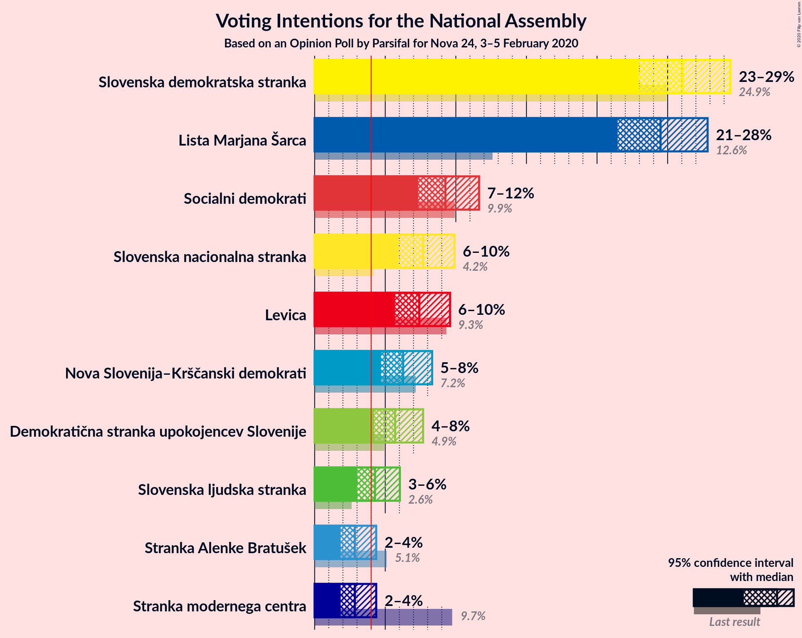

### Confidence Intervals

| Party | Last Result | Poll Result | 80% Confidence Interval | 90% Confidence Interval | 95% Confidence Interval | 99% Confidence Interval |
|:-----:|:-----------:|:-----------:|:-----------------------:|:-----------------------:|:-----------------------:|:-----------------------:|
| Slovenska demokratska stranka | 24.9% | 26.1% | 24.0–28.3% |23.4–28.9% |23.0–29.4% |22.0–30.5% |
| Lista Marjana Šarca | 12.6% | 24.5% | 22.5–26.7% |21.9–27.3% |21.5–27.8% |20.5–28.9% |
| Socialni demokrati | 9.9% | 9.3% | 8.0–10.8% |7.6–11.2% |7.3–11.6% |6.8–12.4% |
| Slovenska nacionalna stranka | 4.2% | 7.7% | 6.5–9.1% |6.2–9.5% |5.9–9.9% |5.4–10.6% |
| Levica | 9.3% | 7.4% | 6.3–8.8% |6.0–9.2% |5.7–9.6% |5.2–10.3% |
| Nova Slovenija–Krščanski demokrati | 7.2% | 6.3% | 5.2–7.6% |4.9–8.0% |4.7–8.3% |4.3–9.0% |
| Demokratična stranka upokojencev Slovenije | 4.9% | 5.7% | 4.7–7.0% |4.4–7.3% |4.2–7.7% |3.8–8.3% |
| Slovenska ljudska stranka | 2.6% | 4.3% | 3.4–5.4% |3.2–5.7% |3.0–6.0% |2.7–6.6% |
| Stranka modernega centra | 9.7% | 2.8% | 2.2–3.8% |2.0–4.1% |1.8–4.4% |1.6–4.9% |
| Stranka Alenke Bratušek | 5.1% | 2.8% | 2.2–3.8% |2.0–4.1% |1.8–4.4% |1.6–4.9% |

*Note:* The poll result column reflects the actual value used in the calculations. Published results may vary slightly, and in addition be rounded to fewer digits.

## Seats

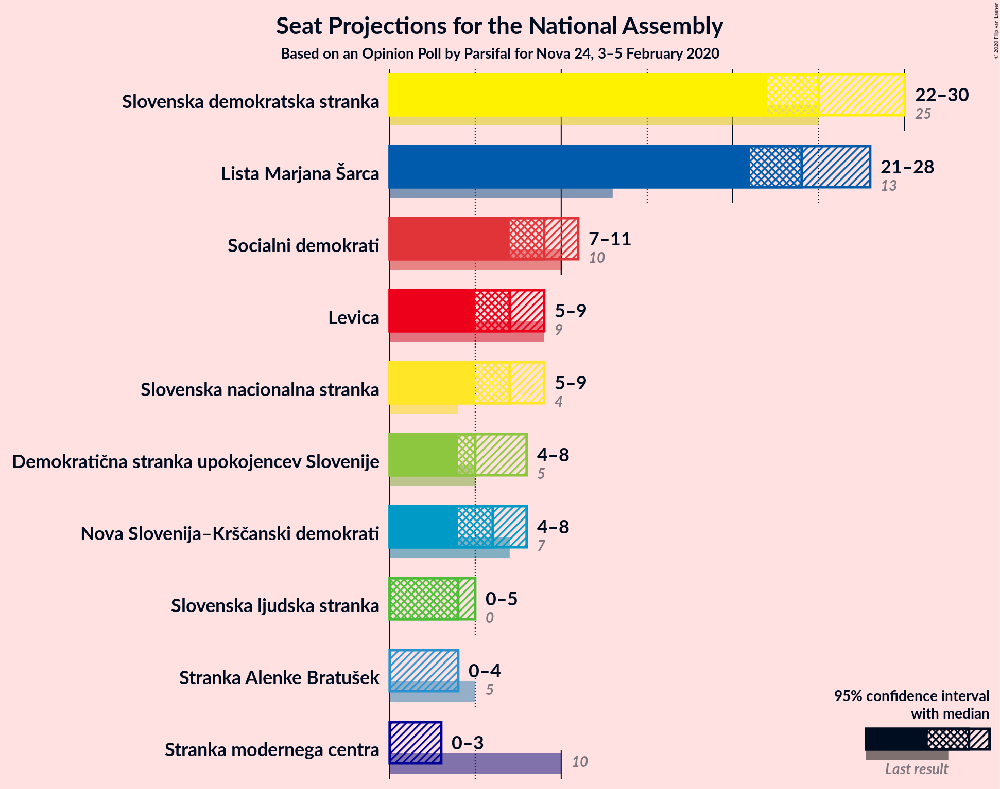

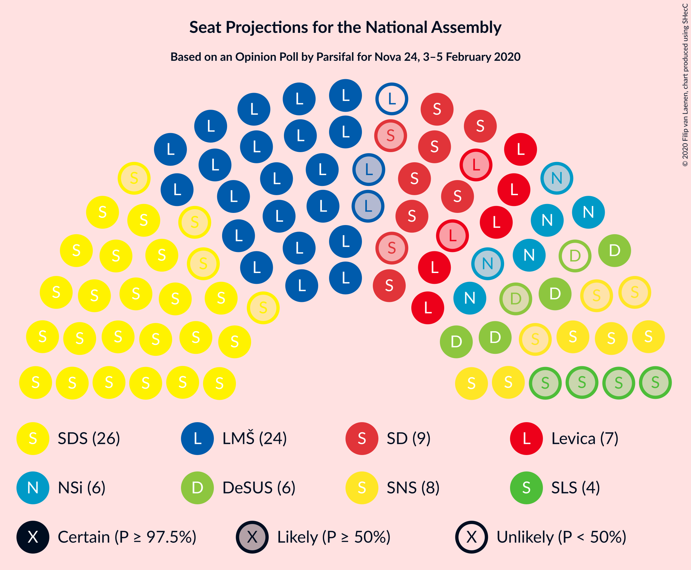

### Confidence Intervals

| Party | Last Result | Median | 80% Confidence Interval | 90% Confidence Interval | 95% Confidence Interval | 99% Confidence Interval |
|:-----:|:-----------:|:------:|:-----------------------:|:-----------------------:|:-----------------------:|:-----------------------:|
| <a href="#slovenska-demokratska-stranka">Slovenska demokratska stranka</a> | 25 | 25 | 24–28 |23–29 |22–30 |21–31 |
| <a href="#lista-marjana-šarca">Lista Marjana Šarca</a> | 13 | 24 | 22–26 |21–27 |21–28 |20–29 |
| <a href="#socialni-demokrati">Socialni demokrati</a> | 10 | 9 | 7–10 |7–11 |7–11 |6–12 |
| <a href="#slovenska-nacionalna-stranka">Slovenska nacionalna stranka</a> | 4 | 7 | 6–9 |6–9 |5–9 |5–10 |
| <a href="#levica">Levica</a> | 9 | 7 | 6–8 |5–9 |5–9 |5–10 |
| <a href="#nova-slovenija–krščanski-demokrati">Nova Slovenija–Krščanski demokrati</a> | 7 | 6 | 5–7 |4–8 |4–8 |4–9 |
| <a href="#demokratična-stranka-upokojencev-slovenije">Demokratična stranka upokojencev Slovenije</a> | 5 | 5 | 4–7 |4–7 |4–8 |0–8 |
| <a href="#slovenska-ljudska-stranka">Slovenska ljudska stranka</a> | 0 | 4 | 0–5 |0–5 |0–5 |0–6 |
| <a href="#stranka-modernega-centra">Stranka modernega centra</a> | 10 | 0 | 0 |0 |0–3 |0–4 |
| <a href="#stranka-alenke-bratušek">Stranka Alenke Bratušek</a> | 5 | 0 | 0 |0–4 |0–4 |0–4 |

### Slovenska demokratska stranka

*For a full overview of the results for this party, see the [Slovenska demokratska stranka](party-slovenskademokratskastranka.html) page.*

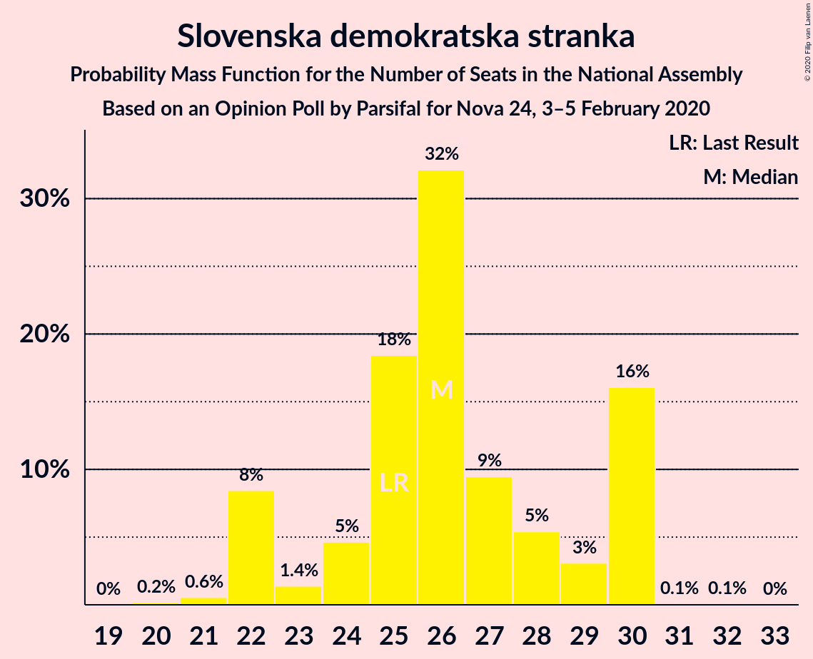

| Number of Seats | Probability | Accumulated | Special Marks |
|:---------------:|:-----------:|:-----------:|:-------------:|
| 20 | 0.1% | 100% |  |
| 21 | 0.7% | 99.8% |  |
| 22 | 3% | 99.1% |  |
| 23 | 5% | 96% |  |
| 24 | 24% | 90% |  |
| 25 | 19% | 66% | Last Result, Median |
| 26 | 21% | 47% |  |
| 27 | 13% | 26% |  |
| 28 | 6% | 13% |  |
| 29 | 3% | 7% |  |
| 30 | 4% | 4% |  |
| 31 | 0.6% | 0.7% |  |
| 32 | 0.1% | 0.1% |  |
| 33 | 0% | 0% |  |

### Lista Marjana Šarca

*For a full overview of the results for this party, see the [Lista Marjana Šarca](party-listamarjanašarca.html) page.*

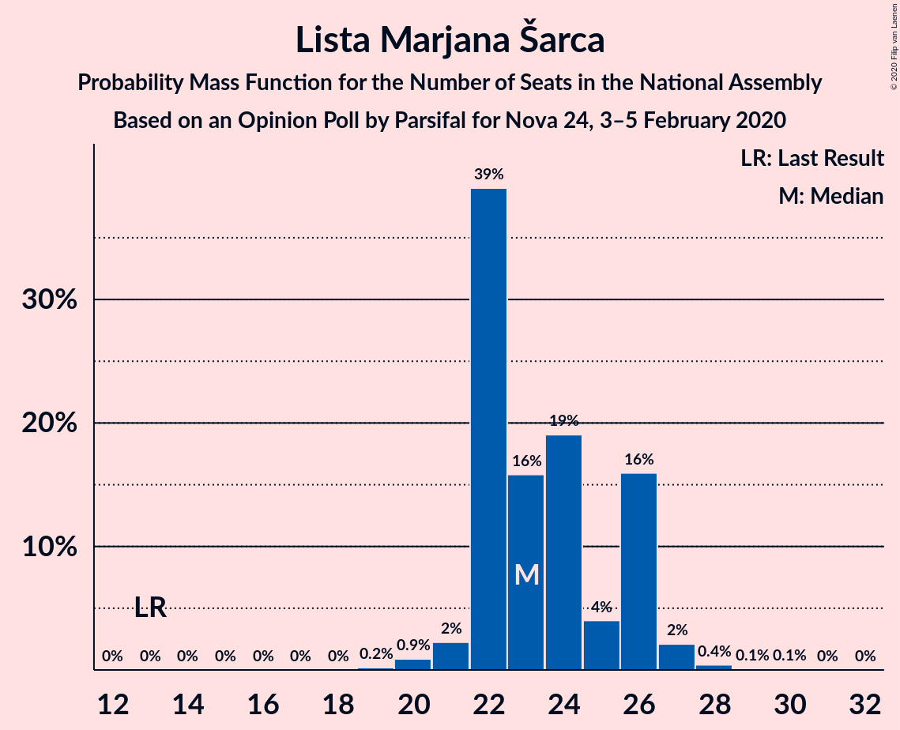

| Number of Seats | Probability | Accumulated | Special Marks |
|:---------------:|:-----------:|:-----------:|:-------------:|
| 13 | 0% | 100% | Last Result |
| 14 | 0% | 100% |  |
| 15 | 0% | 100% |  |
| 16 | 0% | 100% |  |
| 17 | 0% | 100% |  |
| 18 | 0% | 100% |  |
| 19 | 0.3% | 100% |  |
| 20 | 1.3% | 99.6% |  |
| 21 | 5% | 98% |  |
| 22 | 18% | 94% |  |
| 23 | 20% | 76% |  |
| 24 | 25% | 56% | Median |
| 25 | 11% | 31% |  |
| 26 | 12% | 21% |  |
| 27 | 6% | 9% |  |
| 28 | 2% | 3% |  |
| 29 | 1.0% | 1.1% |  |
| 30 | 0.1% | 0.1% |  |
| 31 | 0% | 0% |  |

### Socialni demokrati

*For a full overview of the results for this party, see the [Socialni demokrati](party-socialnidemokrati.html) page.*

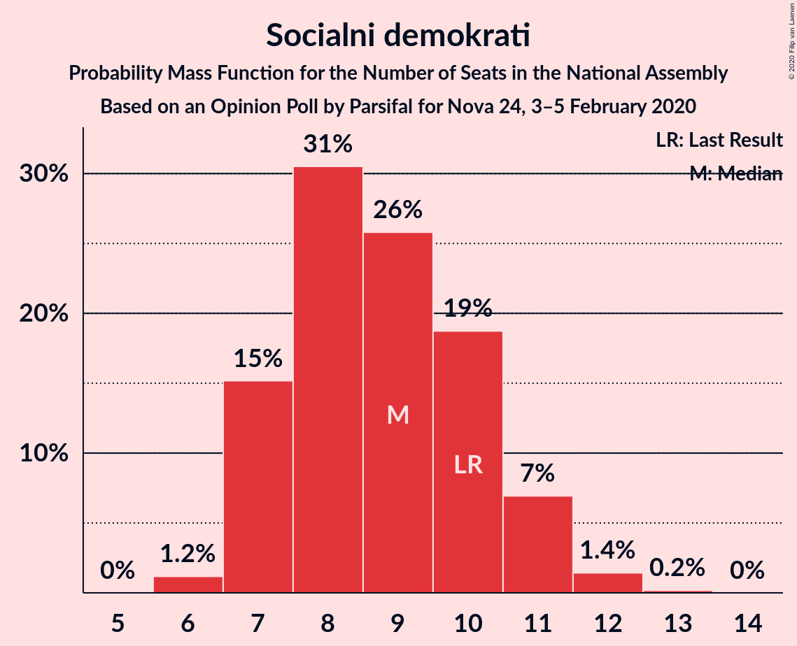

| Number of Seats | Probability | Accumulated | Special Marks |
|:---------------:|:-----------:|:-----------:|:-------------:|
| 6 | 1.2% | 100% |  |
| 7 | 15% | 98.8% |  |
| 8 | 31% | 84% |  |
| 9 | 26% | 53% | Median |
| 10 | 19% | 27% | Last Result |
| 11 | 7% | 9% |  |
| 12 | 1.4% | 2% |  |
| 13 | 0.2% | 0.2% |  |
| 14 | 0% | 0% |  |

### Slovenska nacionalna stranka

*For a full overview of the results for this party, see the [Slovenska nacionalna stranka](party-slovenskanacionalnastranka.html) page.*

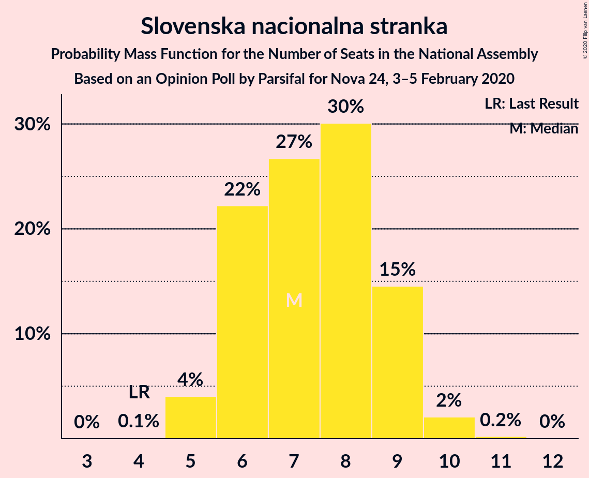

| Number of Seats | Probability | Accumulated | Special Marks |
|:---------------:|:-----------:|:-----------:|:-------------:|
| 4 | 0.1% | 100% | Last Result |
| 5 | 4% | 99.9% |  |
| 6 | 22% | 96% |  |
| 7 | 27% | 74% | Median |
| 8 | 30% | 47% |  |
| 9 | 15% | 17% |  |
| 10 | 2% | 2% |  |
| 11 | 0.2% | 0.2% |  |
| 12 | 0% | 0% |  |

### Levica

*For a full overview of the results for this party, see the [Levica](party-levica.html) page.*

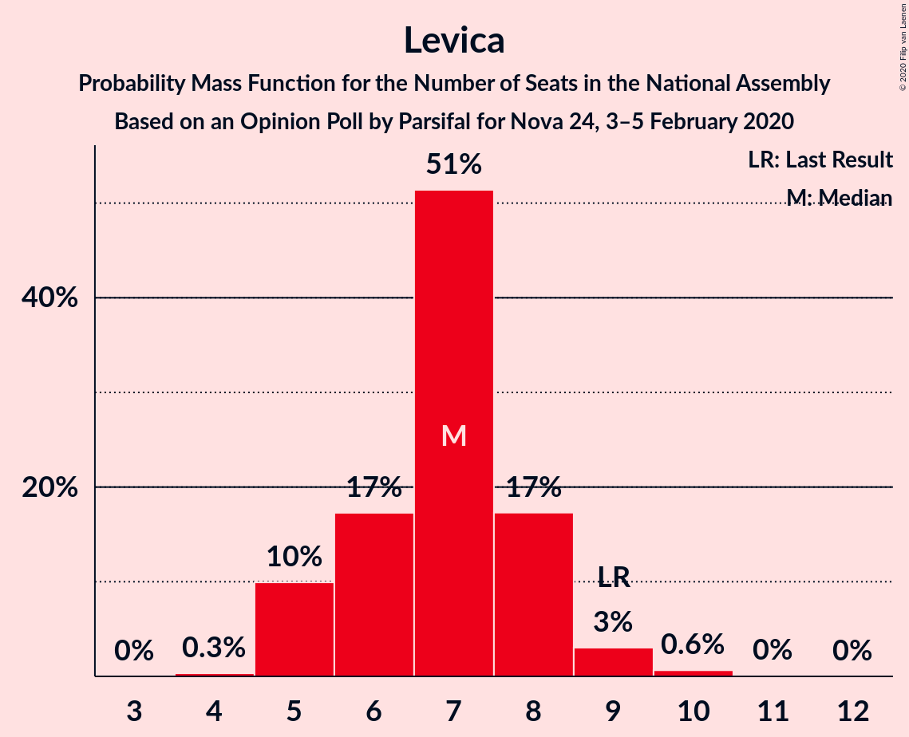

| Number of Seats | Probability | Accumulated | Special Marks |
|:---------------:|:-----------:|:-----------:|:-------------:|
| 4 | 0.2% | 100% |  |
| 5 | 8% | 99.8% |  |
| 6 | 20% | 91% |  |
| 7 | 40% | 72% | Median |
| 8 | 22% | 32% |  |
| 9 | 8% | 10% | Last Result |
| 10 | 2% | 2% |  |
| 11 | 0.1% | 0.1% |  |
| 12 | 0% | 0% |  |

### Nova Slovenija–Krščanski demokrati

*For a full overview of the results for this party, see the [Nova Slovenija–Krščanski demokrati](party-novaslovenija–krščanskidemokrati.html) page.*

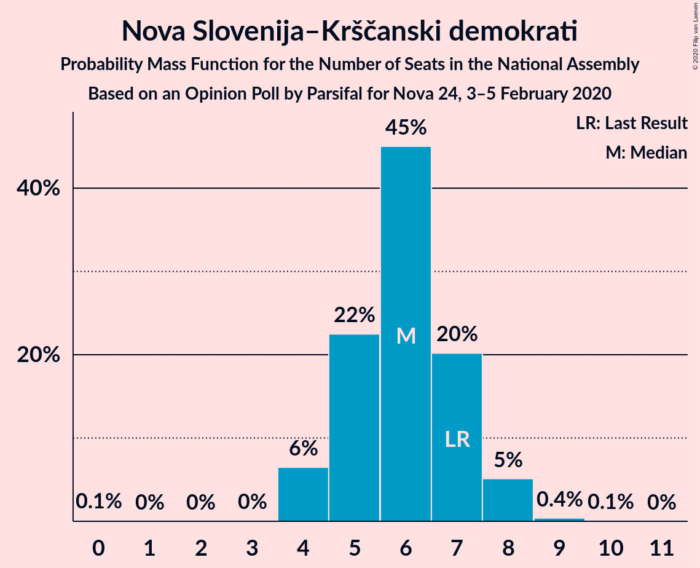

| Number of Seats | Probability | Accumulated | Special Marks |
|:---------------:|:-----------:|:-----------:|:-------------:|
| 0 | 0.1% | 100% |  |
| 1 | 0% | 99.9% |  |
| 2 | 0% | 99.9% |  |
| 3 | 0% | 99.9% |  |
| 4 | 6% | 99.8% |  |
| 5 | 22% | 93% |  |
| 6 | 45% | 71% | Median |
| 7 | 20% | 26% | Last Result |
| 8 | 5% | 6% |  |
| 9 | 0.4% | 0.5% |  |
| 10 | 0.1% | 0.1% |  |
| 11 | 0% | 0% |  |

### Demokratična stranka upokojencev Slovenije

*For a full overview of the results for this party, see the [Demokratična stranka upokojencev Slovenije](party-demokratičnastrankaupokojencevslovenije.html) page.*

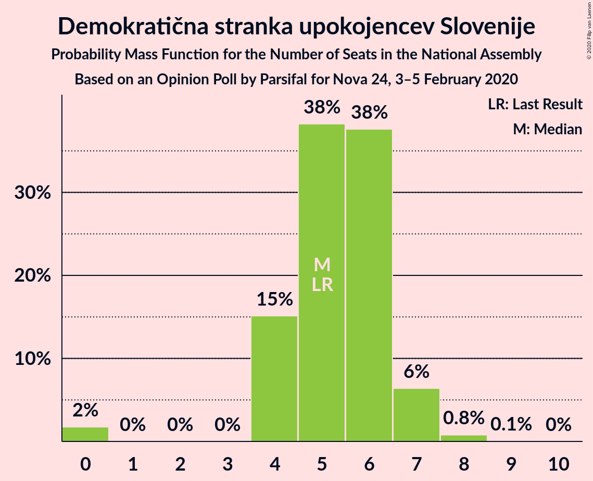

| Number of Seats | Probability | Accumulated | Special Marks |
|:---------------:|:-----------:|:-----------:|:-------------:|
| 0 | 1.4% | 100% |  |
| 1 | 0% | 98.6% |  |
| 2 | 0% | 98.6% |  |
| 3 | 0.5% | 98.6% |  |
| 4 | 15% | 98% |  |
| 5 | 43% | 83% | Last Result, Median |
| 6 | 30% | 40% |  |
| 7 | 8% | 10% |  |
| 8 | 3% | 3% |  |
| 9 | 0.1% | 0.1% |  |
| 10 | 0% | 0% |  |

### Slovenska ljudska stranka

*For a full overview of the results for this party, see the [Slovenska ljudska stranka](party-slovenskaljudskastranka.html) page.*

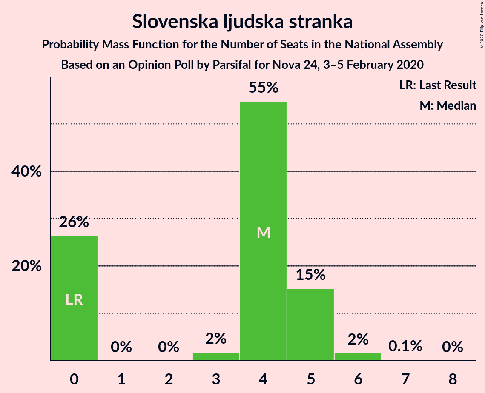

| Number of Seats | Probability | Accumulated | Special Marks |
|:---------------:|:-----------:|:-----------:|:-------------:|
| 0 | 26% | 100% | Last Result |
| 1 | 0% | 74% |  |
| 2 | 0% | 74% |  |
| 3 | 2% | 74% |  |
| 4 | 55% | 72% | Median |
| 5 | 15% | 17% |  |
| 6 | 2% | 2% |  |
| 7 | 0.1% | 0.1% |  |
| 8 | 0% | 0% |  |

### Stranka modernega centra

*For a full overview of the results for this party, see the [Stranka modernega centra](party-strankamodernegacentra.html) page.*

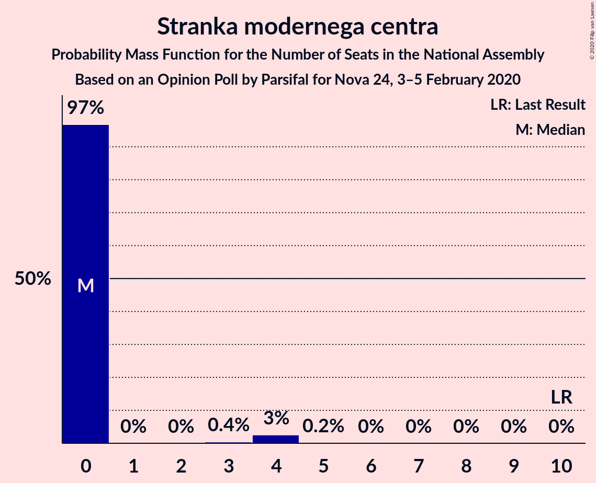

| Number of Seats | Probability | Accumulated | Special Marks |
|:---------------:|:-----------:|:-----------:|:-------------:|
| 0 | 97% | 100% | Median |
| 1 | 0% | 3% |  |
| 2 | 0% | 3% |  |
| 3 | 0.5% | 3% |  |
| 4 | 2% | 2% |  |
| 5 | 0.2% | 0.2% |  |
| 6 | 0% | 0% |  |
| 7 | 0% | 0% |  |
| 8 | 0% | 0% |  |
| 9 | 0% | 0% |  |
| 10 | 0% | 0% | Last Result |

### Stranka Alenke Bratušek

*For a full overview of the results for this party, see the [Stranka Alenke Bratušek](party-strankaalenkebratušek.html) page.*

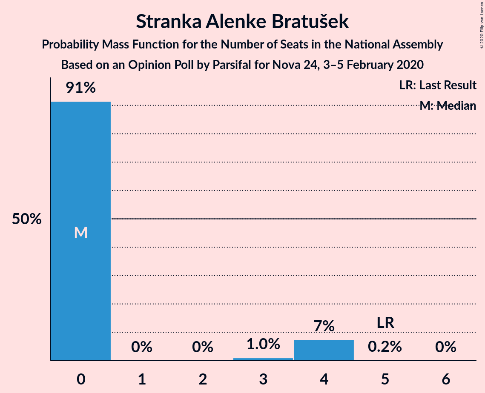

| Number of Seats | Probability | Accumulated | Special Marks |
|:---------------:|:-----------:|:-----------:|:-------------:|
| 0 | 91% | 100% | Median |
| 1 | 0% | 9% |  |
| 2 | 0% | 9% |  |
| 3 | 1.0% | 9% |  |
| 4 | 7% | 8% |  |
| 5 | 0.2% | 0.2% | Last Result |
| 6 | 0% | 0% |  |

## Coalitions

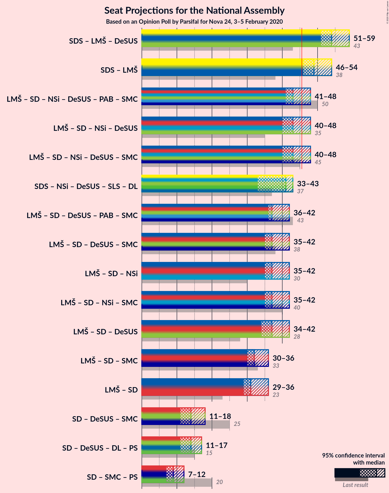

### Confidence Intervals

| Coalition | Last Result | Median | Majority? | 80% Confidence Interval | 90% Confidence Interval | 95% Confidence Interval | 99% Confidence Interval |
|:---------:|:-----------:|:------:|:---------:|:-----------------------:|:-----------------------:|:-----------------------:|:-----------------------:|
| Slovenska demokratska stranka – Lista Marjana Šarca – Demokratična stranka upokojencev Slovenije | 43 | 54 | 100% | 52–58 | 51–59 | 51–60 | 49–62 |
| Slovenska demokratska stranka – Lista Marjana Šarca | 38 | 49 | 97% | 47–52 | 46–53 | 45–54 | 44–56 |
| Lista Marjana Šarca – Socialni demokrati – Nova Slovenija–Krščanski demokrati – Demokratična stranka upokojencev Slovenije | 35 | 43 | 24% | 41–47 | 41–48 | 40–49 | 38–50 |
| Lista Marjana Šarca – Socialni demokrati – Nova Slovenija–Krščanski demokrati – Demokratična stranka upokojencev Slovenije – Stranka Alenke Bratušek – Stranka modernega centra | 50 | 44 | 28% | 42–48 | 41–49 | 40–49 | 39–51 |
| Lista Marjana Šarca – Socialni demokrati – Nova Slovenija–Krščanski demokrati – Demokratična stranka upokojencev Slovenije – Stranka modernega centra | 45 | 44 | 26% | 41–47 | 41–48 | 40–49 | 39–50 |
| Lista Marjana Šarca – Socialni demokrati – Demokratična stranka upokojencev Slovenije – Stranka Alenke Bratušek – Stranka modernega centra | 43 | 38 | 0.2% | 36–42 | 35–43 | 35–43 | 33–45 |
| Lista Marjana Šarca – Socialni demokrati – Nova Slovenija–Krščanski demokrati | 30 | 38 | 0.3% | 36–42 | 35–42 | 35–43 | 33–45 |
| Lista Marjana Šarca – Socialni demokrati – Nova Slovenija–Krščanski demokrati – Stranka modernega centra | 40 | 38 | 0.4% | 36–42 | 35–43 | 35–43 | 34–45 |
| Lista Marjana Šarca – Socialni demokrati – Demokratična stranka upokojencev Slovenije | 28 | 37 | 0.1% | 36–41 | 35–42 | 34–43 | 33–43 |
| Lista Marjana Šarca – Socialni demokrati – Demokratična stranka upokojencev Slovenije – Stranka modernega centra | 38 | 37 | 0.1% | 36–42 | 35–42 | 34–43 | 33–44 |
| Lista Marjana Šarca – Socialni demokrati | 23 | 32 | 0% | 30–35 | 30–36 | 29–37 | 28–38 |
| Lista Marjana Šarca – Socialni demokrati – Stranka modernega centra | 33 | 32 | 0% | 30–36 | 30–37 | 29–37 | 28–39 |
| Socialni demokrati – Demokratična stranka upokojencev Slovenije – Stranka modernega centra | 25 | 14 | 0% | 12–16 | 11–17 | 11–18 | 9–19 |

### Slovenska demokratska stranka – Lista Marjana Šarca – Demokratična stranka upokojencev Slovenije

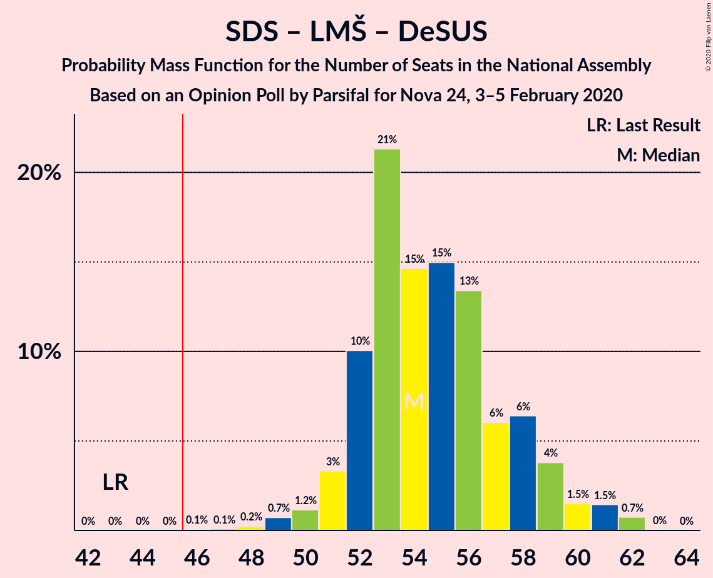

| Number of Seats | Probability | Accumulated | Special Marks |
|:---------------:|:-----------:|:-----------:|:-------------:|
| 43 | 0% | 100% | Last Result |
| 44 | 0% | 100% |  |
| 45 | 0% | 100% |  |
| 46 | 0.1% | 100% | Majority |
| 47 | 0.1% | 99.9% |  |
| 48 | 0.2% | 99.8% |  |
| 49 | 0.7% | 99.6% |  |
| 50 | 1.2% | 98.9% |  |
| 51 | 3% | 98% |  |
| 52 | 10% | 94% |  |
| 53 | 21% | 84% |  |
| 54 | 15% | 63% | Median |
| 55 | 15% | 48% |  |
| 56 | 13% | 33% |  |
| 57 | 6% | 20% |  |
| 58 | 6% | 14% |  |
| 59 | 4% | 8% |  |
| 60 | 1.5% | 4% |  |
| 61 | 1.5% | 2% |  |
| 62 | 0.7% | 0.8% |  |
| 63 | 0% | 0.1% |  |
| 64 | 0% | 0% |  |

### Slovenska demokratska stranka – Lista Marjana Šarca

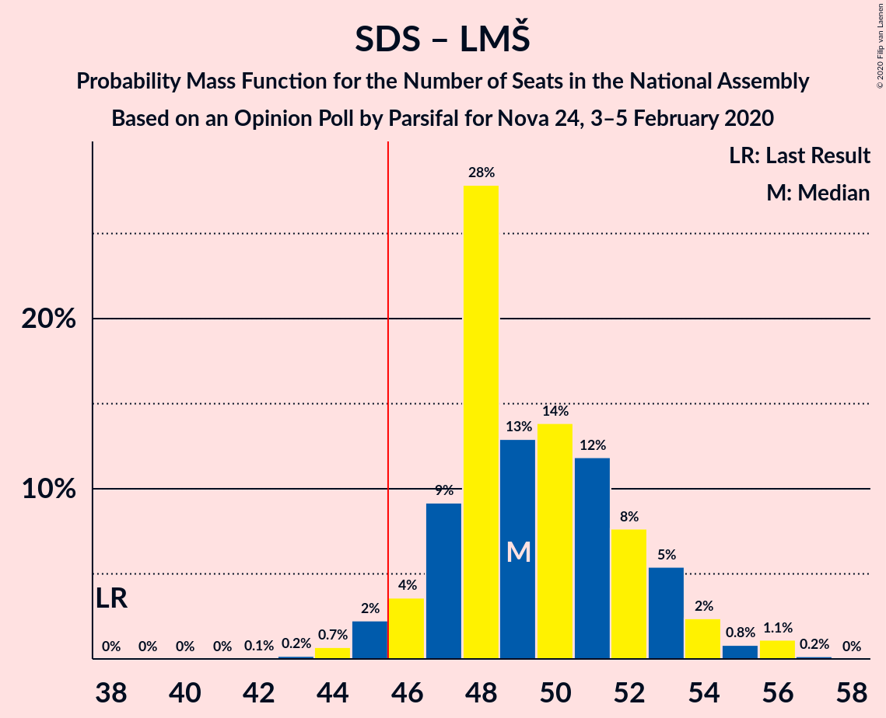

| Number of Seats | Probability | Accumulated | Special Marks |
|:---------------:|:-----------:|:-----------:|:-------------:|
| 38 | 0% | 100% | Last Result |
| 39 | 0% | 100% |  |
| 40 | 0% | 100% |  |
| 41 | 0% | 100% |  |
| 42 | 0.1% | 100% |  |
| 43 | 0.2% | 99.9% |  |
| 44 | 0.7% | 99.7% |  |
| 45 | 2% | 99.1% |  |
| 46 | 4% | 97% | Majority |
| 47 | 9% | 93% |  |
| 48 | 28% | 84% |  |
| 49 | 13% | 56% | Median |
| 50 | 14% | 43% |  |
| 51 | 12% | 29% |  |
| 52 | 8% | 18% |  |
| 53 | 5% | 10% |  |
| 54 | 2% | 4% |  |
| 55 | 0.8% | 2% |  |
| 56 | 1.1% | 1.3% |  |
| 57 | 0.2% | 0.2% |  |
| 58 | 0% | 0% |  |

### Lista Marjana Šarca – Socialni demokrati – Nova Slovenija–Krščanski demokrati – Demokratična stranka upokojencev Slovenije

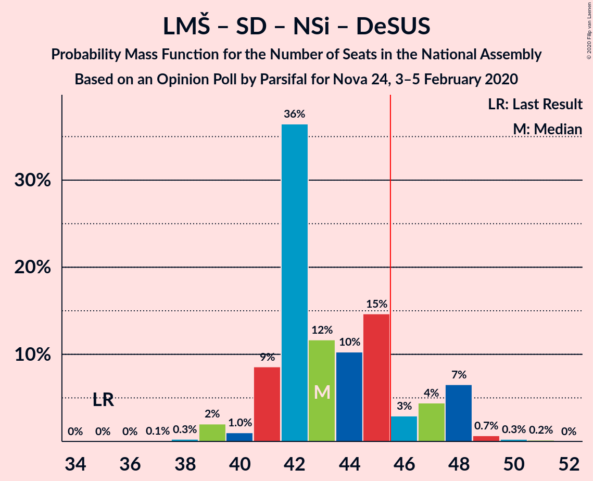

| Number of Seats | Probability | Accumulated | Special Marks |
|:---------------:|:-----------:|:-----------:|:-------------:|
| 35 | 0% | 100% | Last Result |
| 36 | 0% | 100% |  |
| 37 | 0.1% | 99.9% |  |
| 38 | 0.4% | 99.8% |  |
| 39 | 1.0% | 99.4% |  |
| 40 | 2% | 98% |  |
| 41 | 8% | 96% |  |
| 42 | 22% | 88% |  |
| 43 | 17% | 66% |  |
| 44 | 13% | 50% | Median |
| 45 | 13% | 37% |  |
| 46 | 9% | 24% | Majority |
| 47 | 7% | 15% |  |
| 48 | 5% | 9% |  |
| 49 | 2% | 3% |  |
| 50 | 0.5% | 0.8% |  |
| 51 | 0.2% | 0.3% |  |
| 52 | 0.1% | 0.1% |  |
| 53 | 0% | 0% |  |

### Lista Marjana Šarca – Socialni demokrati – Nova Slovenija–Krščanski demokrati – Demokratična stranka upokojencev Slovenije – Stranka Alenke Bratušek – Stranka modernega centra

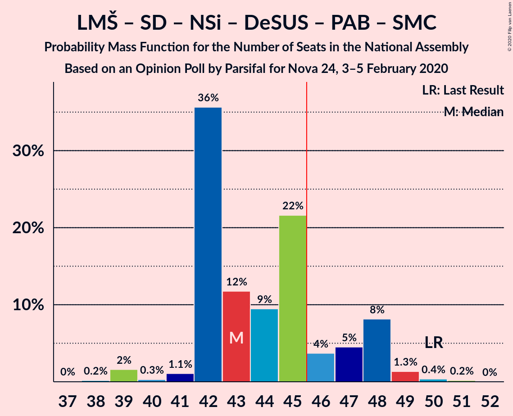

| Number of Seats | Probability | Accumulated | Special Marks |
|:---------------:|:-----------:|:-----------:|:-------------:|
| 37 | 0% | 100% |  |
| 38 | 0.3% | 99.9% |  |
| 39 | 0.7% | 99.7% |  |
| 40 | 2% | 99.0% |  |
| 41 | 4% | 97% |  |
| 42 | 20% | 93% |  |
| 43 | 16% | 73% |  |
| 44 | 12% | 57% | Median |
| 45 | 17% | 45% |  |
| 46 | 8% | 28% | Majority |
| 47 | 8% | 20% |  |
| 48 | 6% | 12% |  |
| 49 | 3% | 6% |  |
| 50 | 2% | 2% | Last Result |
| 51 | 0.4% | 0.6% |  |
| 52 | 0.2% | 0.2% |  |
| 53 | 0% | 0% |  |

### Lista Marjana Šarca – Socialni demokrati – Nova Slovenija–Krščanski demokrati – Demokratična stranka upokojencev Slovenije – Stranka modernega centra

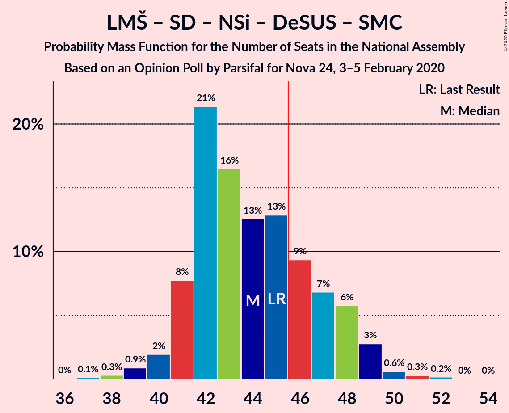

| Number of Seats | Probability | Accumulated | Special Marks |
|:---------------:|:-----------:|:-----------:|:-------------:|
| 37 | 0.1% | 100% |  |
| 38 | 0.3% | 99.9% |  |
| 39 | 0.9% | 99.6% |  |
| 40 | 2% | 98.7% |  |
| 41 | 8% | 97% |  |
| 42 | 21% | 89% |  |
| 43 | 16% | 68% |  |
| 44 | 13% | 51% | Median |
| 45 | 13% | 39% | Last Result |
| 46 | 9% | 26% | Majority |
| 47 | 7% | 16% |  |
| 48 | 6% | 10% |  |
| 49 | 3% | 4% |  |
| 50 | 0.6% | 1.0% |  |
| 51 | 0.3% | 0.4% |  |
| 52 | 0.2% | 0.2% |  |
| 53 | 0% | 0% |  |

### Lista Marjana Šarca – Socialni demokrati – Demokratična stranka upokojencev Slovenije – Stranka Alenke Bratušek – Stranka modernega centra

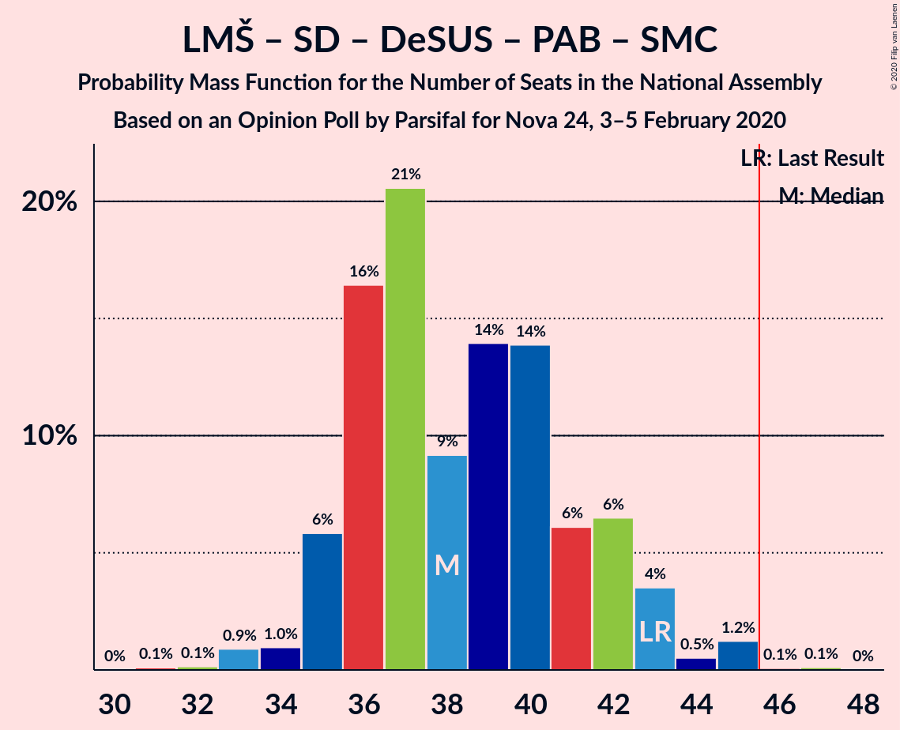

| Number of Seats | Probability | Accumulated | Special Marks |
|:---------------:|:-----------:|:-----------:|:-------------:|
| 31 | 0.1% | 100% |  |
| 32 | 0.1% | 99.9% |  |
| 33 | 0.9% | 99.7% |  |
| 34 | 1.0% | 98.8% |  |
| 35 | 6% | 98% |  |
| 36 | 16% | 92% |  |
| 37 | 21% | 76% |  |
| 38 | 9% | 55% | Median |
| 39 | 14% | 46% |  |
| 40 | 14% | 32% |  |
| 41 | 6% | 18% |  |
| 42 | 6% | 12% |  |
| 43 | 4% | 5% | Last Result |
| 44 | 0.5% | 2% |  |
| 45 | 1.2% | 1.4% |  |
| 46 | 0.1% | 0.2% | Majority |
| 47 | 0.1% | 0.1% |  |
| 48 | 0% | 0% |  |

### Lista Marjana Šarca – Socialni demokrati – Nova Slovenija–Krščanski demokrati

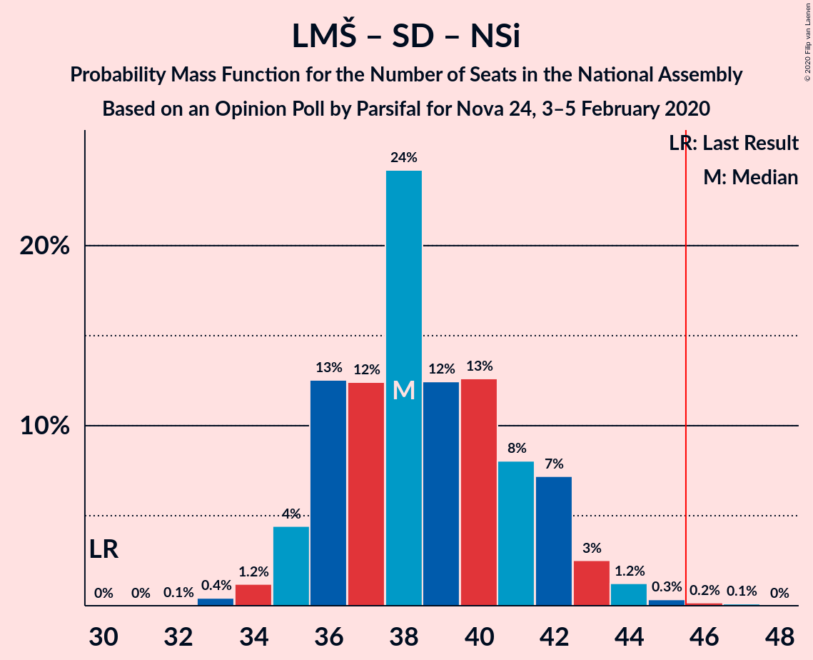

| Number of Seats | Probability | Accumulated | Special Marks |
|:---------------:|:-----------:|:-----------:|:-------------:|
| 30 | 0% | 100% | Last Result |
| 31 | 0% | 100% |  |
| 32 | 0.1% | 100% |  |
| 33 | 0.4% | 99.9% |  |
| 34 | 1.2% | 99.5% |  |
| 35 | 4% | 98% |  |
| 36 | 13% | 94% |  |
| 37 | 12% | 81% |  |
| 38 | 24% | 69% |  |
| 39 | 12% | 45% | Median |
| 40 | 13% | 32% |  |
| 41 | 8% | 20% |  |
| 42 | 7% | 12% |  |
| 43 | 3% | 4% |  |
| 44 | 1.2% | 2% |  |
| 45 | 0.3% | 0.6% |  |
| 46 | 0.2% | 0.3% | Majority |
| 47 | 0.1% | 0.1% |  |
| 48 | 0% | 0% |  |

### Lista Marjana Šarca – Socialni demokrati – Nova Slovenija–Krščanski demokrati – Stranka modernega centra

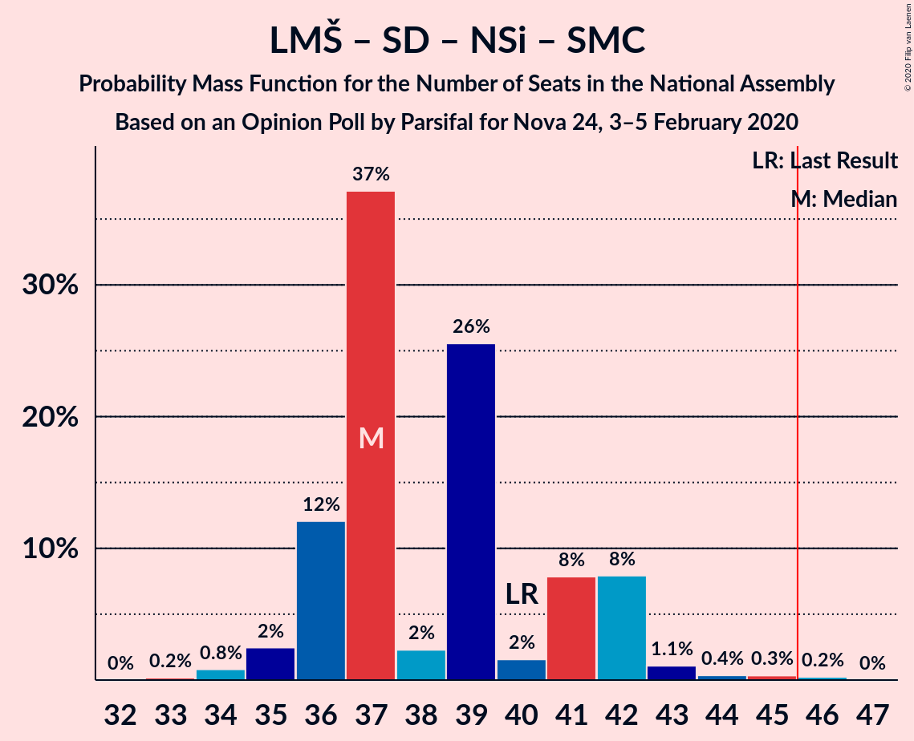

| Number of Seats | Probability | Accumulated | Special Marks |
|:---------------:|:-----------:|:-----------:|:-------------:|
| 32 | 0% | 100% |  |
| 33 | 0.3% | 99.9% |  |
| 34 | 1.0% | 99.6% |  |
| 35 | 4% | 98.6% |  |
| 36 | 12% | 94% |  |
| 37 | 12% | 82% |  |
| 38 | 24% | 70% |  |
| 39 | 12% | 46% | Median |
| 40 | 13% | 34% | Last Result |
| 41 | 8% | 21% |  |
| 42 | 8% | 13% |  |
| 43 | 3% | 5% |  |
| 44 | 1.4% | 2% |  |
| 45 | 0.6% | 1.0% |  |
| 46 | 0.2% | 0.4% | Majority |
| 47 | 0.1% | 0.1% |  |
| 48 | 0% | 0% |  |

### Lista Marjana Šarca – Socialni demokrati – Demokratična stranka upokojencev Slovenije

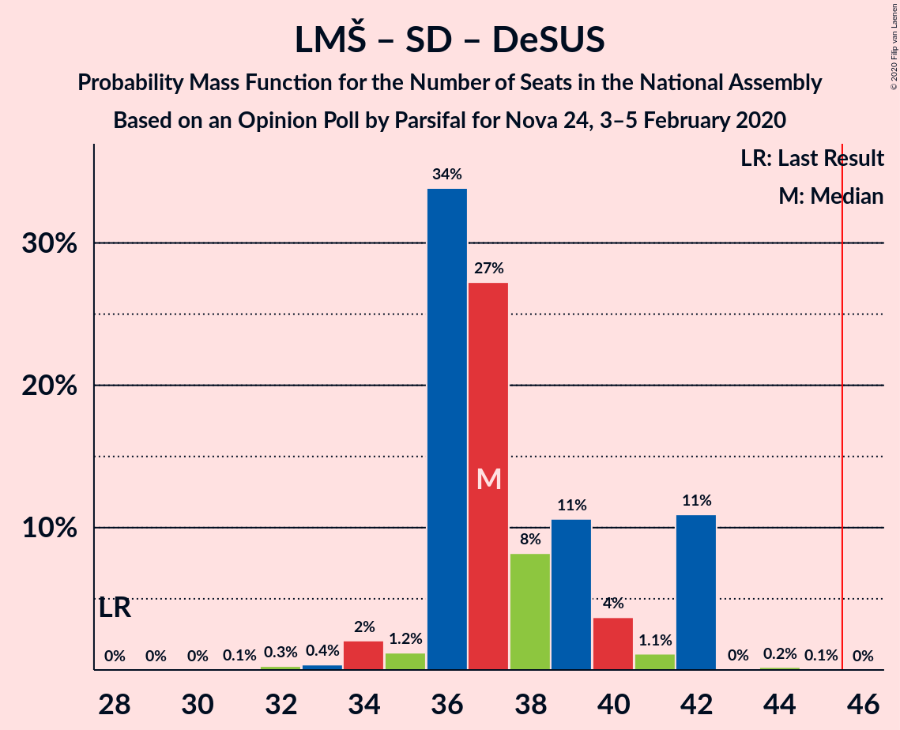

| Number of Seats | Probability | Accumulated | Special Marks |
|:---------------:|:-----------:|:-----------:|:-------------:|
| 28 | 0% | 100% | Last Result |
| 29 | 0% | 100% |  |
| 30 | 0% | 100% |  |
| 31 | 0.2% | 100% |  |
| 32 | 0.3% | 99.8% |  |
| 33 | 1.1% | 99.5% |  |
| 34 | 1.5% | 98% |  |
| 35 | 7% | 97% |  |
| 36 | 20% | 90% |  |
| 37 | 22% | 70% |  |
| 38 | 10% | 48% | Median |
| 39 | 13% | 38% |  |
| 40 | 11% | 25% |  |
| 41 | 5% | 14% |  |
| 42 | 6% | 9% |  |
| 43 | 3% | 3% |  |
| 44 | 0.2% | 0.4% |  |
| 45 | 0.1% | 0.2% |  |
| 46 | 0% | 0.1% | Majority |
| 47 | 0% | 0% |  |

### Lista Marjana Šarca – Socialni demokrati – Demokratična stranka upokojencev Slovenije – Stranka modernega centra

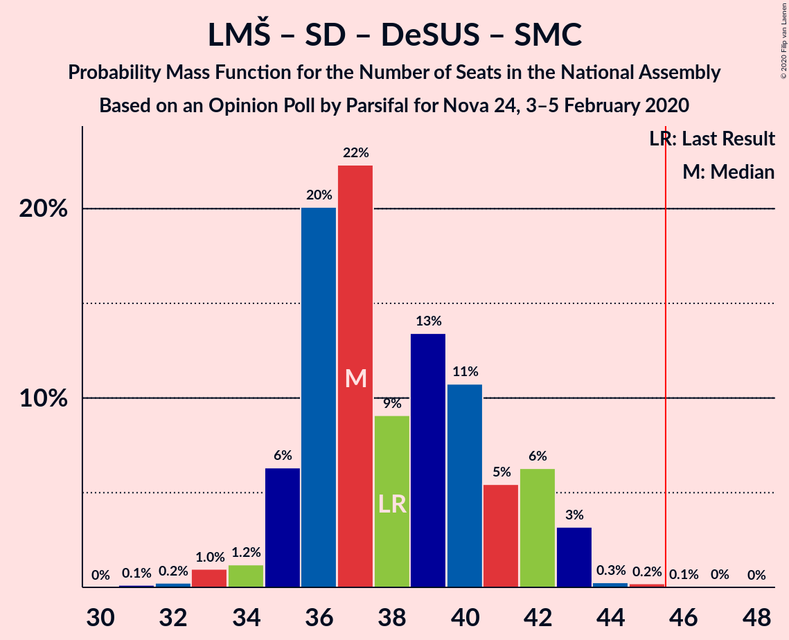

| Number of Seats | Probability | Accumulated | Special Marks |
|:---------------:|:-----------:|:-----------:|:-------------:|
| 31 | 0.1% | 100% |  |
| 32 | 0.2% | 99.9% |  |
| 33 | 1.0% | 99.6% |  |
| 34 | 1.2% | 98.7% |  |
| 35 | 6% | 97% |  |
| 36 | 20% | 91% |  |
| 37 | 22% | 71% |  |
| 38 | 9% | 49% | Last Result, Median |
| 39 | 13% | 40% |  |
| 40 | 11% | 26% |  |
| 41 | 5% | 15% |  |
| 42 | 6% | 10% |  |
| 43 | 3% | 4% |  |
| 44 | 0.3% | 0.6% |  |
| 45 | 0.2% | 0.3% |  |
| 46 | 0.1% | 0.1% | Majority |
| 47 | 0% | 0% |  |

### Lista Marjana Šarca – Socialni demokrati

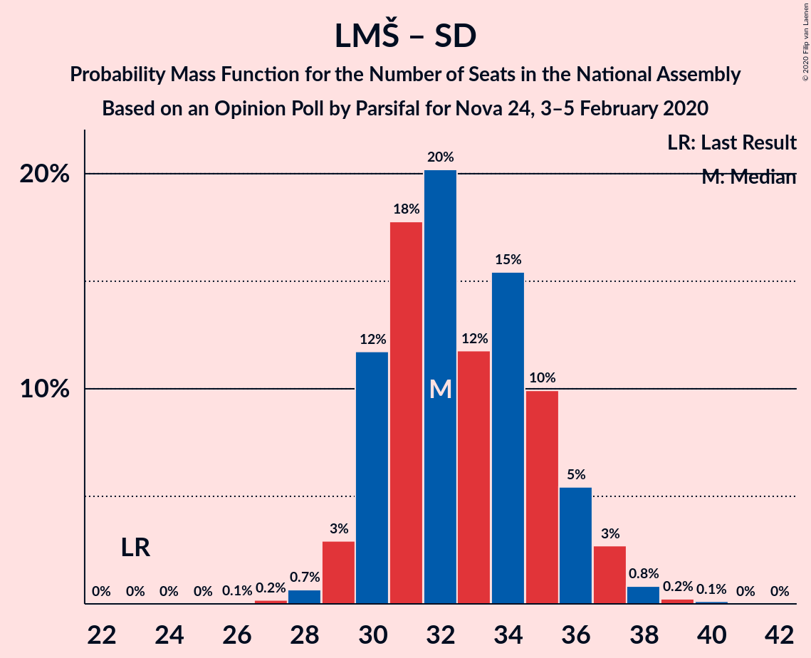

| Number of Seats | Probability | Accumulated | Special Marks |
|:---------------:|:-----------:|:-----------:|:-------------:|
| 23 | 0% | 100% | Last Result |
| 24 | 0% | 100% |  |
| 25 | 0% | 100% |  |
| 26 | 0.1% | 100% |  |
| 27 | 0.2% | 99.9% |  |
| 28 | 0.7% | 99.8% |  |
| 29 | 3% | 99.1% |  |
| 30 | 12% | 96% |  |
| 31 | 18% | 84% |  |
| 32 | 20% | 67% |  |
| 33 | 12% | 46% | Median |
| 34 | 15% | 35% |  |
| 35 | 10% | 19% |  |
| 36 | 5% | 9% |  |
| 37 | 3% | 4% |  |
| 38 | 0.8% | 1.2% |  |
| 39 | 0.2% | 0.4% |  |
| 40 | 0.1% | 0.1% |  |
| 41 | 0% | 0% |  |

### Lista Marjana Šarca – Socialni demokrati – Stranka modernega centra

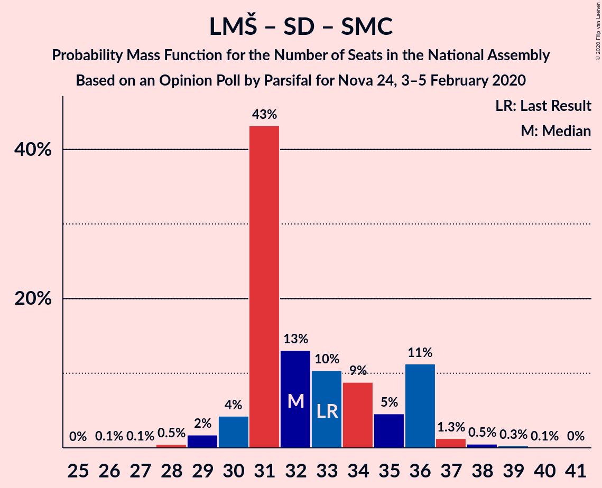

| Number of Seats | Probability | Accumulated | Special Marks |
|:---------------:|:-----------:|:-----------:|:-------------:|
| 27 | 0.1% | 100% |  |
| 28 | 0.5% | 99.8% |  |
| 29 | 3% | 99.3% |  |
| 30 | 11% | 97% |  |
| 31 | 17% | 85% |  |
| 32 | 20% | 68% |  |
| 33 | 12% | 48% | Last Result, Median |
| 34 | 15% | 36% |  |
| 35 | 10% | 21% |  |
| 36 | 6% | 11% |  |
| 37 | 3% | 5% |  |
| 38 | 1.0% | 2% |  |
| 39 | 0.5% | 0.7% |  |
| 40 | 0.1% | 0.2% |  |
| 41 | 0% | 0% |  |

### Socialni demokrati – Demokratična stranka upokojencev Slovenije – Stranka modernega centra

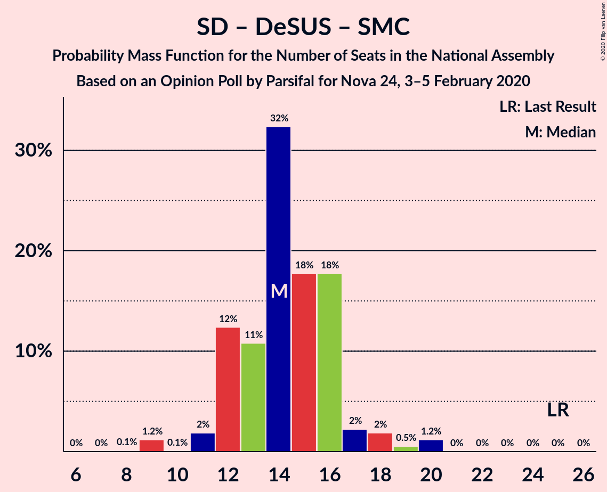

| Number of Seats | Probability | Accumulated | Special Marks |
|:---------------:|:-----------:|:-----------:|:-------------:|
| 8 | 0.1% | 100% |  |
| 9 | 0.6% | 99.9% |  |
| 10 | 0.9% | 99.3% |  |
| 11 | 4% | 98% |  |
| 12 | 9% | 94% |  |
| 13 | 21% | 85% |  |
| 14 | 26% | 64% | Median |
| 15 | 16% | 38% |  |
| 16 | 15% | 22% |  |
| 17 | 4% | 8% |  |
| 18 | 2% | 3% |  |
| 19 | 0.5% | 1.0% |  |
| 20 | 0.4% | 0.5% |  |
| 21 | 0.1% | 0.1% |  |
| 22 | 0% | 0% |  |
| 23 | 0% | 0% |  |
| 24 | 0% | 0% |  |
| 25 | 0% | 0% | Last Result |

## Technical Information

### Opinion Poll

+ **Polling firm:** Parsifal
+ **Commissioner(s):** Nova 24
+ **Fieldwork period:** 3–5 February 2020

### Calculations

+ **Sample size:** 702
+ **Simulations done:** 1,048,576
+ **Error estimate:** 3.11%

