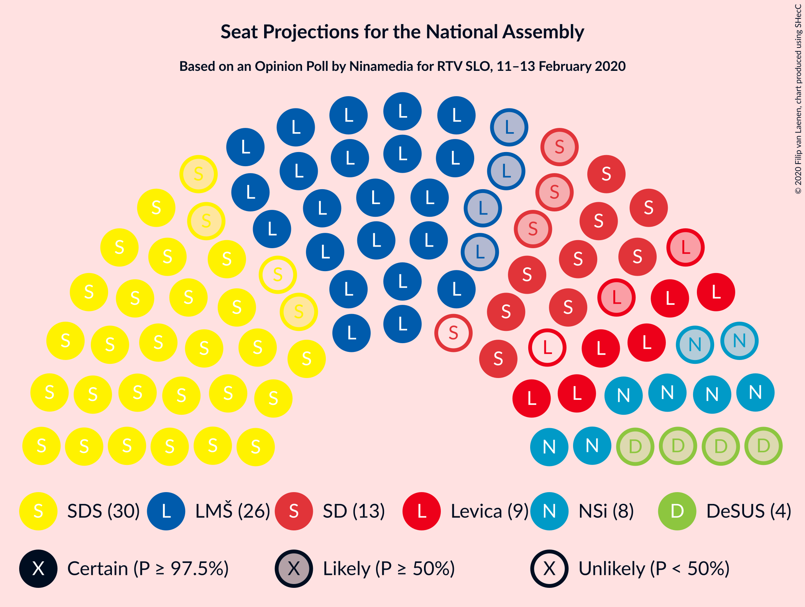
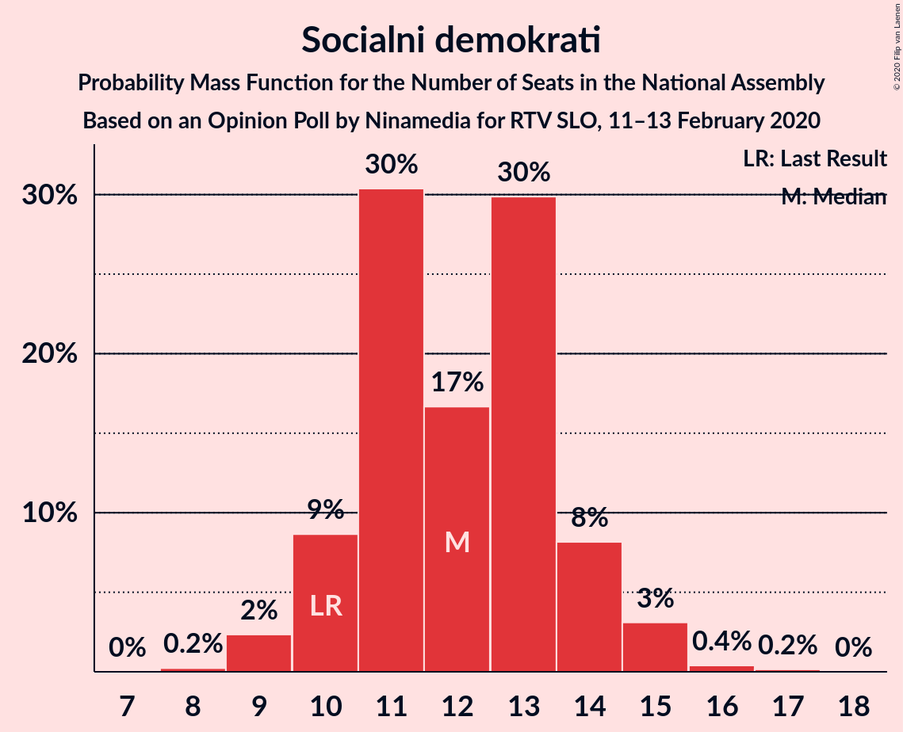
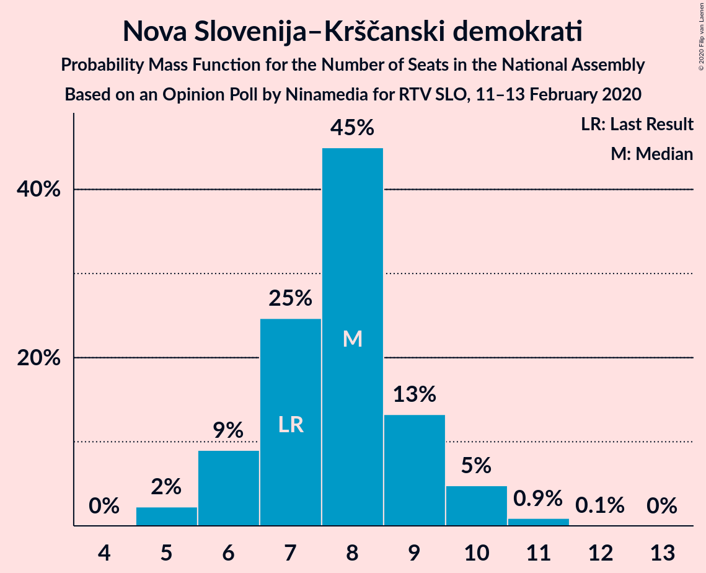
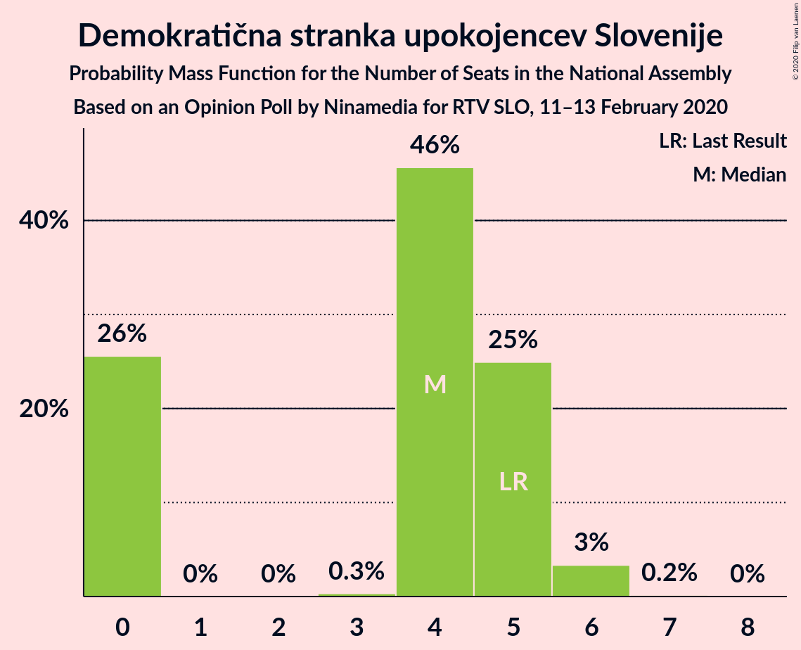
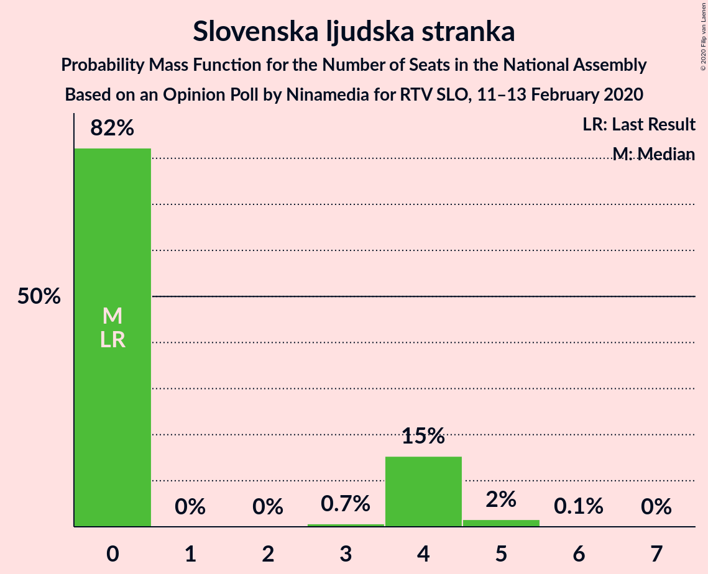
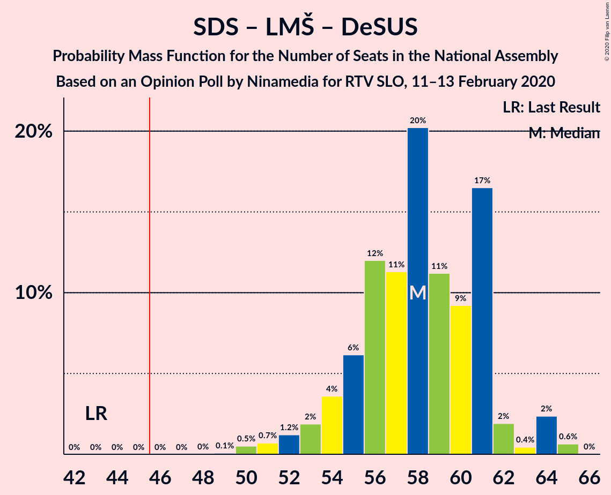
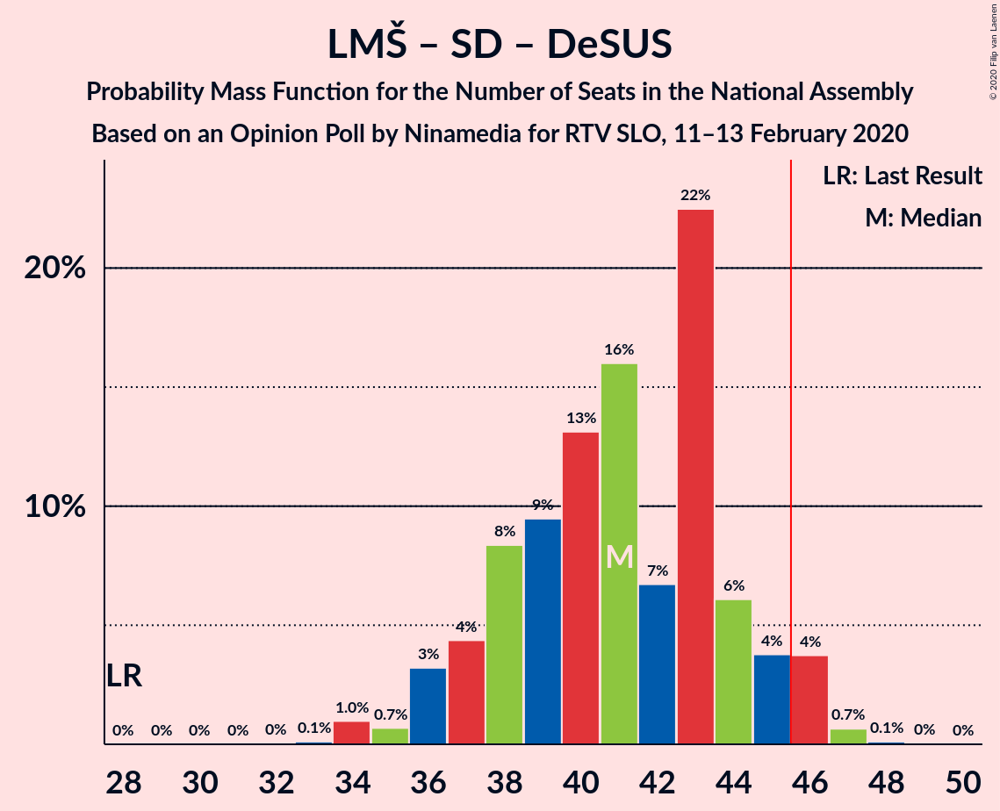
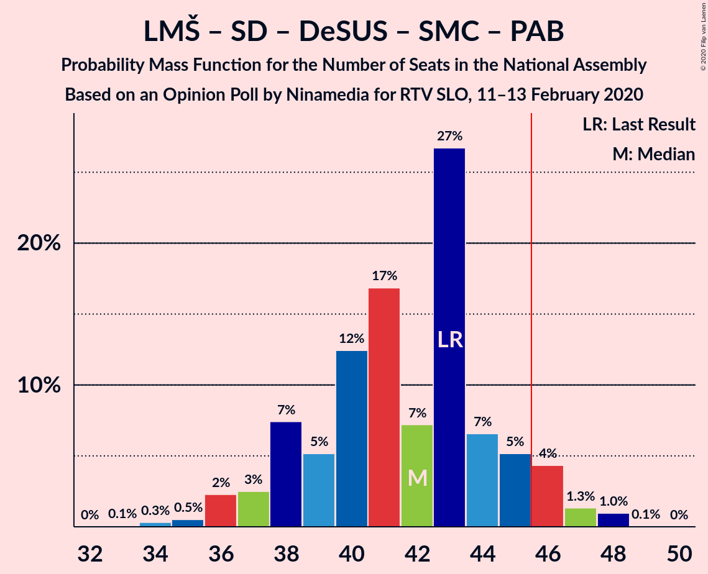
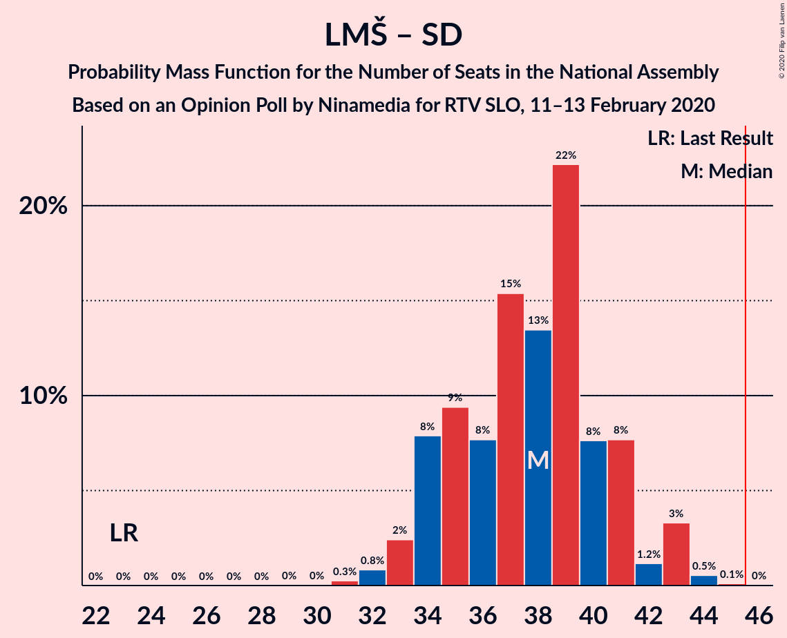

# Opinion Poll by Ninamedia for RTV SLO, 11–13 February 2020

<a href="#voting-intentions">Voting Intentions</a> | <a href="#seats">Seats</a> | <a href="#coalitions">Coalitions</a> | <a href="#technical-information">Technical Information</a>

## Voting Intentions

### Confidence Intervals

| Party | Last Result | Poll Result | 80% Confidence Interval | 90% Confidence Interval | 95% Confidence Interval | 99% Confidence Interval |
|:-----:|:-----------:|:-----------:|:-----------------------:|:-----------------------:|:-----------------------:|:-----------------------:|
| Slovenska demokratska stranka | 24.9% | 29.3% | 27.1–31.6% |26.6–32.2% |26.0–32.8% |25.0–33.9% |
| Lista Marjana Šarca | 12.6% | 25.6% | 23.5–27.8% |23.0–28.4% |22.5–28.9% |21.5–30.0% |
| Socialni demokrati | 9.9% | 12.3% | 10.8–14.0% |10.4–14.5% |10.1–14.9% |9.4–15.8% |
| Levica | 9.3% | 7.9% | 6.7–9.3% |6.4–9.7% |6.1–10.1% |5.6–10.8% |
| Nova Slovenija–Krščanski demokrati | 7.2% | 7.9% | 6.7–9.3% |6.4–9.7% |6.1–10.1% |5.6–10.8% |
| Demokratična stranka upokojencev Slovenije | 4.9% | 4.3% | 3.4–5.4% |3.2–5.8% |3.0–6.1% |2.7–6.7% |
| Slovenska nacionalna stranka | 4.2% | 3.7% | 2.9–4.8% |2.7–5.1% |2.5–5.4% |2.2–6.0% |
| Slovenska ljudska stranka | 2.6% | 3.4% | 2.7–4.5% |2.5–4.8% |2.3–5.1% |2.0–5.6% |
| Stranka modernega centra | 9.7% | 3.0% | 2.3–4.0% |2.1–4.3% |2.0–4.6% |1.7–5.1% |
| Stranka Alenke Bratušek | 5.1% | 1.4% | 1.0–2.2% |0.9–2.4% |0.8–2.6% |0.6–3.0% |

*Note:* The poll result column reflects the actual value used in the calculations. Published results may vary slightly, and in addition be rounded to fewer digits.

## Seats

### Confidence Intervals

| Party | Last Result | Median | 80% Confidence Interval | 90% Confidence Interval | 95% Confidence Interval | 99% Confidence Interval |
|:-----:|:-----------:|:------:|:-----------------------:|:-----------------------:|:-----------------------:|:-----------------------:|
| <a href="#slovenska-demokratska-stranka">Slovenska demokratska stranka</a> | 25 | 30 | 27–32 |26–33 |25–33 |24–34 |
| <a href="#lista-marjana-šarca">Lista Marjana Šarca</a> | 13 | 26 | 23–29 |23–29 |22–29 |21–30 |
| <a href="#socialni-demokrati">Socialni demokrati</a> | 10 | 13 | 11–14 |10–15 |10–15 |9–16 |
| <a href="#levica">Levica</a> | 9 | 7 | 6–8 |6–9 |6–9 |5–10 |
| <a href="#nova-slovenija–krščanski-demokrati">Nova Slovenija–Krščanski demokrati</a> | 7 | 8 | 6–9 |5–9 |5–10 |5–10 |
| <a href="#demokratična-stranka-upokojencev-slovenije">Demokratična stranka upokojencev Slovenije</a> | 5 | 4 | 0–5 |0–5 |0–5 |0–6 |
| <a href="#slovenska-nacionalna-stranka">Slovenska nacionalna stranka</a> | 4 | 0 | 0–4 |0–4 |0–4 |0–5 |
| <a href="#slovenska-ljudska-stranka">Slovenska ljudska stranka</a> | 0 | 0 | 0–4 |0–4 |0–5 |0–5 |
| <a href="#stranka-modernega-centra">Stranka modernega centra</a> | 10 | 0 | 0 |0–4 |0–4 |0–5 |
| <a href="#stranka-alenke-bratušek">Stranka Alenke Bratušek</a> | 5 | 0 | 0 |0 |0 |0 |

### Slovenska demokratska stranka

*For a full overview of the results for this party, see the [Slovenska demokratska stranka](party-slovenskademokratskastranka.html) page.*

| Number of Seats | Probability | Accumulated | Special Marks |
|:---------------:|:-----------:|:-----------:|:-------------:|
| 23 | 0.2% | 100% |  |
| 24 | 1.1% | 99.7% |  |
| 25 | 2% | 98.7% | Last Result |
| 26 | 3% | 96% |  |
| 27 | 27% | 94% |  |
| 28 | 5% | 67% |  |
| 29 | 6% | 62% |  |
| 30 | 40% | 56% | Median |
| 31 | 3% | 16% |  |
| 32 | 8% | 13% |  |
| 33 | 4% | 5% |  |
| 34 | 1.0% | 1.1% |  |
| 35 | 0.1% | 0.1% |  |
| 36 | 0% | 0% |  |

### Lista Marjana Šarca

*For a full overview of the results for this party, see the [Lista Marjana Šarca](party-listamarjanašarca.html) page.*

| Number of Seats | Probability | Accumulated | Special Marks |
|:---------------:|:-----------:|:-----------:|:-------------:|
| 13 | 0% | 100% | Last Result |
| 14 | 0% | 100% |  |
| 15 | 0% | 100% |  |
| 16 | 0% | 100% |  |
| 17 | 0% | 100% |  |
| 18 | 0% | 100% |  |
| 19 | 0.2% | 100% |  |
| 20 | 0.3% | 99.8% |  |
| 21 | 1.1% | 99.6% |  |
| 22 | 3% | 98% |  |
| 23 | 7% | 95% |  |
| 24 | 26% | 88% |  |
| 25 | 6% | 62% |  |
| 26 | 19% | 56% | Median |
| 27 | 11% | 38% |  |
| 28 | 4% | 26% |  |
| 29 | 22% | 23% |  |
| 30 | 0.5% | 0.6% |  |
| 31 | 0% | 0.1% |  |
| 32 | 0.1% | 0.1% |  |
| 33 | 0% | 0% |  |

### Socialni demokrati

*For a full overview of the results for this party, see the [Socialni demokrati](party-socialnidemokrati.html) page.*

| Number of Seats | Probability | Accumulated | Special Marks |
|:---------------:|:-----------:|:-----------:|:-------------:|
| 8 | 0.2% | 100% |  |
| 9 | 0.5% | 99.8% |  |
| 10 | 8% | 99.3% | Last Result |
| 11 | 31% | 91% |  |
| 12 | 5% | 60% |  |
| 13 | 32% | 55% | Median |
| 14 | 14% | 23% |  |
| 15 | 7% | 9% |  |
| 16 | 2% | 2% |  |
| 17 | 0.1% | 0.1% |  |
| 18 | 0.1% | 0.1% |  |
| 19 | 0% | 0% |  |

### Levica

*For a full overview of the results for this party, see the [Levica](party-levica.html) page.*

| Number of Seats | Probability | Accumulated | Special Marks |
|:---------------:|:-----------:|:-----------:|:-------------:|
| 5 | 0.9% | 100% |  |
| 6 | 17% | 99.1% |  |
| 7 | 42% | 82% | Median |
| 8 | 32% | 40% |  |
| 9 | 6% | 7% | Last Result |
| 10 | 1.4% | 2% |  |
| 11 | 0.4% | 0.5% |  |
| 12 | 0% | 0% |  |

### Nova Slovenija–Krščanski demokrati

*For a full overview of the results for this party, see the [Nova Slovenija–Krščanski demokrati](party-novaslovenija–krščanskidemokrati.html) page.*

| Number of Seats | Probability | Accumulated | Special Marks |
|:---------------:|:-----------:|:-----------:|:-------------:|
| 5 | 6% | 100% |  |
| 6 | 27% | 94% |  |
| 7 | 11% | 67% | Last Result |
| 8 | 44% | 55% | Median |
| 9 | 7% | 11% |  |
| 10 | 4% | 4% |  |
| 11 | 0.2% | 0.2% |  |
| 12 | 0% | 0% |  |

### Demokratična stranka upokojencev Slovenije

*For a full overview of the results for this party, see the [Demokratična stranka upokojencev Slovenije](party-demokratičnastrankaupokojencevslovenije.html) page.*

| Number of Seats | Probability | Accumulated | Special Marks |
|:---------------:|:-----------:|:-----------:|:-------------:|
| 0 | 21% | 100% |  |
| 1 | 0% | 79% |  |
| 2 | 0% | 79% |  |
| 3 | 0.8% | 79% |  |
| 4 | 43% | 78% | Median |
| 5 | 33% | 35% | Last Result |
| 6 | 2% | 2% |  |
| 7 | 0.2% | 0.2% |  |
| 8 | 0% | 0% |  |

### Slovenska nacionalna stranka

*For a full overview of the results for this party, see the [Slovenska nacionalna stranka](party-slovenskanacionalnastranka.html) page.*

| Number of Seats | Probability | Accumulated | Special Marks |
|:---------------:|:-----------:|:-----------:|:-------------:|
| 0 | 58% | 100% | Median |
| 1 | 0% | 42% |  |
| 2 | 0% | 42% |  |
| 3 | 2% | 42% |  |
| 4 | 39% | 40% | Last Result |
| 5 | 0.9% | 1.0% |  |
| 6 | 0.1% | 0.1% |  |
| 7 | 0% | 0% |  |

### Slovenska ljudska stranka

*For a full overview of the results for this party, see the [Slovenska ljudska stranka](party-slovenskaljudskastranka.html) page.*

| Number of Seats | Probability | Accumulated | Special Marks |
|:---------------:|:-----------:|:-----------:|:-------------:|
| 0 | 87% | 100% | Last Result, Median |
| 1 | 0% | 13% |  |
| 2 | 0% | 13% |  |
| 3 | 2% | 13% |  |
| 4 | 9% | 12% |  |
| 5 | 2% | 3% |  |
| 6 | 0.2% | 0.2% |  |
| 7 | 0% | 0% |  |

### Stranka modernega centra

*For a full overview of the results for this party, see the [Stranka modernega centra](party-strankamodernegacentra.html) page.*

| Number of Seats | Probability | Accumulated | Special Marks |
|:---------------:|:-----------:|:-----------:|:-------------:|
| 0 | 93% | 100% | Median |
| 1 | 0% | 7% |  |
| 2 | 0% | 7% |  |
| 3 | 0% | 7% |  |
| 4 | 6% | 7% |  |
| 5 | 2% | 2% |  |
| 6 | 0% | 0% |  |
| 7 | 0% | 0% |  |
| 8 | 0% | 0% |  |
| 9 | 0% | 0% |  |
| 10 | 0% | 0% | Last Result |

### Stranka Alenke Bratušek

*For a full overview of the results for this party, see the [Stranka Alenke Bratušek](party-strankaalenkebratušek.html) page.*

| Number of Seats | Probability | Accumulated | Special Marks |
|:---------------:|:-----------:|:-----------:|:-------------:|
| 0 | 100% | 100% | Median |
| 1 | 0% | 0% |  |
| 2 | 0% | 0% |  |
| 3 | 0% | 0% |  |
| 4 | 0% | 0% |  |
| 5 | 0% | 0% | Last Result |

## Coalitions

### Confidence Intervals

| Coalition | Last Result | Median | Majority? | 80% Confidence Interval | 90% Confidence Interval | 95% Confidence Interval | 99% Confidence Interval |
|:---------:|:-----------:|:------:|:---------:|:-----------------------:|:-----------------------:|:-----------------------:|:-----------------------:|
| Slovenska demokratska stranka – Lista Marjana Šarca – Demokratična stranka upokojencev Slovenije | 43 | 58 | 100% | 55–64 | 53–64 | 52–64 | 51–64 |
| Slovenska demokratska stranka – Lista Marjana Šarca | 38 | 56 | 99.9% | 51–59 | 50–60 | 49–60 | 48–60 |
| Lista Marjana Šarca – Socialni demokrati – Nova Slovenija–Krščanski demokrati – Demokratična stranka upokojencev Slovenije – Stranka modernega centra – Stranka Alenke Bratušek | 50 | 49 | 91% | 46–52 | 45–52 | 45–52 | 43–54 |
| Lista Marjana Šarca – Socialni demokrati – Nova Slovenija–Krščanski demokrati – Demokratična stranka upokojencev Slovenije – Stranka modernega centra | 45 | 49 | 91% | 46–52 | 45–52 | 45–52 | 43–54 |
| Lista Marjana Šarca – Socialni demokrati – Nova Slovenija–Krščanski demokrati – Demokratična stranka upokojencev Slovenije | 35 | 49 | 85% | 45–52 | 45–52 | 44–52 | 42–54 |
| Lista Marjana Šarca – Socialni demokrati – Nova Slovenija–Krščanski demokrati – Stranka modernega centra | 40 | 46 | 58% | 44–48 | 43–49 | 41–49 | 39–51 |
| Lista Marjana Šarca – Socialni demokrati – Nova Slovenija–Krščanski demokrati | 30 | 46 | 51% | 43–48 | 41–48 | 40–49 | 39–50 |
| Lista Marjana Šarca – Socialni demokrati – Demokratična stranka upokojencev Slovenije | 28 | 41 | 6% | 38–45 | 36–46 | 36–46 | 35–47 |
| Lista Marjana Šarca – Socialni demokrati – Demokratična stranka upokojencev Slovenije – Stranka modernega centra – Stranka Alenke Bratušek | 43 | 42 | 6% | 38–45 | 36–46 | 36–46 | 36–47 |
| Lista Marjana Šarca – Socialni demokrati – Demokratična stranka upokojencev Slovenije – Stranka modernega centra | 38 | 42 | 6% | 38–45 | 36–46 | 36–46 | 36–47 |
| Lista Marjana Šarca – Socialni demokrati – Stranka modernega centra | 33 | 39 | 0.1% | 36–40 | 35–41 | 34–42 | 33–43 |
| Lista Marjana Šarca – Socialni demokrati | 23 | 39 | 0.1% | 36–40 | 35–41 | 33–41 | 32–42 |
| Socialni demokrati – Demokratična stranka upokojencev Slovenije – Stranka modernega centra | 25 | 17 | 0% | 13–19 | 10–19 | 10–20 | 10–21 |

### Slovenska demokratska stranka – Lista Marjana Šarca – Demokratična stranka upokojencev Slovenije

| Number of Seats | Probability | Accumulated | Special Marks |
|:---------------:|:-----------:|:-----------:|:-------------:|
| 43 | 0% | 100% | Last Result |
| 44 | 0% | 100% |  |
| 45 | 0% | 100% |  |
| 46 | 0% | 100% | Majority |
| 47 | 0% | 100% |  |
| 48 | 0% | 100% |  |
| 49 | 0.1% | 100% |  |
| 50 | 0.2% | 99.9% |  |
| 51 | 0.5% | 99.7% |  |
| 52 | 3% | 99.2% |  |
| 53 | 1.5% | 96% |  |
| 54 | 3% | 95% |  |
| 55 | 25% | 92% |  |
| 56 | 2% | 66% |  |
| 57 | 7% | 64% |  |
| 58 | 11% | 57% |  |
| 59 | 3% | 46% |  |
| 60 | 15% | 44% | Median |
| 61 | 7% | 28% |  |
| 62 | 1.4% | 21% |  |
| 63 | 0.3% | 20% |  |
| 64 | 19% | 19% |  |
| 65 | 0% | 0% |  |

### Slovenska demokratska stranka – Lista Marjana Šarca

| Number of Seats | Probability | Accumulated | Special Marks |
|:---------------:|:-----------:|:-----------:|:-------------:|
| 38 | 0% | 100% | Last Result |
| 39 | 0% | 100% |  |
| 40 | 0% | 100% |  |
| 41 | 0% | 100% |  |
| 42 | 0% | 100% |  |
| 43 | 0% | 100% |  |
| 44 | 0% | 100% |  |
| 45 | 0.1% | 100% |  |
| 46 | 0% | 99.9% | Majority |
| 47 | 0.1% | 99.9% |  |
| 48 | 2% | 99.8% |  |
| 49 | 1.3% | 98% |  |
| 50 | 3% | 97% |  |
| 51 | 23% | 94% |  |
| 52 | 3% | 71% |  |
| 53 | 6% | 67% |  |
| 54 | 5% | 61% |  |
| 55 | 4% | 57% |  |
| 56 | 16% | 53% | Median |
| 57 | 6% | 37% |  |
| 58 | 6% | 31% |  |
| 59 | 19% | 25% |  |
| 60 | 5% | 5% |  |
| 61 | 0.1% | 0.2% |  |
| 62 | 0% | 0% |  |

### Lista Marjana Šarca – Socialni demokrati – Nova Slovenija–Krščanski demokrati – Demokratična stranka upokojencev Slovenije – Stranka modernega centra – Stranka Alenke Bratušek

| Number of Seats | Probability | Accumulated | Special Marks |
|:---------------:|:-----------:|:-----------:|:-------------:|
| 40 | 0.1% | 100% |  |
| 41 | 0% | 99.9% |  |
| 42 | 0.1% | 99.9% |  |
| 43 | 0.3% | 99.8% |  |
| 44 | 1.1% | 99.4% |  |
| 45 | 8% | 98% |  |
| 46 | 2% | 91% | Majority |
| 47 | 5% | 88% |  |
| 48 | 9% | 84% |  |
| 49 | 29% | 75% |  |
| 50 | 7% | 46% | Last Result |
| 51 | 24% | 39% | Median |
| 52 | 12% | 15% |  |
| 53 | 0.4% | 2% |  |
| 54 | 2% | 2% |  |
| 55 | 0.1% | 0.1% |  |
| 56 | 0% | 0% |  |

### Lista Marjana Šarca – Socialni demokrati – Nova Slovenija–Krščanski demokrati – Demokratična stranka upokojencev Slovenije – Stranka modernega centra

| Number of Seats | Probability | Accumulated | Special Marks |
|:---------------:|:-----------:|:-----------:|:-------------:|
| 40 | 0.1% | 100% |  |
| 41 | 0% | 99.9% |  |
| 42 | 0.1% | 99.9% |  |
| 43 | 0.3% | 99.8% |  |
| 44 | 1.1% | 99.4% |  |
| 45 | 8% | 98% | Last Result |
| 46 | 2% | 91% | Majority |
| 47 | 5% | 88% |  |
| 48 | 9% | 84% |  |
| 49 | 29% | 75% |  |
| 50 | 7% | 46% |  |
| 51 | 24% | 39% | Median |
| 52 | 12% | 15% |  |
| 53 | 0.4% | 2% |  |
| 54 | 2% | 2% |  |
| 55 | 0.1% | 0.1% |  |
| 56 | 0% | 0% |  |

### Lista Marjana Šarca – Socialni demokrati – Nova Slovenija–Krščanski demokrati – Demokratična stranka upokojencev Slovenije

| Number of Seats | Probability | Accumulated | Special Marks |
|:---------------:|:-----------:|:-----------:|:-------------:|
| 35 | 0% | 100% | Last Result |
| 36 | 0% | 100% |  |
| 37 | 0% | 100% |  |
| 38 | 0% | 100% |  |
| 39 | 0% | 100% |  |
| 40 | 0.1% | 100% |  |
| 41 | 0.1% | 99.9% |  |
| 42 | 0.8% | 99.8% |  |
| 43 | 1.1% | 99.0% |  |
| 44 | 2% | 98% |  |
| 45 | 10% | 95% |  |
| 46 | 2% | 85% | Majority |
| 47 | 5% | 83% |  |
| 48 | 8% | 79% |  |
| 49 | 26% | 70% |  |
| 50 | 7% | 44% |  |
| 51 | 24% | 38% | Median |
| 52 | 12% | 14% |  |
| 53 | 0.3% | 2% |  |
| 54 | 1.5% | 2% |  |
| 55 | 0.1% | 0.1% |  |
| 56 | 0% | 0% |  |

### Lista Marjana Šarca – Socialni demokrati – Nova Slovenija–Krščanski demokrati – Stranka modernega centra

| Number of Seats | Probability | Accumulated | Special Marks |
|:---------------:|:-----------:|:-----------:|:-------------:|
| 39 | 1.2% | 100% |  |
| 40 | 1.2% | 98.7% | Last Result |
| 41 | 1.4% | 98% |  |
| 42 | 0.5% | 96% |  |
| 43 | 4% | 96% |  |
| 44 | 3% | 92% |  |
| 45 | 31% | 89% |  |
| 46 | 29% | 58% | Majority |
| 47 | 4% | 28% | Median |
| 48 | 17% | 24% |  |
| 49 | 5% | 7% |  |
| 50 | 1.3% | 2% |  |
| 51 | 0.2% | 0.6% |  |
| 52 | 0.2% | 0.4% |  |
| 53 | 0.1% | 0.2% |  |
| 54 | 0% | 0.1% |  |
| 55 | 0.1% | 0.1% |  |
| 56 | 0% | 0% |  |

### Lista Marjana Šarca – Socialni demokrati – Nova Slovenija–Krščanski demokrati

| Number of Seats | Probability | Accumulated | Special Marks |
|:---------------:|:-----------:|:-----------:|:-------------:|
| 30 | 0% | 100% | Last Result |
| 31 | 0% | 100% |  |
| 32 | 0% | 100% |  |
| 33 | 0% | 100% |  |
| 34 | 0% | 100% |  |
| 35 | 0% | 100% |  |
| 36 | 0% | 100% |  |
| 37 | 0% | 100% |  |
| 38 | 0% | 100% |  |
| 39 | 1.5% | 99.9% |  |
| 40 | 1.2% | 98% |  |
| 41 | 2% | 97% |  |
| 42 | 2% | 95% |  |
| 43 | 4% | 93% |  |
| 44 | 4% | 89% |  |
| 45 | 33% | 85% |  |
| 46 | 28% | 51% | Majority |
| 47 | 4% | 23% | Median |
| 48 | 17% | 20% |  |
| 49 | 2% | 3% |  |
| 50 | 1.1% | 1.4% |  |
| 51 | 0.1% | 0.3% |  |
| 52 | 0% | 0.2% |  |
| 53 | 0.1% | 0.1% |  |
| 54 | 0% | 0.1% |  |
| 55 | 0% | 0% |  |

### Lista Marjana Šarca – Socialni demokrati – Demokratična stranka upokojencev Slovenije

| Number of Seats | Probability | Accumulated | Special Marks |
|:---------------:|:-----------:|:-----------:|:-------------:|
| 28 | 0% | 100% | Last Result |
| 29 | 0% | 100% |  |
| 30 | 0% | 100% |  |
| 31 | 0% | 100% |  |
| 32 | 0.1% | 100% |  |
| 33 | 0% | 99.9% |  |
| 34 | 0.3% | 99.8% |  |
| 35 | 0.8% | 99.6% |  |
| 36 | 7% | 98.7% |  |
| 37 | 1.0% | 91% |  |
| 38 | 5% | 90% |  |
| 39 | 6% | 85% |  |
| 40 | 8% | 80% |  |
| 41 | 24% | 71% |  |
| 42 | 4% | 47% |  |
| 43 | 3% | 42% | Median |
| 44 | 13% | 39% |  |
| 45 | 20% | 26% |  |
| 46 | 5% | 6% | Majority |
| 47 | 1.2% | 1.3% |  |
| 48 | 0% | 0.1% |  |
| 49 | 0% | 0% |  |

### Lista Marjana Šarca – Socialni demokrati – Demokratična stranka upokojencev Slovenije – Stranka modernega centra – Stranka Alenke Bratušek

| Number of Seats | Probability | Accumulated | Special Marks |
|:---------------:|:-----------:|:-----------:|:-------------:|
| 32 | 0.1% | 100% |  |
| 33 | 0% | 99.9% |  |
| 34 | 0.2% | 99.9% |  |
| 35 | 0.1% | 99.7% |  |
| 36 | 5% | 99.6% |  |
| 37 | 0.5% | 94% |  |
| 38 | 4% | 94% |  |
| 39 | 4% | 89% |  |
| 40 | 10% | 85% |  |
| 41 | 24% | 75% |  |
| 42 | 5% | 51% |  |
| 43 | 6% | 46% | Last Result, Median |
| 44 | 13% | 40% |  |
| 45 | 20% | 27% |  |
| 46 | 5% | 6% | Majority |
| 47 | 1.2% | 1.3% |  |
| 48 | 0% | 0.1% |  |
| 49 | 0.1% | 0.1% |  |
| 50 | 0% | 0% |  |

### Lista Marjana Šarca – Socialni demokrati – Demokratična stranka upokojencev Slovenije – Stranka modernega centra

| Number of Seats | Probability | Accumulated | Special Marks |
|:---------------:|:-----------:|:-----------:|:-------------:|
| 32 | 0.1% | 100% |  |
| 33 | 0% | 99.9% |  |
| 34 | 0.2% | 99.9% |  |
| 35 | 0.1% | 99.7% |  |
| 36 | 5% | 99.6% |  |
| 37 | 0.5% | 94% |  |
| 38 | 4% | 94% | Last Result |
| 39 | 4% | 89% |  |
| 40 | 10% | 85% |  |
| 41 | 24% | 75% |  |
| 42 | 5% | 51% |  |
| 43 | 6% | 46% | Median |
| 44 | 13% | 40% |  |
| 45 | 20% | 27% |  |
| 46 | 5% | 6% | Majority |
| 47 | 1.2% | 1.3% |  |
| 48 | 0% | 0.1% |  |
| 49 | 0.1% | 0.1% |  |
| 50 | 0% | 0% |  |

### Lista Marjana Šarca – Socialni demokrati – Stranka modernega centra

| Number of Seats | Probability | Accumulated | Special Marks |
|:---------------:|:-----------:|:-----------:|:-------------:|
| 32 | 0.4% | 100% |  |
| 33 | 2% | 99.6% | Last Result |
| 34 | 1.2% | 98% |  |
| 35 | 3% | 97% |  |
| 36 | 7% | 94% |  |
| 37 | 25% | 86% |  |
| 38 | 6% | 62% |  |
| 39 | 6% | 56% | Median |
| 40 | 40% | 49% |  |
| 41 | 6% | 10% |  |
| 42 | 2% | 4% |  |
| 43 | 2% | 2% |  |
| 44 | 0.1% | 0.2% |  |
| 45 | 0% | 0.1% |  |
| 46 | 0.1% | 0.1% | Majority |
| 47 | 0% | 0% |  |

### Lista Marjana Šarca – Socialni demokrati

| Number of Seats | Probability | Accumulated | Special Marks |
|:---------------:|:-----------:|:-----------:|:-------------:|
| 23 | 0% | 100% | Last Result |
| 24 | 0% | 100% |  |
| 25 | 0% | 100% |  |
| 26 | 0% | 100% |  |
| 27 | 0% | 100% |  |
| 28 | 0% | 100% |  |
| 29 | 0% | 100% |  |
| 30 | 0% | 100% |  |
| 31 | 0.1% | 100% |  |
| 32 | 0.6% | 99.9% |  |
| 33 | 2% | 99.3% |  |
| 34 | 2% | 97% |  |
| 35 | 4% | 96% |  |
| 36 | 10% | 91% |  |
| 37 | 25% | 82% |  |
| 38 | 6% | 57% |  |
| 39 | 8% | 51% | Median |
| 40 | 37% | 44% |  |
| 41 | 5% | 7% |  |
| 42 | 1.4% | 2% |  |
| 43 | 0.1% | 0.3% |  |
| 44 | 0% | 0.1% |  |
| 45 | 0% | 0.1% |  |
| 46 | 0.1% | 0.1% | Majority |
| 47 | 0% | 0% |  |

### Socialni demokrati – Demokratična stranka upokojencev Slovenije – Stranka modernega centra

| Number of Seats | Probability | Accumulated | Special Marks |
|:---------------:|:-----------:|:-----------:|:-------------:|
| 8 | 0.1% | 100% |  |
| 9 | 0% | 99.9% |  |
| 10 | 5% | 99.9% |  |
| 11 | 3% | 95% |  |
| 12 | 0.3% | 91% |  |
| 13 | 4% | 91% |  |
| 14 | 1.4% | 87% |  |
| 15 | 9% | 86% |  |
| 16 | 25% | 77% |  |
| 17 | 26% | 52% | Median |
| 18 | 14% | 26% |  |
| 19 | 9% | 12% |  |
| 20 | 3% | 3% |  |
| 21 | 0.7% | 0.9% |  |
| 22 | 0.1% | 0.1% |  |
| 23 | 0% | 0% |  |
| 24 | 0% | 0% |  |
| 25 | 0% | 0% | Last Result |

## Technical Information

### Opinion Poll

+ **Polling firm:** Ninamedia
+ **Commissioner(s):** RTV SLO
+ **Fieldwork period:** 11–13 February 2020

### Calculations

+ **Sample size:** 700
+ **Simulations done:** 131,072
+ **Error estimate:** 1.94%

