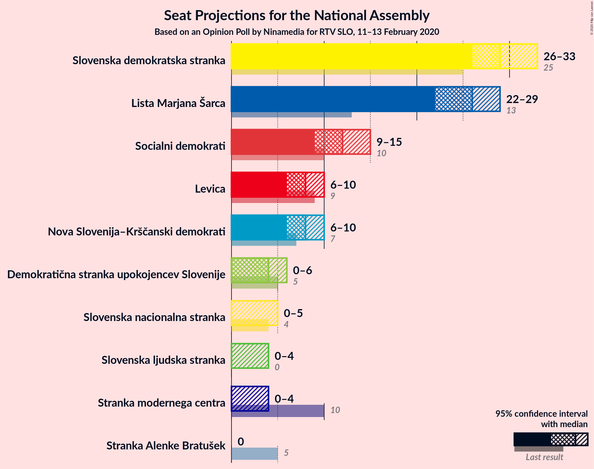
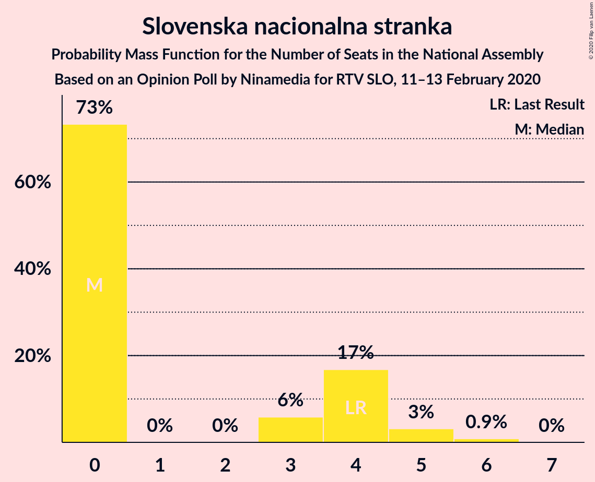
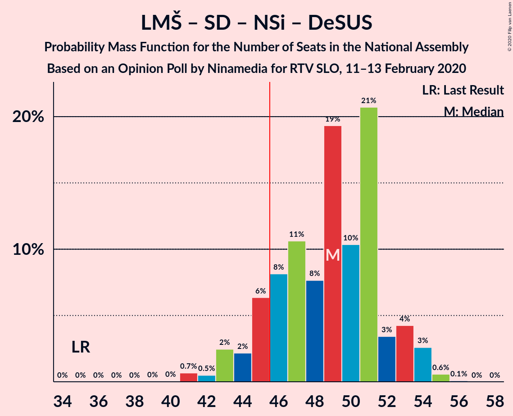
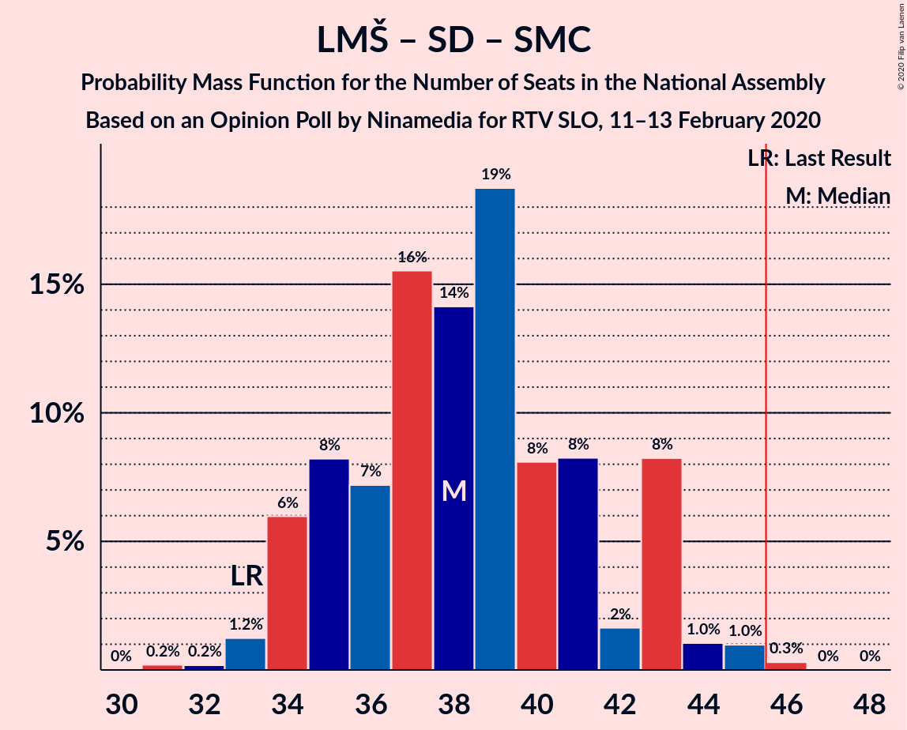

# Opinion Poll by Ninamedia for RTV SLO, 11–13 February 2020

<a href="#voting-intentions">Voting Intentions</a> | <a href="#seats">Seats</a> | <a href="#coalitions">Coalitions</a> | <a href="#technical-information">Technical Information</a>

## Voting Intentions

### Confidence Intervals

| Party | Last Result | Poll Result | 80% Confidence Interval | 90% Confidence Interval | 95% Confidence Interval | 99% Confidence Interval |
|:-----:|:-----------:|:-----------:|:-----------------------:|:-----------------------:|:-----------------------:|:-----------------------:|
| Slovenska demokratska stranka | 24.9% | 29.3% | 27.1–31.6% |26.6–32.2% |26.0–32.8% |25.0–33.9% |
| Lista Marjana Šarca | 12.6% | 25.6% | 23.5–27.8% |23.0–28.4% |22.5–28.9% |21.5–30.0% |
| Socialni demokrati | 9.9% | 12.3% | 10.8–14.0% |10.4–14.5% |10.1–14.9% |9.4–15.8% |
| Levica | 9.3% | 7.9% | 6.7–9.3% |6.4–9.7% |6.1–10.1% |5.6–10.8% |
| Nova Slovenija–Krščanski demokrati | 7.2% | 7.9% | 6.7–9.3% |6.4–9.7% |6.1–10.1% |5.6–10.8% |
| Demokratična stranka upokojencev Slovenije | 4.9% | 4.3% | 3.4–5.4% |3.2–5.8% |3.0–6.1% |2.7–6.7% |
| Slovenska nacionalna stranka | 4.2% | 3.7% | 2.9–4.8% |2.7–5.1% |2.5–5.4% |2.2–6.0% |
| Slovenska ljudska stranka | 2.6% | 3.4% | 2.7–4.5% |2.5–4.8% |2.3–5.1% |2.0–5.6% |
| Stranka modernega centra | 9.7% | 3.0% | 2.3–4.0% |2.1–4.3% |2.0–4.6% |1.7–5.1% |
| Stranka Alenke Bratušek | 5.1% | 1.4% | 1.0–2.2% |0.9–2.4% |0.8–2.6% |0.6–3.0% |

*Note:* The poll result column reflects the actual value used in the calculations. Published results may vary slightly, and in addition be rounded to fewer digits.

## Seats

### Confidence Intervals

| Party | Last Result | Median | 80% Confidence Interval | 90% Confidence Interval | 95% Confidence Interval | 99% Confidence Interval |
|:-----:|:-----------:|:------:|:-----------------------:|:-----------------------:|:-----------------------:|:-----------------------:|
| <a href="#slovenska-demokratska-stranka">Slovenska demokratska stranka</a> | 25 | 29 | 27–31 |26–32 |26–33 |25–34 |
| <a href="#lista-marjana-šarca">Lista Marjana Šarca</a> | 13 | 26 | 23–28 |22–29 |22–29 |21–31 |
| <a href="#socialni-demokrati">Socialni demokrati</a> | 10 | 12 | 10–14 |10–14 |9–15 |9–16 |
| <a href="#levica">Levica</a> | 9 | 8 | 6–9 |6–9 |6–10 |5–10 |
| <a href="#nova-slovenija–krščanski-demokrati">Nova Slovenija–Krščanski demokrati</a> | 7 | 8 | 6–9 |6–10 |6–10 |5–11 |
| <a href="#demokratična-stranka-upokojencev-slovenije">Demokratična stranka upokojencev Slovenije</a> | 5 | 4 | 0–5 |0–5 |0–6 |0–6 |
| <a href="#slovenska-nacionalna-stranka">Slovenska nacionalna stranka</a> | 4 | 0 | 0–4 |0–4 |0–5 |0–6 |
| <a href="#slovenska-ljudska-stranka">Slovenska ljudska stranka</a> | 0 | 0 | 0–4 |0–4 |0–4 |0–5 |
| <a href="#stranka-modernega-centra">Stranka modernega centra</a> | 10 | 0 | 0–4 |0–4 |0–4 |0–5 |
| <a href="#stranka-alenke-bratušek">Stranka Alenke Bratušek</a> | 5 | 0 | 0 |0 |0 |0 |

### Slovenska demokratska stranka

*For a full overview of the results for this party, see the [Slovenska demokratska stranka](party-slovenskademokratskastranka.html) page.*

| Number of Seats | Probability | Accumulated | Special Marks |
|:---------------:|:-----------:|:-----------:|:-------------:|
| 23 | 0.1% | 100% |  |
| 24 | 0.4% | 99.9% |  |
| 25 | 2% | 99.5% | Last Result |
| 26 | 6% | 98% |  |
| 27 | 11% | 92% |  |
| 28 | 24% | 81% |  |
| 29 | 15% | 57% | Median |
| 30 | 19% | 43% |  |
| 31 | 13% | 23% |  |
| 32 | 6% | 10% |  |
| 33 | 3% | 4% |  |
| 34 | 1.0% | 1.5% |  |
| 35 | 0.3% | 0.5% |  |
| 36 | 0% | 0.2% |  |
| 37 | 0.2% | 0.2% |  |
| 38 | 0% | 0% |  |

### Lista Marjana Šarca

*For a full overview of the results for this party, see the [Lista Marjana Šarca](party-listamarjanašarca.html) page.*

| Number of Seats | Probability | Accumulated | Special Marks |
|:---------------:|:-----------:|:-----------:|:-------------:|
| 13 | 0% | 100% | Last Result |
| 14 | 0% | 100% |  |
| 15 | 0% | 100% |  |
| 16 | 0% | 100% |  |
| 17 | 0% | 100% |  |
| 18 | 0% | 100% |  |
| 19 | 0.1% | 100% |  |
| 20 | 0.2% | 99.9% |  |
| 21 | 1.2% | 99.8% |  |
| 22 | 4% | 98.6% |  |
| 23 | 9% | 95% |  |
| 24 | 14% | 86% |  |
| 25 | 10% | 72% |  |
| 26 | 33% | 63% | Median |
| 27 | 13% | 30% |  |
| 28 | 9% | 17% |  |
| 29 | 6% | 8% |  |
| 30 | 0.6% | 2% |  |
| 31 | 1.4% | 2% |  |
| 32 | 0.4% | 0.4% |  |
| 33 | 0% | 0% |  |

### Socialni demokrati

*For a full overview of the results for this party, see the [Socialni demokrati](party-socialnidemokrati.html) page.*

| Number of Seats | Probability | Accumulated | Special Marks |
|:---------------:|:-----------:|:-----------:|:-------------:|
| 8 | 0.2% | 100% |  |
| 9 | 2% | 99.8% |  |
| 10 | 9% | 97% | Last Result |
| 11 | 30% | 89% |  |
| 12 | 17% | 58% | Median |
| 13 | 30% | 42% |  |
| 14 | 8% | 12% |  |
| 15 | 3% | 4% |  |
| 16 | 0.4% | 0.6% |  |
| 17 | 0.2% | 0.2% |  |
| 18 | 0% | 0% |  |

### Levica

*For a full overview of the results for this party, see the [Levica](party-levica.html) page.*

| Number of Seats | Probability | Accumulated | Special Marks |
|:---------------:|:-----------:|:-----------:|:-------------:|
| 4 | 0.1% | 100% |  |
| 5 | 2% | 99.9% |  |
| 6 | 15% | 98% |  |
| 7 | 26% | 83% |  |
| 8 | 28% | 57% | Median |
| 9 | 25% | 29% | Last Result |
| 10 | 4% | 4% |  |
| 11 | 0.3% | 0.4% |  |
| 12 | 0.1% | 0.1% |  |
| 13 | 0% | 0% |  |

### Nova Slovenija–Krščanski demokrati

*For a full overview of the results for this party, see the [Nova Slovenija–Krščanski demokrati](party-novaslovenija–krščanskidemokrati.html) page.*

| Number of Seats | Probability | Accumulated | Special Marks |
|:---------------:|:-----------:|:-----------:|:-------------:|
| 5 | 2% | 100% |  |
| 6 | 9% | 98% |  |
| 7 | 25% | 89% | Last Result |
| 8 | 45% | 64% | Median |
| 9 | 13% | 19% |  |
| 10 | 5% | 6% |  |
| 11 | 0.9% | 1.0% |  |
| 12 | 0.1% | 0.1% |  |
| 13 | 0% | 0% |  |

### Demokratična stranka upokojencev Slovenije

*For a full overview of the results for this party, see the [Demokratična stranka upokojencev Slovenije](party-demokratičnastrankaupokojencevslovenije.html) page.*

| Number of Seats | Probability | Accumulated | Special Marks |
|:---------------:|:-----------:|:-----------:|:-------------:|
| 0 | 26% | 100% |  |
| 1 | 0% | 74% |  |
| 2 | 0% | 74% |  |
| 3 | 0.3% | 74% |  |
| 4 | 46% | 74% | Median |
| 5 | 25% | 28% | Last Result |
| 6 | 3% | 4% |  |
| 7 | 0.2% | 0.2% |  |
| 8 | 0% | 0% |  |

### Slovenska nacionalna stranka

*For a full overview of the results for this party, see the [Slovenska nacionalna stranka](party-slovenskanacionalnastranka.html) page.*

| Number of Seats | Probability | Accumulated | Special Marks |
|:---------------:|:-----------:|:-----------:|:-------------:|
| 0 | 73% | 100% | Median |
| 1 | 0% | 27% |  |
| 2 | 0% | 27% |  |
| 3 | 6% | 27% |  |
| 4 | 17% | 21% | Last Result |
| 5 | 3% | 4% |  |
| 6 | 0.9% | 0.9% |  |
| 7 | 0% | 0% |  |

### Slovenska ljudska stranka

*For a full overview of the results for this party, see the [Slovenska ljudska stranka](party-slovenskaljudskastranka.html) page.*

| Number of Seats | Probability | Accumulated | Special Marks |
|:---------------:|:-----------:|:-----------:|:-------------:|
| 0 | 82% | 100% | Last Result, Median |
| 1 | 0% | 18% |  |
| 2 | 0% | 18% |  |
| 3 | 0.7% | 18% |  |
| 4 | 15% | 17% |  |
| 5 | 2% | 2% |  |
| 6 | 0.1% | 0.1% |  |
| 7 | 0% | 0% |  |

### Stranka modernega centra

*For a full overview of the results for this party, see the [Stranka modernega centra](party-strankamodernegacentra.html) page.*

| Number of Seats | Probability | Accumulated | Special Marks |
|:---------------:|:-----------:|:-----------:|:-------------:|
| 0 | 85% | 100% | Median |
| 1 | 0% | 15% |  |
| 2 | 0% | 15% |  |
| 3 | 0.9% | 15% |  |
| 4 | 13% | 14% |  |
| 5 | 1.1% | 1.2% |  |
| 6 | 0% | 0% |  |
| 7 | 0% | 0% |  |
| 8 | 0% | 0% |  |
| 9 | 0% | 0% |  |
| 10 | 0% | 0% | Last Result |

### Stranka Alenke Bratušek

*For a full overview of the results for this party, see the [Stranka Alenke Bratušek](party-strankaalenkebratušek.html) page.*

| Number of Seats | Probability | Accumulated | Special Marks |
|:---------------:|:-----------:|:-----------:|:-------------:|
| 0 | 100% | 100% | Median |
| 1 | 0% | 0% |  |
| 2 | 0% | 0% |  |
| 3 | 0% | 0% |  |
| 4 | 0% | 0% |  |
| 5 | 0% | 0% | Last Result |

## Coalitions

### Confidence Intervals

| Coalition | Last Result | Median | Majority? | 80% Confidence Interval | 90% Confidence Interval | 95% Confidence Interval | 99% Confidence Interval |
|:---------:|:-----------:|:------:|:---------:|:-----------------------:|:-----------------------:|:-----------------------:|:-----------------------:|
| Slovenska demokratska stranka – Lista Marjana Šarca – Demokratična stranka upokojencev Slovenije | 43 | 58 | 100% | 55–61 | 54–62 | 52–64 | 50–65 |
| Slovenska demokratska stranka – Lista Marjana Šarca | 38 | 54 | 100% | 51–58 | 51–59 | 50–60 | 48–62 |
| Lista Marjana Šarca – Socialni demokrati – Nova Slovenija–Krščanski demokrati – Demokratična stranka upokojencev Slovenije – Stranka modernega centra – Stranka Alenke Bratušek | 50 | 49 | 93% | 46–52 | 45–54 | 44–54 | 42–55 |
| Lista Marjana Šarca – Socialni demokrati – Nova Slovenija–Krščanski demokrati – Demokratična stranka upokojencev Slovenije – Stranka modernega centra | 45 | 49 | 93% | 46–52 | 45–54 | 44–54 | 42–55 |
| Lista Marjana Šarca – Socialni demokrati – Nova Slovenija–Krščanski demokrati – Demokratična stranka upokojencev Slovenije | 35 | 49 | 88% | 45–52 | 44–53 | 43–54 | 41–55 |
| Lista Marjana Šarca – Socialni demokrati – Nova Slovenija–Krščanski demokrati | 30 | 45 | 49% | 42–49 | 41–50 | 41–51 | 39–52 |
| Lista Marjana Šarca – Socialni demokrati – Nova Slovenija–Krščanski demokrati – Stranka modernega centra | 40 | 46 | 55% | 42–50 | 42–51 | 41–51 | 40–53 |
| Lista Marjana Šarca – Socialni demokrati – Demokratična stranka upokojencev Slovenije | 28 | 41 | 5% | 38–44 | 36–45 | 36–46 | 34–47 |
| Lista Marjana Šarca – Socialni demokrati – Demokratična stranka upokojencev Slovenije – Stranka modernega centra – Stranka Alenke Bratušek | 43 | 42 | 7% | 38–45 | 37–46 | 36–46 | 35–48 |
| Lista Marjana Šarca – Socialni demokrati – Demokratična stranka upokojencev Slovenije – Stranka modernega centra | 38 | 42 | 7% | 38–45 | 37–46 | 36–46 | 35–48 |
| Lista Marjana Šarca – Socialni demokrati – Stranka modernega centra | 33 | 38 | 0.3% | 35–43 | 34–43 | 34–43 | 33–45 |
| Lista Marjana Šarca – Socialni demokrati | 23 | 38 | 0% | 34–41 | 34–42 | 33–43 | 32–44 |
| Socialni demokrati – Demokratična stranka upokojencev Slovenije – Stranka modernega centra | 25 | 16 | 0% | 13–18 | 12–19 | 11–20 | 10–22 |

### Slovenska demokratska stranka – Lista Marjana Šarca – Demokratična stranka upokojencev Slovenije

| Number of Seats | Probability | Accumulated | Special Marks |
|:---------------:|:-----------:|:-----------:|:-------------:|
| 43 | 0% | 100% | Last Result |
| 44 | 0% | 100% |  |
| 45 | 0% | 100% |  |
| 46 | 0% | 100% | Majority |
| 47 | 0% | 100% |  |
| 48 | 0% | 100% |  |
| 49 | 0.1% | 100% |  |
| 50 | 0.5% | 99.9% |  |
| 51 | 0.7% | 99.4% |  |
| 52 | 1.2% | 98.7% |  |
| 53 | 2% | 97% |  |
| 54 | 4% | 96% |  |
| 55 | 6% | 92% |  |
| 56 | 12% | 86% |  |
| 57 | 11% | 74% |  |
| 58 | 20% | 63% |  |
| 59 | 11% | 42% | Median |
| 60 | 9% | 31% |  |
| 61 | 17% | 22% |  |
| 62 | 2% | 5% |  |
| 63 | 0.4% | 3% |  |
| 64 | 2% | 3% |  |
| 65 | 0.6% | 0.7% |  |
| 66 | 0% | 0% |  |

### Slovenska demokratska stranka – Lista Marjana Šarca

| Number of Seats | Probability | Accumulated | Special Marks |
|:---------------:|:-----------:|:-----------:|:-------------:|
| 38 | 0% | 100% | Last Result |
| 39 | 0% | 100% |  |
| 40 | 0% | 100% |  |
| 41 | 0% | 100% |  |
| 42 | 0% | 100% |  |
| 43 | 0% | 100% |  |
| 44 | 0% | 100% |  |
| 45 | 0% | 100% |  |
| 46 | 0% | 100% | Majority |
| 47 | 0.4% | 99.9% |  |
| 48 | 0.9% | 99.5% |  |
| 49 | 0.9% | 98.7% |  |
| 50 | 2% | 98% |  |
| 51 | 7% | 96% |  |
| 52 | 8% | 88% |  |
| 53 | 6% | 80% |  |
| 54 | 26% | 74% |  |
| 55 | 4% | 48% | Median |
| 56 | 18% | 44% |  |
| 57 | 14% | 26% |  |
| 58 | 3% | 13% |  |
| 59 | 5% | 10% |  |
| 60 | 2% | 4% |  |
| 61 | 1.2% | 2% |  |
| 62 | 0.7% | 0.8% |  |
| 63 | 0.1% | 0.1% |  |
| 64 | 0% | 0% |  |

### Lista Marjana Šarca – Socialni demokrati – Nova Slovenija–Krščanski demokrati – Demokratična stranka upokojencev Slovenije – Stranka modernega centra – Stranka Alenke Bratušek

| Number of Seats | Probability | Accumulated | Special Marks |
|:---------------:|:-----------:|:-----------:|:-------------:|
| 40 | 0% | 100% |  |
| 41 | 0.2% | 99.9% |  |
| 42 | 0.3% | 99.7% |  |
| 43 | 1.2% | 99.4% |  |
| 44 | 2% | 98% |  |
| 45 | 4% | 97% |  |
| 46 | 7% | 93% | Majority |
| 47 | 8% | 85% |  |
| 48 | 6% | 78% |  |
| 49 | 22% | 71% |  |
| 50 | 10% | 50% | Last Result, Median |
| 51 | 25% | 40% |  |
| 52 | 6% | 15% |  |
| 53 | 5% | 10% |  |
| 54 | 4% | 5% |  |
| 55 | 0.6% | 0.8% |  |
| 56 | 0.1% | 0.2% |  |
| 57 | 0.1% | 0.1% |  |
| 58 | 0% | 0% |  |

### Lista Marjana Šarca – Socialni demokrati – Nova Slovenija–Krščanski demokrati – Demokratična stranka upokojencev Slovenije – Stranka modernega centra

| Number of Seats | Probability | Accumulated | Special Marks |
|:---------------:|:-----------:|:-----------:|:-------------:|
| 40 | 0% | 100% |  |
| 41 | 0.2% | 99.9% |  |
| 42 | 0.3% | 99.7% |  |
| 43 | 1.2% | 99.4% |  |
| 44 | 2% | 98% |  |
| 45 | 4% | 97% | Last Result |
| 46 | 7% | 93% | Majority |
| 47 | 8% | 85% |  |
| 48 | 6% | 78% |  |
| 49 | 22% | 71% |  |
| 50 | 10% | 50% | Median |
| 51 | 25% | 40% |  |
| 52 | 6% | 15% |  |
| 53 | 5% | 10% |  |
| 54 | 4% | 5% |  |
| 55 | 0.6% | 0.8% |  |
| 56 | 0.1% | 0.2% |  |
| 57 | 0.1% | 0.1% |  |
| 58 | 0% | 0% |  |

### Lista Marjana Šarca – Socialni demokrati – Nova Slovenija–Krščanski demokrati – Demokratična stranka upokojencev Slovenije

| Number of Seats | Probability | Accumulated | Special Marks |
|:---------------:|:-----------:|:-----------:|:-------------:|
| 35 | 0% | 100% | Last Result |
| 36 | 0% | 100% |  |
| 37 | 0% | 100% |  |
| 38 | 0% | 100% |  |
| 39 | 0% | 100% |  |
| 40 | 0% | 100% |  |
| 41 | 0.7% | 99.9% |  |
| 42 | 0.5% | 99.2% |  |
| 43 | 2% | 98.7% |  |
| 44 | 2% | 96% |  |
| 45 | 6% | 94% |  |
| 46 | 8% | 88% | Majority |
| 47 | 11% | 80% |  |
| 48 | 8% | 69% |  |
| 49 | 19% | 61% |  |
| 50 | 10% | 42% | Median |
| 51 | 21% | 32% |  |
| 52 | 3% | 11% |  |
| 53 | 4% | 8% |  |
| 54 | 3% | 3% |  |
| 55 | 0.6% | 0.7% |  |
| 56 | 0.1% | 0.1% |  |
| 57 | 0% | 0% |  |

### Lista Marjana Šarca – Socialni demokrati – Nova Slovenija–Krščanski demokrati

| Number of Seats | Probability | Accumulated | Special Marks |
|:---------------:|:-----------:|:-----------:|:-------------:|
| 30 | 0% | 100% | Last Result |
| 31 | 0% | 100% |  |
| 32 | 0% | 100% |  |
| 33 | 0% | 100% |  |
| 34 | 0% | 100% |  |
| 35 | 0% | 100% |  |
| 36 | 0% | 100% |  |
| 37 | 0.1% | 100% |  |
| 38 | 0.1% | 99.9% |  |
| 39 | 0.9% | 99.8% |  |
| 40 | 1.4% | 99.0% |  |
| 41 | 6% | 98% |  |
| 42 | 7% | 92% |  |
| 43 | 5% | 85% |  |
| 44 | 11% | 80% |  |
| 45 | 20% | 69% |  |
| 46 | 9% | 49% | Median, Majority |
| 47 | 22% | 41% |  |
| 48 | 8% | 19% |  |
| 49 | 4% | 10% |  |
| 50 | 2% | 6% |  |
| 51 | 4% | 4% |  |
| 52 | 0.4% | 0.8% |  |
| 53 | 0.4% | 0.4% |  |
| 54 | 0% | 0% |  |

### Lista Marjana Šarca – Socialni demokrati – Nova Slovenija–Krščanski demokrati – Stranka modernega centra

| Number of Seats | Probability | Accumulated | Special Marks |
|:---------------:|:-----------:|:-----------:|:-------------:|
| 38 | 0.1% | 100% |  |
| 39 | 0.3% | 99.9% |  |
| 40 | 0.7% | 99.6% | Last Result |
| 41 | 4% | 98.9% |  |
| 42 | 6% | 95% |  |
| 43 | 4% | 90% |  |
| 44 | 11% | 85% |  |
| 45 | 19% | 75% |  |
| 46 | 9% | 55% | Median, Majority |
| 47 | 19% | 46% |  |
| 48 | 9% | 26% |  |
| 49 | 6% | 18% |  |
| 50 | 2% | 11% |  |
| 51 | 7% | 9% |  |
| 52 | 2% | 2% |  |
| 53 | 0.4% | 0.7% |  |
| 54 | 0.3% | 0.3% |  |
| 55 | 0% | 0% |  |

### Lista Marjana Šarca – Socialni demokrati – Demokratična stranka upokojencev Slovenije

| Number of Seats | Probability | Accumulated | Special Marks |
|:---------------:|:-----------:|:-----------:|:-------------:|
| 28 | 0% | 100% | Last Result |
| 29 | 0% | 100% |  |
| 30 | 0% | 100% |  |
| 31 | 0% | 100% |  |
| 32 | 0% | 100% |  |
| 33 | 0.1% | 100% |  |
| 34 | 1.0% | 99.8% |  |
| 35 | 0.7% | 98.9% |  |
| 36 | 3% | 98% |  |
| 37 | 4% | 95% |  |
| 38 | 8% | 91% |  |
| 39 | 9% | 82% |  |
| 40 | 13% | 73% |  |
| 41 | 16% | 60% |  |
| 42 | 7% | 44% | Median |
| 43 | 22% | 37% |  |
| 44 | 6% | 14% |  |
| 45 | 4% | 8% |  |
| 46 | 4% | 5% | Majority |
| 47 | 0.7% | 0.8% |  |
| 48 | 0.1% | 0.1% |  |
| 49 | 0% | 0% |  |

### Lista Marjana Šarca – Socialni demokrati – Demokratična stranka upokojencev Slovenije – Stranka modernega centra – Stranka Alenke Bratušek

| Number of Seats | Probability | Accumulated | Special Marks |
|:---------------:|:-----------:|:-----------:|:-------------:|
| 33 | 0.1% | 100% |  |
| 34 | 0.3% | 99.9% |  |
| 35 | 0.5% | 99.6% |  |
| 36 | 2% | 99.1% |  |
| 37 | 3% | 97% |  |
| 38 | 7% | 94% |  |
| 39 | 5% | 87% |  |
| 40 | 12% | 82% |  |
| 41 | 17% | 69% |  |
| 42 | 7% | 52% | Median |
| 43 | 27% | 45% | Last Result |
| 44 | 7% | 18% |  |
| 45 | 5% | 12% |  |
| 46 | 4% | 7% | Majority |
| 47 | 1.3% | 2% |  |
| 48 | 1.0% | 1.0% |  |
| 49 | 0.1% | 0.1% |  |
| 50 | 0% | 0% |  |

### Lista Marjana Šarca – Socialni demokrati – Demokratična stranka upokojencev Slovenije – Stranka modernega centra

| Number of Seats | Probability | Accumulated | Special Marks |
|:---------------:|:-----------:|:-----------:|:-------------:|
| 33 | 0.1% | 100% |  |
| 34 | 0.3% | 99.9% |  |
| 35 | 0.5% | 99.6% |  |
| 36 | 2% | 99.1% |  |
| 37 | 3% | 97% |  |
| 38 | 7% | 94% | Last Result |
| 39 | 5% | 87% |  |
| 40 | 12% | 82% |  |
| 41 | 17% | 69% |  |
| 42 | 7% | 52% | Median |
| 43 | 27% | 45% |  |
| 44 | 7% | 18% |  |
| 45 | 5% | 12% |  |
| 46 | 4% | 7% | Majority |
| 47 | 1.3% | 2% |  |
| 48 | 1.0% | 1.0% |  |
| 49 | 0.1% | 0.1% |  |
| 50 | 0% | 0% |  |

### Lista Marjana Šarca – Socialni demokrati – Stranka modernega centra

| Number of Seats | Probability | Accumulated | Special Marks |
|:---------------:|:-----------:|:-----------:|:-------------:|
| 31 | 0.2% | 100% |  |
| 32 | 0.2% | 99.8% |  |
| 33 | 1.2% | 99.6% | Last Result |
| 34 | 6% | 98% |  |
| 35 | 8% | 92% |  |
| 36 | 7% | 84% |  |
| 37 | 16% | 77% |  |
| 38 | 14% | 61% | Median |
| 39 | 19% | 47% |  |
| 40 | 8% | 29% |  |
| 41 | 8% | 20% |  |
| 42 | 2% | 12% |  |
| 43 | 8% | 11% |  |
| 44 | 1.0% | 2% |  |
| 45 | 1.0% | 1.3% |  |
| 46 | 0.3% | 0.3% | Majority |
| 47 | 0% | 0% |  |

### Lista Marjana Šarca – Socialni demokrati

| Number of Seats | Probability | Accumulated | Special Marks |
|:---------------:|:-----------:|:-----------:|:-------------:|
| 23 | 0% | 100% | Last Result |
| 24 | 0% | 100% |  |
| 25 | 0% | 100% |  |
| 26 | 0% | 100% |  |
| 27 | 0% | 100% |  |
| 28 | 0% | 100% |  |
| 29 | 0% | 100% |  |
| 30 | 0% | 100% |  |
| 31 | 0.3% | 100% |  |
| 32 | 0.8% | 99.7% |  |
| 33 | 2% | 98.9% |  |
| 34 | 8% | 96% |  |
| 35 | 9% | 89% |  |
| 36 | 8% | 79% |  |
| 37 | 15% | 71% |  |
| 38 | 13% | 56% | Median |
| 39 | 22% | 43% |  |
| 40 | 8% | 20% |  |
| 41 | 8% | 13% |  |
| 42 | 1.2% | 5% |  |
| 43 | 3% | 4% |  |
| 44 | 0.5% | 0.7% |  |
| 45 | 0.1% | 0.1% |  |
| 46 | 0% | 0% | Majority |

### Socialni demokrati – Demokratična stranka upokojencev Slovenije – Stranka modernega centra

| Number of Seats | Probability | Accumulated | Special Marks |
|:---------------:|:-----------:|:-----------:|:-------------:|
| 9 | 0.3% | 100% |  |
| 10 | 2% | 99.7% |  |
| 11 | 3% | 98% |  |
| 12 | 5% | 95% |  |
| 13 | 6% | 91% |  |
| 14 | 7% | 85% |  |
| 15 | 14% | 78% |  |
| 16 | 21% | 64% | Median |
| 17 | 22% | 43% |  |
| 18 | 11% | 21% |  |
| 19 | 6% | 9% |  |
| 20 | 2% | 4% |  |
| 21 | 1.3% | 2% |  |
| 22 | 1.1% | 1.1% |  |
| 23 | 0% | 0% |  |
| 24 | 0% | 0% |  |
| 25 | 0% | 0% | Last Result |

## Technical Information

### Opinion Poll

+ **Polling firm:** Ninamedia
+ **Commissioner(s):** RTV SLO
+ **Fieldwork period:** 11–13 February 2020

### Calculations

+ **Sample size:** 700
+ **Simulations done:** 1,048,576
+ **Error estimate:** 3.92%

