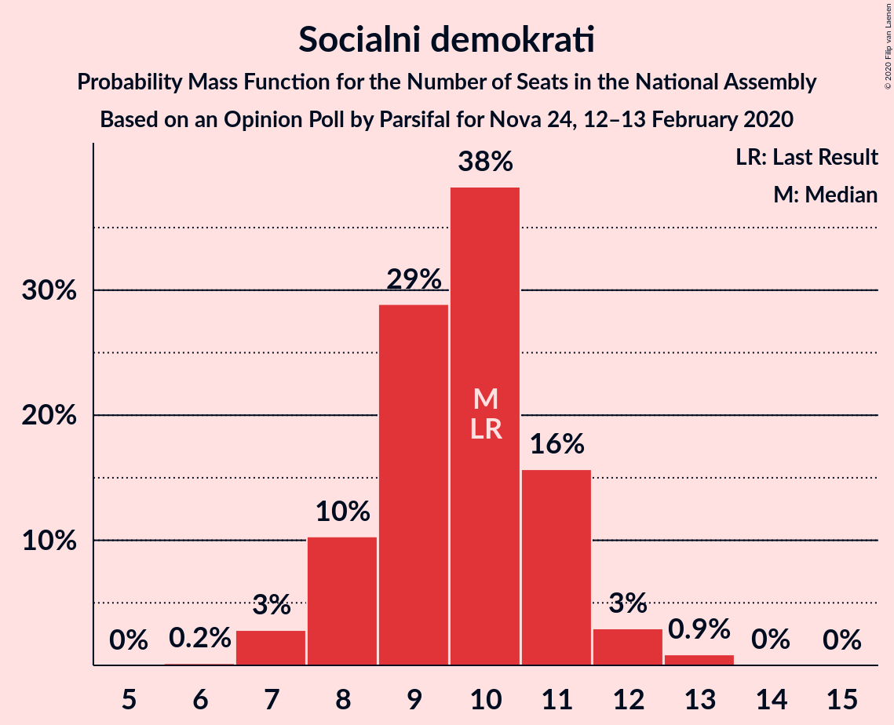
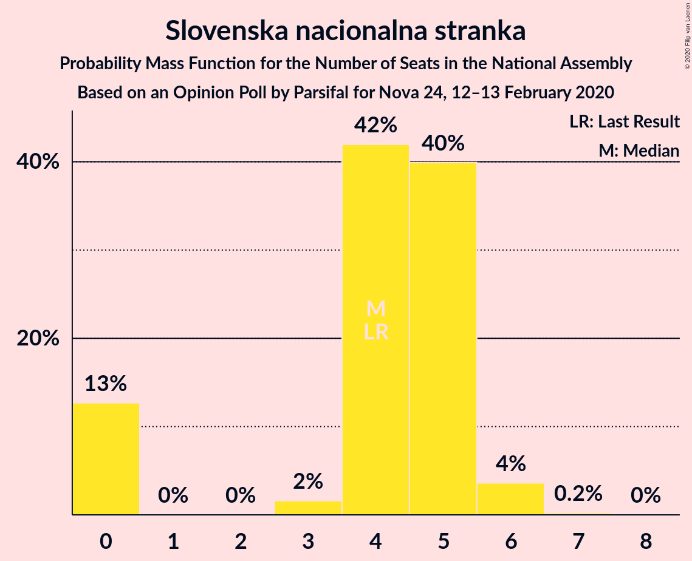
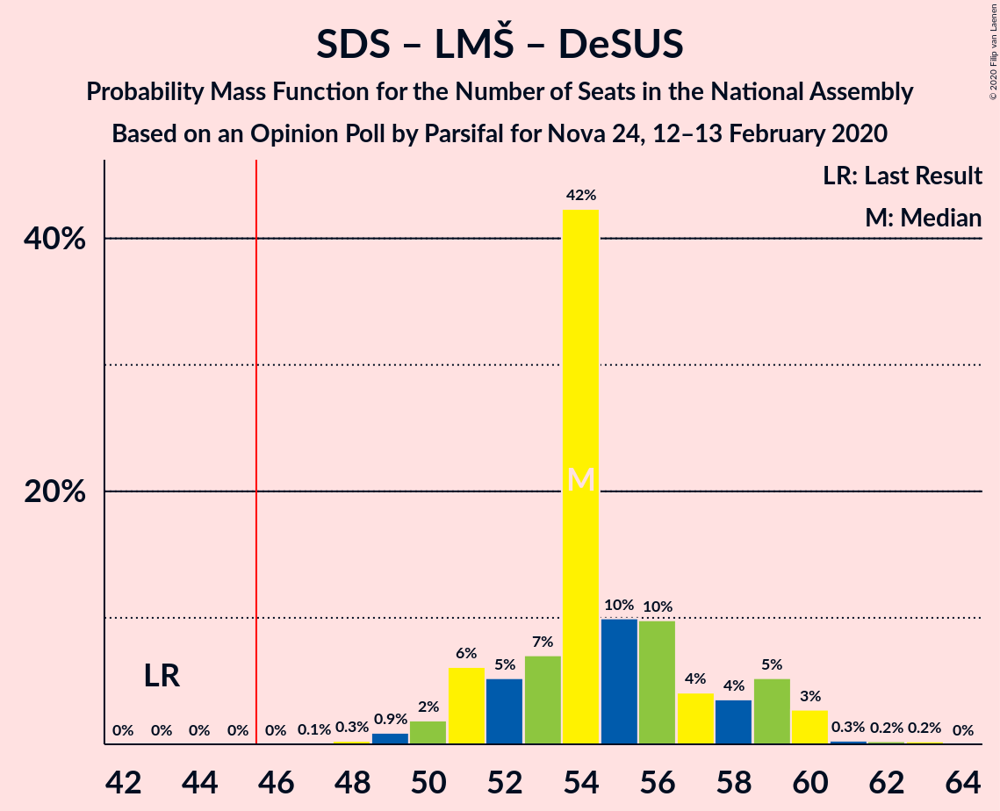
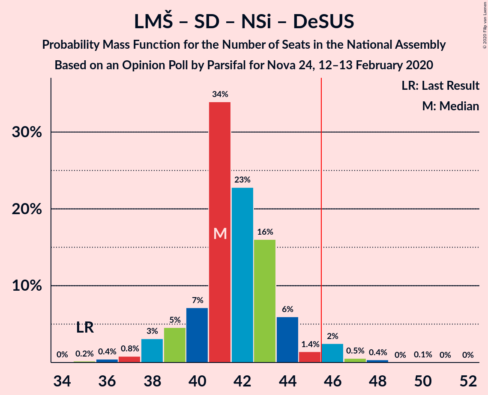

# Opinion Poll by Parsifal for Nova 24, 12–13 February 2020

<a href="#voting-intentions">Voting Intentions</a> | <a href="#seats">Seats</a> | <a href="#coalitions">Coalitions</a> | <a href="#technical-information">Technical Information</a>

## Voting Intentions

### Confidence Intervals

| Party | Last Result | Poll Result | 80% Confidence Interval | 90% Confidence Interval | 95% Confidence Interval | 99% Confidence Interval |
|:-----:|:-----------:|:-----------:|:-----------------------:|:-----------------------:|:-----------------------:|:-----------------------:|
| Slovenska demokratska stranka | 24.9% | 30.8% | 28.7–33.1% |28.1–33.8% |27.6–34.3% |26.6–35.4% |
| Lista Marjana Šarca | 12.6% | 19.6% | 17.8–21.6% |17.3–22.2% |16.9–22.7% |16.1–23.7% |
| Socialni demokrati | 9.9% | 10.0% | 8.7–11.5% |8.3–12.0% |8.0–12.4% |7.4–13.2% |
| Nova Slovenija–Krščanski demokrati | 7.2% | 8.0% | 6.9–9.5% |6.5–9.9% |6.2–10.2% |5.7–11.0% |
| Levica | 9.3% | 7.5% | 6.3–8.9% |6.0–9.3% |5.8–9.6% |5.3–10.3% |
| Demokratična stranka upokojencev Slovenije | 4.9% | 5.9% | 5.0–7.2% |4.7–7.6% |4.5–7.9% |4.0–8.6% |
| Stranka modernega centra | 9.7% | 4.8% | 3.9–6.0% |3.7–6.4% |3.5–6.7% |3.1–7.3% |
| Slovenska nacionalna stranka | 4.2% | 4.6% | 3.7–5.7% |3.5–6.1% |3.3–6.4% |2.9–7.0% |
| Slovenska ljudska stranka | 2.6% | 3.5% | 2.7–4.5% |2.5–4.8% |2.3–5.1% |2.0–5.6% |
| Stranka Alenke Bratušek | 5.1% | 1.8% | 1.3–2.6% |1.2–2.9% |1.1–3.1% |0.9–3.5% |

*Note:* The poll result column reflects the actual value used in the calculations. Published results may vary slightly, and in addition be rounded to fewer digits.

## Seats

### Confidence Intervals

| Party | Last Result | Median | 80% Confidence Interval | 90% Confidence Interval | 95% Confidence Interval | 99% Confidence Interval |
|:-----:|:-----------:|:------:|:-----------------------:|:-----------------------:|:-----------------------:|:-----------------------:|
| <a href="#slovenska-demokratska-stranka">Slovenska demokratska stranka</a> | 25 | 31 | 28–34 |27–34 |27–34 |25–35 |
| <a href="#lista-marjana-šarca">Lista Marjana Šarca</a> | 13 | 19 | 18–21 |17–21 |16–21 |15–23 |
| <a href="#socialni-demokrati">Socialni demokrati</a> | 10 | 8 | 8–10 |8–11 |8–11 |7–13 |
| <a href="#nova-slovenija–krščanski-demokrati">Nova Slovenija–Krščanski demokrati</a> | 7 | 7 | 6–9 |6–10 |5–10 |5–11 |
| <a href="#levica">Levica</a> | 9 | 7 | 6–9 |6–9 |6–9 |5–11 |
| <a href="#demokratična-stranka-upokojencev-slovenije">Demokratična stranka upokojencev Slovenije</a> | 5 | 5 | 4–7 |4–7 |4–7 |3–8 |
| <a href="#stranka-modernega-centra">Stranka modernega centra</a> | 10 | 4 | 0–6 |0–6 |0–6 |0–7 |
| <a href="#slovenska-nacionalna-stranka">Slovenska nacionalna stranka</a> | 4 | 4 | 0–5 |0–5 |0–6 |0–6 |
| <a href="#slovenska-ljudska-stranka">Slovenska ljudska stranka</a> | 0 | 0 | 0–4 |0–4 |0–4 |0–5 |
| <a href="#stranka-alenke-bratušek">Stranka Alenke Bratušek</a> | 5 | 0 | 0 |0 |0 |0 |

### Slovenska demokratska stranka

*For a full overview of the results for this party, see the [Slovenska demokratska stranka](party-slovenskademokratskastranka.html) page.*

| Number of Seats | Probability | Accumulated | Special Marks |
|:---------------:|:-----------:|:-----------:|:-------------:|
| 24 | 0% | 100% |  |
| 25 | 0.5% | 99.9% | Last Result |
| 26 | 0.9% | 99.4% |  |
| 27 | 5% | 98.6% |  |
| 28 | 6% | 93% |  |
| 29 | 14% | 88% |  |
| 30 | 23% | 74% |  |
| 31 | 27% | 51% | Median |
| 32 | 7% | 24% |  |
| 33 | 3% | 18% |  |
| 34 | 14% | 15% |  |
| 35 | 0.9% | 1.2% |  |
| 36 | 0.1% | 0.3% |  |
| 37 | 0.2% | 0.2% |  |
| 38 | 0% | 0% |  |

### Lista Marjana Šarca

*For a full overview of the results for this party, see the [Lista Marjana Šarca](party-listamarjanašarca.html) page.*

| Number of Seats | Probability | Accumulated | Special Marks |
|:---------------:|:-----------:|:-----------:|:-------------:|
| 13 | 0% | 100% | Last Result |
| 14 | 0.2% | 100% |  |
| 15 | 0.7% | 99.8% |  |
| 16 | 3% | 99.1% |  |
| 17 | 4% | 97% |  |
| 18 | 32% | 92% |  |
| 19 | 16% | 60% | Median |
| 20 | 16% | 44% |  |
| 21 | 26% | 28% |  |
| 22 | 1.4% | 2% |  |
| 23 | 0.5% | 0.7% |  |
| 24 | 0.1% | 0.1% |  |
| 25 | 0% | 0.1% |  |
| 26 | 0% | 0% |  |

### Socialni demokrati

*For a full overview of the results for this party, see the [Socialni demokrati](party-socialnidemokrati.html) page.*

| Number of Seats | Probability | Accumulated | Special Marks |
|:---------------:|:-----------:|:-----------:|:-------------:|
| 6 | 0.1% | 100% |  |
| 7 | 2% | 99.9% |  |
| 8 | 49% | 98% | Median |
| 9 | 30% | 49% |  |
| 10 | 14% | 19% | Last Result |
| 11 | 3% | 5% |  |
| 12 | 1.2% | 2% |  |
| 13 | 1.2% | 1.3% |  |
| 14 | 0.1% | 0.1% |  |
| 15 | 0% | 0% |  |

### Nova Slovenija–Krščanski demokrati

*For a full overview of the results for this party, see the [Nova Slovenija–Krščanski demokrati](party-novaslovenija–krščanskidemokrati.html) page.*

| Number of Seats | Probability | Accumulated | Special Marks |
|:---------------:|:-----------:|:-----------:|:-------------:|
| 5 | 3% | 100% |  |
| 6 | 12% | 97% |  |
| 7 | 37% | 85% | Last Result, Median |
| 8 | 38% | 49% |  |
| 9 | 6% | 11% |  |
| 10 | 4% | 5% |  |
| 11 | 1.0% | 1.3% |  |
| 12 | 0.3% | 0.3% |  |
| 13 | 0% | 0% |  |

### Levica

*For a full overview of the results for this party, see the [Levica](party-levica.html) page.*

| Number of Seats | Probability | Accumulated | Special Marks |
|:---------------:|:-----------:|:-----------:|:-------------:|
| 4 | 0.1% | 100% |  |
| 5 | 2% | 99.9% |  |
| 6 | 42% | 98% |  |
| 7 | 36% | 56% | Median |
| 8 | 9% | 20% |  |
| 9 | 8% | 10% | Last Result |
| 10 | 1.1% | 2% |  |
| 11 | 0.8% | 0.8% |  |
| 12 | 0% | 0% |  |

### Demokratična stranka upokojencev Slovenije

*For a full overview of the results for this party, see the [Demokratična stranka upokojencev Slovenije](party-demokratičnastrankaupokojencevslovenije.html) page.*

| Number of Seats | Probability | Accumulated | Special Marks |
|:---------------:|:-----------:|:-----------:|:-------------:|
| 0 | 0.5% | 100% |  |
| 1 | 0% | 99.5% |  |
| 2 | 0% | 99.5% |  |
| 3 | 0.1% | 99.5% |  |
| 4 | 10% | 99.4% |  |
| 5 | 44% | 89% | Last Result, Median |
| 6 | 26% | 45% |  |
| 7 | 19% | 20% |  |
| 8 | 0.9% | 0.9% |  |
| 9 | 0% | 0.1% |  |
| 10 | 0% | 0% |  |

### Stranka modernega centra

*For a full overview of the results for this party, see the [Stranka modernega centra](party-strankamodernegacentra.html) page.*

| Number of Seats | Probability | Accumulated | Special Marks |
|:---------------:|:-----------:|:-----------:|:-------------:|
| 0 | 31% | 100% |  |
| 1 | 0% | 69% |  |
| 2 | 0% | 69% |  |
| 3 | 0.4% | 69% |  |
| 4 | 34% | 69% | Median |
| 5 | 11% | 35% |  |
| 6 | 23% | 24% |  |
| 7 | 0.6% | 0.6% |  |
| 8 | 0% | 0% |  |
| 9 | 0% | 0% |  |
| 10 | 0% | 0% | Last Result |

### Slovenska nacionalna stranka

*For a full overview of the results for this party, see the [Slovenska nacionalna stranka](party-slovenskanacionalnastranka.html) page.*

| Number of Seats | Probability | Accumulated | Special Marks |
|:---------------:|:-----------:|:-----------:|:-------------:|
| 0 | 18% | 100% |  |
| 1 | 0% | 82% |  |
| 2 | 0% | 82% |  |
| 3 | 5% | 82% |  |
| 4 | 51% | 77% | Last Result, Median |
| 5 | 22% | 26% |  |
| 6 | 4% | 4% |  |
| 7 | 0.3% | 0.4% |  |
| 8 | 0% | 0% |  |

### Slovenska ljudska stranka

*For a full overview of the results for this party, see the [Slovenska ljudska stranka](party-slovenskaljudskastranka.html) page.*

| Number of Seats | Probability | Accumulated | Special Marks |
|:---------------:|:-----------:|:-----------:|:-------------:|
| 0 | 78% | 100% | Last Result, Median |
| 1 | 0% | 22% |  |
| 2 | 0% | 22% |  |
| 3 | 2% | 22% |  |
| 4 | 18% | 20% |  |
| 5 | 2% | 2% |  |
| 6 | 0% | 0% |  |

### Stranka Alenke Bratušek

*For a full overview of the results for this party, see the [Stranka Alenke Bratušek](party-strankaalenkebratušek.html) page.*

| Number of Seats | Probability | Accumulated | Special Marks |
|:---------------:|:-----------:|:-----------:|:-------------:|
| 0 | 100% | 100% | Median |
| 1 | 0% | 0% |  |
| 2 | 0% | 0% |  |
| 3 | 0% | 0% |  |
| 4 | 0% | 0% |  |
| 5 | 0% | 0% | Last Result |

## Coalitions

### Confidence Intervals

| Coalition | Last Result | Median | Majority? | 80% Confidence Interval | 90% Confidence Interval | 95% Confidence Interval | 99% Confidence Interval |
|:---------:|:-----------:|:------:|:---------:|:-----------------------:|:-----------------------:|:-----------------------:|:-----------------------:|
| Slovenska demokratska stranka – Lista Marjana Šarca – Demokratična stranka upokojencev Slovenije | 43 | 55 | 100% | 52–60 | 51–60 | 50–60 | 49–61 |
| Slovenska demokratska stranka – Lista Marjana Šarca | 38 | 49 | 96% | 47–54 | 46–55 | 45–55 | 42–55 |
| Lista Marjana Šarca – Socialni demokrati – Nova Slovenija–Krščanski demokrati – Demokratična stranka upokojencev Slovenije – Stranka modernega centra – Stranka Alenke Bratušek | 50 | 43 | 38% | 42–47 | 41–49 | 41–50 | 40–53 |
| Lista Marjana Šarca – Socialni demokrati – Nova Slovenija–Krščanski demokrati – Demokratična stranka upokojencev Slovenije – Stranka modernega centra | 45 | 43 | 38% | 42–47 | 41–49 | 41–50 | 40–53 |
| Lista Marjana Šarca – Socialni demokrati – Nova Slovenija–Krščanski demokrati – Demokratična stranka upokojencev Slovenije | 35 | 41 | 2% | 38–43 | 38–44 | 37–45 | 36–49 |
| Lista Marjana Šarca – Socialni demokrati – Nova Slovenija–Krščanski demokrati – Stranka modernega centra | 40 | 38 | 0.7% | 36–42 | 36–43 | 36–44 | 34–46 |
| Lista Marjana Šarca – Socialni demokrati – Demokratična stranka upokojencev Slovenije – Stranka modernega centra – Stranka Alenke Bratušek | 43 | 36 | 0% | 35–40 | 33–40 | 33–41 | 32–44 |
| Lista Marjana Šarca – Socialni demokrati – Demokratična stranka upokojencev Slovenije – Stranka modernega centra | 38 | 36 | 0% | 35–40 | 33–40 | 33–41 | 32–44 |
| Lista Marjana Šarca – Socialni demokrati – Nova Slovenija–Krščanski demokrati | 30 | 36 | 0% | 33–37 | 33–38 | 32–39 | 30–44 |
| Lista Marjana Šarca – Socialni demokrati – Demokratična stranka upokojencev Slovenije | 28 | 33 | 0% | 31–36 | 31–36 | 30–37 | 29–39 |
| Lista Marjana Šarca – Socialni demokrati – Stranka modernega centra | 33 | 31 | 0% | 29–34 | 28–35 | 28–35 | 27–37 |
| Lista Marjana Šarca – Socialni demokrati | 23 | 28 | 0% | 26–30 | 26–30 | 25–31 | 24–34 |
| Socialni demokrati – Demokratična stranka upokojencev Slovenije – Stranka modernega centra | 25 | 17 | 0% | 14–21 | 13–21 | 13–22 | 13–24 |

### Slovenska demokratska stranka – Lista Marjana Šarca – Demokratična stranka upokojencev Slovenije

| Number of Seats | Probability | Accumulated | Special Marks |
|:---------------:|:-----------:|:-----------:|:-------------:|
| 43 | 0% | 100% | Last Result |
| 44 | 0% | 100% |  |
| 45 | 0% | 100% |  |
| 46 | 0% | 100% | Majority |
| 47 | 0.1% | 100% |  |
| 48 | 0.1% | 99.9% |  |
| 49 | 1.2% | 99.8% |  |
| 50 | 2% | 98.6% |  |
| 51 | 5% | 97% |  |
| 52 | 8% | 92% |  |
| 53 | 13% | 84% |  |
| 54 | 18% | 71% |  |
| 55 | 17% | 54% | Median |
| 56 | 3% | 37% |  |
| 57 | 2% | 33% |  |
| 58 | 1.4% | 31% |  |
| 59 | 19% | 29% |  |
| 60 | 10% | 10% |  |
| 61 | 0.1% | 0.5% |  |
| 62 | 0.2% | 0.4% |  |
| 63 | 0.2% | 0.2% |  |
| 64 | 0% | 0% |  |

### Slovenska demokratska stranka – Lista Marjana Šarca

| Number of Seats | Probability | Accumulated | Special Marks |
|:---------------:|:-----------:|:-----------:|:-------------:|
| 38 | 0% | 100% | Last Result |
| 39 | 0% | 100% |  |
| 40 | 0% | 100% |  |
| 41 | 0% | 100% |  |
| 42 | 0.6% | 100% |  |
| 43 | 0.3% | 99.4% |  |
| 44 | 1.0% | 99.1% |  |
| 45 | 3% | 98% |  |
| 46 | 4% | 96% | Majority |
| 47 | 4% | 91% |  |
| 48 | 27% | 87% |  |
| 49 | 16% | 60% |  |
| 50 | 9% | 44% | Median |
| 51 | 2% | 35% |  |
| 52 | 15% | 32% |  |
| 53 | 2% | 18% |  |
| 54 | 6% | 15% |  |
| 55 | 9% | 10% |  |
| 56 | 0% | 0.4% |  |
| 57 | 0.2% | 0.4% |  |
| 58 | 0.2% | 0.2% |  |
| 59 | 0% | 0% |  |

### Lista Marjana Šarca – Socialni demokrati – Nova Slovenija–Krščanski demokrati – Demokratična stranka upokojencev Slovenije – Stranka modernega centra – Stranka Alenke Bratušek

| Number of Seats | Probability | Accumulated | Special Marks |
|:---------------:|:-----------:|:-----------:|:-------------:|
| 37 | 0.1% | 100% |  |
| 38 | 0.2% | 99.9% |  |
| 39 | 0.2% | 99.7% |  |
| 40 | 1.4% | 99.5% |  |
| 41 | 6% | 98% |  |
| 42 | 15% | 92% |  |
| 43 | 29% | 77% | Median |
| 44 | 7% | 48% |  |
| 45 | 3% | 41% |  |
| 46 | 17% | 38% | Majority |
| 47 | 13% | 21% |  |
| 48 | 2% | 8% |  |
| 49 | 3% | 6% |  |
| 50 | 1.5% | 3% | Last Result |
| 51 | 0.6% | 1.3% |  |
| 52 | 0.1% | 0.7% |  |
| 53 | 0.6% | 0.6% |  |
| 54 | 0% | 0% |  |

### Lista Marjana Šarca – Socialni demokrati – Nova Slovenija–Krščanski demokrati – Demokratična stranka upokojencev Slovenije – Stranka modernega centra

| Number of Seats | Probability | Accumulated | Special Marks |
|:---------------:|:-----------:|:-----------:|:-------------:|
| 37 | 0.1% | 100% |  |
| 38 | 0.2% | 99.9% |  |
| 39 | 0.2% | 99.7% |  |
| 40 | 1.4% | 99.5% |  |
| 41 | 6% | 98% |  |
| 42 | 15% | 92% |  |
| 43 | 29% | 77% | Median |
| 44 | 7% | 48% |  |
| 45 | 3% | 41% | Last Result |
| 46 | 17% | 38% | Majority |
| 47 | 13% | 21% |  |
| 48 | 2% | 8% |  |
| 49 | 3% | 6% |  |
| 50 | 1.5% | 3% |  |
| 51 | 0.6% | 1.3% |  |
| 52 | 0.1% | 0.7% |  |
| 53 | 0.6% | 0.6% |  |
| 54 | 0% | 0% |  |

### Lista Marjana Šarca – Socialni demokrati – Nova Slovenija–Krščanski demokrati – Demokratična stranka upokojencev Slovenije

| Number of Seats | Probability | Accumulated | Special Marks |
|:---------------:|:-----------:|:-----------:|:-------------:|
| 34 | 0.1% | 100% |  |
| 35 | 0.1% | 99.9% | Last Result |
| 36 | 0.9% | 99.8% |  |
| 37 | 2% | 98.9% |  |
| 38 | 11% | 97% |  |
| 39 | 12% | 86% | Median |
| 40 | 12% | 73% |  |
| 41 | 18% | 61% |  |
| 42 | 19% | 43% |  |
| 43 | 17% | 24% |  |
| 44 | 3% | 7% |  |
| 45 | 1.0% | 3% |  |
| 46 | 1.0% | 2% | Majority |
| 47 | 0.7% | 1.4% |  |
| 48 | 0.1% | 0.7% |  |
| 49 | 0% | 0.5% |  |
| 50 | 0.5% | 0.5% |  |
| 51 | 0% | 0% |  |

### Lista Marjana Šarca – Socialni demokrati – Nova Slovenija–Krščanski demokrati – Stranka modernega centra

| Number of Seats | Probability | Accumulated | Special Marks |
|:---------------:|:-----------:|:-----------:|:-------------:|
| 30 | 0.1% | 100% |  |
| 31 | 0% | 99.9% |  |
| 32 | 0.1% | 99.9% |  |
| 33 | 0.3% | 99.8% |  |
| 34 | 0.3% | 99.5% |  |
| 35 | 2% | 99.3% |  |
| 36 | 19% | 98% |  |
| 37 | 17% | 78% |  |
| 38 | 12% | 62% | Median |
| 39 | 7% | 49% |  |
| 40 | 14% | 43% | Last Result |
| 41 | 19% | 29% |  |
| 42 | 3% | 10% |  |
| 43 | 4% | 7% |  |
| 44 | 1.3% | 3% |  |
| 45 | 1.2% | 2% |  |
| 46 | 0.6% | 0.7% | Majority |
| 47 | 0% | 0.1% |  |
| 48 | 0% | 0.1% |  |
| 49 | 0.1% | 0.1% |  |
| 50 | 0% | 0% |  |

### Lista Marjana Šarca – Socialni demokrati – Demokratična stranka upokojencev Slovenije – Stranka modernega centra – Stranka Alenke Bratušek

| Number of Seats | Probability | Accumulated | Special Marks |
|:---------------:|:-----------:|:-----------:|:-------------:|
| 30 | 0.2% | 100% |  |
| 31 | 0.1% | 99.8% |  |
| 32 | 0.8% | 99.6% |  |
| 33 | 5% | 98.8% |  |
| 34 | 2% | 93% |  |
| 35 | 25% | 91% |  |
| 36 | 20% | 66% | Median |
| 37 | 5% | 46% |  |
| 38 | 12% | 41% |  |
| 39 | 16% | 29% |  |
| 40 | 9% | 13% |  |
| 41 | 2% | 4% |  |
| 42 | 0.7% | 2% |  |
| 43 | 0.4% | 1.3% | Last Result |
| 44 | 0.8% | 0.9% |  |
| 45 | 0.1% | 0.1% |  |
| 46 | 0% | 0% | Majority |

### Lista Marjana Šarca – Socialni demokrati – Demokratična stranka upokojencev Slovenije – Stranka modernega centra

| Number of Seats | Probability | Accumulated | Special Marks |
|:---------------:|:-----------:|:-----------:|:-------------:|
| 30 | 0.2% | 100% |  |
| 31 | 0.1% | 99.8% |  |
| 32 | 0.8% | 99.6% |  |
| 33 | 5% | 98.8% |  |
| 34 | 2% | 93% |  |
| 35 | 25% | 91% |  |
| 36 | 20% | 66% | Median |
| 37 | 5% | 46% |  |
| 38 | 12% | 41% | Last Result |
| 39 | 16% | 29% |  |
| 40 | 9% | 13% |  |
| 41 | 2% | 4% |  |
| 42 | 0.7% | 2% |  |
| 43 | 0.4% | 1.3% |  |
| 44 | 0.8% | 0.9% |  |
| 45 | 0.1% | 0.1% |  |
| 46 | 0% | 0% | Majority |

### Lista Marjana Šarca – Socialni demokrati – Nova Slovenija–Krščanski demokrati

| Number of Seats | Probability | Accumulated | Special Marks |
|:---------------:|:-----------:|:-----------:|:-------------:|
| 29 | 0.1% | 100% |  |
| 30 | 0.7% | 99.9% | Last Result |
| 31 | 0.6% | 99.2% |  |
| 32 | 2% | 98.6% |  |
| 33 | 7% | 97% |  |
| 34 | 23% | 89% | Median |
| 35 | 15% | 66% |  |
| 36 | 24% | 51% |  |
| 37 | 21% | 27% |  |
| 38 | 2% | 6% |  |
| 39 | 2% | 4% |  |
| 40 | 1.2% | 2% |  |
| 41 | 0.2% | 1.1% |  |
| 42 | 0.3% | 0.9% |  |
| 43 | 0.1% | 0.6% |  |
| 44 | 0.1% | 0.5% |  |
| 45 | 0.5% | 0.5% |  |
| 46 | 0% | 0% | Majority |

### Lista Marjana Šarca – Socialni demokrati – Demokratična stranka upokojencev Slovenije

| Number of Seats | Probability | Accumulated | Special Marks |
|:---------------:|:-----------:|:-----------:|:-------------:|
| 27 | 0% | 100% |  |
| 28 | 0.3% | 99.9% | Last Result |
| 29 | 0.4% | 99.6% |  |
| 30 | 2% | 99.2% |  |
| 31 | 20% | 97% |  |
| 32 | 7% | 77% | Median |
| 33 | 21% | 70% |  |
| 34 | 17% | 48% |  |
| 35 | 11% | 31% |  |
| 36 | 16% | 20% |  |
| 37 | 2% | 4% |  |
| 38 | 1.0% | 2% |  |
| 39 | 1.0% | 1.1% |  |
| 40 | 0.1% | 0.1% |  |
| 41 | 0% | 0.1% |  |
| 42 | 0% | 0% |  |

### Lista Marjana Šarca – Socialni demokrati – Stranka modernega centra

| Number of Seats | Probability | Accumulated | Special Marks |
|:---------------:|:-----------:|:-----------:|:-------------:|
| 23 | 0.1% | 100% |  |
| 24 | 0.1% | 99.9% |  |
| 25 | 0.2% | 99.8% |  |
| 26 | 0.1% | 99.6% |  |
| 27 | 2% | 99.5% |  |
| 28 | 6% | 98% |  |
| 29 | 15% | 92% |  |
| 30 | 25% | 77% |  |
| 31 | 5% | 52% | Median |
| 32 | 6% | 47% |  |
| 33 | 23% | 41% | Last Result |
| 34 | 12% | 18% |  |
| 35 | 4% | 6% |  |
| 36 | 1.4% | 2% |  |
| 37 | 0.7% | 1.0% |  |
| 38 | 0.2% | 0.3% |  |
| 39 | 0.1% | 0.1% |  |
| 40 | 0% | 0% |  |

### Lista Marjana Šarca – Socialni demokrati

| Number of Seats | Probability | Accumulated | Special Marks |
|:---------------:|:-----------:|:-----------:|:-------------:|
| 23 | 0.2% | 100% | Last Result |
| 24 | 1.1% | 99.8% |  |
| 25 | 3% | 98.7% |  |
| 26 | 16% | 95% |  |
| 27 | 23% | 79% | Median |
| 28 | 14% | 56% |  |
| 29 | 24% | 42% |  |
| 30 | 14% | 18% |  |
| 31 | 2% | 4% |  |
| 32 | 1.1% | 2% |  |
| 33 | 0.2% | 0.8% |  |
| 34 | 0.6% | 0.6% |  |
| 35 | 0.1% | 0.1% |  |
| 36 | 0% | 0% |  |

### Socialni demokrati – Demokratična stranka upokojencev Slovenije – Stranka modernega centra

| Number of Seats | Probability | Accumulated | Special Marks |
|:---------------:|:-----------:|:-----------:|:-------------:|
| 12 | 0.1% | 100% |  |
| 13 | 6% | 99.9% |  |
| 14 | 9% | 94% |  |
| 15 | 14% | 85% |  |
| 16 | 1.4% | 71% |  |
| 17 | 22% | 70% | Median |
| 18 | 8% | 48% |  |
| 19 | 10% | 40% |  |
| 20 | 11% | 30% |  |
| 21 | 16% | 19% |  |
| 22 | 0.8% | 3% |  |
| 23 | 0.4% | 2% |  |
| 24 | 1.3% | 2% |  |
| 25 | 0.2% | 0.2% | Last Result |
| 26 | 0% | 0% |  |

## Technical Information

### Opinion Poll

+ **Polling firm:** Parsifal
+ **Commissioner(s):** Nova 24
+ **Fieldwork period:** 12–13 February 2020

### Calculations

+ **Sample size:** 723
+ **Simulations done:** 131,072
+ **Error estimate:** 2.70%

