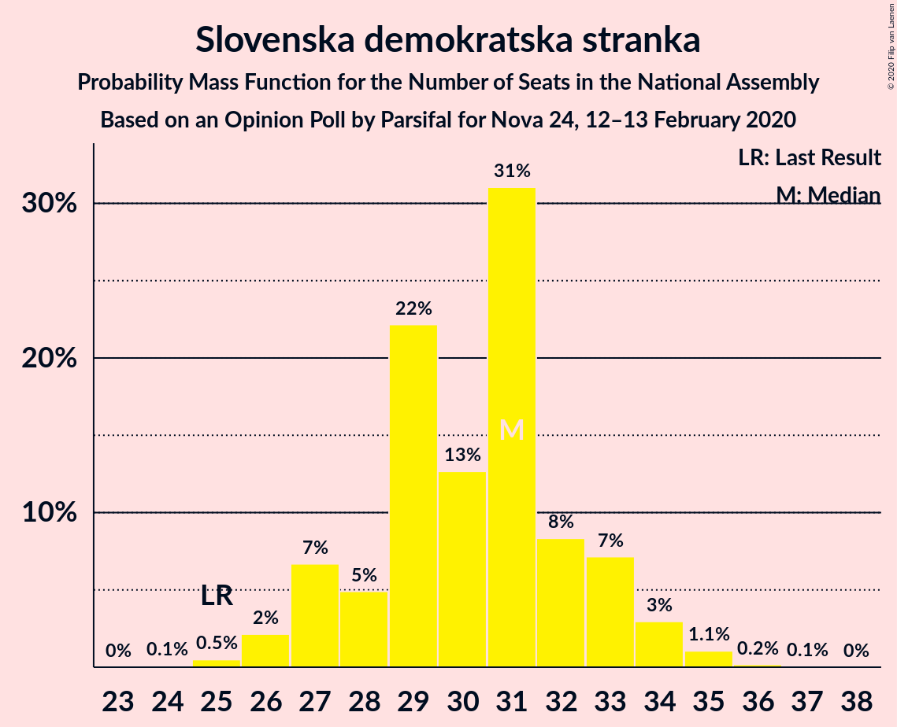
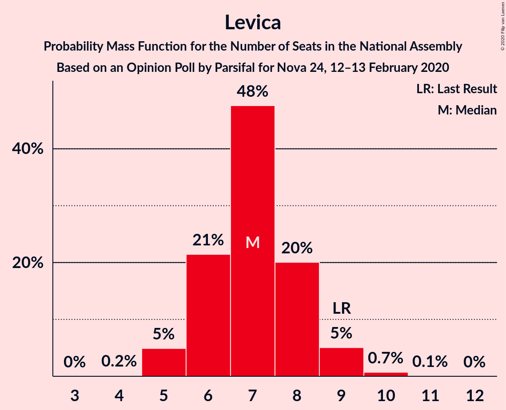
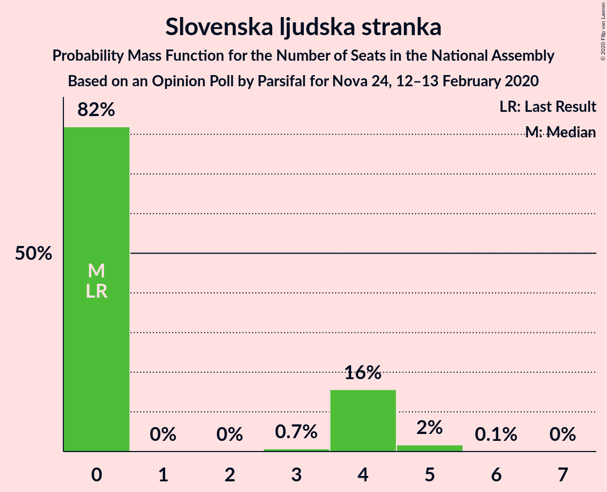
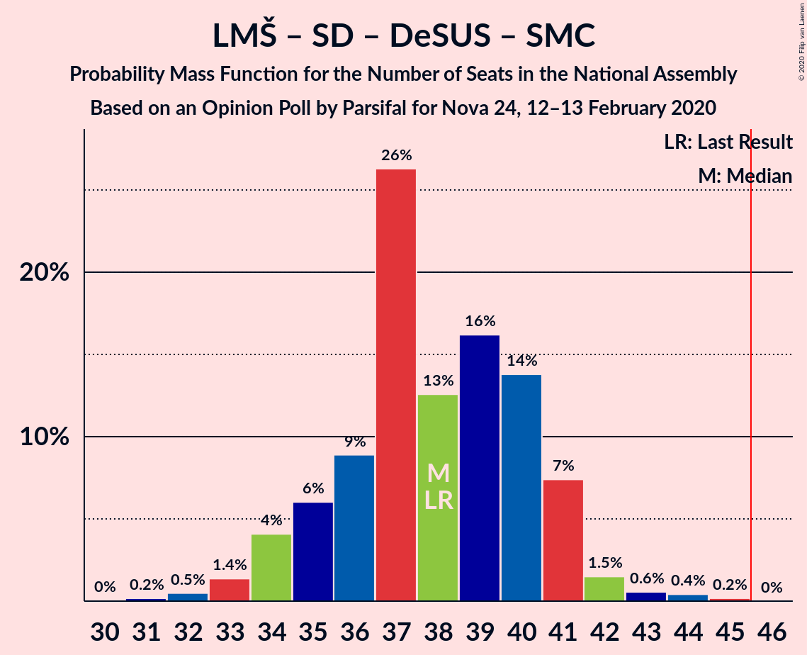
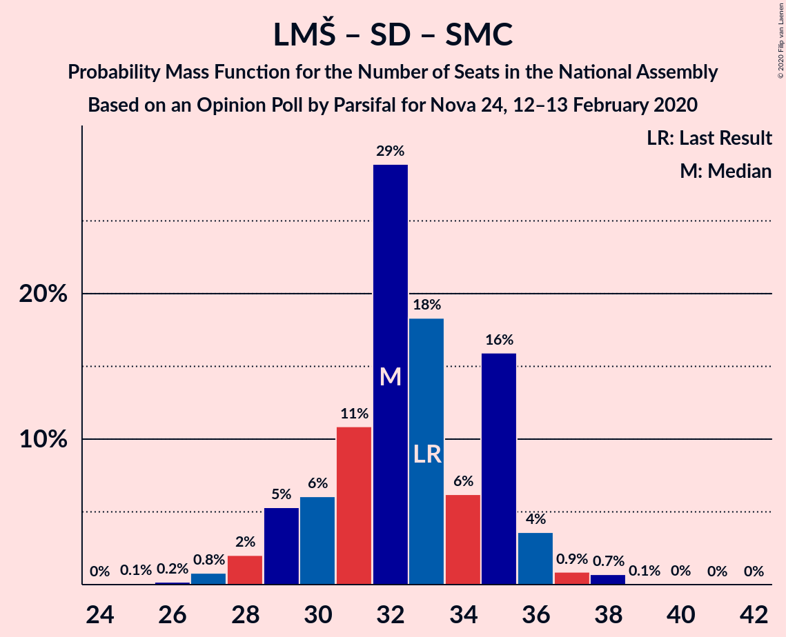
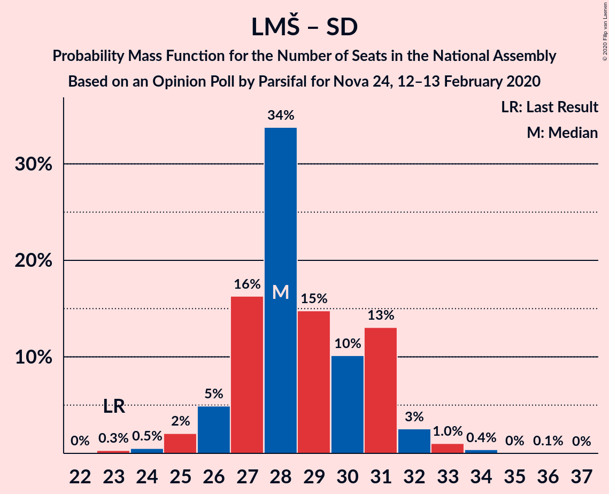

# Opinion Poll by Parsifal for Nova 24, 12–13 February 2020

<a href="#voting-intentions">Voting Intentions</a> | <a href="#seats">Seats</a> | <a href="#coalitions">Coalitions</a> | <a href="#technical-information">Technical Information</a>

## Voting Intentions

### Confidence Intervals

| Party | Last Result | Poll Result | 80% Confidence Interval | 90% Confidence Interval | 95% Confidence Interval | 99% Confidence Interval |
|:-----:|:-----------:|:-----------:|:-----------------------:|:-----------------------:|:-----------------------:|:-----------------------:|
| Slovenska demokratska stranka | 24.9% | 30.8% | 28.7–33.1% |28.1–33.8% |27.6–34.3% |26.6–35.4% |
| Lista Marjana Šarca | 12.6% | 19.6% | 17.8–21.6% |17.3–22.2% |16.9–22.7% |16.1–23.7% |
| Socialni demokrati | 9.9% | 10.0% | 8.7–11.5% |8.3–12.0% |8.0–12.4% |7.4–13.2% |
| Nova Slovenija–Krščanski demokrati | 7.2% | 8.0% | 6.9–9.5% |6.5–9.9% |6.2–10.2% |5.7–11.0% |
| Levica | 9.3% | 7.5% | 6.3–8.9% |6.0–9.3% |5.8–9.6% |5.3–10.3% |
| Demokratična stranka upokojencev Slovenije | 4.9% | 5.9% | 5.0–7.2% |4.7–7.6% |4.5–7.9% |4.0–8.6% |
| Stranka modernega centra | 9.7% | 4.8% | 3.9–6.0% |3.7–6.4% |3.5–6.7% |3.1–7.3% |
| Slovenska nacionalna stranka | 4.2% | 4.6% | 3.7–5.7% |3.5–6.1% |3.3–6.4% |2.9–7.0% |
| Slovenska ljudska stranka | 2.6% | 3.5% | 2.7–4.5% |2.5–4.8% |2.3–5.1% |2.0–5.6% |
| Stranka Alenke Bratušek | 5.1% | 1.8% | 1.3–2.6% |1.2–2.9% |1.1–3.1% |0.9–3.5% |

*Note:* The poll result column reflects the actual value used in the calculations. Published results may vary slightly, and in addition be rounded to fewer digits.

## Seats

### Confidence Intervals

| Party | Last Result | Median | 80% Confidence Interval | 90% Confidence Interval | 95% Confidence Interval | 99% Confidence Interval |
|:-----:|:-----------:|:------:|:-----------------------:|:-----------------------:|:-----------------------:|:-----------------------:|
| <a href="#slovenska-demokratska-stranka">Slovenska demokratska stranka</a> | 25 | 31 | 28–33 |27–33 |26–34 |25–35 |
| <a href="#lista-marjana-šarca">Lista Marjana Šarca</a> | 13 | 19 | 18–21 |17–21 |16–22 |15–23 |
| <a href="#socialni-demokrati">Socialni demokrati</a> | 10 | 10 | 8–11 |8–11 |7–12 |7–13 |
| <a href="#nova-slovenija–krščanski-demokrati">Nova Slovenija–Krščanski demokrati</a> | 7 | 8 | 7–9 |6–9 |6–9 |5–10 |
| <a href="#levica">Levica</a> | 9 | 7 | 6–8 |5–9 |5–9 |5–10 |
| <a href="#demokratična-stranka-upokojencev-slovenije">Demokratična stranka upokojencev Slovenije</a> | 5 | 5 | 5–6 |4–7 |4–7 |4–8 |
| <a href="#stranka-modernega-centra">Stranka modernega centra</a> | 10 | 4 | 0–5 |0–6 |0–6 |0–7 |
| <a href="#slovenska-nacionalna-stranka">Slovenska nacionalna stranka</a> | 4 | 4 | 0–5 |0–5 |0–6 |0–6 |
| <a href="#slovenska-ljudska-stranka">Slovenska ljudska stranka</a> | 0 | 0 | 0–4 |0–4 |0–4 |0–5 |
| <a href="#stranka-alenke-bratušek">Stranka Alenke Bratušek</a> | 5 | 0 | 0 |0 |0 |0 |

### Slovenska demokratska stranka

*For a full overview of the results for this party, see the [Slovenska demokratska stranka](party-slovenskademokratskastranka.html) page.*

| Number of Seats | Probability | Accumulated | Special Marks |
|:---------------:|:-----------:|:-----------:|:-------------:|
| 24 | 0.1% | 100% |  |
| 25 | 0.5% | 99.9% | Last Result |
| 26 | 2% | 99.4% |  |
| 27 | 7% | 97% |  |
| 28 | 5% | 91% |  |
| 29 | 22% | 86% |  |
| 30 | 13% | 63% |  |
| 31 | 31% | 51% | Median |
| 32 | 8% | 20% |  |
| 33 | 7% | 11% |  |
| 34 | 3% | 4% |  |
| 35 | 1.1% | 1.3% |  |
| 36 | 0.2% | 0.3% |  |
| 37 | 0.1% | 0.1% |  |
| 38 | 0% | 0% |  |

### Lista Marjana Šarca

*For a full overview of the results for this party, see the [Lista Marjana Šarca](party-listamarjanašarca.html) page.*

| Number of Seats | Probability | Accumulated | Special Marks |
|:---------------:|:-----------:|:-----------:|:-------------:|
| 13 | 0% | 100% | Last Result |
| 14 | 0.1% | 100% |  |
| 15 | 0.5% | 99.9% |  |
| 16 | 2% | 99.4% |  |
| 17 | 6% | 97% |  |
| 18 | 39% | 91% |  |
| 19 | 21% | 53% | Median |
| 20 | 18% | 32% |  |
| 21 | 9% | 13% |  |
| 22 | 3% | 4% |  |
| 23 | 0.5% | 0.8% |  |
| 24 | 0.2% | 0.2% |  |
| 25 | 0% | 0.1% |  |
| 26 | 0% | 0% |  |

### Socialni demokrati

*For a full overview of the results for this party, see the [Socialni demokrati](party-socialnidemokrati.html) page.*

| Number of Seats | Probability | Accumulated | Special Marks |
|:---------------:|:-----------:|:-----------:|:-------------:|
| 6 | 0.2% | 100% |  |
| 7 | 3% | 99.8% |  |
| 8 | 10% | 97% |  |
| 9 | 29% | 87% |  |
| 10 | 38% | 58% | Last Result, Median |
| 11 | 16% | 20% |  |
| 12 | 3% | 4% |  |
| 13 | 0.9% | 0.9% |  |
| 14 | 0% | 0.1% |  |
| 15 | 0% | 0% |  |

### Nova Slovenija–Krščanski demokrati

*For a full overview of the results for this party, see the [Nova Slovenija–Krščanski demokrati](party-novaslovenija–krščanskidemokrati.html) page.*

| Number of Seats | Probability | Accumulated | Special Marks |
|:---------------:|:-----------:|:-----------:|:-------------:|
| 5 | 1.0% | 100% |  |
| 6 | 9% | 98.9% |  |
| 7 | 27% | 90% | Last Result |
| 8 | 49% | 63% | Median |
| 9 | 12% | 14% |  |
| 10 | 2% | 2% |  |
| 11 | 0.3% | 0.4% |  |
| 12 | 0% | 0% |  |

### Levica

*For a full overview of the results for this party, see the [Levica](party-levica.html) page.*

| Number of Seats | Probability | Accumulated | Special Marks |
|:---------------:|:-----------:|:-----------:|:-------------:|
| 4 | 0.2% | 100% |  |
| 5 | 5% | 99.8% |  |
| 6 | 21% | 95% |  |
| 7 | 48% | 73% | Median |
| 8 | 20% | 26% |  |
| 9 | 5% | 6% | Last Result |
| 10 | 0.7% | 0.8% |  |
| 11 | 0.1% | 0.1% |  |
| 12 | 0% | 0% |  |

### Demokratična stranka upokojencev Slovenije

*For a full overview of the results for this party, see the [Demokratična stranka upokojencev Slovenije](party-demokratičnastrankaupokojencevslovenije.html) page.*

| Number of Seats | Probability | Accumulated | Special Marks |
|:---------------:|:-----------:|:-----------:|:-------------:|
| 0 | 0.2% | 100% |  |
| 1 | 0% | 99.8% |  |
| 2 | 0% | 99.8% |  |
| 3 | 0.1% | 99.8% |  |
| 4 | 6% | 99.7% |  |
| 5 | 56% | 93% | Last Result, Median |
| 6 | 29% | 37% |  |
| 7 | 8% | 9% |  |
| 8 | 0.7% | 0.8% |  |
| 9 | 0.1% | 0.1% |  |
| 10 | 0% | 0% |  |

### Stranka modernega centra

*For a full overview of the results for this party, see the [Stranka modernega centra](party-strankamodernegacentra.html) page.*

| Number of Seats | Probability | Accumulated | Special Marks |
|:---------------:|:-----------:|:-----------:|:-------------:|
| 0 | 12% | 100% |  |
| 1 | 0% | 88% |  |
| 2 | 0% | 88% |  |
| 3 | 0.5% | 88% |  |
| 4 | 54% | 88% | Median |
| 5 | 27% | 34% |  |
| 6 | 6% | 6% |  |
| 7 | 0.5% | 0.5% |  |
| 8 | 0% | 0% |  |
| 9 | 0% | 0% |  |
| 10 | 0% | 0% | Last Result |

### Slovenska nacionalna stranka

*For a full overview of the results for this party, see the [Slovenska nacionalna stranka](party-slovenskanacionalnastranka.html) page.*

| Number of Seats | Probability | Accumulated | Special Marks |
|:---------------:|:-----------:|:-----------:|:-------------:|
| 0 | 13% | 100% |  |
| 1 | 0% | 87% |  |
| 2 | 0% | 87% |  |
| 3 | 2% | 87% |  |
| 4 | 42% | 86% | Last Result, Median |
| 5 | 40% | 44% |  |
| 6 | 4% | 4% |  |
| 7 | 0.2% | 0.2% |  |
| 8 | 0% | 0% |  |

### Slovenska ljudska stranka

*For a full overview of the results for this party, see the [Slovenska ljudska stranka](party-slovenskaljudskastranka.html) page.*

| Number of Seats | Probability | Accumulated | Special Marks |
|:---------------:|:-----------:|:-----------:|:-------------:|
| 0 | 82% | 100% | Last Result, Median |
| 1 | 0% | 18% |  |
| 2 | 0% | 18% |  |
| 3 | 0.7% | 18% |  |
| 4 | 16% | 17% |  |
| 5 | 2% | 2% |  |
| 6 | 0.1% | 0.1% |  |
| 7 | 0% | 0% |  |

### Stranka Alenke Bratušek

*For a full overview of the results for this party, see the [Stranka Alenke Bratušek](party-strankaalenkebratušek.html) page.*

| Number of Seats | Probability | Accumulated | Special Marks |
|:---------------:|:-----------:|:-----------:|:-------------:|
| 0 | 100% | 100% | Median |
| 1 | 0% | 0% |  |
| 2 | 0% | 0% |  |
| 3 | 0% | 0% |  |
| 4 | 0% | 0% |  |
| 5 | 0% | 0% | Last Result |

## Coalitions

### Confidence Intervals

| Coalition | Last Result | Median | Majority? | 80% Confidence Interval | 90% Confidence Interval | 95% Confidence Interval | 99% Confidence Interval |
|:---------:|:-----------:|:------:|:---------:|:-----------------------:|:-----------------------:|:-----------------------:|:-----------------------:|
| Slovenska demokratska stranka – Lista Marjana Šarca – Demokratična stranka upokojencev Slovenije | 43 | 54 | 100% | 52–58 | 51–59 | 50–60 | 49–61 |
| Slovenska demokratska stranka – Lista Marjana Šarca | 38 | 49 | 93% | 46–52 | 45–53 | 45–54 | 44–55 |
| Lista Marjana Šarca – Socialni demokrati – Nova Slovenija–Krščanski demokrati – Demokratična stranka upokojencev Slovenije – Stranka modernega centra – Stranka Alenke Bratušek | 50 | 45 | 49% | 43–48 | 42–49 | 41–49 | 40–51 |
| Lista Marjana Šarca – Socialni demokrati – Nova Slovenija–Krščanski demokrati – Demokratična stranka upokojencev Slovenije – Stranka modernega centra | 45 | 45 | 49% | 43–48 | 42–49 | 41–49 | 40–51 |
| Lista Marjana Šarca – Socialni demokrati – Nova Slovenija–Krščanski demokrati – Demokratična stranka upokojencev Slovenije | 35 | 41 | 4% | 40–44 | 39–44 | 38–46 | 36–47 |
| Lista Marjana Šarca – Socialni demokrati – Nova Slovenija–Krščanski demokrati – Stranka modernega centra | 40 | 40 | 0.4% | 37–42 | 36–43 | 36–44 | 34–45 |
| Lista Marjana Šarca – Socialni demokrati – Demokratična stranka upokojencev Slovenije – Stranka modernega centra – Stranka Alenke Bratušek | 43 | 38 | 0% | 35–41 | 34–41 | 34–42 | 32–44 |
| Lista Marjana Šarca – Socialni demokrati – Demokratična stranka upokojencev Slovenije – Stranka modernega centra | 38 | 38 | 0% | 35–41 | 34–41 | 34–42 | 32–44 |
| Lista Marjana Šarca – Socialni demokrati – Nova Slovenija–Krščanski demokrati | 30 | 36 | 0% | 34–38 | 33–39 | 33–40 | 31–42 |
| Lista Marjana Šarca – Socialni demokrati – Demokratična stranka upokojencev Slovenije | 28 | 34 | 0% | 32–36 | 31–37 | 31–39 | 29–39 |
| Lista Marjana Šarca – Socialni demokrati – Stranka modernega centra | 33 | 32 | 0% | 30–35 | 29–36 | 28–36 | 27–38 |
| Lista Marjana Šarca – Socialni demokrati | 23 | 28 | 0% | 27–31 | 26–31 | 25–32 | 24–34 |
| Socialni demokrati – Demokratična stranka upokojencev Slovenije – Stranka modernega centra | 25 | 19 | 0% | 16–21 | 15–22 | 14–23 | 13–24 |

### Slovenska demokratska stranka – Lista Marjana Šarca – Demokratična stranka upokojencev Slovenije

| Number of Seats | Probability | Accumulated | Special Marks |
|:---------------:|:-----------:|:-----------:|:-------------:|
| 43 | 0% | 100% | Last Result |
| 44 | 0% | 100% |  |
| 45 | 0% | 100% |  |
| 46 | 0% | 100% | Majority |
| 47 | 0.1% | 100% |  |
| 48 | 0.3% | 99.9% |  |
| 49 | 0.9% | 99.6% |  |
| 50 | 2% | 98.7% |  |
| 51 | 6% | 97% |  |
| 52 | 5% | 91% |  |
| 53 | 7% | 85% |  |
| 54 | 42% | 78% |  |
| 55 | 10% | 36% | Median |
| 56 | 10% | 26% |  |
| 57 | 4% | 16% |  |
| 58 | 4% | 12% |  |
| 59 | 5% | 9% |  |
| 60 | 3% | 4% |  |
| 61 | 0.3% | 0.8% |  |
| 62 | 0.2% | 0.5% |  |
| 63 | 0.2% | 0.2% |  |
| 64 | 0% | 0% |  |

### Slovenska demokratska stranka – Lista Marjana Šarca

| Number of Seats | Probability | Accumulated | Special Marks |
|:---------------:|:-----------:|:-----------:|:-------------:|
| 38 | 0% | 100% | Last Result |
| 39 | 0% | 100% |  |
| 40 | 0% | 100% |  |
| 41 | 0% | 100% |  |
| 42 | 0.1% | 100% |  |
| 43 | 0.3% | 99.8% |  |
| 44 | 0.8% | 99.5% |  |
| 45 | 6% | 98.8% |  |
| 46 | 4% | 93% | Majority |
| 47 | 5% | 88% |  |
| 48 | 15% | 83% |  |
| 49 | 37% | 68% |  |
| 50 | 6% | 30% | Median |
| 51 | 9% | 24% |  |
| 52 | 5% | 15% |  |
| 53 | 6% | 10% |  |
| 54 | 2% | 4% |  |
| 55 | 1.1% | 2% |  |
| 56 | 0.3% | 0.4% |  |
| 57 | 0.1% | 0.1% |  |
| 58 | 0.1% | 0.1% |  |
| 59 | 0% | 0% |  |

### Lista Marjana Šarca – Socialni demokrati – Nova Slovenija–Krščanski demokrati – Demokratična stranka upokojencev Slovenije – Stranka modernega centra – Stranka Alenke Bratušek

| Number of Seats | Probability | Accumulated | Special Marks |
|:---------------:|:-----------:|:-----------:|:-------------:|
| 38 | 0.1% | 100% |  |
| 39 | 0.2% | 99.9% |  |
| 40 | 0.9% | 99.6% |  |
| 41 | 2% | 98.8% |  |
| 42 | 4% | 97% |  |
| 43 | 7% | 92% |  |
| 44 | 6% | 85% |  |
| 45 | 30% | 79% |  |
| 46 | 12% | 49% | Median, Majority |
| 47 | 24% | 37% |  |
| 48 | 7% | 12% |  |
| 49 | 3% | 5% |  |
| 50 | 1.1% | 2% | Last Result |
| 51 | 0.5% | 0.9% |  |
| 52 | 0.3% | 0.4% |  |
| 53 | 0.1% | 0.1% |  |
| 54 | 0% | 0% |  |

### Lista Marjana Šarca – Socialni demokrati – Nova Slovenija–Krščanski demokrati – Demokratična stranka upokojencev Slovenije – Stranka modernega centra

| Number of Seats | Probability | Accumulated | Special Marks |
|:---------------:|:-----------:|:-----------:|:-------------:|
| 38 | 0.1% | 100% |  |
| 39 | 0.2% | 99.9% |  |
| 40 | 0.9% | 99.6% |  |
| 41 | 2% | 98.8% |  |
| 42 | 4% | 97% |  |
| 43 | 7% | 92% |  |
| 44 | 6% | 85% |  |
| 45 | 30% | 79% | Last Result |
| 46 | 12% | 49% | Median, Majority |
| 47 | 24% | 37% |  |
| 48 | 7% | 12% |  |
| 49 | 3% | 5% |  |
| 50 | 1.1% | 2% |  |
| 51 | 0.5% | 0.9% |  |
| 52 | 0.3% | 0.4% |  |
| 53 | 0.1% | 0.1% |  |
| 54 | 0% | 0% |  |

### Lista Marjana Šarca – Socialni demokrati – Nova Slovenija–Krščanski demokrati – Demokratična stranka upokojencev Slovenije

| Number of Seats | Probability | Accumulated | Special Marks |
|:---------------:|:-----------:|:-----------:|:-------------:|
| 34 | 0% | 100% |  |
| 35 | 0.2% | 99.9% | Last Result |
| 36 | 0.4% | 99.7% |  |
| 37 | 0.8% | 99.3% |  |
| 38 | 3% | 98% |  |
| 39 | 5% | 95% |  |
| 40 | 7% | 91% |  |
| 41 | 34% | 84% |  |
| 42 | 23% | 50% | Median |
| 43 | 16% | 27% |  |
| 44 | 6% | 11% |  |
| 45 | 1.4% | 5% |  |
| 46 | 2% | 4% | Majority |
| 47 | 0.5% | 1.0% |  |
| 48 | 0.4% | 0.5% |  |
| 49 | 0% | 0.1% |  |
| 50 | 0.1% | 0.1% |  |
| 51 | 0% | 0% |  |

### Lista Marjana Šarca – Socialni demokrati – Nova Slovenija–Krščanski demokrati – Stranka modernega centra

| Number of Seats | Probability | Accumulated | Special Marks |
|:---------------:|:-----------:|:-----------:|:-------------:|
| 33 | 0.2% | 100% |  |
| 34 | 0.3% | 99.8% |  |
| 35 | 0.9% | 99.4% |  |
| 36 | 4% | 98.6% |  |
| 37 | 6% | 95% |  |
| 38 | 4% | 89% |  |
| 39 | 11% | 84% |  |
| 40 | 30% | 74% | Last Result |
| 41 | 21% | 44% | Median |
| 42 | 14% | 22% |  |
| 43 | 6% | 9% |  |
| 44 | 1.1% | 3% |  |
| 45 | 1.1% | 2% |  |
| 46 | 0.3% | 0.4% | Majority |
| 47 | 0.1% | 0.1% |  |
| 48 | 0% | 0% |  |

### Lista Marjana Šarca – Socialni demokrati – Demokratična stranka upokojencev Slovenije – Stranka modernega centra – Stranka Alenke Bratušek

| Number of Seats | Probability | Accumulated | Special Marks |
|:---------------:|:-----------:|:-----------:|:-------------:|
| 30 | 0% | 100% |  |
| 31 | 0.2% | 99.9% |  |
| 32 | 0.5% | 99.8% |  |
| 33 | 1.4% | 99.3% |  |
| 34 | 4% | 98% |  |
| 35 | 6% | 94% |  |
| 36 | 9% | 88% |  |
| 37 | 26% | 79% |  |
| 38 | 13% | 53% | Median |
| 39 | 16% | 40% |  |
| 40 | 14% | 24% |  |
| 41 | 7% | 10% |  |
| 42 | 1.5% | 3% |  |
| 43 | 0.6% | 1.2% | Last Result |
| 44 | 0.4% | 0.6% |  |
| 45 | 0.2% | 0.2% |  |
| 46 | 0% | 0% | Majority |

### Lista Marjana Šarca – Socialni demokrati – Demokratična stranka upokojencev Slovenije – Stranka modernega centra

| Number of Seats | Probability | Accumulated | Special Marks |
|:---------------:|:-----------:|:-----------:|:-------------:|
| 30 | 0% | 100% |  |
| 31 | 0.2% | 99.9% |  |
| 32 | 0.5% | 99.8% |  |
| 33 | 1.4% | 99.3% |  |
| 34 | 4% | 98% |  |
| 35 | 6% | 94% |  |
| 36 | 9% | 88% |  |
| 37 | 26% | 79% |  |
| 38 | 13% | 53% | Last Result, Median |
| 39 | 16% | 40% |  |
| 40 | 14% | 24% |  |
| 41 | 7% | 10% |  |
| 42 | 1.5% | 3% |  |
| 43 | 0.6% | 1.2% |  |
| 44 | 0.4% | 0.6% |  |
| 45 | 0.2% | 0.2% |  |
| 46 | 0% | 0% | Majority |

### Lista Marjana Šarca – Socialni demokrati – Nova Slovenija–Krščanski demokrati

| Number of Seats | Probability | Accumulated | Special Marks |
|:---------------:|:-----------:|:-----------:|:-------------:|
| 29 | 0% | 100% |  |
| 30 | 0.3% | 99.9% | Last Result |
| 31 | 0.6% | 99.6% |  |
| 32 | 0.7% | 99.0% |  |
| 33 | 3% | 98% |  |
| 34 | 5% | 95% |  |
| 35 | 11% | 90% |  |
| 36 | 43% | 78% |  |
| 37 | 14% | 35% | Median |
| 38 | 15% | 21% |  |
| 39 | 3% | 6% |  |
| 40 | 1.5% | 3% |  |
| 41 | 0.5% | 1.1% |  |
| 42 | 0.4% | 0.5% |  |
| 43 | 0.1% | 0.2% |  |
| 44 | 0% | 0.1% |  |
| 45 | 0% | 0% |  |

### Lista Marjana Šarca – Socialni demokrati – Demokratična stranka upokojencev Slovenije

| Number of Seats | Probability | Accumulated | Special Marks |
|:---------------:|:-----------:|:-----------:|:-------------:|
| 27 | 0% | 100% |  |
| 28 | 0.3% | 99.9% | Last Result |
| 29 | 0.5% | 99.7% |  |
| 30 | 1.3% | 99.2% |  |
| 31 | 6% | 98% |  |
| 32 | 8% | 92% |  |
| 33 | 30% | 84% |  |
| 34 | 22% | 54% | Median |
| 35 | 10% | 32% |  |
| 36 | 15% | 22% |  |
| 37 | 3% | 7% |  |
| 38 | 1.0% | 4% |  |
| 39 | 3% | 3% |  |
| 40 | 0.1% | 0.4% |  |
| 41 | 0.2% | 0.2% |  |
| 42 | 0% | 0.1% |  |
| 43 | 0% | 0% |  |

### Lista Marjana Šarca – Socialni demokrati – Stranka modernega centra

| Number of Seats | Probability | Accumulated | Special Marks |
|:---------------:|:-----------:|:-----------:|:-------------:|
| 25 | 0.1% | 100% |  |
| 26 | 0.2% | 99.9% |  |
| 27 | 0.8% | 99.7% |  |
| 28 | 2% | 98.9% |  |
| 29 | 5% | 97% |  |
| 30 | 6% | 92% |  |
| 31 | 11% | 86% |  |
| 32 | 29% | 75% |  |
| 33 | 18% | 46% | Last Result, Median |
| 34 | 6% | 27% |  |
| 35 | 16% | 21% |  |
| 36 | 4% | 5% |  |
| 37 | 0.9% | 2% |  |
| 38 | 0.7% | 0.8% |  |
| 39 | 0.1% | 0.1% |  |
| 40 | 0% | 0.1% |  |
| 41 | 0% | 0% |  |

### Lista Marjana Šarca – Socialni demokrati

| Number of Seats | Probability | Accumulated | Special Marks |
|:---------------:|:-----------:|:-----------:|:-------------:|
| 23 | 0.3% | 100% | Last Result |
| 24 | 0.5% | 99.7% |  |
| 25 | 2% | 99.1% |  |
| 26 | 5% | 97% |  |
| 27 | 16% | 92% |  |
| 28 | 34% | 76% |  |
| 29 | 15% | 42% | Median |
| 30 | 10% | 27% |  |
| 31 | 13% | 17% |  |
| 32 | 3% | 4% |  |
| 33 | 1.0% | 2% |  |
| 34 | 0.4% | 0.5% |  |
| 35 | 0% | 0.1% |  |
| 36 | 0.1% | 0.1% |  |
| 37 | 0% | 0% |  |

### Socialni demokrati – Demokratična stranka upokojencev Slovenije – Stranka modernega centra

| Number of Seats | Probability | Accumulated | Special Marks |
|:---------------:|:-----------:|:-----------:|:-------------:|
| 12 | 0.1% | 100% |  |
| 13 | 0.8% | 99.9% |  |
| 14 | 2% | 99.0% |  |
| 15 | 4% | 97% |  |
| 16 | 3% | 93% |  |
| 17 | 9% | 90% |  |
| 18 | 9% | 81% |  |
| 19 | 31% | 73% | Median |
| 20 | 27% | 41% |  |
| 21 | 9% | 14% |  |
| 22 | 2% | 6% |  |
| 23 | 2% | 3% |  |
| 24 | 0.9% | 1.0% |  |
| 25 | 0.1% | 0.1% | Last Result |
| 26 | 0% | 0% |  |

## Technical Information

### Opinion Poll

+ **Polling firm:** Parsifal
+ **Commissioner(s):** Nova 24
+ **Fieldwork period:** 12–13 February 2020

### Calculations

+ **Sample size:** 723
+ **Simulations done:** 1,048,576
+ **Error estimate:** 2.07%

