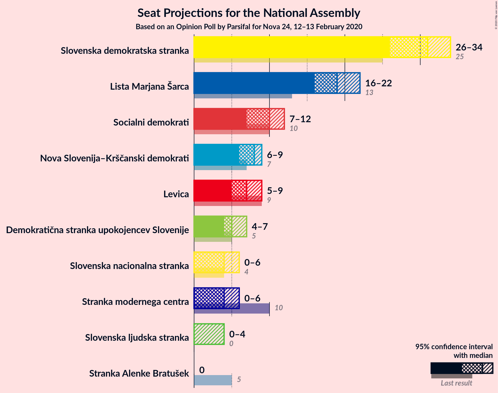
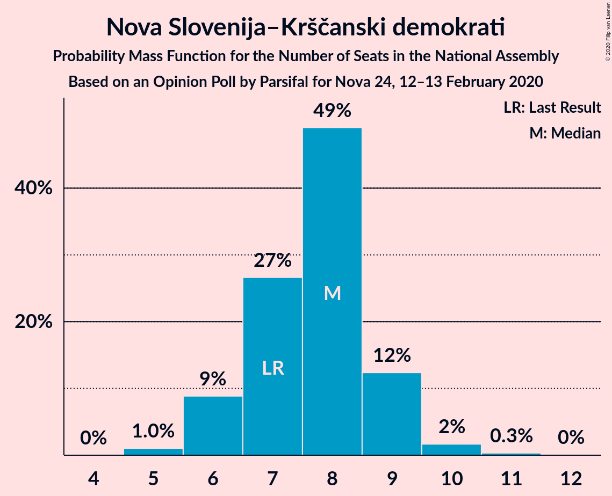
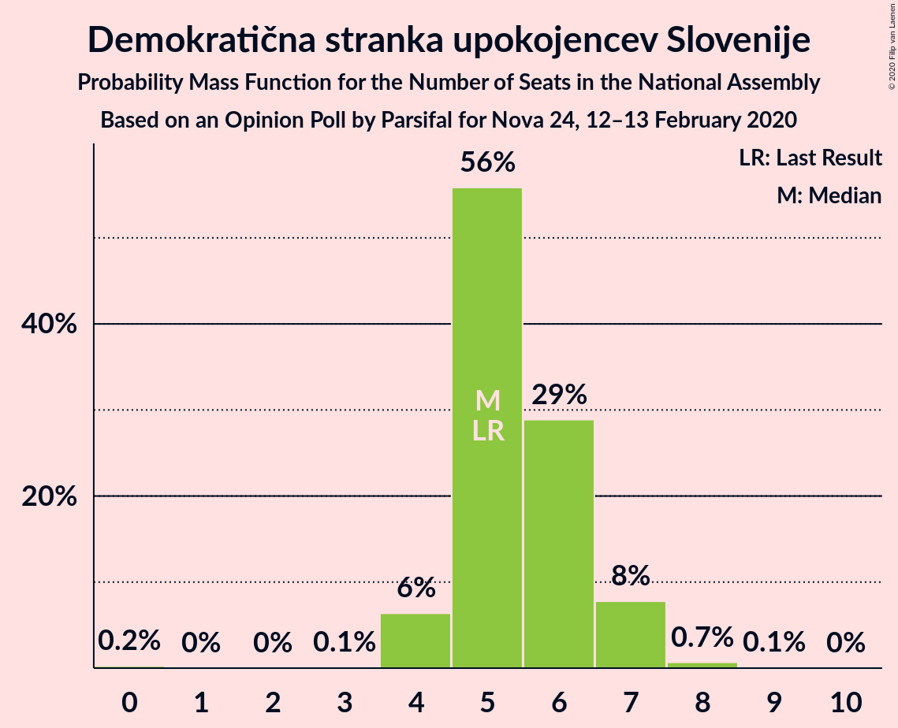
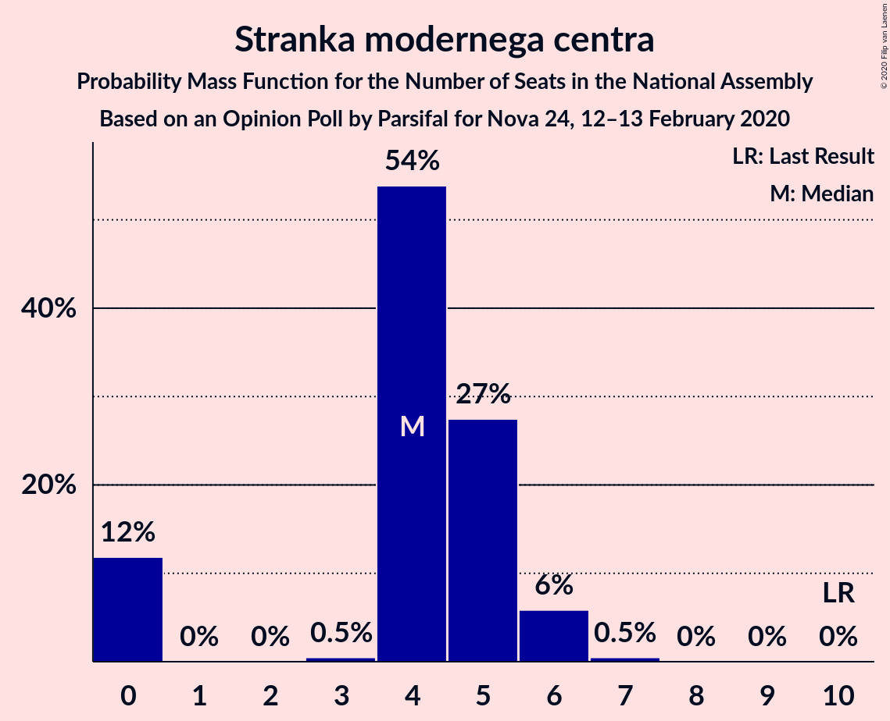
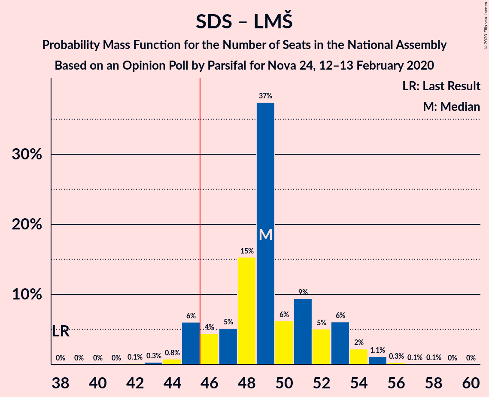
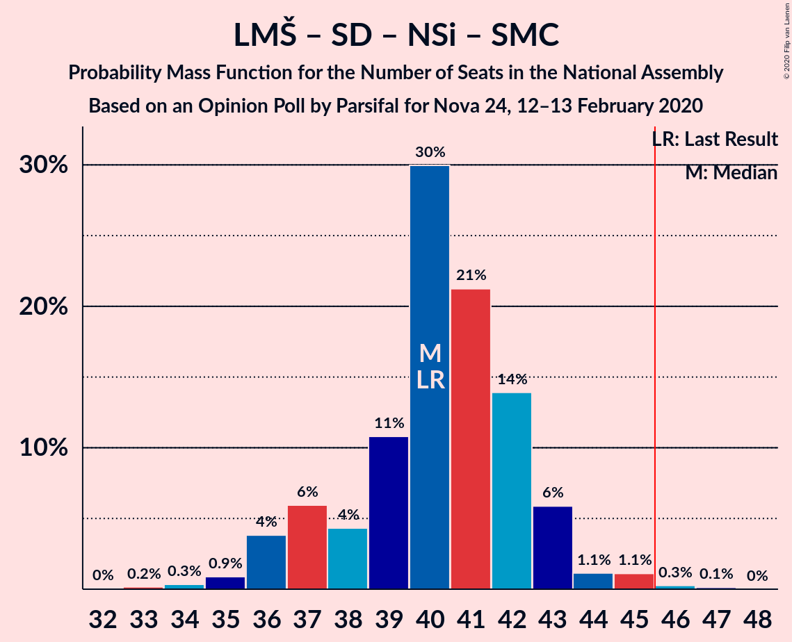

# Opinion Poll by Parsifal for Nova 24, 12–13 February 2020

<a href="#voting-intentions">Voting Intentions</a> | <a href="#seats">Seats</a> | <a href="#coalitions">Coalitions</a> | <a href="#technical-information">Technical Information</a>

## Voting Intentions

### Confidence Intervals

| Party | Last Result | Poll Result | 80% Confidence Interval | 90% Confidence Interval | 95% Confidence Interval | 99% Confidence Interval |
|:-----:|:-----------:|:-----------:|:-----------------------:|:-----------------------:|:-----------------------:|:-----------------------:|
| Slovenska demokratska stranka | 24.9% | 30.8% | 28.7–33.1% |28.1–33.8% |27.6–34.3% |26.6–35.4% |
| Lista Marjana Šarca | 12.6% | 19.6% | 17.8–21.6% |17.3–22.2% |16.9–22.7% |16.1–23.7% |
| Socialni demokrati | 9.9% | 10.0% | 8.7–11.5% |8.3–12.0% |8.0–12.4% |7.4–13.2% |
| Nova Slovenija–Krščanski demokrati | 7.2% | 8.0% | 6.9–9.5% |6.5–9.9% |6.2–10.2% |5.7–11.0% |
| Levica | 9.3% | 7.5% | 6.3–8.9% |6.0–9.3% |5.8–9.6% |5.3–10.3% |
| Demokratična stranka upokojencev Slovenije | 4.9% | 5.9% | 5.0–7.2% |4.7–7.6% |4.5–7.9% |4.0–8.6% |
| Stranka modernega centra | 9.7% | 4.8% | 3.9–6.0% |3.7–6.4% |3.5–6.7% |3.1–7.3% |
| Slovenska nacionalna stranka | 4.2% | 4.6% | 3.7–5.7% |3.5–6.1% |3.3–6.4% |2.9–7.0% |
| Slovenska ljudska stranka | 2.6% | 3.5% | 2.7–4.5% |2.5–4.8% |2.3–5.1% |2.0–5.6% |
| Stranka Alenke Bratušek | 5.1% | 1.8% | 1.3–2.6% |1.2–2.9% |1.1–3.1% |0.9–3.5% |

*Note:* The poll result column reflects the actual value used in the calculations. Published results may vary slightly, and in addition be rounded to fewer digits.

## Seats

### Confidence Intervals

| Party | Last Result | Median | 80% Confidence Interval | 90% Confidence Interval | 95% Confidence Interval | 99% Confidence Interval |
|:-----:|:-----------:|:------:|:-----------------------:|:-----------------------:|:-----------------------:|:-----------------------:|
| <a href="#slovenska-demokratska-stranka">Slovenska demokratska stranka</a> | 25 | 30 | 28–32 |27–33 |27–35 |26–35 |
| <a href="#lista-marjana-šarca">Lista Marjana Šarca</a> | 13 | 18 | 18–19 |17–20 |15–22 |15–23 |
| <a href="#socialni-demokrati">Socialni demokrati</a> | 10 | 9 | 9–10 |9–10 |8–11 |8–13 |
| <a href="#nova-slovenija–krščanski-demokrati">Nova Slovenija–Krščanski demokrati</a> | 7 | 8 | 7–9 |7–10 |5–10 |5–12 |
| <a href="#levica">Levica</a> | 9 | 7 | 6–8 |6–8 |5–9 |5–9 |
| <a href="#demokratična-stranka-upokojencev-slovenije">Demokratična stranka upokojencev Slovenije</a> | 5 | 6 | 5–7 |4–7 |4–7 |4–7 |
| <a href="#stranka-modernega-centra">Stranka modernega centra</a> | 10 | 6 | 3–6 |0–6 |0–6 |0–6 |
| <a href="#slovenska-nacionalna-stranka">Slovenska nacionalna stranka</a> | 4 | 4 | 0–4 |0–5 |0–5 |0–6 |
| <a href="#slovenska-ljudska-stranka">Slovenska ljudska stranka</a> | 0 | 0 | 0–4 |0–4 |0–4 |0–5 |
| <a href="#stranka-alenke-bratušek">Stranka Alenke Bratušek</a> | 5 | 0 | 0 |0 |0 |0 |

### Slovenska demokratska stranka

*For a full overview of the results for this party, see the [Slovenska demokratska stranka](party-slovenskademokratskastranka.html) page.*

| Number of Seats | Probability | Accumulated | Special Marks |
|:---------------:|:-----------:|:-----------:|:-------------:|
| 25 | 0.1% | 100% | Last Result |
| 26 | 0.4% | 99.9% |  |
| 27 | 7% | 99.5% |  |
| 28 | 7% | 92% |  |
| 29 | 0.5% | 85% |  |
| 30 | 71% | 85% | Median |
| 31 | 0.8% | 14% |  |
| 32 | 6% | 13% |  |
| 33 | 3% | 7% |  |
| 34 | 0% | 4% |  |
| 35 | 4% | 4% |  |
| 36 | 0% | 0% |  |

### Lista Marjana Šarca

*For a full overview of the results for this party, see the [Lista Marjana Šarca](party-listamarjanašarca.html) page.*

| Number of Seats | Probability | Accumulated | Special Marks |
|:---------------:|:-----------:|:-----------:|:-------------:|
| 13 | 0% | 100% | Last Result |
| 14 | 0% | 100% |  |
| 15 | 3% | 100% |  |
| 16 | 0.3% | 97% |  |
| 17 | 3% | 96% |  |
| 18 | 75% | 93% | Median |
| 19 | 12% | 18% |  |
| 20 | 3% | 6% |  |
| 21 | 0.2% | 3% |  |
| 22 | 1.4% | 3% |  |
| 23 | 1.3% | 1.4% |  |
| 24 | 0% | 0% |  |

### Socialni demokrati

*For a full overview of the results for this party, see the [Socialni demokrati](party-socialnidemokrati.html) page.*

| Number of Seats | Probability | Accumulated | Special Marks |
|:---------------:|:-----------:|:-----------:|:-------------:|
| 7 | 0.3% | 100% |  |
| 8 | 3% | 99.7% |  |
| 9 | 78% | 97% | Median |
| 10 | 16% | 19% | Last Result |
| 11 | 2% | 3% |  |
| 12 | 0% | 0.6% |  |
| 13 | 0.5% | 0.6% |  |
| 14 | 0.1% | 0.1% |  |
| 15 | 0% | 0% |  |

### Nova Slovenija–Krščanski demokrati

*For a full overview of the results for this party, see the [Nova Slovenija–Krščanski demokrati](party-novaslovenija–krščanskidemokrati.html) page.*

| Number of Seats | Probability | Accumulated | Special Marks |
|:---------------:|:-----------:|:-----------:|:-------------:|
| 5 | 4% | 100% |  |
| 6 | 0.4% | 96% |  |
| 7 | 8% | 95% | Last Result |
| 8 | 74% | 87% | Median |
| 9 | 5% | 13% |  |
| 10 | 6% | 8% |  |
| 11 | 0% | 2% |  |
| 12 | 2% | 2% |  |
| 13 | 0% | 0% |  |

### Levica

*For a full overview of the results for this party, see the [Levica](party-levica.html) page.*

| Number of Seats | Probability | Accumulated | Special Marks |
|:---------------:|:-----------:|:-----------:|:-------------:|
| 4 | 0.1% | 100% |  |
| 5 | 3% | 99.9% |  |
| 6 | 14% | 96% |  |
| 7 | 68% | 82% | Median |
| 8 | 11% | 14% |  |
| 9 | 3% | 3% | Last Result |
| 10 | 0.1% | 0.1% |  |
| 11 | 0% | 0% |  |

### Demokratična stranka upokojencev Slovenije

*For a full overview of the results for this party, see the [Demokratična stranka upokojencev Slovenije](party-demokratičnastrankaupokojencevslovenije.html) page.*

| Number of Seats | Probability | Accumulated | Special Marks |
|:---------------:|:-----------:|:-----------:|:-------------:|
| 0 | 0.2% | 100% |  |
| 1 | 0% | 99.8% |  |
| 2 | 0% | 99.8% |  |
| 3 | 0% | 99.8% |  |
| 4 | 6% | 99.8% |  |
| 5 | 9% | 93% | Last Result |
| 6 | 72% | 84% | Median |
| 7 | 12% | 12% |  |
| 8 | 0.2% | 0.3% |  |
| 9 | 0.1% | 0.1% |  |
| 10 | 0% | 0% |  |

### Stranka modernega centra

*For a full overview of the results for this party, see the [Stranka modernega centra](party-strankamodernegacentra.html) page.*

| Number of Seats | Probability | Accumulated | Special Marks |
|:---------------:|:-----------:|:-----------:|:-------------:|
| 0 | 9% | 100% |  |
| 1 | 0% | 91% |  |
| 2 | 0% | 91% |  |
| 3 | 2% | 91% |  |
| 4 | 14% | 89% |  |
| 5 | 3% | 75% |  |
| 6 | 72% | 72% | Median |
| 7 | 0.2% | 0.2% |  |
| 8 | 0% | 0% |  |
| 9 | 0% | 0% |  |
| 10 | 0% | 0% | Last Result |

### Slovenska nacionalna stranka

*For a full overview of the results for this party, see the [Slovenska nacionalna stranka](party-slovenskanacionalnastranka.html) page.*

| Number of Seats | Probability | Accumulated | Special Marks |
|:---------------:|:-----------:|:-----------:|:-------------:|
| 0 | 15% | 100% |  |
| 1 | 0% | 85% |  |
| 2 | 0% | 85% |  |
| 3 | 0% | 85% |  |
| 4 | 78% | 85% | Last Result, Median |
| 5 | 5% | 7% |  |
| 6 | 2% | 2% |  |
| 7 | 0.2% | 0.2% |  |
| 8 | 0% | 0% |  |

### Slovenska ljudska stranka

*For a full overview of the results for this party, see the [Slovenska ljudska stranka](party-slovenskaljudskastranka.html) page.*

| Number of Seats | Probability | Accumulated | Special Marks |
|:---------------:|:-----------:|:-----------:|:-------------:|
| 0 | 81% | 100% | Last Result, Median |
| 1 | 0% | 19% |  |
| 2 | 0% | 19% |  |
| 3 | 3% | 19% |  |
| 4 | 14% | 16% |  |
| 5 | 2% | 2% |  |
| 6 | 0% | 0% |  |

### Stranka Alenke Bratušek

*For a full overview of the results for this party, see the [Stranka Alenke Bratušek](party-strankaalenkebratušek.html) page.*

| Number of Seats | Probability | Accumulated | Special Marks |
|:---------------:|:-----------:|:-----------:|:-------------:|
| 0 | 100% | 100% | Median |
| 1 | 0% | 0% |  |
| 2 | 0% | 0% |  |
| 3 | 0% | 0% |  |
| 4 | 0% | 0% |  |
| 5 | 0% | 0% | Last Result |

## Coalitions

### Confidence Intervals

| Coalition | Last Result | Median | Majority? | 80% Confidence Interval | 90% Confidence Interval | 95% Confidence Interval | 99% Confidence Interval |
|:---------:|:-----------:|:------:|:---------:|:-----------------------:|:-----------------------:|:-----------------------:|:-----------------------:|
| Slovenska demokratska stranka – Lista Marjana Šarca – Demokratična stranka upokojencev Slovenije | 43 | 54 | 100% | 51–57 | 51–59 | 49–60 | 49–62 |
| Slovenska demokratska stranka – Lista Marjana Šarca | 38 | 48 | 96% | 47–50 | 46–53 | 42–54 | 42–57 |
| Lista Marjana Šarca – Socialni demokrati – Nova Slovenija–Krščanski demokrati – Demokratična stranka upokojencev Slovenije – Stranka modernega centra – Stranka Alenke Bratušek | 50 | 47 | 83% | 44–47 | 43–47 | 41–48 | 41–50 |
| Lista Marjana Šarca – Socialni demokrati – Nova Slovenija–Krščanski demokrati – Demokratična stranka upokojencev Slovenije – Stranka modernega centra | 45 | 47 | 83% | 44–47 | 43–47 | 41–48 | 41–50 |
| Lista Marjana Šarca – Socialni demokrati – Nova Slovenija–Krščanski demokrati – Demokratična stranka upokojencev Slovenije | 35 | 41 | 3% | 40–44 | 40–44 | 37–46 | 37–46 |
| Lista Marjana Šarca – Socialni demokrati – Nova Slovenija–Krščanski demokrati – Stranka modernega centra | 40 | 41 | 2% | 37–41 | 37–42 | 36–42 | 36–46 |
| Lista Marjana Šarca – Socialni demokrati – Nova Slovenija–Krščanski demokrati | 30 | 35 | 0% | 35–37 | 33–37 | 32–40 | 32–42 |
| Lista Marjana Šarca – Socialni demokrati – Demokratična stranka upokojencev Slovenije – Stranka modernega centra – Stranka Alenke Bratušek | 43 | 39 | 0% | 36–39 | 34–39 | 34–39 | 34–41 |
| Lista Marjana Šarca – Socialni demokrati – Demokratična stranka upokojencev Slovenije – Stranka modernega centra | 38 | 39 | 0% | 36–39 | 34–39 | 34–39 | 34–41 |
| Lista Marjana Šarca – Socialni demokrati – Demokratična stranka upokojencev Slovenije | 28 | 33 | 0% | 33–34 | 32–35 | 31–37 | 31–37 |
| Lista Marjana Šarca – Socialni demokrati – Stranka modernega centra | 33 | 33 | 0% | 31–34 | 27–35 | 27–35 | 27–35 |
| Lista Marjana Šarca – Socialni demokrati | 23 | 27 | 0% | 27–29 | 27–30 | 24–31 | 24–31 |
| Socialni demokrati – Demokratična stranka upokojencev Slovenije – Stranka modernega centra | 25 | 21 | 0% | 18–21 | 16–21 | 14–21 | 14–24 |

### Slovenska demokratska stranka – Lista Marjana Šarca – Demokratična stranka upokojencev Slovenije

| Number of Seats | Probability | Accumulated | Special Marks |
|:---------------:|:-----------:|:-----------:|:-------------:|
| 43 | 0% | 100% | Last Result |
| 44 | 0% | 100% |  |
| 45 | 0% | 100% |  |
| 46 | 0% | 100% | Majority |
| 47 | 0% | 100% |  |
| 48 | 0.1% | 100% |  |
| 49 | 4% | 99.9% |  |
| 50 | 0.2% | 96% |  |
| 51 | 8% | 96% |  |
| 52 | 0.6% | 88% |  |
| 53 | 1.2% | 87% |  |
| 54 | 71% | 86% | Median |
| 55 | 3% | 15% |  |
| 56 | 0.1% | 12% |  |
| 57 | 6% | 12% |  |
| 58 | 0.1% | 6% |  |
| 59 | 1.3% | 6% |  |
| 60 | 3% | 4% |  |
| 61 | 0.1% | 1.4% |  |
| 62 | 1.3% | 1.3% |  |
| 63 | 0% | 0% |  |

### Slovenska demokratska stranka – Lista Marjana Šarca

| Number of Seats | Probability | Accumulated | Special Marks |
|:---------------:|:-----------:|:-----------:|:-------------:|
| 38 | 0% | 100% | Last Result |
| 39 | 0% | 100% |  |
| 40 | 0% | 100% |  |
| 41 | 0% | 100% |  |
| 42 | 3% | 100% |  |
| 43 | 0.1% | 97% |  |
| 44 | 0.1% | 97% |  |
| 45 | 0.2% | 96% |  |
| 46 | 5% | 96% | Majority |
| 47 | 6% | 91% |  |
| 48 | 67% | 85% | Median |
| 49 | 0.4% | 17% |  |
| 50 | 11% | 17% |  |
| 51 | 0.3% | 6% |  |
| 52 | 0.1% | 6% |  |
| 53 | 1.4% | 6% |  |
| 54 | 3% | 4% |  |
| 55 | 0% | 1.3% |  |
| 56 | 0% | 1.3% |  |
| 57 | 1.3% | 1.3% |  |
| 58 | 0% | 0% |  |

### Lista Marjana Šarca – Socialni demokrati – Nova Slovenija–Krščanski demokrati – Demokratična stranka upokojencev Slovenije – Stranka modernega centra – Stranka Alenke Bratušek

| Number of Seats | Probability | Accumulated | Special Marks |
|:---------------:|:-----------:|:-----------:|:-------------:|
| 39 | 0% | 100% |  |
| 40 | 0% | 99.9% |  |
| 41 | 5% | 99.9% |  |
| 42 | 0% | 95% |  |
| 43 | 0.6% | 95% |  |
| 44 | 9% | 95% |  |
| 45 | 3% | 86% |  |
| 46 | 6% | 83% | Majority |
| 47 | 72% | 76% | Median |
| 48 | 2% | 4% |  |
| 49 | 0.2% | 2% |  |
| 50 | 2% | 2% | Last Result |
| 51 | 0% | 0% |  |

### Lista Marjana Šarca – Socialni demokrati – Nova Slovenija–Krščanski demokrati – Demokratična stranka upokojencev Slovenije – Stranka modernega centra

| Number of Seats | Probability | Accumulated | Special Marks |
|:---------------:|:-----------:|:-----------:|:-------------:|
| 38 | 0% | 100% |  |
| 39 | 0% | 99.9% |  |
| 40 | 0% | 99.9% |  |
| 41 | 5% | 99.9% |  |
| 42 | 0% | 95% |  |
| 43 | 0.6% | 95% |  |
| 44 | 9% | 95% |  |
| 45 | 3% | 86% | Last Result |
| 46 | 6% | 83% | Majority |
| 47 | 72% | 76% | Median |
| 48 | 2% | 4% |  |
| 49 | 0.2% | 2% |  |
| 50 | 2% | 2% |  |
| 51 | 0% | 0% |  |

### Lista Marjana Šarca – Socialni demokrati – Nova Slovenija–Krščanski demokrati – Demokratična stranka upokojencev Slovenije

| Number of Seats | Probability | Accumulated | Special Marks |
|:---------------:|:-----------:|:-----------:|:-------------:|
| 35 | 0% | 100% | Last Result |
| 36 | 0.3% | 99.9% |  |
| 37 | 3% | 99.7% |  |
| 38 | 0.1% | 97% |  |
| 39 | 0.7% | 97% |  |
| 40 | 8% | 96% |  |
| 41 | 70% | 88% | Median |
| 42 | 4% | 18% |  |
| 43 | 4% | 14% |  |
| 44 | 7% | 11% |  |
| 45 | 0.3% | 3% |  |
| 46 | 3% | 3% | Majority |
| 47 | 0% | 0.1% |  |
| 48 | 0% | 0% |  |

### Lista Marjana Šarca – Socialni demokrati – Nova Slovenija–Krščanski demokrati – Stranka modernega centra

| Number of Seats | Probability | Accumulated | Special Marks |
|:---------------:|:-----------:|:-----------:|:-------------:|
| 34 | 0% | 100% |  |
| 35 | 0.1% | 99.9% |  |
| 36 | 4% | 99.8% |  |
| 37 | 9% | 95% |  |
| 38 | 2% | 86% |  |
| 39 | 0.1% | 85% |  |
| 40 | 3% | 85% | Last Result |
| 41 | 72% | 81% | Median |
| 42 | 7% | 9% |  |
| 43 | 0.1% | 2% |  |
| 44 | 0.1% | 2% |  |
| 45 | 0.1% | 2% |  |
| 46 | 2% | 2% | Majority |
| 47 | 0% | 0% |  |

### Lista Marjana Šarca – Socialni demokrati – Nova Slovenija–Krščanski demokrati

| Number of Seats | Probability | Accumulated | Special Marks |
|:---------------:|:-----------:|:-----------:|:-------------:|
| 30 | 0% | 100% | Last Result |
| 31 | 0% | 99.9% |  |
| 32 | 3% | 99.9% |  |
| 33 | 3% | 97% |  |
| 34 | 2% | 94% |  |
| 35 | 68% | 92% | Median |
| 36 | 6% | 24% |  |
| 37 | 14% | 18% |  |
| 38 | 0.2% | 4% |  |
| 39 | 0.1% | 3% |  |
| 40 | 1.4% | 3% |  |
| 41 | 0% | 2% |  |
| 42 | 2% | 2% |  |
| 43 | 0% | 0% |  |

### Lista Marjana Šarca – Socialni demokrati – Demokratična stranka upokojencev Slovenije – Stranka modernega centra – Stranka Alenke Bratušek

| Number of Seats | Probability | Accumulated | Special Marks |
|:---------------:|:-----------:|:-----------:|:-------------:|
| 32 | 0% | 100% |  |
| 33 | 0% | 99.9% |  |
| 34 | 6% | 99.9% |  |
| 35 | 3% | 94% |  |
| 36 | 5% | 90% |  |
| 37 | 3% | 86% |  |
| 38 | 3% | 82% |  |
| 39 | 77% | 79% | Median |
| 40 | 0.1% | 2% |  |
| 41 | 2% | 2% |  |
| 42 | 0% | 0.2% |  |
| 43 | 0.1% | 0.2% | Last Result |
| 44 | 0% | 0% |  |

### Lista Marjana Šarca – Socialni demokrati – Demokratična stranka upokojencev Slovenije – Stranka modernega centra

| Number of Seats | Probability | Accumulated | Special Marks |
|:---------------:|:-----------:|:-----------:|:-------------:|
| 32 | 0% | 100% |  |
| 33 | 0% | 99.9% |  |
| 34 | 6% | 99.9% |  |
| 35 | 3% | 94% |  |
| 36 | 5% | 90% |  |
| 37 | 3% | 86% |  |
| 38 | 3% | 82% | Last Result |
| 39 | 77% | 79% | Median |
| 40 | 0.1% | 2% |  |
| 41 | 2% | 2% |  |
| 42 | 0% | 0.2% |  |
| 43 | 0.1% | 0.2% |  |
| 44 | 0% | 0% |  |

### Lista Marjana Šarca – Socialni demokrati – Demokratična stranka upokojencev Slovenije

| Number of Seats | Probability | Accumulated | Special Marks |
|:---------------:|:-----------:|:-----------:|:-------------:|
| 28 | 0% | 100% | Last Result |
| 29 | 0.2% | 100% |  |
| 30 | 0.2% | 99.7% |  |
| 31 | 3% | 99.5% |  |
| 32 | 3% | 96% |  |
| 33 | 72% | 93% | Median |
| 34 | 12% | 20% |  |
| 35 | 3% | 8% |  |
| 36 | 2% | 5% |  |
| 37 | 3% | 3% |  |
| 38 | 0.1% | 0.3% |  |
| 39 | 0.2% | 0.2% |  |
| 40 | 0% | 0% |  |

### Lista Marjana Šarca – Socialni demokrati – Stranka modernega centra

| Number of Seats | Probability | Accumulated | Special Marks |
|:---------------:|:-----------:|:-----------:|:-------------:|
| 26 | 0% | 100% |  |
| 27 | 6% | 99.9% |  |
| 28 | 3% | 94% |  |
| 29 | 0.1% | 91% |  |
| 30 | 0.2% | 91% |  |
| 31 | 7% | 90% |  |
| 32 | 2% | 83% |  |
| 33 | 71% | 81% | Last Result, Median |
| 34 | 5% | 11% |  |
| 35 | 5% | 5% |  |
| 36 | 0.2% | 0.3% |  |
| 37 | 0% | 0.1% |  |
| 38 | 0% | 0% |  |

### Lista Marjana Šarca – Socialni demokrati

| Number of Seats | Probability | Accumulated | Special Marks |
|:---------------:|:-----------:|:-----------:|:-------------:|
| 23 | 0% | 100% | Last Result |
| 24 | 3% | 100% |  |
| 25 | 0.2% | 97% |  |
| 26 | 0.4% | 97% |  |
| 27 | 78% | 96% | Median |
| 28 | 0.6% | 19% |  |
| 29 | 11% | 18% |  |
| 30 | 4% | 7% |  |
| 31 | 3% | 3% |  |
| 32 | 0.2% | 0.3% |  |
| 33 | 0% | 0.1% |  |
| 34 | 0% | 0% |  |

### Socialni demokrati – Demokratična stranka upokojencev Slovenije – Stranka modernega centra

| Number of Seats | Probability | Accumulated | Special Marks |
|:---------------:|:-----------:|:-----------:|:-------------:|
| 13 | 0% | 100% |  |
| 14 | 3% | 99.9% |  |
| 15 | 0.4% | 97% |  |
| 16 | 6% | 97% |  |
| 17 | 0.7% | 91% |  |
| 18 | 4% | 90% |  |
| 19 | 4% | 87% |  |
| 20 | 11% | 83% |  |
| 21 | 71% | 72% | Median |
| 22 | 0.2% | 0.9% |  |
| 23 | 0.2% | 0.7% |  |
| 24 | 0.5% | 0.5% |  |
| 25 | 0% | 0% | Last Result |

## Technical Information

### Opinion Poll

+ **Polling firm:** Parsifal
+ **Commissioner(s):** Nova 24
+ **Fieldwork period:** 12–13 February 2020

### Calculations

+ **Sample size:** 723
+ **Simulations done:** 16,384
+ **Error estimate:** 2.76%

