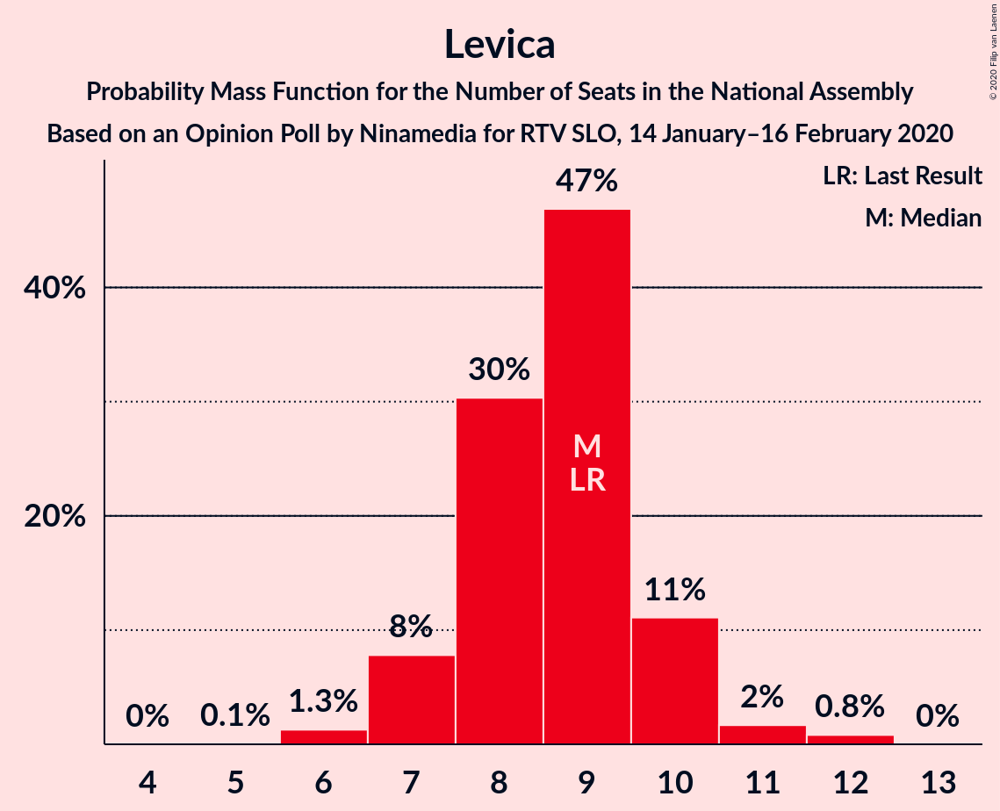
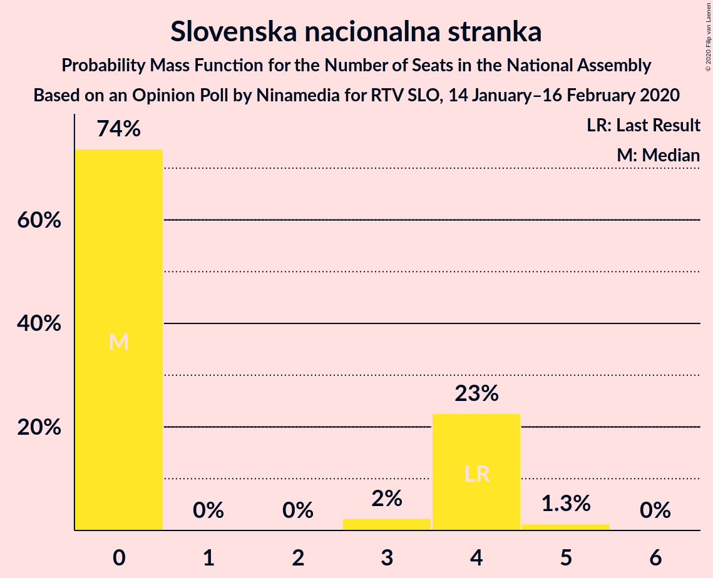
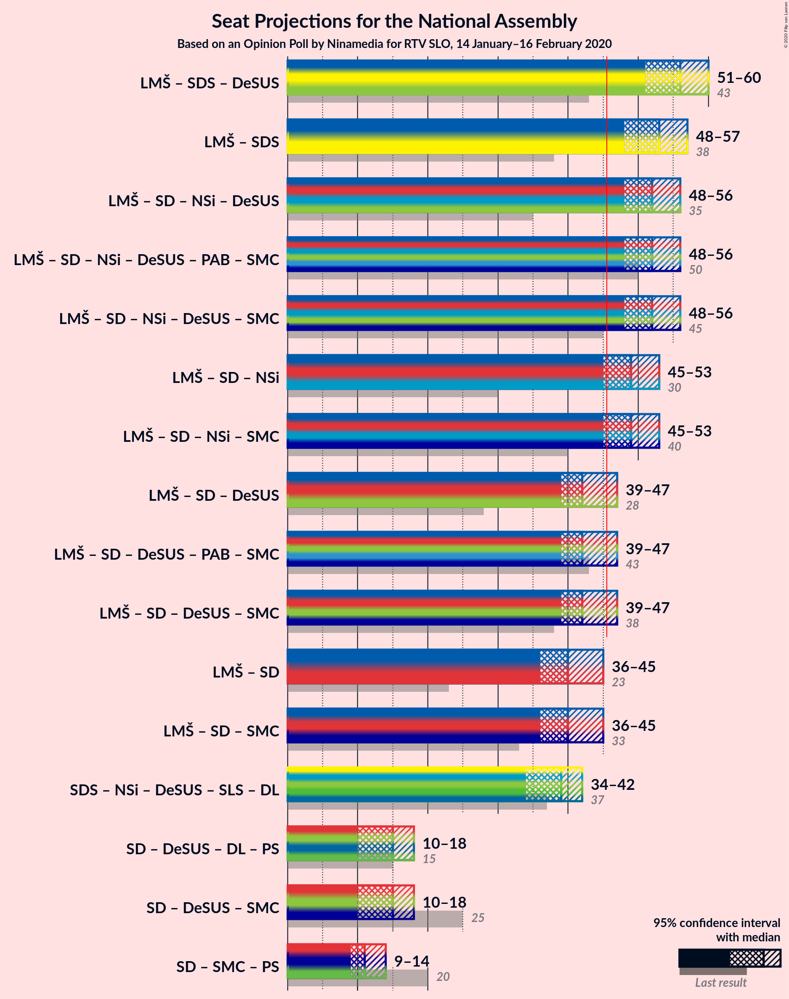
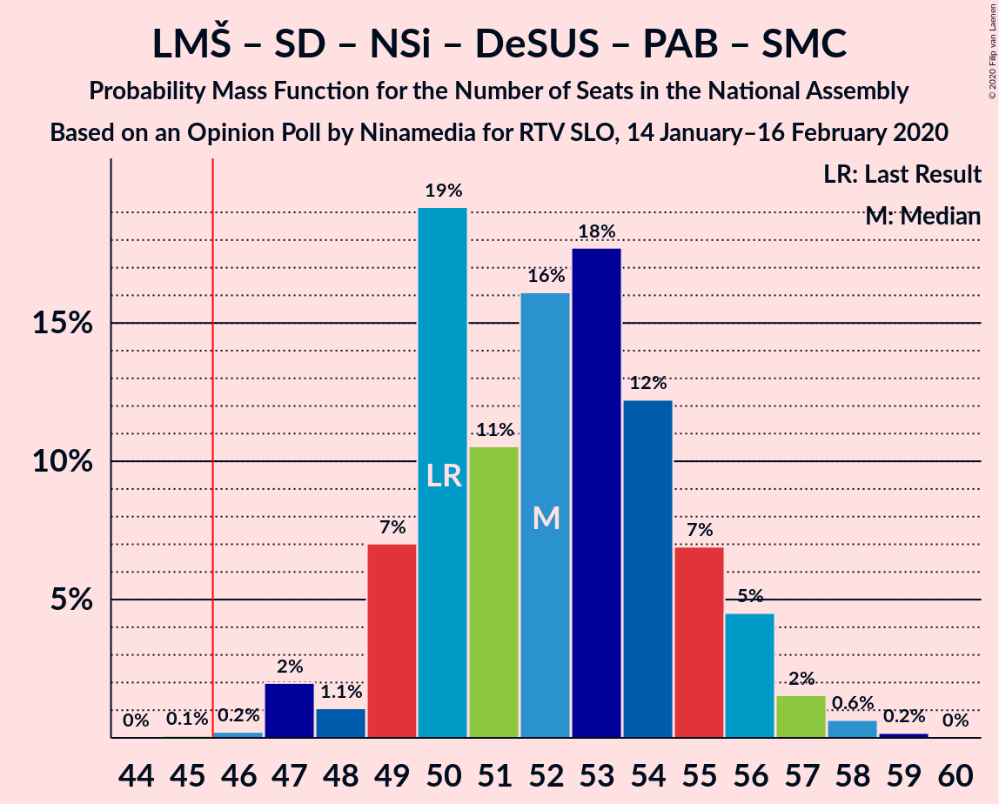
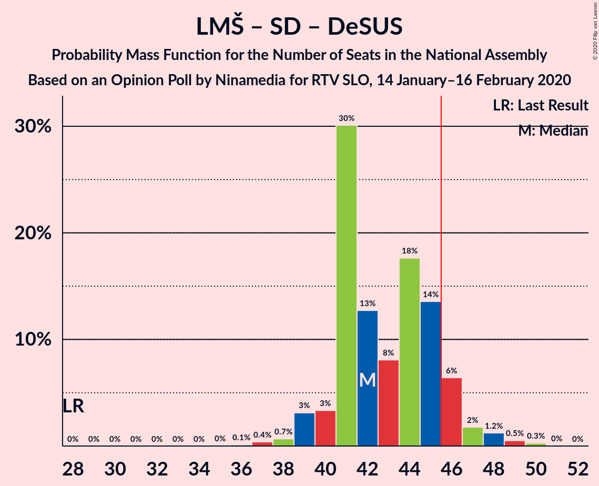
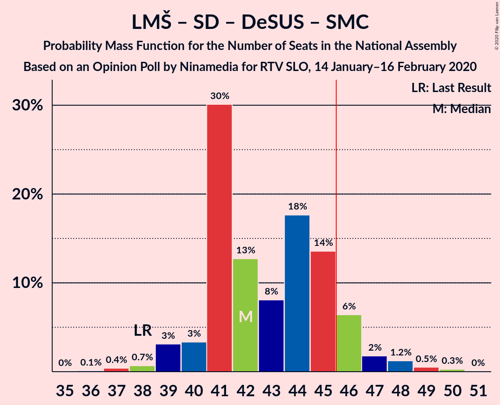
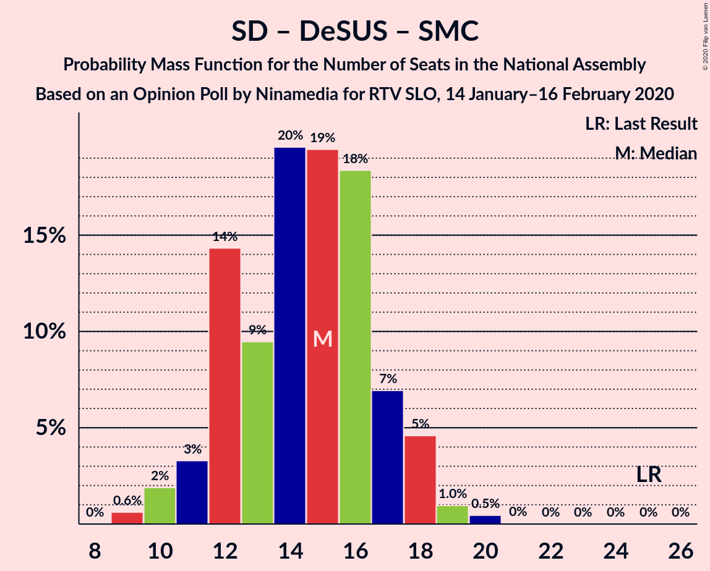

# Opinion Poll by Ninamedia for RTV SLO, 14 January–16 February 2020

<a href="#voting-intentions">Voting Intentions</a> | <a href="#seats">Seats</a> | <a href="#coalitions">Coalitions</a> | <a href="#technical-information">Technical Information</a>

## Voting Intentions

### Confidence Intervals

| Party | Last Result | Poll Result | 80% Confidence Interval | 90% Confidence Interval | 95% Confidence Interval | 99% Confidence Interval |
|:-----:|:-----------:|:-----------:|:-----------------------:|:-----------------------:|:-----------------------:|:-----------------------:|
| Lista Marjana Šarca | 12.6% | 29.1% | 27.0–31.4% |26.4–32.1% |25.9–32.6% |24.9–33.7% |
| Slovenska demokratska stranka | 24.9% | 25.3% | 23.3–27.5% |22.7–28.1% |22.2–28.6% |21.3–29.7% |
| Socialni demokrati | 9.9% | 12.1% | 10.7–13.9% |10.3–14.4% |9.9–14.8% |9.3–15.6% |
| Nova Slovenija–Krščanski demokrati | 7.2% | 9.7% | 8.4–11.3% |8.0–11.8% |7.7–12.1% |7.1–12.9% |
| Levica | 9.3% | 9.0% | 7.7–10.5% |7.4–11.0% |7.1–11.4% |6.5–12.1% |
| Demokratična stranka upokojencev Slovenije | 4.9% | 4.4% | 3.6–5.6% |3.3–5.9% |3.1–6.2% |2.8–6.8% |
| Slovenska ljudska stranka | 2.6% | 3.6% | 2.8–4.6% |2.6–5.0% |2.4–5.2% |2.1–5.8% |
| Slovenska nacionalna stranka | 4.2% | 3.4% | 2.7–4.5% |2.5–4.8% |2.3–5.1% |2.0–5.6% |
| Stranka Alenke Bratušek | 5.1% | 1.1% | 0.8–1.9% |0.7–2.1% |0.6–2.2% |0.4–2.6% |
| Stranka modernega centra | 9.7% | 0.4% | 0.2–1.0% |0.2–1.1% |0.2–1.2% |0.1–1.6% |

*Note:* The poll result column reflects the actual value used in the calculations. Published results may vary slightly, and in addition be rounded to fewer digits.

## Seats

### Confidence Intervals

| Party | Last Result | Median | 80% Confidence Interval | 90% Confidence Interval | 95% Confidence Interval | 99% Confidence Interval |
|:-----:|:-----------:|:------:|:-----------------------:|:-----------------------:|:-----------------------:|:-----------------------:|
| <a href="#lista-marjana-šarca">Lista Marjana Šarca</a> | 13 | 28 | 27–31 |25–31 |25–32 |24–33 |
| <a href="#slovenska-demokratska-stranka">Slovenska demokratska stranka</a> | 25 | 25 | 22–27 |22–27 |21–28 |20–29 |
| <a href="#socialni-demokrati">Socialni demokrati</a> | 10 | 11 | 10–13 |9–14 |9–14 |9–15 |
| <a href="#nova-slovenija–krščanski-demokrati">Nova Slovenija–Krščanski demokrati</a> | 7 | 9 | 8–11 |7–11 |7–11 |7–12 |
| <a href="#levica">Levica</a> | 9 | 9 | 8–10 |7–10 |7–11 |6–12 |
| <a href="#demokratična-stranka-upokojencev-slovenije">Demokratična stranka upokojencev Slovenije</a> | 5 | 4 | 0–5 |0–5 |0–6 |0–6 |
| <a href="#slovenska-ljudska-stranka">Slovenska ljudska stranka</a> | 0 | 0 | 0–4 |0–4 |0–4 |0–5 |
| <a href="#slovenska-nacionalna-stranka">Slovenska nacionalna stranka</a> | 4 | 0 | 0–4 |0–4 |0–4 |0–5 |
| <a href="#stranka-alenke-bratušek">Stranka Alenke Bratušek</a> | 5 | 0 | 0 |0 |0 |0 |
| <a href="#stranka-modernega-centra">Stranka modernega centra</a> | 10 | 0 | 0 |0 |0 |0 |

### Lista Marjana Šarca

*For a full overview of the results for this party, see the [Lista Marjana Šarca](party-listamarjanašarca.html) page.*

| Number of Seats | Probability | Accumulated | Special Marks |
|:---------------:|:-----------:|:-----------:|:-------------:|
| 13 | 0% | 100% | Last Result |
| 14 | 0% | 100% |  |
| 15 | 0% | 100% |  |
| 16 | 0% | 100% |  |
| 17 | 0% | 100% |  |
| 18 | 0% | 100% |  |
| 19 | 0% | 100% |  |
| 20 | 0% | 100% |  |
| 21 | 0% | 100% |  |
| 22 | 0.1% | 100% |  |
| 23 | 0.2% | 99.9% |  |
| 24 | 1.0% | 99.7% |  |
| 25 | 4% | 98.7% |  |
| 26 | 4% | 94% |  |
| 27 | 17% | 90% |  |
| 28 | 25% | 73% | Median |
| 29 | 30% | 48% |  |
| 30 | 8% | 18% |  |
| 31 | 7% | 10% |  |
| 32 | 2% | 3% |  |
| 33 | 0.5% | 0.9% |  |
| 34 | 0.3% | 0.4% |  |
| 35 | 0.1% | 0.1% |  |
| 36 | 0% | 0% |  |

### Slovenska demokratska stranka

*For a full overview of the results for this party, see the [Slovenska demokratska stranka](party-slovenskademokratskastranka.html) page.*

| Number of Seats | Probability | Accumulated | Special Marks |
|:---------------:|:-----------:|:-----------:|:-------------:|
| 19 | 0.1% | 100% |  |
| 20 | 0.8% | 99.9% |  |
| 21 | 3% | 99.1% |  |
| 22 | 8% | 96% |  |
| 23 | 11% | 88% |  |
| 24 | 9% | 77% |  |
| 25 | 23% | 68% | Last Result, Median |
| 26 | 26% | 45% |  |
| 27 | 17% | 20% |  |
| 28 | 2% | 3% |  |
| 29 | 0.7% | 1.2% |  |
| 30 | 0.4% | 0.5% |  |
| 31 | 0.1% | 0.1% |  |
| 32 | 0% | 0% |  |

### Socialni demokrati

*For a full overview of the results for this party, see the [Socialni demokrati](party-socialnidemokrati.html) page.*

| Number of Seats | Probability | Accumulated | Special Marks |
|:---------------:|:-----------:|:-----------:|:-------------:|
| 8 | 0.2% | 100% |  |
| 9 | 8% | 99.8% |  |
| 10 | 13% | 91% | Last Result |
| 11 | 35% | 78% | Median |
| 12 | 28% | 43% |  |
| 13 | 8% | 14% |  |
| 14 | 5% | 6% |  |
| 15 | 1.3% | 2% |  |
| 16 | 0.2% | 0.3% |  |
| 17 | 0% | 0% |  |

### Nova Slovenija–Krščanski demokrati

*For a full overview of the results for this party, see the [Nova Slovenija–Krščanski demokrati](party-novaslovenija–krščanskidemokrati.html) page.*

| Number of Seats | Probability | Accumulated | Special Marks |
|:---------------:|:-----------:|:-----------:|:-------------:|
| 6 | 0.2% | 100% |  |
| 7 | 6% | 99.8% | Last Result |
| 8 | 17% | 93% |  |
| 9 | 38% | 76% | Median |
| 10 | 20% | 38% |  |
| 11 | 16% | 18% |  |
| 12 | 1.5% | 2% |  |
| 13 | 0.3% | 0.3% |  |
| 14 | 0% | 0% |  |

### Levica

*For a full overview of the results for this party, see the [Levica](party-levica.html) page.*

| Number of Seats | Probability | Accumulated | Special Marks |
|:---------------:|:-----------:|:-----------:|:-------------:|
| 5 | 0.1% | 100% |  |
| 6 | 1.3% | 99.9% |  |
| 7 | 8% | 98.6% |  |
| 8 | 30% | 91% |  |
| 9 | 47% | 60% | Last Result, Median |
| 10 | 11% | 14% |  |
| 11 | 2% | 3% |  |
| 12 | 0.8% | 0.8% |  |
| 13 | 0% | 0% |  |

### Demokratična stranka upokojencev Slovenije

*For a full overview of the results for this party, see the [Demokratična stranka upokojencev Slovenije](party-demokratičnastrankaupokojencevslovenije.html) page.*

| Number of Seats | Probability | Accumulated | Special Marks |
|:---------------:|:-----------:|:-----------:|:-------------:|
| 0 | 25% | 100% |  |
| 1 | 0% | 75% |  |
| 2 | 0% | 75% |  |
| 3 | 11% | 75% |  |
| 4 | 44% | 64% | Median |
| 5 | 17% | 19% | Last Result |
| 6 | 2% | 3% |  |
| 7 | 0.2% | 0.2% |  |
| 8 | 0% | 0% |  |

### Slovenska ljudska stranka

*For a full overview of the results for this party, see the [Slovenska ljudska stranka](party-slovenskaljudskastranka.html) page.*

| Number of Seats | Probability | Accumulated | Special Marks |
|:---------------:|:-----------:|:-----------:|:-------------:|
| 0 | 69% | 100% | Last Result, Median |
| 1 | 0% | 31% |  |
| 2 | 0% | 31% |  |
| 3 | 4% | 31% |  |
| 4 | 26% | 28% |  |
| 5 | 2% | 2% |  |
| 6 | 0.1% | 0.1% |  |
| 7 | 0% | 0% |  |

### Slovenska nacionalna stranka

*For a full overview of the results for this party, see the [Slovenska nacionalna stranka](party-slovenskanacionalnastranka.html) page.*

| Number of Seats | Probability | Accumulated | Special Marks |
|:---------------:|:-----------:|:-----------:|:-------------:|
| 0 | 74% | 100% | Median |
| 1 | 0% | 26% |  |
| 2 | 0% | 26% |  |
| 3 | 2% | 26% |  |
| 4 | 23% | 24% | Last Result |
| 5 | 1.3% | 1.3% |  |
| 6 | 0% | 0% |  |

### Stranka Alenke Bratušek

*For a full overview of the results for this party, see the [Stranka Alenke Bratušek](party-strankaalenkebratušek.html) page.*

| Number of Seats | Probability | Accumulated | Special Marks |
|:---------------:|:-----------:|:-----------:|:-------------:|
| 0 | 100% | 100% | Median |
| 1 | 0% | 0% |  |
| 2 | 0% | 0% |  |
| 3 | 0% | 0% |  |
| 4 | 0% | 0% |  |
| 5 | 0% | 0% | Last Result |

### Stranka modernega centra

*For a full overview of the results for this party, see the [Stranka modernega centra](party-strankamodernegacentra.html) page.*

| Number of Seats | Probability | Accumulated | Special Marks |
|:---------------:|:-----------:|:-----------:|:-------------:|
| 0 | 100% | 100% | Median |
| 1 | 0% | 0% |  |
| 2 | 0% | 0% |  |
| 3 | 0% | 0% |  |
| 4 | 0% | 0% |  |
| 5 | 0% | 0% |  |
| 6 | 0% | 0% |  |
| 7 | 0% | 0% |  |
| 8 | 0% | 0% |  |
| 9 | 0% | 0% |  |
| 10 | 0% | 0% | Last Result |

## Coalitions

### Confidence Intervals

| Coalition | Last Result | Median | Majority? | 80% Confidence Interval | 90% Confidence Interval | 95% Confidence Interval | 99% Confidence Interval |
|:---------:|:-----------:|:------:|:---------:|:-----------------------:|:-----------------------:|:-----------------------:|:-----------------------:|
| Lista Marjana Šarca – Slovenska demokratska stranka – Demokratična stranka upokojencev Slovenije | 43 | 56 | 100% | 53–59 | 52–60 | 51–60 | 50–61 |
| Lista Marjana Šarca – Slovenska demokratska stranka | 38 | 53 | 100% | 50–56 | 49–56 | 48–57 | 47–59 |
| Lista Marjana Šarca – Socialni demokrati – Nova Slovenija–Krščanski demokrati – Demokratična stranka upokojencev Slovenije | 35 | 52 | 99.9% | 49–55 | 49–56 | 48–56 | 47–58 |
| Lista Marjana Šarca – Socialni demokrati – Nova Slovenija–Krščanski demokrati – Demokratična stranka upokojencev Slovenije – Stranka Alenke Bratušek – Stranka modernega centra | 50 | 52 | 99.9% | 49–55 | 49–56 | 48–56 | 47–58 |
| Lista Marjana Šarca – Socialni demokrati – Nova Slovenija–Krščanski demokrati – Demokratična stranka upokojencev Slovenije – Stranka modernega centra | 45 | 52 | 99.9% | 49–55 | 49–56 | 48–56 | 47–58 |
| Lista Marjana Šarca – Socialni demokrati – Nova Slovenija–Krščanski demokrati | 30 | 49 | 91% | 46–52 | 45–52 | 45–53 | 44–55 |
| Lista Marjana Šarca – Socialni demokrati – Nova Slovenija–Krščanski demokrati – Stranka modernega centra | 40 | 49 | 91% | 46–52 | 45–52 | 45–53 | 44–55 |
| Lista Marjana Šarca – Socialni demokrati – Demokratična stranka upokojencev Slovenije | 28 | 42 | 10% | 41–46 | 40–46 | 39–47 | 37–49 |
| Lista Marjana Šarca – Socialni demokrati – Demokratična stranka upokojencev Slovenije – Stranka Alenke Bratušek – Stranka modernega centra | 43 | 42 | 10% | 41–46 | 40–46 | 39–47 | 37–49 |
| Lista Marjana Šarca – Socialni demokrati – Demokratična stranka upokojencev Slovenije – Stranka modernega centra | 38 | 42 | 10% | 41–46 | 40–46 | 39–47 | 37–49 |
| Lista Marjana Šarca – Socialni demokrati | 23 | 40 | 0.7% | 37–42 | 37–43 | 36–45 | 35–46 |
| Lista Marjana Šarca – Socialni demokrati – Stranka modernega centra | 33 | 40 | 0.7% | 37–42 | 37–43 | 36–45 | 35–46 |
| Socialni demokrati – Demokratična stranka upokojencev Slovenije – Stranka modernega centra | 25 | 15 | 0% | 12–17 | 11–18 | 10–18 | 9–19 |

### Lista Marjana Šarca – Slovenska demokratska stranka – Demokratična stranka upokojencev Slovenije

| Number of Seats | Probability | Accumulated | Special Marks |
|:---------------:|:-----------:|:-----------:|:-------------:|
| 43 | 0% | 100% | Last Result |
| 44 | 0% | 100% |  |
| 45 | 0% | 100% |  |
| 46 | 0% | 100% | Majority |
| 47 | 0% | 100% |  |
| 48 | 0% | 100% |  |
| 49 | 0.2% | 100% |  |
| 50 | 0.4% | 99.8% |  |
| 51 | 2% | 99.4% |  |
| 52 | 3% | 97% |  |
| 53 | 4% | 94% |  |
| 54 | 6% | 90% |  |
| 55 | 13% | 84% |  |
| 56 | 22% | 70% |  |
| 57 | 15% | 49% | Median |
| 58 | 15% | 33% |  |
| 59 | 10% | 19% |  |
| 60 | 7% | 8% |  |
| 61 | 1.3% | 2% |  |
| 62 | 0.2% | 0.3% |  |
| 63 | 0.1% | 0.1% |  |
| 64 | 0% | 0% |  |

### Lista Marjana Šarca – Slovenska demokratska stranka

| Number of Seats | Probability | Accumulated | Special Marks |
|:---------------:|:-----------:|:-----------:|:-------------:|
| 38 | 0% | 100% | Last Result |
| 39 | 0% | 100% |  |
| 40 | 0% | 100% |  |
| 41 | 0% | 100% |  |
| 42 | 0% | 100% |  |
| 43 | 0% | 100% |  |
| 44 | 0% | 100% |  |
| 45 | 0% | 100% |  |
| 46 | 0.1% | 100% | Majority |
| 47 | 2% | 99.8% |  |
| 48 | 2% | 98% |  |
| 49 | 3% | 95% |  |
| 50 | 3% | 92% |  |
| 51 | 11% | 89% |  |
| 52 | 7% | 78% |  |
| 53 | 22% | 72% | Median |
| 54 | 20% | 50% |  |
| 55 | 10% | 30% |  |
| 56 | 16% | 21% |  |
| 57 | 2% | 5% |  |
| 58 | 1.4% | 2% |  |
| 59 | 0.6% | 1.0% |  |
| 60 | 0.3% | 0.4% |  |
| 61 | 0.1% | 0.1% |  |
| 62 | 0% | 0% |  |

### Lista Marjana Šarca – Socialni demokrati – Nova Slovenija–Krščanski demokrati – Demokratična stranka upokojencev Slovenije

| Number of Seats | Probability | Accumulated | Special Marks |
|:---------------:|:-----------:|:-----------:|:-------------:|
| 35 | 0% | 100% | Last Result |
| 36 | 0% | 100% |  |
| 37 | 0% | 100% |  |
| 38 | 0% | 100% |  |
| 39 | 0% | 100% |  |
| 40 | 0% | 100% |  |
| 41 | 0% | 100% |  |
| 42 | 0% | 100% |  |
| 43 | 0% | 100% |  |
| 44 | 0% | 100% |  |
| 45 | 0.1% | 100% |  |
| 46 | 0.2% | 99.9% | Majority |
| 47 | 2% | 99.7% |  |
| 48 | 1.1% | 98% |  |
| 49 | 7% | 97% |  |
| 50 | 19% | 90% |  |
| 51 | 11% | 70% |  |
| 52 | 16% | 60% | Median |
| 53 | 18% | 44% |  |
| 54 | 12% | 26% |  |
| 55 | 7% | 14% |  |
| 56 | 5% | 7% |  |
| 57 | 2% | 2% |  |
| 58 | 0.6% | 0.9% |  |
| 59 | 0.2% | 0.2% |  |
| 60 | 0% | 0% |  |

### Lista Marjana Šarca – Socialni demokrati – Nova Slovenija–Krščanski demokrati – Demokratična stranka upokojencev Slovenije – Stranka Alenke Bratušek – Stranka modernega centra

| Number of Seats | Probability | Accumulated | Special Marks |
|:---------------:|:-----------:|:-----------:|:-------------:|
| 45 | 0.1% | 100% |  |
| 46 | 0.2% | 99.9% | Majority |
| 47 | 2% | 99.7% |  |
| 48 | 1.1% | 98% |  |
| 49 | 7% | 97% |  |
| 50 | 19% | 90% | Last Result |
| 51 | 11% | 70% |  |
| 52 | 16% | 60% | Median |
| 53 | 18% | 44% |  |
| 54 | 12% | 26% |  |
| 55 | 7% | 14% |  |
| 56 | 5% | 7% |  |
| 57 | 2% | 2% |  |
| 58 | 0.6% | 0.9% |  |
| 59 | 0.2% | 0.2% |  |
| 60 | 0% | 0% |  |

### Lista Marjana Šarca – Socialni demokrati – Nova Slovenija–Krščanski demokrati – Demokratična stranka upokojencev Slovenije – Stranka modernega centra

| Number of Seats | Probability | Accumulated | Special Marks |
|:---------------:|:-----------:|:-----------:|:-------------:|
| 45 | 0.1% | 100% | Last Result |
| 46 | 0.2% | 99.9% | Majority |
| 47 | 2% | 99.7% |  |
| 48 | 1.1% | 98% |  |
| 49 | 7% | 97% |  |
| 50 | 19% | 90% |  |
| 51 | 11% | 70% |  |
| 52 | 16% | 60% | Median |
| 53 | 18% | 44% |  |
| 54 | 12% | 26% |  |
| 55 | 7% | 14% |  |
| 56 | 5% | 7% |  |
| 57 | 2% | 2% |  |
| 58 | 0.6% | 0.9% |  |
| 59 | 0.2% | 0.2% |  |
| 60 | 0% | 0% |  |

### Lista Marjana Šarca – Socialni demokrati – Nova Slovenija–Krščanski demokrati

| Number of Seats | Probability | Accumulated | Special Marks |
|:---------------:|:-----------:|:-----------:|:-------------:|
| 30 | 0% | 100% | Last Result |
| 31 | 0% | 100% |  |
| 32 | 0% | 100% |  |
| 33 | 0% | 100% |  |
| 34 | 0% | 100% |  |
| 35 | 0% | 100% |  |
| 36 | 0% | 100% |  |
| 37 | 0% | 100% |  |
| 38 | 0% | 100% |  |
| 39 | 0% | 100% |  |
| 40 | 0% | 100% |  |
| 41 | 0% | 100% |  |
| 42 | 0.1% | 100% |  |
| 43 | 0.2% | 99.9% |  |
| 44 | 2% | 99.7% |  |
| 45 | 7% | 98% |  |
| 46 | 10% | 91% | Majority |
| 47 | 13% | 81% |  |
| 48 | 12% | 69% | Median |
| 49 | 14% | 56% |  |
| 50 | 10% | 42% |  |
| 51 | 13% | 32% |  |
| 52 | 15% | 19% |  |
| 53 | 2% | 5% |  |
| 54 | 2% | 2% |  |
| 55 | 0.3% | 0.5% |  |
| 56 | 0.1% | 0.2% |  |
| 57 | 0.1% | 0.1% |  |
| 58 | 0% | 0% |  |

### Lista Marjana Šarca – Socialni demokrati – Nova Slovenija–Krščanski demokrati – Stranka modernega centra

| Number of Seats | Probability | Accumulated | Special Marks |
|:---------------:|:-----------:|:-----------:|:-------------:|
| 40 | 0% | 100% | Last Result |
| 41 | 0% | 100% |  |
| 42 | 0.1% | 100% |  |
| 43 | 0.2% | 99.9% |  |
| 44 | 2% | 99.7% |  |
| 45 | 7% | 98% |  |
| 46 | 10% | 91% | Majority |
| 47 | 13% | 81% |  |
| 48 | 12% | 69% | Median |
| 49 | 14% | 56% |  |
| 50 | 10% | 42% |  |
| 51 | 13% | 32% |  |
| 52 | 15% | 19% |  |
| 53 | 2% | 5% |  |
| 54 | 2% | 2% |  |
| 55 | 0.3% | 0.5% |  |
| 56 | 0.1% | 0.2% |  |
| 57 | 0.1% | 0.1% |  |
| 58 | 0% | 0% |  |

### Lista Marjana Šarca – Socialni demokrati – Demokratična stranka upokojencev Slovenije

| Number of Seats | Probability | Accumulated | Special Marks |
|:---------------:|:-----------:|:-----------:|:-------------:|
| 28 | 0% | 100% | Last Result |
| 29 | 0% | 100% |  |
| 30 | 0% | 100% |  |
| 31 | 0% | 100% |  |
| 32 | 0% | 100% |  |
| 33 | 0% | 100% |  |
| 34 | 0% | 100% |  |
| 35 | 0% | 100% |  |
| 36 | 0.1% | 100% |  |
| 37 | 0.4% | 99.9% |  |
| 38 | 0.7% | 99.5% |  |
| 39 | 3% | 98.8% |  |
| 40 | 3% | 96% |  |
| 41 | 30% | 92% |  |
| 42 | 13% | 62% |  |
| 43 | 8% | 50% | Median |
| 44 | 18% | 41% |  |
| 45 | 14% | 24% |  |
| 46 | 6% | 10% | Majority |
| 47 | 2% | 4% |  |
| 48 | 1.2% | 2% |  |
| 49 | 0.5% | 0.8% |  |
| 50 | 0.3% | 0.3% |  |
| 51 | 0% | 0% |  |

### Lista Marjana Šarca – Socialni demokrati – Demokratična stranka upokojencev Slovenije – Stranka Alenke Bratušek – Stranka modernega centra

| Number of Seats | Probability | Accumulated | Special Marks |
|:---------------:|:-----------:|:-----------:|:-------------:|
| 36 | 0.1% | 100% |  |
| 37 | 0.4% | 99.9% |  |
| 38 | 0.7% | 99.5% |  |
| 39 | 3% | 98.8% |  |
| 40 | 3% | 96% |  |
| 41 | 30% | 92% |  |
| 42 | 13% | 62% |  |
| 43 | 8% | 50% | Last Result, Median |
| 44 | 18% | 41% |  |
| 45 | 14% | 24% |  |
| 46 | 6% | 10% | Majority |
| 47 | 2% | 4% |  |
| 48 | 1.2% | 2% |  |
| 49 | 0.5% | 0.8% |  |
| 50 | 0.3% | 0.3% |  |
| 51 | 0% | 0% |  |

### Lista Marjana Šarca – Socialni demokrati – Demokratična stranka upokojencev Slovenije – Stranka modernega centra

| Number of Seats | Probability | Accumulated | Special Marks |
|:---------------:|:-----------:|:-----------:|:-------------:|
| 36 | 0.1% | 100% |  |
| 37 | 0.4% | 99.9% |  |
| 38 | 0.7% | 99.5% | Last Result |
| 39 | 3% | 98.8% |  |
| 40 | 3% | 96% |  |
| 41 | 30% | 92% |  |
| 42 | 13% | 62% |  |
| 43 | 8% | 50% | Median |
| 44 | 18% | 41% |  |
| 45 | 14% | 24% |  |
| 46 | 6% | 10% | Majority |
| 47 | 2% | 4% |  |
| 48 | 1.2% | 2% |  |
| 49 | 0.5% | 0.8% |  |
| 50 | 0.3% | 0.3% |  |
| 51 | 0% | 0% |  |

### Lista Marjana Šarca – Socialni demokrati

| Number of Seats | Probability | Accumulated | Special Marks |
|:---------------:|:-----------:|:-----------:|:-------------:|
| 23 | 0% | 100% | Last Result |
| 24 | 0% | 100% |  |
| 25 | 0% | 100% |  |
| 26 | 0% | 100% |  |
| 27 | 0% | 100% |  |
| 28 | 0% | 100% |  |
| 29 | 0% | 100% |  |
| 30 | 0% | 100% |  |
| 31 | 0% | 100% |  |
| 32 | 0% | 100% |  |
| 33 | 0% | 100% |  |
| 34 | 0.3% | 100% |  |
| 35 | 0.9% | 99.7% |  |
| 36 | 3% | 98.8% |  |
| 37 | 10% | 95% |  |
| 38 | 19% | 85% |  |
| 39 | 12% | 66% | Median |
| 40 | 16% | 54% |  |
| 41 | 23% | 38% |  |
| 42 | 7% | 16% |  |
| 43 | 6% | 9% |  |
| 44 | 1.0% | 4% |  |
| 45 | 2% | 3% |  |
| 46 | 0.5% | 0.7% | Majority |
| 47 | 0.1% | 0.2% |  |
| 48 | 0.1% | 0.1% |  |
| 49 | 0% | 0% |  |

### Lista Marjana Šarca – Socialni demokrati – Stranka modernega centra

| Number of Seats | Probability | Accumulated | Special Marks |
|:---------------:|:-----------:|:-----------:|:-------------:|
| 33 | 0% | 100% | Last Result |
| 34 | 0.3% | 100% |  |
| 35 | 0.9% | 99.7% |  |
| 36 | 3% | 98.8% |  |
| 37 | 10% | 95% |  |
| 38 | 19% | 85% |  |
| 39 | 12% | 66% | Median |
| 40 | 16% | 54% |  |
| 41 | 23% | 38% |  |
| 42 | 7% | 16% |  |
| 43 | 6% | 9% |  |
| 44 | 1.0% | 4% |  |
| 45 | 2% | 3% |  |
| 46 | 0.5% | 0.7% | Majority |
| 47 | 0.1% | 0.2% |  |
| 48 | 0.1% | 0.1% |  |
| 49 | 0% | 0% |  |

### Socialni demokrati – Demokratična stranka upokojencev Slovenije – Stranka modernega centra

| Number of Seats | Probability | Accumulated | Special Marks |
|:---------------:|:-----------:|:-----------:|:-------------:|
| 9 | 0.6% | 100% |  |
| 10 | 2% | 99.4% |  |
| 11 | 3% | 97% |  |
| 12 | 14% | 94% |  |
| 13 | 9% | 80% |  |
| 14 | 20% | 70% |  |
| 15 | 19% | 51% | Median |
| 16 | 18% | 31% |  |
| 17 | 7% | 13% |  |
| 18 | 5% | 6% |  |
| 19 | 1.0% | 1.4% |  |
| 20 | 0.5% | 0.5% |  |
| 21 | 0% | 0% |  |
| 22 | 0% | 0% |  |
| 23 | 0% | 0% |  |
| 24 | 0% | 0% |  |
| 25 | 0% | 0% | Last Result |

## Technical Information

### Opinion Poll

+ **Polling firm:** Ninamedia
+ **Commissioner(s):** RTV SLO
+ **Fieldwork period:** 14 January–16 February 2020

### Calculations

+ **Sample size:** 700
+ **Simulations done:** 1,048,576
+ **Error estimate:** 1.59%

