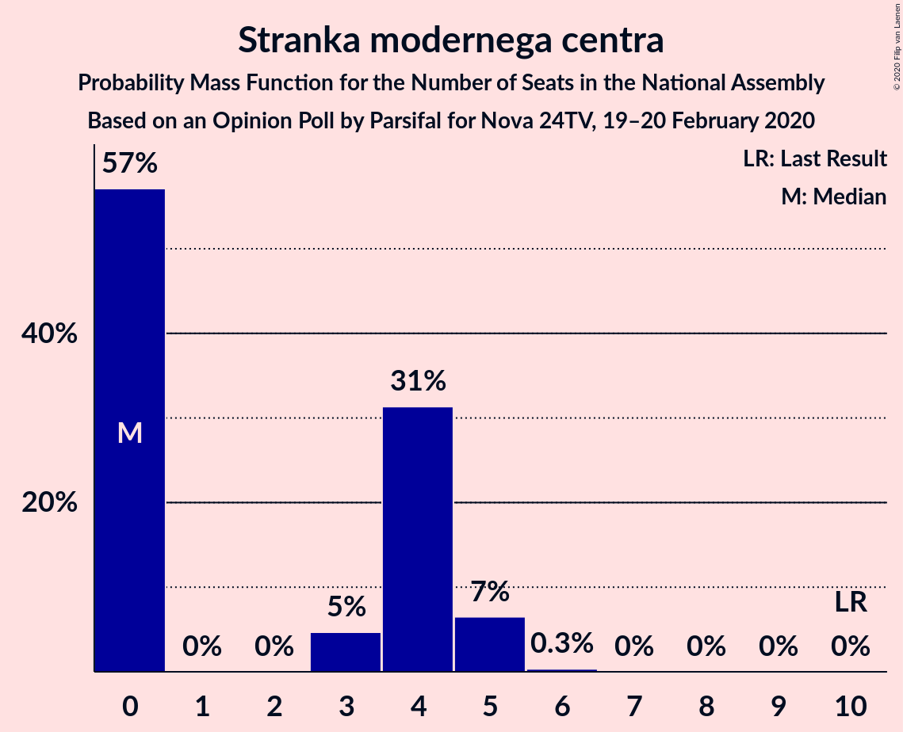
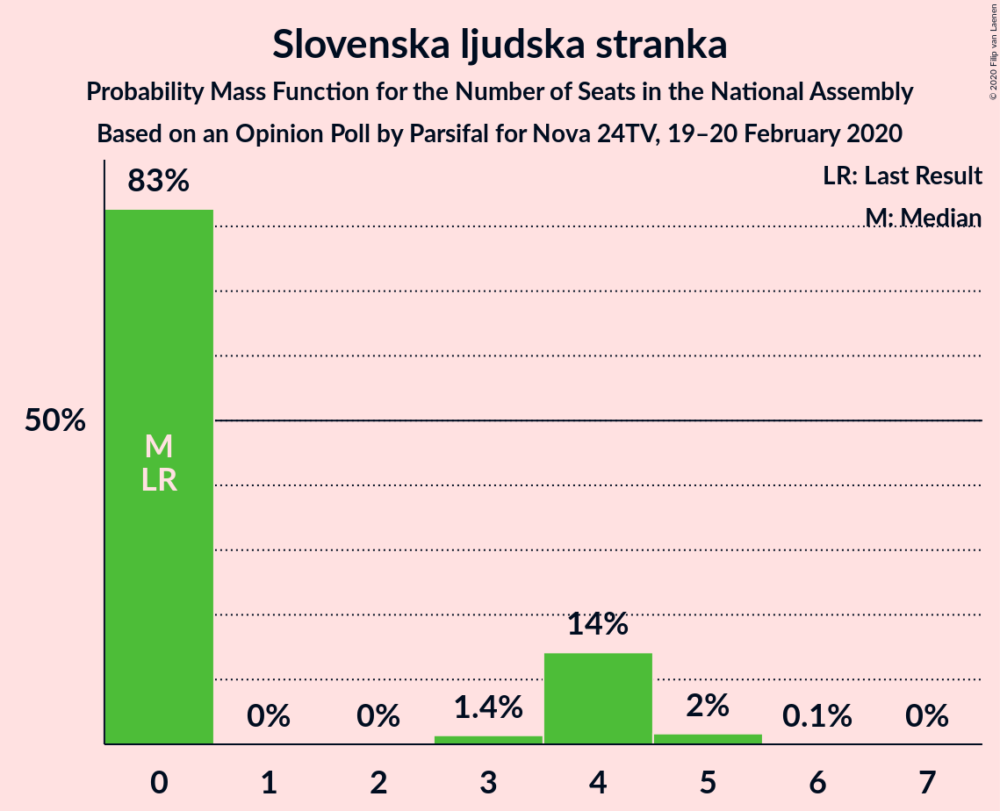
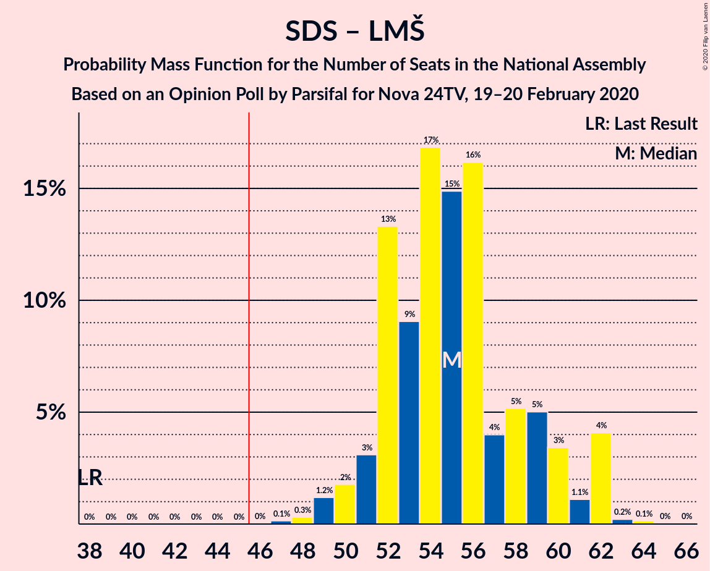
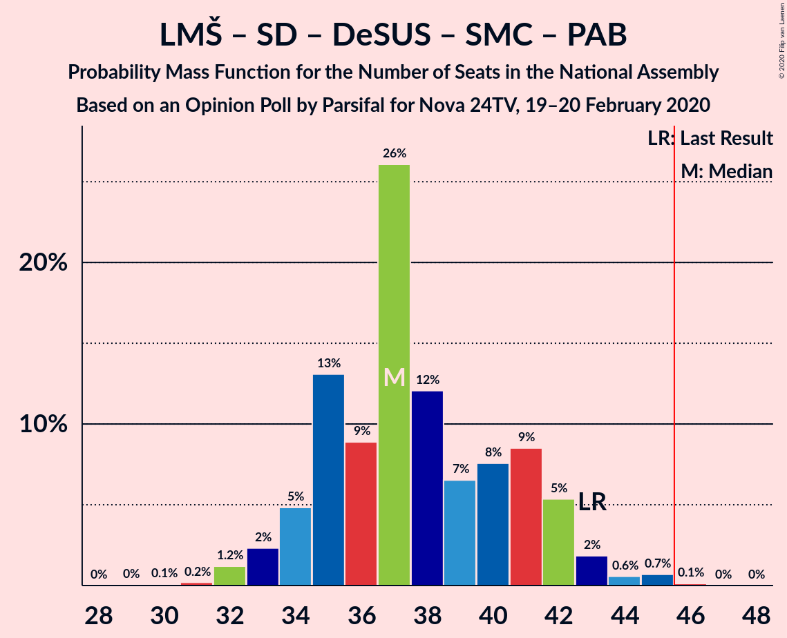

# Opinion Poll by Parsifal for Nova 24TV, 19–20 February 2020

<a href="#voting-intentions">Voting Intentions</a> | <a href="#seats">Seats</a> | <a href="#coalitions">Coalitions</a> | <a href="#technical-information">Technical Information</a>

## Voting Intentions

### Confidence Intervals

| Party | Last Result | Poll Result | 80% Confidence Interval | 90% Confidence Interval | 95% Confidence Interval | 99% Confidence Interval |
|:-----:|:-----------:|:-----------:|:-----------------------:|:-----------------------:|:-----------------------:|:-----------------------:|
| Slovenska demokratska stranka | 24.9% | 32.8% | 30.6–35.1% |30.0–35.7% |29.4–36.3% |28.4–37.4% |
| Lista Marjana Šarca | 12.6% | 23.6% | 21.7–25.7% |21.1–26.3% |20.7–26.9% |19.8–27.9% |
| Levica | 9.3% | 7.9% | 6.8–9.4% |6.4–9.8% |6.2–10.1% |5.6–10.9% |
| Socialni demokrati | 9.9% | 7.8% | 6.6–9.2% |6.3–9.6% |6.0–10.0% |5.5–10.7% |
| Demokratična stranka upokojencev Slovenije | 4.9% | 6.0% | 5.0–7.3% |4.7–7.6% |4.5–8.0% |4.0–8.6% |
| Nova Slovenija–Krščanski demokrati | 7.2% | 5.3% | 4.3–6.5% |4.1–6.9% |3.9–7.2% |3.5–7.8% |
| Slovenska nacionalna stranka | 4.2% | 4.4% | 3.6–5.6% |3.4–5.9% |3.2–6.2% |2.8–6.8% |
| Stranka modernega centra | 9.7% | 3.8% | 3.0–4.8% |2.8–5.1% |2.6–5.4% |2.3–6.0% |
| Slovenska ljudska stranka | 2.6% | 3.3% | 2.6–4.4% |2.4–4.7% |2.3–4.9% |2.0–5.5% |
| Stranka Alenke Bratušek | 5.1% | 1.2% | 0.9–2.0% |0.7–2.2% |0.7–2.4% |0.5–2.8% |

*Note:* The poll result column reflects the actual value used in the calculations. Published results may vary slightly, and in addition be rounded to fewer digits.

## Seats

### Confidence Intervals

| Party | Last Result | Median | 80% Confidence Interval | 90% Confidence Interval | 95% Confidence Interval | 99% Confidence Interval |
|:-----:|:-----------:|:------:|:-----------------------:|:-----------------------:|:-----------------------:|:-----------------------:|
| <a href="#slovenska-demokratska-stranka">Slovenska demokratska stranka</a> | 25 | 31 | 30–35 |29–37 |28–38 |27–38 |
| <a href="#lista-marjana-šarca">Lista Marjana Šarca</a> | 13 | 23 | 21–25 |20–26 |20–27 |19–28 |
| <a href="#levica">Levica</a> | 9 | 8 | 6–9 |6–9 |5–10 |5–11 |
| <a href="#socialni-demokrati">Socialni demokrati</a> | 10 | 7 | 6–9 |6–9 |5–10 |5–10 |
| <a href="#demokratična-stranka-upokojencev-slovenije">Demokratična stranka upokojencev Slovenije</a> | 5 | 5 | 4–7 |4–7 |4–7 |3–8 |
| <a href="#nova-slovenija–krščanski-demokrati">Nova Slovenija–Krščanski demokrati</a> | 7 | 5 | 4–6 |4–7 |0–7 |0–7 |
| <a href="#slovenska-nacionalna-stranka">Slovenska nacionalna stranka</a> | 4 | 4 | 0–5 |0–5 |0–6 |0–6 |
| <a href="#stranka-modernega-centra">Stranka modernega centra</a> | 10 | 0 | 0–4 |0–5 |0–5 |0–5 |
| <a href="#slovenska-ljudska-stranka">Slovenska ljudska stranka</a> | 0 | 0 | 0–4 |0–4 |0–4 |0–5 |
| <a href="#stranka-alenke-bratušek">Stranka Alenke Bratušek</a> | 5 | 0 | 0 |0 |0 |0 |

### Slovenska demokratska stranka

*For a full overview of the results for this party, see the [Slovenska demokratska stranka](party-slovenskademokratskastranka.html) page.*

| Number of Seats | Probability | Accumulated | Special Marks |
|:---------------:|:-----------:|:-----------:|:-------------:|
| 25 | 0% | 100% | Last Result |
| 26 | 0.3% | 100% |  |
| 27 | 0.6% | 99.7% |  |
| 28 | 4% | 99.2% |  |
| 29 | 5% | 96% |  |
| 30 | 16% | 91% |  |
| 31 | 25% | 75% | Median |
| 32 | 13% | 50% |  |
| 33 | 15% | 37% |  |
| 34 | 7% | 22% |  |
| 35 | 8% | 15% |  |
| 36 | 2% | 8% |  |
| 37 | 2% | 6% |  |
| 38 | 3% | 4% |  |
| 39 | 0.1% | 0.2% |  |
| 40 | 0% | 0% |  |

### Lista Marjana Šarca

*For a full overview of the results for this party, see the [Lista Marjana Šarca](party-listamarjanašarca.html) page.*

| Number of Seats | Probability | Accumulated | Special Marks |
|:---------------:|:-----------:|:-----------:|:-------------:|
| 13 | 0% | 100% | Last Result |
| 14 | 0% | 100% |  |
| 15 | 0% | 100% |  |
| 16 | 0% | 100% |  |
| 17 | 0% | 100% |  |
| 18 | 0.2% | 100% |  |
| 19 | 2% | 99.7% |  |
| 20 | 6% | 98% |  |
| 21 | 9% | 91% |  |
| 22 | 18% | 83% |  |
| 23 | 23% | 64% | Median |
| 24 | 22% | 41% |  |
| 25 | 12% | 20% |  |
| 26 | 4% | 8% |  |
| 27 | 2% | 3% |  |
| 28 | 0.9% | 1.1% |  |
| 29 | 0.1% | 0.2% |  |
| 30 | 0.1% | 0.1% |  |
| 31 | 0% | 0% |  |

### Levica

*For a full overview of the results for this party, see the [Levica](party-levica.html) page.*

| Number of Seats | Probability | Accumulated | Special Marks |
|:---------------:|:-----------:|:-----------:|:-------------:|
| 5 | 5% | 100% |  |
| 6 | 15% | 95% |  |
| 7 | 29% | 80% |  |
| 8 | 37% | 50% | Median |
| 9 | 10% | 13% | Last Result |
| 10 | 2% | 3% |  |
| 11 | 0.6% | 0.6% |  |
| 12 | 0% | 0% |  |

### Socialni demokrati

*For a full overview of the results for this party, see the [Socialni demokrati](party-socialnidemokrati.html) page.*

| Number of Seats | Probability | Accumulated | Special Marks |
|:---------------:|:-----------:|:-----------:|:-------------:|
| 4 | 0.1% | 100% |  |
| 5 | 3% | 99.9% |  |
| 6 | 23% | 97% |  |
| 7 | 26% | 74% | Median |
| 8 | 33% | 48% |  |
| 9 | 12% | 15% |  |
| 10 | 3% | 3% | Last Result |
| 11 | 0.1% | 0.2% |  |
| 12 | 0% | 0% |  |

### Demokratična stranka upokojencev Slovenije

*For a full overview of the results for this party, see the [Demokratična stranka upokojencev Slovenije](party-demokratičnastrankaupokojencevslovenije.html) page.*

| Number of Seats | Probability | Accumulated | Special Marks |
|:---------------:|:-----------:|:-----------:|:-------------:|
| 0 | 0.4% | 100% |  |
| 1 | 0% | 99.6% |  |
| 2 | 0% | 99.6% |  |
| 3 | 0.2% | 99.6% |  |
| 4 | 16% | 99.4% |  |
| 5 | 40% | 83% | Last Result, Median |
| 6 | 27% | 44% |  |
| 7 | 14% | 16% |  |
| 8 | 2% | 2% |  |
| 9 | 0.3% | 0.3% |  |
| 10 | 0% | 0% |  |

### Nova Slovenija–Krščanski demokrati

*For a full overview of the results for this party, see the [Nova Slovenija–Krščanski demokrati](party-novaslovenija–krščanskidemokrati.html) page.*

| Number of Seats | Probability | Accumulated | Special Marks |
|:---------------:|:-----------:|:-----------:|:-------------:|
| 0 | 3% | 100% |  |
| 1 | 0% | 97% |  |
| 2 | 0% | 97% |  |
| 3 | 0.6% | 97% |  |
| 4 | 35% | 96% |  |
| 5 | 37% | 61% | Median |
| 6 | 17% | 24% |  |
| 7 | 6% | 6% | Last Result |
| 8 | 0.2% | 0.3% |  |
| 9 | 0% | 0% |  |

### Slovenska nacionalna stranka

*For a full overview of the results for this party, see the [Slovenska nacionalna stranka](party-slovenskanacionalnastranka.html) page.*

| Number of Seats | Probability | Accumulated | Special Marks |
|:---------------:|:-----------:|:-----------:|:-------------:|
| 0 | 23% | 100% |  |
| 1 | 0% | 77% |  |
| 2 | 0% | 77% |  |
| 3 | 2% | 77% |  |
| 4 | 49% | 75% | Last Result, Median |
| 5 | 22% | 26% |  |
| 6 | 3% | 4% |  |
| 7 | 0.3% | 0.3% |  |
| 8 | 0% | 0% |  |

### Stranka modernega centra

*For a full overview of the results for this party, see the [Stranka modernega centra](party-strankamodernegacentra.html) page.*

| Number of Seats | Probability | Accumulated | Special Marks |
|:---------------:|:-----------:|:-----------:|:-------------:|
| 0 | 57% | 100% | Median |
| 1 | 0% | 43% |  |
| 2 | 0% | 43% |  |
| 3 | 5% | 43% |  |
| 4 | 31% | 38% |  |
| 5 | 7% | 7% |  |
| 6 | 0.3% | 0.4% |  |
| 7 | 0% | 0% |  |
| 8 | 0% | 0% |  |
| 9 | 0% | 0% |  |
| 10 | 0% | 0% | Last Result |

### Slovenska ljudska stranka

*For a full overview of the results for this party, see the [Slovenska ljudska stranka](party-slovenskaljudskastranka.html) page.*

| Number of Seats | Probability | Accumulated | Special Marks |
|:---------------:|:-----------:|:-----------:|:-------------:|
| 0 | 83% | 100% | Last Result, Median |
| 1 | 0% | 17% |  |
| 2 | 0% | 17% |  |
| 3 | 1.4% | 17% |  |
| 4 | 14% | 16% |  |
| 5 | 2% | 2% |  |
| 6 | 0.1% | 0.1% |  |
| 7 | 0% | 0% |  |

### Stranka Alenke Bratušek

*For a full overview of the results for this party, see the [Stranka Alenke Bratušek](party-strankaalenkebratušek.html) page.*

| Number of Seats | Probability | Accumulated | Special Marks |
|:---------------:|:-----------:|:-----------:|:-------------:|
| 0 | 100% | 100% | Median |
| 1 | 0% | 0% |  |
| 2 | 0% | 0% |  |
| 3 | 0% | 0% |  |
| 4 | 0% | 0% |  |
| 5 | 0% | 0% | Last Result |

## Coalitions

### Confidence Intervals

| Coalition | Last Result | Median | Majority? | 80% Confidence Interval | 90% Confidence Interval | 95% Confidence Interval | 99% Confidence Interval |
|:---------:|:-----------:|:------:|:---------:|:-----------------------:|:-----------------------:|:-----------------------:|:-----------------------:|
| Slovenska demokratska stranka – Lista Marjana Šarca – Demokratična stranka upokojencev Slovenije | 43 | 60 | 100% | 57–65 | 56–66 | 55–67 | 54–69 |
| Slovenska demokratska stranka – Lista Marjana Šarca | 38 | 55 | 100% | 52–59 | 51–61 | 50–62 | 49–62 |
| Lista Marjana Šarca – Socialni demokrati – Demokratična stranka upokojencev Slovenije – Nova Slovenija–Krščanski demokrati – Stranka modernega centra – Stranka Alenke Bratušek | 50 | 42 | 11% | 39–46 | 38–47 | 38–48 | 35–50 |
| Lista Marjana Šarca – Socialni demokrati – Demokratična stranka upokojencev Slovenije – Nova Slovenija–Krščanski demokrati – Stranka modernega centra | 45 | 42 | 11% | 39–46 | 38–47 | 38–48 | 35–50 |
| Lista Marjana Šarca – Socialni demokrati – Demokratična stranka upokojencev Slovenije – Nova Slovenija–Krščanski demokrati | 35 | 41 | 2% | 37–44 | 37–45 | 36–45 | 34–47 |
| Lista Marjana Šarca – Socialni demokrati – Demokratična stranka upokojencev Slovenije – Stranka modernega centra – Stranka Alenke Bratušek | 43 | 37 | 0.1% | 35–41 | 34–42 | 33–43 | 32–45 |
| Lista Marjana Šarca – Socialni demokrati – Demokratična stranka upokojencev Slovenije – Stranka modernega centra | 38 | 37 | 0.1% | 35–41 | 34–42 | 33–43 | 32–45 |
| Lista Marjana Šarca – Socialni demokrati – Nova Slovenija–Krščanski demokrati – Stranka modernega centra | 40 | 37 | 0.1% | 34–41 | 33–41 | 32–42 | 30–43 |
| Lista Marjana Šarca – Socialni demokrati – Demokratična stranka upokojencev Slovenije | 28 | 36 | 0% | 33–39 | 32–40 | 32–41 | 30–42 |
| Lista Marjana Šarca – Socialni demokrati – Nova Slovenija–Krščanski demokrati | 30 | 35 | 0% | 32–39 | 32–40 | 31–40 | 29–41 |
| Lista Marjana Šarca – Socialni demokrati – Stranka modernega centra | 33 | 32 | 0% | 29–36 | 28–37 | 28–37 | 27–38 |
| Lista Marjana Šarca – Socialni demokrati | 23 | 30 | 0% | 28–33 | 27–34 | 27–35 | 25–36 |
| Socialni demokrati – Demokratična stranka upokojencev Slovenije – Stranka modernega centra | 25 | 14 | 0% | 12–18 | 11–18 | 11–19 | 10–20 |

### Slovenska demokratska stranka – Lista Marjana Šarca – Demokratična stranka upokojencev Slovenije

| Number of Seats | Probability | Accumulated | Special Marks |
|:---------------:|:-----------:|:-----------:|:-------------:|
| 43 | 0% | 100% | Last Result |
| 44 | 0% | 100% |  |
| 45 | 0% | 100% |  |
| 46 | 0% | 100% | Majority |
| 47 | 0% | 100% |  |
| 48 | 0% | 100% |  |
| 49 | 0% | 100% |  |
| 50 | 0% | 100% |  |
| 51 | 0% | 100% |  |
| 52 | 0.1% | 100% |  |
| 53 | 0.2% | 99.9% |  |
| 54 | 1.0% | 99.7% |  |
| 55 | 2% | 98.7% |  |
| 56 | 3% | 97% |  |
| 57 | 6% | 94% |  |
| 58 | 13% | 89% |  |
| 59 | 18% | 75% | Median |
| 60 | 15% | 57% |  |
| 61 | 9% | 42% |  |
| 62 | 12% | 34% |  |
| 63 | 4% | 22% |  |
| 64 | 5% | 17% |  |
| 65 | 5% | 12% |  |
| 66 | 3% | 7% |  |
| 67 | 3% | 5% |  |
| 68 | 0.6% | 1.5% |  |
| 69 | 0.6% | 0.9% |  |
| 70 | 0.2% | 0.3% |  |
| 71 | 0% | 0.1% |  |
| 72 | 0% | 0% |  |

### Slovenska demokratska stranka – Lista Marjana Šarca

| Number of Seats | Probability | Accumulated | Special Marks |
|:---------------:|:-----------:|:-----------:|:-------------:|
| 38 | 0% | 100% | Last Result |
| 39 | 0% | 100% |  |
| 40 | 0% | 100% |  |
| 41 | 0% | 100% |  |
| 42 | 0% | 100% |  |
| 43 | 0% | 100% |  |
| 44 | 0% | 100% |  |
| 45 | 0% | 100% |  |
| 46 | 0% | 100% | Majority |
| 47 | 0.1% | 100% |  |
| 48 | 0.3% | 99.8% |  |
| 49 | 1.2% | 99.5% |  |
| 50 | 2% | 98% |  |
| 51 | 3% | 97% |  |
| 52 | 13% | 93% |  |
| 53 | 9% | 80% |  |
| 54 | 17% | 71% | Median |
| 55 | 15% | 54% |  |
| 56 | 16% | 39% |  |
| 57 | 4% | 23% |  |
| 58 | 5% | 19% |  |
| 59 | 5% | 14% |  |
| 60 | 3% | 9% |  |
| 61 | 1.1% | 6% |  |
| 62 | 4% | 4% |  |
| 63 | 0.2% | 0.4% |  |
| 64 | 0.1% | 0.2% |  |
| 65 | 0% | 0% |  |

### Lista Marjana Šarca – Socialni demokrati – Demokratična stranka upokojencev Slovenije – Nova Slovenija–Krščanski demokrati – Stranka modernega centra – Stranka Alenke Bratušek

| Number of Seats | Probability | Accumulated | Special Marks |
|:---------------:|:-----------:|:-----------:|:-------------:|
| 34 | 0.3% | 100% |  |
| 35 | 0.2% | 99.7% |  |
| 36 | 0.5% | 99.5% |  |
| 37 | 1.2% | 99.0% |  |
| 38 | 3% | 98% |  |
| 39 | 8% | 95% |  |
| 40 | 10% | 87% | Median |
| 41 | 15% | 77% |  |
| 42 | 20% | 62% |  |
| 43 | 7% | 42% |  |
| 44 | 9% | 35% |  |
| 45 | 16% | 27% |  |
| 46 | 5% | 11% | Majority |
| 47 | 3% | 6% |  |
| 48 | 0.6% | 3% |  |
| 49 | 1.3% | 2% |  |
| 50 | 0.6% | 0.7% | Last Result |
| 51 | 0% | 0.1% |  |
| 52 | 0% | 0.1% |  |
| 53 | 0% | 0% |  |

### Lista Marjana Šarca – Socialni demokrati – Demokratična stranka upokojencev Slovenije – Nova Slovenija–Krščanski demokrati – Stranka modernega centra

| Number of Seats | Probability | Accumulated | Special Marks |
|:---------------:|:-----------:|:-----------:|:-------------:|
| 34 | 0.3% | 100% |  |
| 35 | 0.2% | 99.7% |  |
| 36 | 0.5% | 99.5% |  |
| 37 | 1.2% | 99.0% |  |
| 38 | 3% | 98% |  |
| 39 | 8% | 95% |  |
| 40 | 10% | 87% | Median |
| 41 | 15% | 77% |  |
| 42 | 20% | 62% |  |
| 43 | 7% | 42% |  |
| 44 | 9% | 35% |  |
| 45 | 16% | 27% | Last Result |
| 46 | 5% | 11% | Majority |
| 47 | 3% | 6% |  |
| 48 | 0.6% | 3% |  |
| 49 | 1.3% | 2% |  |
| 50 | 0.6% | 0.7% |  |
| 51 | 0% | 0.1% |  |
| 52 | 0% | 0.1% |  |
| 53 | 0% | 0% |  |

### Lista Marjana Šarca – Socialni demokrati – Demokratična stranka upokojencev Slovenije – Nova Slovenija–Krščanski demokrati

| Number of Seats | Probability | Accumulated | Special Marks |
|:---------------:|:-----------:|:-----------:|:-------------:|
| 33 | 0.1% | 100% |  |
| 34 | 0.6% | 99.9% |  |
| 35 | 1.1% | 99.3% | Last Result |
| 36 | 2% | 98% |  |
| 37 | 10% | 96% |  |
| 38 | 7% | 86% |  |
| 39 | 11% | 80% |  |
| 40 | 16% | 69% | Median |
| 41 | 13% | 53% |  |
| 42 | 21% | 40% |  |
| 43 | 5% | 19% |  |
| 44 | 5% | 14% |  |
| 45 | 7% | 9% |  |
| 46 | 1.0% | 2% | Majority |
| 47 | 1.0% | 1.4% |  |
| 48 | 0.2% | 0.4% |  |
| 49 | 0.1% | 0.2% |  |
| 50 | 0.1% | 0.1% |  |
| 51 | 0% | 0% |  |

### Lista Marjana Šarca – Socialni demokrati – Demokratična stranka upokojencev Slovenije – Stranka modernega centra – Stranka Alenke Bratušek

| Number of Seats | Probability | Accumulated | Special Marks |
|:---------------:|:-----------:|:-----------:|:-------------:|
| 30 | 0.1% | 100% |  |
| 31 | 0.2% | 99.9% |  |
| 32 | 1.2% | 99.7% |  |
| 33 | 2% | 98% |  |
| 34 | 5% | 96% |  |
| 35 | 13% | 91% | Median |
| 36 | 9% | 78% |  |
| 37 | 26% | 69% |  |
| 38 | 12% | 43% |  |
| 39 | 7% | 31% |  |
| 40 | 8% | 25% |  |
| 41 | 9% | 17% |  |
| 42 | 5% | 9% |  |
| 43 | 2% | 3% | Last Result |
| 44 | 0.6% | 1.4% |  |
| 45 | 0.7% | 0.8% |  |
| 46 | 0.1% | 0.1% | Majority |
| 47 | 0% | 0% |  |

### Lista Marjana Šarca – Socialni demokrati – Demokratična stranka upokojencev Slovenije – Stranka modernega centra

| Number of Seats | Probability | Accumulated | Special Marks |
|:---------------:|:-----------:|:-----------:|:-------------:|
| 30 | 0.1% | 100% |  |
| 31 | 0.2% | 99.9% |  |
| 32 | 1.2% | 99.7% |  |
| 33 | 2% | 98% |  |
| 34 | 5% | 96% |  |
| 35 | 13% | 91% | Median |
| 36 | 9% | 78% |  |
| 37 | 26% | 69% |  |
| 38 | 12% | 43% | Last Result |
| 39 | 7% | 31% |  |
| 40 | 8% | 25% |  |
| 41 | 9% | 17% |  |
| 42 | 5% | 9% |  |
| 43 | 2% | 3% |  |
| 44 | 0.6% | 1.4% |  |
| 45 | 0.7% | 0.8% |  |
| 46 | 0.1% | 0.1% | Majority |
| 47 | 0% | 0% |  |

### Lista Marjana Šarca – Socialni demokrati – Nova Slovenija–Krščanski demokrati – Stranka modernega centra

| Number of Seats | Probability | Accumulated | Special Marks |
|:---------------:|:-----------:|:-----------:|:-------------:|
| 28 | 0.1% | 100% |  |
| 29 | 0.2% | 99.9% |  |
| 30 | 0.2% | 99.7% |  |
| 31 | 1.0% | 99.4% |  |
| 32 | 3% | 98% |  |
| 33 | 5% | 96% |  |
| 34 | 8% | 90% |  |
| 35 | 14% | 83% | Median |
| 36 | 14% | 69% |  |
| 37 | 17% | 55% |  |
| 38 | 7% | 38% |  |
| 39 | 7% | 30% |  |
| 40 | 12% | 23% | Last Result |
| 41 | 8% | 11% |  |
| 42 | 2% | 4% |  |
| 43 | 2% | 2% |  |
| 44 | 0.1% | 0.3% |  |
| 45 | 0.1% | 0.2% |  |
| 46 | 0.1% | 0.1% | Majority |
| 47 | 0% | 0% |  |

### Lista Marjana Šarca – Socialni demokrati – Demokratična stranka upokojencev Slovenije

| Number of Seats | Probability | Accumulated | Special Marks |
|:---------------:|:-----------:|:-----------:|:-------------:|
| 28 | 0% | 100% | Last Result |
| 29 | 0.1% | 100% |  |
| 30 | 0.4% | 99.9% |  |
| 31 | 1.5% | 99.4% |  |
| 32 | 4% | 98% |  |
| 33 | 13% | 94% |  |
| 34 | 10% | 81% |  |
| 35 | 14% | 71% | Median |
| 36 | 14% | 58% |  |
| 37 | 20% | 43% |  |
| 38 | 13% | 23% |  |
| 39 | 5% | 11% |  |
| 40 | 2% | 5% |  |
| 41 | 2% | 3% |  |
| 42 | 1.1% | 1.4% |  |
| 43 | 0.1% | 0.4% |  |
| 44 | 0.1% | 0.3% |  |
| 45 | 0.1% | 0.1% |  |
| 46 | 0% | 0% | Majority |

### Lista Marjana Šarca – Socialni demokrati – Nova Slovenija–Krščanski demokrati

| Number of Seats | Probability | Accumulated | Special Marks |
|:---------------:|:-----------:|:-----------:|:-------------:|
| 27 | 0.1% | 100% |  |
| 28 | 0.1% | 99.9% |  |
| 29 | 0.5% | 99.8% |  |
| 30 | 1.4% | 99.3% | Last Result |
| 31 | 3% | 98% |  |
| 32 | 7% | 95% |  |
| 33 | 15% | 88% |  |
| 34 | 10% | 73% |  |
| 35 | 20% | 63% | Median |
| 36 | 12% | 42% |  |
| 37 | 14% | 30% |  |
| 38 | 6% | 16% |  |
| 39 | 4% | 11% |  |
| 40 | 5% | 7% |  |
| 41 | 0.8% | 1.3% |  |
| 42 | 0.2% | 0.4% |  |
| 43 | 0.2% | 0.2% |  |
| 44 | 0% | 0% |  |

### Lista Marjana Šarca – Socialni demokrati – Stranka modernega centra

| Number of Seats | Probability | Accumulated | Special Marks |
|:---------------:|:-----------:|:-----------:|:-------------:|
| 25 | 0.1% | 100% |  |
| 26 | 0.4% | 99.9% |  |
| 27 | 1.2% | 99.5% |  |
| 28 | 5% | 98% |  |
| 29 | 8% | 93% |  |
| 30 | 13% | 85% | Median |
| 31 | 14% | 72% |  |
| 32 | 15% | 58% |  |
| 33 | 16% | 43% | Last Result |
| 34 | 6% | 27% |  |
| 35 | 5% | 21% |  |
| 36 | 10% | 16% |  |
| 37 | 4% | 6% |  |
| 38 | 2% | 2% |  |
| 39 | 0.2% | 0.4% |  |
| 40 | 0.2% | 0.2% |  |
| 41 | 0% | 0% |  |

### Lista Marjana Šarca – Socialni demokrati

| Number of Seats | Probability | Accumulated | Special Marks |
|:---------------:|:-----------:|:-----------:|:-------------:|
| 23 | 0% | 100% | Last Result |
| 24 | 0.1% | 100% |  |
| 25 | 0.4% | 99.9% |  |
| 26 | 2% | 99.5% |  |
| 27 | 4% | 98% |  |
| 28 | 12% | 93% |  |
| 29 | 18% | 81% |  |
| 30 | 13% | 62% | Median |
| 31 | 17% | 50% |  |
| 32 | 14% | 32% |  |
| 33 | 11% | 18% |  |
| 34 | 4% | 7% |  |
| 35 | 1.5% | 3% |  |
| 36 | 1.0% | 1.4% |  |
| 37 | 0.2% | 0.4% |  |
| 38 | 0.2% | 0.2% |  |
| 39 | 0% | 0% |  |

### Socialni demokrati – Demokratična stranka upokojencev Slovenije – Stranka modernega centra

| Number of Seats | Probability | Accumulated | Special Marks |
|:---------------:|:-----------:|:-----------:|:-------------:|
| 8 | 0.1% | 100% |  |
| 9 | 0.1% | 99.9% |  |
| 10 | 2% | 99.7% |  |
| 11 | 5% | 98% |  |
| 12 | 9% | 93% | Median |
| 13 | 17% | 84% |  |
| 14 | 21% | 67% |  |
| 15 | 16% | 46% |  |
| 16 | 10% | 30% |  |
| 17 | 9% | 21% |  |
| 18 | 8% | 11% |  |
| 19 | 1.4% | 3% |  |
| 20 | 1.2% | 2% |  |
| 21 | 0.3% | 0.3% |  |
| 22 | 0% | 0% |  |
| 23 | 0% | 0% |  |
| 24 | 0% | 0% |  |
| 25 | 0% | 0% | Last Result |

## Technical Information

### Opinion Poll

+ **Polling firm:** Parsifal
+ **Commissioner(s):** Nova 24TV
+ **Fieldwork period:** 19–20 February 2020

### Calculations

+ **Sample size:** 720
+ **Simulations done:** 1,048,576
+ **Error estimate:** 2.06%

