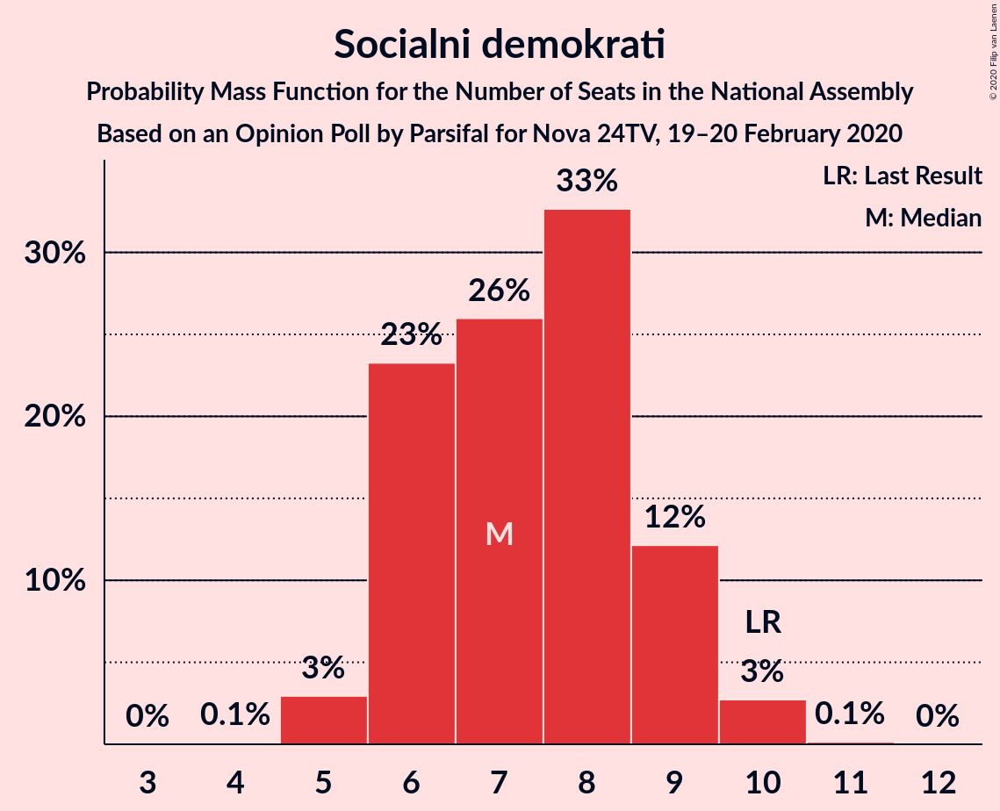
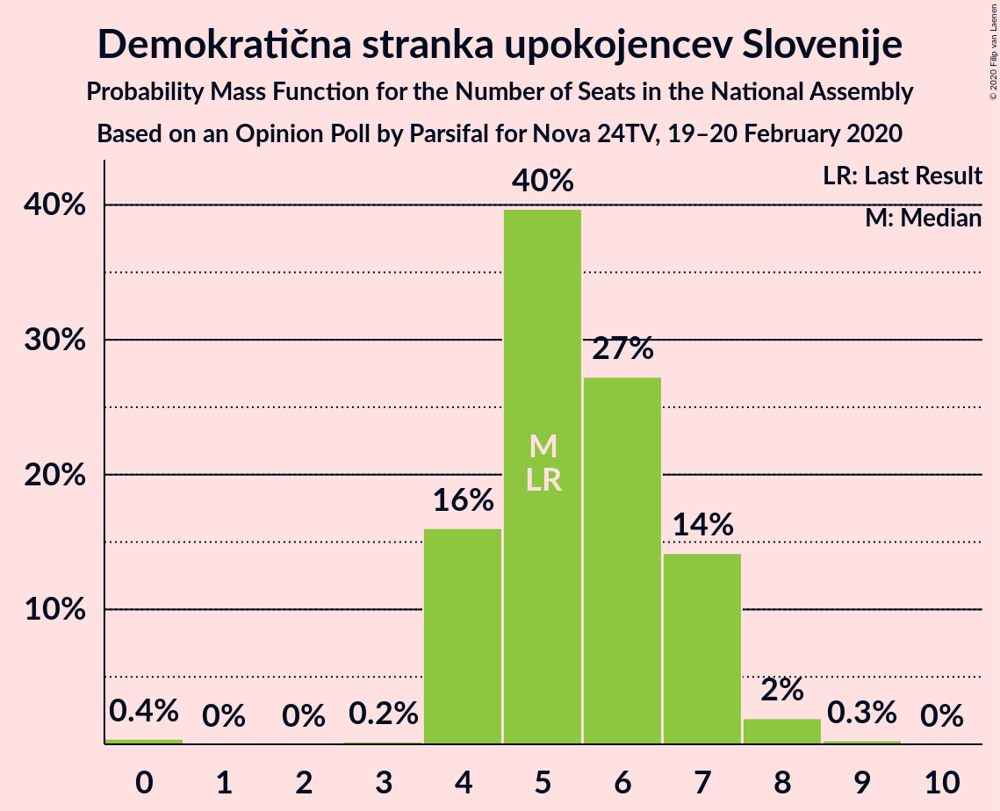
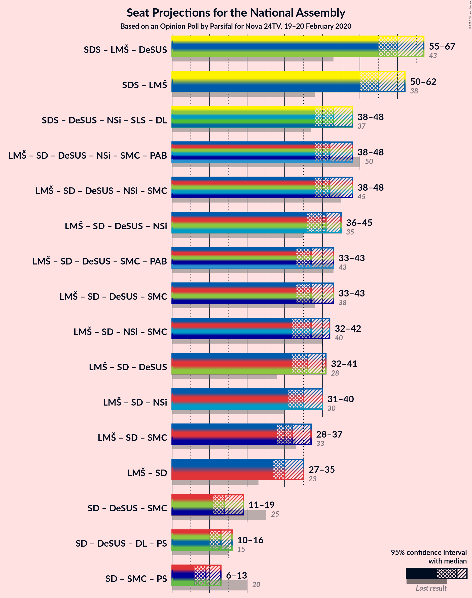
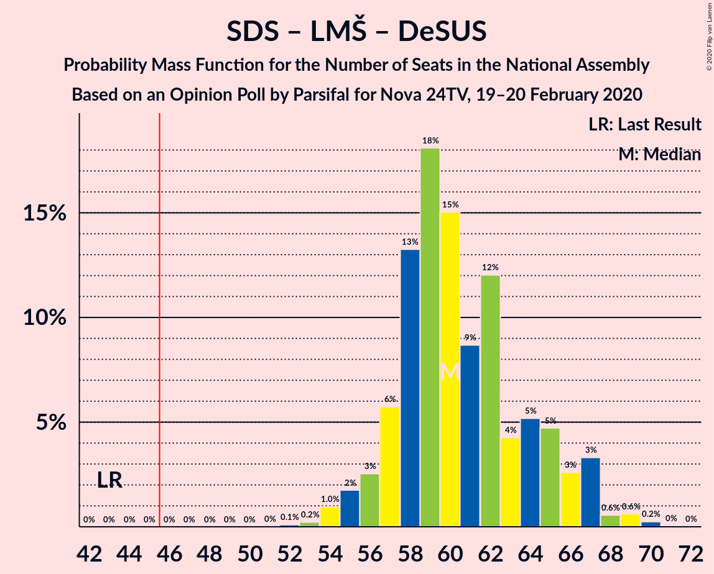
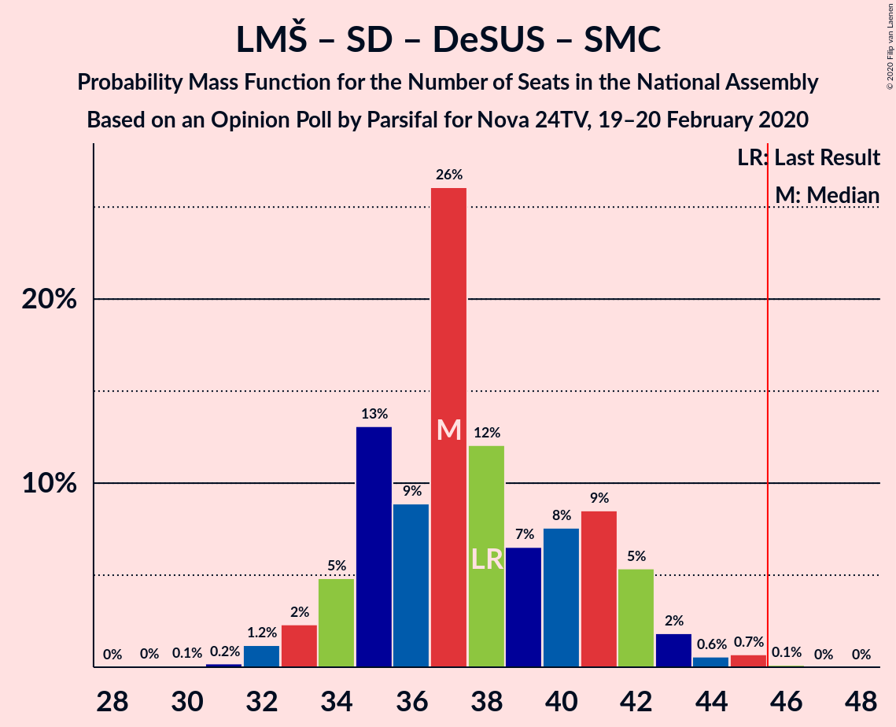
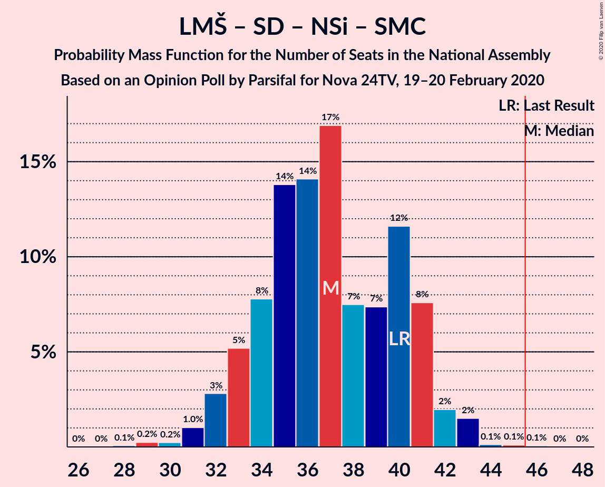
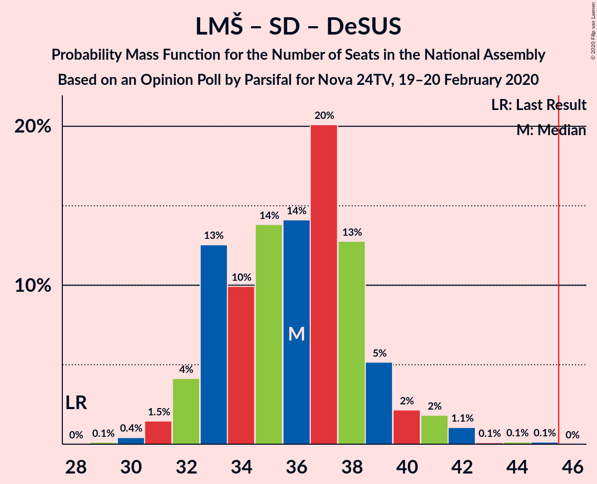

# Opinion Poll by Parsifal for Nova 24TV, 19–20 February 2020

<a href="#voting-intentions">Voting Intentions</a> | <a href="#seats">Seats</a> | <a href="#coalitions">Coalitions</a> | <a href="#technical-information">Technical Information</a>

## Voting Intentions

### Confidence Intervals

| Party | Last Result | Poll Result | 80% Confidence Interval | 90% Confidence Interval | 95% Confidence Interval | 99% Confidence Interval |
|:-----:|:-----------:|:-----------:|:-----------------------:|:-----------------------:|:-----------------------:|:-----------------------:|
| Slovenska demokratska stranka | 24.9% | 32.8% | 30.6–35.1% |30.0–35.7% |29.4–36.3% |28.4–37.4% |
| Lista Marjana Šarca | 12.6% | 23.6% | 21.7–25.7% |21.1–26.3% |20.7–26.9% |19.8–27.9% |
| Levica | 9.3% | 7.9% | 6.8–9.4% |6.4–9.8% |6.2–10.1% |5.6–10.9% |
| Socialni demokrati | 9.9% | 7.8% | 6.6–9.2% |6.3–9.6% |6.0–10.0% |5.5–10.7% |
| Demokratična stranka upokojencev Slovenije | 4.9% | 6.0% | 5.0–7.3% |4.7–7.6% |4.5–8.0% |4.0–8.6% |
| Nova Slovenija–Krščanski demokrati | 7.2% | 5.3% | 4.3–6.5% |4.1–6.9% |3.9–7.2% |3.5–7.8% |
| Slovenska nacionalna stranka | 4.2% | 4.4% | 3.6–5.6% |3.4–5.9% |3.2–6.2% |2.8–6.8% |
| Stranka modernega centra | 9.7% | 3.8% | 3.0–4.8% |2.8–5.1% |2.6–5.4% |2.3–6.0% |
| Slovenska ljudska stranka | 2.6% | 3.3% | 2.6–4.4% |2.4–4.7% |2.3–4.9% |2.0–5.5% |
| Stranka Alenke Bratušek | 5.1% | 1.2% | 0.9–2.0% |0.7–2.2% |0.7–2.4% |0.5–2.8% |

*Note:* The poll result column reflects the actual value used in the calculations. Published results may vary slightly, and in addition be rounded to fewer digits.

## Seats

### Confidence Intervals

| Party | Last Result | Median | 80% Confidence Interval | 90% Confidence Interval | 95% Confidence Interval | 99% Confidence Interval |
|:-----:|:-----------:|:------:|:-----------------------:|:-----------------------:|:-----------------------:|:-----------------------:|
| <a href="#slovenska-demokratska-stranka">Slovenska demokratska stranka</a> | 25 | 31 | 28–34 |28–34 |28–34 |27–35 |
| <a href="#lista-marjana-šarca">Lista Marjana Šarca</a> | 13 | 24 | 21–24 |21–24 |21–26 |20–27 |
| <a href="#levica">Levica</a> | 9 | 7 | 6–8 |6–8 |6–9 |5–10 |
| <a href="#socialni-demokrati">Socialni demokrati</a> | 10 | 7 | 6–9 |6–9 |5–9 |5–10 |
| <a href="#demokratična-stranka-upokojencev-slovenije">Demokratična stranka upokojencev Slovenije</a> | 5 | 5 | 5–6 |5–6 |4–7 |4–8 |
| <a href="#nova-slovenija–krščanski-demokrati">Nova Slovenija–Krščanski demokrati</a> | 7 | 4 | 4–5 |4–5 |4–6 |0–7 |
| <a href="#slovenska-nacionalna-stranka">Slovenska nacionalna stranka</a> | 4 | 4 | 4–5 |4–5 |0–5 |0–6 |
| <a href="#stranka-modernega-centra">Stranka modernega centra</a> | 10 | 4 | 0–5 |0–5 |0–5 |0–5 |
| <a href="#slovenska-ljudska-stranka">Slovenska ljudska stranka</a> | 0 | 0 | 0–4 |0–4 |0–4 |0–4 |
| <a href="#stranka-alenke-bratušek">Stranka Alenke Bratušek</a> | 5 | 0 | 0 |0 |0 |0 |

### Slovenska demokratska stranka

*For a full overview of the results for this party, see the [Slovenska demokratska stranka](party-slovenskademokratskastranka.html) page.*

| Number of Seats | Probability | Accumulated | Special Marks |
|:---------------:|:-----------:|:-----------:|:-------------:|
| 25 | 0% | 100% | Last Result |
| 26 | 0% | 100% |  |
| 27 | 0.6% | 100% |  |
| 28 | 9% | 99.4% |  |
| 29 | 0.8% | 90% |  |
| 30 | 24% | 89% |  |
| 31 | 37% | 65% | Median |
| 32 | 12% | 28% |  |
| 33 | 4% | 16% |  |
| 34 | 10% | 11% |  |
| 35 | 0.9% | 1.4% |  |
| 36 | 0.3% | 0.4% |  |
| 37 | 0% | 0.2% |  |
| 38 | 0.1% | 0.2% |  |
| 39 | 0% | 0.1% |  |
| 40 | 0% | 0% |  |

### Lista Marjana Šarca

*For a full overview of the results for this party, see the [Lista Marjana Šarca](party-listamarjanašarca.html) page.*

| Number of Seats | Probability | Accumulated | Special Marks |
|:---------------:|:-----------:|:-----------:|:-------------:|
| 13 | 0% | 100% | Last Result |
| 14 | 0% | 100% |  |
| 15 | 0% | 100% |  |
| 16 | 0% | 100% |  |
| 17 | 0% | 100% |  |
| 18 | 0.1% | 100% |  |
| 19 | 0.1% | 99.9% |  |
| 20 | 2% | 99.7% |  |
| 21 | 13% | 98% |  |
| 22 | 14% | 84% |  |
| 23 | 9% | 70% |  |
| 24 | 56% | 61% | Median |
| 25 | 1.1% | 5% |  |
| 26 | 3% | 4% |  |
| 27 | 0.7% | 0.9% |  |
| 28 | 0.1% | 0.2% |  |
| 29 | 0% | 0% |  |

### Levica

*For a full overview of the results for this party, see the [Levica](party-levica.html) page.*

| Number of Seats | Probability | Accumulated | Special Marks |
|:---------------:|:-----------:|:-----------:|:-------------:|
| 5 | 0.5% | 100% |  |
| 6 | 13% | 99.5% |  |
| 7 | 55% | 86% | Median |
| 8 | 27% | 32% |  |
| 9 | 3% | 4% | Last Result |
| 10 | 0.6% | 1.0% |  |
| 11 | 0.4% | 0.4% |  |
| 12 | 0% | 0% |  |

### Socialni demokrati

*For a full overview of the results for this party, see the [Socialni demokrati](party-socialnidemokrati.html) page.*

| Number of Seats | Probability | Accumulated | Special Marks |
|:---------------:|:-----------:|:-----------:|:-------------:|
| 5 | 3% | 100% |  |
| 6 | 12% | 97% |  |
| 7 | 39% | 85% | Median |
| 8 | 22% | 46% |  |
| 9 | 24% | 25% |  |
| 10 | 0.5% | 0.7% | Last Result |
| 11 | 0.2% | 0.2% |  |
| 12 | 0% | 0% |  |

### Demokratična stranka upokojencev Slovenije

*For a full overview of the results for this party, see the [Demokratična stranka upokojencev Slovenije](party-demokratičnastrankaupokojencevslovenije.html) page.*

| Number of Seats | Probability | Accumulated | Special Marks |
|:---------------:|:-----------:|:-----------:|:-------------:|
| 0 | 0.1% | 100% |  |
| 1 | 0% | 99.9% |  |
| 2 | 0% | 99.9% |  |
| 3 | 0.1% | 99.9% |  |
| 4 | 4% | 99.8% |  |
| 5 | 77% | 96% | Last Result, Median |
| 6 | 16% | 19% |  |
| 7 | 2% | 3% |  |
| 8 | 0.4% | 0.5% |  |
| 9 | 0.1% | 0.1% |  |
| 10 | 0% | 0% |  |

### Nova Slovenija–Krščanski demokrati

*For a full overview of the results for this party, see the [Nova Slovenija–Krščanski demokrati](party-novaslovenija–krščanskidemokrati.html) page.*

| Number of Seats | Probability | Accumulated | Special Marks |
|:---------------:|:-----------:|:-----------:|:-------------:|
| 0 | 0.6% | 100% |  |
| 1 | 0% | 99.4% |  |
| 2 | 0% | 99.4% |  |
| 3 | 0.4% | 99.4% |  |
| 4 | 67% | 99.1% | Median |
| 5 | 28% | 33% |  |
| 6 | 4% | 4% |  |
| 7 | 0.5% | 0.6% | Last Result |
| 8 | 0.1% | 0.1% |  |
| 9 | 0% | 0% |  |

### Slovenska nacionalna stranka

*For a full overview of the results for this party, see the [Slovenska nacionalna stranka](party-slovenskanacionalnastranka.html) page.*

| Number of Seats | Probability | Accumulated | Special Marks |
|:---------------:|:-----------:|:-----------:|:-------------:|
| 0 | 4% | 100% |  |
| 1 | 0% | 96% |  |
| 2 | 0% | 96% |  |
| 3 | 0.7% | 96% |  |
| 4 | 57% | 96% | Last Result, Median |
| 5 | 37% | 39% |  |
| 6 | 1.1% | 1.4% |  |
| 7 | 0.3% | 0.3% |  |
| 8 | 0% | 0% |  |

### Stranka modernega centra

*For a full overview of the results for this party, see the [Stranka modernega centra](party-strankamodernegacentra.html) page.*

| Number of Seats | Probability | Accumulated | Special Marks |
|:---------------:|:-----------:|:-----------:|:-------------:|
| 0 | 33% | 100% |  |
| 1 | 0% | 67% |  |
| 2 | 0% | 67% |  |
| 3 | 8% | 67% |  |
| 4 | 32% | 59% | Median |
| 5 | 27% | 27% |  |
| 6 | 0% | 0% |  |
| 7 | 0% | 0% |  |
| 8 | 0% | 0% |  |
| 9 | 0% | 0% |  |
| 10 | 0% | 0% | Last Result |

### Slovenska ljudska stranka

*For a full overview of the results for this party, see the [Slovenska ljudska stranka](party-slovenskaljudskastranka.html) page.*

| Number of Seats | Probability | Accumulated | Special Marks |
|:---------------:|:-----------:|:-----------:|:-------------:|
| 0 | 86% | 100% | Last Result, Median |
| 1 | 0% | 14% |  |
| 2 | 0% | 14% |  |
| 3 | 0.1% | 14% |  |
| 4 | 13% | 14% |  |
| 5 | 0.3% | 0.3% |  |
| 6 | 0% | 0% |  |

### Stranka Alenke Bratušek

*For a full overview of the results for this party, see the [Stranka Alenke Bratušek](party-strankaalenkebratušek.html) page.*

| Number of Seats | Probability | Accumulated | Special Marks |
|:---------------:|:-----------:|:-----------:|:-------------:|
| 0 | 100% | 100% | Median |
| 1 | 0% | 0% |  |
| 2 | 0% | 0% |  |
| 3 | 0% | 0% |  |
| 4 | 0% | 0% |  |
| 5 | 0% | 0% | Last Result |

## Coalitions

### Confidence Intervals

| Coalition | Last Result | Median | Majority? | 80% Confidence Interval | 90% Confidence Interval | 95% Confidence Interval | 99% Confidence Interval |
|:---------:|:-----------:|:------:|:---------:|:-----------------------:|:-----------------------:|:-----------------------:|:-----------------------:|
| Slovenska demokratska stranka – Lista Marjana Šarca – Demokratična stranka upokojencev Slovenije | 43 | 59 | 100% | 57–61 | 57–61 | 57–63 | 54–66 |
| Slovenska demokratska stranka – Lista Marjana Šarca | 38 | 54 | 100% | 52–55 | 51–56 | 51–57 | 50–60 |
| Lista Marjana Šarca – Socialni demokrati – Demokratična stranka upokojencev Slovenije – Nova Slovenija–Krščanski demokrati – Stranka modernega centra – Stranka Alenke Bratušek | 50 | 45 | 24% | 39–46 | 38–46 | 38–46 | 37–46 |
| Lista Marjana Šarca – Socialni demokrati – Demokratična stranka upokojencev Slovenije – Nova Slovenija–Krščanski demokrati – Stranka modernega centra | 45 | 45 | 24% | 39–46 | 38–46 | 38–46 | 37–46 |
| Lista Marjana Šarca – Socialni demokrati – Demokratična stranka upokojencev Slovenije – Nova Slovenija–Krščanski demokrati | 35 | 40 | 0.5% | 37–42 | 36–43 | 36–43 | 36–45 |
| Lista Marjana Šarca – Socialni demokrati – Demokratična stranka upokojencev Slovenije – Stranka modernega centra – Stranka Alenke Bratušek | 43 | 41 | 0% | 35–42 | 33–42 | 33–42 | 33–42 |
| Lista Marjana Šarca – Socialni demokrati – Demokratična stranka upokojencev Slovenije – Stranka modernega centra | 38 | 41 | 0% | 35–42 | 33–42 | 33–42 | 33–42 |
| Lista Marjana Šarca – Socialni demokrati – Nova Slovenija–Krščanski demokrati – Stranka modernega centra | 40 | 40 | 0% | 34–41 | 33–41 | 33–41 | 33–41 |
| Lista Marjana Šarca – Socialni demokrati – Demokratična stranka upokojencev Slovenije | 28 | 36 | 0% | 32–38 | 32–38 | 32–38 | 31–41 |
| Lista Marjana Šarca – Socialni demokrati – Nova Slovenija–Krščanski demokrati | 30 | 35 | 0% | 32–37 | 31–37 | 31–37 | 31–40 |
| Lista Marjana Šarca – Socialni demokrati – Stranka modernega centra | 33 | 35 | 0% | 30–37 | 28–37 | 28–37 | 28–37 |
| Lista Marjana Šarca – Socialni demokrati | 23 | 31 | 0% | 28–33 | 27–33 | 27–33 | 26–34 |
| Socialni demokrati – Demokratična stranka upokojencev Slovenije – Stranka modernega centra | 25 | 17 | 0% | 12–18 | 12–18 | 11–18 | 10–18 |

### Slovenska demokratska stranka – Lista Marjana Šarca – Demokratična stranka upokojencev Slovenije

| Number of Seats | Probability | Accumulated | Special Marks |
|:---------------:|:-----------:|:-----------:|:-------------:|
| 43 | 0% | 100% | Last Result |
| 44 | 0% | 100% |  |
| 45 | 0% | 100% |  |
| 46 | 0% | 100% | Majority |
| 47 | 0% | 100% |  |
| 48 | 0% | 100% |  |
| 49 | 0% | 100% |  |
| 50 | 0% | 100% |  |
| 51 | 0% | 100% |  |
| 52 | 0% | 100% |  |
| 53 | 0% | 100% |  |
| 54 | 0.9% | 100% |  |
| 55 | 0.3% | 99.1% |  |
| 56 | 0.9% | 98.8% |  |
| 57 | 12% | 98% |  |
| 58 | 3% | 86% |  |
| 59 | 34% | 84% |  |
| 60 | 36% | 49% | Median |
| 61 | 8% | 13% |  |
| 62 | 1.3% | 5% |  |
| 63 | 2% | 4% |  |
| 64 | 1.1% | 2% |  |
| 65 | 0.3% | 0.8% |  |
| 66 | 0.3% | 0.5% |  |
| 67 | 0.1% | 0.2% |  |
| 68 | 0.1% | 0.1% |  |
| 69 | 0% | 0.1% |  |
| 70 | 0% | 0% |  |

### Slovenska demokratska stranka – Lista Marjana Šarca

| Number of Seats | Probability | Accumulated | Special Marks |
|:---------------:|:-----------:|:-----------:|:-------------:|
| 38 | 0% | 100% | Last Result |
| 39 | 0% | 100% |  |
| 40 | 0% | 100% |  |
| 41 | 0% | 100% |  |
| 42 | 0% | 100% |  |
| 43 | 0% | 100% |  |
| 44 | 0% | 100% |  |
| 45 | 0% | 100% |  |
| 46 | 0% | 100% | Majority |
| 47 | 0% | 100% |  |
| 48 | 0.1% | 100% |  |
| 49 | 0.2% | 99.9% |  |
| 50 | 1.2% | 99.7% |  |
| 51 | 7% | 98% |  |
| 52 | 5% | 92% |  |
| 53 | 0.9% | 87% |  |
| 54 | 40% | 86% |  |
| 55 | 40% | 46% | Median |
| 56 | 3% | 6% |  |
| 57 | 1.3% | 3% |  |
| 58 | 1.0% | 2% |  |
| 59 | 0.6% | 1.1% |  |
| 60 | 0.3% | 0.5% |  |
| 61 | 0.1% | 0.2% |  |
| 62 | 0% | 0.1% |  |
| 63 | 0% | 0.1% |  |
| 64 | 0% | 0.1% |  |
| 65 | 0% | 0% |  |

### Lista Marjana Šarca – Socialni demokrati – Demokratična stranka upokojencev Slovenije – Nova Slovenija–Krščanski demokrati – Stranka modernega centra – Stranka Alenke Bratušek

| Number of Seats | Probability | Accumulated | Special Marks |
|:---------------:|:-----------:|:-----------:|:-------------:|
| 35 | 0.1% | 100% |  |
| 36 | 0% | 99.9% |  |
| 37 | 0.5% | 99.9% |  |
| 38 | 7% | 99.4% |  |
| 39 | 8% | 93% |  |
| 40 | 14% | 84% |  |
| 41 | 1.0% | 71% |  |
| 42 | 8% | 70% |  |
| 43 | 5% | 62% |  |
| 44 | 1.5% | 57% | Median |
| 45 | 31% | 55% |  |
| 46 | 24% | 24% | Majority |
| 47 | 0.3% | 0.4% |  |
| 48 | 0.1% | 0.2% |  |
| 49 | 0.1% | 0.1% |  |
| 50 | 0% | 0% | Last Result |

### Lista Marjana Šarca – Socialni demokrati – Demokratična stranka upokojencev Slovenije – Nova Slovenija–Krščanski demokrati – Stranka modernega centra

| Number of Seats | Probability | Accumulated | Special Marks |
|:---------------:|:-----------:|:-----------:|:-------------:|
| 35 | 0.1% | 100% |  |
| 36 | 0% | 99.9% |  |
| 37 | 0.5% | 99.9% |  |
| 38 | 7% | 99.4% |  |
| 39 | 8% | 93% |  |
| 40 | 14% | 84% |  |
| 41 | 1.0% | 71% |  |
| 42 | 8% | 70% |  |
| 43 | 5% | 62% |  |
| 44 | 1.5% | 57% | Median |
| 45 | 31% | 55% | Last Result |
| 46 | 24% | 24% | Majority |
| 47 | 0.3% | 0.4% |  |
| 48 | 0.1% | 0.2% |  |
| 49 | 0.1% | 0.1% |  |
| 50 | 0% | 0% |  |

### Lista Marjana Šarca – Socialni demokrati – Demokratična stranka upokojencev Slovenije – Nova Slovenija–Krščanski demokrati

| Number of Seats | Probability | Accumulated | Special Marks |
|:---------------:|:-----------:|:-----------:|:-------------:|
| 35 | 0.2% | 100% | Last Result |
| 36 | 9% | 99.7% |  |
| 37 | 0.9% | 90% |  |
| 38 | 8% | 89% |  |
| 39 | 1.4% | 82% |  |
| 40 | 39% | 80% | Median |
| 41 | 6% | 42% |  |
| 42 | 30% | 36% |  |
| 43 | 4% | 6% |  |
| 44 | 0.5% | 1.3% |  |
| 45 | 0.4% | 0.8% |  |
| 46 | 0.2% | 0.5% | Majority |
| 47 | 0.2% | 0.2% |  |
| 48 | 0% | 0% |  |

### Lista Marjana Šarca – Socialni demokrati – Demokratična stranka upokojencev Slovenije – Stranka modernega centra – Stranka Alenke Bratušek

| Number of Seats | Probability | Accumulated | Special Marks |
|:---------------:|:-----------:|:-----------:|:-------------:|
| 30 | 0.1% | 100% |  |
| 31 | 0.1% | 99.9% |  |
| 32 | 0.1% | 99.8% |  |
| 33 | 7% | 99.8% |  |
| 34 | 1.0% | 93% |  |
| 35 | 20% | 92% |  |
| 36 | 3% | 72% |  |
| 37 | 9% | 70% |  |
| 38 | 5% | 61% |  |
| 39 | 0.4% | 57% |  |
| 40 | 1.2% | 56% | Median |
| 41 | 31% | 55% |  |
| 42 | 23% | 24% |  |
| 43 | 0.1% | 0.3% | Last Result |
| 44 | 0% | 0.2% |  |
| 45 | 0.2% | 0.2% |  |
| 46 | 0% | 0% | Majority |

### Lista Marjana Šarca – Socialni demokrati – Demokratična stranka upokojencev Slovenije – Stranka modernega centra

| Number of Seats | Probability | Accumulated | Special Marks |
|:---------------:|:-----------:|:-----------:|:-------------:|
| 30 | 0.1% | 100% |  |
| 31 | 0.1% | 99.9% |  |
| 32 | 0.1% | 99.8% |  |
| 33 | 7% | 99.8% |  |
| 34 | 1.0% | 93% |  |
| 35 | 20% | 92% |  |
| 36 | 3% | 72% |  |
| 37 | 9% | 70% |  |
| 38 | 5% | 61% | Last Result |
| 39 | 0.4% | 57% |  |
| 40 | 1.2% | 56% | Median |
| 41 | 31% | 55% |  |
| 42 | 23% | 24% |  |
| 43 | 0.1% | 0.3% |  |
| 44 | 0% | 0.2% |  |
| 45 | 0.2% | 0.2% |  |
| 46 | 0% | 0% | Majority |

### Lista Marjana Šarca – Socialni demokrati – Nova Slovenija–Krščanski demokrati – Stranka modernega centra

| Number of Seats | Probability | Accumulated | Special Marks |
|:---------------:|:-----------:|:-----------:|:-------------:|
| 29 | 0.1% | 100% |  |
| 30 | 0% | 99.9% |  |
| 31 | 0.1% | 99.9% |  |
| 32 | 0.1% | 99.8% |  |
| 33 | 7% | 99.8% |  |
| 34 | 9% | 92% |  |
| 35 | 12% | 83% |  |
| 36 | 9% | 71% |  |
| 37 | 4% | 62% |  |
| 38 | 1.3% | 58% |  |
| 39 | 6% | 57% | Median |
| 40 | 27% | 50% | Last Result |
| 41 | 23% | 24% |  |
| 42 | 0.1% | 0.2% |  |
| 43 | 0.1% | 0.1% |  |
| 44 | 0% | 0% |  |

### Lista Marjana Šarca – Socialni demokrati – Demokratična stranka upokojencev Slovenije

| Number of Seats | Probability | Accumulated | Special Marks |
|:---------------:|:-----------:|:-----------:|:-------------:|
| 28 | 0% | 100% | Last Result |
| 29 | 0% | 100% |  |
| 30 | 0.1% | 100% |  |
| 31 | 0.5% | 99.9% |  |
| 32 | 10% | 99.4% |  |
| 33 | 7% | 90% |  |
| 34 | 2% | 83% |  |
| 35 | 12% | 80% |  |
| 36 | 27% | 68% | Median |
| 37 | 13% | 41% |  |
| 38 | 26% | 28% |  |
| 39 | 0.2% | 1.2% |  |
| 40 | 0.5% | 1.0% |  |
| 41 | 0.3% | 0.5% |  |
| 42 | 0.2% | 0.2% |  |
| 43 | 0% | 0% |  |

### Lista Marjana Šarca – Socialni demokrati – Nova Slovenija–Krščanski demokrati

| Number of Seats | Probability | Accumulated | Special Marks |
|:---------------:|:-----------:|:-----------:|:-------------:|
| 29 | 0.2% | 100% |  |
| 30 | 0% | 99.8% | Last Result |
| 31 | 9% | 99.8% |  |
| 32 | 2% | 91% |  |
| 33 | 8% | 90% |  |
| 34 | 2% | 82% |  |
| 35 | 44% | 80% | Median |
| 36 | 8% | 36% |  |
| 37 | 27% | 28% |  |
| 38 | 0.3% | 1.4% |  |
| 39 | 0.5% | 1.1% |  |
| 40 | 0.4% | 0.6% |  |
| 41 | 0.2% | 0.2% |  |
| 42 | 0% | 0.1% |  |
| 43 | 0% | 0% |  |

### Lista Marjana Šarca – Socialni demokrati – Stranka modernega centra

| Number of Seats | Probability | Accumulated | Special Marks |
|:---------------:|:-----------:|:-----------:|:-------------:|
| 24 | 0.1% | 100% |  |
| 25 | 0% | 99.9% |  |
| 26 | 0% | 99.9% |  |
| 27 | 0.1% | 99.9% |  |
| 28 | 7% | 99.7% |  |
| 29 | 0.9% | 93% |  |
| 30 | 22% | 92% |  |
| 31 | 7% | 70% |  |
| 32 | 5% | 63% |  |
| 33 | 2% | 58% | Last Result |
| 34 | 1.4% | 57% |  |
| 35 | 6% | 56% | Median |
| 36 | 26% | 50% |  |
| 37 | 23% | 23% |  |
| 38 | 0.1% | 0.2% |  |
| 39 | 0.1% | 0.1% |  |
| 40 | 0% | 0% |  |

### Lista Marjana Šarca – Socialni demokrati

| Number of Seats | Probability | Accumulated | Special Marks |
|:---------------:|:-----------:|:-----------:|:-------------:|
| 23 | 0% | 100% | Last Result |
| 24 | 0.1% | 100% |  |
| 25 | 0.2% | 99.9% |  |
| 26 | 0.4% | 99.7% |  |
| 27 | 8% | 99.3% |  |
| 28 | 8% | 91% |  |
| 29 | 2% | 83% |  |
| 30 | 14% | 81% |  |
| 31 | 39% | 67% | Median |
| 32 | 3% | 28% |  |
| 33 | 24% | 25% |  |
| 34 | 0.7% | 1.0% |  |
| 35 | 0.1% | 0.3% |  |
| 36 | 0.2% | 0.2% |  |
| 37 | 0% | 0% |  |

### Socialni demokrati – Demokratična stranka upokojencev Slovenije – Stranka modernega centra

| Number of Seats | Probability | Accumulated | Special Marks |
|:---------------:|:-----------:|:-----------:|:-------------:|
| 9 | 0.1% | 100% |  |
| 10 | 2% | 99.9% |  |
| 11 | 1.4% | 98% |  |
| 12 | 8% | 96% |  |
| 13 | 13% | 89% |  |
| 14 | 15% | 76% |  |
| 15 | 1.3% | 61% |  |
| 16 | 3% | 59% | Median |
| 17 | 32% | 56% |  |
| 18 | 24% | 24% |  |
| 19 | 0.1% | 0.3% |  |
| 20 | 0.1% | 0.2% |  |
| 21 | 0.1% | 0.1% |  |
| 22 | 0% | 0% |  |
| 23 | 0% | 0% |  |
| 24 | 0% | 0% |  |
| 25 | 0% | 0% | Last Result |

## Technical Information

### Opinion Poll

+ **Polling firm:** Parsifal
+ **Commissioner(s):** Nova 24TV
+ **Fieldwork period:** 19–20 February 2020

### Calculations

+ **Sample size:** 720
+ **Simulations done:** 65,536
+ **Error estimate:** 2.44%

