# Opinion Poll by Mediana for Delo, 25 February–4 March 2020

<a href="#voting-intentions">Voting Intentions</a> | <a href="#seats">Seats</a> | <a href="#coalitions">Coalitions</a> | <a href="#technical-information">Technical Information</a>

## Voting Intentions

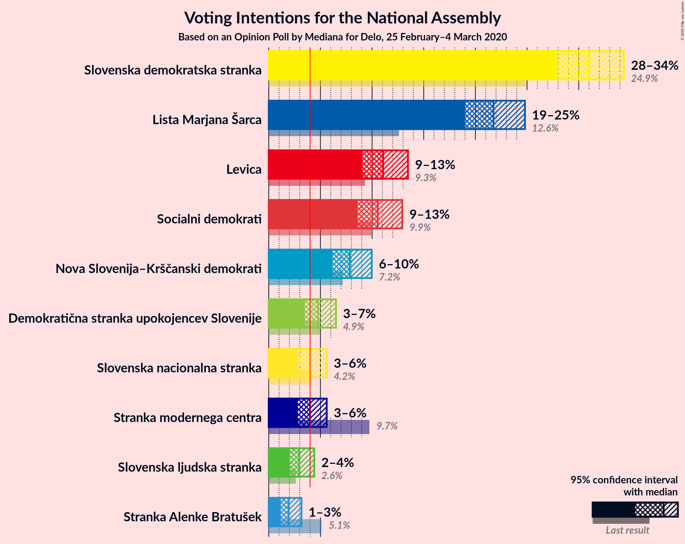

### Confidence Intervals

| Party | Last Result | Poll Result | 80% Confidence Interval | 90% Confidence Interval | 95% Confidence Interval | 99% Confidence Interval |
|:-----:|:-----------:|:-----------:|:-----------------------:|:-----------------------:|:-----------------------:|:-----------------------:|
| Slovenska demokratska stranka | 24.9% | 31.0% | 28.9–33.2% |28.4–33.8% |27.9–34.4% |26.9–35.4% |
| Lista Marjana Šarca | 12.6% | 21.8% | 19.9–23.7% |19.4–24.3% |19.0–24.8% |18.2–25.8% |
| Levica | 9.3% | 11.1% | 9.7–12.6% |9.4–13.1% |9.1–13.5% |8.4–14.3% |
| Socialni demokrati | 9.9% | 10.6% | 9.3–12.1% |8.9–12.5% |8.6–12.9% |8.0–13.7% |
| Nova Slovenija–Krščanski demokrati | 7.2% | 7.9% | 6.7–9.2% |6.4–9.6% |6.2–10.0% |5.7–10.7% |
| Demokratična stranka upokojencev Slovenije | 4.9% | 4.8% | 3.9–5.9% |3.7–6.2% |3.5–6.5% |3.1–7.1% |
| Stranka modernega centra | 9.7% | 4.0% | 3.2–5.0% |3.0–5.3% |2.8–5.6% |2.5–6.2% |
| Slovenska nacionalna stranka | 4.2% | 4.0% | 3.2–5.0% |3.0–5.3% |2.8–5.6% |2.5–6.2% |
| Slovenska ljudska stranka | 2.6% | 3.0% | 2.3–3.9% |2.1–4.2% |2.0–4.4% |1.7–4.9% |
| Stranka Alenke Bratušek | 5.1% | 1.9% | 1.4–2.7% |1.3–3.0% |1.2–3.2% |1.0–3.6% |

*Note:* The poll result column reflects the actual value used in the calculations. Published results may vary slightly, and in addition be rounded to fewer digits.

## Seats

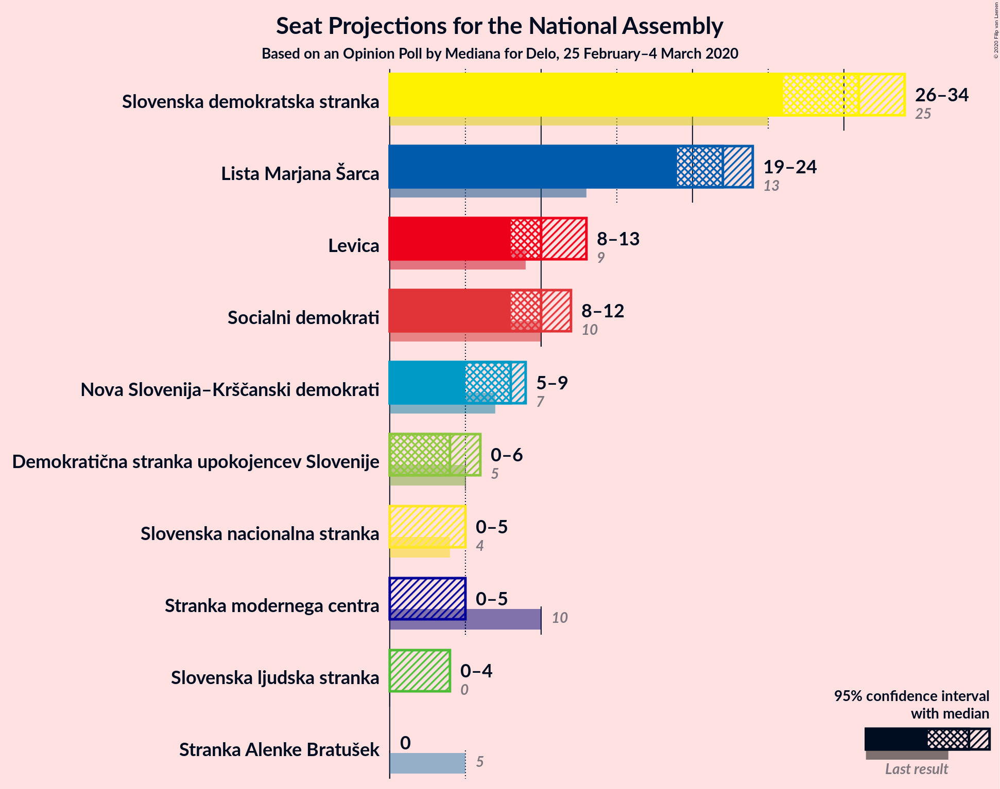

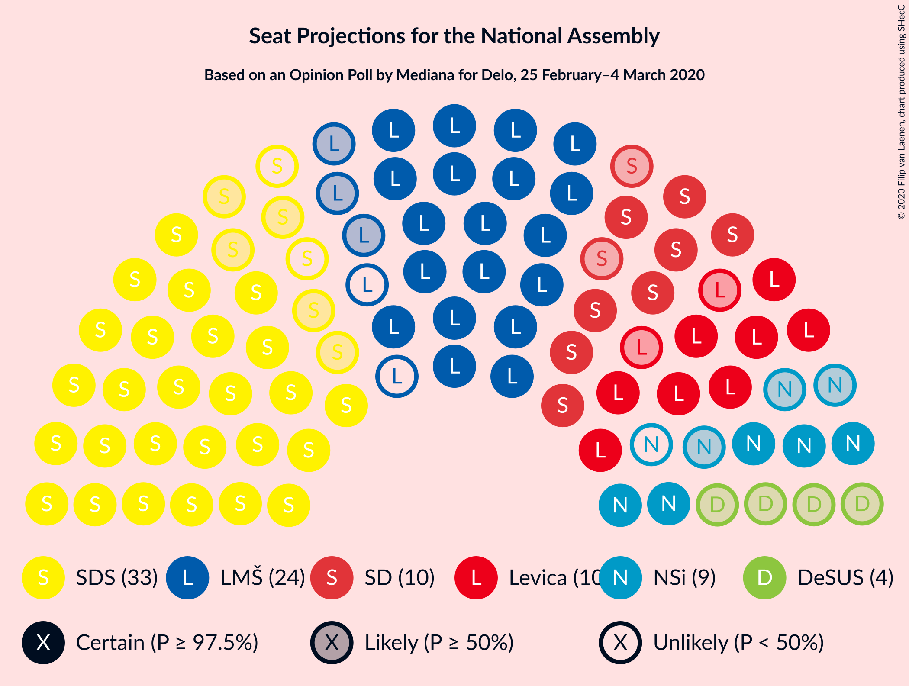

### Confidence Intervals

| Party | Last Result | Median | 80% Confidence Interval | 90% Confidence Interval | 95% Confidence Interval | 99% Confidence Interval |
|:-----:|:-----------:|:------:|:-----------------------:|:-----------------------:|:-----------------------:|:-----------------------:|
| <a href="#slovenska-demokratska-stranka">Slovenska demokratska stranka</a> | 25 | 31 | 28–33 |28–33 |26–34 |26–35 |
| <a href="#lista-marjana-šarca">Lista Marjana Šarca</a> | 13 | 22 | 19–24 |19–24 |19–24 |18–25 |
| <a href="#levica">Levica</a> | 9 | 10 | 9–12 |9–12 |8–13 |8–14 |
| <a href="#socialni-demokrati">Socialni demokrati</a> | 10 | 10 | 9–11 |8–12 |8–12 |7–14 |
| <a href="#nova-slovenija–krščanski-demokrati">Nova Slovenija–Krščanski demokrati</a> | 7 | 8 | 6–9 |6–9 |5–9 |5–10 |
| <a href="#demokratična-stranka-upokojencev-slovenije">Demokratična stranka upokojencev Slovenije</a> | 5 | 4 | 4–5 |0–6 |0–6 |0–6 |
| <a href="#stranka-modernega-centra">Stranka modernega centra</a> | 10 | 0 | 0–4 |0–5 |0–5 |0–5 |
| <a href="#slovenska-nacionalna-stranka">Slovenska nacionalna stranka</a> | 4 | 0 | 0–4 |0–5 |0–5 |0–5 |
| <a href="#slovenska-ljudska-stranka">Slovenska ljudska stranka</a> | 0 | 0 | 0 |0–4 |0–4 |0–4 |
| <a href="#stranka-alenke-bratušek">Stranka Alenke Bratušek</a> | 5 | 0 | 0 |0 |0 |0 |

### Slovenska demokratska stranka

*For a full overview of the results for this party, see the [Slovenska demokratska stranka](party-slovenskademokratskastranka.html) page.*

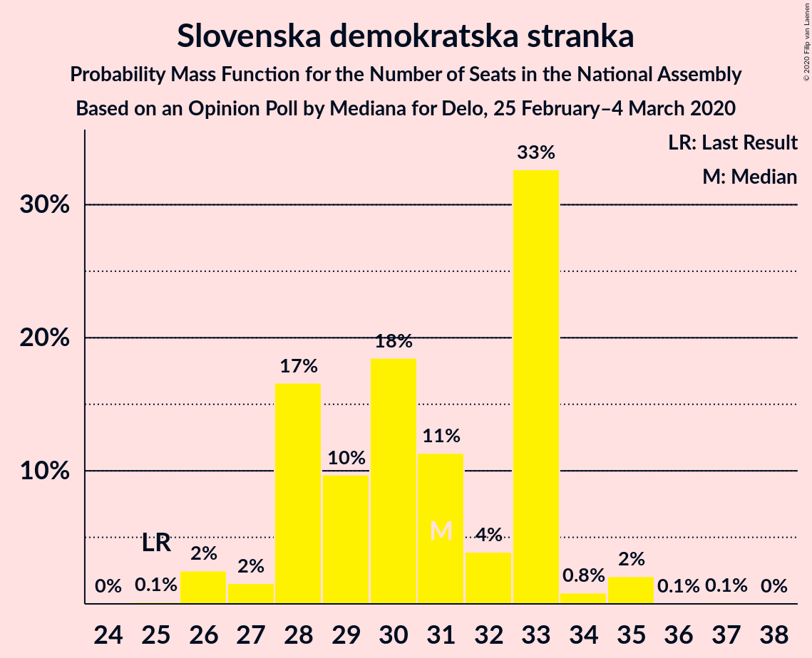

| Number of Seats | Probability | Accumulated | Special Marks |
|:---------------:|:-----------:|:-----------:|:-------------:|
| 25 | 0.1% | 100% | Last Result |
| 26 | 2% | 99.8% |  |
| 27 | 2% | 97% |  |
| 28 | 17% | 96% |  |
| 29 | 10% | 79% |  |
| 30 | 18% | 69% |  |
| 31 | 11% | 51% | Median |
| 32 | 4% | 40% |  |
| 33 | 33% | 36% |  |
| 34 | 0.8% | 3% |  |
| 35 | 2% | 2% |  |
| 36 | 0.1% | 0.2% |  |
| 37 | 0.1% | 0.1% |  |
| 38 | 0% | 0% |  |

### Lista Marjana Šarca

*For a full overview of the results for this party, see the [Lista Marjana Šarca](party-listamarjanašarca.html) page.*

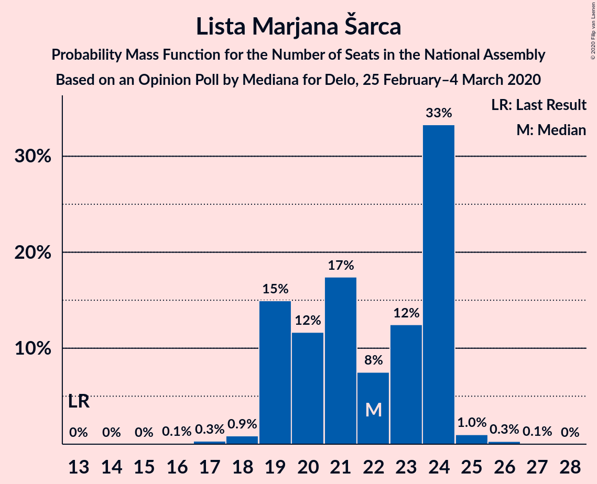

| Number of Seats | Probability | Accumulated | Special Marks |
|:---------------:|:-----------:|:-----------:|:-------------:|
| 13 | 0% | 100% | Last Result |
| 14 | 0% | 100% |  |
| 15 | 0% | 100% |  |
| 16 | 0.1% | 100% |  |
| 17 | 0.3% | 99.9% |  |
| 18 | 0.9% | 99.6% |  |
| 19 | 15% | 98.7% |  |
| 20 | 12% | 84% |  |
| 21 | 17% | 72% |  |
| 22 | 8% | 55% | Median |
| 23 | 12% | 47% |  |
| 24 | 33% | 35% |  |
| 25 | 1.0% | 1.4% |  |
| 26 | 0.3% | 0.4% |  |
| 27 | 0.1% | 0.1% |  |
| 28 | 0% | 0% |  |

### Levica

*For a full overview of the results for this party, see the [Levica](party-levica.html) page.*

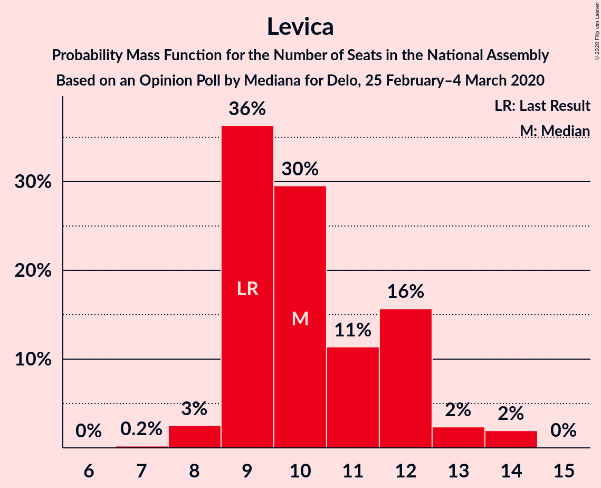

| Number of Seats | Probability | Accumulated | Special Marks |
|:---------------:|:-----------:|:-----------:|:-------------:|
| 7 | 0.2% | 100% |  |
| 8 | 3% | 99.8% |  |
| 9 | 36% | 97% | Last Result |
| 10 | 30% | 61% | Median |
| 11 | 11% | 31% |  |
| 12 | 16% | 20% |  |
| 13 | 2% | 4% |  |
| 14 | 2% | 2% |  |
| 15 | 0% | 0% |  |

### Socialni demokrati

*For a full overview of the results for this party, see the [Socialni demokrati](party-socialnidemokrati.html) page.*

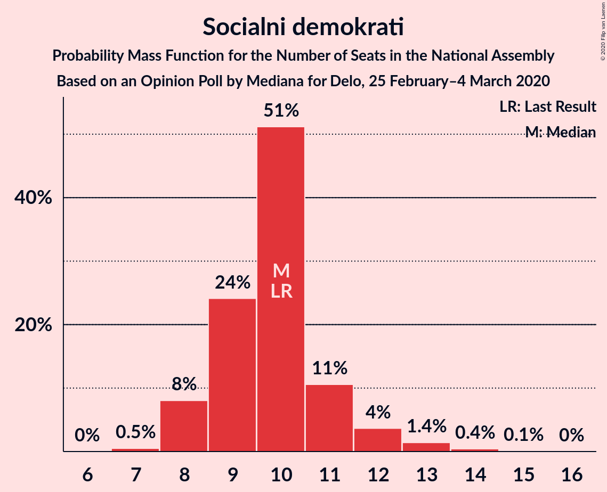

| Number of Seats | Probability | Accumulated | Special Marks |
|:---------------:|:-----------:|:-----------:|:-------------:|
| 7 | 0.5% | 100% |  |
| 8 | 8% | 99.5% |  |
| 9 | 24% | 91% |  |
| 10 | 51% | 67% | Last Result, Median |
| 11 | 11% | 16% |  |
| 12 | 4% | 6% |  |
| 13 | 1.4% | 2% |  |
| 14 | 0.4% | 0.5% |  |
| 15 | 0.1% | 0.1% |  |
| 16 | 0% | 0% |  |

### Nova Slovenija–Krščanski demokrati

*For a full overview of the results for this party, see the [Nova Slovenija–Krščanski demokrati](party-novaslovenija–krščanskidemokrati.html) page.*

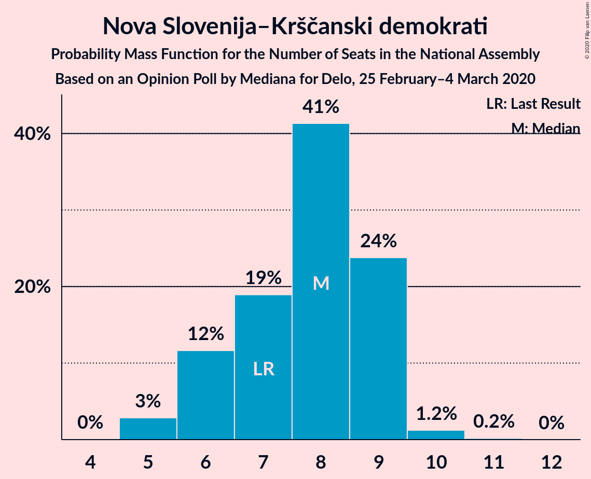

| Number of Seats | Probability | Accumulated | Special Marks |
|:---------------:|:-----------:|:-----------:|:-------------:|
| 5 | 3% | 100% |  |
| 6 | 12% | 97% |  |
| 7 | 19% | 85% | Last Result |
| 8 | 41% | 67% | Median |
| 9 | 24% | 25% |  |
| 10 | 1.2% | 1.4% |  |
| 11 | 0.2% | 0.2% |  |
| 12 | 0% | 0% |  |

### Demokratična stranka upokojencev Slovenije

*For a full overview of the results for this party, see the [Demokratična stranka upokojencev Slovenije](party-demokratičnastrankaupokojencevslovenije.html) page.*

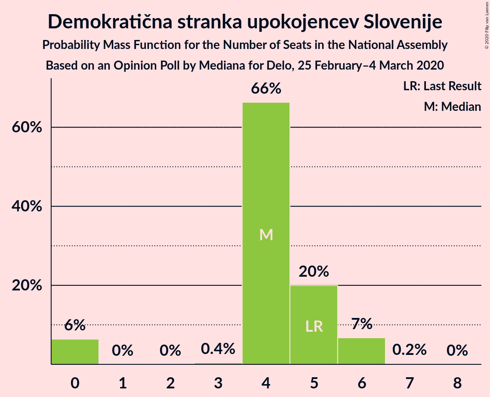

| Number of Seats | Probability | Accumulated | Special Marks |
|:---------------:|:-----------:|:-----------:|:-------------:|
| 0 | 6% | 100% |  |
| 1 | 0% | 94% |  |
| 2 | 0% | 94% |  |
| 3 | 0.4% | 94% |  |
| 4 | 66% | 93% | Median |
| 5 | 20% | 27% | Last Result |
| 6 | 7% | 7% |  |
| 7 | 0.2% | 0.2% |  |
| 8 | 0% | 0% |  |

### Stranka modernega centra

*For a full overview of the results for this party, see the [Stranka modernega centra](party-strankamodernegacentra.html) page.*

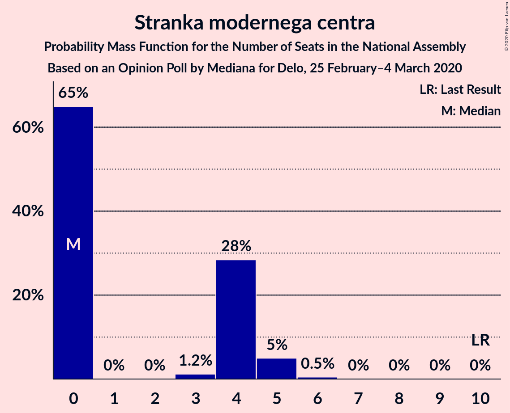

| Number of Seats | Probability | Accumulated | Special Marks |
|:---------------:|:-----------:|:-----------:|:-------------:|
| 0 | 65% | 100% | Median |
| 1 | 0% | 35% |  |
| 2 | 0% | 35% |  |
| 3 | 1.2% | 35% |  |
| 4 | 28% | 34% |  |
| 5 | 5% | 5% |  |
| 6 | 0.5% | 0.5% |  |
| 7 | 0% | 0% |  |
| 8 | 0% | 0% |  |
| 9 | 0% | 0% |  |
| 10 | 0% | 0% | Last Result |

### Slovenska nacionalna stranka

*For a full overview of the results for this party, see the [Slovenska nacionalna stranka](party-slovenskanacionalnastranka.html) page.*

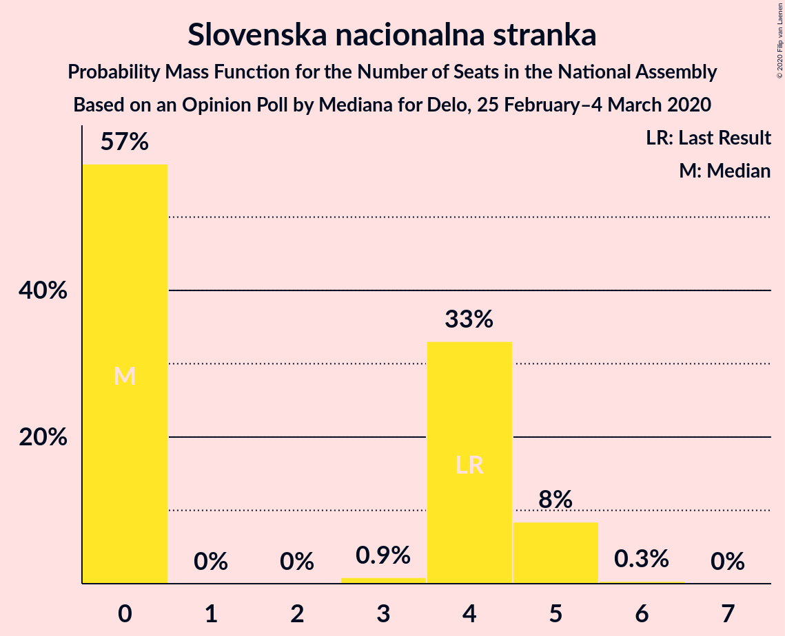

| Number of Seats | Probability | Accumulated | Special Marks |
|:---------------:|:-----------:|:-----------:|:-------------:|
| 0 | 57% | 100% | Median |
| 1 | 0% | 43% |  |
| 2 | 0% | 43% |  |
| 3 | 0.9% | 43% |  |
| 4 | 33% | 42% | Last Result |
| 5 | 8% | 9% |  |
| 6 | 0.3% | 0.4% |  |
| 7 | 0% | 0% |  |

### Slovenska ljudska stranka

*For a full overview of the results for this party, see the [Slovenska ljudska stranka](party-slovenskaljudskastranka.html) page.*

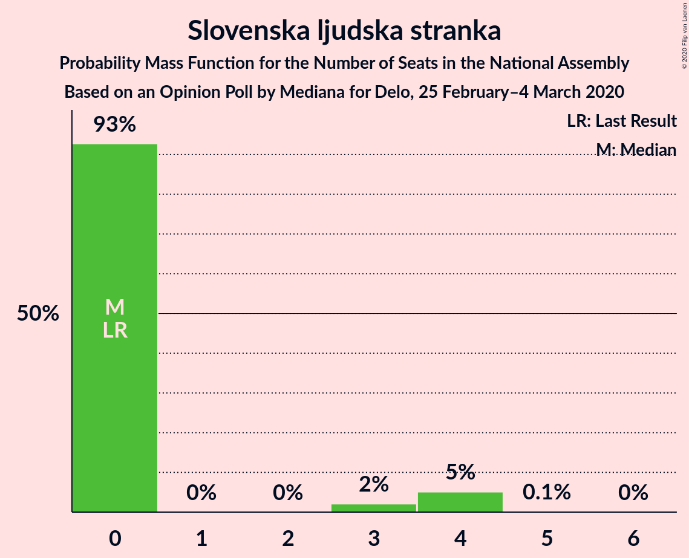

| Number of Seats | Probability | Accumulated | Special Marks |
|:---------------:|:-----------:|:-----------:|:-------------:|
| 0 | 93% | 100% | Last Result, Median |
| 1 | 0% | 7% |  |
| 2 | 0% | 7% |  |
| 3 | 2% | 7% |  |
| 4 | 5% | 5% |  |
| 5 | 0.1% | 0.1% |  |
| 6 | 0% | 0% |  |

### Stranka Alenke Bratušek

*For a full overview of the results for this party, see the [Stranka Alenke Bratušek](party-strankaalenkebratušek.html) page.*

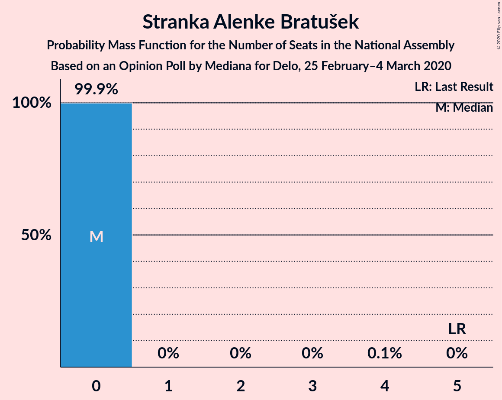

| Number of Seats | Probability | Accumulated | Special Marks |
|:---------------:|:-----------:|:-----------:|:-------------:|
| 0 | 99.9% | 100% | Median |
| 1 | 0% | 0.1% |  |
| 2 | 0% | 0.1% |  |
| 3 | 0% | 0.1% |  |
| 4 | 0.1% | 0.1% |  |
| 5 | 0% | 0% | Last Result |

## Coalitions

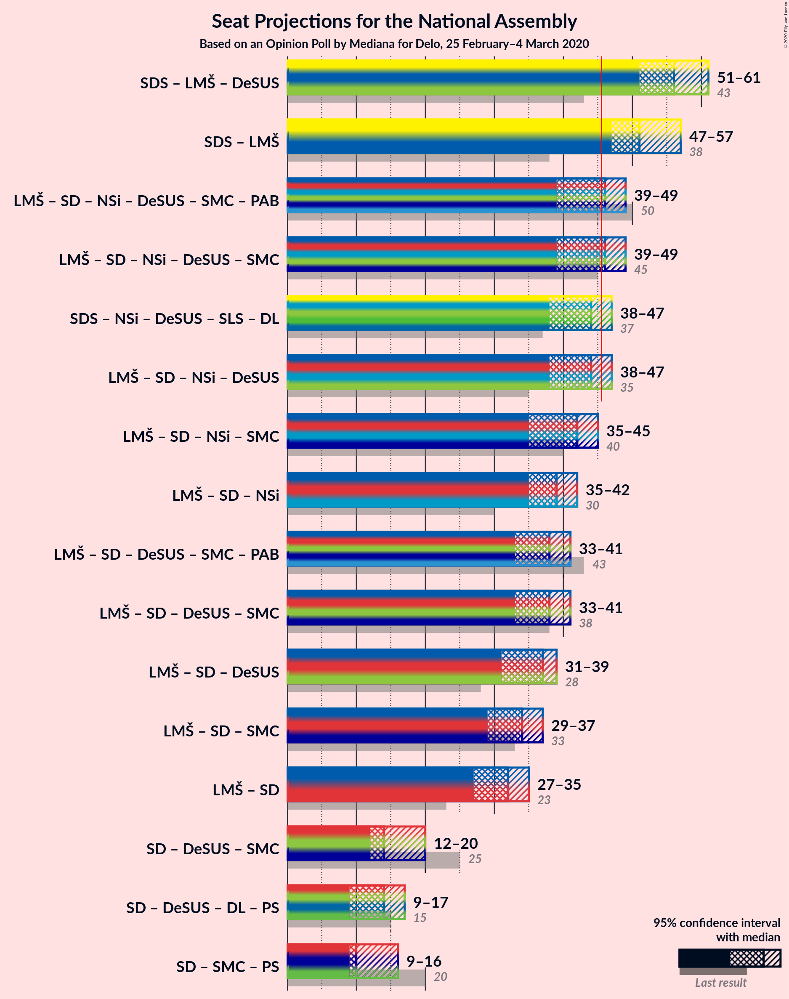

### Confidence Intervals

| Coalition | Last Result | Median | Majority? | 80% Confidence Interval | 90% Confidence Interval | 95% Confidence Interval | 99% Confidence Interval |
|:---------:|:-----------:|:------:|:---------:|:-----------------------:|:-----------------------:|:-----------------------:|:-----------------------:|
| Slovenska demokratska stranka – Lista Marjana Šarca – Demokratična stranka upokojencev Slovenije | 43 | 56 | 100% | 52–61 | 52–61 | 51–61 | 49–62 |
| Slovenska demokratska stranka – Lista Marjana Šarca | 38 | 51 | 99.5% | 49–57 | 48–57 | 47–57 | 45–57 |
| Lista Marjana Šarca – Socialni demokrati – Nova Slovenija–Krščanski demokrati – Demokratična stranka upokojencev Slovenije – Stranka modernega centra – Stranka Alenke Bratušek | 50 | 46 | 58% | 41–48 | 40–48 | 39–49 | 38–50 |
| Lista Marjana Šarca – Socialni demokrati – Nova Slovenija–Krščanski demokrati – Demokratična stranka upokojencev Slovenije – Stranka modernega centra | 45 | 46 | 58% | 41–48 | 40–48 | 39–49 | 38–50 |
| Lista Marjana Šarca – Socialni demokrati – Nova Slovenija–Krščanski demokrati – Demokratična stranka upokojencev Slovenije | 35 | 44 | 42% | 40–46 | 39–46 | 38–47 | 37–48 |
| Lista Marjana Šarca – Socialni demokrati – Nova Slovenija–Krščanski demokrati – Stranka modernega centra | 40 | 42 | 0.9% | 37–43 | 36–44 | 35–45 | 35–47 |
| Lista Marjana Šarca – Socialni demokrati – Nova Slovenija–Krščanski demokrati | 30 | 39 | 0.1% | 36–42 | 35–42 | 35–42 | 33–44 |
| Lista Marjana Šarca – Socialni demokrati – Demokratična stranka upokojencev Slovenije – Stranka modernega centra – Stranka Alenke Bratušek | 43 | 38 | 0% | 34–39 | 33–40 | 33–41 | 31–42 |
| Lista Marjana Šarca – Socialni demokrati – Demokratična stranka upokojencev Slovenije – Stranka modernega centra | 38 | 38 | 0% | 34–39 | 33–40 | 33–41 | 31–42 |
| Lista Marjana Šarca – Socialni demokrati – Demokratična stranka upokojencev Slovenije | 28 | 37 | 0% | 33–38 | 31–38 | 31–39 | 29–41 |
| Lista Marjana Šarca – Socialni demokrati – Stranka modernega centra | 33 | 34 | 0% | 30–35 | 29–36 | 29–37 | 28–39 |
| Lista Marjana Šarca – Socialni demokrati | 23 | 32 | 0% | 29–34 | 27–34 | 27–35 | 27–36 |
| Socialni demokrati – Demokratična stranka upokojencev Slovenije – Stranka modernega centra | 25 | 14 | 0% | 14–18 | 13–19 | 12–20 | 9–21 |

### Slovenska demokratska stranka – Lista Marjana Šarca – Demokratična stranka upokojencev Slovenije

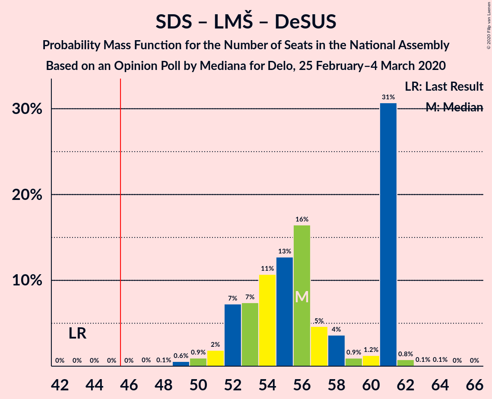

| Number of Seats | Probability | Accumulated | Special Marks |
|:---------------:|:-----------:|:-----------:|:-------------:|
| 43 | 0% | 100% | Last Result |
| 44 | 0% | 100% |  |
| 45 | 0% | 100% |  |
| 46 | 0% | 100% | Majority |
| 47 | 0% | 100% |  |
| 48 | 0.1% | 100% |  |
| 49 | 0.6% | 99.9% |  |
| 50 | 0.9% | 99.4% |  |
| 51 | 2% | 98% |  |
| 52 | 7% | 97% |  |
| 53 | 7% | 89% |  |
| 54 | 11% | 82% |  |
| 55 | 13% | 71% |  |
| 56 | 16% | 59% |  |
| 57 | 5% | 42% | Median |
| 58 | 4% | 37% |  |
| 59 | 0.9% | 34% |  |
| 60 | 1.2% | 33% |  |
| 61 | 31% | 32% |  |
| 62 | 0.8% | 0.9% |  |
| 63 | 0.1% | 0.2% |  |
| 64 | 0.1% | 0.1% |  |
| 65 | 0% | 0% |  |

### Slovenska demokratska stranka – Lista Marjana Šarca

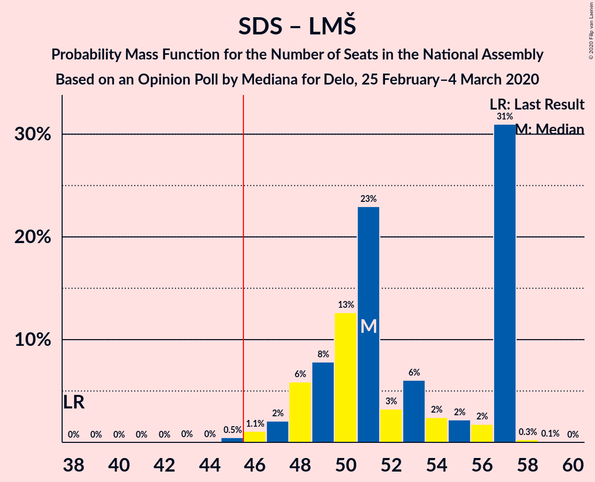

| Number of Seats | Probability | Accumulated | Special Marks |
|:---------------:|:-----------:|:-----------:|:-------------:|
| 38 | 0% | 100% | Last Result |
| 39 | 0% | 100% |  |
| 40 | 0% | 100% |  |
| 41 | 0% | 100% |  |
| 42 | 0% | 100% |  |
| 43 | 0% | 100% |  |
| 44 | 0% | 100% |  |
| 45 | 0.5% | 99.9% |  |
| 46 | 1.1% | 99.5% | Majority |
| 47 | 2% | 98% |  |
| 48 | 6% | 96% |  |
| 49 | 8% | 90% |  |
| 50 | 13% | 83% |  |
| 51 | 23% | 70% |  |
| 52 | 3% | 47% |  |
| 53 | 6% | 44% | Median |
| 54 | 2% | 38% |  |
| 55 | 2% | 35% |  |
| 56 | 2% | 33% |  |
| 57 | 31% | 31% |  |
| 58 | 0.3% | 0.4% |  |
| 59 | 0.1% | 0.1% |  |
| 60 | 0% | 0% |  |

### Lista Marjana Šarca – Socialni demokrati – Nova Slovenija–Krščanski demokrati – Demokratična stranka upokojencev Slovenije – Stranka modernega centra – Stranka Alenke Bratušek

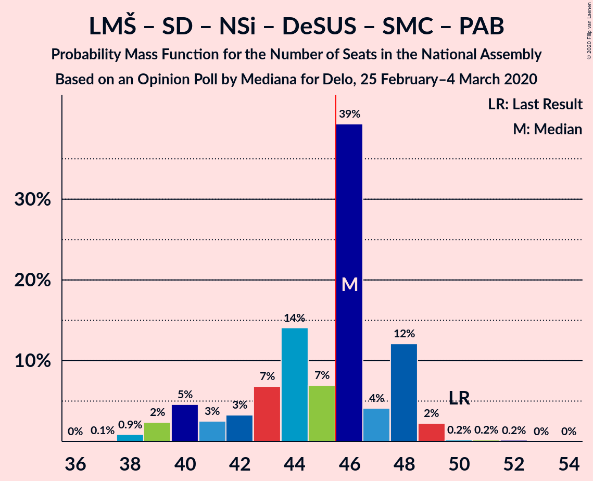

| Number of Seats | Probability | Accumulated | Special Marks |
|:---------------:|:-----------:|:-----------:|:-------------:|
| 37 | 0.1% | 100% |  |
| 38 | 0.9% | 99.8% |  |
| 39 | 2% | 99.0% |  |
| 40 | 5% | 97% |  |
| 41 | 3% | 92% |  |
| 42 | 3% | 89% |  |
| 43 | 7% | 86% |  |
| 44 | 14% | 79% | Median |
| 45 | 7% | 65% |  |
| 46 | 39% | 58% | Majority |
| 47 | 4% | 19% |  |
| 48 | 12% | 15% |  |
| 49 | 2% | 3% |  |
| 50 | 0.2% | 0.5% | Last Result |
| 51 | 0.2% | 0.4% |  |
| 52 | 0.2% | 0.2% |  |
| 53 | 0% | 0% |  |

### Lista Marjana Šarca – Socialni demokrati – Nova Slovenija–Krščanski demokrati – Demokratična stranka upokojencev Slovenije – Stranka modernega centra

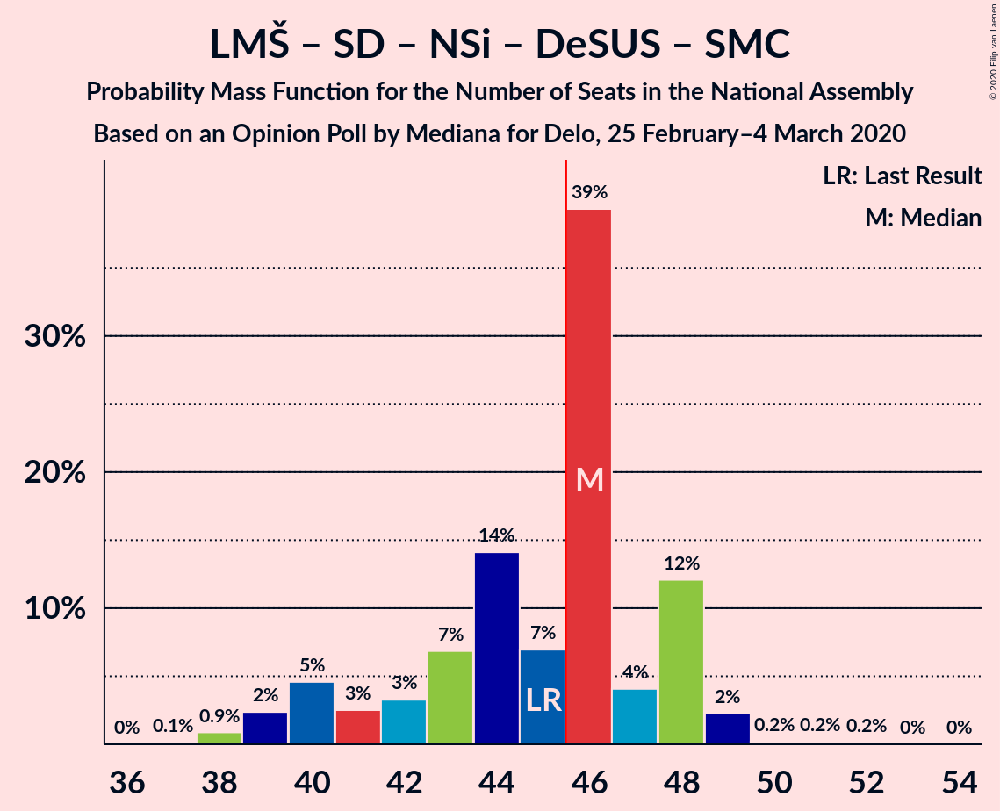

| Number of Seats | Probability | Accumulated | Special Marks |
|:---------------:|:-----------:|:-----------:|:-------------:|
| 37 | 0.1% | 100% |  |
| 38 | 0.9% | 99.8% |  |
| 39 | 2% | 99.0% |  |
| 40 | 5% | 97% |  |
| 41 | 3% | 92% |  |
| 42 | 3% | 89% |  |
| 43 | 7% | 86% |  |
| 44 | 14% | 79% | Median |
| 45 | 7% | 65% | Last Result |
| 46 | 39% | 58% | Majority |
| 47 | 4% | 19% |  |
| 48 | 12% | 15% |  |
| 49 | 2% | 3% |  |
| 50 | 0.2% | 0.5% |  |
| 51 | 0.2% | 0.4% |  |
| 52 | 0.2% | 0.2% |  |
| 53 | 0% | 0% |  |

### Lista Marjana Šarca – Socialni demokrati – Nova Slovenija–Krščanski demokrati – Demokratična stranka upokojencev Slovenije

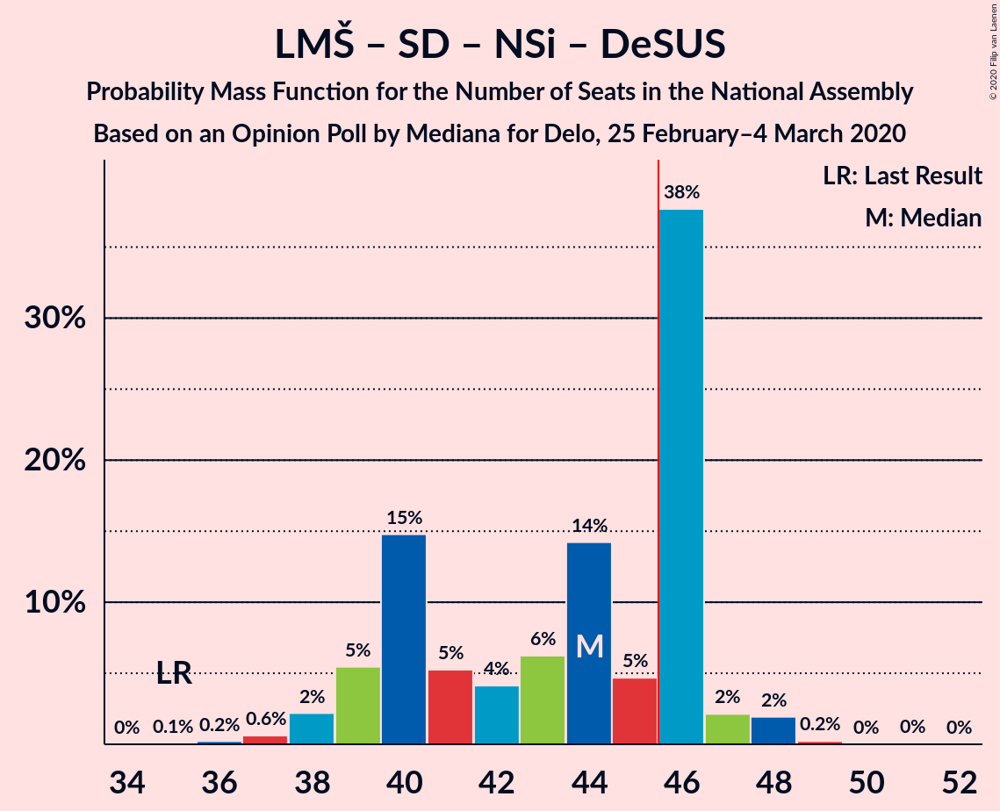

| Number of Seats | Probability | Accumulated | Special Marks |
|:---------------:|:-----------:|:-----------:|:-------------:|
| 35 | 0.1% | 100% | Last Result |
| 36 | 0.2% | 99.9% |  |
| 37 | 0.6% | 99.7% |  |
| 38 | 2% | 99.1% |  |
| 39 | 5% | 97% |  |
| 40 | 15% | 91% |  |
| 41 | 5% | 77% |  |
| 42 | 4% | 71% |  |
| 43 | 6% | 67% |  |
| 44 | 14% | 61% | Median |
| 45 | 5% | 47% |  |
| 46 | 38% | 42% | Majority |
| 47 | 2% | 4% |  |
| 48 | 2% | 2% |  |
| 49 | 0.2% | 0.3% |  |
| 50 | 0% | 0.1% |  |
| 51 | 0% | 0% |  |

### Lista Marjana Šarca – Socialni demokrati – Nova Slovenija–Krščanski demokrati – Stranka modernega centra

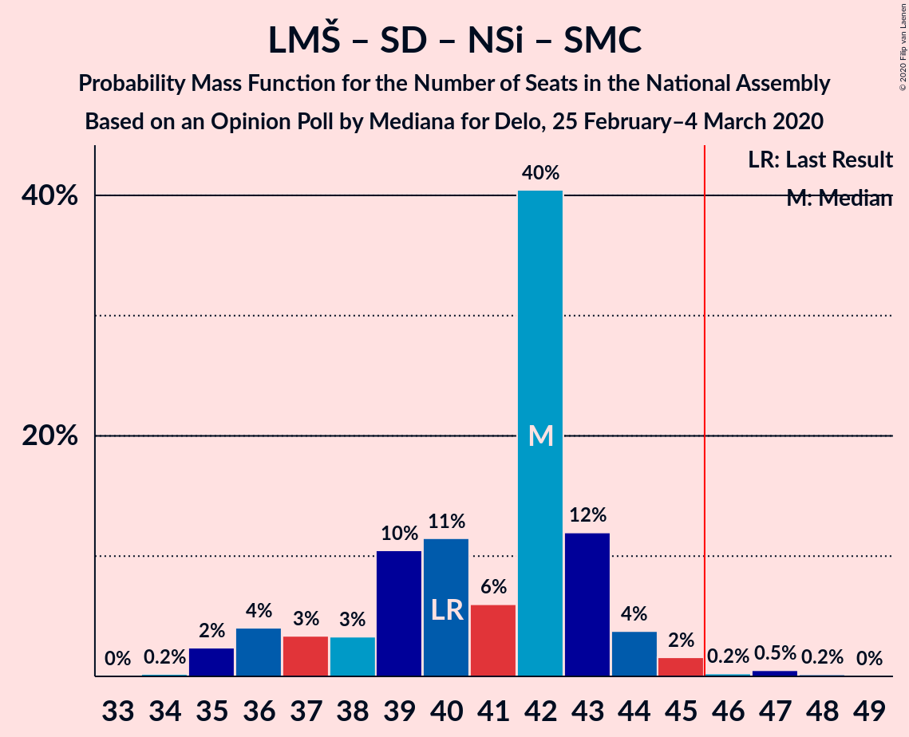

| Number of Seats | Probability | Accumulated | Special Marks |
|:---------------:|:-----------:|:-----------:|:-------------:|
| 34 | 0.2% | 100% |  |
| 35 | 2% | 99.8% |  |
| 36 | 4% | 97% |  |
| 37 | 3% | 93% |  |
| 38 | 3% | 90% |  |
| 39 | 10% | 87% |  |
| 40 | 11% | 76% | Last Result, Median |
| 41 | 6% | 65% |  |
| 42 | 40% | 59% |  |
| 43 | 12% | 18% |  |
| 44 | 4% | 6% |  |
| 45 | 2% | 3% |  |
| 46 | 0.2% | 0.9% | Majority |
| 47 | 0.5% | 0.7% |  |
| 48 | 0.2% | 0.2% |  |
| 49 | 0% | 0% |  |

### Lista Marjana Šarca – Socialni demokrati – Nova Slovenija–Krščanski demokrati

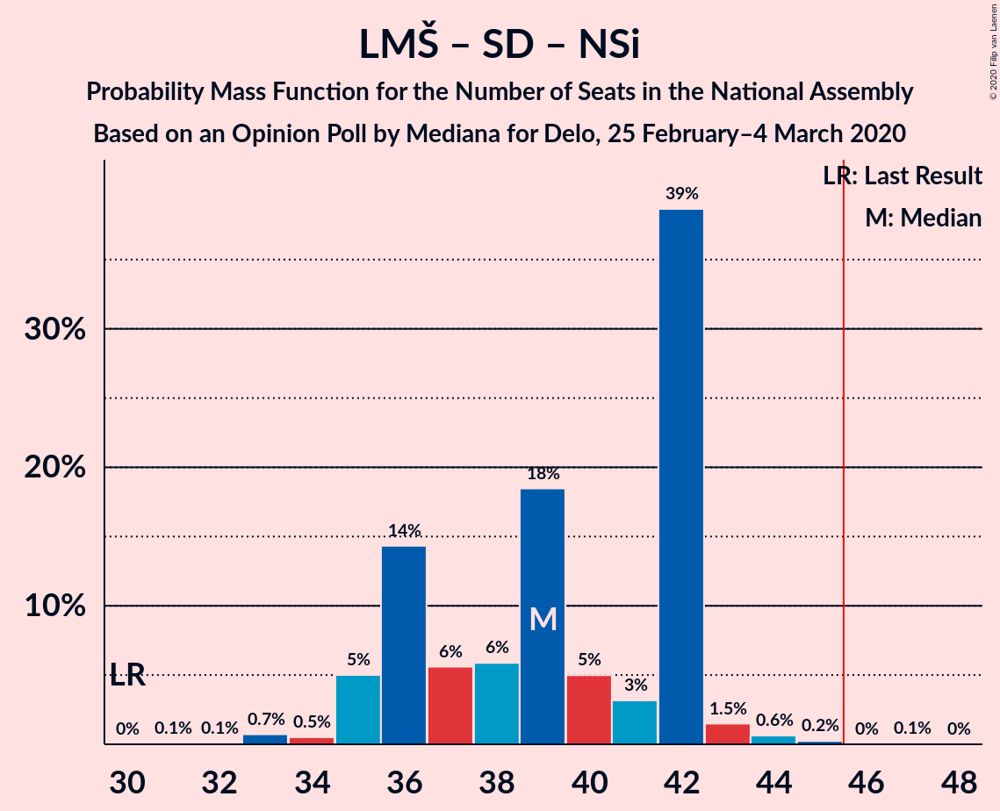

| Number of Seats | Probability | Accumulated | Special Marks |
|:---------------:|:-----------:|:-----------:|:-------------:|
| 30 | 0% | 100% | Last Result |
| 31 | 0.1% | 100% |  |
| 32 | 0.1% | 99.9% |  |
| 33 | 0.7% | 99.9% |  |
| 34 | 0.5% | 99.1% |  |
| 35 | 5% | 98.6% |  |
| 36 | 14% | 94% |  |
| 37 | 6% | 79% |  |
| 38 | 6% | 74% |  |
| 39 | 18% | 68% |  |
| 40 | 5% | 49% | Median |
| 41 | 3% | 44% |  |
| 42 | 39% | 41% |  |
| 43 | 1.5% | 2% |  |
| 44 | 0.6% | 1.0% |  |
| 45 | 0.2% | 0.4% |  |
| 46 | 0% | 0.1% | Majority |
| 47 | 0.1% | 0.1% |  |
| 48 | 0% | 0% |  |

### Lista Marjana Šarca – Socialni demokrati – Demokratična stranka upokojencev Slovenije – Stranka modernega centra – Stranka Alenke Bratušek

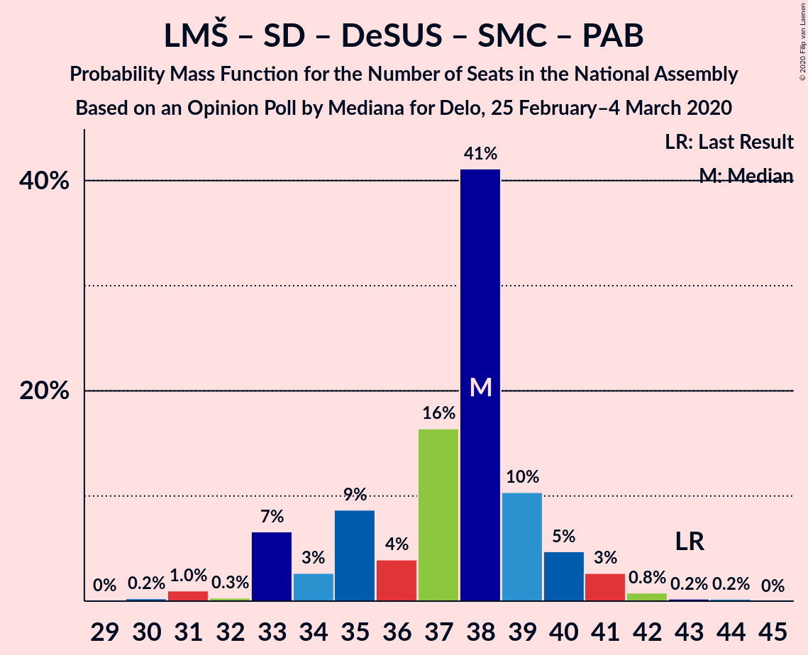

| Number of Seats | Probability | Accumulated | Special Marks |
|:---------------:|:-----------:|:-----------:|:-------------:|
| 30 | 0.2% | 100% |  |
| 31 | 1.0% | 99.7% |  |
| 32 | 0.3% | 98.7% |  |
| 33 | 7% | 98% |  |
| 34 | 3% | 92% |  |
| 35 | 9% | 89% |  |
| 36 | 4% | 80% | Median |
| 37 | 16% | 77% |  |
| 38 | 41% | 60% |  |
| 39 | 10% | 19% |  |
| 40 | 5% | 9% |  |
| 41 | 3% | 4% |  |
| 42 | 0.8% | 1.2% |  |
| 43 | 0.2% | 0.5% | Last Result |
| 44 | 0.2% | 0.2% |  |
| 45 | 0% | 0% |  |

### Lista Marjana Šarca – Socialni demokrati – Demokratična stranka upokojencev Slovenije – Stranka modernega centra

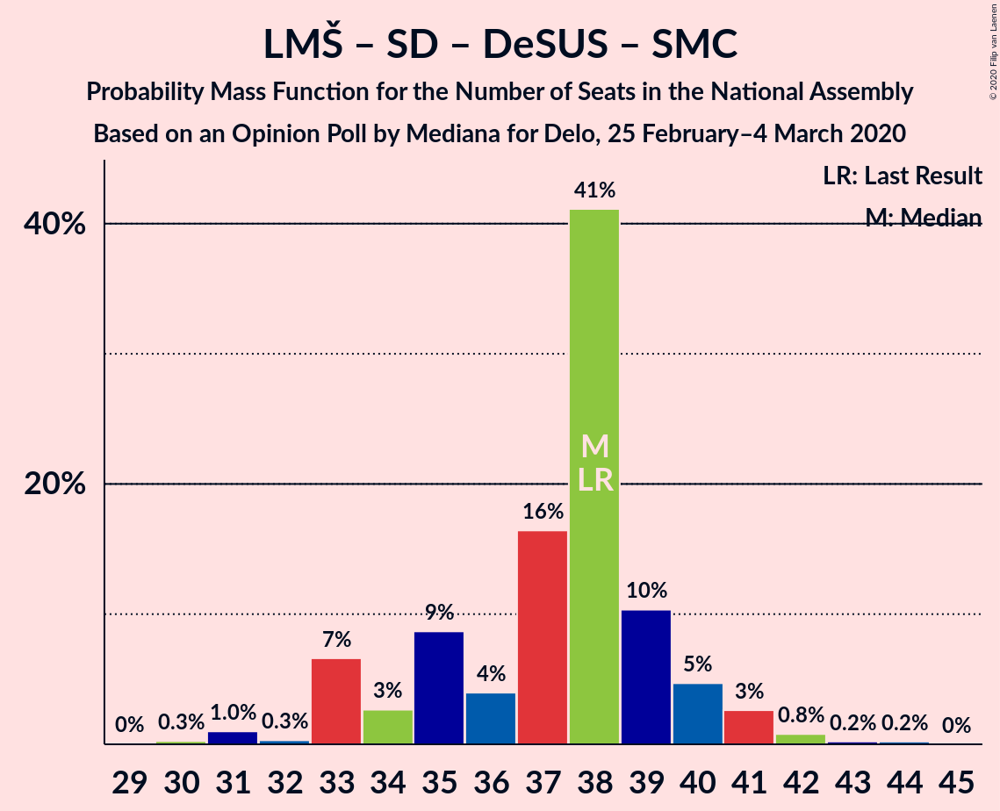

| Number of Seats | Probability | Accumulated | Special Marks |
|:---------------:|:-----------:|:-----------:|:-------------:|
| 30 | 0.3% | 100% |  |
| 31 | 1.0% | 99.7% |  |
| 32 | 0.3% | 98.7% |  |
| 33 | 7% | 98% |  |
| 34 | 3% | 92% |  |
| 35 | 9% | 89% |  |
| 36 | 4% | 80% | Median |
| 37 | 16% | 76% |  |
| 38 | 41% | 60% | Last Result |
| 39 | 10% | 19% |  |
| 40 | 5% | 9% |  |
| 41 | 3% | 4% |  |
| 42 | 0.8% | 1.2% |  |
| 43 | 0.2% | 0.4% |  |
| 44 | 0.2% | 0.2% |  |
| 45 | 0% | 0% |  |

### Lista Marjana Šarca – Socialni demokrati – Demokratična stranka upokojencev Slovenije

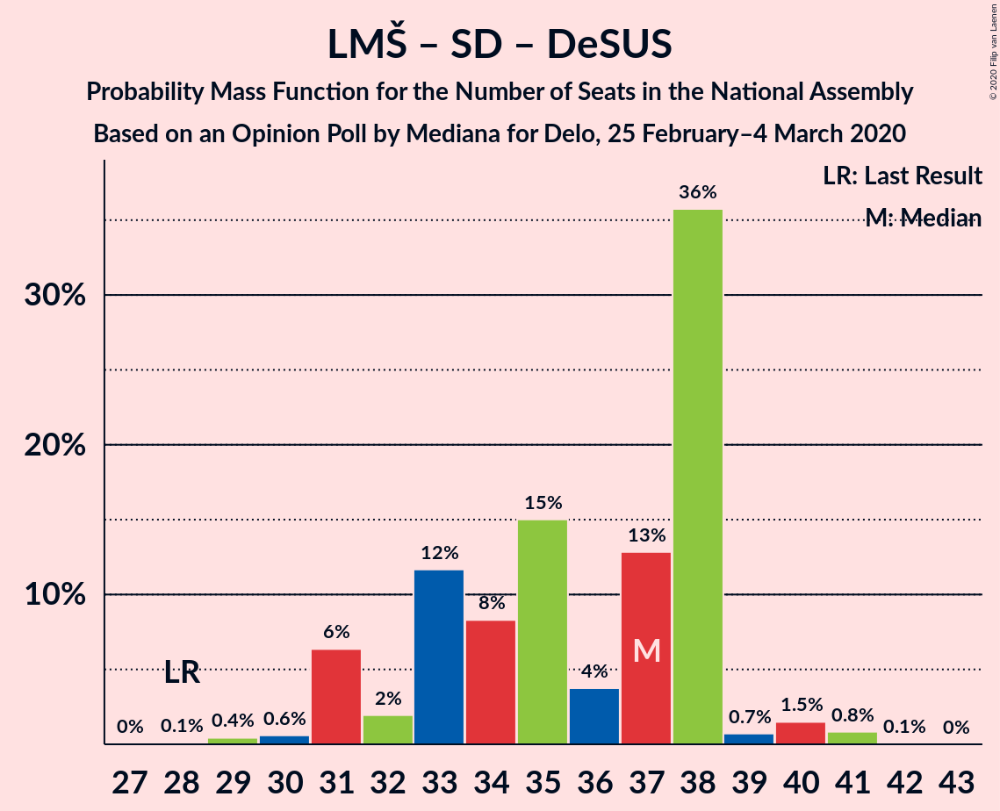

| Number of Seats | Probability | Accumulated | Special Marks |
|:---------------:|:-----------:|:-----------:|:-------------:|
| 27 | 0% | 100% |  |
| 28 | 0.1% | 99.9% | Last Result |
| 29 | 0.4% | 99.8% |  |
| 30 | 0.6% | 99.4% |  |
| 31 | 6% | 98.8% |  |
| 32 | 2% | 92% |  |
| 33 | 12% | 90% |  |
| 34 | 8% | 79% |  |
| 35 | 15% | 71% |  |
| 36 | 4% | 55% | Median |
| 37 | 13% | 52% |  |
| 38 | 36% | 39% |  |
| 39 | 0.7% | 3% |  |
| 40 | 1.5% | 2% |  |
| 41 | 0.8% | 0.9% |  |
| 42 | 0.1% | 0.1% |  |
| 43 | 0% | 0% |  |

### Lista Marjana Šarca – Socialni demokrati – Stranka modernega centra

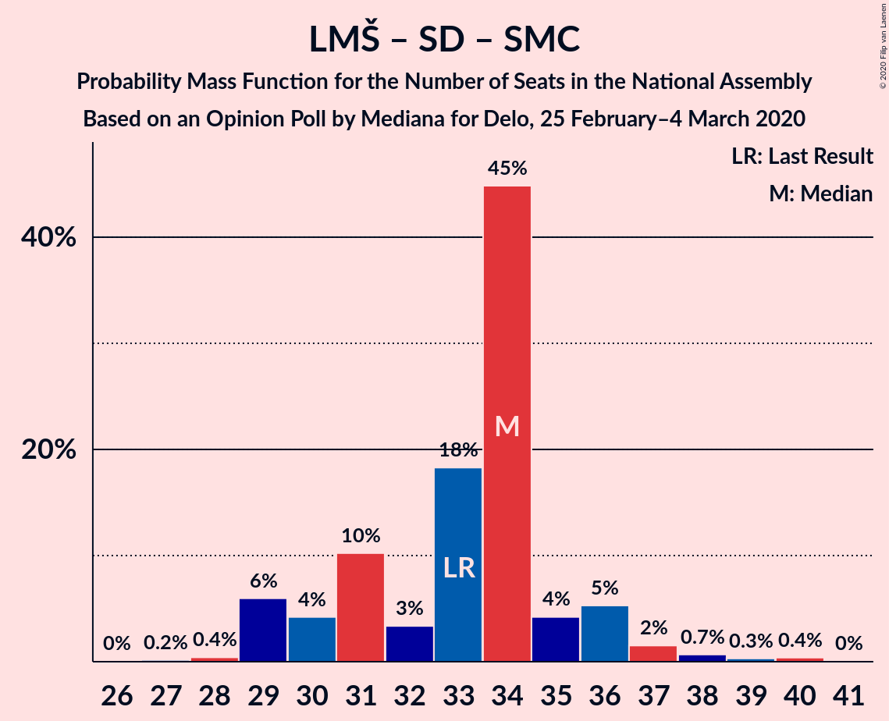

| Number of Seats | Probability | Accumulated | Special Marks |
|:---------------:|:-----------:|:-----------:|:-------------:|
| 27 | 0.2% | 100% |  |
| 28 | 0.4% | 99.8% |  |
| 29 | 6% | 99.4% |  |
| 30 | 4% | 93% |  |
| 31 | 10% | 89% |  |
| 32 | 3% | 79% | Median |
| 33 | 18% | 76% | Last Result |
| 34 | 45% | 57% |  |
| 35 | 4% | 12% |  |
| 36 | 5% | 8% |  |
| 37 | 2% | 3% |  |
| 38 | 0.7% | 1.4% |  |
| 39 | 0.3% | 0.7% |  |
| 40 | 0.4% | 0.4% |  |
| 41 | 0% | 0% |  |

### Lista Marjana Šarca – Socialni demokrati

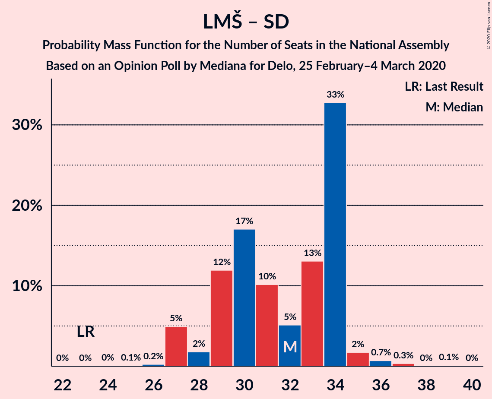

| Number of Seats | Probability | Accumulated | Special Marks |
|:---------------:|:-----------:|:-----------:|:-------------:|
| 23 | 0% | 100% | Last Result |
| 24 | 0% | 100% |  |
| 25 | 0.1% | 100% |  |
| 26 | 0.2% | 99.9% |  |
| 27 | 5% | 99.6% |  |
| 28 | 2% | 95% |  |
| 29 | 12% | 93% |  |
| 30 | 17% | 81% |  |
| 31 | 10% | 64% |  |
| 32 | 5% | 54% | Median |
| 33 | 13% | 49% |  |
| 34 | 33% | 36% |  |
| 35 | 2% | 3% |  |
| 36 | 0.7% | 1.1% |  |
| 37 | 0.3% | 0.5% |  |
| 38 | 0% | 0.1% |  |
| 39 | 0.1% | 0.1% |  |
| 40 | 0% | 0% |  |

### Socialni demokrati – Demokratična stranka upokojencev Slovenije – Stranka modernega centra

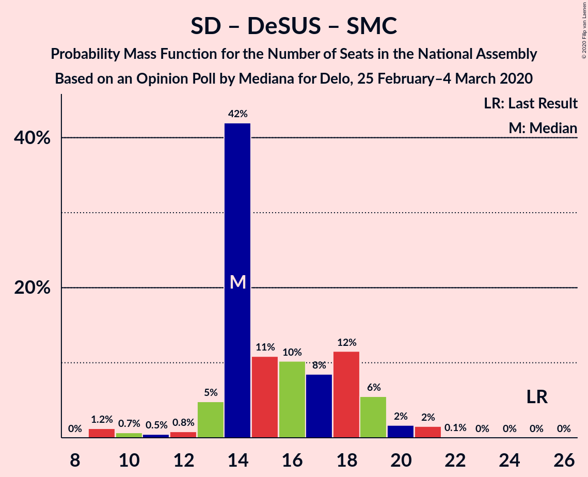

| Number of Seats | Probability | Accumulated | Special Marks |
|:---------------:|:-----------:|:-----------:|:-------------:|
| 9 | 1.2% | 100% |  |
| 10 | 0.7% | 98.7% |  |
| 11 | 0.5% | 98% |  |
| 12 | 0.8% | 98% |  |
| 13 | 5% | 97% |  |
| 14 | 42% | 92% | Median |
| 15 | 11% | 50% |  |
| 16 | 10% | 39% |  |
| 17 | 8% | 29% |  |
| 18 | 12% | 20% |  |
| 19 | 6% | 9% |  |
| 20 | 2% | 3% |  |
| 21 | 2% | 2% |  |
| 22 | 0.1% | 0.2% |  |
| 23 | 0% | 0% |  |
| 24 | 0% | 0% |  |
| 25 | 0% | 0% | Last Result |

## Technical Information

### Opinion Poll

+ **Polling firm:** Mediana
+ **Commissioner(s):** Delo
+ **Fieldwork period:** 25 February–4 March 2020

### Calculations

+ **Sample size:** 777
+ **Simulations done:** 1,048,576
+ **Error estimate:** 2.47%

