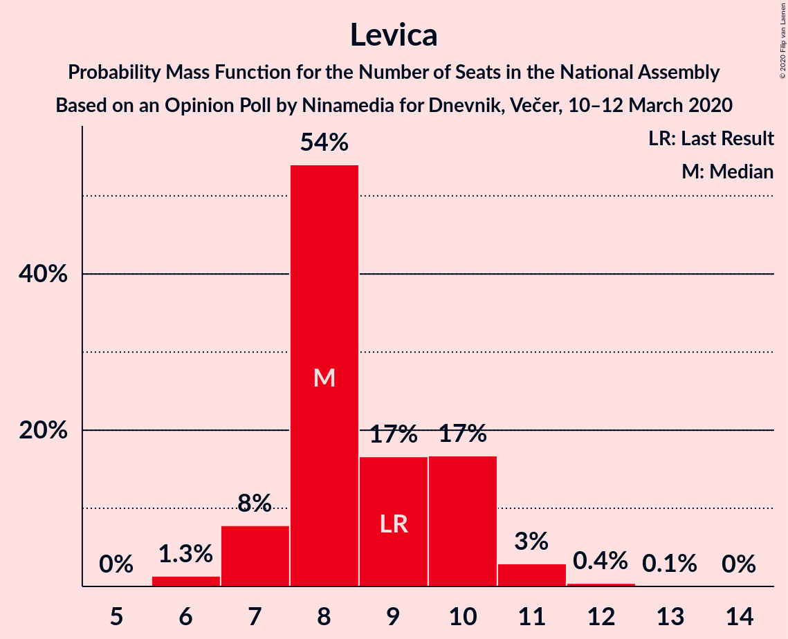

# Opinion Poll by Ninamedia for Dnevnik, Večer, 10–12 March 2020

<a href="#voting-intentions">Voting Intentions</a> | <a href="#seats">Seats</a> | <a href="#coalitions">Coalitions</a> | <a href="#technical-information">Technical Information</a>

## Voting Intentions

### Confidence Intervals

| Party | Last Result | Poll Result | 80% Confidence Interval | 90% Confidence Interval | 95% Confidence Interval | 99% Confidence Interval |
|:-----:|:-----------:|:-----------:|:-----------------------:|:-----------------------:|:-----------------------:|:-----------------------:|
| Slovenska demokratska stranka | 24.9% | 34.1% | 31.9–36.5% |31.3–37.2% |30.7–37.7% |29.7–38.9% |
| Lista Marjana Šarca | 12.6% | 21.9% | 20.0–24.0% |19.4–24.6% |18.9–25.1% |18.1–26.1% |
| Socialni demokrati | 9.9% | 13.6% | 12.0–15.4% |11.6–15.9% |11.2–16.3% |10.5–17.2% |
| Levica | 9.3% | 9.3% | 8.0–10.8% |7.7–11.3% |7.3–11.7% |6.8–12.5% |
| Nova Slovenija–Krščanski demokrati | 7.2% | 9.1% | 7.9–10.7% |7.5–11.1% |7.2–11.5% |6.7–12.3% |
| Slovenska nacionalna stranka | 4.2% | 4.1% | 3.3–5.3% |3.1–5.6% |2.9–5.9% |2.5–6.5% |
| Demokratična stranka upokojencev Slovenije | 4.9% | 3.9% | 3.1–5.0% |2.9–5.3% |2.7–5.6% |2.3–6.1% |
| Slovenska ljudska stranka | 2.6% | 1.6% | 1.1–2.4% |1.0–2.6% |0.9–2.8% |0.7–3.2% |
| Stranka Alenke Bratušek | 5.1% | 1.0% | 0.7–1.7% |0.6–1.9% |0.5–2.1% |0.4–2.4% |
| Stranka modernega centra | 9.7% | 0.7% | 0.4–1.3% |0.4–1.5% |0.3–1.7% |0.2–2.0% |

*Note:* The poll result column reflects the actual value used in the calculations. Published results may vary slightly, and in addition be rounded to fewer digits.

## Seats

### Confidence Intervals

| Party | Last Result | Median | 80% Confidence Interval | 90% Confidence Interval | 95% Confidence Interval | 99% Confidence Interval |
|:-----:|:-----------:|:------:|:-----------------------:|:-----------------------:|:-----------------------:|:-----------------------:|
| <a href="#slovenska-demokratska-stranka">Slovenska demokratska stranka</a> | 25 | 32 | 30–35 |30–37 |29–37 |28–38 |
| <a href="#lista-marjana-šarca">Lista Marjana Šarca</a> | 13 | 20 | 19–23 |18–23 |18–24 |17–25 |
| <a href="#socialni-demokrati">Socialni demokrati</a> | 10 | 12 | 12–14 |11–15 |11–15 |10–17 |
| <a href="#levica">Levica</a> | 9 | 8 | 8–10 |7–10 |7–11 |6–12 |
| <a href="#nova-slovenija–krščanski-demokrati">Nova Slovenija–Krščanski demokrati</a> | 7 | 8 | 7–10 |7–10 |7–10 |6–11 |
| <a href="#slovenska-nacionalna-stranka">Slovenska nacionalna stranka</a> | 4 | 4 | 0–5 |0–5 |0–5 |0–6 |
| <a href="#demokratična-stranka-upokojencev-slovenije">Demokratična stranka upokojencev Slovenije</a> | 5 | 4 | 0–4 |0–4 |0–4 |0–5 |
| <a href="#slovenska-ljudska-stranka">Slovenska ljudska stranka</a> | 0 | 0 | 0 |0 |0 |0 |
| <a href="#stranka-alenke-bratušek">Stranka Alenke Bratušek</a> | 5 | 0 | 0 |0 |0 |0 |
| <a href="#stranka-modernega-centra">Stranka modernega centra</a> | 10 | 0 | 0 |0 |0 |0 |

### Slovenska demokratska stranka

*For a full overview of the results for this party, see the [Slovenska demokratska stranka](party-slovenskademokratskastranka.html) page.*

| Number of Seats | Probability | Accumulated | Special Marks |
|:---------------:|:-----------:|:-----------:|:-------------:|
| 25 | 0% | 100% | Last Result |
| 26 | 0% | 100% |  |
| 27 | 0.1% | 100% |  |
| 28 | 1.3% | 99.9% |  |
| 29 | 1.4% | 98.6% |  |
| 30 | 11% | 97% |  |
| 31 | 5% | 86% |  |
| 32 | 52% | 81% | Median |
| 33 | 16% | 30% |  |
| 34 | 3% | 14% |  |
| 35 | 2% | 11% |  |
| 36 | 3% | 9% |  |
| 37 | 5% | 6% |  |
| 38 | 0.8% | 0.9% |  |
| 39 | 0.1% | 0.1% |  |
| 40 | 0% | 0% |  |

### Lista Marjana Šarca

*For a full overview of the results for this party, see the [Lista Marjana Šarca](party-listamarjanašarca.html) page.*

| Number of Seats | Probability | Accumulated | Special Marks |
|:---------------:|:-----------:|:-----------:|:-------------:|
| 13 | 0% | 100% | Last Result |
| 14 | 0% | 100% |  |
| 15 | 0% | 100% |  |
| 16 | 0.2% | 100% |  |
| 17 | 0.6% | 99.8% |  |
| 18 | 4% | 99.2% |  |
| 19 | 8% | 95% |  |
| 20 | 46% | 87% | Median |
| 21 | 16% | 41% |  |
| 22 | 9% | 25% |  |
| 23 | 11% | 15% |  |
| 24 | 3% | 4% |  |
| 25 | 0.7% | 0.9% |  |
| 26 | 0.1% | 0.3% |  |
| 27 | 0.2% | 0.2% |  |
| 28 | 0% | 0% |  |

### Socialni demokrati

*For a full overview of the results for this party, see the [Socialni demokrati](party-socialnidemokrati.html) page.*

| Number of Seats | Probability | Accumulated | Special Marks |
|:---------------:|:-----------:|:-----------:|:-------------:|
| 9 | 0.5% | 100% |  |
| 10 | 2% | 99.5% | Last Result |
| 11 | 4% | 98% |  |
| 12 | 53% | 94% | Median |
| 13 | 11% | 40% |  |
| 14 | 21% | 29% |  |
| 15 | 6% | 8% |  |
| 16 | 0.6% | 2% |  |
| 17 | 1.0% | 1.0% |  |
| 18 | 0% | 0% |  |

### Levica

*For a full overview of the results for this party, see the [Levica](party-levica.html) page.*

| Number of Seats | Probability | Accumulated | Special Marks |
|:---------------:|:-----------:|:-----------:|:-------------:|
| 6 | 1.3% | 100% |  |
| 7 | 8% | 98.6% |  |
| 8 | 54% | 91% | Median |
| 9 | 17% | 37% | Last Result |
| 10 | 17% | 20% |  |
| 11 | 3% | 3% |  |
| 12 | 0.4% | 0.5% |  |
| 13 | 0.1% | 0.1% |  |
| 14 | 0% | 0% |  |

### Nova Slovenija–Krščanski demokrati

*For a full overview of the results for this party, see the [Nova Slovenija–Krščanski demokrati](party-novaslovenija–krščanskidemokrati.html) page.*

| Number of Seats | Probability | Accumulated | Special Marks |
|:---------------:|:-----------:|:-----------:|:-------------:|
| 6 | 2% | 100% |  |
| 7 | 10% | 98% | Last Result |
| 8 | 58% | 88% | Median |
| 9 | 17% | 30% |  |
| 10 | 11% | 13% |  |
| 11 | 2% | 2% |  |
| 12 | 0.4% | 0.4% |  |
| 13 | 0% | 0% |  |

### Slovenska nacionalna stranka

*For a full overview of the results for this party, see the [Slovenska nacionalna stranka](party-slovenskanacionalnastranka.html) page.*

| Number of Seats | Probability | Accumulated | Special Marks |
|:---------------:|:-----------:|:-----------:|:-------------:|
| 0 | 26% | 100% |  |
| 1 | 0% | 74% |  |
| 2 | 0% | 74% |  |
| 3 | 8% | 74% |  |
| 4 | 52% | 65% | Last Result, Median |
| 5 | 13% | 13% |  |
| 6 | 0.6% | 0.6% |  |
| 7 | 0% | 0% |  |

### Demokratična stranka upokojencev Slovenije

*For a full overview of the results for this party, see the [Demokratična stranka upokojencev Slovenije](party-demokratičnastrankaupokojencevslovenije.html) page.*

| Number of Seats | Probability | Accumulated | Special Marks |
|:---------------:|:-----------:|:-----------:|:-------------:|
| 0 | 37% | 100% |  |
| 1 | 0% | 63% |  |
| 2 | 0% | 63% |  |
| 3 | 6% | 63% |  |
| 4 | 54% | 57% | Median |
| 5 | 2% | 2% | Last Result |
| 6 | 0.1% | 0.1% |  |
| 7 | 0% | 0% |  |

### Slovenska ljudska stranka

*For a full overview of the results for this party, see the [Slovenska ljudska stranka](party-slovenskaljudskastranka.html) page.*

| Number of Seats | Probability | Accumulated | Special Marks |
|:---------------:|:-----------:|:-----------:|:-------------:|
| 0 | 100% | 100% | Last Result, Median |

### Stranka Alenke Bratušek

*For a full overview of the results for this party, see the [Stranka Alenke Bratušek](party-strankaalenkebratušek.html) page.*

| Number of Seats | Probability | Accumulated | Special Marks |
|:---------------:|:-----------:|:-----------:|:-------------:|
| 0 | 100% | 100% | Median |
| 1 | 0% | 0% |  |
| 2 | 0% | 0% |  |
| 3 | 0% | 0% |  |
| 4 | 0% | 0% |  |
| 5 | 0% | 0% | Last Result |

### Stranka modernega centra

*For a full overview of the results for this party, see the [Stranka modernega centra](party-strankamodernegacentra.html) page.*

| Number of Seats | Probability | Accumulated | Special Marks |
|:---------------:|:-----------:|:-----------:|:-------------:|
| 0 | 100% | 100% | Median |
| 1 | 0% | 0% |  |
| 2 | 0% | 0% |  |
| 3 | 0% | 0% |  |
| 4 | 0% | 0% |  |
| 5 | 0% | 0% |  |
| 6 | 0% | 0% |  |
| 7 | 0% | 0% |  |
| 8 | 0% | 0% |  |
| 9 | 0% | 0% |  |
| 10 | 0% | 0% | Last Result |

## Coalitions

### Confidence Intervals

| Coalition | Last Result | Median | Majority? | 80% Confidence Interval | 90% Confidence Interval | 95% Confidence Interval | 99% Confidence Interval |
|:---------:|:-----------:|:------:|:---------:|:-----------------------:|:-----------------------:|:-----------------------:|:-----------------------:|
| Slovenska demokratska stranka – Lista Marjana Šarca – Demokratična stranka upokojencev Slovenije | 43 | 56 | 100% | 53–58 | 52–59 | 51–59 | 50–61 |
| Slovenska demokratska stranka – Lista Marjana Šarca | 38 | 52 | 100% | 51–56 | 50–57 | 50–58 | 48–59 |
| Lista Marjana Šarca – Socialni demokrati – Nova Slovenija–Krščanski demokrati – Demokratična stranka upokojencev Slovenije | 35 | 44 | 21% | 41–47 | 41–47 | 40–49 | 39–49 |
| Lista Marjana Šarca – Socialni demokrati – Nova Slovenija–Krščanski demokrati – Demokratična stranka upokojencev Slovenije – Stranka Alenke Bratušek – Stranka modernega centra | 50 | 44 | 21% | 41–47 | 41–47 | 40–49 | 39–49 |
| Lista Marjana Šarca – Socialni demokrati – Nova Slovenija–Krščanski demokrati – Demokratična stranka upokojencev Slovenije – Stranka modernega centra | 45 | 44 | 21% | 41–47 | 41–47 | 40–49 | 39–49 |
| Lista Marjana Šarca – Socialni demokrati – Nova Slovenija–Krščanski demokrati | 30 | 41 | 4% | 40–45 | 40–45 | 38–46 | 37–47 |
| Lista Marjana Šarca – Socialni demokrati – Nova Slovenija–Krščanski demokrati – Stranka modernega centra | 40 | 41 | 4% | 40–45 | 40–45 | 38–46 | 37–47 |
| Lista Marjana Šarca – Socialni demokrati – Demokratična stranka upokojencev Slovenije | 28 | 36 | 0% | 33–39 | 32–39 | 31–40 | 30–41 |
| Lista Marjana Šarca – Socialni demokrati – Demokratična stranka upokojencev Slovenije – Stranka Alenke Bratušek – Stranka modernega centra | 43 | 36 | 0% | 33–39 | 32–39 | 31–40 | 30–41 |
| Lista Marjana Šarca – Socialni demokrati – Demokratična stranka upokojencev Slovenije – Stranka modernega centra | 38 | 36 | 0% | 33–39 | 32–39 | 31–40 | 30–41 |
| Lista Marjana Šarca – Socialni demokrati | 23 | 33 | 0% | 32–36 | 31–37 | 30–38 | 29–39 |
| Lista Marjana Šarca – Socialni demokrati – Stranka modernega centra | 33 | 33 | 0% | 32–36 | 31–37 | 30–38 | 29–39 |
| Socialni demokrati – Demokratična stranka upokojencev Slovenije – Stranka modernega centra | 25 | 16 | 0% | 12–18 | 12–18 | 11–19 | 11–19 |

### Slovenska demokratska stranka – Lista Marjana Šarca – Demokratična stranka upokojencev Slovenije

| Number of Seats | Probability | Accumulated | Special Marks |
|:---------------:|:-----------:|:-----------:|:-------------:|
| 43 | 0% | 100% | Last Result |
| 44 | 0% | 100% |  |
| 45 | 0% | 100% |  |
| 46 | 0% | 100% | Majority |
| 47 | 0% | 100% |  |
| 48 | 0% | 100% |  |
| 49 | 0.2% | 100% |  |
| 50 | 1.0% | 99.7% |  |
| 51 | 1.5% | 98.7% |  |
| 52 | 4% | 97% |  |
| 53 | 12% | 94% |  |
| 54 | 6% | 81% |  |
| 55 | 12% | 75% |  |
| 56 | 46% | 63% | Median |
| 57 | 6% | 17% |  |
| 58 | 4% | 11% |  |
| 59 | 5% | 7% |  |
| 60 | 1.5% | 2% |  |
| 61 | 0.4% | 0.6% |  |
| 62 | 0.2% | 0.2% |  |
| 63 | 0% | 0% |  |

### Slovenska demokratska stranka – Lista Marjana Šarca

| Number of Seats | Probability | Accumulated | Special Marks |
|:---------------:|:-----------:|:-----------:|:-------------:|
| 38 | 0% | 100% | Last Result |
| 39 | 0% | 100% |  |
| 40 | 0% | 100% |  |
| 41 | 0% | 100% |  |
| 42 | 0% | 100% |  |
| 43 | 0% | 100% |  |
| 44 | 0% | 100% |  |
| 45 | 0% | 100% |  |
| 46 | 0% | 100% | Majority |
| 47 | 0.1% | 100% |  |
| 48 | 0.8% | 99.9% |  |
| 49 | 1.0% | 99.1% |  |
| 50 | 5% | 98% |  |
| 51 | 11% | 94% |  |
| 52 | 39% | 82% | Median |
| 53 | 13% | 43% |  |
| 54 | 5% | 30% |  |
| 55 | 7% | 25% |  |
| 56 | 10% | 17% |  |
| 57 | 4% | 7% |  |
| 58 | 2% | 3% |  |
| 59 | 1.1% | 2% |  |
| 60 | 0.4% | 0.5% |  |
| 61 | 0% | 0.1% |  |
| 62 | 0% | 0% |  |

### Lista Marjana Šarca – Socialni demokrati – Nova Slovenija–Krščanski demokrati – Demokratična stranka upokojencev Slovenije

| Number of Seats | Probability | Accumulated | Special Marks |
|:---------------:|:-----------:|:-----------:|:-------------:|
| 35 | 0% | 100% | Last Result |
| 36 | 0% | 100% |  |
| 37 | 0.1% | 100% |  |
| 38 | 0.1% | 99.9% |  |
| 39 | 1.0% | 99.7% |  |
| 40 | 2% | 98.7% |  |
| 41 | 7% | 96% |  |
| 42 | 5% | 90% |  |
| 43 | 10% | 84% |  |
| 44 | 43% | 74% | Median |
| 45 | 10% | 31% |  |
| 46 | 6% | 21% | Majority |
| 47 | 10% | 15% |  |
| 48 | 1.4% | 4% |  |
| 49 | 2% | 3% |  |
| 50 | 0.3% | 0.4% |  |
| 51 | 0.1% | 0.1% |  |
| 52 | 0% | 0% |  |

### Lista Marjana Šarca – Socialni demokrati – Nova Slovenija–Krščanski demokrati – Demokratična stranka upokojencev Slovenije – Stranka Alenke Bratušek – Stranka modernega centra

| Number of Seats | Probability | Accumulated | Special Marks |
|:---------------:|:-----------:|:-----------:|:-------------:|
| 37 | 0.1% | 100% |  |
| 38 | 0.1% | 99.9% |  |
| 39 | 1.0% | 99.7% |  |
| 40 | 2% | 98.7% |  |
| 41 | 7% | 96% |  |
| 42 | 5% | 90% |  |
| 43 | 10% | 84% |  |
| 44 | 43% | 74% | Median |
| 45 | 10% | 31% |  |
| 46 | 6% | 21% | Majority |
| 47 | 10% | 15% |  |
| 48 | 1.4% | 4% |  |
| 49 | 2% | 3% |  |
| 50 | 0.3% | 0.4% | Last Result |
| 51 | 0.1% | 0.1% |  |
| 52 | 0% | 0% |  |

### Lista Marjana Šarca – Socialni demokrati – Nova Slovenija–Krščanski demokrati – Demokratična stranka upokojencev Slovenije – Stranka modernega centra

| Number of Seats | Probability | Accumulated | Special Marks |
|:---------------:|:-----------:|:-----------:|:-------------:|
| 37 | 0.1% | 100% |  |
| 38 | 0.1% | 99.9% |  |
| 39 | 1.0% | 99.7% |  |
| 40 | 2% | 98.7% |  |
| 41 | 7% | 96% |  |
| 42 | 5% | 90% |  |
| 43 | 10% | 84% |  |
| 44 | 43% | 74% | Median |
| 45 | 10% | 31% | Last Result |
| 46 | 6% | 21% | Majority |
| 47 | 10% | 15% |  |
| 48 | 1.4% | 4% |  |
| 49 | 2% | 3% |  |
| 50 | 0.3% | 0.4% |  |
| 51 | 0.1% | 0.1% |  |
| 52 | 0% | 0% |  |

### Lista Marjana Šarca – Socialni demokrati – Nova Slovenija–Krščanski demokrati

| Number of Seats | Probability | Accumulated | Special Marks |
|:---------------:|:-----------:|:-----------:|:-------------:|
| 30 | 0% | 100% | Last Result |
| 31 | 0% | 100% |  |
| 32 | 0% | 100% |  |
| 33 | 0% | 100% |  |
| 34 | 0% | 100% |  |
| 35 | 0% | 100% |  |
| 36 | 0.2% | 100% |  |
| 37 | 0.4% | 99.8% |  |
| 38 | 3% | 99.4% |  |
| 39 | 2% | 97% |  |
| 40 | 39% | 95% | Median |
| 41 | 10% | 56% |  |
| 42 | 7% | 45% |  |
| 43 | 19% | 38% |  |
| 44 | 6% | 19% |  |
| 45 | 10% | 14% |  |
| 46 | 2% | 4% | Majority |
| 47 | 1.5% | 2% |  |
| 48 | 0.2% | 0.4% |  |
| 49 | 0.1% | 0.1% |  |
| 50 | 0% | 0% |  |

### Lista Marjana Šarca – Socialni demokrati – Nova Slovenija–Krščanski demokrati – Stranka modernega centra

| Number of Seats | Probability | Accumulated | Special Marks |
|:---------------:|:-----------:|:-----------:|:-------------:|
| 36 | 0.2% | 100% |  |
| 37 | 0.4% | 99.8% |  |
| 38 | 3% | 99.4% |  |
| 39 | 2% | 97% |  |
| 40 | 39% | 95% | Last Result, Median |
| 41 | 10% | 56% |  |
| 42 | 7% | 45% |  |
| 43 | 19% | 38% |  |
| 44 | 6% | 19% |  |
| 45 | 10% | 14% |  |
| 46 | 2% | 4% | Majority |
| 47 | 1.5% | 2% |  |
| 48 | 0.2% | 0.4% |  |
| 49 | 0.1% | 0.1% |  |
| 50 | 0% | 0% |  |

### Lista Marjana Šarca – Socialni demokrati – Demokratična stranka upokojencev Slovenije

| Number of Seats | Probability | Accumulated | Special Marks |
|:---------------:|:-----------:|:-----------:|:-------------:|
| 28 | 0.1% | 100% | Last Result |
| 29 | 0.1% | 99.9% |  |
| 30 | 0.4% | 99.8% |  |
| 31 | 2% | 99.4% |  |
| 32 | 5% | 97% |  |
| 33 | 3% | 93% |  |
| 34 | 10% | 89% |  |
| 35 | 14% | 80% |  |
| 36 | 41% | 65% | Median |
| 37 | 6% | 24% |  |
| 38 | 6% | 18% |  |
| 39 | 8% | 12% |  |
| 40 | 2% | 4% |  |
| 41 | 2% | 2% |  |
| 42 | 0.1% | 0.2% |  |
| 43 | 0% | 0% |  |

### Lista Marjana Šarca – Socialni demokrati – Demokratična stranka upokojencev Slovenije – Stranka Alenke Bratušek – Stranka modernega centra

| Number of Seats | Probability | Accumulated | Special Marks |
|:---------------:|:-----------:|:-----------:|:-------------:|
| 28 | 0.1% | 100% |  |
| 29 | 0.1% | 99.9% |  |
| 30 | 0.4% | 99.8% |  |
| 31 | 2% | 99.4% |  |
| 32 | 5% | 97% |  |
| 33 | 3% | 93% |  |
| 34 | 10% | 89% |  |
| 35 | 14% | 80% |  |
| 36 | 41% | 65% | Median |
| 37 | 6% | 24% |  |
| 38 | 6% | 18% |  |
| 39 | 8% | 12% |  |
| 40 | 2% | 4% |  |
| 41 | 2% | 2% |  |
| 42 | 0.1% | 0.2% |  |
| 43 | 0% | 0% | Last Result |

### Lista Marjana Šarca – Socialni demokrati – Demokratična stranka upokojencev Slovenije – Stranka modernega centra

| Number of Seats | Probability | Accumulated | Special Marks |
|:---------------:|:-----------:|:-----------:|:-------------:|
| 28 | 0.1% | 100% |  |
| 29 | 0.1% | 99.9% |  |
| 30 | 0.4% | 99.8% |  |
| 31 | 2% | 99.4% |  |
| 32 | 5% | 97% |  |
| 33 | 3% | 93% |  |
| 34 | 10% | 89% |  |
| 35 | 14% | 80% |  |
| 36 | 41% | 65% | Median |
| 37 | 6% | 24% |  |
| 38 | 6% | 18% | Last Result |
| 39 | 8% | 12% |  |
| 40 | 2% | 4% |  |
| 41 | 2% | 2% |  |
| 42 | 0.1% | 0.2% |  |
| 43 | 0% | 0% |  |

### Lista Marjana Šarca – Socialni demokrati

| Number of Seats | Probability | Accumulated | Special Marks |
|:---------------:|:-----------:|:-----------:|:-------------:|
| 23 | 0% | 100% | Last Result |
| 24 | 0% | 100% |  |
| 25 | 0% | 100% |  |
| 26 | 0% | 100% |  |
| 27 | 0% | 100% |  |
| 28 | 0.3% | 100% |  |
| 29 | 0.4% | 99.7% |  |
| 30 | 3% | 99.3% |  |
| 31 | 5% | 97% |  |
| 32 | 40% | 91% | Median |
| 33 | 8% | 52% |  |
| 34 | 12% | 44% |  |
| 35 | 19% | 31% |  |
| 36 | 5% | 12% |  |
| 37 | 4% | 7% |  |
| 38 | 1.4% | 3% |  |
| 39 | 1.2% | 1.3% |  |
| 40 | 0.1% | 0.1% |  |
| 41 | 0% | 0% |  |

### Lista Marjana Šarca – Socialni demokrati – Stranka modernega centra

| Number of Seats | Probability | Accumulated | Special Marks |
|:---------------:|:-----------:|:-----------:|:-------------:|
| 28 | 0.3% | 100% |  |
| 29 | 0.4% | 99.7% |  |
| 30 | 3% | 99.3% |  |
| 31 | 5% | 97% |  |
| 32 | 40% | 91% | Median |
| 33 | 8% | 52% | Last Result |
| 34 | 12% | 44% |  |
| 35 | 19% | 31% |  |
| 36 | 5% | 12% |  |
| 37 | 4% | 7% |  |
| 38 | 1.4% | 3% |  |
| 39 | 1.2% | 1.3% |  |
| 40 | 0.1% | 0.1% |  |
| 41 | 0% | 0% |  |

### Socialni demokrati – Demokratična stranka upokojencev Slovenije – Stranka modernega centra

| Number of Seats | Probability | Accumulated | Special Marks |
|:---------------:|:-----------:|:-----------:|:-------------:|
| 10 | 0.5% | 100% |  |
| 11 | 3% | 99.5% |  |
| 12 | 12% | 97% |  |
| 13 | 9% | 85% |  |
| 14 | 12% | 76% |  |
| 15 | 2% | 64% |  |
| 16 | 43% | 61% | Median |
| 17 | 7% | 19% |  |
| 18 | 9% | 12% |  |
| 19 | 3% | 3% |  |
| 20 | 0.2% | 0.3% |  |
| 21 | 0.1% | 0.1% |  |
| 22 | 0% | 0% |  |
| 23 | 0% | 0% |  |
| 24 | 0% | 0% |  |
| 25 | 0% | 0% | Last Result |

## Technical Information

### Opinion Poll

+ **Polling firm:** Ninamedia
+ **Commissioner(s):** Dnevnik, Večer
+ **Fieldwork period:** 10–12 March 2020

### Calculations

+ **Sample size:** 700
+ **Simulations done:** 1,048,576
+ **Error estimate:** 1.94%

