# Opinion Poll by Mediana for Delo, 6–9 April 2020

<a href="#voting-intentions">Voting Intentions</a> | <a href="#seats">Seats</a> | <a href="#coalitions">Coalitions</a> | <a href="#technical-information">Technical Information</a>

## Voting Intentions

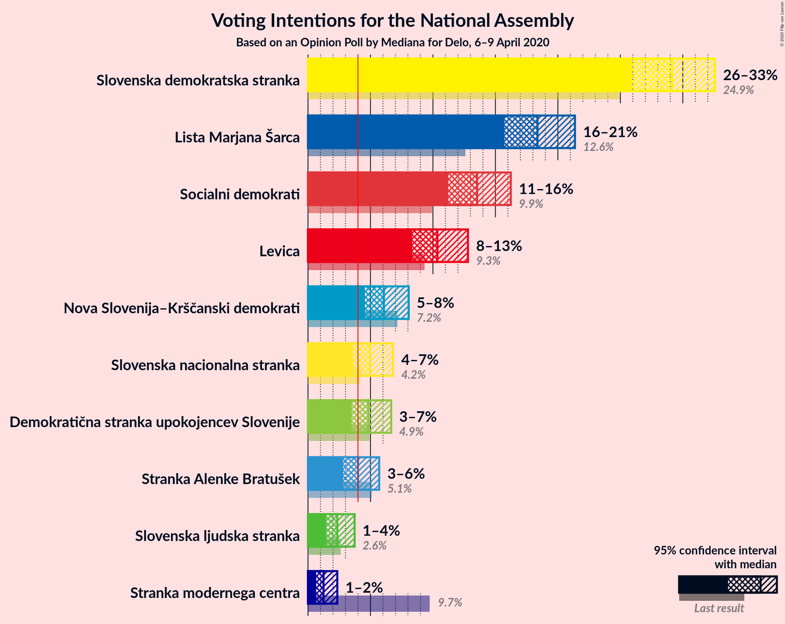

### Confidence Intervals

| Party | Last Result | Poll Result | 80% Confidence Interval | 90% Confidence Interval | 95% Confidence Interval | 99% Confidence Interval |
|:-----:|:-----------:|:-----------:|:-----------------------:|:-----------------------:|:-----------------------:|:-----------------------:|
| Slovenska demokratska stranka | 24.9% | 29.1% | 27.0–31.4% |26.5–32.0% |25.9–32.6% |25.0–33.7% |
| Lista Marjana Šarca | 12.6% | 18.4% | 16.6–20.3% |16.1–20.9% |15.7–21.4% |14.9–22.3% |
| Socialni demokrati | 9.9% | 13.5% | 12.0–15.3% |11.6–15.8% |11.2–16.2% |10.5–17.1% |
| Levica | 9.3% | 10.4% | 9.0–11.9% |8.7–12.4% |8.3–12.8% |7.7–13.6% |
| Nova Slovenija–Krščanski demokrati | 7.2% | 6.1% | 5.1–7.4% |4.8–7.7% |4.6–8.1% |4.1–8.7% |
| Slovenska nacionalna stranka | 4.2% | 5.0% | 4.1–6.2% |3.8–6.5% |3.6–6.8% |3.2–7.4% |
| Demokratična stranka upokojencev Slovenije | 4.9% | 4.8% | 3.9–6.0% |3.7–6.4% |3.5–6.7% |3.1–7.3% |
| Stranka Alenke Bratušek | 5.1% | 4.0% | 3.2–5.1% |3.0–5.4% |2.8–5.7% |2.5–6.3% |
| Slovenska ljudska stranka | 2.6% | 2.3% | 1.8–3.2% |1.6–3.5% |1.5–3.7% |1.2–4.2% |
| Stranka modernega centra | 9.7% | 1.2% | 0.9–2.0% |0.7–2.2% |0.7–2.3% |0.5–2.7% |

*Note:* The poll result column reflects the actual value used in the calculations. Published results may vary slightly, and in addition be rounded to fewer digits.

## Seats

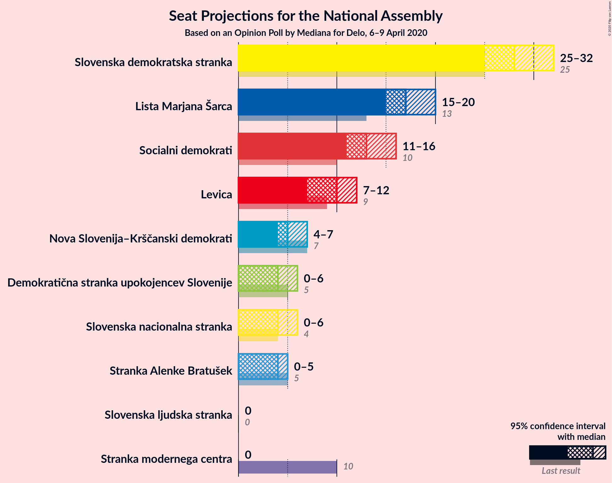

### Confidence Intervals

| Party | Last Result | Median | 80% Confidence Interval | 90% Confidence Interval | 95% Confidence Interval | 99% Confidence Interval |
|:-----:|:-----------:|:------:|:-----------------------:|:-----------------------:|:-----------------------:|:-----------------------:|
| <a href="#slovenska-demokratska-stranka">Slovenska demokratska stranka</a> | 25 | 28 | 25–30 |25–31 |25–32 |24–33 |
| <a href="#lista-marjana-šarca">Lista Marjana Šarca</a> | 13 | 17 | 16–19 |15–20 |15–20 |14–22 |
| <a href="#socialni-demokrati">Socialni demokrati</a> | 10 | 13 | 11–15 |11–15 |11–16 |10–16 |
| <a href="#levica">Levica</a> | 9 | 10 | 8–11 |8–11 |7–12 |7–13 |
| <a href="#nova-slovenija–krščanski-demokrati">Nova Slovenija–Krščanski demokrati</a> | 7 | 5 | 4–7 |4–7 |4–7 |4–8 |
| <a href="#slovenska-nacionalna-stranka">Slovenska nacionalna stranka</a> | 4 | 4 | 3–6 |0–6 |0–6 |0–7 |
| <a href="#demokratična-stranka-upokojencev-slovenije">Demokratična stranka upokojencev Slovenije</a> | 5 | 4 | 0–5 |0–6 |0–6 |0–7 |
| <a href="#stranka-alenke-bratušek">Stranka Alenke Bratušek</a> | 5 | 4 | 0–4 |0–5 |0–5 |0–6 |
| <a href="#slovenska-ljudska-stranka">Slovenska ljudska stranka</a> | 0 | 0 | 0 |0 |0 |0–3 |
| <a href="#stranka-modernega-centra">Stranka modernega centra</a> | 10 | 0 | 0 |0 |0 |0 |

### Slovenska demokratska stranka

*For a full overview of the results for this party, see the [Slovenska demokratska stranka](party-slovenskademokratskastranka.html) page.*

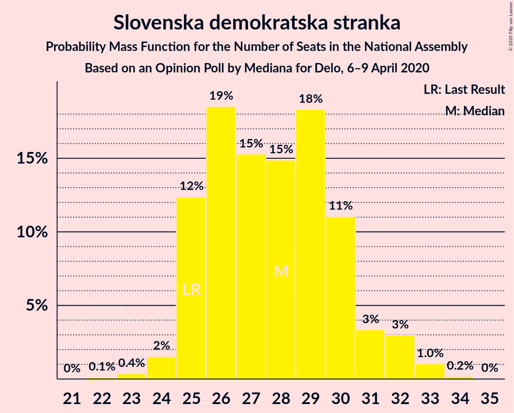

| Number of Seats | Probability | Accumulated | Special Marks |
|:---------------:|:-----------:|:-----------:|:-------------:|
| 22 | 0.1% | 100% |  |
| 23 | 0.4% | 99.9% |  |
| 24 | 2% | 99.5% |  |
| 25 | 12% | 98% | Last Result |
| 26 | 19% | 86% |  |
| 27 | 15% | 67% |  |
| 28 | 15% | 52% | Median |
| 29 | 18% | 37% |  |
| 30 | 11% | 19% |  |
| 31 | 3% | 8% |  |
| 32 | 3% | 4% |  |
| 33 | 1.0% | 1.2% |  |
| 34 | 0.2% | 0.2% |  |
| 35 | 0% | 0% |  |

### Lista Marjana Šarca

*For a full overview of the results for this party, see the [Lista Marjana Šarca](party-listamarjanašarca.html) page.*

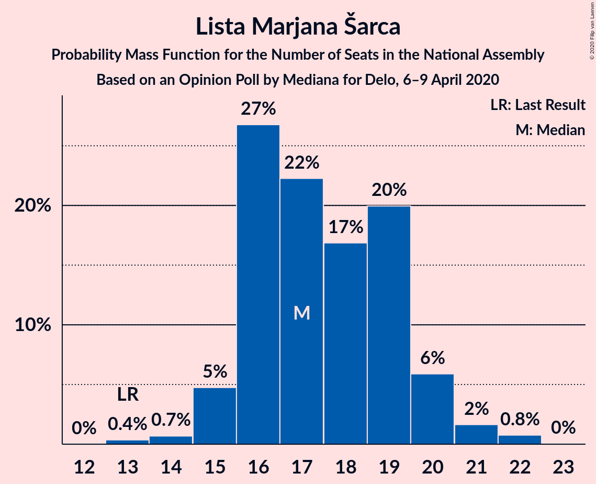

| Number of Seats | Probability | Accumulated | Special Marks |
|:---------------:|:-----------:|:-----------:|:-------------:|
| 13 | 0.4% | 100% | Last Result |
| 14 | 0.7% | 99.6% |  |
| 15 | 5% | 98.9% |  |
| 16 | 27% | 94% |  |
| 17 | 22% | 67% | Median |
| 18 | 17% | 45% |  |
| 19 | 20% | 28% |  |
| 20 | 6% | 8% |  |
| 21 | 2% | 2% |  |
| 22 | 0.8% | 0.8% |  |
| 23 | 0% | 0% |  |

### Socialni demokrati

*For a full overview of the results for this party, see the [Socialni demokrati](party-socialnidemokrati.html) page.*

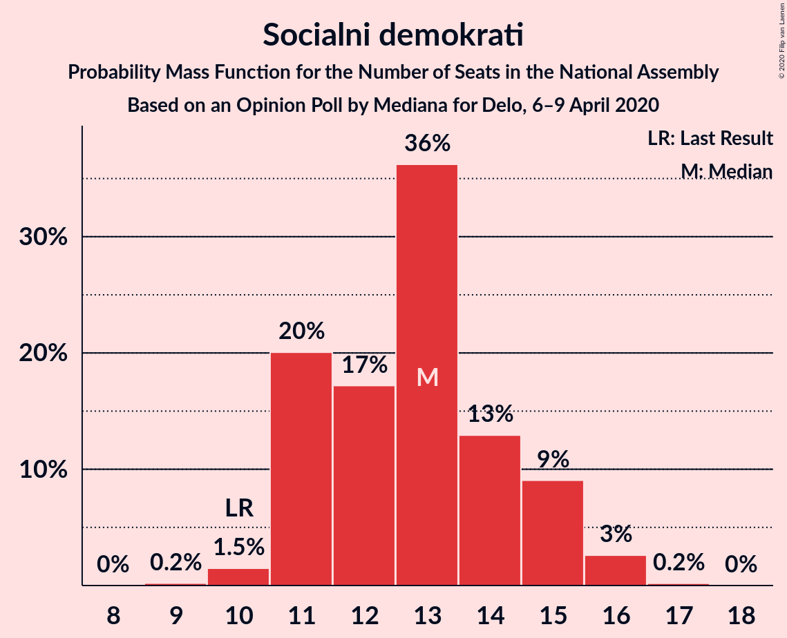

| Number of Seats | Probability | Accumulated | Special Marks |
|:---------------:|:-----------:|:-----------:|:-------------:|
| 9 | 0.2% | 100% |  |
| 10 | 1.5% | 99.8% | Last Result |
| 11 | 20% | 98% |  |
| 12 | 17% | 78% |  |
| 13 | 36% | 61% | Median |
| 14 | 13% | 25% |  |
| 15 | 9% | 12% |  |
| 16 | 3% | 3% |  |
| 17 | 0.2% | 0.2% |  |
| 18 | 0% | 0% |  |

### Levica

*For a full overview of the results for this party, see the [Levica](party-levica.html) page.*

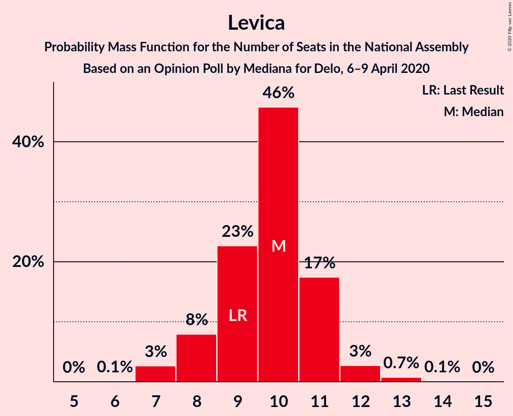

| Number of Seats | Probability | Accumulated | Special Marks |
|:---------------:|:-----------:|:-----------:|:-------------:|
| 6 | 0.1% | 100% |  |
| 7 | 3% | 99.9% |  |
| 8 | 8% | 97% |  |
| 9 | 23% | 89% | Last Result |
| 10 | 46% | 67% | Median |
| 11 | 17% | 21% |  |
| 12 | 3% | 4% |  |
| 13 | 0.7% | 0.8% |  |
| 14 | 0.1% | 0.1% |  |
| 15 | 0% | 0% |  |

### Nova Slovenija–Krščanski demokrati

*For a full overview of the results for this party, see the [Nova Slovenija–Krščanski demokrati](party-novaslovenija–krščanskidemokrati.html) page.*

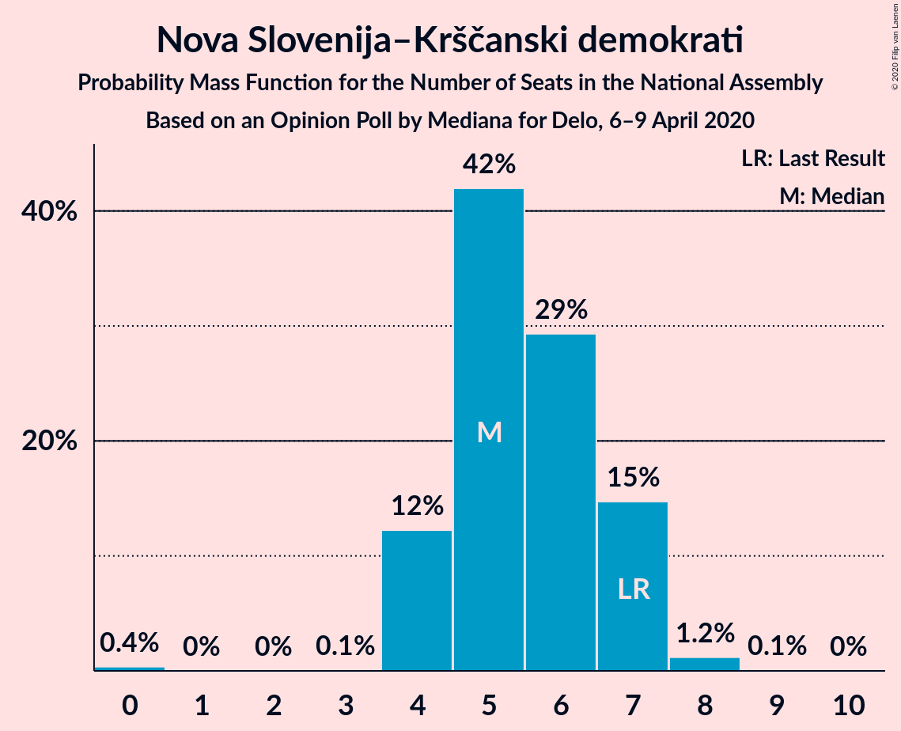

| Number of Seats | Probability | Accumulated | Special Marks |
|:---------------:|:-----------:|:-----------:|:-------------:|
| 0 | 0.4% | 100% |  |
| 1 | 0% | 99.6% |  |
| 2 | 0% | 99.6% |  |
| 3 | 0.1% | 99.6% |  |
| 4 | 12% | 99.6% |  |
| 5 | 42% | 87% | Median |
| 6 | 29% | 45% |  |
| 7 | 15% | 16% | Last Result |
| 8 | 1.2% | 1.3% |  |
| 9 | 0.1% | 0.1% |  |
| 10 | 0% | 0% |  |

### Slovenska nacionalna stranka

*For a full overview of the results for this party, see the [Slovenska nacionalna stranka](party-slovenskanacionalnastranka.html) page.*

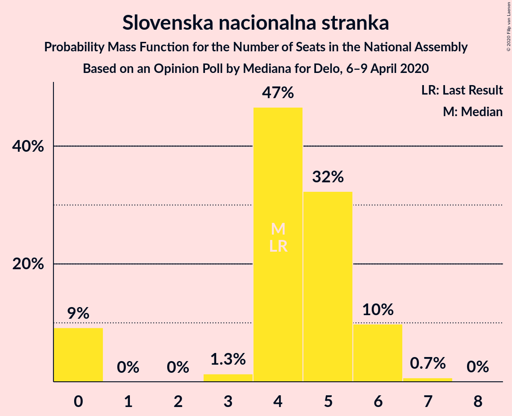

| Number of Seats | Probability | Accumulated | Special Marks |
|:---------------:|:-----------:|:-----------:|:-------------:|
| 0 | 9% | 100% |  |
| 1 | 0% | 91% |  |
| 2 | 0% | 91% |  |
| 3 | 1.3% | 91% |  |
| 4 | 47% | 89% | Last Result, Median |
| 5 | 32% | 43% |  |
| 6 | 10% | 11% |  |
| 7 | 0.7% | 0.7% |  |
| 8 | 0% | 0% |  |

### Demokratična stranka upokojencev Slovenije

*For a full overview of the results for this party, see the [Demokratična stranka upokojencev Slovenije](party-demokratičnastrankaupokojencevslovenije.html) page.*

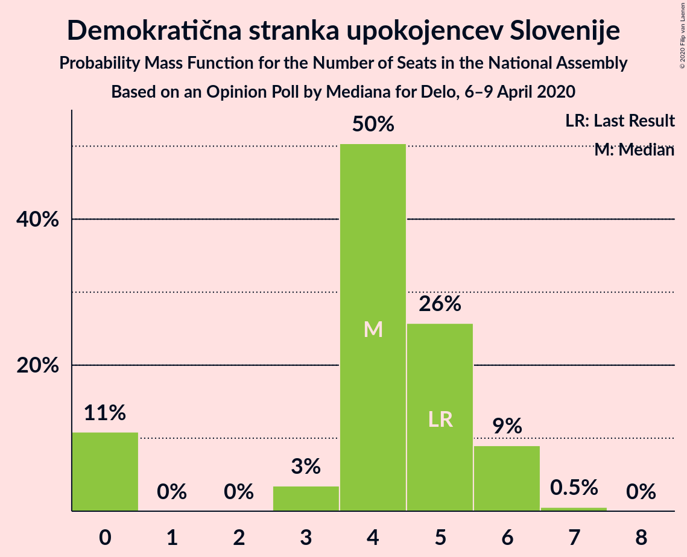

| Number of Seats | Probability | Accumulated | Special Marks |
|:---------------:|:-----------:|:-----------:|:-------------:|
| 0 | 11% | 100% |  |
| 1 | 0% | 89% |  |
| 2 | 0% | 89% |  |
| 3 | 3% | 89% |  |
| 4 | 50% | 86% | Median |
| 5 | 26% | 35% | Last Result |
| 6 | 9% | 10% |  |
| 7 | 0.5% | 0.6% |  |
| 8 | 0% | 0% |  |

### Stranka Alenke Bratušek

*For a full overview of the results for this party, see the [Stranka Alenke Bratušek](party-strankaalenkebratušek.html) page.*

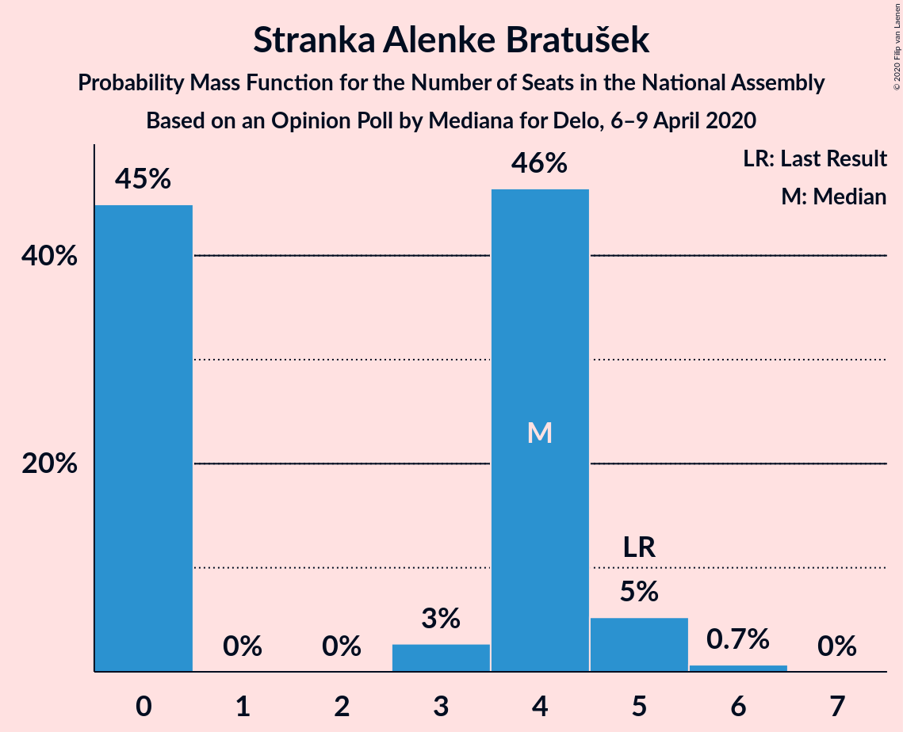

| Number of Seats | Probability | Accumulated | Special Marks |
|:---------------:|:-----------:|:-----------:|:-------------:|
| 0 | 45% | 100% |  |
| 1 | 0% | 55% |  |
| 2 | 0% | 55% |  |
| 3 | 3% | 55% |  |
| 4 | 46% | 52% | Median |
| 5 | 5% | 6% | Last Result |
| 6 | 0.7% | 0.7% |  |
| 7 | 0% | 0% |  |

### Slovenska ljudska stranka

*For a full overview of the results for this party, see the [Slovenska ljudska stranka](party-slovenskaljudskastranka.html) page.*

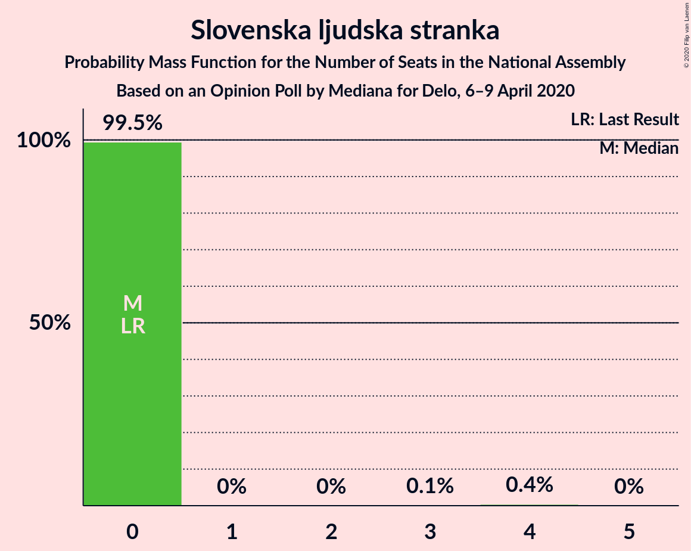

| Number of Seats | Probability | Accumulated | Special Marks |
|:---------------:|:-----------:|:-----------:|:-------------:|
| 0 | 99.5% | 100% | Last Result, Median |
| 1 | 0% | 0.5% |  |
| 2 | 0% | 0.5% |  |
| 3 | 0.1% | 0.5% |  |
| 4 | 0.4% | 0.4% |  |
| 5 | 0% | 0% |  |

### Stranka modernega centra

*For a full overview of the results for this party, see the [Stranka modernega centra](party-strankamodernegacentra.html) page.*

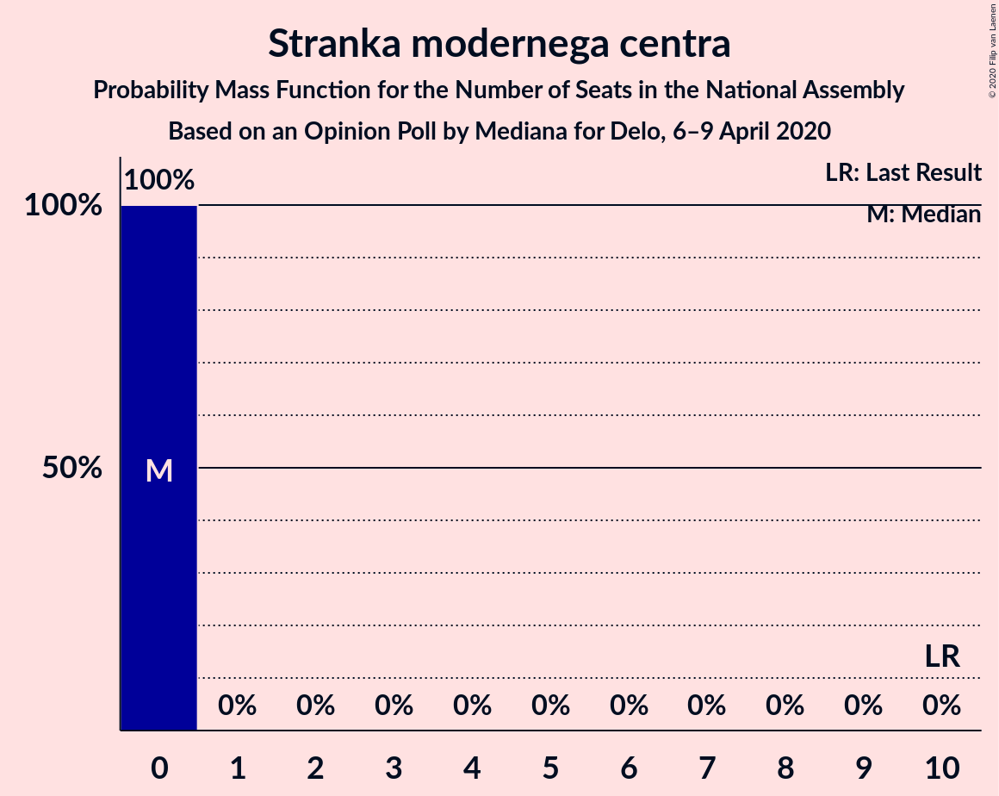

| Number of Seats | Probability | Accumulated | Special Marks |
|:---------------:|:-----------:|:-----------:|:-------------:|
| 0 | 100% | 100% | Median |
| 1 | 0% | 0% |  |
| 2 | 0% | 0% |  |
| 3 | 0% | 0% |  |
| 4 | 0% | 0% |  |
| 5 | 0% | 0% |  |
| 6 | 0% | 0% |  |
| 7 | 0% | 0% |  |
| 8 | 0% | 0% |  |
| 9 | 0% | 0% |  |
| 10 | 0% | 0% | Last Result |

## Coalitions

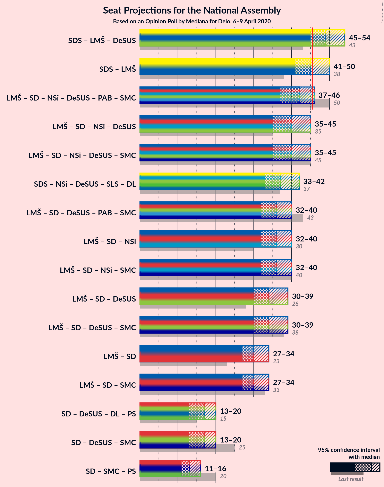

### Confidence Intervals

| Coalition | Last Result | Median | Majority? | 80% Confidence Interval | 90% Confidence Interval | 95% Confidence Interval | 99% Confidence Interval |
|:---------:|:-----------:|:------:|:---------:|:-----------------------:|:-----------------------:|:-----------------------:|:-----------------------:|
| Slovenska demokratska stranka – Lista Marjana Šarca – Demokratična stranka upokojencev Slovenije | 43 | 49 | 95% | 46–52 | 45–53 | 45–54 | 44–56 |
| Slovenska demokratska stranka – Lista Marjana Šarca | 38 | 45 | 37% | 42–48 | 42–49 | 41–50 | 40–52 |
| Lista Marjana Šarca – Socialni demokrati – Nova Slovenija–Krščanski demokrati – Demokratična stranka upokojencev Slovenije – Stranka Alenke Bratušek – Stranka modernega centra | 50 | 42 | 5% | 39–45 | 38–46 | 37–46 | 36–47 |
| Lista Marjana Šarca – Socialni demokrati – Nova Slovenija–Krščanski demokrati – Demokratična stranka upokojencev Slovenije | 35 | 40 | 2% | 36–43 | 36–44 | 35–45 | 34–46 |
| Lista Marjana Šarca – Socialni demokrati – Nova Slovenija–Krščanski demokrati – Demokratična stranka upokojencev Slovenije – Stranka modernega centra | 45 | 40 | 2% | 36–43 | 36–44 | 35–45 | 34–46 |
| Lista Marjana Šarca – Socialni demokrati – Demokratična stranka upokojencev Slovenije – Stranka Alenke Bratušek – Stranka modernega centra | 43 | 36 | 0% | 34–40 | 33–40 | 32–40 | 30–42 |
| Lista Marjana Šarca – Socialni demokrati – Nova Slovenija–Krščanski demokrati | 30 | 36 | 0% | 33–38 | 32–39 | 32–40 | 31–42 |
| Lista Marjana Šarca – Socialni demokrati – Nova Slovenija–Krščanski demokrati – Stranka modernega centra | 40 | 36 | 0% | 33–38 | 32–39 | 32–40 | 31–42 |
| Lista Marjana Šarca – Socialni demokrati – Demokratična stranka upokojencev Slovenije | 28 | 34 | 0% | 31–37 | 31–38 | 30–39 | 29–40 |
| Lista Marjana Šarca – Socialni demokrati – Demokratična stranka upokojencev Slovenije – Stranka modernega centra | 38 | 34 | 0% | 31–37 | 31–38 | 30–39 | 29–40 |
| Lista Marjana Šarca – Socialni demokrati | 23 | 30 | 0% | 28–32 | 27–33 | 27–34 | 26–36 |
| Lista Marjana Šarca – Socialni demokrati – Stranka modernega centra | 33 | 30 | 0% | 28–32 | 27–33 | 27–34 | 26–36 |
| Socialni demokrati – Demokratična stranka upokojencev Slovenije – Stranka modernega centra | 25 | 17 | 0% | 15–20 | 13–20 | 13–20 | 11–21 |

### Slovenska demokratska stranka – Lista Marjana Šarca – Demokratična stranka upokojencev Slovenije

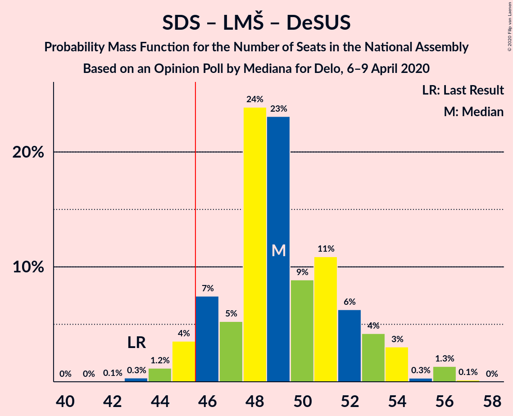

| Number of Seats | Probability | Accumulated | Special Marks |
|:---------------:|:-----------:|:-----------:|:-------------:|
| 42 | 0.1% | 100% |  |
| 43 | 0.3% | 99.9% | Last Result |
| 44 | 1.2% | 99.6% |  |
| 45 | 4% | 98% |  |
| 46 | 7% | 95% | Majority |
| 47 | 5% | 87% |  |
| 48 | 24% | 82% |  |
| 49 | 23% | 58% | Median |
| 50 | 9% | 35% |  |
| 51 | 11% | 26% |  |
| 52 | 6% | 15% |  |
| 53 | 4% | 9% |  |
| 54 | 3% | 5% |  |
| 55 | 0.3% | 2% |  |
| 56 | 1.3% | 2% |  |
| 57 | 0.1% | 0.2% |  |
| 58 | 0% | 0% |  |

### Slovenska demokratska stranka – Lista Marjana Šarca

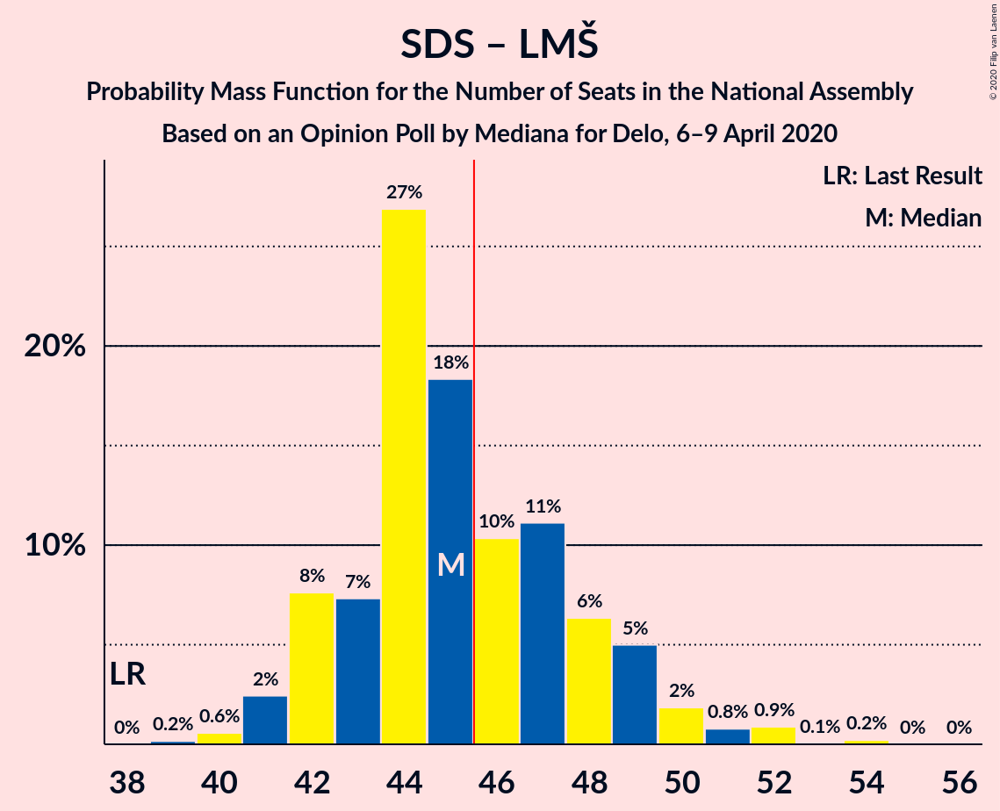

| Number of Seats | Probability | Accumulated | Special Marks |
|:---------------:|:-----------:|:-----------:|:-------------:|
| 38 | 0% | 100% | Last Result |
| 39 | 0.2% | 100% |  |
| 40 | 0.6% | 99.8% |  |
| 41 | 2% | 99.2% |  |
| 42 | 8% | 97% |  |
| 43 | 7% | 89% |  |
| 44 | 27% | 82% |  |
| 45 | 18% | 55% | Median |
| 46 | 10% | 37% | Majority |
| 47 | 11% | 26% |  |
| 48 | 6% | 15% |  |
| 49 | 5% | 9% |  |
| 50 | 2% | 4% |  |
| 51 | 0.8% | 2% |  |
| 52 | 0.9% | 1.2% |  |
| 53 | 0.1% | 0.3% |  |
| 54 | 0.2% | 0.2% |  |
| 55 | 0% | 0% |  |

### Lista Marjana Šarca – Socialni demokrati – Nova Slovenija–Krščanski demokrati – Demokratična stranka upokojencev Slovenije – Stranka Alenke Bratušek – Stranka modernega centra

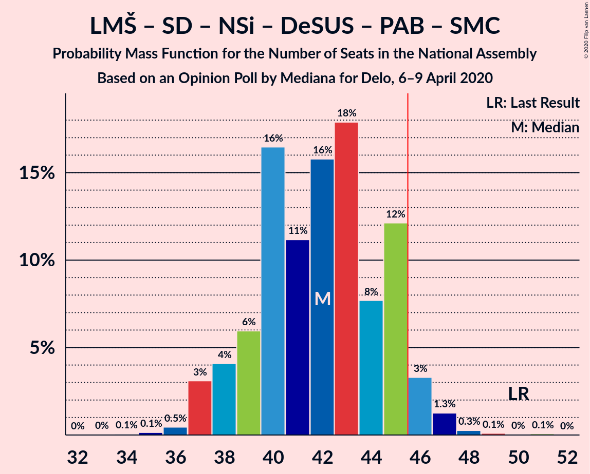

| Number of Seats | Probability | Accumulated | Special Marks |
|:---------------:|:-----------:|:-----------:|:-------------:|
| 34 | 0.1% | 100% |  |
| 35 | 0.1% | 99.9% |  |
| 36 | 0.5% | 99.8% |  |
| 37 | 3% | 99.3% |  |
| 38 | 4% | 96% |  |
| 39 | 6% | 92% |  |
| 40 | 16% | 86% |  |
| 41 | 11% | 70% |  |
| 42 | 16% | 59% |  |
| 43 | 18% | 43% | Median |
| 44 | 8% | 25% |  |
| 45 | 12% | 17% |  |
| 46 | 3% | 5% | Majority |
| 47 | 1.3% | 2% |  |
| 48 | 0.3% | 0.5% |  |
| 49 | 0.1% | 0.2% |  |
| 50 | 0% | 0.1% | Last Result |
| 51 | 0.1% | 0.1% |  |
| 52 | 0% | 0% |  |

### Lista Marjana Šarca – Socialni demokrati – Nova Slovenija–Krščanski demokrati – Demokratična stranka upokojencev Slovenije

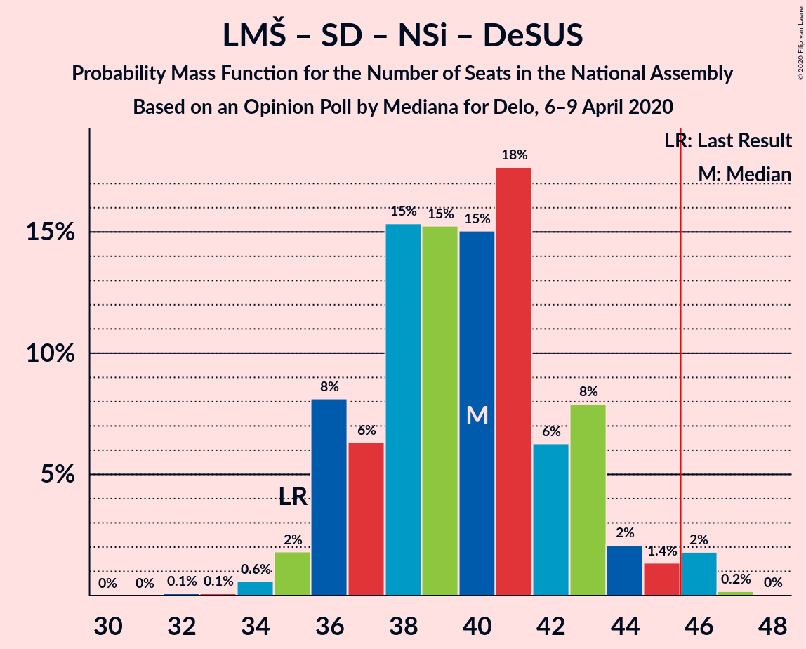

| Number of Seats | Probability | Accumulated | Special Marks |
|:---------------:|:-----------:|:-----------:|:-------------:|
| 32 | 0.1% | 100% |  |
| 33 | 0.1% | 99.9% |  |
| 34 | 0.6% | 99.8% |  |
| 35 | 2% | 99.2% | Last Result |
| 36 | 8% | 97% |  |
| 37 | 6% | 89% |  |
| 38 | 15% | 83% |  |
| 39 | 15% | 68% | Median |
| 40 | 15% | 52% |  |
| 41 | 18% | 37% |  |
| 42 | 6% | 20% |  |
| 43 | 8% | 13% |  |
| 44 | 2% | 5% |  |
| 45 | 1.4% | 3% |  |
| 46 | 2% | 2% | Majority |
| 47 | 0.2% | 0.2% |  |
| 48 | 0% | 0% |  |

### Lista Marjana Šarca – Socialni demokrati – Nova Slovenija–Krščanski demokrati – Demokratična stranka upokojencev Slovenije – Stranka modernega centra

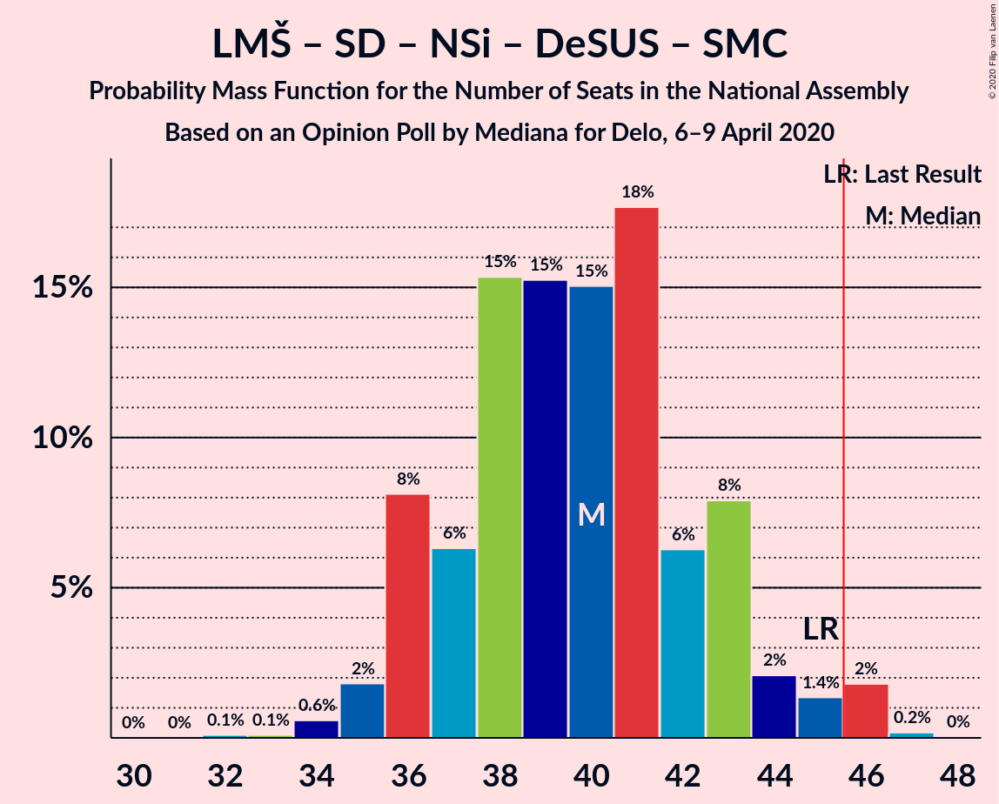

| Number of Seats | Probability | Accumulated | Special Marks |
|:---------------:|:-----------:|:-----------:|:-------------:|
| 32 | 0.1% | 100% |  |
| 33 | 0.1% | 99.9% |  |
| 34 | 0.6% | 99.8% |  |
| 35 | 2% | 99.2% |  |
| 36 | 8% | 97% |  |
| 37 | 6% | 89% |  |
| 38 | 15% | 83% |  |
| 39 | 15% | 68% | Median |
| 40 | 15% | 52% |  |
| 41 | 18% | 37% |  |
| 42 | 6% | 20% |  |
| 43 | 8% | 13% |  |
| 44 | 2% | 5% |  |
| 45 | 1.4% | 3% | Last Result |
| 46 | 2% | 2% | Majority |
| 47 | 0.2% | 0.2% |  |
| 48 | 0% | 0% |  |

### Lista Marjana Šarca – Socialni demokrati – Demokratična stranka upokojencev Slovenije – Stranka Alenke Bratušek – Stranka modernega centra

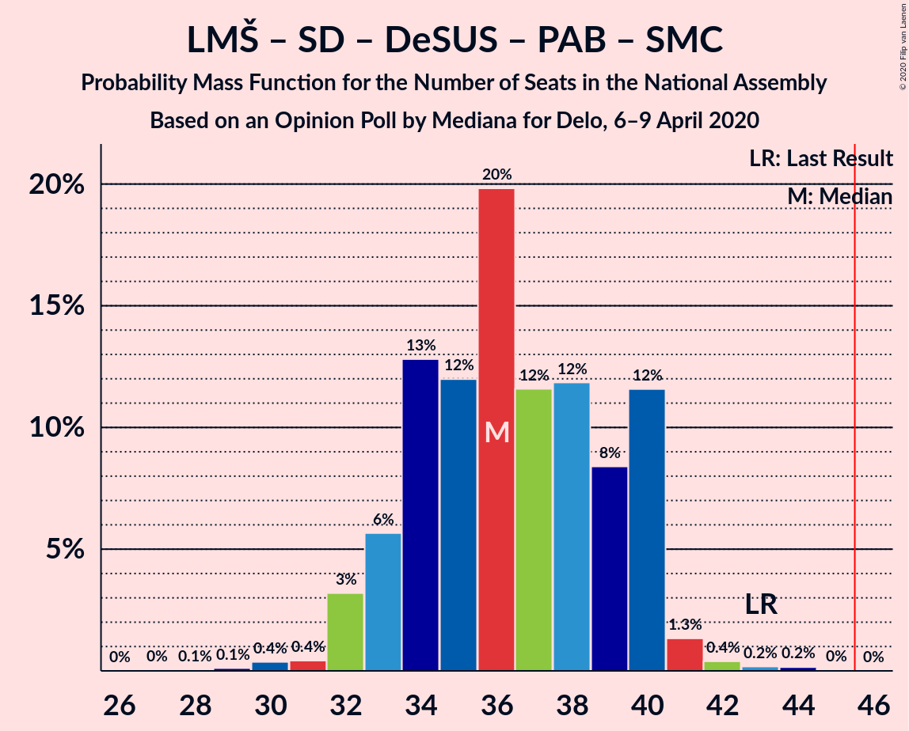

| Number of Seats | Probability | Accumulated | Special Marks |
|:---------------:|:-----------:|:-----------:|:-------------:|
| 28 | 0.1% | 100% |  |
| 29 | 0.1% | 99.9% |  |
| 30 | 0.4% | 99.8% |  |
| 31 | 0.4% | 99.4% |  |
| 32 | 3% | 99.0% |  |
| 33 | 6% | 96% |  |
| 34 | 13% | 90% |  |
| 35 | 12% | 77% |  |
| 36 | 20% | 65% |  |
| 37 | 12% | 46% |  |
| 38 | 12% | 34% | Median |
| 39 | 8% | 22% |  |
| 40 | 12% | 14% |  |
| 41 | 1.3% | 2% |  |
| 42 | 0.4% | 0.8% |  |
| 43 | 0.2% | 0.4% | Last Result |
| 44 | 0.2% | 0.2% |  |
| 45 | 0% | 0% |  |

### Lista Marjana Šarca – Socialni demokrati – Nova Slovenija–Krščanski demokrati

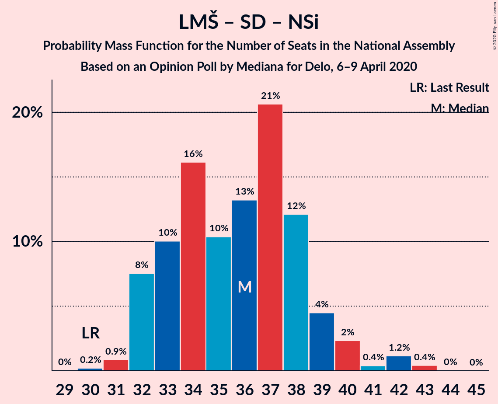

| Number of Seats | Probability | Accumulated | Special Marks |
|:---------------:|:-----------:|:-----------:|:-------------:|
| 29 | 0% | 100% |  |
| 30 | 0.2% | 99.9% | Last Result |
| 31 | 0.9% | 99.7% |  |
| 32 | 8% | 98.9% |  |
| 33 | 10% | 91% |  |
| 34 | 16% | 81% |  |
| 35 | 10% | 65% | Median |
| 36 | 13% | 55% |  |
| 37 | 21% | 42% |  |
| 38 | 12% | 21% |  |
| 39 | 4% | 9% |  |
| 40 | 2% | 4% |  |
| 41 | 0.4% | 2% |  |
| 42 | 1.2% | 2% |  |
| 43 | 0.4% | 0.5% |  |
| 44 | 0% | 0.1% |  |
| 45 | 0% | 0% |  |

### Lista Marjana Šarca – Socialni demokrati – Nova Slovenija–Krščanski demokrati – Stranka modernega centra

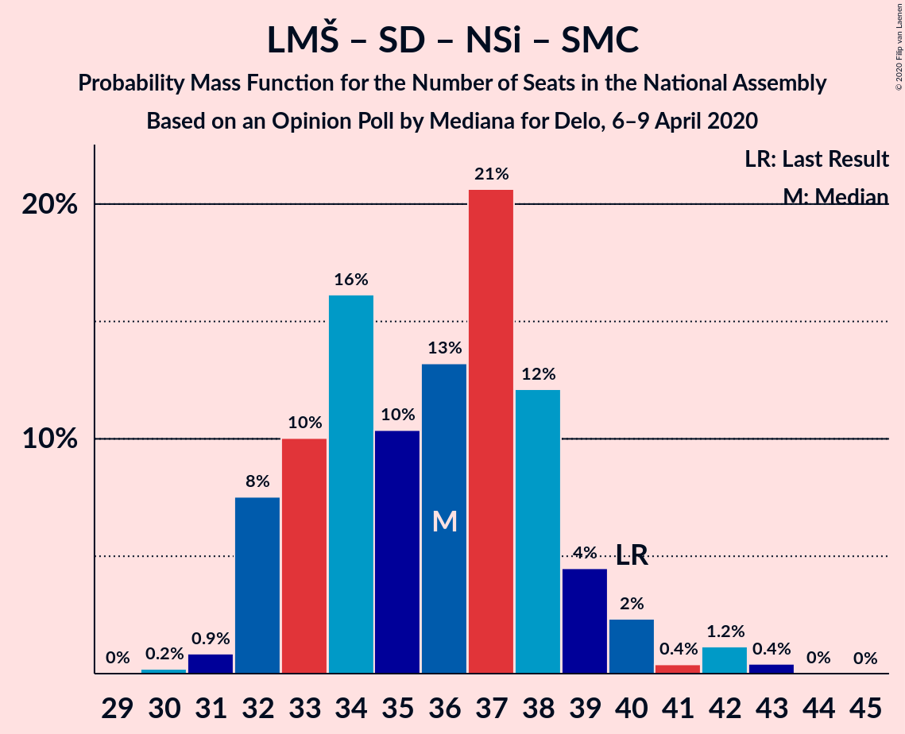

| Number of Seats | Probability | Accumulated | Special Marks |
|:---------------:|:-----------:|:-----------:|:-------------:|
| 29 | 0% | 100% |  |
| 30 | 0.2% | 99.9% |  |
| 31 | 0.9% | 99.7% |  |
| 32 | 8% | 98.9% |  |
| 33 | 10% | 91% |  |
| 34 | 16% | 81% |  |
| 35 | 10% | 65% | Median |
| 36 | 13% | 55% |  |
| 37 | 21% | 42% |  |
| 38 | 12% | 21% |  |
| 39 | 4% | 9% |  |
| 40 | 2% | 4% | Last Result |
| 41 | 0.4% | 2% |  |
| 42 | 1.2% | 2% |  |
| 43 | 0.4% | 0.5% |  |
| 44 | 0% | 0.1% |  |
| 45 | 0% | 0% |  |

### Lista Marjana Šarca – Socialni demokrati – Demokratična stranka upokojencev Slovenije

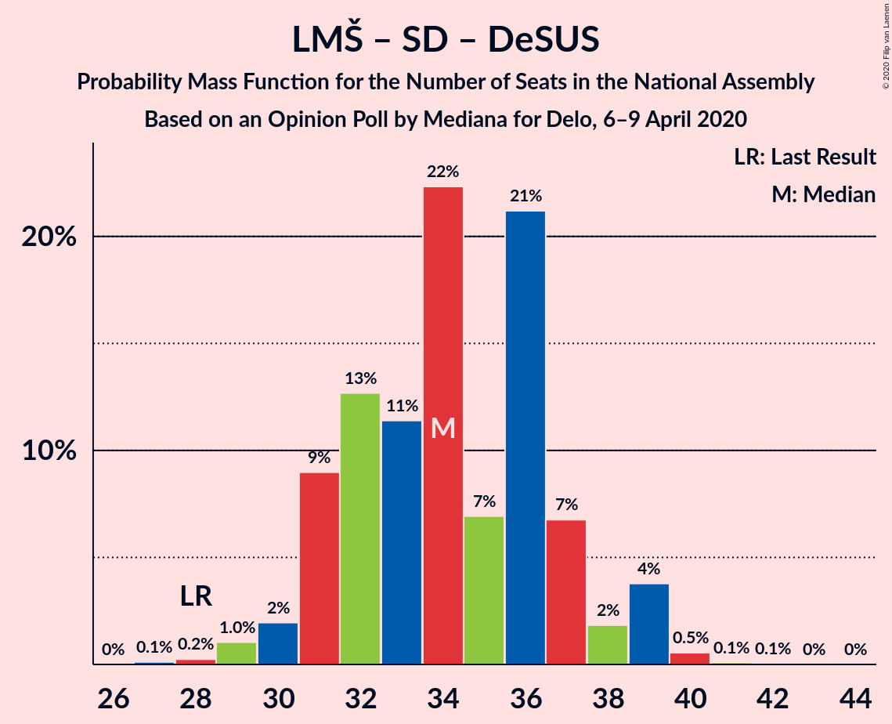

| Number of Seats | Probability | Accumulated | Special Marks |
|:---------------:|:-----------:|:-----------:|:-------------:|
| 27 | 0.1% | 100% |  |
| 28 | 0.2% | 99.9% | Last Result |
| 29 | 1.0% | 99.6% |  |
| 30 | 2% | 98.6% |  |
| 31 | 9% | 97% |  |
| 32 | 13% | 88% |  |
| 33 | 11% | 75% |  |
| 34 | 22% | 64% | Median |
| 35 | 7% | 41% |  |
| 36 | 21% | 34% |  |
| 37 | 7% | 13% |  |
| 38 | 2% | 6% |  |
| 39 | 4% | 4% |  |
| 40 | 0.5% | 0.7% |  |
| 41 | 0.1% | 0.2% |  |
| 42 | 0.1% | 0.1% |  |
| 43 | 0% | 0% |  |

### Lista Marjana Šarca – Socialni demokrati – Demokratična stranka upokojencev Slovenije – Stranka modernega centra

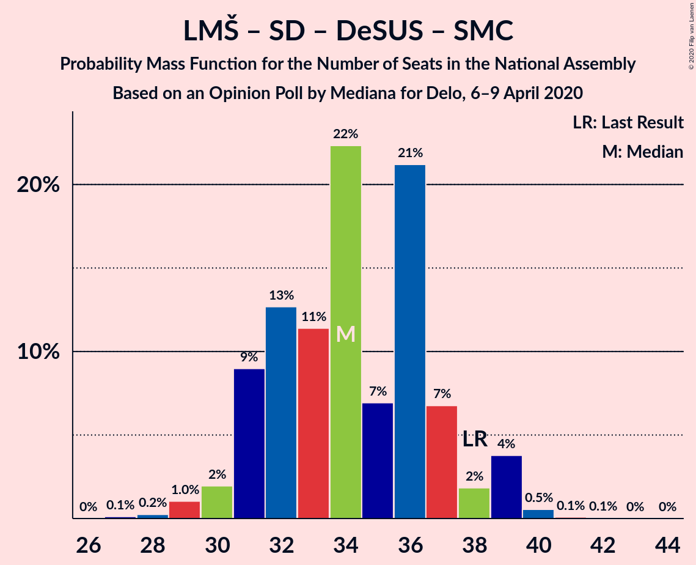

| Number of Seats | Probability | Accumulated | Special Marks |
|:---------------:|:-----------:|:-----------:|:-------------:|
| 27 | 0.1% | 100% |  |
| 28 | 0.2% | 99.9% |  |
| 29 | 1.0% | 99.6% |  |
| 30 | 2% | 98.6% |  |
| 31 | 9% | 97% |  |
| 32 | 13% | 88% |  |
| 33 | 11% | 75% |  |
| 34 | 22% | 64% | Median |
| 35 | 7% | 41% |  |
| 36 | 21% | 34% |  |
| 37 | 7% | 13% |  |
| 38 | 2% | 6% | Last Result |
| 39 | 4% | 4% |  |
| 40 | 0.5% | 0.7% |  |
| 41 | 0.1% | 0.2% |  |
| 42 | 0.1% | 0.1% |  |
| 43 | 0% | 0% |  |

### Lista Marjana Šarca – Socialni demokrati

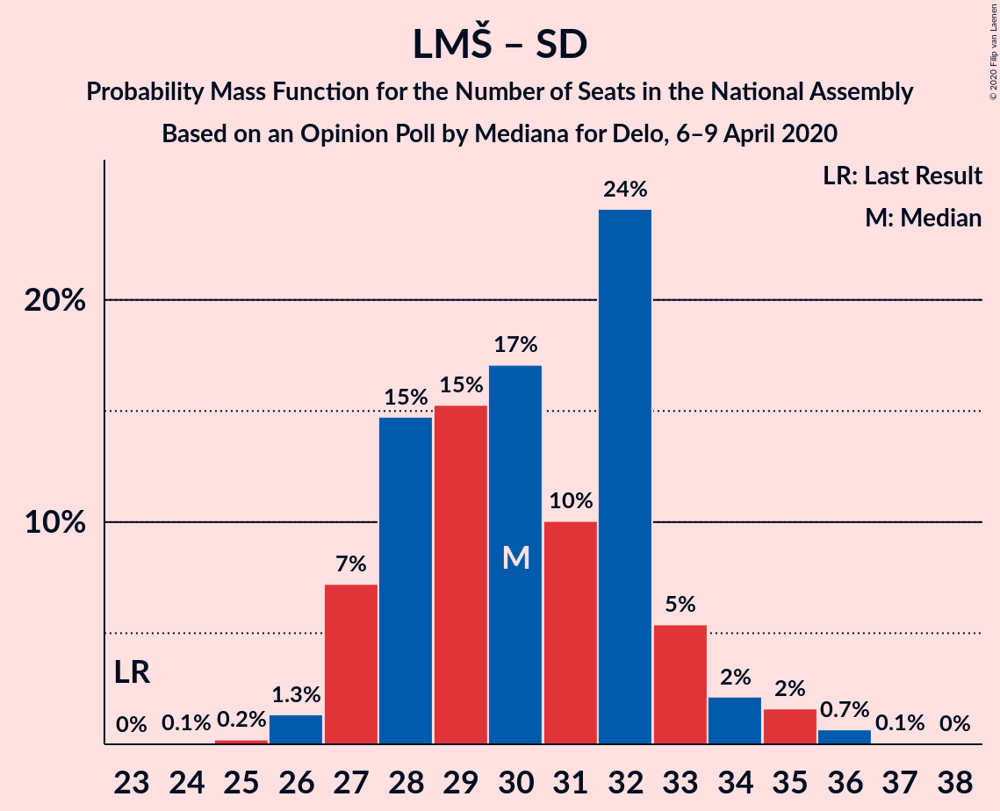

| Number of Seats | Probability | Accumulated | Special Marks |
|:---------------:|:-----------:|:-----------:|:-------------:|
| 23 | 0% | 100% | Last Result |
| 24 | 0.1% | 100% |  |
| 25 | 0.2% | 99.9% |  |
| 26 | 1.3% | 99.7% |  |
| 27 | 7% | 98% |  |
| 28 | 15% | 91% |  |
| 29 | 15% | 76% |  |
| 30 | 17% | 61% | Median |
| 31 | 10% | 44% |  |
| 32 | 24% | 34% |  |
| 33 | 5% | 10% |  |
| 34 | 2% | 5% |  |
| 35 | 2% | 2% |  |
| 36 | 0.7% | 0.8% |  |
| 37 | 0.1% | 0.1% |  |
| 38 | 0% | 0% |  |

### Lista Marjana Šarca – Socialni demokrati – Stranka modernega centra

| Number of Seats | Probability | Accumulated | Special Marks |
|:---------------:|:-----------:|:-----------:|:-------------:|
| 24 | 0.1% | 100% |  |
| 25 | 0.2% | 99.9% |  |
| 26 | 1.3% | 99.7% |  |
| 27 | 7% | 98% |  |
| 28 | 15% | 91% |  |
| 29 | 15% | 76% |  |
| 30 | 17% | 61% | Median |
| 31 | 10% | 44% |  |
| 32 | 24% | 34% |  |
| 33 | 5% | 10% | Last Result |
| 34 | 2% | 5% |  |
| 35 | 2% | 2% |  |
| 36 | 0.7% | 0.8% |  |
| 37 | 0.1% | 0.1% |  |
| 38 | 0% | 0% |  |

### Socialni demokrati – Demokratična stranka upokojencev Slovenije – Stranka modernega centra

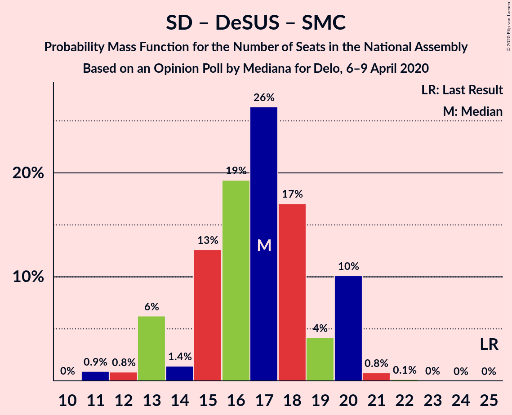

| Number of Seats | Probability | Accumulated | Special Marks |
|:---------------:|:-----------:|:-----------:|:-------------:|
| 10 | 0% | 100% |  |
| 11 | 0.9% | 99.9% |  |
| 12 | 0.8% | 99.0% |  |
| 13 | 6% | 98% |  |
| 14 | 1.4% | 92% |  |
| 15 | 13% | 91% |  |
| 16 | 19% | 78% |  |
| 17 | 26% | 59% | Median |
| 18 | 17% | 32% |  |
| 19 | 4% | 15% |  |
| 20 | 10% | 11% |  |
| 21 | 0.8% | 0.9% |  |
| 22 | 0.1% | 0.2% |  |
| 23 | 0% | 0% |  |
| 24 | 0% | 0% |  |
| 25 | 0% | 0% | Last Result |

## Technical Information

### Opinion Poll

+ **Polling firm:** Mediana
+ **Commissioner(s):** Delo
+ **Fieldwork period:** 6–9 April 2020

### Calculations

+ **Sample size:** 724
+ **Simulations done:** 1,048,576
+ **Error estimate:** 1.14%

