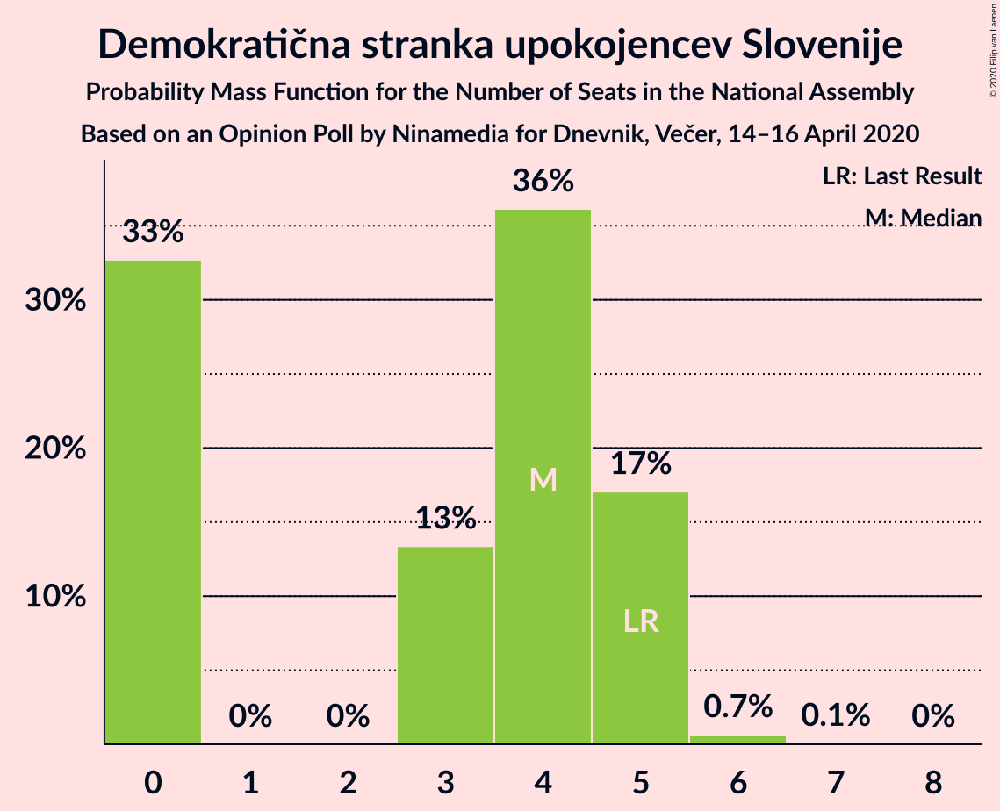
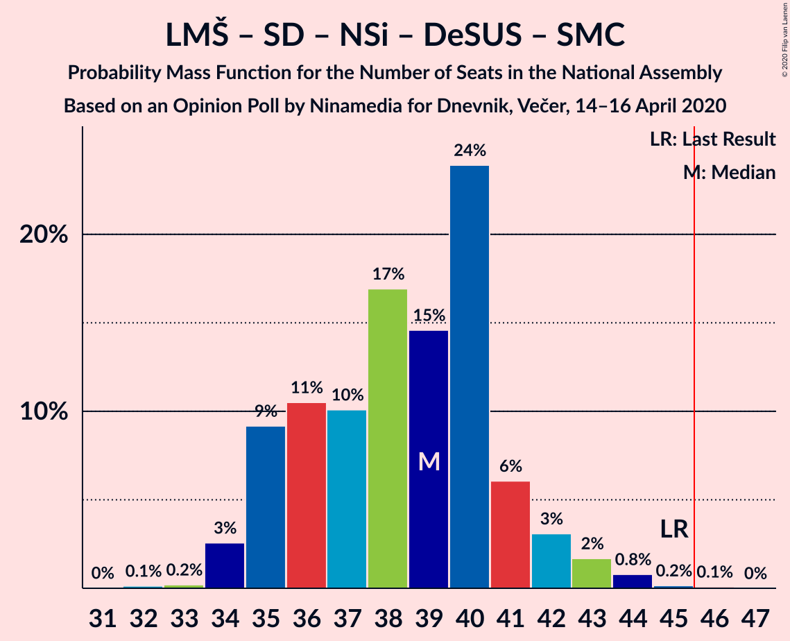
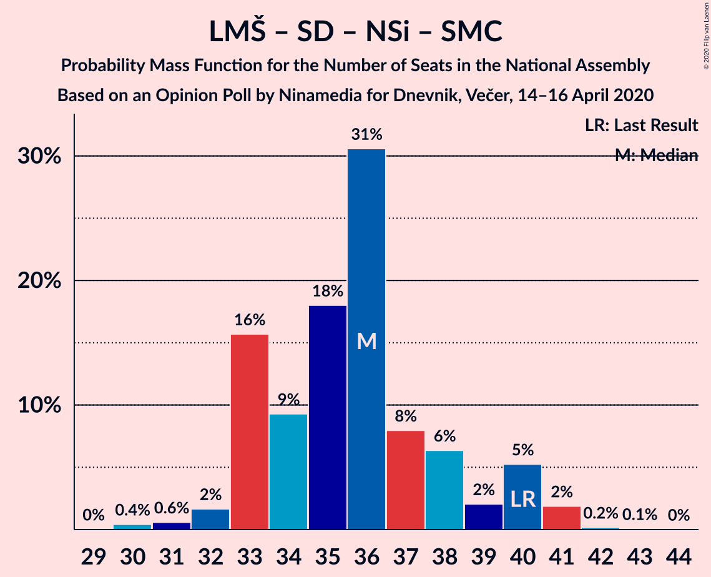
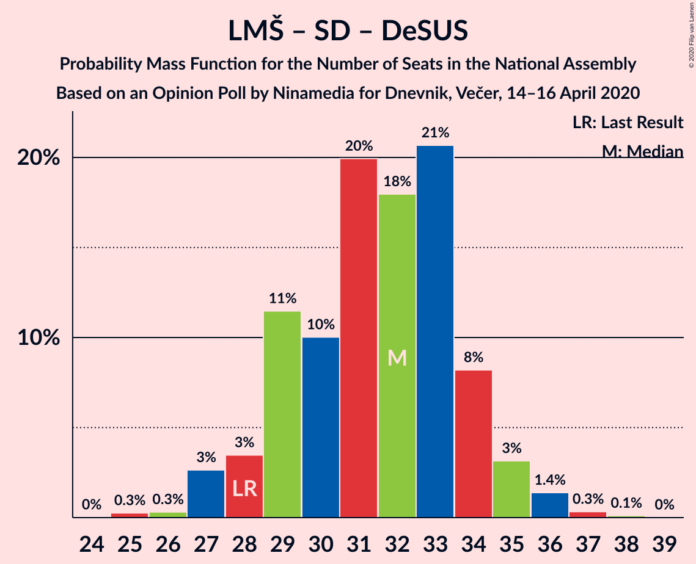
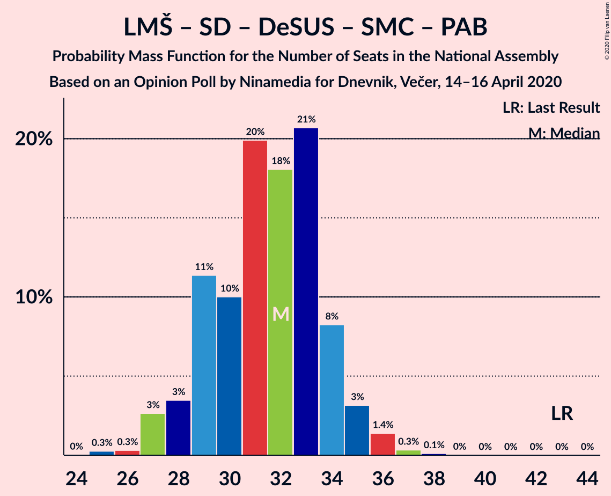

# Opinion Poll by Ninamedia for Dnevnik, Večer, 14–16 April 2020

<a href="#voting-intentions">Voting Intentions</a> | <a href="#seats">Seats</a> | <a href="#coalitions">Coalitions</a> | <a href="#technical-information">Technical Information</a>

## Voting Intentions

### Confidence Intervals

| Party | Last Result | Poll Result | 80% Confidence Interval | 90% Confidence Interval | 95% Confidence Interval | 99% Confidence Interval |
|:-----:|:-----------:|:-----------:|:-----------------------:|:-----------------------:|:-----------------------:|:-----------------------:|
| Slovenska demokratska stranka | 24.9% | 37.3% | 35.0–39.7% |34.3–40.3% |33.8–40.9% |32.7–42.1% |
| Lista Marjana Šarca | 12.6% | 16.1% | 14.5–18.0% |14.0–18.6% |13.6–19.1% |12.8–20.0% |
| Socialni demokrati | 9.9% | 14.7% | 13.1–16.6% |12.7–17.1% |12.3–17.5% |11.6–18.5% |
| Levica | 9.3% | 10.1% | 8.8–11.8% |8.4–12.2% |8.1–12.6% |7.5–13.4% |
| Nova Slovenija–Krščanski demokrati | 7.2% | 7.9% | 6.7–9.3% |6.4–9.7% |6.1–10.1% |5.6–10.8% |
| Slovenska nacionalna stranka | 4.2% | 5.9% | 4.9–7.2% |4.6–7.5% |4.3–7.9% |3.9–8.5% |
| Demokratična stranka upokojencev Slovenije | 4.9% | 4.3% | 3.4–5.4% |3.2–5.8% |3.0–6.1% |2.7–6.7% |
| Stranka modernega centra | 9.7% | 1.7% | 1.2–2.5% |1.1–2.8% |1.0–3.0% |0.8–3.4% |
| Stranka Alenke Bratušek | 5.1% | 1.0% | 0.7–1.7% |0.6–1.9% |0.5–2.1% |0.4–2.4% |
| Slovenska ljudska stranka | 2.6% | 1.0% | 0.7–1.7% |0.6–1.9% |0.5–2.1% |0.4–2.4% |

*Note:* The poll result column reflects the actual value used in the calculations. Published results may vary slightly, and in addition be rounded to fewer digits.

## Seats

### Confidence Intervals

| Party | Last Result | Median | 80% Confidence Interval | 90% Confidence Interval | 95% Confidence Interval | 99% Confidence Interval |
|:-----:|:-----------:|:------:|:-----------------------:|:-----------------------:|:-----------------------:|:-----------------------:|
| <a href="#slovenska-demokratska-stranka">Slovenska demokratska stranka</a> | 25 | 35 | 32–37 |32–38 |31–38 |31–40 |
| <a href="#lista-marjana-šarca">Lista Marjana Šarca</a> | 13 | 15 | 14–17 |13–18 |13–18 |12–18 |
| <a href="#socialni-demokrati">Socialni demokrati</a> | 10 | 13 | 12–16 |12–16 |11–17 |11–18 |
| <a href="#levica">Levica</a> | 9 | 9 | 7–11 |7–12 |7–12 |6–13 |
| <a href="#nova-slovenija–krščanski-demokrati">Nova Slovenija–Krščanski demokrati</a> | 7 | 6 | 6–9 |5–9 |5–9 |5–11 |
| <a href="#slovenska-nacionalna-stranka">Slovenska nacionalna stranka</a> | 4 | 5 | 4–6 |4–7 |3–7 |0–8 |
| <a href="#demokratična-stranka-upokojencev-slovenije">Demokratična stranka upokojencev Slovenije</a> | 5 | 4 | 0–5 |0–5 |0–5 |0–6 |
| <a href="#stranka-modernega-centra">Stranka modernega centra</a> | 10 | 0 | 0 |0 |0 |0 |
| <a href="#stranka-alenke-bratušek">Stranka Alenke Bratušek</a> | 5 | 0 | 0 |0 |0 |0 |
| <a href="#slovenska-ljudska-stranka">Slovenska ljudska stranka</a> | 0 | 0 | 0 |0 |0 |0 |

### Slovenska demokratska stranka

*For a full overview of the results for this party, see the [Slovenska demokratska stranka](party-slovenskademokratskastranka.html) page.*

| Number of Seats | Probability | Accumulated | Special Marks |
|:---------------:|:-----------:|:-----------:|:-------------:|
| 25 | 0% | 100% | Last Result |
| 26 | 0% | 100% |  |
| 27 | 0% | 100% |  |
| 28 | 0% | 100% |  |
| 29 | 0.1% | 100% |  |
| 30 | 0.2% | 99.9% |  |
| 31 | 4% | 99.7% |  |
| 32 | 6% | 96% |  |
| 33 | 10% | 90% |  |
| 34 | 23% | 80% |  |
| 35 | 13% | 58% | Median |
| 36 | 18% | 45% |  |
| 37 | 20% | 27% |  |
| 38 | 4% | 6% |  |
| 39 | 1.1% | 2% |  |
| 40 | 0.8% | 1.1% |  |
| 41 | 0.3% | 0.3% |  |
| 42 | 0% | 0% |  |

### Lista Marjana Šarca

*For a full overview of the results for this party, see the [Lista Marjana Šarca](party-listamarjanašarca.html) page.*

| Number of Seats | Probability | Accumulated | Special Marks |
|:---------------:|:-----------:|:-----------:|:-------------:|
| 11 | 0.4% | 100% |  |
| 12 | 2% | 99.6% |  |
| 13 | 6% | 98% | Last Result |
| 14 | 28% | 92% |  |
| 15 | 26% | 64% | Median |
| 16 | 13% | 37% |  |
| 17 | 19% | 24% |  |
| 18 | 5% | 5% |  |
| 19 | 0.3% | 0.3% |  |
| 20 | 0.1% | 0.1% |  |
| 21 | 0% | 0% |  |

### Socialni demokrati

*For a full overview of the results for this party, see the [Socialni demokrati](party-socialnidemokrati.html) page.*

| Number of Seats | Probability | Accumulated | Special Marks |
|:---------------:|:-----------:|:-----------:|:-------------:|
| 10 | 0.4% | 100% | Last Result |
| 11 | 3% | 99.6% |  |
| 12 | 18% | 97% |  |
| 13 | 33% | 79% | Median |
| 14 | 26% | 46% |  |
| 15 | 10% | 20% |  |
| 16 | 7% | 10% |  |
| 17 | 3% | 3% |  |
| 18 | 0.7% | 0.7% |  |
| 19 | 0% | 0% |  |

### Levica

*For a full overview of the results for this party, see the [Levica](party-levica.html) page.*

| Number of Seats | Probability | Accumulated | Special Marks |
|:---------------:|:-----------:|:-----------:|:-------------:|
| 6 | 0.5% | 100% |  |
| 7 | 12% | 99.5% |  |
| 8 | 8% | 87% |  |
| 9 | 29% | 79% | Last Result, Median |
| 10 | 32% | 50% |  |
| 11 | 11% | 18% |  |
| 12 | 6% | 7% |  |
| 13 | 1.4% | 1.4% |  |
| 14 | 0% | 0% |  |

### Nova Slovenija–Krščanski demokrati

*For a full overview of the results for this party, see the [Nova Slovenija–Krščanski demokrati](party-novaslovenija–krščanskidemokrati.html) page.*

| Number of Seats | Probability | Accumulated | Special Marks |
|:---------------:|:-----------:|:-----------:|:-------------:|
| 4 | 0.2% | 100% |  |
| 5 | 9% | 99.8% |  |
| 6 | 42% | 90% | Median |
| 7 | 20% | 49% | Last Result |
| 8 | 11% | 29% |  |
| 9 | 15% | 17% |  |
| 10 | 1.2% | 2% |  |
| 11 | 0.6% | 0.6% |  |
| 12 | 0% | 0% |  |

### Slovenska nacionalna stranka

*For a full overview of the results for this party, see the [Slovenska nacionalna stranka](party-slovenskanacionalnastranka.html) page.*

| Number of Seats | Probability | Accumulated | Special Marks |
|:---------------:|:-----------:|:-----------:|:-------------:|
| 0 | 2% | 100% |  |
| 1 | 0% | 98% |  |
| 2 | 0% | 98% |  |
| 3 | 0.9% | 98% |  |
| 4 | 18% | 97% | Last Result |
| 5 | 45% | 79% | Median |
| 6 | 25% | 34% |  |
| 7 | 9% | 10% |  |
| 8 | 1.1% | 1.1% |  |
| 9 | 0% | 0% |  |

### Demokratična stranka upokojencev Slovenije

*For a full overview of the results for this party, see the [Demokratična stranka upokojencev Slovenije](party-demokratičnastrankaupokojencevslovenije.html) page.*

| Number of Seats | Probability | Accumulated | Special Marks |
|:---------------:|:-----------:|:-----------:|:-------------:|
| 0 | 33% | 100% |  |
| 1 | 0% | 67% |  |
| 2 | 0% | 67% |  |
| 3 | 13% | 67% |  |
| 4 | 36% | 54% | Median |
| 5 | 17% | 18% | Last Result |
| 6 | 0.7% | 0.7% |  |
| 7 | 0.1% | 0.1% |  |
| 8 | 0% | 0% |  |

### Stranka modernega centra

*For a full overview of the results for this party, see the [Stranka modernega centra](party-strankamodernegacentra.html) page.*

| Number of Seats | Probability | Accumulated | Special Marks |
|:---------------:|:-----------:|:-----------:|:-------------:|
| 0 | 99.8% | 100% | Median |
| 1 | 0% | 0.2% |  |
| 2 | 0% | 0.2% |  |
| 3 | 0.2% | 0.2% |  |
| 4 | 0% | 0% |  |
| 5 | 0% | 0% |  |
| 6 | 0% | 0% |  |
| 7 | 0% | 0% |  |
| 8 | 0% | 0% |  |
| 9 | 0% | 0% |  |
| 10 | 0% | 0% | Last Result |

### Stranka Alenke Bratušek

*For a full overview of the results for this party, see the [Stranka Alenke Bratušek](party-strankaalenkebratušek.html) page.*

| Number of Seats | Probability | Accumulated | Special Marks |
|:---------------:|:-----------:|:-----------:|:-------------:|
| 0 | 100% | 100% | Median |
| 1 | 0% | 0% |  |
| 2 | 0% | 0% |  |
| 3 | 0% | 0% |  |
| 4 | 0% | 0% |  |
| 5 | 0% | 0% | Last Result |

### Slovenska ljudska stranka

*For a full overview of the results for this party, see the [Slovenska ljudska stranka](party-slovenskaljudskastranka.html) page.*

| Number of Seats | Probability | Accumulated | Special Marks |
|:---------------:|:-----------:|:-----------:|:-------------:|
| 0 | 100% | 100% | Last Result, Median |

## Coalitions

### Confidence Intervals

| Coalition | Last Result | Median | Majority? | 80% Confidence Interval | 90% Confidence Interval | 95% Confidence Interval | 99% Confidence Interval |
|:---------:|:-----------:|:------:|:---------:|:-----------------------:|:-----------------------:|:-----------------------:|:-----------------------:|
| Slovenska demokratska stranka – Lista Marjana Šarca – Demokratična stranka upokojencev Slovenije | 43 | 53 | 100% | 50–56 | 49–57 | 48–57 | 47–58 |
| Slovenska demokratska stranka – Lista Marjana Šarca | 38 | 50 | 98% | 48–54 | 47–54 | 46–54 | 45–55 |
| Lista Marjana Šarca – Socialni demokrati – Nova Slovenija–Krščanski demokrati – Demokratična stranka upokojencev Slovenije | 35 | 39 | 0.1% | 35–41 | 35–42 | 34–43 | 34–44 |
| Lista Marjana Šarca – Socialni demokrati – Nova Slovenija–Krščanski demokrati – Demokratična stranka upokojencev Slovenije – Stranka modernega centra – Stranka Alenke Bratušek | 50 | 39 | 0.1% | 35–41 | 35–42 | 34–43 | 34–44 |
| Lista Marjana Šarca – Socialni demokrati – Nova Slovenija–Krščanski demokrati – Demokratična stranka upokojencev Slovenije – Stranka modernega centra | 45 | 39 | 0.1% | 35–41 | 35–42 | 34–43 | 34–44 |
| Lista Marjana Šarca – Socialni demokrati – Nova Slovenija–Krščanski demokrati | 30 | 36 | 0% | 33–38 | 33–40 | 32–40 | 31–41 |
| Lista Marjana Šarca – Socialni demokrati – Nova Slovenija–Krščanski demokrati – Stranka modernega centra | 40 | 36 | 0% | 33–38 | 33–40 | 32–40 | 31–41 |
| Lista Marjana Šarca – Socialni demokrati – Demokratična stranka upokojencev Slovenije | 28 | 32 | 0% | 29–34 | 28–34 | 27–35 | 26–36 |
| Lista Marjana Šarca – Socialni demokrati – Demokratična stranka upokojencev Slovenije – Stranka modernega centra – Stranka Alenke Bratušek | 43 | 32 | 0% | 29–34 | 28–35 | 27–35 | 26–36 |
| Lista Marjana Šarca – Socialni demokrati – Demokratična stranka upokojencev Slovenije – Stranka modernega centra | 38 | 32 | 0% | 29–34 | 28–35 | 27–35 | 26–36 |
| Lista Marjana Šarca – Socialni demokrati | 23 | 29 | 0% | 27–31 | 27–32 | 26–33 | 24–34 |
| Lista Marjana Šarca – Socialni demokrati – Stranka modernega centra | 33 | 29 | 0% | 27–31 | 27–32 | 26–33 | 24–34 |
| Socialni demokrati – Demokratična stranka upokojencev Slovenije – Stranka modernega centra | 25 | 17 | 0% | 13–18 | 13–19 | 12–20 | 11–22 |

### Slovenska demokratska stranka – Lista Marjana Šarca – Demokratična stranka upokojencev Slovenije

| Number of Seats | Probability | Accumulated | Special Marks |
|:---------------:|:-----------:|:-----------:|:-------------:|
| 43 | 0% | 100% | Last Result |
| 44 | 0% | 100% |  |
| 45 | 0% | 100% |  |
| 46 | 0.1% | 100% | Majority |
| 47 | 1.1% | 99.9% |  |
| 48 | 2% | 98.9% |  |
| 49 | 3% | 97% |  |
| 50 | 6% | 93% |  |
| 51 | 13% | 87% |  |
| 52 | 20% | 74% |  |
| 53 | 15% | 54% |  |
| 54 | 13% | 39% | Median |
| 55 | 5% | 26% |  |
| 56 | 11% | 20% |  |
| 57 | 9% | 9% |  |
| 58 | 0.4% | 0.5% |  |
| 59 | 0.1% | 0.1% |  |
| 60 | 0% | 0% |  |

### Slovenska demokratska stranka – Lista Marjana Šarca

| Number of Seats | Probability | Accumulated | Special Marks |
|:---------------:|:-----------:|:-----------:|:-------------:|
| 38 | 0% | 100% | Last Result |
| 39 | 0% | 100% |  |
| 40 | 0% | 100% |  |
| 41 | 0% | 100% |  |
| 42 | 0% | 100% |  |
| 43 | 0% | 100% |  |
| 44 | 0.2% | 100% |  |
| 45 | 2% | 99.8% |  |
| 46 | 2% | 98% | Majority |
| 47 | 5% | 96% |  |
| 48 | 20% | 91% |  |
| 49 | 7% | 71% |  |
| 50 | 16% | 63% | Median |
| 51 | 22% | 48% |  |
| 52 | 7% | 25% |  |
| 53 | 6% | 18% |  |
| 54 | 10% | 12% |  |
| 55 | 2% | 2% |  |
| 56 | 0.3% | 0.4% |  |
| 57 | 0.1% | 0.1% |  |
| 58 | 0% | 0% |  |

### Lista Marjana Šarca – Socialni demokrati – Nova Slovenija–Krščanski demokrati – Demokratična stranka upokojencev Slovenije

| Number of Seats | Probability | Accumulated | Special Marks |
|:---------------:|:-----------:|:-----------:|:-------------:|
| 32 | 0.1% | 100% |  |
| 33 | 0.2% | 99.8% |  |
| 34 | 3% | 99.6% |  |
| 35 | 9% | 97% | Last Result |
| 36 | 11% | 88% |  |
| 37 | 10% | 77% |  |
| 38 | 17% | 67% | Median |
| 39 | 15% | 50% |  |
| 40 | 24% | 36% |  |
| 41 | 6% | 12% |  |
| 42 | 3% | 6% |  |
| 43 | 2% | 3% |  |
| 44 | 0.8% | 1.0% |  |
| 45 | 0.2% | 0.2% |  |
| 46 | 0.1% | 0.1% | Majority |
| 47 | 0% | 0% |  |

### Lista Marjana Šarca – Socialni demokrati – Nova Slovenija–Krščanski demokrati – Demokratična stranka upokojencev Slovenije – Stranka modernega centra – Stranka Alenke Bratušek

| Number of Seats | Probability | Accumulated | Special Marks |
|:---------------:|:-----------:|:-----------:|:-------------:|
| 32 | 0.1% | 100% |  |
| 33 | 0.2% | 99.8% |  |
| 34 | 3% | 99.6% |  |
| 35 | 9% | 97% |  |
| 36 | 11% | 88% |  |
| 37 | 10% | 77% |  |
| 38 | 17% | 67% | Median |
| 39 | 15% | 50% |  |
| 40 | 24% | 36% |  |
| 41 | 6% | 12% |  |
| 42 | 3% | 6% |  |
| 43 | 2% | 3% |  |
| 44 | 0.8% | 1.0% |  |
| 45 | 0.2% | 0.2% |  |
| 46 | 0.1% | 0.1% | Majority |
| 47 | 0% | 0% |  |
| 48 | 0% | 0% |  |
| 49 | 0% | 0% |  |
| 50 | 0% | 0% | Last Result |

### Lista Marjana Šarca – Socialni demokrati – Nova Slovenija–Krščanski demokrati – Demokratična stranka upokojencev Slovenije – Stranka modernega centra

| Number of Seats | Probability | Accumulated | Special Marks |
|:---------------:|:-----------:|:-----------:|:-------------:|
| 32 | 0.1% | 100% |  |
| 33 | 0.2% | 99.8% |  |
| 34 | 3% | 99.6% |  |
| 35 | 9% | 97% |  |
| 36 | 11% | 88% |  |
| 37 | 10% | 77% |  |
| 38 | 17% | 67% | Median |
| 39 | 15% | 50% |  |
| 40 | 24% | 36% |  |
| 41 | 6% | 12% |  |
| 42 | 3% | 6% |  |
| 43 | 2% | 3% |  |
| 44 | 0.8% | 1.0% |  |
| 45 | 0.2% | 0.2% | Last Result |
| 46 | 0.1% | 0.1% | Majority |
| 47 | 0% | 0% |  |

### Lista Marjana Šarca – Socialni demokrati – Nova Slovenija–Krščanski demokrati

| Number of Seats | Probability | Accumulated | Special Marks |
|:---------------:|:-----------:|:-----------:|:-------------:|
| 30 | 0.4% | 100% | Last Result |
| 31 | 0.7% | 99.6% |  |
| 32 | 2% | 98.9% |  |
| 33 | 16% | 97% |  |
| 34 | 9% | 81% | Median |
| 35 | 18% | 72% |  |
| 36 | 31% | 54% |  |
| 37 | 8% | 24% |  |
| 38 | 6% | 16% |  |
| 39 | 2% | 9% |  |
| 40 | 5% | 7% |  |
| 41 | 2% | 2% |  |
| 42 | 0.2% | 0.2% |  |
| 43 | 0.1% | 0.1% |  |
| 44 | 0% | 0% |  |

### Lista Marjana Šarca – Socialni demokrati – Nova Slovenija–Krščanski demokrati – Stranka modernega centra

| Number of Seats | Probability | Accumulated | Special Marks |
|:---------------:|:-----------:|:-----------:|:-------------:|
| 30 | 0.4% | 100% |  |
| 31 | 0.6% | 99.6% |  |
| 32 | 2% | 99.0% |  |
| 33 | 16% | 97% |  |
| 34 | 9% | 82% | Median |
| 35 | 18% | 72% |  |
| 36 | 31% | 54% |  |
| 37 | 8% | 24% |  |
| 38 | 6% | 16% |  |
| 39 | 2% | 9% |  |
| 40 | 5% | 7% | Last Result |
| 41 | 2% | 2% |  |
| 42 | 0.2% | 0.2% |  |
| 43 | 0.1% | 0.1% |  |
| 44 | 0% | 0% |  |

### Lista Marjana Šarca – Socialni demokrati – Demokratična stranka upokojencev Slovenije

| Number of Seats | Probability | Accumulated | Special Marks |
|:---------------:|:-----------:|:-----------:|:-------------:|
| 25 | 0.3% | 100% |  |
| 26 | 0.3% | 99.7% |  |
| 27 | 3% | 99.4% |  |
| 28 | 3% | 97% | Last Result |
| 29 | 11% | 93% |  |
| 30 | 10% | 82% |  |
| 31 | 20% | 72% |  |
| 32 | 18% | 52% | Median |
| 33 | 21% | 34% |  |
| 34 | 8% | 13% |  |
| 35 | 3% | 5% |  |
| 36 | 1.4% | 2% |  |
| 37 | 0.3% | 0.5% |  |
| 38 | 0.1% | 0.1% |  |
| 39 | 0% | 0% |  |

### Lista Marjana Šarca – Socialni demokrati – Demokratična stranka upokojencev Slovenije – Stranka modernega centra – Stranka Alenke Bratušek

| Number of Seats | Probability | Accumulated | Special Marks |
|:---------------:|:-----------:|:-----------:|:-------------:|
| 25 | 0.3% | 100% |  |
| 26 | 0.3% | 99.7% |  |
| 27 | 3% | 99.4% |  |
| 28 | 3% | 97% |  |
| 29 | 11% | 93% |  |
| 30 | 10% | 82% |  |
| 31 | 20% | 72% |  |
| 32 | 18% | 52% | Median |
| 33 | 21% | 34% |  |
| 34 | 8% | 13% |  |
| 35 | 3% | 5% |  |
| 36 | 1.4% | 2% |  |
| 37 | 0.3% | 0.5% |  |
| 38 | 0.1% | 0.1% |  |
| 39 | 0% | 0% |  |
| 40 | 0% | 0% |  |
| 41 | 0% | 0% |  |
| 42 | 0% | 0% |  |
| 43 | 0% | 0% | Last Result |

### Lista Marjana Šarca – Socialni demokrati – Demokratična stranka upokojencev Slovenije – Stranka modernega centra

| Number of Seats | Probability | Accumulated | Special Marks |
|:---------------:|:-----------:|:-----------:|:-------------:|
| 25 | 0.3% | 100% |  |
| 26 | 0.3% | 99.7% |  |
| 27 | 3% | 99.4% |  |
| 28 | 3% | 97% |  |
| 29 | 11% | 93% |  |
| 30 | 10% | 82% |  |
| 31 | 20% | 72% |  |
| 32 | 18% | 52% | Median |
| 33 | 21% | 34% |  |
| 34 | 8% | 13% |  |
| 35 | 3% | 5% |  |
| 36 | 1.4% | 2% |  |
| 37 | 0.3% | 0.5% |  |
| 38 | 0.1% | 0.1% | Last Result |
| 39 | 0% | 0% |  |

### Lista Marjana Šarca – Socialni demokrati

| Number of Seats | Probability | Accumulated | Special Marks |
|:---------------:|:-----------:|:-----------:|:-------------:|
| 23 | 0.3% | 100% | Last Result |
| 24 | 0.4% | 99.6% |  |
| 25 | 2% | 99.2% |  |
| 26 | 2% | 98% |  |
| 27 | 27% | 95% |  |
| 28 | 12% | 68% | Median |
| 29 | 24% | 56% |  |
| 30 | 18% | 32% |  |
| 31 | 8% | 15% |  |
| 32 | 3% | 7% |  |
| 33 | 3% | 4% |  |
| 34 | 0.8% | 0.9% |  |
| 35 | 0.1% | 0.1% |  |
| 36 | 0% | 0% |  |

### Lista Marjana Šarca – Socialni demokrati – Stranka modernega centra

| Number of Seats | Probability | Accumulated | Special Marks |
|:---------------:|:-----------:|:-----------:|:-------------:|
| 23 | 0.3% | 100% |  |
| 24 | 0.4% | 99.6% |  |
| 25 | 2% | 99.2% |  |
| 26 | 2% | 98% |  |
| 27 | 27% | 95% |  |
| 28 | 12% | 69% | Median |
| 29 | 24% | 56% |  |
| 30 | 18% | 32% |  |
| 31 | 8% | 15% |  |
| 32 | 3% | 7% |  |
| 33 | 3% | 4% | Last Result |
| 34 | 0.8% | 0.9% |  |
| 35 | 0.1% | 0.1% |  |
| 36 | 0% | 0% |  |

### Socialni demokrati – Demokratična stranka upokojencev Slovenije – Stranka modernega centra

| Number of Seats | Probability | Accumulated | Special Marks |
|:---------------:|:-----------:|:-----------:|:-------------:|
| 10 | 0.1% | 100% |  |
| 11 | 0.6% | 99.9% |  |
| 12 | 3% | 99.2% |  |
| 13 | 7% | 96% |  |
| 14 | 9% | 89% |  |
| 15 | 11% | 81% |  |
| 16 | 18% | 70% |  |
| 17 | 26% | 52% | Median |
| 18 | 17% | 26% |  |
| 19 | 5% | 9% |  |
| 20 | 2% | 4% |  |
| 21 | 2% | 2% |  |
| 22 | 0.5% | 0.6% |  |
| 23 | 0% | 0% |  |
| 24 | 0% | 0% |  |
| 25 | 0% | 0% | Last Result |

## Technical Information

### Opinion Poll

+ **Polling firm:** Ninamedia
+ **Commissioner(s):** Dnevnik, Večer
+ **Fieldwork period:** 14–16 April 2020

### Calculations

+ **Sample size:** 700
+ **Simulations done:** 1,048,576
+ **Error estimate:** 3.41%

