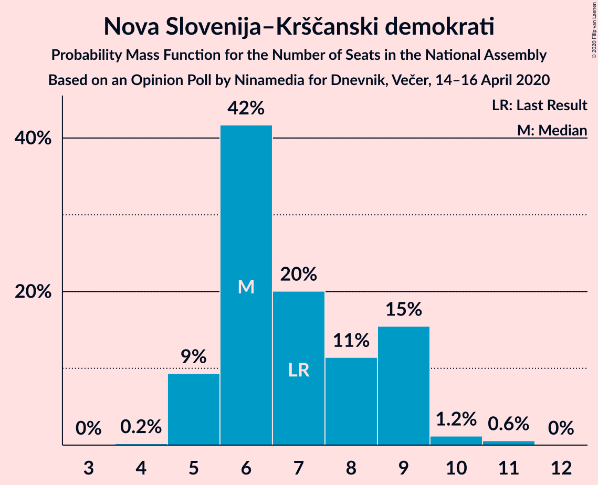
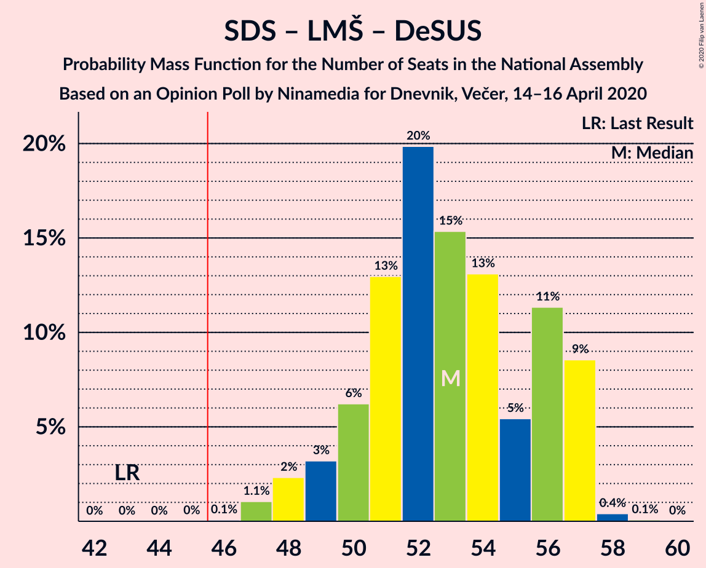
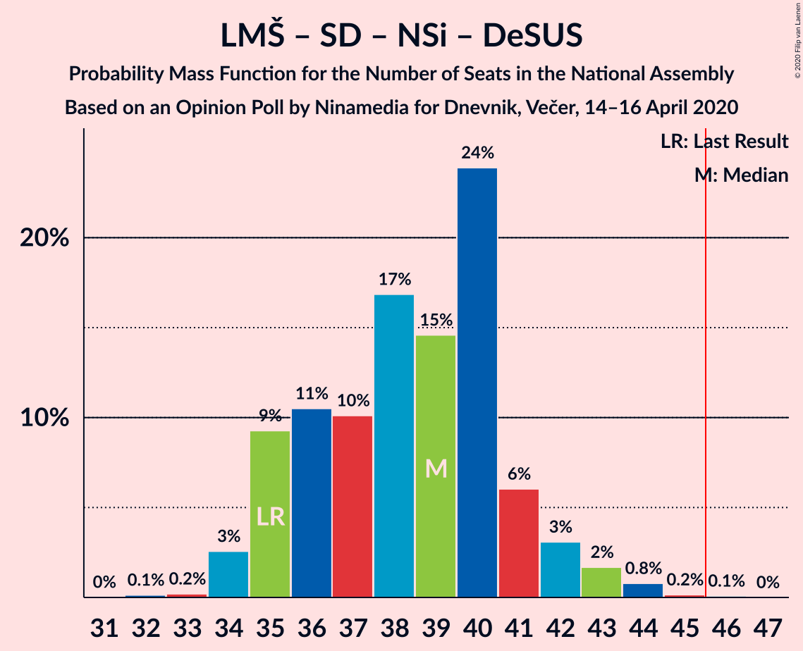

# Opinion Poll by Ninamedia for Dnevnik, Večer, 14–16 April 2020

<a href="#voting-intentions">Voting Intentions</a> | <a href="#seats">Seats</a> | <a href="#coalitions">Coalitions</a> | <a href="#technical-information">Technical Information</a>

## Voting Intentions

### Confidence Intervals

| Party | Last Result | Poll Result | 80% Confidence Interval | 90% Confidence Interval | 95% Confidence Interval | 99% Confidence Interval |
|:-----:|:-----------:|:-----------:|:-----------------------:|:-----------------------:|:-----------------------:|:-----------------------:|
| Slovenska demokratska stranka | 24.9% | 37.3% | 35.0–39.7% |34.3–40.3% |33.8–40.9% |32.7–42.1% |
| Lista Marjana Šarca | 12.6% | 16.1% | 14.5–18.0% |14.0–18.6% |13.6–19.1% |12.8–20.0% |
| Socialni demokrati | 9.9% | 14.7% | 13.1–16.6% |12.7–17.1% |12.3–17.5% |11.6–18.5% |
| Levica | 9.3% | 10.1% | 8.8–11.8% |8.4–12.2% |8.1–12.6% |7.5–13.4% |
| Nova Slovenija–Krščanski demokrati | 7.2% | 7.9% | 6.7–9.3% |6.4–9.7% |6.1–10.1% |5.6–10.8% |
| Slovenska nacionalna stranka | 4.2% | 5.0% | 4.1–6.2% |3.8–6.6% |3.6–6.9% |3.2–7.5% |
| Demokratična stranka upokojencev Slovenije | 4.9% | 4.3% | 3.4–5.4% |3.2–5.8% |3.0–6.1% |2.7–6.7% |
| Stranka modernega centra | 9.7% | 1.7% | 1.2–2.5% |1.1–2.8% |1.0–3.0% |0.8–3.4% |
| Stranka Alenke Bratušek | 5.1% | 1.0% | 0.7–1.7% |0.6–1.9% |0.5–2.1% |0.4–2.4% |
| Slovenska ljudska stranka | 2.6% | 1.0% | 0.7–1.7% |0.6–1.9% |0.5–2.1% |0.4–2.4% |

*Note:* The poll result column reflects the actual value used in the calculations. Published results may vary slightly, and in addition be rounded to fewer digits.

## Seats

### Confidence Intervals

| Party | Last Result | Median | 80% Confidence Interval | 90% Confidence Interval | 95% Confidence Interval | 99% Confidence Interval |
|:-----:|:-----------:|:------:|:-----------------------:|:-----------------------:|:-----------------------:|:-----------------------:|
| <a href="#slovenska-demokratska-stranka">Slovenska demokratska stranka</a> | 25 | 35 | 33–38 |33–39 |32–40 |31–41 |
| <a href="#lista-marjana-šarca">Lista Marjana Šarca</a> | 13 | 16 | 14–17 |13–18 |13–18 |12–20 |
| <a href="#socialni-demokrati">Socialni demokrati</a> | 10 | 14 | 12–15 |11–16 |11–16 |11–17 |
| <a href="#levica">Levica</a> | 9 | 10 | 8–11 |8–11 |7–12 |7–12 |
| <a href="#nova-slovenija–krščanski-demokrati">Nova Slovenija–Krščanski demokrati</a> | 7 | 7 | 6–9 |6–9 |6–9 |5–10 |
| <a href="#slovenska-nacionalna-stranka">Slovenska nacionalna stranka</a> | 4 | 4 | 3–5 |0–6 |0–6 |0–7 |
| <a href="#demokratična-stranka-upokojencev-slovenije">Demokratična stranka upokojencev Slovenije</a> | 5 | 3 | 0–5 |0–5 |0–6 |0–6 |
| <a href="#stranka-modernega-centra">Stranka modernega centra</a> | 10 | 0 | 0 |0 |0 |0 |
| <a href="#stranka-alenke-bratušek">Stranka Alenke Bratušek</a> | 5 | 0 | 0 |0 |0 |0 |
| <a href="#slovenska-ljudska-stranka">Slovenska ljudska stranka</a> | 0 | 0 | 0 |0 |0 |0 |

### Slovenska demokratska stranka

*For a full overview of the results for this party, see the [Slovenska demokratska stranka](party-slovenskademokratskastranka.html) page.*

| Number of Seats | Probability | Accumulated | Special Marks |
|:---------------:|:-----------:|:-----------:|:-------------:|
| 25 | 0% | 100% | Last Result |
| 26 | 0% | 100% |  |
| 27 | 0% | 100% |  |
| 28 | 0% | 100% |  |
| 29 | 0% | 100% |  |
| 30 | 0.4% | 100% |  |
| 31 | 2% | 99.5% |  |
| 32 | 3% | 98% |  |
| 33 | 11% | 95% |  |
| 34 | 10% | 84% |  |
| 35 | 31% | 74% | Median |
| 36 | 18% | 43% |  |
| 37 | 11% | 25% |  |
| 38 | 6% | 15% |  |
| 39 | 6% | 9% |  |
| 40 | 2% | 4% |  |
| 41 | 2% | 2% |  |
| 42 | 0.1% | 0.1% |  |
| 43 | 0% | 0% |  |

### Lista Marjana Šarca

*For a full overview of the results for this party, see the [Lista Marjana Šarca](party-listamarjanašarca.html) page.*

| Number of Seats | Probability | Accumulated | Special Marks |
|:---------------:|:-----------:|:-----------:|:-------------:|
| 11 | 0.2% | 100% |  |
| 12 | 2% | 99.8% |  |
| 13 | 5% | 98% | Last Result |
| 14 | 13% | 93% |  |
| 15 | 25% | 80% |  |
| 16 | 24% | 55% | Median |
| 17 | 23% | 30% |  |
| 18 | 6% | 8% |  |
| 19 | 0.6% | 1.2% |  |
| 20 | 0.6% | 0.7% |  |
| 21 | 0.1% | 0.1% |  |
| 22 | 0% | 0% |  |

### Socialni demokrati

*For a full overview of the results for this party, see the [Socialni demokrati](party-socialnidemokrati.html) page.*

| Number of Seats | Probability | Accumulated | Special Marks |
|:---------------:|:-----------:|:-----------:|:-------------:|
| 10 | 0.3% | 100% | Last Result |
| 11 | 5% | 99.7% |  |
| 12 | 15% | 94% |  |
| 13 | 24% | 79% |  |
| 14 | 20% | 55% | Median |
| 15 | 26% | 35% |  |
| 16 | 8% | 9% |  |
| 17 | 1.0% | 1.2% |  |
| 18 | 0.2% | 0.2% |  |
| 19 | 0% | 0% |  |

### Levica

*For a full overview of the results for this party, see the [Levica](party-levica.html) page.*

| Number of Seats | Probability | Accumulated | Special Marks |
|:---------------:|:-----------:|:-----------:|:-------------:|
| 6 | 0.2% | 100% |  |
| 7 | 3% | 99.8% |  |
| 8 | 16% | 97% |  |
| 9 | 24% | 82% | Last Result |
| 10 | 38% | 57% | Median |
| 11 | 15% | 19% |  |
| 12 | 3% | 4% |  |
| 13 | 0.4% | 0.5% |  |
| 14 | 0% | 0% |  |

### Nova Slovenija–Krščanski demokrati

*For a full overview of the results for this party, see the [Nova Slovenija–Krščanski demokrati](party-novaslovenija–krščanskidemokrati.html) page.*

| Number of Seats | Probability | Accumulated | Special Marks |
|:---------------:|:-----------:|:-----------:|:-------------:|
| 4 | 0.1% | 100% |  |
| 5 | 2% | 99.9% |  |
| 6 | 21% | 98% |  |
| 7 | 42% | 78% | Last Result, Median |
| 8 | 19% | 35% |  |
| 9 | 14% | 16% |  |
| 10 | 2% | 2% |  |
| 11 | 0% | 0.1% |  |
| 12 | 0% | 0% |  |

### Slovenska nacionalna stranka

*For a full overview of the results for this party, see the [Slovenska nacionalna stranka](party-slovenskanacionalnastranka.html) page.*

| Number of Seats | Probability | Accumulated | Special Marks |
|:---------------:|:-----------:|:-----------:|:-------------:|
| 0 | 8% | 100% |  |
| 1 | 0% | 92% |  |
| 2 | 0% | 92% |  |
| 3 | 5% | 92% |  |
| 4 | 52% | 86% | Last Result, Median |
| 5 | 25% | 34% |  |
| 6 | 8% | 9% |  |
| 7 | 0.7% | 0.7% |  |
| 8 | 0% | 0% |  |

### Demokratična stranka upokojencev Slovenije

*For a full overview of the results for this party, see the [Demokratična stranka upokojencev Slovenije](party-demokratičnastrankaupokojencevslovenije.html) page.*

| Number of Seats | Probability | Accumulated | Special Marks |
|:---------------:|:-----------:|:-----------:|:-------------:|
| 0 | 50% | 100% |  |
| 1 | 0% | 50% |  |
| 2 | 0% | 50% |  |
| 3 | 3% | 50% | Median |
| 4 | 31% | 47% |  |
| 5 | 13% | 16% | Last Result |
| 6 | 3% | 3% |  |
| 7 | 0% | 0% |  |

### Stranka modernega centra

*For a full overview of the results for this party, see the [Stranka modernega centra](party-strankamodernegacentra.html) page.*

| Number of Seats | Probability | Accumulated | Special Marks |
|:---------------:|:-----------:|:-----------:|:-------------:|
| 0 | 99.9% | 100% | Median |
| 1 | 0% | 0.1% |  |
| 2 | 0% | 0.1% |  |
| 3 | 0% | 0.1% |  |
| 4 | 0% | 0% |  |
| 5 | 0% | 0% |  |
| 6 | 0% | 0% |  |
| 7 | 0% | 0% |  |
| 8 | 0% | 0% |  |
| 9 | 0% | 0% |  |
| 10 | 0% | 0% | Last Result |

### Stranka Alenke Bratušek

*For a full overview of the results for this party, see the [Stranka Alenke Bratušek](party-strankaalenkebratušek.html) page.*

| Number of Seats | Probability | Accumulated | Special Marks |
|:---------------:|:-----------:|:-----------:|:-------------:|
| 0 | 100% | 100% | Median |
| 1 | 0% | 0% |  |
| 2 | 0% | 0% |  |
| 3 | 0% | 0% |  |
| 4 | 0% | 0% |  |
| 5 | 0% | 0% | Last Result |

### Slovenska ljudska stranka

*For a full overview of the results for this party, see the [Slovenska ljudska stranka](party-slovenskaljudskastranka.html) page.*

| Number of Seats | Probability | Accumulated | Special Marks |
|:---------------:|:-----------:|:-----------:|:-------------:|
| 0 | 100% | 100% | Last Result, Median |

## Coalitions

### Confidence Intervals

| Coalition | Last Result | Median | Majority? | 80% Confidence Interval | 90% Confidence Interval | 95% Confidence Interval | 99% Confidence Interval |
|:---------:|:-----------:|:------:|:---------:|:-----------------------:|:-----------------------:|:-----------------------:|:-----------------------:|
| Slovenska demokratska stranka – Lista Marjana Šarca – Demokratična stranka upokojencev Slovenije | 43 | 53 | 100% | 51–56 | 49–57 | 49–59 | 47–59 |
| Slovenska demokratska stranka – Lista Marjana Šarca | 38 | 51 | 99.5% | 48–55 | 47–55 | 47–56 | 46–59 |
| Lista Marjana Šarca – Socialni demokrati – Nova Slovenija–Krščanski demokrati – Demokratična stranka upokojencev Slovenije | 35 | 39 | 0.1% | 36–41 | 35–42 | 35–43 | 34–44 |
| Lista Marjana Šarca – Socialni demokrati – Nova Slovenija–Krščanski demokrati – Demokratična stranka upokojencev Slovenije – Stranka modernega centra – Stranka Alenke Bratušek | 50 | 39 | 0.1% | 36–41 | 35–42 | 35–43 | 34–44 |
| Lista Marjana Šarca – Socialni demokrati – Nova Slovenija–Krščanski demokrati – Demokratična stranka upokojencev Slovenije – Stranka modernega centra | 45 | 39 | 0.1% | 36–41 | 35–42 | 35–43 | 34–44 |
| Lista Marjana Šarca – Socialni demokrati – Nova Slovenija–Krščanski demokrati | 30 | 37 | 0% | 35–39 | 33–39 | 33–40 | 32–41 |
| Lista Marjana Šarca – Socialni demokrati – Nova Slovenija–Krščanski demokrati – Stranka modernega centra | 40 | 37 | 0% | 35–39 | 33–39 | 33–40 | 32–41 |
| Lista Marjana Šarca – Socialni demokrati – Demokratična stranka upokojencev Slovenije | 28 | 32 | 0% | 28–34 | 28–35 | 27–35 | 27–36 |
| Lista Marjana Šarca – Socialni demokrati – Demokratična stranka upokojencev Slovenije – Stranka modernega centra – Stranka Alenke Bratušek | 43 | 32 | 0% | 28–34 | 28–35 | 27–35 | 27–36 |
| Lista Marjana Šarca – Socialni demokrati – Demokratična stranka upokojencev Slovenije – Stranka modernega centra | 38 | 32 | 0% | 28–34 | 28–35 | 27–35 | 27–36 |
| Lista Marjana Šarca – Socialni demokrati | 23 | 29 | 0% | 27–32 | 27–32 | 26–32 | 24–34 |
| Lista Marjana Šarca – Socialni demokrati – Stranka modernega centra | 33 | 29 | 0% | 27–32 | 27–32 | 26–32 | 24–34 |
| Socialni demokrati – Demokratična stranka upokojencev Slovenije – Stranka modernega centra | 25 | 16 | 0% | 13–19 | 12–20 | 12–20 | 12–21 |

### Slovenska demokratska stranka – Lista Marjana Šarca – Demokratična stranka upokojencev Slovenije

| Number of Seats | Probability | Accumulated | Special Marks |
|:---------------:|:-----------:|:-----------:|:-------------:|
| 43 | 0% | 100% | Last Result |
| 44 | 0% | 100% |  |
| 45 | 0% | 100% |  |
| 46 | 0.1% | 100% | Majority |
| 47 | 0.5% | 99.9% |  |
| 48 | 0.2% | 99.5% |  |
| 49 | 4% | 99.3% |  |
| 50 | 4% | 95% |  |
| 51 | 10% | 91% |  |
| 52 | 24% | 81% |  |
| 53 | 15% | 58% |  |
| 54 | 12% | 43% | Median |
| 55 | 12% | 31% |  |
| 56 | 9% | 18% |  |
| 57 | 7% | 10% |  |
| 58 | 0.4% | 3% |  |
| 59 | 2% | 3% |  |
| 60 | 0.2% | 0.3% |  |
| 61 | 0% | 0% |  |

### Slovenska demokratska stranka – Lista Marjana Šarca

| Number of Seats | Probability | Accumulated | Special Marks |
|:---------------:|:-----------:|:-----------:|:-------------:|
| 38 | 0% | 100% | Last Result |
| 39 | 0% | 100% |  |
| 40 | 0% | 100% |  |
| 41 | 0% | 100% |  |
| 42 | 0% | 100% |  |
| 43 | 0% | 100% |  |
| 44 | 0% | 100% |  |
| 45 | 0.4% | 99.9% |  |
| 46 | 2% | 99.5% | Majority |
| 47 | 3% | 98% |  |
| 48 | 8% | 95% |  |
| 49 | 13% | 87% |  |
| 50 | 14% | 74% |  |
| 51 | 12% | 60% | Median |
| 52 | 27% | 48% |  |
| 53 | 7% | 21% |  |
| 54 | 4% | 14% |  |
| 55 | 8% | 10% |  |
| 56 | 0.7% | 3% |  |
| 57 | 1.0% | 2% |  |
| 58 | 0% | 1.0% |  |
| 59 | 0.9% | 0.9% |  |
| 60 | 0% | 0% |  |

### Lista Marjana Šarca – Socialni demokrati – Nova Slovenija–Krščanski demokrati – Demokratična stranka upokojencev Slovenije

| Number of Seats | Probability | Accumulated | Special Marks |
|:---------------:|:-----------:|:-----------:|:-------------:|
| 32 | 0.1% | 100% |  |
| 33 | 0.2% | 99.9% |  |
| 34 | 0.7% | 99.7% |  |
| 35 | 5% | 99.1% | Last Result |
| 36 | 4% | 94% |  |
| 37 | 15% | 90% |  |
| 38 | 9% | 75% |  |
| 39 | 35% | 66% |  |
| 40 | 10% | 31% | Median |
| 41 | 12% | 21% |  |
| 42 | 6% | 9% |  |
| 43 | 2% | 3% |  |
| 44 | 0.4% | 0.7% |  |
| 45 | 0.2% | 0.3% |  |
| 46 | 0.1% | 0.1% | Majority |
| 47 | 0% | 0% |  |

### Lista Marjana Šarca – Socialni demokrati – Nova Slovenija–Krščanski demokrati – Demokratična stranka upokojencev Slovenije – Stranka modernega centra – Stranka Alenke Bratušek

| Number of Seats | Probability | Accumulated | Special Marks |
|:---------------:|:-----------:|:-----------:|:-------------:|
| 32 | 0.1% | 100% |  |
| 33 | 0.2% | 99.9% |  |
| 34 | 0.7% | 99.7% |  |
| 35 | 5% | 99.1% |  |
| 36 | 4% | 94% |  |
| 37 | 15% | 90% |  |
| 38 | 9% | 75% |  |
| 39 | 35% | 66% |  |
| 40 | 10% | 31% | Median |
| 41 | 12% | 21% |  |
| 42 | 6% | 9% |  |
| 43 | 2% | 3% |  |
| 44 | 0.4% | 0.7% |  |
| 45 | 0.2% | 0.3% |  |
| 46 | 0.1% | 0.1% | Majority |
| 47 | 0% | 0% |  |
| 48 | 0% | 0% |  |
| 49 | 0% | 0% |  |
| 50 | 0% | 0% | Last Result |

### Lista Marjana Šarca – Socialni demokrati – Nova Slovenija–Krščanski demokrati – Demokratična stranka upokojencev Slovenije – Stranka modernega centra

| Number of Seats | Probability | Accumulated | Special Marks |
|:---------------:|:-----------:|:-----------:|:-------------:|
| 32 | 0.1% | 100% |  |
| 33 | 0.2% | 99.9% |  |
| 34 | 0.7% | 99.7% |  |
| 35 | 5% | 99.1% |  |
| 36 | 4% | 94% |  |
| 37 | 15% | 90% |  |
| 38 | 9% | 75% |  |
| 39 | 35% | 66% |  |
| 40 | 10% | 31% | Median |
| 41 | 12% | 21% |  |
| 42 | 6% | 9% |  |
| 43 | 2% | 3% |  |
| 44 | 0.4% | 0.7% |  |
| 45 | 0.2% | 0.3% | Last Result |
| 46 | 0.1% | 0.1% | Majority |
| 47 | 0% | 0% |  |

### Lista Marjana Šarca – Socialni demokrati – Nova Slovenija–Krščanski demokrati

| Number of Seats | Probability | Accumulated | Special Marks |
|:---------------:|:-----------:|:-----------:|:-------------:|
| 30 | 0.1% | 100% | Last Result |
| 31 | 0.2% | 99.9% |  |
| 32 | 0.8% | 99.6% |  |
| 33 | 4% | 98.9% |  |
| 34 | 4% | 95% |  |
| 35 | 21% | 90% |  |
| 36 | 16% | 69% |  |
| 37 | 20% | 53% | Median |
| 38 | 10% | 34% |  |
| 39 | 19% | 24% |  |
| 40 | 3% | 4% |  |
| 41 | 0.6% | 1.0% |  |
| 42 | 0.3% | 0.4% |  |
| 43 | 0.1% | 0.2% |  |
| 44 | 0% | 0% |  |

### Lista Marjana Šarca – Socialni demokrati – Nova Slovenija–Krščanski demokrati – Stranka modernega centra

| Number of Seats | Probability | Accumulated | Special Marks |
|:---------------:|:-----------:|:-----------:|:-------------:|
| 30 | 0.1% | 100% |  |
| 31 | 0.2% | 99.9% |  |
| 32 | 0.8% | 99.6% |  |
| 33 | 4% | 98.9% |  |
| 34 | 4% | 95% |  |
| 35 | 21% | 90% |  |
| 36 | 16% | 69% |  |
| 37 | 20% | 53% | Median |
| 38 | 10% | 34% |  |
| 39 | 19% | 24% |  |
| 40 | 3% | 4% | Last Result |
| 41 | 0.6% | 1.0% |  |
| 42 | 0.3% | 0.4% |  |
| 43 | 0.1% | 0.2% |  |
| 44 | 0% | 0% |  |

### Lista Marjana Šarca – Socialni demokrati – Demokratična stranka upokojencev Slovenije

| Number of Seats | Probability | Accumulated | Special Marks |
|:---------------:|:-----------:|:-----------:|:-------------:|
| 25 | 0.1% | 100% |  |
| 26 | 0.1% | 99.9% |  |
| 27 | 4% | 99.8% |  |
| 28 | 7% | 96% | Last Result |
| 29 | 6% | 89% |  |
| 30 | 10% | 83% |  |
| 31 | 10% | 73% |  |
| 32 | 36% | 63% |  |
| 33 | 11% | 27% | Median |
| 34 | 8% | 16% |  |
| 35 | 6% | 8% |  |
| 36 | 2% | 2% |  |
| 37 | 0.3% | 0.5% |  |
| 38 | 0.1% | 0.1% |  |
| 39 | 0% | 0% |  |

### Lista Marjana Šarca – Socialni demokrati – Demokratična stranka upokojencev Slovenije – Stranka modernega centra – Stranka Alenke Bratušek

| Number of Seats | Probability | Accumulated | Special Marks |
|:---------------:|:-----------:|:-----------:|:-------------:|
| 25 | 0.1% | 100% |  |
| 26 | 0.1% | 99.9% |  |
| 27 | 4% | 99.8% |  |
| 28 | 7% | 96% |  |
| 29 | 6% | 89% |  |
| 30 | 10% | 83% |  |
| 31 | 10% | 73% |  |
| 32 | 36% | 63% |  |
| 33 | 11% | 27% | Median |
| 34 | 8% | 16% |  |
| 35 | 6% | 8% |  |
| 36 | 2% | 2% |  |
| 37 | 0.3% | 0.5% |  |
| 38 | 0.1% | 0.1% |  |
| 39 | 0% | 0% |  |
| 40 | 0% | 0% |  |
| 41 | 0% | 0% |  |
| 42 | 0% | 0% |  |
| 43 | 0% | 0% | Last Result |

### Lista Marjana Šarca – Socialni demokrati – Demokratična stranka upokojencev Slovenije – Stranka modernega centra

| Number of Seats | Probability | Accumulated | Special Marks |
|:---------------:|:-----------:|:-----------:|:-------------:|
| 25 | 0.1% | 100% |  |
| 26 | 0.1% | 99.9% |  |
| 27 | 4% | 99.8% |  |
| 28 | 7% | 96% |  |
| 29 | 6% | 89% |  |
| 30 | 10% | 83% |  |
| 31 | 10% | 73% |  |
| 32 | 36% | 63% |  |
| 33 | 11% | 27% | Median |
| 34 | 8% | 16% |  |
| 35 | 6% | 8% |  |
| 36 | 2% | 2% |  |
| 37 | 0.3% | 0.5% |  |
| 38 | 0.1% | 0.1% | Last Result |
| 39 | 0% | 0% |  |

### Lista Marjana Šarca – Socialni demokrati

| Number of Seats | Probability | Accumulated | Special Marks |
|:---------------:|:-----------:|:-----------:|:-------------:|
| 23 | 0% | 100% | Last Result |
| 24 | 0.5% | 100% |  |
| 25 | 1.3% | 99.4% |  |
| 26 | 2% | 98% |  |
| 27 | 9% | 96% |  |
| 28 | 25% | 87% |  |
| 29 | 17% | 62% |  |
| 30 | 15% | 45% | Median |
| 31 | 9% | 30% |  |
| 32 | 19% | 20% |  |
| 33 | 0.8% | 1.4% |  |
| 34 | 0.4% | 0.6% |  |
| 35 | 0.1% | 0.2% |  |
| 36 | 0.1% | 0.1% |  |
| 37 | 0% | 0% |  |

### Lista Marjana Šarca – Socialni demokrati – Stranka modernega centra

| Number of Seats | Probability | Accumulated | Special Marks |
|:---------------:|:-----------:|:-----------:|:-------------:|
| 24 | 0.5% | 100% |  |
| 25 | 1.3% | 99.4% |  |
| 26 | 2% | 98% |  |
| 27 | 9% | 96% |  |
| 28 | 25% | 87% |  |
| 29 | 17% | 62% |  |
| 30 | 15% | 45% | Median |
| 31 | 9% | 30% |  |
| 32 | 19% | 20% |  |
| 33 | 0.8% | 1.4% | Last Result |
| 34 | 0.4% | 0.6% |  |
| 35 | 0.1% | 0.2% |  |
| 36 | 0.1% | 0.1% |  |
| 37 | 0% | 0% |  |

### Socialni demokrati – Demokratična stranka upokojencev Slovenije – Stranka modernega centra

| Number of Seats | Probability | Accumulated | Special Marks |
|:---------------:|:-----------:|:-----------:|:-------------:|
| 11 | 0.4% | 100% |  |
| 12 | 5% | 99.6% |  |
| 13 | 7% | 95% |  |
| 14 | 11% | 88% |  |
| 15 | 25% | 77% |  |
| 16 | 15% | 52% |  |
| 17 | 18% | 38% | Median |
| 18 | 6% | 20% |  |
| 19 | 5% | 13% |  |
| 20 | 7% | 8% |  |
| 21 | 0.7% | 1.0% |  |
| 22 | 0.3% | 0.3% |  |
| 23 | 0% | 0% |  |
| 24 | 0% | 0% |  |
| 25 | 0% | 0% | Last Result |

## Technical Information

### Opinion Poll

+ **Polling firm:** Ninamedia
+ **Commissioner(s):** Dnevnik, Večer
+ **Fieldwork period:** 14–16 April 2020

### Calculations

+ **Sample size:** 700
+ **Simulations done:** 1,048,576
+ **Error estimate:** 3.14%

