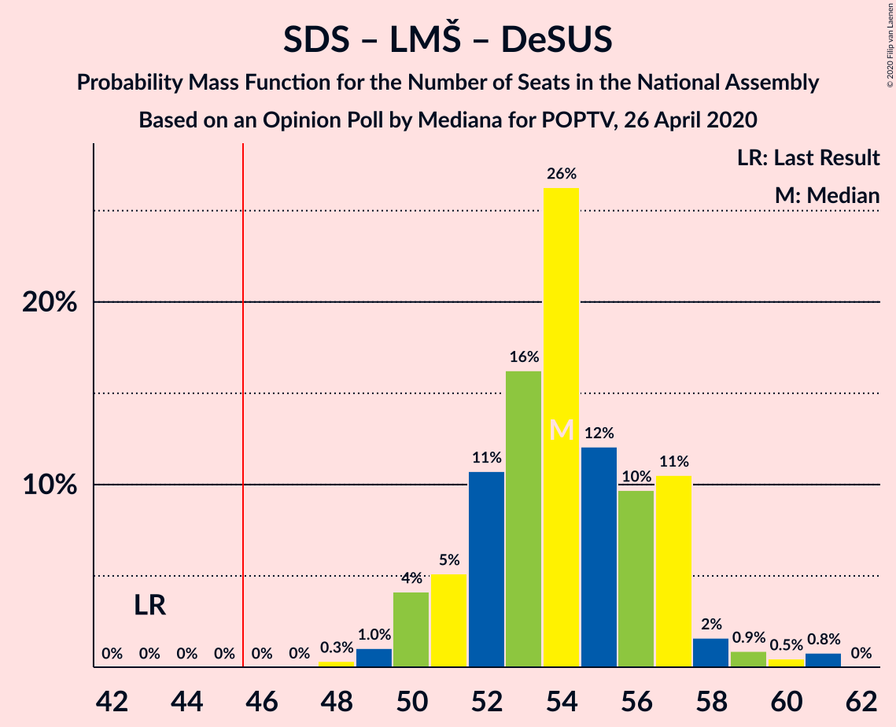
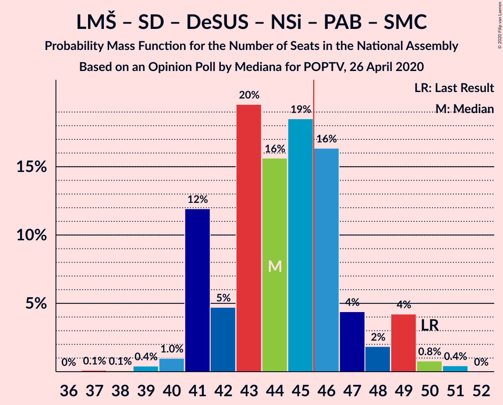

# Opinion Poll by Mediana for POPTV, 26 April 2020

<a href="#voting-intentions">Voting Intentions</a> | <a href="#seats">Seats</a> | <a href="#coalitions">Coalitions</a> | <a href="#technical-information">Technical Information</a>

## Voting Intentions

### Confidence Intervals

| Party | Last Result | Poll Result | 80% Confidence Interval | 90% Confidence Interval | 95% Confidence Interval | 99% Confidence Interval |
|:-----:|:-----------:|:-----------:|:-----------------------:|:-----------------------:|:-----------------------:|:-----------------------:|
| Slovenska demokratska stranka | 24.9% | 30.5% | 28.4–32.7% |27.8–33.4% |27.3–33.9% |26.3–35.0% |
| Lista Marjana Šarca | 12.6% | 18.8% | 17.0–20.7% |16.5–21.2% |16.1–21.7% |15.3–22.7% |
| Levica | 9.3% | 12.3% | 10.9–14.0% |10.5–14.4% |10.1–14.8% |9.5–15.7% |
| Socialni demokrati | 9.9% | 10.7% | 9.3–12.3% |8.9–12.7% |8.6–13.1% |8.0–13.9% |
| Demokratična stranka upokojencev Slovenije | 4.9% | 8.2% | 7.1–9.7% |6.7–10.1% |6.5–10.4% |5.9–11.2% |
| Nova Slovenija–Krščanski demokrati | 7.2% | 6.3% | 5.3–7.7% |5.0–8.0% |4.8–8.3% |4.4–9.0% |
| Stranka Alenke Bratušek | 5.1% | 4.9% | 4.0–6.0% |3.7–6.4% |3.5–6.7% |3.2–7.3% |
| Slovenska nacionalna stranka | 4.2% | 4.5% | 3.6–5.6% |3.4–5.9% |3.2–6.2% |2.8–6.8% |
| Slovenska ljudska stranka | 2.6% | 1.6% | 1.2–2.4% |1.0–2.6% |0.9–2.8% |0.7–3.2% |
| Stranka modernega centra | 9.7% | 1.5% | 1.1–2.2% |0.9–2.5% |0.8–2.6% |0.7–3.0% |

*Note:* The poll result column reflects the actual value used in the calculations. Published results may vary slightly, and in addition be rounded to fewer digits.

## Seats

### Confidence Intervals

| Party | Last Result | Median | 80% Confidence Interval | 90% Confidence Interval | 95% Confidence Interval | 99% Confidence Interval |
|:-----:|:-----------:|:------:|:-----------------------:|:-----------------------:|:-----------------------:|:-----------------------:|
| <a href="#slovenska-demokratska-stranka">Slovenska demokratska stranka</a> | 25 | 29 | 27–31 |26–31 |26–33 |25–34 |
| <a href="#lista-marjana-šarca">Lista Marjana Šarca</a> | 13 | 18 | 16–19 |15–20 |15–21 |14–21 |
| <a href="#levica">Levica</a> | 9 | 12 | 10–13 |10–13 |9–14 |9–14 |
| <a href="#socialni-demokrati">Socialni demokrati</a> | 10 | 10 | 9–11 |8–12 |8–12 |7–13 |
| <a href="#demokratična-stranka-upokojencev-slovenije">Demokratična stranka upokojencev Slovenije</a> | 5 | 7 | 6–9 |6–9 |6–9 |5–10 |
| <a href="#nova-slovenija–krščanski-demokrati">Nova Slovenija–Krščanski demokrati</a> | 7 | 5 | 5–7 |4–7 |4–8 |4–8 |
| <a href="#stranka-alenke-bratušek">Stranka Alenke Bratušek</a> | 5 | 4 | 0–5 |0–6 |0–6 |0–6 |
| <a href="#slovenska-nacionalna-stranka">Slovenska nacionalna stranka</a> | 4 | 4 | 0–5 |0–5 |0–5 |0–6 |
| <a href="#slovenska-ljudska-stranka">Slovenska ljudska stranka</a> | 0 | 0 | 0 |0 |0 |0 |
| <a href="#stranka-modernega-centra">Stranka modernega centra</a> | 10 | 0 | 0 |0 |0 |0 |

### Slovenska demokratska stranka

*For a full overview of the results for this party, see the [Slovenska demokratska stranka](party-slovenskademokratskastranka.html) page.*

| Number of Seats | Probability | Accumulated | Special Marks |
|:---------------:|:-----------:|:-----------:|:-------------:|
| 24 | 0.3% | 100% |  |
| 25 | 2% | 99.7% | Last Result |
| 26 | 4% | 98% |  |
| 27 | 16% | 94% |  |
| 28 | 20% | 78% |  |
| 29 | 23% | 57% | Median |
| 30 | 19% | 34% |  |
| 31 | 11% | 15% |  |
| 32 | 2% | 4% |  |
| 33 | 1.0% | 3% |  |
| 34 | 1.3% | 2% |  |
| 35 | 0.2% | 0.2% |  |
| 36 | 0% | 0% |  |

### Lista Marjana Šarca

*For a full overview of the results for this party, see the [Lista Marjana Šarca](party-listamarjanašarca.html) page.*

| Number of Seats | Probability | Accumulated | Special Marks |
|:---------------:|:-----------:|:-----------:|:-------------:|
| 13 | 0.2% | 100% | Last Result |
| 14 | 2% | 99.8% |  |
| 15 | 5% | 98% |  |
| 16 | 12% | 93% |  |
| 17 | 16% | 80% |  |
| 18 | 31% | 65% | Median |
| 19 | 26% | 34% |  |
| 20 | 5% | 8% |  |
| 21 | 3% | 4% |  |
| 22 | 0.2% | 0.3% |  |
| 23 | 0.1% | 0.1% |  |
| 24 | 0% | 0% |  |

### Levica

*For a full overview of the results for this party, see the [Levica](party-levica.html) page.*

| Number of Seats | Probability | Accumulated | Special Marks |
|:---------------:|:-----------:|:-----------:|:-------------:|
| 8 | 0.4% | 100% |  |
| 9 | 4% | 99.6% | Last Result |
| 10 | 18% | 96% |  |
| 11 | 23% | 77% |  |
| 12 | 36% | 54% | Median |
| 13 | 13% | 18% |  |
| 14 | 4% | 5% |  |
| 15 | 0.4% | 0.5% |  |
| 16 | 0.1% | 0.1% |  |
| 17 | 0% | 0% |  |

### Socialni demokrati

*For a full overview of the results for this party, see the [Socialni demokrati](party-socialnidemokrati.html) page.*

| Number of Seats | Probability | Accumulated | Special Marks |
|:---------------:|:-----------:|:-----------:|:-------------:|
| 7 | 0.8% | 100% |  |
| 8 | 9% | 99.2% |  |
| 9 | 27% | 91% |  |
| 10 | 39% | 64% | Last Result, Median |
| 11 | 19% | 25% |  |
| 12 | 5% | 6% |  |
| 13 | 0.7% | 0.8% |  |
| 14 | 0.1% | 0.1% |  |
| 15 | 0% | 0% |  |

### Demokratična stranka upokojencev Slovenije

*For a full overview of the results for this party, see the [Demokratična stranka upokojencev Slovenije](party-demokratičnastrankaupokojencevslovenije.html) page.*

| Number of Seats | Probability | Accumulated | Special Marks |
|:---------------:|:-----------:|:-----------:|:-------------:|
| 5 | 2% | 100% | Last Result |
| 6 | 20% | 98% |  |
| 7 | 29% | 78% | Median |
| 8 | 35% | 49% |  |
| 9 | 12% | 14% |  |
| 10 | 2% | 2% |  |
| 11 | 0.2% | 0.3% |  |
| 12 | 0.1% | 0.1% |  |
| 13 | 0% | 0% |  |

### Nova Slovenija–Krščanski demokrati

*For a full overview of the results for this party, see the [Nova Slovenija–Krščanski demokrati](party-novaslovenija–krščanskidemokrati.html) page.*

| Number of Seats | Probability | Accumulated | Special Marks |
|:---------------:|:-----------:|:-----------:|:-------------:|
| 0 | 0.1% | 100% |  |
| 1 | 0% | 99.9% |  |
| 2 | 0% | 99.9% |  |
| 3 | 0.1% | 99.9% |  |
| 4 | 7% | 99.8% |  |
| 5 | 51% | 93% | Median |
| 6 | 28% | 42% |  |
| 7 | 11% | 15% | Last Result |
| 8 | 3% | 3% |  |
| 9 | 0.2% | 0.3% |  |
| 10 | 0% | 0% |  |

### Stranka Alenke Bratušek

*For a full overview of the results for this party, see the [Stranka Alenke Bratušek](party-strankaalenkebratušek.html) page.*

| Number of Seats | Probability | Accumulated | Special Marks |
|:---------------:|:-----------:|:-----------:|:-------------:|
| 0 | 16% | 100% |  |
| 1 | 0% | 84% |  |
| 2 | 0% | 84% |  |
| 3 | 1.2% | 84% |  |
| 4 | 51% | 82% | Median |
| 5 | 26% | 31% | Last Result |
| 6 | 5% | 5% |  |
| 7 | 0.4% | 0.4% |  |
| 8 | 0% | 0% |  |

### Slovenska nacionalna stranka

*For a full overview of the results for this party, see the [Slovenska nacionalna stranka](party-slovenskanacionalnastranka.html) page.*

| Number of Seats | Probability | Accumulated | Special Marks |
|:---------------:|:-----------:|:-----------:|:-------------:|
| 0 | 21% | 100% |  |
| 1 | 0% | 79% |  |
| 2 | 0% | 79% |  |
| 3 | 3% | 79% |  |
| 4 | 57% | 77% | Last Result, Median |
| 5 | 18% | 20% |  |
| 6 | 2% | 2% |  |
| 7 | 0.1% | 0.1% |  |
| 8 | 0% | 0% |  |

### Slovenska ljudska stranka

*For a full overview of the results for this party, see the [Slovenska ljudska stranka](party-slovenskaljudskastranka.html) page.*

| Number of Seats | Probability | Accumulated | Special Marks |
|:---------------:|:-----------:|:-----------:|:-------------:|
| 0 | 100% | 100% | Last Result, Median |

### Stranka modernega centra

*For a full overview of the results for this party, see the [Stranka modernega centra](party-strankamodernegacentra.html) page.*

| Number of Seats | Probability | Accumulated | Special Marks |
|:---------------:|:-----------:|:-----------:|:-------------:|
| 0 | 100% | 100% | Median |
| 1 | 0% | 0% |  |
| 2 | 0% | 0% |  |
| 3 | 0% | 0% |  |
| 4 | 0% | 0% |  |
| 5 | 0% | 0% |  |
| 6 | 0% | 0% |  |
| 7 | 0% | 0% |  |
| 8 | 0% | 0% |  |
| 9 | 0% | 0% |  |
| 10 | 0% | 0% | Last Result |

## Coalitions

### Confidence Intervals

| Coalition | Last Result | Median | Majority? | 80% Confidence Interval | 90% Confidence Interval | 95% Confidence Interval | 99% Confidence Interval |
|:---------:|:-----------:|:------:|:---------:|:-----------------------:|:-----------------------:|:-----------------------:|:-----------------------:|
| Slovenska demokratska stranka – Lista Marjana Šarca – Demokratična stranka upokojencev Slovenije | 43 | 54 | 100% | 51–57 | 50–57 | 50–58 | 49–61 |
| Slovenska demokratska stranka – Lista Marjana Šarca | 38 | 47 | 69% | 44–49 | 43–49 | 42–50 | 41–53 |
| Lista Marjana Šarca – Socialni demokrati – Demokratična stranka upokojencev Slovenije – Nova Slovenija–Krščanski demokrati – Stranka Alenke Bratušek – Stranka modernega centra | 50 | 44 | 28% | 41–47 | 41–49 | 41–49 | 39–50 |
| Lista Marjana Šarca – Socialni demokrati – Demokratična stranka upokojencev Slovenije – Nova Slovenija–Krščanski demokrati | 35 | 41 | 2% | 38–44 | 37–45 | 37–45 | 36–47 |
| Lista Marjana Šarca – Socialni demokrati – Demokratična stranka upokojencev Slovenije – Nova Slovenija–Krščanski demokrati – Stranka modernega centra | 45 | 41 | 2% | 38–44 | 37–45 | 37–45 | 36–47 |
| Lista Marjana Šarca – Socialni demokrati – Demokratična stranka upokojencev Slovenije – Stranka Alenke Bratušek – Stranka modernega centra | 43 | 39 | 0% | 36–41 | 36–42 | 35–44 | 33–44 |
| Lista Marjana Šarca – Socialni demokrati – Demokratična stranka upokojencev Slovenije | 28 | 35 | 0% | 32–38 | 32–38 | 31–40 | 31–40 |
| Lista Marjana Šarca – Socialni demokrati – Demokratična stranka upokojencev Slovenije – Stranka modernega centra | 38 | 35 | 0% | 32–38 | 32–38 | 31–40 | 31–40 |
| Lista Marjana Šarca – Socialni demokrati – Nova Slovenija–Krščanski demokrati | 30 | 33 | 0% | 30–37 | 30–37 | 30–37 | 29–38 |
| Lista Marjana Šarca – Socialni demokrati – Nova Slovenija–Krščanski demokrati – Stranka modernega centra | 40 | 33 | 0% | 30–37 | 30–37 | 30–37 | 29–38 |
| Lista Marjana Šarca – Socialni demokrati | 23 | 28 | 0% | 25–30 | 25–31 | 24–32 | 23–32 |
| Lista Marjana Šarca – Socialni demokrati – Stranka modernega centra | 33 | 28 | 0% | 25–30 | 25–31 | 24–32 | 23–32 |
| Socialni demokrati – Demokratična stranka upokojencev Slovenije – Stranka modernega centra | 25 | 17 | 0% | 15–19 | 15–19 | 15–20 | 14–21 |

### Slovenska demokratska stranka – Lista Marjana Šarca – Demokratična stranka upokojencev Slovenije

| Number of Seats | Probability | Accumulated | Special Marks |
|:---------------:|:-----------:|:-----------:|:-------------:|
| 43 | 0% | 100% | Last Result |
| 44 | 0% | 100% |  |
| 45 | 0% | 100% |  |
| 46 | 0% | 100% | Majority |
| 47 | 0% | 100% |  |
| 48 | 0.3% | 100% |  |
| 49 | 1.0% | 99.6% |  |
| 50 | 4% | 98.6% |  |
| 51 | 5% | 94% |  |
| 52 | 11% | 89% |  |
| 53 | 16% | 79% |  |
| 54 | 26% | 62% | Median |
| 55 | 12% | 36% |  |
| 56 | 10% | 24% |  |
| 57 | 11% | 14% |  |
| 58 | 2% | 4% |  |
| 59 | 0.9% | 2% |  |
| 60 | 0.5% | 1.3% |  |
| 61 | 0.8% | 0.8% |  |
| 62 | 0% | 0% |  |

### Slovenska demokratska stranka – Lista Marjana Šarca

| Number of Seats | Probability | Accumulated | Special Marks |
|:---------------:|:-----------:|:-----------:|:-------------:|
| 38 | 0% | 100% | Last Result |
| 39 | 0% | 100% |  |
| 40 | 0.1% | 100% |  |
| 41 | 0.5% | 99.9% |  |
| 42 | 3% | 99.3% |  |
| 43 | 3% | 96% |  |
| 44 | 7% | 93% |  |
| 45 | 17% | 86% |  |
| 46 | 13% | 69% | Majority |
| 47 | 17% | 55% | Median |
| 48 | 20% | 39% |  |
| 49 | 14% | 18% |  |
| 50 | 3% | 5% |  |
| 51 | 0.8% | 2% |  |
| 52 | 0.4% | 1.4% |  |
| 53 | 0.9% | 0.9% |  |
| 54 | 0% | 0% |  |

### Lista Marjana Šarca – Socialni demokrati – Demokratična stranka upokojencev Slovenije – Nova Slovenija–Krščanski demokrati – Stranka Alenke Bratušek – Stranka modernega centra

| Number of Seats | Probability | Accumulated | Special Marks |
|:---------------:|:-----------:|:-----------:|:-------------:|
| 37 | 0.1% | 100% |  |
| 38 | 0.1% | 99.9% |  |
| 39 | 0.4% | 99.8% |  |
| 40 | 1.0% | 99.4% |  |
| 41 | 12% | 98% |  |
| 42 | 5% | 86% |  |
| 43 | 20% | 82% |  |
| 44 | 16% | 62% | Median |
| 45 | 19% | 47% |  |
| 46 | 16% | 28% | Majority |
| 47 | 4% | 12% |  |
| 48 | 2% | 7% |  |
| 49 | 4% | 5% |  |
| 50 | 0.8% | 1.2% | Last Result |
| 51 | 0.4% | 0.5% |  |
| 52 | 0% | 0% |  |

### Lista Marjana Šarca – Socialni demokrati – Demokratična stranka upokojencev Slovenije – Nova Slovenija–Krščanski demokrati

| Number of Seats | Probability | Accumulated | Special Marks |
|:---------------:|:-----------:|:-----------:|:-------------:|
| 35 | 0.2% | 100% | Last Result |
| 36 | 1.4% | 99.8% |  |
| 37 | 6% | 98% |  |
| 38 | 9% | 92% |  |
| 39 | 14% | 83% |  |
| 40 | 11% | 69% | Median |
| 41 | 33% | 57% |  |
| 42 | 9% | 25% |  |
| 43 | 3% | 15% |  |
| 44 | 7% | 12% |  |
| 45 | 4% | 6% |  |
| 46 | 1.0% | 2% | Majority |
| 47 | 0.4% | 0.5% |  |
| 48 | 0.1% | 0.1% |  |
| 49 | 0% | 0% |  |

### Lista Marjana Šarca – Socialni demokrati – Demokratična stranka upokojencev Slovenije – Nova Slovenija–Krščanski demokrati – Stranka modernega centra

| Number of Seats | Probability | Accumulated | Special Marks |
|:---------------:|:-----------:|:-----------:|:-------------:|
| 35 | 0.2% | 100% |  |
| 36 | 1.4% | 99.8% |  |
| 37 | 6% | 98% |  |
| 38 | 9% | 92% |  |
| 39 | 14% | 83% |  |
| 40 | 11% | 69% | Median |
| 41 | 33% | 57% |  |
| 42 | 9% | 25% |  |
| 43 | 3% | 15% |  |
| 44 | 7% | 12% |  |
| 45 | 4% | 6% | Last Result |
| 46 | 1.0% | 2% | Majority |
| 47 | 0.4% | 0.5% |  |
| 48 | 0.1% | 0.1% |  |
| 49 | 0% | 0% |  |

### Lista Marjana Šarca – Socialni demokrati – Demokratična stranka upokojencev Slovenije – Stranka Alenke Bratušek – Stranka modernega centra

| Number of Seats | Probability | Accumulated | Special Marks |
|:---------------:|:-----------:|:-----------:|:-------------:|
| 31 | 0% | 100% |  |
| 32 | 0.2% | 99.9% |  |
| 33 | 0.4% | 99.7% |  |
| 34 | 0.4% | 99.4% |  |
| 35 | 2% | 99.0% |  |
| 36 | 14% | 97% |  |
| 37 | 9% | 83% |  |
| 38 | 24% | 74% |  |
| 39 | 13% | 50% | Median |
| 40 | 15% | 37% |  |
| 41 | 13% | 22% |  |
| 42 | 5% | 9% |  |
| 43 | 1.4% | 4% | Last Result |
| 44 | 2% | 3% |  |
| 45 | 0.3% | 0.3% |  |
| 46 | 0% | 0% | Majority |

### Lista Marjana Šarca – Socialni demokrati – Demokratična stranka upokojencev Slovenije

| Number of Seats | Probability | Accumulated | Special Marks |
|:---------------:|:-----------:|:-----------:|:-------------:|
| 28 | 0% | 100% | Last Result |
| 29 | 0.1% | 100% |  |
| 30 | 0.2% | 99.9% |  |
| 31 | 2% | 99.7% |  |
| 32 | 9% | 97% |  |
| 33 | 11% | 89% |  |
| 34 | 19% | 78% |  |
| 35 | 12% | 59% | Median |
| 36 | 30% | 47% |  |
| 37 | 5% | 17% |  |
| 38 | 7% | 12% |  |
| 39 | 2% | 5% |  |
| 40 | 2% | 3% |  |
| 41 | 0.4% | 0.4% |  |
| 42 | 0.1% | 0.1% |  |
| 43 | 0% | 0% |  |

### Lista Marjana Šarca – Socialni demokrati – Demokratična stranka upokojencev Slovenije – Stranka modernega centra

| Number of Seats | Probability | Accumulated | Special Marks |
|:---------------:|:-----------:|:-----------:|:-------------:|
| 29 | 0.1% | 100% |  |
| 30 | 0.2% | 99.9% |  |
| 31 | 2% | 99.7% |  |
| 32 | 9% | 97% |  |
| 33 | 11% | 89% |  |
| 34 | 19% | 78% |  |
| 35 | 12% | 59% | Median |
| 36 | 30% | 47% |  |
| 37 | 5% | 17% |  |
| 38 | 7% | 12% | Last Result |
| 39 | 2% | 5% |  |
| 40 | 2% | 3% |  |
| 41 | 0.4% | 0.4% |  |
| 42 | 0.1% | 0.1% |  |
| 43 | 0% | 0% |  |

### Lista Marjana Šarca – Socialni demokrati – Nova Slovenija–Krščanski demokrati

| Number of Seats | Probability | Accumulated | Special Marks |
|:---------------:|:-----------:|:-----------:|:-------------:|
| 27 | 0% | 100% |  |
| 28 | 0.2% | 99.9% |  |
| 29 | 2% | 99.8% |  |
| 30 | 9% | 98% | Last Result |
| 31 | 10% | 89% |  |
| 32 | 11% | 79% |  |
| 33 | 31% | 68% | Median |
| 34 | 16% | 37% |  |
| 35 | 8% | 22% |  |
| 36 | 3% | 13% |  |
| 37 | 8% | 10% |  |
| 38 | 2% | 2% |  |
| 39 | 0.3% | 0.4% |  |
| 40 | 0% | 0.1% |  |
| 41 | 0% | 0% |  |

### Lista Marjana Šarca – Socialni demokrati – Nova Slovenija–Krščanski demokrati – Stranka modernega centra

| Number of Seats | Probability | Accumulated | Special Marks |
|:---------------:|:-----------:|:-----------:|:-------------:|
| 27 | 0% | 100% |  |
| 28 | 0.2% | 99.9% |  |
| 29 | 2% | 99.8% |  |
| 30 | 9% | 98% |  |
| 31 | 10% | 89% |  |
| 32 | 11% | 79% |  |
| 33 | 31% | 68% | Median |
| 34 | 16% | 37% |  |
| 35 | 8% | 22% |  |
| 36 | 3% | 13% |  |
| 37 | 8% | 10% |  |
| 38 | 2% | 2% |  |
| 39 | 0.3% | 0.4% |  |
| 40 | 0% | 0.1% | Last Result |
| 41 | 0% | 0% |  |

### Lista Marjana Šarca – Socialni demokrati

| Number of Seats | Probability | Accumulated | Special Marks |
|:---------------:|:-----------:|:-----------:|:-------------:|
| 22 | 0.1% | 100% |  |
| 23 | 0.5% | 99.9% | Last Result |
| 24 | 4% | 99.4% |  |
| 25 | 10% | 96% |  |
| 26 | 9% | 85% |  |
| 27 | 15% | 76% |  |
| 28 | 39% | 61% | Median |
| 29 | 6% | 22% |  |
| 30 | 9% | 16% |  |
| 31 | 4% | 7% |  |
| 32 | 3% | 3% |  |
| 33 | 0.2% | 0.3% |  |
| 34 | 0% | 0.1% |  |
| 35 | 0% | 0% |  |

### Lista Marjana Šarca – Socialni demokrati – Stranka modernega centra

| Number of Seats | Probability | Accumulated | Special Marks |
|:---------------:|:-----------:|:-----------:|:-------------:|
| 22 | 0.1% | 100% |  |
| 23 | 0.5% | 99.9% |  |
| 24 | 4% | 99.4% |  |
| 25 | 10% | 96% |  |
| 26 | 9% | 85% |  |
| 27 | 15% | 76% |  |
| 28 | 39% | 61% | Median |
| 29 | 6% | 22% |  |
| 30 | 9% | 16% |  |
| 31 | 4% | 7% |  |
| 32 | 3% | 3% |  |
| 33 | 0.2% | 0.3% | Last Result |
| 34 | 0% | 0.1% |  |
| 35 | 0% | 0% |  |

### Socialni demokrati – Demokratična stranka upokojencev Slovenije – Stranka modernega centra

| Number of Seats | Probability | Accumulated | Special Marks |
|:---------------:|:-----------:|:-----------:|:-------------:|
| 13 | 0.3% | 100% |  |
| 14 | 0.7% | 99.7% |  |
| 15 | 14% | 99.1% |  |
| 16 | 17% | 86% |  |
| 17 | 24% | 69% | Median |
| 18 | 24% | 45% |  |
| 19 | 16% | 21% |  |
| 20 | 3% | 5% |  |
| 21 | 1.3% | 2% |  |
| 22 | 0.3% | 0.3% |  |
| 23 | 0% | 0.1% |  |
| 24 | 0% | 0% |  |
| 25 | 0% | 0% | Last Result |

## Technical Information

### Opinion Poll

+ **Polling firm:** Mediana
+ **Commissioner(s):** POPTV
+ **Fieldwork period:** 26 April 2020

### Calculations

+ **Sample size:** 741
+ **Simulations done:** 1,048,576
+ **Error estimate:** 3.22%

