# Opinion Poll by Ninamedia for Dnevnik, Večer, 4–8 May 2020

<a href="#voting-intentions">Voting Intentions</a> | <a href="#seats">Seats</a> | <a href="#coalitions">Coalitions</a> | <a href="#technical-information">Technical Information</a>

## Voting Intentions

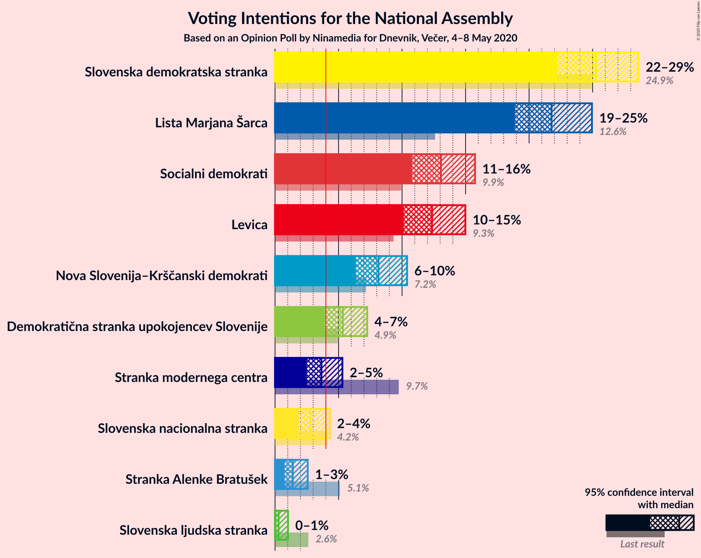

### Confidence Intervals

| Party | Last Result | Poll Result | 80% Confidence Interval | 90% Confidence Interval | 95% Confidence Interval | 99% Confidence Interval |
|:-----:|:-----------:|:-----------:|:-----------------------:|:-----------------------:|:-----------------------:|:-----------------------:|
| Slovenska demokratska stranka | 24.9% | 25.3% | 23.3–27.4% |22.7–28.1% |22.2–28.6% |21.3–29.7% |
| Lista Marjana Šarca | 12.6% | 21.8% | 19.9–23.9% |19.3–24.4% |18.9–25.0% |18.0–26.0% |
| Socialni demokrati | 9.9% | 13.1% | 11.6–14.8% |11.1–15.3% |10.8–15.7% |10.1–16.6% |
| Levica | 9.3% | 12.4% | 10.9–14.1% |10.5–14.6% |10.1–15.0% |9.5–15.9% |
| Nova Slovenija–Krščanski demokrati | 7.2% | 8.1% | 7.0–9.6% |6.6–10.0% |6.4–10.4% |5.8–11.1% |
| Demokratična stranka upokojencev Slovenije | 4.9% | 5.3% | 4.4–6.6% |4.1–6.9% |3.9–7.3% |3.5–7.9% |
| Stranka modernega centra | 9.7% | 3.7% | 2.9–4.7% |2.7–5.0% |2.5–5.3% |2.2–5.9% |
| Slovenska nacionalna stranka | 4.2% | 2.8% | 2.2–3.8% |2.0–4.1% |1.8–4.3% |1.6–4.8% |
| Stranka Alenke Bratušek | 5.1% | 1.4% | 1.0–2.2% |0.9–2.4% |0.8–2.6% |0.6–3.0% |
| Slovenska ljudska stranka | 2.6% | 0.3% | 0.2–0.7% |0.1–0.9% |0.1–1.0% |0.0–1.3% |

*Note:* The poll result column reflects the actual value used in the calculations. Published results may vary slightly, and in addition be rounded to fewer digits.

## Seats

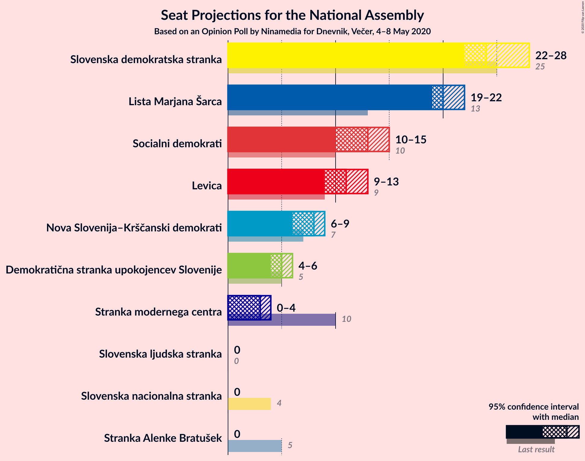

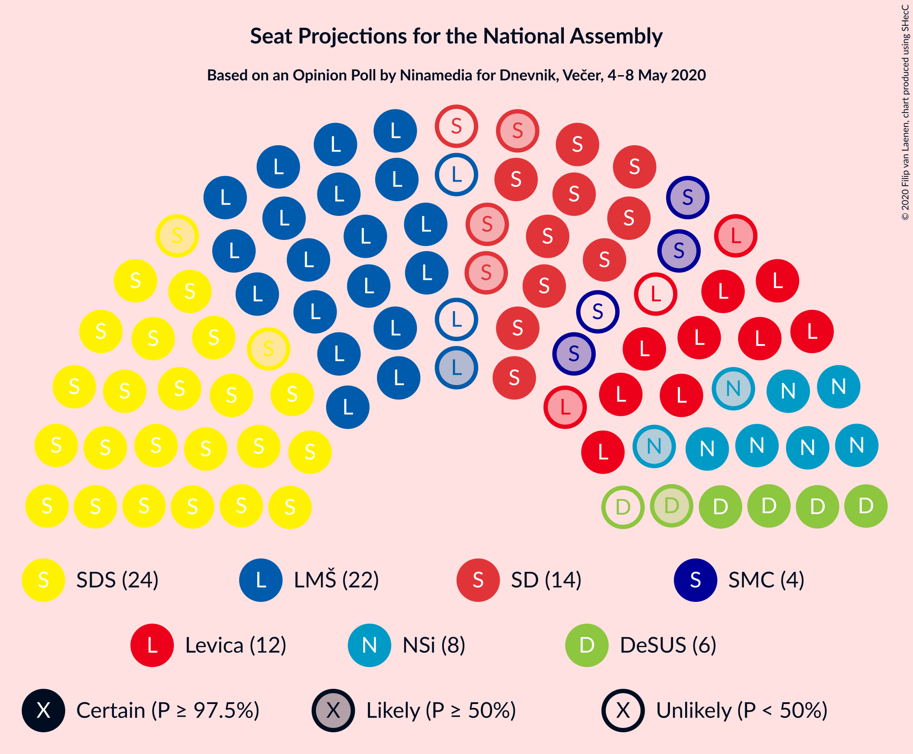

### Confidence Intervals

| Party | Last Result | Median | 80% Confidence Interval | 90% Confidence Interval | 95% Confidence Interval | 99% Confidence Interval |
|:-----:|:-----------:|:------:|:-----------------------:|:-----------------------:|:-----------------------:|:-----------------------:|
| <a href="#slovenska-demokratska-stranka">Slovenska demokratska stranka</a> | 25 | 24 | 22–26 |21–27 |21–27 |20–29 |
| <a href="#lista-marjana-šarca">Lista Marjana Šarca</a> | 13 | 20 | 19–22 |18–23 |18–24 |17–25 |
| <a href="#socialni-demokrati">Socialni demokrati</a> | 10 | 13 | 11–14 |10–14 |10–15 |9–16 |
| <a href="#levica">Levica</a> | 9 | 12 | 10–13 |9–14 |9–14 |9–15 |
| <a href="#nova-slovenija–krščanski-demokrati">Nova Slovenija–Krščanski demokrati</a> | 7 | 8 | 7–9 |6–9 |6–10 |5–10 |
| <a href="#demokratična-stranka-upokojencev-slovenije">Demokratična stranka upokojencev Slovenije</a> | 5 | 5 | 4–6 |4–6 |0–7 |0–7 |
| <a href="#stranka-modernega-centra">Stranka modernega centra</a> | 10 | 0 | 0–4 |0–4 |0–5 |0–5 |
| <a href="#slovenska-nacionalna-stranka">Slovenska nacionalna stranka</a> | 4 | 0 | 0 |0 |0–4 |0–4 |
| <a href="#stranka-alenke-bratušek">Stranka Alenke Bratušek</a> | 5 | 0 | 0 |0 |0 |0 |
| <a href="#slovenska-ljudska-stranka">Slovenska ljudska stranka</a> | 0 | 0 | 0 |0 |0 |0 |

### Slovenska demokratska stranka

*For a full overview of the results for this party, see the [Slovenska demokratska stranka](party-slovenskademokratskastranka.html) page.*

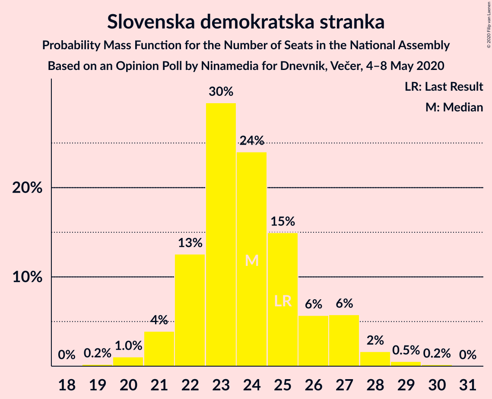

| Number of Seats | Probability | Accumulated | Special Marks |
|:---------------:|:-----------:|:-----------:|:-------------:|
| 19 | 0.2% | 100% |  |
| 20 | 1.0% | 99.8% |  |
| 21 | 4% | 98.7% |  |
| 22 | 13% | 95% |  |
| 23 | 30% | 82% |  |
| 24 | 24% | 53% | Median |
| 25 | 15% | 29% | Last Result |
| 26 | 6% | 14% |  |
| 27 | 6% | 8% |  |
| 28 | 2% | 2% |  |
| 29 | 0.5% | 0.7% |  |
| 30 | 0.2% | 0.2% |  |
| 31 | 0% | 0% |  |

### Lista Marjana Šarca

*For a full overview of the results for this party, see the [Lista Marjana Šarca](party-listamarjanašarca.html) page.*

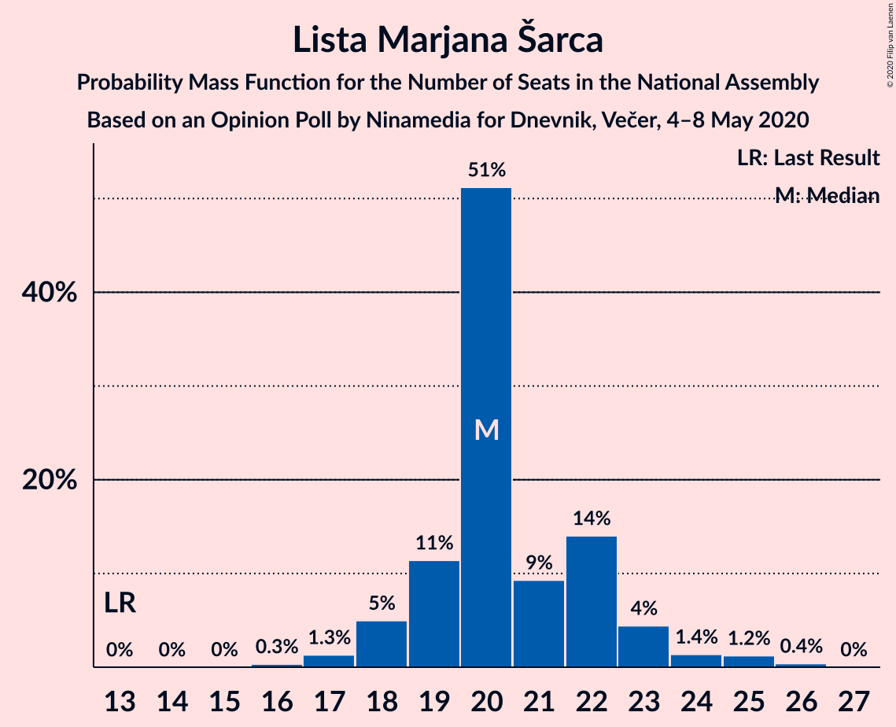

| Number of Seats | Probability | Accumulated | Special Marks |
|:---------------:|:-----------:|:-----------:|:-------------:|
| 13 | 0% | 100% | Last Result |
| 14 | 0% | 100% |  |
| 15 | 0% | 100% |  |
| 16 | 0.3% | 100% |  |
| 17 | 1.3% | 99.6% |  |
| 18 | 5% | 98% |  |
| 19 | 11% | 93% |  |
| 20 | 51% | 82% | Median |
| 21 | 9% | 31% |  |
| 22 | 14% | 21% |  |
| 23 | 4% | 7% |  |
| 24 | 1.4% | 3% |  |
| 25 | 1.2% | 2% |  |
| 26 | 0.4% | 0.4% |  |
| 27 | 0% | 0% |  |

### Socialni demokrati

*For a full overview of the results for this party, see the [Socialni demokrati](party-socialnidemokrati.html) page.*

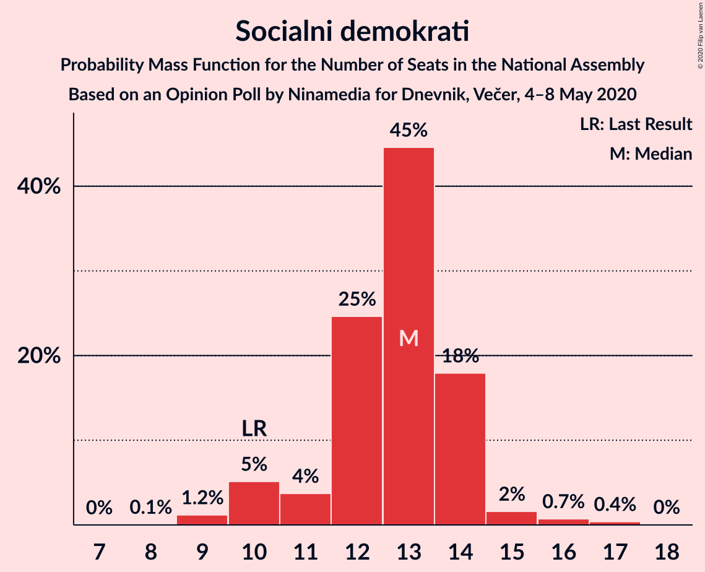

| Number of Seats | Probability | Accumulated | Special Marks |
|:---------------:|:-----------:|:-----------:|:-------------:|
| 9 | 1.5% | 100% |  |
| 10 | 7% | 98% | Last Result |
| 11 | 12% | 92% |  |
| 12 | 29% | 80% |  |
| 13 | 35% | 51% | Median |
| 14 | 14% | 16% |  |
| 15 | 2% | 3% |  |
| 16 | 1.0% | 1.1% |  |
| 17 | 0.1% | 0.1% |  |
| 18 | 0% | 0% |  |

### Levica

*For a full overview of the results for this party, see the [Levica](party-levica.html) page.*

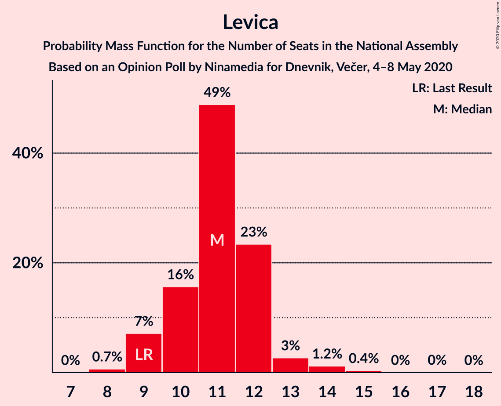

| Number of Seats | Probability | Accumulated | Special Marks |
|:---------------:|:-----------:|:-----------:|:-------------:|
| 8 | 0.4% | 100% |  |
| 9 | 5% | 99.6% | Last Result |
| 10 | 12% | 95% |  |
| 11 | 32% | 83% |  |
| 12 | 31% | 51% | Median |
| 13 | 15% | 20% |  |
| 14 | 4% | 6% |  |
| 15 | 1.0% | 1.1% |  |
| 16 | 0.1% | 0.2% |  |
| 17 | 0% | 0% |  |

### Nova Slovenija–Krščanski demokrati

*For a full overview of the results for this party, see the [Nova Slovenija–Krščanski demokrati](party-novaslovenija–krščanskidemokrati.html) page.*

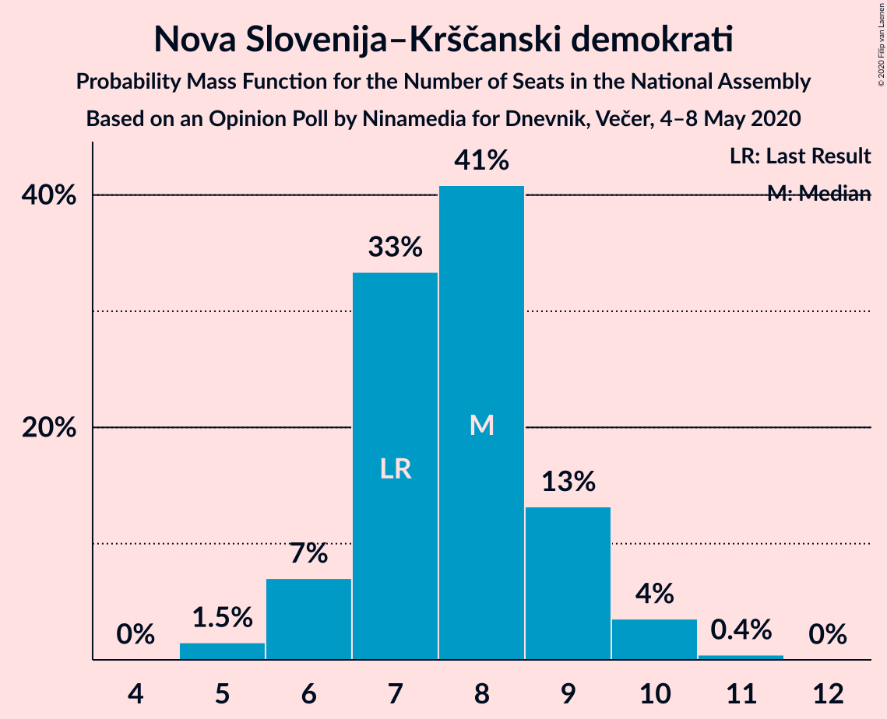

| Number of Seats | Probability | Accumulated | Special Marks |
|:---------------:|:-----------:|:-----------:|:-------------:|
| 5 | 1.5% | 100% |  |
| 6 | 7% | 98% |  |
| 7 | 33% | 91% | Last Result |
| 8 | 41% | 58% | Median |
| 9 | 13% | 17% |  |
| 10 | 4% | 4% |  |
| 11 | 0.4% | 0.5% |  |
| 12 | 0% | 0% |  |

### Demokratična stranka upokojencev Slovenije

*For a full overview of the results for this party, see the [Demokratična stranka upokojencev Slovenije](party-demokratičnastrankaupokojencevslovenije.html) page.*

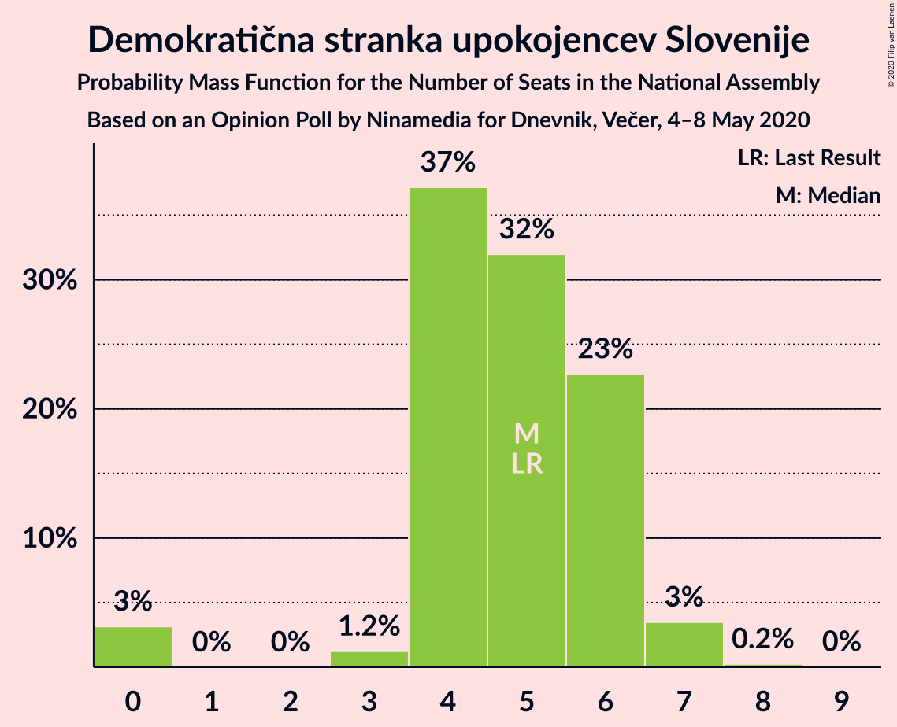

| Number of Seats | Probability | Accumulated | Special Marks |
|:---------------:|:-----------:|:-----------:|:-------------:|
| 0 | 3% | 100% |  |
| 1 | 0% | 97% |  |
| 2 | 0% | 97% |  |
| 3 | 1.2% | 97% |  |
| 4 | 37% | 96% |  |
| 5 | 32% | 58% | Last Result, Median |
| 6 | 23% | 26% |  |
| 7 | 3% | 4% |  |
| 8 | 0.2% | 0.3% |  |
| 9 | 0% | 0% |  |

### Stranka modernega centra

*For a full overview of the results for this party, see the [Stranka modernega centra](party-strankamodernegacentra.html) page.*

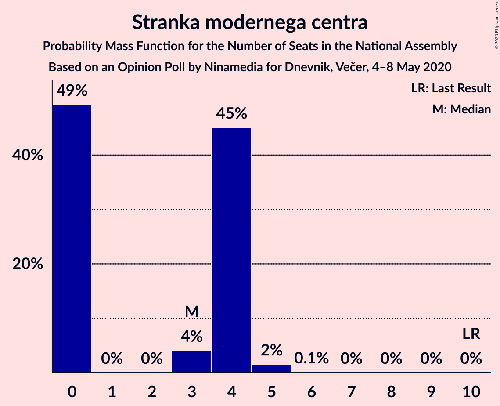

| Number of Seats | Probability | Accumulated | Special Marks |
|:---------------:|:-----------:|:-----------:|:-------------:|
| 0 | 50% | 100% | Median |
| 1 | 0% | 50% |  |
| 2 | 0% | 50% |  |
| 3 | 7% | 50% |  |
| 4 | 39% | 42% |  |
| 5 | 3% | 3% |  |
| 6 | 0.2% | 0.2% |  |
| 7 | 0% | 0% |  |
| 8 | 0% | 0% |  |
| 9 | 0% | 0% |  |
| 10 | 0% | 0% | Last Result |

### Slovenska nacionalna stranka

*For a full overview of the results for this party, see the [Slovenska nacionalna stranka](party-slovenskanacionalnastranka.html) page.*

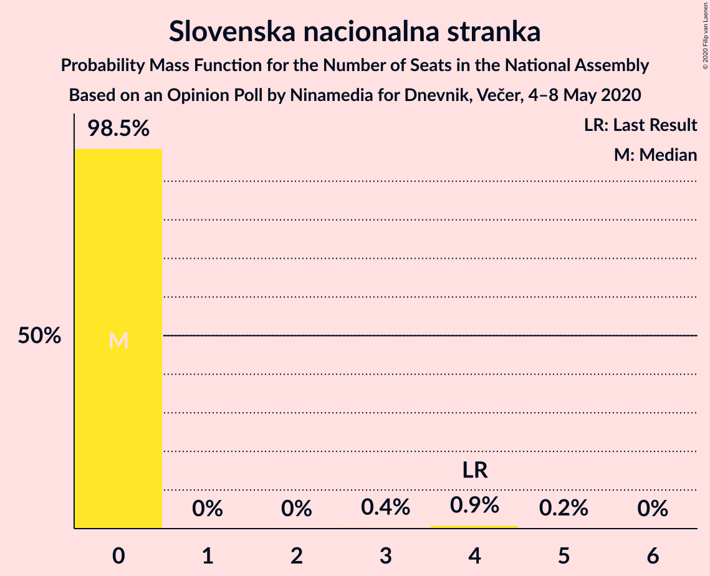

| Number of Seats | Probability | Accumulated | Special Marks |
|:---------------:|:-----------:|:-----------:|:-------------:|
| 0 | 96% | 100% | Median |
| 1 | 0% | 4% |  |
| 2 | 0% | 4% |  |
| 3 | 1.0% | 4% |  |
| 4 | 3% | 3% | Last Result |
| 5 | 0.1% | 0.1% |  |
| 6 | 0% | 0% |  |

### Stranka Alenke Bratušek

*For a full overview of the results for this party, see the [Stranka Alenke Bratušek](party-strankaalenkebratušek.html) page.*

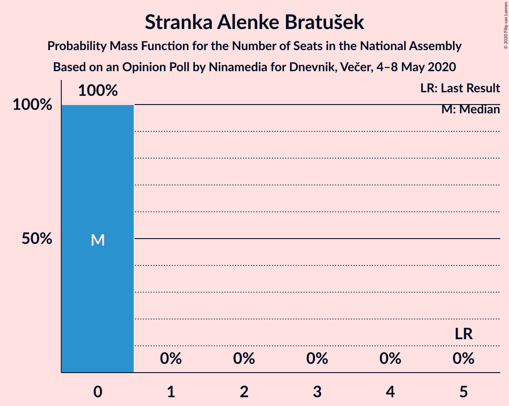

| Number of Seats | Probability | Accumulated | Special Marks |
|:---------------:|:-----------:|:-----------:|:-------------:|
| 0 | 100% | 100% | Median |
| 1 | 0% | 0% |  |
| 2 | 0% | 0% |  |
| 3 | 0% | 0% |  |
| 4 | 0% | 0% |  |
| 5 | 0% | 0% | Last Result |

### Slovenska ljudska stranka

*For a full overview of the results for this party, see the [Slovenska ljudska stranka](party-slovenskaljudskastranka.html) page.*

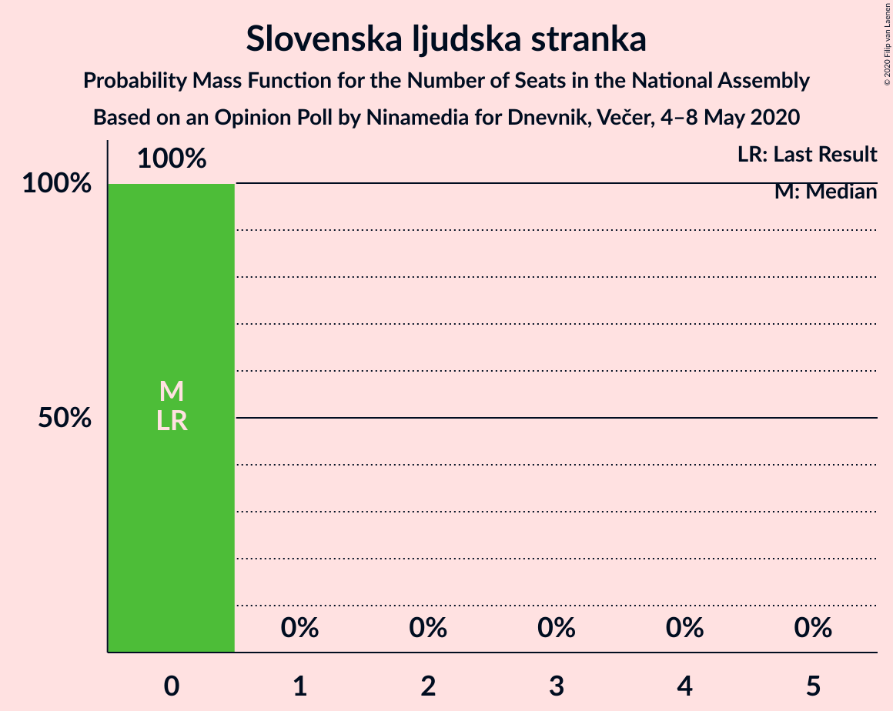

| Number of Seats | Probability | Accumulated | Special Marks |
|:---------------:|:-----------:|:-----------:|:-------------:|
| 0 | 100% | 100% | Last Result, Median |

## Coalitions

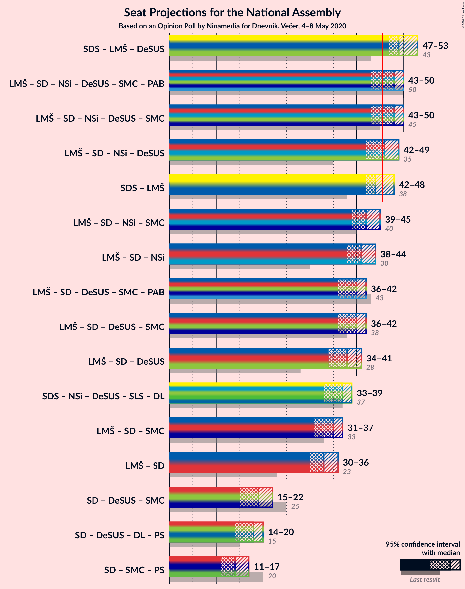

### Confidence Intervals

| Coalition | Last Result | Median | Majority? | 80% Confidence Interval | 90% Confidence Interval | 95% Confidence Interval | 99% Confidence Interval |
|:---------:|:-----------:|:------:|:---------:|:-----------------------:|:-----------------------:|:-----------------------:|:-----------------------:|
| Slovenska demokratska stranka – Lista Marjana Šarca – Demokratična stranka upokojencev Slovenije | 43 | 49 | 98% | 47–52 | 46–52 | 46–53 | 44–55 |
| Lista Marjana Šarca – Socialni demokrati – Nova Slovenija–Krščanski demokrati – Demokratična stranka upokojencev Slovenije – Stranka modernega centra – Stranka Alenke Bratušek | 50 | 47 | 81% | 44–50 | 43–50 | 42–51 | 41–52 |
| Lista Marjana Šarca – Socialni demokrati – Nova Slovenija–Krščanski demokrati – Demokratična stranka upokojencev Slovenije – Stranka modernega centra | 45 | 47 | 81% | 44–50 | 43–50 | 42–51 | 41–52 |
| Lista Marjana Šarca – Socialni demokrati – Nova Slovenija–Krščanski demokrati – Demokratična stranka upokojencev Slovenije | 35 | 45 | 46% | 43–48 | 42–49 | 41–50 | 40–51 |
| Slovenska demokratska stranka – Lista Marjana Šarca | 38 | 44 | 24% | 42–47 | 42–48 | 41–49 | 39–50 |
| Lista Marjana Šarca – Socialni demokrati – Nova Slovenija–Krščanski demokrati – Stranka modernega centra | 40 | 43 | 4% | 40–45 | 38–45 | 38–46 | 36–47 |
| Lista Marjana Šarca – Socialni demokrati – Nova Slovenija–Krščanski demokrati | 30 | 41 | 1.2% | 38–43 | 38–44 | 37–45 | 36–46 |
| Lista Marjana Šarca – Socialni demokrati – Demokratična stranka upokojencev Slovenije – Stranka modernega centra – Stranka Alenke Bratušek | 43 | 40 | 0.1% | 36–42 | 36–42 | 35–43 | 34–45 |
| Lista Marjana Šarca – Socialni demokrati – Demokratična stranka upokojencev Slovenije – Stranka modernega centra | 38 | 40 | 0.1% | 36–42 | 36–42 | 35–43 | 34–45 |
| Lista Marjana Šarca – Socialni demokrati – Demokratična stranka upokojencev Slovenije | 28 | 37 | 0% | 35–40 | 34–41 | 34–42 | 32–43 |
| Lista Marjana Šarca – Socialni demokrati – Stranka modernega centra | 33 | 35 | 0% | 32–37 | 31–37 | 30–38 | 29–40 |
| Lista Marjana Šarca – Socialni demokrati | 23 | 33 | 0% | 31–35 | 30–36 | 29–37 | 28–38 |
| Socialni demokrati – Demokratična stranka upokojencev Slovenije – Stranka modernega centra | 25 | 19 | 0% | 16–22 | 15–22 | 14–22 | 12–24 |

### Slovenska demokratska stranka – Lista Marjana Šarca – Demokratična stranka upokojencev Slovenije

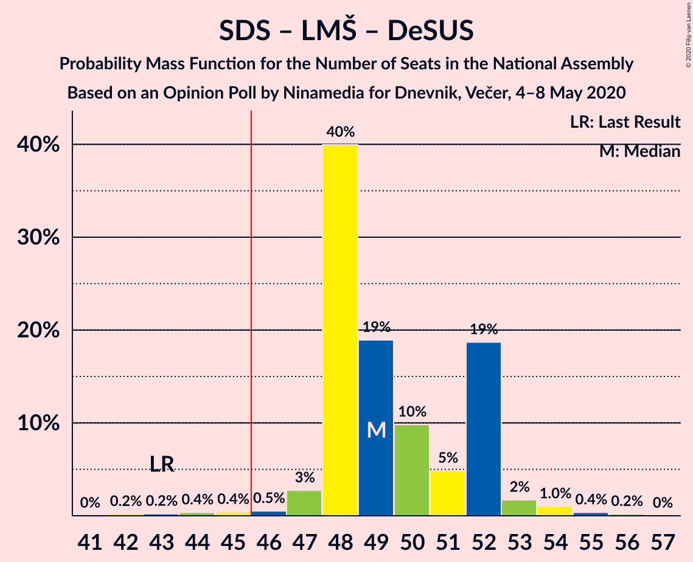

| Number of Seats | Probability | Accumulated | Special Marks |
|:---------------:|:-----------:|:-----------:|:-------------:|
| 42 | 0.1% | 100% |  |
| 43 | 0.3% | 99.9% | Last Result |
| 44 | 0.4% | 99.6% |  |
| 45 | 1.2% | 99.2% |  |
| 46 | 6% | 98% | Majority |
| 47 | 20% | 92% |  |
| 48 | 22% | 73% |  |
| 49 | 15% | 51% | Median |
| 50 | 10% | 35% |  |
| 51 | 11% | 26% |  |
| 52 | 9% | 14% |  |
| 53 | 3% | 5% |  |
| 54 | 1.0% | 2% |  |
| 55 | 0.8% | 0.9% |  |
| 56 | 0.1% | 0.1% |  |
| 57 | 0% | 0% |  |

### Lista Marjana Šarca – Socialni demokrati – Nova Slovenija–Krščanski demokrati – Demokratična stranka upokojencev Slovenije – Stranka modernega centra – Stranka Alenke Bratušek

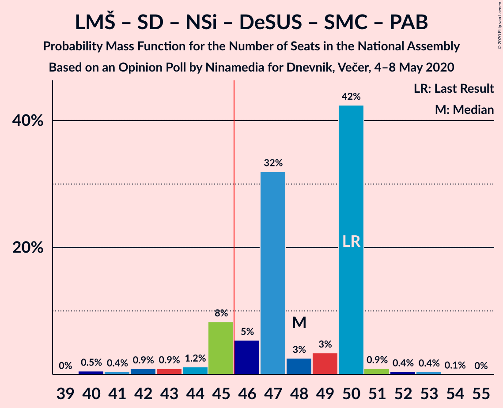

| Number of Seats | Probability | Accumulated | Special Marks |
|:---------------:|:-----------:|:-----------:|:-------------:|
| 40 | 0.3% | 100% |  |
| 41 | 1.2% | 99.7% |  |
| 42 | 1.1% | 98% |  |
| 43 | 4% | 97% |  |
| 44 | 5% | 93% |  |
| 45 | 7% | 88% |  |
| 46 | 12% | 81% | Median, Majority |
| 47 | 27% | 69% |  |
| 48 | 11% | 42% |  |
| 49 | 16% | 31% |  |
| 50 | 12% | 15% | Last Result |
| 51 | 2% | 3% |  |
| 52 | 0.8% | 1.0% |  |
| 53 | 0.2% | 0.2% |  |
| 54 | 0% | 0.1% |  |
| 55 | 0% | 0% |  |

### Lista Marjana Šarca – Socialni demokrati – Nova Slovenija–Krščanski demokrati – Demokratična stranka upokojencev Slovenije – Stranka modernega centra

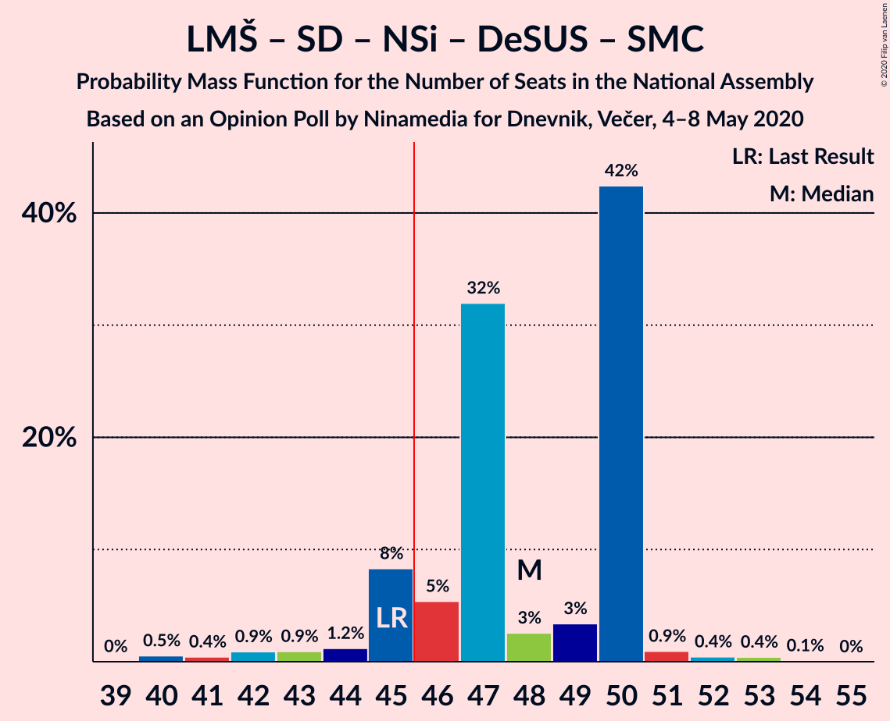

| Number of Seats | Probability | Accumulated | Special Marks |
|:---------------:|:-----------:|:-----------:|:-------------:|
| 40 | 0.3% | 100% |  |
| 41 | 1.2% | 99.7% |  |
| 42 | 1.1% | 98% |  |
| 43 | 4% | 97% |  |
| 44 | 5% | 93% |  |
| 45 | 7% | 88% | Last Result |
| 46 | 12% | 81% | Median, Majority |
| 47 | 27% | 69% |  |
| 48 | 11% | 42% |  |
| 49 | 16% | 31% |  |
| 50 | 12% | 15% |  |
| 51 | 2% | 3% |  |
| 52 | 0.8% | 1.0% |  |
| 53 | 0.2% | 0.2% |  |
| 54 | 0% | 0.1% |  |
| 55 | 0% | 0% |  |

### Lista Marjana Šarca – Socialni demokrati – Nova Slovenija–Krščanski demokrati – Demokratična stranka upokojencev Slovenije

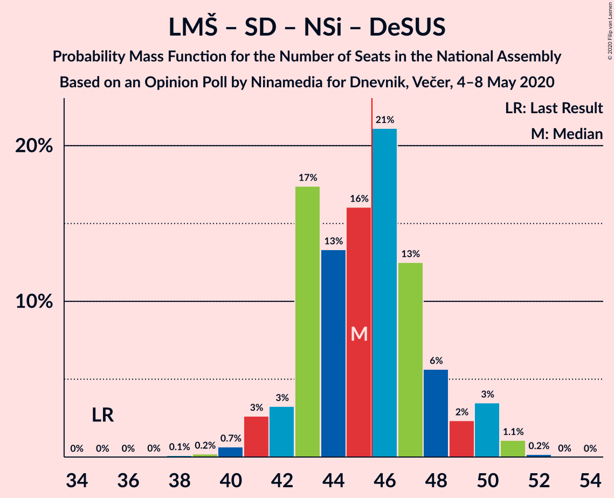

| Number of Seats | Probability | Accumulated | Special Marks |
|:---------------:|:-----------:|:-----------:|:-------------:|
| 35 | 0% | 100% | Last Result |
| 36 | 0% | 100% |  |
| 37 | 0% | 100% |  |
| 38 | 0.1% | 100% |  |
| 39 | 0.2% | 99.9% |  |
| 40 | 0.7% | 99.7% |  |
| 41 | 3% | 99.0% |  |
| 42 | 3% | 96% |  |
| 43 | 17% | 93% |  |
| 44 | 13% | 76% |  |
| 45 | 16% | 62% |  |
| 46 | 21% | 46% | Median, Majority |
| 47 | 13% | 25% |  |
| 48 | 6% | 13% |  |
| 49 | 2% | 7% |  |
| 50 | 3% | 5% |  |
| 51 | 1.1% | 1.3% |  |
| 52 | 0.2% | 0.2% |  |
| 53 | 0% | 0% |  |

### Slovenska demokratska stranka – Lista Marjana Šarca

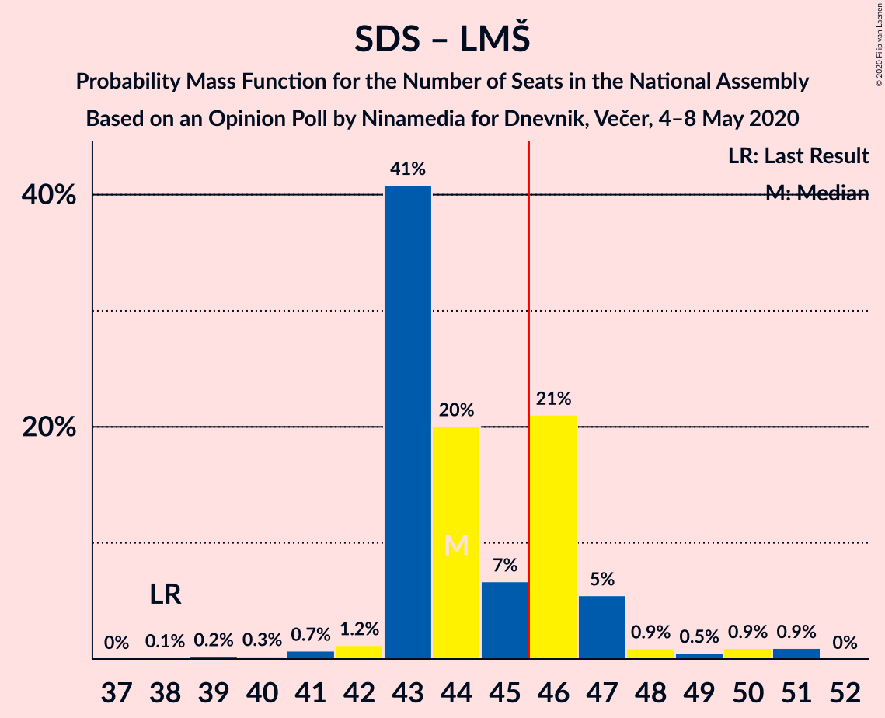

| Number of Seats | Probability | Accumulated | Special Marks |
|:---------------:|:-----------:|:-----------:|:-------------:|
| 38 | 0.2% | 100% | Last Result |
| 39 | 0.3% | 99.8% |  |
| 40 | 0.7% | 99.5% |  |
| 41 | 4% | 98.8% |  |
| 42 | 10% | 95% |  |
| 43 | 29% | 85% |  |
| 44 | 19% | 56% | Median |
| 45 | 14% | 37% |  |
| 46 | 12% | 24% | Majority |
| 47 | 5% | 12% |  |
| 48 | 3% | 7% |  |
| 49 | 2% | 3% |  |
| 50 | 1.2% | 2% |  |
| 51 | 0.4% | 0.5% |  |
| 52 | 0.1% | 0.1% |  |
| 53 | 0% | 0% |  |

### Lista Marjana Šarca – Socialni demokrati – Nova Slovenija–Krščanski demokrati – Stranka modernega centra

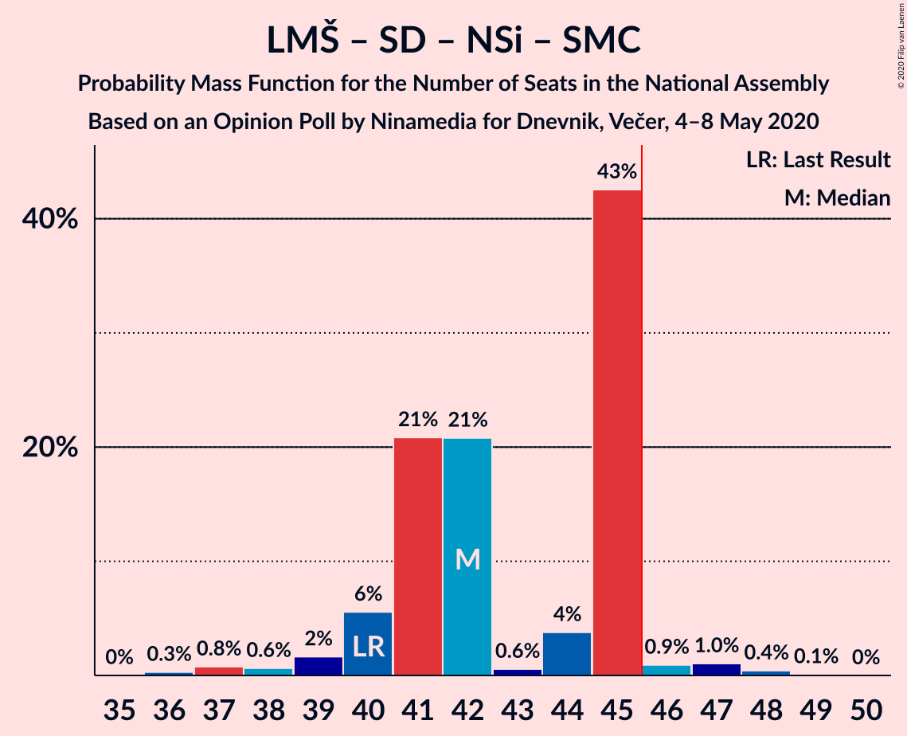

| Number of Seats | Probability | Accumulated | Special Marks |
|:---------------:|:-----------:|:-----------:|:-------------:|
| 36 | 0.5% | 100% |  |
| 37 | 0.7% | 99.4% |  |
| 38 | 5% | 98.7% |  |
| 39 | 3% | 94% |  |
| 40 | 12% | 91% | Last Result |
| 41 | 13% | 79% | Median |
| 42 | 11% | 66% |  |
| 43 | 22% | 55% |  |
| 44 | 10% | 33% |  |
| 45 | 19% | 23% |  |
| 46 | 2% | 4% | Majority |
| 47 | 1.1% | 1.5% |  |
| 48 | 0.2% | 0.4% |  |
| 49 | 0.1% | 0.1% |  |
| 50 | 0% | 0% |  |

### Lista Marjana Šarca – Socialni demokrati – Nova Slovenija–Krščanski demokrati

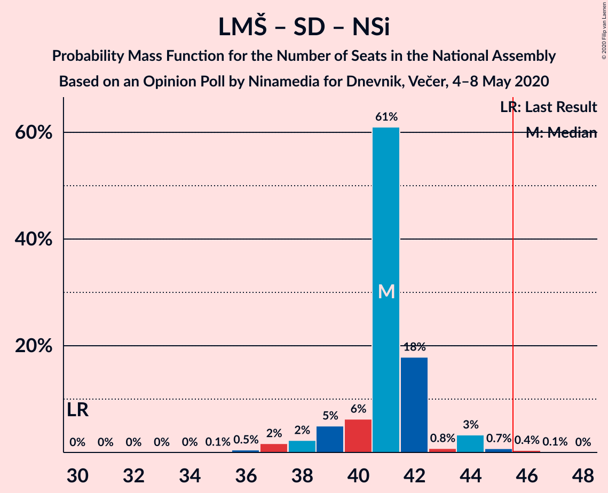

| Number of Seats | Probability | Accumulated | Special Marks |
|:---------------:|:-----------:|:-----------:|:-------------:|
| 30 | 0% | 100% | Last Result |
| 31 | 0% | 100% |  |
| 32 | 0% | 100% |  |
| 33 | 0% | 100% |  |
| 34 | 0.2% | 100% |  |
| 35 | 0.3% | 99.8% |  |
| 36 | 2% | 99.5% |  |
| 37 | 3% | 98% |  |
| 38 | 8% | 95% |  |
| 39 | 18% | 87% |  |
| 40 | 19% | 69% |  |
| 41 | 25% | 50% | Median |
| 42 | 11% | 25% |  |
| 43 | 5% | 13% |  |
| 44 | 5% | 8% |  |
| 45 | 2% | 3% |  |
| 46 | 0.9% | 1.2% | Majority |
| 47 | 0.2% | 0.3% |  |
| 48 | 0% | 0% |  |

### Lista Marjana Šarca – Socialni demokrati – Demokratična stranka upokojencev Slovenije – Stranka modernega centra – Stranka Alenke Bratušek

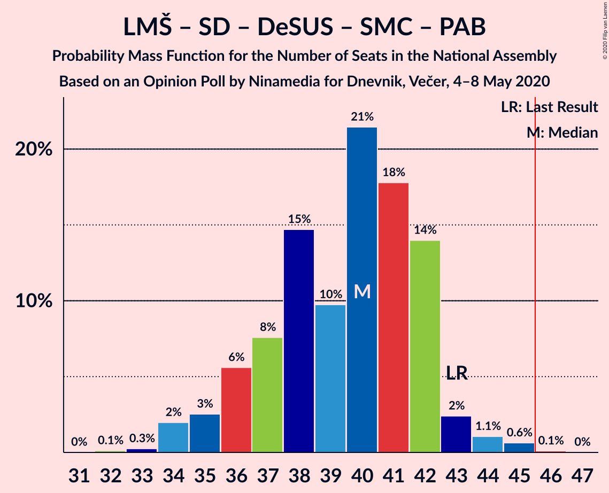

| Number of Seats | Probability | Accumulated | Special Marks |
|:---------------:|:-----------:|:-----------:|:-------------:|
| 32 | 0.1% | 100% |  |
| 33 | 0.3% | 99.9% |  |
| 34 | 2% | 99.6% |  |
| 35 | 3% | 98% |  |
| 36 | 6% | 95% |  |
| 37 | 8% | 89% |  |
| 38 | 15% | 82% | Median |
| 39 | 10% | 67% |  |
| 40 | 21% | 57% |  |
| 41 | 18% | 36% |  |
| 42 | 14% | 18% |  |
| 43 | 2% | 4% | Last Result |
| 44 | 1.1% | 2% |  |
| 45 | 0.6% | 0.8% |  |
| 46 | 0.1% | 0.1% | Majority |
| 47 | 0% | 0% |  |

### Lista Marjana Šarca – Socialni demokrati – Demokratična stranka upokojencev Slovenije – Stranka modernega centra

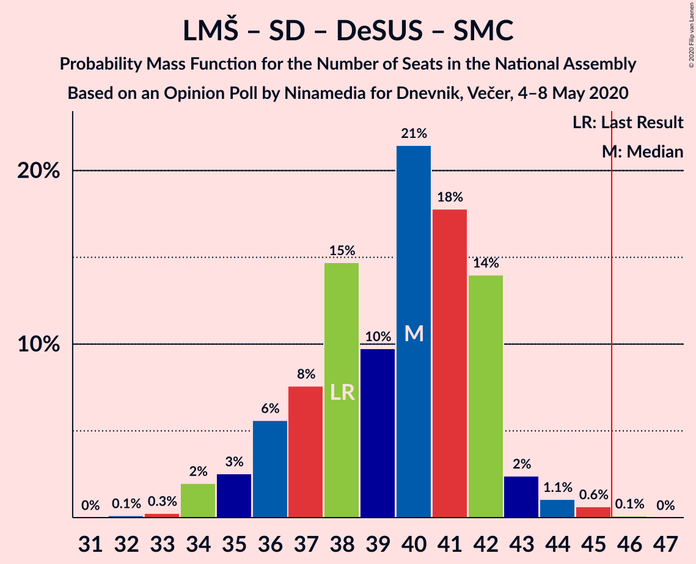

| Number of Seats | Probability | Accumulated | Special Marks |
|:---------------:|:-----------:|:-----------:|:-------------:|
| 32 | 0.1% | 100% |  |
| 33 | 0.3% | 99.9% |  |
| 34 | 2% | 99.6% |  |
| 35 | 3% | 98% |  |
| 36 | 6% | 95% |  |
| 37 | 8% | 89% |  |
| 38 | 15% | 82% | Last Result, Median |
| 39 | 10% | 67% |  |
| 40 | 21% | 57% |  |
| 41 | 18% | 36% |  |
| 42 | 14% | 18% |  |
| 43 | 2% | 4% |  |
| 44 | 1.1% | 2% |  |
| 45 | 0.6% | 0.8% |  |
| 46 | 0.1% | 0.1% | Majority |
| 47 | 0% | 0% |  |

### Lista Marjana Šarca – Socialni demokrati – Demokratična stranka upokojencev Slovenije

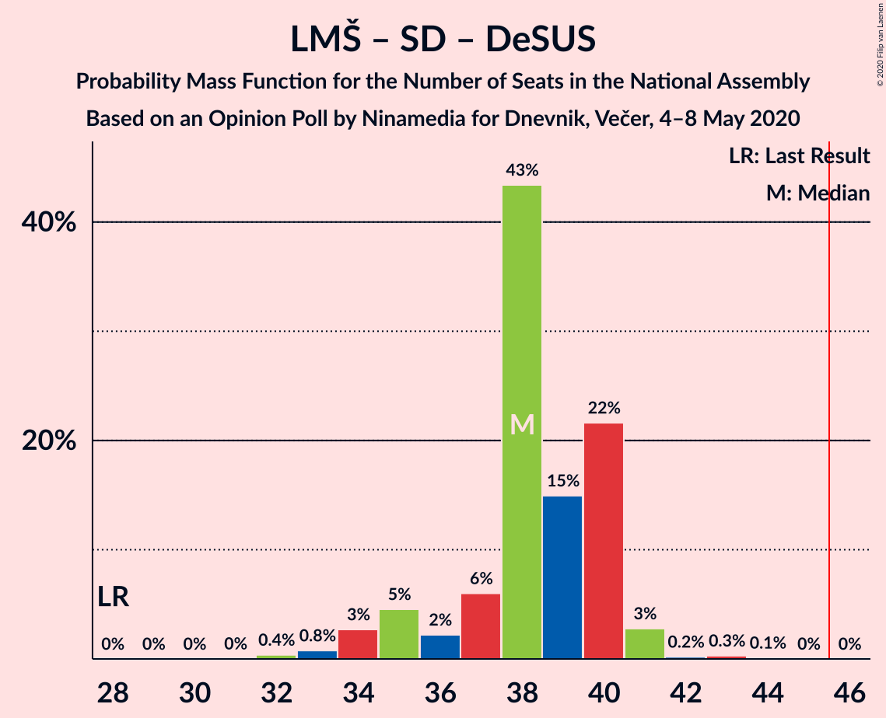

| Number of Seats | Probability | Accumulated | Special Marks |
|:---------------:|:-----------:|:-----------:|:-------------:|
| 28 | 0% | 100% | Last Result |
| 29 | 0% | 100% |  |
| 30 | 0% | 100% |  |
| 31 | 0.1% | 100% |  |
| 32 | 0.4% | 99.8% |  |
| 33 | 0.8% | 99.5% |  |
| 34 | 5% | 98.7% |  |
| 35 | 6% | 93% |  |
| 36 | 18% | 88% |  |
| 37 | 22% | 70% |  |
| 38 | 21% | 48% | Median |
| 39 | 10% | 27% |  |
| 40 | 9% | 17% |  |
| 41 | 3% | 8% |  |
| 42 | 4% | 4% |  |
| 43 | 0.5% | 0.8% |  |
| 44 | 0.3% | 0.4% |  |
| 45 | 0% | 0% |  |

### Lista Marjana Šarca – Socialni demokrati – Stranka modernega centra

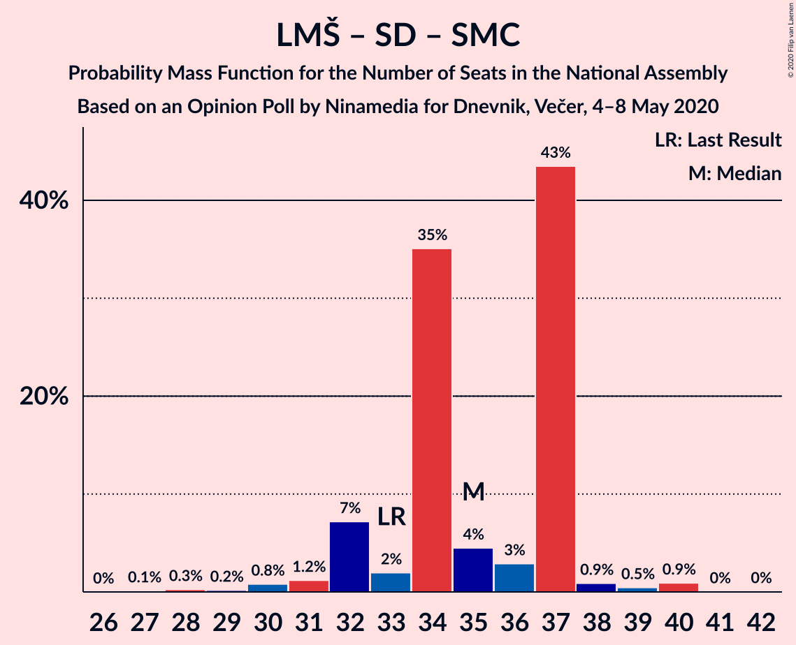

| Number of Seats | Probability | Accumulated | Special Marks |
|:---------------:|:-----------:|:-----------:|:-------------:|
| 28 | 0.2% | 100% |  |
| 29 | 0.8% | 99.7% |  |
| 30 | 2% | 99.0% |  |
| 31 | 5% | 97% |  |
| 32 | 12% | 92% |  |
| 33 | 9% | 79% | Last Result, Median |
| 34 | 16% | 71% |  |
| 35 | 8% | 55% |  |
| 36 | 21% | 47% |  |
| 37 | 21% | 26% |  |
| 38 | 3% | 5% |  |
| 39 | 1.1% | 2% |  |
| 40 | 0.8% | 0.9% |  |
| 41 | 0.1% | 0.2% |  |
| 42 | 0% | 0.1% |  |
| 43 | 0% | 0% |  |

### Lista Marjana Šarca – Socialni demokrati

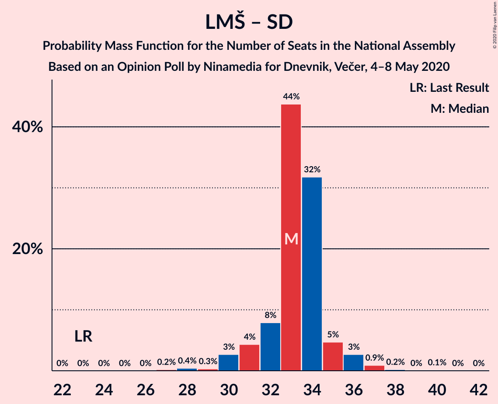

| Number of Seats | Probability | Accumulated | Special Marks |
|:---------------:|:-----------:|:-----------:|:-------------:|
| 23 | 0% | 100% | Last Result |
| 24 | 0% | 100% |  |
| 25 | 0% | 100% |  |
| 26 | 0% | 100% |  |
| 27 | 0.2% | 100% |  |
| 28 | 0.8% | 99.8% |  |
| 29 | 2% | 99.0% |  |
| 30 | 5% | 97% |  |
| 31 | 10% | 91% |  |
| 32 | 25% | 82% |  |
| 33 | 29% | 56% | Median |
| 34 | 13% | 27% |  |
| 35 | 6% | 14% |  |
| 36 | 6% | 9% |  |
| 37 | 1.4% | 3% |  |
| 38 | 0.9% | 1.2% |  |
| 39 | 0.2% | 0.3% |  |
| 40 | 0.1% | 0.1% |  |
| 41 | 0% | 0% |  |

### Socialni demokrati – Demokratična stranka upokojencev Slovenije – Stranka modernega centra

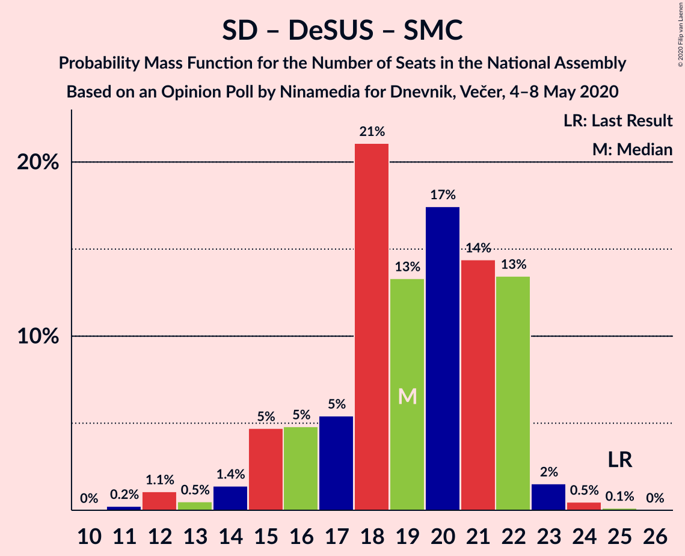

| Number of Seats | Probability | Accumulated | Special Marks |
|:---------------:|:-----------:|:-----------:|:-------------:|
| 11 | 0.2% | 100% |  |
| 12 | 1.1% | 99.8% |  |
| 13 | 0.5% | 98.7% |  |
| 14 | 1.4% | 98% |  |
| 15 | 5% | 97% |  |
| 16 | 5% | 92% |  |
| 17 | 5% | 87% |  |
| 18 | 21% | 82% | Median |
| 19 | 13% | 61% |  |
| 20 | 17% | 47% |  |
| 21 | 14% | 30% |  |
| 22 | 13% | 16% |  |
| 23 | 2% | 2% |  |
| 24 | 0.5% | 0.6% |  |
| 25 | 0.1% | 0.2% | Last Result |
| 26 | 0% | 0% |  |

## Technical Information

### Opinion Poll

+ **Polling firm:** Ninamedia
+ **Commissioner(s):** Dnevnik, Večer
+ **Fieldwork period:** 4–8 May 2020

### Calculations

+ **Sample size:** 712
+ **Simulations done:** 1,048,576
+ **Error estimate:** 1.51%

