# Opinion Poll by Parsifal for Nova 24TV, 6–8 May 2020

<a href="#voting-intentions">Voting Intentions</a> | <a href="#seats">Seats</a> | <a href="#coalitions">Coalitions</a> | <a href="#technical-information">Technical Information</a>

## Voting Intentions

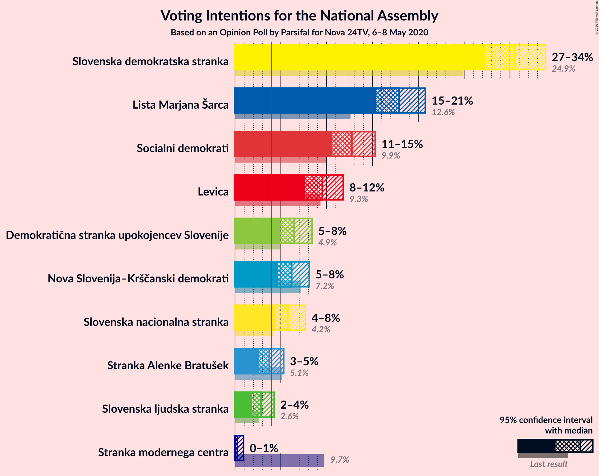

### Confidence Intervals

| Party | Last Result | Poll Result | 80% Confidence Interval | 90% Confidence Interval | 95% Confidence Interval | 99% Confidence Interval |
|:-----:|:-----------:|:-----------:|:-----------------------:|:-----------------------:|:-----------------------:|:-----------------------:|
| Slovenska demokratska stranka | 24.9% | 30.5% | 28.5–32.7% |27.9–33.3% |27.4–33.9% |26.4–34.9% |
| Lista Marjana Šarca | 12.6% | 17.9% | 16.2–19.8% |15.8–20.3% |15.4–20.8% |14.6–21.7% |
| Socialni demokrati | 9.9% | 12.8% | 11.3–14.4% |10.9–14.9% |10.6–15.3% |9.9–16.1% |
| Levica | 9.3% | 9.5% | 8.3–11.0% |8.0–11.4% |7.7–11.8% |7.1–12.6% |
| Demokratična stranka upokojencev Slovenije | 4.9% | 6.4% | 5.4–7.7% |5.2–8.1% |4.9–8.4% |4.5–9.1% |
| Nova Slovenija–Krščanski demokrati | 7.2% | 6.2% | 5.2–7.4% |4.9–7.8% |4.7–8.1% |4.3–8.7% |
| Slovenska nacionalna stranka | 4.2% | 5.8% | 4.8–7.0% |4.6–7.4% |4.4–7.7% |3.9–8.3% |
| Stranka Alenke Bratušek | 5.1% | 3.7% | 3.0–4.8% |2.8–5.1% |2.6–5.3% |2.3–5.9% |
| Slovenska ljudska stranka | 2.6% | 2.8% | 2.2–3.8% |2.0–4.0% |1.9–4.3% |1.6–4.8% |
| Stranka modernega centra | 9.7% | 0.3% | 0.1–0.7% |0.1–0.8% |0.1–0.9% |0.0–1.2% |

*Note:* The poll result column reflects the actual value used in the calculations. Published results may vary slightly, and in addition be rounded to fewer digits.

## Seats

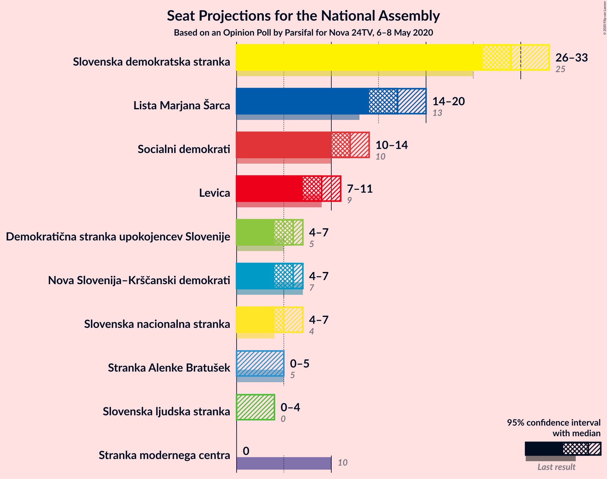

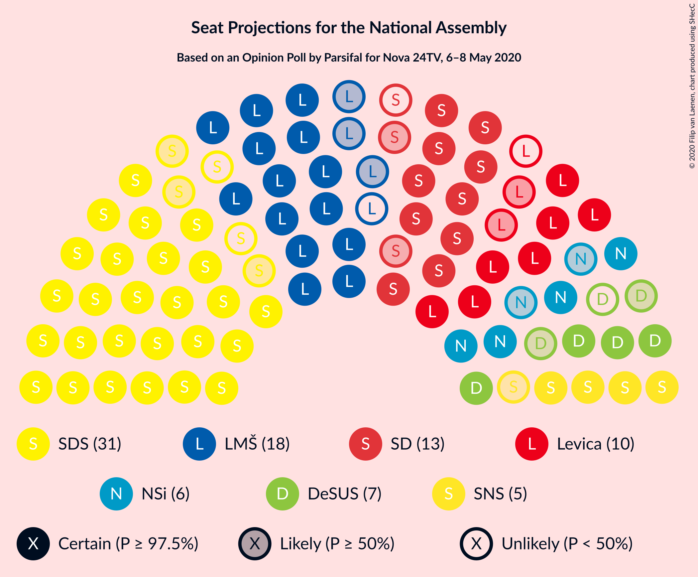

### Confidence Intervals

| Party | Last Result | Median | 80% Confidence Interval | 90% Confidence Interval | 95% Confidence Interval | 99% Confidence Interval |
|:-----:|:-----------:|:------:|:-----------------------:|:-----------------------:|:-----------------------:|:-----------------------:|
| <a href="#slovenska-demokratska-stranka">Slovenska demokratska stranka</a> | 25 | 29 | 27–32 |27–33 |26–33 |25–34 |
| <a href="#lista-marjana-šarca">Lista Marjana Šarca</a> | 13 | 17 | 15–19 |15–19 |14–20 |14–21 |
| <a href="#socialni-demokrati">Socialni demokrati</a> | 10 | 12 | 10–13 |10–14 |10–14 |9–15 |
| <a href="#levica">Levica</a> | 9 | 9 | 8–10 |7–11 |7–11 |7–12 |
| <a href="#demokratična-stranka-upokojencev-slovenije">Demokratična stranka upokojencev Slovenije</a> | 5 | 6 | 5–7 |4–7 |4–7 |4–8 |
| <a href="#nova-slovenija–krščanski-demokrati">Nova Slovenija–Krščanski demokrati</a> | 7 | 6 | 5–7 |4–7 |4–7 |4–8 |
| <a href="#slovenska-nacionalna-stranka">Slovenska nacionalna stranka</a> | 4 | 5 | 4–6 |4–7 |4–7 |3–8 |
| <a href="#stranka-alenke-bratušek">Stranka Alenke Bratušek</a> | 5 | 0 | 0–4 |0–4 |0–5 |0–5 |
| <a href="#slovenska-ljudska-stranka">Slovenska ljudska stranka</a> | 0 | 0 | 0–3 |0–3 |0–4 |0–4 |
| <a href="#stranka-modernega-centra">Stranka modernega centra</a> | 10 | 0 | 0 |0 |0 |0 |

### Slovenska demokratska stranka

*For a full overview of the results for this party, see the [Slovenska demokratska stranka](party-slovenskademokratskastranka.html) page.*

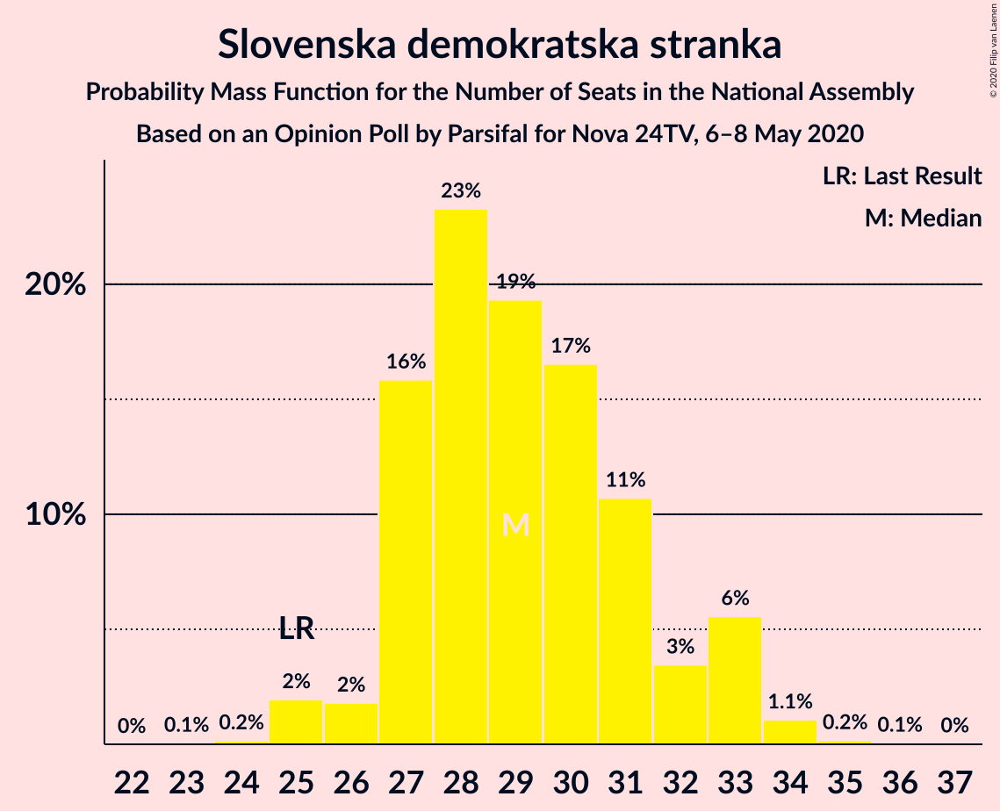

| Number of Seats | Probability | Accumulated | Special Marks |
|:---------------:|:-----------:|:-----------:|:-------------:|
| 23 | 0.1% | 100% |  |
| 24 | 0.2% | 99.9% |  |
| 25 | 2% | 99.8% | Last Result |
| 26 | 2% | 98% |  |
| 27 | 16% | 96% |  |
| 28 | 23% | 80% |  |
| 29 | 19% | 57% | Median |
| 30 | 17% | 38% |  |
| 31 | 11% | 21% |  |
| 32 | 3% | 10% |  |
| 33 | 6% | 7% |  |
| 34 | 1.1% | 1.3% |  |
| 35 | 0.2% | 0.3% |  |
| 36 | 0.1% | 0.1% |  |
| 37 | 0% | 0% |  |

### Lista Marjana Šarca

*For a full overview of the results for this party, see the [Lista Marjana Šarca](party-listamarjanašarca.html) page.*

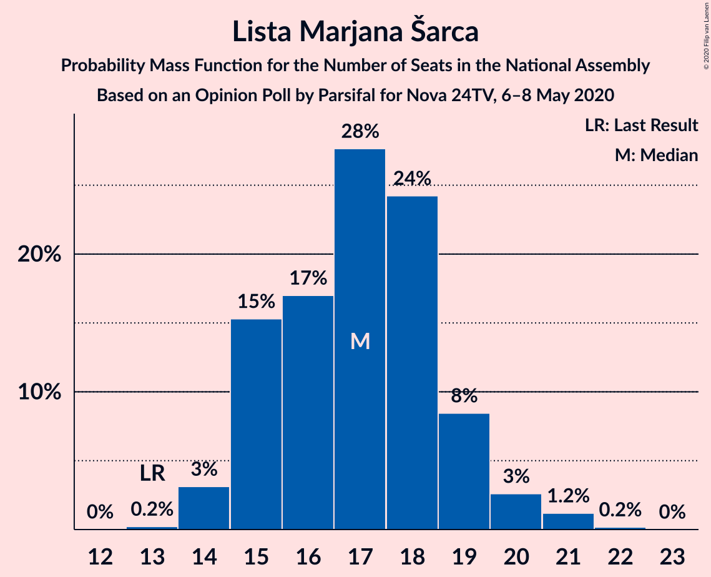

| Number of Seats | Probability | Accumulated | Special Marks |
|:---------------:|:-----------:|:-----------:|:-------------:|
| 13 | 0.2% | 100% | Last Result |
| 14 | 3% | 99.8% |  |
| 15 | 15% | 97% |  |
| 16 | 17% | 81% |  |
| 17 | 28% | 64% | Median |
| 18 | 24% | 37% |  |
| 19 | 8% | 12% |  |
| 20 | 3% | 4% |  |
| 21 | 1.2% | 1.4% |  |
| 22 | 0.2% | 0.2% |  |
| 23 | 0% | 0% |  |

### Socialni demokrati

*For a full overview of the results for this party, see the [Socialni demokrati](party-socialnidemokrati.html) page.*

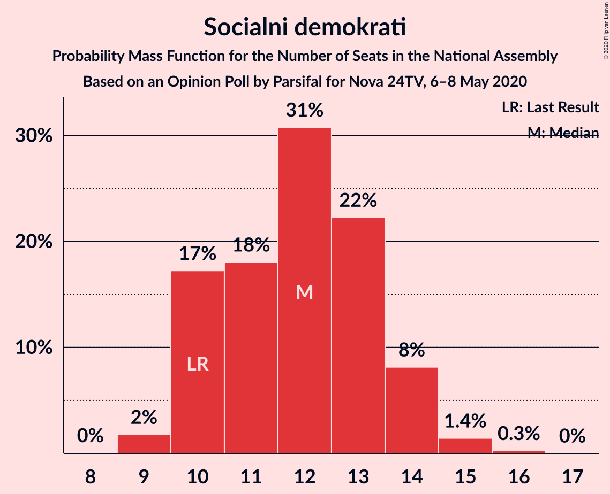

| Number of Seats | Probability | Accumulated | Special Marks |
|:---------------:|:-----------:|:-----------:|:-------------:|
| 9 | 2% | 100% |  |
| 10 | 17% | 98% | Last Result |
| 11 | 18% | 81% |  |
| 12 | 31% | 63% | Median |
| 13 | 22% | 32% |  |
| 14 | 8% | 10% |  |
| 15 | 1.4% | 2% |  |
| 16 | 0.3% | 0.3% |  |
| 17 | 0% | 0% |  |

### Levica

*For a full overview of the results for this party, see the [Levica](party-levica.html) page.*

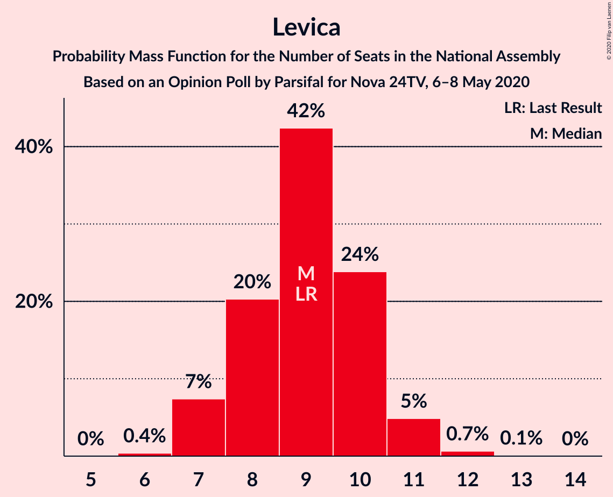

| Number of Seats | Probability | Accumulated | Special Marks |
|:---------------:|:-----------:|:-----------:|:-------------:|
| 6 | 0.4% | 100% |  |
| 7 | 7% | 99.6% |  |
| 8 | 20% | 92% |  |
| 9 | 42% | 72% | Last Result, Median |
| 10 | 24% | 29% |  |
| 11 | 5% | 6% |  |
| 12 | 0.7% | 0.8% |  |
| 13 | 0.1% | 0.1% |  |
| 14 | 0% | 0% |  |

### Demokratična stranka upokojencev Slovenije

*For a full overview of the results for this party, see the [Demokratična stranka upokojencev Slovenije](party-demokratičnastrankaupokojencevslovenije.html) page.*

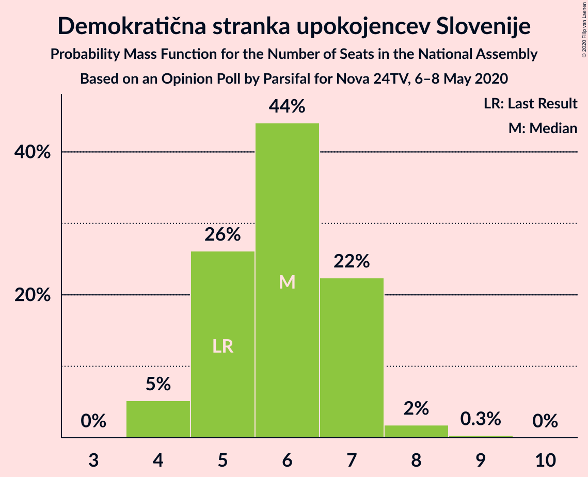

| Number of Seats | Probability | Accumulated | Special Marks |
|:---------------:|:-----------:|:-----------:|:-------------:|
| 3 | 0% | 100% |  |
| 4 | 5% | 99.9% |  |
| 5 | 26% | 95% | Last Result |
| 6 | 44% | 69% | Median |
| 7 | 22% | 25% |  |
| 8 | 2% | 2% |  |
| 9 | 0.3% | 0.4% |  |
| 10 | 0% | 0% |  |

### Nova Slovenija–Krščanski demokrati

*For a full overview of the results for this party, see the [Nova Slovenija–Krščanski demokrati](party-novaslovenija–krščanskidemokrati.html) page.*

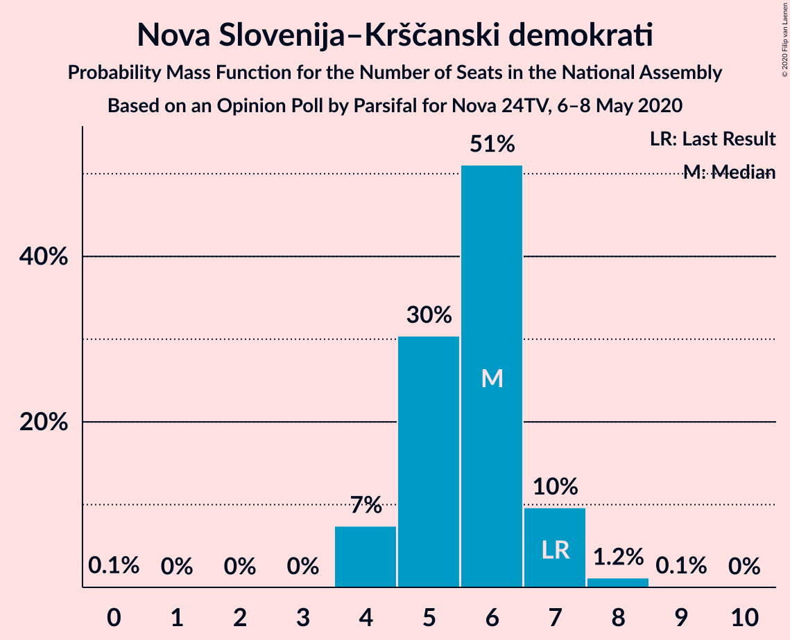

| Number of Seats | Probability | Accumulated | Special Marks |
|:---------------:|:-----------:|:-----------:|:-------------:|
| 0 | 0.1% | 100% |  |
| 1 | 0% | 99.9% |  |
| 2 | 0% | 99.9% |  |
| 3 | 0% | 99.9% |  |
| 4 | 7% | 99.8% |  |
| 5 | 30% | 92% |  |
| 6 | 51% | 62% | Median |
| 7 | 10% | 11% | Last Result |
| 8 | 1.2% | 1.3% |  |
| 9 | 0.1% | 0.1% |  |
| 10 | 0% | 0% |  |

### Slovenska nacionalna stranka

*For a full overview of the results for this party, see the [Slovenska nacionalna stranka](party-slovenskanacionalnastranka.html) page.*

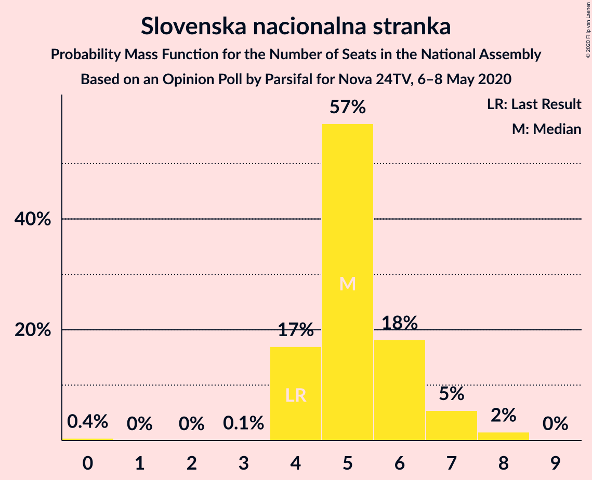

| Number of Seats | Probability | Accumulated | Special Marks |
|:---------------:|:-----------:|:-----------:|:-------------:|
| 0 | 0.4% | 100% |  |
| 1 | 0% | 99.6% |  |
| 2 | 0% | 99.6% |  |
| 3 | 0.1% | 99.6% |  |
| 4 | 17% | 99.4% | Last Result |
| 5 | 57% | 82% | Median |
| 6 | 18% | 25% |  |
| 7 | 5% | 7% |  |
| 8 | 2% | 2% |  |
| 9 | 0% | 0% |  |

### Stranka Alenke Bratušek

*For a full overview of the results for this party, see the [Stranka Alenke Bratušek](party-strankaalenkebratušek.html) page.*

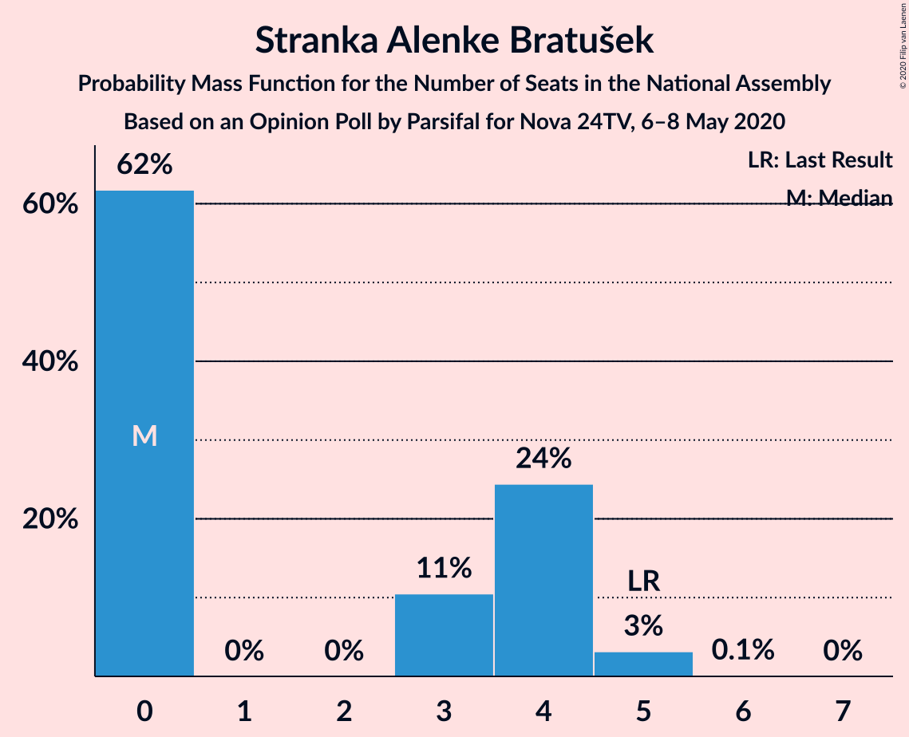

| Number of Seats | Probability | Accumulated | Special Marks |
|:---------------:|:-----------:|:-----------:|:-------------:|
| 0 | 62% | 100% | Median |
| 1 | 0% | 38% |  |
| 2 | 0% | 38% |  |
| 3 | 11% | 38% |  |
| 4 | 24% | 28% |  |
| 5 | 3% | 3% | Last Result |
| 6 | 0.1% | 0.1% |  |
| 7 | 0% | 0% |  |

### Slovenska ljudska stranka

*For a full overview of the results for this party, see the [Slovenska ljudska stranka](party-slovenskaljudskastranka.html) page.*

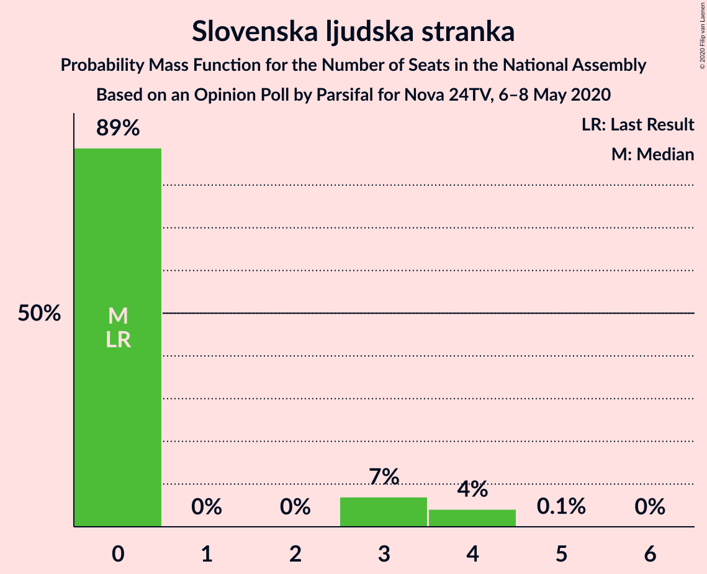

| Number of Seats | Probability | Accumulated | Special Marks |
|:---------------:|:-----------:|:-----------:|:-------------:|
| 0 | 89% | 100% | Last Result, Median |
| 1 | 0% | 11% |  |
| 2 | 0% | 11% |  |
| 3 | 7% | 11% |  |
| 4 | 4% | 4% |  |
| 5 | 0.1% | 0.1% |  |
| 6 | 0% | 0% |  |

### Stranka modernega centra

*For a full overview of the results for this party, see the [Stranka modernega centra](party-strankamodernegacentra.html) page.*

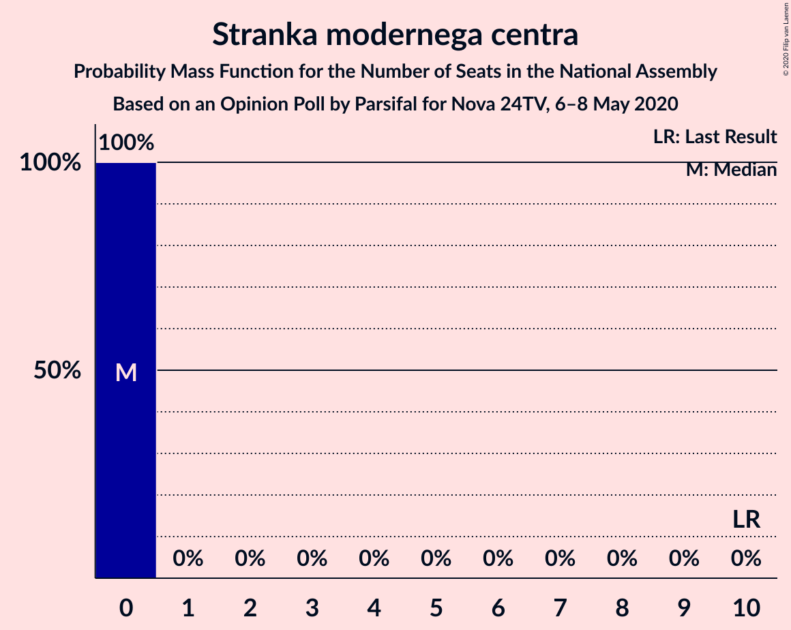

| Number of Seats | Probability | Accumulated | Special Marks |
|:---------------:|:-----------:|:-----------:|:-------------:|
| 0 | 100% | 100% | Median |
| 1 | 0% | 0% |  |
| 2 | 0% | 0% |  |
| 3 | 0% | 0% |  |
| 4 | 0% | 0% |  |
| 5 | 0% | 0% |  |
| 6 | 0% | 0% |  |
| 7 | 0% | 0% |  |
| 8 | 0% | 0% |  |
| 9 | 0% | 0% |  |
| 10 | 0% | 0% | Last Result |

## Coalitions

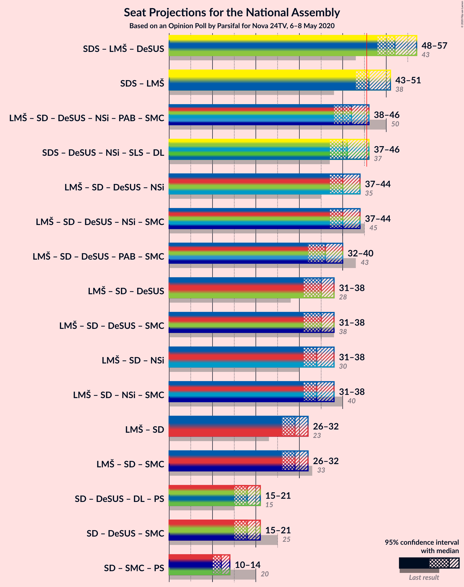

### Confidence Intervals

| Coalition | Last Result | Median | Majority? | 80% Confidence Interval | 90% Confidence Interval | 95% Confidence Interval | 99% Confidence Interval |
|:---------:|:-----------:|:------:|:---------:|:-----------------------:|:-----------------------:|:-----------------------:|:-----------------------:|
| Slovenska demokratska stranka – Lista Marjana Šarca – Demokratična stranka upokojencev Slovenije | 43 | 52 | 99.9% | 49–55 | 49–56 | 48–57 | 46–58 |
| Slovenska demokratska stranka – Lista Marjana Šarca | 38 | 46 | 53% | 44–49 | 44–50 | 43–51 | 41–52 |
| Lista Marjana Šarca – Socialni demokrati – Demokratična stranka upokojencev Slovenije – Nova Slovenija–Krščanski demokrati – Stranka Alenke Bratušek – Stranka modernega centra | 50 | 42 | 3% | 39–44 | 39–45 | 38–46 | 37–48 |
| Lista Marjana Šarca – Socialni demokrati – Demokratična stranka upokojencev Slovenije – Nova Slovenija–Krščanski demokrati | 35 | 40 | 0.5% | 38–42 | 37–43 | 37–44 | 35–46 |
| Lista Marjana Šarca – Socialni demokrati – Demokratična stranka upokojencev Slovenije – Nova Slovenija–Krščanski demokrati – Stranka modernega centra | 45 | 40 | 0.5% | 38–42 | 37–43 | 37–44 | 35–46 |
| Lista Marjana Šarca – Socialni demokrati – Demokratična stranka upokojencev Slovenije – Stranka Alenke Bratušek – Stranka modernega centra | 43 | 36 | 0% | 33–39 | 33–40 | 32–40 | 31–42 |
| Lista Marjana Šarca – Socialni demokrati – Demokratična stranka upokojencev Slovenije | 28 | 35 | 0% | 33–37 | 32–38 | 31–38 | 31–40 |
| Lista Marjana Šarca – Socialni demokrati – Demokratična stranka upokojencev Slovenije – Stranka modernega centra | 38 | 35 | 0% | 33–37 | 32–38 | 31–38 | 31–40 |
| Lista Marjana Šarca – Socialni demokrati – Nova Slovenija–Krščanski demokrati | 30 | 34 | 0% | 32–37 | 32–37 | 31–38 | 29–39 |
| Lista Marjana Šarca – Socialni demokrati – Nova Slovenija–Krščanski demokrati – Stranka modernega centra | 40 | 34 | 0% | 32–37 | 32–37 | 31–38 | 29–39 |
| Lista Marjana Šarca – Socialni demokrati | 23 | 29 | 0% | 27–31 | 26–32 | 26–32 | 25–34 |
| Lista Marjana Šarca – Socialni demokrati – Stranka modernega centra | 33 | 29 | 0% | 27–31 | 26–32 | 26–32 | 25–34 |
| Socialni demokrati – Demokratična stranka upokojencev Slovenije – Stranka modernega centra | 25 | 18 | 0% | 16–19 | 16–20 | 15–21 | 15–22 |

### Slovenska demokratska stranka – Lista Marjana Šarca – Demokratična stranka upokojencev Slovenije

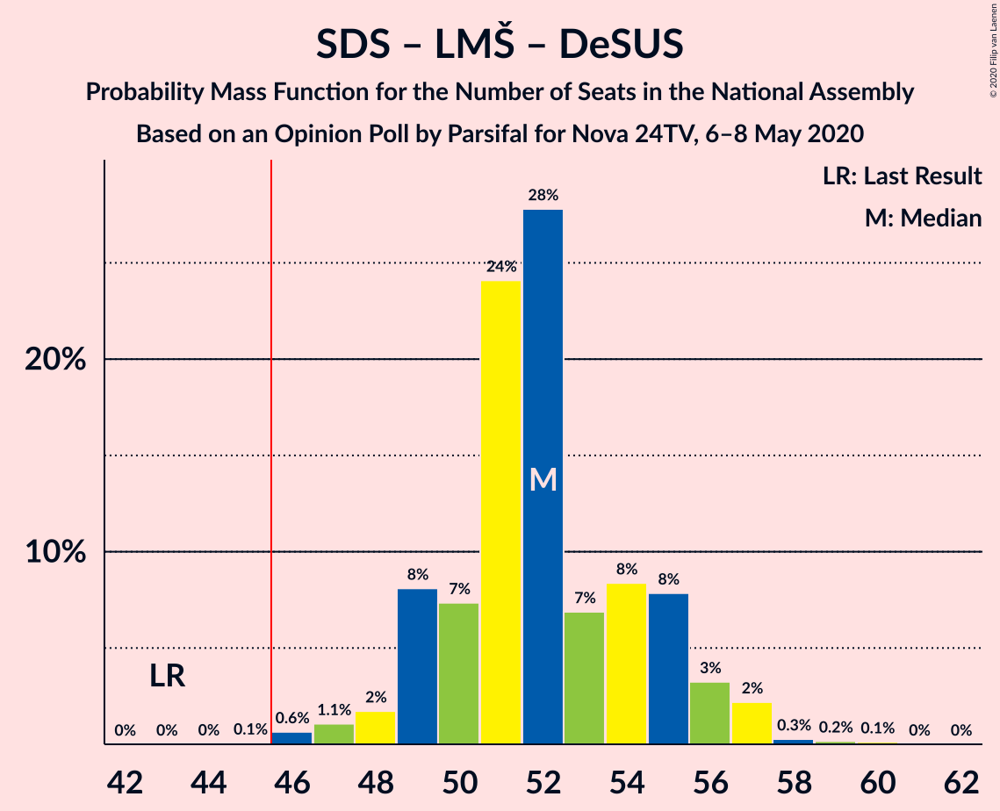

| Number of Seats | Probability | Accumulated | Special Marks |
|:---------------:|:-----------:|:-----------:|:-------------:|
| 43 | 0% | 100% | Last Result |
| 44 | 0% | 100% |  |
| 45 | 0.1% | 100% |  |
| 46 | 0.6% | 99.9% | Majority |
| 47 | 1.1% | 99.3% |  |
| 48 | 2% | 98% |  |
| 49 | 8% | 96% |  |
| 50 | 7% | 88% |  |
| 51 | 24% | 81% |  |
| 52 | 28% | 57% | Median |
| 53 | 7% | 29% |  |
| 54 | 8% | 22% |  |
| 55 | 8% | 14% |  |
| 56 | 3% | 6% |  |
| 57 | 2% | 3% |  |
| 58 | 0.3% | 0.6% |  |
| 59 | 0.2% | 0.3% |  |
| 60 | 0.1% | 0.1% |  |
| 61 | 0% | 0% |  |

### Slovenska demokratska stranka – Lista Marjana Šarca

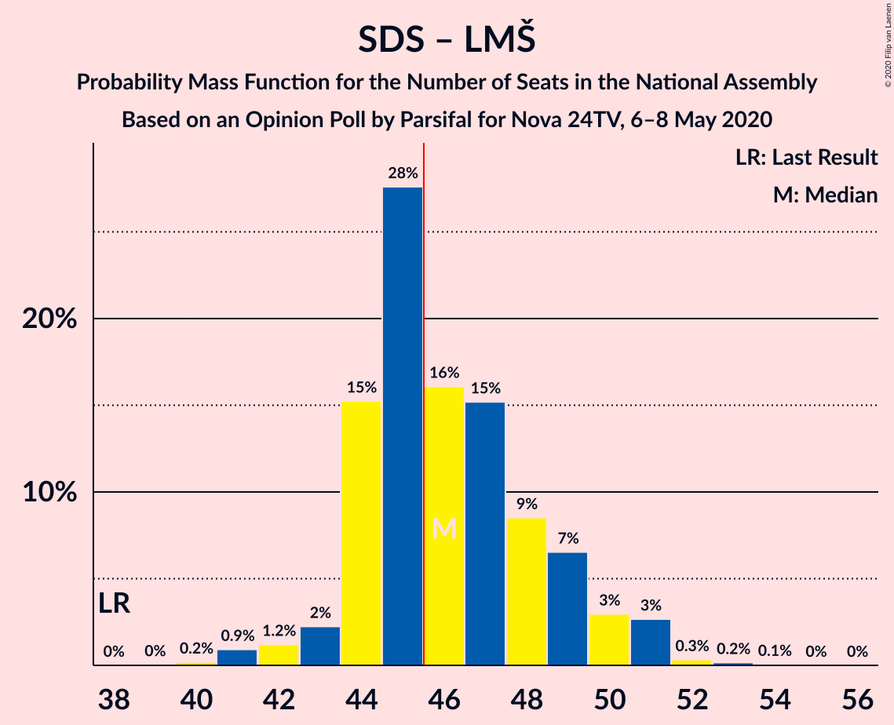

| Number of Seats | Probability | Accumulated | Special Marks |
|:---------------:|:-----------:|:-----------:|:-------------:|
| 38 | 0% | 100% | Last Result |
| 39 | 0% | 100% |  |
| 40 | 0.2% | 99.9% |  |
| 41 | 0.9% | 99.8% |  |
| 42 | 1.2% | 98.8% |  |
| 43 | 2% | 98% |  |
| 44 | 15% | 95% |  |
| 45 | 28% | 80% |  |
| 46 | 16% | 53% | Median, Majority |
| 47 | 15% | 36% |  |
| 48 | 9% | 21% |  |
| 49 | 7% | 13% |  |
| 50 | 3% | 6% |  |
| 51 | 3% | 3% |  |
| 52 | 0.3% | 0.6% |  |
| 53 | 0.2% | 0.2% |  |
| 54 | 0.1% | 0.1% |  |
| 55 | 0% | 0% |  |

### Lista Marjana Šarca – Socialni demokrati – Demokratična stranka upokojencev Slovenije – Nova Slovenija–Krščanski demokrati – Stranka Alenke Bratušek – Stranka modernega centra

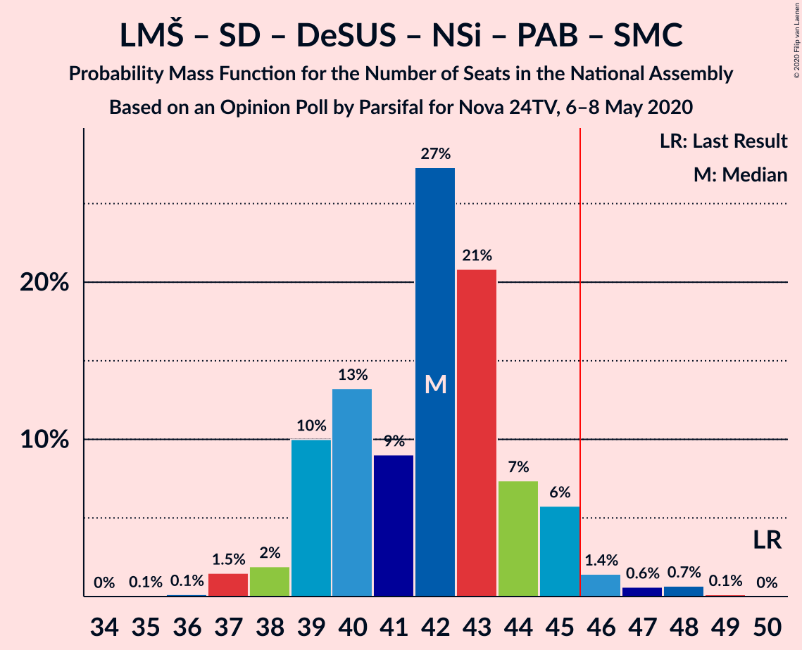

| Number of Seats | Probability | Accumulated | Special Marks |
|:---------------:|:-----------:|:-----------:|:-------------:|
| 35 | 0.1% | 100% |  |
| 36 | 0.1% | 99.9% |  |
| 37 | 1.5% | 99.8% |  |
| 38 | 2% | 98% |  |
| 39 | 10% | 96% |  |
| 40 | 13% | 86% |  |
| 41 | 9% | 73% | Median |
| 42 | 27% | 64% |  |
| 43 | 21% | 37% |  |
| 44 | 7% | 16% |  |
| 45 | 6% | 9% |  |
| 46 | 1.4% | 3% | Majority |
| 47 | 0.6% | 1.4% |  |
| 48 | 0.7% | 0.8% |  |
| 49 | 0.1% | 0.1% |  |
| 50 | 0% | 0% | Last Result |

### Lista Marjana Šarca – Socialni demokrati – Demokratična stranka upokojencev Slovenije – Nova Slovenija–Krščanski demokrati

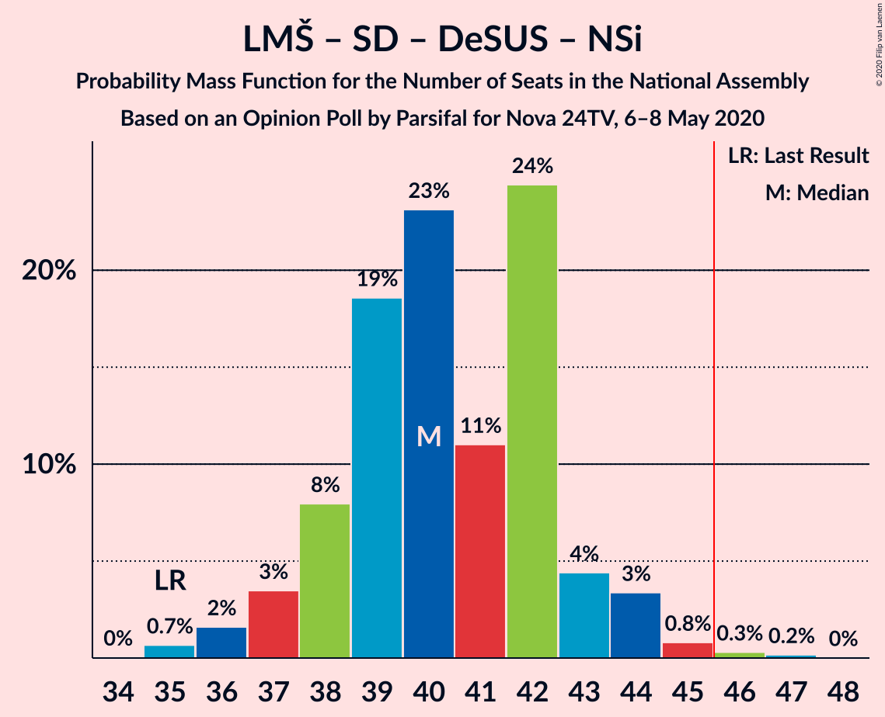

| Number of Seats | Probability | Accumulated | Special Marks |
|:---------------:|:-----------:|:-----------:|:-------------:|
| 34 | 0% | 100% |  |
| 35 | 0.7% | 99.9% | Last Result |
| 36 | 2% | 99.3% |  |
| 37 | 3% | 98% |  |
| 38 | 8% | 94% |  |
| 39 | 19% | 86% |  |
| 40 | 23% | 68% |  |
| 41 | 11% | 45% | Median |
| 42 | 24% | 34% |  |
| 43 | 4% | 9% |  |
| 44 | 3% | 5% |  |
| 45 | 0.8% | 1.3% |  |
| 46 | 0.3% | 0.5% | Majority |
| 47 | 0.2% | 0.2% |  |
| 48 | 0% | 0% |  |

### Lista Marjana Šarca – Socialni demokrati – Demokratična stranka upokojencev Slovenije – Nova Slovenija–Krščanski demokrati – Stranka modernega centra

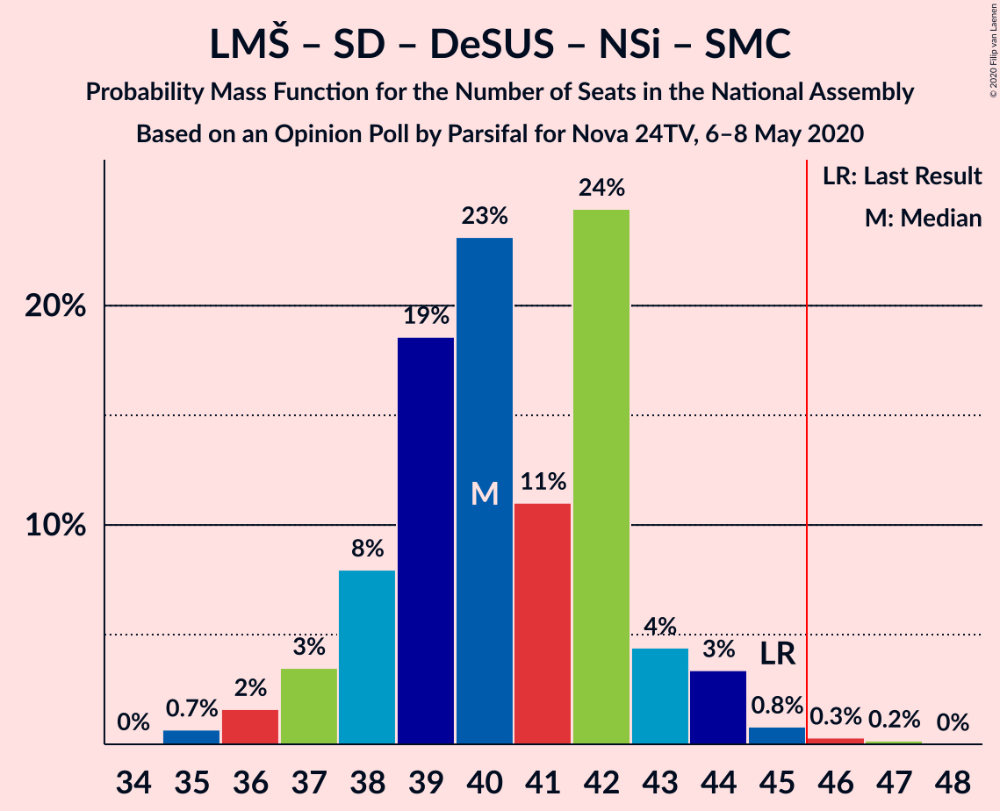

| Number of Seats | Probability | Accumulated | Special Marks |
|:---------------:|:-----------:|:-----------:|:-------------:|
| 34 | 0% | 100% |  |
| 35 | 0.7% | 99.9% |  |
| 36 | 2% | 99.3% |  |
| 37 | 3% | 98% |  |
| 38 | 8% | 94% |  |
| 39 | 19% | 86% |  |
| 40 | 23% | 68% |  |
| 41 | 11% | 45% | Median |
| 42 | 24% | 34% |  |
| 43 | 4% | 9% |  |
| 44 | 3% | 5% |  |
| 45 | 0.8% | 1.3% | Last Result |
| 46 | 0.3% | 0.5% | Majority |
| 47 | 0.2% | 0.2% |  |
| 48 | 0% | 0% |  |

### Lista Marjana Šarca – Socialni demokrati – Demokratična stranka upokojencev Slovenije – Stranka Alenke Bratušek – Stranka modernega centra

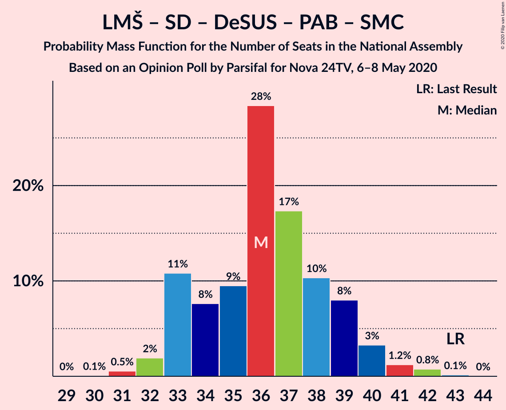

| Number of Seats | Probability | Accumulated | Special Marks |
|:---------------:|:-----------:|:-----------:|:-------------:|
| 30 | 0.1% | 100% |  |
| 31 | 0.5% | 99.9% |  |
| 32 | 2% | 99.3% |  |
| 33 | 11% | 97% |  |
| 34 | 8% | 87% |  |
| 35 | 9% | 79% | Median |
| 36 | 28% | 69% |  |
| 37 | 17% | 41% |  |
| 38 | 10% | 24% |  |
| 39 | 8% | 13% |  |
| 40 | 3% | 5% |  |
| 41 | 1.2% | 2% |  |
| 42 | 0.8% | 0.9% |  |
| 43 | 0.1% | 0.2% | Last Result |
| 44 | 0% | 0% |  |

### Lista Marjana Šarca – Socialni demokrati – Demokratična stranka upokojencev Slovenije

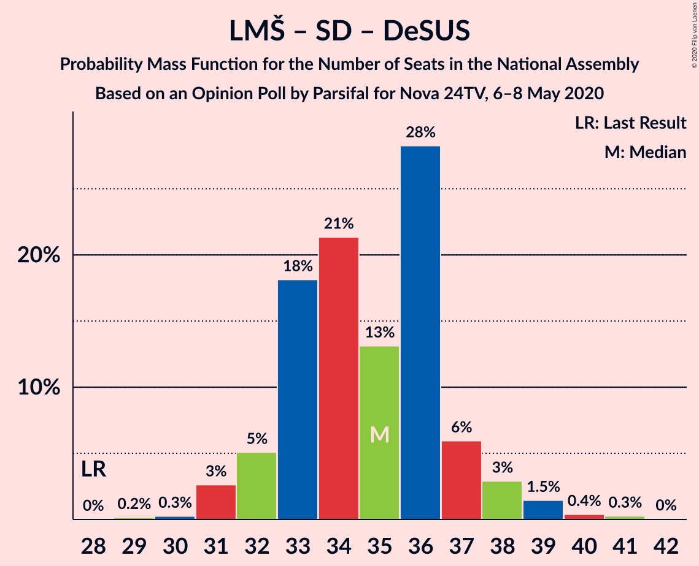

| Number of Seats | Probability | Accumulated | Special Marks |
|:---------------:|:-----------:|:-----------:|:-------------:|
| 28 | 0% | 100% | Last Result |
| 29 | 0.2% | 100% |  |
| 30 | 0.3% | 99.8% |  |
| 31 | 3% | 99.6% |  |
| 32 | 5% | 97% |  |
| 33 | 18% | 92% |  |
| 34 | 21% | 74% |  |
| 35 | 13% | 52% | Median |
| 36 | 28% | 39% |  |
| 37 | 6% | 11% |  |
| 38 | 3% | 5% |  |
| 39 | 1.5% | 2% |  |
| 40 | 0.4% | 0.7% |  |
| 41 | 0.3% | 0.3% |  |
| 42 | 0% | 0% |  |

### Lista Marjana Šarca – Socialni demokrati – Demokratična stranka upokojencev Slovenije – Stranka modernega centra

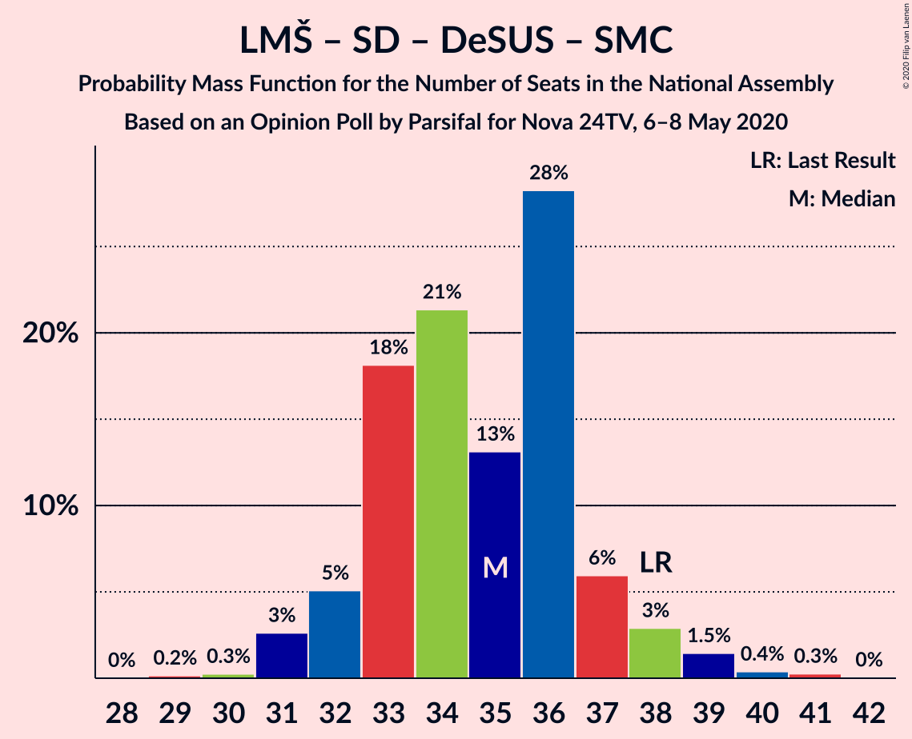

| Number of Seats | Probability | Accumulated | Special Marks |
|:---------------:|:-----------:|:-----------:|:-------------:|
| 29 | 0.2% | 100% |  |
| 30 | 0.3% | 99.8% |  |
| 31 | 3% | 99.6% |  |
| 32 | 5% | 97% |  |
| 33 | 18% | 92% |  |
| 34 | 21% | 74% |  |
| 35 | 13% | 52% | Median |
| 36 | 28% | 39% |  |
| 37 | 6% | 11% |  |
| 38 | 3% | 5% | Last Result |
| 39 | 1.5% | 2% |  |
| 40 | 0.4% | 0.7% |  |
| 41 | 0.3% | 0.3% |  |
| 42 | 0% | 0% |  |

### Lista Marjana Šarca – Socialni demokrati – Nova Slovenija–Krščanski demokrati

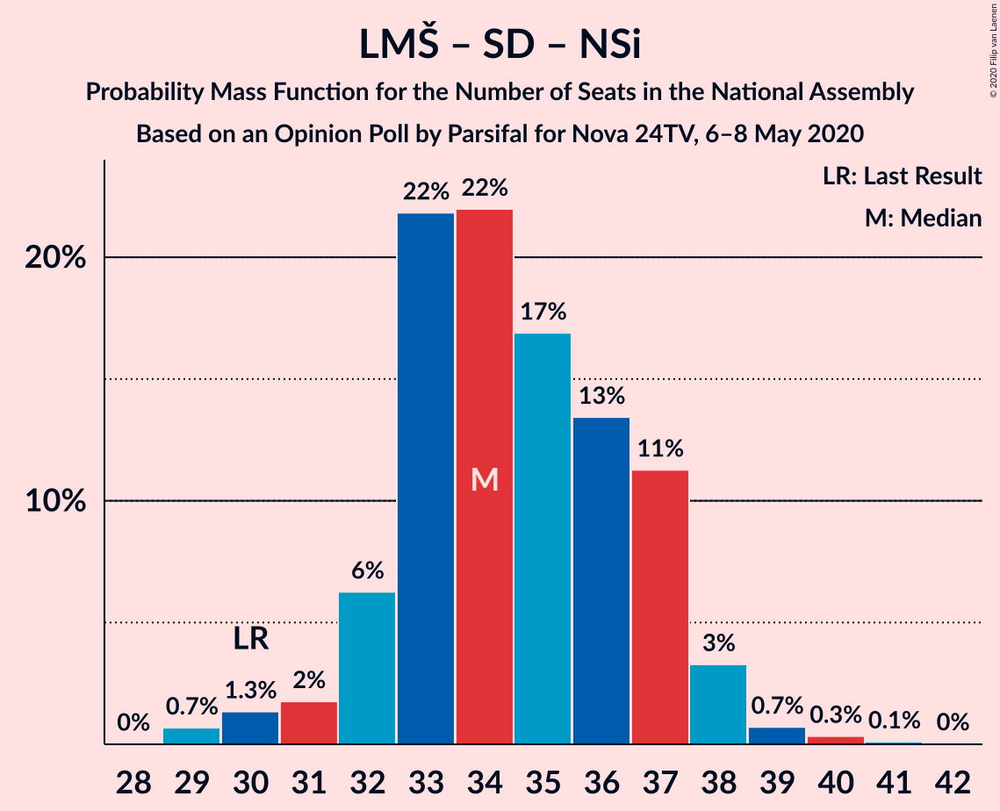

| Number of Seats | Probability | Accumulated | Special Marks |
|:---------------:|:-----------:|:-----------:|:-------------:|
| 29 | 0.7% | 100% |  |
| 30 | 1.3% | 99.3% | Last Result |
| 31 | 2% | 98% |  |
| 32 | 6% | 96% |  |
| 33 | 22% | 90% |  |
| 34 | 22% | 68% |  |
| 35 | 17% | 46% | Median |
| 36 | 13% | 29% |  |
| 37 | 11% | 16% |  |
| 38 | 3% | 4% |  |
| 39 | 0.7% | 1.2% |  |
| 40 | 0.3% | 0.5% |  |
| 41 | 0.1% | 0.1% |  |
| 42 | 0% | 0% |  |

### Lista Marjana Šarca – Socialni demokrati – Nova Slovenija–Krščanski demokrati – Stranka modernega centra

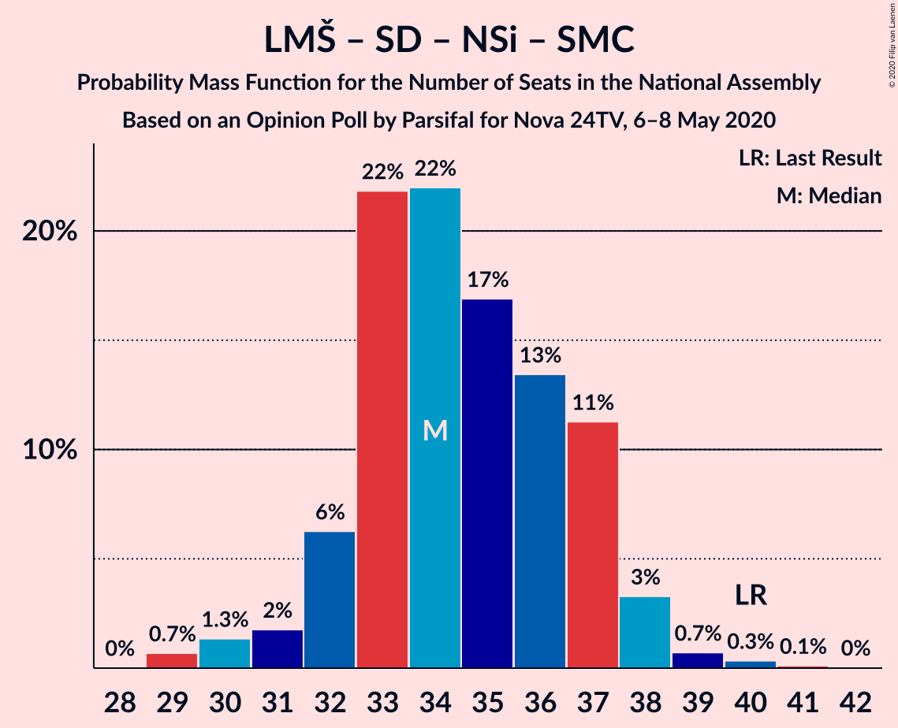

| Number of Seats | Probability | Accumulated | Special Marks |
|:---------------:|:-----------:|:-----------:|:-------------:|
| 29 | 0.7% | 100% |  |
| 30 | 1.3% | 99.3% |  |
| 31 | 2% | 98% |  |
| 32 | 6% | 96% |  |
| 33 | 22% | 90% |  |
| 34 | 22% | 68% |  |
| 35 | 17% | 46% | Median |
| 36 | 13% | 29% |  |
| 37 | 11% | 16% |  |
| 38 | 3% | 4% |  |
| 39 | 0.7% | 1.2% |  |
| 40 | 0.3% | 0.5% | Last Result |
| 41 | 0.1% | 0.1% |  |
| 42 | 0% | 0% |  |

### Lista Marjana Šarca – Socialni demokrati

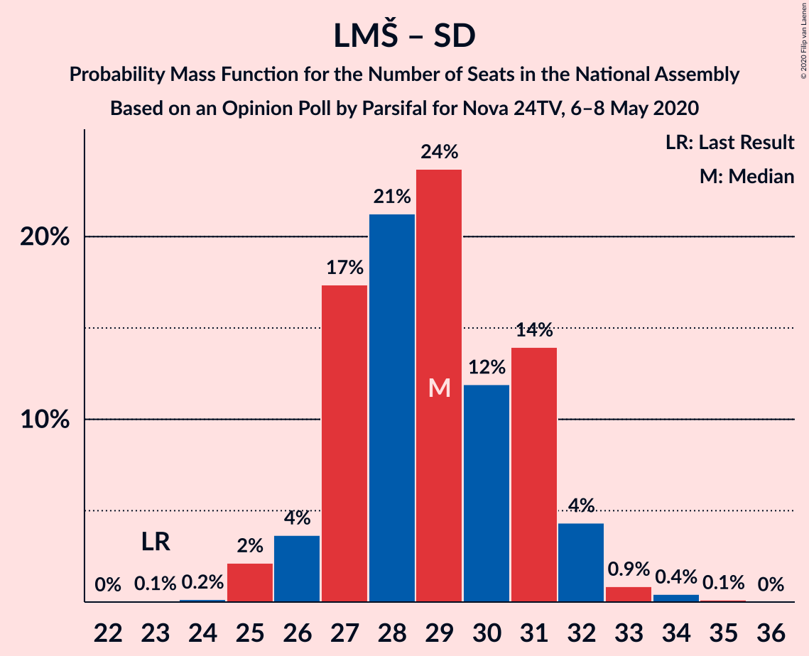

| Number of Seats | Probability | Accumulated | Special Marks |
|:---------------:|:-----------:|:-----------:|:-------------:|
| 23 | 0.1% | 100% | Last Result |
| 24 | 0.2% | 99.9% |  |
| 25 | 2% | 99.8% |  |
| 26 | 4% | 98% |  |
| 27 | 17% | 94% |  |
| 28 | 21% | 77% |  |
| 29 | 24% | 55% | Median |
| 30 | 12% | 32% |  |
| 31 | 14% | 20% |  |
| 32 | 4% | 6% |  |
| 33 | 0.9% | 1.4% |  |
| 34 | 0.4% | 0.6% |  |
| 35 | 0.1% | 0.1% |  |
| 36 | 0% | 0% |  |

### Lista Marjana Šarca – Socialni demokrati – Stranka modernega centra

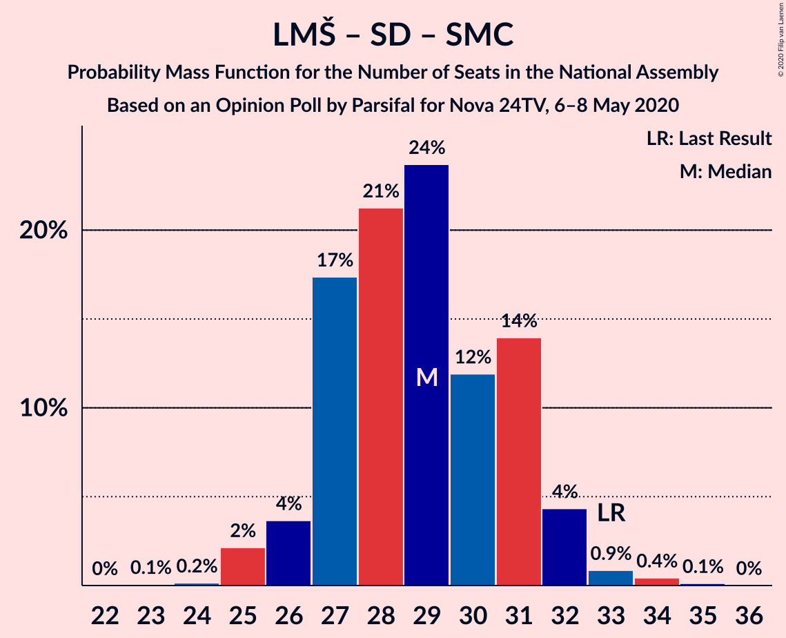

| Number of Seats | Probability | Accumulated | Special Marks |
|:---------------:|:-----------:|:-----------:|:-------------:|
| 23 | 0.1% | 100% |  |
| 24 | 0.2% | 99.9% |  |
| 25 | 2% | 99.8% |  |
| 26 | 4% | 98% |  |
| 27 | 17% | 94% |  |
| 28 | 21% | 77% |  |
| 29 | 24% | 55% | Median |
| 30 | 12% | 32% |  |
| 31 | 14% | 20% |  |
| 32 | 4% | 6% |  |
| 33 | 0.9% | 1.4% | Last Result |
| 34 | 0.4% | 0.6% |  |
| 35 | 0.1% | 0.1% |  |
| 36 | 0% | 0% |  |

### Socialni demokrati – Demokratična stranka upokojencev Slovenije – Stranka modernega centra

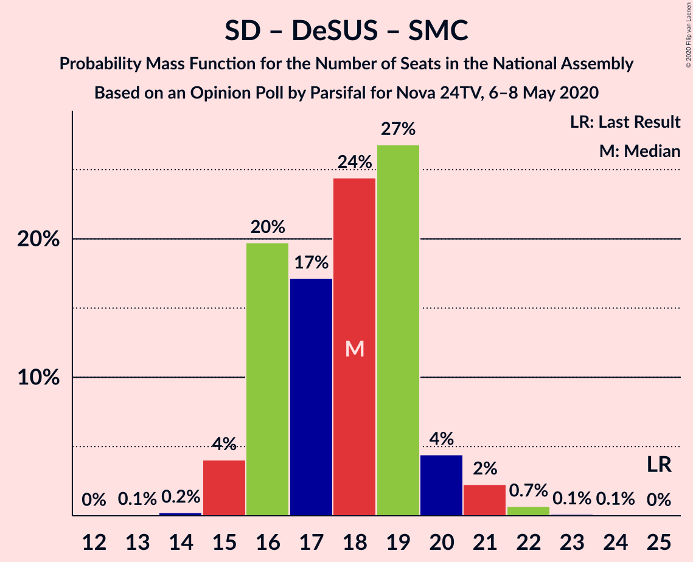

| Number of Seats | Probability | Accumulated | Special Marks |
|:---------------:|:-----------:|:-----------:|:-------------:|
| 13 | 0.1% | 100% |  |
| 14 | 0.2% | 99.9% |  |
| 15 | 4% | 99.7% |  |
| 16 | 20% | 96% |  |
| 17 | 17% | 76% |  |
| 18 | 24% | 59% | Median |
| 19 | 27% | 34% |  |
| 20 | 4% | 8% |  |
| 21 | 2% | 3% |  |
| 22 | 0.7% | 0.9% |  |
| 23 | 0.1% | 0.2% |  |
| 24 | 0.1% | 0.1% |  |
| 25 | 0% | 0% | Last Result |

## Technical Information

### Opinion Poll

+ **Polling firm:** Parsifal
+ **Commissioner(s):** Nova 24TV
+ **Fieldwork period:** 6–8 May 2020

### Calculations

+ **Sample size:** 776
+ **Simulations done:** 1,048,576
+ **Error estimate:** 1.97%

