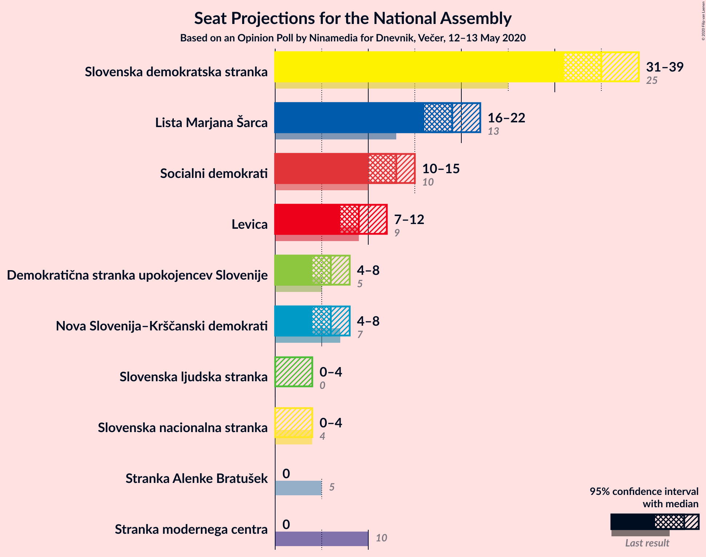
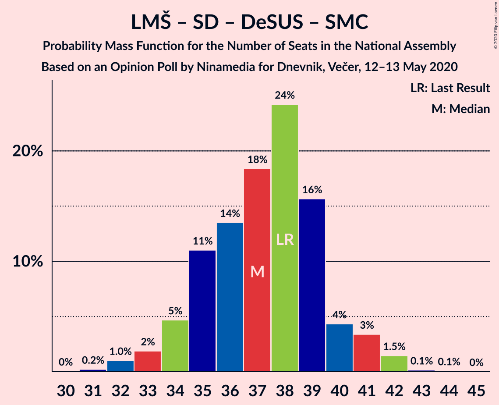
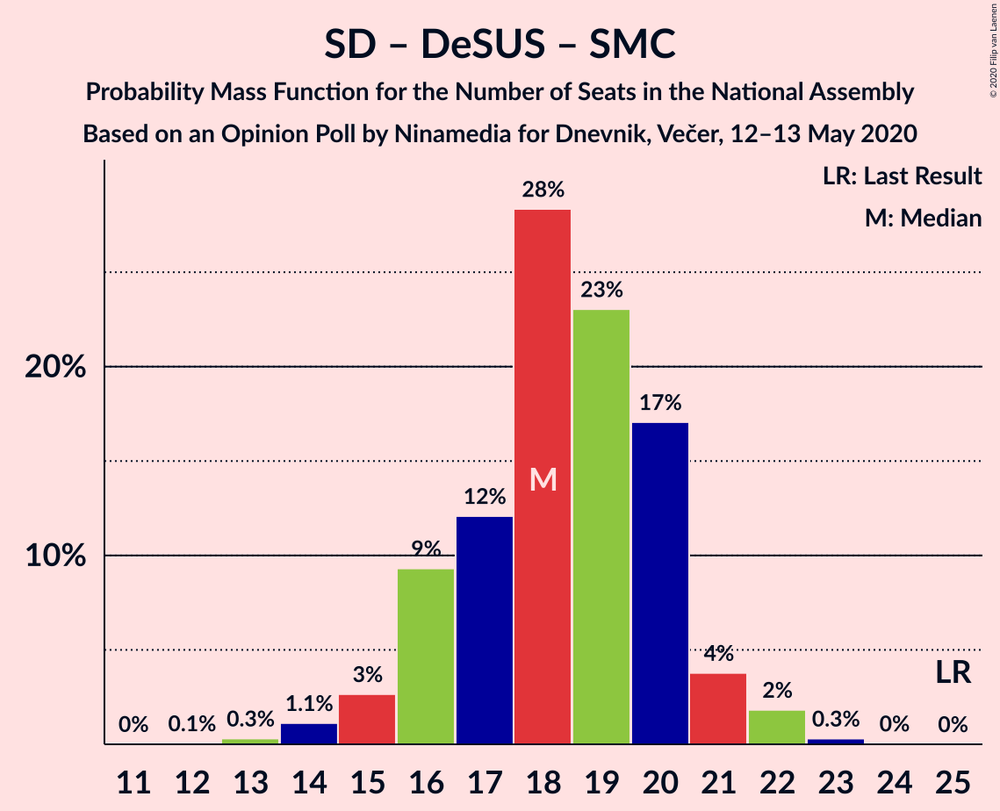

# Opinion Poll by Ninamedia for Dnevnik, Večer, 12–13 May 2020

<a href="#voting-intentions">Voting Intentions</a> | <a href="#seats">Seats</a> | <a href="#coalitions">Coalitions</a> | <a href="#technical-information">Technical Information</a>

## Voting Intentions

### Confidence Intervals

| Party | Last Result | Poll Result | 80% Confidence Interval | 90% Confidence Interval | 95% Confidence Interval | 99% Confidence Interval |
|:-----:|:-----------:|:-----------:|:-----------------------:|:-----------------------:|:-----------------------:|:-----------------------:|
| Slovenska demokratska stranka | 24.9% | 35.6% | 33.3–37.9% |32.7–38.6% |32.1–39.2% |31.0–40.3% |
| Lista Marjana Šarca | 12.6% | 19.6% | 17.8–21.6% |17.2–22.2% |16.8–22.7% |16.0–23.7% |
| Socialni demokrati | 9.9% | 13.1% | 11.6–14.9% |11.2–15.4% |10.8–15.9% |10.2–16.7% |
| Levica | 9.3% | 9.9% | 8.5–11.4% |8.2–11.9% |7.9–12.3% |7.3–13.1% |
| Nova Slovenija–Krščanski demokrati | 7.2% | 6.6% | 5.5–7.9% |5.2–8.3% |5.0–8.7% |4.5–9.4% |
| Demokratična stranka upokojencev Slovenije | 4.9% | 6.0% | 5.0–7.3% |4.7–7.7% |4.5–8.0% |4.0–8.7% |
| Slovenska nacionalna stranka | 4.2% | 2.9% | 2.2–3.8% |2.0–4.1% |1.9–4.4% |1.6–4.9% |
| Slovenska ljudska stranka | 2.6% | 2.9% | 2.2–3.8% |2.0–4.1% |1.9–4.4% |1.6–4.9% |
| Stranka Alenke Bratušek | 5.1% | 1.7% | 1.2–2.5% |1.1–2.8% |1.0–3.0% |0.8–3.4% |
| Stranka modernega centra | 9.7% | 0.4% | 0.2–1.0% |0.2–1.1% |0.2–1.2% |0.1–1.6% |

*Note:* The poll result column reflects the actual value used in the calculations. Published results may vary slightly, and in addition be rounded to fewer digits.

## Seats

### Confidence Intervals

| Party | Last Result | Median | 80% Confidence Interval | 90% Confidence Interval | 95% Confidence Interval | 99% Confidence Interval |
|:-----:|:-----------:|:------:|:-----------------------:|:-----------------------:|:-----------------------:|:-----------------------:|
| <a href="#slovenska-demokratska-stranka">Slovenska demokratska stranka</a> | 25 | 35 | 33–37 |32–38 |31–39 |30–40 |
| <a href="#lista-marjana-šarca">Lista Marjana Šarca</a> | 13 | 19 | 17–21 |16–21 |16–22 |15–23 |
| <a href="#socialni-demokrati">Socialni demokrati</a> | 10 | 13 | 11–14 |10–15 |10–15 |10–16 |
| <a href="#levica">Levica</a> | 9 | 9 | 8–11 |7–11 |7–12 |7–13 |
| <a href="#nova-slovenija–krščanski-demokrati">Nova Slovenija–Krščanski demokrati</a> | 7 | 6 | 5–7 |4–8 |4–8 |4–9 |
| <a href="#demokratična-stranka-upokojencev-slovenije">Demokratična stranka upokojencev Slovenije</a> | 5 | 6 | 4–7 |4–7 |4–8 |0–9 |
| <a href="#slovenska-nacionalna-stranka">Slovenska nacionalna stranka</a> | 4 | 0 | 0 |0–4 |0–4 |0–4 |
| <a href="#slovenska-ljudska-stranka">Slovenska ljudska stranka</a> | 0 | 0 | 0 |0 |0–4 |0–4 |
| <a href="#stranka-alenke-bratušek">Stranka Alenke Bratušek</a> | 5 | 0 | 0 |0 |0 |0 |
| <a href="#stranka-modernega-centra">Stranka modernega centra</a> | 10 | 0 | 0 |0 |0 |0 |

### Slovenska demokratska stranka

*For a full overview of the results for this party, see the [Slovenska demokratska stranka](party-slovenskademokratskastranka.html) page.*

| Number of Seats | Probability | Accumulated | Special Marks |
|:---------------:|:-----------:|:-----------:|:-------------:|
| 25 | 0% | 100% | Last Result |
| 26 | 0% | 100% |  |
| 27 | 0% | 100% |  |
| 28 | 0% | 100% |  |
| 29 | 0.2% | 100% |  |
| 30 | 1.0% | 99.7% |  |
| 31 | 2% | 98.8% |  |
| 32 | 6% | 97% |  |
| 33 | 18% | 90% |  |
| 34 | 14% | 72% |  |
| 35 | 13% | 58% | Median |
| 36 | 20% | 45% |  |
| 37 | 19% | 26% |  |
| 38 | 3% | 7% |  |
| 39 | 3% | 3% |  |
| 40 | 0.5% | 0.7% |  |
| 41 | 0.2% | 0.2% |  |
| 42 | 0% | 0% |  |

### Lista Marjana Šarca

*For a full overview of the results for this party, see the [Lista Marjana Šarca](party-listamarjanašarca.html) page.*

| Number of Seats | Probability | Accumulated | Special Marks |
|:---------------:|:-----------:|:-----------:|:-------------:|
| 13 | 0% | 100% | Last Result |
| 14 | 0.1% | 100% |  |
| 15 | 0.8% | 99.9% |  |
| 16 | 5% | 99.1% |  |
| 17 | 11% | 95% |  |
| 18 | 16% | 84% |  |
| 19 | 37% | 67% | Median |
| 20 | 19% | 31% |  |
| 21 | 7% | 12% |  |
| 22 | 3% | 5% |  |
| 23 | 2% | 2% |  |
| 24 | 0.1% | 0.2% |  |
| 25 | 0% | 0% |  |

### Socialni demokrati

*For a full overview of the results for this party, see the [Socialni demokrati](party-socialnidemokrati.html) page.*

| Number of Seats | Probability | Accumulated | Special Marks |
|:---------------:|:-----------:|:-----------:|:-------------:|
| 9 | 0.4% | 100% |  |
| 10 | 5% | 99.6% | Last Result |
| 11 | 14% | 95% |  |
| 12 | 11% | 81% |  |
| 13 | 44% | 70% | Median |
| 14 | 18% | 25% |  |
| 15 | 6% | 7% |  |
| 16 | 2% | 2% |  |
| 17 | 0.1% | 0.1% |  |
| 18 | 0% | 0% |  |

### Levica

*For a full overview of the results for this party, see the [Levica](party-levica.html) page.*

| Number of Seats | Probability | Accumulated | Special Marks |
|:---------------:|:-----------:|:-----------:|:-------------:|
| 6 | 0.2% | 100% |  |
| 7 | 5% | 99.8% |  |
| 8 | 22% | 95% |  |
| 9 | 35% | 73% | Last Result, Median |
| 10 | 20% | 38% |  |
| 11 | 14% | 17% |  |
| 12 | 2% | 3% |  |
| 13 | 0.7% | 0.7% |  |
| 14 | 0% | 0% |  |

### Nova Slovenija–Krščanski demokrati

*For a full overview of the results for this party, see the [Nova Slovenija–Krščanski demokrati](party-novaslovenija–krščanskidemokrati.html) page.*

| Number of Seats | Probability | Accumulated | Special Marks |
|:---------------:|:-----------:|:-----------:|:-------------:|
| 3 | 0% | 100% |  |
| 4 | 7% | 99.9% |  |
| 5 | 23% | 93% |  |
| 6 | 38% | 70% | Median |
| 7 | 24% | 32% | Last Result |
| 8 | 7% | 8% |  |
| 9 | 0.7% | 0.8% |  |
| 10 | 0.1% | 0.1% |  |
| 11 | 0% | 0% |  |

### Demokratična stranka upokojencev Slovenije

*For a full overview of the results for this party, see the [Demokratična stranka upokojencev Slovenije](party-demokratičnastrankaupokojencevslovenije.html) page.*

| Number of Seats | Probability | Accumulated | Special Marks |
|:---------------:|:-----------:|:-----------:|:-------------:|
| 0 | 0.7% | 100% |  |
| 1 | 0% | 99.3% |  |
| 2 | 0% | 99.3% |  |
| 3 | 0.1% | 99.3% |  |
| 4 | 11% | 99.2% |  |
| 5 | 36% | 88% | Last Result |
| 6 | 40% | 52% | Median |
| 7 | 10% | 12% |  |
| 8 | 2% | 3% |  |
| 9 | 0.5% | 0.6% |  |
| 10 | 0% | 0% |  |

### Slovenska nacionalna stranka

*For a full overview of the results for this party, see the [Slovenska nacionalna stranka](party-slovenskanacionalnastranka.html) page.*

| Number of Seats | Probability | Accumulated | Special Marks |
|:---------------:|:-----------:|:-----------:|:-------------:|
| 0 | 93% | 100% | Median |
| 1 | 0% | 7% |  |
| 2 | 0% | 7% |  |
| 3 | 0.7% | 7% |  |
| 4 | 5% | 6% | Last Result |
| 5 | 0.4% | 0.4% |  |
| 6 | 0% | 0% |  |

### Slovenska ljudska stranka

*For a full overview of the results for this party, see the [Slovenska ljudska stranka](party-slovenskaljudskastranka.html) page.*

| Number of Seats | Probability | Accumulated | Special Marks |
|:---------------:|:-----------:|:-----------:|:-------------:|
| 0 | 95% | 100% | Last Result, Median |
| 1 | 0% | 5% |  |
| 2 | 0% | 5% |  |
| 3 | 0.8% | 5% |  |
| 4 | 4% | 4% |  |
| 5 | 0.3% | 0.3% |  |
| 6 | 0% | 0% |  |

### Stranka Alenke Bratušek

*For a full overview of the results for this party, see the [Stranka Alenke Bratušek](party-strankaalenkebratušek.html) page.*

| Number of Seats | Probability | Accumulated | Special Marks |
|:---------------:|:-----------:|:-----------:|:-------------:|
| 0 | 100% | 100% | Median |
| 1 | 0% | 0% |  |
| 2 | 0% | 0% |  |
| 3 | 0% | 0% |  |
| 4 | 0% | 0% |  |
| 5 | 0% | 0% | Last Result |

### Stranka modernega centra

*For a full overview of the results for this party, see the [Stranka modernega centra](party-strankamodernegacentra.html) page.*

| Number of Seats | Probability | Accumulated | Special Marks |
|:---------------:|:-----------:|:-----------:|:-------------:|
| 0 | 100% | 100% | Median |
| 1 | 0% | 0% |  |
| 2 | 0% | 0% |  |
| 3 | 0% | 0% |  |
| 4 | 0% | 0% |  |
| 5 | 0% | 0% |  |
| 6 | 0% | 0% |  |
| 7 | 0% | 0% |  |
| 8 | 0% | 0% |  |
| 9 | 0% | 0% |  |
| 10 | 0% | 0% | Last Result |

## Coalitions

### Confidence Intervals

| Coalition | Last Result | Median | Majority? | 80% Confidence Interval | 90% Confidence Interval | 95% Confidence Interval | 99% Confidence Interval |
|:---------:|:-----------:|:------:|:---------:|:-----------------------:|:-----------------------:|:-----------------------:|:-----------------------:|
| Slovenska demokratska stranka – Lista Marjana Šarca – Demokratična stranka upokojencev Slovenije | 43 | 60 | 100% | 57–62 | 56–62 | 55–63 | 54–64 |
| Slovenska demokratska stranka – Lista Marjana Šarca | 38 | 54 | 100% | 52–56 | 50–57 | 50–57 | 48–59 |
| Lista Marjana Šarca – Socialni demokrati – Nova Slovenija–Krščanski demokrati – Demokratična stranka upokojencev Slovenije | 35 | 43 | 21% | 41–46 | 40–47 | 39–47 | 38–49 |
| Lista Marjana Šarca – Socialni demokrati – Nova Slovenija–Krščanski demokrati – Demokratična stranka upokojencev Slovenije – Stranka Alenke Bratušek – Stranka modernega centra | 50 | 43 | 21% | 41–46 | 40–47 | 39–47 | 38–49 |
| Lista Marjana Šarca – Socialni demokrati – Nova Slovenija–Krščanski demokrati – Demokratična stranka upokojencev Slovenije – Stranka modernega centra | 45 | 43 | 21% | 41–46 | 40–47 | 39–47 | 38–49 |
| Lista Marjana Šarca – Socialni demokrati – Nova Slovenija–Krščanski demokrati | 30 | 38 | 0% | 35–40 | 35–41 | 34–41 | 33–43 |
| Lista Marjana Šarca – Socialni demokrati – Nova Slovenija–Krščanski demokrati – Stranka modernega centra | 40 | 38 | 0% | 35–40 | 35–41 | 34–41 | 33–43 |
| Lista Marjana Šarca – Socialni demokrati – Demokratična stranka upokojencev Slovenije | 28 | 37 | 0% | 35–39 | 34–41 | 33–41 | 32–42 |
| Lista Marjana Šarca – Socialni demokrati – Demokratična stranka upokojencev Slovenije – Stranka Alenke Bratušek – Stranka modernega centra | 43 | 37 | 0% | 35–39 | 34–41 | 33–41 | 32–42 |
| Lista Marjana Šarca – Socialni demokrati – Demokratična stranka upokojencev Slovenije – Stranka modernega centra | 38 | 37 | 0% | 35–39 | 34–41 | 33–41 | 32–42 |
| Lista Marjana Šarca – Socialni demokrati | 23 | 32 | 0% | 29–34 | 29–35 | 28–35 | 27–36 |
| Lista Marjana Šarca – Socialni demokrati – Stranka modernega centra | 33 | 32 | 0% | 29–34 | 29–35 | 28–35 | 27–36 |
| Socialni demokrati – Demokratična stranka upokojencev Slovenije – Stranka modernega centra | 25 | 18 | 0% | 16–20 | 16–21 | 15–21 | 14–22 |

### Slovenska demokratska stranka – Lista Marjana Šarca – Demokratična stranka upokojencev Slovenije

| Number of Seats | Probability | Accumulated | Special Marks |
|:---------------:|:-----------:|:-----------:|:-------------:|
| 43 | 0% | 100% | Last Result |
| 44 | 0% | 100% |  |
| 45 | 0% | 100% |  |
| 46 | 0% | 100% | Majority |
| 47 | 0% | 100% |  |
| 48 | 0% | 100% |  |
| 49 | 0% | 100% |  |
| 50 | 0% | 100% |  |
| 51 | 0% | 100% |  |
| 52 | 0% | 100% |  |
| 53 | 0.3% | 99.9% |  |
| 54 | 0.9% | 99.7% |  |
| 55 | 1.4% | 98.8% |  |
| 56 | 5% | 97% |  |
| 57 | 6% | 92% |  |
| 58 | 23% | 85% |  |
| 59 | 9% | 63% |  |
| 60 | 15% | 54% | Median |
| 61 | 26% | 38% |  |
| 62 | 8% | 12% |  |
| 63 | 3% | 4% |  |
| 64 | 0.7% | 0.9% |  |
| 65 | 0.1% | 0.2% |  |
| 66 | 0% | 0% |  |

### Slovenska demokratska stranka – Lista Marjana Šarca

| Number of Seats | Probability | Accumulated | Special Marks |
|:---------------:|:-----------:|:-----------:|:-------------:|
| 38 | 0% | 100% | Last Result |
| 39 | 0% | 100% |  |
| 40 | 0% | 100% |  |
| 41 | 0% | 100% |  |
| 42 | 0% | 100% |  |
| 43 | 0% | 100% |  |
| 44 | 0% | 100% |  |
| 45 | 0% | 100% |  |
| 46 | 0% | 100% | Majority |
| 47 | 0.1% | 100% |  |
| 48 | 0.5% | 99.9% |  |
| 49 | 1.4% | 99.4% |  |
| 50 | 4% | 98% |  |
| 51 | 4% | 94% |  |
| 52 | 25% | 90% |  |
| 53 | 10% | 66% |  |
| 54 | 10% | 55% | Median |
| 55 | 13% | 45% |  |
| 56 | 25% | 33% |  |
| 57 | 5% | 7% |  |
| 58 | 1.5% | 2% |  |
| 59 | 0.7% | 0.9% |  |
| 60 | 0.2% | 0.2% |  |
| 61 | 0% | 0% |  |

### Lista Marjana Šarca – Socialni demokrati – Nova Slovenija–Krščanski demokrati – Demokratična stranka upokojencev Slovenije

| Number of Seats | Probability | Accumulated | Special Marks |
|:---------------:|:-----------:|:-----------:|:-------------:|
| 35 | 0% | 100% | Last Result |
| 36 | 0.1% | 100% |  |
| 37 | 0.2% | 99.9% |  |
| 38 | 1.2% | 99.7% |  |
| 39 | 2% | 98.6% |  |
| 40 | 4% | 97% |  |
| 41 | 11% | 93% |  |
| 42 | 23% | 82% |  |
| 43 | 13% | 58% |  |
| 44 | 18% | 45% | Median |
| 45 | 6% | 28% |  |
| 46 | 15% | 21% | Majority |
| 47 | 4% | 6% |  |
| 48 | 1.5% | 2% |  |
| 49 | 0.5% | 0.5% |  |
| 50 | 0% | 0% |  |

### Lista Marjana Šarca – Socialni demokrati – Nova Slovenija–Krščanski demokrati – Demokratična stranka upokojencev Slovenije – Stranka Alenke Bratušek – Stranka modernega centra

| Number of Seats | Probability | Accumulated | Special Marks |
|:---------------:|:-----------:|:-----------:|:-------------:|
| 36 | 0.1% | 100% |  |
| 37 | 0.2% | 99.9% |  |
| 38 | 1.2% | 99.7% |  |
| 39 | 2% | 98.6% |  |
| 40 | 4% | 97% |  |
| 41 | 11% | 93% |  |
| 42 | 23% | 82% |  |
| 43 | 13% | 58% |  |
| 44 | 18% | 45% | Median |
| 45 | 6% | 28% |  |
| 46 | 15% | 21% | Majority |
| 47 | 4% | 6% |  |
| 48 | 1.5% | 2% |  |
| 49 | 0.5% | 0.5% |  |
| 50 | 0% | 0% | Last Result |

### Lista Marjana Šarca – Socialni demokrati – Nova Slovenija–Krščanski demokrati – Demokratična stranka upokojencev Slovenije – Stranka modernega centra

| Number of Seats | Probability | Accumulated | Special Marks |
|:---------------:|:-----------:|:-----------:|:-------------:|
| 36 | 0.1% | 100% |  |
| 37 | 0.2% | 99.9% |  |
| 38 | 1.2% | 99.7% |  |
| 39 | 2% | 98.6% |  |
| 40 | 4% | 97% |  |
| 41 | 11% | 93% |  |
| 42 | 23% | 82% |  |
| 43 | 13% | 58% |  |
| 44 | 18% | 45% | Median |
| 45 | 6% | 28% | Last Result |
| 46 | 15% | 21% | Majority |
| 47 | 4% | 6% |  |
| 48 | 1.5% | 2% |  |
| 49 | 0.5% | 0.5% |  |
| 50 | 0% | 0% |  |

### Lista Marjana Šarca – Socialni demokrati – Nova Slovenija–Krščanski demokrati

| Number of Seats | Probability | Accumulated | Special Marks |
|:---------------:|:-----------:|:-----------:|:-------------:|
| 30 | 0% | 100% | Last Result |
| 31 | 0.1% | 100% |  |
| 32 | 0.4% | 99.9% |  |
| 33 | 0.9% | 99.5% |  |
| 34 | 3% | 98.6% |  |
| 35 | 6% | 95% |  |
| 36 | 18% | 89% |  |
| 37 | 18% | 71% |  |
| 38 | 15% | 53% | Median |
| 39 | 15% | 38% |  |
| 40 | 16% | 23% |  |
| 41 | 5% | 7% |  |
| 42 | 1.0% | 2% |  |
| 43 | 1.0% | 1.1% |  |
| 44 | 0.1% | 0.1% |  |
| 45 | 0% | 0% |  |

### Lista Marjana Šarca – Socialni demokrati – Nova Slovenija–Krščanski demokrati – Stranka modernega centra

| Number of Seats | Probability | Accumulated | Special Marks |
|:---------------:|:-----------:|:-----------:|:-------------:|
| 31 | 0.1% | 100% |  |
| 32 | 0.4% | 99.9% |  |
| 33 | 0.9% | 99.5% |  |
| 34 | 3% | 98.6% |  |
| 35 | 6% | 95% |  |
| 36 | 18% | 89% |  |
| 37 | 18% | 71% |  |
| 38 | 15% | 53% | Median |
| 39 | 15% | 38% |  |
| 40 | 16% | 23% | Last Result |
| 41 | 5% | 7% |  |
| 42 | 1.0% | 2% |  |
| 43 | 1.0% | 1.1% |  |
| 44 | 0.1% | 0.1% |  |
| 45 | 0% | 0% |  |

### Lista Marjana Šarca – Socialni demokrati – Demokratična stranka upokojencev Slovenije

| Number of Seats | Probability | Accumulated | Special Marks |
|:---------------:|:-----------:|:-----------:|:-------------:|
| 28 | 0% | 100% | Last Result |
| 29 | 0% | 100% |  |
| 30 | 0% | 100% |  |
| 31 | 0.2% | 99.9% |  |
| 32 | 1.0% | 99.7% |  |
| 33 | 2% | 98.7% |  |
| 34 | 5% | 97% |  |
| 35 | 11% | 92% |  |
| 36 | 14% | 81% |  |
| 37 | 18% | 68% |  |
| 38 | 24% | 49% | Median |
| 39 | 16% | 25% |  |
| 40 | 4% | 9% |  |
| 41 | 3% | 5% |  |
| 42 | 1.5% | 2% |  |
| 43 | 0.1% | 0.2% |  |
| 44 | 0.1% | 0.1% |  |
| 45 | 0% | 0% |  |

### Lista Marjana Šarca – Socialni demokrati – Demokratična stranka upokojencev Slovenije – Stranka Alenke Bratušek – Stranka modernega centra

| Number of Seats | Probability | Accumulated | Special Marks |
|:---------------:|:-----------:|:-----------:|:-------------:|
| 30 | 0% | 100% |  |
| 31 | 0.2% | 99.9% |  |
| 32 | 1.0% | 99.7% |  |
| 33 | 2% | 98.7% |  |
| 34 | 5% | 97% |  |
| 35 | 11% | 92% |  |
| 36 | 14% | 81% |  |
| 37 | 18% | 68% |  |
| 38 | 24% | 49% | Median |
| 39 | 16% | 25% |  |
| 40 | 4% | 9% |  |
| 41 | 3% | 5% |  |
| 42 | 1.5% | 2% |  |
| 43 | 0.1% | 0.2% | Last Result |
| 44 | 0.1% | 0.1% |  |
| 45 | 0% | 0% |  |

### Lista Marjana Šarca – Socialni demokrati – Demokratična stranka upokojencev Slovenije – Stranka modernega centra

| Number of Seats | Probability | Accumulated | Special Marks |
|:---------------:|:-----------:|:-----------:|:-------------:|
| 30 | 0% | 100% |  |
| 31 | 0.2% | 99.9% |  |
| 32 | 1.0% | 99.7% |  |
| 33 | 2% | 98.7% |  |
| 34 | 5% | 97% |  |
| 35 | 11% | 92% |  |
| 36 | 14% | 81% |  |
| 37 | 18% | 68% |  |
| 38 | 24% | 49% | Last Result, Median |
| 39 | 16% | 25% |  |
| 40 | 4% | 9% |  |
| 41 | 3% | 5% |  |
| 42 | 1.5% | 2% |  |
| 43 | 0.1% | 0.2% |  |
| 44 | 0.1% | 0.1% |  |
| 45 | 0% | 0% |  |

### Lista Marjana Šarca – Socialni demokrati

| Number of Seats | Probability | Accumulated | Special Marks |
|:---------------:|:-----------:|:-----------:|:-------------:|
| 23 | 0% | 100% | Last Result |
| 24 | 0% | 100% |  |
| 25 | 0% | 100% |  |
| 26 | 0.2% | 100% |  |
| 27 | 1.2% | 99.8% |  |
| 28 | 2% | 98.6% |  |
| 29 | 8% | 97% |  |
| 30 | 15% | 88% |  |
| 31 | 13% | 74% |  |
| 32 | 24% | 61% | Median |
| 33 | 26% | 37% |  |
| 34 | 5% | 11% |  |
| 35 | 4% | 6% |  |
| 36 | 2% | 2% |  |
| 37 | 0.2% | 0.3% |  |
| 38 | 0% | 0.1% |  |
| 39 | 0% | 0% |  |

### Lista Marjana Šarca – Socialni demokrati – Stranka modernega centra

| Number of Seats | Probability | Accumulated | Special Marks |
|:---------------:|:-----------:|:-----------:|:-------------:|
| 26 | 0.2% | 100% |  |
| 27 | 1.2% | 99.8% |  |
| 28 | 2% | 98.6% |  |
| 29 | 8% | 97% |  |
| 30 | 15% | 88% |  |
| 31 | 13% | 74% |  |
| 32 | 24% | 61% | Median |
| 33 | 26% | 37% | Last Result |
| 34 | 5% | 11% |  |
| 35 | 4% | 6% |  |
| 36 | 2% | 2% |  |
| 37 | 0.2% | 0.3% |  |
| 38 | 0% | 0.1% |  |
| 39 | 0% | 0% |  |

### Socialni demokrati – Demokratična stranka upokojencev Slovenije – Stranka modernega centra

| Number of Seats | Probability | Accumulated | Special Marks |
|:---------------:|:-----------:|:-----------:|:-------------:|
| 12 | 0.1% | 100% |  |
| 13 | 0.3% | 99.9% |  |
| 14 | 1.1% | 99.6% |  |
| 15 | 3% | 98% |  |
| 16 | 9% | 96% |  |
| 17 | 12% | 87% |  |
| 18 | 28% | 74% |  |
| 19 | 23% | 46% | Median |
| 20 | 17% | 23% |  |
| 21 | 4% | 6% |  |
| 22 | 2% | 2% |  |
| 23 | 0.3% | 0.4% |  |
| 24 | 0% | 0.1% |  |
| 25 | 0% | 0% | Last Result |

## Technical Information

### Opinion Poll

+ **Polling firm:** Ninamedia
+ **Commissioner(s):** Dnevnik, Večer
+ **Fieldwork period:** 12–13 May 2020

### Calculations

+ **Sample size:** 700
+ **Simulations done:** 1,048,576
+ **Error estimate:** 1.39%

