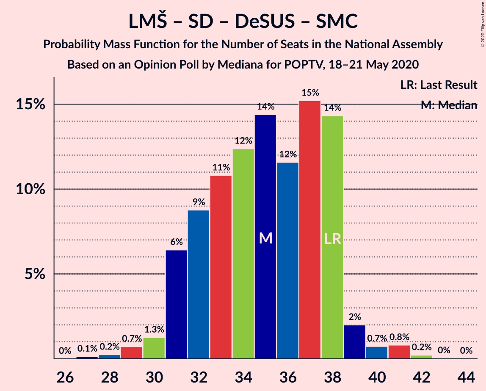

# Opinion Poll by Mediana for POPTV, 18–21 May 2020

<a href="#voting-intentions">Voting Intentions</a> | <a href="#seats">Seats</a> | <a href="#coalitions">Coalitions</a> | <a href="#technical-information">Technical Information</a>

## Voting Intentions

### Confidence Intervals

| Party | Last Result | Poll Result | 80% Confidence Interval | 90% Confidence Interval | 95% Confidence Interval | 99% Confidence Interval |
|:-----:|:-----------:|:-----------:|:-----------------------:|:-----------------------:|:-----------------------:|:-----------------------:|
| Slovenska demokratska stranka | 24.9% | 30.8% | 28.6–33.1% |28.0–33.7% |27.5–34.3% |26.5–35.4% |
| Lista Marjana Šarca | 12.6% | 23.3% | 21.3–25.4% |20.8–26.0% |20.3–26.5% |19.4–27.5% |
| Levica | 9.3% | 12.1% | 10.7–13.8% |10.3–14.3% |9.9–14.7% |9.3–15.6% |
| Socialni demokrati | 9.9% | 10.9% | 9.5–12.5% |9.1–13.0% |8.8–13.4% |8.2–14.2% |
| Nova Slovenija–Krščanski demokrati | 7.2% | 6.1% | 5.1–7.4% |4.8–7.8% |4.6–8.1% |4.1–8.8% |
| Demokratična stranka upokojencev Slovenije | 4.9% | 4.3% | 3.5–5.5% |3.2–5.8% |3.1–6.1% |2.7–6.7% |
| Stranka Alenke Bratušek | 5.1% | 4.0% | 3.2–5.2% |3.0–5.5% |2.8–5.7% |2.5–6.3% |
| Slovenska nacionalna stranka | 4.2% | 4.0% | 3.2–5.2% |3.0–5.5% |2.8–5.7% |2.5–6.3% |
| Stranka modernega centra | 9.7% | 0.3% | 0.2–0.7% |0.1–0.9% |0.1–1.0% |0.0–1.3% |

*Note:* The poll result column reflects the actual value used in the calculations. Published results may vary slightly, and in addition be rounded to fewer digits.

## Seats

### Confidence Intervals

| Party | Last Result | Median | 80% Confidence Interval | 90% Confidence Interval | 95% Confidence Interval | 99% Confidence Interval |
|:-----:|:-----------:|:------:|:-----------------------:|:-----------------------:|:-----------------------:|:-----------------------:|
| <a href="#slovenska-demokratska-stranka">Slovenska demokratska stranka</a> | 25 | 30 | 27–32 |26–32 |25–33 |24–34 |
| <a href="#lista-marjana-šarca">Lista Marjana Šarca</a> | 13 | 22 | 20–24 |19–24 |19–26 |18–27 |
| <a href="#levica">Levica</a> | 9 | 11 | 10–13 |9–14 |9–14 |8–15 |
| <a href="#socialni-demokrati">Socialni demokrati</a> | 10 | 10 | 9–12 |8–12 |8–13 |7–13 |
| <a href="#nova-slovenija–krščanski-demokrati">Nova Slovenija–Krščanski demokrati</a> | 7 | 6 | 4–7 |4–7 |4–7 |3–8 |
| <a href="#demokratična-stranka-upokojencev-slovenije">Demokratična stranka upokojencev Slovenije</a> | 5 | 4 | 0–5 |0–5 |0–5 |0–6 |
| <a href="#stranka-alenke-bratušek">Stranka Alenke Bratušek</a> | 5 | 0 | 0–4 |0–5 |0–5 |0–6 |
| <a href="#slovenska-nacionalna-stranka">Slovenska nacionalna stranka</a> | 4 | 4 | 0–4 |0–5 |0–5 |0–6 |
| <a href="#stranka-modernega-centra">Stranka modernega centra</a> | 10 | 0 | 0 |0 |0 |0 |

### Slovenska demokratska stranka

*For a full overview of the results for this party, see the [Slovenska demokratska stranka](party-slovenskademokratskastranka.html) page.*

| Number of Seats | Probability | Accumulated | Special Marks |
|:---------------:|:-----------:|:-----------:|:-------------:|
| 23 | 0.1% | 100% |  |
| 24 | 1.3% | 99.9% |  |
| 25 | 1.3% | 98.6% | Last Result |
| 26 | 6% | 97% |  |
| 27 | 11% | 91% |  |
| 28 | 14% | 80% |  |
| 29 | 16% | 66% |  |
| 30 | 25% | 50% | Median |
| 31 | 15% | 25% |  |
| 32 | 5% | 10% |  |
| 33 | 3% | 5% |  |
| 34 | 1.4% | 2% |  |
| 35 | 0.3% | 0.5% |  |
| 36 | 0.1% | 0.2% |  |
| 37 | 0.1% | 0.1% |  |
| 38 | 0% | 0% |  |

### Lista Marjana Šarca

*For a full overview of the results for this party, see the [Lista Marjana Šarca](party-listamarjanašarca.html) page.*

| Number of Seats | Probability | Accumulated | Special Marks |
|:---------------:|:-----------:|:-----------:|:-------------:|
| 13 | 0% | 100% | Last Result |
| 14 | 0% | 100% |  |
| 15 | 0% | 100% |  |
| 16 | 0% | 100% |  |
| 17 | 0.3% | 100% |  |
| 18 | 2% | 99.7% |  |
| 19 | 4% | 98% |  |
| 20 | 12% | 94% |  |
| 21 | 22% | 82% |  |
| 22 | 21% | 60% | Median |
| 23 | 19% | 39% |  |
| 24 | 15% | 20% |  |
| 25 | 2% | 5% |  |
| 26 | 1.4% | 3% |  |
| 27 | 1.1% | 1.3% |  |
| 28 | 0.2% | 0.2% |  |
| 29 | 0% | 0% |  |

### Levica

*For a full overview of the results for this party, see the [Levica](party-levica.html) page.*

| Number of Seats | Probability | Accumulated | Special Marks |
|:---------------:|:-----------:|:-----------:|:-------------:|
| 7 | 0.1% | 100% |  |
| 8 | 0.7% | 99.9% |  |
| 9 | 6% | 99.2% | Last Result |
| 10 | 18% | 93% |  |
| 11 | 31% | 76% | Median |
| 12 | 23% | 44% |  |
| 13 | 15% | 21% |  |
| 14 | 5% | 6% |  |
| 15 | 0.9% | 1.1% |  |
| 16 | 0.1% | 0.1% |  |
| 17 | 0% | 0% |  |

### Socialni demokrati

*For a full overview of the results for this party, see the [Socialni demokrati](party-socialnidemokrati.html) page.*

| Number of Seats | Probability | Accumulated | Special Marks |
|:---------------:|:-----------:|:-----------:|:-------------:|
| 7 | 1.5% | 100% |  |
| 8 | 7% | 98% |  |
| 9 | 21% | 91% |  |
| 10 | 34% | 70% | Last Result, Median |
| 11 | 23% | 35% |  |
| 12 | 10% | 13% |  |
| 13 | 2% | 3% |  |
| 14 | 0.4% | 0.4% |  |
| 15 | 0% | 0% |  |

### Nova Slovenija–Krščanski demokrati

*For a full overview of the results for this party, see the [Nova Slovenija–Krščanski demokrati](party-novaslovenija–krščanskidemokrati.html) page.*

| Number of Seats | Probability | Accumulated | Special Marks |
|:---------------:|:-----------:|:-----------:|:-------------:|
| 0 | 0.3% | 100% |  |
| 1 | 0% | 99.7% |  |
| 2 | 0% | 99.7% |  |
| 3 | 0.4% | 99.7% |  |
| 4 | 11% | 99.2% |  |
| 5 | 33% | 88% |  |
| 6 | 41% | 54% | Median |
| 7 | 12% | 14% | Last Result |
| 8 | 1.1% | 1.4% |  |
| 9 | 0.3% | 0.3% |  |
| 10 | 0% | 0% |  |

### Demokratična stranka upokojencev Slovenije

*For a full overview of the results for this party, see the [Demokratična stranka upokojencev Slovenije](party-demokratičnastrankaupokojencevslovenije.html) page.*

| Number of Seats | Probability | Accumulated | Special Marks |
|:---------------:|:-----------:|:-----------:|:-------------:|
| 0 | 30% | 100% |  |
| 1 | 0% | 70% |  |
| 2 | 0% | 70% |  |
| 3 | 9% | 70% |  |
| 4 | 43% | 61% | Median |
| 5 | 16% | 18% | Last Result |
| 6 | 2% | 2% |  |
| 7 | 0.1% | 0.1% |  |
| 8 | 0% | 0% |  |

### Stranka Alenke Bratušek

*For a full overview of the results for this party, see the [Stranka Alenke Bratušek](party-strankaalenkebratušek.html) page.*

| Number of Seats | Probability | Accumulated | Special Marks |
|:---------------:|:-----------:|:-----------:|:-------------:|
| 0 | 52% | 100% | Median |
| 1 | 0% | 48% |  |
| 2 | 0% | 48% |  |
| 3 | 5% | 48% |  |
| 4 | 36% | 43% |  |
| 5 | 6% | 7% | Last Result |
| 6 | 0.6% | 0.6% |  |
| 7 | 0% | 0% |  |

### Slovenska nacionalna stranka

*For a full overview of the results for this party, see the [Slovenska nacionalna stranka](party-slovenskanacionalnastranka.html) page.*

| Number of Seats | Probability | Accumulated | Special Marks |
|:---------------:|:-----------:|:-----------:|:-------------:|
| 0 | 41% | 100% |  |
| 1 | 0% | 59% |  |
| 2 | 0% | 59% |  |
| 3 | 7% | 59% |  |
| 4 | 45% | 53% | Last Result, Median |
| 5 | 7% | 8% |  |
| 6 | 0.5% | 0.5% |  |
| 7 | 0% | 0% |  |

### Stranka modernega centra

*For a full overview of the results for this party, see the [Stranka modernega centra](party-strankamodernegacentra.html) page.*

| Number of Seats | Probability | Accumulated | Special Marks |
|:---------------:|:-----------:|:-----------:|:-------------:|
| 0 | 100% | 100% | Median |
| 1 | 0% | 0% |  |
| 2 | 0% | 0% |  |
| 3 | 0% | 0% |  |
| 4 | 0% | 0% |  |
| 5 | 0% | 0% |  |
| 6 | 0% | 0% |  |
| 7 | 0% | 0% |  |
| 8 | 0% | 0% |  |
| 9 | 0% | 0% |  |
| 10 | 0% | 0% | Last Result |

## Coalitions

### Confidence Intervals

| Coalition | Last Result | Median | Majority? | 80% Confidence Interval | 90% Confidence Interval | 95% Confidence Interval | 99% Confidence Interval |
|:---------:|:-----------:|:------:|:---------:|:-----------------------:|:-----------------------:|:-----------------------:|:-----------------------:|
| Slovenska demokratska stranka – Lista Marjana Šarca – Demokratična stranka upokojencev Slovenije | 43 | 54 | 100% | 51–58 | 50–59 | 49–59 | 47–61 |
| Slovenska demokratska stranka – Lista Marjana Šarca | 38 | 51 | 98% | 48–55 | 47–56 | 46–56 | 45–58 |
| Lista Marjana Šarca – Socialni demokrati – Nova Slovenija–Krščanski demokrati – Demokratična stranka upokojencev Slovenije – Stranka Alenke Bratušek – Stranka modernega centra | 50 | 43 | 12% | 38–46 | 37–47 | 37–48 | 36–49 |
| Lista Marjana Šarca – Socialni demokrati – Nova Slovenija–Krščanski demokrati – Demokratična stranka upokojencev Slovenije | 35 | 41 | 1.4% | 37–44 | 37–44 | 36–45 | 34–47 |
| Lista Marjana Šarca – Socialni demokrati – Nova Slovenija–Krščanski demokrati – Demokratična stranka upokojencev Slovenije – Stranka modernega centra | 45 | 41 | 1.4% | 37–44 | 37–44 | 36–45 | 34–47 |
| Lista Marjana Šarca – Socialni demokrati – Nova Slovenija–Krščanski demokrati | 30 | 38 | 0.1% | 35–41 | 34–41 | 33–42 | 32–44 |
| Lista Marjana Šarca – Socialni demokrati – Nova Slovenija–Krščanski demokrati – Stranka modernega centra | 40 | 38 | 0.1% | 35–41 | 34–41 | 33–42 | 32–44 |
| Lista Marjana Šarca – Socialni demokrati – Demokratična stranka upokojencev Slovenije – Stranka Alenke Bratušek – Stranka modernega centra | 43 | 37 | 0.1% | 33–40 | 32–41 | 32–41 | 31–44 |
| Lista Marjana Šarca – Socialni demokrati – Demokratična stranka upokojencev Slovenije | 28 | 35 | 0% | 32–38 | 31–38 | 31–39 | 29–41 |
| Lista Marjana Šarca – Socialni demokrati – Demokratična stranka upokojencev Slovenije – Stranka modernega centra | 38 | 35 | 0% | 32–38 | 31–38 | 31–39 | 29–41 |
| Lista Marjana Šarca – Socialni demokrati | 23 | 32 | 0% | 29–35 | 29–35 | 28–36 | 27–38 |
| Lista Marjana Šarca – Socialni demokrati – Stranka modernega centra | 33 | 32 | 0% | 29–35 | 29–35 | 28–36 | 27–38 |
| Socialni demokrati – Demokratična stranka upokojencev Slovenije – Stranka modernega centra | 25 | 14 | 0% | 10–15 | 9–16 | 9–16 | 8–17 |

### Slovenska demokratska stranka – Lista Marjana Šarca – Demokratična stranka upokojencev Slovenije

| Number of Seats | Probability | Accumulated | Special Marks |
|:---------------:|:-----------:|:-----------:|:-------------:|
| 43 | 0% | 100% | Last Result |
| 44 | 0% | 100% |  |
| 45 | 0% | 100% |  |
| 46 | 0.1% | 100% | Majority |
| 47 | 0.4% | 99.9% |  |
| 48 | 1.0% | 99.5% |  |
| 49 | 3% | 98% |  |
| 50 | 3% | 95% |  |
| 51 | 8% | 92% |  |
| 52 | 9% | 84% |  |
| 53 | 19% | 75% |  |
| 54 | 12% | 56% |  |
| 55 | 12% | 44% |  |
| 56 | 10% | 33% | Median |
| 57 | 12% | 23% |  |
| 58 | 4% | 11% |  |
| 59 | 5% | 7% |  |
| 60 | 0.9% | 2% |  |
| 61 | 0.9% | 1.1% |  |
| 62 | 0.1% | 0.2% |  |
| 63 | 0% | 0.1% |  |
| 64 | 0% | 0% |  |

### Slovenska demokratska stranka – Lista Marjana Šarca

| Number of Seats | Probability | Accumulated | Special Marks |
|:---------------:|:-----------:|:-----------:|:-------------:|
| 38 | 0% | 100% | Last Result |
| 39 | 0% | 100% |  |
| 40 | 0% | 100% |  |
| 41 | 0% | 100% |  |
| 42 | 0% | 100% |  |
| 43 | 0% | 100% |  |
| 44 | 0.2% | 100% |  |
| 45 | 2% | 99.8% |  |
| 46 | 2% | 98% | Majority |
| 47 | 3% | 96% |  |
| 48 | 8% | 93% |  |
| 49 | 13% | 85% |  |
| 50 | 10% | 72% |  |
| 51 | 15% | 62% |  |
| 52 | 12% | 47% | Median |
| 53 | 15% | 35% |  |
| 54 | 7% | 20% |  |
| 55 | 7% | 12% |  |
| 56 | 3% | 5% |  |
| 57 | 1.1% | 2% |  |
| 58 | 0.8% | 1.2% |  |
| 59 | 0.3% | 0.4% |  |
| 60 | 0.1% | 0.1% |  |
| 61 | 0% | 0% |  |

### Lista Marjana Šarca – Socialni demokrati – Nova Slovenija–Krščanski demokrati – Demokratična stranka upokojencev Slovenije – Stranka Alenke Bratušek – Stranka modernega centra

| Number of Seats | Probability | Accumulated | Special Marks |
|:---------------:|:-----------:|:-----------:|:-------------:|
| 35 | 0.1% | 100% |  |
| 36 | 0.7% | 99.9% |  |
| 37 | 5% | 99.2% |  |
| 38 | 7% | 94% |  |
| 39 | 5% | 88% |  |
| 40 | 4% | 82% |  |
| 41 | 11% | 78% |  |
| 42 | 8% | 68% | Median |
| 43 | 20% | 59% |  |
| 44 | 16% | 39% |  |
| 45 | 11% | 23% |  |
| 46 | 7% | 12% | Majority |
| 47 | 2% | 5% |  |
| 48 | 2% | 3% |  |
| 49 | 0.4% | 0.8% |  |
| 50 | 0.3% | 0.4% | Last Result |
| 51 | 0.1% | 0.1% |  |
| 52 | 0% | 0% |  |

### Lista Marjana Šarca – Socialni demokrati – Nova Slovenija–Krščanski demokrati – Demokratična stranka upokojencev Slovenije

| Number of Seats | Probability | Accumulated | Special Marks |
|:---------------:|:-----------:|:-----------:|:-------------:|
| 32 | 0.1% | 100% |  |
| 33 | 0.1% | 99.9% |  |
| 34 | 0.6% | 99.8% |  |
| 35 | 1.3% | 99.2% | Last Result |
| 36 | 3% | 98% |  |
| 37 | 11% | 95% |  |
| 38 | 9% | 84% |  |
| 39 | 8% | 75% |  |
| 40 | 12% | 67% |  |
| 41 | 13% | 55% |  |
| 42 | 13% | 42% | Median |
| 43 | 19% | 29% |  |
| 44 | 6% | 10% |  |
| 45 | 3% | 4% |  |
| 46 | 0.8% | 1.4% | Majority |
| 47 | 0.4% | 0.6% |  |
| 48 | 0.1% | 0.2% |  |
| 49 | 0.1% | 0.1% |  |
| 50 | 0% | 0% |  |

### Lista Marjana Šarca – Socialni demokrati – Nova Slovenija–Krščanski demokrati – Demokratična stranka upokojencev Slovenije – Stranka modernega centra

| Number of Seats | Probability | Accumulated | Special Marks |
|:---------------:|:-----------:|:-----------:|:-------------:|
| 32 | 0.1% | 100% |  |
| 33 | 0.1% | 99.9% |  |
| 34 | 0.6% | 99.8% |  |
| 35 | 1.3% | 99.2% |  |
| 36 | 3% | 98% |  |
| 37 | 11% | 95% |  |
| 38 | 9% | 84% |  |
| 39 | 8% | 75% |  |
| 40 | 12% | 67% |  |
| 41 | 13% | 55% |  |
| 42 | 13% | 42% | Median |
| 43 | 19% | 29% |  |
| 44 | 6% | 10% |  |
| 45 | 3% | 4% | Last Result |
| 46 | 0.8% | 1.4% | Majority |
| 47 | 0.4% | 0.6% |  |
| 48 | 0.1% | 0.2% |  |
| 49 | 0.1% | 0.1% |  |
| 50 | 0% | 0% |  |

### Lista Marjana Šarca – Socialni demokrati – Nova Slovenija–Krščanski demokrati

| Number of Seats | Probability | Accumulated | Special Marks |
|:---------------:|:-----------:|:-----------:|:-------------:|
| 30 | 0.1% | 100% | Last Result |
| 31 | 0.2% | 99.9% |  |
| 32 | 0.6% | 99.8% |  |
| 33 | 4% | 99.1% |  |
| 34 | 5% | 95% |  |
| 35 | 7% | 90% |  |
| 36 | 13% | 83% |  |
| 37 | 17% | 70% |  |
| 38 | 16% | 53% | Median |
| 39 | 14% | 37% |  |
| 40 | 11% | 22% |  |
| 41 | 6% | 11% |  |
| 42 | 3% | 5% |  |
| 43 | 1.5% | 2% |  |
| 44 | 0.3% | 0.7% |  |
| 45 | 0.2% | 0.3% |  |
| 46 | 0.1% | 0.1% | Majority |
| 47 | 0% | 0% |  |

### Lista Marjana Šarca – Socialni demokrati – Nova Slovenija–Krščanski demokrati – Stranka modernega centra

| Number of Seats | Probability | Accumulated | Special Marks |
|:---------------:|:-----------:|:-----------:|:-------------:|
| 30 | 0.1% | 100% |  |
| 31 | 0.2% | 99.9% |  |
| 32 | 0.6% | 99.8% |  |
| 33 | 4% | 99.1% |  |
| 34 | 5% | 95% |  |
| 35 | 7% | 90% |  |
| 36 | 13% | 83% |  |
| 37 | 17% | 70% |  |
| 38 | 16% | 53% | Median |
| 39 | 14% | 37% |  |
| 40 | 11% | 22% | Last Result |
| 41 | 6% | 11% |  |
| 42 | 3% | 5% |  |
| 43 | 1.5% | 2% |  |
| 44 | 0.3% | 0.7% |  |
| 45 | 0.2% | 0.3% |  |
| 46 | 0.1% | 0.1% | Majority |
| 47 | 0% | 0% |  |

### Lista Marjana Šarca – Socialni demokrati – Demokratična stranka upokojencev Slovenije – Stranka Alenke Bratušek – Stranka modernega centra

| Number of Seats | Probability | Accumulated | Special Marks |
|:---------------:|:-----------:|:-----------:|:-------------:|
| 29 | 0.1% | 100% |  |
| 30 | 0.3% | 99.9% |  |
| 31 | 1.5% | 99.7% |  |
| 32 | 5% | 98% |  |
| 33 | 5% | 93% |  |
| 34 | 6% | 88% |  |
| 35 | 9% | 82% |  |
| 36 | 11% | 73% | Median |
| 37 | 13% | 62% |  |
| 38 | 24% | 49% |  |
| 39 | 10% | 25% |  |
| 40 | 7% | 15% |  |
| 41 | 6% | 8% |  |
| 42 | 1.0% | 2% |  |
| 43 | 0.5% | 1.1% | Last Result |
| 44 | 0.4% | 0.6% |  |
| 45 | 0.1% | 0.2% |  |
| 46 | 0.1% | 0.1% | Majority |
| 47 | 0% | 0% |  |

### Lista Marjana Šarca – Socialni demokrati – Demokratična stranka upokojencev Slovenije

| Number of Seats | Probability | Accumulated | Special Marks |
|:---------------:|:-----------:|:-----------:|:-------------:|
| 27 | 0.1% | 100% |  |
| 28 | 0.2% | 99.9% | Last Result |
| 29 | 0.7% | 99.6% |  |
| 30 | 1.3% | 98.9% |  |
| 31 | 6% | 98% |  |
| 32 | 9% | 91% |  |
| 33 | 11% | 82% |  |
| 34 | 12% | 72% |  |
| 35 | 14% | 59% |  |
| 36 | 12% | 45% | Median |
| 37 | 15% | 33% |  |
| 38 | 14% | 18% |  |
| 39 | 2% | 4% |  |
| 40 | 0.7% | 2% |  |
| 41 | 0.8% | 1.1% |  |
| 42 | 0.2% | 0.3% |  |
| 43 | 0% | 0% |  |

### Lista Marjana Šarca – Socialni demokrati – Demokratična stranka upokojencev Slovenije – Stranka modernega centra

| Number of Seats | Probability | Accumulated | Special Marks |
|:---------------:|:-----------:|:-----------:|:-------------:|
| 27 | 0.1% | 100% |  |
| 28 | 0.2% | 99.9% |  |
| 29 | 0.7% | 99.6% |  |
| 30 | 1.3% | 98.9% |  |
| 31 | 6% | 98% |  |
| 32 | 9% | 91% |  |
| 33 | 11% | 82% |  |
| 34 | 12% | 72% |  |
| 35 | 14% | 59% |  |
| 36 | 12% | 45% | Median |
| 37 | 15% | 33% |  |
| 38 | 14% | 18% | Last Result |
| 39 | 2% | 4% |  |
| 40 | 0.7% | 2% |  |
| 41 | 0.8% | 1.1% |  |
| 42 | 0.2% | 0.3% |  |
| 43 | 0% | 0% |  |

### Lista Marjana Šarca – Socialni demokrati

| Number of Seats | Probability | Accumulated | Special Marks |
|:---------------:|:-----------:|:-----------:|:-------------:|
| 23 | 0% | 100% | Last Result |
| 24 | 0% | 100% |  |
| 25 | 0% | 100% |  |
| 26 | 0.1% | 100% |  |
| 27 | 1.2% | 99.8% |  |
| 28 | 3% | 98.6% |  |
| 29 | 7% | 96% |  |
| 30 | 12% | 89% |  |
| 31 | 17% | 77% |  |
| 32 | 17% | 60% | Median |
| 33 | 16% | 43% |  |
| 34 | 12% | 27% |  |
| 35 | 10% | 15% |  |
| 36 | 3% | 4% |  |
| 37 | 1.0% | 2% |  |
| 38 | 0.6% | 0.8% |  |
| 39 | 0.1% | 0.2% |  |
| 40 | 0% | 0.1% |  |
| 41 | 0% | 0% |  |

### Lista Marjana Šarca – Socialni demokrati – Stranka modernega centra

| Number of Seats | Probability | Accumulated | Special Marks |
|:---------------:|:-----------:|:-----------:|:-------------:|
| 26 | 0.1% | 100% |  |
| 27 | 1.2% | 99.8% |  |
| 28 | 3% | 98.6% |  |
| 29 | 7% | 96% |  |
| 30 | 12% | 89% |  |
| 31 | 17% | 77% |  |
| 32 | 17% | 60% | Median |
| 33 | 16% | 43% | Last Result |
| 34 | 12% | 27% |  |
| 35 | 10% | 15% |  |
| 36 | 3% | 4% |  |
| 37 | 1.0% | 2% |  |
| 38 | 0.6% | 0.8% |  |
| 39 | 0.1% | 0.2% |  |
| 40 | 0% | 0.1% |  |
| 41 | 0% | 0% |  |

### Socialni demokrati – Demokratična stranka upokojencev Slovenije – Stranka modernega centra

| Number of Seats | Probability | Accumulated | Special Marks |
|:---------------:|:-----------:|:-----------:|:-------------:|
| 7 | 0.1% | 100% |  |
| 8 | 2% | 99.9% |  |
| 9 | 7% | 98% |  |
| 10 | 8% | 91% |  |
| 11 | 11% | 84% |  |
| 12 | 8% | 73% |  |
| 13 | 14% | 65% |  |
| 14 | 19% | 50% | Median |
| 15 | 24% | 31% |  |
| 16 | 5% | 7% |  |
| 17 | 2% | 2% |  |
| 18 | 0.4% | 0.5% |  |
| 19 | 0.1% | 0.1% |  |
| 20 | 0% | 0% |  |
| 21 | 0% | 0% |  |
| 22 | 0% | 0% |  |
| 23 | 0% | 0% |  |
| 24 | 0% | 0% |  |
| 25 | 0% | 0% | Last Result |

## Technical Information

### Opinion Poll

+ **Polling firm:** Mediana
+ **Commissioner(s):** POPTV
+ **Fieldwork period:** 18–21 May 2020

### Calculations

+ **Sample size:** 718
+ **Simulations done:** 1,048,576
+ **Error estimate:** 1.28%

