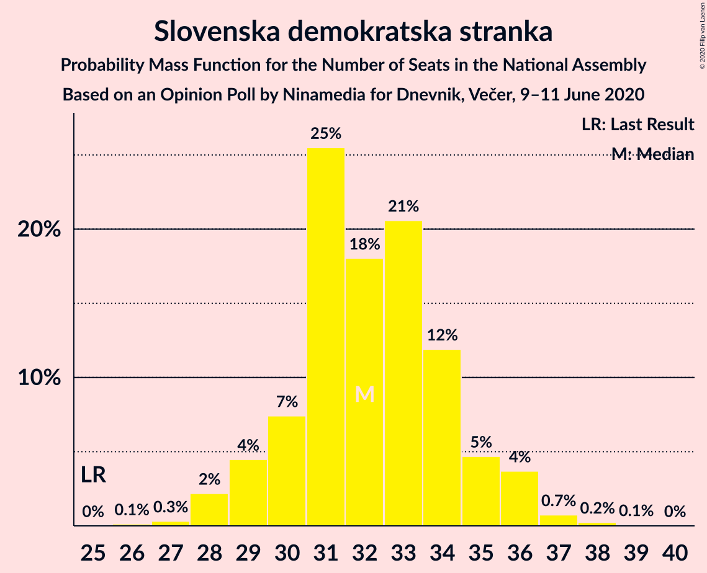
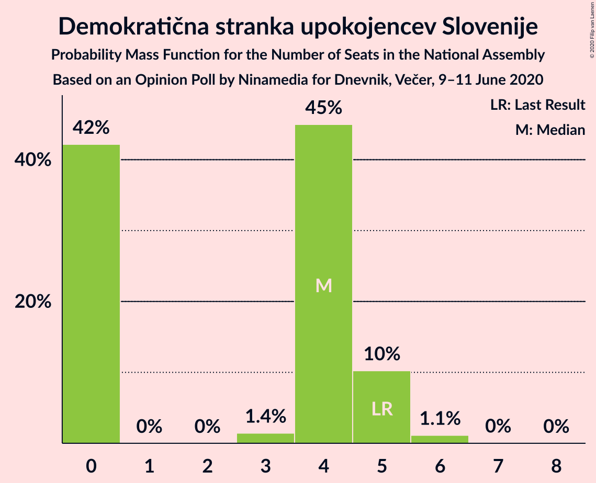
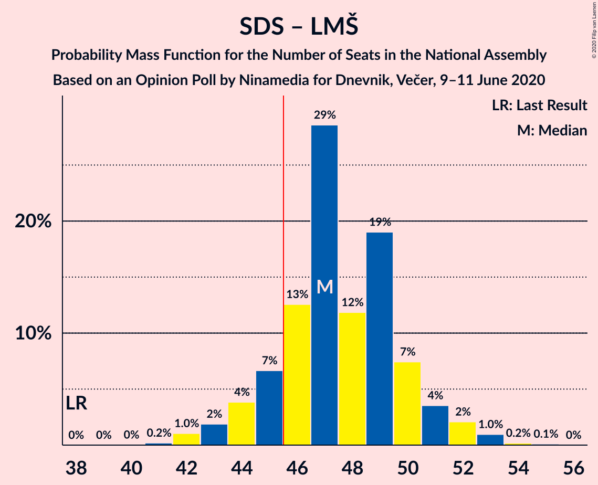
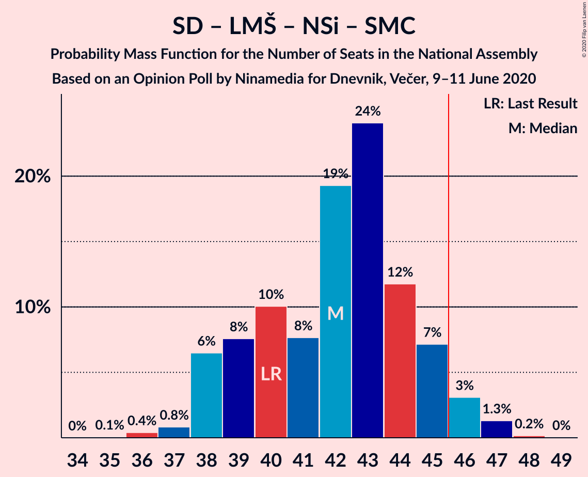
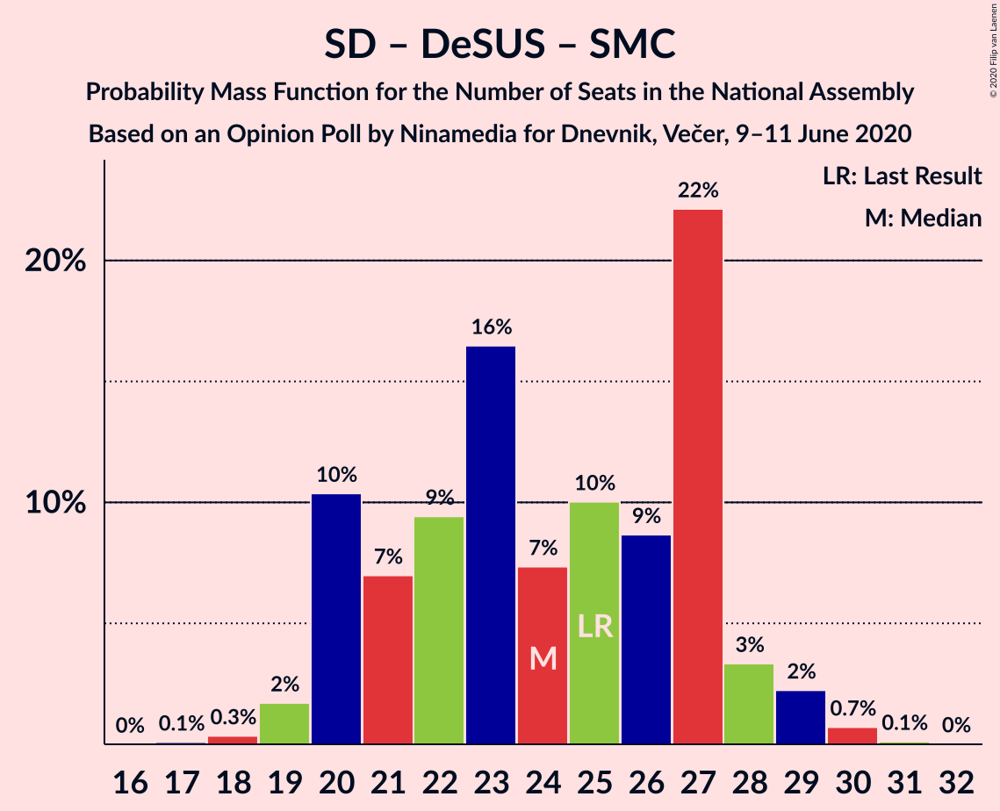

# Opinion Poll by Ninamedia for Dnevnik, Večer, 9–11 June 2020

<a href="#voting-intentions">Voting Intentions</a> | <a href="#seats">Seats</a> | <a href="#coalitions">Coalitions</a> | <a href="#technical-information">Technical Information</a>

## Voting Intentions

### Confidence Intervals

| Party | Last Result | Poll Result | 80% Confidence Interval | 90% Confidence Interval | 95% Confidence Interval | 99% Confidence Interval |
|:-----:|:-----------:|:-----------:|:-----------------------:|:-----------------------:|:-----------------------:|:-----------------------:|
| Slovenska demokratska stranka | 24.9% | 33.1% | 30.9–35.5% |30.3–36.2% |29.8–36.7% |28.7–37.9% |
| Socialni demokrati | 9.9% | 22.3% | 20.4–24.4% |19.8–25.0% |19.4–25.5% |18.5–26.6% |
| Lista Marjana Šarca | 12.6% | 15.9% | 14.2–17.8% |13.7–18.3% |13.3–18.8% |12.6–19.7% |
| Levica | 9.3% | 12.0% | 10.5–13.7% |10.1–14.2% |9.8–14.6% |9.1–15.5% |
| Nova Slovenija–Krščanski demokrati | 7.2% | 5.7% | 4.7–7.0% |4.5–7.4% |4.2–7.7% |3.8–8.4% |
| Demokratična stranka upokojencev Slovenije | 4.9% | 4.1% | 3.3–5.3% |3.1–5.6% |2.9–5.9% |2.5–6.5% |
| Slovenska nacionalna stranka | 4.2% | 2.0% | 1.5–2.9% |1.3–3.1% |1.2–3.3% |1.0–3.8% |
| Stranka Alenke Bratušek | 5.1% | 1.9% | 1.3–2.7% |1.2–2.9% |1.1–3.2% |0.9–3.6% |
| Slovenska ljudska stranka | 2.6% | 1.6% | 1.1–2.4% |1.0–2.6% |0.9–2.8% |0.7–3.2% |
| Stranka modernega centra | 9.7% | 0.4% | 0.2–1.0% |0.2–1.1% |0.2–1.2% |0.1–1.6% |

*Note:* The poll result column reflects the actual value used in the calculations. Published results may vary slightly, and in addition be rounded to fewer digits.

## Seats

### Confidence Intervals

| Party | Last Result | Median | 80% Confidence Interval | 90% Confidence Interval | 95% Confidence Interval | 99% Confidence Interval |
|:-----:|:-----------:|:------:|:-----------------------:|:-----------------------:|:-----------------------:|:-----------------------:|
| <a href="#slovenska-demokratska-stranka">Slovenska demokratska stranka</a> | 25 | 32 | 30–34 |29–35 |28–36 |28–37 |
| <a href="#socialni-demokrati">Socialni demokrati</a> | 10 | 22 | 19–24 |19–25 |18–25 |17–26 |
| <a href="#lista-marjana-šarca">Lista Marjana Šarca</a> | 13 | 15 | 14–17 |13–17 |12–18 |12–19 |
| <a href="#levica">Levica</a> | 9 | 11 | 10–13 |9–14 |9–14 |8–15 |
| <a href="#nova-slovenija–krščanski-demokrati">Nova Slovenija–Krščanski demokrati</a> | 7 | 5 | 4–6 |4–6 |3–7 |0–8 |
| <a href="#demokratična-stranka-upokojencev-slovenije">Demokratična stranka upokojencev Slovenije</a> | 5 | 4 | 0–5 |0–5 |0–5 |0–6 |
| <a href="#slovenska-nacionalna-stranka">Slovenska nacionalna stranka</a> | 4 | 0 | 0 |0 |0 |0 |
| <a href="#stranka-alenke-bratušek">Stranka Alenke Bratušek</a> | 5 | 0 | 0 |0 |0 |0 |
| <a href="#slovenska-ljudska-stranka">Slovenska ljudska stranka</a> | 0 | 0 | 0 |0 |0 |0 |
| <a href="#stranka-modernega-centra">Stranka modernega centra</a> | 10 | 0 | 0 |0 |0 |0 |

### Slovenska demokratska stranka

*For a full overview of the results for this party, see the [Slovenska demokratska stranka](party-slovenskademokratskastranka.html) page.*

| Number of Seats | Probability | Accumulated | Special Marks |
|:---------------:|:-----------:|:-----------:|:-------------:|
| 25 | 0% | 100% | Last Result |
| 26 | 0.1% | 100% |  |
| 27 | 0.3% | 99.9% |  |
| 28 | 2% | 99.5% |  |
| 29 | 4% | 97% |  |
| 30 | 7% | 93% |  |
| 31 | 25% | 85% |  |
| 32 | 18% | 60% | Median |
| 33 | 21% | 42% |  |
| 34 | 12% | 21% |  |
| 35 | 5% | 9% |  |
| 36 | 4% | 5% |  |
| 37 | 0.7% | 1.1% |  |
| 38 | 0.2% | 0.3% |  |
| 39 | 0.1% | 0.1% |  |
| 40 | 0% | 0% |  |

### Socialni demokrati

*For a full overview of the results for this party, see the [Socialni demokrati](party-socialnidemokrati.html) page.*

| Number of Seats | Probability | Accumulated | Special Marks |
|:---------------:|:-----------:|:-----------:|:-------------:|
| 10 | 0% | 100% | Last Result |
| 11 | 0% | 100% |  |
| 12 | 0% | 100% |  |
| 13 | 0% | 100% |  |
| 14 | 0% | 100% |  |
| 15 | 0% | 100% |  |
| 16 | 0.2% | 100% |  |
| 17 | 0.8% | 99.8% |  |
| 18 | 2% | 99.0% |  |
| 19 | 10% | 97% |  |
| 20 | 16% | 87% |  |
| 21 | 14% | 71% |  |
| 22 | 15% | 57% | Median |
| 23 | 30% | 42% |  |
| 24 | 5% | 11% |  |
| 25 | 5% | 6% |  |
| 26 | 0.8% | 1.2% |  |
| 27 | 0.4% | 0.4% |  |
| 28 | 0% | 0.1% |  |
| 29 | 0% | 0% |  |

### Lista Marjana Šarca

*For a full overview of the results for this party, see the [Lista Marjana Šarca](party-listamarjanašarca.html) page.*

| Number of Seats | Probability | Accumulated | Special Marks |
|:---------------:|:-----------:|:-----------:|:-------------:|
| 11 | 0.2% | 100% |  |
| 12 | 2% | 99.8% |  |
| 13 | 6% | 97% | Last Result |
| 14 | 11% | 91% |  |
| 15 | 31% | 80% | Median |
| 16 | 35% | 49% |  |
| 17 | 9% | 14% |  |
| 18 | 3% | 5% |  |
| 19 | 2% | 2% |  |
| 20 | 0.1% | 0.2% |  |
| 21 | 0.1% | 0.1% |  |
| 22 | 0% | 0% |  |

### Levica

*For a full overview of the results for this party, see the [Levica](party-levica.html) page.*

| Number of Seats | Probability | Accumulated | Special Marks |
|:---------------:|:-----------:|:-----------:|:-------------:|
| 8 | 0.6% | 100% |  |
| 9 | 8% | 99.4% | Last Result |
| 10 | 28% | 92% |  |
| 11 | 19% | 64% | Median |
| 12 | 18% | 45% |  |
| 13 | 17% | 27% |  |
| 14 | 8% | 9% |  |
| 15 | 1.1% | 1.3% |  |
| 16 | 0.2% | 0.2% |  |
| 17 | 0% | 0% |  |

### Nova Slovenija–Krščanski demokrati

*For a full overview of the results for this party, see the [Nova Slovenija–Krščanski demokrati](party-novaslovenija–krščanskidemokrati.html) page.*

| Number of Seats | Probability | Accumulated | Special Marks |
|:---------------:|:-----------:|:-----------:|:-------------:|
| 0 | 2% | 100% |  |
| 1 | 0% | 98% |  |
| 2 | 0% | 98% |  |
| 3 | 0.8% | 98% |  |
| 4 | 38% | 97% |  |
| 5 | 23% | 60% | Median |
| 6 | 32% | 37% |  |
| 7 | 4% | 5% | Last Result |
| 8 | 0.9% | 1.0% |  |
| 9 | 0% | 0% |  |

### Demokratična stranka upokojencev Slovenije

*For a full overview of the results for this party, see the [Demokratična stranka upokojencev Slovenije](party-demokratičnastrankaupokojencevslovenije.html) page.*

| Number of Seats | Probability | Accumulated | Special Marks |
|:---------------:|:-----------:|:-----------:|:-------------:|
| 0 | 42% | 100% |  |
| 1 | 0% | 58% |  |
| 2 | 0% | 58% |  |
| 3 | 1.4% | 58% |  |
| 4 | 45% | 56% | Median |
| 5 | 10% | 11% | Last Result |
| 6 | 1.1% | 1.2% |  |
| 7 | 0% | 0.1% |  |
| 8 | 0% | 0% |  |

### Slovenska nacionalna stranka

*For a full overview of the results for this party, see the [Slovenska nacionalna stranka](party-slovenskanacionalnastranka.html) page.*

| Number of Seats | Probability | Accumulated | Special Marks |
|:---------------:|:-----------:|:-----------:|:-------------:|
| 0 | 99.8% | 100% | Median |
| 1 | 0% | 0.2% |  |
| 2 | 0% | 0.2% |  |
| 3 | 0% | 0.2% |  |
| 4 | 0.1% | 0.1% | Last Result |
| 5 | 0% | 0% |  |

### Stranka Alenke Bratušek

*For a full overview of the results for this party, see the [Stranka Alenke Bratušek](party-strankaalenkebratušek.html) page.*

| Number of Seats | Probability | Accumulated | Special Marks |
|:---------------:|:-----------:|:-----------:|:-------------:|
| 0 | 99.9% | 100% | Median |
| 1 | 0% | 0.1% |  |
| 2 | 0% | 0.1% |  |
| 3 | 0% | 0.1% |  |
| 4 | 0.1% | 0.1% |  |
| 5 | 0% | 0% | Last Result |

### Slovenska ljudska stranka

*For a full overview of the results for this party, see the [Slovenska ljudska stranka](party-slovenskaljudskastranka.html) page.*

| Number of Seats | Probability | Accumulated | Special Marks |
|:---------------:|:-----------:|:-----------:|:-------------:|
| 0 | 100% | 100% | Last Result, Median |

### Stranka modernega centra

*For a full overview of the results for this party, see the [Stranka modernega centra](party-strankamodernegacentra.html) page.*

| Number of Seats | Probability | Accumulated | Special Marks |
|:---------------:|:-----------:|:-----------:|:-------------:|
| 0 | 100% | 100% | Median |
| 1 | 0% | 0% |  |
| 2 | 0% | 0% |  |
| 3 | 0% | 0% |  |
| 4 | 0% | 0% |  |
| 5 | 0% | 0% |  |
| 6 | 0% | 0% |  |
| 7 | 0% | 0% |  |
| 8 | 0% | 0% |  |
| 9 | 0% | 0% |  |
| 10 | 0% | 0% | Last Result |

## Coalitions

### Confidence Intervals

| Coalition | Last Result | Median | Majority? | 80% Confidence Interval | 90% Confidence Interval | 95% Confidence Interval | 99% Confidence Interval |
|:---------:|:-----------:|:------:|:---------:|:-----------------------:|:-----------------------:|:-----------------------:|:-----------------------:|
| Slovenska demokratska stranka – Lista Marjana Šarca – Demokratična stranka upokojencev Slovenije | 43 | 50 | 98.7% | 47–53 | 47–53 | 46–54 | 45–55 |
| Slovenska demokratska stranka – Lista Marjana Šarca | 38 | 47 | 86% | 45–50 | 44–51 | 43–52 | 42–53 |
| Socialni demokrati – Lista Marjana Šarca – Nova Slovenija–Krščanski demokrati – Demokratična stranka upokojencev Slovenije | 35 | 44 | 38% | 42–47 | 41–48 | 40–49 | 38–50 |
| Socialni demokrati – Lista Marjana Šarca – Nova Slovenija–Krščanski demokrati – Demokratična stranka upokojencev Slovenije – Stranka Alenke Bratušek – Stranka modernega centra | 50 | 44 | 38% | 42–47 | 41–48 | 40–49 | 38–50 |
| Socialni demokrati – Lista Marjana Šarca – Nova Slovenija–Krščanski demokrati – Demokratična stranka upokojencev Slovenije – Stranka modernega centra | 45 | 44 | 38% | 42–47 | 41–48 | 40–49 | 38–50 |
| Socialni demokrati – Lista Marjana Šarca – Nova Slovenija–Krščanski demokrati | 30 | 42 | 5% | 39–45 | 38–45 | 38–46 | 37–47 |
| Socialni demokrati – Lista Marjana Šarca – Nova Slovenija–Krščanski demokrati – Stranka modernega centra | 40 | 42 | 5% | 39–45 | 38–45 | 38–46 | 37–47 |
| Socialni demokrati – Lista Marjana Šarca – Demokratična stranka upokojencev Slovenije | 28 | 39 | 0.2% | 36–43 | 35–43 | 35–44 | 33–45 |
| Socialni demokrati – Lista Marjana Šarca – Demokratična stranka upokojencev Slovenije – Stranka Alenke Bratušek – Stranka modernega centra | 43 | 39 | 0.2% | 36–43 | 35–43 | 35–44 | 33–45 |
| Socialni demokrati – Lista Marjana Šarca – Demokratična stranka upokojencev Slovenije – Stranka modernega centra | 38 | 39 | 0.2% | 36–43 | 35–43 | 35–44 | 33–45 |
| Socialni demokrati – Lista Marjana Šarca | 23 | 37 | 0% | 34–40 | 34–40 | 33–41 | 32–42 |
| Socialni demokrati – Lista Marjana Šarca – Stranka modernega centra | 33 | 37 | 0% | 34–40 | 34–40 | 33–41 | 32–42 |
| Socialni demokrati – Demokratična stranka upokojencev Slovenije – Stranka modernega centra | 25 | 24 | 0% | 20–27 | 20–28 | 20–29 | 19–30 |

### Slovenska demokratska stranka – Lista Marjana Šarca – Demokratična stranka upokojencev Slovenije

| Number of Seats | Probability | Accumulated | Special Marks |
|:---------------:|:-----------:|:-----------:|:-------------:|
| 43 | 0.1% | 100% | Last Result |
| 44 | 0.2% | 99.9% |  |
| 45 | 1.0% | 99.7% |  |
| 46 | 3% | 98.7% | Majority |
| 47 | 10% | 96% |  |
| 48 | 10% | 86% |  |
| 49 | 17% | 76% |  |
| 50 | 15% | 59% |  |
| 51 | 26% | 45% | Median |
| 52 | 6% | 18% |  |
| 53 | 9% | 12% |  |
| 54 | 2% | 3% |  |
| 55 | 0.6% | 0.9% |  |
| 56 | 0.2% | 0.3% |  |
| 57 | 0.1% | 0.1% |  |
| 58 | 0% | 0% |  |

### Slovenska demokratska stranka – Lista Marjana Šarca

| Number of Seats | Probability | Accumulated | Special Marks |
|:---------------:|:-----------:|:-----------:|:-------------:|
| 38 | 0% | 100% | Last Result |
| 39 | 0% | 100% |  |
| 40 | 0% | 100% |  |
| 41 | 0.2% | 100% |  |
| 42 | 1.0% | 99.8% |  |
| 43 | 2% | 98.7% |  |
| 44 | 4% | 97% |  |
| 45 | 7% | 93% |  |
| 46 | 13% | 86% | Majority |
| 47 | 29% | 74% | Median |
| 48 | 12% | 45% |  |
| 49 | 19% | 33% |  |
| 50 | 7% | 14% |  |
| 51 | 4% | 7% |  |
| 52 | 2% | 3% |  |
| 53 | 1.0% | 1.3% |  |
| 54 | 0.2% | 0.3% |  |
| 55 | 0.1% | 0.1% |  |
| 56 | 0% | 0% |  |

### Socialni demokrati – Lista Marjana Šarca – Nova Slovenija–Krščanski demokrati – Demokratična stranka upokojencev Slovenije

| Number of Seats | Probability | Accumulated | Special Marks |
|:---------------:|:-----------:|:-----------:|:-------------:|
| 35 | 0% | 100% | Last Result |
| 36 | 0% | 100% |  |
| 37 | 0% | 100% |  |
| 38 | 0.6% | 100% |  |
| 39 | 1.5% | 99.4% |  |
| 40 | 2% | 98% |  |
| 41 | 3% | 95% |  |
| 42 | 18% | 92% |  |
| 43 | 9% | 74% |  |
| 44 | 18% | 65% |  |
| 45 | 9% | 47% |  |
| 46 | 10% | 38% | Median, Majority |
| 47 | 22% | 28% |  |
| 48 | 3% | 6% |  |
| 49 | 2% | 3% |  |
| 50 | 1.0% | 1.1% |  |
| 51 | 0.1% | 0.1% |  |
| 52 | 0% | 0% |  |

### Socialni demokrati – Lista Marjana Šarca – Nova Slovenija–Krščanski demokrati – Demokratična stranka upokojencev Slovenije – Stranka Alenke Bratušek – Stranka modernega centra

| Number of Seats | Probability | Accumulated | Special Marks |
|:---------------:|:-----------:|:-----------:|:-------------:|
| 38 | 0.5% | 100% |  |
| 39 | 1.5% | 99.4% |  |
| 40 | 2% | 98% |  |
| 41 | 3% | 95% |  |
| 42 | 18% | 92% |  |
| 43 | 9% | 74% |  |
| 44 | 18% | 65% |  |
| 45 | 9% | 48% |  |
| 46 | 10% | 38% | Median, Majority |
| 47 | 22% | 28% |  |
| 48 | 3% | 6% |  |
| 49 | 2% | 3% |  |
| 50 | 1.0% | 1.1% | Last Result |
| 51 | 0.1% | 0.2% |  |
| 52 | 0% | 0% |  |

### Socialni demokrati – Lista Marjana Šarca – Nova Slovenija–Krščanski demokrati – Demokratična stranka upokojencev Slovenije – Stranka modernega centra

| Number of Seats | Probability | Accumulated | Special Marks |
|:---------------:|:-----------:|:-----------:|:-------------:|
| 38 | 0.6% | 100% |  |
| 39 | 1.5% | 99.4% |  |
| 40 | 2% | 98% |  |
| 41 | 3% | 95% |  |
| 42 | 18% | 92% |  |
| 43 | 9% | 74% |  |
| 44 | 18% | 65% |  |
| 45 | 9% | 47% | Last Result |
| 46 | 10% | 38% | Median, Majority |
| 47 | 22% | 28% |  |
| 48 | 3% | 6% |  |
| 49 | 2% | 3% |  |
| 50 | 1.0% | 1.1% |  |
| 51 | 0.1% | 0.1% |  |
| 52 | 0% | 0% |  |

### Socialni demokrati – Lista Marjana Šarca – Nova Slovenija–Krščanski demokrati

| Number of Seats | Probability | Accumulated | Special Marks |
|:---------------:|:-----------:|:-----------:|:-------------:|
| 30 | 0% | 100% | Last Result |
| 31 | 0% | 100% |  |
| 32 | 0% | 100% |  |
| 33 | 0% | 100% |  |
| 34 | 0% | 100% |  |
| 35 | 0.1% | 100% |  |
| 36 | 0.4% | 99.9% |  |
| 37 | 0.8% | 99.5% |  |
| 38 | 6% | 98.7% |  |
| 39 | 8% | 92% |  |
| 40 | 10% | 85% |  |
| 41 | 8% | 75% |  |
| 42 | 19% | 67% | Median |
| 43 | 24% | 48% |  |
| 44 | 12% | 24% |  |
| 45 | 7% | 12% |  |
| 46 | 3% | 5% | Majority |
| 47 | 1.3% | 2% |  |
| 48 | 0.2% | 0.2% |  |
| 49 | 0% | 0% |  |

### Socialni demokrati – Lista Marjana Šarca – Nova Slovenija–Krščanski demokrati – Stranka modernega centra

| Number of Seats | Probability | Accumulated | Special Marks |
|:---------------:|:-----------:|:-----------:|:-------------:|
| 35 | 0.1% | 100% |  |
| 36 | 0.4% | 99.9% |  |
| 37 | 0.8% | 99.5% |  |
| 38 | 6% | 98.7% |  |
| 39 | 8% | 92% |  |
| 40 | 10% | 85% | Last Result |
| 41 | 8% | 75% |  |
| 42 | 19% | 67% | Median |
| 43 | 24% | 48% |  |
| 44 | 12% | 24% |  |
| 45 | 7% | 12% |  |
| 46 | 3% | 5% | Majority |
| 47 | 1.3% | 2% |  |
| 48 | 0.2% | 0.2% |  |
| 49 | 0% | 0% |  |

### Socialni demokrati – Lista Marjana Šarca – Demokratična stranka upokojencev Slovenije

| Number of Seats | Probability | Accumulated | Special Marks |
|:---------------:|:-----------:|:-----------:|:-------------:|
| 28 | 0% | 100% | Last Result |
| 29 | 0% | 100% |  |
| 30 | 0% | 100% |  |
| 31 | 0% | 100% |  |
| 32 | 0% | 100% |  |
| 33 | 0.5% | 99.9% |  |
| 34 | 1.1% | 99.5% |  |
| 35 | 5% | 98% |  |
| 36 | 9% | 94% |  |
| 37 | 9% | 84% |  |
| 38 | 17% | 75% |  |
| 39 | 9% | 58% |  |
| 40 | 14% | 50% |  |
| 41 | 5% | 36% | Median |
| 42 | 8% | 31% |  |
| 43 | 19% | 23% |  |
| 44 | 3% | 4% |  |
| 45 | 0.8% | 0.9% |  |
| 46 | 0.2% | 0.2% | Majority |
| 47 | 0% | 0% |  |

### Socialni demokrati – Lista Marjana Šarca – Demokratična stranka upokojencev Slovenije – Stranka Alenke Bratušek – Stranka modernega centra

| Number of Seats | Probability | Accumulated | Special Marks |
|:---------------:|:-----------:|:-----------:|:-------------:|
| 32 | 0% | 100% |  |
| 33 | 0.5% | 99.9% |  |
| 34 | 1.1% | 99.5% |  |
| 35 | 5% | 98% |  |
| 36 | 9% | 94% |  |
| 37 | 9% | 84% |  |
| 38 | 17% | 75% |  |
| 39 | 9% | 58% |  |
| 40 | 14% | 50% |  |
| 41 | 5% | 36% | Median |
| 42 | 8% | 31% |  |
| 43 | 19% | 23% | Last Result |
| 44 | 3% | 4% |  |
| 45 | 0.8% | 0.9% |  |
| 46 | 0.2% | 0.2% | Majority |
| 47 | 0% | 0% |  |

### Socialni demokrati – Lista Marjana Šarca – Demokratična stranka upokojencev Slovenije – Stranka modernega centra

| Number of Seats | Probability | Accumulated | Special Marks |
|:---------------:|:-----------:|:-----------:|:-------------:|
| 32 | 0% | 100% |  |
| 33 | 0.5% | 99.9% |  |
| 34 | 1.1% | 99.5% |  |
| 35 | 5% | 98% |  |
| 36 | 9% | 94% |  |
| 37 | 9% | 84% |  |
| 38 | 17% | 75% | Last Result |
| 39 | 9% | 58% |  |
| 40 | 14% | 50% |  |
| 41 | 5% | 36% | Median |
| 42 | 8% | 31% |  |
| 43 | 19% | 23% |  |
| 44 | 3% | 4% |  |
| 45 | 0.8% | 0.9% |  |
| 46 | 0.2% | 0.2% | Majority |
| 47 | 0% | 0% |  |

### Socialni demokrati – Lista Marjana Šarca

| Number of Seats | Probability | Accumulated | Special Marks |
|:---------------:|:-----------:|:-----------:|:-------------:|
| 23 | 0% | 100% | Last Result |
| 24 | 0% | 100% |  |
| 25 | 0% | 100% |  |
| 26 | 0% | 100% |  |
| 27 | 0% | 100% |  |
| 28 | 0% | 100% |  |
| 29 | 0% | 100% |  |
| 30 | 0.1% | 100% |  |
| 31 | 0.3% | 99.9% |  |
| 32 | 1.1% | 99.6% |  |
| 33 | 2% | 98% |  |
| 34 | 12% | 96% |  |
| 35 | 8% | 85% |  |
| 36 | 16% | 76% |  |
| 37 | 13% | 60% | Median |
| 38 | 14% | 47% |  |
| 39 | 22% | 33% |  |
| 40 | 8% | 11% |  |
| 41 | 2% | 3% |  |
| 42 | 0.8% | 1.3% |  |
| 43 | 0.4% | 0.4% |  |
| 44 | 0.1% | 0.1% |  |
| 45 | 0% | 0% |  |

### Socialni demokrati – Lista Marjana Šarca – Stranka modernega centra

| Number of Seats | Probability | Accumulated | Special Marks |
|:---------------:|:-----------:|:-----------:|:-------------:|
| 30 | 0.1% | 100% |  |
| 31 | 0.3% | 99.9% |  |
| 32 | 1.1% | 99.6% |  |
| 33 | 2% | 98% | Last Result |
| 34 | 12% | 96% |  |
| 35 | 8% | 85% |  |
| 36 | 16% | 76% |  |
| 37 | 13% | 60% | Median |
| 38 | 14% | 47% |  |
| 39 | 22% | 33% |  |
| 40 | 8% | 11% |  |
| 41 | 2% | 3% |  |
| 42 | 0.8% | 1.3% |  |
| 43 | 0.4% | 0.4% |  |
| 44 | 0.1% | 0.1% |  |
| 45 | 0% | 0% |  |

### Socialni demokrati – Demokratična stranka upokojencev Slovenije – Stranka modernega centra

| Number of Seats | Probability | Accumulated | Special Marks |
|:---------------:|:-----------:|:-----------:|:-------------:|
| 17 | 0.1% | 100% |  |
| 18 | 0.3% | 99.9% |  |
| 19 | 2% | 99.6% |  |
| 20 | 10% | 98% |  |
| 21 | 7% | 87% |  |
| 22 | 9% | 80% |  |
| 23 | 16% | 71% |  |
| 24 | 7% | 55% |  |
| 25 | 10% | 47% | Last Result |
| 26 | 9% | 37% | Median |
| 27 | 22% | 29% |  |
| 28 | 3% | 6% |  |
| 29 | 2% | 3% |  |
| 30 | 0.7% | 0.8% |  |
| 31 | 0.1% | 0.1% |  |
| 32 | 0% | 0% |  |

## Technical Information

### Opinion Poll

+ **Polling firm:** Ninamedia
+ **Commissioner(s):** Dnevnik, Večer
+ **Fieldwork period:** 9–11 June 2020

### Calculations

+ **Sample size:** 700
+ **Simulations done:** 1,048,576
+ **Error estimate:** 3.78%

