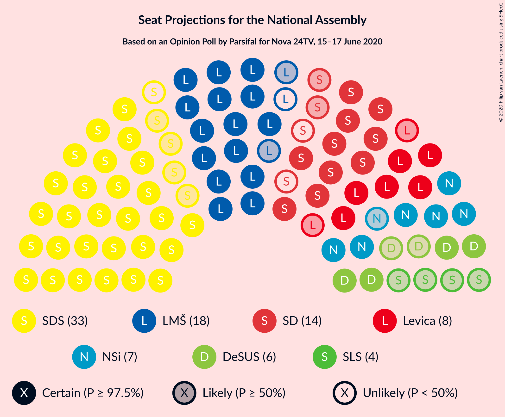
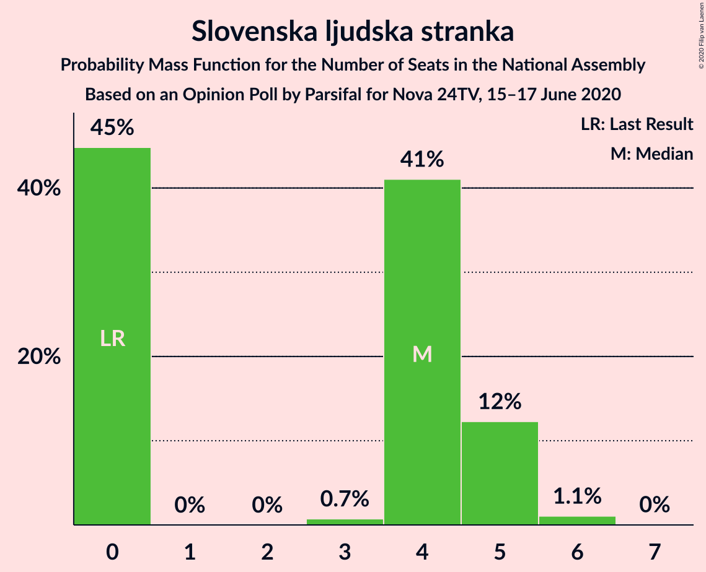
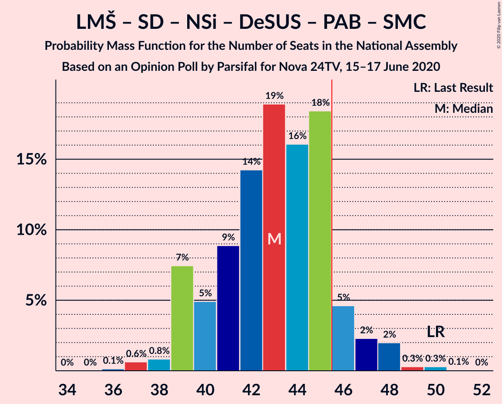

# Opinion Poll by Parsifal for Nova 24TV, 15–17 June 2020

<a href="#voting-intentions">Voting Intentions</a> | <a href="#seats">Seats</a> | <a href="#coalitions">Coalitions</a> | <a href="#technical-information">Technical Information</a>

## Voting Intentions

### Confidence Intervals

| Party | Last Result | Poll Result | 80% Confidence Interval | 90% Confidence Interval | 95% Confidence Interval | 99% Confidence Interval |
|:-----:|:-----------:|:-----------:|:-----------------------:|:-----------------------:|:-----------------------:|:-----------------------:|
| Slovenska demokratska stranka | 24.9% | 32.8% | 30.6–35.1% |30.0–35.7% |29.4–36.3% |28.4–37.4% |
| Lista Marjana Šarca | 12.6% | 18.0% | 16.2–19.9% |15.8–20.5% |15.3–21.0% |14.6–21.9% |
| Socialni demokrati | 9.9% | 13.1% | 11.6–14.9% |11.2–15.4% |10.9–15.8% |10.2–16.7% |
| Levica | 9.3% | 8.4% | 7.2–9.9% |6.9–10.3% |6.6–10.7% |6.1–11.4% |
| Nova Slovenija–Krščanski demokrati | 7.2% | 7.7% | 6.6–9.2% |6.3–9.6% |6.0–9.9% |5.5–10.7% |
| Demokratična stranka upokojencev Slovenije | 4.9% | 5.9% | 5.0–7.2% |4.7–7.6% |4.5–7.9% |4.0–8.6% |
| Slovenska ljudska stranka | 2.6% | 4.1% | 3.3–5.3% |3.1–5.6% |2.9–5.9% |2.6–6.4% |
| Stranka Alenke Bratušek | 5.1% | 2.2% | 1.6–3.1% |1.5–3.3% |1.4–3.6% |1.1–4.0% |
| Slovenska nacionalna stranka | 4.2% | 1.9% | 1.4–2.8% |1.3–3.0% |1.2–3.2% |0.9–3.7% |
| Stranka modernega centra | 9.7% | 1.7% | 1.2–2.5% |1.1–2.7% |0.9–2.9% |0.8–3.3% |

*Note:* The poll result column reflects the actual value used in the calculations. Published results may vary slightly, and in addition be rounded to fewer digits.

## Seats

### Confidence Intervals

| Party | Last Result | Median | 80% Confidence Interval | 90% Confidence Interval | 95% Confidence Interval | 99% Confidence Interval |
|:-----:|:-----------:|:------:|:-----------------------:|:-----------------------:|:-----------------------:|:-----------------------:|
| <a href="#slovenska-demokratska-stranka">Slovenska demokratska stranka</a> | 25 | 32 | 29–35 |29–36 |28–37 |28–37 |
| <a href="#lista-marjana-šarca">Lista Marjana Šarca</a> | 13 | 17 | 15–19 |15–20 |15–20 |14–22 |
| <a href="#socialni-demokrati">Socialni demokrati</a> | 10 | 12 | 11–14 |11–15 |10–15 |10–16 |
| <a href="#levica">Levica</a> | 9 | 8 | 7–10 |6–10 |6–10 |5–11 |
| <a href="#nova-slovenija–krščanski-demokrati">Nova Slovenija–Krščanski demokrati</a> | 7 | 7 | 6–9 |6–9 |6–9 |5–10 |
| <a href="#demokratična-stranka-upokojencev-slovenije">Demokratična stranka upokojencev Slovenije</a> | 5 | 6 | 5–7 |4–7 |4–7 |0–8 |
| <a href="#slovenska-ljudska-stranka">Slovenska ljudska stranka</a> | 0 | 4 | 0–5 |0–5 |0–5 |0–6 |
| <a href="#stranka-alenke-bratušek">Stranka Alenke Bratušek</a> | 5 | 0 | 0 |0 |0 |0 |
| <a href="#slovenska-nacionalna-stranka">Slovenska nacionalna stranka</a> | 4 | 0 | 0 |0 |0 |0 |
| <a href="#stranka-modernega-centra">Stranka modernega centra</a> | 10 | 0 | 0 |0 |0 |0 |

### Slovenska demokratska stranka

*For a full overview of the results for this party, see the [Slovenska demokratska stranka](party-slovenskademokratskastranka.html) page.*

| Number of Seats | Probability | Accumulated | Special Marks |
|:---------------:|:-----------:|:-----------:|:-------------:|
| 25 | 0% | 100% | Last Result |
| 26 | 0.1% | 100% |  |
| 27 | 0.4% | 99.9% |  |
| 28 | 4% | 99.5% |  |
| 29 | 7% | 96% |  |
| 30 | 11% | 89% |  |
| 31 | 16% | 78% |  |
| 32 | 20% | 62% | Median |
| 33 | 18% | 42% |  |
| 34 | 5% | 25% |  |
| 35 | 10% | 19% |  |
| 36 | 6% | 9% |  |
| 37 | 2% | 3% |  |
| 38 | 0.2% | 0.3% |  |
| 39 | 0.1% | 0.1% |  |
| 40 | 0% | 0% |  |

### Lista Marjana Šarca

*For a full overview of the results for this party, see the [Lista Marjana Šarca](party-listamarjanašarca.html) page.*

| Number of Seats | Probability | Accumulated | Special Marks |
|:---------------:|:-----------:|:-----------:|:-------------:|
| 13 | 0.2% | 100% | Last Result |
| 14 | 1.1% | 99.8% |  |
| 15 | 10% | 98.7% |  |
| 16 | 15% | 89% |  |
| 17 | 24% | 73% | Median |
| 18 | 24% | 49% |  |
| 19 | 17% | 25% |  |
| 20 | 5% | 8% |  |
| 21 | 1.3% | 2% |  |
| 22 | 0.8% | 0.9% |  |
| 23 | 0.1% | 0.1% |  |
| 24 | 0% | 0% |  |

### Socialni demokrati

*For a full overview of the results for this party, see the [Socialni demokrati](party-socialnidemokrati.html) page.*

| Number of Seats | Probability | Accumulated | Special Marks |
|:---------------:|:-----------:|:-----------:|:-------------:|
| 9 | 0.2% | 100% |  |
| 10 | 3% | 99.8% | Last Result |
| 11 | 22% | 97% |  |
| 12 | 26% | 75% | Median |
| 13 | 19% | 49% |  |
| 14 | 24% | 30% |  |
| 15 | 5% | 6% |  |
| 16 | 1.4% | 2% |  |
| 17 | 0.2% | 0.2% |  |
| 18 | 0% | 0% |  |

### Levica

*For a full overview of the results for this party, see the [Levica](party-levica.html) page.*

| Number of Seats | Probability | Accumulated | Special Marks |
|:---------------:|:-----------:|:-----------:|:-------------:|
| 5 | 0.6% | 100% |  |
| 6 | 6% | 99.4% |  |
| 7 | 30% | 93% |  |
| 8 | 37% | 64% | Median |
| 9 | 16% | 27% | Last Result |
| 10 | 11% | 12% |  |
| 11 | 0.5% | 0.6% |  |
| 12 | 0.1% | 0.1% |  |
| 13 | 0% | 0% |  |

### Nova Slovenija–Krščanski demokrati

*For a full overview of the results for this party, see the [Nova Slovenija–Krščanski demokrati](party-novaslovenija–krščanskidemokrati.html) page.*

| Number of Seats | Probability | Accumulated | Special Marks |
|:---------------:|:-----------:|:-----------:|:-------------:|
| 4 | 0.1% | 100% |  |
| 5 | 2% | 99.9% |  |
| 6 | 14% | 98% |  |
| 7 | 41% | 85% | Last Result, Median |
| 8 | 33% | 43% |  |
| 9 | 8% | 10% |  |
| 10 | 2% | 2% |  |
| 11 | 0.2% | 0.3% |  |
| 12 | 0% | 0% |  |

### Demokratična stranka upokojencev Slovenije

*For a full overview of the results for this party, see the [Demokratična stranka upokojencev Slovenije](party-demokratičnastrankaupokojencevslovenije.html) page.*

| Number of Seats | Probability | Accumulated | Special Marks |
|:---------------:|:-----------:|:-----------:|:-------------:|
| 0 | 0.6% | 100% |  |
| 1 | 0% | 99.4% |  |
| 2 | 0% | 99.4% |  |
| 3 | 0.1% | 99.4% |  |
| 4 | 9% | 99.4% |  |
| 5 | 34% | 90% | Last Result |
| 6 | 41% | 56% | Median |
| 7 | 13% | 15% |  |
| 8 | 2% | 2% |  |
| 9 | 0.1% | 0.1% |  |
| 10 | 0% | 0% |  |

### Slovenska ljudska stranka

*For a full overview of the results for this party, see the [Slovenska ljudska stranka](party-slovenskaljudskastranka.html) page.*

| Number of Seats | Probability | Accumulated | Special Marks |
|:---------------:|:-----------:|:-----------:|:-------------:|
| 0 | 45% | 100% | Last Result |
| 1 | 0% | 55% |  |
| 2 | 0% | 55% |  |
| 3 | 0.7% | 55% |  |
| 4 | 41% | 54% | Median |
| 5 | 12% | 13% |  |
| 6 | 1.1% | 1.1% |  |
| 7 | 0% | 0% |  |

### Stranka Alenke Bratušek

*For a full overview of the results for this party, see the [Stranka Alenke Bratušek](party-strankaalenkebratušek.html) page.*

| Number of Seats | Probability | Accumulated | Special Marks |
|:---------------:|:-----------:|:-----------:|:-------------:|
| 0 | 99.7% | 100% | Median |
| 1 | 0% | 0.3% |  |
| 2 | 0% | 0.3% |  |
| 3 | 0.1% | 0.3% |  |
| 4 | 0.2% | 0.2% |  |
| 5 | 0% | 0% | Last Result |

### Slovenska nacionalna stranka

*For a full overview of the results for this party, see the [Slovenska nacionalna stranka](party-slovenskanacionalnastranka.html) page.*

| Number of Seats | Probability | Accumulated | Special Marks |
|:---------------:|:-----------:|:-----------:|:-------------:|
| 0 | 99.9% | 100% | Median |
| 1 | 0% | 0.1% |  |
| 2 | 0% | 0.1% |  |
| 3 | 0% | 0.1% |  |
| 4 | 0.1% | 0.1% | Last Result |
| 5 | 0% | 0% |  |

### Stranka modernega centra

*For a full overview of the results for this party, see the [Stranka modernega centra](party-strankamodernegacentra.html) page.*

| Number of Seats | Probability | Accumulated | Special Marks |
|:---------------:|:-----------:|:-----------:|:-------------:|
| 0 | 100% | 100% | Median |
| 1 | 0% | 0% |  |
| 2 | 0% | 0% |  |
| 3 | 0% | 0% |  |
| 4 | 0% | 0% |  |
| 5 | 0% | 0% |  |
| 6 | 0% | 0% |  |
| 7 | 0% | 0% |  |
| 8 | 0% | 0% |  |
| 9 | 0% | 0% |  |
| 10 | 0% | 0% | Last Result |

## Coalitions

### Confidence Intervals

| Coalition | Last Result | Median | Majority? | 80% Confidence Interval | 90% Confidence Interval | 95% Confidence Interval | 99% Confidence Interval |
|:---------:|:-----------:|:------:|:---------:|:-----------------------:|:-----------------------:|:-----------------------:|:-----------------------:|
| Slovenska demokratska stranka – Lista Marjana Šarca – Demokratična stranka upokojencev Slovenije | 43 | 55 | 100% | 52–58 | 51–59 | 51–59 | 49–63 |
| Slovenska demokratska stranka – Lista Marjana Šarca | 38 | 49 | 97% | 47–53 | 46–54 | 45–54 | 44–58 |
| Lista Marjana Šarca – Socialni demokrati – Nova Slovenija–Krščanski demokrati – Demokratična stranka upokojencev Slovenije | 35 | 43 | 9% | 40–45 | 39–46 | 39–48 | 37–49 |
| Lista Marjana Šarca – Socialni demokrati – Nova Slovenija–Krščanski demokrati – Demokratična stranka upokojencev Slovenije – Stranka Alenke Bratušek – Stranka modernega centra | 50 | 43 | 10% | 40–45 | 39–46 | 39–48 | 37–49 |
| Lista Marjana Šarca – Socialni demokrati – Nova Slovenija–Krščanski demokrati – Demokratična stranka upokojencev Slovenije – Stranka modernega centra | 45 | 43 | 9% | 40–45 | 39–46 | 39–48 | 37–49 |
| Lista Marjana Šarca – Socialni demokrati – Nova Slovenija–Krščanski demokrati | 30 | 38 | 0% | 34–40 | 33–41 | 33–42 | 32–43 |
| Lista Marjana Šarca – Socialni demokrati – Nova Slovenija–Krščanski demokrati – Stranka modernega centra | 40 | 38 | 0% | 34–40 | 33–41 | 33–42 | 32–43 |
| Lista Marjana Šarca – Socialni demokrati – Demokratična stranka upokojencev Slovenije | 28 | 36 | 0% | 32–38 | 32–39 | 32–40 | 31–41 |
| Lista Marjana Šarca – Socialni demokrati – Demokratična stranka upokojencev Slovenije – Stranka Alenke Bratušek – Stranka modernega centra | 43 | 36 | 0% | 32–38 | 32–39 | 32–40 | 31–41 |
| Lista Marjana Šarca – Socialni demokrati – Demokratična stranka upokojencev Slovenije – Stranka modernega centra | 38 | 36 | 0% | 32–38 | 32–39 | 32–40 | 31–41 |
| Lista Marjana Šarca – Socialni demokrati | 23 | 30 | 0% | 27–32 | 26–33 | 26–34 | 26–35 |
| Lista Marjana Šarca – Socialni demokrati – Stranka modernega centra | 33 | 30 | 0% | 27–32 | 26–33 | 26–34 | 26–35 |
| Socialni demokrati – Demokratična stranka upokojencev Slovenije – Stranka modernega centra | 25 | 18 | 0% | 16–20 | 16–21 | 15–21 | 14–22 |

### Slovenska demokratska stranka – Lista Marjana Šarca – Demokratična stranka upokojencev Slovenije

| Number of Seats | Probability | Accumulated | Special Marks |
|:---------------:|:-----------:|:-----------:|:-------------:|
| 43 | 0% | 100% | Last Result |
| 44 | 0% | 100% |  |
| 45 | 0% | 100% |  |
| 46 | 0% | 100% | Majority |
| 47 | 0% | 100% |  |
| 48 | 0.2% | 100% |  |
| 49 | 0.4% | 99.8% |  |
| 50 | 1.2% | 99.4% |  |
| 51 | 4% | 98% |  |
| 52 | 7% | 94% |  |
| 53 | 9% | 87% |  |
| 54 | 16% | 78% |  |
| 55 | 20% | 63% | Median |
| 56 | 14% | 43% |  |
| 57 | 8% | 29% |  |
| 58 | 11% | 21% |  |
| 59 | 8% | 10% |  |
| 60 | 1.0% | 2% |  |
| 61 | 0.4% | 1.3% |  |
| 62 | 0.2% | 0.9% |  |
| 63 | 0.7% | 0.7% |  |
| 64 | 0% | 0% |  |

### Slovenska demokratska stranka – Lista Marjana Šarca

| Number of Seats | Probability | Accumulated | Special Marks |
|:---------------:|:-----------:|:-----------:|:-------------:|
| 38 | 0% | 100% | Last Result |
| 39 | 0% | 100% |  |
| 40 | 0% | 100% |  |
| 41 | 0% | 100% |  |
| 42 | 0% | 100% |  |
| 43 | 0.2% | 100% |  |
| 44 | 0.5% | 99.7% |  |
| 45 | 2% | 99.2% |  |
| 46 | 4% | 97% | Majority |
| 47 | 10% | 92% |  |
| 48 | 13% | 83% |  |
| 49 | 20% | 69% | Median |
| 50 | 17% | 49% |  |
| 51 | 9% | 32% |  |
| 52 | 8% | 23% |  |
| 53 | 9% | 14% |  |
| 54 | 4% | 6% |  |
| 55 | 0.6% | 1.5% |  |
| 56 | 0.3% | 0.9% |  |
| 57 | 0% | 0.6% |  |
| 58 | 0.6% | 0.6% |  |
| 59 | 0% | 0% |  |

### Lista Marjana Šarca – Socialni demokrati – Nova Slovenija–Krščanski demokrati – Demokratična stranka upokojencev Slovenije

| Number of Seats | Probability | Accumulated | Special Marks |
|:---------------:|:-----------:|:-----------:|:-------------:|
| 35 | 0% | 100% | Last Result |
| 36 | 0.1% | 100% |  |
| 37 | 0.6% | 99.9% |  |
| 38 | 0.8% | 99.2% |  |
| 39 | 7% | 98% |  |
| 40 | 5% | 91% |  |
| 41 | 9% | 86% |  |
| 42 | 14% | 77% | Median |
| 43 | 19% | 63% |  |
| 44 | 16% | 44% |  |
| 45 | 18% | 28% |  |
| 46 | 5% | 9% | Majority |
| 47 | 2% | 5% |  |
| 48 | 2% | 3% |  |
| 49 | 0.3% | 0.6% |  |
| 50 | 0.3% | 0.3% |  |
| 51 | 0.1% | 0.1% |  |
| 52 | 0% | 0% |  |

### Lista Marjana Šarca – Socialni demokrati – Nova Slovenija–Krščanski demokrati – Demokratična stranka upokojencev Slovenije – Stranka Alenke Bratušek – Stranka modernega centra

| Number of Seats | Probability | Accumulated | Special Marks |
|:---------------:|:-----------:|:-----------:|:-------------:|
| 36 | 0.1% | 100% |  |
| 37 | 0.6% | 99.9% |  |
| 38 | 0.8% | 99.2% |  |
| 39 | 7% | 98% |  |
| 40 | 5% | 91% |  |
| 41 | 9% | 86% |  |
| 42 | 14% | 77% | Median |
| 43 | 19% | 63% |  |
| 44 | 16% | 44% |  |
| 45 | 18% | 28% |  |
| 46 | 5% | 10% | Majority |
| 47 | 2% | 5% |  |
| 48 | 2% | 3% |  |
| 49 | 0.3% | 0.6% |  |
| 50 | 0.3% | 0.4% | Last Result |
| 51 | 0.1% | 0.1% |  |
| 52 | 0% | 0% |  |

### Lista Marjana Šarca – Socialni demokrati – Nova Slovenija–Krščanski demokrati – Demokratična stranka upokojencev Slovenije – Stranka modernega centra

| Number of Seats | Probability | Accumulated | Special Marks |
|:---------------:|:-----------:|:-----------:|:-------------:|
| 36 | 0.1% | 100% |  |
| 37 | 0.6% | 99.9% |  |
| 38 | 0.8% | 99.2% |  |
| 39 | 7% | 98% |  |
| 40 | 5% | 91% |  |
| 41 | 9% | 86% |  |
| 42 | 14% | 77% | Median |
| 43 | 19% | 63% |  |
| 44 | 16% | 44% |  |
| 45 | 18% | 28% | Last Result |
| 46 | 5% | 9% | Majority |
| 47 | 2% | 5% |  |
| 48 | 2% | 3% |  |
| 49 | 0.3% | 0.6% |  |
| 50 | 0.3% | 0.3% |  |
| 51 | 0.1% | 0.1% |  |
| 52 | 0% | 0% |  |

### Lista Marjana Šarca – Socialni demokrati – Nova Slovenija–Krščanski demokrati

| Number of Seats | Probability | Accumulated | Special Marks |
|:---------------:|:-----------:|:-----------:|:-------------:|
| 30 | 0% | 100% | Last Result |
| 31 | 0.1% | 100% |  |
| 32 | 0.4% | 99.8% |  |
| 33 | 6% | 99.4% |  |
| 34 | 5% | 94% |  |
| 35 | 10% | 89% |  |
| 36 | 10% | 78% | Median |
| 37 | 13% | 68% |  |
| 38 | 20% | 55% |  |
| 39 | 20% | 35% |  |
| 40 | 9% | 15% |  |
| 41 | 3% | 6% |  |
| 42 | 3% | 3% |  |
| 43 | 0.3% | 0.6% |  |
| 44 | 0.1% | 0.3% |  |
| 45 | 0.1% | 0.2% |  |
| 46 | 0% | 0% | Majority |

### Lista Marjana Šarca – Socialni demokrati – Nova Slovenija–Krščanski demokrati – Stranka modernega centra

| Number of Seats | Probability | Accumulated | Special Marks |
|:---------------:|:-----------:|:-----------:|:-------------:|
| 31 | 0.1% | 100% |  |
| 32 | 0.4% | 99.8% |  |
| 33 | 6% | 99.4% |  |
| 34 | 5% | 94% |  |
| 35 | 10% | 89% |  |
| 36 | 10% | 78% | Median |
| 37 | 13% | 68% |  |
| 38 | 20% | 55% |  |
| 39 | 20% | 35% |  |
| 40 | 9% | 15% | Last Result |
| 41 | 3% | 6% |  |
| 42 | 3% | 3% |  |
| 43 | 0.3% | 0.6% |  |
| 44 | 0.1% | 0.3% |  |
| 45 | 0.1% | 0.2% |  |
| 46 | 0% | 0% | Majority |

### Lista Marjana Šarca – Socialni demokrati – Demokratična stranka upokojencev Slovenije

| Number of Seats | Probability | Accumulated | Special Marks |
|:---------------:|:-----------:|:-----------:|:-------------:|
| 28 | 0% | 100% | Last Result |
| 29 | 0.1% | 100% |  |
| 30 | 0.3% | 99.9% |  |
| 31 | 1.5% | 99.6% |  |
| 32 | 8% | 98% |  |
| 33 | 5% | 90% |  |
| 34 | 13% | 85% |  |
| 35 | 19% | 72% | Median |
| 36 | 12% | 53% |  |
| 37 | 28% | 41% |  |
| 38 | 7% | 14% |  |
| 39 | 4% | 7% |  |
| 40 | 1.1% | 3% |  |
| 41 | 1.4% | 2% |  |
| 42 | 0.2% | 0.3% |  |
| 43 | 0.1% | 0.1% |  |
| 44 | 0% | 0% |  |

### Lista Marjana Šarca – Socialni demokrati – Demokratična stranka upokojencev Slovenije – Stranka Alenke Bratušek – Stranka modernega centra

| Number of Seats | Probability | Accumulated | Special Marks |
|:---------------:|:-----------:|:-----------:|:-------------:|
| 29 | 0.1% | 100% |  |
| 30 | 0.3% | 99.9% |  |
| 31 | 1.5% | 99.6% |  |
| 32 | 8% | 98% |  |
| 33 | 5% | 90% |  |
| 34 | 13% | 85% |  |
| 35 | 19% | 72% | Median |
| 36 | 12% | 53% |  |
| 37 | 28% | 41% |  |
| 38 | 7% | 14% |  |
| 39 | 4% | 7% |  |
| 40 | 1.2% | 3% |  |
| 41 | 1.5% | 2% |  |
| 42 | 0.2% | 0.3% |  |
| 43 | 0.1% | 0.1% | Last Result |
| 44 | 0% | 0% |  |

### Lista Marjana Šarca – Socialni demokrati – Demokratična stranka upokojencev Slovenije – Stranka modernega centra

| Number of Seats | Probability | Accumulated | Special Marks |
|:---------------:|:-----------:|:-----------:|:-------------:|
| 29 | 0.1% | 100% |  |
| 30 | 0.3% | 99.9% |  |
| 31 | 1.5% | 99.6% |  |
| 32 | 8% | 98% |  |
| 33 | 5% | 90% |  |
| 34 | 13% | 85% |  |
| 35 | 19% | 72% | Median |
| 36 | 12% | 53% |  |
| 37 | 28% | 41% |  |
| 38 | 7% | 14% | Last Result |
| 39 | 4% | 7% |  |
| 40 | 1.1% | 3% |  |
| 41 | 1.4% | 2% |  |
| 42 | 0.2% | 0.3% |  |
| 43 | 0.1% | 0.1% |  |
| 44 | 0% | 0% |  |

### Lista Marjana Šarca – Socialni demokrati

| Number of Seats | Probability | Accumulated | Special Marks |
|:---------------:|:-----------:|:-----------:|:-------------:|
| 23 | 0% | 100% | Last Result |
| 24 | 0.1% | 100% |  |
| 25 | 0.3% | 99.9% |  |
| 26 | 6% | 99.5% |  |
| 27 | 4% | 93% |  |
| 28 | 16% | 89% |  |
| 29 | 11% | 73% | Median |
| 30 | 15% | 62% |  |
| 31 | 24% | 48% |  |
| 32 | 16% | 24% |  |
| 33 | 4% | 8% |  |
| 34 | 2% | 4% |  |
| 35 | 2% | 2% |  |
| 36 | 0.2% | 0.3% |  |
| 37 | 0.1% | 0.1% |  |
| 38 | 0% | 0% |  |

### Lista Marjana Šarca – Socialni demokrati – Stranka modernega centra

| Number of Seats | Probability | Accumulated | Special Marks |
|:---------------:|:-----------:|:-----------:|:-------------:|
| 24 | 0.1% | 100% |  |
| 25 | 0.3% | 99.9% |  |
| 26 | 6% | 99.5% |  |
| 27 | 4% | 93% |  |
| 28 | 16% | 89% |  |
| 29 | 11% | 73% | Median |
| 30 | 15% | 62% |  |
| 31 | 24% | 48% |  |
| 32 | 16% | 24% |  |
| 33 | 4% | 8% | Last Result |
| 34 | 2% | 4% |  |
| 35 | 2% | 2% |  |
| 36 | 0.2% | 0.3% |  |
| 37 | 0.1% | 0.1% |  |
| 38 | 0% | 0% |  |

### Socialni demokrati – Demokratična stranka upokojencev Slovenije – Stranka modernega centra

| Number of Seats | Probability | Accumulated | Special Marks |
|:---------------:|:-----------:|:-----------:|:-------------:|
| 11 | 0% | 100% |  |
| 12 | 0% | 99.9% |  |
| 13 | 0.2% | 99.9% |  |
| 14 | 0.3% | 99.7% |  |
| 15 | 3% | 99.5% |  |
| 16 | 11% | 96% |  |
| 17 | 11% | 85% |  |
| 18 | 31% | 74% | Median |
| 19 | 27% | 43% |  |
| 20 | 10% | 16% |  |
| 21 | 4% | 6% |  |
| 22 | 1.3% | 2% |  |
| 23 | 0.3% | 0.4% |  |
| 24 | 0.1% | 0.1% |  |
| 25 | 0% | 0% | Last Result |

## Technical Information

### Opinion Poll

+ **Polling firm:** Parsifal
+ **Commissioner(s):** Nova 24TV
+ **Fieldwork period:** 15–17 June 2020

### Calculations

+ **Sample size:** 723
+ **Simulations done:** 1,048,576
+ **Error estimate:** 1.98%

