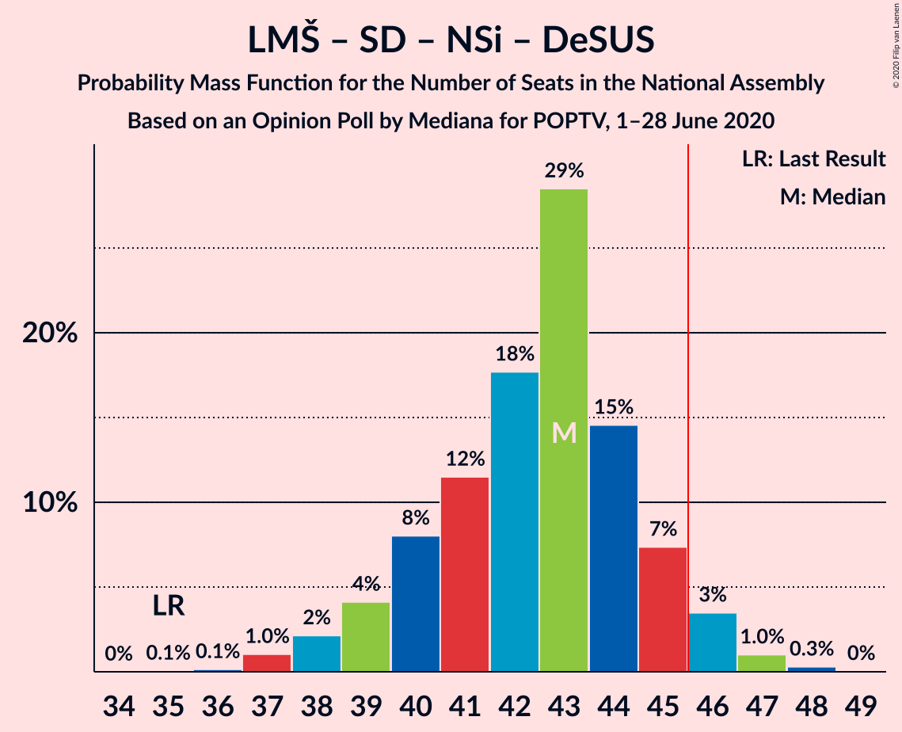
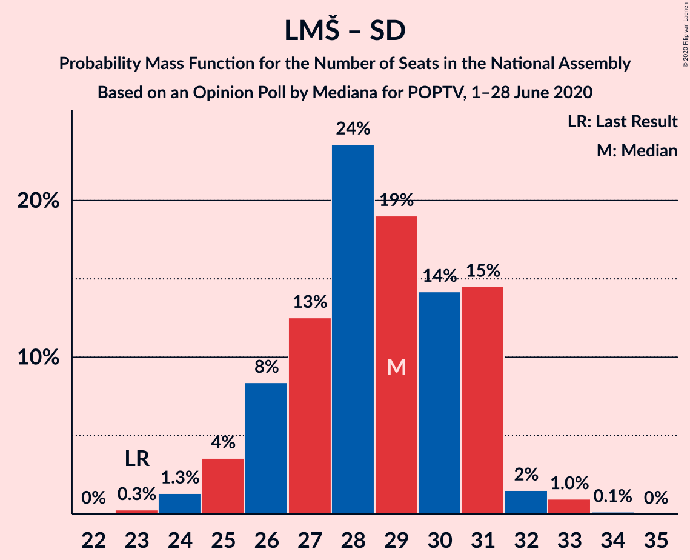

# Opinion Poll by Mediana for POPTV, 1–28 June 2020

<a href="#voting-intentions">Voting Intentions</a> | <a href="#seats">Seats</a> | <a href="#coalitions">Coalitions</a> | <a href="#technical-information">Technical Information</a>

## Voting Intentions

### Confidence Intervals

| Party | Last Result | Poll Result | 80% Confidence Interval | 90% Confidence Interval | 95% Confidence Interval | 99% Confidence Interval |
|:-----:|:-----------:|:-----------:|:-----------------------:|:-----------------------:|:-----------------------:|:-----------------------:|
| Slovenska demokratska stranka | 24.9% | 26.8% | 24.7–29.0% |24.2–29.6% |23.7–30.1% |22.7–31.2% |
| Lista Marjana Šarca | 12.6% | 16.3% | 14.7–18.2% |14.2–18.7% |13.8–19.2% |13.0–20.1% |
| Levica | 9.3% | 14.2% | 12.7–16.0% |12.2–16.5% |11.9–17.0% |11.1–17.9% |
| Socialni demokrati | 9.9% | 13.2% | 11.7–15.0% |11.3–15.5% |11.0–15.9% |10.3–16.8% |
| Nova Slovenija–Krščanski demokrati | 7.2% | 7.7% | 6.5–9.1% |6.2–9.5% |5.9–9.9% |5.4–10.6% |
| Demokratična stranka upokojencev Slovenije | 4.9% | 7.3% | 6.1–8.6% |5.8–9.0% |5.6–9.4% |5.1–10.1% |
| Slovenska nacionalna stranka | 4.2% | 5.9% | 4.9–7.1% |4.6–7.5% |4.4–7.8% |3.9–8.5% |
| Slovenska ljudska stranka | 2.6% | 3.2% | 2.5–4.2% |2.3–4.5% |2.1–4.8% |1.8–5.3% |
| Stranka Alenke Bratušek | 5.1% | 2.9% | 2.3–3.9% |2.1–4.2% |1.9–4.5% |1.6–5.0% |

*Note:* The poll result column reflects the actual value used in the calculations. Published results may vary slightly, and in addition be rounded to fewer digits.

## Seats

### Confidence Intervals

| Party | Last Result | Median | 80% Confidence Interval | 90% Confidence Interval | 95% Confidence Interval | 99% Confidence Interval |
|:-----:|:-----------:|:------:|:-----------------------:|:-----------------------:|:-----------------------:|:-----------------------:|
| <a href="#slovenska-demokratska-stranka">Slovenska demokratska stranka</a> | 25 | 26 | 24–28 |23–28 |23–28 |22–29 |
| <a href="#lista-marjana-šarca">Lista Marjana Šarca</a> | 13 | 16 | 14–17 |13–18 |13–18 |12–19 |
| <a href="#levica">Levica</a> | 9 | 13 | 12–15 |12–16 |11–16 |11–17 |
| <a href="#socialni-demokrati">Socialni demokrati</a> | 10 | 13 | 12–14 |11–14 |10–15 |10–16 |
| <a href="#nova-slovenija–krščanski-demokrati">Nova Slovenija–Krščanski demokrati</a> | 7 | 7 | 6–8 |6–8 |6–9 |5–10 |
| <a href="#demokratična-stranka-upokojencev-slovenije">Demokratična stranka upokojencev Slovenije</a> | 5 | 7 | 6–8 |5–8 |5–9 |4–9 |
| <a href="#slovenska-nacionalna-stranka">Slovenska nacionalna stranka</a> | 4 | 6 | 4–6 |4–7 |4–7 |4–8 |
| <a href="#slovenska-ljudska-stranka">Slovenska ljudska stranka</a> | 0 | 0 | 0–3 |0–4 |0–4 |0–5 |
| <a href="#stranka-alenke-bratušek">Stranka Alenke Bratušek</a> | 5 | 0 | 0 |0–3 |0–4 |0–4 |

### Slovenska demokratska stranka

*For a full overview of the results for this party, see the [Slovenska demokratska stranka](party-slovenskademokratskastranka.html) page.*

| Number of Seats | Probability | Accumulated | Special Marks |
|:---------------:|:-----------:|:-----------:|:-------------:|
| 21 | 0.4% | 100% |  |
| 22 | 1.0% | 99.6% |  |
| 23 | 4% | 98.6% |  |
| 24 | 27% | 95% |  |
| 25 | 8% | 68% | Last Result |
| 26 | 30% | 60% | Median |
| 27 | 9% | 29% |  |
| 28 | 19% | 21% |  |
| 29 | 2% | 2% |  |
| 30 | 0.3% | 0.5% |  |
| 31 | 0.2% | 0.2% |  |
| 32 | 0% | 0% |  |

### Lista Marjana Šarca

*For a full overview of the results for this party, see the [Lista Marjana Šarca](party-listamarjanašarca.html) page.*

| Number of Seats | Probability | Accumulated | Special Marks |
|:---------------:|:-----------:|:-----------:|:-------------:|
| 11 | 0.1% | 100% |  |
| 12 | 0.5% | 99.9% |  |
| 13 | 5% | 99.4% | Last Result |
| 14 | 13% | 95% |  |
| 15 | 18% | 81% |  |
| 16 | 48% | 64% | Median |
| 17 | 10% | 16% |  |
| 18 | 3% | 6% |  |
| 19 | 2% | 2% |  |
| 20 | 0.4% | 0.4% |  |
| 21 | 0% | 0% |  |

### Levica

*For a full overview of the results for this party, see the [Levica](party-levica.html) page.*

| Number of Seats | Probability | Accumulated | Special Marks |
|:---------------:|:-----------:|:-----------:|:-------------:|
| 9 | 0% | 100% | Last Result |
| 10 | 0.5% | 100% |  |
| 11 | 2% | 99.5% |  |
| 12 | 26% | 97% |  |
| 13 | 24% | 71% | Median |
| 14 | 10% | 46% |  |
| 15 | 31% | 36% |  |
| 16 | 4% | 5% |  |
| 17 | 0.4% | 0.8% |  |
| 18 | 0.5% | 0.5% |  |
| 19 | 0% | 0% |  |

### Socialni demokrati

*For a full overview of the results for this party, see the [Socialni demokrati](party-socialnidemokrati.html) page.*

| Number of Seats | Probability | Accumulated | Special Marks |
|:---------------:|:-----------:|:-----------:|:-------------:|
| 9 | 0.3% | 100% |  |
| 10 | 5% | 99.7% | Last Result |
| 11 | 5% | 95% |  |
| 12 | 34% | 90% |  |
| 13 | 30% | 56% | Median |
| 14 | 22% | 26% |  |
| 15 | 2% | 4% |  |
| 16 | 2% | 2% |  |
| 17 | 0.1% | 0.1% |  |
| 18 | 0% | 0% |  |

### Nova Slovenija–Krščanski demokrati

*For a full overview of the results for this party, see the [Nova Slovenija–Krščanski demokrati](party-novaslovenija–krščanskidemokrati.html) page.*

| Number of Seats | Probability | Accumulated | Special Marks |
|:---------------:|:-----------:|:-----------:|:-------------:|
| 4 | 0.3% | 100% |  |
| 5 | 2% | 99.7% |  |
| 6 | 16% | 98% |  |
| 7 | 45% | 82% | Last Result, Median |
| 8 | 34% | 38% |  |
| 9 | 2% | 3% |  |
| 10 | 1.0% | 1.1% |  |
| 11 | 0.1% | 0.1% |  |
| 12 | 0% | 0% |  |

### Demokratična stranka upokojencev Slovenije

*For a full overview of the results for this party, see the [Demokratična stranka upokojencev Slovenije](party-demokratičnastrankaupokojencevslovenije.html) page.*

| Number of Seats | Probability | Accumulated | Special Marks |
|:---------------:|:-----------:|:-----------:|:-------------:|
| 4 | 0.7% | 100% |  |
| 5 | 8% | 99.3% | Last Result |
| 6 | 17% | 92% |  |
| 7 | 51% | 74% | Median |
| 8 | 20% | 24% |  |
| 9 | 3% | 3% |  |
| 10 | 0.3% | 0.4% |  |
| 11 | 0.1% | 0.1% |  |
| 12 | 0% | 0% |  |

### Slovenska nacionalna stranka

*For a full overview of the results for this party, see the [Slovenska nacionalna stranka](party-slovenskanacionalnastranka.html) page.*

| Number of Seats | Probability | Accumulated | Special Marks |
|:---------------:|:-----------:|:-----------:|:-------------:|
| 0 | 0.3% | 100% |  |
| 1 | 0% | 99.7% |  |
| 2 | 0% | 99.7% |  |
| 3 | 0.1% | 99.7% |  |
| 4 | 17% | 99.6% | Last Result |
| 5 | 24% | 82% |  |
| 6 | 52% | 59% | Median |
| 7 | 6% | 7% |  |
| 8 | 0.6% | 0.6% |  |
| 9 | 0% | 0% |  |

### Slovenska ljudska stranka

*For a full overview of the results for this party, see the [Slovenska ljudska stranka](party-slovenskaljudskastranka.html) page.*

| Number of Seats | Probability | Accumulated | Special Marks |
|:---------------:|:-----------:|:-----------:|:-------------:|
| 0 | 88% | 100% | Last Result, Median |
| 1 | 0% | 12% |  |
| 2 | 0% | 12% |  |
| 3 | 3% | 12% |  |
| 4 | 9% | 9% |  |
| 5 | 0.5% | 0.5% |  |
| 6 | 0% | 0% |  |

### Stranka Alenke Bratušek

*For a full overview of the results for this party, see the [Stranka Alenke Bratušek](party-strankaalenkebratušek.html) page.*

| Number of Seats | Probability | Accumulated | Special Marks |
|:---------------:|:-----------:|:-----------:|:-------------:|
| 0 | 95% | 100% | Median |
| 1 | 0% | 5% |  |
| 2 | 0% | 5% |  |
| 3 | 2% | 5% |  |
| 4 | 3% | 3% |  |
| 5 | 0.1% | 0.1% | Last Result |
| 6 | 0% | 0% |  |

## Coalitions

### Confidence Intervals

| Coalition | Last Result | Median | Majority? | 80% Confidence Interval | 90% Confidence Interval | 95% Confidence Interval | 99% Confidence Interval |
|:---------:|:-----------:|:------:|:---------:|:-----------------------:|:-----------------------:|:-----------------------:|:-----------------------:|
| Slovenska demokratska stranka – Lista Marjana Šarca – Demokratična stranka upokojencev Slovenije | 43 | 48 | 91% | 46–50 | 45–51 | 44–52 | 43–53 |
| Lista Marjana Šarca – Socialni demokrati – Nova Slovenija–Krščanski demokrati – Demokratična stranka upokojencev Slovenije | 35 | 43 | 3% | 40–44 | 40–45 | 38–46 | 37–47 |
| Slovenska demokratska stranka – Lista Marjana Šarca | 38 | 42 | 0.8% | 39–43 | 38–44 | 38–45 | 36–46 |
| Lista Marjana Šarca – Socialni demokrati – Demokratična stranka upokojencev Slovenije | 28 | 36 | 0% | 32–37 | 32–38 | 32–39 | 30–40 |
| Lista Marjana Šarca – Socialni demokrati – Nova Slovenija–Krščanski demokrati | 30 | 36 | 0% | 34–37 | 33–38 | 32–39 | 31–39 |
| Lista Marjana Šarca – Socialni demokrati | 23 | 29 | 0% | 26–30 | 26–31 | 25–31 | 24–33 |

### Slovenska demokratska stranka – Lista Marjana Šarca – Demokratična stranka upokojencev Slovenije

| Number of Seats | Probability | Accumulated | Special Marks |
|:---------------:|:-----------:|:-----------:|:-------------:|
| 42 | 0.3% | 100% |  |
| 43 | 0.4% | 99.7% | Last Result |
| 44 | 4% | 99.3% |  |
| 45 | 5% | 96% |  |
| 46 | 3% | 91% | Majority |
| 47 | 33% | 88% |  |
| 48 | 8% | 54% |  |
| 49 | 6% | 47% | Median |
| 50 | 31% | 41% |  |
| 51 | 7% | 10% |  |
| 52 | 2% | 3% |  |
| 53 | 0.5% | 0.7% |  |
| 54 | 0.1% | 0.2% |  |
| 55 | 0% | 0% |  |

### Lista Marjana Šarca – Socialni demokrati – Nova Slovenija–Krščanski demokrati – Demokratična stranka upokojencev Slovenije

| Number of Seats | Probability | Accumulated | Special Marks |
|:---------------:|:-----------:|:-----------:|:-------------:|
| 35 | 0.1% | 100% | Last Result |
| 36 | 0.1% | 99.9% |  |
| 37 | 0.4% | 99.8% |  |
| 38 | 2% | 99.4% |  |
| 39 | 2% | 97% |  |
| 40 | 9% | 95% |  |
| 41 | 10% | 86% |  |
| 42 | 13% | 76% |  |
| 43 | 37% | 63% | Median |
| 44 | 20% | 26% |  |
| 45 | 3% | 6% |  |
| 46 | 2% | 3% | Majority |
| 47 | 0.8% | 0.9% |  |
| 48 | 0.1% | 0.2% |  |
| 49 | 0% | 0% |  |

### Slovenska demokratska stranka – Lista Marjana Šarca

| Number of Seats | Probability | Accumulated | Special Marks |
|:---------------:|:-----------:|:-----------:|:-------------:|
| 35 | 0.1% | 100% |  |
| 36 | 0.5% | 99.9% |  |
| 37 | 0.8% | 99.4% |  |
| 38 | 4% | 98.7% | Last Result |
| 39 | 7% | 95% |  |
| 40 | 27% | 88% |  |
| 41 | 11% | 61% |  |
| 42 | 21% | 51% | Median |
| 43 | 20% | 30% |  |
| 44 | 7% | 10% |  |
| 45 | 2% | 3% |  |
| 46 | 0.4% | 0.8% | Majority |
| 47 | 0.4% | 0.4% |  |
| 48 | 0% | 0% |  |

### Lista Marjana Šarca – Socialni demokrati – Demokratična stranka upokojencev Slovenije

| Number of Seats | Probability | Accumulated | Special Marks |
|:---------------:|:-----------:|:-----------:|:-------------:|
| 28 | 0% | 100% | Last Result |
| 29 | 0.1% | 100% |  |
| 30 | 0.6% | 99.9% |  |
| 31 | 1.5% | 99.4% |  |
| 32 | 8% | 98% |  |
| 33 | 5% | 90% |  |
| 34 | 10% | 85% |  |
| 35 | 14% | 75% |  |
| 36 | 50% | 61% | Median |
| 37 | 5% | 11% |  |
| 38 | 3% | 6% |  |
| 39 | 1.4% | 3% |  |
| 40 | 2% | 2% |  |
| 41 | 0.1% | 0.1% |  |
| 42 | 0% | 0% |  |

### Lista Marjana Šarca – Socialni demokrati – Nova Slovenija–Krščanski demokrati

| Number of Seats | Probability | Accumulated | Special Marks |
|:---------------:|:-----------:|:-----------:|:-------------:|
| 29 | 0.1% | 100% |  |
| 30 | 0.3% | 99.9% | Last Result |
| 31 | 0.8% | 99.6% |  |
| 32 | 3% | 98.7% |  |
| 33 | 3% | 96% |  |
| 34 | 16% | 93% |  |
| 35 | 9% | 77% |  |
| 36 | 54% | 68% | Median |
| 37 | 7% | 15% |  |
| 38 | 4% | 7% |  |
| 39 | 3% | 4% |  |
| 40 | 0.2% | 0.4% |  |
| 41 | 0.2% | 0.2% |  |
| 42 | 0% | 0% |  |

### Lista Marjana Šarca – Socialni demokrati

| Number of Seats | Probability | Accumulated | Special Marks |
|:---------------:|:-----------:|:-----------:|:-------------:|
| 23 | 0.2% | 100% | Last Result |
| 24 | 0.4% | 99.7% |  |
| 25 | 2% | 99.4% |  |
| 26 | 11% | 97% |  |
| 27 | 8% | 86% |  |
| 28 | 27% | 79% |  |
| 29 | 38% | 51% | Median |
| 30 | 5% | 13% |  |
| 31 | 6% | 8% |  |
| 32 | 0.3% | 2% |  |
| 33 | 2% | 2% |  |
| 34 | 0.1% | 0.1% |  |
| 35 | 0% | 0% |  |

## Technical Information

### Opinion Poll

+ **Polling firm:** Mediana
+ **Commissioner(s):** POPTV
+ **Fieldwork period:** 1–28 June 2020

### Calculations

+ **Sample size:** 717
+ **Simulations done:** 131,072
+ **Error estimate:** 2.48%

