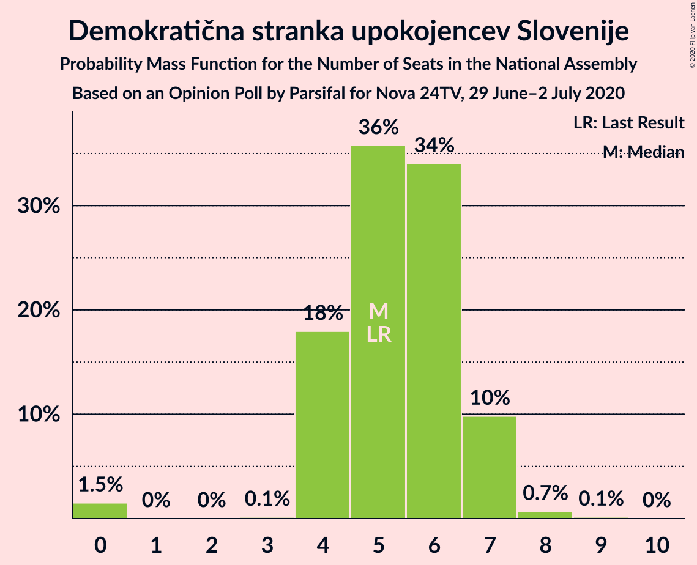
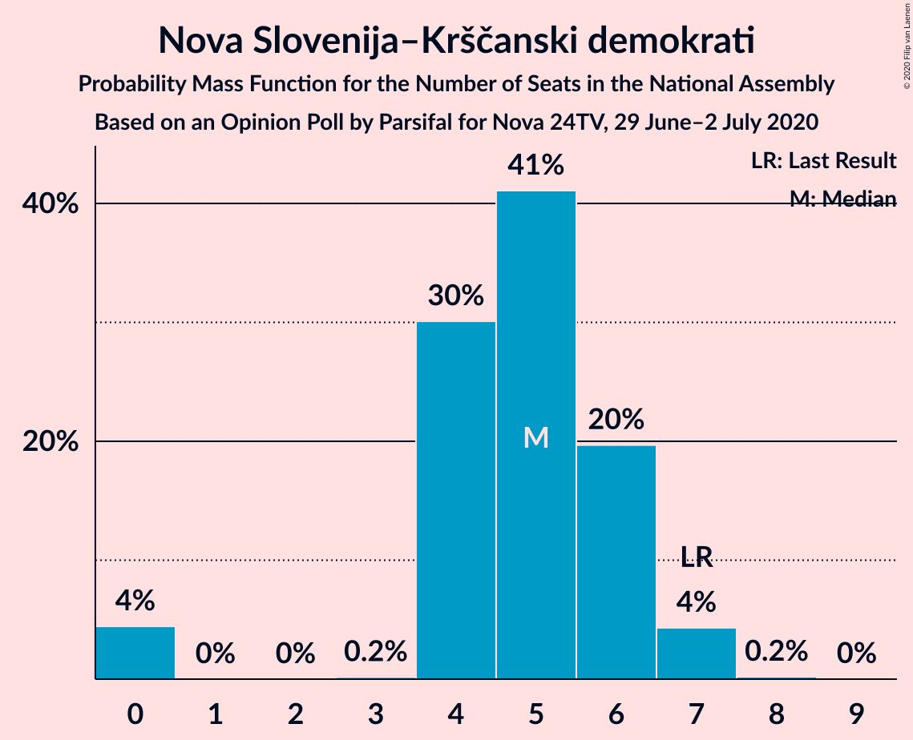
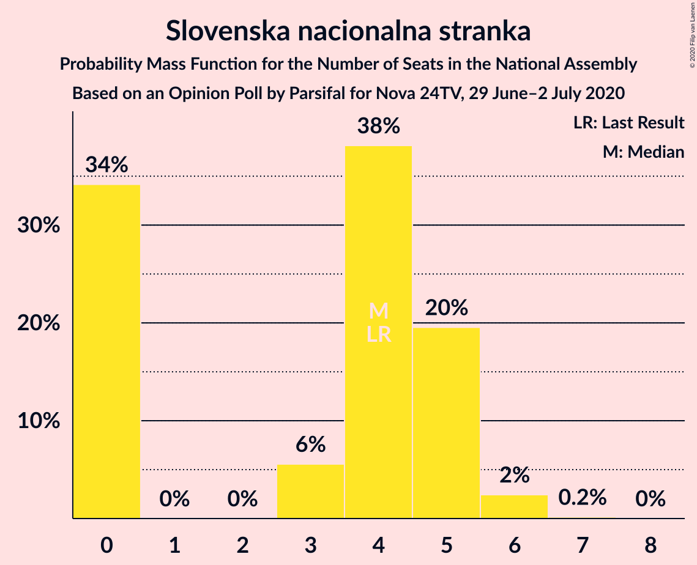
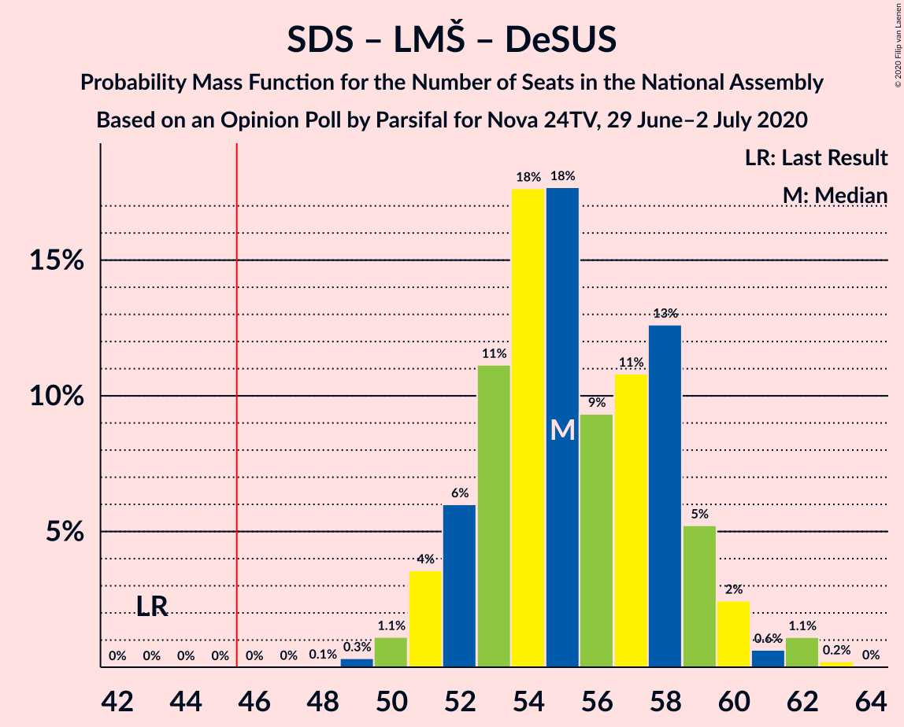
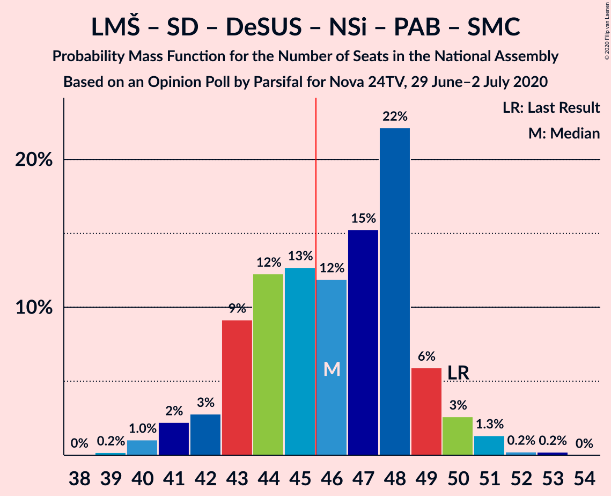
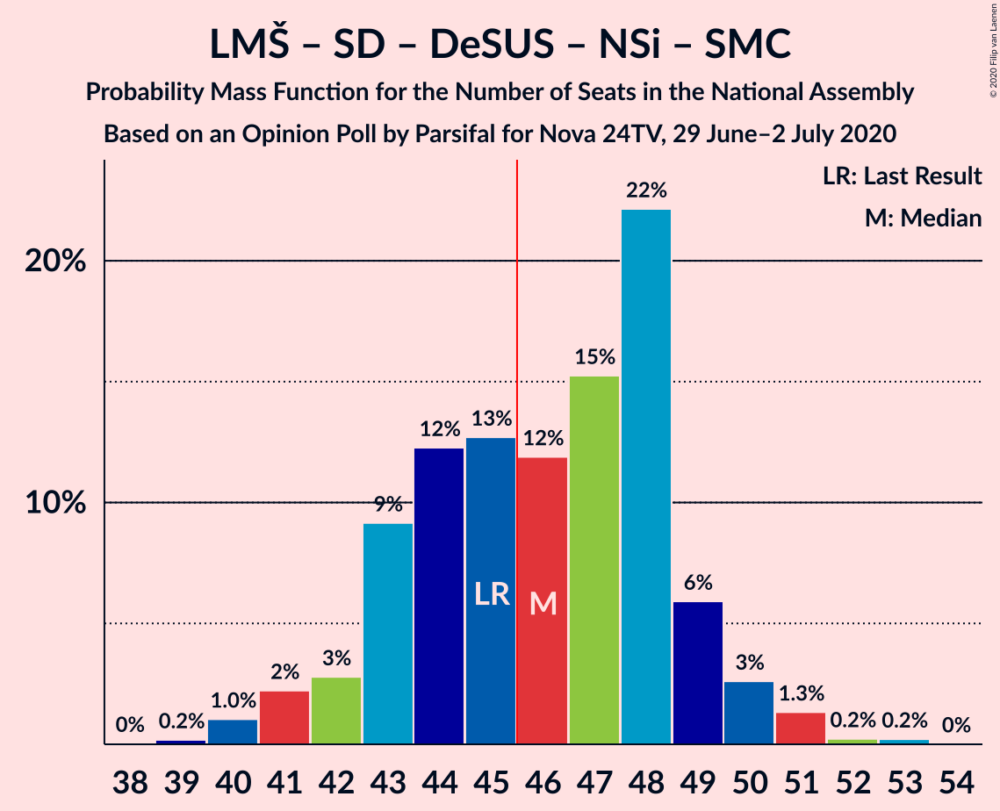
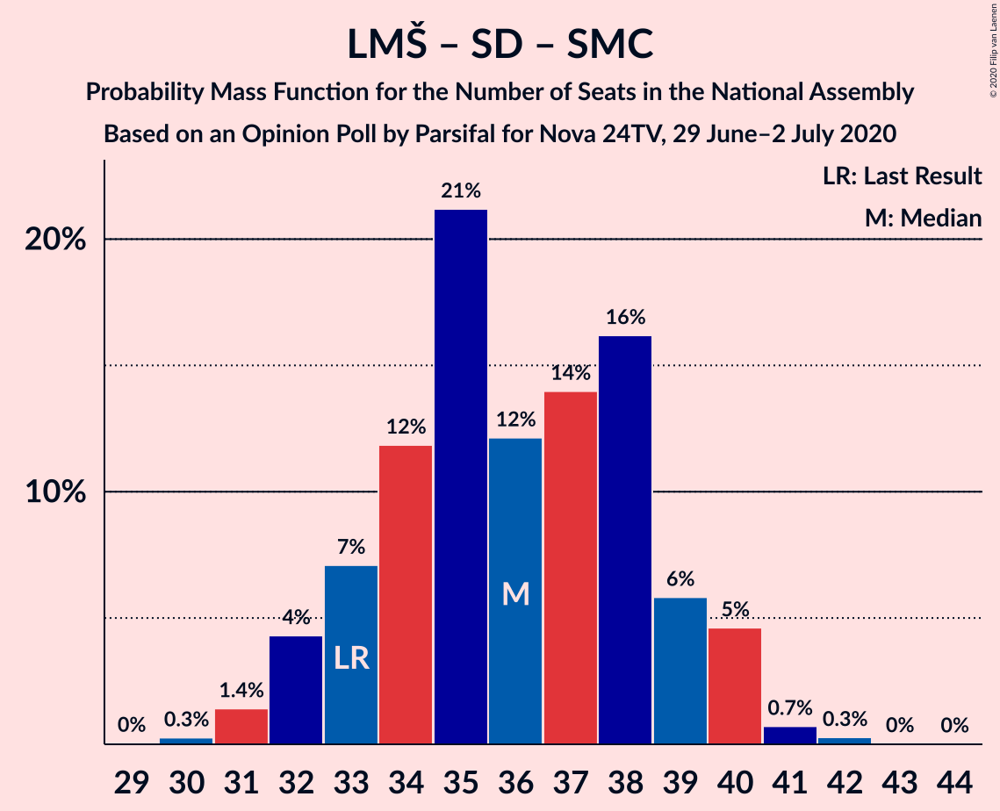

# Opinion Poll by Parsifal for Nova 24TV, 29 June–2 July 2020

<a href="#voting-intentions">Voting Intentions</a> | <a href="#seats">Seats</a> | <a href="#coalitions">Coalitions</a> | <a href="#technical-information">Technical Information</a>

## Voting Intentions

### Confidence Intervals

| Party | Last Result | Poll Result | 80% Confidence Interval | 90% Confidence Interval | 95% Confidence Interval | 99% Confidence Interval |
|:-----:|:-----------:|:-----------:|:-----------------------:|:-----------------------:|:-----------------------:|:-----------------------:|
| Slovenska demokratska stranka | 24.9% | 31.0% | 28.9–33.3% |28.3–34.0% |27.8–34.5% |26.7–35.7% |
| Lista Marjana Šarca | 12.6% | 20.7% | 18.9–22.7% |18.3–23.3% |17.9–23.8% |17.0–24.8% |
| Socialni demokrati | 9.9% | 16.5% | 14.8–18.4% |14.4–18.9% |14.0–19.4% |13.2–20.3% |
| Levica | 9.3% | 9.0% | 7.7–10.5% |7.4–10.9% |7.1–11.3% |6.5–12.0% |
| Demokratična stranka upokojencev Slovenije | 4.9% | 5.7% | 4.8–7.0% |4.5–7.4% |4.3–7.7% |3.8–8.4% |
| Nova Slovenija–Krščanski demokrati | 7.2% | 5.3% | 4.4–6.6% |4.1–6.9% |3.9–7.2% |3.5–7.8% |
| Slovenska nacionalna stranka | 4.2% | 4.3% | 3.5–5.5% |3.3–5.8% |3.1–6.1% |2.7–6.7% |
| Slovenska ljudska stranka | 2.6% | 2.5% | 1.9–3.4% |1.7–3.7% |1.6–3.9% |1.3–4.5% |
| Stranka Alenke Bratušek | 5.1% | 1.3% | 0.9–2.0% |0.7–2.2% |0.7–2.4% |0.5–2.8% |
| Stranka modernega centra | 9.7% | 0.6% | 0.3–1.1% |0.3–1.3% |0.2–1.4% |0.1–1.8% |

*Note:* The poll result column reflects the actual value used in the calculations. Published results may vary slightly, and in addition be rounded to fewer digits.

## Seats

### Confidence Intervals

| Party | Last Result | Median | 80% Confidence Interval | 90% Confidence Interval | 95% Confidence Interval | 99% Confidence Interval |
|:-----:|:-----------:|:------:|:-----------------------:|:-----------------------:|:-----------------------:|:-----------------------:|
| <a href="#slovenska-demokratska-stranka">Slovenska demokratska stranka</a> | 25 | 30 | 27–33 |27–34 |26–34 |26–36 |
| <a href="#lista-marjana-šarca">Lista Marjana Šarca</a> | 13 | 20 | 18–23 |17–24 |17–24 |16–25 |
| <a href="#socialni-demokrati">Socialni demokrati</a> | 10 | 17 | 14–19 |13–19 |13–19 |12–19 |
| <a href="#levica">Levica</a> | 9 | 8 | 7–11 |7–11 |7–11 |6–12 |
| <a href="#demokratična-stranka-upokojencev-slovenije">Demokratična stranka upokojencev Slovenije</a> | 5 | 5 | 4–6 |4–7 |4–7 |0–8 |
| <a href="#nova-slovenija–krščanski-demokrati">Nova Slovenija–Krščanski demokrati</a> | 7 | 5 | 4–6 |0–6 |0–7 |0–7 |
| <a href="#slovenska-nacionalna-stranka">Slovenska nacionalna stranka</a> | 4 | 0 | 0–5 |0–5 |0–5 |0–6 |
| <a href="#slovenska-ljudska-stranka">Slovenska ljudska stranka</a> | 0 | 0 | 0 |0 |0 |0–4 |
| <a href="#stranka-alenke-bratušek">Stranka Alenke Bratušek</a> | 5 | 0 | 0 |0 |0 |0 |
| <a href="#stranka-modernega-centra">Stranka modernega centra</a> | 10 | 0 | 0 |0 |0 |0 |

### Slovenska demokratska stranka

*For a full overview of the results for this party, see the [Slovenska demokratska stranka](party-slovenskademokratskastranka.html) page.*

| Number of Seats | Probability | Accumulated | Special Marks |
|:---------------:|:-----------:|:-----------:|:-------------:|
| 24 | 0.1% | 100% |  |
| 25 | 0.3% | 99.9% | Last Result |
| 26 | 3% | 99.6% |  |
| 27 | 7% | 96% |  |
| 28 | 8% | 90% |  |
| 29 | 14% | 82% |  |
| 30 | 20% | 68% | Median |
| 31 | 9% | 48% |  |
| 32 | 11% | 39% |  |
| 33 | 22% | 29% |  |
| 34 | 5% | 6% |  |
| 35 | 0.4% | 1.0% |  |
| 36 | 0.6% | 0.7% |  |
| 37 | 0% | 0% |  |

### Lista Marjana Šarca

*For a full overview of the results for this party, see the [Lista Marjana Šarca](party-listamarjanašarca.html) page.*

| Number of Seats | Probability | Accumulated | Special Marks |
|:---------------:|:-----------:|:-----------:|:-------------:|
| 13 | 0% | 100% | Last Result |
| 14 | 0% | 100% |  |
| 15 | 0.1% | 100% |  |
| 16 | 0.5% | 99.9% |  |
| 17 | 6% | 99.4% |  |
| 18 | 6% | 93% |  |
| 19 | 27% | 87% |  |
| 20 | 14% | 60% | Median |
| 21 | 23% | 46% |  |
| 22 | 11% | 23% |  |
| 23 | 6% | 12% |  |
| 24 | 6% | 6% |  |
| 25 | 0.4% | 0.6% |  |
| 26 | 0% | 0.1% |  |
| 27 | 0.1% | 0.1% |  |
| 28 | 0% | 0% |  |

### Socialni demokrati

*For a full overview of the results for this party, see the [Socialni demokrati](party-socialnidemokrati.html) page.*

| Number of Seats | Probability | Accumulated | Special Marks |
|:---------------:|:-----------:|:-----------:|:-------------:|
| 10 | 0% | 100% | Last Result |
| 11 | 0% | 100% |  |
| 12 | 1.1% | 100% |  |
| 13 | 5% | 98.9% |  |
| 14 | 12% | 94% |  |
| 15 | 20% | 82% |  |
| 16 | 8% | 62% |  |
| 17 | 33% | 54% | Median |
| 18 | 9% | 21% |  |
| 19 | 11% | 12% |  |
| 20 | 0.4% | 0.5% |  |
| 21 | 0% | 0.1% |  |
| 22 | 0% | 0% |  |

### Levica

*For a full overview of the results for this party, see the [Levica](party-levica.html) page.*

| Number of Seats | Probability | Accumulated | Special Marks |
|:---------------:|:-----------:|:-----------:|:-------------:|
| 5 | 0.1% | 100% |  |
| 6 | 2% | 99.9% |  |
| 7 | 24% | 98% |  |
| 8 | 36% | 74% | Median |
| 9 | 19% | 38% | Last Result |
| 10 | 7% | 19% |  |
| 11 | 10% | 11% |  |
| 12 | 0.9% | 0.9% |  |
| 13 | 0% | 0% |  |

### Demokratična stranka upokojencev Slovenije

*For a full overview of the results for this party, see the [Demokratična stranka upokojencev Slovenije](party-demokratičnastrankaupokojencevslovenije.html) page.*

| Number of Seats | Probability | Accumulated | Special Marks |
|:---------------:|:-----------:|:-----------:|:-------------:|
| 0 | 0.7% | 100% |  |
| 1 | 0% | 99.3% |  |
| 2 | 0% | 99.3% |  |
| 3 | 0.4% | 99.3% |  |
| 4 | 21% | 98.9% |  |
| 5 | 39% | 78% | Last Result, Median |
| 6 | 30% | 39% |  |
| 7 | 9% | 9% |  |
| 8 | 0.5% | 0.5% |  |
| 9 | 0.1% | 0.1% |  |
| 10 | 0% | 0% |  |

### Nova Slovenija–Krščanski demokrati

*For a full overview of the results for this party, see the [Nova Slovenija–Krščanski demokrati](party-novaslovenija–krščanskidemokrati.html) page.*

| Number of Seats | Probability | Accumulated | Special Marks |
|:---------------:|:-----------:|:-----------:|:-------------:|
| 0 | 7% | 100% |  |
| 1 | 0% | 93% |  |
| 2 | 0% | 93% |  |
| 3 | 0% | 93% |  |
| 4 | 16% | 93% |  |
| 5 | 36% | 76% | Median |
| 6 | 36% | 40% |  |
| 7 | 4% | 4% | Last Result |
| 8 | 0.1% | 0.1% |  |
| 9 | 0% | 0% |  |

### Slovenska nacionalna stranka

*For a full overview of the results for this party, see the [Slovenska nacionalna stranka](party-slovenskanacionalnastranka.html) page.*

| Number of Seats | Probability | Accumulated | Special Marks |
|:---------------:|:-----------:|:-----------:|:-------------:|
| 0 | 52% | 100% | Median |
| 1 | 0% | 48% |  |
| 2 | 0% | 48% |  |
| 3 | 1.1% | 48% |  |
| 4 | 26% | 47% | Last Result |
| 5 | 19% | 21% |  |
| 6 | 2% | 2% |  |
| 7 | 0.1% | 0.1% |  |
| 8 | 0% | 0% |  |

### Slovenska ljudska stranka

*For a full overview of the results for this party, see the [Slovenska ljudska stranka](party-slovenskaljudskastranka.html) page.*

| Number of Seats | Probability | Accumulated | Special Marks |
|:---------------:|:-----------:|:-----------:|:-------------:|
| 0 | 99.2% | 100% | Last Result, Median |
| 1 | 0% | 0.8% |  |
| 2 | 0% | 0.8% |  |
| 3 | 0% | 0.8% |  |
| 4 | 0.7% | 0.7% |  |
| 5 | 0.1% | 0.1% |  |
| 6 | 0% | 0% |  |

### Stranka Alenke Bratušek

*For a full overview of the results for this party, see the [Stranka Alenke Bratušek](party-strankaalenkebratušek.html) page.*

| Number of Seats | Probability | Accumulated | Special Marks |
|:---------------:|:-----------:|:-----------:|:-------------:|
| 0 | 100% | 100% | Median |
| 1 | 0% | 0% |  |
| 2 | 0% | 0% |  |
| 3 | 0% | 0% |  |
| 4 | 0% | 0% |  |
| 5 | 0% | 0% | Last Result |

### Stranka modernega centra

*For a full overview of the results for this party, see the [Stranka modernega centra](party-strankamodernegacentra.html) page.*

| Number of Seats | Probability | Accumulated | Special Marks |
|:---------------:|:-----------:|:-----------:|:-------------:|
| 0 | 100% | 100% | Median |
| 1 | 0% | 0% |  |
| 2 | 0% | 0% |  |
| 3 | 0% | 0% |  |
| 4 | 0% | 0% |  |
| 5 | 0% | 0% |  |
| 6 | 0% | 0% |  |
| 7 | 0% | 0% |  |
| 8 | 0% | 0% |  |
| 9 | 0% | 0% |  |
| 10 | 0% | 0% | Last Result |

## Coalitions

### Confidence Intervals

| Coalition | Last Result | Median | Majority? | 80% Confidence Interval | 90% Confidence Interval | 95% Confidence Interval | 99% Confidence Interval |
|:---------:|:-----------:|:------:|:---------:|:-----------------------:|:-----------------------:|:-----------------------:|:-----------------------:|
| Slovenska demokratska stranka – Lista Marjana Šarca – Demokratična stranka upokojencev Slovenije | 43 | 56 | 100% | 52–60 | 52–62 | 51–62 | 50–62 |
| Slovenska demokratska stranka – Lista Marjana Šarca | 38 | 51 | 98.7% | 47–56 | 47–56 | 46–56 | 45–57 |
| Lista Marjana Šarca – Socialni demokrati – Demokratična stranka upokojencev Slovenije – Nova Slovenija–Krščanski demokrati | 35 | 48 | 69% | 43–49 | 42–50 | 42–50 | 40–51 |
| Lista Marjana Šarca – Socialni demokrati – Demokratična stranka upokojencev Slovenije – Nova Slovenija–Krščanski demokrati – Stranka Alenke Bratušek – Stranka modernega centra | 50 | 48 | 69% | 43–49 | 42–50 | 42–50 | 40–51 |
| Lista Marjana Šarca – Socialni demokrati – Demokratična stranka upokojencev Slovenije – Nova Slovenija–Krščanski demokrati – Stranka modernega centra | 45 | 48 | 69% | 43–49 | 42–50 | 42–50 | 40–51 |
| Lista Marjana Šarca – Socialni demokrati – Demokratična stranka upokojencev Slovenije | 28 | 42 | 0.9% | 39–44 | 37–45 | 37–45 | 36–46 |
| Lista Marjana Šarca – Socialni demokrati – Demokratična stranka upokojencev Slovenije – Stranka Alenke Bratušek – Stranka modernega centra | 43 | 42 | 0.9% | 39–44 | 37–45 | 37–45 | 36–46 |
| Lista Marjana Šarca – Socialni demokrati – Demokratična stranka upokojencev Slovenije – Stranka modernega centra | 38 | 42 | 0.9% | 39–44 | 37–45 | 37–45 | 36–46 |
| Lista Marjana Šarca – Socialni demokrati – Nova Slovenija–Krščanski demokrati | 30 | 42 | 0.8% | 38–44 | 36–44 | 36–44 | 35–46 |
| Lista Marjana Šarca – Socialni demokrati – Nova Slovenija–Krščanski demokrati – Stranka modernega centra | 40 | 42 | 0.8% | 38–44 | 36–44 | 36–44 | 35–46 |
| Lista Marjana Šarca – Socialni demokrati | 23 | 37 | 0% | 34–39 | 33–39 | 32–40 | 30–41 |
| Lista Marjana Šarca – Socialni demokrati – Stranka modernega centra | 33 | 37 | 0% | 34–39 | 33–39 | 32–40 | 30–41 |
| Socialni demokrati – Demokratična stranka upokojencev Slovenije – Stranka modernega centra | 25 | 22 | 0% | 18–23 | 18–24 | 18–25 | 16–26 |

### Slovenska demokratska stranka – Lista Marjana Šarca – Demokratična stranka upokojencev Slovenije

| Number of Seats | Probability | Accumulated | Special Marks |
|:---------------:|:-----------:|:-----------:|:-------------:|
| 43 | 0% | 100% | Last Result |
| 44 | 0% | 100% |  |
| 45 | 0% | 100% |  |
| 46 | 0% | 100% | Majority |
| 47 | 0% | 100% |  |
| 48 | 0.2% | 100% |  |
| 49 | 0.3% | 99.8% |  |
| 50 | 1.1% | 99.5% |  |
| 51 | 1.3% | 98% |  |
| 52 | 9% | 97% |  |
| 53 | 6% | 88% |  |
| 54 | 5% | 83% |  |
| 55 | 21% | 78% | Median |
| 56 | 19% | 57% |  |
| 57 | 8% | 38% |  |
| 58 | 14% | 30% |  |
| 59 | 1.1% | 16% |  |
| 60 | 10% | 15% |  |
| 61 | 0.6% | 6% |  |
| 62 | 5% | 5% |  |
| 63 | 0% | 0.1% |  |
| 64 | 0% | 0.1% |  |
| 65 | 0% | 0% |  |

### Slovenska demokratska stranka – Lista Marjana Šarca

| Number of Seats | Probability | Accumulated | Special Marks |
|:---------------:|:-----------:|:-----------:|:-------------:|
| 38 | 0% | 100% | Last Result |
| 39 | 0% | 100% |  |
| 40 | 0% | 100% |  |
| 41 | 0% | 100% |  |
| 42 | 0.1% | 100% |  |
| 43 | 0.2% | 99.9% |  |
| 44 | 0.1% | 99.7% |  |
| 45 | 0.9% | 99.6% |  |
| 46 | 3% | 98.7% | Majority |
| 47 | 7% | 95% |  |
| 48 | 6% | 88% |  |
| 49 | 11% | 82% |  |
| 50 | 10% | 71% | Median |
| 51 | 22% | 61% |  |
| 52 | 20% | 38% |  |
| 53 | 6% | 18% |  |
| 54 | 1.1% | 12% |  |
| 55 | 0.3% | 11% |  |
| 56 | 9% | 11% |  |
| 57 | 2% | 2% |  |
| 58 | 0.1% | 0.1% |  |
| 59 | 0% | 0% |  |

### Lista Marjana Šarca – Socialni demokrati – Demokratična stranka upokojencev Slovenije – Nova Slovenija–Krščanski demokrati

| Number of Seats | Probability | Accumulated | Special Marks |
|:---------------:|:-----------:|:-----------:|:-------------:|
| 35 | 0% | 100% | Last Result |
| 36 | 0% | 100% |  |
| 37 | 0% | 100% |  |
| 38 | 0% | 100% |  |
| 39 | 0.2% | 100% |  |
| 40 | 0.3% | 99.8% |  |
| 41 | 2% | 99.4% |  |
| 42 | 7% | 98% |  |
| 43 | 3% | 91% |  |
| 44 | 4% | 88% |  |
| 45 | 14% | 83% |  |
| 46 | 5% | 69% | Majority |
| 47 | 11% | 64% | Median |
| 48 | 37% | 53% |  |
| 49 | 11% | 16% |  |
| 50 | 4% | 5% |  |
| 51 | 0.2% | 0.7% |  |
| 52 | 0.5% | 0.5% |  |
| 53 | 0% | 0% |  |

### Lista Marjana Šarca – Socialni demokrati – Demokratična stranka upokojencev Slovenije – Nova Slovenija–Krščanski demokrati – Stranka Alenke Bratušek – Stranka modernega centra

| Number of Seats | Probability | Accumulated | Special Marks |
|:---------------:|:-----------:|:-----------:|:-------------:|
| 39 | 0.2% | 100% |  |
| 40 | 0.3% | 99.8% |  |
| 41 | 2% | 99.4% |  |
| 42 | 7% | 98% |  |
| 43 | 3% | 91% |  |
| 44 | 4% | 88% |  |
| 45 | 14% | 83% |  |
| 46 | 5% | 69% | Majority |
| 47 | 11% | 64% | Median |
| 48 | 37% | 53% |  |
| 49 | 11% | 16% |  |
| 50 | 4% | 5% | Last Result |
| 51 | 0.2% | 0.7% |  |
| 52 | 0.5% | 0.5% |  |
| 53 | 0% | 0% |  |

### Lista Marjana Šarca – Socialni demokrati – Demokratična stranka upokojencev Slovenije – Nova Slovenija–Krščanski demokrati – Stranka modernega centra

| Number of Seats | Probability | Accumulated | Special Marks |
|:---------------:|:-----------:|:-----------:|:-------------:|
| 39 | 0.2% | 100% |  |
| 40 | 0.3% | 99.8% |  |
| 41 | 2% | 99.4% |  |
| 42 | 7% | 98% |  |
| 43 | 3% | 91% |  |
| 44 | 4% | 88% |  |
| 45 | 14% | 83% | Last Result |
| 46 | 5% | 69% | Majority |
| 47 | 11% | 64% | Median |
| 48 | 37% | 53% |  |
| 49 | 11% | 16% |  |
| 50 | 4% | 5% |  |
| 51 | 0.2% | 0.7% |  |
| 52 | 0.5% | 0.5% |  |
| 53 | 0% | 0% |  |

### Lista Marjana Šarca – Socialni demokrati – Demokratična stranka upokojencev Slovenije

| Number of Seats | Probability | Accumulated | Special Marks |
|:---------------:|:-----------:|:-----------:|:-------------:|
| 28 | 0% | 100% | Last Result |
| 29 | 0% | 100% |  |
| 30 | 0% | 100% |  |
| 31 | 0% | 100% |  |
| 32 | 0% | 100% |  |
| 33 | 0% | 100% |  |
| 34 | 0.2% | 100% |  |
| 35 | 0.2% | 99.8% |  |
| 36 | 2% | 99.6% |  |
| 37 | 3% | 98% |  |
| 38 | 2% | 94% |  |
| 39 | 5% | 92% |  |
| 40 | 13% | 87% |  |
| 41 | 7% | 74% |  |
| 42 | 23% | 67% | Median |
| 43 | 31% | 44% |  |
| 44 | 8% | 13% |  |
| 45 | 4% | 5% |  |
| 46 | 0.5% | 0.9% | Majority |
| 47 | 0.4% | 0.5% |  |
| 48 | 0% | 0.1% |  |
| 49 | 0% | 0% |  |

### Lista Marjana Šarca – Socialni demokrati – Demokratična stranka upokojencev Slovenije – Stranka Alenke Bratušek – Stranka modernega centra

| Number of Seats | Probability | Accumulated | Special Marks |
|:---------------:|:-----------:|:-----------:|:-------------:|
| 34 | 0.2% | 100% |  |
| 35 | 0.2% | 99.8% |  |
| 36 | 2% | 99.6% |  |
| 37 | 3% | 98% |  |
| 38 | 2% | 94% |  |
| 39 | 5% | 92% |  |
| 40 | 13% | 87% |  |
| 41 | 7% | 74% |  |
| 42 | 23% | 67% | Median |
| 43 | 31% | 44% | Last Result |
| 44 | 8% | 13% |  |
| 45 | 4% | 5% |  |
| 46 | 0.5% | 0.9% | Majority |
| 47 | 0.4% | 0.5% |  |
| 48 | 0% | 0.1% |  |
| 49 | 0% | 0% |  |

### Lista Marjana Šarca – Socialni demokrati – Demokratična stranka upokojencev Slovenije – Stranka modernega centra

| Number of Seats | Probability | Accumulated | Special Marks |
|:---------------:|:-----------:|:-----------:|:-------------:|
| 34 | 0.2% | 100% |  |
| 35 | 0.2% | 99.8% |  |
| 36 | 2% | 99.6% |  |
| 37 | 3% | 98% |  |
| 38 | 2% | 94% | Last Result |
| 39 | 5% | 92% |  |
| 40 | 13% | 87% |  |
| 41 | 7% | 74% |  |
| 42 | 23% | 67% | Median |
| 43 | 31% | 44% |  |
| 44 | 8% | 13% |  |
| 45 | 4% | 5% |  |
| 46 | 0.5% | 0.9% | Majority |
| 47 | 0.4% | 0.5% |  |
| 48 | 0% | 0.1% |  |
| 49 | 0% | 0% |  |

### Lista Marjana Šarca – Socialni demokrati – Nova Slovenija–Krščanski demokrati

| Number of Seats | Probability | Accumulated | Special Marks |
|:---------------:|:-----------:|:-----------:|:-------------:|
| 30 | 0% | 100% | Last Result |
| 31 | 0% | 100% |  |
| 32 | 0% | 100% |  |
| 33 | 0% | 100% |  |
| 34 | 0.1% | 100% |  |
| 35 | 0.7% | 99.8% |  |
| 36 | 4% | 99.1% |  |
| 37 | 3% | 95% |  |
| 38 | 3% | 92% |  |
| 39 | 12% | 89% |  |
| 40 | 10% | 77% |  |
| 41 | 6% | 67% |  |
| 42 | 18% | 61% | Median |
| 43 | 25% | 43% |  |
| 44 | 17% | 19% |  |
| 45 | 0.3% | 1.1% |  |
| 46 | 0.5% | 0.8% | Majority |
| 47 | 0.1% | 0.2% |  |
| 48 | 0.1% | 0.1% |  |
| 49 | 0% | 0% |  |

### Lista Marjana Šarca – Socialni demokrati – Nova Slovenija–Krščanski demokrati – Stranka modernega centra

| Number of Seats | Probability | Accumulated | Special Marks |
|:---------------:|:-----------:|:-----------:|:-------------:|
| 34 | 0.1% | 100% |  |
| 35 | 0.7% | 99.8% |  |
| 36 | 4% | 99.1% |  |
| 37 | 3% | 95% |  |
| 38 | 3% | 92% |  |
| 39 | 12% | 89% |  |
| 40 | 10% | 77% | Last Result |
| 41 | 6% | 67% |  |
| 42 | 18% | 61% | Median |
| 43 | 25% | 43% |  |
| 44 | 17% | 19% |  |
| 45 | 0.3% | 1.1% |  |
| 46 | 0.5% | 0.8% | Majority |
| 47 | 0.1% | 0.2% |  |
| 48 | 0.1% | 0.1% |  |
| 49 | 0% | 0% |  |

### Lista Marjana Šarca – Socialni demokrati

| Number of Seats | Probability | Accumulated | Special Marks |
|:---------------:|:-----------:|:-----------:|:-------------:|
| 23 | 0% | 100% | Last Result |
| 24 | 0% | 100% |  |
| 25 | 0% | 100% |  |
| 26 | 0% | 100% |  |
| 27 | 0% | 100% |  |
| 28 | 0% | 100% |  |
| 29 | 0% | 100% |  |
| 30 | 0.5% | 100% |  |
| 31 | 0.9% | 99.5% |  |
| 32 | 3% | 98.5% |  |
| 33 | 3% | 96% |  |
| 34 | 11% | 93% |  |
| 35 | 11% | 81% |  |
| 36 | 16% | 70% |  |
| 37 | 9% | 54% | Median |
| 38 | 33% | 45% |  |
| 39 | 8% | 11% |  |
| 40 | 3% | 4% |  |
| 41 | 0.4% | 0.7% |  |
| 42 | 0.2% | 0.3% |  |
| 43 | 0% | 0.1% |  |
| 44 | 0% | 0% |  |

### Lista Marjana Šarca – Socialni demokrati – Stranka modernega centra

| Number of Seats | Probability | Accumulated | Special Marks |
|:---------------:|:-----------:|:-----------:|:-------------:|
| 30 | 0.5% | 100% |  |
| 31 | 0.9% | 99.5% |  |
| 32 | 3% | 98.5% |  |
| 33 | 3% | 96% | Last Result |
| 34 | 11% | 93% |  |
| 35 | 11% | 81% |  |
| 36 | 16% | 70% |  |
| 37 | 9% | 54% | Median |
| 38 | 33% | 45% |  |
| 39 | 8% | 11% |  |
| 40 | 3% | 4% |  |
| 41 | 0.4% | 0.7% |  |
| 42 | 0.2% | 0.3% |  |
| 43 | 0% | 0.1% |  |
| 44 | 0% | 0% |  |

### Socialni demokrati – Demokratična stranka upokojencev Slovenije – Stranka modernega centra

| Number of Seats | Probability | Accumulated | Special Marks |
|:---------------:|:-----------:|:-----------:|:-------------:|
| 14 | 0.1% | 100% |  |
| 15 | 0.1% | 99.9% |  |
| 16 | 0.4% | 99.8% |  |
| 17 | 1.5% | 99.5% |  |
| 18 | 9% | 98% |  |
| 19 | 4% | 89% |  |
| 20 | 11% | 85% |  |
| 21 | 19% | 74% |  |
| 22 | 24% | 56% | Median |
| 23 | 22% | 31% |  |
| 24 | 4% | 9% |  |
| 25 | 3% | 5% | Last Result |
| 26 | 1.3% | 1.3% |  |
| 27 | 0% | 0% |  |

## Technical Information

### Opinion Poll

+ **Polling firm:** Parsifal
+ **Commissioner(s):** Nova 24TV
+ **Fieldwork period:** 29 June–2 July 2020

### Calculations

+ **Sample size:** 715
+ **Simulations done:** 131,072
+ **Error estimate:** 2.65%

