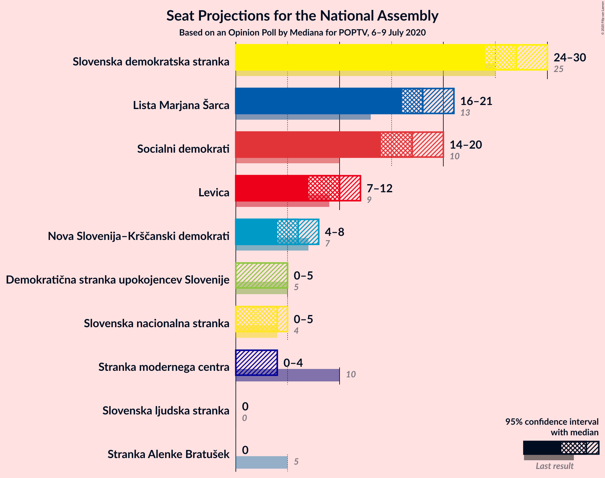
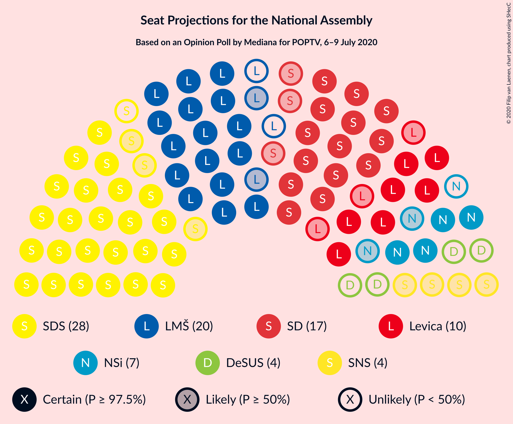
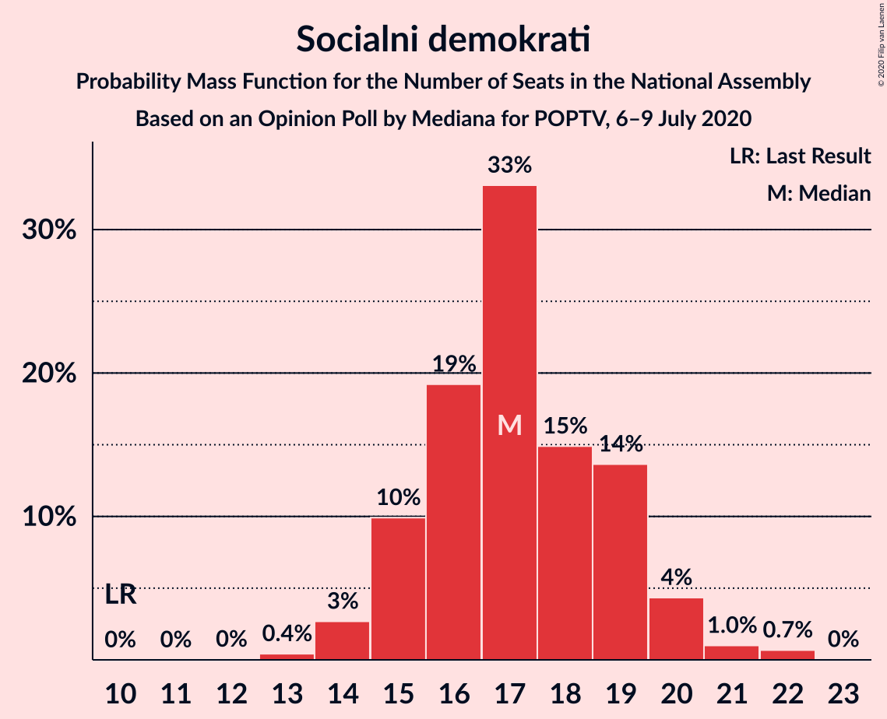
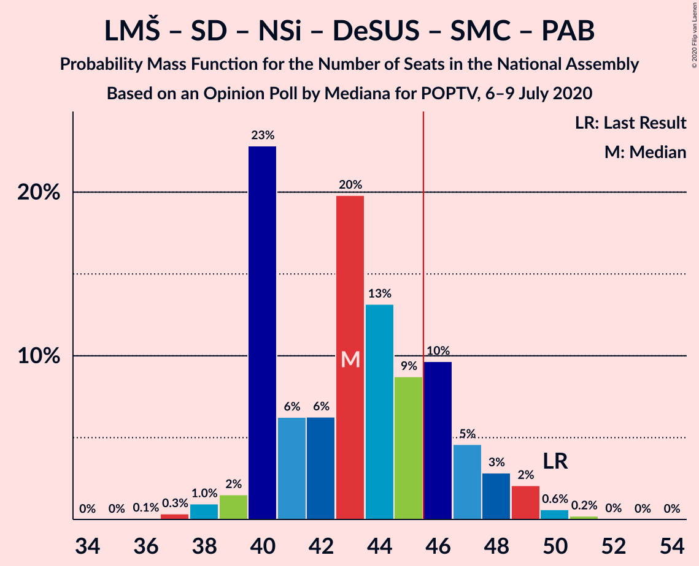
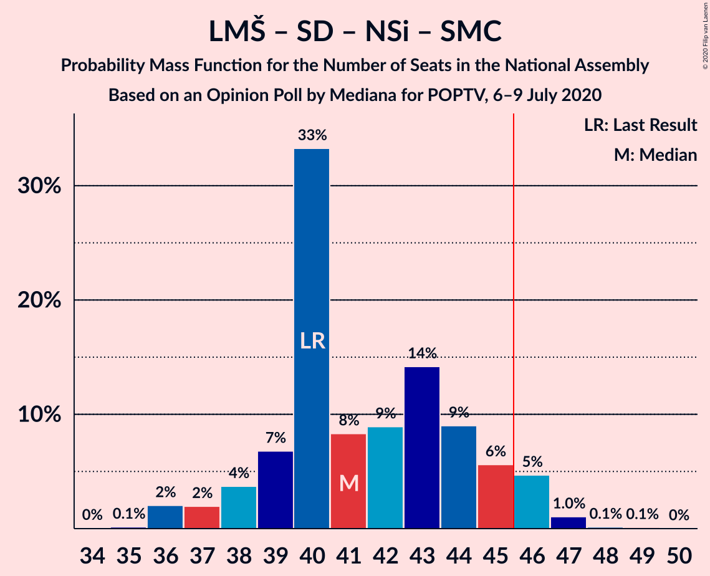

# Opinion Poll by Mediana for POPTV, 6–9 July 2020

<a href="#voting-intentions">Voting Intentions</a> | <a href="#seats">Seats</a> | <a href="#coalitions">Coalitions</a> | <a href="#technical-information">Technical Information</a>

## Voting Intentions

### Confidence Intervals

| Party | Last Result | Poll Result | 80% Confidence Interval | 90% Confidence Interval | 95% Confidence Interval | 99% Confidence Interval |
|:-----:|:-----------:|:-----------:|:-----------------------:|:-----------------------:|:-----------------------:|:-----------------------:|
| Slovenska demokratska stranka | 24.9% | 27.2% | 25.1–29.4% |24.6–30.0% |24.1–30.5% |23.1–31.6% |
| Lista Marjana Šarca | 12.6% | 18.3% | 16.6–20.3% |16.1–20.9% |15.7–21.3% |14.9–22.3% |
| Socialni demokrati | 9.9% | 17.2% | 15.5–19.2% |15.1–19.7% |14.7–20.2% |13.9–21.1% |
| Levica | 9.3% | 9.7% | 8.4–11.2% |8.0–11.6% |7.7–12.0% |7.1–12.8% |
| Nova Slovenija–Krščanski demokrati | 7.2% | 6.3% | 5.3–7.7% |5.0–8.0% |4.8–8.4% |4.3–9.0% |
| Slovenska nacionalna stranka | 4.2% | 4.1% | 3.3–5.3% |3.1–5.6% |2.9–5.9% |2.6–6.4% |
| Demokratična stranka upokojencev Slovenije | 4.9% | 3.9% | 3.1–5.0% |2.9–5.3% |2.7–5.5% |2.3–6.1% |
| Stranka modernega centra | 9.7% | 2.9% | 2.2–3.9% |2.1–4.1% |1.9–4.4% |1.6–4.9% |
| Slovenska ljudska stranka | 2.6% | 2.5% | 1.9–3.4% |1.7–3.7% |1.6–3.9% |1.3–4.4% |
| Stranka Alenke Bratušek | 5.1% | 2.3% | 1.8–3.2% |1.6–3.5% |1.5–3.7% |1.2–4.2% |

*Note:* The poll result column reflects the actual value used in the calculations. Published results may vary slightly, and in addition be rounded to fewer digits.

## Seats

### Confidence Intervals

| Party | Last Result | Median | 80% Confidence Interval | 90% Confidence Interval | 95% Confidence Interval | 99% Confidence Interval |
|:-----:|:-----------:|:------:|:-----------------------:|:-----------------------:|:-----------------------:|:-----------------------:|
| <a href="#slovenska-demokratska-stranka">Slovenska demokratska stranka</a> | 25 | 27 | 25–29 |24–30 |24–30 |23–33 |
| <a href="#lista-marjana-šarca">Lista Marjana Šarca</a> | 13 | 18 | 16–20 |16–21 |16–21 |15–22 |
| <a href="#socialni-demokrati">Socialni demokrati</a> | 10 | 17 | 15–19 |15–20 |14–20 |14–22 |
| <a href="#levica">Levica</a> | 9 | 10 | 8–11 |8–11 |7–12 |7–13 |
| <a href="#nova-slovenija–krščanski-demokrati">Nova Slovenija–Krščanski demokrati</a> | 7 | 6 | 5–7 |5–8 |4–8 |4–9 |
| <a href="#slovenska-nacionalna-stranka">Slovenska nacionalna stranka</a> | 4 | 4 | 0–5 |0–5 |0–5 |0–6 |
| <a href="#demokratična-stranka-upokojencev-slovenije">Demokratična stranka upokojencev Slovenije</a> | 5 | 0 | 0–4 |0–5 |0–5 |0–5 |
| <a href="#stranka-modernega-centra">Stranka modernega centra</a> | 10 | 0 | 0 |0–4 |0–4 |0–4 |
| <a href="#slovenska-ljudska-stranka">Slovenska ljudska stranka</a> | 0 | 0 | 0 |0 |0 |0–4 |
| <a href="#stranka-alenke-bratušek">Stranka Alenke Bratušek</a> | 5 | 0 | 0 |0 |0 |0–4 |

### Slovenska demokratska stranka

*For a full overview of the results for this party, see the [Slovenska demokratska stranka](party-slovenskademokratskastranka.html) page.*

| Number of Seats | Probability | Accumulated | Special Marks |
|:---------------:|:-----------:|:-----------:|:-------------:|
| 22 | 0.4% | 100% |  |
| 23 | 1.2% | 99.5% |  |
| 24 | 4% | 98% |  |
| 25 | 12% | 95% | Last Result |
| 26 | 16% | 83% |  |
| 27 | 20% | 66% | Median |
| 28 | 31% | 47% |  |
| 29 | 9% | 16% |  |
| 30 | 5% | 7% |  |
| 31 | 1.4% | 2% |  |
| 32 | 0.5% | 1.0% |  |
| 33 | 0.2% | 0.5% |  |
| 34 | 0.3% | 0.3% |  |
| 35 | 0% | 0% |  |

### Lista Marjana Šarca

*For a full overview of the results for this party, see the [Lista Marjana Šarca](party-listamarjanašarca.html) page.*

| Number of Seats | Probability | Accumulated | Special Marks |
|:---------------:|:-----------:|:-----------:|:-------------:|
| 13 | 0.1% | 100% | Last Result |
| 14 | 0.4% | 99.9% |  |
| 15 | 2% | 99.5% |  |
| 16 | 24% | 98% |  |
| 17 | 18% | 74% |  |
| 18 | 17% | 56% | Median |
| 19 | 17% | 39% |  |
| 20 | 15% | 22% |  |
| 21 | 5% | 7% |  |
| 22 | 0.9% | 1.2% |  |
| 23 | 0.3% | 0.3% |  |
| 24 | 0% | 0% |  |

### Socialni demokrati

*For a full overview of the results for this party, see the [Socialni demokrati](party-socialnidemokrati.html) page.*

| Number of Seats | Probability | Accumulated | Special Marks |
|:---------------:|:-----------:|:-----------:|:-------------:|
| 10 | 0% | 100% | Last Result |
| 11 | 0% | 100% |  |
| 12 | 0% | 100% |  |
| 13 | 0.4% | 100% |  |
| 14 | 3% | 99.5% |  |
| 15 | 10% | 97% |  |
| 16 | 19% | 87% |  |
| 17 | 33% | 68% | Median |
| 18 | 15% | 35% |  |
| 19 | 14% | 20% |  |
| 20 | 4% | 6% |  |
| 21 | 1.0% | 2% |  |
| 22 | 0.7% | 0.7% |  |
| 23 | 0% | 0% |  |

### Levica

*For a full overview of the results for this party, see the [Levica](party-levica.html) page.*

| Number of Seats | Probability | Accumulated | Special Marks |
|:---------------:|:-----------:|:-----------:|:-------------:|
| 6 | 0.3% | 100% |  |
| 7 | 4% | 99.7% |  |
| 8 | 9% | 96% |  |
| 9 | 35% | 86% | Last Result |
| 10 | 37% | 52% | Median |
| 11 | 12% | 15% |  |
| 12 | 2% | 3% |  |
| 13 | 0.7% | 0.7% |  |
| 14 | 0% | 0% |  |

### Nova Slovenija–Krščanski demokrati

*For a full overview of the results for this party, see the [Nova Slovenija–Krščanski demokrati](party-novaslovenija–krščanskidemokrati.html) page.*

| Number of Seats | Probability | Accumulated | Special Marks |
|:---------------:|:-----------:|:-----------:|:-------------:|
| 0 | 0.1% | 100% |  |
| 1 | 0% | 99.9% |  |
| 2 | 0% | 99.9% |  |
| 3 | 0% | 99.9% |  |
| 4 | 4% | 99.9% |  |
| 5 | 26% | 95% |  |
| 6 | 32% | 69% | Median |
| 7 | 32% | 37% | Last Result |
| 8 | 4% | 5% |  |
| 9 | 0.8% | 0.9% |  |
| 10 | 0.1% | 0.1% |  |
| 11 | 0% | 0% |  |

### Slovenska nacionalna stranka

*For a full overview of the results for this party, see the [Slovenska nacionalna stranka](party-slovenskanacionalnastranka.html) page.*

| Number of Seats | Probability | Accumulated | Special Marks |
|:---------------:|:-----------:|:-----------:|:-------------:|
| 0 | 29% | 100% |  |
| 1 | 0% | 71% |  |
| 2 | 0% | 71% |  |
| 3 | 0.3% | 71% |  |
| 4 | 53% | 71% | Last Result, Median |
| 5 | 16% | 18% |  |
| 6 | 2% | 2% |  |
| 7 | 0.1% | 0.1% |  |
| 8 | 0% | 0% |  |

### Demokratična stranka upokojencev Slovenije

*For a full overview of the results for this party, see the [Demokratična stranka upokojencev Slovenije](party-demokratičnastrankaupokojencevslovenije.html) page.*

| Number of Seats | Probability | Accumulated | Special Marks |
|:---------------:|:-----------:|:-----------:|:-------------:|
| 0 | 59% | 100% | Median |
| 1 | 0% | 41% |  |
| 2 | 0% | 41% |  |
| 3 | 5% | 41% |  |
| 4 | 29% | 36% |  |
| 5 | 7% | 7% | Last Result |
| 6 | 0.3% | 0.3% |  |
| 7 | 0% | 0% |  |

### Stranka modernega centra

*For a full overview of the results for this party, see the [Stranka modernega centra](party-strankamodernegacentra.html) page.*

| Number of Seats | Probability | Accumulated | Special Marks |
|:---------------:|:-----------:|:-----------:|:-------------:|
| 0 | 94% | 100% | Median |
| 1 | 0% | 6% |  |
| 2 | 0% | 6% |  |
| 3 | 0.3% | 6% |  |
| 4 | 5% | 6% |  |
| 5 | 0.3% | 0.3% |  |
| 6 | 0% | 0% |  |
| 7 | 0% | 0% |  |
| 8 | 0% | 0% |  |
| 9 | 0% | 0% |  |
| 10 | 0% | 0% | Last Result |

### Slovenska ljudska stranka

*For a full overview of the results for this party, see the [Slovenska ljudska stranka](party-slovenskaljudskastranka.html) page.*

| Number of Seats | Probability | Accumulated | Special Marks |
|:---------------:|:-----------:|:-----------:|:-------------:|
| 0 | 98.9% | 100% | Last Result, Median |
| 1 | 0% | 1.1% |  |
| 2 | 0% | 1.1% |  |
| 3 | 0.1% | 1.1% |  |
| 4 | 0.9% | 0.9% |  |
| 5 | 0.1% | 0.1% |  |
| 6 | 0% | 0% |  |

### Stranka Alenke Bratušek

*For a full overview of the results for this party, see the [Stranka Alenke Bratušek](party-strankaalenkebratušek.html) page.*

| Number of Seats | Probability | Accumulated | Special Marks |
|:---------------:|:-----------:|:-----------:|:-------------:|
| 0 | 99.2% | 100% | Median |
| 1 | 0% | 0.8% |  |
| 2 | 0% | 0.8% |  |
| 3 | 0% | 0.8% |  |
| 4 | 0.7% | 0.7% |  |
| 5 | 0% | 0% | Last Result |

## Coalitions

### Confidence Intervals

| Coalition | Last Result | Median | Majority? | 80% Confidence Interval | 90% Confidence Interval | 95% Confidence Interval | 99% Confidence Interval |
|:---------:|:-----------:|:------:|:---------:|:-----------------------:|:-----------------------:|:-----------------------:|:-----------------------:|
| Slovenska demokratska stranka – Lista Marjana Šarca – Demokratična stranka upokojencev Slovenije | 43 | 47 | 59% | 44–50 | 43–51 | 42–52 | 41–53 |
| Slovenska demokratska stranka – Lista Marjana Šarca | 38 | 45 | 35% | 43–48 | 42–49 | 41–49 | 39–52 |
| Lista Marjana Šarca – Socialni demokrati – Nova Slovenija–Krščanski demokrati – Demokratična stranka upokojencev Slovenije – Stranka modernega centra – Stranka Alenke Bratušek | 50 | 43 | 20% | 40–47 | 40–48 | 39–49 | 38–50 |
| Lista Marjana Šarca – Socialni demokrati – Nova Slovenija–Krščanski demokrati – Demokratična stranka upokojencev Slovenije – Stranka modernega centra | 45 | 43 | 20% | 40–47 | 40–48 | 39–49 | 38–50 |
| Lista Marjana Šarca – Socialni demokrati – Nova Slovenija–Krščanski demokrati – Demokratična stranka upokojencev Slovenije | 35 | 43 | 17% | 40–46 | 40–47 | 39–48 | 37–50 |
| Lista Marjana Šarca – Socialni demokrati – Nova Slovenija–Krščanski demokrati | 30 | 40 | 4% | 39–44 | 38–45 | 37–46 | 36–47 |
| Lista Marjana Šarca – Socialni demokrati – Nova Slovenija–Krščanski demokrati – Stranka modernega centra | 40 | 41 | 6% | 39–45 | 38–46 | 37–46 | 36–47 |
| Lista Marjana Šarca – Socialni demokrati – Demokratična stranka upokojencev Slovenije – Stranka modernega centra – Stranka Alenke Bratušek | 43 | 37 | 0.1% | 33–40 | 33–42 | 33–43 | 32–44 |
| Lista Marjana Šarca – Socialni demokrati – Demokratična stranka upokojencev Slovenije – Stranka modernega centra | 38 | 37 | 0.1% | 33–40 | 33–42 | 33–43 | 32–44 |
| Lista Marjana Šarca – Socialni demokrati – Demokratična stranka upokojencev Slovenije | 28 | 37 | 0% | 33–40 | 33–41 | 33–42 | 31–43 |
| Lista Marjana Šarca – Socialni demokrati | 23 | 35 | 0% | 33–38 | 32–39 | 31–40 | 30–41 |
| Lista Marjana Šarca – Socialni demokrati – Stranka modernega centra | 33 | 35 | 0% | 33–38 | 32–39 | 31–40 | 30–41 |
| Socialni demokrati – Demokratična stranka upokojencev Slovenije – Stranka modernega centra | 25 | 19 | 0% | 17–22 | 16–23 | 16–24 | 14–25 |

### Slovenska demokratska stranka – Lista Marjana Šarca – Demokratična stranka upokojencev Slovenije

| Number of Seats | Probability | Accumulated | Special Marks |
|:---------------:|:-----------:|:-----------:|:-------------:|
| 40 | 0.1% | 100% |  |
| 41 | 1.2% | 99.9% |  |
| 42 | 1.2% | 98.7% |  |
| 43 | 5% | 97% | Last Result |
| 44 | 18% | 92% |  |
| 45 | 15% | 74% | Median |
| 46 | 8% | 59% | Majority |
| 47 | 10% | 51% |  |
| 48 | 9% | 42% |  |
| 49 | 14% | 32% |  |
| 50 | 10% | 18% |  |
| 51 | 4% | 8% |  |
| 52 | 4% | 4% |  |
| 53 | 0.4% | 0.8% |  |
| 54 | 0.2% | 0.4% |  |
| 55 | 0.1% | 0.2% |  |
| 56 | 0% | 0.1% |  |
| 57 | 0% | 0% |  |

### Slovenska demokratska stranka – Lista Marjana Šarca

| Number of Seats | Probability | Accumulated | Special Marks |
|:---------------:|:-----------:|:-----------:|:-------------:|
| 38 | 0.1% | 100% | Last Result |
| 39 | 0.4% | 99.9% |  |
| 40 | 0.9% | 99.4% |  |
| 41 | 3% | 98.6% |  |
| 42 | 6% | 96% |  |
| 43 | 8% | 90% |  |
| 44 | 24% | 82% |  |
| 45 | 24% | 58% | Median |
| 46 | 7% | 35% | Majority |
| 47 | 15% | 28% |  |
| 48 | 5% | 13% |  |
| 49 | 5% | 8% |  |
| 50 | 0.8% | 2% |  |
| 51 | 0.8% | 1.5% |  |
| 52 | 0.6% | 0.6% |  |
| 53 | 0.1% | 0.1% |  |
| 54 | 0% | 0% |  |

### Lista Marjana Šarca – Socialni demokrati – Nova Slovenija–Krščanski demokrati – Demokratična stranka upokojencev Slovenije – Stranka modernega centra – Stranka Alenke Bratušek

| Number of Seats | Probability | Accumulated | Special Marks |
|:---------------:|:-----------:|:-----------:|:-------------:|
| 36 | 0.1% | 100% |  |
| 37 | 0.3% | 99.9% |  |
| 38 | 1.0% | 99.6% |  |
| 39 | 2% | 98.6% |  |
| 40 | 23% | 97% |  |
| 41 | 6% | 74% | Median |
| 42 | 6% | 68% |  |
| 43 | 20% | 62% |  |
| 44 | 13% | 42% |  |
| 45 | 9% | 29% |  |
| 46 | 10% | 20% | Majority |
| 47 | 5% | 10% |  |
| 48 | 3% | 6% |  |
| 49 | 2% | 3% |  |
| 50 | 0.6% | 0.9% | Last Result |
| 51 | 0.2% | 0.3% |  |
| 52 | 0% | 0.1% |  |
| 53 | 0% | 0% |  |

### Lista Marjana Šarca – Socialni demokrati – Nova Slovenija–Krščanski demokrati – Demokratična stranka upokojencev Slovenije – Stranka modernega centra

| Number of Seats | Probability | Accumulated | Special Marks |
|:---------------:|:-----------:|:-----------:|:-------------:|
| 36 | 0.1% | 100% |  |
| 37 | 0.4% | 99.9% |  |
| 38 | 1.0% | 99.5% |  |
| 39 | 2% | 98% |  |
| 40 | 23% | 97% |  |
| 41 | 6% | 74% | Median |
| 42 | 6% | 68% |  |
| 43 | 20% | 61% |  |
| 44 | 13% | 41% |  |
| 45 | 9% | 29% | Last Result |
| 46 | 10% | 20% | Majority |
| 47 | 5% | 10% |  |
| 48 | 3% | 6% |  |
| 49 | 2% | 3% |  |
| 50 | 0.6% | 0.8% |  |
| 51 | 0.2% | 0.3% |  |
| 52 | 0% | 0.1% |  |
| 53 | 0% | 0% |  |

### Lista Marjana Šarca – Socialni demokrati – Nova Slovenija–Krščanski demokrati – Demokratična stranka upokojencev Slovenije

| Number of Seats | Probability | Accumulated | Special Marks |
|:---------------:|:-----------:|:-----------:|:-------------:|
| 35 | 0% | 100% | Last Result |
| 36 | 0.1% | 100% |  |
| 37 | 0.7% | 99.9% |  |
| 38 | 1.4% | 99.2% |  |
| 39 | 2% | 98% |  |
| 40 | 24% | 96% |  |
| 41 | 6% | 72% | Median |
| 42 | 7% | 65% |  |
| 43 | 20% | 58% |  |
| 44 | 13% | 38% |  |
| 45 | 8% | 25% |  |
| 46 | 8% | 17% | Majority |
| 47 | 4% | 8% |  |
| 48 | 2% | 4% |  |
| 49 | 2% | 2% |  |
| 50 | 0.5% | 0.7% |  |
| 51 | 0.2% | 0.2% |  |
| 52 | 0% | 0% |  |

### Lista Marjana Šarca – Socialni demokrati – Nova Slovenija–Krščanski demokrati

| Number of Seats | Probability | Accumulated | Special Marks |
|:---------------:|:-----------:|:-----------:|:-------------:|
| 30 | 0% | 100% | Last Result |
| 31 | 0% | 100% |  |
| 32 | 0% | 100% |  |
| 33 | 0% | 100% |  |
| 34 | 0.1% | 100% |  |
| 35 | 0.2% | 99.9% |  |
| 36 | 2% | 99.7% |  |
| 37 | 3% | 98% |  |
| 38 | 4% | 95% |  |
| 39 | 8% | 91% |  |
| 40 | 35% | 83% |  |
| 41 | 8% | 48% | Median |
| 42 | 9% | 40% |  |
| 43 | 13% | 31% |  |
| 44 | 8% | 17% |  |
| 45 | 5% | 10% |  |
| 46 | 4% | 4% | Majority |
| 47 | 0.6% | 0.8% |  |
| 48 | 0.1% | 0.2% |  |
| 49 | 0.1% | 0.1% |  |
| 50 | 0% | 0% |  |

### Lista Marjana Šarca – Socialni demokrati – Nova Slovenija–Krščanski demokrati – Stranka modernega centra

| Number of Seats | Probability | Accumulated | Special Marks |
|:---------------:|:-----------:|:-----------:|:-------------:|
| 34 | 0% | 100% |  |
| 35 | 0.1% | 99.9% |  |
| 36 | 2% | 99.8% |  |
| 37 | 2% | 98% |  |
| 38 | 4% | 96% |  |
| 39 | 7% | 92% |  |
| 40 | 33% | 85% | Last Result |
| 41 | 8% | 52% | Median |
| 42 | 9% | 44% |  |
| 43 | 14% | 35% |  |
| 44 | 9% | 21% |  |
| 45 | 6% | 12% |  |
| 46 | 5% | 6% | Majority |
| 47 | 1.0% | 1.3% |  |
| 48 | 0.1% | 0.3% |  |
| 49 | 0.1% | 0.1% |  |
| 50 | 0% | 0% |  |

### Lista Marjana Šarca – Socialni demokrati – Demokratična stranka upokojencev Slovenije – Stranka modernega centra – Stranka Alenke Bratušek

| Number of Seats | Probability | Accumulated | Special Marks |
|:---------------:|:-----------:|:-----------:|:-------------:|
| 30 | 0.1% | 100% |  |
| 31 | 0.2% | 99.9% |  |
| 32 | 1.0% | 99.7% |  |
| 33 | 12% | 98.8% |  |
| 34 | 9% | 86% |  |
| 35 | 10% | 78% | Median |
| 36 | 6% | 67% |  |
| 37 | 14% | 61% |  |
| 38 | 20% | 48% |  |
| 39 | 10% | 28% |  |
| 40 | 8% | 18% |  |
| 41 | 4% | 10% |  |
| 42 | 3% | 6% |  |
| 43 | 2% | 3% | Last Result |
| 44 | 0.5% | 0.7% |  |
| 45 | 0.1% | 0.2% |  |
| 46 | 0.1% | 0.1% | Majority |
| 47 | 0% | 0% |  |

### Lista Marjana Šarca – Socialni demokrati – Demokratična stranka upokojencev Slovenije – Stranka modernega centra

| Number of Seats | Probability | Accumulated | Special Marks |
|:---------------:|:-----------:|:-----------:|:-------------:|
| 30 | 0.1% | 100% |  |
| 31 | 0.2% | 99.9% |  |
| 32 | 1.0% | 99.7% |  |
| 33 | 13% | 98.7% |  |
| 34 | 9% | 86% |  |
| 35 | 11% | 77% | Median |
| 36 | 6% | 67% |  |
| 37 | 14% | 61% |  |
| 38 | 20% | 47% | Last Result |
| 39 | 10% | 28% |  |
| 40 | 8% | 17% |  |
| 41 | 4% | 9% |  |
| 42 | 3% | 6% |  |
| 43 | 2% | 3% |  |
| 44 | 0.5% | 0.7% |  |
| 45 | 0.1% | 0.2% |  |
| 46 | 0% | 0.1% | Majority |
| 47 | 0% | 0% |  |

### Lista Marjana Šarca – Socialni demokrati – Demokratična stranka upokojencev Slovenije

| Number of Seats | Probability | Accumulated | Special Marks |
|:---------------:|:-----------:|:-----------:|:-------------:|
| 28 | 0% | 100% | Last Result |
| 29 | 0% | 100% |  |
| 30 | 0.1% | 100% |  |
| 31 | 0.5% | 99.9% |  |
| 32 | 1.3% | 99.3% |  |
| 33 | 13% | 98% |  |
| 34 | 10% | 85% |  |
| 35 | 11% | 75% | Median |
| 36 | 6% | 64% |  |
| 37 | 14% | 58% |  |
| 38 | 20% | 44% |  |
| 39 | 10% | 24% |  |
| 40 | 7% | 14% |  |
| 41 | 3% | 7% |  |
| 42 | 2% | 4% |  |
| 43 | 2% | 2% |  |
| 44 | 0.3% | 0.4% |  |
| 45 | 0.1% | 0.1% |  |
| 46 | 0% | 0% | Majority |

### Lista Marjana Šarca – Socialni demokrati

| Number of Seats | Probability | Accumulated | Special Marks |
|:---------------:|:-----------:|:-----------:|:-------------:|
| 23 | 0% | 100% | Last Result |
| 24 | 0% | 100% |  |
| 25 | 0% | 100% |  |
| 26 | 0% | 100% |  |
| 27 | 0% | 100% |  |
| 28 | 0% | 100% |  |
| 29 | 0.2% | 100% |  |
| 30 | 0.5% | 99.8% |  |
| 31 | 4% | 99.3% |  |
| 32 | 3% | 95% |  |
| 33 | 21% | 93% |  |
| 34 | 16% | 72% |  |
| 35 | 19% | 56% | Median |
| 36 | 9% | 37% |  |
| 37 | 9% | 28% |  |
| 38 | 11% | 19% |  |
| 39 | 5% | 8% |  |
| 40 | 2% | 3% |  |
| 41 | 0.4% | 0.5% |  |
| 42 | 0.1% | 0.1% |  |
| 43 | 0% | 0% |  |

### Lista Marjana Šarca – Socialni demokrati – Stranka modernega centra

| Number of Seats | Probability | Accumulated | Special Marks |
|:---------------:|:-----------:|:-----------:|:-------------:|
| 29 | 0.2% | 100% |  |
| 30 | 0.4% | 99.8% |  |
| 31 | 3% | 99.5% |  |
| 32 | 2% | 96% |  |
| 33 | 20% | 94% | Last Result |
| 34 | 14% | 74% |  |
| 35 | 19% | 60% | Median |
| 36 | 9% | 41% |  |
| 37 | 10% | 32% |  |
| 38 | 13% | 23% |  |
| 39 | 6% | 10% |  |
| 40 | 3% | 4% |  |
| 41 | 0.9% | 1.2% |  |
| 42 | 0.2% | 0.3% |  |
| 43 | 0.1% | 0.1% |  |
| 44 | 0% | 0.1% |  |
| 45 | 0% | 0% |  |

### Socialni demokrati – Demokratična stranka upokojencev Slovenije – Stranka modernega centra

| Number of Seats | Probability | Accumulated | Special Marks |
|:---------------:|:-----------:|:-----------:|:-------------:|
| 13 | 0.1% | 100% |  |
| 14 | 0.5% | 99.9% |  |
| 15 | 2% | 99.4% |  |
| 16 | 5% | 98% |  |
| 17 | 25% | 92% | Median |
| 18 | 10% | 67% |  |
| 19 | 21% | 57% |  |
| 20 | 11% | 36% |  |
| 21 | 9% | 24% |  |
| 22 | 7% | 16% |  |
| 23 | 5% | 8% |  |
| 24 | 1.3% | 3% |  |
| 25 | 1.4% | 2% | Last Result |
| 26 | 0.3% | 0.5% |  |
| 27 | 0.2% | 0.2% |  |
| 28 | 0% | 0% |  |

## Technical Information

### Opinion Poll

+ **Polling firm:** Mediana
+ **Commissioner(s):** POPTV
+ **Fieldwork period:** 6–9 July 2020

### Calculations

+ **Sample size:** 725
+ **Simulations done:** 1,048,576
+ **Error estimate:** 3.28%

