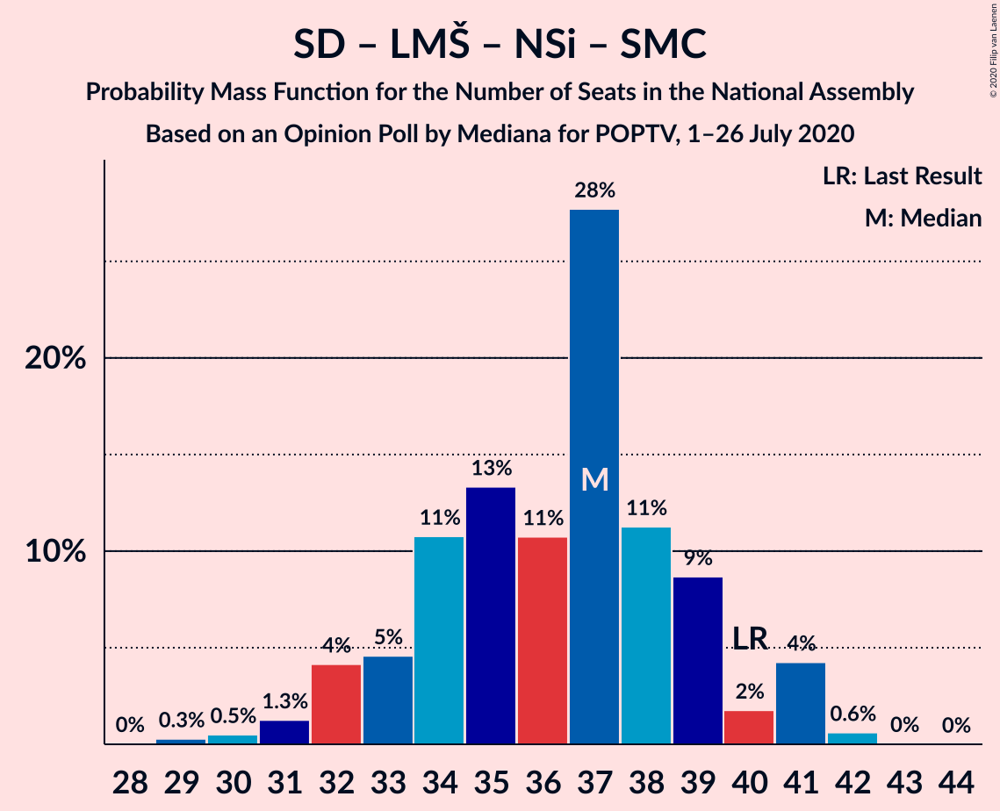

# Opinion Poll by Mediana for POPTV, 1–26 July 2020

<a href="#voting-intentions">Voting Intentions</a> | <a href="#seats">Seats</a> | <a href="#coalitions">Coalitions</a> | <a href="#technical-information">Technical Information</a>

## Voting Intentions

### Confidence Intervals

| Party | Last Result | Poll Result | 80% Confidence Interval | 90% Confidence Interval | 95% Confidence Interval | 99% Confidence Interval |
|:-----:|:-----------:|:-----------:|:-----------------------:|:-----------------------:|:-----------------------:|:-----------------------:|
| Slovenska demokratska stranka | 24.9% | 26.5% | 24.5–28.7% |23.9–29.3% |23.4–29.9% |22.5–30.9% |
| Socialni demokrati | 9.9% | 18.8% | 17.1–20.8% |16.6–21.4% |16.1–21.9% |15.3–22.8% |
| Levica | 9.3% | 14.2% | 12.7–16.0% |12.2–16.5% |11.9–17.0% |11.1–17.9% |
| Lista Marjana Šarca | 12.6% | 12.3% | 10.8–14.0% |10.4–14.5% |10.1–14.9% |9.4–15.7% |
| Nova Slovenija–Krščanski demokrati | 7.2% | 5.9% | 4.9–7.1% |4.6–7.5% |4.4–7.8% |3.9–8.5% |
| Stranka Alenke Bratušek | 5.1% | 3.8% | 3.0–4.8% |2.8–5.2% |2.6–5.4% |2.3–6.0% |
| Demokratična stranka upokojencev Slovenije | 4.9% | 3.5% | 2.7–4.5% |2.5–4.8% |2.4–5.1% |2.1–5.7% |
| Slovenska ljudska stranka | 2.6% | 3.5% | 2.7–4.5% |2.5–4.8% |2.4–5.1% |2.1–5.7% |
| Slovenska nacionalna stranka | 4.2% | 3.2% | 2.5–4.2% |2.3–4.5% |2.1–4.8% |1.8–5.3% |
| Stranka modernega centra | 9.7% | 0.6% | 0.3–1.1% |0.3–1.3% |0.2–1.4% |0.1–1.8% |

*Note:* The poll result column reflects the actual value used in the calculations. Published results may vary slightly, and in addition be rounded to fewer digits.

## Seats

### Confidence Intervals

| Party | Last Result | Median | 80% Confidence Interval | 90% Confidence Interval | 95% Confidence Interval | 99% Confidence Interval |
|:-----:|:-----------:|:------:|:-----------------------:|:-----------------------:|:-----------------------:|:-----------------------:|
| <a href="#slovenska-demokratska-stranka">Slovenska demokratska stranka</a> | 25 | 26 | 24–29 |23–29 |23–30 |22–31 |
| <a href="#socialni-demokrati">Socialni demokrati</a> | 10 | 19 | 17–21 |16–21 |15–21 |15–23 |
| <a href="#levica">Levica</a> | 9 | 14 | 12–15 |12–16 |11–17 |10–18 |
| <a href="#lista-marjana-šarca">Lista Marjana Šarca</a> | 13 | 12 | 10–14 |10–15 |10–15 |9–15 |
| <a href="#nova-slovenija–krščanski-demokrati">Nova Slovenija–Krščanski demokrati</a> | 7 | 6 | 4–6 |4–7 |4–8 |0–8 |
| <a href="#stranka-alenke-bratušek">Stranka Alenke Bratušek</a> | 5 | 0 | 0–4 |0–4 |0–5 |0–5 |
| <a href="#demokratična-stranka-upokojencev-slovenije">Demokratična stranka upokojencev Slovenije</a> | 5 | 0 | 0–4 |0–4 |0–5 |0–5 |
| <a href="#slovenska-ljudska-stranka">Slovenska ljudska stranka</a> | 0 | 0 | 0–4 |0–4 |0–5 |0–5 |
| <a href="#slovenska-nacionalna-stranka">Slovenska nacionalna stranka</a> | 4 | 0 | 0–4 |0–4 |0–4 |0–5 |
| <a href="#stranka-modernega-centra">Stranka modernega centra</a> | 10 | 0 | 0 |0 |0 |0 |

### Slovenska demokratska stranka

*For a full overview of the results for this party, see the [Slovenska demokratska stranka](party-slovenskademokratskastranka.html) page.*

| Number of Seats | Probability | Accumulated | Special Marks |
|:---------------:|:-----------:|:-----------:|:-------------:|
| 20 | 0.1% | 100% |  |
| 21 | 0.4% | 99.9% |  |
| 22 | 1.3% | 99.5% |  |
| 23 | 5% | 98% |  |
| 24 | 13% | 93% |  |
| 25 | 20% | 80% | Last Result |
| 26 | 24% | 60% | Median |
| 27 | 18% | 36% |  |
| 28 | 7% | 18% |  |
| 29 | 6% | 10% |  |
| 30 | 3% | 5% |  |
| 31 | 2% | 2% |  |
| 32 | 0.3% | 0.4% |  |
| 33 | 0.1% | 0.1% |  |
| 34 | 0% | 0% |  |

### Socialni demokrati

*For a full overview of the results for this party, see the [Socialni demokrati](party-socialnidemokrati.html) page.*

| Number of Seats | Probability | Accumulated | Special Marks |
|:---------------:|:-----------:|:-----------:|:-------------:|
| 10 | 0% | 100% | Last Result |
| 11 | 0% | 100% |  |
| 12 | 0% | 100% |  |
| 13 | 0% | 100% |  |
| 14 | 0.3% | 100% |  |
| 15 | 3% | 99.7% |  |
| 16 | 6% | 97% |  |
| 17 | 15% | 91% |  |
| 18 | 17% | 76% |  |
| 19 | 20% | 59% | Median |
| 20 | 19% | 39% |  |
| 21 | 18% | 19% |  |
| 22 | 1.2% | 2% |  |
| 23 | 0.4% | 0.5% |  |
| 24 | 0% | 0.1% |  |
| 25 | 0% | 0% |  |

### Levica

*For a full overview of the results for this party, see the [Levica](party-levica.html) page.*

| Number of Seats | Probability | Accumulated | Special Marks |
|:---------------:|:-----------:|:-----------:|:-------------:|
| 9 | 0% | 100% | Last Result |
| 10 | 0.5% | 100% |  |
| 11 | 3% | 99.5% |  |
| 12 | 14% | 96% |  |
| 13 | 23% | 83% |  |
| 14 | 28% | 60% | Median |
| 15 | 22% | 32% |  |
| 16 | 6% | 10% |  |
| 17 | 3% | 4% |  |
| 18 | 0.7% | 0.9% |  |
| 19 | 0.1% | 0.2% |  |
| 20 | 0% | 0.1% |  |
| 21 | 0% | 0% |  |

### Lista Marjana Šarca

*For a full overview of the results for this party, see the [Lista Marjana Šarca](party-listamarjanašarca.html) page.*

| Number of Seats | Probability | Accumulated | Special Marks |
|:---------------:|:-----------:|:-----------:|:-------------:|
| 8 | 0.2% | 100% |  |
| 9 | 2% | 99.8% |  |
| 10 | 10% | 98% |  |
| 11 | 32% | 88% |  |
| 12 | 25% | 56% | Median |
| 13 | 19% | 31% | Last Result |
| 14 | 6% | 12% |  |
| 15 | 5% | 5% |  |
| 16 | 0.2% | 0.3% |  |
| 17 | 0.1% | 0.1% |  |
| 18 | 0% | 0% |  |

### Nova Slovenija–Krščanski demokrati

*For a full overview of the results for this party, see the [Nova Slovenija–Krščanski demokrati](party-novaslovenija–krščanskidemokrati.html) page.*

| Number of Seats | Probability | Accumulated | Special Marks |
|:---------------:|:-----------:|:-----------:|:-------------:|
| 0 | 0.7% | 100% |  |
| 1 | 0% | 99.3% |  |
| 2 | 0% | 99.3% |  |
| 3 | 0% | 99.3% |  |
| 4 | 11% | 99.3% |  |
| 5 | 25% | 88% |  |
| 6 | 53% | 63% | Median |
| 7 | 6% | 9% | Last Result |
| 8 | 3% | 3% |  |
| 9 | 0.2% | 0.2% |  |
| 10 | 0% | 0% |  |

### Stranka Alenke Bratušek

*For a full overview of the results for this party, see the [Stranka Alenke Bratušek](party-strankaalenkebratušek.html) page.*

| Number of Seats | Probability | Accumulated | Special Marks |
|:---------------:|:-----------:|:-----------:|:-------------:|
| 0 | 59% | 100% | Median |
| 1 | 0% | 41% |  |
| 2 | 0% | 41% |  |
| 3 | 2% | 41% |  |
| 4 | 35% | 39% |  |
| 5 | 4% | 4% | Last Result |
| 6 | 0.4% | 0.4% |  |
| 7 | 0% | 0% |  |

### Demokratična stranka upokojencev Slovenije

*For a full overview of the results for this party, see the [Demokratična stranka upokojencev Slovenije](party-demokratičnastrankaupokojencevslovenije.html) page.*

| Number of Seats | Probability | Accumulated | Special Marks |
|:---------------:|:-----------:|:-----------:|:-------------:|
| 0 | 74% | 100% | Median |
| 1 | 0% | 26% |  |
| 2 | 0% | 26% |  |
| 3 | 0.7% | 26% |  |
| 4 | 23% | 26% |  |
| 5 | 3% | 3% | Last Result |
| 6 | 0.1% | 0.1% |  |
| 7 | 0% | 0% |  |

### Slovenska ljudska stranka

*For a full overview of the results for this party, see the [Slovenska ljudska stranka](party-slovenskaljudskastranka.html) page.*

| Number of Seats | Probability | Accumulated | Special Marks |
|:---------------:|:-----------:|:-----------:|:-------------:|
| 0 | 71% | 100% | Last Result, Median |
| 1 | 0% | 29% |  |
| 2 | 0% | 29% |  |
| 3 | 1.3% | 29% |  |
| 4 | 25% | 28% |  |
| 5 | 3% | 3% |  |
| 6 | 0.1% | 0.1% |  |
| 7 | 0% | 0% |  |

### Slovenska nacionalna stranka

*For a full overview of the results for this party, see the [Slovenska nacionalna stranka](party-slovenskanacionalnastranka.html) page.*

| Number of Seats | Probability | Accumulated | Special Marks |
|:---------------:|:-----------:|:-----------:|:-------------:|
| 0 | 87% | 100% | Median |
| 1 | 0% | 13% |  |
| 2 | 0% | 13% |  |
| 3 | 2% | 13% |  |
| 4 | 10% | 11% | Last Result |
| 5 | 0.8% | 0.9% |  |
| 6 | 0% | 0% |  |

### Stranka modernega centra

*For a full overview of the results for this party, see the [Stranka modernega centra](party-strankamodernegacentra.html) page.*

| Number of Seats | Probability | Accumulated | Special Marks |
|:---------------:|:-----------:|:-----------:|:-------------:|
| 0 | 100% | 100% | Median |
| 1 | 0% | 0% |  |
| 2 | 0% | 0% |  |
| 3 | 0% | 0% |  |
| 4 | 0% | 0% |  |
| 5 | 0% | 0% |  |
| 6 | 0% | 0% |  |
| 7 | 0% | 0% |  |
| 8 | 0% | 0% |  |
| 9 | 0% | 0% |  |
| 10 | 0% | 0% | Last Result |

## Coalitions

### Confidence Intervals

| Coalition | Last Result | Median | Majority? | 80% Confidence Interval | 90% Confidence Interval | 95% Confidence Interval | 99% Confidence Interval |
|:---------:|:-----------:|:------:|:---------:|:-----------------------:|:-----------------------:|:-----------------------:|:-----------------------:|
| Slovenska demokratska stranka – Lista Marjana Šarca – Demokratična stranka upokojencev Slovenije | 43 | 39 | 0.6% | 36–42 | 35–43 | 34–44 | 33–46 |
| Socialni demokrati – Lista Marjana Šarca – Nova Slovenija–Krščanski demokrati – Stranka Alenke Bratušek – Demokratična stranka upokojencev Slovenije – Stranka modernega centra | 50 | 39 | 0.2% | 35–43 | 35–43 | 34–43 | 32–44 |
| Slovenska demokratska stranka – Lista Marjana Šarca | 38 | 38 | 0.1% | 36–41 | 35–42 | 34–43 | 32–44 |
| Socialni demokrati – Lista Marjana Šarca – Nova Slovenija–Krščanski demokrati – Demokratična stranka upokojencev Slovenije | 35 | 37 | 0.1% | 35–41 | 34–43 | 32–43 | 31–43 |
| Socialni demokrati – Lista Marjana Šarca – Nova Slovenija–Krščanski demokrati – Demokratična stranka upokojencev Slovenije – Stranka modernega centra | 45 | 37 | 0.1% | 35–41 | 34–43 | 32–43 | 31–43 |
| Socialni demokrati – Lista Marjana Šarca – Nova Slovenija–Krščanski demokrati | 30 | 37 | 0% | 33–39 | 32–40 | 32–41 | 30–42 |
| Socialni demokrati – Lista Marjana Šarca – Nova Slovenija–Krščanski demokrati – Stranka modernega centra | 40 | 37 | 0% | 33–39 | 32–40 | 32–41 | 30–42 |
| Socialni demokrati – Lista Marjana Šarca – Stranka Alenke Bratušek – Demokratična stranka upokojencev Slovenije – Stranka modernega centra | 43 | 34 | 0% | 30–37 | 29–37 | 29–38 | 28–39 |
| Socialni demokrati – Lista Marjana Šarca – Demokratična stranka upokojencev Slovenije | 28 | 31 | 0% | 29–36 | 28–37 | 27–37 | 26–39 |
| Socialni demokrati – Lista Marjana Šarca – Demokratična stranka upokojencev Slovenije – Stranka modernega centra | 38 | 31 | 0% | 29–36 | 28–37 | 27–37 | 26–39 |
| Socialni demokrati – Lista Marjana Šarca | 23 | 31 | 0% | 28–33 | 27–34 | 27–36 | 25–36 |
| Socialni demokrati – Lista Marjana Šarca – Stranka modernega centra | 33 | 31 | 0% | 28–33 | 27–34 | 27–36 | 25–36 |
| Socialni demokrati – Demokratična stranka upokojencev Slovenije – Stranka modernega centra | 25 | 20 | 0% | 17–23 | 16–25 | 16–25 | 15–26 |

### Slovenska demokratska stranka – Lista Marjana Šarca – Demokratična stranka upokojencev Slovenije

| Number of Seats | Probability | Accumulated | Special Marks |
|:---------------:|:-----------:|:-----------:|:-------------:|
| 32 | 0.2% | 100% |  |
| 33 | 0.4% | 99.8% |  |
| 34 | 2% | 99.4% |  |
| 35 | 3% | 97% |  |
| 36 | 5% | 94% |  |
| 37 | 17% | 89% |  |
| 38 | 22% | 72% | Median |
| 39 | 8% | 50% |  |
| 40 | 12% | 42% |  |
| 41 | 15% | 30% |  |
| 42 | 9% | 16% |  |
| 43 | 4% | 7% | Last Result |
| 44 | 2% | 3% |  |
| 45 | 0.8% | 1.4% |  |
| 46 | 0.6% | 0.6% | Majority |
| 47 | 0% | 0% |  |

### Socialni demokrati – Lista Marjana Šarca – Nova Slovenija–Krščanski demokrati – Stranka Alenke Bratušek – Demokratična stranka upokojencev Slovenije – Stranka modernega centra

| Number of Seats | Probability | Accumulated | Special Marks |
|:---------------:|:-----------:|:-----------:|:-------------:|
| 31 | 0.1% | 100% |  |
| 32 | 0.4% | 99.9% |  |
| 33 | 0.5% | 99.4% |  |
| 34 | 2% | 99.0% |  |
| 35 | 7% | 97% |  |
| 36 | 8% | 90% |  |
| 37 | 18% | 82% | Median |
| 38 | 10% | 64% |  |
| 39 | 8% | 54% |  |
| 40 | 7% | 46% |  |
| 41 | 17% | 39% |  |
| 42 | 10% | 22% |  |
| 43 | 9% | 12% |  |
| 44 | 2% | 2% |  |
| 45 | 0.2% | 0.4% |  |
| 46 | 0.2% | 0.2% | Majority |
| 47 | 0% | 0% |  |
| 48 | 0% | 0% |  |
| 49 | 0% | 0% |  |
| 50 | 0% | 0% | Last Result |

### Slovenska demokratska stranka – Lista Marjana Šarca

| Number of Seats | Probability | Accumulated | Special Marks |
|:---------------:|:-----------:|:-----------:|:-------------:|
| 31 | 0.2% | 100% |  |
| 32 | 0.6% | 99.8% |  |
| 33 | 0.9% | 99.3% |  |
| 34 | 3% | 98% |  |
| 35 | 5% | 95% |  |
| 36 | 10% | 90% |  |
| 37 | 26% | 80% |  |
| 38 | 26% | 54% | Last Result, Median |
| 39 | 7% | 28% |  |
| 40 | 7% | 21% |  |
| 41 | 7% | 14% |  |
| 42 | 3% | 7% |  |
| 43 | 3% | 4% |  |
| 44 | 1.1% | 1.2% |  |
| 45 | 0.1% | 0.2% |  |
| 46 | 0.1% | 0.1% | Majority |
| 47 | 0% | 0% |  |

### Socialni demokrati – Lista Marjana Šarca – Nova Slovenija–Krščanski demokrati – Demokratična stranka upokojencev Slovenije

| Number of Seats | Probability | Accumulated | Special Marks |
|:---------------:|:-----------:|:-----------:|:-------------:|
| 29 | 0% | 100% |  |
| 30 | 0.1% | 99.9% |  |
| 31 | 1.0% | 99.9% |  |
| 32 | 2% | 98.9% |  |
| 33 | 1.4% | 96% |  |
| 34 | 5% | 95% |  |
| 35 | 10% | 90% | Last Result |
| 36 | 10% | 80% |  |
| 37 | 28% | 70% | Median |
| 38 | 17% | 42% |  |
| 39 | 8% | 25% |  |
| 40 | 4% | 17% |  |
| 41 | 6% | 13% |  |
| 42 | 2% | 7% |  |
| 43 | 5% | 5% |  |
| 44 | 0.2% | 0.3% |  |
| 45 | 0% | 0.1% |  |
| 46 | 0.1% | 0.1% | Majority |
| 47 | 0% | 0% |  |

### Socialni demokrati – Lista Marjana Šarca – Nova Slovenija–Krščanski demokrati – Demokratična stranka upokojencev Slovenije – Stranka modernega centra

| Number of Seats | Probability | Accumulated | Special Marks |
|:---------------:|:-----------:|:-----------:|:-------------:|
| 29 | 0% | 100% |  |
| 30 | 0.1% | 99.9% |  |
| 31 | 1.0% | 99.9% |  |
| 32 | 2% | 98.9% |  |
| 33 | 1.4% | 96% |  |
| 34 | 5% | 95% |  |
| 35 | 10% | 90% |  |
| 36 | 10% | 80% |  |
| 37 | 28% | 70% | Median |
| 38 | 17% | 42% |  |
| 39 | 8% | 25% |  |
| 40 | 4% | 17% |  |
| 41 | 6% | 13% |  |
| 42 | 2% | 7% |  |
| 43 | 5% | 5% |  |
| 44 | 0.2% | 0.3% |  |
| 45 | 0% | 0.1% | Last Result |
| 46 | 0.1% | 0.1% | Majority |
| 47 | 0% | 0% |  |

### Socialni demokrati – Lista Marjana Šarca – Nova Slovenija–Krščanski demokrati

| Number of Seats | Probability | Accumulated | Special Marks |
|:---------------:|:-----------:|:-----------:|:-------------:|
| 29 | 0.3% | 100% |  |
| 30 | 0.5% | 99.7% | Last Result |
| 31 | 1.3% | 99.2% |  |
| 32 | 4% | 98% |  |
| 33 | 5% | 94% |  |
| 34 | 11% | 89% |  |
| 35 | 13% | 78% |  |
| 36 | 11% | 65% |  |
| 37 | 28% | 54% | Median |
| 38 | 11% | 27% |  |
| 39 | 9% | 15% |  |
| 40 | 2% | 7% |  |
| 41 | 4% | 5% |  |
| 42 | 0.6% | 0.7% |  |
| 43 | 0% | 0.1% |  |
| 44 | 0% | 0% |  |

### Socialni demokrati – Lista Marjana Šarca – Nova Slovenija–Krščanski demokrati – Stranka modernega centra

| Number of Seats | Probability | Accumulated | Special Marks |
|:---------------:|:-----------:|:-----------:|:-------------:|
| 29 | 0.3% | 100% |  |
| 30 | 0.5% | 99.7% |  |
| 31 | 1.3% | 99.2% |  |
| 32 | 4% | 98% |  |
| 33 | 5% | 94% |  |
| 34 | 11% | 89% |  |
| 35 | 13% | 78% |  |
| 36 | 11% | 65% |  |
| 37 | 28% | 54% | Median |
| 38 | 11% | 27% |  |
| 39 | 9% | 15% |  |
| 40 | 2% | 7% | Last Result |
| 41 | 4% | 5% |  |
| 42 | 0.6% | 0.7% |  |
| 43 | 0% | 0.1% |  |
| 44 | 0% | 0% |  |

### Socialni demokrati – Lista Marjana Šarca – Stranka Alenke Bratušek – Demokratična stranka upokojencev Slovenije – Stranka modernega centra

| Number of Seats | Probability | Accumulated | Special Marks |
|:---------------:|:-----------:|:-----------:|:-------------:|
| 25 | 0.1% | 100% |  |
| 26 | 0.1% | 99.9% |  |
| 27 | 0.3% | 99.8% |  |
| 28 | 0.9% | 99.5% |  |
| 29 | 4% | 98.7% |  |
| 30 | 8% | 95% |  |
| 31 | 18% | 87% | Median |
| 32 | 15% | 69% |  |
| 33 | 4% | 54% |  |
| 34 | 6% | 50% |  |
| 35 | 16% | 44% |  |
| 36 | 12% | 28% |  |
| 37 | 11% | 16% |  |
| 38 | 3% | 5% |  |
| 39 | 2% | 2% |  |
| 40 | 0.1% | 0.3% |  |
| 41 | 0.1% | 0.1% |  |
| 42 | 0% | 0% |  |
| 43 | 0% | 0% | Last Result |

### Socialni demokrati – Lista Marjana Šarca – Demokratična stranka upokojencev Slovenije

| Number of Seats | Probability | Accumulated | Special Marks |
|:---------------:|:-----------:|:-----------:|:-------------:|
| 25 | 0.2% | 100% |  |
| 26 | 1.0% | 99.7% |  |
| 27 | 3% | 98.7% |  |
| 28 | 2% | 96% | Last Result |
| 29 | 6% | 94% |  |
| 30 | 10% | 87% |  |
| 31 | 30% | 77% | Median |
| 32 | 21% | 48% |  |
| 33 | 8% | 27% |  |
| 34 | 5% | 18% |  |
| 35 | 2% | 13% |  |
| 36 | 4% | 11% |  |
| 37 | 6% | 7% |  |
| 38 | 1.2% | 2% |  |
| 39 | 0.5% | 0.5% |  |
| 40 | 0% | 0% |  |

### Socialni demokrati – Lista Marjana Šarca – Demokratična stranka upokojencev Slovenije – Stranka modernega centra

| Number of Seats | Probability | Accumulated | Special Marks |
|:---------------:|:-----------:|:-----------:|:-------------:|
| 25 | 0.2% | 100% |  |
| 26 | 1.0% | 99.7% |  |
| 27 | 3% | 98.7% |  |
| 28 | 2% | 96% |  |
| 29 | 6% | 94% |  |
| 30 | 10% | 87% |  |
| 31 | 30% | 77% | Median |
| 32 | 21% | 48% |  |
| 33 | 8% | 27% |  |
| 34 | 5% | 18% |  |
| 35 | 2% | 13% |  |
| 36 | 4% | 11% |  |
| 37 | 6% | 7% |  |
| 38 | 1.2% | 2% | Last Result |
| 39 | 0.5% | 0.5% |  |
| 40 | 0% | 0% |  |

### Socialni demokrati – Lista Marjana Šarca

| Number of Seats | Probability | Accumulated | Special Marks |
|:---------------:|:-----------:|:-----------:|:-------------:|
| 23 | 0% | 100% | Last Result |
| 24 | 0.2% | 100% |  |
| 25 | 0.6% | 99.7% |  |
| 26 | 1.3% | 99.2% |  |
| 27 | 4% | 98% |  |
| 28 | 11% | 94% |  |
| 29 | 11% | 83% |  |
| 30 | 12% | 73% |  |
| 31 | 30% | 61% | Median |
| 32 | 14% | 31% |  |
| 33 | 10% | 17% |  |
| 34 | 3% | 7% |  |
| 35 | 1.4% | 5% |  |
| 36 | 3% | 3% |  |
| 37 | 0.1% | 0.1% |  |
| 38 | 0% | 0% |  |

### Socialni demokrati – Lista Marjana Šarca – Stranka modernega centra

| Number of Seats | Probability | Accumulated | Special Marks |
|:---------------:|:-----------:|:-----------:|:-------------:|
| 24 | 0.2% | 100% |  |
| 25 | 0.6% | 99.7% |  |
| 26 | 1.3% | 99.2% |  |
| 27 | 4% | 98% |  |
| 28 | 11% | 94% |  |
| 29 | 11% | 83% |  |
| 30 | 12% | 73% |  |
| 31 | 30% | 61% | Median |
| 32 | 14% | 31% |  |
| 33 | 10% | 17% | Last Result |
| 34 | 3% | 7% |  |
| 35 | 1.4% | 5% |  |
| 36 | 3% | 3% |  |
| 37 | 0.1% | 0.1% |  |
| 38 | 0% | 0% |  |

### Socialni demokrati – Demokratična stranka upokojencev Slovenije – Stranka modernega centra

| Number of Seats | Probability | Accumulated | Special Marks |
|:---------------:|:-----------:|:-----------:|:-------------:|
| 14 | 0.1% | 100% |  |
| 15 | 2% | 99.9% |  |
| 16 | 3% | 98% |  |
| 17 | 6% | 95% |  |
| 18 | 14% | 89% |  |
| 19 | 19% | 75% | Median |
| 20 | 20% | 56% |  |
| 21 | 20% | 36% |  |
| 22 | 4% | 16% |  |
| 23 | 3% | 11% |  |
| 24 | 2% | 9% |  |
| 25 | 5% | 6% | Last Result |
| 26 | 1.4% | 1.4% |  |
| 27 | 0% | 0% |  |

## Technical Information

### Opinion Poll

+ **Polling firm:** Mediana
+ **Commissioner(s):** POPTV
+ **Fieldwork period:** 1–26 July 2020

### Calculations

+ **Sample size:** 717
+ **Simulations done:** 1,048,576
+ **Error estimate:** 2.04%

