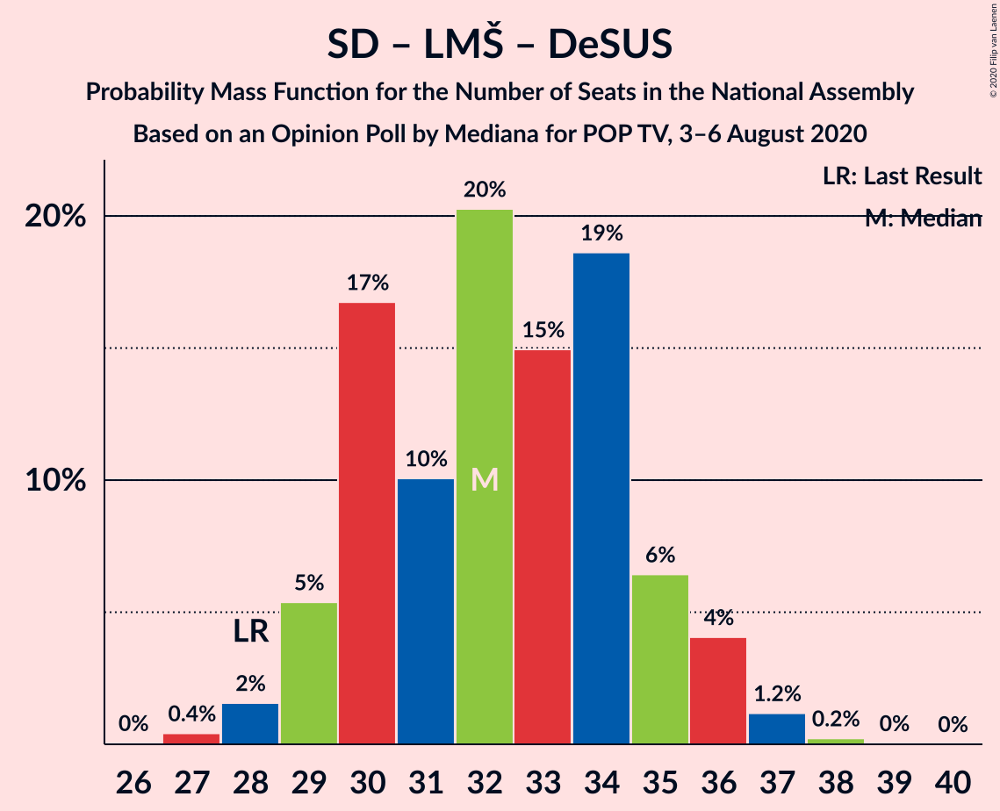

# Opinion Poll by Mediana for POP TV, 3–6 August 2020

<a href="#voting-intentions">Voting Intentions</a> | <a href="#seats">Seats</a> | <a href="#coalitions">Coalitions</a> | <a href="#technical-information">Technical Information</a>

## Voting Intentions

### Confidence Intervals

| Party | Last Result | Poll Result | 80% Confidence Interval | 90% Confidence Interval | 95% Confidence Interval | 99% Confidence Interval |
|:-----:|:-----------:|:-----------:|:-----------------------:|:-----------------------:|:-----------------------:|:-----------------------:|
| Slovenska demokratska stranka | 24.9% | 30.3% | 28.2–32.6% |27.6–33.3% |27.1–33.8% |26.1–34.9% |
| Socialni demokrati | 9.9% | 17.3% | 15.6–19.3% |15.2–19.8% |14.7–20.3% |14.0–21.2% |
| Lista Marjana Šarca | 12.6% | 15.1% | 13.5–16.9% |13.0–17.5% |12.7–17.9% |11.9–18.8% |
| Levica | 9.3% | 11.0% | 9.7–12.7% |9.3–13.2% |8.9–13.6% |8.3–14.4% |
| Nova Slovenija–Krščanski demokrati | 7.2% | 7.7% | 6.6–9.1% |6.2–9.5% |6.0–9.9% |5.4–10.6% |
| Stranka Alenke Bratušek | 5.1% | 2.9% | 2.3–3.9% |2.1–4.2% |1.9–4.5% |1.6–5.0% |
| Demokratična stranka upokojencev Slovenije | 4.9% | 2.4% | 1.8–3.3% |1.6–3.6% |1.5–3.8% |1.2–4.3% |
| Slovenska nacionalna stranka | 4.2% | 2.4% | 1.8–3.3% |1.6–3.6% |1.5–3.8% |1.2–4.3% |
| Stranka modernega centra | 9.7% | 2.1% | 1.6–3.0% |1.4–3.2% |1.3–3.4% |1.1–3.9% |
| Slovenska ljudska stranka | 2.6% | 1.8% | 1.3–2.6% |1.2–2.9% |1.1–3.1% |0.9–3.5% |

*Note:* The poll result column reflects the actual value used in the calculations. Published results may vary slightly, and in addition be rounded to fewer digits.

## Seats

### Confidence Intervals

| Party | Last Result | Median | 80% Confidence Interval | 90% Confidence Interval | 95% Confidence Interval | 99% Confidence Interval |
|:-----:|:-----------:|:------:|:-----------------------:|:-----------------------:|:-----------------------:|:-----------------------:|
| <a href="#slovenska-demokratska-stranka">Slovenska demokratska stranka</a> | 25 | 31 | 28–33 |28–33 |27–34 |26–35 |
| <a href="#socialni-demokrati">Socialni demokrati</a> | 10 | 17 | 15–19 |14–20 |14–20 |14–21 |
| <a href="#lista-marjana-šarca">Lista Marjana Šarca</a> | 13 | 15 | 13–17 |13–17 |12–18 |11–19 |
| <a href="#levica">Levica</a> | 9 | 11 | 9–13 |9–13 |9–13 |8–14 |
| <a href="#nova-slovenija–krščanski-demokrati">Nova Slovenija–Krščanski demokrati</a> | 7 | 7 | 6–9 |6–9 |5–10 |5–11 |
| <a href="#stranka-alenke-bratušek">Stranka Alenke Bratušek</a> | 5 | 0 | 0 |0–4 |0–4 |0–5 |
| <a href="#demokratična-stranka-upokojencev-slovenije">Demokratična stranka upokojencev Slovenije</a> | 5 | 0 | 0 |0 |0 |0–4 |
| <a href="#slovenska-nacionalna-stranka">Slovenska nacionalna stranka</a> | 4 | 0 | 0 |0 |0 |0–4 |
| <a href="#stranka-modernega-centra">Stranka modernega centra</a> | 10 | 0 | 0 |0 |0 |0 |
| <a href="#slovenska-ljudska-stranka">Slovenska ljudska stranka</a> | 0 | 0 | 0 |0 |0 |0 |

### Slovenska demokratska stranka

*For a full overview of the results for this party, see the [Slovenska demokratska stranka](party-slovenskademokratskastranka.html) page.*

| Number of Seats | Probability | Accumulated | Special Marks |
|:---------------:|:-----------:|:-----------:|:-------------:|
| 25 | 0.2% | 100% | Last Result |
| 26 | 1.1% | 99.7% |  |
| 27 | 3% | 98.6% |  |
| 28 | 9% | 95% |  |
| 29 | 17% | 86% |  |
| 30 | 15% | 69% |  |
| 31 | 24% | 54% | Median |
| 32 | 17% | 30% |  |
| 33 | 9% | 13% |  |
| 34 | 2% | 4% |  |
| 35 | 1.1% | 1.3% |  |
| 36 | 0.2% | 0.2% |  |
| 37 | 0% | 0% |  |

### Socialni demokrati

*For a full overview of the results for this party, see the [Socialni demokrati](party-socialnidemokrati.html) page.*

| Number of Seats | Probability | Accumulated | Special Marks |
|:---------------:|:-----------:|:-----------:|:-------------:|
| 10 | 0% | 100% | Last Result |
| 11 | 0% | 100% |  |
| 12 | 0% | 100% |  |
| 13 | 0.3% | 100% |  |
| 14 | 5% | 99.6% |  |
| 15 | 13% | 95% |  |
| 16 | 17% | 82% |  |
| 17 | 20% | 64% | Median |
| 18 | 20% | 45% |  |
| 19 | 17% | 24% |  |
| 20 | 6% | 8% |  |
| 21 | 2% | 2% |  |
| 22 | 0.2% | 0.3% |  |
| 23 | 0% | 0% |  |

### Lista Marjana Šarca

*For a full overview of the results for this party, see the [Lista Marjana Šarca](party-listamarjanašarca.html) page.*

| Number of Seats | Probability | Accumulated | Special Marks |
|:---------------:|:-----------:|:-----------:|:-------------:|
| 11 | 0.6% | 100% |  |
| 12 | 3% | 99.4% |  |
| 13 | 7% | 96% | Last Result |
| 14 | 21% | 89% |  |
| 15 | 37% | 68% | Median |
| 16 | 17% | 31% |  |
| 17 | 9% | 14% |  |
| 18 | 4% | 5% |  |
| 19 | 0.7% | 0.8% |  |
| 20 | 0.1% | 0.1% |  |
| 21 | 0% | 0% |  |

### Levica

*For a full overview of the results for this party, see the [Levica](party-levica.html) page.*

| Number of Seats | Probability | Accumulated | Special Marks |
|:---------------:|:-----------:|:-----------:|:-------------:|
| 7 | 0.1% | 100% |  |
| 8 | 2% | 99.9% |  |
| 9 | 14% | 98% | Last Result |
| 10 | 22% | 84% |  |
| 11 | 32% | 62% | Median |
| 12 | 15% | 30% |  |
| 13 | 12% | 15% |  |
| 14 | 2% | 2% |  |
| 15 | 0.3% | 0.3% |  |
| 16 | 0% | 0% |  |

### Nova Slovenija–Krščanski demokrati

*For a full overview of the results for this party, see the [Nova Slovenija–Krščanski demokrati](party-novaslovenija–krščanskidemokrati.html) page.*

| Number of Seats | Probability | Accumulated | Special Marks |
|:---------------:|:-----------:|:-----------:|:-------------:|
| 5 | 3% | 100% |  |
| 6 | 22% | 97% |  |
| 7 | 33% | 75% | Last Result, Median |
| 8 | 27% | 42% |  |
| 9 | 12% | 15% |  |
| 10 | 2% | 3% |  |
| 11 | 0.8% | 0.8% |  |
| 12 | 0% | 0% |  |

### Stranka Alenke Bratušek

*For a full overview of the results for this party, see the [Stranka Alenke Bratušek](party-strankaalenkebratušek.html) page.*

| Number of Seats | Probability | Accumulated | Special Marks |
|:---------------:|:-----------:|:-----------:|:-------------:|
| 0 | 91% | 100% | Median |
| 1 | 0% | 9% |  |
| 2 | 0% | 9% |  |
| 3 | 0.1% | 9% |  |
| 4 | 8% | 9% |  |
| 5 | 0.9% | 0.9% | Last Result |
| 6 | 0% | 0% |  |

### Demokratična stranka upokojencev Slovenije

*For a full overview of the results for this party, see the [Demokratična stranka upokojencev Slovenije](party-demokratičnastrankaupokojencevslovenije.html) page.*

| Number of Seats | Probability | Accumulated | Special Marks |
|:---------------:|:-----------:|:-----------:|:-------------:|
| 0 | 98.8% | 100% | Median |
| 1 | 0% | 1.2% |  |
| 2 | 0% | 1.2% |  |
| 3 | 0% | 1.2% |  |
| 4 | 1.2% | 1.2% |  |
| 5 | 0% | 0% | Last Result |

### Slovenska nacionalna stranka

*For a full overview of the results for this party, see the [Slovenska nacionalna stranka](party-slovenskanacionalnastranka.html) page.*

| Number of Seats | Probability | Accumulated | Special Marks |
|:---------------:|:-----------:|:-----------:|:-------------:|
| 0 | 98.6% | 100% | Median |
| 1 | 0% | 1.4% |  |
| 2 | 0% | 1.4% |  |
| 3 | 0% | 1.4% |  |
| 4 | 1.4% | 1.4% | Last Result |
| 5 | 0% | 0% |  |

### Stranka modernega centra

*For a full overview of the results for this party, see the [Stranka modernega centra](party-strankamodernegacentra.html) page.*

| Number of Seats | Probability | Accumulated | Special Marks |
|:---------------:|:-----------:|:-----------:|:-------------:|
| 0 | 99.7% | 100% | Median |
| 1 | 0% | 0.3% |  |
| 2 | 0% | 0.3% |  |
| 3 | 0% | 0.3% |  |
| 4 | 0.3% | 0.3% |  |
| 5 | 0% | 0% |  |
| 6 | 0% | 0% |  |
| 7 | 0% | 0% |  |
| 8 | 0% | 0% |  |
| 9 | 0% | 0% |  |
| 10 | 0% | 0% | Last Result |

### Slovenska ljudska stranka

*For a full overview of the results for this party, see the [Slovenska ljudska stranka](party-slovenskaljudskastranka.html) page.*

| Number of Seats | Probability | Accumulated | Special Marks |
|:---------------:|:-----------:|:-----------:|:-------------:|
| 0 | 99.9% | 100% | Last Result, Median |
| 1 | 0% | 0.1% |  |
| 2 | 0% | 0.1% |  |
| 3 | 0% | 0.1% |  |
| 4 | 0.1% | 0.1% |  |
| 5 | 0% | 0% |  |

## Coalitions

### Confidence Intervals

| Coalition | Last Result | Median | Majority? | 80% Confidence Interval | 90% Confidence Interval | 95% Confidence Interval | 99% Confidence Interval |
|:---------:|:-----------:|:------:|:---------:|:-----------------------:|:-----------------------:|:-----------------------:|:-----------------------:|
| Slovenska demokratska stranka – Lista Marjana Šarca – Demokratična stranka upokojencev Slovenije | 43 | 46 | 53% | 43–48 | 42–49 | 42–49 | 40–51 |
| Slovenska demokratska stranka – Lista Marjana Šarca | 38 | 46 | 52% | 43–48 | 42–49 | 42–49 | 40–51 |
| Socialni demokrati – Lista Marjana Šarca – Nova Slovenija–Krščanski demokrati – Stranka Alenke Bratušek – Demokratična stranka upokojencev Slovenije – Stranka modernega centra | 50 | 40 | 0.3% | 38–43 | 37–43 | 36–44 | 35–45 |
| Socialni demokrati – Lista Marjana Šarca – Nova Slovenija–Krščanski demokrati – Demokratična stranka upokojencev Slovenije | 35 | 40 | 0.2% | 37–43 | 37–43 | 36–43 | 35–44 |
| Socialni demokrati – Lista Marjana Šarca – Nova Slovenija–Krščanski demokrati – Demokratična stranka upokojencev Slovenije – Stranka modernega centra | 45 | 40 | 0.2% | 37–43 | 37–43 | 36–43 | 35–45 |
| Socialni demokrati – Lista Marjana Šarca – Nova Slovenija–Krščanski demokrati | 30 | 40 | 0.1% | 37–43 | 36–43 | 36–43 | 35–44 |
| Socialni demokrati – Lista Marjana Šarca – Nova Slovenija–Krščanski demokrati – Stranka modernega centra | 40 | 40 | 0.1% | 37–43 | 36–43 | 36–43 | 35–44 |
| Socialni demokrati – Lista Marjana Šarca – Stranka Alenke Bratušek – Demokratična stranka upokojencev Slovenije – Stranka modernega centra | 43 | 33 | 0% | 30–36 | 29–36 | 29–37 | 28–38 |
| Socialni demokrati – Lista Marjana Šarca – Demokratična stranka upokojencev Slovenije | 28 | 32 | 0% | 30–35 | 29–36 | 29–36 | 28–37 |
| Socialni demokrati – Lista Marjana Šarca – Demokratična stranka upokojencev Slovenije – Stranka modernega centra | 38 | 32 | 0% | 30–35 | 29–36 | 29–36 | 28–37 |
| Socialni demokrati – Lista Marjana Šarca | 23 | 32 | 0% | 30–35 | 29–36 | 29–36 | 27–37 |
| Socialni demokrati – Lista Marjana Šarca – Stranka modernega centra | 33 | 32 | 0% | 30–35 | 29–36 | 29–36 | 27–37 |
| Socialni demokrati – Demokratična stranka upokojencev Slovenije – Stranka modernega centra | 25 | 17 | 0% | 15–19 | 15–20 | 14–21 | 14–22 |

### Slovenska demokratska stranka – Lista Marjana Šarca – Demokratična stranka upokojencev Slovenije

| Number of Seats | Probability | Accumulated | Special Marks |
|:---------------:|:-----------:|:-----------:|:-------------:|
| 39 | 0.1% | 100% |  |
| 40 | 0.4% | 99.9% |  |
| 41 | 2% | 99.5% |  |
| 42 | 4% | 98% |  |
| 43 | 9% | 94% | Last Result |
| 44 | 11% | 85% |  |
| 45 | 21% | 74% |  |
| 46 | 20% | 53% | Median, Majority |
| 47 | 21% | 33% |  |
| 48 | 4% | 11% |  |
| 49 | 5% | 7% |  |
| 50 | 1.4% | 2% |  |
| 51 | 0.3% | 0.6% |  |
| 52 | 0.3% | 0.3% |  |
| 53 | 0% | 0% |  |

### Slovenska demokratska stranka – Lista Marjana Šarca

| Number of Seats | Probability | Accumulated | Special Marks |
|:---------------:|:-----------:|:-----------:|:-------------:|
| 38 | 0% | 100% | Last Result |
| 39 | 0.1% | 100% |  |
| 40 | 0.5% | 99.9% |  |
| 41 | 2% | 99.4% |  |
| 42 | 4% | 98% |  |
| 43 | 9% | 94% |  |
| 44 | 11% | 85% |  |
| 45 | 21% | 73% |  |
| 46 | 20% | 52% | Median, Majority |
| 47 | 21% | 32% |  |
| 48 | 4% | 11% |  |
| 49 | 5% | 6% |  |
| 50 | 1.4% | 2% |  |
| 51 | 0.3% | 0.6% |  |
| 52 | 0.3% | 0.3% |  |
| 53 | 0% | 0% |  |

### Socialni demokrati – Lista Marjana Šarca – Nova Slovenija–Krščanski demokrati – Stranka Alenke Bratušek – Demokratična stranka upokojencev Slovenije – Stranka modernega centra

| Number of Seats | Probability | Accumulated | Special Marks |
|:---------------:|:-----------:|:-----------:|:-------------:|
| 34 | 0.1% | 100% |  |
| 35 | 0.4% | 99.9% |  |
| 36 | 2% | 99.4% |  |
| 37 | 7% | 97% |  |
| 38 | 22% | 90% |  |
| 39 | 10% | 68% | Median |
| 40 | 20% | 59% |  |
| 41 | 16% | 39% |  |
| 42 | 8% | 23% |  |
| 43 | 11% | 15% |  |
| 44 | 3% | 5% |  |
| 45 | 1.2% | 1.5% |  |
| 46 | 0.2% | 0.3% | Majority |
| 47 | 0.1% | 0.1% |  |
| 48 | 0% | 0% |  |
| 49 | 0% | 0% |  |
| 50 | 0% | 0% | Last Result |

### Socialni demokrati – Lista Marjana Šarca – Nova Slovenija–Krščanski demokrati – Demokratična stranka upokojencev Slovenije

| Number of Seats | Probability | Accumulated | Special Marks |
|:---------------:|:-----------:|:-----------:|:-------------:|
| 33 | 0.1% | 100% |  |
| 34 | 0.3% | 99.9% |  |
| 35 | 1.0% | 99.6% | Last Result |
| 36 | 3% | 98.6% |  |
| 37 | 8% | 95% |  |
| 38 | 24% | 87% |  |
| 39 | 11% | 64% | Median |
| 40 | 20% | 53% |  |
| 41 | 16% | 33% |  |
| 42 | 6% | 17% |  |
| 43 | 9% | 10% |  |
| 44 | 1.2% | 2% |  |
| 45 | 0.3% | 0.5% |  |
| 46 | 0.1% | 0.2% | Majority |
| 47 | 0.1% | 0.1% |  |
| 48 | 0% | 0% |  |

### Socialni demokrati – Lista Marjana Šarca – Nova Slovenija–Krščanski demokrati – Demokratična stranka upokojencev Slovenije – Stranka modernega centra

| Number of Seats | Probability | Accumulated | Special Marks |
|:---------------:|:-----------:|:-----------:|:-------------:|
| 33 | 0.1% | 100% |  |
| 34 | 0.3% | 99.9% |  |
| 35 | 1.0% | 99.6% |  |
| 36 | 3% | 98.6% |  |
| 37 | 8% | 95% |  |
| 38 | 24% | 87% |  |
| 39 | 11% | 64% | Median |
| 40 | 20% | 53% |  |
| 41 | 16% | 33% |  |
| 42 | 6% | 17% |  |
| 43 | 9% | 10% |  |
| 44 | 1.2% | 2% |  |
| 45 | 0.3% | 0.5% | Last Result |
| 46 | 0.1% | 0.2% | Majority |
| 47 | 0.1% | 0.1% |  |
| 48 | 0% | 0% |  |

### Socialni demokrati – Lista Marjana Šarca – Nova Slovenija–Krščanski demokrati

| Number of Seats | Probability | Accumulated | Special Marks |
|:---------------:|:-----------:|:-----------:|:-------------:|
| 30 | 0% | 100% | Last Result |
| 31 | 0% | 100% |  |
| 32 | 0% | 100% |  |
| 33 | 0.1% | 100% |  |
| 34 | 0.3% | 99.9% |  |
| 35 | 1.0% | 99.6% |  |
| 36 | 4% | 98.5% |  |
| 37 | 8% | 95% |  |
| 38 | 24% | 87% |  |
| 39 | 11% | 63% | Median |
| 40 | 20% | 52% |  |
| 41 | 16% | 32% |  |
| 42 | 6% | 16% |  |
| 43 | 9% | 10% |  |
| 44 | 1.1% | 2% |  |
| 45 | 0.3% | 0.4% |  |
| 46 | 0.1% | 0.1% | Majority |
| 47 | 0% | 0% |  |

### Socialni demokrati – Lista Marjana Šarca – Nova Slovenija–Krščanski demokrati – Stranka modernega centra

| Number of Seats | Probability | Accumulated | Special Marks |
|:---------------:|:-----------:|:-----------:|:-------------:|
| 33 | 0.1% | 100% |  |
| 34 | 0.3% | 99.9% |  |
| 35 | 1.0% | 99.6% |  |
| 36 | 4% | 98.5% |  |
| 37 | 8% | 95% |  |
| 38 | 24% | 87% |  |
| 39 | 11% | 63% | Median |
| 40 | 20% | 52% | Last Result |
| 41 | 16% | 32% |  |
| 42 | 6% | 17% |  |
| 43 | 9% | 10% |  |
| 44 | 1.2% | 2% |  |
| 45 | 0.3% | 0.4% |  |
| 46 | 0.1% | 0.1% | Majority |
| 47 | 0% | 0% |  |

### Socialni demokrati – Lista Marjana Šarca – Stranka Alenke Bratušek – Demokratična stranka upokojencev Slovenije – Stranka modernega centra

| Number of Seats | Probability | Accumulated | Special Marks |
|:---------------:|:-----------:|:-----------:|:-------------:|
| 27 | 0.2% | 100% |  |
| 28 | 1.0% | 99.8% |  |
| 29 | 4% | 98.7% |  |
| 30 | 15% | 95% |  |
| 31 | 9% | 79% |  |
| 32 | 19% | 70% | Median |
| 33 | 15% | 51% |  |
| 34 | 19% | 37% |  |
| 35 | 7% | 18% |  |
| 36 | 6% | 11% |  |
| 37 | 3% | 4% |  |
| 38 | 1.5% | 2% |  |
| 39 | 0.2% | 0.2% |  |
| 40 | 0% | 0% |  |
| 41 | 0% | 0% |  |
| 42 | 0% | 0% |  |
| 43 | 0% | 0% | Last Result |

### Socialni demokrati – Lista Marjana Šarca – Demokratična stranka upokojencev Slovenije

| Number of Seats | Probability | Accumulated | Special Marks |
|:---------------:|:-----------:|:-----------:|:-------------:|
| 26 | 0% | 100% |  |
| 27 | 0.4% | 99.9% |  |
| 28 | 2% | 99.5% | Last Result |
| 29 | 5% | 98% |  |
| 30 | 17% | 93% |  |
| 31 | 10% | 76% |  |
| 32 | 20% | 66% | Median |
| 33 | 15% | 46% |  |
| 34 | 19% | 31% |  |
| 35 | 6% | 12% |  |
| 36 | 4% | 6% |  |
| 37 | 1.2% | 1.5% |  |
| 38 | 0.2% | 0.3% |  |
| 39 | 0% | 0.1% |  |
| 40 | 0% | 0% |  |

### Socialni demokrati – Lista Marjana Šarca – Demokratična stranka upokojencev Slovenije – Stranka modernega centra

| Number of Seats | Probability | Accumulated | Special Marks |
|:---------------:|:-----------:|:-----------:|:-------------:|
| 26 | 0% | 100% |  |
| 27 | 0.4% | 99.9% |  |
| 28 | 2% | 99.5% |  |
| 29 | 5% | 98% |  |
| 30 | 17% | 93% |  |
| 31 | 10% | 76% |  |
| 32 | 20% | 66% | Median |
| 33 | 15% | 46% |  |
| 34 | 19% | 31% |  |
| 35 | 6% | 12% |  |
| 36 | 4% | 6% |  |
| 37 | 1.2% | 2% |  |
| 38 | 0.2% | 0.3% | Last Result |
| 39 | 0% | 0.1% |  |
| 40 | 0% | 0% |  |

### Socialni demokrati – Lista Marjana Šarca

| Number of Seats | Probability | Accumulated | Special Marks |
|:---------------:|:-----------:|:-----------:|:-------------:|
| 23 | 0% | 100% | Last Result |
| 24 | 0% | 100% |  |
| 25 | 0% | 100% |  |
| 26 | 0.1% | 100% |  |
| 27 | 0.4% | 99.9% |  |
| 28 | 2% | 99.5% |  |
| 29 | 6% | 98% |  |
| 30 | 17% | 92% |  |
| 31 | 10% | 75% |  |
| 32 | 20% | 65% | Median |
| 33 | 15% | 45% |  |
| 34 | 18% | 30% |  |
| 35 | 6% | 11% |  |
| 36 | 4% | 5% |  |
| 37 | 1.1% | 1.3% |  |
| 38 | 0.2% | 0.2% |  |
| 39 | 0% | 0% |  |

### Socialni demokrati – Lista Marjana Šarca – Stranka modernega centra

| Number of Seats | Probability | Accumulated | Special Marks |
|:---------------:|:-----------:|:-----------:|:-------------:|
| 26 | 0.1% | 100% |  |
| 27 | 0.4% | 99.9% |  |
| 28 | 2% | 99.5% |  |
| 29 | 5% | 98% |  |
| 30 | 17% | 92% |  |
| 31 | 10% | 75% |  |
| 32 | 20% | 65% | Median |
| 33 | 15% | 45% | Last Result |
| 34 | 18% | 30% |  |
| 35 | 6% | 12% |  |
| 36 | 4% | 5% |  |
| 37 | 1.2% | 1.4% |  |
| 38 | 0.2% | 0.2% |  |
| 39 | 0% | 0% |  |

### Socialni demokrati – Demokratična stranka upokojencev Slovenije – Stranka modernega centra

| Number of Seats | Probability | Accumulated | Special Marks |
|:---------------:|:-----------:|:-----------:|:-------------:|
| 13 | 0.3% | 100% |  |
| 14 | 5% | 99.7% |  |
| 15 | 13% | 95% |  |
| 16 | 17% | 82% |  |
| 17 | 19% | 65% | Median |
| 18 | 20% | 46% |  |
| 19 | 17% | 25% |  |
| 20 | 6% | 8% |  |
| 21 | 2% | 3% |  |
| 22 | 0.5% | 0.7% |  |
| 23 | 0.1% | 0.2% |  |
| 24 | 0% | 0% |  |
| 25 | 0% | 0% | Last Result |

## Technical Information

### Opinion Poll

+ **Polling firm:** Mediana
+ **Commissioner(s):** POP TV
+ **Fieldwork period:** 3–6 August 2020

### Calculations

+ **Sample size:** 715
+ **Simulations done:** 1,048,576
+ **Error estimate:** 1.81%

