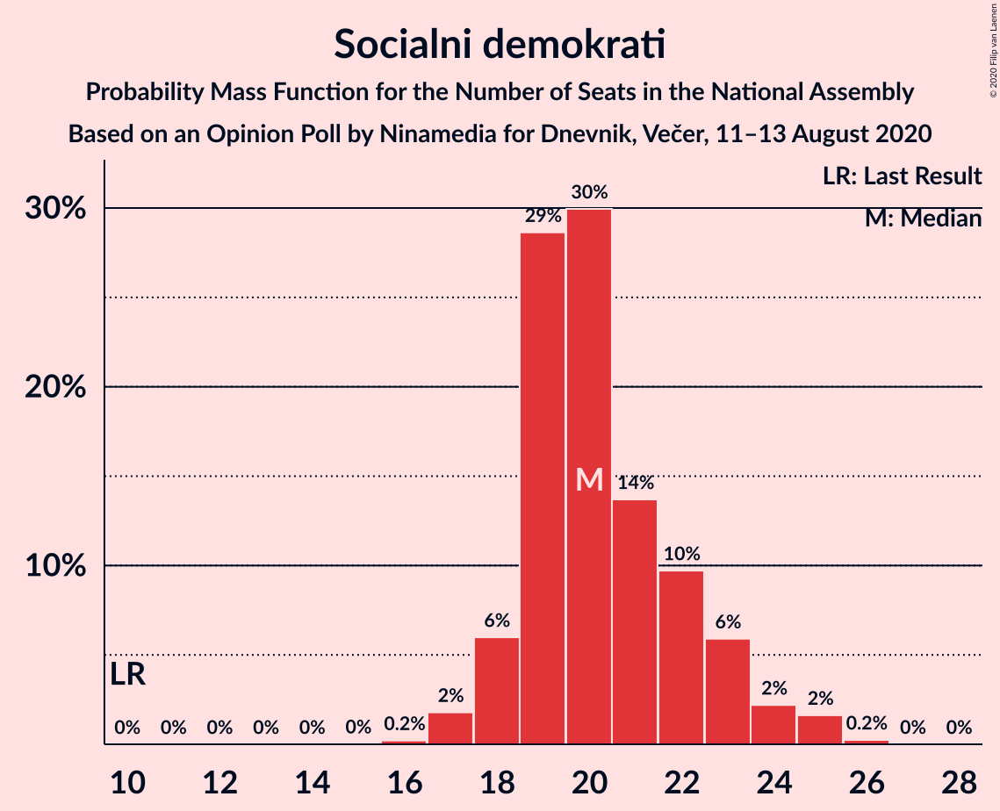
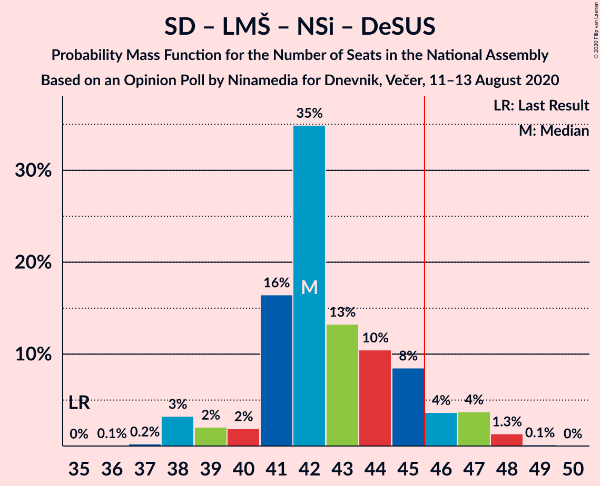
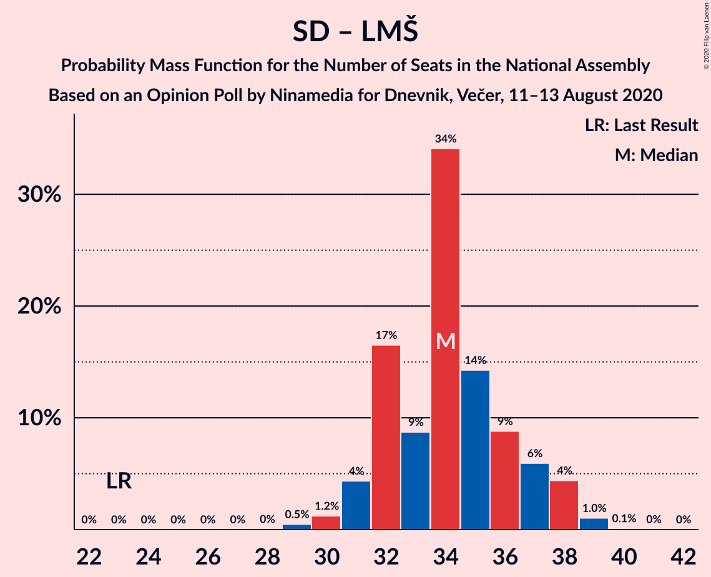

# Opinion Poll by Ninamedia for Dnevnik, Večer, 11–13 August 2020

<a href="#voting-intentions">Voting Intentions</a> | <a href="#seats">Seats</a> | <a href="#coalitions">Coalitions</a> | <a href="#technical-information">Technical Information</a>

## Voting Intentions

### Confidence Intervals

| Party | Last Result | Poll Result | 80% Confidence Interval | 90% Confidence Interval | 95% Confidence Interval | 99% Confidence Interval |
|:-----:|:-----------:|:-----------:|:-----------------------:|:-----------------------:|:-----------------------:|:-----------------------:|
| Slovenska demokratska stranka | 24.9% | 35.9% | 33.6–38.2% |32.9–38.9% |32.4–39.5% |31.3–40.6% |
| Socialni demokrati | 9.9% | 21.4% | 19.5–23.5% |19.0–24.1% |18.5–24.6% |17.7–25.7% |
| Lista Marjana Šarca | 12.6% | 14.6% | 13.0–16.4% |12.5–16.9% |12.1–17.4% |11.4–18.3% |
| Levica | 9.3% | 10.1% | 8.8–11.8% |8.4–12.2% |8.1–12.6% |7.5–13.4% |
| Nova Slovenija–Krščanski demokrati | 7.2% | 8.9% | 7.6–10.4% |7.3–10.8% |7.0–11.2% |6.4–12.0% |
| Slovenska nacionalna stranka | 4.2% | 3.3% | 2.6–4.3% |2.4–4.6% |2.2–4.9% |1.9–5.4% |
| Demokratična stranka upokojencev Slovenije | 4.9% | 2.9% | 2.2–3.8% |2.0–4.1% |1.9–4.4% |1.6–4.9% |
| Stranka Alenke Bratušek | 5.1% | 1.4% | 1.0–2.2% |0.9–2.4% |0.8–2.6% |0.6–3.0% |
| Slovenska ljudska stranka | 2.6% | 0.4% | 0.2–1.0% |0.2–1.1% |0.2–1.2% |0.1–1.6% |
| Stranka modernega centra | 9.7% | 0.1% | 0.1–0.6% |0.0–0.7% |0.0–0.8% |0.0–1.1% |

*Note:* The poll result column reflects the actual value used in the calculations. Published results may vary slightly, and in addition be rounded to fewer digits.

## Seats

### Confidence Intervals

| Party | Last Result | Median | 80% Confidence Interval | 90% Confidence Interval | 95% Confidence Interval | 99% Confidence Interval |
|:-----:|:-----------:|:------:|:-----------------------:|:-----------------------:|:-----------------------:|:-----------------------:|
| <a href="#slovenska-demokratska-stranka">Slovenska demokratska stranka</a> | 25 | 35 | 33–37 |32–38 |31–38 |30–39 |
| <a href="#socialni-demokrati">Socialni demokrati</a> | 10 | 20 | 19–22 |18–23 |18–24 |17–25 |
| <a href="#lista-marjana-šarca">Lista Marjana Šarca</a> | 13 | 14 | 13–15 |12–16 |12–17 |10–17 |
| <a href="#levica">Levica</a> | 9 | 10 | 8–11 |7–11 |7–12 |7–13 |
| <a href="#nova-slovenija–krščanski-demokrati">Nova Slovenija–Krščanski demokrati</a> | 7 | 8 | 7–10 |7–10 |6–11 |6–12 |
| <a href="#slovenska-nacionalna-stranka">Slovenska nacionalna stranka</a> | 4 | 0 | 0–4 |0–4 |0–4 |0–5 |
| <a href="#demokratična-stranka-upokojencev-slovenije">Demokratična stranka upokojencev Slovenije</a> | 5 | 0 | 0 |0–3 |0–4 |0–4 |
| <a href="#stranka-alenke-bratušek">Stranka Alenke Bratušek</a> | 5 | 0 | 0 |0 |0 |0 |
| <a href="#slovenska-ljudska-stranka">Slovenska ljudska stranka</a> | 0 | 0 | 0 |0 |0 |0 |
| <a href="#stranka-modernega-centra">Stranka modernega centra</a> | 10 | 0 | 0 |0 |0 |0 |

### Slovenska demokratska stranka

*For a full overview of the results for this party, see the [Slovenska demokratska stranka](party-slovenskademokratskastranka.html) page.*

| Number of Seats | Probability | Accumulated | Special Marks |
|:---------------:|:-----------:|:-----------:|:-------------:|
| 25 | 0% | 100% | Last Result |
| 26 | 0% | 100% |  |
| 27 | 0% | 100% |  |
| 28 | 0% | 100% |  |
| 29 | 0.1% | 100% |  |
| 30 | 0.9% | 99.8% |  |
| 31 | 4% | 98.9% |  |
| 32 | 4% | 95% |  |
| 33 | 20% | 91% |  |
| 34 | 11% | 71% |  |
| 35 | 28% | 60% | Median |
| 36 | 10% | 32% |  |
| 37 | 16% | 23% |  |
| 38 | 5% | 6% |  |
| 39 | 0.6% | 1.0% |  |
| 40 | 0.4% | 0.4% |  |
| 41 | 0% | 0% |  |

### Socialni demokrati

*For a full overview of the results for this party, see the [Socialni demokrati](party-socialnidemokrati.html) page.*

| Number of Seats | Probability | Accumulated | Special Marks |
|:---------------:|:-----------:|:-----------:|:-------------:|
| 10 | 0% | 100% | Last Result |
| 11 | 0% | 100% |  |
| 12 | 0% | 100% |  |
| 13 | 0% | 100% |  |
| 14 | 0% | 100% |  |
| 15 | 0% | 100% |  |
| 16 | 0.2% | 100% |  |
| 17 | 2% | 99.8% |  |
| 18 | 6% | 98% |  |
| 19 | 29% | 92% |  |
| 20 | 30% | 63% | Median |
| 21 | 14% | 33% |  |
| 22 | 10% | 20% |  |
| 23 | 6% | 10% |  |
| 24 | 2% | 4% |  |
| 25 | 2% | 2% |  |
| 26 | 0.2% | 0.2% |  |
| 27 | 0% | 0% |  |

### Lista Marjana Šarca

*For a full overview of the results for this party, see the [Lista Marjana Šarca](party-listamarjanašarca.html) page.*

| Number of Seats | Probability | Accumulated | Special Marks |
|:---------------:|:-----------:|:-----------:|:-------------:|
| 10 | 0.5% | 100% |  |
| 11 | 2% | 99.5% |  |
| 12 | 8% | 98% |  |
| 13 | 27% | 90% | Last Result |
| 14 | 33% | 63% | Median |
| 15 | 25% | 30% |  |
| 16 | 3% | 5% |  |
| 17 | 2% | 3% |  |
| 18 | 0.4% | 0.5% |  |
| 19 | 0.1% | 0.1% |  |
| 20 | 0% | 0% |  |

### Levica

*For a full overview of the results for this party, see the [Levica](party-levica.html) page.*

| Number of Seats | Probability | Accumulated | Special Marks |
|:---------------:|:-----------:|:-----------:|:-------------:|
| 6 | 0.2% | 100% |  |
| 7 | 5% | 99.8% |  |
| 8 | 10% | 95% |  |
| 9 | 27% | 85% | Last Result |
| 10 | 28% | 58% | Median |
| 11 | 25% | 30% |  |
| 12 | 4% | 5% |  |
| 13 | 0.6% | 0.7% |  |
| 14 | 0.1% | 0.1% |  |
| 15 | 0% | 0% |  |

### Nova Slovenija–Krščanski demokrati

*For a full overview of the results for this party, see the [Nova Slovenija–Krščanski demokrati](party-novaslovenija–krščanskidemokrati.html) page.*

| Number of Seats | Probability | Accumulated | Special Marks |
|:---------------:|:-----------:|:-----------:|:-------------:|
| 5 | 0.2% | 100% |  |
| 6 | 4% | 99.8% |  |
| 7 | 16% | 96% | Last Result |
| 8 | 43% | 80% | Median |
| 9 | 25% | 36% |  |
| 10 | 7% | 11% |  |
| 11 | 3% | 4% |  |
| 12 | 1.3% | 1.3% |  |
| 13 | 0% | 0% |  |

### Slovenska nacionalna stranka

*For a full overview of the results for this party, see the [Slovenska nacionalna stranka](party-slovenskanacionalnastranka.html) page.*

| Number of Seats | Probability | Accumulated | Special Marks |
|:---------------:|:-----------:|:-----------:|:-------------:|
| 0 | 78% | 100% | Median |
| 1 | 0% | 22% |  |
| 2 | 0% | 22% |  |
| 3 | 2% | 22% |  |
| 4 | 18% | 19% | Last Result |
| 5 | 1.1% | 1.1% |  |
| 6 | 0% | 0% |  |

### Demokratična stranka upokojencev Slovenije

*For a full overview of the results for this party, see the [Demokratična stranka upokojencev Slovenije](party-demokratičnastrankaupokojencevslovenije.html) page.*

| Number of Seats | Probability | Accumulated | Special Marks |
|:---------------:|:-----------:|:-----------:|:-------------:|
| 0 | 94% | 100% | Median |
| 1 | 0% | 6% |  |
| 2 | 0% | 6% |  |
| 3 | 1.5% | 6% |  |
| 4 | 4% | 4% |  |
| 5 | 0.5% | 0.5% | Last Result |
| 6 | 0% | 0% |  |

### Stranka Alenke Bratušek

*For a full overview of the results for this party, see the [Stranka Alenke Bratušek](party-strankaalenkebratušek.html) page.*

| Number of Seats | Probability | Accumulated | Special Marks |
|:---------------:|:-----------:|:-----------:|:-------------:|
| 0 | 100% | 100% | Median |
| 1 | 0% | 0% |  |
| 2 | 0% | 0% |  |
| 3 | 0% | 0% |  |
| 4 | 0% | 0% |  |
| 5 | 0% | 0% | Last Result |

### Slovenska ljudska stranka

*For a full overview of the results for this party, see the [Slovenska ljudska stranka](party-slovenskaljudskastranka.html) page.*

| Number of Seats | Probability | Accumulated | Special Marks |
|:---------------:|:-----------:|:-----------:|:-------------:|
| 0 | 100% | 100% | Last Result, Median |

### Stranka modernega centra

*For a full overview of the results for this party, see the [Stranka modernega centra](party-strankamodernegacentra.html) page.*

| Number of Seats | Probability | Accumulated | Special Marks |
|:---------------:|:-----------:|:-----------:|:-------------:|
| 0 | 100% | 100% | Median |
| 1 | 0% | 0% |  |
| 2 | 0% | 0% |  |
| 3 | 0% | 0% |  |
| 4 | 0% | 0% |  |
| 5 | 0% | 0% |  |
| 6 | 0% | 0% |  |
| 7 | 0% | 0% |  |
| 8 | 0% | 0% |  |
| 9 | 0% | 0% |  |
| 10 | 0% | 0% | Last Result |

## Coalitions

### Confidence Intervals

| Coalition | Last Result | Median | Majority? | 80% Confidence Interval | 90% Confidence Interval | 95% Confidence Interval | 99% Confidence Interval |
|:---------:|:-----------:|:------:|:---------:|:-----------------------:|:-----------------------:|:-----------------------:|:-----------------------:|
| Slovenska demokratska stranka – Lista Marjana Šarca – Demokratična stranka upokojencev Slovenije | 43 | 49 | 96% | 47–51 | 46–52 | 45–53 | 43–53 |
| Slovenska demokratska stranka – Lista Marjana Šarca | 38 | 49 | 95% | 47–50 | 46–52 | 44–53 | 43–53 |
| Socialni demokrati – Lista Marjana Šarca – Nova Slovenija–Krščanski demokrati – Demokratična stranka upokojencev Slovenije | 35 | 42 | 9% | 41–45 | 39–47 | 38–47 | 38–48 |
| Socialni demokrati – Lista Marjana Šarca – Nova Slovenija–Krščanski demokrati – Demokratična stranka upokojencev Slovenije – Stranka Alenke Bratušek – Stranka modernega centra | 50 | 42 | 9% | 41–45 | 39–47 | 38–47 | 38–48 |
| Socialni demokrati – Lista Marjana Šarca – Nova Slovenija–Krščanski demokrati – Demokratična stranka upokojencev Slovenije – Stranka modernega centra | 45 | 42 | 9% | 41–45 | 39–47 | 38–47 | 38–48 |
| Socialni demokrati – Lista Marjana Šarca – Nova Slovenija–Krščanski demokrati | 30 | 42 | 7% | 41–45 | 39–46 | 38–47 | 38–48 |
| Socialni demokrati – Lista Marjana Šarca – Nova Slovenija–Krščanski demokrati – Stranka modernega centra | 40 | 42 | 7% | 41–45 | 39–46 | 38–47 | 38–48 |
| Socialni demokrati – Lista Marjana Šarca – Demokratična stranka upokojencev Slovenije | 28 | 34 | 0% | 32–37 | 31–38 | 31–39 | 30–40 |
| Socialni demokrati – Lista Marjana Šarca – Demokratična stranka upokojencev Slovenije – Stranka Alenke Bratušek – Stranka modernega centra | 43 | 34 | 0% | 32–37 | 31–38 | 31–39 | 30–40 |
| Socialni demokrati – Lista Marjana Šarca – Demokratična stranka upokojencev Slovenije – Stranka modernega centra | 38 | 34 | 0% | 32–37 | 31–38 | 31–39 | 30–40 |
| Socialni demokrati – Lista Marjana Šarca | 23 | 34 | 0% | 32–37 | 31–38 | 31–38 | 29–39 |
| Socialni demokrati – Lista Marjana Šarca – Stranka modernega centra | 33 | 34 | 0% | 32–37 | 31–38 | 31–38 | 29–39 |
| Socialni demokrati – Demokratična stranka upokojencev Slovenije – Stranka modernega centra | 25 | 20 | 0% | 19–23 | 18–24 | 18–25 | 17–26 |

### Slovenska demokratska stranka – Lista Marjana Šarca – Demokratična stranka upokojencev Slovenije

| Number of Seats | Probability | Accumulated | Special Marks |
|:---------------:|:-----------:|:-----------:|:-------------:|
| 42 | 0.1% | 100% |  |
| 43 | 0.5% | 99.9% | Last Result |
| 44 | 2% | 99.4% |  |
| 45 | 2% | 98% |  |
| 46 | 4% | 96% | Majority |
| 47 | 9% | 92% |  |
| 48 | 20% | 83% |  |
| 49 | 32% | 64% | Median |
| 50 | 17% | 31% |  |
| 51 | 6% | 14% |  |
| 52 | 3% | 7% |  |
| 53 | 5% | 5% |  |
| 54 | 0.3% | 0.4% |  |
| 55 | 0.1% | 0.1% |  |
| 56 | 0% | 0% |  |

### Slovenska demokratska stranka – Lista Marjana Šarca

| Number of Seats | Probability | Accumulated | Special Marks |
|:---------------:|:-----------:|:-----------:|:-------------:|
| 38 | 0% | 100% | Last Result |
| 39 | 0% | 100% |  |
| 40 | 0% | 100% |  |
| 41 | 0% | 100% |  |
| 42 | 0.1% | 100% |  |
| 43 | 0.6% | 99.9% |  |
| 44 | 2% | 99.3% |  |
| 45 | 2% | 97% |  |
| 46 | 5% | 95% | Majority |
| 47 | 11% | 90% |  |
| 48 | 20% | 79% |  |
| 49 | 32% | 59% | Median |
| 50 | 17% | 27% |  |
| 51 | 3% | 10% |  |
| 52 | 2% | 7% |  |
| 53 | 4% | 4% |  |
| 54 | 0.2% | 0.3% |  |
| 55 | 0.1% | 0.1% |  |
| 56 | 0% | 0% |  |

### Socialni demokrati – Lista Marjana Šarca – Nova Slovenija–Krščanski demokrati – Demokratična stranka upokojencev Slovenije

| Number of Seats | Probability | Accumulated | Special Marks |
|:---------------:|:-----------:|:-----------:|:-------------:|
| 35 | 0% | 100% | Last Result |
| 36 | 0.1% | 100% |  |
| 37 | 0.2% | 99.9% |  |
| 38 | 3% | 99.7% |  |
| 39 | 2% | 96% |  |
| 40 | 2% | 94% |  |
| 41 | 16% | 93% |  |
| 42 | 35% | 76% | Median |
| 43 | 13% | 41% |  |
| 44 | 10% | 28% |  |
| 45 | 8% | 17% |  |
| 46 | 4% | 9% | Majority |
| 47 | 4% | 5% |  |
| 48 | 1.3% | 2% |  |
| 49 | 0.1% | 0.2% |  |
| 50 | 0% | 0% |  |

### Socialni demokrati – Lista Marjana Šarca – Nova Slovenija–Krščanski demokrati – Demokratična stranka upokojencev Slovenije – Stranka Alenke Bratušek – Stranka modernega centra

| Number of Seats | Probability | Accumulated | Special Marks |
|:---------------:|:-----------:|:-----------:|:-------------:|
| 36 | 0.1% | 100% |  |
| 37 | 0.2% | 99.9% |  |
| 38 | 3% | 99.7% |  |
| 39 | 2% | 96% |  |
| 40 | 2% | 94% |  |
| 41 | 16% | 93% |  |
| 42 | 35% | 76% | Median |
| 43 | 13% | 41% |  |
| 44 | 10% | 28% |  |
| 45 | 9% | 17% |  |
| 46 | 4% | 9% | Majority |
| 47 | 4% | 5% |  |
| 48 | 1.3% | 2% |  |
| 49 | 0.1% | 0.2% |  |
| 50 | 0% | 0% | Last Result |

### Socialni demokrati – Lista Marjana Šarca – Nova Slovenija–Krščanski demokrati – Demokratična stranka upokojencev Slovenije – Stranka modernega centra

| Number of Seats | Probability | Accumulated | Special Marks |
|:---------------:|:-----------:|:-----------:|:-------------:|
| 36 | 0.1% | 100% |  |
| 37 | 0.2% | 99.9% |  |
| 38 | 3% | 99.7% |  |
| 39 | 2% | 96% |  |
| 40 | 2% | 94% |  |
| 41 | 16% | 93% |  |
| 42 | 35% | 76% | Median |
| 43 | 13% | 41% |  |
| 44 | 10% | 28% |  |
| 45 | 8% | 17% | Last Result |
| 46 | 4% | 9% | Majority |
| 47 | 4% | 5% |  |
| 48 | 1.3% | 2% |  |
| 49 | 0.1% | 0.2% |  |
| 50 | 0% | 0% |  |

### Socialni demokrati – Lista Marjana Šarca – Nova Slovenija–Krščanski demokrati

| Number of Seats | Probability | Accumulated | Special Marks |
|:---------------:|:-----------:|:-----------:|:-------------:|
| 30 | 0% | 100% | Last Result |
| 31 | 0% | 100% |  |
| 32 | 0% | 100% |  |
| 33 | 0% | 100% |  |
| 34 | 0% | 100% |  |
| 35 | 0% | 100% |  |
| 36 | 0.1% | 100% |  |
| 37 | 0.3% | 99.9% |  |
| 38 | 4% | 99.6% |  |
| 39 | 3% | 95% |  |
| 40 | 3% | 93% |  |
| 41 | 17% | 90% |  |
| 42 | 35% | 73% | Median |
| 43 | 13% | 38% |  |
| 44 | 11% | 25% |  |
| 45 | 7% | 14% |  |
| 46 | 3% | 7% | Majority |
| 47 | 3% | 4% |  |
| 48 | 0.4% | 0.5% |  |
| 49 | 0.1% | 0.1% |  |
| 50 | 0% | 0% |  |

### Socialni demokrati – Lista Marjana Šarca – Nova Slovenija–Krščanski demokrati – Stranka modernega centra

| Number of Seats | Probability | Accumulated | Special Marks |
|:---------------:|:-----------:|:-----------:|:-------------:|
| 36 | 0.1% | 100% |  |
| 37 | 0.3% | 99.9% |  |
| 38 | 4% | 99.6% |  |
| 39 | 3% | 95% |  |
| 40 | 3% | 93% | Last Result |
| 41 | 17% | 90% |  |
| 42 | 35% | 73% | Median |
| 43 | 13% | 38% |  |
| 44 | 11% | 25% |  |
| 45 | 7% | 14% |  |
| 46 | 3% | 7% | Majority |
| 47 | 3% | 4% |  |
| 48 | 0.4% | 0.5% |  |
| 49 | 0.1% | 0.1% |  |
| 50 | 0% | 0% |  |

### Socialni demokrati – Lista Marjana Šarca – Demokratična stranka upokojencev Slovenije

| Number of Seats | Probability | Accumulated | Special Marks |
|:---------------:|:-----------:|:-----------:|:-------------:|
| 28 | 0% | 100% | Last Result |
| 29 | 0.4% | 100% |  |
| 30 | 0.8% | 99.5% |  |
| 31 | 4% | 98.7% |  |
| 32 | 15% | 95% |  |
| 33 | 7% | 79% |  |
| 34 | 34% | 72% | Median |
| 35 | 15% | 38% |  |
| 36 | 9% | 24% |  |
| 37 | 7% | 15% |  |
| 38 | 5% | 8% |  |
| 39 | 2% | 3% |  |
| 40 | 0.9% | 1.0% |  |
| 41 | 0.1% | 0.1% |  |
| 42 | 0% | 0% |  |

### Socialni demokrati – Lista Marjana Šarca – Demokratična stranka upokojencev Slovenije – Stranka Alenke Bratušek – Stranka modernega centra

| Number of Seats | Probability | Accumulated | Special Marks |
|:---------------:|:-----------:|:-----------:|:-------------:|
| 29 | 0.4% | 100% |  |
| 30 | 0.8% | 99.5% |  |
| 31 | 4% | 98.7% |  |
| 32 | 15% | 95% |  |
| 33 | 7% | 79% |  |
| 34 | 34% | 72% | Median |
| 35 | 15% | 38% |  |
| 36 | 9% | 24% |  |
| 37 | 7% | 15% |  |
| 38 | 5% | 8% |  |
| 39 | 2% | 3% |  |
| 40 | 0.9% | 1.0% |  |
| 41 | 0.1% | 0.1% |  |
| 42 | 0% | 0% |  |
| 43 | 0% | 0% | Last Result |

### Socialni demokrati – Lista Marjana Šarca – Demokratična stranka upokojencev Slovenije – Stranka modernega centra

| Number of Seats | Probability | Accumulated | Special Marks |
|:---------------:|:-----------:|:-----------:|:-------------:|
| 29 | 0.4% | 100% |  |
| 30 | 0.8% | 99.5% |  |
| 31 | 4% | 98.7% |  |
| 32 | 15% | 95% |  |
| 33 | 7% | 79% |  |
| 34 | 34% | 72% | Median |
| 35 | 15% | 38% |  |
| 36 | 9% | 24% |  |
| 37 | 7% | 15% |  |
| 38 | 5% | 8% | Last Result |
| 39 | 2% | 3% |  |
| 40 | 0.9% | 1.0% |  |
| 41 | 0.1% | 0.1% |  |
| 42 | 0% | 0% |  |

### Socialni demokrati – Lista Marjana Šarca

| Number of Seats | Probability | Accumulated | Special Marks |
|:---------------:|:-----------:|:-----------:|:-------------:|
| 23 | 0% | 100% | Last Result |
| 24 | 0% | 100% |  |
| 25 | 0% | 100% |  |
| 26 | 0% | 100% |  |
| 27 | 0% | 100% |  |
| 28 | 0% | 100% |  |
| 29 | 0.5% | 100% |  |
| 30 | 1.2% | 99.5% |  |
| 31 | 4% | 98% |  |
| 32 | 17% | 94% |  |
| 33 | 9% | 77% |  |
| 34 | 34% | 69% | Median |
| 35 | 14% | 35% |  |
| 36 | 9% | 20% |  |
| 37 | 6% | 12% |  |
| 38 | 4% | 6% |  |
| 39 | 1.0% | 1.2% |  |
| 40 | 0.1% | 0.1% |  |
| 41 | 0% | 0% |  |

### Socialni demokrati – Lista Marjana Šarca – Stranka modernega centra

| Number of Seats | Probability | Accumulated | Special Marks |
|:---------------:|:-----------:|:-----------:|:-------------:|
| 29 | 0.5% | 100% |  |
| 30 | 1.2% | 99.5% |  |
| 31 | 4% | 98% |  |
| 32 | 17% | 94% |  |
| 33 | 9% | 77% | Last Result |
| 34 | 34% | 69% | Median |
| 35 | 14% | 35% |  |
| 36 | 9% | 20% |  |
| 37 | 6% | 12% |  |
| 38 | 4% | 6% |  |
| 39 | 1.0% | 1.2% |  |
| 40 | 0.1% | 0.1% |  |
| 41 | 0% | 0% |  |

### Socialni demokrati – Demokratična stranka upokojencev Slovenije – Stranka modernega centra

| Number of Seats | Probability | Accumulated | Special Marks |
|:---------------:|:-----------:|:-----------:|:-------------:|
| 16 | 0.2% | 100% |  |
| 17 | 2% | 99.8% |  |
| 18 | 5% | 98% |  |
| 19 | 28% | 94% |  |
| 20 | 28% | 65% | Median |
| 21 | 13% | 37% |  |
| 22 | 10% | 24% |  |
| 23 | 6% | 14% |  |
| 24 | 4% | 8% |  |
| 25 | 3% | 4% | Last Result |
| 26 | 0.8% | 0.9% |  |
| 27 | 0.1% | 0.1% |  |
| 28 | 0% | 0% |  |

## Technical Information

### Opinion Poll

+ **Polling firm:** Ninamedia
+ **Commissioner(s):** Dnevnik, Večer
+ **Fieldwork period:** 11–13 August 2020

### Calculations

+ **Sample size:** 700
+ **Simulations done:** 1,048,576
+ **Error estimate:** 3.38%

