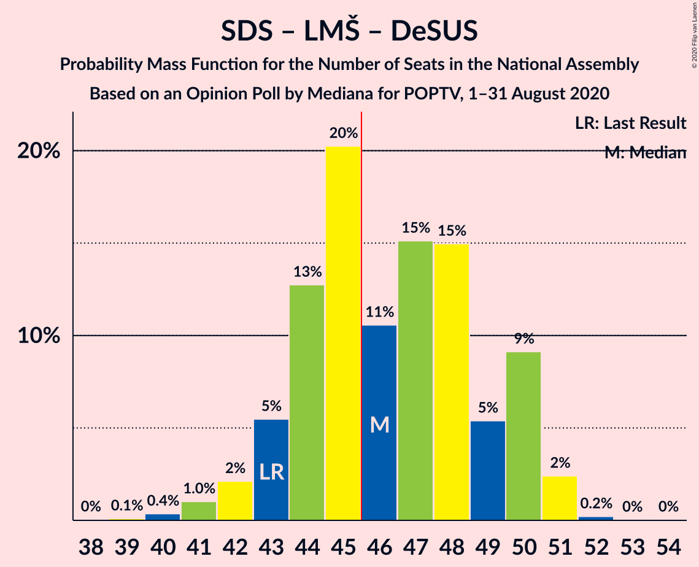
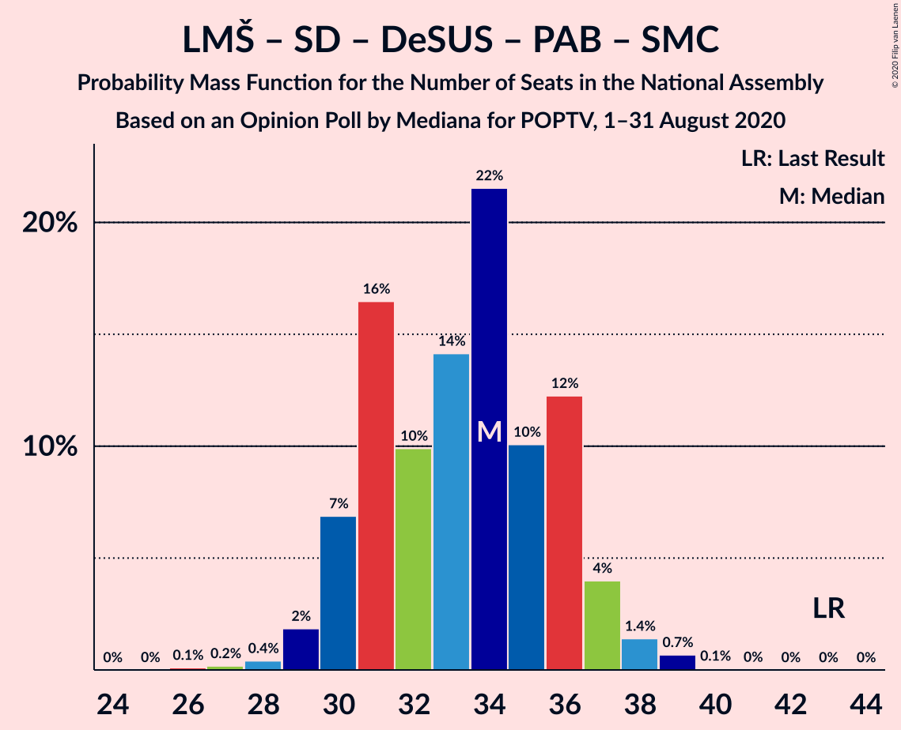
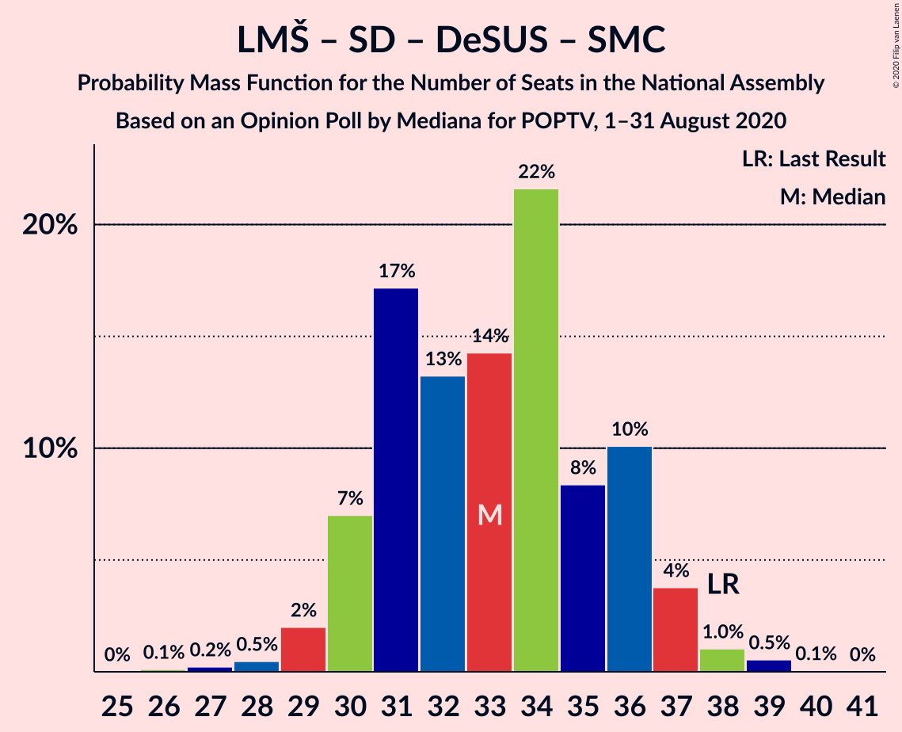

# Opinion Poll by Mediana for POPTV, 1–31 August 2020

<a href="#voting-intentions">Voting Intentions</a> | <a href="#seats">Seats</a> | <a href="#coalitions">Coalitions</a> | <a href="#technical-information">Technical Information</a>

## Voting Intentions

### Confidence Intervals

| Party | Last Result | Poll Result | 80% Confidence Interval | 90% Confidence Interval | 95% Confidence Interval | 99% Confidence Interval |
|:-----:|:-----------:|:-----------:|:-----------------------:|:-----------------------:|:-----------------------:|:-----------------------:|
| Slovenska demokratska stranka | 24.9% | 27.7% | 25.7–30.0% |25.1–30.6% |24.6–31.1% |23.6–32.2% |
| Lista Marjana Šarca | 12.6% | 14.6% | 13.0–16.4% |12.5–16.9% |12.2–17.3% |11.4–18.3% |
| Socialni demokrati | 9.9% | 14.6% | 13.0–16.4% |12.5–16.9% |12.2–17.3% |11.4–18.3% |
| Levica | 9.3% | 12.2% | 10.7–13.9% |10.3–14.4% |10.0–14.8% |9.3–15.7% |
| Nova Slovenija–Krščanski demokrati | 7.2% | 6.9% | 5.8–8.2% |5.5–8.6% |5.2–9.0% |4.8–9.7% |
| Demokratična stranka upokojencev Slovenije | 4.9% | 5.6% | 4.6–6.9% |4.4–7.2% |4.1–7.5% |3.7–8.2% |
| Slovenska nacionalna stranka | 4.2% | 4.6% | 3.7–5.8% |3.5–6.1% |3.3–6.4% |2.9–7.0% |
| Slovenska ljudska stranka | 2.6% | 2.9% | 2.3–3.9% |2.1–4.2% |1.9–4.5% |1.6–5.0% |
| Stranka Alenke Bratušek | 5.1% | 2.7% | 2.0–3.6% |1.9–3.9% |1.7–4.1% |1.4–4.6% |
| Stranka modernega centra | 9.7% | 1.7% | 1.2–2.5% |1.1–2.7% |1.0–2.9% |0.8–3.4% |

*Note:* The poll result column reflects the actual value used in the calculations. Published results may vary slightly, and in addition be rounded to fewer digits.

## Seats

### Confidence Intervals

| Party | Last Result | Median | 80% Confidence Interval | 90% Confidence Interval | 95% Confidence Interval | 99% Confidence Interval |
|:-----:|:-----------:|:------:|:-----------------------:|:-----------------------:|:-----------------------:|:-----------------------:|
| <a href="#slovenska-demokratska-stranka">Slovenska demokratska stranka</a> | 25 | 27 | 25–30 |24–30 |24–30 |22–31 |
| <a href="#lista-marjana-šarca">Lista Marjana Šarca</a> | 13 | 14 | 12–16 |12–17 |11–17 |11–18 |
| <a href="#socialni-demokrati">Socialni demokrati</a> | 10 | 14 | 12–16 |12–16 |11–17 |11–18 |
| <a href="#levica">Levica</a> | 9 | 12 | 10–13 |10–13 |9–14 |9–15 |
| <a href="#nova-slovenija–krščanski-demokrati">Nova Slovenija–Krščanski demokrati</a> | 7 | 6 | 5–7 |5–8 |4–8 |4–9 |
| <a href="#demokratična-stranka-upokojencev-slovenije">Demokratična stranka upokojencev Slovenije</a> | 5 | 5 | 4–6 |4–7 |4–7 |0–8 |
| <a href="#slovenska-nacionalna-stranka">Slovenska nacionalna stranka</a> | 4 | 4 | 0–5 |0–5 |0–6 |0–6 |
| <a href="#slovenska-ljudska-stranka">Slovenska ljudska stranka</a> | 0 | 0 | 0 |0 |0–4 |0–4 |
| <a href="#stranka-alenke-bratušek">Stranka Alenke Bratušek</a> | 5 | 0 | 0 |0–3 |0–4 |0–4 |
| <a href="#stranka-modernega-centra">Stranka modernega centra</a> | 10 | 0 | 0 |0 |0 |0 |

### Slovenska demokratska stranka

*For a full overview of the results for this party, see the [Slovenska demokratska stranka](party-slovenskademokratskastranka.html) page.*

| Number of Seats | Probability | Accumulated | Special Marks |
|:---------------:|:-----------:|:-----------:|:-------------:|
| 22 | 0.6% | 100% |  |
| 23 | 2% | 99.4% |  |
| 24 | 4% | 98% |  |
| 25 | 14% | 94% | Last Result |
| 26 | 16% | 79% |  |
| 27 | 21% | 64% | Median |
| 28 | 20% | 43% |  |
| 29 | 9% | 23% |  |
| 30 | 12% | 14% |  |
| 31 | 2% | 2% |  |
| 32 | 0.2% | 0.4% |  |
| 33 | 0.1% | 0.2% |  |
| 34 | 0% | 0% |  |

### Lista Marjana Šarca

*For a full overview of the results for this party, see the [Lista Marjana Šarca](party-listamarjanašarca.html) page.*

| Number of Seats | Probability | Accumulated | Special Marks |
|:---------------:|:-----------:|:-----------:|:-------------:|
| 10 | 0.4% | 100% |  |
| 11 | 2% | 99.6% |  |
| 12 | 19% | 97% |  |
| 13 | 15% | 79% | Last Result |
| 14 | 34% | 64% | Median |
| 15 | 17% | 30% |  |
| 16 | 8% | 13% |  |
| 17 | 5% | 5% |  |
| 18 | 0.5% | 0.6% |  |
| 19 | 0.1% | 0.1% |  |
| 20 | 0% | 0% |  |

### Socialni demokrati

*For a full overview of the results for this party, see the [Socialni demokrati](party-socialnidemokrati.html) page.*

| Number of Seats | Probability | Accumulated | Special Marks |
|:---------------:|:-----------:|:-----------:|:-------------:|
| 10 | 0.3% | 100% | Last Result |
| 11 | 2% | 99.7% |  |
| 12 | 12% | 97% |  |
| 13 | 23% | 85% |  |
| 14 | 34% | 62% | Median |
| 15 | 12% | 29% |  |
| 16 | 13% | 17% |  |
| 17 | 3% | 4% |  |
| 18 | 0.8% | 0.8% |  |
| 19 | 0% | 0.1% |  |
| 20 | 0% | 0% |  |

### Levica

*For a full overview of the results for this party, see the [Levica](party-levica.html) page.*

| Number of Seats | Probability | Accumulated | Special Marks |
|:---------------:|:-----------:|:-----------:|:-------------:|
| 8 | 0.4% | 100% |  |
| 9 | 3% | 99.6% | Last Result |
| 10 | 12% | 96% |  |
| 11 | 23% | 84% |  |
| 12 | 25% | 61% | Median |
| 13 | 32% | 37% |  |
| 14 | 2% | 5% |  |
| 15 | 2% | 2% |  |
| 16 | 0.4% | 0.4% |  |
| 17 | 0% | 0% |  |

### Nova Slovenija–Krščanski demokrati

*For a full overview of the results for this party, see the [Nova Slovenija–Krščanski demokrati](party-novaslovenija–krščanskidemokrati.html) page.*

| Number of Seats | Probability | Accumulated | Special Marks |
|:---------------:|:-----------:|:-----------:|:-------------:|
| 4 | 3% | 100% |  |
| 5 | 14% | 97% |  |
| 6 | 44% | 84% | Median |
| 7 | 29% | 39% | Last Result |
| 8 | 8% | 10% |  |
| 9 | 2% | 2% |  |
| 10 | 0.3% | 0.3% |  |
| 11 | 0% | 0% |  |

### Demokratična stranka upokojencev Slovenije

*For a full overview of the results for this party, see the [Demokratična stranka upokojencev Slovenije](party-demokratičnastrankaupokojencevslovenije.html) page.*

| Number of Seats | Probability | Accumulated | Special Marks |
|:---------------:|:-----------:|:-----------:|:-------------:|
| 0 | 2% | 100% |  |
| 1 | 0% | 98% |  |
| 2 | 0% | 98% |  |
| 3 | 0.1% | 98% |  |
| 4 | 23% | 98% |  |
| 5 | 26% | 75% | Last Result, Median |
| 6 | 41% | 50% |  |
| 7 | 7% | 8% |  |
| 8 | 1.1% | 1.1% |  |
| 9 | 0% | 0% |  |

### Slovenska nacionalna stranka

*For a full overview of the results for this party, see the [Slovenska nacionalna stranka](party-slovenskanacionalnastranka.html) page.*

| Number of Seats | Probability | Accumulated | Special Marks |
|:---------------:|:-----------:|:-----------:|:-------------:|
| 0 | 33% | 100% |  |
| 1 | 0% | 67% |  |
| 2 | 0% | 67% |  |
| 3 | 0.6% | 67% |  |
| 4 | 33% | 67% | Last Result, Median |
| 5 | 29% | 33% |  |
| 6 | 5% | 5% |  |
| 7 | 0.2% | 0.2% |  |
| 8 | 0% | 0% |  |

### Slovenska ljudska stranka

*For a full overview of the results for this party, see the [Slovenska ljudska stranka](party-slovenskaljudskastranka.html) page.*

| Number of Seats | Probability | Accumulated | Special Marks |
|:---------------:|:-----------:|:-----------:|:-------------:|
| 0 | 96% | 100% | Last Result, Median |
| 1 | 0% | 4% |  |
| 2 | 0% | 4% |  |
| 3 | 0.4% | 4% |  |
| 4 | 4% | 4% |  |
| 5 | 0.3% | 0.3% |  |
| 6 | 0% | 0% |  |

### Stranka Alenke Bratušek

*For a full overview of the results for this party, see the [Stranka Alenke Bratušek](party-strankaalenkebratušek.html) page.*

| Number of Seats | Probability | Accumulated | Special Marks |
|:---------------:|:-----------:|:-----------:|:-------------:|
| 0 | 95% | 100% | Median |
| 1 | 0% | 5% |  |
| 2 | 0% | 5% |  |
| 3 | 2% | 5% |  |
| 4 | 4% | 4% |  |
| 5 | 0.1% | 0.1% | Last Result |
| 6 | 0% | 0% |  |

### Stranka modernega centra

*For a full overview of the results for this party, see the [Stranka modernega centra](party-strankamodernegacentra.html) page.*

| Number of Seats | Probability | Accumulated | Special Marks |
|:---------------:|:-----------:|:-----------:|:-------------:|
| 0 | 100% | 100% | Median |
| 1 | 0% | 0% |  |
| 2 | 0% | 0% |  |
| 3 | 0% | 0% |  |
| 4 | 0% | 0% |  |
| 5 | 0% | 0% |  |
| 6 | 0% | 0% |  |
| 7 | 0% | 0% |  |
| 8 | 0% | 0% |  |
| 9 | 0% | 0% |  |
| 10 | 0% | 0% | Last Result |

## Coalitions

### Confidence Intervals

| Coalition | Last Result | Median | Majority? | 80% Confidence Interval | 90% Confidence Interval | 95% Confidence Interval | 99% Confidence Interval |
|:---------:|:-----------:|:------:|:---------:|:-----------------------:|:-----------------------:|:-----------------------:|:-----------------------:|
| Slovenska demokratska stranka – Lista Marjana Šarca – Demokratična stranka upokojencev Slovenije | 43 | 46 | 58% | 44–50 | 43–50 | 42–51 | 40–51 |
| Slovenska demokratska stranka – Lista Marjana Šarca | 38 | 41 | 3% | 39–44 | 38–44 | 37–46 | 36–46 |
| Lista Marjana Šarca – Socialni demokrati – Nova Slovenija–Krščanski demokrati – Demokratična stranka upokojencev Slovenije | 35 | 40 | 0.1% | 37–43 | 36–43 | 36–44 | 34–45 |
| Lista Marjana Šarca – Socialni demokrati – Nova Slovenija–Krščanski demokrati – Demokratična stranka upokojencev Slovenije – Stranka Alenke Bratušek – Stranka modernega centra | 50 | 40 | 0.1% | 37–43 | 36–43 | 36–44 | 34–45 |
| Lista Marjana Šarca – Socialni demokrati – Nova Slovenija–Krščanski demokrati – Demokratična stranka upokojencev Slovenije – Stranka modernega centra | 45 | 40 | 0.1% | 37–43 | 36–43 | 36–44 | 34–45 |
| Lista Marjana Šarca – Socialni demokrati – Nova Slovenija–Krščanski demokrati | 30 | 34 | 0% | 31–37 | 31–38 | 31–38 | 29–40 |
| Lista Marjana Šarca – Socialni demokrati – Nova Slovenija–Krščanski demokrati – Stranka modernega centra | 40 | 34 | 0% | 31–37 | 31–38 | 31–38 | 29–40 |
| Lista Marjana Šarca – Socialni demokrati – Demokratična stranka upokojencev Slovenije | 28 | 33 | 0% | 31–36 | 30–37 | 29–37 | 28–39 |
| Lista Marjana Šarca – Socialni demokrati – Demokratična stranka upokojencev Slovenije – Stranka Alenke Bratušek – Stranka modernega centra | 43 | 34 | 0% | 31–36 | 30–37 | 29–37 | 28–39 |
| Lista Marjana Šarca – Socialni demokrati – Demokratična stranka upokojencev Slovenije – Stranka modernega centra | 38 | 33 | 0% | 31–36 | 30–37 | 29–37 | 28–39 |
| Lista Marjana Šarca – Socialni demokrati | 23 | 28 | 0% | 25–30 | 25–31 | 25–32 | 23–34 |
| Lista Marjana Šarca – Socialni demokrati – Stranka modernega centra | 33 | 28 | 0% | 25–30 | 25–31 | 25–32 | 23–34 |
| Socialni demokrati – Demokratična stranka upokojencev Slovenije – Stranka modernega centra | 25 | 19 | 0% | 17–22 | 17–22 | 16–22 | 14–24 |

### Slovenska demokratska stranka – Lista Marjana Šarca – Demokratična stranka upokojencev Slovenije

| Number of Seats | Probability | Accumulated | Special Marks |
|:---------------:|:-----------:|:-----------:|:-------------:|
| 38 | 0% | 100% |  |
| 39 | 0.1% | 99.9% |  |
| 40 | 0.4% | 99.8% |  |
| 41 | 1.0% | 99.5% |  |
| 42 | 2% | 98% |  |
| 43 | 5% | 96% | Last Result |
| 44 | 13% | 91% |  |
| 45 | 20% | 78% |  |
| 46 | 11% | 58% | Median, Majority |
| 47 | 15% | 47% |  |
| 48 | 15% | 32% |  |
| 49 | 5% | 17% |  |
| 50 | 9% | 12% |  |
| 51 | 2% | 3% |  |
| 52 | 0.2% | 0.3% |  |
| 53 | 0% | 0.1% |  |
| 54 | 0% | 0% |  |

### Slovenska demokratska stranka – Lista Marjana Šarca

| Number of Seats | Probability | Accumulated | Special Marks |
|:---------------:|:-----------:|:-----------:|:-------------:|
| 34 | 0.1% | 100% |  |
| 35 | 0.4% | 99.9% |  |
| 36 | 1.0% | 99.6% |  |
| 37 | 2% | 98.6% |  |
| 38 | 7% | 97% | Last Result |
| 39 | 19% | 90% |  |
| 40 | 15% | 71% |  |
| 41 | 14% | 56% | Median |
| 42 | 15% | 42% |  |
| 43 | 13% | 28% |  |
| 44 | 10% | 14% |  |
| 45 | 1.5% | 5% |  |
| 46 | 3% | 3% | Majority |
| 47 | 0.2% | 0.3% |  |
| 48 | 0.1% | 0.1% |  |
| 49 | 0% | 0% |  |

### Lista Marjana Šarca – Socialni demokrati – Nova Slovenija–Krščanski demokrati – Demokratična stranka upokojencev Slovenije

| Number of Seats | Probability | Accumulated | Special Marks |
|:---------------:|:-----------:|:-----------:|:-------------:|
| 32 | 0.1% | 100% |  |
| 33 | 0.3% | 99.9% |  |
| 34 | 0.6% | 99.6% |  |
| 35 | 1.3% | 99.0% | Last Result |
| 36 | 4% | 98% |  |
| 37 | 18% | 94% |  |
| 38 | 11% | 76% |  |
| 39 | 13% | 65% | Median |
| 40 | 24% | 51% |  |
| 41 | 8% | 27% |  |
| 42 | 9% | 20% |  |
| 43 | 7% | 11% |  |
| 44 | 2% | 3% |  |
| 45 | 1.2% | 1.3% |  |
| 46 | 0.1% | 0.1% | Majority |
| 47 | 0% | 0% |  |

### Lista Marjana Šarca – Socialni demokrati – Nova Slovenija–Krščanski demokrati – Demokratična stranka upokojencev Slovenije – Stranka Alenke Bratušek – Stranka modernega centra

| Number of Seats | Probability | Accumulated | Special Marks |
|:---------------:|:-----------:|:-----------:|:-------------:|
| 32 | 0.1% | 100% |  |
| 33 | 0.2% | 99.9% |  |
| 34 | 0.6% | 99.7% |  |
| 35 | 1.2% | 99.1% |  |
| 36 | 4% | 98% |  |
| 37 | 16% | 94% |  |
| 38 | 9% | 78% |  |
| 39 | 13% | 69% | Median |
| 40 | 24% | 56% |  |
| 41 | 11% | 32% |  |
| 42 | 10% | 21% |  |
| 43 | 8% | 12% |  |
| 44 | 2% | 4% |  |
| 45 | 1.5% | 2% |  |
| 46 | 0.1% | 0.1% | Majority |
| 47 | 0% | 0.1% |  |
| 48 | 0% | 0% |  |
| 49 | 0% | 0% |  |
| 50 | 0% | 0% | Last Result |

### Lista Marjana Šarca – Socialni demokrati – Nova Slovenija–Krščanski demokrati – Demokratična stranka upokojencev Slovenije – Stranka modernega centra

| Number of Seats | Probability | Accumulated | Special Marks |
|:---------------:|:-----------:|:-----------:|:-------------:|
| 32 | 0.1% | 100% |  |
| 33 | 0.3% | 99.9% |  |
| 34 | 0.6% | 99.6% |  |
| 35 | 1.3% | 99.0% |  |
| 36 | 4% | 98% |  |
| 37 | 18% | 94% |  |
| 38 | 11% | 76% |  |
| 39 | 13% | 65% | Median |
| 40 | 24% | 51% |  |
| 41 | 8% | 27% |  |
| 42 | 9% | 20% |  |
| 43 | 7% | 11% |  |
| 44 | 2% | 3% |  |
| 45 | 1.2% | 1.3% | Last Result |
| 46 | 0.1% | 0.1% | Majority |
| 47 | 0% | 0% |  |

### Lista Marjana Šarca – Socialni demokrati – Nova Slovenija–Krščanski demokrati

| Number of Seats | Probability | Accumulated | Special Marks |
|:---------------:|:-----------:|:-----------:|:-------------:|
| 28 | 0.1% | 100% |  |
| 29 | 0.6% | 99.9% |  |
| 30 | 1.4% | 99.2% | Last Result |
| 31 | 11% | 98% |  |
| 32 | 5% | 87% |  |
| 33 | 20% | 81% |  |
| 34 | 24% | 61% | Median |
| 35 | 11% | 37% |  |
| 36 | 9% | 27% |  |
| 37 | 11% | 17% |  |
| 38 | 4% | 6% |  |
| 39 | 1.3% | 2% |  |
| 40 | 0.8% | 0.9% |  |
| 41 | 0.1% | 0.1% |  |
| 42 | 0% | 0% |  |

### Lista Marjana Šarca – Socialni demokrati – Nova Slovenija–Krščanski demokrati – Stranka modernega centra

| Number of Seats | Probability | Accumulated | Special Marks |
|:---------------:|:-----------:|:-----------:|:-------------:|
| 28 | 0.1% | 100% |  |
| 29 | 0.6% | 99.9% |  |
| 30 | 1.4% | 99.2% |  |
| 31 | 11% | 98% |  |
| 32 | 5% | 87% |  |
| 33 | 20% | 81% |  |
| 34 | 24% | 61% | Median |
| 35 | 11% | 37% |  |
| 36 | 9% | 27% |  |
| 37 | 11% | 17% |  |
| 38 | 4% | 6% |  |
| 39 | 1.3% | 2% |  |
| 40 | 0.8% | 0.9% | Last Result |
| 41 | 0.1% | 0.1% |  |
| 42 | 0% | 0% |  |

### Lista Marjana Šarca – Socialni demokrati – Demokratična stranka upokojencev Slovenije

| Number of Seats | Probability | Accumulated | Special Marks |
|:---------------:|:-----------:|:-----------:|:-------------:|
| 26 | 0.1% | 100% |  |
| 27 | 0.2% | 99.9% |  |
| 28 | 0.5% | 99.6% | Last Result |
| 29 | 2% | 99.2% |  |
| 30 | 7% | 97% |  |
| 31 | 17% | 90% |  |
| 32 | 13% | 73% |  |
| 33 | 14% | 60% | Median |
| 34 | 22% | 45% |  |
| 35 | 8% | 24% |  |
| 36 | 10% | 15% |  |
| 37 | 4% | 5% |  |
| 38 | 1.0% | 2% |  |
| 39 | 0.5% | 0.6% |  |
| 40 | 0.1% | 0.1% |  |
| 41 | 0% | 0% |  |

### Lista Marjana Šarca – Socialni demokrati – Demokratična stranka upokojencev Slovenije – Stranka Alenke Bratušek – Stranka modernega centra

| Number of Seats | Probability | Accumulated | Special Marks |
|:---------------:|:-----------:|:-----------:|:-------------:|
| 26 | 0.1% | 100% |  |
| 27 | 0.2% | 99.9% |  |
| 28 | 0.4% | 99.7% |  |
| 29 | 2% | 99.3% |  |
| 30 | 7% | 97% |  |
| 31 | 16% | 91% |  |
| 32 | 10% | 74% |  |
| 33 | 14% | 64% | Median |
| 34 | 22% | 50% |  |
| 35 | 10% | 29% |  |
| 36 | 12% | 18% |  |
| 37 | 4% | 6% |  |
| 38 | 1.4% | 2% |  |
| 39 | 0.7% | 0.8% |  |
| 40 | 0.1% | 0.1% |  |
| 41 | 0% | 0% |  |
| 42 | 0% | 0% |  |
| 43 | 0% | 0% | Last Result |

### Lista Marjana Šarca – Socialni demokrati – Demokratična stranka upokojencev Slovenije – Stranka modernega centra

| Number of Seats | Probability | Accumulated | Special Marks |
|:---------------:|:-----------:|:-----------:|:-------------:|
| 26 | 0.1% | 100% |  |
| 27 | 0.2% | 99.9% |  |
| 28 | 0.5% | 99.6% |  |
| 29 | 2% | 99.2% |  |
| 30 | 7% | 97% |  |
| 31 | 17% | 90% |  |
| 32 | 13% | 73% |  |
| 33 | 14% | 60% | Median |
| 34 | 22% | 45% |  |
| 35 | 8% | 24% |  |
| 36 | 10% | 16% |  |
| 37 | 4% | 5% |  |
| 38 | 1.0% | 2% | Last Result |
| 39 | 0.5% | 0.6% |  |
| 40 | 0.1% | 0.1% |  |
| 41 | 0% | 0% |  |

### Lista Marjana Šarca – Socialni demokrati

| Number of Seats | Probability | Accumulated | Special Marks |
|:---------------:|:-----------:|:-----------:|:-------------:|
| 22 | 0.1% | 100% |  |
| 23 | 0.4% | 99.9% | Last Result |
| 24 | 1.2% | 99.5% |  |
| 25 | 12% | 98% |  |
| 26 | 14% | 86% |  |
| 27 | 15% | 72% |  |
| 28 | 24% | 57% | Median |
| 29 | 10% | 33% |  |
| 30 | 14% | 23% |  |
| 31 | 5% | 9% |  |
| 32 | 3% | 4% |  |
| 33 | 0.4% | 1.0% |  |
| 34 | 0.5% | 0.5% |  |
| 35 | 0% | 0% |  |

### Lista Marjana Šarca – Socialni demokrati – Stranka modernega centra

| Number of Seats | Probability | Accumulated | Special Marks |
|:---------------:|:-----------:|:-----------:|:-------------:|
| 22 | 0.1% | 100% |  |
| 23 | 0.4% | 99.9% |  |
| 24 | 1.2% | 99.5% |  |
| 25 | 12% | 98% |  |
| 26 | 14% | 86% |  |
| 27 | 15% | 72% |  |
| 28 | 24% | 57% | Median |
| 29 | 10% | 33% |  |
| 30 | 14% | 23% |  |
| 31 | 5% | 9% |  |
| 32 | 3% | 4% |  |
| 33 | 0.4% | 1.0% | Last Result |
| 34 | 0.5% | 0.5% |  |
| 35 | 0% | 0% |  |

### Socialni demokrati – Demokratična stranka upokojencev Slovenije – Stranka modernega centra

| Number of Seats | Probability | Accumulated | Special Marks |
|:---------------:|:-----------:|:-----------:|:-------------:|
| 12 | 0% | 100% |  |
| 13 | 0.4% | 99.9% |  |
| 14 | 0.5% | 99.6% |  |
| 15 | 0.6% | 99.0% |  |
| 16 | 3% | 98% |  |
| 17 | 9% | 95% |  |
| 18 | 21% | 86% |  |
| 19 | 20% | 65% | Median |
| 20 | 24% | 45% |  |
| 21 | 10% | 21% |  |
| 22 | 9% | 11% |  |
| 23 | 1.3% | 2% |  |
| 24 | 0.6% | 0.6% |  |
| 25 | 0% | 0% | Last Result |

## Technical Information

### Opinion Poll

+ **Polling firm:** Mediana
+ **Commissioner(s):** POPTV
+ **Fieldwork period:** 1–31 August 2020

### Calculations

+ **Sample size:** 714
+ **Simulations done:** 1,048,576
+ **Error estimate:** 1.28%

