# Opinion Poll by Mediana for Delo, 7–10 September 2020

<a href="#voting-intentions">Voting Intentions</a> | <a href="#seats">Seats</a> | <a href="#coalitions">Coalitions</a> | <a href="#technical-information">Technical Information</a>

## Voting Intentions

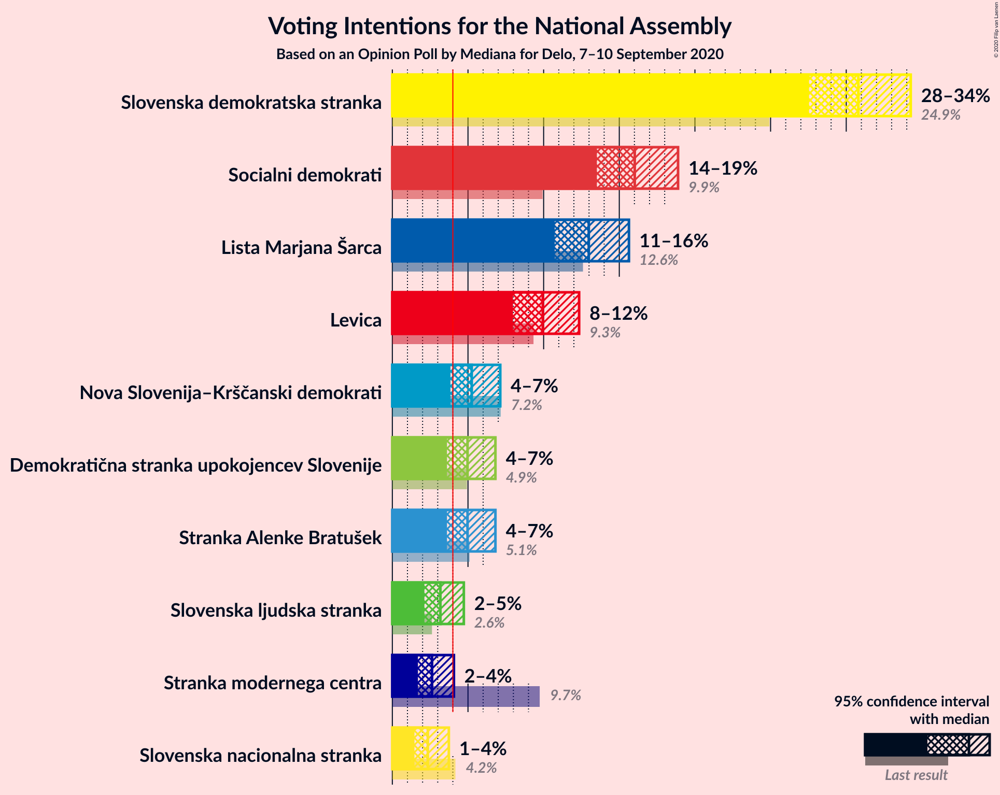

### Confidence Intervals

| Party | Last Result | Poll Result | 80% Confidence Interval | 90% Confidence Interval | 95% Confidence Interval | 99% Confidence Interval |
|:-----:|:-----------:|:-----------:|:-----------------------:|:-----------------------:|:-----------------------:|:-----------------------:|
| Slovenska demokratska stranka | 24.9% | 30.8% | 28.7–33.1% |28.1–33.7% |27.5–34.3% |26.5–35.4% |
| Socialni demokrati | 9.9% | 16.0% | 14.4–17.9% |13.9–18.4% |13.5–18.9% |12.8–19.8% |
| Lista Marjana Šarca | 12.6% | 13.0% | 11.5–14.7% |11.1–15.2% |10.7–15.6% |10.1–16.5% |
| Levica | 9.3% | 9.9% | 8.6–11.5% |8.3–12.0% |8.0–12.3% |7.4–13.1% |
| Nova Slovenija–Krščanski demokrati | 7.2% | 5.2% | 4.3–6.5% |4.1–6.8% |3.8–7.1% |3.4–7.8% |
| Stranka Alenke Bratušek | 5.1% | 5.0% | 4.1–6.2% |3.8–6.5% |3.6–6.8% |3.2–7.4% |
| Demokratična stranka upokojencev Slovenije | 4.9% | 5.0% | 4.1–6.2% |3.8–6.5% |3.6–6.8% |3.2–7.4% |
| Slovenska ljudska stranka | 2.6% | 3.2% | 2.5–4.2% |2.3–4.5% |2.1–4.7% |1.8–5.3% |
| Stranka modernega centra | 9.7% | 2.6% | 2.0–3.6% |1.8–3.8% |1.7–4.1% |1.4–4.6% |
| Slovenska nacionalna stranka | 4.2% | 2.3% | 1.8–3.2% |1.6–3.5% |1.5–3.7% |1.2–4.2% |

*Note:* The poll result column reflects the actual value used in the calculations. Published results may vary slightly, and in addition be rounded to fewer digits.

## Seats

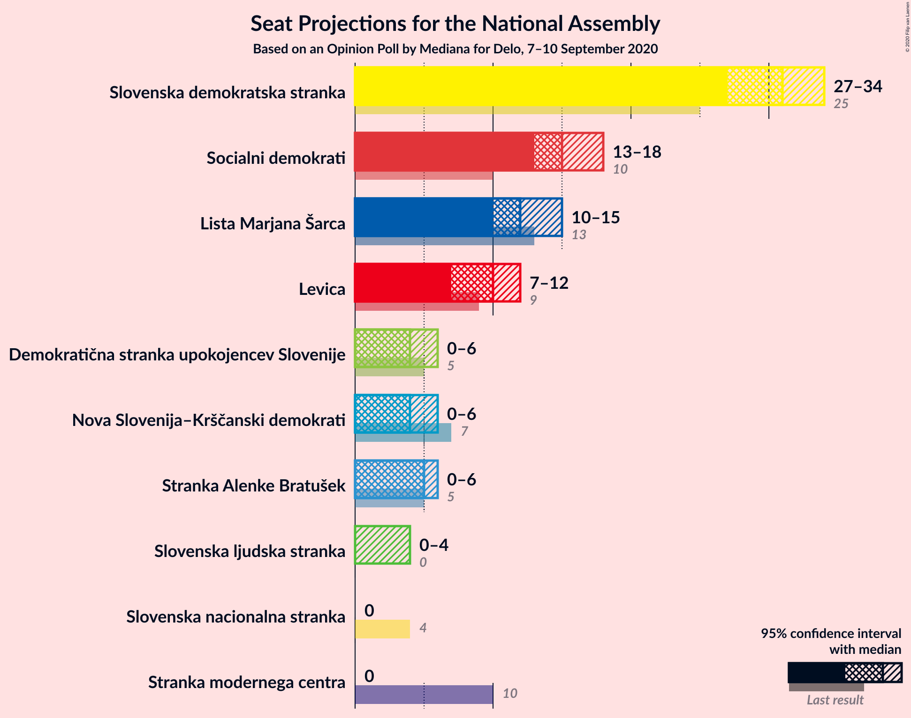

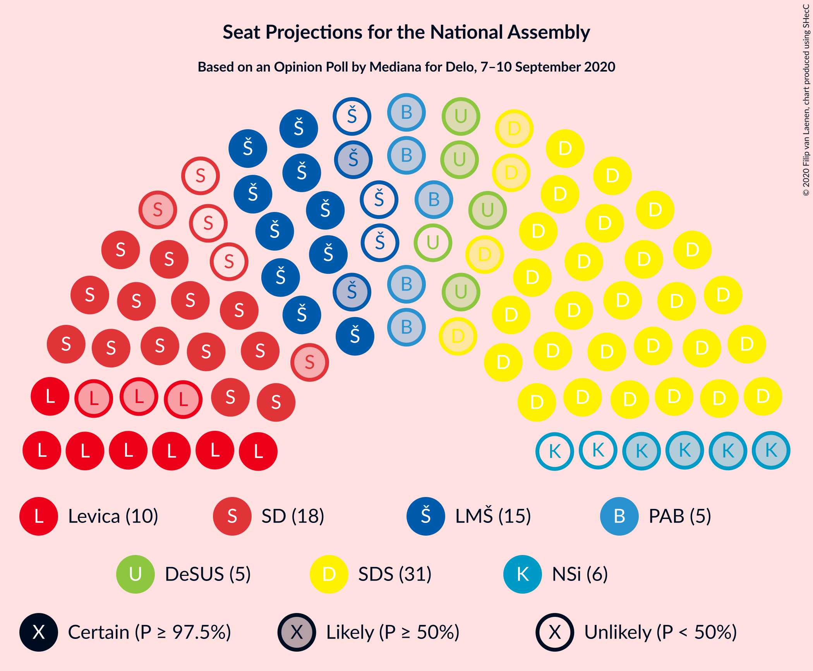

### Confidence Intervals

| Party | Last Result | Median | 80% Confidence Interval | 90% Confidence Interval | 95% Confidence Interval | 99% Confidence Interval |
|:-----:|:-----------:|:------:|:-----------------------:|:-----------------------:|:-----------------------:|:-----------------------:|
| <a href="#slovenska-demokratska-stranka">Slovenska demokratska stranka</a> | 25 | 31 | 28–32 |27–33 |27–34 |25–36 |
| <a href="#socialni-demokrati">Socialni demokrati</a> | 10 | 15 | 14–17 |13–18 |13–18 |12–19 |
| <a href="#lista-marjana-šarca">Lista Marjana Šarca</a> | 13 | 12 | 11–14 |10–15 |10–15 |9–16 |
| <a href="#levica">Levica</a> | 9 | 10 | 8–11 |8–12 |7–12 |7–13 |
| <a href="#nova-slovenija–krščanski-demokrati">Nova Slovenija–Krščanski demokrati</a> | 7 | 4 | 4–6 |4–6 |0–6 |0–7 |
| <a href="#stranka-alenke-bratušek">Stranka Alenke Bratušek</a> | 5 | 5 | 4–6 |0–6 |0–6 |0–7 |
| <a href="#demokratična-stranka-upokojencev-slovenije">Demokratična stranka upokojencev Slovenije</a> | 5 | 4 | 4–5 |0–6 |0–6 |0–7 |
| <a href="#slovenska-ljudska-stranka">Slovenska ljudska stranka</a> | 0 | 0 | 0–3 |0–4 |0–4 |0–5 |
| <a href="#stranka-modernega-centra">Stranka modernega centra</a> | 10 | 0 | 0 |0 |0 |0–4 |
| <a href="#slovenska-nacionalna-stranka">Slovenska nacionalna stranka</a> | 4 | 0 | 0 |0 |0 |0–4 |

### Slovenska demokratska stranka

*For a full overview of the results for this party, see the [Slovenska demokratska stranka](party-slovenskademokratskastranka.html) page.*

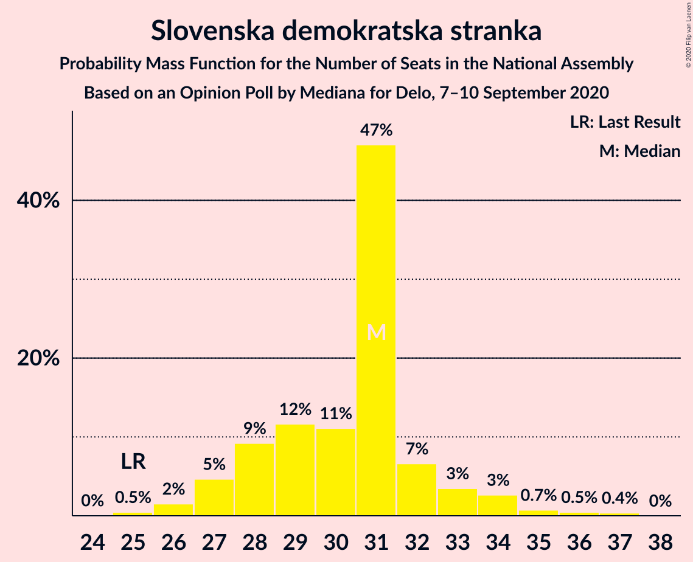

| Number of Seats | Probability | Accumulated | Special Marks |
|:---------------:|:-----------:|:-----------:|:-------------:|
| 24 | 0% | 100% |  |
| 25 | 0.5% | 99.9% | Last Result |
| 26 | 2% | 99.5% |  |
| 27 | 5% | 98% |  |
| 28 | 9% | 93% |  |
| 29 | 12% | 84% |  |
| 30 | 11% | 72% |  |
| 31 | 47% | 61% | Median |
| 32 | 7% | 14% |  |
| 33 | 3% | 8% |  |
| 34 | 3% | 4% |  |
| 35 | 0.7% | 2% |  |
| 36 | 0.5% | 0.8% |  |
| 37 | 0.4% | 0.4% |  |
| 38 | 0% | 0% |  |

### Socialni demokrati

*For a full overview of the results for this party, see the [Socialni demokrati](party-socialnidemokrati.html) page.*

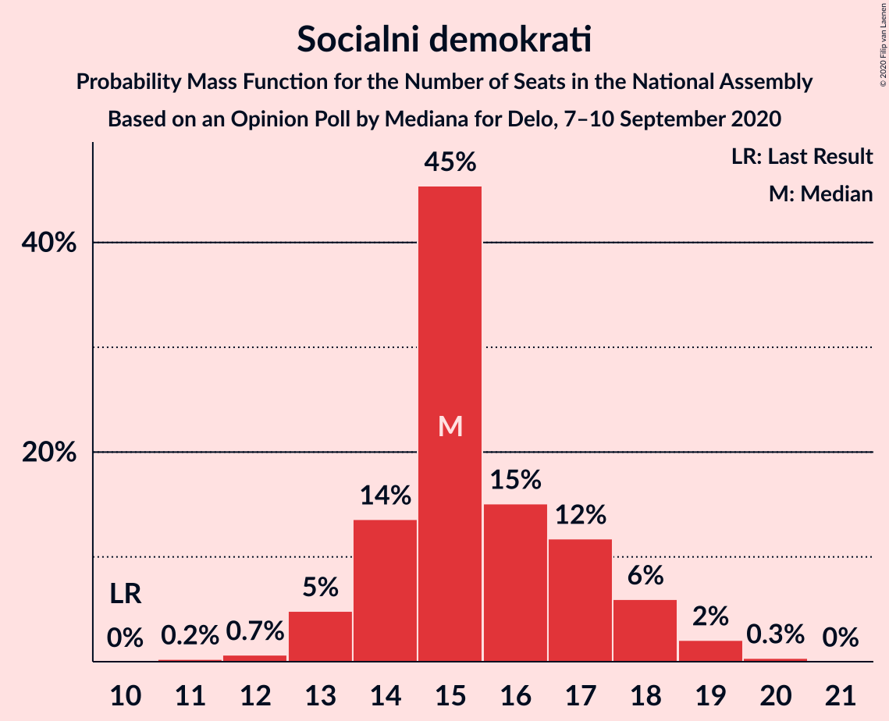

| Number of Seats | Probability | Accumulated | Special Marks |
|:---------------:|:-----------:|:-----------:|:-------------:|
| 10 | 0% | 100% | Last Result |
| 11 | 0.2% | 100% |  |
| 12 | 0.7% | 99.7% |  |
| 13 | 5% | 99.1% |  |
| 14 | 14% | 94% |  |
| 15 | 45% | 81% | Median |
| 16 | 15% | 35% |  |
| 17 | 12% | 20% |  |
| 18 | 6% | 8% |  |
| 19 | 2% | 2% |  |
| 20 | 0.3% | 0.4% |  |
| 21 | 0% | 0% |  |

### Lista Marjana Šarca

*For a full overview of the results for this party, see the [Lista Marjana Šarca](party-listamarjanašarca.html) page.*

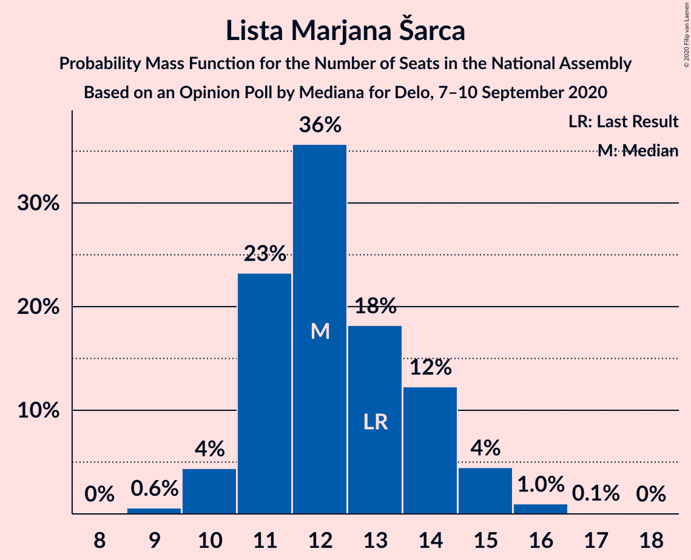

| Number of Seats | Probability | Accumulated | Special Marks |
|:---------------:|:-----------:|:-----------:|:-------------:|
| 9 | 0.6% | 100% |  |
| 10 | 4% | 99.4% |  |
| 11 | 23% | 95% |  |
| 12 | 36% | 72% | Median |
| 13 | 18% | 36% | Last Result |
| 14 | 12% | 18% |  |
| 15 | 4% | 6% |  |
| 16 | 1.0% | 1.1% |  |
| 17 | 0.1% | 0.2% |  |
| 18 | 0% | 0% |  |

### Levica

*For a full overview of the results for this party, see the [Levica](party-levica.html) page.*

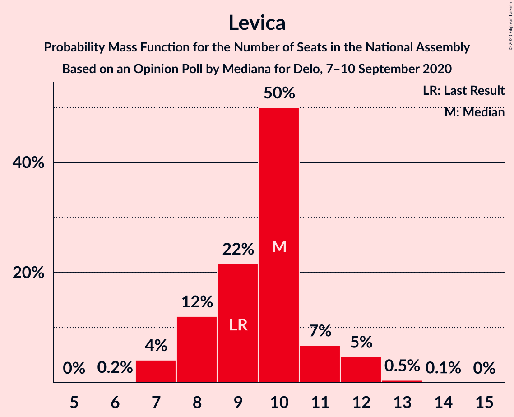

| Number of Seats | Probability | Accumulated | Special Marks |
|:---------------:|:-----------:|:-----------:|:-------------:|
| 6 | 0.2% | 100% |  |
| 7 | 4% | 99.8% |  |
| 8 | 12% | 96% |  |
| 9 | 22% | 84% | Last Result |
| 10 | 50% | 62% | Median |
| 11 | 7% | 12% |  |
| 12 | 5% | 5% |  |
| 13 | 0.5% | 0.5% |  |
| 14 | 0.1% | 0.1% |  |
| 15 | 0% | 0% |  |

### Nova Slovenija–Krščanski demokrati

*For a full overview of the results for this party, see the [Nova Slovenija–Krščanski demokrati](party-novaslovenija–krščanskidemokrati.html) page.*

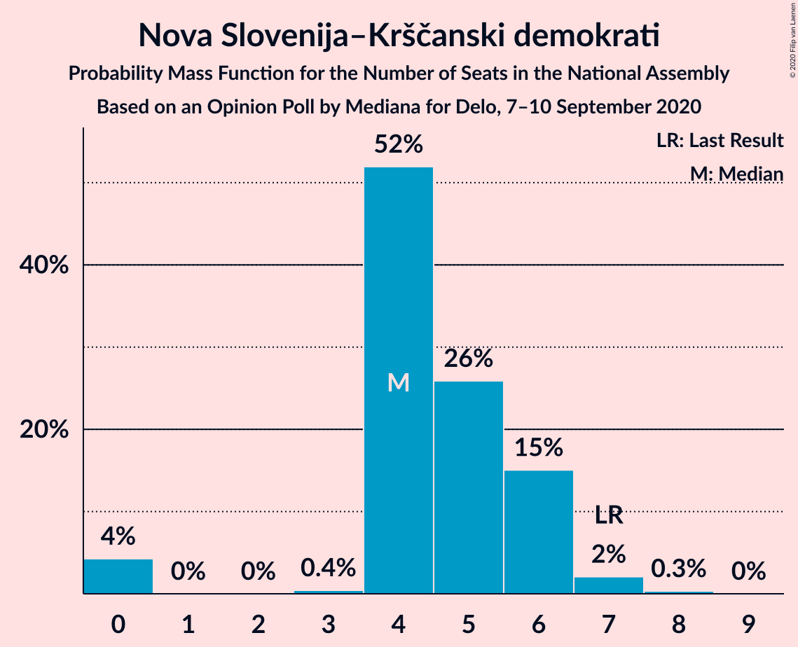

| Number of Seats | Probability | Accumulated | Special Marks |
|:---------------:|:-----------:|:-----------:|:-------------:|
| 0 | 4% | 100% |  |
| 1 | 0% | 96% |  |
| 2 | 0% | 96% |  |
| 3 | 0.4% | 96% |  |
| 4 | 52% | 95% | Median |
| 5 | 26% | 43% |  |
| 6 | 15% | 17% |  |
| 7 | 2% | 2% | Last Result |
| 8 | 0.3% | 0.3% |  |
| 9 | 0% | 0% |  |

### Stranka Alenke Bratušek

*For a full overview of the results for this party, see the [Stranka Alenke Bratušek](party-strankaalenkebratušek.html) page.*

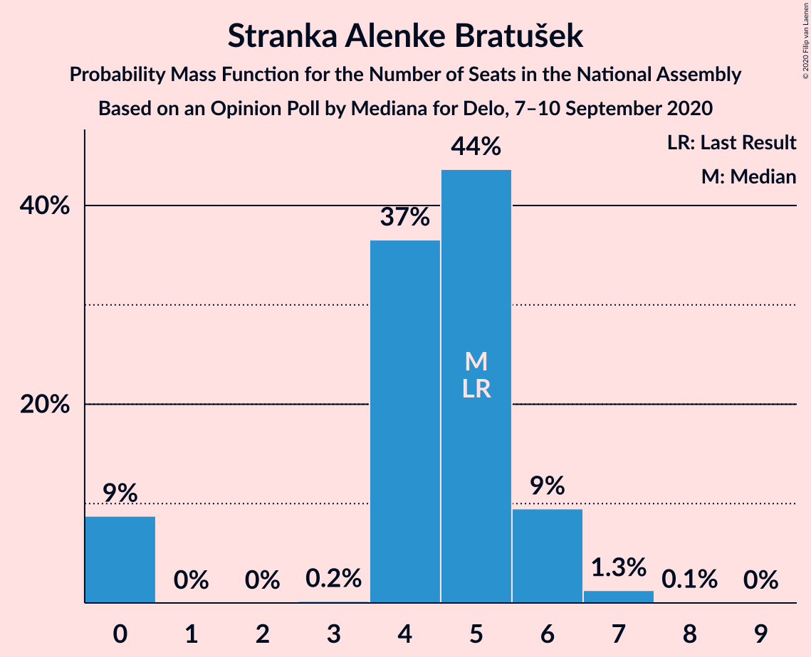

| Number of Seats | Probability | Accumulated | Special Marks |
|:---------------:|:-----------:|:-----------:|:-------------:|
| 0 | 9% | 100% |  |
| 1 | 0% | 91% |  |
| 2 | 0% | 91% |  |
| 3 | 0.2% | 91% |  |
| 4 | 37% | 91% |  |
| 5 | 44% | 55% | Last Result, Median |
| 6 | 9% | 11% |  |
| 7 | 1.3% | 1.4% |  |
| 8 | 0.1% | 0.1% |  |
| 9 | 0% | 0% |  |

### Demokratična stranka upokojencev Slovenije

*For a full overview of the results for this party, see the [Demokratična stranka upokojencev Slovenije](party-demokratičnastrankaupokojencevslovenije.html) page.*

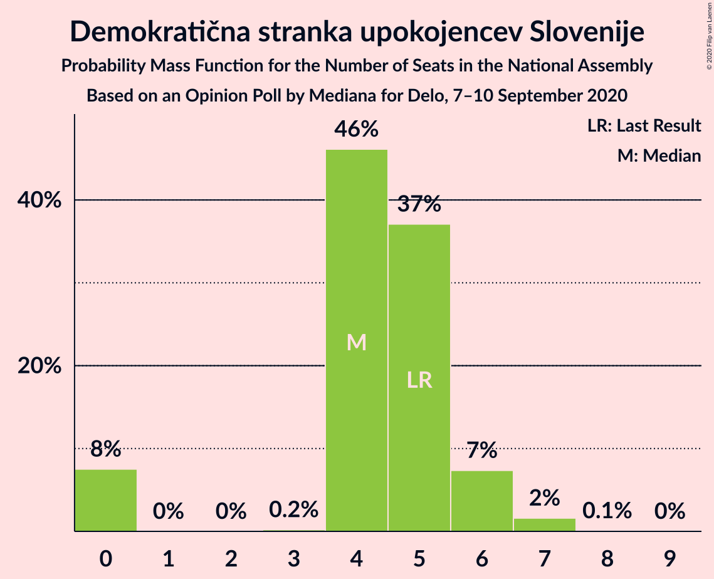

| Number of Seats | Probability | Accumulated | Special Marks |
|:---------------:|:-----------:|:-----------:|:-------------:|
| 0 | 8% | 100% |  |
| 1 | 0% | 92% |  |
| 2 | 0% | 92% |  |
| 3 | 0.2% | 92% |  |
| 4 | 46% | 92% | Median |
| 5 | 37% | 46% | Last Result |
| 6 | 7% | 9% |  |
| 7 | 2% | 2% |  |
| 8 | 0.1% | 0.1% |  |
| 9 | 0% | 0% |  |

### Slovenska ljudska stranka

*For a full overview of the results for this party, see the [Slovenska ljudska stranka](party-slovenskaljudskastranka.html) page.*

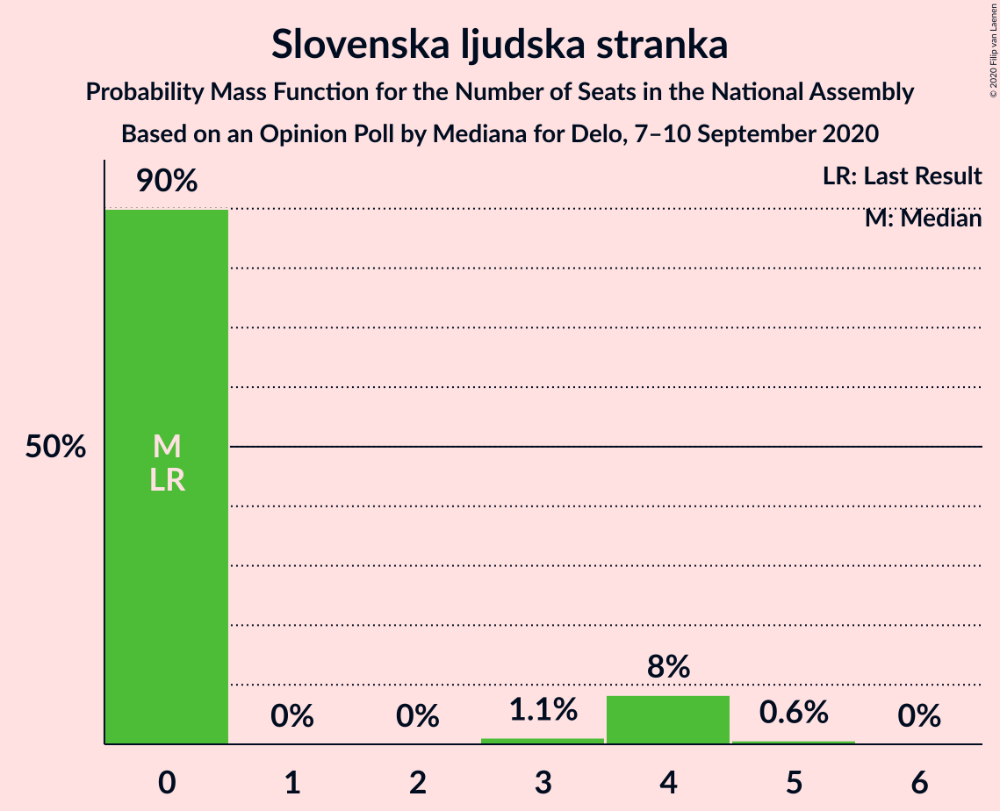

| Number of Seats | Probability | Accumulated | Special Marks |
|:---------------:|:-----------:|:-----------:|:-------------:|
| 0 | 90% | 100% | Last Result, Median |
| 1 | 0% | 10% |  |
| 2 | 0% | 10% |  |
| 3 | 1.1% | 10% |  |
| 4 | 8% | 9% |  |
| 5 | 0.6% | 0.7% |  |
| 6 | 0% | 0% |  |

### Stranka modernega centra

*For a full overview of the results for this party, see the [Stranka modernega centra](party-strankamodernegacentra.html) page.*

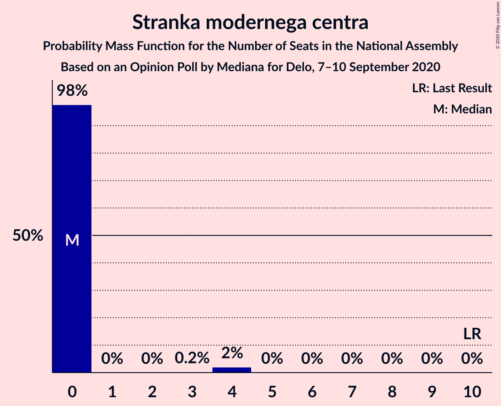

| Number of Seats | Probability | Accumulated | Special Marks |
|:---------------:|:-----------:|:-----------:|:-------------:|
| 0 | 98% | 100% | Median |
| 1 | 0% | 2% |  |
| 2 | 0% | 2% |  |
| 3 | 0.2% | 2% |  |
| 4 | 2% | 2% |  |
| 5 | 0% | 0% |  |
| 6 | 0% | 0% |  |
| 7 | 0% | 0% |  |
| 8 | 0% | 0% |  |
| 9 | 0% | 0% |  |
| 10 | 0% | 0% | Last Result |

### Slovenska nacionalna stranka

*For a full overview of the results for this party, see the [Slovenska nacionalna stranka](party-slovenskanacionalnastranka.html) page.*

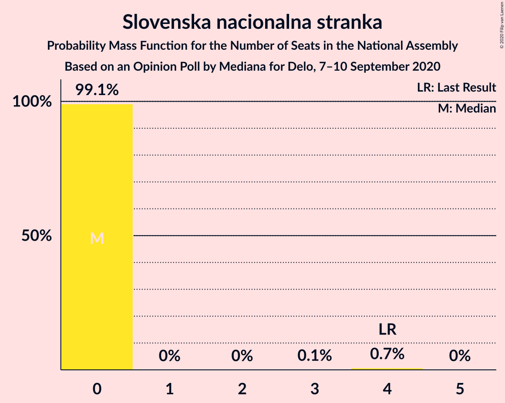

| Number of Seats | Probability | Accumulated | Special Marks |
|:---------------:|:-----------:|:-----------:|:-------------:|
| 0 | 99.1% | 100% | Median |
| 1 | 0% | 0.9% |  |
| 2 | 0% | 0.9% |  |
| 3 | 0.1% | 0.9% |  |
| 4 | 0.7% | 0.8% | Last Result |
| 5 | 0% | 0% |  |

## Coalitions

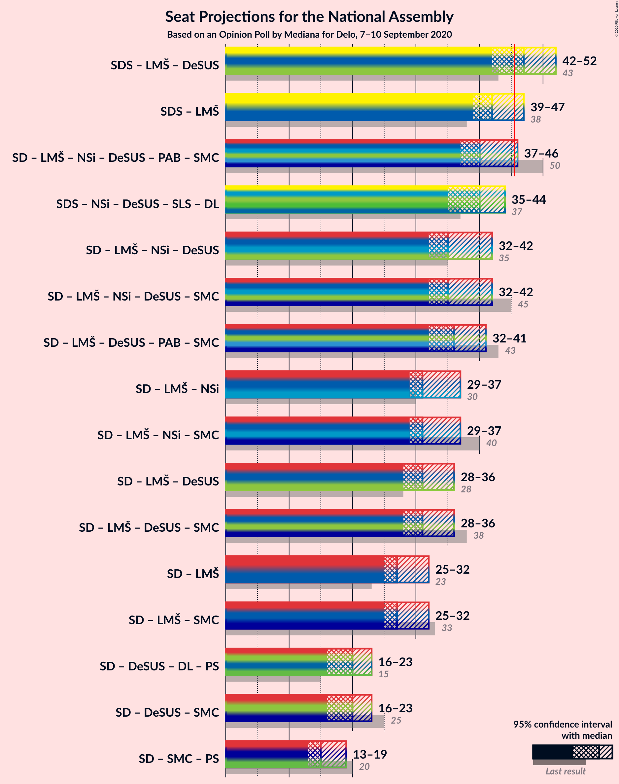

### Confidence Intervals

| Coalition | Last Result | Median | Majority? | 80% Confidence Interval | 90% Confidence Interval | 95% Confidence Interval | 99% Confidence Interval |
|:---------:|:-----------:|:------:|:---------:|:-----------------------:|:-----------------------:|:-----------------------:|:-----------------------:|
| Slovenska demokratska stranka – Lista Marjana Šarca – Demokratična stranka upokojencev Slovenije | 43 | 47 | 79% | 44–50 | 43–51 | 42–52 | 41–53 |
| Slovenska demokratska stranka – Lista Marjana Šarca | 38 | 42 | 8% | 41–45 | 40–46 | 39–47 | 37–50 |
| Socialni demokrati – Lista Marjana Šarca – Nova Slovenija–Krščanski demokrati – Demokratična stranka upokojencev Slovenije – Stranka Alenke Bratušek – Stranka modernega centra | 50 | 40 | 3% | 39–44 | 38–45 | 37–46 | 34–46 |
| Socialni demokrati – Lista Marjana Šarca – Nova Slovenija–Krščanski demokrati – Demokratična stranka upokojencev Slovenije | 35 | 35 | 0% | 34–40 | 34–40 | 32–42 | 31–42 |
| Socialni demokrati – Lista Marjana Šarca – Nova Slovenija–Krščanski demokrati – Demokratična stranka upokojencev Slovenije – Stranka modernega centra | 45 | 35 | 0% | 35–40 | 34–40 | 32–42 | 31–43 |
| Socialni demokrati – Lista Marjana Šarca – Demokratična stranka upokojencev Slovenije – Stranka Alenke Bratušek – Stranka modernega centra | 43 | 36 | 0% | 34–39 | 33–40 | 32–41 | 30–42 |
| Socialni demokrati – Lista Marjana Šarca – Nova Slovenija–Krščanski demokrati | 30 | 31 | 0% | 30–36 | 30–36 | 29–37 | 27–38 |
| Socialni demokrati – Lista Marjana Šarca – Nova Slovenija–Krščanski demokrati – Stranka modernega centra | 40 | 31 | 0% | 30–36 | 30–36 | 29–37 | 27–38 |
| Socialni demokrati – Lista Marjana Šarca – Demokratična stranka upokojencev Slovenije | 28 | 31 | 0% | 30–35 | 29–36 | 28–36 | 26–38 |
| Socialni demokrati – Lista Marjana Šarca – Demokratična stranka upokojencev Slovenije – Stranka modernega centra | 38 | 31 | 0% | 30–35 | 29–36 | 28–36 | 26–38 |
| Socialni demokrati – Lista Marjana Šarca | 23 | 27 | 0% | 26–30 | 25–31 | 25–32 | 24–33 |
| Socialni demokrati – Lista Marjana Šarca – Stranka modernega centra | 33 | 27 | 0% | 26–31 | 25–31 | 25–32 | 24–33 |
| Socialni demokrati – Demokratična stranka upokojencev Slovenije – Stranka modernega centra | 25 | 20 | 0% | 18–22 | 17–23 | 16–23 | 14–25 |

### Slovenska demokratska stranka – Lista Marjana Šarca – Demokratična stranka upokojencev Slovenije

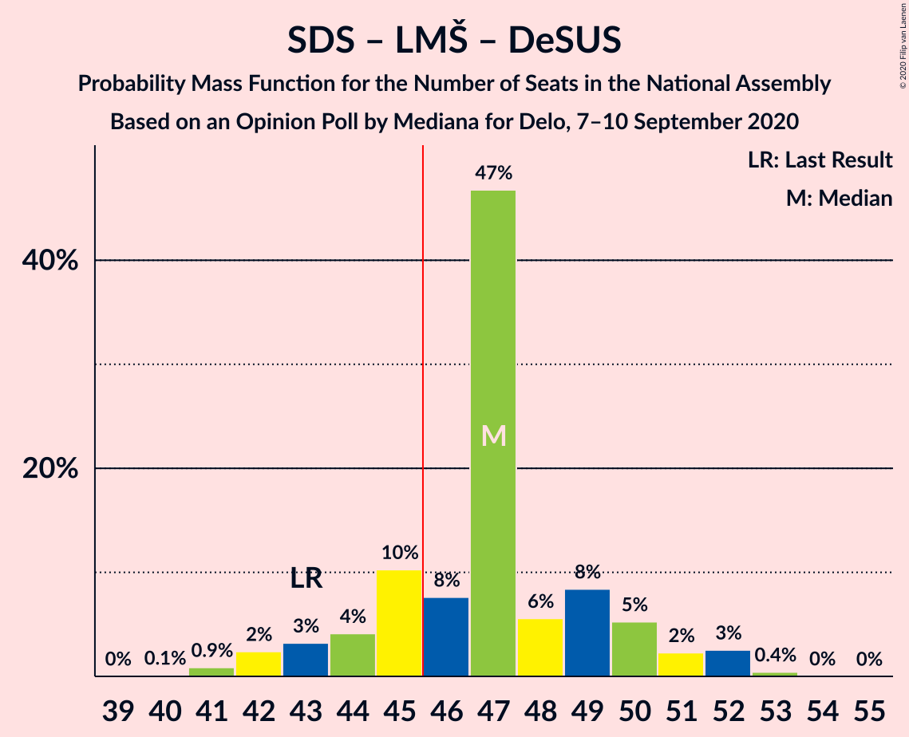

| Number of Seats | Probability | Accumulated | Special Marks |
|:---------------:|:-----------:|:-----------:|:-------------:|
| 39 | 0% | 100% |  |
| 40 | 0.1% | 99.9% |  |
| 41 | 0.9% | 99.8% |  |
| 42 | 2% | 99.0% |  |
| 43 | 3% | 97% | Last Result |
| 44 | 4% | 93% |  |
| 45 | 10% | 89% |  |
| 46 | 8% | 79% | Majority |
| 47 | 47% | 71% | Median |
| 48 | 6% | 25% |  |
| 49 | 8% | 19% |  |
| 50 | 5% | 11% |  |
| 51 | 2% | 5% |  |
| 52 | 3% | 3% |  |
| 53 | 0.4% | 0.5% |  |
| 54 | 0% | 0.1% |  |
| 55 | 0% | 0% |  |

### Slovenska demokratska stranka – Lista Marjana Šarca

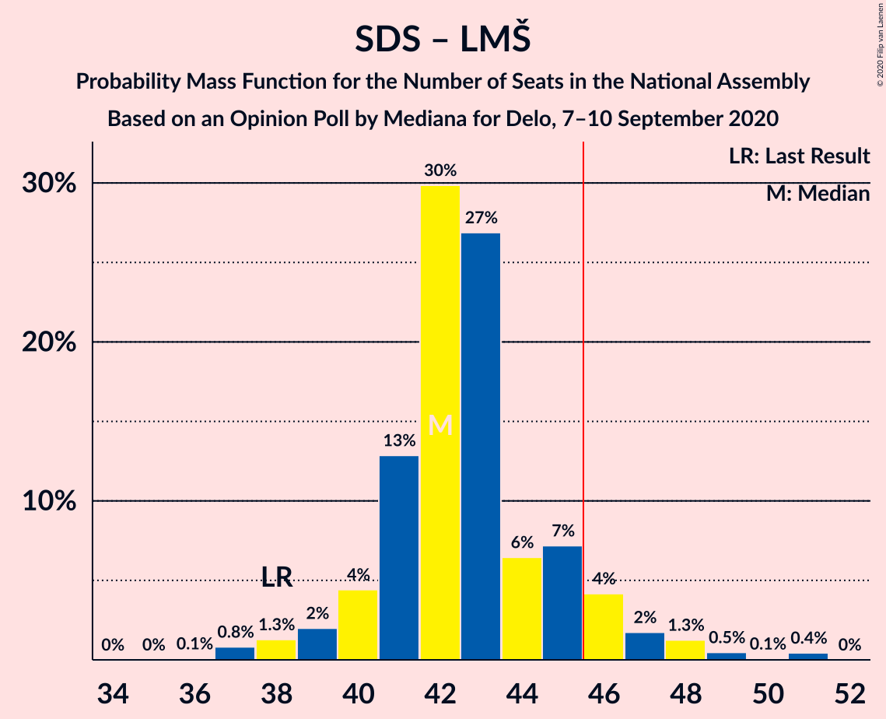

| Number of Seats | Probability | Accumulated | Special Marks |
|:---------------:|:-----------:|:-----------:|:-------------:|
| 36 | 0.1% | 100% |  |
| 37 | 0.8% | 99.9% |  |
| 38 | 1.3% | 99.1% | Last Result |
| 39 | 2% | 98% |  |
| 40 | 4% | 96% |  |
| 41 | 13% | 91% |  |
| 42 | 30% | 79% |  |
| 43 | 27% | 49% | Median |
| 44 | 6% | 22% |  |
| 45 | 7% | 15% |  |
| 46 | 4% | 8% | Majority |
| 47 | 2% | 4% |  |
| 48 | 1.3% | 2% |  |
| 49 | 0.5% | 1.0% |  |
| 50 | 0.1% | 0.5% |  |
| 51 | 0.4% | 0.5% |  |
| 52 | 0% | 0% |  |

### Socialni demokrati – Lista Marjana Šarca – Nova Slovenija–Krščanski demokrati – Demokratična stranka upokojencev Slovenije – Stranka Alenke Bratušek – Stranka modernega centra

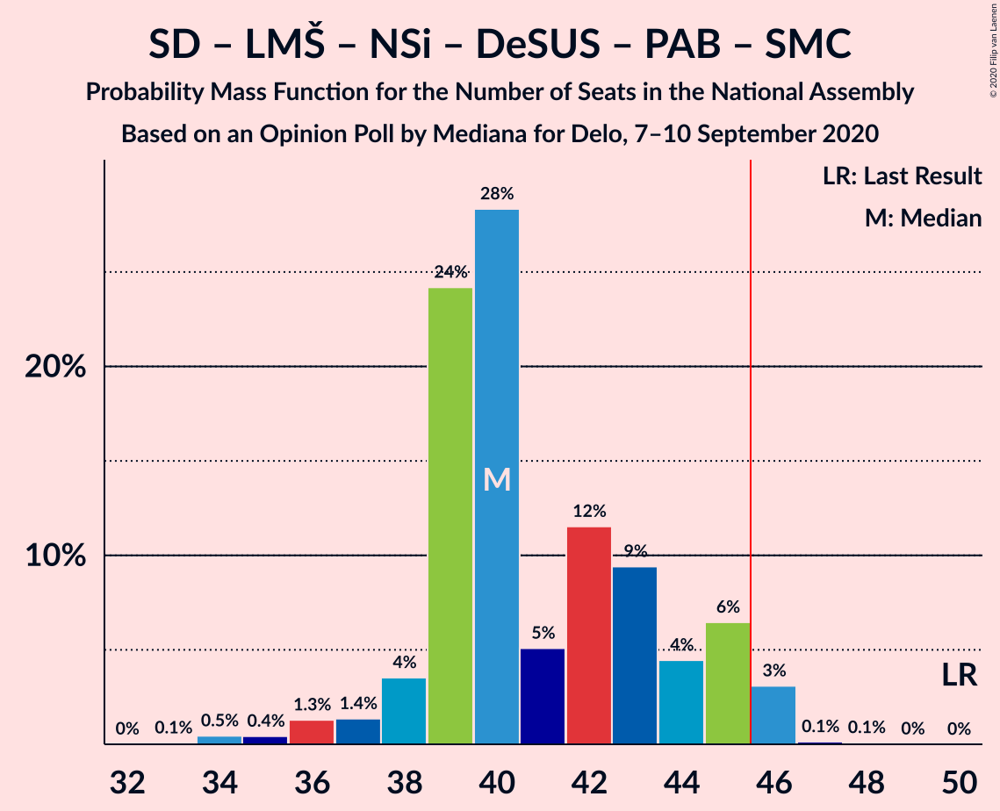

| Number of Seats | Probability | Accumulated | Special Marks |
|:---------------:|:-----------:|:-----------:|:-------------:|
| 33 | 0.1% | 100% |  |
| 34 | 0.5% | 99.9% |  |
| 35 | 0.4% | 99.4% |  |
| 36 | 1.3% | 99.0% |  |
| 37 | 1.4% | 98% |  |
| 38 | 4% | 96% |  |
| 39 | 24% | 93% |  |
| 40 | 28% | 69% | Median |
| 41 | 5% | 40% |  |
| 42 | 12% | 35% |  |
| 43 | 9% | 24% |  |
| 44 | 4% | 14% |  |
| 45 | 6% | 10% |  |
| 46 | 3% | 3% | Majority |
| 47 | 0.1% | 0.3% |  |
| 48 | 0.1% | 0.1% |  |
| 49 | 0% | 0% |  |
| 50 | 0% | 0% | Last Result |

### Socialni demokrati – Lista Marjana Šarca – Nova Slovenija–Krščanski demokrati – Demokratična stranka upokojencev Slovenije

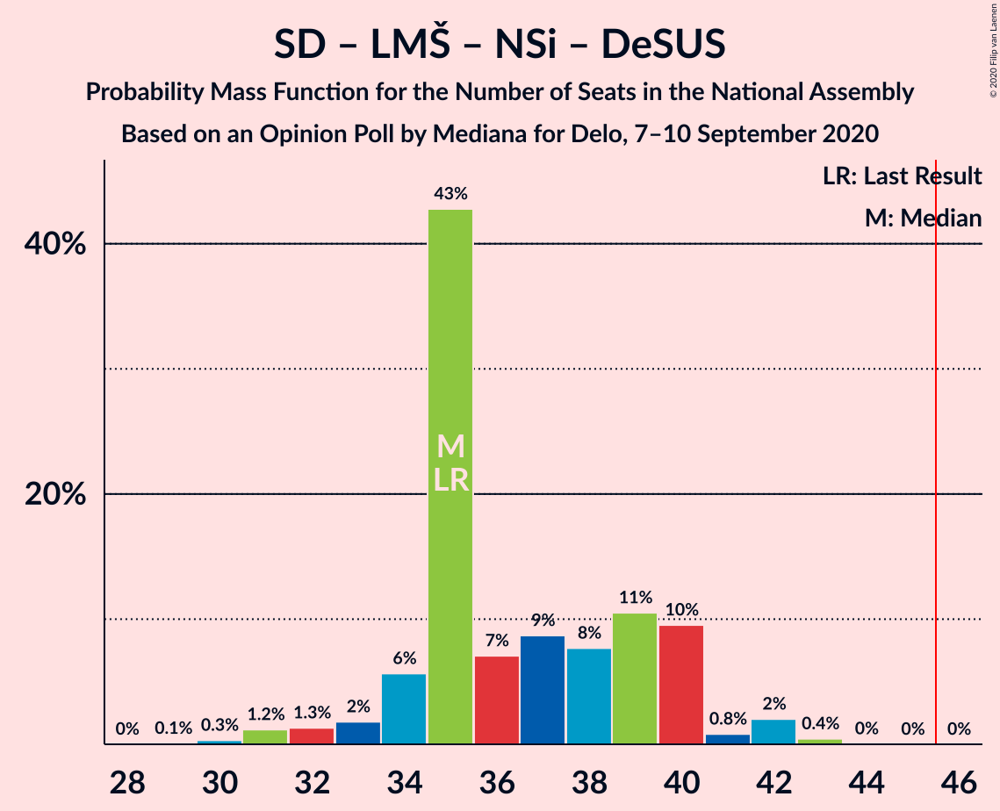

| Number of Seats | Probability | Accumulated | Special Marks |
|:---------------:|:-----------:|:-----------:|:-------------:|
| 29 | 0.1% | 100% |  |
| 30 | 0.3% | 99.9% |  |
| 31 | 1.2% | 99.6% |  |
| 32 | 1.3% | 98% |  |
| 33 | 2% | 97% |  |
| 34 | 6% | 95% |  |
| 35 | 43% | 90% | Last Result, Median |
| 36 | 7% | 47% |  |
| 37 | 9% | 40% |  |
| 38 | 8% | 31% |  |
| 39 | 11% | 23% |  |
| 40 | 10% | 13% |  |
| 41 | 0.8% | 3% |  |
| 42 | 2% | 3% |  |
| 43 | 0.4% | 0.5% |  |
| 44 | 0% | 0.1% |  |
| 45 | 0% | 0% |  |

### Socialni demokrati – Lista Marjana Šarca – Nova Slovenija–Krščanski demokrati – Demokratična stranka upokojencev Slovenije – Stranka modernega centra

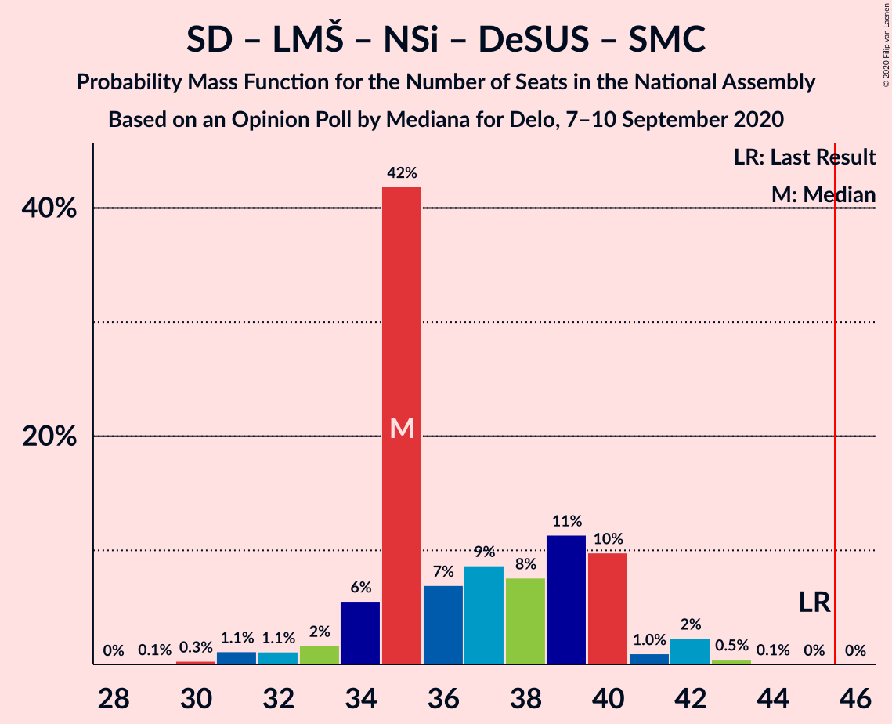

| Number of Seats | Probability | Accumulated | Special Marks |
|:---------------:|:-----------:|:-----------:|:-------------:|
| 29 | 0.1% | 100% |  |
| 30 | 0.3% | 99.9% |  |
| 31 | 1.1% | 99.6% |  |
| 32 | 1.1% | 98% |  |
| 33 | 2% | 97% |  |
| 34 | 6% | 96% |  |
| 35 | 42% | 90% | Median |
| 36 | 7% | 48% |  |
| 37 | 9% | 41% |  |
| 38 | 8% | 33% |  |
| 39 | 11% | 25% |  |
| 40 | 10% | 14% |  |
| 41 | 1.0% | 4% |  |
| 42 | 2% | 3% |  |
| 43 | 0.5% | 0.6% |  |
| 44 | 0.1% | 0.1% |  |
| 45 | 0% | 0% | Last Result |

### Socialni demokrati – Lista Marjana Šarca – Demokratična stranka upokojencev Slovenije – Stranka Alenke Bratušek – Stranka modernega centra

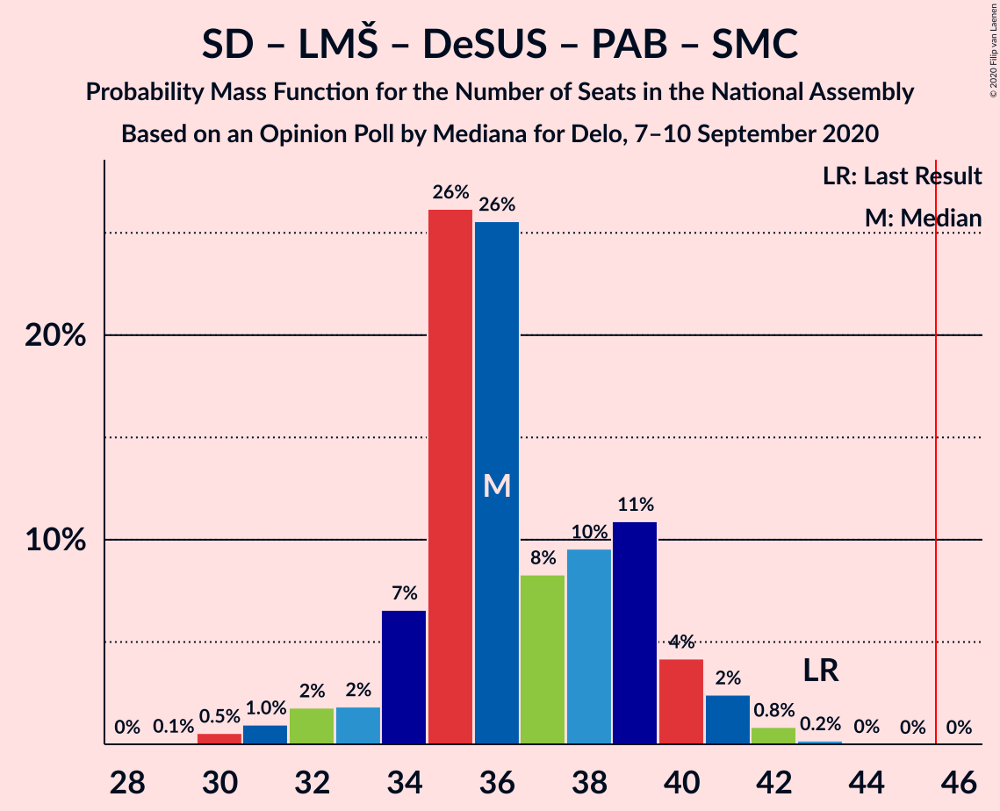

| Number of Seats | Probability | Accumulated | Special Marks |
|:---------------:|:-----------:|:-----------:|:-------------:|
| 29 | 0.1% | 100% |  |
| 30 | 0.5% | 99.9% |  |
| 31 | 1.0% | 99.3% |  |
| 32 | 2% | 98% |  |
| 33 | 2% | 97% |  |
| 34 | 7% | 95% |  |
| 35 | 26% | 88% |  |
| 36 | 26% | 62% | Median |
| 37 | 8% | 36% |  |
| 38 | 10% | 28% |  |
| 39 | 11% | 19% |  |
| 40 | 4% | 8% |  |
| 41 | 2% | 4% |  |
| 42 | 0.8% | 1.1% |  |
| 43 | 0.2% | 0.2% | Last Result |
| 44 | 0% | 0.1% |  |
| 45 | 0% | 0% |  |

### Socialni demokrati – Lista Marjana Šarca – Nova Slovenija–Krščanski demokrati

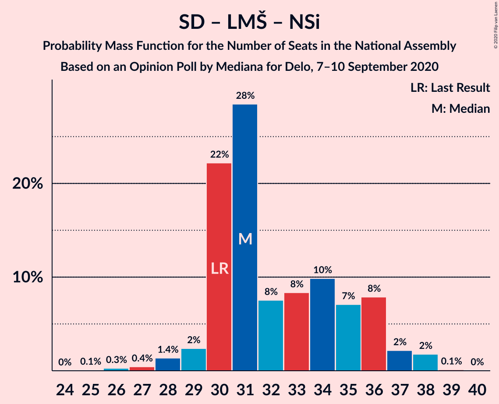

| Number of Seats | Probability | Accumulated | Special Marks |
|:---------------:|:-----------:|:-----------:|:-------------:|
| 25 | 0.1% | 100% |  |
| 26 | 0.3% | 99.9% |  |
| 27 | 0.4% | 99.6% |  |
| 28 | 1.4% | 99.2% |  |
| 29 | 2% | 98% |  |
| 30 | 22% | 95% | Last Result |
| 31 | 28% | 73% | Median |
| 32 | 8% | 45% |  |
| 33 | 8% | 37% |  |
| 34 | 10% | 29% |  |
| 35 | 7% | 19% |  |
| 36 | 8% | 12% |  |
| 37 | 2% | 4% |  |
| 38 | 2% | 2% |  |
| 39 | 0.1% | 0.2% |  |
| 40 | 0% | 0% |  |

### Socialni demokrati – Lista Marjana Šarca – Nova Slovenija–Krščanski demokrati – Stranka modernega centra

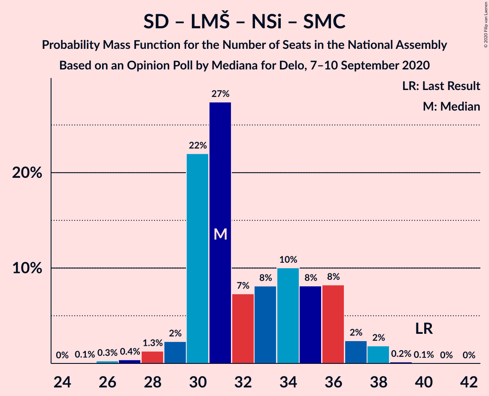

| Number of Seats | Probability | Accumulated | Special Marks |
|:---------------:|:-----------:|:-----------:|:-------------:|
| 25 | 0.1% | 100% |  |
| 26 | 0.3% | 99.9% |  |
| 27 | 0.4% | 99.7% |  |
| 28 | 1.3% | 99.3% |  |
| 29 | 2% | 98% |  |
| 30 | 22% | 96% |  |
| 31 | 27% | 74% | Median |
| 32 | 7% | 46% |  |
| 33 | 8% | 39% |  |
| 34 | 10% | 31% |  |
| 35 | 8% | 21% |  |
| 36 | 8% | 13% |  |
| 37 | 2% | 4% |  |
| 38 | 2% | 2% |  |
| 39 | 0.2% | 0.2% |  |
| 40 | 0.1% | 0.1% | Last Result |
| 41 | 0% | 0% |  |

### Socialni demokrati – Lista Marjana Šarca – Demokratična stranka upokojencev Slovenije

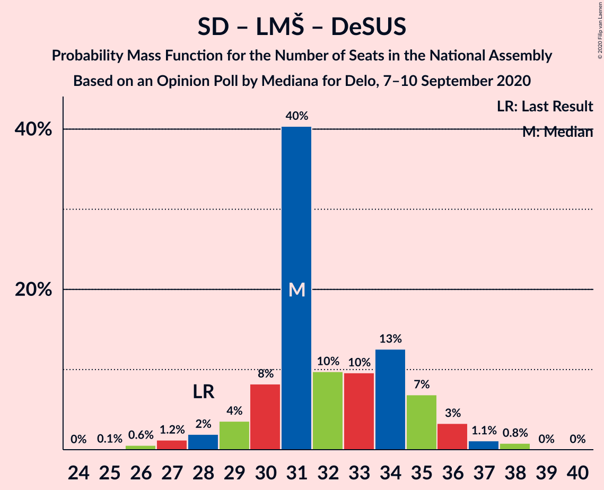

| Number of Seats | Probability | Accumulated | Special Marks |
|:---------------:|:-----------:|:-----------:|:-------------:|
| 25 | 0.1% | 100% |  |
| 26 | 0.6% | 99.9% |  |
| 27 | 1.2% | 99.3% |  |
| 28 | 2% | 98% | Last Result |
| 29 | 4% | 96% |  |
| 30 | 8% | 93% |  |
| 31 | 40% | 84% | Median |
| 32 | 10% | 44% |  |
| 33 | 10% | 34% |  |
| 34 | 13% | 25% |  |
| 35 | 7% | 12% |  |
| 36 | 3% | 5% |  |
| 37 | 1.1% | 2% |  |
| 38 | 0.8% | 0.9% |  |
| 39 | 0% | 0.1% |  |
| 40 | 0% | 0% |  |

### Socialni demokrati – Lista Marjana Šarca – Demokratična stranka upokojencev Slovenije – Stranka modernega centra

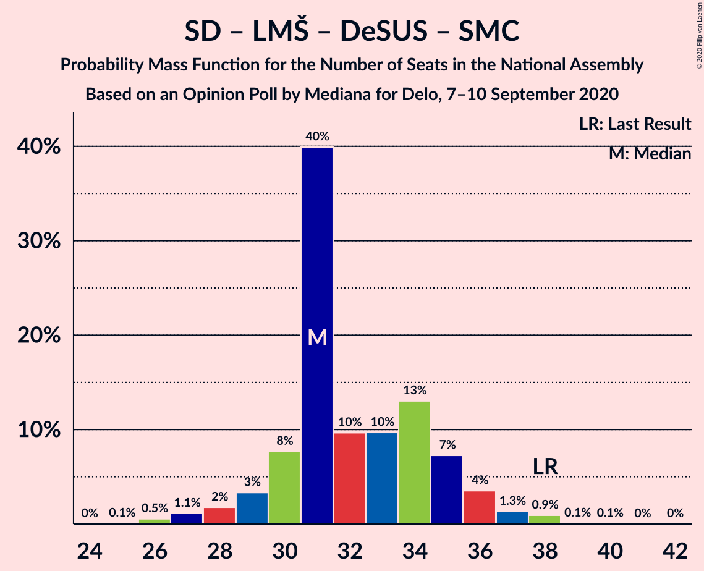

| Number of Seats | Probability | Accumulated | Special Marks |
|:---------------:|:-----------:|:-----------:|:-------------:|
| 25 | 0.1% | 100% |  |
| 26 | 0.5% | 99.9% |  |
| 27 | 1.1% | 99.4% |  |
| 28 | 2% | 98% |  |
| 29 | 3% | 96% |  |
| 30 | 8% | 93% |  |
| 31 | 40% | 85% | Median |
| 32 | 10% | 46% |  |
| 33 | 10% | 36% |  |
| 34 | 13% | 26% |  |
| 35 | 7% | 13% |  |
| 36 | 4% | 6% |  |
| 37 | 1.3% | 2% |  |
| 38 | 0.9% | 1.1% | Last Result |
| 39 | 0.1% | 0.2% |  |
| 40 | 0.1% | 0.1% |  |
| 41 | 0% | 0% |  |

### Socialni demokrati – Lista Marjana Šarca

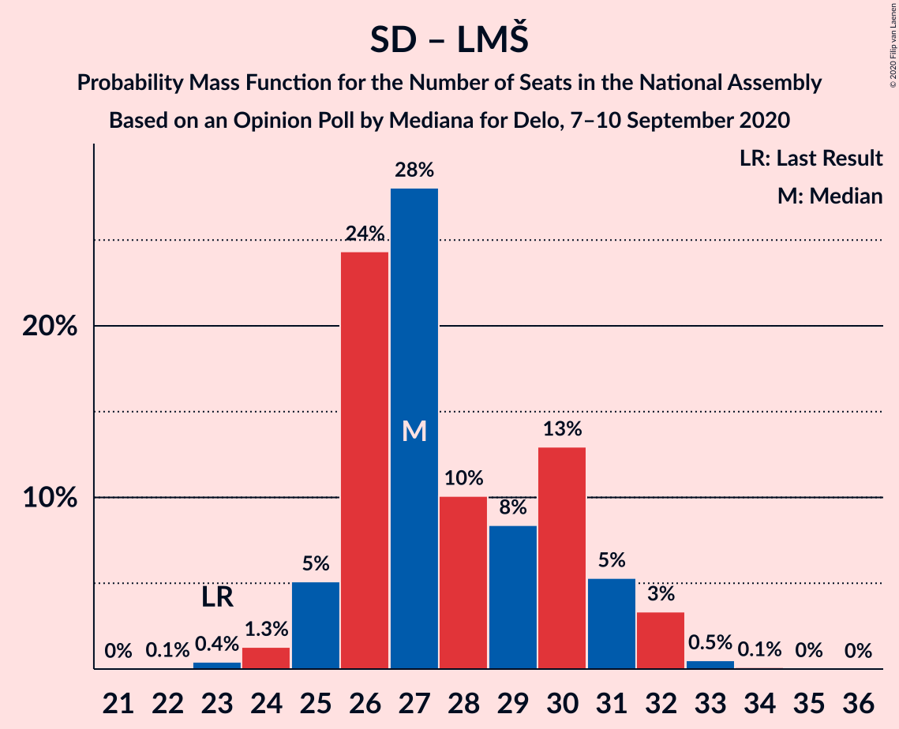

| Number of Seats | Probability | Accumulated | Special Marks |
|:---------------:|:-----------:|:-----------:|:-------------:|
| 22 | 0.1% | 100% |  |
| 23 | 0.4% | 99.9% | Last Result |
| 24 | 1.3% | 99.5% |  |
| 25 | 5% | 98% |  |
| 26 | 24% | 93% |  |
| 27 | 28% | 69% | Median |
| 28 | 10% | 41% |  |
| 29 | 8% | 31% |  |
| 30 | 13% | 22% |  |
| 31 | 5% | 9% |  |
| 32 | 3% | 4% |  |
| 33 | 0.5% | 0.7% |  |
| 34 | 0.1% | 0.2% |  |
| 35 | 0% | 0.1% |  |
| 36 | 0% | 0% |  |

### Socialni demokrati – Lista Marjana Šarca – Stranka modernega centra

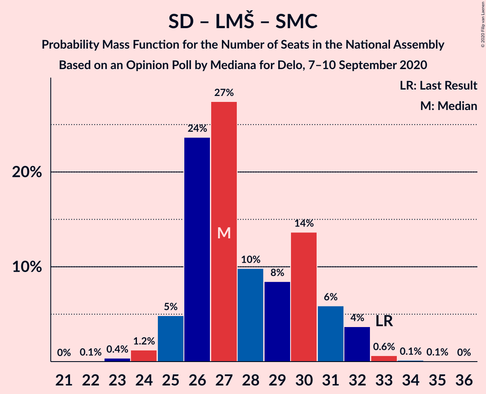

| Number of Seats | Probability | Accumulated | Special Marks |
|:---------------:|:-----------:|:-----------:|:-------------:|
| 22 | 0.1% | 100% |  |
| 23 | 0.4% | 99.9% |  |
| 24 | 1.2% | 99.6% |  |
| 25 | 5% | 98% |  |
| 26 | 24% | 93% |  |
| 27 | 27% | 70% | Median |
| 28 | 10% | 42% |  |
| 29 | 8% | 33% |  |
| 30 | 14% | 24% |  |
| 31 | 6% | 10% |  |
| 32 | 4% | 5% |  |
| 33 | 0.6% | 0.9% | Last Result |
| 34 | 0.1% | 0.3% |  |
| 35 | 0.1% | 0.1% |  |
| 36 | 0% | 0% |  |

### Socialni demokrati – Demokratična stranka upokojencev Slovenije – Stranka modernega centra

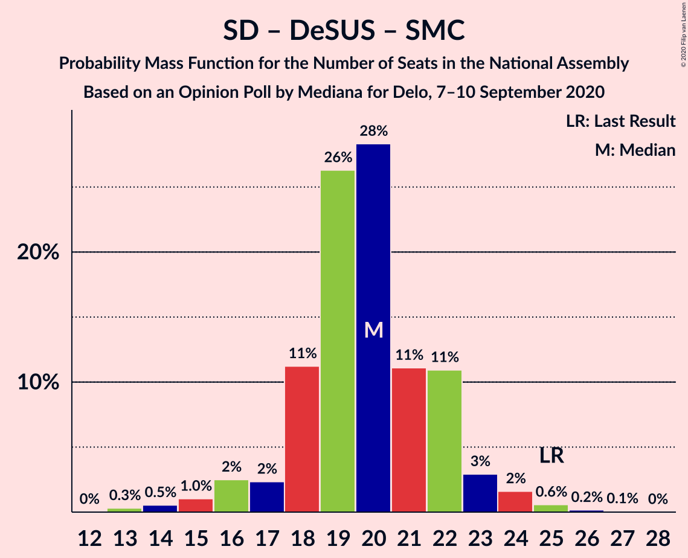

| Number of Seats | Probability | Accumulated | Special Marks |
|:---------------:|:-----------:|:-----------:|:-------------:|
| 13 | 0.3% | 100% |  |
| 14 | 0.5% | 99.7% |  |
| 15 | 1.0% | 99.1% |  |
| 16 | 2% | 98% |  |
| 17 | 2% | 96% |  |
| 18 | 11% | 93% |  |
| 19 | 26% | 82% | Median |
| 20 | 28% | 56% |  |
| 21 | 11% | 27% |  |
| 22 | 11% | 16% |  |
| 23 | 3% | 5% |  |
| 24 | 2% | 2% |  |
| 25 | 0.6% | 0.8% | Last Result |
| 26 | 0.2% | 0.3% |  |
| 27 | 0.1% | 0.1% |  |
| 28 | 0% | 0% |  |

## Technical Information

### Opinion Poll

+ **Polling firm:** Mediana
+ **Commissioner(s):** Delo
+ **Fieldwork period:** 7–10 September 2020

### Calculations

+ **Sample size:** 724
+ **Simulations done:** 1,048,576
+ **Error estimate:** 1.01%

