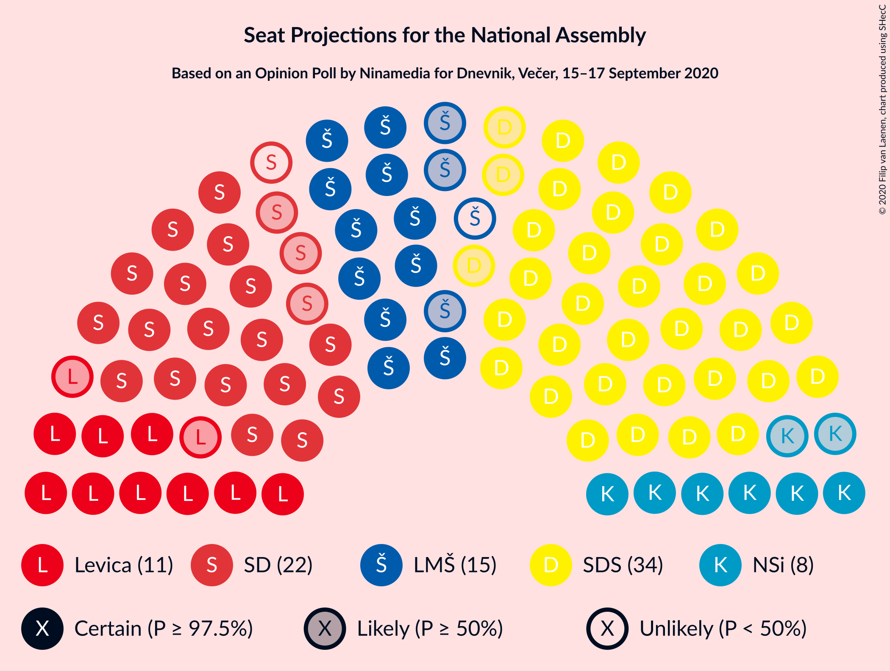
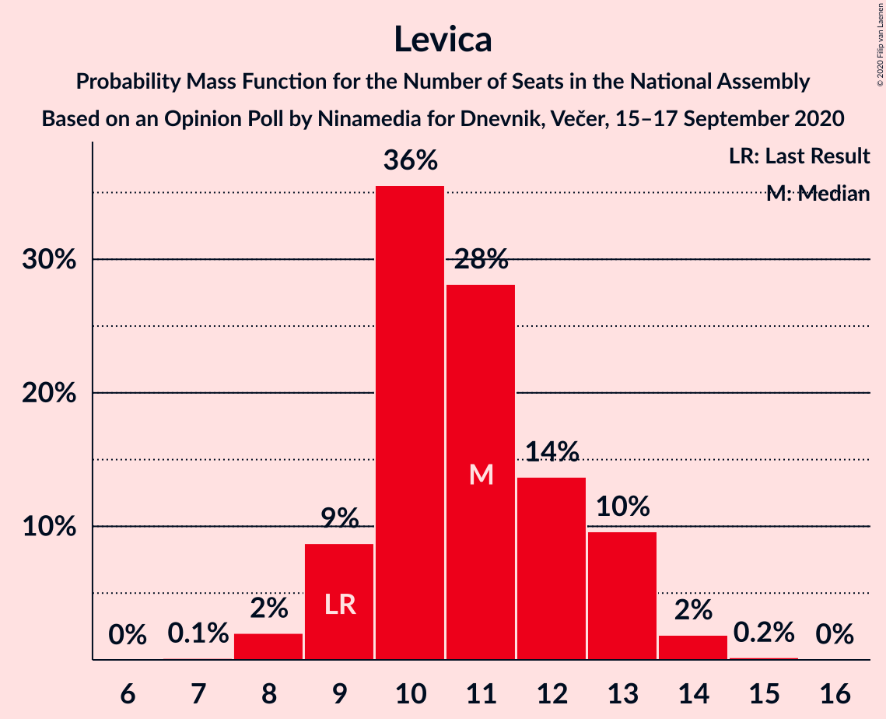

# Opinion Poll by Ninamedia for Dnevnik, Večer, 15–17 September 2020

<a href="#voting-intentions">Voting Intentions</a> | <a href="#seats">Seats</a> | <a href="#coalitions">Coalitions</a> | <a href="#technical-information">Technical Information</a>

## Voting Intentions

### Confidence Intervals

| Party | Last Result | Poll Result | 80% Confidence Interval | 90% Confidence Interval | 95% Confidence Interval | 99% Confidence Interval |
|:-----:|:-----------:|:-----------:|:-----------------------:|:-----------------------:|:-----------------------:|:-----------------------:|
| Slovenska demokratska stranka | 24.9% | 33.6% | 31.3–35.9% |30.7–36.6% |30.2–37.2% |29.1–38.3% |
| Socialni demokrati | 9.9% | 20.7% | 18.9–22.8% |18.3–23.4% |17.9–23.9% |17.0–24.9% |
| Lista Marjana Šarca | 12.6% | 13.7% | 12.2–15.5% |11.7–16.0% |11.4–16.5% |10.7–17.4% |
| Levica | 9.3% | 10.9% | 9.5–12.5% |9.1–13.0% |8.8–13.4% |8.1–14.2% |
| Nova Slovenija–Krščanski demokrati | 7.2% | 7.9% | 6.7–9.3% |6.4–9.7% |6.1–10.1% |5.6–10.8% |
| Stranka Alenke Bratušek | 5.1% | 2.9% | 2.2–3.8% |2.0–4.1% |1.9–4.4% |1.6–4.9% |
| Slovenska ljudska stranka | 2.6% | 2.6% | 2.0–3.5% |1.8–3.8% |1.6–4.0% |1.4–4.5% |
| Slovenska nacionalna stranka | 4.2% | 2.4% | 1.8–3.4% |1.7–3.6% |1.5–3.9% |1.3–4.4% |
| Demokratična stranka upokojencev Slovenije | 4.9% | 2.0% | 1.5–2.9% |1.3–3.1% |1.2–3.3% |1.0–3.8% |
| Stranka modernega centra | 9.7% | 0.6% | 0.3–1.1% |0.3–1.3% |0.2–1.5% |0.2–1.8% |

*Note:* The poll result column reflects the actual value used in the calculations. Published results may vary slightly, and in addition be rounded to fewer digits.

## Seats

### Confidence Intervals

| Party | Last Result | Median | 80% Confidence Interval | 90% Confidence Interval | 95% Confidence Interval | 99% Confidence Interval |
|:-----:|:-----------:|:------:|:-----------------------:|:-----------------------:|:-----------------------:|:-----------------------:|
| <a href="#slovenska-demokratska-stranka">Slovenska demokratska stranka</a> | 25 | 34 | 31–36 |31–37 |31–38 |29–39 |
| <a href="#socialni-demokrati">Socialni demokrati</a> | 10 | 21 | 19–23 |18–23 |18–24 |17–25 |
| <a href="#lista-marjana-šarca">Lista Marjana Šarca</a> | 13 | 14 | 12–16 |12–16 |11–16 |11–17 |
| <a href="#levica">Levica</a> | 9 | 11 | 9–13 |9–13 |9–13 |8–14 |
| <a href="#nova-slovenija–krščanski-demokrati">Nova Slovenija–Krščanski demokrati</a> | 7 | 8 | 6–9 |6–9 |6–10 |5–11 |
| <a href="#stranka-alenke-bratušek">Stranka Alenke Bratušek</a> | 5 | 0 | 0 |0–4 |0–4 |0–4 |
| <a href="#slovenska-ljudska-stranka">Slovenska ljudska stranka</a> | 0 | 0 | 0 |0 |0–4 |0–4 |
| <a href="#slovenska-nacionalna-stranka">Slovenska nacionalna stranka</a> | 4 | 0 | 0 |0 |0 |0–4 |
| <a href="#demokratična-stranka-upokojencev-slovenije">Demokratična stranka upokojencev Slovenije</a> | 5 | 0 | 0 |0 |0 |0 |
| <a href="#stranka-modernega-centra">Stranka modernega centra</a> | 10 | 0 | 0 |0 |0 |0 |

### Slovenska demokratska stranka

*For a full overview of the results for this party, see the [Slovenska demokratska stranka](party-slovenskademokratskastranka.html) page.*

| Number of Seats | Probability | Accumulated | Special Marks |
|:---------------:|:-----------:|:-----------:|:-------------:|
| 25 | 0% | 100% | Last Result |
| 26 | 0% | 100% |  |
| 27 | 0% | 100% |  |
| 28 | 0.1% | 100% |  |
| 29 | 0.4% | 99.9% |  |
| 30 | 2% | 99.4% |  |
| 31 | 8% | 98% |  |
| 32 | 10% | 90% |  |
| 33 | 16% | 80% |  |
| 34 | 29% | 64% | Median |
| 35 | 16% | 35% |  |
| 36 | 10% | 19% |  |
| 37 | 6% | 9% |  |
| 38 | 2% | 3% |  |
| 39 | 0.9% | 1.0% |  |
| 40 | 0.1% | 0.1% |  |
| 41 | 0% | 0% |  |

### Socialni demokrati

*For a full overview of the results for this party, see the [Socialni demokrati](party-socialnidemokrati.html) page.*

| Number of Seats | Probability | Accumulated | Special Marks |
|:---------------:|:-----------:|:-----------:|:-------------:|
| 10 | 0% | 100% | Last Result |
| 11 | 0% | 100% |  |
| 12 | 0% | 100% |  |
| 13 | 0% | 100% |  |
| 14 | 0% | 100% |  |
| 15 | 0% | 100% |  |
| 16 | 0.2% | 100% |  |
| 17 | 0.6% | 99.8% |  |
| 18 | 5% | 99.2% |  |
| 19 | 12% | 95% |  |
| 20 | 17% | 82% |  |
| 21 | 19% | 65% | Median |
| 22 | 28% | 47% |  |
| 23 | 14% | 18% |  |
| 24 | 3% | 4% |  |
| 25 | 0.8% | 1.1% |  |
| 26 | 0.3% | 0.3% |  |
| 27 | 0.1% | 0.1% |  |
| 28 | 0% | 0% |  |

### Lista Marjana Šarca

*For a full overview of the results for this party, see the [Lista Marjana Šarca](party-listamarjanašarca.html) page.*

| Number of Seats | Probability | Accumulated | Special Marks |
|:---------------:|:-----------:|:-----------:|:-------------:|
| 10 | 0.5% | 100% |  |
| 11 | 4% | 99.5% |  |
| 12 | 17% | 95% |  |
| 13 | 24% | 79% | Last Result |
| 14 | 27% | 55% | Median |
| 15 | 18% | 28% |  |
| 16 | 8% | 10% |  |
| 17 | 1.5% | 2% |  |
| 18 | 0.4% | 0.4% |  |
| 19 | 0.1% | 0.1% |  |
| 20 | 0% | 0% |  |

### Levica

*For a full overview of the results for this party, see the [Levica](party-levica.html) page.*

| Number of Seats | Probability | Accumulated | Special Marks |
|:---------------:|:-----------:|:-----------:|:-------------:|
| 7 | 0.1% | 100% |  |
| 8 | 2% | 99.9% |  |
| 9 | 9% | 98% | Last Result |
| 10 | 36% | 89% |  |
| 11 | 28% | 54% | Median |
| 12 | 14% | 25% |  |
| 13 | 10% | 12% |  |
| 14 | 2% | 2% |  |
| 15 | 0.2% | 0.2% |  |
| 16 | 0% | 0% |  |

### Nova Slovenija–Krščanski demokrati

*For a full overview of the results for this party, see the [Nova Slovenija–Krščanski demokrati](party-novaslovenija–krščanskidemokrati.html) page.*

| Number of Seats | Probability | Accumulated | Special Marks |
|:---------------:|:-----------:|:-----------:|:-------------:|
| 5 | 1.1% | 100% |  |
| 6 | 11% | 98.8% |  |
| 7 | 24% | 88% | Last Result |
| 8 | 44% | 64% | Median |
| 9 | 16% | 20% |  |
| 10 | 4% | 5% |  |
| 11 | 0.8% | 0.8% |  |
| 12 | 0.1% | 0.1% |  |
| 13 | 0% | 0% |  |

### Stranka Alenke Bratušek

*For a full overview of the results for this party, see the [Stranka Alenke Bratušek](party-strankaalenkebratušek.html) page.*

| Number of Seats | Probability | Accumulated | Special Marks |
|:---------------:|:-----------:|:-----------:|:-------------:|
| 0 | 95% | 100% | Median |
| 1 | 0% | 5% |  |
| 2 | 0% | 5% |  |
| 3 | 0% | 5% |  |
| 4 | 5% | 5% |  |
| 5 | 0.3% | 0.4% | Last Result |
| 6 | 0% | 0% |  |

### Slovenska ljudska stranka

*For a full overview of the results for this party, see the [Slovenska ljudska stranka](party-slovenskaljudskastranka.html) page.*

| Number of Seats | Probability | Accumulated | Special Marks |
|:---------------:|:-----------:|:-----------:|:-------------:|
| 0 | 97% | 100% | Last Result, Median |
| 1 | 0% | 3% |  |
| 2 | 0% | 3% |  |
| 3 | 0% | 3% |  |
| 4 | 3% | 3% |  |
| 5 | 0.1% | 0.1% |  |
| 6 | 0% | 0% |  |

### Slovenska nacionalna stranka

*For a full overview of the results for this party, see the [Slovenska nacionalna stranka](party-slovenskanacionalnastranka.html) page.*

| Number of Seats | Probability | Accumulated | Special Marks |
|:---------------:|:-----------:|:-----------:|:-------------:|
| 0 | 98.5% | 100% | Median |
| 1 | 0% | 1.5% |  |
| 2 | 0% | 1.5% |  |
| 3 | 0% | 1.5% |  |
| 4 | 1.4% | 1.4% | Last Result |
| 5 | 0.1% | 0.1% |  |
| 6 | 0% | 0% |  |

### Demokratična stranka upokojencev Slovenije

*For a full overview of the results for this party, see the [Demokratična stranka upokojencev Slovenije](party-demokratičnastrankaupokojencevslovenije.html) page.*

| Number of Seats | Probability | Accumulated | Special Marks |
|:---------------:|:-----------:|:-----------:|:-------------:|
| 0 | 99.8% | 100% | Median |
| 1 | 0% | 0.2% |  |
| 2 | 0% | 0.2% |  |
| 3 | 0% | 0.2% |  |
| 4 | 0.2% | 0.2% |  |
| 5 | 0% | 0% | Last Result |

### Stranka modernega centra

*For a full overview of the results for this party, see the [Stranka modernega centra](party-strankamodernegacentra.html) page.*

| Number of Seats | Probability | Accumulated | Special Marks |
|:---------------:|:-----------:|:-----------:|:-------------:|
| 0 | 100% | 100% | Median |
| 1 | 0% | 0% |  |
| 2 | 0% | 0% |  |
| 3 | 0% | 0% |  |
| 4 | 0% | 0% |  |
| 5 | 0% | 0% |  |
| 6 | 0% | 0% |  |
| 7 | 0% | 0% |  |
| 8 | 0% | 0% |  |
| 9 | 0% | 0% |  |
| 10 | 0% | 0% | Last Result |

## Coalitions

### Confidence Intervals

| Coalition | Last Result | Median | Majority? | 80% Confidence Interval | 90% Confidence Interval | 95% Confidence Interval | 99% Confidence Interval |
|:---------:|:-----------:|:------:|:---------:|:-----------------------:|:-----------------------:|:-----------------------:|:-----------------------:|
| Slovenska demokratska stranka – Lista Marjana Šarca – Demokratična stranka upokojencev Slovenije | 43 | 48 | 85% | 45–50 | 45–51 | 44–51 | 43–53 |
| Slovenska demokratska stranka – Lista Marjana Šarca | 38 | 48 | 85% | 45–50 | 44–51 | 44–51 | 43–53 |
| Socialni demokrati – Lista Marjana Šarca – Nova Slovenija–Krščanski demokrati – Stranka Alenke Bratušek – Demokratična stranka upokojencev Slovenije – Stranka modernega centra | 50 | 43 | 9% | 40–45 | 39–46 | 39–46 | 38–48 |
| Socialni demokrati – Lista Marjana Šarca – Nova Slovenija–Krščanski demokrati – Demokratična stranka upokojencev Slovenije | 35 | 43 | 7% | 40–45 | 39–46 | 38–46 | 37–47 |
| Socialni demokrati – Lista Marjana Šarca – Nova Slovenija–Krščanski demokrati – Demokratična stranka upokojencev Slovenije – Stranka modernega centra | 45 | 43 | 7% | 40–45 | 39–46 | 38–46 | 37–47 |
| Socialni demokrati – Lista Marjana Šarca – Nova Slovenija–Krščanski demokrati | 30 | 43 | 6% | 40–45 | 39–46 | 38–46 | 37–47 |
| Socialni demokrati – Lista Marjana Šarca – Nova Slovenija–Krščanski demokrati – Stranka modernega centra | 40 | 43 | 6% | 40–45 | 39–46 | 38–46 | 37–47 |
| Socialni demokrati – Lista Marjana Šarca – Stranka Alenke Bratušek – Demokratična stranka upokojencev Slovenije – Stranka modernega centra | 43 | 35 | 0% | 32–37 | 32–38 | 31–39 | 30–40 |
| Socialni demokrati – Lista Marjana Šarca – Demokratična stranka upokojencev Slovenije | 28 | 35 | 0% | 32–37 | 32–38 | 31–38 | 30–39 |
| Socialni demokrati – Lista Marjana Šarca – Demokratična stranka upokojencev Slovenije – Stranka modernega centra | 38 | 35 | 0% | 32–37 | 32–38 | 31–38 | 30–39 |
| Socialni demokrati – Lista Marjana Šarca | 23 | 35 | 0% | 32–37 | 32–38 | 31–38 | 30–39 |
| Socialni demokrati – Lista Marjana Šarca – Stranka modernega centra | 33 | 35 | 0% | 32–37 | 32–38 | 31–38 | 30–39 |
| Socialni demokrati – Demokratična stranka upokojencev Slovenije – Stranka modernega centra | 25 | 21 | 0% | 19–23 | 18–23 | 18–24 | 17–25 |

### Slovenska demokratska stranka – Lista Marjana Šarca – Demokratična stranka upokojencev Slovenije

| Number of Seats | Probability | Accumulated | Special Marks |
|:---------------:|:-----------:|:-----------:|:-------------:|
| 41 | 0.1% | 100% |  |
| 42 | 0.3% | 99.9% |  |
| 43 | 2% | 99.5% | Last Result |
| 44 | 3% | 98% |  |
| 45 | 10% | 95% |  |
| 46 | 16% | 85% | Majority |
| 47 | 11% | 69% |  |
| 48 | 22% | 59% | Median |
| 49 | 20% | 37% |  |
| 50 | 11% | 17% |  |
| 51 | 4% | 6% |  |
| 52 | 2% | 2% |  |
| 53 | 0.3% | 0.6% |  |
| 54 | 0.2% | 0.2% |  |
| 55 | 0% | 0% |  |

### Slovenska demokratska stranka – Lista Marjana Šarca

| Number of Seats | Probability | Accumulated | Special Marks |
|:---------------:|:-----------:|:-----------:|:-------------:|
| 38 | 0% | 100% | Last Result |
| 39 | 0% | 100% |  |
| 40 | 0% | 100% |  |
| 41 | 0.1% | 100% |  |
| 42 | 0.3% | 99.9% |  |
| 43 | 2% | 99.5% |  |
| 44 | 3% | 98% |  |
| 45 | 10% | 95% |  |
| 46 | 16% | 85% | Majority |
| 47 | 11% | 69% |  |
| 48 | 22% | 59% | Median |
| 49 | 20% | 37% |  |
| 50 | 11% | 17% |  |
| 51 | 4% | 6% |  |
| 52 | 2% | 2% |  |
| 53 | 0.3% | 0.5% |  |
| 54 | 0.2% | 0.2% |  |
| 55 | 0% | 0% |  |

### Socialni demokrati – Lista Marjana Šarca – Nova Slovenija–Krščanski demokrati – Stranka Alenke Bratušek – Demokratična stranka upokojencev Slovenije – Stranka modernega centra

| Number of Seats | Probability | Accumulated | Special Marks |
|:---------------:|:-----------:|:-----------:|:-------------:|
| 36 | 0.1% | 100% |  |
| 37 | 0.4% | 99.9% |  |
| 38 | 2% | 99.5% |  |
| 39 | 3% | 98% |  |
| 40 | 8% | 94% |  |
| 41 | 11% | 86% |  |
| 42 | 14% | 75% |  |
| 43 | 22% | 61% | Median |
| 44 | 23% | 39% |  |
| 45 | 7% | 16% |  |
| 46 | 7% | 9% | Majority |
| 47 | 1.0% | 2% |  |
| 48 | 0.4% | 0.6% |  |
| 49 | 0.2% | 0.2% |  |
| 50 | 0% | 0% | Last Result |

### Socialni demokrati – Lista Marjana Šarca – Nova Slovenija–Krščanski demokrati – Demokratična stranka upokojencev Slovenije

| Number of Seats | Probability | Accumulated | Special Marks |
|:---------------:|:-----------:|:-----------:|:-------------:|
| 35 | 0% | 100% | Last Result |
| 36 | 0.2% | 100% |  |
| 37 | 0.4% | 99.7% |  |
| 38 | 2% | 99.3% |  |
| 39 | 5% | 97% |  |
| 40 | 9% | 93% |  |
| 41 | 11% | 84% |  |
| 42 | 16% | 73% |  |
| 43 | 21% | 57% | Median |
| 44 | 23% | 36% |  |
| 45 | 6% | 13% |  |
| 46 | 5% | 7% | Majority |
| 47 | 0.7% | 1.1% |  |
| 48 | 0.3% | 0.4% |  |
| 49 | 0.1% | 0.1% |  |
| 50 | 0% | 0% |  |

### Socialni demokrati – Lista Marjana Šarca – Nova Slovenija–Krščanski demokrati – Demokratična stranka upokojencev Slovenije – Stranka modernega centra

| Number of Seats | Probability | Accumulated | Special Marks |
|:---------------:|:-----------:|:-----------:|:-------------:|
| 36 | 0.2% | 100% |  |
| 37 | 0.4% | 99.7% |  |
| 38 | 2% | 99.3% |  |
| 39 | 5% | 97% |  |
| 40 | 9% | 93% |  |
| 41 | 11% | 84% |  |
| 42 | 16% | 73% |  |
| 43 | 21% | 57% | Median |
| 44 | 23% | 36% |  |
| 45 | 6% | 13% | Last Result |
| 46 | 5% | 7% | Majority |
| 47 | 0.7% | 1.1% |  |
| 48 | 0.3% | 0.4% |  |
| 49 | 0.1% | 0.1% |  |
| 50 | 0% | 0% |  |

### Socialni demokrati – Lista Marjana Šarca – Nova Slovenija–Krščanski demokrati

| Number of Seats | Probability | Accumulated | Special Marks |
|:---------------:|:-----------:|:-----------:|:-------------:|
| 30 | 0% | 100% | Last Result |
| 31 | 0% | 100% |  |
| 32 | 0% | 100% |  |
| 33 | 0% | 100% |  |
| 34 | 0% | 100% |  |
| 35 | 0% | 100% |  |
| 36 | 0.2% | 100% |  |
| 37 | 0.4% | 99.7% |  |
| 38 | 2% | 99.3% |  |
| 39 | 5% | 97% |  |
| 40 | 9% | 93% |  |
| 41 | 11% | 84% |  |
| 42 | 16% | 72% |  |
| 43 | 21% | 57% | Median |
| 44 | 23% | 35% |  |
| 45 | 6% | 13% |  |
| 46 | 5% | 6% | Majority |
| 47 | 0.7% | 1.1% |  |
| 48 | 0.3% | 0.4% |  |
| 49 | 0.1% | 0.1% |  |
| 50 | 0% | 0% |  |

### Socialni demokrati – Lista Marjana Šarca – Nova Slovenija–Krščanski demokrati – Stranka modernega centra

| Number of Seats | Probability | Accumulated | Special Marks |
|:---------------:|:-----------:|:-----------:|:-------------:|
| 36 | 0.2% | 100% |  |
| 37 | 0.4% | 99.7% |  |
| 38 | 2% | 99.3% |  |
| 39 | 5% | 97% |  |
| 40 | 9% | 93% | Last Result |
| 41 | 11% | 84% |  |
| 42 | 16% | 72% |  |
| 43 | 21% | 57% | Median |
| 44 | 23% | 35% |  |
| 45 | 6% | 13% |  |
| 46 | 5% | 6% | Majority |
| 47 | 0.7% | 1.1% |  |
| 48 | 0.3% | 0.4% |  |
| 49 | 0.1% | 0.1% |  |
| 50 | 0% | 0% |  |

### Socialni demokrati – Lista Marjana Šarca – Stranka Alenke Bratušek – Demokratična stranka upokojencev Slovenije – Stranka modernega centra

| Number of Seats | Probability | Accumulated | Special Marks |
|:---------------:|:-----------:|:-----------:|:-------------:|
| 29 | 0.2% | 100% |  |
| 30 | 0.9% | 99.8% |  |
| 31 | 3% | 98.9% |  |
| 32 | 7% | 96% |  |
| 33 | 11% | 89% |  |
| 34 | 11% | 78% |  |
| 35 | 21% | 67% | Median |
| 36 | 28% | 45% |  |
| 37 | 10% | 17% |  |
| 38 | 5% | 8% |  |
| 39 | 2% | 3% |  |
| 40 | 0.7% | 1.1% |  |
| 41 | 0.3% | 0.4% |  |
| 42 | 0.1% | 0.1% |  |
| 43 | 0% | 0% | Last Result |

### Socialni demokrati – Lista Marjana Šarca – Demokratična stranka upokojencev Slovenije

| Number of Seats | Probability | Accumulated | Special Marks |
|:---------------:|:-----------:|:-----------:|:-------------:|
| 28 | 0% | 100% | Last Result |
| 29 | 0.3% | 99.9% |  |
| 30 | 1.0% | 99.7% |  |
| 31 | 3% | 98.7% |  |
| 32 | 8% | 95% |  |
| 33 | 13% | 88% |  |
| 34 | 12% | 75% |  |
| 35 | 22% | 63% | Median |
| 36 | 28% | 41% |  |
| 37 | 8% | 14% |  |
| 38 | 4% | 5% |  |
| 39 | 0.8% | 1.2% |  |
| 40 | 0.2% | 0.4% |  |
| 41 | 0.1% | 0.1% |  |
| 42 | 0% | 0% |  |

### Socialni demokrati – Lista Marjana Šarca – Demokratična stranka upokojencev Slovenije – Stranka modernega centra

| Number of Seats | Probability | Accumulated | Special Marks |
|:---------------:|:-----------:|:-----------:|:-------------:|
| 28 | 0% | 100% |  |
| 29 | 0.3% | 99.9% |  |
| 30 | 1.0% | 99.7% |  |
| 31 | 3% | 98.7% |  |
| 32 | 8% | 95% |  |
| 33 | 13% | 88% |  |
| 34 | 12% | 75% |  |
| 35 | 22% | 63% | Median |
| 36 | 28% | 41% |  |
| 37 | 8% | 14% |  |
| 38 | 4% | 5% | Last Result |
| 39 | 0.8% | 1.2% |  |
| 40 | 0.2% | 0.4% |  |
| 41 | 0.1% | 0.1% |  |
| 42 | 0% | 0% |  |

### Socialni demokrati – Lista Marjana Šarca

| Number of Seats | Probability | Accumulated | Special Marks |
|:---------------:|:-----------:|:-----------:|:-------------:|
| 23 | 0% | 100% | Last Result |
| 24 | 0% | 100% |  |
| 25 | 0% | 100% |  |
| 26 | 0% | 100% |  |
| 27 | 0% | 100% |  |
| 28 | 0% | 100% |  |
| 29 | 0.3% | 99.9% |  |
| 30 | 1.0% | 99.7% |  |
| 31 | 3% | 98.6% |  |
| 32 | 8% | 95% |  |
| 33 | 13% | 88% |  |
| 34 | 12% | 75% |  |
| 35 | 22% | 63% | Median |
| 36 | 28% | 41% |  |
| 37 | 8% | 14% |  |
| 38 | 4% | 5% |  |
| 39 | 0.7% | 1.1% |  |
| 40 | 0.2% | 0.4% |  |
| 41 | 0.1% | 0.1% |  |
| 42 | 0% | 0% |  |

### Socialni demokrati – Lista Marjana Šarca – Stranka modernega centra

| Number of Seats | Probability | Accumulated | Special Marks |
|:---------------:|:-----------:|:-----------:|:-------------:|
| 28 | 0% | 100% |  |
| 29 | 0.3% | 99.9% |  |
| 30 | 1.0% | 99.7% |  |
| 31 | 3% | 98.6% |  |
| 32 | 8% | 95% |  |
| 33 | 13% | 88% | Last Result |
| 34 | 12% | 75% |  |
| 35 | 22% | 63% | Median |
| 36 | 28% | 41% |  |
| 37 | 8% | 14% |  |
| 38 | 4% | 5% |  |
| 39 | 0.7% | 1.1% |  |
| 40 | 0.2% | 0.4% |  |
| 41 | 0.1% | 0.1% |  |
| 42 | 0% | 0% |  |

### Socialni demokrati – Demokratična stranka upokojencev Slovenije – Stranka modernega centra

| Number of Seats | Probability | Accumulated | Special Marks |
|:---------------:|:-----------:|:-----------:|:-------------:|
| 16 | 0.2% | 100% |  |
| 17 | 0.6% | 99.8% |  |
| 18 | 5% | 99.2% |  |
| 19 | 12% | 95% |  |
| 20 | 17% | 83% |  |
| 21 | 19% | 66% | Median |
| 22 | 28% | 47% |  |
| 23 | 15% | 19% |  |
| 24 | 3% | 4% |  |
| 25 | 0.9% | 1.2% | Last Result |
| 26 | 0.3% | 0.3% |  |
| 27 | 0.1% | 0.1% |  |
| 28 | 0% | 0% |  |

## Technical Information

### Opinion Poll

+ **Polling firm:** Ninamedia
+ **Commissioner(s):** Dnevnik, Večer
+ **Fieldwork period:** 15–17 September 2020

### Calculations

+ **Sample size:** 700
+ **Simulations done:** 1,048,576
+ **Error estimate:** 0.91%

