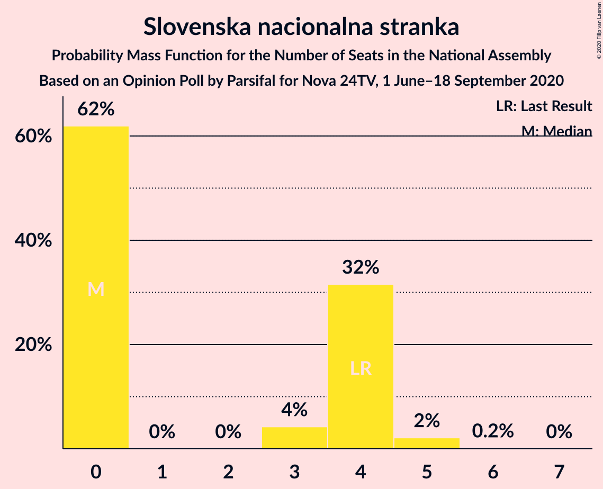

# Opinion Poll by Parsifal for Nova 24TV, 1 June–18 September 2020

<a href="#voting-intentions">Voting Intentions</a> | <a href="#seats">Seats</a> | <a href="#coalitions">Coalitions</a> | <a href="#technical-information">Technical Information</a>

## Voting Intentions

### Confidence Intervals

| Party | Last Result | Poll Result | 80% Confidence Interval | 90% Confidence Interval | 95% Confidence Interval | 99% Confidence Interval |
|:-----:|:-----------:|:-----------:|:-----------------------:|:-----------------------:|:-----------------------:|:-----------------------:|
| Slovenska demokratska stranka | 24.9% | 35.0% | 32.7–37.3% |32.1–38.0% |31.5–38.6% |30.4–39.7% |
| Socialni demokrati | 9.9% | 17.7% | 15.9–19.6% |15.5–20.2% |15.0–20.7% |14.2–21.7% |
| Lista Marjana Šarca | 12.6% | 15.3% | 13.6–17.1% |13.2–17.7% |12.8–18.1% |12.0–19.1% |
| Levica | 9.3% | 8.1% | 6.9–9.6% |6.6–10.0% |6.3–10.4% |5.8–11.1% |
| Demokratična stranka upokojencev Slovenije | 4.9% | 5.6% | 4.6–6.8% |4.3–7.2% |4.1–7.5% |3.7–8.2% |
| Nova Slovenija–Krščanski demokrati | 7.2% | 4.6% | 3.7–5.7% |3.5–6.1% |3.2–6.4% |2.9–7.0% |
| Stranka Alenke Bratušek | 5.1% | 3.7% | 2.9–4.8% |2.7–5.1% |2.5–5.4% |2.2–6.0% |
| Slovenska nacionalna stranka | 4.2% | 3.6% | 2.8–4.6% |2.6–4.9% |2.4–5.2% |2.1–5.8% |
| Slovenska ljudska stranka | 2.6% | 2.0% | 1.5–2.9% |1.3–3.1% |1.2–3.3% |1.0–3.8% |
| Stranka modernega centra | 9.7% | 0.9% | 0.5–1.5% |0.5–1.7% |0.4–1.9% |0.3–2.2% |

*Note:* The poll result column reflects the actual value used in the calculations. Published results may vary slightly, and in addition be rounded to fewer digits.

## Seats

### Confidence Intervals

| Party | Last Result | Median | 80% Confidence Interval | 90% Confidence Interval | 95% Confidence Interval | 99% Confidence Interval |
|:-----:|:-----------:|:------:|:-----------------------:|:-----------------------:|:-----------------------:|:-----------------------:|
| <a href="#slovenska-demokratska-stranka">Slovenska demokratska stranka</a> | 25 | 35 | 32–38 |31–38 |31–38 |30–41 |
| <a href="#socialni-demokrati">Socialni demokrati</a> | 10 | 17 | 15–19 |15–20 |14–21 |14–22 |
| <a href="#lista-marjana-šarca">Lista Marjana Šarca</a> | 13 | 15 | 13–17 |13–18 |12–18 |11–19 |
| <a href="#levica">Levica</a> | 9 | 8 | 6–9 |6–9 |6–10 |5–11 |
| <a href="#demokratična-stranka-upokojencev-slovenije">Demokratična stranka upokojencev Slovenije</a> | 5 | 5 | 4–7 |4–7 |4–7 |0–8 |
| <a href="#nova-slovenija–krščanski-demokrati">Nova Slovenija–Krščanski demokrati</a> | 7 | 4 | 0–5 |0–6 |0–6 |0–6 |
| <a href="#stranka-alenke-bratušek">Stranka Alenke Bratušek</a> | 5 | 0 | 0–4 |0–5 |0–5 |0–5 |
| <a href="#slovenska-nacionalna-stranka">Slovenska nacionalna stranka</a> | 4 | 0 | 0–4 |0–4 |0–4 |0–5 |
| <a href="#slovenska-ljudska-stranka">Slovenska ljudska stranka</a> | 0 | 0 | 0 |0 |0 |0 |
| <a href="#stranka-modernega-centra">Stranka modernega centra</a> | 10 | 0 | 0 |0 |0 |0 |

### Slovenska demokratska stranka

*For a full overview of the results for this party, see the [Slovenska demokratska stranka](party-slovenskademokratskastranka.html) page.*

| Number of Seats | Probability | Accumulated | Special Marks |
|:---------------:|:-----------:|:-----------:|:-------------:|
| 25 | 0% | 100% | Last Result |
| 26 | 0% | 100% |  |
| 27 | 0% | 100% |  |
| 28 | 0.1% | 100% |  |
| 29 | 0.3% | 99.9% |  |
| 30 | 1.3% | 99.6% |  |
| 31 | 4% | 98% |  |
| 32 | 9% | 94% |  |
| 33 | 12% | 85% |  |
| 34 | 9% | 73% |  |
| 35 | 20% | 63% | Median |
| 36 | 23% | 43% |  |
| 37 | 6% | 20% |  |
| 38 | 11% | 13% |  |
| 39 | 1.1% | 2% |  |
| 40 | 0.5% | 1.1% |  |
| 41 | 0.4% | 0.6% |  |
| 42 | 0.2% | 0.2% |  |
| 43 | 0% | 0% |  |

### Socialni demokrati

*For a full overview of the results for this party, see the [Socialni demokrati](party-socialnidemokrati.html) page.*

| Number of Seats | Probability | Accumulated | Special Marks |
|:---------------:|:-----------:|:-----------:|:-------------:|
| 10 | 0% | 100% | Last Result |
| 11 | 0% | 100% |  |
| 12 | 0% | 100% |  |
| 13 | 0.2% | 100% |  |
| 14 | 2% | 99.8% |  |
| 15 | 8% | 97% |  |
| 16 | 20% | 89% |  |
| 17 | 23% | 69% | Median |
| 18 | 23% | 47% |  |
| 19 | 14% | 23% |  |
| 20 | 7% | 10% |  |
| 21 | 2% | 3% |  |
| 22 | 0.7% | 0.9% |  |
| 23 | 0.1% | 0.1% |  |
| 24 | 0% | 0% |  |

### Lista Marjana Šarca

*For a full overview of the results for this party, see the [Lista Marjana Šarca](party-listamarjanašarca.html) page.*

| Number of Seats | Probability | Accumulated | Special Marks |
|:---------------:|:-----------:|:-----------:|:-------------:|
| 10 | 0.1% | 100% |  |
| 11 | 1.1% | 99.9% |  |
| 12 | 2% | 98.8% |  |
| 13 | 20% | 97% | Last Result |
| 14 | 20% | 77% |  |
| 15 | 16% | 57% | Median |
| 16 | 29% | 41% |  |
| 17 | 7% | 12% |  |
| 18 | 4% | 5% |  |
| 19 | 0.5% | 0.7% |  |
| 20 | 0.2% | 0.2% |  |
| 21 | 0% | 0% |  |

### Levica

*For a full overview of the results for this party, see the [Levica](party-levica.html) page.*

| Number of Seats | Probability | Accumulated | Special Marks |
|:---------------:|:-----------:|:-----------:|:-------------:|
| 5 | 0.7% | 100% |  |
| 6 | 9% | 99.3% |  |
| 7 | 37% | 90% |  |
| 8 | 32% | 53% | Median |
| 9 | 16% | 20% | Last Result |
| 10 | 4% | 5% |  |
| 11 | 0.5% | 0.6% |  |
| 12 | 0.1% | 0.1% |  |
| 13 | 0% | 0% |  |

### Demokratična stranka upokojencev Slovenije

*For a full overview of the results for this party, see the [Demokratična stranka upokojencev Slovenije](party-demokratičnastrankaupokojencevslovenije.html) page.*

| Number of Seats | Probability | Accumulated | Special Marks |
|:---------------:|:-----------:|:-----------:|:-------------:|
| 0 | 2% | 100% |  |
| 1 | 0% | 98% |  |
| 2 | 0% | 98% |  |
| 3 | 0.4% | 98% |  |
| 4 | 12% | 98% |  |
| 5 | 51% | 85% | Last Result, Median |
| 6 | 21% | 34% |  |
| 7 | 13% | 13% |  |
| 8 | 0.4% | 0.5% |  |
| 9 | 0.1% | 0.1% |  |
| 10 | 0% | 0% |  |

### Nova Slovenija–Krščanski demokrati

*For a full overview of the results for this party, see the [Nova Slovenija–Krščanski demokrati](party-novaslovenija–krščanskidemokrati.html) page.*

| Number of Seats | Probability | Accumulated | Special Marks |
|:---------------:|:-----------:|:-----------:|:-------------:|
| 0 | 18% | 100% |  |
| 1 | 0% | 82% |  |
| 2 | 0% | 82% |  |
| 3 | 2% | 82% |  |
| 4 | 44% | 80% | Median |
| 5 | 31% | 36% |  |
| 6 | 5% | 5% |  |
| 7 | 0.3% | 0.3% | Last Result |
| 8 | 0% | 0% |  |

### Stranka Alenke Bratušek

*For a full overview of the results for this party, see the [Stranka Alenke Bratušek](party-strankaalenkebratušek.html) page.*

| Number of Seats | Probability | Accumulated | Special Marks |
|:---------------:|:-----------:|:-----------:|:-------------:|
| 0 | 70% | 100% | Median |
| 1 | 0% | 30% |  |
| 2 | 0% | 30% |  |
| 3 | 1.3% | 30% |  |
| 4 | 22% | 29% |  |
| 5 | 6% | 7% | Last Result |
| 6 | 0.2% | 0.2% |  |
| 7 | 0% | 0% |  |

### Slovenska nacionalna stranka

*For a full overview of the results for this party, see the [Slovenska nacionalna stranka](party-slovenskanacionalnastranka.html) page.*

| Number of Seats | Probability | Accumulated | Special Marks |
|:---------------:|:-----------:|:-----------:|:-------------:|
| 0 | 62% | 100% | Median |
| 1 | 0% | 38% |  |
| 2 | 0% | 38% |  |
| 3 | 4% | 38% |  |
| 4 | 32% | 34% | Last Result |
| 5 | 2% | 2% |  |
| 6 | 0.2% | 0.2% |  |
| 7 | 0% | 0% |  |

### Slovenska ljudska stranka

*For a full overview of the results for this party, see the [Slovenska ljudska stranka](party-slovenskaljudskastranka.html) page.*

| Number of Seats | Probability | Accumulated | Special Marks |
|:---------------:|:-----------:|:-----------:|:-------------:|
| 0 | 99.8% | 100% | Last Result, Median |
| 1 | 0% | 0.2% |  |
| 2 | 0% | 0.2% |  |
| 3 | 0% | 0.2% |  |
| 4 | 0.2% | 0.2% |  |
| 5 | 0% | 0% |  |

### Stranka modernega centra

*For a full overview of the results for this party, see the [Stranka modernega centra](party-strankamodernegacentra.html) page.*

| Number of Seats | Probability | Accumulated | Special Marks |
|:---------------:|:-----------:|:-----------:|:-------------:|
| 0 | 100% | 100% | Median |
| 1 | 0% | 0% |  |
| 2 | 0% | 0% |  |
| 3 | 0% | 0% |  |
| 4 | 0% | 0% |  |
| 5 | 0% | 0% |  |
| 6 | 0% | 0% |  |
| 7 | 0% | 0% |  |
| 8 | 0% | 0% |  |
| 9 | 0% | 0% |  |
| 10 | 0% | 0% | Last Result |

## Coalitions

### Confidence Intervals

| Coalition | Last Result | Median | Majority? | 80% Confidence Interval | 90% Confidence Interval | 95% Confidence Interval | 99% Confidence Interval |
|:---------:|:-----------:|:------:|:---------:|:-----------------------:|:-----------------------:|:-----------------------:|:-----------------------:|
| Slovenska demokratska stranka – Lista Marjana Šarca – Demokratična stranka upokojencev Slovenije | 43 | 56 | 100% | 51–58 | 50–58 | 49–60 | 49–62 |
| Slovenska demokratska stranka – Lista Marjana Šarca | 38 | 50 | 92% | 46–52 | 45–53 | 45–54 | 44–56 |
| Socialni demokrati – Lista Marjana Šarca – Demokratična stranka upokojencev Slovenije – Nova Slovenija–Krščanski demokrati – Stranka Alenke Bratušek – Stranka modernega centra | 50 | 42 | 14% | 38–46 | 38–47 | 37–48 | 36–49 |
| Socialni demokrati – Lista Marjana Šarca – Demokratična stranka upokojencev Slovenije – Nova Slovenija–Krščanski demokrati | 35 | 41 | 5% | 38–45 | 37–46 | 37–46 | 34–47 |
| Socialni demokrati – Lista Marjana Šarca – Demokratična stranka upokojencev Slovenije – Nova Slovenija–Krščanski demokrati – Stranka modernega centra | 45 | 41 | 5% | 38–45 | 37–46 | 37–46 | 34–47 |
| Socialni demokrati – Lista Marjana Šarca – Demokratična stranka upokojencev Slovenije – Stranka Alenke Bratušek – Stranka modernega centra | 43 | 39 | 0.5% | 35–43 | 34–44 | 34–44 | 32–46 |
| Socialni demokrati – Lista Marjana Šarca – Demokratična stranka upokojencev Slovenije | 28 | 37 | 0% | 34–40 | 34–41 | 33–42 | 31–43 |
| Socialni demokrati – Lista Marjana Šarca – Demokratična stranka upokojencev Slovenije – Stranka modernega centra | 38 | 37 | 0% | 34–40 | 34–41 | 33–42 | 31–43 |
| Socialni demokrati – Lista Marjana Šarca – Nova Slovenija–Krščanski demokrati | 30 | 36 | 0% | 33–39 | 32–40 | 32–41 | 29–42 |
| Socialni demokrati – Lista Marjana Šarca – Nova Slovenija–Krščanski demokrati – Stranka modernega centra | 40 | 36 | 0% | 33–39 | 32–40 | 32–41 | 29–42 |
| Socialni demokrati – Lista Marjana Šarca | 23 | 32 | 0% | 30–35 | 29–36 | 29–37 | 27–38 |
| Socialni demokrati – Lista Marjana Šarca – Stranka modernega centra | 33 | 32 | 0% | 30–35 | 29–36 | 29–37 | 27–38 |
| Socialni demokrati – Demokratična stranka upokojencev Slovenije – Stranka modernega centra | 25 | 23 | 0% | 20–25 | 19–26 | 19–26 | 17–27 |

### Slovenska demokratska stranka – Lista Marjana Šarca – Demokratična stranka upokojencev Slovenije

| Number of Seats | Probability | Accumulated | Special Marks |
|:---------------:|:-----------:|:-----------:|:-------------:|
| 43 | 0% | 100% | Last Result |
| 44 | 0% | 100% |  |
| 45 | 0% | 100% |  |
| 46 | 0.1% | 100% | Majority |
| 47 | 0.1% | 99.9% |  |
| 48 | 0.3% | 99.8% |  |
| 49 | 2% | 99.5% |  |
| 50 | 4% | 97% |  |
| 51 | 6% | 93% |  |
| 52 | 7% | 87% |  |
| 53 | 9% | 80% |  |
| 54 | 8% | 71% |  |
| 55 | 10% | 63% | Median |
| 56 | 16% | 53% |  |
| 57 | 18% | 37% |  |
| 58 | 14% | 19% |  |
| 59 | 2% | 5% |  |
| 60 | 1.2% | 3% |  |
| 61 | 1.1% | 2% |  |
| 62 | 0.6% | 0.7% |  |
| 63 | 0% | 0.1% |  |
| 64 | 0.1% | 0.1% |  |
| 65 | 0% | 0% |  |

### Slovenska demokratska stranka – Lista Marjana Šarca

| Number of Seats | Probability | Accumulated | Special Marks |
|:---------------:|:-----------:|:-----------:|:-------------:|
| 38 | 0% | 100% | Last Result |
| 39 | 0% | 100% |  |
| 40 | 0% | 100% |  |
| 41 | 0% | 100% |  |
| 42 | 0.1% | 100% |  |
| 43 | 0.4% | 99.9% |  |
| 44 | 1.3% | 99.5% |  |
| 45 | 6% | 98% |  |
| 46 | 4% | 92% | Majority |
| 47 | 8% | 88% |  |
| 48 | 8% | 80% |  |
| 49 | 11% | 72% |  |
| 50 | 14% | 61% | Median |
| 51 | 16% | 47% |  |
| 52 | 23% | 31% |  |
| 53 | 3% | 7% |  |
| 54 | 2% | 4% |  |
| 55 | 1.0% | 2% |  |
| 56 | 0.7% | 1.2% |  |
| 57 | 0.3% | 0.5% |  |
| 58 | 0% | 0.2% |  |
| 59 | 0.1% | 0.1% |  |
| 60 | 0% | 0.1% |  |
| 61 | 0% | 0% |  |

### Socialni demokrati – Lista Marjana Šarca – Demokratična stranka upokojencev Slovenije – Nova Slovenija–Krščanski demokrati – Stranka Alenke Bratušek – Stranka modernega centra

| Number of Seats | Probability | Accumulated | Special Marks |
|:---------------:|:-----------:|:-----------:|:-------------:|
| 33 | 0% | 100% |  |
| 34 | 0% | 99.9% |  |
| 35 | 0.2% | 99.9% |  |
| 36 | 0.5% | 99.7% |  |
| 37 | 3% | 99.3% |  |
| 38 | 7% | 96% |  |
| 39 | 8% | 89% |  |
| 40 | 3% | 81% |  |
| 41 | 13% | 78% | Median |
| 42 | 19% | 66% |  |
| 43 | 8% | 46% |  |
| 44 | 8% | 38% |  |
| 45 | 16% | 30% |  |
| 46 | 6% | 14% | Majority |
| 47 | 2% | 7% |  |
| 48 | 4% | 5% |  |
| 49 | 1.0% | 1.4% |  |
| 50 | 0.1% | 0.4% | Last Result |
| 51 | 0.3% | 0.3% |  |
| 52 | 0% | 0% |  |

### Socialni demokrati – Lista Marjana Šarca – Demokratična stranka upokojencev Slovenije – Nova Slovenija–Krščanski demokrati

| Number of Seats | Probability | Accumulated | Special Marks |
|:---------------:|:-----------:|:-----------:|:-------------:|
| 32 | 0.1% | 100% |  |
| 33 | 0.1% | 99.9% |  |
| 34 | 0.5% | 99.8% |  |
| 35 | 0.6% | 99.3% | Last Result |
| 36 | 1.2% | 98.7% |  |
| 37 | 4% | 98% |  |
| 38 | 13% | 93% |  |
| 39 | 12% | 80% |  |
| 40 | 5% | 68% |  |
| 41 | 18% | 64% | Median |
| 42 | 16% | 46% |  |
| 43 | 5% | 30% |  |
| 44 | 9% | 25% |  |
| 45 | 11% | 16% |  |
| 46 | 3% | 5% | Majority |
| 47 | 2% | 2% |  |
| 48 | 0.1% | 0.1% |  |
| 49 | 0% | 0% |  |

### Socialni demokrati – Lista Marjana Šarca – Demokratična stranka upokojencev Slovenije – Nova Slovenija–Krščanski demokrati – Stranka modernega centra

| Number of Seats | Probability | Accumulated | Special Marks |
|:---------------:|:-----------:|:-----------:|:-------------:|
| 32 | 0.1% | 100% |  |
| 33 | 0.1% | 99.9% |  |
| 34 | 0.5% | 99.8% |  |
| 35 | 0.6% | 99.3% |  |
| 36 | 1.2% | 98.7% |  |
| 37 | 4% | 98% |  |
| 38 | 13% | 93% |  |
| 39 | 12% | 80% |  |
| 40 | 5% | 68% |  |
| 41 | 18% | 64% | Median |
| 42 | 16% | 46% |  |
| 43 | 5% | 30% |  |
| 44 | 9% | 25% |  |
| 45 | 11% | 16% | Last Result |
| 46 | 3% | 5% | Majority |
| 47 | 2% | 2% |  |
| 48 | 0.1% | 0.1% |  |
| 49 | 0% | 0% |  |

### Socialni demokrati – Lista Marjana Šarca – Demokratična stranka upokojencev Slovenije – Stranka Alenke Bratušek – Stranka modernega centra

| Number of Seats | Probability | Accumulated | Special Marks |
|:---------------:|:-----------:|:-----------:|:-------------:|
| 31 | 0.2% | 100% |  |
| 32 | 0.3% | 99.8% |  |
| 33 | 1.4% | 99.5% |  |
| 34 | 3% | 98% |  |
| 35 | 5% | 95% |  |
| 36 | 4% | 90% |  |
| 37 | 21% | 86% | Median |
| 38 | 13% | 65% |  |
| 39 | 13% | 52% |  |
| 40 | 15% | 39% |  |
| 41 | 9% | 24% |  |
| 42 | 4% | 15% |  |
| 43 | 4% | 11% | Last Result |
| 44 | 5% | 7% |  |
| 45 | 2% | 2% |  |
| 46 | 0.2% | 0.5% | Majority |
| 47 | 0.3% | 0.3% |  |
| 48 | 0% | 0% |  |

### Socialni demokrati – Lista Marjana Šarca – Demokratična stranka upokojencev Slovenije

| Number of Seats | Probability | Accumulated | Special Marks |
|:---------------:|:-----------:|:-----------:|:-------------:|
| 28 | 0% | 100% | Last Result |
| 29 | 0% | 100% |  |
| 30 | 0.1% | 100% |  |
| 31 | 0.6% | 99.9% |  |
| 32 | 0.9% | 99.3% |  |
| 33 | 3% | 98% |  |
| 34 | 6% | 96% |  |
| 35 | 10% | 89% |  |
| 36 | 6% | 80% |  |
| 37 | 27% | 73% | Median |
| 38 | 12% | 46% |  |
| 39 | 11% | 35% |  |
| 40 | 15% | 24% |  |
| 41 | 4% | 8% |  |
| 42 | 2% | 4% |  |
| 43 | 2% | 2% |  |
| 44 | 0.2% | 0.4% |  |
| 45 | 0.1% | 0.1% |  |
| 46 | 0% | 0% | Majority |

### Socialni demokrati – Lista Marjana Šarca – Demokratična stranka upokojencev Slovenije – Stranka modernega centra

| Number of Seats | Probability | Accumulated | Special Marks |
|:---------------:|:-----------:|:-----------:|:-------------:|
| 30 | 0.1% | 100% |  |
| 31 | 0.6% | 99.9% |  |
| 32 | 0.9% | 99.3% |  |
| 33 | 3% | 98% |  |
| 34 | 6% | 96% |  |
| 35 | 10% | 89% |  |
| 36 | 6% | 80% |  |
| 37 | 27% | 73% | Median |
| 38 | 12% | 46% | Last Result |
| 39 | 11% | 35% |  |
| 40 | 15% | 24% |  |
| 41 | 4% | 8% |  |
| 42 | 2% | 4% |  |
| 43 | 2% | 2% |  |
| 44 | 0.2% | 0.4% |  |
| 45 | 0.1% | 0.1% |  |
| 46 | 0% | 0% | Majority |

### Socialni demokrati – Lista Marjana Šarca – Nova Slovenija–Krščanski demokrati

| Number of Seats | Probability | Accumulated | Special Marks |
|:---------------:|:-----------:|:-----------:|:-------------:|
| 27 | 0% | 100% |  |
| 28 | 0.1% | 99.9% |  |
| 29 | 0.4% | 99.9% |  |
| 30 | 0.7% | 99.5% | Last Result |
| 31 | 1.0% | 98.8% |  |
| 32 | 7% | 98% |  |
| 33 | 10% | 91% |  |
| 34 | 12% | 80% |  |
| 35 | 7% | 69% |  |
| 36 | 18% | 62% | Median |
| 37 | 16% | 44% |  |
| 38 | 12% | 28% |  |
| 39 | 10% | 17% |  |
| 40 | 3% | 6% |  |
| 41 | 3% | 4% |  |
| 42 | 0.7% | 0.9% |  |
| 43 | 0.2% | 0.2% |  |
| 44 | 0% | 0% |  |

### Socialni demokrati – Lista Marjana Šarca – Nova Slovenija–Krščanski demokrati – Stranka modernega centra

| Number of Seats | Probability | Accumulated | Special Marks |
|:---------------:|:-----------:|:-----------:|:-------------:|
| 27 | 0% | 100% |  |
| 28 | 0.1% | 99.9% |  |
| 29 | 0.4% | 99.9% |  |
| 30 | 0.7% | 99.5% |  |
| 31 | 1.0% | 98.8% |  |
| 32 | 7% | 98% |  |
| 33 | 10% | 91% |  |
| 34 | 12% | 80% |  |
| 35 | 7% | 69% |  |
| 36 | 18% | 62% | Median |
| 37 | 16% | 44% |  |
| 38 | 12% | 28% |  |
| 39 | 10% | 17% |  |
| 40 | 3% | 6% | Last Result |
| 41 | 3% | 4% |  |
| 42 | 0.7% | 0.9% |  |
| 43 | 0.2% | 0.2% |  |
| 44 | 0% | 0% |  |

### Socialni demokrati – Lista Marjana Šarca

| Number of Seats | Probability | Accumulated | Special Marks |
|:---------------:|:-----------:|:-----------:|:-------------:|
| 23 | 0% | 100% | Last Result |
| 24 | 0% | 100% |  |
| 25 | 0.3% | 100% |  |
| 26 | 0.1% | 99.7% |  |
| 27 | 0.8% | 99.6% |  |
| 28 | 1.1% | 98.8% |  |
| 29 | 7% | 98% |  |
| 30 | 10% | 90% |  |
| 31 | 9% | 80% |  |
| 32 | 30% | 71% | Median |
| 33 | 15% | 42% |  |
| 34 | 14% | 27% |  |
| 35 | 7% | 13% |  |
| 36 | 3% | 6% |  |
| 37 | 2% | 3% |  |
| 38 | 0.5% | 0.8% |  |
| 39 | 0.3% | 0.3% |  |
| 40 | 0% | 0% |  |

### Socialni demokrati – Lista Marjana Šarca – Stranka modernega centra

| Number of Seats | Probability | Accumulated | Special Marks |
|:---------------:|:-----------:|:-----------:|:-------------:|
| 25 | 0.3% | 100% |  |
| 26 | 0.1% | 99.7% |  |
| 27 | 0.8% | 99.6% |  |
| 28 | 1.1% | 98.8% |  |
| 29 | 7% | 98% |  |
| 30 | 10% | 90% |  |
| 31 | 9% | 80% |  |
| 32 | 30% | 71% | Median |
| 33 | 15% | 42% | Last Result |
| 34 | 14% | 27% |  |
| 35 | 7% | 13% |  |
| 36 | 3% | 6% |  |
| 37 | 2% | 3% |  |
| 38 | 0.5% | 0.8% |  |
| 39 | 0.3% | 0.3% |  |
| 40 | 0% | 0% |  |

### Socialni demokrati – Demokratična stranka upokojencev Slovenije – Stranka modernega centra

| Number of Seats | Probability | Accumulated | Special Marks |
|:---------------:|:-----------:|:-----------:|:-------------:|
| 15 | 0.1% | 100% |  |
| 16 | 0.1% | 99.9% |  |
| 17 | 0.6% | 99.8% |  |
| 18 | 2% | 99.2% |  |
| 19 | 3% | 98% |  |
| 20 | 7% | 95% |  |
| 21 | 15% | 87% |  |
| 22 | 15% | 72% | Median |
| 23 | 20% | 57% |  |
| 24 | 23% | 37% |  |
| 25 | 9% | 14% | Last Result |
| 26 | 4% | 6% |  |
| 27 | 1.1% | 2% |  |
| 28 | 0.4% | 0.5% |  |
| 29 | 0% | 0.1% |  |
| 30 | 0% | 0% |  |

## Technical Information

### Opinion Poll

+ **Polling firm:** Parsifal
+ **Commissioner(s):** Nova 24TV
+ **Fieldwork period:** 1 June–18 September 2020

### Calculations

+ **Sample size:** 701
+ **Simulations done:** 1,048,576
+ **Error estimate:** 2.83%

