# Opinion Poll by Mediana for POP TV, 1–27 September 2020

<a href="#voting-intentions">Voting Intentions</a> | <a href="#seats">Seats</a> | <a href="#coalitions">Coalitions</a> | <a href="#technical-information">Technical Information</a>

## Voting Intentions

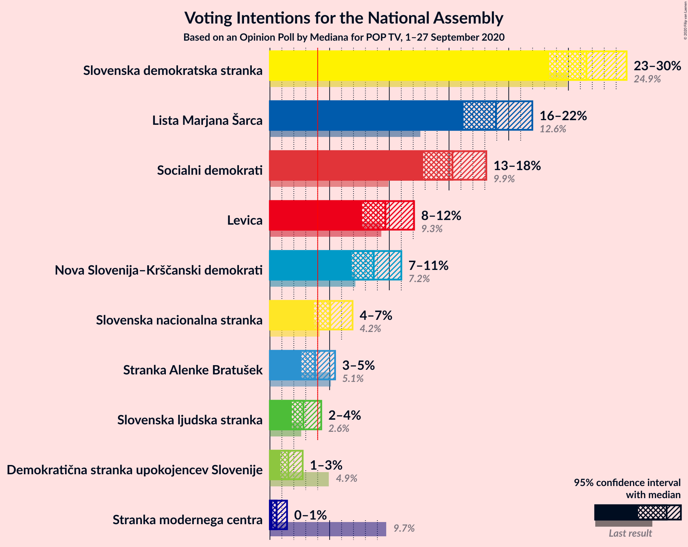

### Confidence Intervals

| Party | Last Result | Poll Result | 80% Confidence Interval | 90% Confidence Interval | 95% Confidence Interval | 99% Confidence Interval |
|:-----:|:-----------:|:-----------:|:-----------------------:|:-----------------------:|:-----------------------:|:-----------------------:|
| Slovenska demokratska stranka | 24.9% | 26.5% | 24.5–28.7% |23.9–29.3% |23.4–29.9% |22.5–31.0% |
| Lista Marjana Šarca | 12.6% | 18.9% | 17.1–20.9% |16.7–21.5% |16.2–22.0% |15.4–23.0% |
| Socialni demokrati | 9.9% | 15.3% | 13.7–17.1% |13.2–17.7% |12.8–18.1% |12.1–19.0% |
| Levica | 9.3% | 9.7% | 8.4–11.2% |8.0–11.7% |7.7–12.1% |7.1–12.9% |
| Nova Slovenija–Krščanski demokrati | 7.2% | 8.7% | 7.5–10.2% |7.1–10.6% |6.8–11.0% |6.3–11.8% |
| Slovenska nacionalna stranka | 4.2% | 5.0% | 4.1–6.3% |3.9–6.6% |3.7–6.9% |3.3–7.5% |
| Stranka Alenke Bratušek | 5.1% | 3.8% | 3.0–4.9% |2.8–5.2% |2.6–5.5% |2.3–6.0% |
| Slovenska ljudska stranka | 2.6% | 2.8% | 2.1–3.8% |2.0–4.1% |1.8–4.3% |1.6–4.8% |
| Demokratična stranka upokojencev Slovenije | 4.9% | 1.5% | 1.1–2.3% |1.0–2.5% |0.9–2.7% |0.7–3.2% |
| Stranka modernega centra | 9.7% | 0.6% | 0.3–1.1% |0.3–1.3% |0.2–1.4% |0.1–1.8% |

*Note:* The poll result column reflects the actual value used in the calculations. Published results may vary slightly, and in addition be rounded to fewer digits.

## Seats

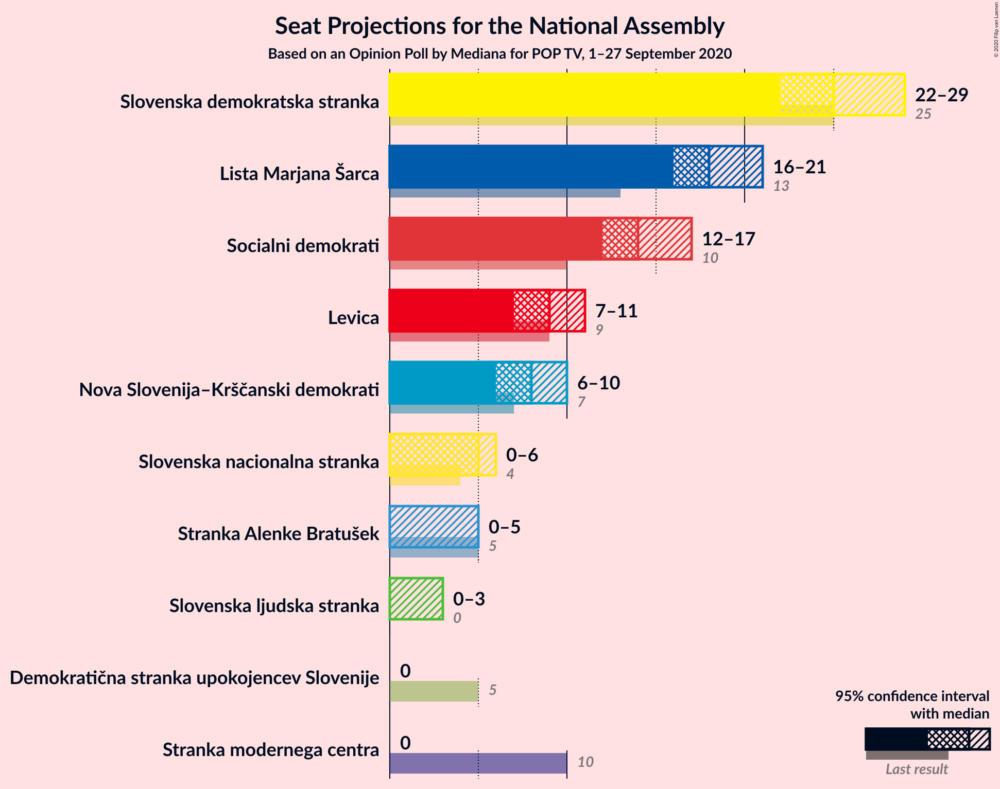

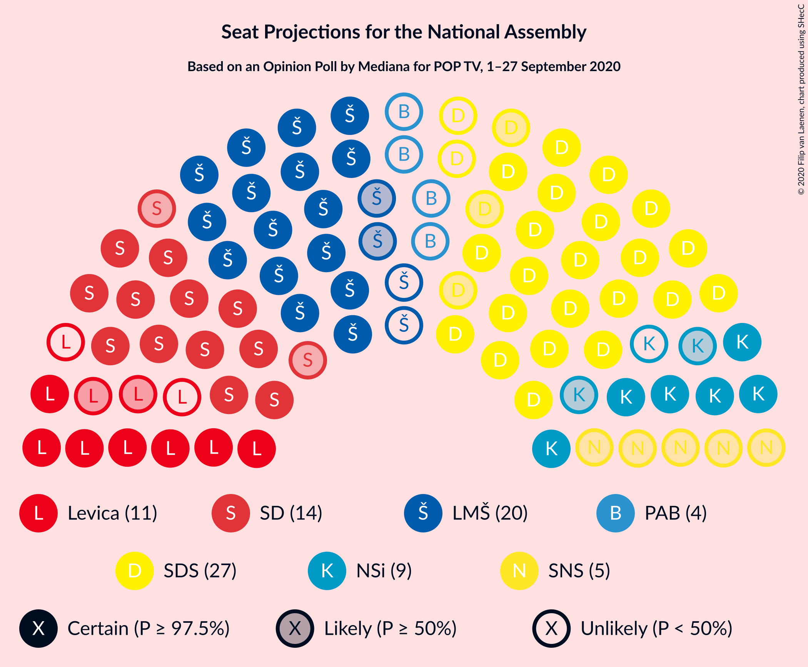

### Confidence Intervals

| Party | Last Result | Median | 80% Confidence Interval | 90% Confidence Interval | 95% Confidence Interval | 99% Confidence Interval |
|:-----:|:-----------:|:------:|:-----------------------:|:-----------------------:|:-----------------------:|:-----------------------:|
| <a href="#slovenska-demokratska-stranka">Slovenska demokratska stranka</a> | 25 | 25 | 23–28 |23–28 |22–29 |21–30 |
| <a href="#lista-marjana-šarca">Lista Marjana Šarca</a> | 13 | 18 | 16–20 |16–21 |15–21 |15–22 |
| <a href="#socialni-demokrati">Socialni demokrati</a> | 10 | 14 | 13–16 |12–17 |12–17 |11–18 |
| <a href="#levica">Levica</a> | 9 | 9 | 8–11 |7–11 |7–11 |6–12 |
| <a href="#nova-slovenija–krščanski-demokrati">Nova Slovenija–Krščanski demokrati</a> | 7 | 8 | 7–10 |7–10 |6–10 |6–11 |
| <a href="#slovenska-nacionalna-stranka">Slovenska nacionalna stranka</a> | 4 | 5 | 0–6 |0–6 |0–6 |0–7 |
| <a href="#stranka-alenke-bratušek">Stranka Alenke Bratušek</a> | 5 | 0 | 0–4 |0–4 |0–5 |0–5 |
| <a href="#slovenska-ljudska-stranka">Slovenska ljudska stranka</a> | 0 | 0 | 0 |0 |0–3 |0–4 |
| <a href="#demokratična-stranka-upokojencev-slovenije">Demokratična stranka upokojencev Slovenije</a> | 5 | 0 | 0 |0 |0 |0 |
| <a href="#stranka-modernega-centra">Stranka modernega centra</a> | 10 | 0 | 0 |0 |0 |0 |

### Slovenska demokratska stranka

*For a full overview of the results for this party, see the [Slovenska demokratska stranka](party-slovenskademokratskastranka.html) page.*

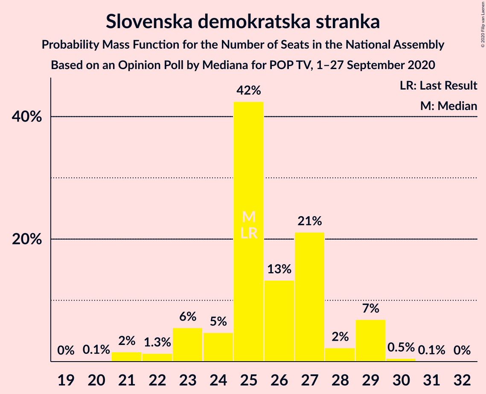

| Number of Seats | Probability | Accumulated | Special Marks |
|:---------------:|:-----------:|:-----------:|:-------------:|
| 20 | 0.1% | 100% |  |
| 21 | 0.9% | 99.9% |  |
| 22 | 2% | 99.0% |  |
| 23 | 7% | 97% |  |
| 24 | 17% | 90% |  |
| 25 | 26% | 73% | Last Result, Median |
| 26 | 16% | 46% |  |
| 27 | 14% | 31% |  |
| 28 | 12% | 16% |  |
| 29 | 4% | 5% |  |
| 30 | 0.6% | 0.9% |  |
| 31 | 0.2% | 0.3% |  |
| 32 | 0% | 0% |  |

### Lista Marjana Šarca

*For a full overview of the results for this party, see the [Lista Marjana Šarca](party-listamarjanašarca.html) page.*

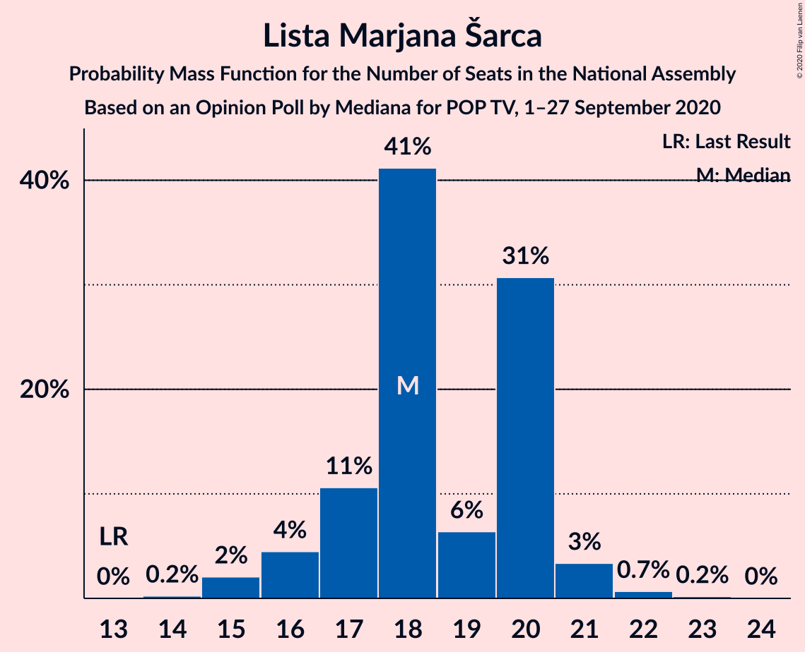

| Number of Seats | Probability | Accumulated | Special Marks |
|:---------------:|:-----------:|:-----------:|:-------------:|
| 13 | 0% | 100% | Last Result |
| 14 | 0.4% | 100% |  |
| 15 | 2% | 99.6% |  |
| 16 | 11% | 97% |  |
| 17 | 25% | 87% |  |
| 18 | 33% | 62% | Median |
| 19 | 12% | 29% |  |
| 20 | 12% | 17% |  |
| 21 | 4% | 5% |  |
| 22 | 1.0% | 1.2% |  |
| 23 | 0.2% | 0.2% |  |
| 24 | 0% | 0% |  |

### Socialni demokrati

*For a full overview of the results for this party, see the [Socialni demokrati](party-socialnidemokrati.html) page.*

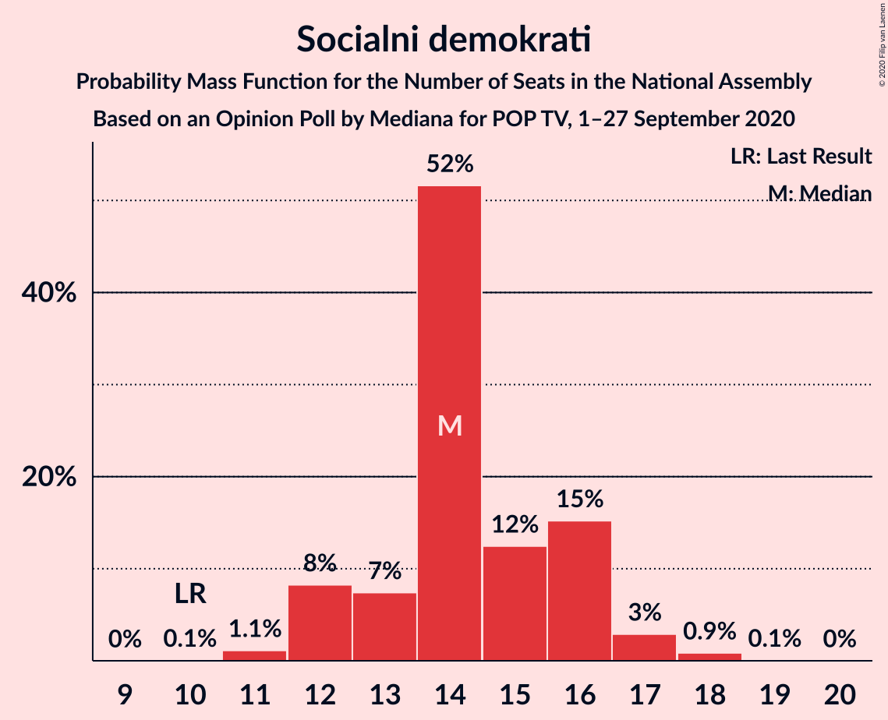

| Number of Seats | Probability | Accumulated | Special Marks |
|:---------------:|:-----------:|:-----------:|:-------------:|
| 10 | 0% | 100% | Last Result |
| 11 | 0.8% | 100% |  |
| 12 | 6% | 99.2% |  |
| 13 | 10% | 93% |  |
| 14 | 37% | 83% | Median |
| 15 | 23% | 47% |  |
| 16 | 17% | 23% |  |
| 17 | 6% | 7% |  |
| 18 | 0.9% | 1.1% |  |
| 19 | 0.2% | 0.3% |  |
| 20 | 0.1% | 0.1% |  |
| 21 | 0% | 0% |  |

### Levica

*For a full overview of the results for this party, see the [Levica](party-levica.html) page.*

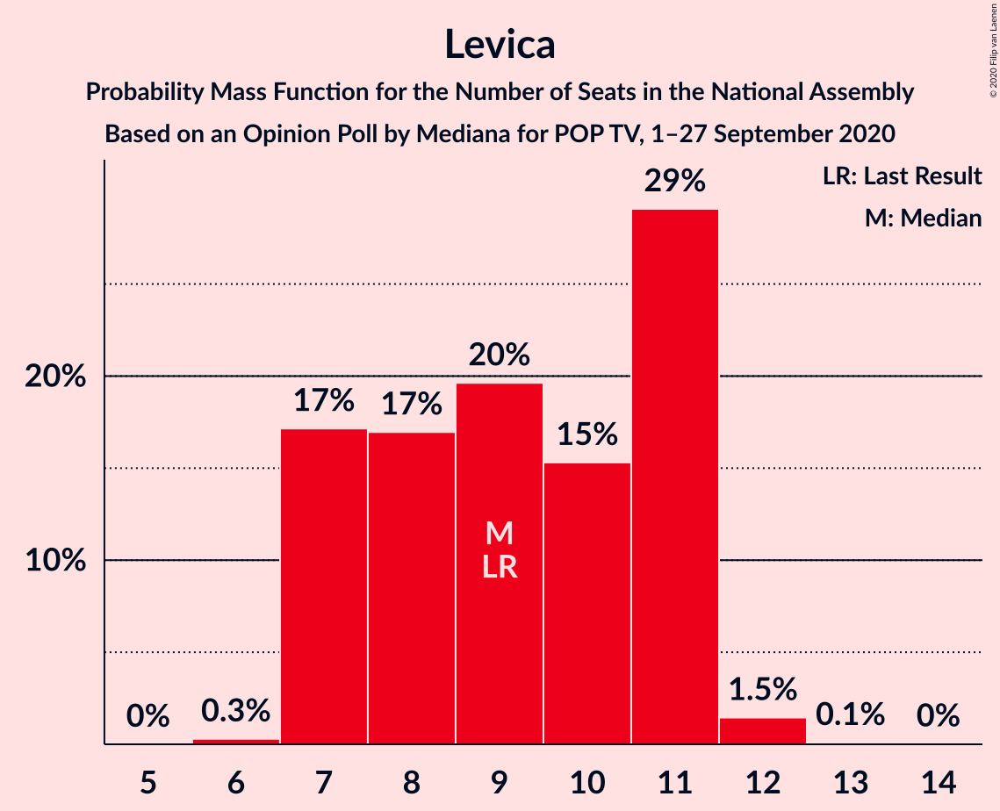

| Number of Seats | Probability | Accumulated | Special Marks |
|:---------------:|:-----------:|:-----------:|:-------------:|
| 6 | 0.5% | 100% |  |
| 7 | 9% | 99.4% |  |
| 8 | 16% | 90% |  |
| 9 | 38% | 74% | Last Result, Median |
| 10 | 24% | 37% |  |
| 11 | 11% | 13% |  |
| 12 | 2% | 2% |  |
| 13 | 0.1% | 0.1% |  |
| 14 | 0% | 0% |  |

### Nova Slovenija–Krščanski demokrati

*For a full overview of the results for this party, see the [Nova Slovenija–Krščanski demokrati](party-novaslovenija–krščanskidemokrati.html) page.*

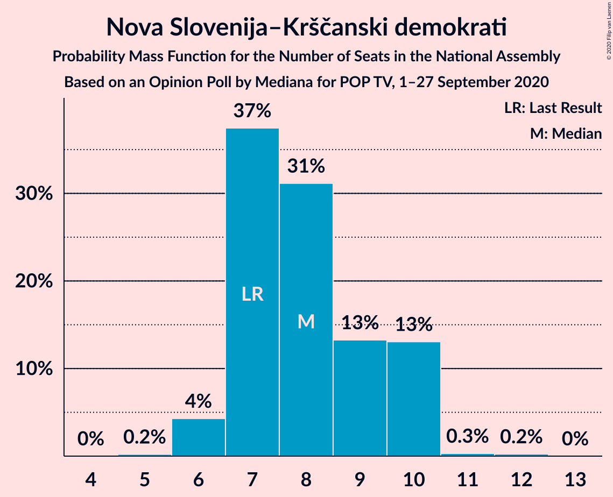

| Number of Seats | Probability | Accumulated | Special Marks |
|:---------------:|:-----------:|:-----------:|:-------------:|
| 5 | 0.3% | 100% |  |
| 6 | 5% | 99.7% |  |
| 7 | 23% | 95% | Last Result |
| 8 | 45% | 72% | Median |
| 9 | 16% | 27% |  |
| 10 | 9% | 11% |  |
| 11 | 2% | 2% |  |
| 12 | 0.2% | 0.2% |  |
| 13 | 0% | 0% |  |

### Slovenska nacionalna stranka

*For a full overview of the results for this party, see the [Slovenska nacionalna stranka](party-slovenskanacionalnastranka.html) page.*

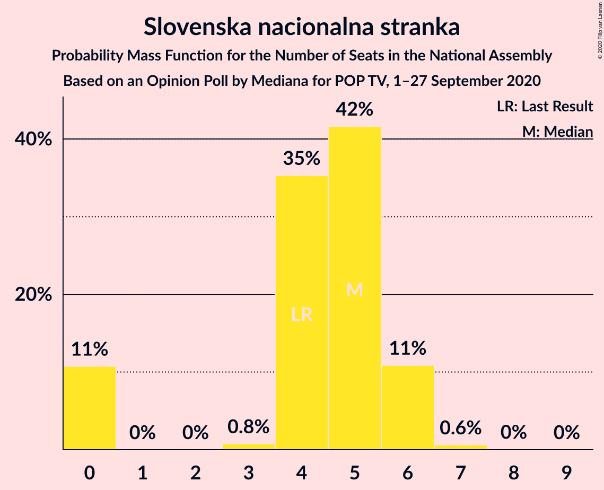

| Number of Seats | Probability | Accumulated | Special Marks |
|:---------------:|:-----------:|:-----------:|:-------------:|
| 0 | 11% | 100% |  |
| 1 | 0% | 89% |  |
| 2 | 0% | 89% |  |
| 3 | 0.8% | 89% |  |
| 4 | 35% | 88% | Last Result |
| 5 | 42% | 53% | Median |
| 6 | 11% | 12% |  |
| 7 | 0.6% | 0.7% |  |
| 8 | 0% | 0.1% |  |
| 9 | 0% | 0% |  |

### Stranka Alenke Bratušek

*For a full overview of the results for this party, see the [Stranka Alenke Bratušek](party-strankaalenkebratušek.html) page.*

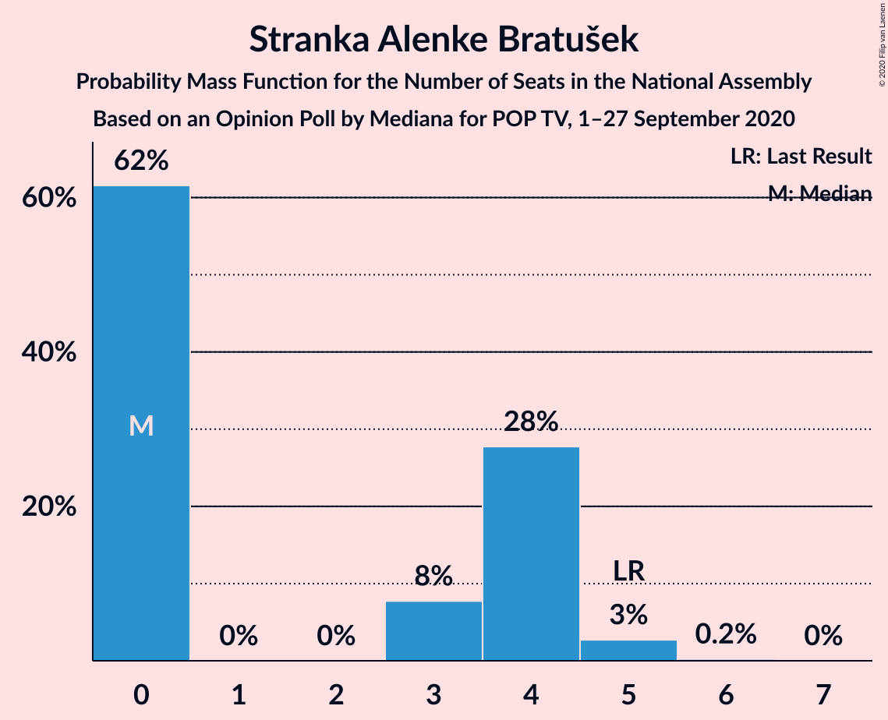

| Number of Seats | Probability | Accumulated | Special Marks |
|:---------------:|:-----------:|:-----------:|:-------------:|
| 0 | 58% | 100% | Median |
| 1 | 0% | 42% |  |
| 2 | 0% | 42% |  |
| 3 | 9% | 42% |  |
| 4 | 29% | 33% |  |
| 5 | 4% | 4% | Last Result |
| 6 | 0.2% | 0.2% |  |
| 7 | 0% | 0% |  |

### Slovenska ljudska stranka

*For a full overview of the results for this party, see the [Slovenska ljudska stranka](party-slovenskaljudskastranka.html) page.*

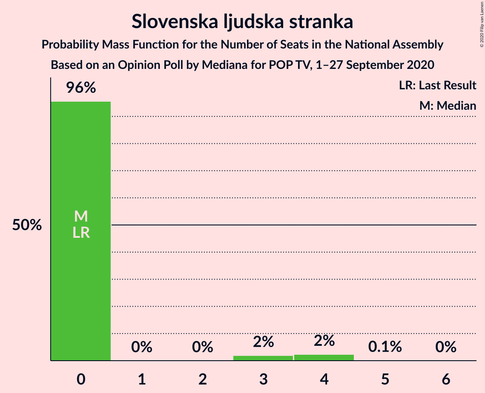

| Number of Seats | Probability | Accumulated | Special Marks |
|:---------------:|:-----------:|:-----------:|:-------------:|
| 0 | 96% | 100% | Last Result, Median |
| 1 | 0% | 4% |  |
| 2 | 0% | 4% |  |
| 3 | 2% | 4% |  |
| 4 | 2% | 2% |  |
| 5 | 0.1% | 0.1% |  |
| 6 | 0% | 0% |  |

### Demokratična stranka upokojencev Slovenije

*For a full overview of the results for this party, see the [Demokratična stranka upokojencev Slovenije](party-demokratičnastrankaupokojencevslovenije.html) page.*

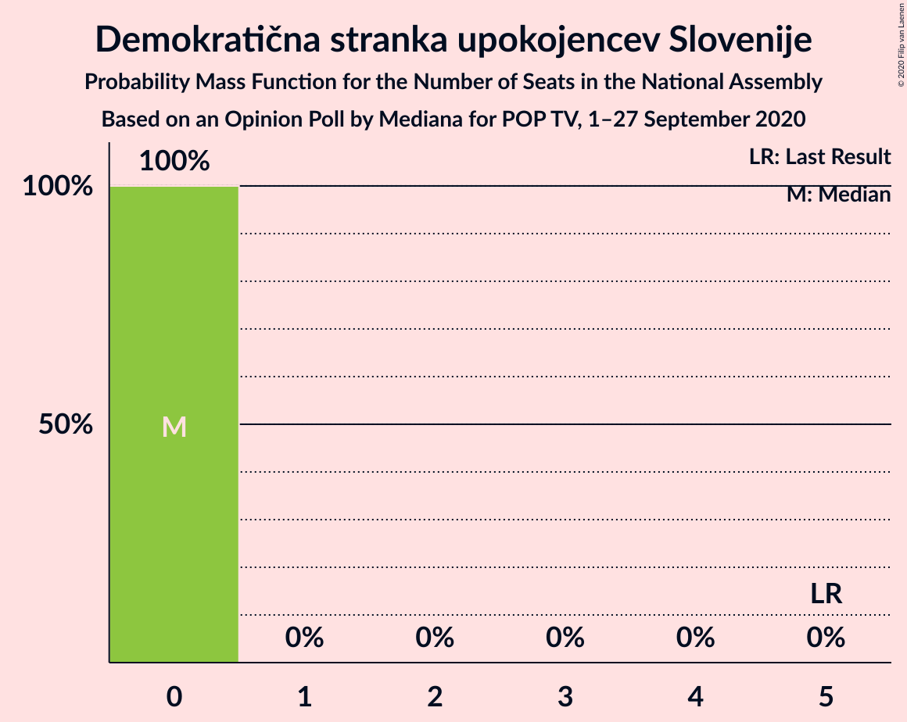

| Number of Seats | Probability | Accumulated | Special Marks |
|:---------------:|:-----------:|:-----------:|:-------------:|
| 0 | 100% | 100% | Median |
| 1 | 0% | 0% |  |
| 2 | 0% | 0% |  |
| 3 | 0% | 0% |  |
| 4 | 0% | 0% |  |
| 5 | 0% | 0% | Last Result |

### Stranka modernega centra

*For a full overview of the results for this party, see the [Stranka modernega centra](party-strankamodernegacentra.html) page.*

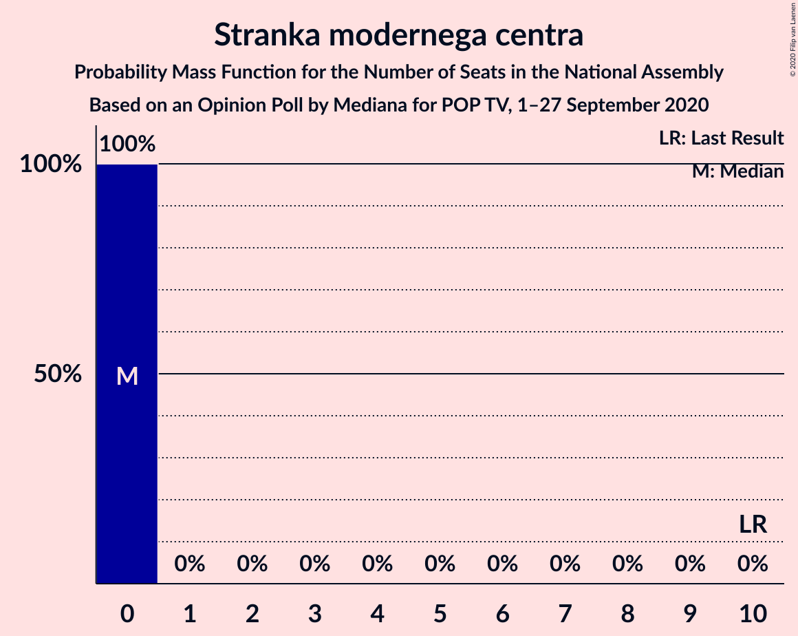

| Number of Seats | Probability | Accumulated | Special Marks |
|:---------------:|:-----------:|:-----------:|:-------------:|
| 0 | 100% | 100% | Median |
| 1 | 0% | 0% |  |
| 2 | 0% | 0% |  |
| 3 | 0% | 0% |  |
| 4 | 0% | 0% |  |
| 5 | 0% | 0% |  |
| 6 | 0% | 0% |  |
| 7 | 0% | 0% |  |
| 8 | 0% | 0% |  |
| 9 | 0% | 0% |  |
| 10 | 0% | 0% | Last Result |

## Coalitions

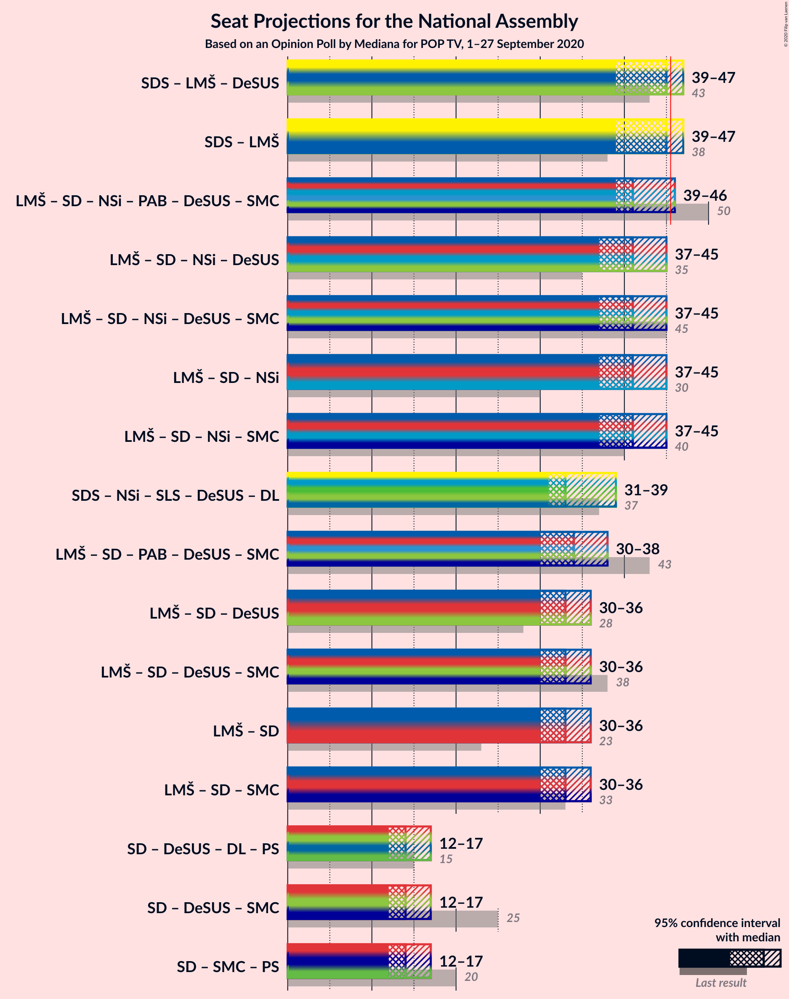

### Confidence Intervals

| Coalition | Last Result | Median | Majority? | 80% Confidence Interval | 90% Confidence Interval | 95% Confidence Interval | 99% Confidence Interval |
|:---------:|:-----------:|:------:|:---------:|:-----------------------:|:-----------------------:|:-----------------------:|:-----------------------:|
| Slovenska demokratska stranka – Lista Marjana Šarca – Demokratična stranka upokojencev Slovenije | 43 | 43 | 22% | 41–46 | 41–47 | 40–47 | 38–49 |
| Slovenska demokratska stranka – Lista Marjana Šarca | 38 | 43 | 22% | 41–46 | 41–47 | 40–47 | 38–49 |
| Lista Marjana Šarca – Socialni demokrati – Nova Slovenija–Krščanski demokrati – Stranka Alenke Bratušek – Demokratična stranka upokojencev Slovenije – Stranka modernega centra | 50 | 42 | 8% | 40–45 | 39–46 | 39–47 | 37–48 |
| Lista Marjana Šarca – Socialni demokrati – Nova Slovenija–Krščanski demokrati – Demokratična stranka upokojencev Slovenije | 35 | 41 | 1.5% | 38–43 | 37–44 | 37–44 | 35–46 |
| Lista Marjana Šarca – Socialni demokrati – Nova Slovenija–Krščanski demokrati – Demokratična stranka upokojencev Slovenije – Stranka modernega centra | 45 | 41 | 1.5% | 38–43 | 37–44 | 37–44 | 35–46 |
| Lista Marjana Šarca – Socialni demokrati – Nova Slovenija–Krščanski demokrati | 30 | 41 | 1.5% | 38–43 | 37–44 | 37–44 | 35–46 |
| Lista Marjana Šarca – Socialni demokrati – Nova Slovenija–Krščanski demokrati – Stranka modernega centra | 40 | 41 | 1.5% | 38–43 | 37–44 | 37–44 | 35–46 |
| Lista Marjana Šarca – Socialni demokrati – Stranka Alenke Bratušek – Demokratična stranka upokojencev Slovenije – Stranka modernega centra | 43 | 34 | 0% | 32–37 | 31–37 | 30–38 | 29–40 |
| Lista Marjana Šarca – Socialni demokrati – Demokratična stranka upokojencev Slovenije | 28 | 33 | 0% | 30–35 | 30–35 | 29–36 | 28–38 |
| Lista Marjana Šarca – Socialni demokrati – Demokratična stranka upokojencev Slovenije – Stranka modernega centra | 38 | 33 | 0% | 30–35 | 30–35 | 29–36 | 28–38 |
| Lista Marjana Šarca – Socialni demokrati | 23 | 33 | 0% | 30–35 | 30–35 | 29–36 | 28–38 |
| Lista Marjana Šarca – Socialni demokrati – Stranka modernega centra | 33 | 33 | 0% | 30–35 | 30–35 | 29–36 | 28–38 |
| Socialni demokrati – Demokratična stranka upokojencev Slovenije – Stranka modernega centra | 25 | 14 | 0% | 13–16 | 12–17 | 12–17 | 11–18 |

### Slovenska demokratska stranka – Lista Marjana Šarca – Demokratična stranka upokojencev Slovenije

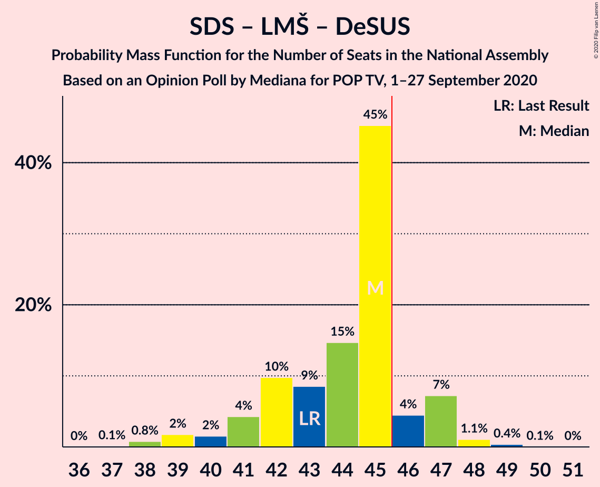

| Number of Seats | Probability | Accumulated | Special Marks |
|:---------------:|:-----------:|:-----------:|:-------------:|
| 37 | 0.1% | 100% |  |
| 38 | 0.4% | 99.9% |  |
| 39 | 2% | 99.4% |  |
| 40 | 2% | 98% |  |
| 41 | 17% | 95% |  |
| 42 | 10% | 78% |  |
| 43 | 19% | 67% | Last Result, Median |
| 44 | 9% | 48% |  |
| 45 | 17% | 39% |  |
| 46 | 17% | 22% | Majority |
| 47 | 3% | 5% |  |
| 48 | 1.0% | 2% |  |
| 49 | 0.3% | 0.8% |  |
| 50 | 0.1% | 0.5% |  |
| 51 | 0.3% | 0.3% |  |
| 52 | 0% | 0% |  |

### Slovenska demokratska stranka – Lista Marjana Šarca

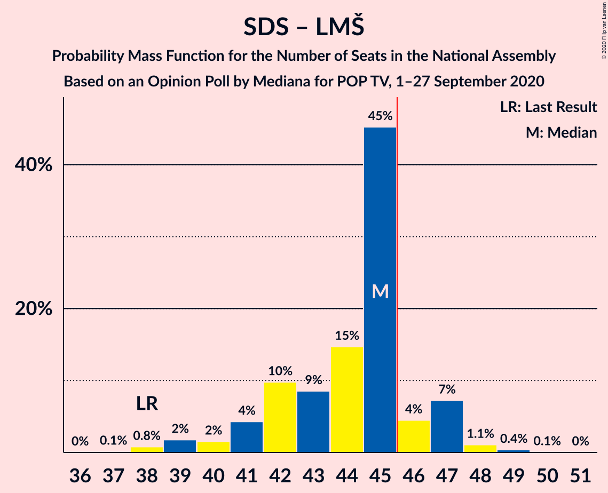

| Number of Seats | Probability | Accumulated | Special Marks |
|:---------------:|:-----------:|:-----------:|:-------------:|
| 37 | 0.1% | 100% |  |
| 38 | 0.4% | 99.9% | Last Result |
| 39 | 2% | 99.4% |  |
| 40 | 2% | 98% |  |
| 41 | 17% | 95% |  |
| 42 | 10% | 78% |  |
| 43 | 19% | 67% | Median |
| 44 | 9% | 48% |  |
| 45 | 17% | 39% |  |
| 46 | 17% | 22% | Majority |
| 47 | 3% | 5% |  |
| 48 | 1.0% | 2% |  |
| 49 | 0.3% | 0.8% |  |
| 50 | 0.1% | 0.5% |  |
| 51 | 0.3% | 0.3% |  |
| 52 | 0% | 0% |  |

### Lista Marjana Šarca – Socialni demokrati – Nova Slovenija–Krščanski demokrati – Stranka Alenke Bratušek – Demokratična stranka upokojencev Slovenije – Stranka modernega centra

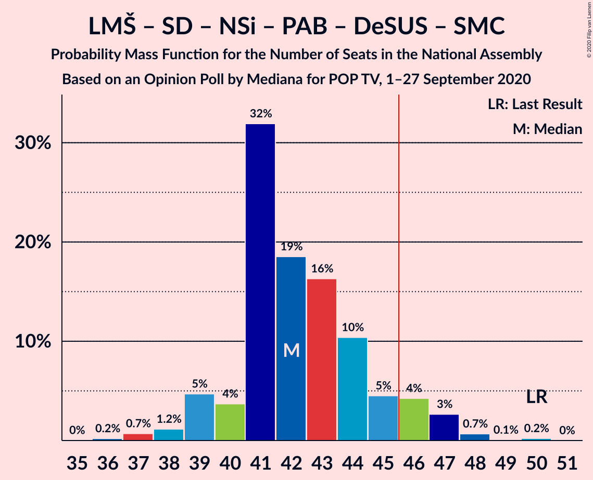

| Number of Seats | Probability | Accumulated | Special Marks |
|:---------------:|:-----------:|:-----------:|:-------------:|
| 36 | 0.2% | 100% |  |
| 37 | 0.7% | 99.8% |  |
| 38 | 1.2% | 99.1% |  |
| 39 | 5% | 98% |  |
| 40 | 4% | 93% | Median |
| 41 | 32% | 90% |  |
| 42 | 19% | 58% |  |
| 43 | 16% | 39% |  |
| 44 | 10% | 23% |  |
| 45 | 5% | 12% |  |
| 46 | 4% | 8% | Majority |
| 47 | 3% | 4% |  |
| 48 | 0.7% | 1.0% |  |
| 49 | 0.1% | 0.3% |  |
| 50 | 0.2% | 0.2% | Last Result |
| 51 | 0% | 0% |  |

### Lista Marjana Šarca – Socialni demokrati – Nova Slovenija–Krščanski demokrati – Demokratična stranka upokojencev Slovenije

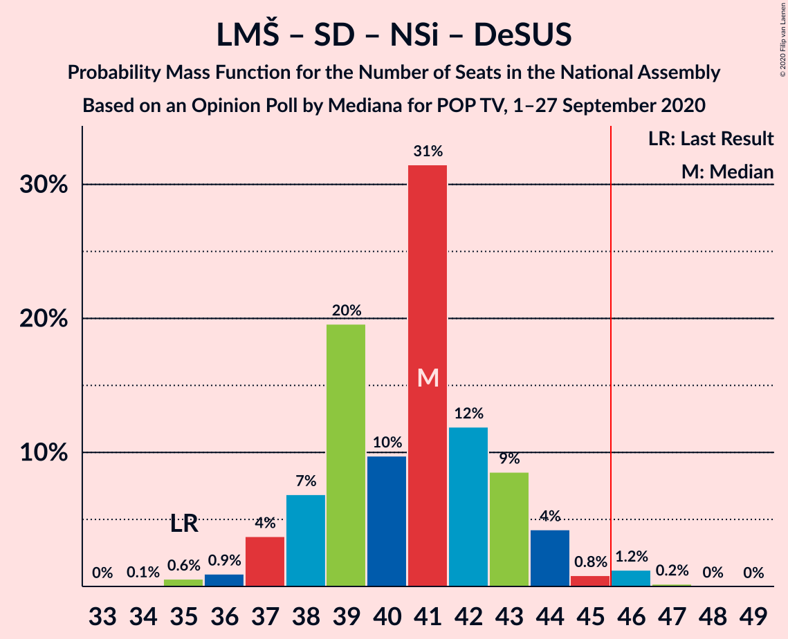

| Number of Seats | Probability | Accumulated | Special Marks |
|:---------------:|:-----------:|:-----------:|:-------------:|
| 34 | 0.1% | 100% |  |
| 35 | 0.6% | 99.9% | Last Result |
| 36 | 0.9% | 99.4% |  |
| 37 | 4% | 98% |  |
| 38 | 7% | 95% |  |
| 39 | 20% | 88% |  |
| 40 | 10% | 68% | Median |
| 41 | 31% | 58% |  |
| 42 | 12% | 27% |  |
| 43 | 9% | 15% |  |
| 44 | 4% | 7% |  |
| 45 | 0.8% | 2% |  |
| 46 | 1.2% | 1.5% | Majority |
| 47 | 0.2% | 0.2% |  |
| 48 | 0% | 0.1% |  |
| 49 | 0% | 0% |  |

### Lista Marjana Šarca – Socialni demokrati – Nova Slovenija–Krščanski demokrati – Demokratična stranka upokojencev Slovenije – Stranka modernega centra

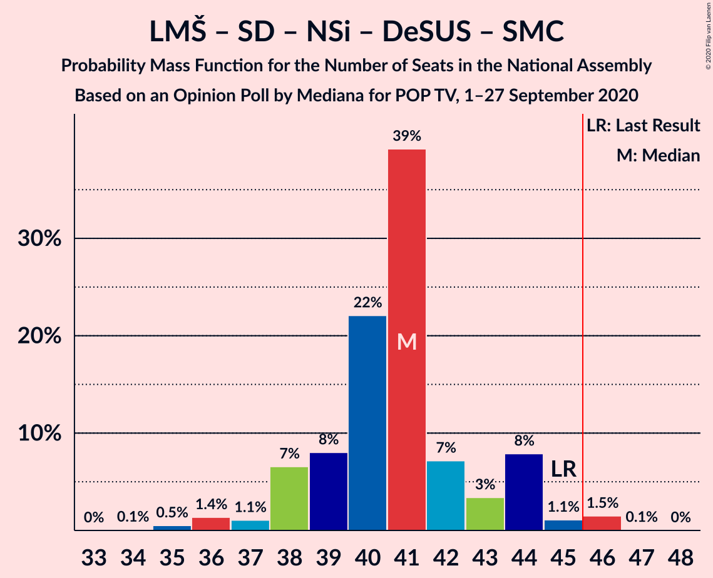

| Number of Seats | Probability | Accumulated | Special Marks |
|:---------------:|:-----------:|:-----------:|:-------------:|
| 34 | 0.1% | 100% |  |
| 35 | 0.6% | 99.9% |  |
| 36 | 0.9% | 99.4% |  |
| 37 | 4% | 98% |  |
| 38 | 7% | 95% |  |
| 39 | 20% | 88% |  |
| 40 | 10% | 68% | Median |
| 41 | 31% | 58% |  |
| 42 | 12% | 27% |  |
| 43 | 9% | 15% |  |
| 44 | 4% | 7% |  |
| 45 | 0.8% | 2% | Last Result |
| 46 | 1.2% | 1.5% | Majority |
| 47 | 0.2% | 0.2% |  |
| 48 | 0% | 0.1% |  |
| 49 | 0% | 0% |  |

### Lista Marjana Šarca – Socialni demokrati – Nova Slovenija–Krščanski demokrati

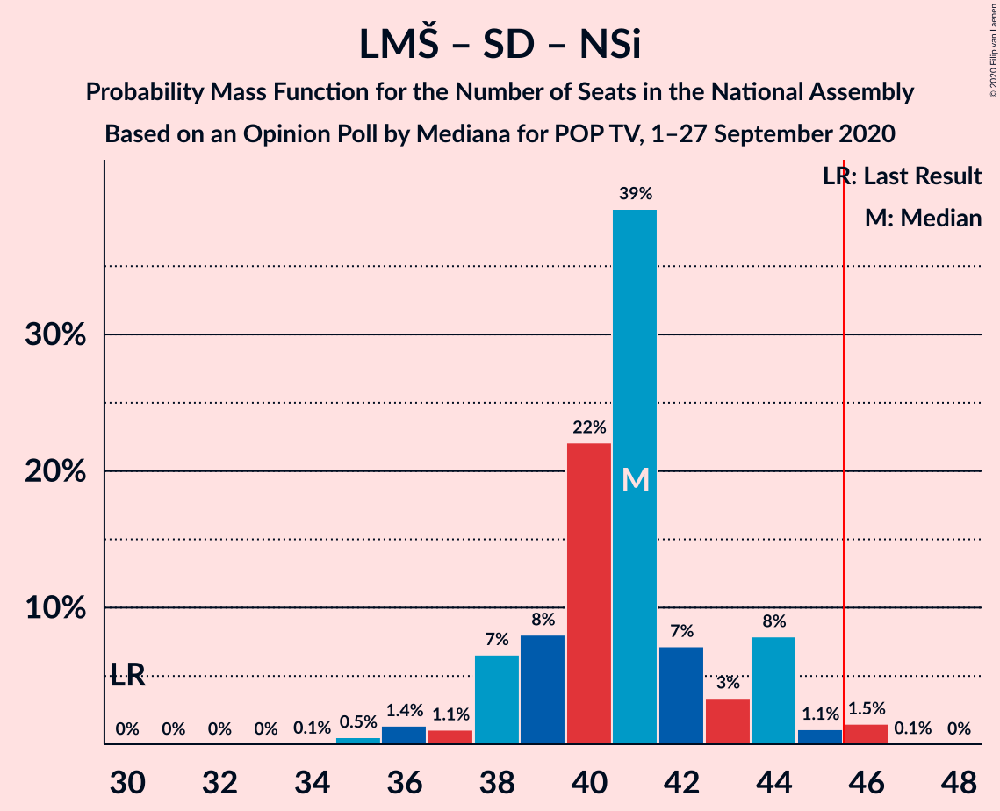

| Number of Seats | Probability | Accumulated | Special Marks |
|:---------------:|:-----------:|:-----------:|:-------------:|
| 30 | 0% | 100% | Last Result |
| 31 | 0% | 100% |  |
| 32 | 0% | 100% |  |
| 33 | 0% | 100% |  |
| 34 | 0.1% | 100% |  |
| 35 | 0.6% | 99.9% |  |
| 36 | 0.9% | 99.4% |  |
| 37 | 4% | 98% |  |
| 38 | 7% | 95% |  |
| 39 | 20% | 88% |  |
| 40 | 10% | 68% | Median |
| 41 | 31% | 58% |  |
| 42 | 12% | 27% |  |
| 43 | 9% | 15% |  |
| 44 | 4% | 7% |  |
| 45 | 0.8% | 2% |  |
| 46 | 1.2% | 1.5% | Majority |
| 47 | 0.2% | 0.2% |  |
| 48 | 0% | 0.1% |  |
| 49 | 0% | 0% |  |

### Lista Marjana Šarca – Socialni demokrati – Nova Slovenija–Krščanski demokrati – Stranka modernega centra

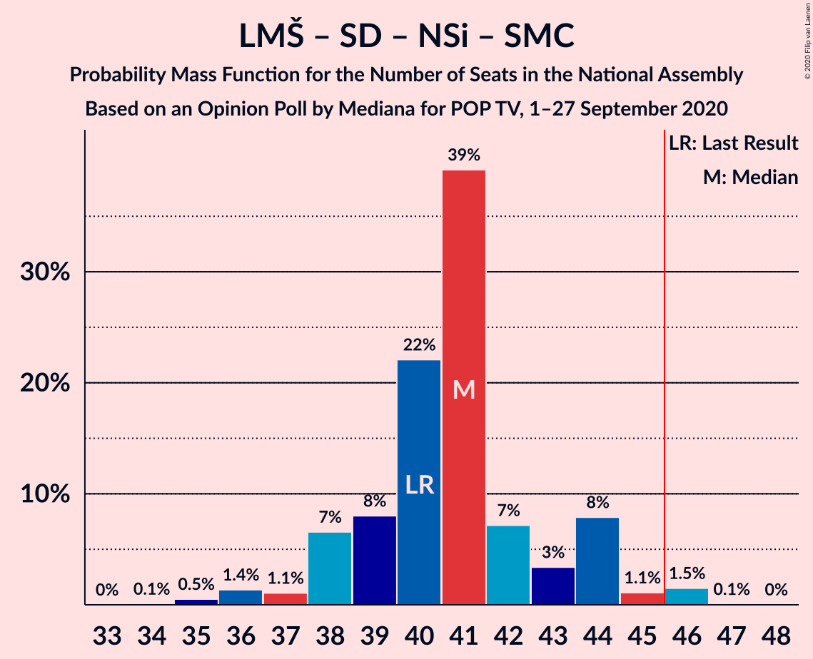

| Number of Seats | Probability | Accumulated | Special Marks |
|:---------------:|:-----------:|:-----------:|:-------------:|
| 34 | 0.1% | 100% |  |
| 35 | 0.6% | 99.9% |  |
| 36 | 0.9% | 99.4% |  |
| 37 | 4% | 98% |  |
| 38 | 7% | 95% |  |
| 39 | 20% | 88% |  |
| 40 | 10% | 68% | Last Result, Median |
| 41 | 31% | 58% |  |
| 42 | 12% | 27% |  |
| 43 | 9% | 15% |  |
| 44 | 4% | 7% |  |
| 45 | 0.8% | 2% |  |
| 46 | 1.2% | 1.5% | Majority |
| 47 | 0.2% | 0.2% |  |
| 48 | 0% | 0.1% |  |
| 49 | 0% | 0% |  |

### Lista Marjana Šarca – Socialni demokrati – Stranka Alenke Bratušek – Demokratična stranka upokojencev Slovenije – Stranka modernega centra

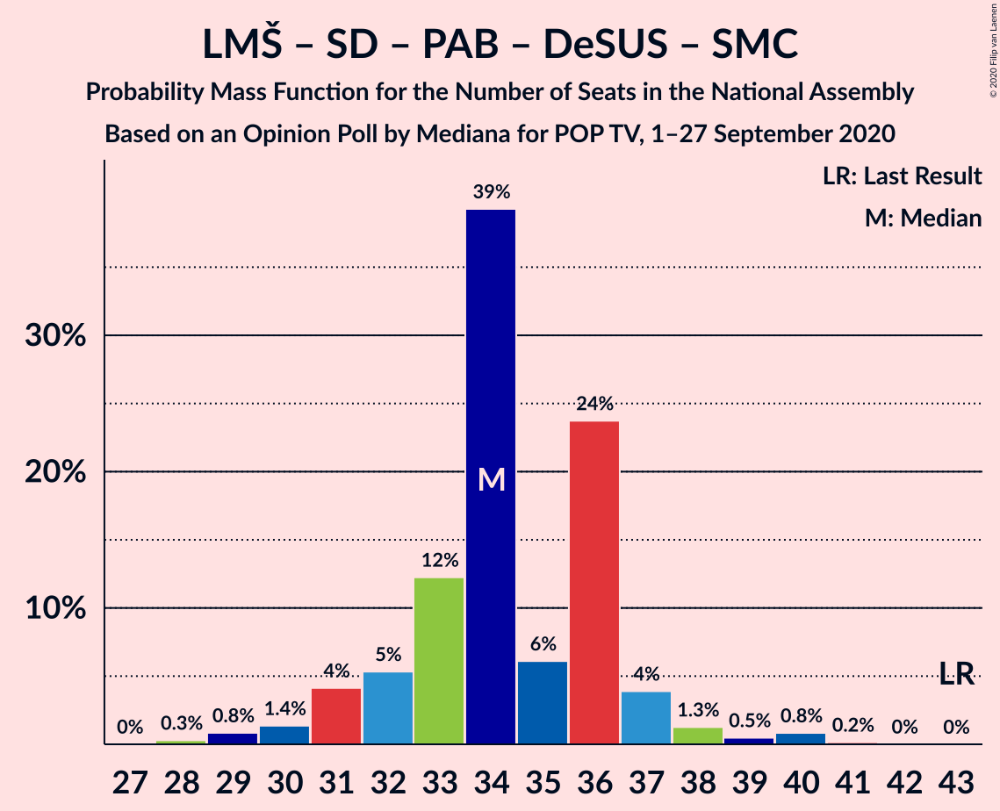

| Number of Seats | Probability | Accumulated | Special Marks |
|:---------------:|:-----------:|:-----------:|:-------------:|
| 28 | 0.2% | 100% |  |
| 29 | 0.5% | 99.8% |  |
| 30 | 3% | 99.2% |  |
| 31 | 3% | 96% |  |
| 32 | 8% | 93% | Median |
| 33 | 22% | 85% |  |
| 34 | 23% | 63% |  |
| 35 | 19% | 41% |  |
| 36 | 11% | 22% |  |
| 37 | 7% | 11% |  |
| 38 | 2% | 4% |  |
| 39 | 1.1% | 2% |  |
| 40 | 0.6% | 0.9% |  |
| 41 | 0.2% | 0.3% |  |
| 42 | 0.2% | 0.2% |  |
| 43 | 0% | 0% | Last Result |

### Lista Marjana Šarca – Socialni demokrati – Demokratična stranka upokojencev Slovenije

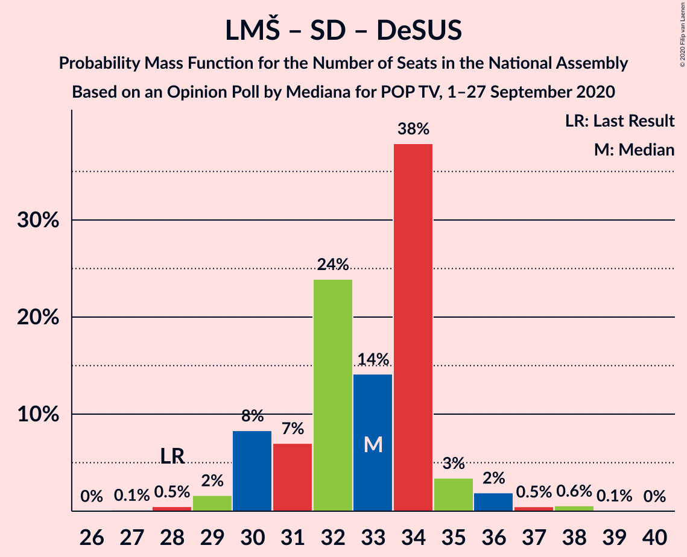

| Number of Seats | Probability | Accumulated | Special Marks |
|:---------------:|:-----------:|:-----------:|:-------------:|
| 27 | 0.3% | 100% |  |
| 28 | 0.8% | 99.7% | Last Result |
| 29 | 2% | 98.9% |  |
| 30 | 11% | 97% |  |
| 31 | 12% | 86% |  |
| 32 | 21% | 74% | Median |
| 33 | 26% | 53% |  |
| 34 | 16% | 27% |  |
| 35 | 6% | 11% |  |
| 36 | 3% | 4% |  |
| 37 | 1.1% | 2% |  |
| 38 | 0.5% | 0.6% |  |
| 39 | 0.1% | 0.1% |  |
| 40 | 0% | 0% |  |

### Lista Marjana Šarca – Socialni demokrati – Demokratična stranka upokojencev Slovenije – Stranka modernega centra

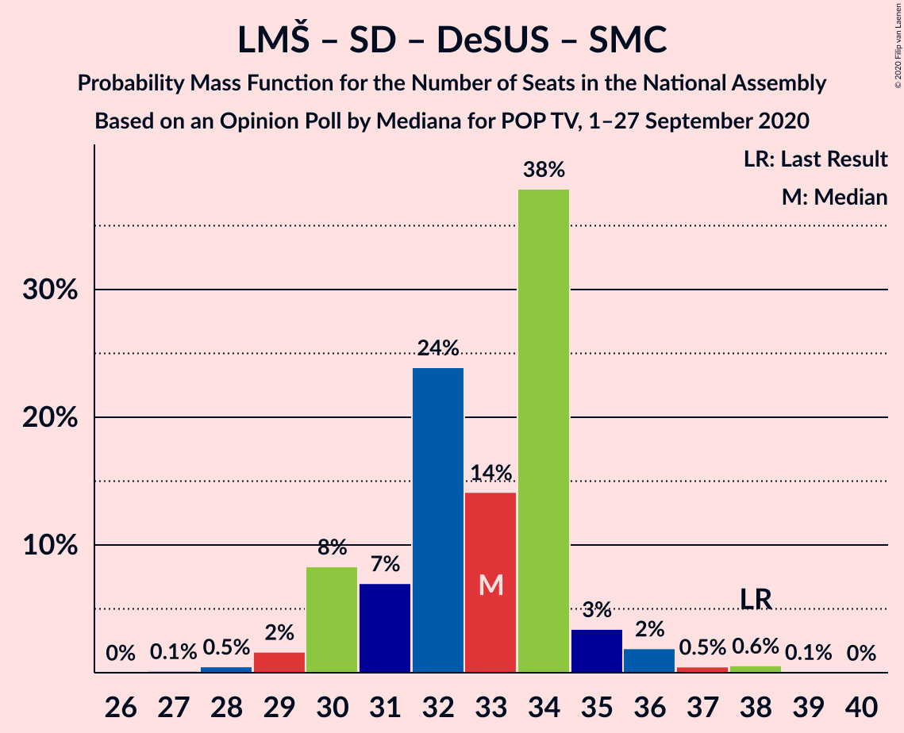

| Number of Seats | Probability | Accumulated | Special Marks |
|:---------------:|:-----------:|:-----------:|:-------------:|
| 27 | 0.3% | 100% |  |
| 28 | 0.8% | 99.7% |  |
| 29 | 2% | 98.9% |  |
| 30 | 11% | 97% |  |
| 31 | 12% | 86% |  |
| 32 | 21% | 74% | Median |
| 33 | 26% | 53% |  |
| 34 | 16% | 27% |  |
| 35 | 6% | 11% |  |
| 36 | 3% | 4% |  |
| 37 | 1.1% | 2% |  |
| 38 | 0.5% | 0.6% | Last Result |
| 39 | 0.1% | 0.1% |  |
| 40 | 0% | 0% |  |

### Lista Marjana Šarca – Socialni demokrati

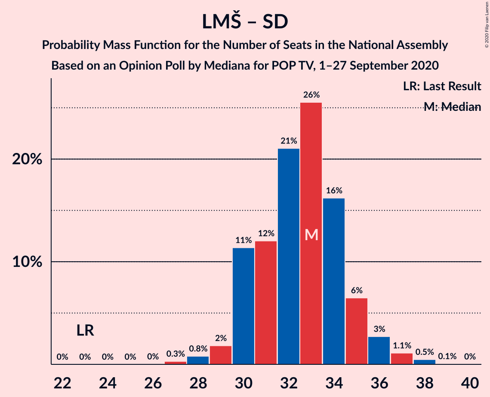

| Number of Seats | Probability | Accumulated | Special Marks |
|:---------------:|:-----------:|:-----------:|:-------------:|
| 23 | 0% | 100% | Last Result |
| 24 | 0% | 100% |  |
| 25 | 0% | 100% |  |
| 26 | 0% | 100% |  |
| 27 | 0.3% | 100% |  |
| 28 | 0.8% | 99.7% |  |
| 29 | 2% | 98.9% |  |
| 30 | 11% | 97% |  |
| 31 | 12% | 86% |  |
| 32 | 21% | 74% | Median |
| 33 | 26% | 53% |  |
| 34 | 16% | 27% |  |
| 35 | 6% | 11% |  |
| 36 | 3% | 4% |  |
| 37 | 1.1% | 2% |  |
| 38 | 0.5% | 0.6% |  |
| 39 | 0.1% | 0.1% |  |
| 40 | 0% | 0% |  |

### Lista Marjana Šarca – Socialni demokrati – Stranka modernega centra

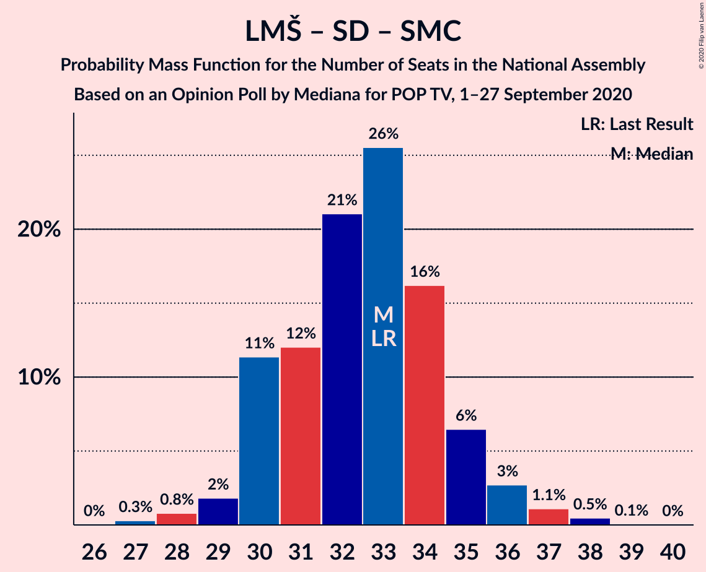

| Number of Seats | Probability | Accumulated | Special Marks |
|:---------------:|:-----------:|:-----------:|:-------------:|
| 27 | 0.3% | 100% |  |
| 28 | 0.8% | 99.7% |  |
| 29 | 2% | 98.9% |  |
| 30 | 11% | 97% |  |
| 31 | 12% | 86% |  |
| 32 | 21% | 74% | Median |
| 33 | 26% | 53% | Last Result |
| 34 | 16% | 27% |  |
| 35 | 6% | 11% |  |
| 36 | 3% | 4% |  |
| 37 | 1.1% | 2% |  |
| 38 | 0.5% | 0.6% |  |
| 39 | 0.1% | 0.1% |  |
| 40 | 0% | 0% |  |

### Socialni demokrati – Demokratična stranka upokojencev Slovenije – Stranka modernega centra

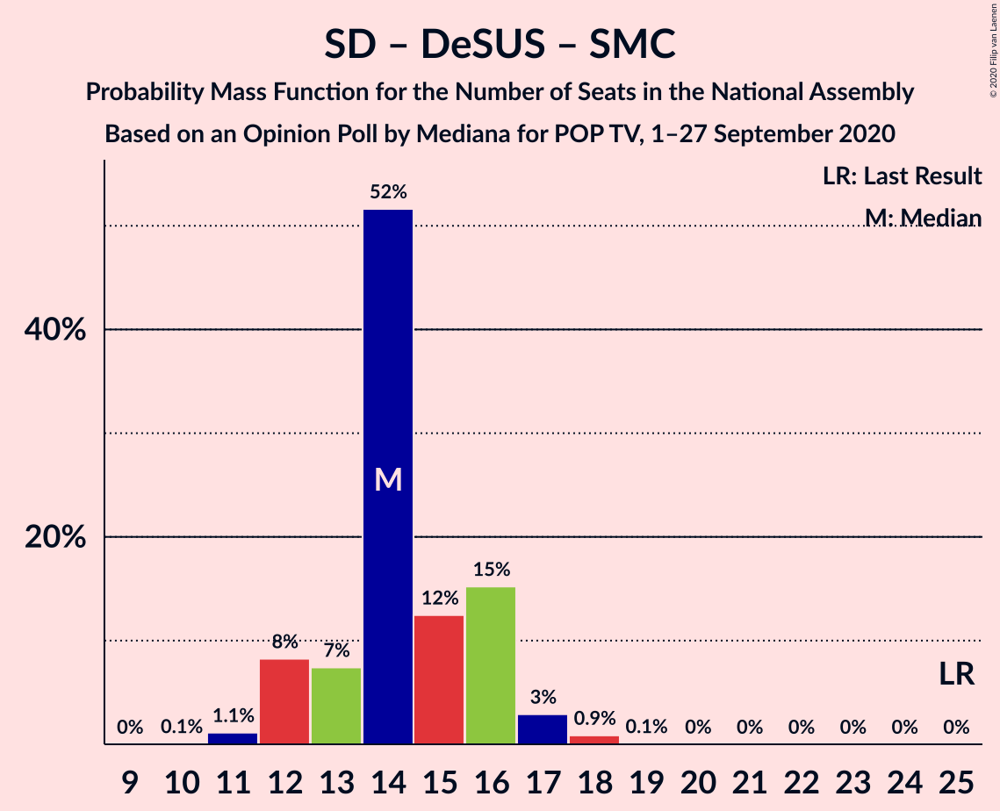

| Number of Seats | Probability | Accumulated | Special Marks |
|:---------------:|:-----------:|:-----------:|:-------------:|
| 11 | 0.8% | 100% |  |
| 12 | 6% | 99.2% |  |
| 13 | 10% | 93% |  |
| 14 | 37% | 83% | Median |
| 15 | 23% | 47% |  |
| 16 | 17% | 23% |  |
| 17 | 6% | 7% |  |
| 18 | 0.9% | 1.1% |  |
| 19 | 0.2% | 0.3% |  |
| 20 | 0.1% | 0.1% |  |
| 21 | 0% | 0% |  |
| 22 | 0% | 0% |  |
| 23 | 0% | 0% |  |
| 24 | 0% | 0% |  |
| 25 | 0% | 0% | Last Result |

## Technical Information

### Opinion Poll

+ **Polling firm:** Mediana
+ **Commissioner(s):** POP TV
+ **Fieldwork period:** 1–27 September 2020

### Calculations

+ **Sample size:** 713
+ **Simulations done:** 1,048,576
+ **Error estimate:** 2.33%

