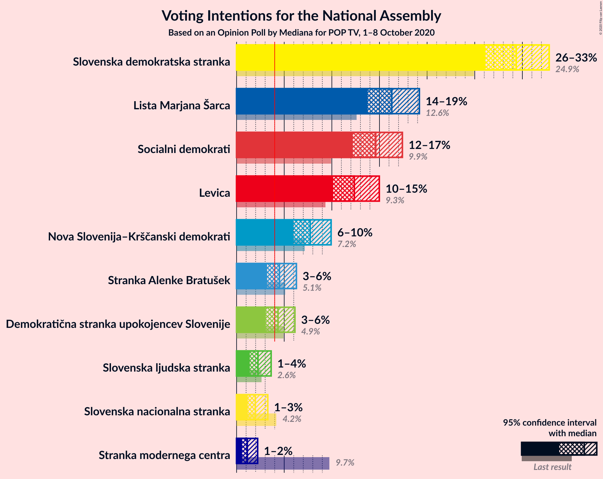
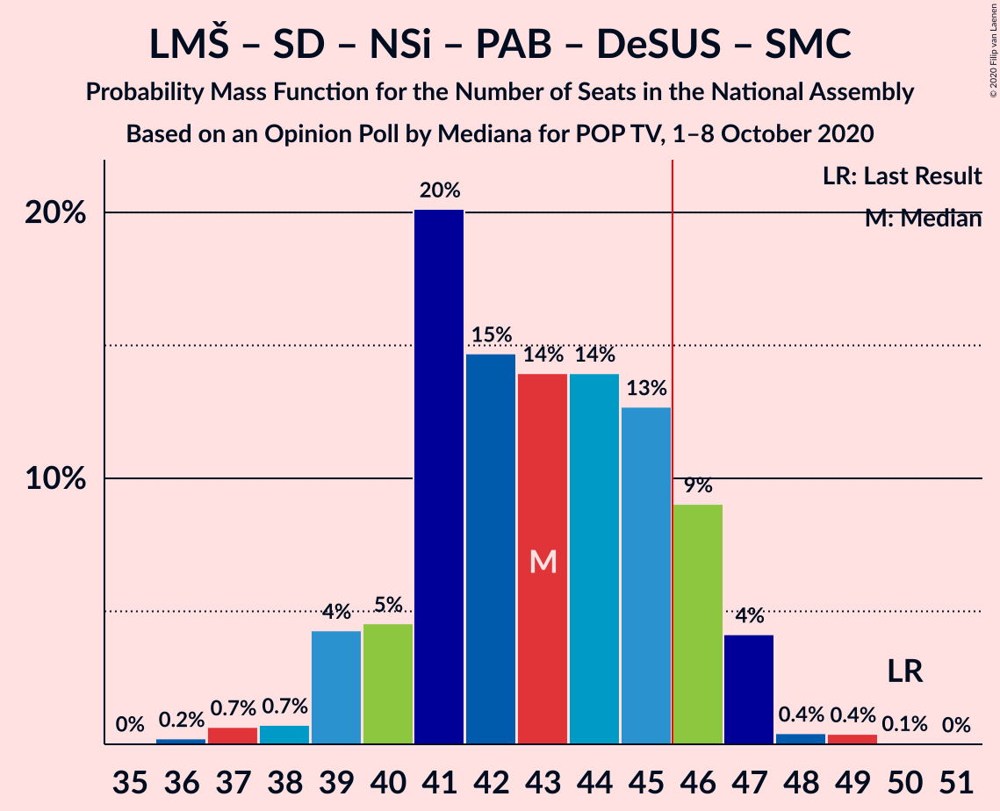

# Opinion Poll by Mediana for POP TV, 1–8 October 2020

<a href="#voting-intentions">Voting Intentions</a> | <a href="#seats">Seats</a> | <a href="#coalitions">Coalitions</a> | <a href="#technical-information">Technical Information</a>

## Voting Intentions

### Confidence Intervals

| Party | Last Result | Poll Result | 80% Confidence Interval | 90% Confidence Interval | 95% Confidence Interval | 99% Confidence Interval |
|:-----:|:-----------:|:-----------:|:-----------------------:|:-----------------------:|:-----------------------:|:-----------------------:|
| Slovenska demokratska stranka | 24.9% | 29.4% | 27.2–31.6% |26.6–32.3% |26.1–32.8% |25.1–33.9% |
| Lista Marjana Šarca | 12.6% | 16.3% | 14.6–18.2% |14.2–18.7% |13.8–19.2% |13.0–20.1% |
| Socialni demokrati | 9.9% | 14.6% | 13.0–16.4% |12.6–16.9% |12.2–17.4% |11.5–18.3% |
| Levica | 9.3% | 12.4% | 10.9–14.1% |10.5–14.6% |10.1–15.0% |9.5–15.9% |
| Nova Slovenija–Krščanski demokrati | 7.2% | 7.7% | 6.6–9.2% |6.2–9.6% |6.0–9.9% |5.5–10.7% |
| Stranka Alenke Bratušek | 5.1% | 4.5% | 3.6–5.7% |3.4–6.0% |3.2–6.3% |2.8–6.9% |
| Demokratična stranka upokojencev Slovenije | 4.9% | 4.4% | 3.5–5.5% |3.3–5.8% |3.1–6.1% |2.7–6.7% |
| Slovenska ljudska stranka | 2.6% | 2.2% | 1.7–3.1% |1.5–3.4% |1.4–3.6% |1.2–4.1% |
| Slovenska nacionalna stranka | 4.2% | 2.0% | 1.4–2.8% |1.3–3.1% |1.2–3.3% |1.0–3.7% |
| Stranka modernega centra | 9.7% | 1.1% | 0.8–1.8% |0.7–2.0% |0.6–2.2% |0.4–2.6% |

*Note:* The poll result column reflects the actual value used in the calculations. Published results may vary slightly, and in addition be rounded to fewer digits.

## Seats

### Confidence Intervals

| Party | Last Result | Median | 80% Confidence Interval | 90% Confidence Interval | 95% Confidence Interval | 99% Confidence Interval |
|:-----:|:-----------:|:------:|:-----------------------:|:-----------------------:|:-----------------------:|:-----------------------:|
| <a href="#slovenska-demokratska-stranka">Slovenska demokratska stranka</a> | 25 | 28 | 26–30 |26–31 |25–32 |24–33 |
| <a href="#lista-marjana-šarca">Lista Marjana Šarca</a> | 13 | 16 | 14–17 |13–18 |13–18 |12–20 |
| <a href="#socialni-demokrati">Socialni demokrati</a> | 10 | 14 | 12–16 |12–17 |11–17 |10–18 |
| <a href="#levica">Levica</a> | 9 | 12 | 10–13 |10–14 |9–14 |9–15 |
| <a href="#nova-slovenija–krščanski-demokrati">Nova Slovenija–Krščanski demokrati</a> | 7 | 7 | 6–9 |6–9 |5–10 |5–10 |
| <a href="#stranka-alenke-bratušek">Stranka Alenke Bratušek</a> | 5 | 4 | 0–5 |0–5 |0–6 |0–6 |
| <a href="#demokratična-stranka-upokojencev-slovenije">Demokratična stranka upokojencev Slovenije</a> | 5 | 4 | 0–5 |0–5 |0–5 |0–6 |
| <a href="#slovenska-ljudska-stranka">Slovenska ljudska stranka</a> | 0 | 0 | 0 |0 |0 |0–3 |
| <a href="#slovenska-nacionalna-stranka">Slovenska nacionalna stranka</a> | 4 | 0 | 0 |0 |0 |0 |
| <a href="#stranka-modernega-centra">Stranka modernega centra</a> | 10 | 0 | 0 |0 |0 |0 |

### Slovenska demokratska stranka

*For a full overview of the results for this party, see the [Slovenska demokratska stranka](party-slovenskademokratskastranka.html) page.*

| Number of Seats | Probability | Accumulated | Special Marks |
|:---------------:|:-----------:|:-----------:|:-------------:|
| 23 | 0.2% | 100% |  |
| 24 | 0.8% | 99.8% |  |
| 25 | 4% | 99.0% | Last Result |
| 26 | 14% | 95% |  |
| 27 | 14% | 81% |  |
| 28 | 19% | 67% | Median |
| 29 | 26% | 49% |  |
| 30 | 14% | 22% |  |
| 31 | 6% | 9% |  |
| 32 | 2% | 3% |  |
| 33 | 0.8% | 1.2% |  |
| 34 | 0.3% | 0.4% |  |
| 35 | 0% | 0.1% |  |
| 36 | 0% | 0% |  |

### Lista Marjana Šarca

*For a full overview of the results for this party, see the [Lista Marjana Šarca](party-listamarjanašarca.html) page.*

| Number of Seats | Probability | Accumulated | Special Marks |
|:---------------:|:-----------:|:-----------:|:-------------:|
| 11 | 0.1% | 100% |  |
| 12 | 0.8% | 99.9% |  |
| 13 | 4% | 99.1% | Last Result |
| 14 | 24% | 95% |  |
| 15 | 13% | 71% |  |
| 16 | 34% | 57% | Median |
| 17 | 16% | 24% |  |
| 18 | 6% | 8% |  |
| 19 | 1.2% | 2% |  |
| 20 | 0.5% | 0.5% |  |
| 21 | 0.1% | 0.1% |  |
| 22 | 0% | 0% |  |

### Socialni demokrati

*For a full overview of the results for this party, see the [Socialni demokrati](party-socialnidemokrati.html) page.*

| Number of Seats | Probability | Accumulated | Special Marks |
|:---------------:|:-----------:|:-----------:|:-------------:|
| 10 | 0.6% | 100% | Last Result |
| 11 | 2% | 99.4% |  |
| 12 | 15% | 97% |  |
| 13 | 20% | 82% |  |
| 14 | 30% | 62% | Median |
| 15 | 17% | 32% |  |
| 16 | 6% | 15% |  |
| 17 | 8% | 8% |  |
| 18 | 0.7% | 0.8% |  |
| 19 | 0.1% | 0.1% |  |
| 20 | 0% | 0% |  |

### Levica

*For a full overview of the results for this party, see the [Levica](party-levica.html) page.*

| Number of Seats | Probability | Accumulated | Special Marks |
|:---------------:|:-----------:|:-----------:|:-------------:|
| 8 | 0.4% | 100% |  |
| 9 | 2% | 99.6% | Last Result |
| 10 | 15% | 97% |  |
| 11 | 19% | 83% |  |
| 12 | 33% | 64% | Median |
| 13 | 23% | 31% |  |
| 14 | 6% | 8% |  |
| 15 | 2% | 2% |  |
| 16 | 0.2% | 0.3% |  |
| 17 | 0.1% | 0.1% |  |
| 18 | 0% | 0% |  |

### Nova Slovenija–Krščanski demokrati

*For a full overview of the results for this party, see the [Nova Slovenija–Krščanski demokrati](party-novaslovenija–krščanskidemokrati.html) page.*

| Number of Seats | Probability | Accumulated | Special Marks |
|:---------------:|:-----------:|:-----------:|:-------------:|
| 4 | 0.2% | 100% |  |
| 5 | 3% | 99.8% |  |
| 6 | 23% | 97% |  |
| 7 | 39% | 73% | Last Result, Median |
| 8 | 23% | 34% |  |
| 9 | 9% | 11% |  |
| 10 | 2% | 3% |  |
| 11 | 0.1% | 0.1% |  |
| 12 | 0% | 0% |  |

### Stranka Alenke Bratušek

*For a full overview of the results for this party, see the [Stranka Alenke Bratušek](party-strankaalenkebratušek.html) page.*

| Number of Seats | Probability | Accumulated | Special Marks |
|:---------------:|:-----------:|:-----------:|:-------------:|
| 0 | 26% | 100% |  |
| 1 | 0% | 74% |  |
| 2 | 0% | 74% |  |
| 3 | 7% | 74% |  |
| 4 | 41% | 67% | Median |
| 5 | 24% | 26% | Last Result |
| 6 | 3% | 3% |  |
| 7 | 0.1% | 0.1% |  |
| 8 | 0% | 0% |  |

### Demokratična stranka upokojencev Slovenije

*For a full overview of the results for this party, see the [Demokratična stranka upokojencev Slovenije](party-demokratičnastrankaupokojencevslovenije.html) page.*

| Number of Seats | Probability | Accumulated | Special Marks |
|:---------------:|:-----------:|:-----------:|:-------------:|
| 0 | 29% | 100% |  |
| 1 | 0% | 71% |  |
| 2 | 0% | 71% |  |
| 3 | 5% | 71% |  |
| 4 | 46% | 67% | Median |
| 5 | 18% | 20% | Last Result |
| 6 | 2% | 2% |  |
| 7 | 0.1% | 0.1% |  |
| 8 | 0% | 0% |  |

### Slovenska ljudska stranka

*For a full overview of the results for this party, see the [Slovenska ljudska stranka](party-slovenskaljudskastranka.html) page.*

| Number of Seats | Probability | Accumulated | Special Marks |
|:---------------:|:-----------:|:-----------:|:-------------:|
| 0 | 99.4% | 100% | Last Result, Median |
| 1 | 0% | 0.6% |  |
| 2 | 0% | 0.6% |  |
| 3 | 0.3% | 0.6% |  |
| 4 | 0.3% | 0.3% |  |
| 5 | 0% | 0% |  |

### Slovenska nacionalna stranka

*For a full overview of the results for this party, see the [Slovenska nacionalna stranka](party-slovenskanacionalnastranka.html) page.*

| Number of Seats | Probability | Accumulated | Special Marks |
|:---------------:|:-----------:|:-----------:|:-------------:|
| 0 | 99.9% | 100% | Median |
| 1 | 0% | 0.1% |  |
| 2 | 0% | 0.1% |  |
| 3 | 0% | 0.1% |  |
| 4 | 0.1% | 0.1% | Last Result |
| 5 | 0% | 0% |  |

### Stranka modernega centra

*For a full overview of the results for this party, see the [Stranka modernega centra](party-strankamodernegacentra.html) page.*

| Number of Seats | Probability | Accumulated | Special Marks |
|:---------------:|:-----------:|:-----------:|:-------------:|
| 0 | 100% | 100% | Median |
| 1 | 0% | 0% |  |
| 2 | 0% | 0% |  |
| 3 | 0% | 0% |  |
| 4 | 0% | 0% |  |
| 5 | 0% | 0% |  |
| 6 | 0% | 0% |  |
| 7 | 0% | 0% |  |
| 8 | 0% | 0% |  |
| 9 | 0% | 0% |  |
| 10 | 0% | 0% | Last Result |

## Coalitions

### Confidence Intervals

| Coalition | Last Result | Median | Majority? | 80% Confidence Interval | 90% Confidence Interval | 95% Confidence Interval | 99% Confidence Interval |
|:---------:|:-----------:|:------:|:---------:|:-----------------------:|:-----------------------:|:-----------------------:|:-----------------------:|
| Slovenska demokratska stranka – Lista Marjana Šarca – Demokratična stranka upokojencev Slovenije | 43 | 47 | 75% | 45–50 | 43–51 | 42–51 | 41–53 |
| Slovenska demokratska stranka – Lista Marjana Šarca | 38 | 44 | 23% | 42–46 | 41–47 | 40–48 | 39–50 |
| Lista Marjana Šarca – Socialni demokrati – Nova Slovenija–Krščanski demokrati – Stranka Alenke Bratušek – Demokratična stranka upokojencev Slovenije – Stranka modernega centra | 50 | 43 | 14% | 40–46 | 39–47 | 39–47 | 37–48 |
| Lista Marjana Šarca – Socialni demokrati – Nova Slovenija–Krščanski demokrati – Demokratična stranka upokojencev Slovenije | 35 | 40 | 0.4% | 36–43 | 36–43 | 35–44 | 34–45 |
| Lista Marjana Šarca – Socialni demokrati – Nova Slovenija–Krščanski demokrati – Demokratična stranka upokojencev Slovenije – Stranka modernega centra | 45 | 40 | 0.4% | 36–43 | 36–43 | 35–44 | 34–45 |
| Lista Marjana Šarca – Socialni demokrati – Nova Slovenija–Krščanski demokrati | 30 | 37 | 0% | 33–40 | 32–41 | 32–41 | 32–43 |
| Lista Marjana Šarca – Socialni demokrati – Nova Slovenija–Krščanski demokrati – Stranka modernega centra | 40 | 37 | 0% | 33–40 | 32–41 | 32–41 | 32–43 |
| Lista Marjana Šarca – Socialni demokrati – Stranka Alenke Bratušek – Demokratična stranka upokojencev Slovenije – Stranka modernega centra | 43 | 36 | 0% | 33–39 | 32–39 | 32–40 | 29–41 |
| Lista Marjana Šarca – Socialni demokrati – Demokratična stranka upokojencev Slovenije | 28 | 33 | 0% | 30–36 | 29–36 | 28–37 | 27–38 |
| Lista Marjana Šarca – Socialni demokrati – Demokratična stranka upokojencev Slovenije – Stranka modernega centra | 38 | 33 | 0% | 30–36 | 29–36 | 28–37 | 27–38 |
| Lista Marjana Šarca – Socialni demokrati | 23 | 30 | 0% | 26–33 | 26–33 | 26–33 | 25–35 |
| Lista Marjana Šarca – Socialni demokrati – Stranka modernega centra | 33 | 30 | 0% | 26–33 | 26–33 | 26–33 | 25–35 |
| Socialni demokrati – Demokratična stranka upokojencev Slovenije – Stranka modernega centra | 25 | 17 | 0% | 14–19 | 13–20 | 13–21 | 12–22 |

### Slovenska demokratska stranka – Lista Marjana Šarca – Demokratična stranka upokojencev Slovenije

| Number of Seats | Probability | Accumulated | Special Marks |
|:---------------:|:-----------:|:-----------:|:-------------:|
| 40 | 0.3% | 100% |  |
| 41 | 1.0% | 99.6% |  |
| 42 | 3% | 98.6% |  |
| 43 | 2% | 96% | Last Result |
| 44 | 2% | 94% |  |
| 45 | 16% | 91% |  |
| 46 | 19% | 75% | Majority |
| 47 | 24% | 56% |  |
| 48 | 9% | 32% | Median |
| 49 | 12% | 23% |  |
| 50 | 5% | 11% |  |
| 51 | 3% | 5% |  |
| 52 | 2% | 2% |  |
| 53 | 0.4% | 0.6% |  |
| 54 | 0.1% | 0.2% |  |
| 55 | 0.1% | 0.1% |  |
| 56 | 0% | 0% |  |

### Slovenska demokratska stranka – Lista Marjana Šarca

| Number of Seats | Probability | Accumulated | Special Marks |
|:---------------:|:-----------:|:-----------:|:-------------:|
| 37 | 0.2% | 100% |  |
| 38 | 0.2% | 99.8% | Last Result |
| 39 | 0.6% | 99.6% |  |
| 40 | 4% | 99.0% |  |
| 41 | 5% | 95% |  |
| 42 | 19% | 90% |  |
| 43 | 19% | 71% |  |
| 44 | 13% | 52% | Median |
| 45 | 16% | 39% |  |
| 46 | 15% | 23% | Majority |
| 47 | 4% | 7% |  |
| 48 | 2% | 3% |  |
| 49 | 0.8% | 1.3% |  |
| 50 | 0.3% | 0.5% |  |
| 51 | 0.1% | 0.2% |  |
| 52 | 0.1% | 0.1% |  |
| 53 | 0% | 0% |  |

### Lista Marjana Šarca – Socialni demokrati – Nova Slovenija–Krščanski demokrati – Stranka Alenke Bratušek – Demokratična stranka upokojencev Slovenije – Stranka modernega centra

| Number of Seats | Probability | Accumulated | Special Marks |
|:---------------:|:-----------:|:-----------:|:-------------:|
| 35 | 0% | 100% |  |
| 36 | 0.2% | 99.9% |  |
| 37 | 0.7% | 99.7% |  |
| 38 | 0.7% | 99.1% |  |
| 39 | 4% | 98% |  |
| 40 | 5% | 94% |  |
| 41 | 20% | 89% |  |
| 42 | 15% | 69% |  |
| 43 | 14% | 55% |  |
| 44 | 14% | 41% |  |
| 45 | 13% | 27% | Median |
| 46 | 9% | 14% | Majority |
| 47 | 4% | 5% |  |
| 48 | 0.4% | 0.9% |  |
| 49 | 0.4% | 0.5% |  |
| 50 | 0.1% | 0.1% | Last Result |
| 51 | 0% | 0% |  |

### Lista Marjana Šarca – Socialni demokrati – Nova Slovenija–Krščanski demokrati – Demokratična stranka upokojencev Slovenije

| Number of Seats | Probability | Accumulated | Special Marks |
|:---------------:|:-----------:|:-----------:|:-------------:|
| 32 | 0.1% | 100% |  |
| 33 | 0.2% | 99.9% |  |
| 34 | 0.5% | 99.7% |  |
| 35 | 2% | 99.2% | Last Result |
| 36 | 10% | 97% |  |
| 37 | 7% | 87% |  |
| 38 | 13% | 81% |  |
| 39 | 11% | 68% |  |
| 40 | 10% | 57% |  |
| 41 | 28% | 47% | Median |
| 42 | 6% | 19% |  |
| 43 | 9% | 13% |  |
| 44 | 3% | 5% |  |
| 45 | 0.8% | 1.2% |  |
| 46 | 0.2% | 0.4% | Majority |
| 47 | 0.1% | 0.2% |  |
| 48 | 0% | 0% |  |

### Lista Marjana Šarca – Socialni demokrati – Nova Slovenija–Krščanski demokrati – Demokratična stranka upokojencev Slovenije – Stranka modernega centra

| Number of Seats | Probability | Accumulated | Special Marks |
|:---------------:|:-----------:|:-----------:|:-------------:|
| 32 | 0.1% | 100% |  |
| 33 | 0.2% | 99.9% |  |
| 34 | 0.5% | 99.7% |  |
| 35 | 2% | 99.2% |  |
| 36 | 10% | 97% |  |
| 37 | 7% | 87% |  |
| 38 | 13% | 81% |  |
| 39 | 11% | 68% |  |
| 40 | 10% | 57% |  |
| 41 | 28% | 47% | Median |
| 42 | 6% | 19% |  |
| 43 | 9% | 13% |  |
| 44 | 3% | 5% |  |
| 45 | 0.8% | 1.2% | Last Result |
| 46 | 0.2% | 0.4% | Majority |
| 47 | 0.1% | 0.2% |  |
| 48 | 0% | 0% |  |

### Lista Marjana Šarca – Socialni demokrati – Nova Slovenija–Krščanski demokrati

| Number of Seats | Probability | Accumulated | Special Marks |
|:---------------:|:-----------:|:-----------:|:-------------:|
| 30 | 0% | 100% | Last Result |
| 31 | 0.2% | 99.9% |  |
| 32 | 8% | 99.8% |  |
| 33 | 5% | 92% |  |
| 34 | 7% | 87% |  |
| 35 | 6% | 79% |  |
| 36 | 14% | 73% |  |
| 37 | 25% | 59% | Median |
| 38 | 10% | 34% |  |
| 39 | 12% | 25% |  |
| 40 | 5% | 13% |  |
| 41 | 5% | 7% |  |
| 42 | 1.1% | 2% |  |
| 43 | 0.7% | 0.9% |  |
| 44 | 0.1% | 0.2% |  |
| 45 | 0% | 0% |  |

### Lista Marjana Šarca – Socialni demokrati – Nova Slovenija–Krščanski demokrati – Stranka modernega centra

| Number of Seats | Probability | Accumulated | Special Marks |
|:---------------:|:-----------:|:-----------:|:-------------:|
| 30 | 0% | 100% |  |
| 31 | 0.2% | 99.9% |  |
| 32 | 8% | 99.8% |  |
| 33 | 5% | 92% |  |
| 34 | 7% | 87% |  |
| 35 | 6% | 79% |  |
| 36 | 14% | 73% |  |
| 37 | 25% | 59% | Median |
| 38 | 10% | 34% |  |
| 39 | 12% | 25% |  |
| 40 | 5% | 13% | Last Result |
| 41 | 5% | 7% |  |
| 42 | 1.1% | 2% |  |
| 43 | 0.7% | 0.9% |  |
| 44 | 0.1% | 0.2% |  |
| 45 | 0% | 0% |  |

### Lista Marjana Šarca – Socialni demokrati – Stranka Alenke Bratušek – Demokratična stranka upokojencev Slovenije – Stranka modernega centra

| Number of Seats | Probability | Accumulated | Special Marks |
|:---------------:|:-----------:|:-----------:|:-------------:|
| 27 | 0.1% | 100% |  |
| 28 | 0.1% | 99.9% |  |
| 29 | 0.3% | 99.8% |  |
| 30 | 0.5% | 99.5% |  |
| 31 | 1.2% | 99.0% |  |
| 32 | 6% | 98% |  |
| 33 | 11% | 92% |  |
| 34 | 11% | 81% |  |
| 35 | 18% | 70% |  |
| 36 | 11% | 52% |  |
| 37 | 16% | 41% |  |
| 38 | 13% | 25% | Median |
| 39 | 7% | 12% |  |
| 40 | 4% | 5% |  |
| 41 | 0.4% | 0.8% |  |
| 42 | 0.3% | 0.4% |  |
| 43 | 0% | 0.1% | Last Result |
| 44 | 0% | 0% |  |

### Lista Marjana Šarca – Socialni demokrati – Demokratična stranka upokojencev Slovenije

| Number of Seats | Probability | Accumulated | Special Marks |
|:---------------:|:-----------:|:-----------:|:-------------:|
| 25 | 0.1% | 100% |  |
| 26 | 0.1% | 99.9% |  |
| 27 | 0.6% | 99.7% |  |
| 28 | 3% | 99.2% | Last Result |
| 29 | 4% | 97% |  |
| 30 | 15% | 93% |  |
| 31 | 11% | 78% |  |
| 32 | 14% | 67% |  |
| 33 | 14% | 53% |  |
| 34 | 23% | 39% | Median |
| 35 | 6% | 16% |  |
| 36 | 6% | 10% |  |
| 37 | 3% | 4% |  |
| 38 | 0.7% | 1.0% |  |
| 39 | 0.2% | 0.2% |  |
| 40 | 0% | 0% |  |

### Lista Marjana Šarca – Socialni demokrati – Demokratična stranka upokojencev Slovenije – Stranka modernega centra

| Number of Seats | Probability | Accumulated | Special Marks |
|:---------------:|:-----------:|:-----------:|:-------------:|
| 25 | 0.1% | 100% |  |
| 26 | 0.1% | 99.9% |  |
| 27 | 0.6% | 99.7% |  |
| 28 | 3% | 99.2% |  |
| 29 | 4% | 97% |  |
| 30 | 15% | 93% |  |
| 31 | 11% | 78% |  |
| 32 | 14% | 67% |  |
| 33 | 14% | 53% |  |
| 34 | 23% | 39% | Median |
| 35 | 6% | 16% |  |
| 36 | 6% | 10% |  |
| 37 | 3% | 4% |  |
| 38 | 0.7% | 1.0% | Last Result |
| 39 | 0.2% | 0.2% |  |
| 40 | 0% | 0% |  |

### Lista Marjana Šarca – Socialni demokrati

| Number of Seats | Probability | Accumulated | Special Marks |
|:---------------:|:-----------:|:-----------:|:-------------:|
| 23 | 0% | 100% | Last Result |
| 24 | 0.2% | 100% |  |
| 25 | 0.8% | 99.8% |  |
| 26 | 10% | 99.0% |  |
| 27 | 11% | 89% |  |
| 28 | 7% | 77% |  |
| 29 | 17% | 70% |  |
| 30 | 22% | 53% | Median |
| 31 | 10% | 31% |  |
| 32 | 9% | 20% |  |
| 33 | 9% | 11% |  |
| 34 | 1.5% | 2% |  |
| 35 | 0.7% | 0.8% |  |
| 36 | 0.1% | 0.1% |  |
| 37 | 0% | 0% |  |

### Lista Marjana Šarca – Socialni demokrati – Stranka modernega centra

| Number of Seats | Probability | Accumulated | Special Marks |
|:---------------:|:-----------:|:-----------:|:-------------:|
| 24 | 0.2% | 100% |  |
| 25 | 0.8% | 99.8% |  |
| 26 | 10% | 99.0% |  |
| 27 | 11% | 89% |  |
| 28 | 7% | 77% |  |
| 29 | 17% | 70% |  |
| 30 | 22% | 53% | Median |
| 31 | 10% | 31% |  |
| 32 | 9% | 20% |  |
| 33 | 9% | 11% | Last Result |
| 34 | 1.5% | 2% |  |
| 35 | 0.7% | 0.8% |  |
| 36 | 0.1% | 0.1% |  |
| 37 | 0% | 0% |  |

### Socialni demokrati – Demokratična stranka upokojencev Slovenije – Stranka modernega centra

| Number of Seats | Probability | Accumulated | Special Marks |
|:---------------:|:-----------:|:-----------:|:-------------:|
| 11 | 0.3% | 100% |  |
| 12 | 1.1% | 99.7% |  |
| 13 | 5% | 98.6% |  |
| 14 | 9% | 94% |  |
| 15 | 7% | 85% |  |
| 16 | 17% | 78% |  |
| 17 | 13% | 61% |  |
| 18 | 27% | 48% | Median |
| 19 | 12% | 21% |  |
| 20 | 5% | 9% |  |
| 21 | 3% | 4% |  |
| 22 | 0.8% | 0.9% |  |
| 23 | 0.1% | 0.1% |  |
| 24 | 0% | 0% |  |
| 25 | 0% | 0% | Last Result |

## Technical Information

### Opinion Poll

+ **Polling firm:** Mediana
+ **Commissioner(s):** POP TV
+ **Fieldwork period:** 1–8 October 2020

### Calculations

+ **Sample size:** 712
+ **Simulations done:** 1,048,576
+ **Error estimate:** 2.76%

