# Opinion Poll by Ninamedia for Dnevnik, Večer, 13–15 October 2020

<a href="#voting-intentions">Voting Intentions</a> | <a href="#seats">Seats</a> | <a href="#coalitions">Coalitions</a> | <a href="#technical-information">Technical Information</a>

## Voting Intentions

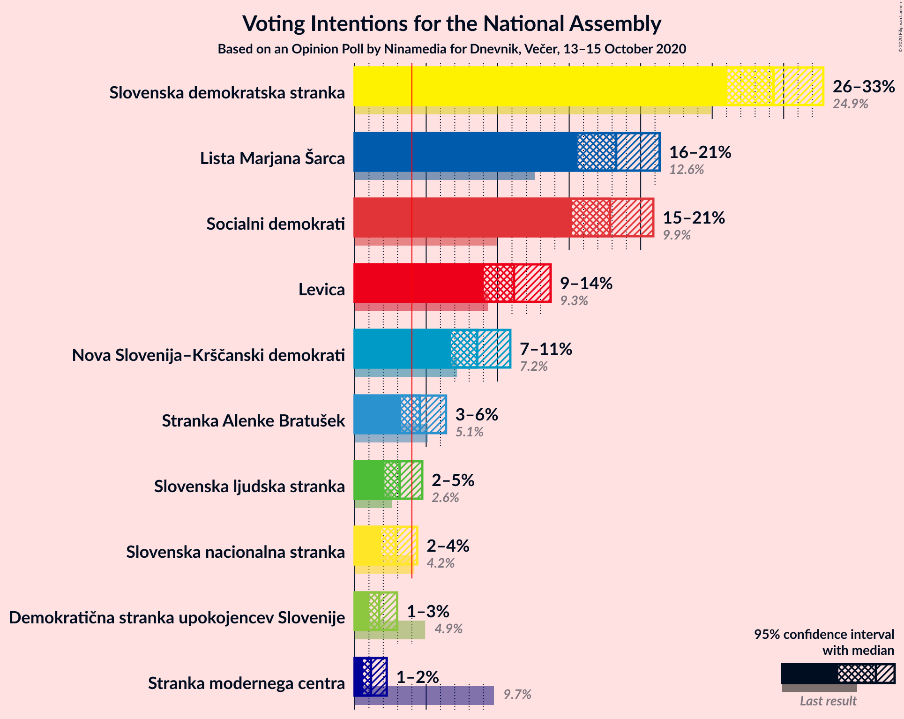

### Confidence Intervals

| Party | Last Result | Poll Result | 80% Confidence Interval | 90% Confidence Interval | 95% Confidence Interval | 99% Confidence Interval |
|:-----:|:-----------:|:-----------:|:-----------------------:|:-----------------------:|:-----------------------:|:-----------------------:|
| Slovenska demokratska stranka | 24.9% | 29.3% | 27.1–31.6% |26.6–32.2% |26.0–32.8% |25.0–33.9% |
| Lista Marjana Šarca | 12.6% | 18.3% | 16.5–20.3% |16.0–20.8% |15.6–21.3% |14.8–22.3% |
| Socialni demokrati | 9.9% | 17.9% | 16.1–19.8% |15.6–20.4% |15.2–20.9% |14.4–21.9% |
| Levica | 9.3% | 11.1% | 9.7–12.8% |9.3–13.3% |9.0–13.7% |8.4–14.5% |
| Nova Slovenija–Krščanski demokrati | 7.2% | 8.6% | 7.3–10.1% |7.0–10.5% |6.7–10.9% |6.2–11.6% |
| Stranka Alenke Bratušek | 5.1% | 4.6% | 3.7–5.8% |3.5–6.1% |3.3–6.4% |2.9–7.0% |
| Slovenska ljudska stranka | 2.6% | 3.1% | 2.4–4.2% |2.2–4.5% |2.1–4.7% |1.8–5.3% |
| Slovenska nacionalna stranka | 4.2% | 2.9% | 2.2–3.8% |2.0–4.1% |1.9–4.4% |1.6–4.9% |
| Demokratična stranka upokojencev Slovenije | 4.9% | 1.7% | 1.2–2.5% |1.1–2.8% |1.0–3.0% |0.8–3.4% |
| Stranka modernega centra | 9.7% | 1.1% | 0.8–1.9% |0.7–2.1% |0.6–2.2% |0.4–2.6% |

*Note:* The poll result column reflects the actual value used in the calculations. Published results may vary slightly, and in addition be rounded to fewer digits.

## Seats

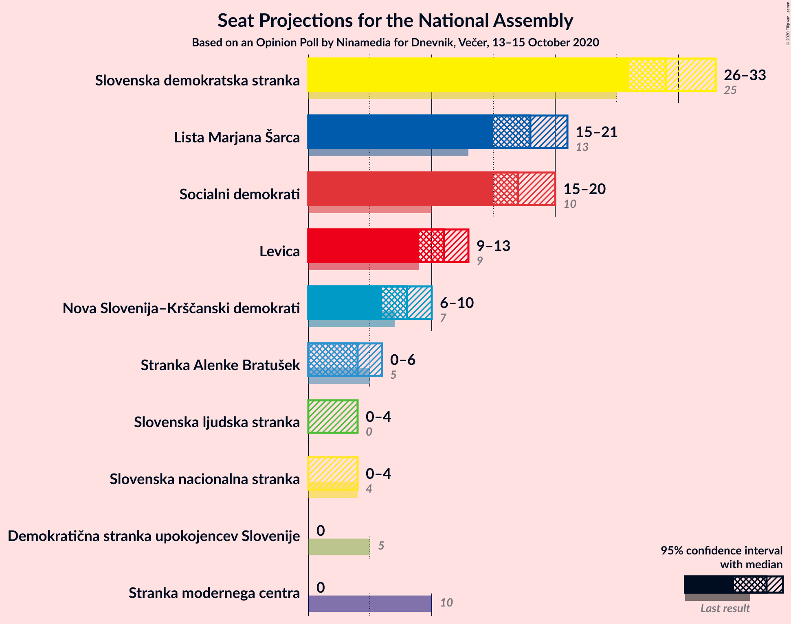

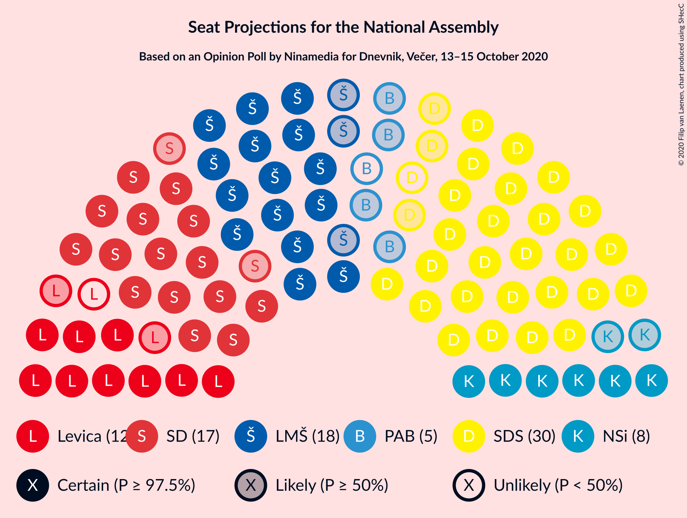

### Confidence Intervals

| Party | Last Result | Median | 80% Confidence Interval | 90% Confidence Interval | 95% Confidence Interval | 99% Confidence Interval |
|:-----:|:-----------:|:------:|:-----------------------:|:-----------------------:|:-----------------------:|:-----------------------:|
| <a href="#slovenska-demokratska-stranka">Slovenska demokratska stranka</a> | 25 | 29 | 27–31 |26–33 |26–33 |24–34 |
| <a href="#lista-marjana-šarca">Lista Marjana Šarca</a> | 13 | 18 | 16–20 |16–20 |15–21 |14–22 |
| <a href="#socialni-demokrati">Socialni demokrati</a> | 10 | 17 | 16–19 |15–20 |15–20 |14–22 |
| <a href="#levica">Levica</a> | 9 | 11 | 9–12 |9–13 |9–13 |8–14 |
| <a href="#nova-slovenija–krščanski-demokrati">Nova Slovenija–Krščanski demokrati</a> | 7 | 8 | 7–10 |7–10 |6–10 |6–11 |
| <a href="#stranka-alenke-bratušek">Stranka Alenke Bratušek</a> | 5 | 4 | 0–5 |0–6 |0–6 |0–6 |
| <a href="#slovenska-ljudska-stranka">Slovenska ljudska stranka</a> | 0 | 0 | 0–4 |0–4 |0–4 |0–5 |
| <a href="#slovenska-nacionalna-stranka">Slovenska nacionalna stranka</a> | 4 | 0 | 0 |0 |0–4 |0–4 |
| <a href="#demokratična-stranka-upokojencev-slovenije">Demokratična stranka upokojencev Slovenije</a> | 5 | 0 | 0 |0 |0 |0 |
| <a href="#stranka-modernega-centra">Stranka modernega centra</a> | 10 | 0 | 0 |0 |0 |0 |

### Slovenska demokratska stranka

*For a full overview of the results for this party, see the [Slovenska demokratska stranka](party-slovenskademokratskastranka.html) page.*

| Number of Seats | Probability | Accumulated | Special Marks |
|:---------------:|:-----------:|:-----------:|:-------------:|
| 23 | 0.1% | 100% |  |
| 24 | 0.6% | 99.9% |  |
| 25 | 2% | 99.3% | Last Result |
| 26 | 3% | 98% |  |
| 27 | 8% | 95% |  |
| 28 | 21% | 87% |  |
| 29 | 18% | 65% | Median |
| 30 | 28% | 48% |  |
| 31 | 10% | 19% |  |
| 32 | 3% | 9% |  |
| 33 | 6% | 6% |  |
| 34 | 0.7% | 0.8% |  |
| 35 | 0.1% | 0.2% |  |
| 36 | 0.1% | 0.1% |  |
| 37 | 0% | 0% |  |

### Lista Marjana Šarca

*For a full overview of the results for this party, see the [Lista Marjana Šarca](party-listamarjanašarca.html) page.*

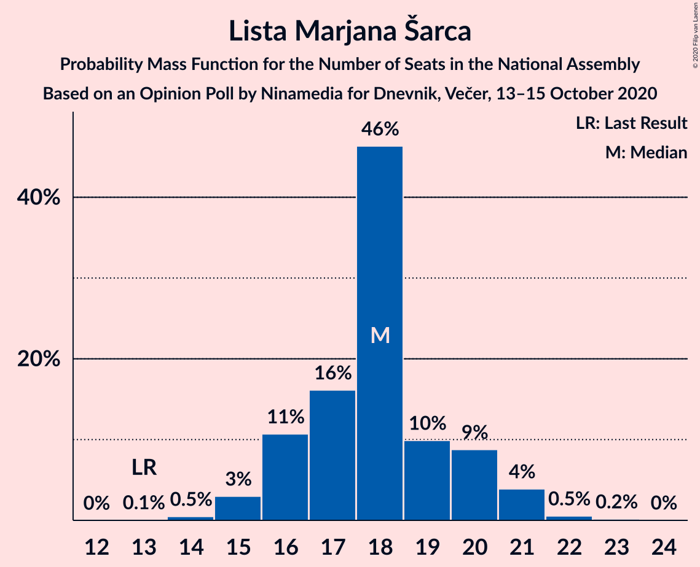

| Number of Seats | Probability | Accumulated | Special Marks |
|:---------------:|:-----------:|:-----------:|:-------------:|
| 13 | 0.1% | 100% | Last Result |
| 14 | 0.5% | 99.9% |  |
| 15 | 3% | 99.5% |  |
| 16 | 11% | 96% |  |
| 17 | 16% | 86% |  |
| 18 | 46% | 70% | Median |
| 19 | 10% | 23% |  |
| 20 | 9% | 13% |  |
| 21 | 4% | 5% |  |
| 22 | 0.5% | 0.7% |  |
| 23 | 0.2% | 0.2% |  |
| 24 | 0% | 0% |  |

### Socialni demokrati

*For a full overview of the results for this party, see the [Socialni demokrati](party-socialnidemokrati.html) page.*

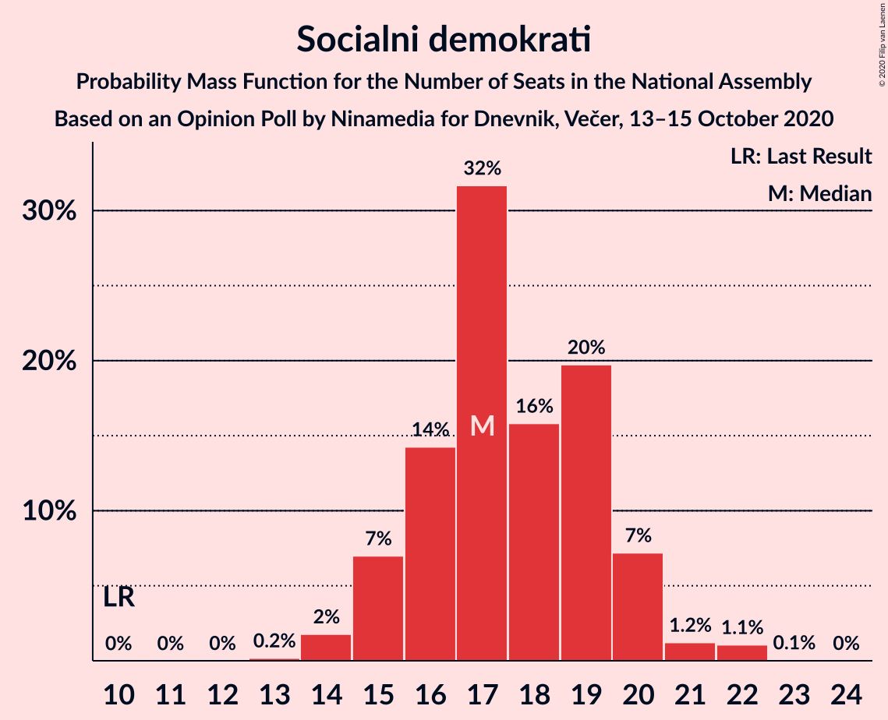

| Number of Seats | Probability | Accumulated | Special Marks |
|:---------------:|:-----------:|:-----------:|:-------------:|
| 10 | 0% | 100% | Last Result |
| 11 | 0% | 100% |  |
| 12 | 0% | 100% |  |
| 13 | 0.2% | 100% |  |
| 14 | 2% | 99.8% |  |
| 15 | 7% | 98% |  |
| 16 | 14% | 91% |  |
| 17 | 32% | 77% | Median |
| 18 | 16% | 45% |  |
| 19 | 20% | 29% |  |
| 20 | 7% | 10% |  |
| 21 | 1.2% | 2% |  |
| 22 | 1.1% | 1.1% |  |
| 23 | 0.1% | 0.1% |  |
| 24 | 0% | 0% |  |

### Levica

*For a full overview of the results for this party, see the [Levica](party-levica.html) page.*

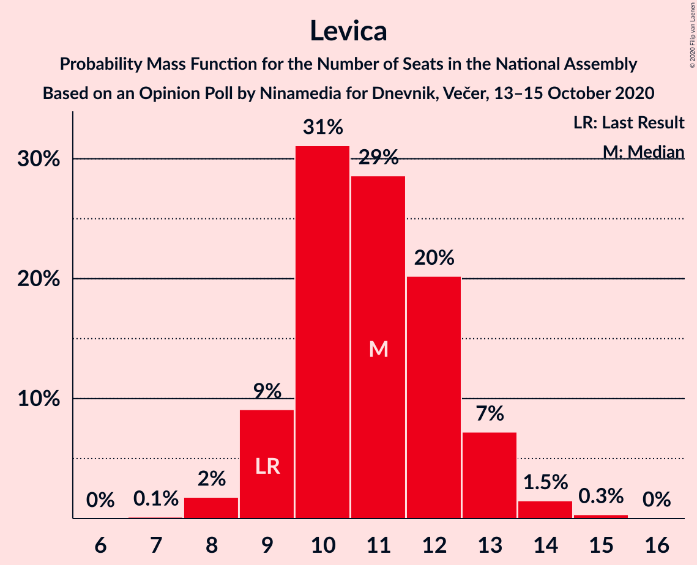

| Number of Seats | Probability | Accumulated | Special Marks |
|:---------------:|:-----------:|:-----------:|:-------------:|
| 7 | 0.1% | 100% |  |
| 8 | 2% | 99.9% |  |
| 9 | 9% | 98% | Last Result |
| 10 | 31% | 89% |  |
| 11 | 29% | 58% | Median |
| 12 | 20% | 29% |  |
| 13 | 7% | 9% |  |
| 14 | 1.5% | 2% |  |
| 15 | 0.3% | 0.4% |  |
| 16 | 0% | 0% |  |

### Nova Slovenija–Krščanski demokrati

*For a full overview of the results for this party, see the [Nova Slovenija–Krščanski demokrati](party-novaslovenija–krščanskidemokrati.html) page.*

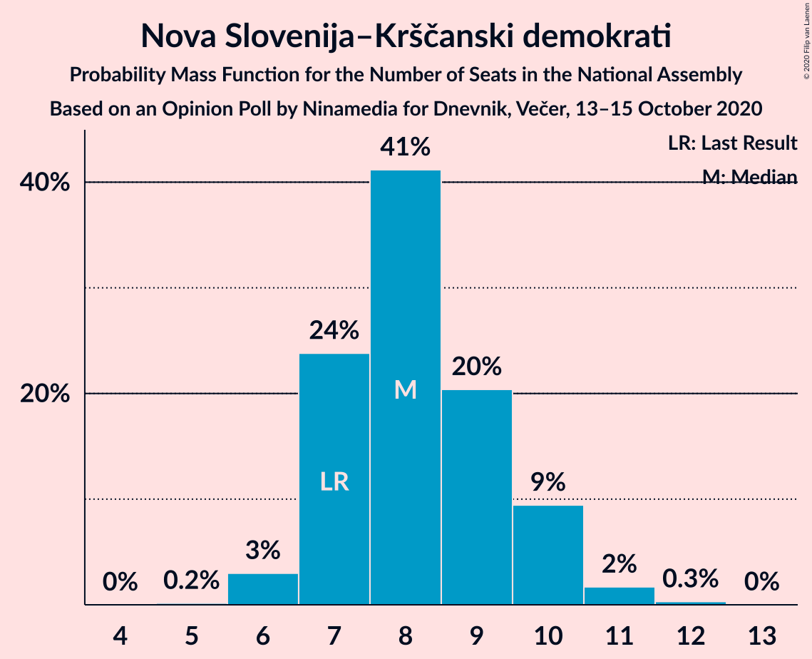

| Number of Seats | Probability | Accumulated | Special Marks |
|:---------------:|:-----------:|:-----------:|:-------------:|
| 5 | 0.2% | 100% |  |
| 6 | 3% | 99.8% |  |
| 7 | 24% | 97% | Last Result |
| 8 | 41% | 73% | Median |
| 9 | 20% | 32% |  |
| 10 | 9% | 11% |  |
| 11 | 2% | 2% |  |
| 12 | 0.3% | 0.3% |  |
| 13 | 0% | 0% |  |

### Stranka Alenke Bratušek

*For a full overview of the results for this party, see the [Stranka Alenke Bratušek](party-strankaalenkebratušek.html) page.*

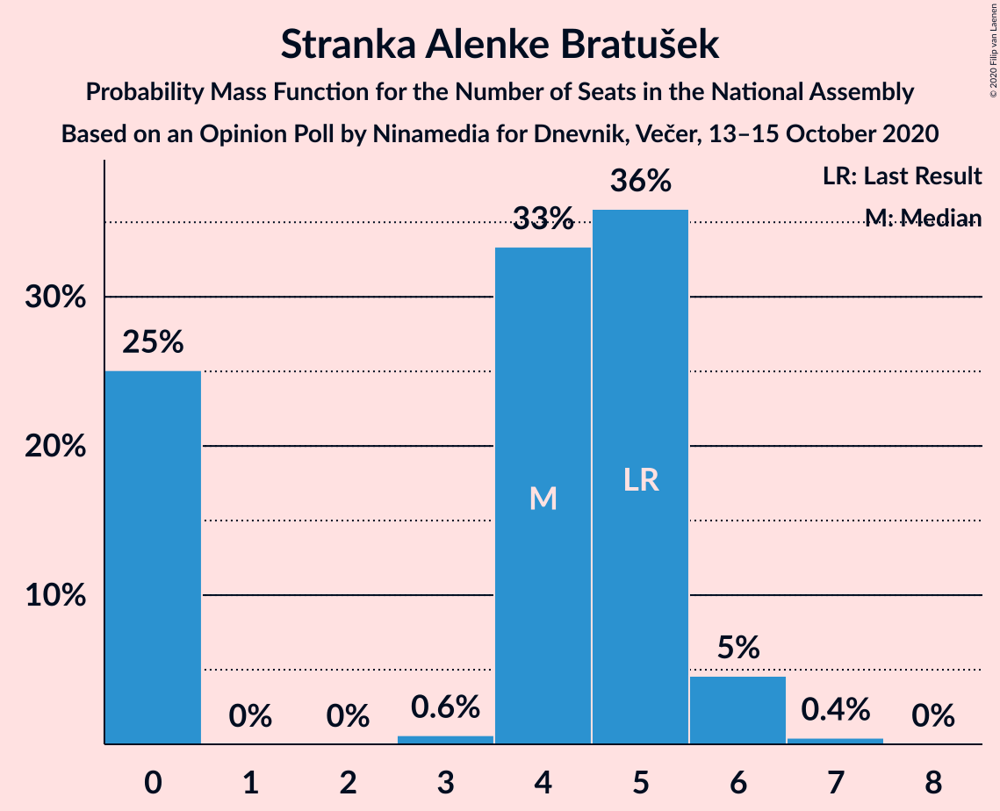

| Number of Seats | Probability | Accumulated | Special Marks |
|:---------------:|:-----------:|:-----------:|:-------------:|
| 0 | 25% | 100% |  |
| 1 | 0% | 75% |  |
| 2 | 0% | 75% |  |
| 3 | 0.6% | 75% |  |
| 4 | 33% | 74% | Median |
| 5 | 36% | 41% | Last Result |
| 6 | 5% | 5% |  |
| 7 | 0.4% | 0.5% |  |
| 8 | 0% | 0% |  |

### Slovenska ljudska stranka

*For a full overview of the results for this party, see the [Slovenska ljudska stranka](party-slovenskaljudskastranka.html) page.*

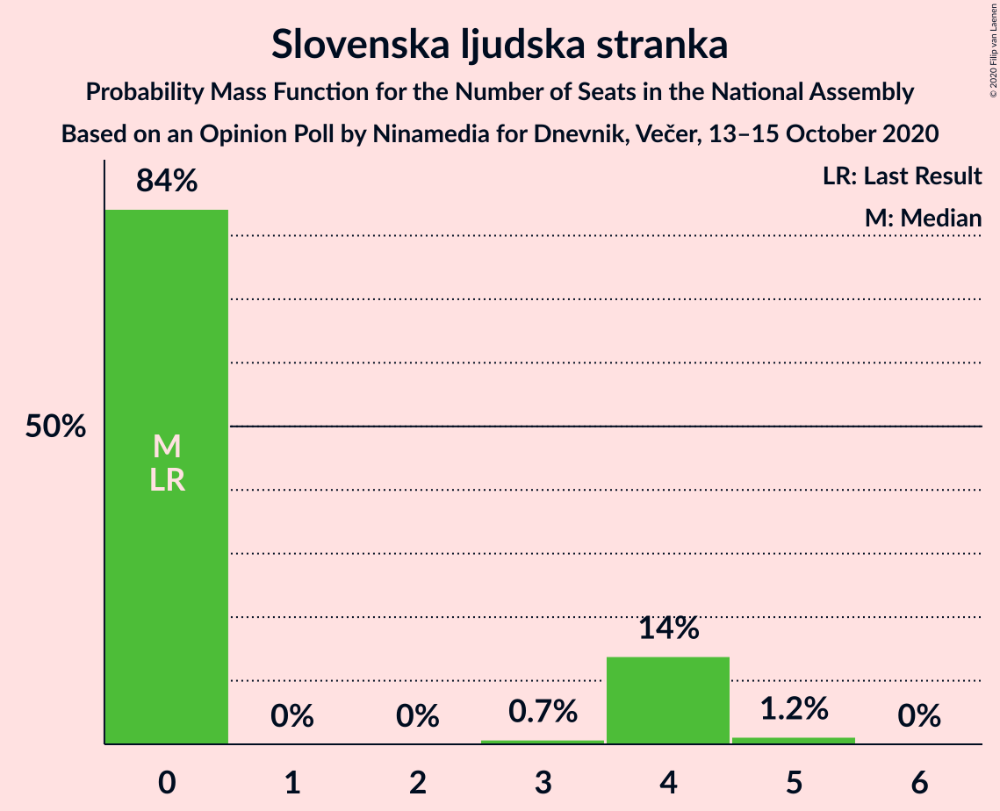

| Number of Seats | Probability | Accumulated | Special Marks |
|:---------------:|:-----------:|:-----------:|:-------------:|
| 0 | 84% | 100% | Last Result, Median |
| 1 | 0% | 16% |  |
| 2 | 0% | 16% |  |
| 3 | 0.7% | 16% |  |
| 4 | 14% | 15% |  |
| 5 | 1.2% | 1.2% |  |
| 6 | 0% | 0% |  |

### Slovenska nacionalna stranka

*For a full overview of the results for this party, see the [Slovenska nacionalna stranka](party-slovenskanacionalnastranka.html) page.*

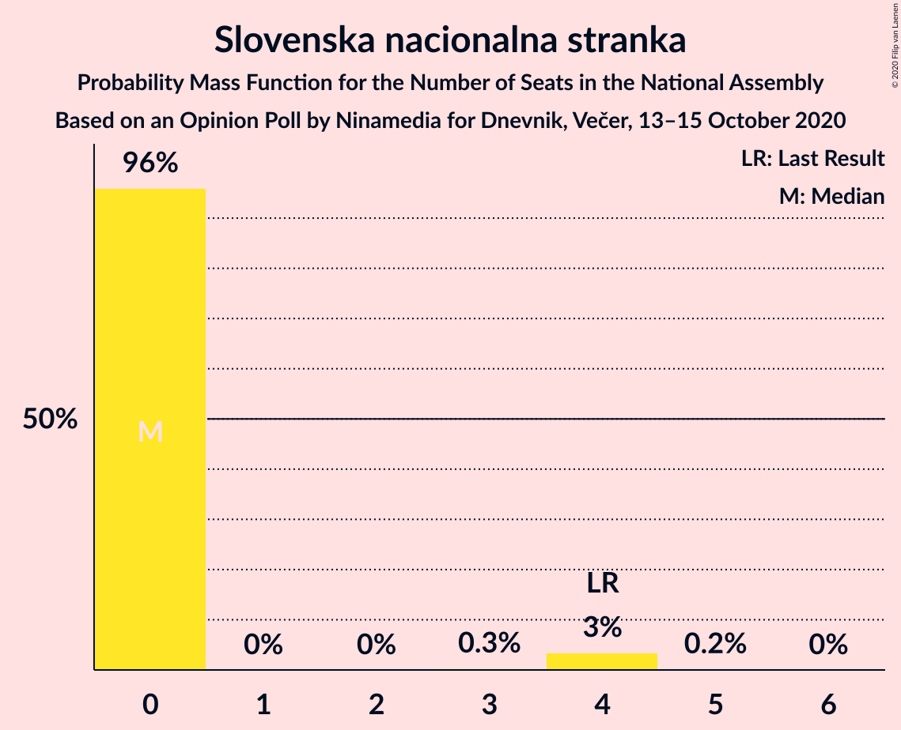

| Number of Seats | Probability | Accumulated | Special Marks |
|:---------------:|:-----------:|:-----------:|:-------------:|
| 0 | 96% | 100% | Median |
| 1 | 0% | 4% |  |
| 2 | 0% | 4% |  |
| 3 | 0.3% | 4% |  |
| 4 | 3% | 4% | Last Result |
| 5 | 0.2% | 0.2% |  |
| 6 | 0% | 0% |  |

### Demokratična stranka upokojencev Slovenije

*For a full overview of the results for this party, see the [Demokratična stranka upokojencev Slovenije](party-demokratičnastrankaupokojencevslovenije.html) page.*

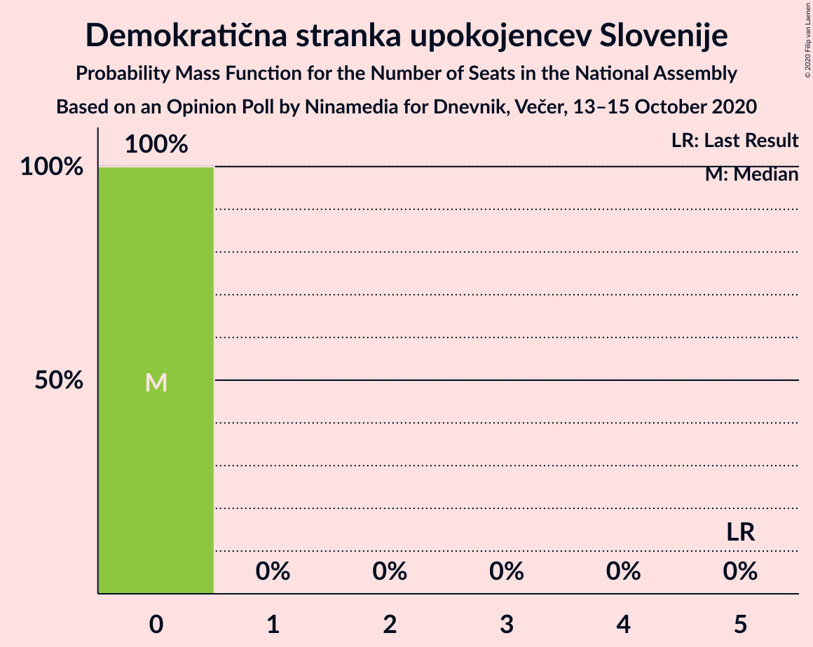

| Number of Seats | Probability | Accumulated | Special Marks |
|:---------------:|:-----------:|:-----------:|:-------------:|
| 0 | 100% | 100% | Median |
| 1 | 0% | 0% |  |
| 2 | 0% | 0% |  |
| 3 | 0% | 0% |  |
| 4 | 0% | 0% |  |
| 5 | 0% | 0% | Last Result |

### Stranka modernega centra

*For a full overview of the results for this party, see the [Stranka modernega centra](party-strankamodernegacentra.html) page.*

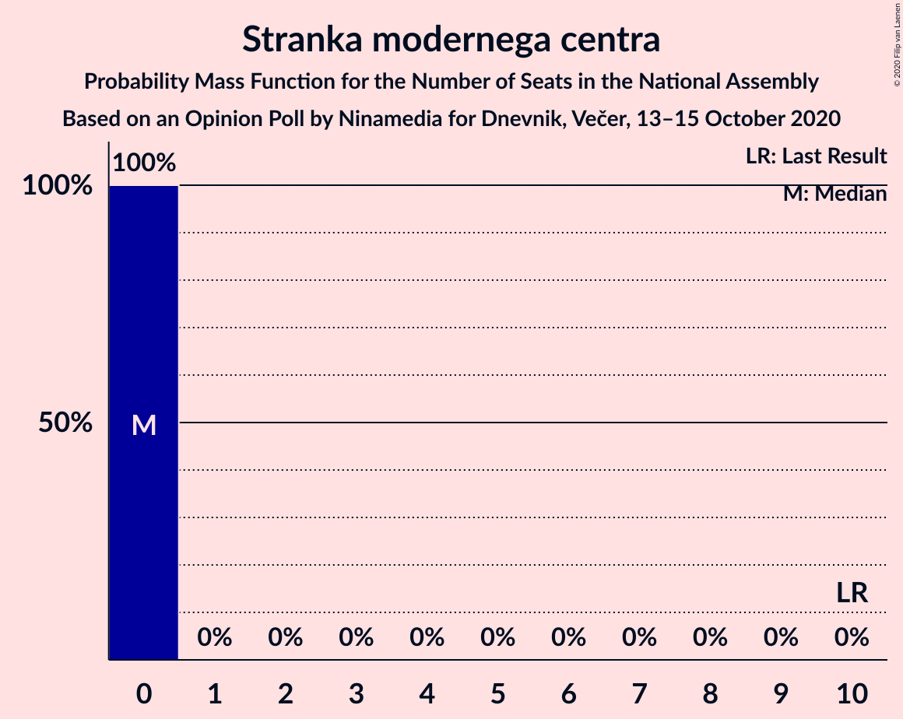

| Number of Seats | Probability | Accumulated | Special Marks |
|:---------------:|:-----------:|:-----------:|:-------------:|
| 0 | 100% | 100% | Median |
| 1 | 0% | 0% |  |
| 2 | 0% | 0% |  |
| 3 | 0% | 0% |  |
| 4 | 0% | 0% |  |
| 5 | 0% | 0% |  |
| 6 | 0% | 0% |  |
| 7 | 0% | 0% |  |
| 8 | 0% | 0% |  |
| 9 | 0% | 0% |  |
| 10 | 0% | 0% | Last Result |

## Coalitions

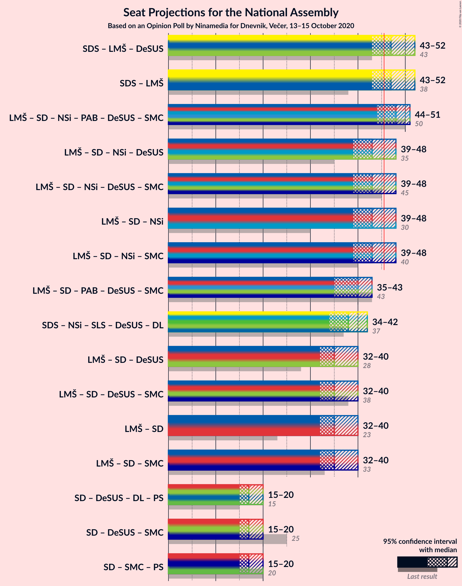

### Confidence Intervals

| Coalition | Last Result | Median | Majority? | 80% Confidence Interval | 90% Confidence Interval | 95% Confidence Interval | 99% Confidence Interval |
|:---------:|:-----------:|:------:|:---------:|:-----------------------:|:-----------------------:|:-----------------------:|:-----------------------:|
| Slovenska demokratska stranka – Lista Marjana Šarca – Demokratična stranka upokojencev Slovenije | 43 | 47 | 80% | 44–50 | 44–51 | 43–52 | 41–53 |
| Slovenska demokratska stranka – Lista Marjana Šarca | 38 | 47 | 80% | 44–50 | 44–51 | 43–52 | 41–53 |
| Lista Marjana Šarca – Socialni demokrati – Nova Slovenija–Krščanski demokrati – Stranka Alenke Bratušek – Demokratična stranka upokojencev Slovenije – Stranka modernega centra | 50 | 48 | 71% | 44–50 | 44–51 | 44–51 | 41–52 |
| Lista Marjana Šarca – Socialni demokrati – Nova Slovenija–Krščanski demokrati – Demokratična stranka upokojencev Slovenije | 35 | 43 | 18% | 41–47 | 39–48 | 39–48 | 38–49 |
| Lista Marjana Šarca – Socialni demokrati – Nova Slovenija–Krščanski demokrati – Demokratična stranka upokojencev Slovenije – Stranka modernega centra | 45 | 43 | 18% | 41–47 | 39–48 | 39–48 | 38–49 |
| Lista Marjana Šarca – Socialni demokrati – Nova Slovenija–Krščanski demokrati | 30 | 43 | 18% | 41–47 | 39–48 | 39–48 | 38–49 |
| Lista Marjana Šarca – Socialni demokrati – Nova Slovenija–Krščanski demokrati – Stranka modernega centra | 40 | 43 | 18% | 41–47 | 39–48 | 39–48 | 38–49 |
| Lista Marjana Šarca – Socialni demokrati – Stranka Alenke Bratušek – Demokratična stranka upokojencev Slovenije – Stranka modernega centra | 43 | 40 | 0.1% | 36–42 | 35–42 | 35–43 | 33–44 |
| Lista Marjana Šarca – Socialni demokrati – Demokratična stranka upokojencev Slovenije | 28 | 35 | 0% | 33–38 | 32–39 | 32–40 | 30–41 |
| Lista Marjana Šarca – Socialni demokrati – Demokratična stranka upokojencev Slovenije – Stranka modernega centra | 38 | 35 | 0% | 33–38 | 32–39 | 32–40 | 30–41 |
| Lista Marjana Šarca – Socialni demokrati | 23 | 35 | 0% | 33–38 | 32–39 | 32–40 | 30–41 |
| Lista Marjana Šarca – Socialni demokrati – Stranka modernega centra | 33 | 35 | 0% | 33–38 | 32–39 | 32–40 | 30–41 |
| Socialni demokrati – Demokratična stranka upokojencev Slovenije – Stranka modernega centra | 25 | 17 | 0% | 16–19 | 15–20 | 15–20 | 14–22 |

### Slovenska demokratska stranka – Lista Marjana Šarca – Demokratična stranka upokojencev Slovenije

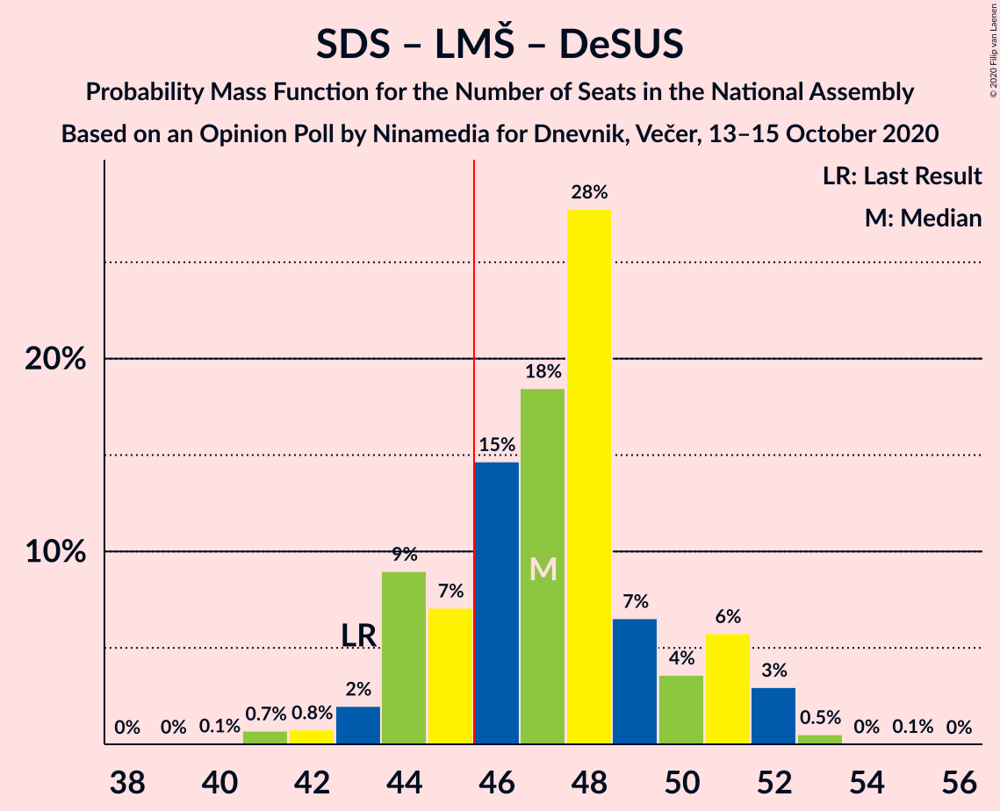

| Number of Seats | Probability | Accumulated | Special Marks |
|:---------------:|:-----------:|:-----------:|:-------------:|
| 40 | 0.1% | 100% |  |
| 41 | 0.7% | 99.9% |  |
| 42 | 0.8% | 99.2% |  |
| 43 | 2% | 98% | Last Result |
| 44 | 9% | 96% |  |
| 45 | 7% | 87% |  |
| 46 | 15% | 80% | Majority |
| 47 | 18% | 66% | Median |
| 48 | 28% | 47% |  |
| 49 | 7% | 19% |  |
| 50 | 4% | 13% |  |
| 51 | 6% | 9% |  |
| 52 | 3% | 4% |  |
| 53 | 0.5% | 0.6% |  |
| 54 | 0% | 0.1% |  |
| 55 | 0.1% | 0.1% |  |
| 56 | 0% | 0% |  |

### Slovenska demokratska stranka – Lista Marjana Šarca

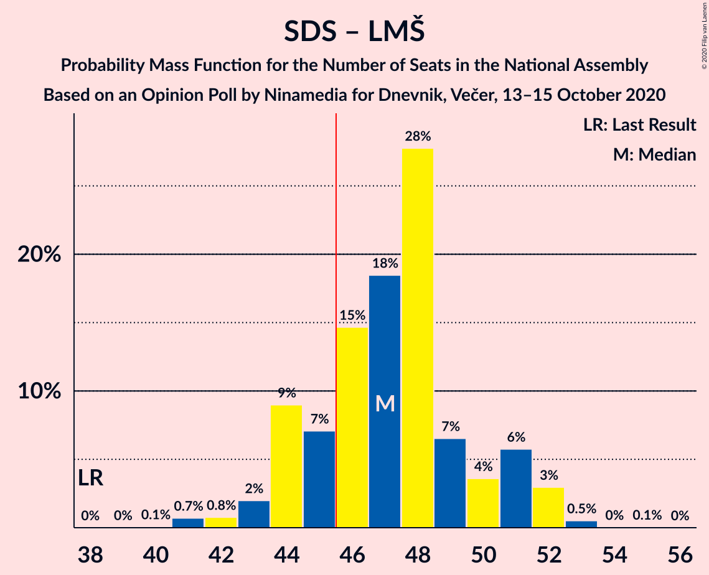

| Number of Seats | Probability | Accumulated | Special Marks |
|:---------------:|:-----------:|:-----------:|:-------------:|
| 38 | 0% | 100% | Last Result |
| 39 | 0% | 100% |  |
| 40 | 0.1% | 100% |  |
| 41 | 0.7% | 99.9% |  |
| 42 | 0.8% | 99.2% |  |
| 43 | 2% | 98% |  |
| 44 | 9% | 96% |  |
| 45 | 7% | 87% |  |
| 46 | 15% | 80% | Majority |
| 47 | 18% | 66% | Median |
| 48 | 28% | 47% |  |
| 49 | 7% | 19% |  |
| 50 | 4% | 13% |  |
| 51 | 6% | 9% |  |
| 52 | 3% | 4% |  |
| 53 | 0.5% | 0.6% |  |
| 54 | 0% | 0.1% |  |
| 55 | 0.1% | 0.1% |  |
| 56 | 0% | 0% |  |

### Lista Marjana Šarca – Socialni demokrati – Nova Slovenija–Krščanski demokrati – Stranka Alenke Bratušek – Demokratična stranka upokojencev Slovenije – Stranka modernega centra

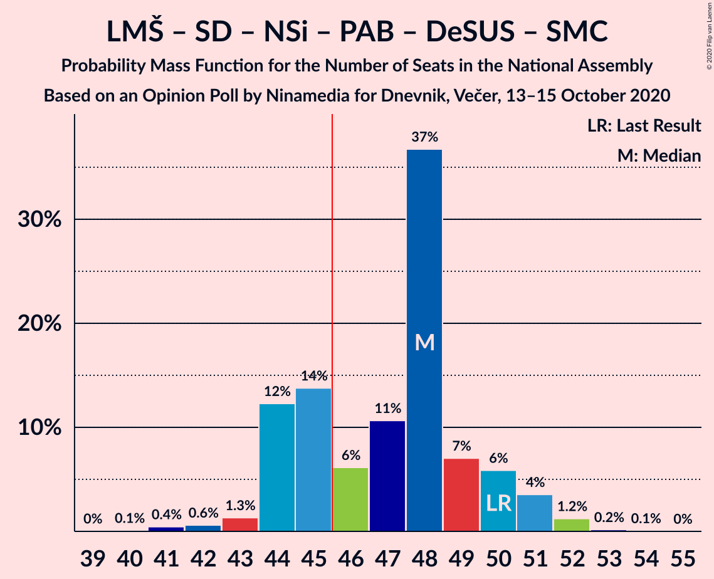

| Number of Seats | Probability | Accumulated | Special Marks |
|:---------------:|:-----------:|:-----------:|:-------------:|
| 40 | 0.1% | 100% |  |
| 41 | 0.4% | 99.9% |  |
| 42 | 0.6% | 99.4% |  |
| 43 | 1.3% | 98.8% |  |
| 44 | 12% | 98% |  |
| 45 | 14% | 85% |  |
| 46 | 6% | 71% | Majority |
| 47 | 11% | 65% | Median |
| 48 | 37% | 55% |  |
| 49 | 7% | 18% |  |
| 50 | 6% | 11% | Last Result |
| 51 | 4% | 5% |  |
| 52 | 1.2% | 1.5% |  |
| 53 | 0.2% | 0.2% |  |
| 54 | 0.1% | 0.1% |  |
| 55 | 0% | 0% |  |

### Lista Marjana Šarca – Socialni demokrati – Nova Slovenija–Krščanski demokrati – Demokratična stranka upokojencev Slovenije

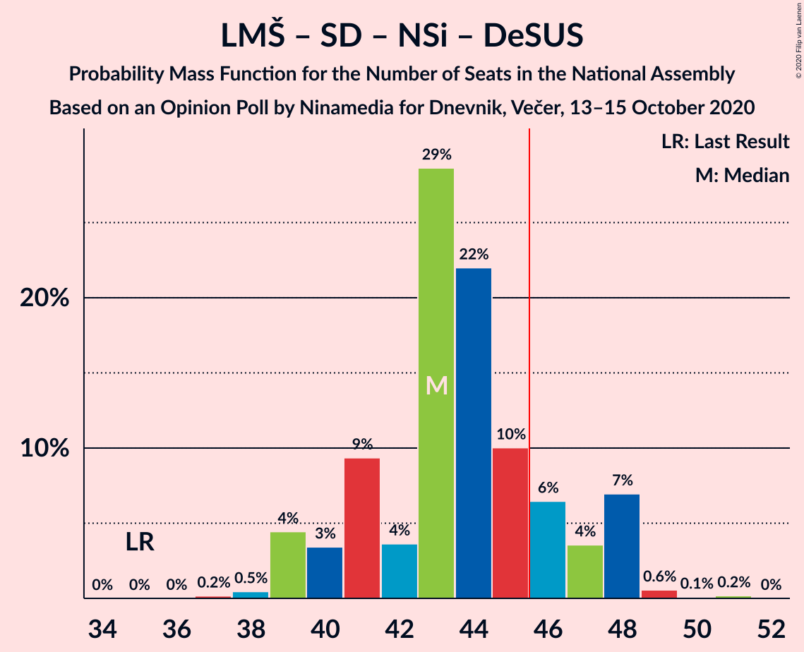

| Number of Seats | Probability | Accumulated | Special Marks |
|:---------------:|:-----------:|:-----------:|:-------------:|
| 35 | 0% | 100% | Last Result |
| 36 | 0% | 100% |  |
| 37 | 0.2% | 100% |  |
| 38 | 0.5% | 99.8% |  |
| 39 | 4% | 99.4% |  |
| 40 | 3% | 95% |  |
| 41 | 9% | 91% |  |
| 42 | 4% | 82% |  |
| 43 | 29% | 78% | Median |
| 44 | 22% | 50% |  |
| 45 | 10% | 28% |  |
| 46 | 6% | 18% | Majority |
| 47 | 4% | 11% |  |
| 48 | 7% | 8% |  |
| 49 | 0.6% | 0.8% |  |
| 50 | 0.1% | 0.3% |  |
| 51 | 0.2% | 0.2% |  |
| 52 | 0% | 0% |  |

### Lista Marjana Šarca – Socialni demokrati – Nova Slovenija–Krščanski demokrati – Demokratična stranka upokojencev Slovenije – Stranka modernega centra

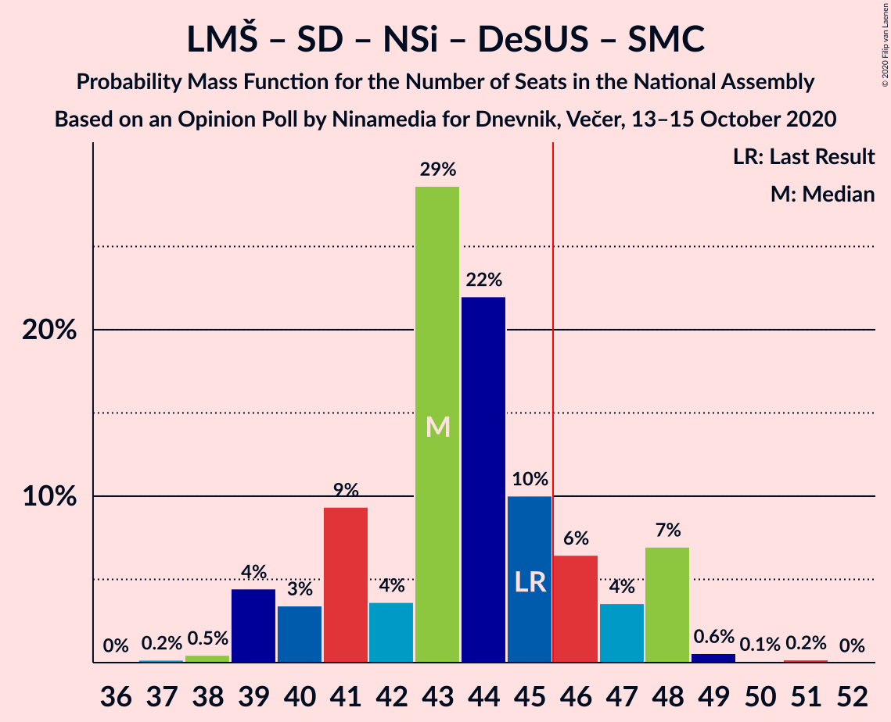

| Number of Seats | Probability | Accumulated | Special Marks |
|:---------------:|:-----------:|:-----------:|:-------------:|
| 37 | 0.2% | 100% |  |
| 38 | 0.5% | 99.8% |  |
| 39 | 4% | 99.4% |  |
| 40 | 3% | 95% |  |
| 41 | 9% | 91% |  |
| 42 | 4% | 82% |  |
| 43 | 29% | 78% | Median |
| 44 | 22% | 50% |  |
| 45 | 10% | 28% | Last Result |
| 46 | 6% | 18% | Majority |
| 47 | 4% | 11% |  |
| 48 | 7% | 8% |  |
| 49 | 0.6% | 0.8% |  |
| 50 | 0.1% | 0.3% |  |
| 51 | 0.2% | 0.2% |  |
| 52 | 0% | 0% |  |

### Lista Marjana Šarca – Socialni demokrati – Nova Slovenija–Krščanski demokrati

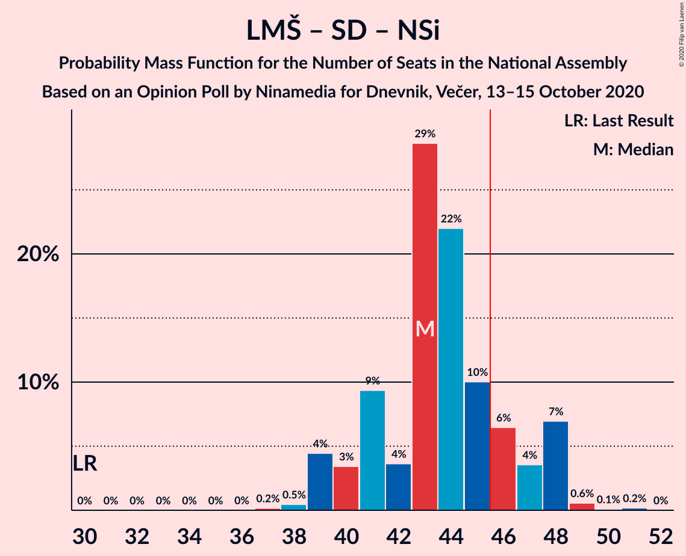

| Number of Seats | Probability | Accumulated | Special Marks |
|:---------------:|:-----------:|:-----------:|:-------------:|
| 30 | 0% | 100% | Last Result |
| 31 | 0% | 100% |  |
| 32 | 0% | 100% |  |
| 33 | 0% | 100% |  |
| 34 | 0% | 100% |  |
| 35 | 0% | 100% |  |
| 36 | 0% | 100% |  |
| 37 | 0.2% | 100% |  |
| 38 | 0.5% | 99.8% |  |
| 39 | 4% | 99.4% |  |
| 40 | 3% | 95% |  |
| 41 | 9% | 91% |  |
| 42 | 4% | 82% |  |
| 43 | 29% | 78% | Median |
| 44 | 22% | 50% |  |
| 45 | 10% | 28% |  |
| 46 | 6% | 18% | Majority |
| 47 | 4% | 11% |  |
| 48 | 7% | 8% |  |
| 49 | 0.6% | 0.8% |  |
| 50 | 0.1% | 0.3% |  |
| 51 | 0.2% | 0.2% |  |
| 52 | 0% | 0% |  |

### Lista Marjana Šarca – Socialni demokrati – Nova Slovenija–Krščanski demokrati – Stranka modernega centra

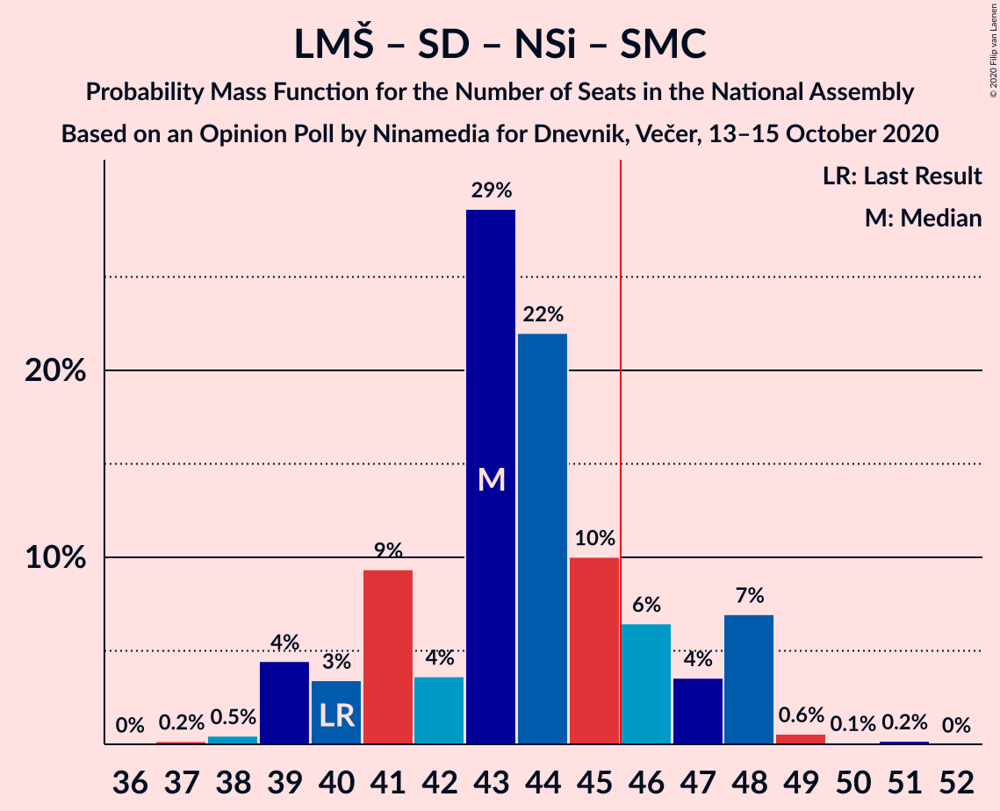

| Number of Seats | Probability | Accumulated | Special Marks |
|:---------------:|:-----------:|:-----------:|:-------------:|
| 37 | 0.2% | 100% |  |
| 38 | 0.5% | 99.8% |  |
| 39 | 4% | 99.4% |  |
| 40 | 3% | 95% | Last Result |
| 41 | 9% | 91% |  |
| 42 | 4% | 82% |  |
| 43 | 29% | 78% | Median |
| 44 | 22% | 50% |  |
| 45 | 10% | 28% |  |
| 46 | 6% | 18% | Majority |
| 47 | 4% | 11% |  |
| 48 | 7% | 8% |  |
| 49 | 0.6% | 0.8% |  |
| 50 | 0.1% | 0.3% |  |
| 51 | 0.2% | 0.2% |  |
| 52 | 0% | 0% |  |

### Lista Marjana Šarca – Socialni demokrati – Stranka Alenke Bratušek – Demokratična stranka upokojencev Slovenije – Stranka modernega centra

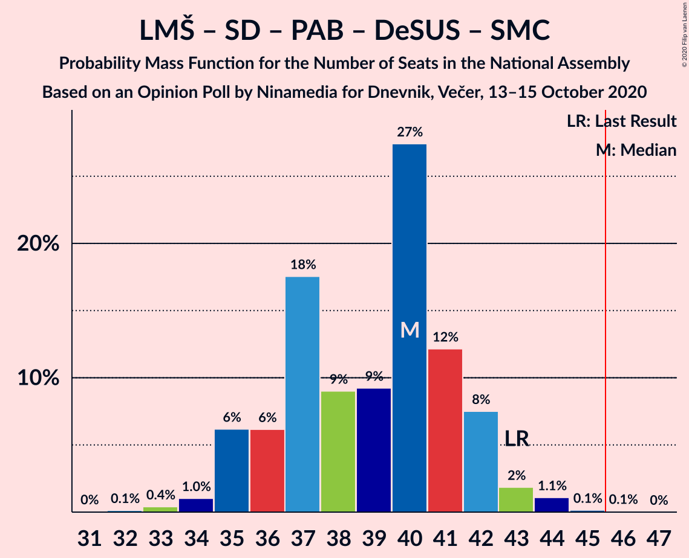

| Number of Seats | Probability | Accumulated | Special Marks |
|:---------------:|:-----------:|:-----------:|:-------------:|
| 32 | 0.1% | 100% |  |
| 33 | 0.4% | 99.8% |  |
| 34 | 1.0% | 99.4% |  |
| 35 | 6% | 98% |  |
| 36 | 6% | 92% |  |
| 37 | 18% | 86% |  |
| 38 | 9% | 68% |  |
| 39 | 9% | 59% | Median |
| 40 | 27% | 50% |  |
| 41 | 12% | 23% |  |
| 42 | 8% | 11% |  |
| 43 | 2% | 3% | Last Result |
| 44 | 1.1% | 1.3% |  |
| 45 | 0.1% | 0.2% |  |
| 46 | 0.1% | 0.1% | Majority |
| 47 | 0% | 0% |  |

### Lista Marjana Šarca – Socialni demokrati – Demokratična stranka upokojencev Slovenije

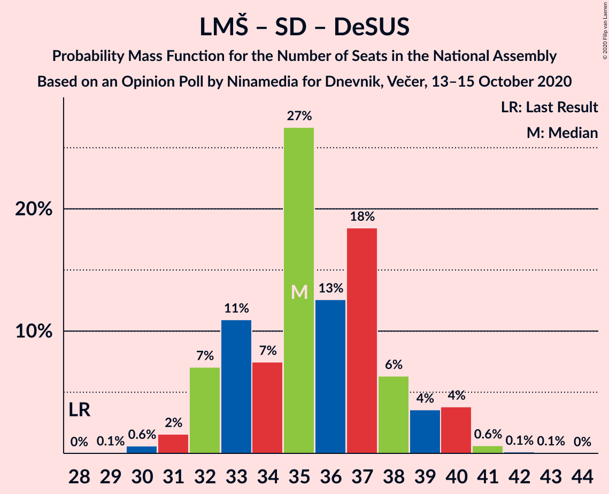

| Number of Seats | Probability | Accumulated | Special Marks |
|:---------------:|:-----------:|:-----------:|:-------------:|
| 28 | 0% | 100% | Last Result |
| 29 | 0.1% | 100% |  |
| 30 | 0.6% | 99.9% |  |
| 31 | 2% | 99.3% |  |
| 32 | 7% | 98% |  |
| 33 | 11% | 91% |  |
| 34 | 7% | 80% |  |
| 35 | 27% | 72% | Median |
| 36 | 13% | 46% |  |
| 37 | 18% | 33% |  |
| 38 | 6% | 15% |  |
| 39 | 4% | 8% |  |
| 40 | 4% | 5% |  |
| 41 | 0.6% | 0.8% |  |
| 42 | 0.1% | 0.2% |  |
| 43 | 0.1% | 0.1% |  |
| 44 | 0% | 0% |  |

### Lista Marjana Šarca – Socialni demokrati – Demokratična stranka upokojencev Slovenije – Stranka modernega centra

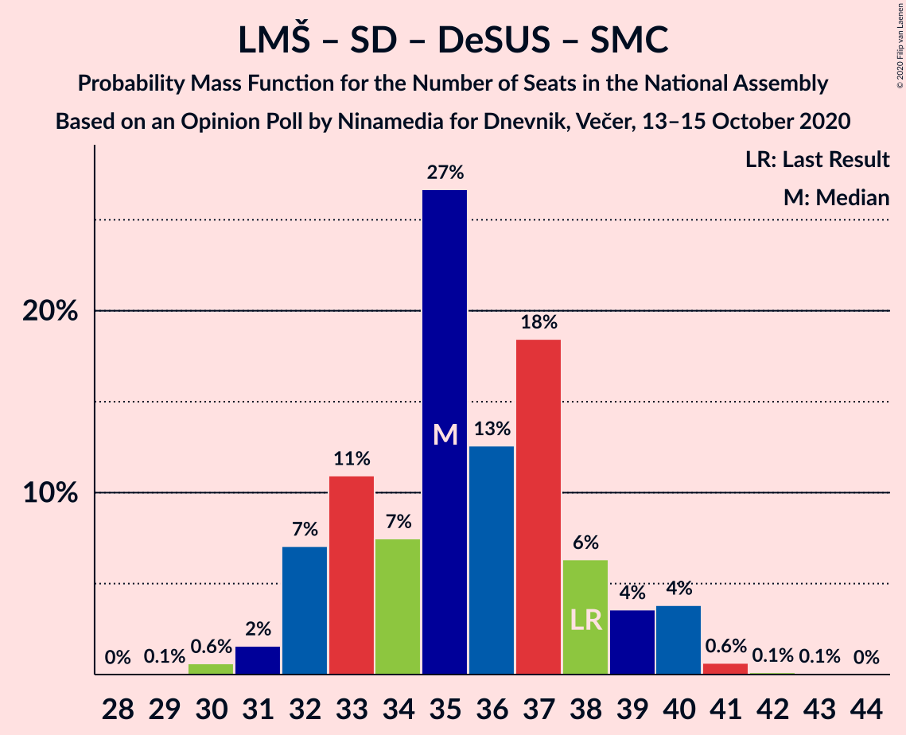

| Number of Seats | Probability | Accumulated | Special Marks |
|:---------------:|:-----------:|:-----------:|:-------------:|
| 29 | 0.1% | 100% |  |
| 30 | 0.6% | 99.9% |  |
| 31 | 2% | 99.3% |  |
| 32 | 7% | 98% |  |
| 33 | 11% | 91% |  |
| 34 | 7% | 80% |  |
| 35 | 27% | 72% | Median |
| 36 | 13% | 46% |  |
| 37 | 18% | 33% |  |
| 38 | 6% | 15% | Last Result |
| 39 | 4% | 8% |  |
| 40 | 4% | 5% |  |
| 41 | 0.6% | 0.8% |  |
| 42 | 0.1% | 0.2% |  |
| 43 | 0.1% | 0.1% |  |
| 44 | 0% | 0% |  |

### Lista Marjana Šarca – Socialni demokrati

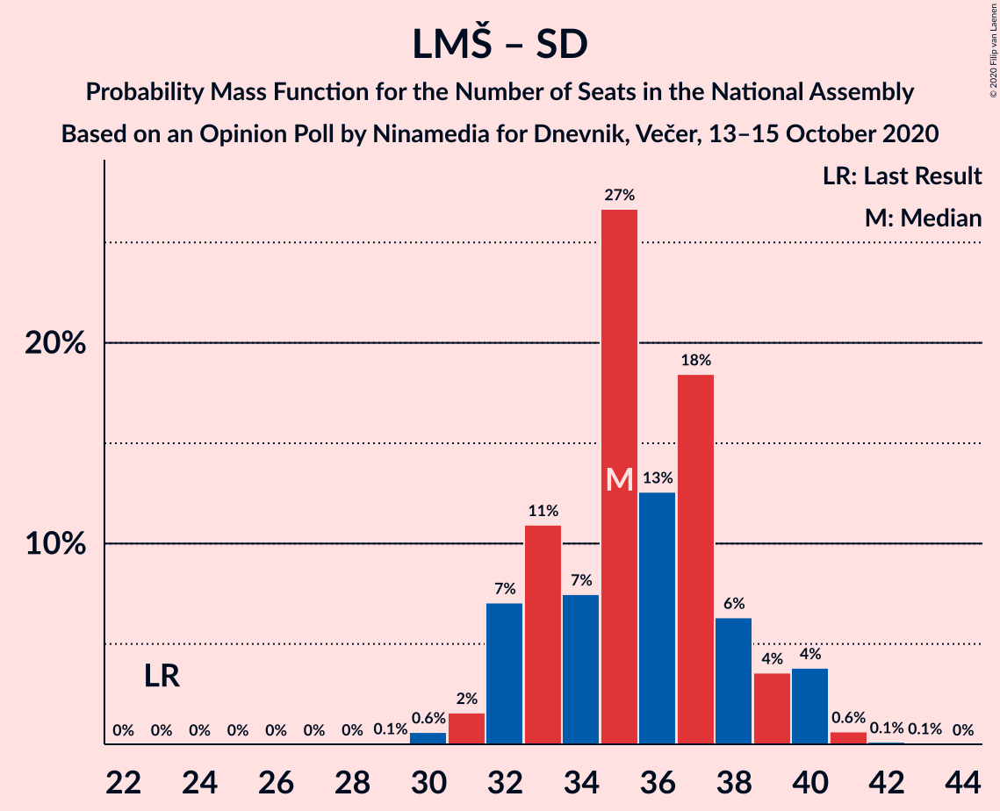

| Number of Seats | Probability | Accumulated | Special Marks |
|:---------------:|:-----------:|:-----------:|:-------------:|
| 23 | 0% | 100% | Last Result |
| 24 | 0% | 100% |  |
| 25 | 0% | 100% |  |
| 26 | 0% | 100% |  |
| 27 | 0% | 100% |  |
| 28 | 0% | 100% |  |
| 29 | 0.1% | 100% |  |
| 30 | 0.6% | 99.9% |  |
| 31 | 2% | 99.3% |  |
| 32 | 7% | 98% |  |
| 33 | 11% | 91% |  |
| 34 | 7% | 80% |  |
| 35 | 27% | 72% | Median |
| 36 | 13% | 46% |  |
| 37 | 18% | 33% |  |
| 38 | 6% | 15% |  |
| 39 | 4% | 8% |  |
| 40 | 4% | 5% |  |
| 41 | 0.6% | 0.8% |  |
| 42 | 0.1% | 0.2% |  |
| 43 | 0.1% | 0.1% |  |
| 44 | 0% | 0% |  |

### Lista Marjana Šarca – Socialni demokrati – Stranka modernega centra

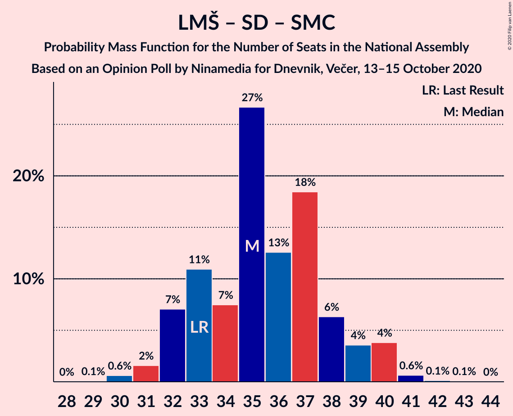

| Number of Seats | Probability | Accumulated | Special Marks |
|:---------------:|:-----------:|:-----------:|:-------------:|
| 29 | 0.1% | 100% |  |
| 30 | 0.6% | 99.9% |  |
| 31 | 2% | 99.3% |  |
| 32 | 7% | 98% |  |
| 33 | 11% | 91% | Last Result |
| 34 | 7% | 80% |  |
| 35 | 27% | 72% | Median |
| 36 | 13% | 46% |  |
| 37 | 18% | 33% |  |
| 38 | 6% | 15% |  |
| 39 | 4% | 8% |  |
| 40 | 4% | 5% |  |
| 41 | 0.6% | 0.8% |  |
| 42 | 0.1% | 0.2% |  |
| 43 | 0.1% | 0.1% |  |
| 44 | 0% | 0% |  |

### Socialni demokrati – Demokratična stranka upokojencev Slovenije – Stranka modernega centra

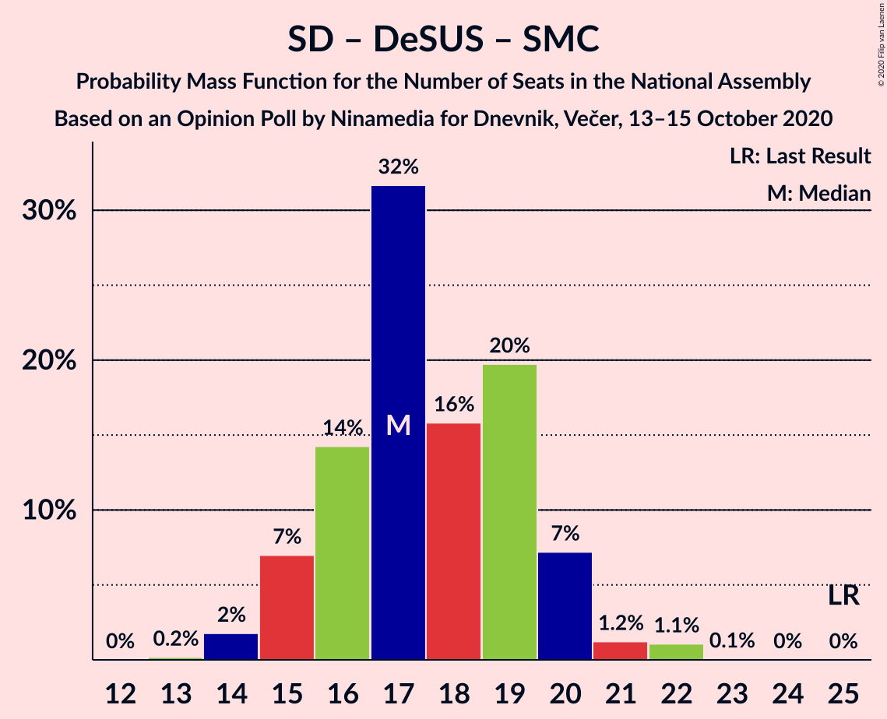

| Number of Seats | Probability | Accumulated | Special Marks |
|:---------------:|:-----------:|:-----------:|:-------------:|
| 13 | 0.2% | 100% |  |
| 14 | 2% | 99.8% |  |
| 15 | 7% | 98% |  |
| 16 | 14% | 91% |  |
| 17 | 32% | 77% | Median |
| 18 | 16% | 45% |  |
| 19 | 20% | 29% |  |
| 20 | 7% | 10% |  |
| 21 | 1.2% | 2% |  |
| 22 | 1.1% | 1.1% |  |
| 23 | 0.1% | 0.1% |  |
| 24 | 0% | 0% |  |
| 25 | 0% | 0% | Last Result |

## Technical Information

### Opinion Poll

+ **Polling firm:** Ninamedia
+ **Commissioner(s):** Dnevnik, Večer
+ **Fieldwork period:** 13–15 October 2020

### Calculations

+ **Sample size:** 700
+ **Simulations done:** 1,048,576
+ **Error estimate:** 1.66%

