# Opinion Poll by Mediana for POP TV, 1–25 October 2020

<a href="#voting-intentions">Voting Intentions</a> | <a href="#seats">Seats</a> | <a href="#coalitions">Coalitions</a> | <a href="#technical-information">Technical Information</a>

## Voting Intentions

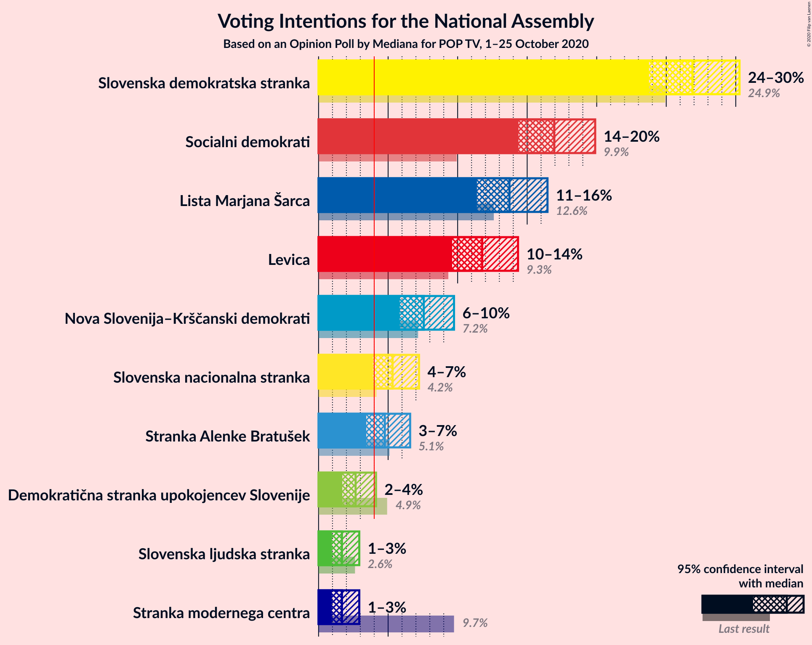

### Confidence Intervals

| Party | Last Result | Poll Result | 80% Confidence Interval | 90% Confidence Interval | 95% Confidence Interval | 99% Confidence Interval |
|:-----:|:-----------:|:-----------:|:-----------------------:|:-----------------------:|:-----------------------:|:-----------------------:|
| Slovenska demokratska stranka | 24.9% | 26.9% | 24.8–29.1% |24.3–29.7% |23.8–30.3% |22.8–31.4% |
| Socialni demokrati | 9.9% | 16.9% | 15.3–18.9% |14.8–19.4% |14.4–19.9% |13.6–20.8% |
| Lista Marjana Šarca | 12.6% | 13.7% | 12.2–15.5% |11.8–16.0% |11.4–16.5% |10.7–17.3% |
| Levica | 9.3% | 11.8% | 10.3–13.4% |9.9–13.9% |9.6–14.3% |9.0–15.2% |
| Nova Slovenija–Krščanski demokrati | 7.2% | 7.6% | 6.4–9.0% |6.1–9.4% |5.8–9.7% |5.3–10.5% |
| Slovenska nacionalna stranka | 4.2% | 5.3% | 4.4–6.6% |4.1–6.9% |3.9–7.2% |3.5–7.9% |
| Stranka Alenke Bratušek | 5.1% | 4.8% | 3.9–5.9% |3.6–6.3% |3.4–6.6% |3.0–7.2% |
| Demokratična stranka upokojencev Slovenije | 4.9% | 2.7% | 2.0–3.6% |1.9–3.9% |1.7–4.1% |1.4–4.6% |
| Stranka modernega centra | 9.7% | 1.7% | 1.2–2.5% |1.1–2.7% |1.0–2.9% |0.8–3.4% |
| Slovenska ljudska stranka | 2.6% | 1.7% | 1.2–2.5% |1.1–2.7% |1.0–2.9% |0.8–3.4% |

*Note:* The poll result column reflects the actual value used in the calculations. Published results may vary slightly, and in addition be rounded to fewer digits.

## Seats

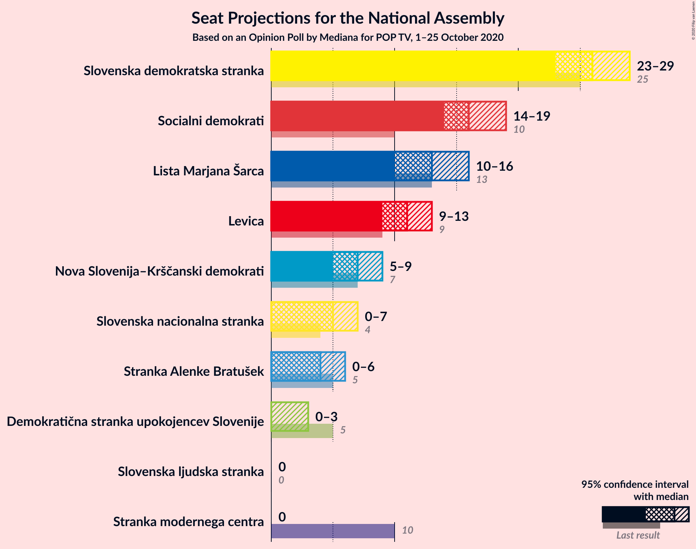

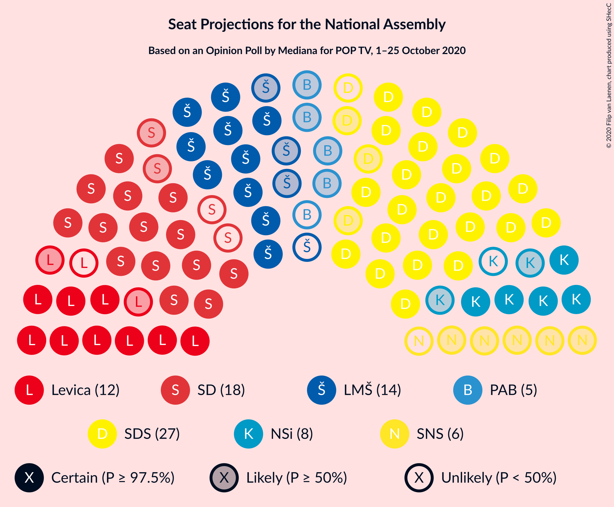

### Confidence Intervals

| Party | Last Result | Median | 80% Confidence Interval | 90% Confidence Interval | 95% Confidence Interval | 99% Confidence Interval |
|:-----:|:-----------:|:------:|:-----------------------:|:-----------------------:|:-----------------------:|:-----------------------:|
| <a href="#slovenska-demokratska-stranka">Slovenska demokratska stranka</a> | 25 | 26 | 24–28 |23–28 |23–29 |21–30 |
| <a href="#socialni-demokrati">Socialni demokrati</a> | 10 | 16 | 14–18 |14–18 |14–19 |13–20 |
| <a href="#lista-marjana-šarca">Lista Marjana Šarca</a> | 13 | 13 | 11–14 |11–15 |10–16 |10–17 |
| <a href="#levica">Levica</a> | 9 | 11 | 10–12 |9–13 |9–13 |9–14 |
| <a href="#nova-slovenija–krščanski-demokrati">Nova Slovenija–Krščanski demokrati</a> | 7 | 7 | 6–8 |5–9 |5–9 |5–10 |
| <a href="#slovenska-nacionalna-stranka">Slovenska nacionalna stranka</a> | 4 | 5 | 4–6 |4–6 |0–7 |0–7 |
| <a href="#stranka-alenke-bratušek">Stranka Alenke Bratušek</a> | 5 | 4 | 0–5 |0–6 |0–6 |0–6 |
| <a href="#demokratična-stranka-upokojencev-slovenije">Demokratična stranka upokojencev Slovenije</a> | 5 | 0 | 0 |0 |0–3 |0–4 |
| <a href="#stranka-modernega-centra">Stranka modernega centra</a> | 10 | 0 | 0 |0 |0 |0 |
| <a href="#slovenska-ljudska-stranka">Slovenska ljudska stranka</a> | 0 | 0 | 0 |0 |0 |0 |

### Slovenska demokratska stranka

*For a full overview of the results for this party, see the [Slovenska demokratska stranka](party-slovenskademokratskastranka.html) page.*

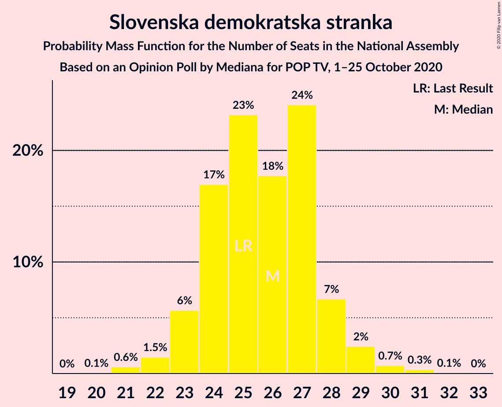

| Number of Seats | Probability | Accumulated | Special Marks |
|:---------------:|:-----------:|:-----------:|:-------------:|
| 20 | 0.1% | 100% |  |
| 21 | 0.6% | 99.9% |  |
| 22 | 1.5% | 99.4% |  |
| 23 | 6% | 98% |  |
| 24 | 17% | 92% |  |
| 25 | 23% | 75% | Last Result |
| 26 | 18% | 52% | Median |
| 27 | 24% | 34% |  |
| 28 | 7% | 10% |  |
| 29 | 2% | 4% |  |
| 30 | 0.7% | 1.1% |  |
| 31 | 0.3% | 0.4% |  |
| 32 | 0.1% | 0.1% |  |
| 33 | 0% | 0% |  |

### Socialni demokrati

*For a full overview of the results for this party, see the [Socialni demokrati](party-socialnidemokrati.html) page.*

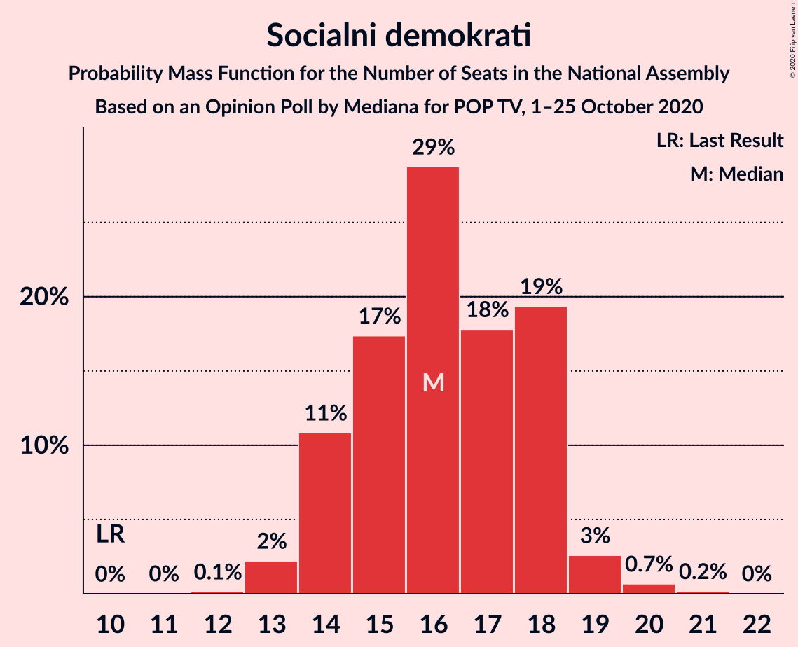

| Number of Seats | Probability | Accumulated | Special Marks |
|:---------------:|:-----------:|:-----------:|:-------------:|
| 10 | 0% | 100% | Last Result |
| 11 | 0% | 100% |  |
| 12 | 0.1% | 100% |  |
| 13 | 2% | 99.8% |  |
| 14 | 11% | 98% |  |
| 15 | 17% | 87% |  |
| 16 | 29% | 69% | Median |
| 17 | 18% | 41% |  |
| 18 | 19% | 23% |  |
| 19 | 3% | 3% |  |
| 20 | 0.7% | 0.9% |  |
| 21 | 0.2% | 0.2% |  |
| 22 | 0% | 0% |  |

### Lista Marjana Šarca

*For a full overview of the results for this party, see the [Lista Marjana Šarca](party-listamarjanašarca.html) page.*

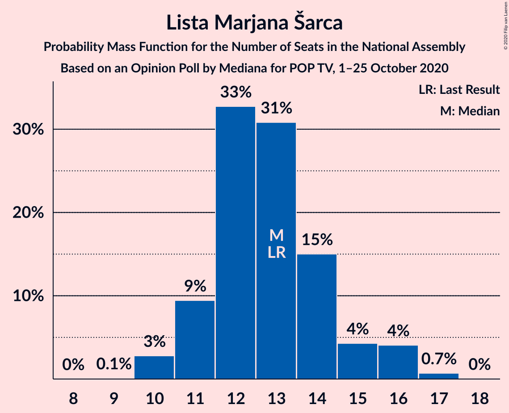

| Number of Seats | Probability | Accumulated | Special Marks |
|:---------------:|:-----------:|:-----------:|:-------------:|
| 9 | 0.1% | 100% |  |
| 10 | 3% | 99.9% |  |
| 11 | 9% | 97% |  |
| 12 | 33% | 88% |  |
| 13 | 31% | 55% | Last Result, Median |
| 14 | 15% | 24% |  |
| 15 | 4% | 9% |  |
| 16 | 4% | 5% |  |
| 17 | 0.7% | 0.7% |  |
| 18 | 0% | 0% |  |

### Levica

*For a full overview of the results for this party, see the [Levica](party-levica.html) page.*

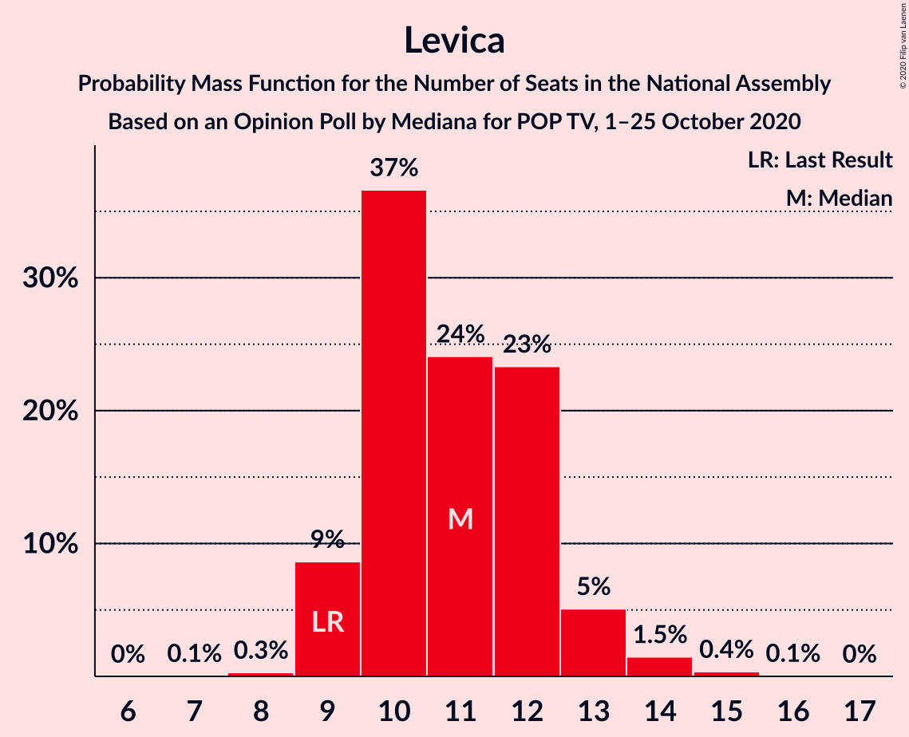

| Number of Seats | Probability | Accumulated | Special Marks |
|:---------------:|:-----------:|:-----------:|:-------------:|
| 7 | 0.1% | 100% |  |
| 8 | 0.3% | 99.9% |  |
| 9 | 9% | 99.7% | Last Result |
| 10 | 37% | 91% |  |
| 11 | 24% | 54% | Median |
| 12 | 23% | 30% |  |
| 13 | 5% | 7% |  |
| 14 | 1.5% | 2% |  |
| 15 | 0.4% | 0.4% |  |
| 16 | 0.1% | 0.1% |  |
| 17 | 0% | 0% |  |

### Nova Slovenija–Krščanski demokrati

*For a full overview of the results for this party, see the [Nova Slovenija–Krščanski demokrati](party-novaslovenija–krščanskidemokrati.html) page.*

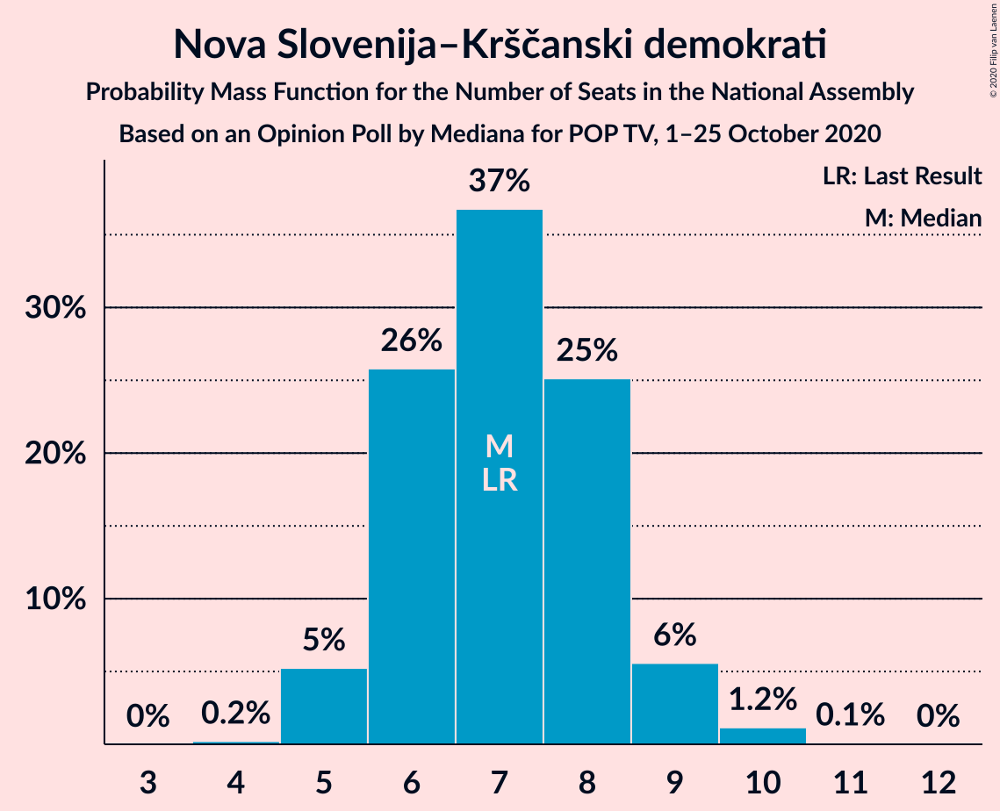

| Number of Seats | Probability | Accumulated | Special Marks |
|:---------------:|:-----------:|:-----------:|:-------------:|
| 4 | 0.2% | 100% |  |
| 5 | 5% | 99.8% |  |
| 6 | 26% | 95% |  |
| 7 | 37% | 69% | Last Result, Median |
| 8 | 25% | 32% |  |
| 9 | 6% | 7% |  |
| 10 | 1.2% | 1.3% |  |
| 11 | 0.1% | 0.1% |  |
| 12 | 0% | 0% |  |

### Slovenska nacionalna stranka

*For a full overview of the results for this party, see the [Slovenska nacionalna stranka](party-slovenskanacionalnastranka.html) page.*

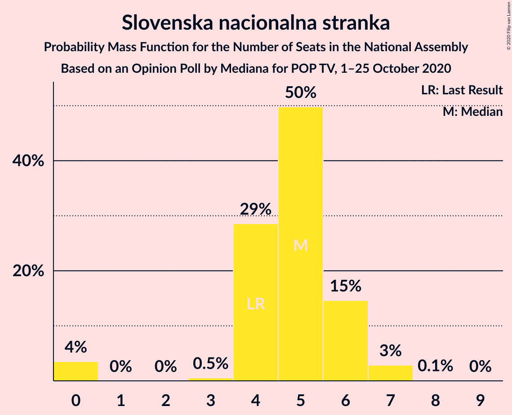

| Number of Seats | Probability | Accumulated | Special Marks |
|:---------------:|:-----------:|:-----------:|:-------------:|
| 0 | 4% | 100% |  |
| 1 | 0% | 96% |  |
| 2 | 0% | 96% |  |
| 3 | 0.5% | 96% |  |
| 4 | 29% | 96% | Last Result |
| 5 | 50% | 67% | Median |
| 6 | 15% | 18% |  |
| 7 | 3% | 3% |  |
| 8 | 0.1% | 0.1% |  |
| 9 | 0% | 0% |  |

### Stranka Alenke Bratušek

*For a full overview of the results for this party, see the [Stranka Alenke Bratušek](party-strankaalenkebratušek.html) page.*

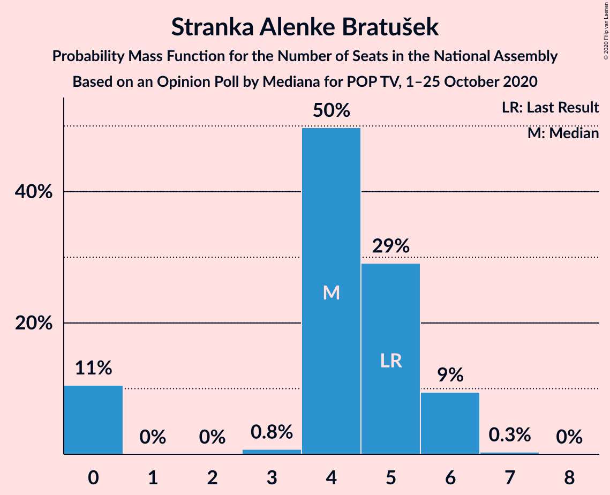

| Number of Seats | Probability | Accumulated | Special Marks |
|:---------------:|:-----------:|:-----------:|:-------------:|
| 0 | 11% | 100% |  |
| 1 | 0% | 89% |  |
| 2 | 0% | 89% |  |
| 3 | 0.8% | 89% |  |
| 4 | 50% | 89% | Median |
| 5 | 29% | 39% | Last Result |
| 6 | 9% | 10% |  |
| 7 | 0.3% | 0.4% |  |
| 8 | 0% | 0% |  |

### Demokratična stranka upokojencev Slovenije

*For a full overview of the results for this party, see the [Demokratična stranka upokojencev Slovenije](party-demokratičnastrankaupokojencevslovenije.html) page.*

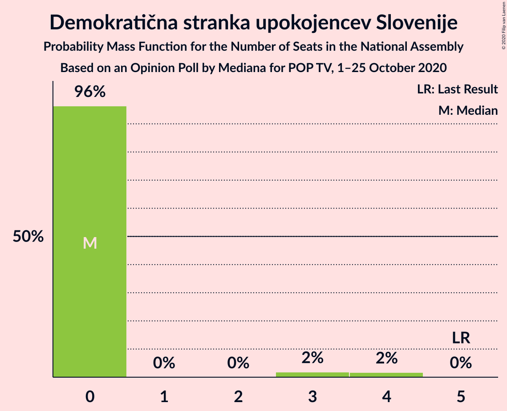

| Number of Seats | Probability | Accumulated | Special Marks |
|:---------------:|:-----------:|:-----------:|:-------------:|
| 0 | 96% | 100% | Median |
| 1 | 0% | 4% |  |
| 2 | 0% | 4% |  |
| 3 | 2% | 4% |  |
| 4 | 2% | 2% |  |
| 5 | 0% | 0% | Last Result |

### Stranka modernega centra

*For a full overview of the results for this party, see the [Stranka modernega centra](party-strankamodernegacentra.html) page.*

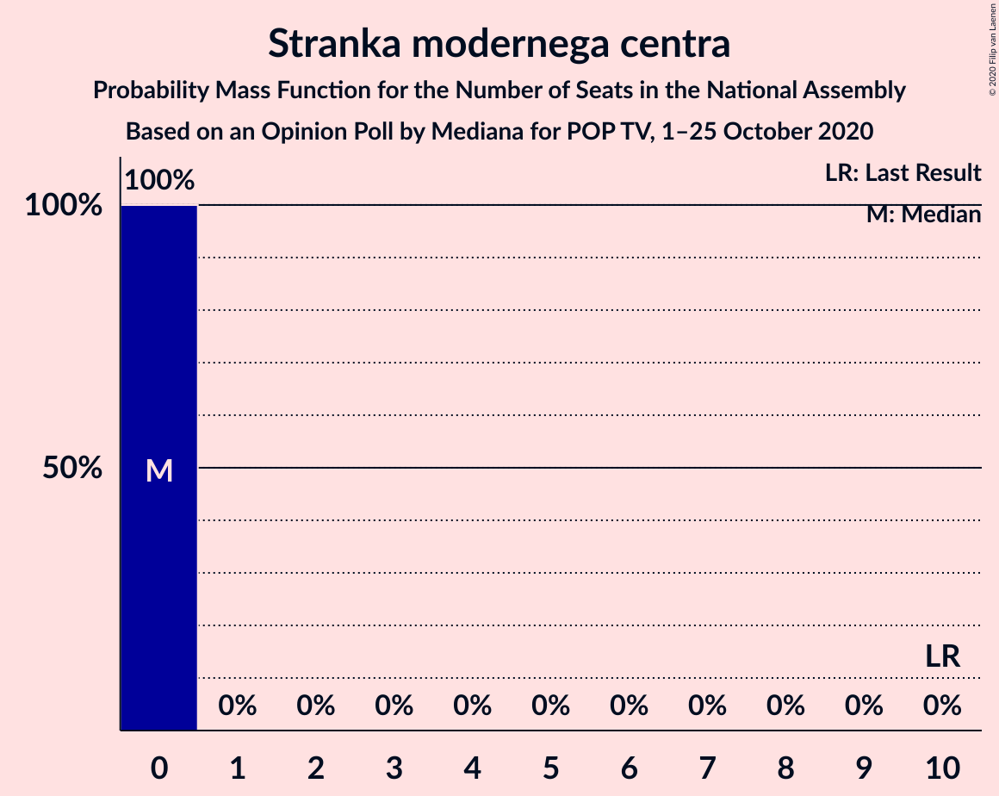

| Number of Seats | Probability | Accumulated | Special Marks |
|:---------------:|:-----------:|:-----------:|:-------------:|
| 0 | 100% | 100% | Median |
| 1 | 0% | 0% |  |
| 2 | 0% | 0% |  |
| 3 | 0% | 0% |  |
| 4 | 0% | 0% |  |
| 5 | 0% | 0% |  |
| 6 | 0% | 0% |  |
| 7 | 0% | 0% |  |
| 8 | 0% | 0% |  |
| 9 | 0% | 0% |  |
| 10 | 0% | 0% | Last Result |

### Slovenska ljudska stranka

*For a full overview of the results for this party, see the [Slovenska ljudska stranka](party-slovenskaljudskastranka.html) page.*

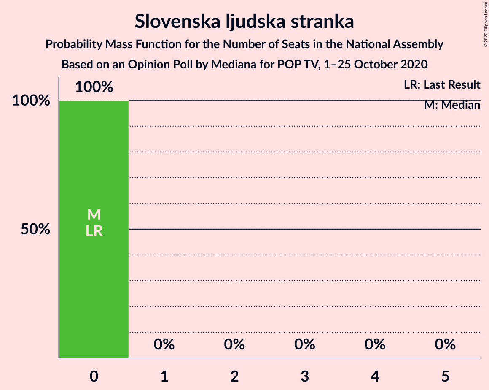

| Number of Seats | Probability | Accumulated | Special Marks |
|:---------------:|:-----------:|:-----------:|:-------------:|
| 0 | 100% | 100% | Last Result, Median |

## Coalitions

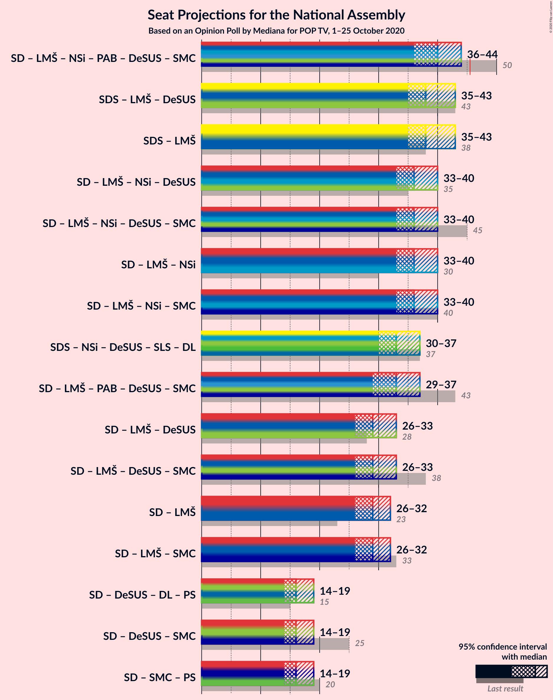

### Confidence Intervals

| Coalition | Last Result | Median | Majority? | 80% Confidence Interval | 90% Confidence Interval | 95% Confidence Interval | 99% Confidence Interval |
|:---------:|:-----------:|:------:|:---------:|:-----------------------:|:-----------------------:|:-----------------------:|:-----------------------:|
| Socialni demokrati – Lista Marjana Šarca – Nova Slovenija–Krščanski demokrati – Stranka Alenke Bratušek – Demokratična stranka upokojencev Slovenije – Stranka modernega centra | 50 | 40 | 0.3% | 38–42 | 37–43 | 36–44 | 34–45 |
| Slovenska demokratska stranka – Lista Marjana Šarca – Demokratična stranka upokojencev Slovenije | 43 | 38 | 0.1% | 36–42 | 36–43 | 35–43 | 34–44 |
| Slovenska demokratska stranka – Lista Marjana Šarca | 38 | 38 | 0.1% | 36–41 | 36–42 | 35–43 | 34–44 |
| Socialni demokrati – Lista Marjana Šarca – Nova Slovenija–Krščanski demokrati – Demokratična stranka upokojencev Slovenije | 35 | 36 | 0% | 33–39 | 33–39 | 33–40 | 31–41 |
| Socialni demokrati – Lista Marjana Šarca – Nova Slovenija–Krščanski demokrati – Demokratična stranka upokojencev Slovenije – Stranka modernega centra | 45 | 36 | 0% | 33–39 | 33–39 | 33–40 | 31–41 |
| Socialni demokrati – Lista Marjana Šarca – Nova Slovenija–Krščanski demokrati | 30 | 36 | 0% | 33–39 | 33–39 | 33–40 | 31–41 |
| Socialni demokrati – Lista Marjana Šarca – Nova Slovenija–Krščanski demokrati – Stranka modernega centra | 40 | 36 | 0% | 33–39 | 33–39 | 33–40 | 31–41 |
| Socialni demokrati – Lista Marjana Šarca – Stranka Alenke Bratušek – Demokratična stranka upokojencev Slovenije – Stranka modernega centra | 43 | 33 | 0% | 31–36 | 30–36 | 29–37 | 27–38 |
| Socialni demokrati – Lista Marjana Šarca – Demokratična stranka upokojencev Slovenije | 28 | 29 | 0% | 27–31 | 26–32 | 26–33 | 25–34 |
| Socialni demokrati – Lista Marjana Šarca – Demokratična stranka upokojencev Slovenije – Stranka modernega centra | 38 | 29 | 0% | 27–31 | 26–32 | 26–33 | 25–34 |
| Socialni demokrati – Lista Marjana Šarca | 23 | 29 | 0% | 27–31 | 26–32 | 26–32 | 25–34 |
| Socialni demokrati – Lista Marjana Šarca – Stranka modernega centra | 33 | 29 | 0% | 27–31 | 26–32 | 26–32 | 25–34 |
| Socialni demokrati – Demokratična stranka upokojencev Slovenije – Stranka modernega centra | 25 | 16 | 0% | 14–18 | 14–18 | 14–19 | 13–21 |

### Socialni demokrati – Lista Marjana Šarca – Nova Slovenija–Krščanski demokrati – Stranka Alenke Bratušek – Demokratična stranka upokojencev Slovenije – Stranka modernega centra

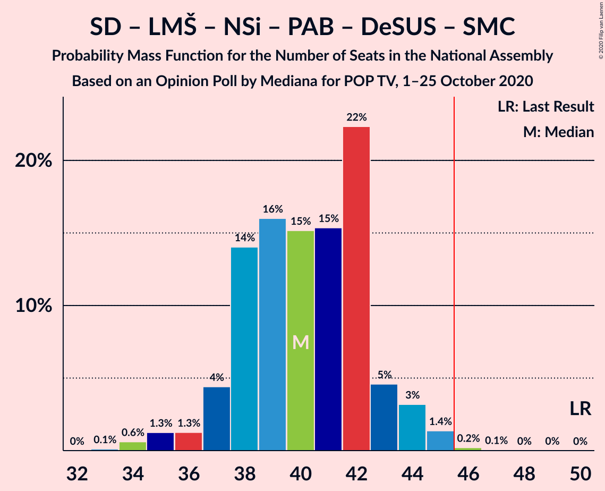

| Number of Seats | Probability | Accumulated | Special Marks |
|:---------------:|:-----------:|:-----------:|:-------------:|
| 33 | 0.1% | 100% |  |
| 34 | 0.6% | 99.9% |  |
| 35 | 1.3% | 99.3% |  |
| 36 | 1.3% | 98% |  |
| 37 | 4% | 97% |  |
| 38 | 14% | 92% |  |
| 39 | 16% | 78% |  |
| 40 | 15% | 62% | Median |
| 41 | 15% | 47% |  |
| 42 | 22% | 32% |  |
| 43 | 5% | 9% |  |
| 44 | 3% | 5% |  |
| 45 | 1.4% | 2% |  |
| 46 | 0.2% | 0.3% | Majority |
| 47 | 0.1% | 0.1% |  |
| 48 | 0% | 0% |  |
| 49 | 0% | 0% |  |
| 50 | 0% | 0% | Last Result |

### Slovenska demokratska stranka – Lista Marjana Šarca – Demokratična stranka upokojencev Slovenije

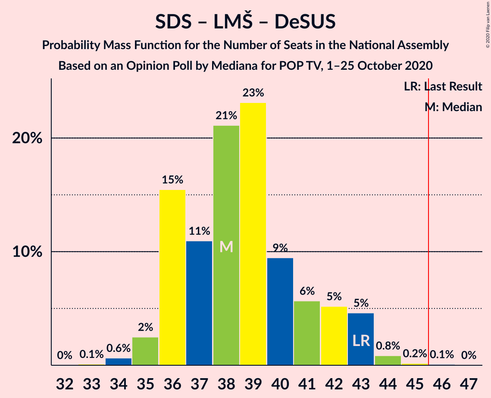

| Number of Seats | Probability | Accumulated | Special Marks |
|:---------------:|:-----------:|:-----------:|:-------------:|
| 33 | 0.1% | 100% |  |
| 34 | 0.6% | 99.9% |  |
| 35 | 2% | 99.2% |  |
| 36 | 15% | 97% |  |
| 37 | 11% | 81% |  |
| 38 | 21% | 70% |  |
| 39 | 23% | 49% | Median |
| 40 | 9% | 26% |  |
| 41 | 6% | 17% |  |
| 42 | 5% | 11% |  |
| 43 | 5% | 6% | Last Result |
| 44 | 0.8% | 1.1% |  |
| 45 | 0.2% | 0.3% |  |
| 46 | 0.1% | 0.1% | Majority |
| 47 | 0% | 0% |  |

### Slovenska demokratska stranka – Lista Marjana Šarca

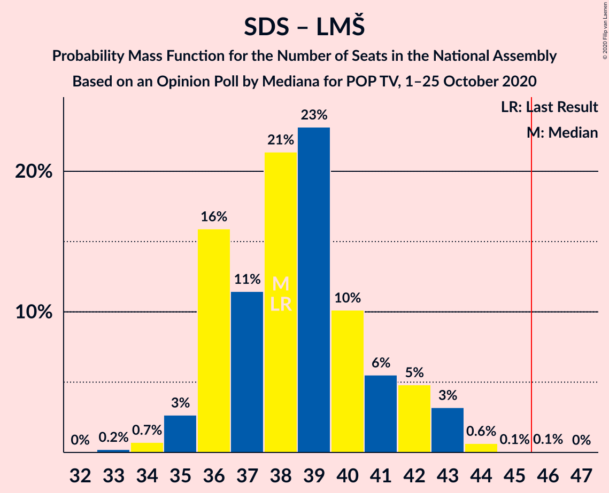

| Number of Seats | Probability | Accumulated | Special Marks |
|:---------------:|:-----------:|:-----------:|:-------------:|
| 33 | 0.2% | 100% |  |
| 34 | 0.7% | 99.8% |  |
| 35 | 3% | 99.0% |  |
| 36 | 16% | 96% |  |
| 37 | 11% | 80% |  |
| 38 | 21% | 69% | Last Result |
| 39 | 23% | 48% | Median |
| 40 | 10% | 24% |  |
| 41 | 6% | 14% |  |
| 42 | 5% | 9% |  |
| 43 | 3% | 4% |  |
| 44 | 0.6% | 0.8% |  |
| 45 | 0.1% | 0.2% |  |
| 46 | 0.1% | 0.1% | Majority |
| 47 | 0% | 0% |  |

### Socialni demokrati – Lista Marjana Šarca – Nova Slovenija–Krščanski demokrati – Demokratična stranka upokojencev Slovenije

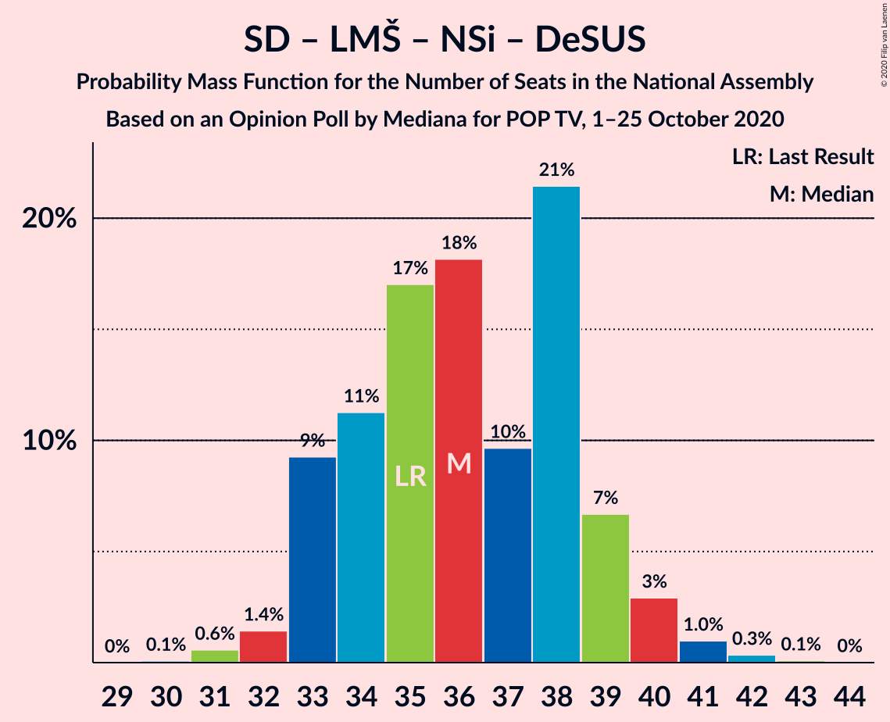

| Number of Seats | Probability | Accumulated | Special Marks |
|:---------------:|:-----------:|:-----------:|:-------------:|
| 30 | 0.1% | 100% |  |
| 31 | 0.6% | 99.9% |  |
| 32 | 1.4% | 99.3% |  |
| 33 | 9% | 98% |  |
| 34 | 11% | 89% |  |
| 35 | 17% | 77% | Last Result |
| 36 | 18% | 60% | Median |
| 37 | 10% | 42% |  |
| 38 | 21% | 33% |  |
| 39 | 7% | 11% |  |
| 40 | 3% | 4% |  |
| 41 | 1.0% | 1.5% |  |
| 42 | 0.3% | 0.5% |  |
| 43 | 0.1% | 0.1% |  |
| 44 | 0% | 0% |  |

### Socialni demokrati – Lista Marjana Šarca – Nova Slovenija–Krščanski demokrati – Demokratična stranka upokojencev Slovenije – Stranka modernega centra

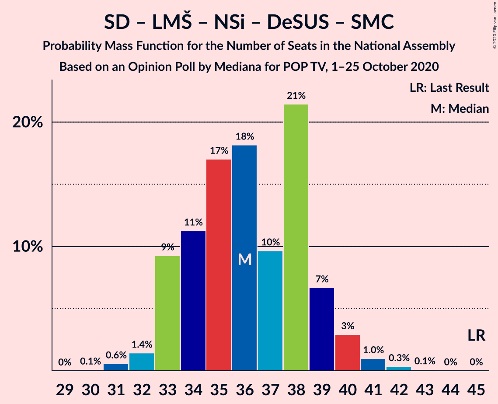

| Number of Seats | Probability | Accumulated | Special Marks |
|:---------------:|:-----------:|:-----------:|:-------------:|
| 30 | 0.1% | 100% |  |
| 31 | 0.6% | 99.9% |  |
| 32 | 1.4% | 99.3% |  |
| 33 | 9% | 98% |  |
| 34 | 11% | 89% |  |
| 35 | 17% | 77% |  |
| 36 | 18% | 60% | Median |
| 37 | 10% | 42% |  |
| 38 | 21% | 33% |  |
| 39 | 7% | 11% |  |
| 40 | 3% | 4% |  |
| 41 | 1.0% | 1.5% |  |
| 42 | 0.3% | 0.5% |  |
| 43 | 0.1% | 0.1% |  |
| 44 | 0% | 0% |  |
| 45 | 0% | 0% | Last Result |

### Socialni demokrati – Lista Marjana Šarca – Nova Slovenija–Krščanski demokrati

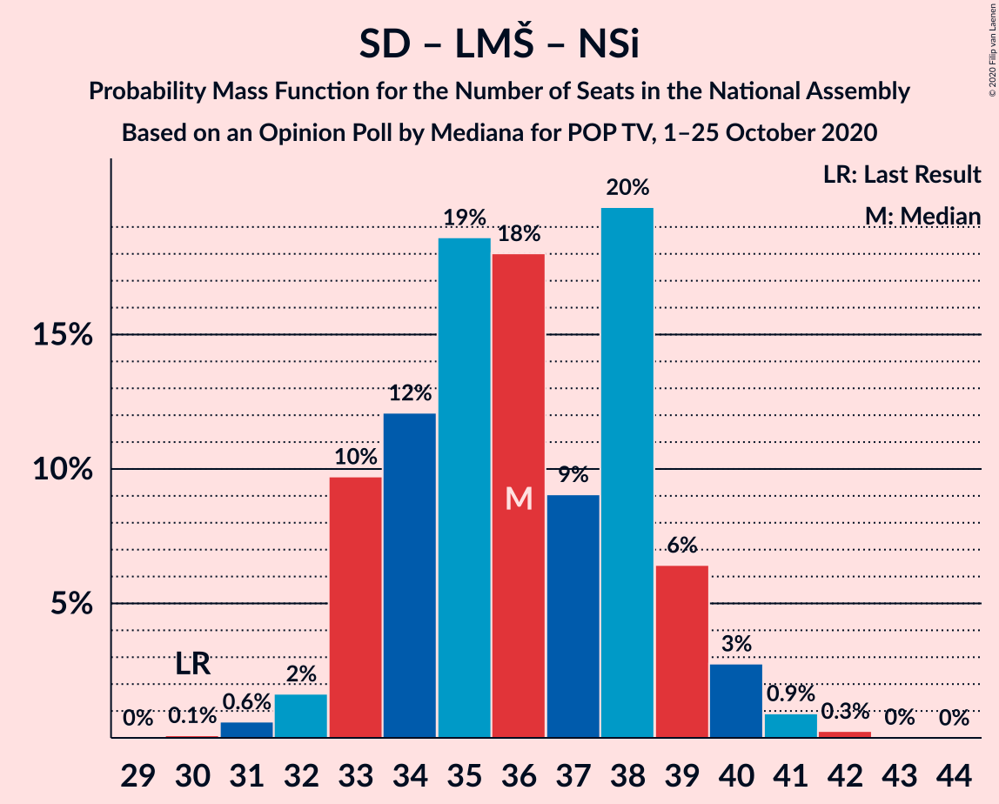

| Number of Seats | Probability | Accumulated | Special Marks |
|:---------------:|:-----------:|:-----------:|:-------------:|
| 30 | 0.1% | 100% | Last Result |
| 31 | 0.6% | 99.9% |  |
| 32 | 2% | 99.3% |  |
| 33 | 10% | 98% |  |
| 34 | 12% | 88% |  |
| 35 | 19% | 76% |  |
| 36 | 18% | 57% | Median |
| 37 | 9% | 39% |  |
| 38 | 20% | 30% |  |
| 39 | 6% | 10% |  |
| 40 | 3% | 4% |  |
| 41 | 0.9% | 1.2% |  |
| 42 | 0.3% | 0.3% |  |
| 43 | 0% | 0.1% |  |
| 44 | 0% | 0% |  |

### Socialni demokrati – Lista Marjana Šarca – Nova Slovenija–Krščanski demokrati – Stranka modernega centra

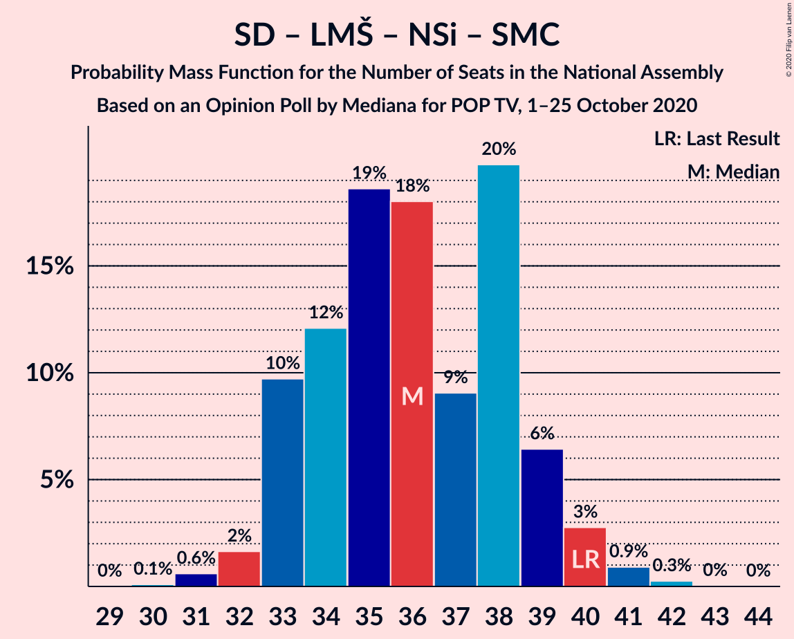

| Number of Seats | Probability | Accumulated | Special Marks |
|:---------------:|:-----------:|:-----------:|:-------------:|
| 30 | 0.1% | 100% |  |
| 31 | 0.6% | 99.9% |  |
| 32 | 2% | 99.3% |  |
| 33 | 10% | 98% |  |
| 34 | 12% | 88% |  |
| 35 | 19% | 76% |  |
| 36 | 18% | 57% | Median |
| 37 | 9% | 39% |  |
| 38 | 20% | 30% |  |
| 39 | 6% | 10% |  |
| 40 | 3% | 4% | Last Result |
| 41 | 0.9% | 1.2% |  |
| 42 | 0.3% | 0.3% |  |
| 43 | 0% | 0.1% |  |
| 44 | 0% | 0% |  |

### Socialni demokrati – Lista Marjana Šarca – Stranka Alenke Bratušek – Demokratična stranka upokojencev Slovenije – Stranka modernega centra

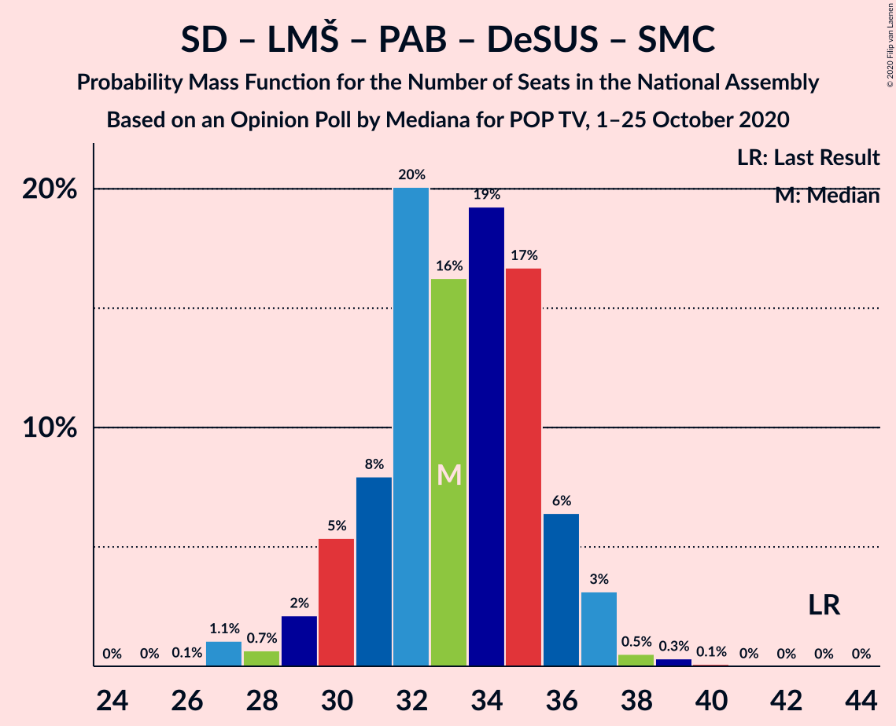

| Number of Seats | Probability | Accumulated | Special Marks |
|:---------------:|:-----------:|:-----------:|:-------------:|
| 26 | 0.1% | 100% |  |
| 27 | 1.1% | 99.9% |  |
| 28 | 0.7% | 98.9% |  |
| 29 | 2% | 98% |  |
| 30 | 5% | 96% |  |
| 31 | 8% | 91% |  |
| 32 | 20% | 83% |  |
| 33 | 16% | 63% | Median |
| 34 | 19% | 46% |  |
| 35 | 17% | 27% |  |
| 36 | 6% | 10% |  |
| 37 | 3% | 4% |  |
| 38 | 0.5% | 0.9% |  |
| 39 | 0.3% | 0.4% |  |
| 40 | 0.1% | 0.1% |  |
| 41 | 0% | 0% |  |
| 42 | 0% | 0% |  |
| 43 | 0% | 0% | Last Result |

### Socialni demokrati – Lista Marjana Šarca – Demokratična stranka upokojencev Slovenije

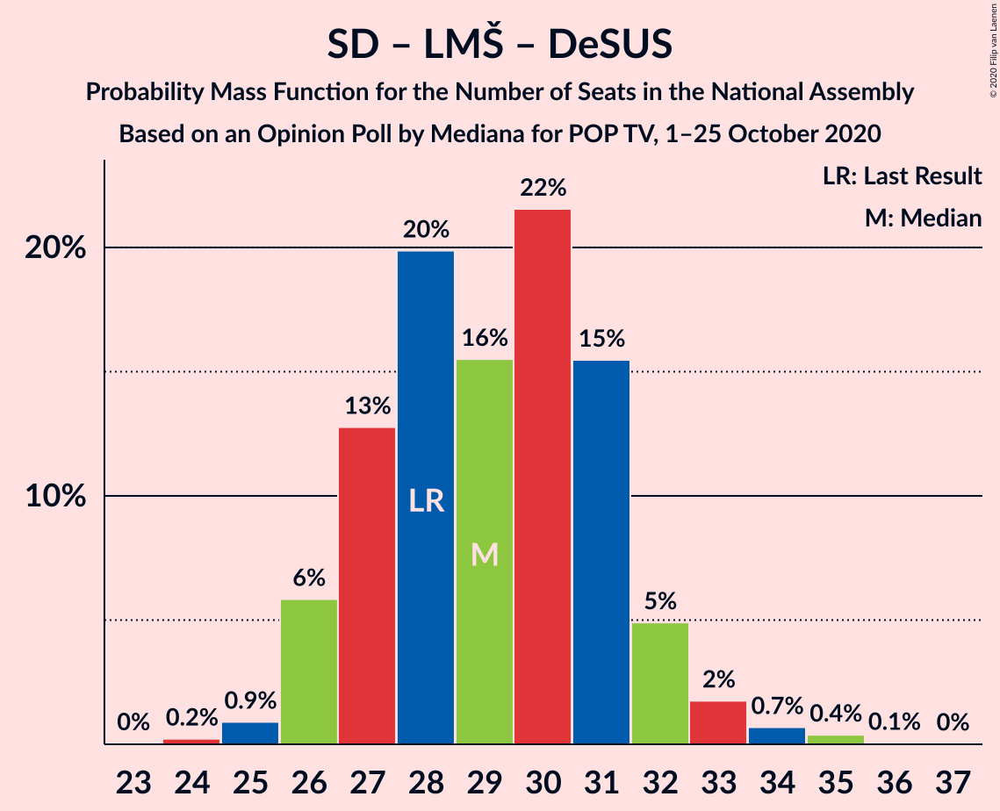

| Number of Seats | Probability | Accumulated | Special Marks |
|:---------------:|:-----------:|:-----------:|:-------------:|
| 24 | 0.2% | 100% |  |
| 25 | 0.9% | 99.7% |  |
| 26 | 6% | 98.8% |  |
| 27 | 13% | 93% |  |
| 28 | 20% | 80% | Last Result |
| 29 | 16% | 60% | Median |
| 30 | 22% | 45% |  |
| 31 | 15% | 23% |  |
| 32 | 5% | 8% |  |
| 33 | 2% | 3% |  |
| 34 | 0.7% | 1.2% |  |
| 35 | 0.4% | 0.5% |  |
| 36 | 0.1% | 0.1% |  |
| 37 | 0% | 0% |  |

### Socialni demokrati – Lista Marjana Šarca – Demokratična stranka upokojencev Slovenije – Stranka modernega centra

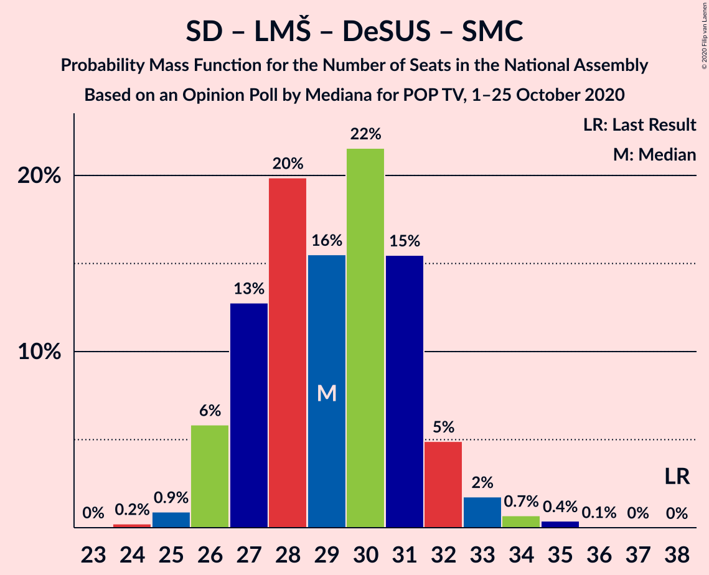

| Number of Seats | Probability | Accumulated | Special Marks |
|:---------------:|:-----------:|:-----------:|:-------------:|
| 24 | 0.2% | 100% |  |
| 25 | 0.9% | 99.7% |  |
| 26 | 6% | 98.8% |  |
| 27 | 13% | 93% |  |
| 28 | 20% | 80% |  |
| 29 | 16% | 60% | Median |
| 30 | 22% | 45% |  |
| 31 | 15% | 23% |  |
| 32 | 5% | 8% |  |
| 33 | 2% | 3% |  |
| 34 | 0.7% | 1.2% |  |
| 35 | 0.4% | 0.5% |  |
| 36 | 0.1% | 0.1% |  |
| 37 | 0% | 0% |  |
| 38 | 0% | 0% | Last Result |

### Socialni demokrati – Lista Marjana Šarca

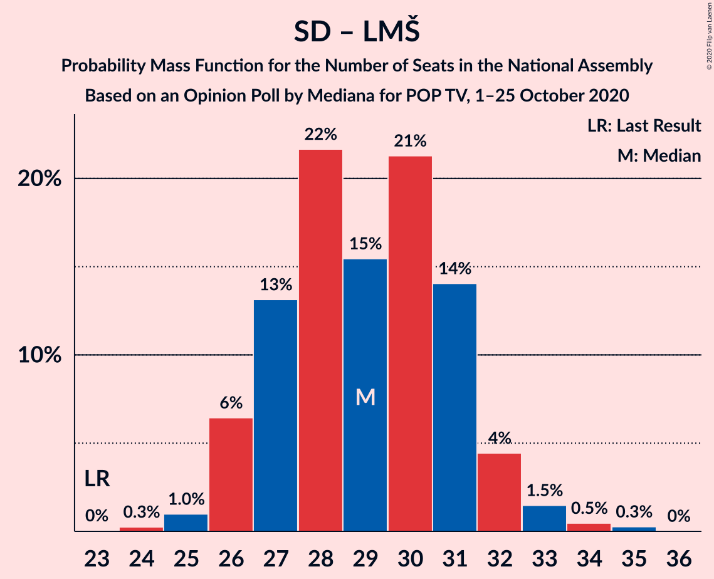

| Number of Seats | Probability | Accumulated | Special Marks |
|:---------------:|:-----------:|:-----------:|:-------------:|
| 23 | 0% | 100% | Last Result |
| 24 | 0.3% | 100% |  |
| 25 | 1.0% | 99.7% |  |
| 26 | 6% | 98.7% |  |
| 27 | 13% | 92% |  |
| 28 | 22% | 79% |  |
| 29 | 15% | 57% | Median |
| 30 | 21% | 42% |  |
| 31 | 14% | 21% |  |
| 32 | 4% | 7% |  |
| 33 | 1.5% | 2% |  |
| 34 | 0.5% | 0.8% |  |
| 35 | 0.3% | 0.3% |  |
| 36 | 0% | 0% |  |

### Socialni demokrati – Lista Marjana Šarca – Stranka modernega centra

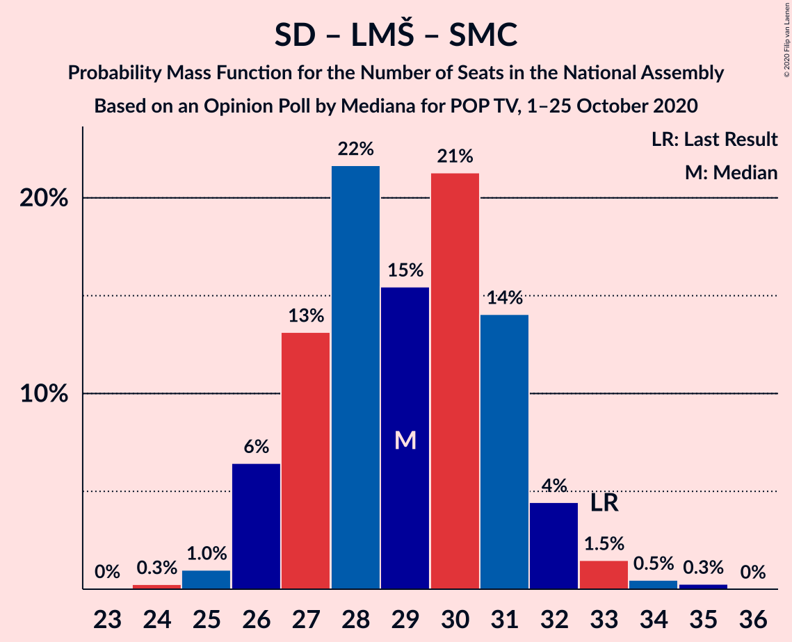

| Number of Seats | Probability | Accumulated | Special Marks |
|:---------------:|:-----------:|:-----------:|:-------------:|
| 24 | 0.3% | 100% |  |
| 25 | 1.0% | 99.7% |  |
| 26 | 6% | 98.7% |  |
| 27 | 13% | 92% |  |
| 28 | 22% | 79% |  |
| 29 | 15% | 57% | Median |
| 30 | 21% | 42% |  |
| 31 | 14% | 21% |  |
| 32 | 4% | 7% |  |
| 33 | 1.5% | 2% | Last Result |
| 34 | 0.5% | 0.8% |  |
| 35 | 0.3% | 0.3% |  |
| 36 | 0% | 0% |  |

### Socialni demokrati – Demokratična stranka upokojencev Slovenije – Stranka modernega centra

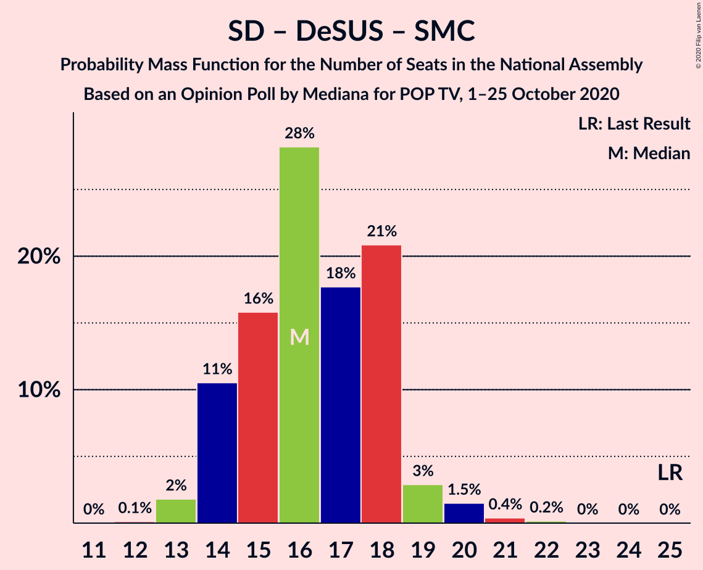

| Number of Seats | Probability | Accumulated | Special Marks |
|:---------------:|:-----------:|:-----------:|:-------------:|
| 12 | 0.1% | 100% |  |
| 13 | 2% | 99.9% |  |
| 14 | 11% | 98% |  |
| 15 | 16% | 88% |  |
| 16 | 28% | 72% | Median |
| 17 | 18% | 44% |  |
| 18 | 21% | 26% |  |
| 19 | 3% | 5% |  |
| 20 | 1.5% | 2% |  |
| 21 | 0.4% | 0.6% |  |
| 22 | 0.2% | 0.2% |  |
| 23 | 0% | 0% |  |
| 24 | 0% | 0% |  |
| 25 | 0% | 0% | Last Result |

## Technical Information

### Opinion Poll

+ **Polling firm:** Mediana
+ **Commissioner(s):** POP TV
+ **Fieldwork period:** 1–25 October 2020

### Calculations

+ **Sample size:** 714
+ **Simulations done:** 1,048,576
+ **Error estimate:** 2.67%

