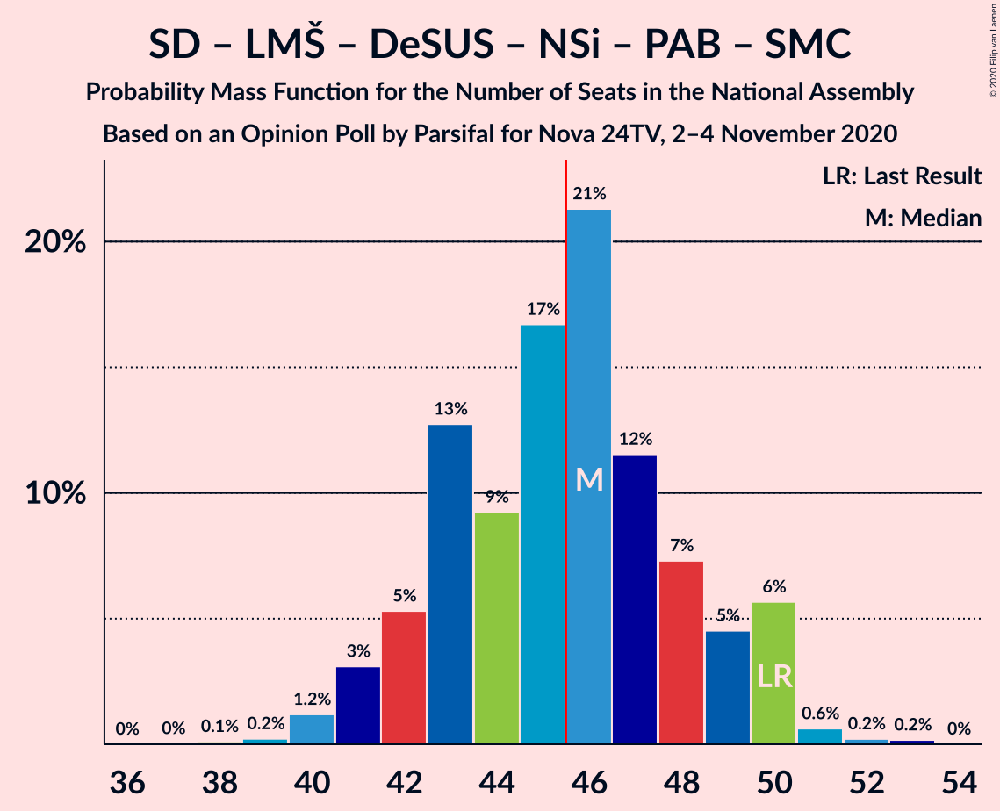
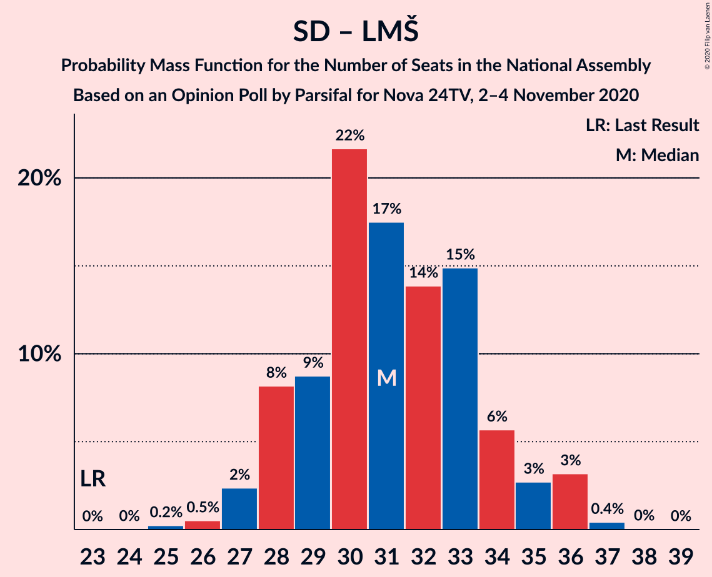

# Opinion Poll by Parsifal for Nova 24TV, 2–4 November 2020

<a href="#voting-intentions">Voting Intentions</a> | <a href="#seats">Seats</a> | <a href="#coalitions">Coalitions</a> | <a href="#technical-information">Technical Information</a>

## Voting Intentions

### Confidence Intervals

| Party | Last Result | Poll Result | 80% Confidence Interval | 90% Confidence Interval | 95% Confidence Interval | 99% Confidence Interval |
|:-----:|:-----------:|:-----------:|:-----------------------:|:-----------------------:|:-----------------------:|:-----------------------:|
| Slovenska demokratska stranka | 24.9% | 32.4% | 30.2–34.7% |29.6–35.4% |29.0–35.9% |28.0–37.1% |
| Socialni demokrati | 9.9% | 16.9% | 15.2–18.8% |14.7–19.4% |14.3–19.9% |13.5–20.8% |
| Lista Marjana Šarca | 12.6% | 15.3% | 13.7–17.2% |13.3–17.7% |12.9–18.2% |12.1–19.1% |
| Levica | 9.3% | 8.9% | 7.7–10.5% |7.3–10.9% |7.1–11.3% |6.5–12.1% |
| Demokratična stranka upokojencev Slovenije | 4.9% | 7.1% | 6.0–8.5% |5.7–8.9% |5.4–9.3% |4.9–10.0% |
| Nova Slovenija–Krščanski demokrati | 7.2% | 6.4% | 5.3–7.7% |5.1–8.1% |4.8–8.5% |4.4–9.1% |
| Stranka Alenke Bratušek | 5.1% | 3.6% | 2.8–4.6% |2.6–4.9% |2.4–5.2% |2.1–5.8% |
| Slovenska nacionalna stranka | 4.2% | 3.0% | 2.3–4.0% |2.1–4.3% |2.0–4.5% |1.7–5.0% |
| Slovenska ljudska stranka | 2.6% | 1.6% | 1.1–2.3% |1.0–2.6% |0.9–2.8% |0.7–3.2% |
| Stranka modernega centra | 9.7% | 0.9% | 0.5–1.5% |0.5–1.7% |0.4–1.8% |0.3–2.2% |

*Note:* The poll result column reflects the actual value used in the calculations. Published results may vary slightly, and in addition be rounded to fewer digits.

## Seats

### Confidence Intervals

| Party | Last Result | Median | 80% Confidence Interval | 90% Confidence Interval | 95% Confidence Interval | 99% Confidence Interval |
|:-----:|:-----------:|:------:|:-----------------------:|:-----------------------:|:-----------------------:|:-----------------------:|
| <a href="#slovenska-demokratska-stranka">Slovenska demokratska stranka</a> | 25 | 31 | 29–34 |28–35 |28–35 |27–37 |
| <a href="#socialni-demokrati">Socialni demokrati</a> | 10 | 16 | 14–18 |14–19 |14–19 |13–21 |
| <a href="#lista-marjana-šarca">Lista Marjana Šarca</a> | 13 | 15 | 13–17 |12–17 |12–18 |11–19 |
| <a href="#levica">Levica</a> | 9 | 8 | 7–10 |7–10 |6–11 |6–12 |
| <a href="#demokratična-stranka-upokojencev-slovenije">Demokratična stranka upokojencev Slovenije</a> | 5 | 7 | 6–8 |5–8 |5–9 |4–10 |
| <a href="#nova-slovenija–krščanski-demokrati">Nova Slovenija–Krščanski demokrati</a> | 7 | 6 | 5–7 |4–8 |4–8 |4–9 |
| <a href="#stranka-alenke-bratušek">Stranka Alenke Bratušek</a> | 5 | 0 | 0–4 |0–4 |0–4 |0–5 |
| <a href="#slovenska-nacionalna-stranka">Slovenska nacionalna stranka</a> | 4 | 0 | 0 |0–4 |0–4 |0–4 |
| <a href="#slovenska-ljudska-stranka">Slovenska ljudska stranka</a> | 0 | 0 | 0 |0 |0 |0 |
| <a href="#stranka-modernega-centra">Stranka modernega centra</a> | 10 | 0 | 0 |0 |0 |0 |

### Slovenska demokratska stranka

*For a full overview of the results for this party, see the [Slovenska demokratska stranka](party-slovenskademokratskastranka.html) page.*

| Number of Seats | Probability | Accumulated | Special Marks |
|:---------------:|:-----------:|:-----------:|:-------------:|
| 25 | 0% | 100% | Last Result |
| 26 | 0.2% | 100% |  |
| 27 | 2% | 99.7% |  |
| 28 | 5% | 98% |  |
| 29 | 6% | 93% |  |
| 30 | 20% | 86% |  |
| 31 | 22% | 66% | Median |
| 32 | 15% | 44% |  |
| 33 | 15% | 30% |  |
| 34 | 6% | 15% |  |
| 35 | 6% | 8% |  |
| 36 | 2% | 2% |  |
| 37 | 0.5% | 0.8% |  |
| 38 | 0.2% | 0.3% |  |
| 39 | 0% | 0% |  |

### Socialni demokrati

*For a full overview of the results for this party, see the [Socialni demokrati](party-socialnidemokrati.html) page.*

| Number of Seats | Probability | Accumulated | Special Marks |
|:---------------:|:-----------:|:-----------:|:-------------:|
| 10 | 0% | 100% | Last Result |
| 11 | 0% | 100% |  |
| 12 | 0.3% | 100% |  |
| 13 | 2% | 99.7% |  |
| 14 | 12% | 98% |  |
| 15 | 22% | 86% |  |
| 16 | 16% | 64% | Median |
| 17 | 25% | 48% |  |
| 18 | 16% | 23% |  |
| 19 | 5% | 7% |  |
| 20 | 2% | 2% |  |
| 21 | 0.4% | 0.5% |  |
| 22 | 0.1% | 0.1% |  |
| 23 | 0% | 0% |  |

### Lista Marjana Šarca

*For a full overview of the results for this party, see the [Lista Marjana Šarca](party-listamarjanašarca.html) page.*

| Number of Seats | Probability | Accumulated | Special Marks |
|:---------------:|:-----------:|:-----------:|:-------------:|
| 11 | 0.8% | 100% |  |
| 12 | 5% | 99.1% |  |
| 13 | 13% | 94% | Last Result |
| 14 | 23% | 81% |  |
| 15 | 26% | 58% | Median |
| 16 | 16% | 32% |  |
| 17 | 11% | 15% |  |
| 18 | 2% | 4% |  |
| 19 | 2% | 2% |  |
| 20 | 0.2% | 0.3% |  |
| 21 | 0% | 0% |  |

### Levica

*For a full overview of the results for this party, see the [Levica](party-levica.html) page.*

| Number of Seats | Probability | Accumulated | Special Marks |
|:---------------:|:-----------:|:-----------:|:-------------:|
| 5 | 0.2% | 100% |  |
| 6 | 4% | 99.8% |  |
| 7 | 18% | 96% |  |
| 8 | 30% | 78% | Median |
| 9 | 31% | 49% | Last Result |
| 10 | 13% | 17% |  |
| 11 | 3% | 4% |  |
| 12 | 0.5% | 0.6% |  |
| 13 | 0.1% | 0.1% |  |
| 14 | 0% | 0% |  |

### Demokratična stranka upokojencev Slovenije

*For a full overview of the results for this party, see the [Demokratična stranka upokojencev Slovenije](party-demokratičnastrankaupokojencevslovenije.html) page.*

| Number of Seats | Probability | Accumulated | Special Marks |
|:---------------:|:-----------:|:-----------:|:-------------:|
| 4 | 1.2% | 100% |  |
| 5 | 8% | 98.8% | Last Result |
| 6 | 36% | 90% |  |
| 7 | 35% | 55% | Median |
| 8 | 15% | 20% |  |
| 9 | 4% | 5% |  |
| 10 | 1.1% | 1.2% |  |
| 11 | 0% | 0% |  |

### Nova Slovenija–Krščanski demokrati

*For a full overview of the results for this party, see the [Nova Slovenija–Krščanski demokrati](party-novaslovenija–krščanskidemokrati.html) page.*

| Number of Seats | Probability | Accumulated | Special Marks |
|:---------------:|:-----------:|:-----------:|:-------------:|
| 0 | 0.1% | 100% |  |
| 1 | 0% | 99.9% |  |
| 2 | 0% | 99.9% |  |
| 3 | 0% | 99.9% |  |
| 4 | 5% | 99.8% |  |
| 5 | 26% | 94% |  |
| 6 | 40% | 68% | Median |
| 7 | 22% | 28% | Last Result |
| 8 | 5% | 5% |  |
| 9 | 0.7% | 0.8% |  |
| 10 | 0.1% | 0.1% |  |
| 11 | 0% | 0% |  |

### Stranka Alenke Bratušek

*For a full overview of the results for this party, see the [Stranka Alenke Bratušek](party-strankaalenkebratušek.html) page.*

| Number of Seats | Probability | Accumulated | Special Marks |
|:---------------:|:-----------:|:-----------:|:-------------:|
| 0 | 57% | 100% | Median |
| 1 | 0% | 43% |  |
| 2 | 0% | 43% |  |
| 3 | 4% | 43% |  |
| 4 | 37% | 39% |  |
| 5 | 2% | 2% | Last Result |
| 6 | 0.2% | 0.3% |  |
| 7 | 0% | 0% |  |

### Slovenska nacionalna stranka

*For a full overview of the results for this party, see the [Slovenska nacionalna stranka](party-slovenskanacionalnastranka.html) page.*

| Number of Seats | Probability | Accumulated | Special Marks |
|:---------------:|:-----------:|:-----------:|:-------------:|
| 0 | 91% | 100% | Median |
| 1 | 0% | 9% |  |
| 2 | 0% | 9% |  |
| 3 | 1.3% | 9% |  |
| 4 | 7% | 8% | Last Result |
| 5 | 0.4% | 0.4% |  |
| 6 | 0% | 0% |  |

### Slovenska ljudska stranka

*For a full overview of the results for this party, see the [Slovenska ljudska stranka](party-slovenskaljudskastranka.html) page.*

| Number of Seats | Probability | Accumulated | Special Marks |
|:---------------:|:-----------:|:-----------:|:-------------:|
| 0 | 100% | 100% | Last Result, Median |

### Stranka modernega centra

*For a full overview of the results for this party, see the [Stranka modernega centra](party-strankamodernegacentra.html) page.*

| Number of Seats | Probability | Accumulated | Special Marks |
|:---------------:|:-----------:|:-----------:|:-------------:|
| 0 | 100% | 100% | Median |
| 1 | 0% | 0% |  |
| 2 | 0% | 0% |  |
| 3 | 0% | 0% |  |
| 4 | 0% | 0% |  |
| 5 | 0% | 0% |  |
| 6 | 0% | 0% |  |
| 7 | 0% | 0% |  |
| 8 | 0% | 0% |  |
| 9 | 0% | 0% |  |
| 10 | 0% | 0% | Last Result |

## Coalitions

### Confidence Intervals

| Coalition | Last Result | Median | Majority? | 80% Confidence Interval | 90% Confidence Interval | 95% Confidence Interval | 99% Confidence Interval |
|:---------:|:-----------:|:------:|:---------:|:-----------------------:|:-----------------------:|:-----------------------:|:-----------------------:|
| Slovenska demokratska stranka – Lista Marjana Šarca – Demokratična stranka upokojencev Slovenije | 43 | 53 | 99.8% | 50–56 | 49–57 | 48–58 | 47–60 |
| Slovenska demokratska stranka – Lista Marjana Šarca | 38 | 46 | 61% | 43–49 | 42–50 | 42–51 | 41–53 |
| Socialni demokrati – Lista Marjana Šarca – Demokratična stranka upokojencev Slovenije – Nova Slovenija–Krščanski demokrati – Stranka Alenke Bratušek – Stranka modernega centra | 50 | 46 | 51% | 43–49 | 42–50 | 41–50 | 40–51 |
| Socialni demokrati – Lista Marjana Šarca – Demokratična stranka upokojencev Slovenije – Nova Slovenija–Krščanski demokrati | 35 | 43 | 24% | 41–47 | 40–48 | 40–49 | 38–50 |
| Socialni demokrati – Lista Marjana Šarca – Demokratična stranka upokojencev Slovenije – Nova Slovenija–Krščanski demokrati – Stranka modernega centra | 45 | 43 | 24% | 41–47 | 40–48 | 40–49 | 38–50 |
| Socialni demokrati – Lista Marjana Šarca – Demokratična stranka upokojencev Slovenije – Stranka Alenke Bratušek – Stranka modernega centra | 43 | 40 | 0.4% | 36–43 | 36–44 | 35–44 | 34–45 |
| Socialni demokrati – Lista Marjana Šarca – Demokratična stranka upokojencev Slovenije | 28 | 38 | 0% | 35–41 | 34–42 | 34–43 | 32–44 |
| Socialni demokrati – Lista Marjana Šarca – Demokratična stranka upokojencev Slovenije – Stranka modernega centra | 38 | 38 | 0% | 35–41 | 34–42 | 34–43 | 32–44 |
| Socialni demokrati – Lista Marjana Šarca – Nova Slovenija–Krščanski demokrati | 30 | 37 | 0% | 35–40 | 34–41 | 33–42 | 32–43 |
| Socialni demokrati – Lista Marjana Šarca – Nova Slovenija–Krščanski demokrati – Stranka modernega centra | 40 | 37 | 0% | 35–40 | 34–41 | 33–42 | 32–43 |
| Socialni demokrati – Lista Marjana Šarca | 23 | 31 | 0% | 28–34 | 28–35 | 27–36 | 26–36 |
| Socialni demokrati – Lista Marjana Šarca – Stranka modernega centra | 33 | 31 | 0% | 28–34 | 28–35 | 27–36 | 26–36 |
| Socialni demokrati – Demokratična stranka upokojencev Slovenije – Stranka modernega centra | 25 | 23 | 0% | 21–25 | 20–26 | 20–27 | 19–28 |

### Slovenska demokratska stranka – Lista Marjana Šarca – Demokratična stranka upokojencev Slovenije

| Number of Seats | Probability | Accumulated | Special Marks |
|:---------------:|:-----------:|:-----------:|:-------------:|
| 43 | 0% | 100% | Last Result |
| 44 | 0% | 100% |  |
| 45 | 0.2% | 100% |  |
| 46 | 0.1% | 99.8% | Majority |
| 47 | 0.5% | 99.7% |  |
| 48 | 4% | 99.2% |  |
| 49 | 4% | 96% |  |
| 50 | 6% | 91% |  |
| 51 | 12% | 85% |  |
| 52 | 17% | 73% |  |
| 53 | 9% | 56% | Median |
| 54 | 25% | 48% |  |
| 55 | 9% | 23% |  |
| 56 | 5% | 14% |  |
| 57 | 5% | 9% |  |
| 58 | 3% | 4% |  |
| 59 | 0.2% | 0.9% |  |
| 60 | 0.5% | 0.7% |  |
| 61 | 0.1% | 0.1% |  |
| 62 | 0% | 0% |  |

### Slovenska demokratska stranka – Lista Marjana Šarca

| Number of Seats | Probability | Accumulated | Special Marks |
|:---------------:|:-----------:|:-----------:|:-------------:|
| 38 | 0% | 100% | Last Result |
| 39 | 0.2% | 100% |  |
| 40 | 0.2% | 99.8% |  |
| 41 | 1.3% | 99.5% |  |
| 42 | 4% | 98% |  |
| 43 | 6% | 94% |  |
| 44 | 10% | 88% |  |
| 45 | 17% | 79% |  |
| 46 | 13% | 61% | Median, Majority |
| 47 | 15% | 48% |  |
| 48 | 20% | 33% |  |
| 49 | 5% | 13% |  |
| 50 | 5% | 9% |  |
| 51 | 3% | 4% |  |
| 52 | 0.7% | 1.3% |  |
| 53 | 0.4% | 0.6% |  |
| 54 | 0.2% | 0.2% |  |
| 55 | 0% | 0% |  |

### Socialni demokrati – Lista Marjana Šarca – Demokratična stranka upokojencev Slovenije – Nova Slovenija–Krščanski demokrati – Stranka Alenke Bratušek – Stranka modernega centra

| Number of Seats | Probability | Accumulated | Special Marks |
|:---------------:|:-----------:|:-----------:|:-------------:|
| 38 | 0.1% | 100% |  |
| 39 | 0.2% | 99.9% |  |
| 40 | 1.2% | 99.6% |  |
| 41 | 3% | 98% |  |
| 42 | 5% | 95% |  |
| 43 | 13% | 90% |  |
| 44 | 9% | 77% | Median |
| 45 | 17% | 68% |  |
| 46 | 21% | 51% | Majority |
| 47 | 12% | 30% |  |
| 48 | 7% | 19% |  |
| 49 | 5% | 11% |  |
| 50 | 6% | 7% | Last Result |
| 51 | 0.6% | 1.0% |  |
| 52 | 0.2% | 0.4% |  |
| 53 | 0.2% | 0.2% |  |
| 54 | 0% | 0% |  |

### Socialni demokrati – Lista Marjana Šarca – Demokratična stranka upokojencev Slovenije – Nova Slovenija–Krščanski demokrati

| Number of Seats | Probability | Accumulated | Special Marks |
|:---------------:|:-----------:|:-----------:|:-------------:|
| 35 | 0% | 100% | Last Result |
| 36 | 0.1% | 100% |  |
| 37 | 0.3% | 99.9% |  |
| 38 | 0.5% | 99.6% |  |
| 39 | 2% | 99.1% |  |
| 40 | 4% | 98% |  |
| 41 | 9% | 94% |  |
| 42 | 19% | 85% |  |
| 43 | 17% | 67% |  |
| 44 | 12% | 50% | Median |
| 45 | 14% | 38% |  |
| 46 | 12% | 24% | Majority |
| 47 | 5% | 12% |  |
| 48 | 3% | 7% |  |
| 49 | 2% | 3% |  |
| 50 | 2% | 2% |  |
| 51 | 0.1% | 0.1% |  |
| 52 | 0% | 0% |  |

### Socialni demokrati – Lista Marjana Šarca – Demokratična stranka upokojencev Slovenije – Nova Slovenija–Krščanski demokrati – Stranka modernega centra

| Number of Seats | Probability | Accumulated | Special Marks |
|:---------------:|:-----------:|:-----------:|:-------------:|
| 36 | 0.1% | 100% |  |
| 37 | 0.3% | 99.9% |  |
| 38 | 0.5% | 99.6% |  |
| 39 | 2% | 99.1% |  |
| 40 | 4% | 98% |  |
| 41 | 9% | 94% |  |
| 42 | 19% | 85% |  |
| 43 | 17% | 67% |  |
| 44 | 12% | 50% | Median |
| 45 | 14% | 38% | Last Result |
| 46 | 12% | 24% | Majority |
| 47 | 5% | 12% |  |
| 48 | 3% | 7% |  |
| 49 | 2% | 3% |  |
| 50 | 2% | 2% |  |
| 51 | 0.1% | 0.1% |  |
| 52 | 0% | 0% |  |

### Socialni demokrati – Lista Marjana Šarca – Demokratična stranka upokojencev Slovenije – Stranka Alenke Bratušek – Stranka modernega centra

| Number of Seats | Probability | Accumulated | Special Marks |
|:---------------:|:-----------:|:-----------:|:-------------:|
| 32 | 0.1% | 100% |  |
| 33 | 0.2% | 99.9% |  |
| 34 | 2% | 99.7% |  |
| 35 | 3% | 98% |  |
| 36 | 6% | 95% |  |
| 37 | 8% | 89% |  |
| 38 | 15% | 81% | Median |
| 39 | 13% | 67% |  |
| 40 | 23% | 54% |  |
| 41 | 13% | 31% |  |
| 42 | 5% | 18% |  |
| 43 | 6% | 13% | Last Result |
| 44 | 5% | 6% |  |
| 45 | 0.7% | 1.1% |  |
| 46 | 0.3% | 0.4% | Majority |
| 47 | 0.1% | 0.1% |  |
| 48 | 0% | 0% |  |

### Socialni demokrati – Lista Marjana Šarca – Demokratična stranka upokojencev Slovenije

| Number of Seats | Probability | Accumulated | Special Marks |
|:---------------:|:-----------:|:-----------:|:-------------:|
| 28 | 0% | 100% | Last Result |
| 29 | 0% | 100% |  |
| 30 | 0% | 100% |  |
| 31 | 0.1% | 100% |  |
| 32 | 0.6% | 99.9% |  |
| 33 | 1.1% | 99.3% |  |
| 34 | 6% | 98% |  |
| 35 | 8% | 92% |  |
| 36 | 15% | 84% |  |
| 37 | 16% | 68% |  |
| 38 | 13% | 53% | Median |
| 39 | 13% | 39% |  |
| 40 | 16% | 27% |  |
| 41 | 5% | 11% |  |
| 42 | 3% | 6% |  |
| 43 | 2% | 4% |  |
| 44 | 2% | 2% |  |
| 45 | 0.1% | 0.1% |  |
| 46 | 0% | 0% | Majority |

### Socialni demokrati – Lista Marjana Šarca – Demokratična stranka upokojencev Slovenije – Stranka modernega centra

| Number of Seats | Probability | Accumulated | Special Marks |
|:---------------:|:-----------:|:-----------:|:-------------:|
| 31 | 0.1% | 100% |  |
| 32 | 0.6% | 99.9% |  |
| 33 | 1.1% | 99.3% |  |
| 34 | 6% | 98% |  |
| 35 | 8% | 92% |  |
| 36 | 15% | 84% |  |
| 37 | 16% | 68% |  |
| 38 | 13% | 53% | Last Result, Median |
| 39 | 13% | 39% |  |
| 40 | 16% | 27% |  |
| 41 | 5% | 11% |  |
| 42 | 3% | 6% |  |
| 43 | 2% | 4% |  |
| 44 | 2% | 2% |  |
| 45 | 0.1% | 0.1% |  |
| 46 | 0% | 0% | Majority |

### Socialni demokrati – Lista Marjana Šarca – Nova Slovenija–Krščanski demokrati

| Number of Seats | Probability | Accumulated | Special Marks |
|:---------------:|:-----------:|:-----------:|:-------------:|
| 30 | 0.1% | 100% | Last Result |
| 31 | 0.3% | 99.9% |  |
| 32 | 1.0% | 99.6% |  |
| 33 | 2% | 98.6% |  |
| 34 | 4% | 97% |  |
| 35 | 14% | 92% |  |
| 36 | 23% | 78% |  |
| 37 | 15% | 55% | Median |
| 38 | 19% | 41% |  |
| 39 | 8% | 22% |  |
| 40 | 7% | 14% |  |
| 41 | 3% | 7% |  |
| 42 | 3% | 4% |  |
| 43 | 1.2% | 1.3% |  |
| 44 | 0.1% | 0.1% |  |
| 45 | 0% | 0% |  |

### Socialni demokrati – Lista Marjana Šarca – Nova Slovenija–Krščanski demokrati – Stranka modernega centra

| Number of Seats | Probability | Accumulated | Special Marks |
|:---------------:|:-----------:|:-----------:|:-------------:|
| 30 | 0.1% | 100% |  |
| 31 | 0.3% | 99.9% |  |
| 32 | 1.0% | 99.6% |  |
| 33 | 2% | 98.6% |  |
| 34 | 4% | 97% |  |
| 35 | 14% | 92% |  |
| 36 | 23% | 78% |  |
| 37 | 15% | 55% | Median |
| 38 | 19% | 41% |  |
| 39 | 8% | 22% |  |
| 40 | 7% | 14% | Last Result |
| 41 | 3% | 7% |  |
| 42 | 3% | 4% |  |
| 43 | 1.2% | 1.3% |  |
| 44 | 0.1% | 0.1% |  |
| 45 | 0% | 0% |  |

### Socialni demokrati – Lista Marjana Šarca

| Number of Seats | Probability | Accumulated | Special Marks |
|:---------------:|:-----------:|:-----------:|:-------------:|
| 23 | 0% | 100% | Last Result |
| 24 | 0% | 100% |  |
| 25 | 0.2% | 100% |  |
| 26 | 0.5% | 99.7% |  |
| 27 | 2% | 99.2% |  |
| 28 | 8% | 97% |  |
| 29 | 9% | 89% |  |
| 30 | 22% | 80% |  |
| 31 | 17% | 58% | Median |
| 32 | 14% | 41% |  |
| 33 | 15% | 27% |  |
| 34 | 6% | 12% |  |
| 35 | 3% | 6% |  |
| 36 | 3% | 4% |  |
| 37 | 0.4% | 0.5% |  |
| 38 | 0% | 0.1% |  |
| 39 | 0% | 0% |  |

### Socialni demokrati – Lista Marjana Šarca – Stranka modernega centra

| Number of Seats | Probability | Accumulated | Special Marks |
|:---------------:|:-----------:|:-----------:|:-------------:|
| 25 | 0.2% | 100% |  |
| 26 | 0.5% | 99.7% |  |
| 27 | 2% | 99.2% |  |
| 28 | 8% | 97% |  |
| 29 | 9% | 89% |  |
| 30 | 22% | 80% |  |
| 31 | 17% | 58% | Median |
| 32 | 14% | 41% |  |
| 33 | 15% | 27% | Last Result |
| 34 | 6% | 12% |  |
| 35 | 3% | 6% |  |
| 36 | 3% | 4% |  |
| 37 | 0.4% | 0.5% |  |
| 38 | 0% | 0.1% |  |
| 39 | 0% | 0% |  |

### Socialni demokrati – Demokratična stranka upokojencev Slovenije – Stranka modernega centra

| Number of Seats | Probability | Accumulated | Special Marks |
|:---------------:|:-----------:|:-----------:|:-------------:|
| 17 | 0.1% | 100% |  |
| 18 | 0.2% | 99.9% |  |
| 19 | 2% | 99.7% |  |
| 20 | 8% | 98% |  |
| 21 | 21% | 91% |  |
| 22 | 10% | 70% |  |
| 23 | 18% | 60% | Median |
| 24 | 16% | 42% |  |
| 25 | 19% | 26% | Last Result |
| 26 | 5% | 7% |  |
| 27 | 2% | 3% |  |
| 28 | 0.4% | 0.6% |  |
| 29 | 0.1% | 0.1% |  |
| 30 | 0% | 0% |  |

## Technical Information

### Opinion Poll

+ **Polling firm:** Parsifal
+ **Commissioner(s):** Nova 24TV
+ **Fieldwork period:** 2–4 November 2020

### Calculations

+ **Sample size:** 704
+ **Simulations done:** 1,048,576
+ **Error estimate:** 2.15%

