# Opinion Poll by Mediana for Delo, 2–5 November 2020

<a href="#voting-intentions">Voting Intentions</a> | <a href="#seats">Seats</a> | <a href="#coalitions">Coalitions</a> | <a href="#technical-information">Technical Information</a>

## Voting Intentions

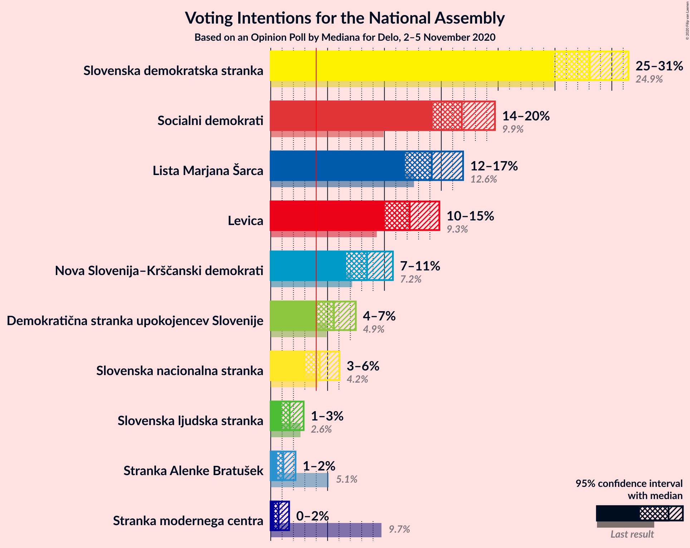

### Confidence Intervals

| Party | Last Result | Poll Result | 80% Confidence Interval | 90% Confidence Interval | 95% Confidence Interval | 99% Confidence Interval |
|:-----:|:-----------:|:-----------:|:-----------------------:|:-----------------------:|:-----------------------:|:-----------------------:|
| Slovenska demokratska stranka | 24.9% | 28.1% | 26.0–30.3% |25.4–30.9% |24.9–31.5% |23.9–32.5% |
| Socialni demokrati | 9.9% | 16.8% | 15.1–18.7% |14.6–19.2% |14.3–19.7% |13.5–20.7% |
| Lista Marjana Šarca | 12.6% | 14.2% | 12.6–16.0% |12.2–16.5% |11.8–16.9% |11.1–17.8% |
| Levica | 9.3% | 12.2% | 10.8–13.9% |10.4–14.4% |10.0–14.8% |9.4–15.7% |
| Nova Slovenija–Krščanski demokrati | 7.2% | 8.5% | 7.3–10.0% |6.9–10.4% |6.6–10.7% |6.1–11.5% |
| Demokratična stranka upokojencev Slovenije | 4.9% | 5.6% | 4.6–6.8% |4.3–7.2% |4.1–7.5% |3.7–8.1% |
| Slovenska nacionalna stranka | 4.2% | 4.3% | 3.5–5.4% |3.2–5.8% |3.0–6.1% |2.7–6.6% |
| Slovenska ljudska stranka | 2.6% | 1.7% | 1.2–2.5% |1.1–2.7% |1.0–2.9% |0.8–3.3% |
| Stranka Alenke Bratušek | 5.1% | 1.1% | 0.7–1.8% |0.6–2.0% |0.6–2.2% |0.4–2.6% |
| Stranka modernega centra | 9.7% | 0.7% | 0.4–1.3% |0.4–1.5% |0.3–1.6% |0.2–2.0% |

*Note:* The poll result column reflects the actual value used in the calculations. Published results may vary slightly, and in addition be rounded to fewer digits.

## Seats

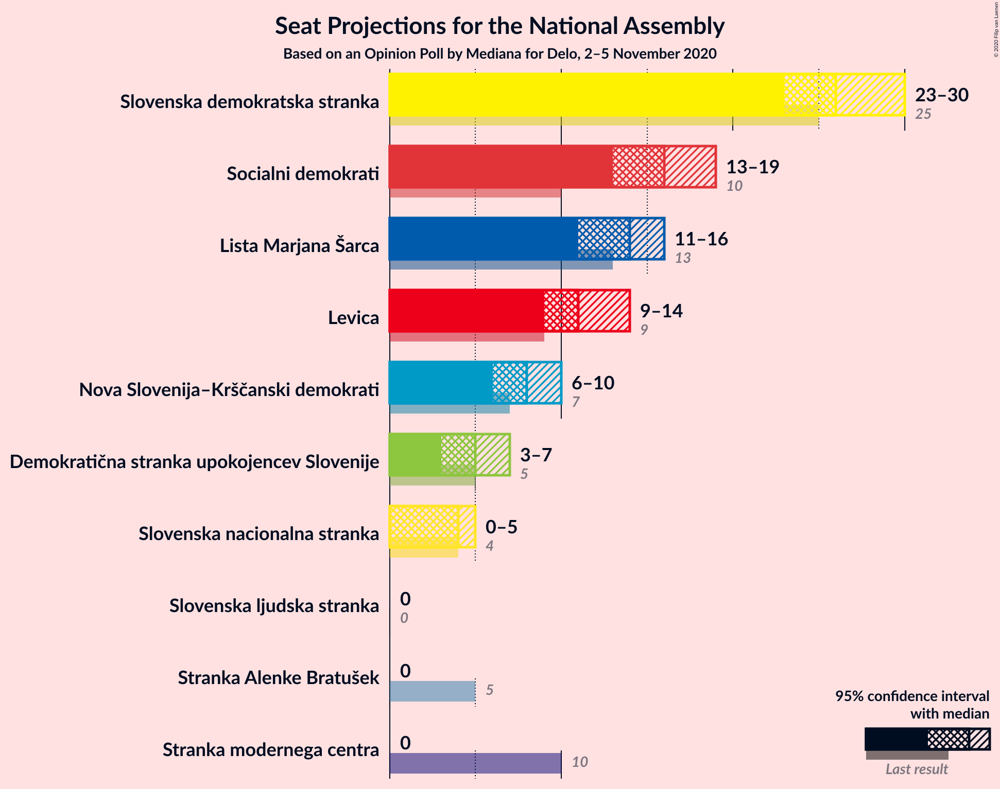

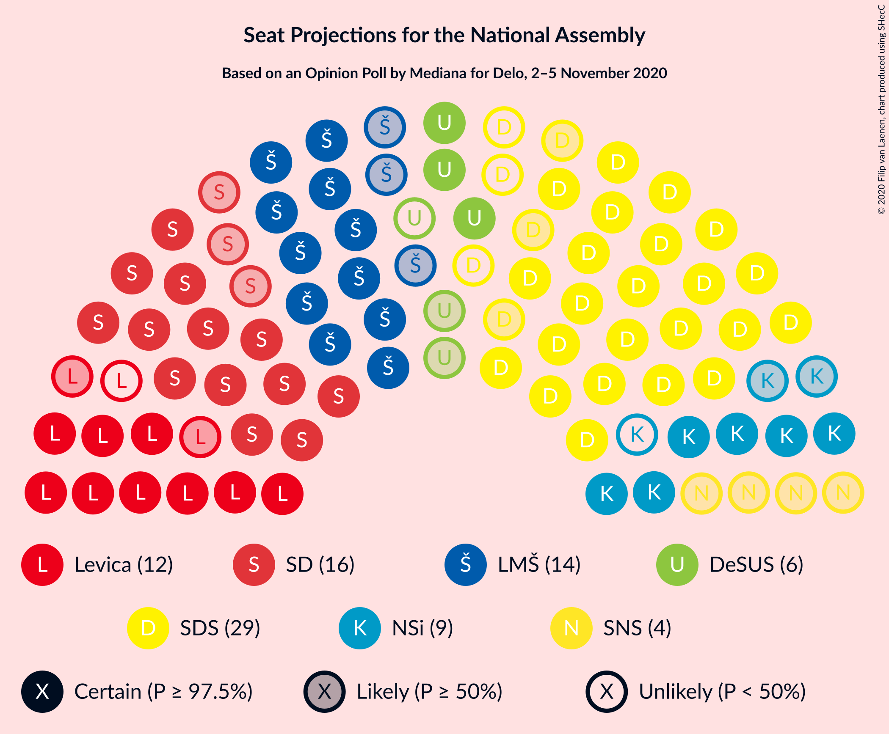

### Confidence Intervals

| Party | Last Result | Median | 80% Confidence Interval | 90% Confidence Interval | 95% Confidence Interval | 99% Confidence Interval |
|:-----:|:-----------:|:------:|:-----------------------:|:-----------------------:|:-----------------------:|:-----------------------:|
| <a href="#slovenska-demokratska-stranka">Slovenska demokratska stranka</a> | 25 | 26 | 24–29 |24–29 |23–30 |23–31 |
| <a href="#socialni-demokrati">Socialni demokrati</a> | 10 | 16 | 14–17 |14–18 |13–19 |12–20 |
| <a href="#lista-marjana-šarca">Lista Marjana Šarca</a> | 13 | 14 | 12–15 |11–15 |11–16 |10–17 |
| <a href="#levica">Levica</a> | 9 | 11 | 10–13 |9–13 |9–14 |9–15 |
| <a href="#nova-slovenija–krščanski-demokrati">Nova Slovenija–Krščanski demokrati</a> | 7 | 8 | 7–9 |6–9 |6–10 |5–11 |
| <a href="#demokratična-stranka-upokojencev-slovenije">Demokratična stranka upokojencev Slovenije</a> | 5 | 5 | 4–6 |4–6 |3–7 |0–7 |
| <a href="#slovenska-nacionalna-stranka">Slovenska nacionalna stranka</a> | 4 | 4 | 0–5 |0–5 |0–5 |0–6 |
| <a href="#slovenska-ljudska-stranka">Slovenska ljudska stranka</a> | 0 | 0 | 0 |0 |0 |0 |
| <a href="#stranka-alenke-bratušek">Stranka Alenke Bratušek</a> | 5 | 0 | 0 |0 |0 |0 |
| <a href="#stranka-modernega-centra">Stranka modernega centra</a> | 10 | 0 | 0 |0 |0 |0 |

### Slovenska demokratska stranka

*For a full overview of the results for this party, see the [Slovenska demokratska stranka](party-slovenskademokratskastranka.html) page.*

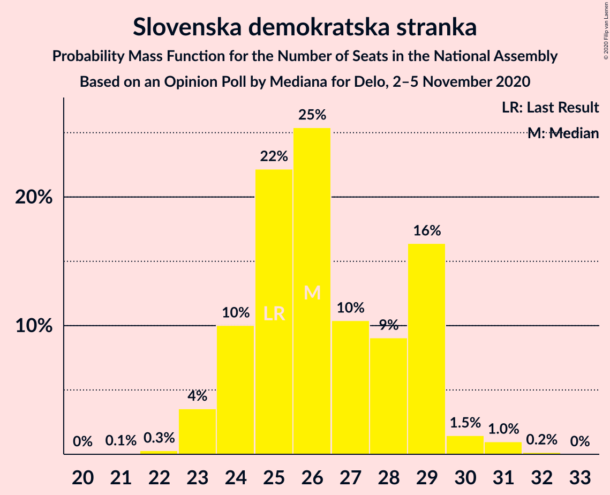

| Number of Seats | Probability | Accumulated | Special Marks |
|:---------------:|:-----------:|:-----------:|:-------------:|
| 21 | 0.1% | 100% |  |
| 22 | 0.3% | 99.9% |  |
| 23 | 4% | 99.6% |  |
| 24 | 10% | 96% |  |
| 25 | 22% | 86% | Last Result |
| 26 | 25% | 64% | Median |
| 27 | 10% | 38% |  |
| 28 | 9% | 28% |  |
| 29 | 16% | 19% |  |
| 30 | 1.5% | 3% |  |
| 31 | 1.0% | 1.1% |  |
| 32 | 0.2% | 0.2% |  |
| 33 | 0% | 0% |  |

### Socialni demokrati

*For a full overview of the results for this party, see the [Socialni demokrati](party-socialnidemokrati.html) page.*

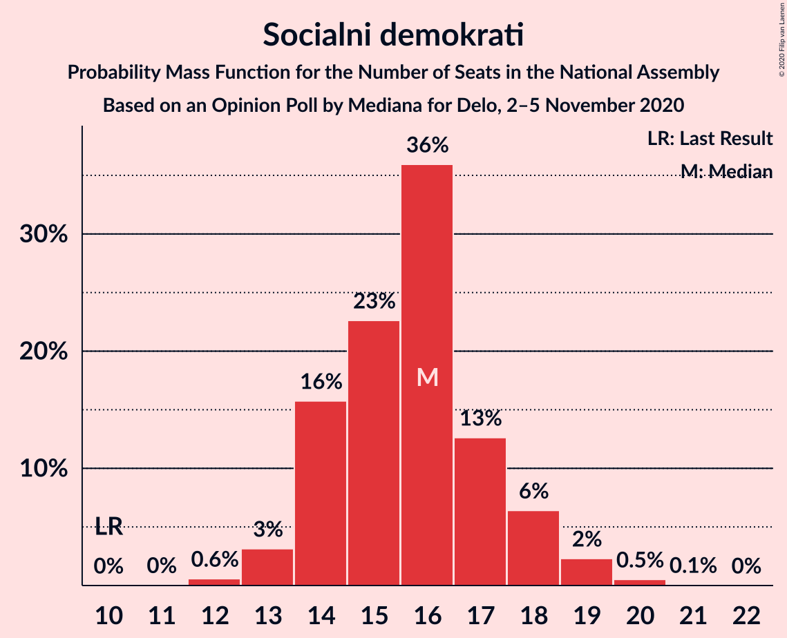

| Number of Seats | Probability | Accumulated | Special Marks |
|:---------------:|:-----------:|:-----------:|:-------------:|
| 10 | 0% | 100% | Last Result |
| 11 | 0% | 100% |  |
| 12 | 0.6% | 100% |  |
| 13 | 3% | 99.4% |  |
| 14 | 16% | 96% |  |
| 15 | 23% | 80% |  |
| 16 | 36% | 58% | Median |
| 17 | 13% | 22% |  |
| 18 | 6% | 9% |  |
| 19 | 2% | 3% |  |
| 20 | 0.5% | 0.6% |  |
| 21 | 0.1% | 0.1% |  |
| 22 | 0% | 0% |  |

### Lista Marjana Šarca

*For a full overview of the results for this party, see the [Lista Marjana Šarca](party-listamarjanašarca.html) page.*

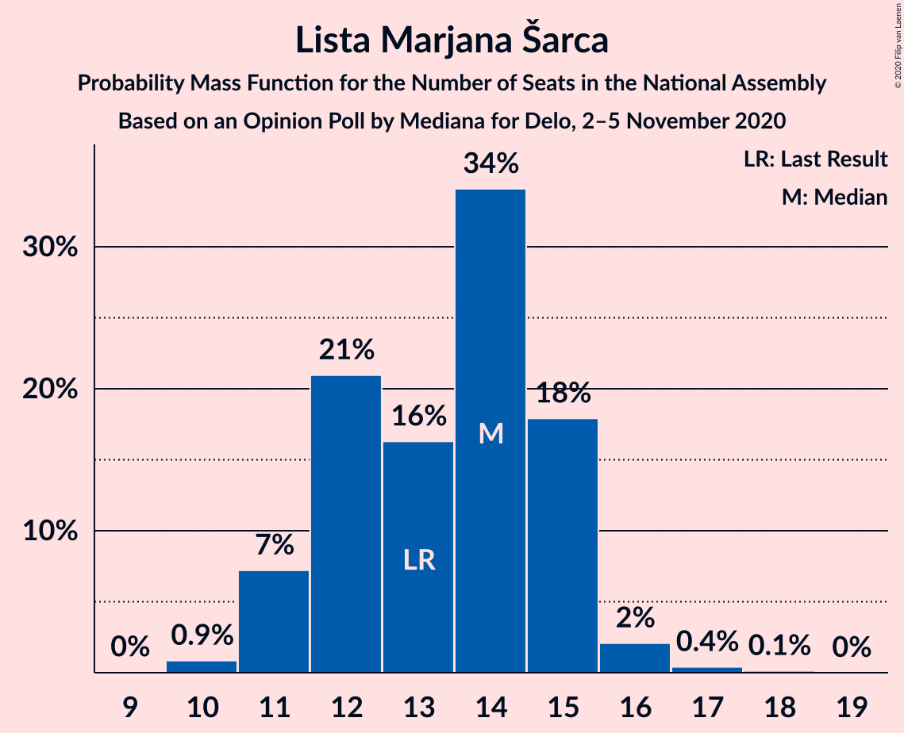

| Number of Seats | Probability | Accumulated | Special Marks |
|:---------------:|:-----------:|:-----------:|:-------------:|
| 10 | 0.9% | 100% |  |
| 11 | 7% | 99.1% |  |
| 12 | 21% | 92% |  |
| 13 | 16% | 71% | Last Result |
| 14 | 34% | 55% | Median |
| 15 | 18% | 21% |  |
| 16 | 2% | 3% |  |
| 17 | 0.4% | 0.5% |  |
| 18 | 0.1% | 0.1% |  |
| 19 | 0% | 0% |  |

### Levica

*For a full overview of the results for this party, see the [Levica](party-levica.html) page.*

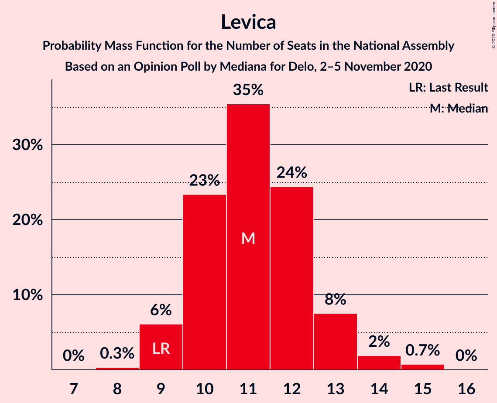

| Number of Seats | Probability | Accumulated | Special Marks |
|:---------------:|:-----------:|:-----------:|:-------------:|
| 8 | 0.3% | 100% |  |
| 9 | 6% | 99.6% | Last Result |
| 10 | 23% | 94% |  |
| 11 | 35% | 70% | Median |
| 12 | 24% | 35% |  |
| 13 | 8% | 10% |  |
| 14 | 2% | 3% |  |
| 15 | 0.7% | 0.8% |  |
| 16 | 0% | 0% |  |

### Nova Slovenija–Krščanski demokrati

*For a full overview of the results for this party, see the [Nova Slovenija–Krščanski demokrati](party-novaslovenija–krščanskidemokrati.html) page.*

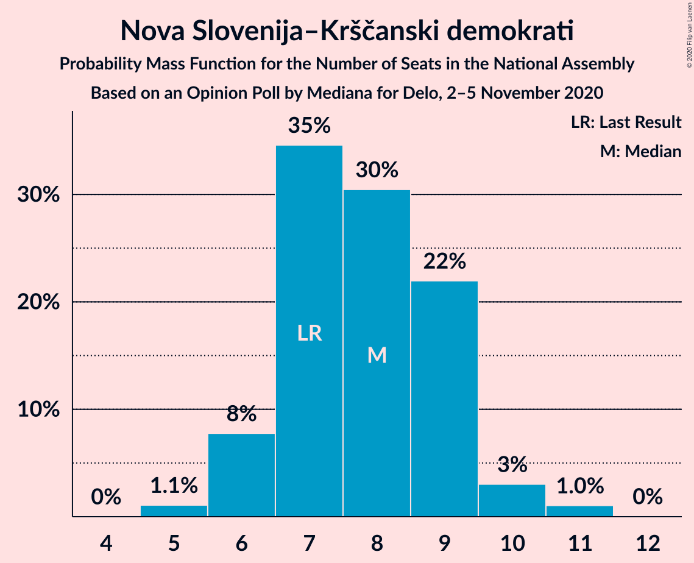

| Number of Seats | Probability | Accumulated | Special Marks |
|:---------------:|:-----------:|:-----------:|:-------------:|
| 5 | 1.1% | 100% |  |
| 6 | 8% | 98.9% |  |
| 7 | 35% | 91% | Last Result |
| 8 | 30% | 57% | Median |
| 9 | 22% | 26% |  |
| 10 | 3% | 4% |  |
| 11 | 1.0% | 1.1% |  |
| 12 | 0% | 0% |  |

### Demokratična stranka upokojencev Slovenije

*For a full overview of the results for this party, see the [Demokratična stranka upokojencev Slovenije](party-demokratičnastrankaupokojencevslovenije.html) page.*

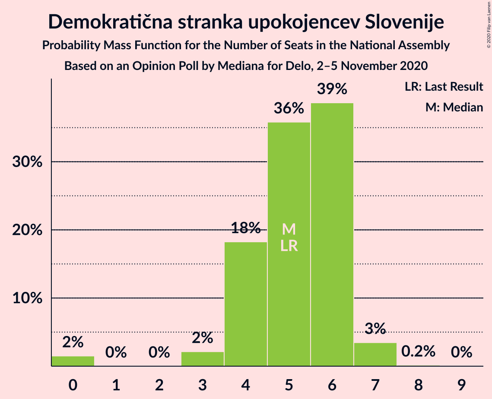

| Number of Seats | Probability | Accumulated | Special Marks |
|:---------------:|:-----------:|:-----------:|:-------------:|
| 0 | 2% | 100% |  |
| 1 | 0% | 98% |  |
| 2 | 0% | 98% |  |
| 3 | 2% | 98% |  |
| 4 | 18% | 96% |  |
| 5 | 36% | 78% | Last Result, Median |
| 6 | 39% | 42% |  |
| 7 | 3% | 4% |  |
| 8 | 0.2% | 0.2% |  |
| 9 | 0% | 0% |  |

### Slovenska nacionalna stranka

*For a full overview of the results for this party, see the [Slovenska nacionalna stranka](party-slovenskanacionalnastranka.html) page.*

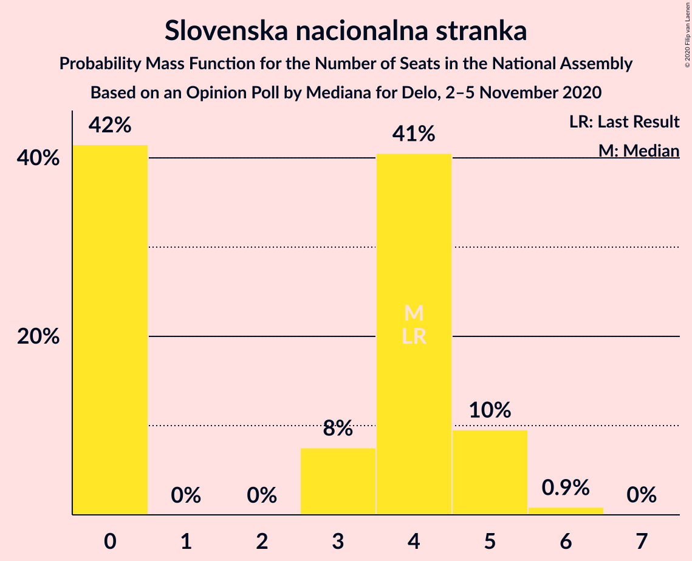

| Number of Seats | Probability | Accumulated | Special Marks |
|:---------------:|:-----------:|:-----------:|:-------------:|
| 0 | 42% | 100% |  |
| 1 | 0% | 58% |  |
| 2 | 0% | 58% |  |
| 3 | 8% | 58% |  |
| 4 | 41% | 51% | Last Result, Median |
| 5 | 10% | 10% |  |
| 6 | 0.9% | 0.9% |  |
| 7 | 0% | 0% |  |

### Slovenska ljudska stranka

*For a full overview of the results for this party, see the [Slovenska ljudska stranka](party-slovenskaljudskastranka.html) page.*

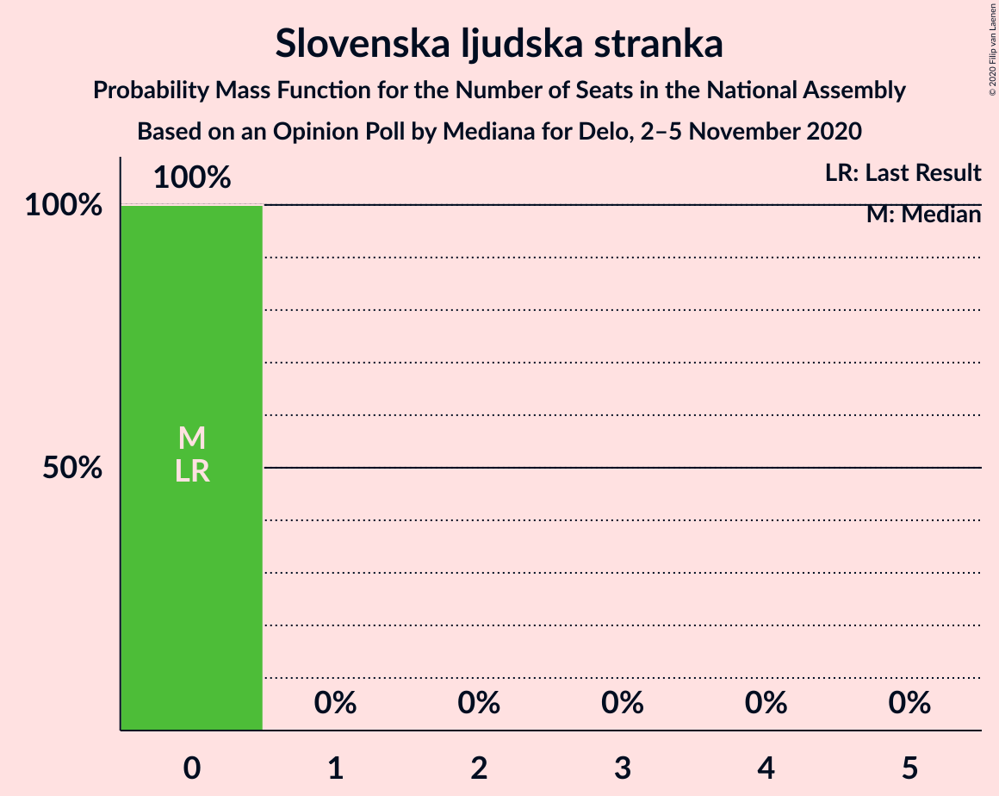

| Number of Seats | Probability | Accumulated | Special Marks |
|:---------------:|:-----------:|:-----------:|:-------------:|
| 0 | 100% | 100% | Last Result, Median |

### Stranka Alenke Bratušek

*For a full overview of the results for this party, see the [Stranka Alenke Bratušek](party-strankaalenkebratušek.html) page.*

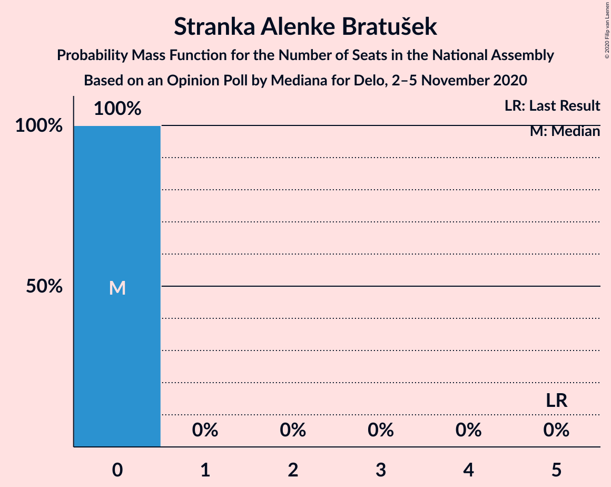

| Number of Seats | Probability | Accumulated | Special Marks |
|:---------------:|:-----------:|:-----------:|:-------------:|
| 0 | 100% | 100% | Median |
| 1 | 0% | 0% |  |
| 2 | 0% | 0% |  |
| 3 | 0% | 0% |  |
| 4 | 0% | 0% |  |
| 5 | 0% | 0% | Last Result |

### Stranka modernega centra

*For a full overview of the results for this party, see the [Stranka modernega centra](party-strankamodernegacentra.html) page.*

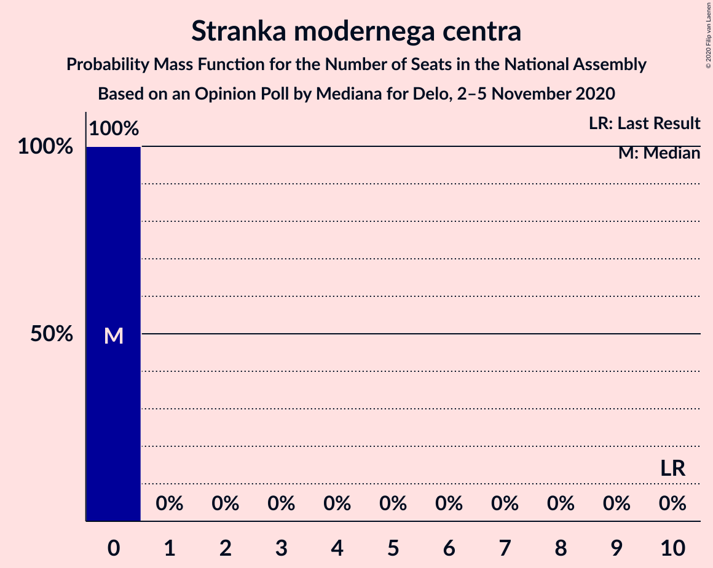

| Number of Seats | Probability | Accumulated | Special Marks |
|:---------------:|:-----------:|:-----------:|:-------------:|
| 0 | 100% | 100% | Median |
| 1 | 0% | 0% |  |
| 2 | 0% | 0% |  |
| 3 | 0% | 0% |  |
| 4 | 0% | 0% |  |
| 5 | 0% | 0% |  |
| 6 | 0% | 0% |  |
| 7 | 0% | 0% |  |
| 8 | 0% | 0% |  |
| 9 | 0% | 0% |  |
| 10 | 0% | 0% | Last Result |

## Coalitions

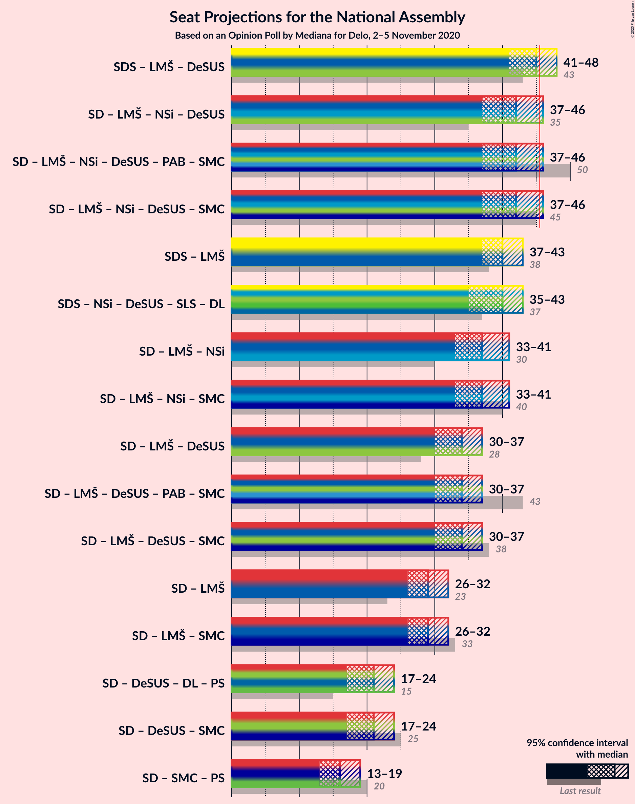

### Confidence Intervals

| Coalition | Last Result | Median | Majority? | 80% Confidence Interval | 90% Confidence Interval | 95% Confidence Interval | 99% Confidence Interval |
|:---------:|:-----------:|:------:|:---------:|:-----------------------:|:-----------------------:|:-----------------------:|:-----------------------:|
| Slovenska demokratska stranka – Lista Marjana Šarca – Demokratična stranka upokojencev Slovenije | 43 | 45 | 46% | 42–47 | 42–47 | 41–48 | 39–49 |
| Socialni demokrati – Lista Marjana Šarca – Nova Slovenija–Krščanski demokrati – Demokratična stranka upokojencev Slovenije | 35 | 42 | 13% | 39–46 | 38–46 | 37–46 | 36–47 |
| Socialni demokrati – Lista Marjana Šarca – Nova Slovenija–Krščanski demokrati – Demokratična stranka upokojencev Slovenije – Stranka Alenke Bratušek – Stranka modernega centra | 50 | 42 | 13% | 39–46 | 38–46 | 37–46 | 36–47 |
| Socialni demokrati – Lista Marjana Šarca – Nova Slovenija–Krščanski demokrati – Demokratična stranka upokojencev Slovenije – Stranka modernega centra | 45 | 42 | 13% | 39–46 | 38–46 | 37–46 | 36–47 |
| Slovenska demokratska stranka – Lista Marjana Šarca | 38 | 40 | 0.1% | 38–42 | 37–43 | 37–43 | 35–44 |
| Socialni demokrati – Lista Marjana Šarca – Nova Slovenija–Krščanski demokrati | 30 | 37 | 0% | 34–40 | 33–40 | 33–41 | 31–42 |
| Socialni demokrati – Lista Marjana Šarca – Nova Slovenija–Krščanski demokrati – Stranka modernega centra | 40 | 37 | 0% | 34–40 | 33–40 | 33–41 | 31–42 |
| Socialni demokrati – Lista Marjana Šarca – Demokratična stranka upokojencev Slovenije | 28 | 34 | 0% | 32–37 | 31–37 | 30–37 | 29–38 |
| Socialni demokrati – Lista Marjana Šarca – Demokratična stranka upokojencev Slovenije – Stranka Alenke Bratušek – Stranka modernega centra | 43 | 34 | 0% | 32–37 | 31–37 | 30–37 | 29–38 |
| Socialni demokrati – Lista Marjana Šarca – Demokratična stranka upokojencev Slovenije – Stranka modernega centra | 38 | 34 | 0% | 32–37 | 31–37 | 30–37 | 29–38 |
| Socialni demokrati – Lista Marjana Šarca | 23 | 29 | 0% | 27–31 | 26–31 | 26–32 | 25–34 |
| Socialni demokrati – Lista Marjana Šarca – Stranka modernega centra | 33 | 29 | 0% | 27–31 | 26–31 | 26–32 | 25–34 |
| Socialni demokrati – Demokratična stranka upokojencev Slovenije – Stranka modernega centra | 25 | 21 | 0% | 19–22 | 18–23 | 17–24 | 16–25 |

### Slovenska demokratska stranka – Lista Marjana Šarca – Demokratična stranka upokojencev Slovenije

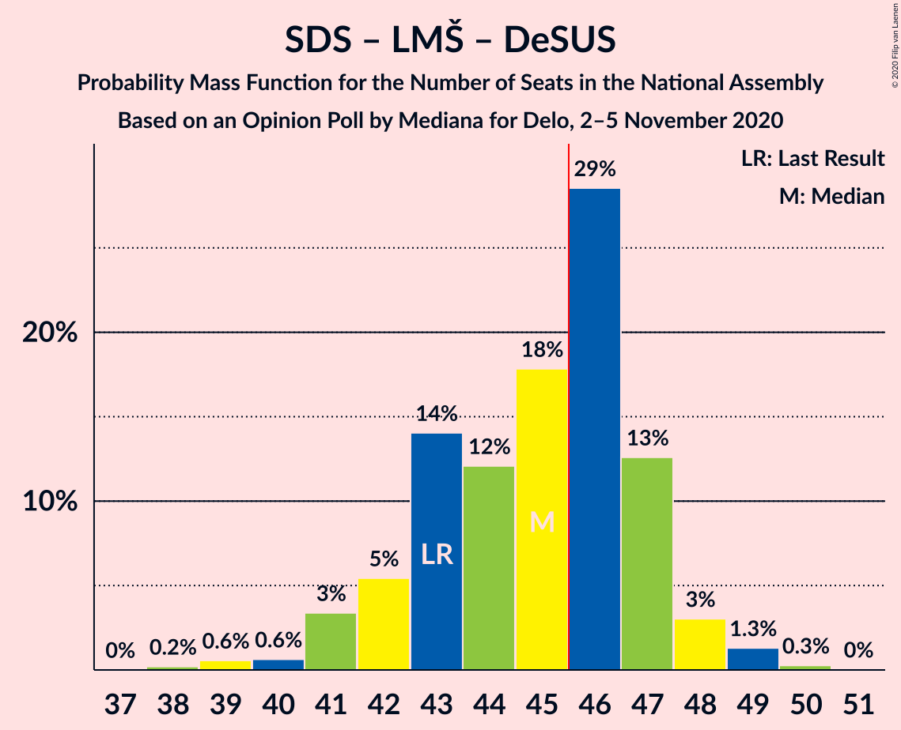

| Number of Seats | Probability | Accumulated | Special Marks |
|:---------------:|:-----------:|:-----------:|:-------------:|
| 38 | 0.2% | 100% |  |
| 39 | 0.6% | 99.8% |  |
| 40 | 0.6% | 99.2% |  |
| 41 | 3% | 98.6% |  |
| 42 | 5% | 95% |  |
| 43 | 14% | 90% | Last Result |
| 44 | 12% | 76% |  |
| 45 | 18% | 64% | Median |
| 46 | 29% | 46% | Majority |
| 47 | 13% | 17% |  |
| 48 | 3% | 5% |  |
| 49 | 1.3% | 2% |  |
| 50 | 0.3% | 0.3% |  |
| 51 | 0% | 0% |  |

### Socialni demokrati – Lista Marjana Šarca – Nova Slovenija–Krščanski demokrati – Demokratična stranka upokojencev Slovenije

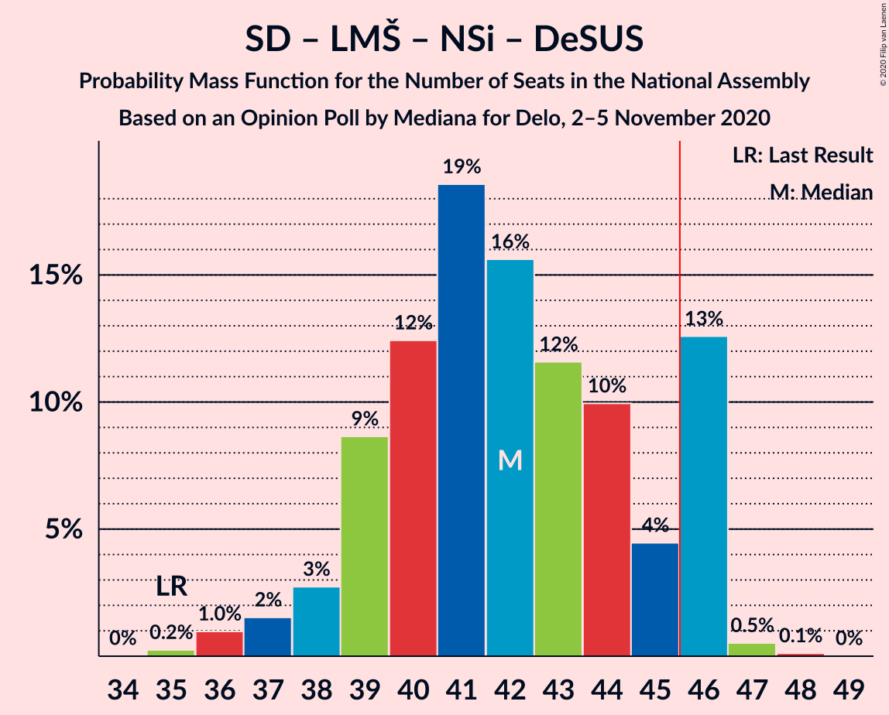

| Number of Seats | Probability | Accumulated | Special Marks |
|:---------------:|:-----------:|:-----------:|:-------------:|
| 35 | 0.2% | 100% | Last Result |
| 36 | 1.0% | 99.7% |  |
| 37 | 2% | 98.8% |  |
| 38 | 3% | 97% |  |
| 39 | 9% | 94% |  |
| 40 | 12% | 86% |  |
| 41 | 19% | 73% |  |
| 42 | 16% | 55% |  |
| 43 | 12% | 39% | Median |
| 44 | 10% | 28% |  |
| 45 | 4% | 18% |  |
| 46 | 13% | 13% | Majority |
| 47 | 0.5% | 0.6% |  |
| 48 | 0.1% | 0.1% |  |
| 49 | 0% | 0% |  |

### Socialni demokrati – Lista Marjana Šarca – Nova Slovenija–Krščanski demokrati – Demokratična stranka upokojencev Slovenije – Stranka Alenke Bratušek – Stranka modernega centra

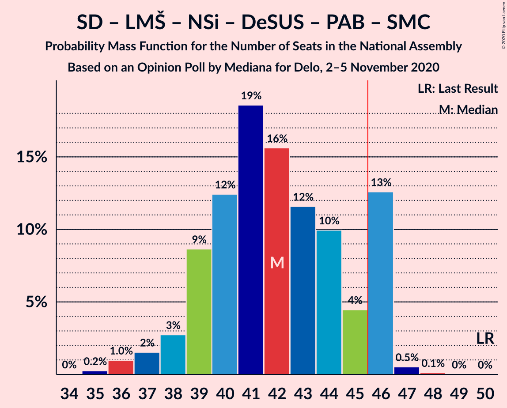

| Number of Seats | Probability | Accumulated | Special Marks |
|:---------------:|:-----------:|:-----------:|:-------------:|
| 35 | 0.2% | 100% |  |
| 36 | 1.0% | 99.7% |  |
| 37 | 2% | 98.8% |  |
| 38 | 3% | 97% |  |
| 39 | 9% | 94% |  |
| 40 | 12% | 86% |  |
| 41 | 19% | 73% |  |
| 42 | 16% | 55% |  |
| 43 | 12% | 39% | Median |
| 44 | 10% | 28% |  |
| 45 | 4% | 18% |  |
| 46 | 13% | 13% | Majority |
| 47 | 0.5% | 0.6% |  |
| 48 | 0.1% | 0.1% |  |
| 49 | 0% | 0% |  |
| 50 | 0% | 0% | Last Result |

### Socialni demokrati – Lista Marjana Šarca – Nova Slovenija–Krščanski demokrati – Demokratična stranka upokojencev Slovenije – Stranka modernega centra

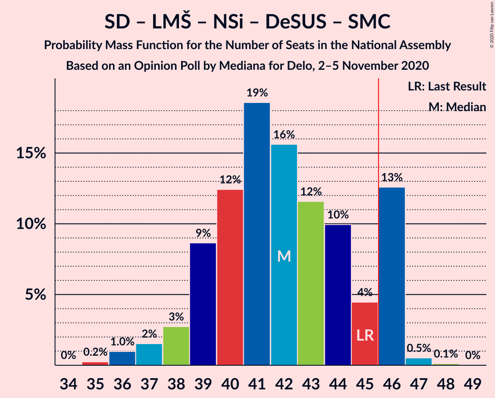

| Number of Seats | Probability | Accumulated | Special Marks |
|:---------------:|:-----------:|:-----------:|:-------------:|
| 35 | 0.2% | 100% |  |
| 36 | 1.0% | 99.7% |  |
| 37 | 2% | 98.8% |  |
| 38 | 3% | 97% |  |
| 39 | 9% | 94% |  |
| 40 | 12% | 86% |  |
| 41 | 19% | 73% |  |
| 42 | 16% | 55% |  |
| 43 | 12% | 39% | Median |
| 44 | 10% | 28% |  |
| 45 | 4% | 18% | Last Result |
| 46 | 13% | 13% | Majority |
| 47 | 0.5% | 0.6% |  |
| 48 | 0.1% | 0.1% |  |
| 49 | 0% | 0% |  |

### Slovenska demokratska stranka – Lista Marjana Šarca

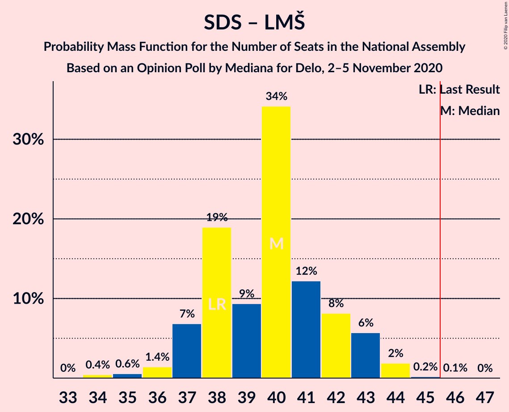

| Number of Seats | Probability | Accumulated | Special Marks |
|:---------------:|:-----------:|:-----------:|:-------------:|
| 34 | 0.4% | 100% |  |
| 35 | 0.6% | 99.5% |  |
| 36 | 1.4% | 99.0% |  |
| 37 | 7% | 98% |  |
| 38 | 19% | 91% | Last Result |
| 39 | 9% | 72% |  |
| 40 | 34% | 62% | Median |
| 41 | 12% | 28% |  |
| 42 | 8% | 16% |  |
| 43 | 6% | 8% |  |
| 44 | 2% | 2% |  |
| 45 | 0.2% | 0.3% |  |
| 46 | 0.1% | 0.1% | Majority |
| 47 | 0% | 0% |  |

### Socialni demokrati – Lista Marjana Šarca – Nova Slovenija–Krščanski demokrati

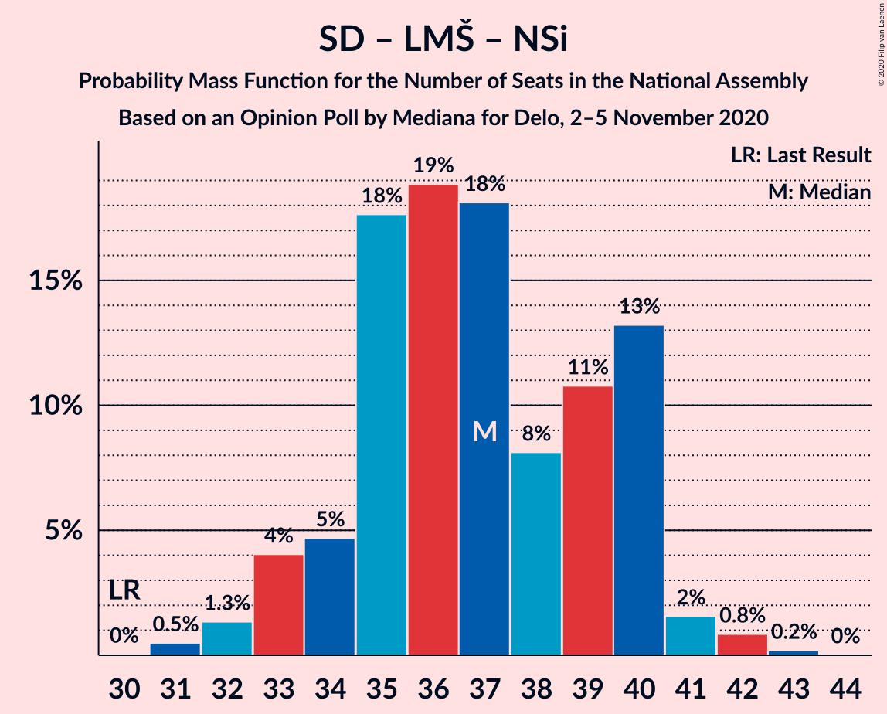

| Number of Seats | Probability | Accumulated | Special Marks |
|:---------------:|:-----------:|:-----------:|:-------------:|
| 30 | 0% | 100% | Last Result |
| 31 | 0.5% | 100% |  |
| 32 | 1.3% | 99.5% |  |
| 33 | 4% | 98% |  |
| 34 | 5% | 94% |  |
| 35 | 18% | 89% |  |
| 36 | 19% | 72% |  |
| 37 | 18% | 53% |  |
| 38 | 8% | 35% | Median |
| 39 | 11% | 27% |  |
| 40 | 13% | 16% |  |
| 41 | 2% | 3% |  |
| 42 | 0.8% | 1.1% |  |
| 43 | 0.2% | 0.2% |  |
| 44 | 0% | 0% |  |

### Socialni demokrati – Lista Marjana Šarca – Nova Slovenija–Krščanski demokrati – Stranka modernega centra

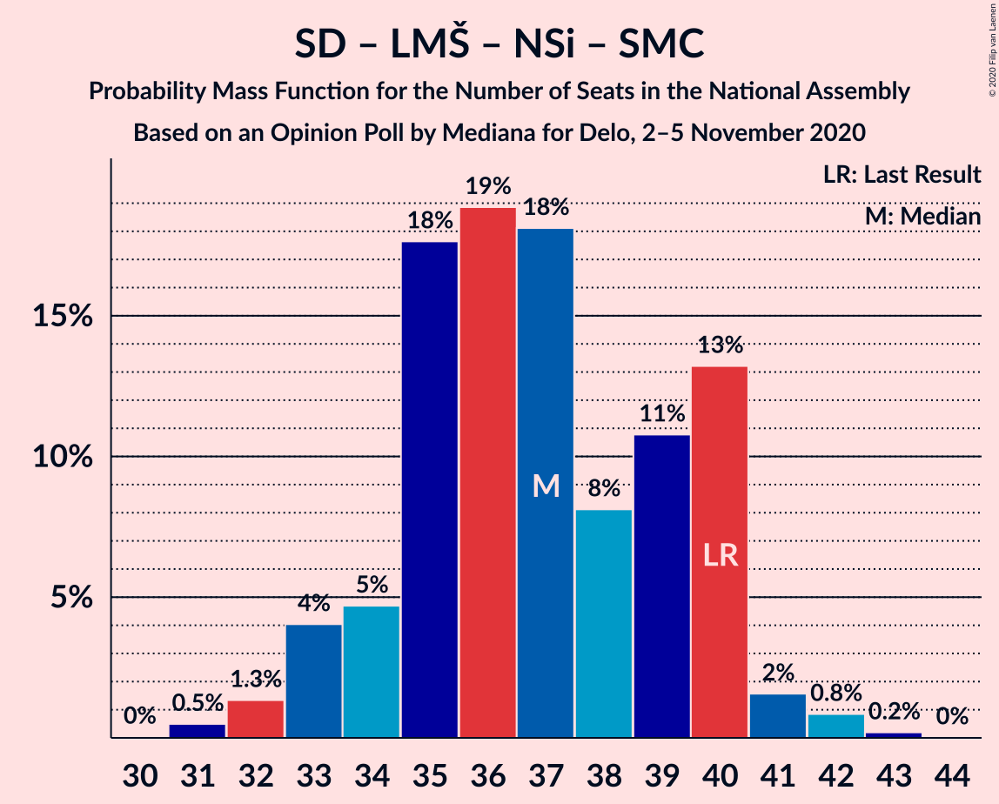

| Number of Seats | Probability | Accumulated | Special Marks |
|:---------------:|:-----------:|:-----------:|:-------------:|
| 31 | 0.5% | 100% |  |
| 32 | 1.3% | 99.5% |  |
| 33 | 4% | 98% |  |
| 34 | 5% | 94% |  |
| 35 | 18% | 89% |  |
| 36 | 19% | 72% |  |
| 37 | 18% | 53% |  |
| 38 | 8% | 35% | Median |
| 39 | 11% | 27% |  |
| 40 | 13% | 16% | Last Result |
| 41 | 2% | 3% |  |
| 42 | 0.8% | 1.1% |  |
| 43 | 0.2% | 0.2% |  |
| 44 | 0% | 0% |  |

### Socialni demokrati – Lista Marjana Šarca – Demokratična stranka upokojencev Slovenije

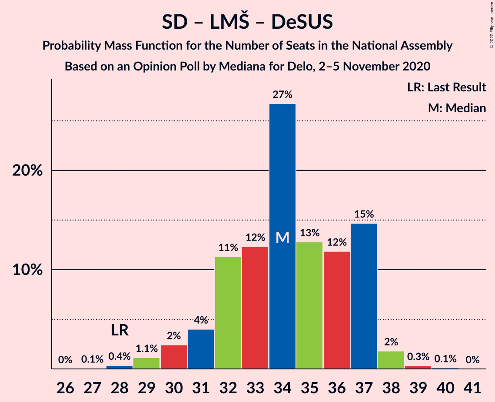

| Number of Seats | Probability | Accumulated | Special Marks |
|:---------------:|:-----------:|:-----------:|:-------------:|
| 27 | 0.1% | 100% |  |
| 28 | 0.4% | 99.9% | Last Result |
| 29 | 1.1% | 99.6% |  |
| 30 | 2% | 98% |  |
| 31 | 4% | 96% |  |
| 32 | 11% | 92% |  |
| 33 | 12% | 81% |  |
| 34 | 27% | 68% |  |
| 35 | 13% | 42% | Median |
| 36 | 12% | 29% |  |
| 37 | 15% | 17% |  |
| 38 | 2% | 2% |  |
| 39 | 0.3% | 0.5% |  |
| 40 | 0.1% | 0.1% |  |
| 41 | 0% | 0% |  |

### Socialni demokrati – Lista Marjana Šarca – Demokratična stranka upokojencev Slovenije – Stranka Alenke Bratušek – Stranka modernega centra

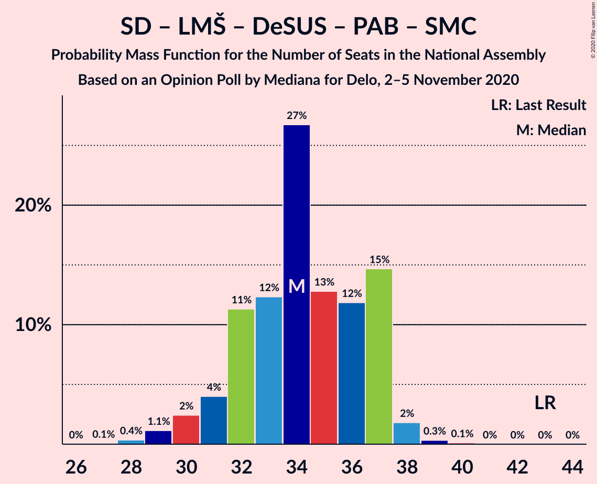

| Number of Seats | Probability | Accumulated | Special Marks |
|:---------------:|:-----------:|:-----------:|:-------------:|
| 27 | 0.1% | 100% |  |
| 28 | 0.4% | 99.9% |  |
| 29 | 1.1% | 99.6% |  |
| 30 | 2% | 98% |  |
| 31 | 4% | 96% |  |
| 32 | 11% | 92% |  |
| 33 | 12% | 81% |  |
| 34 | 27% | 68% |  |
| 35 | 13% | 42% | Median |
| 36 | 12% | 29% |  |
| 37 | 15% | 17% |  |
| 38 | 2% | 2% |  |
| 39 | 0.3% | 0.5% |  |
| 40 | 0.1% | 0.1% |  |
| 41 | 0% | 0% |  |
| 42 | 0% | 0% |  |
| 43 | 0% | 0% | Last Result |

### Socialni demokrati – Lista Marjana Šarca – Demokratična stranka upokojencev Slovenije – Stranka modernega centra

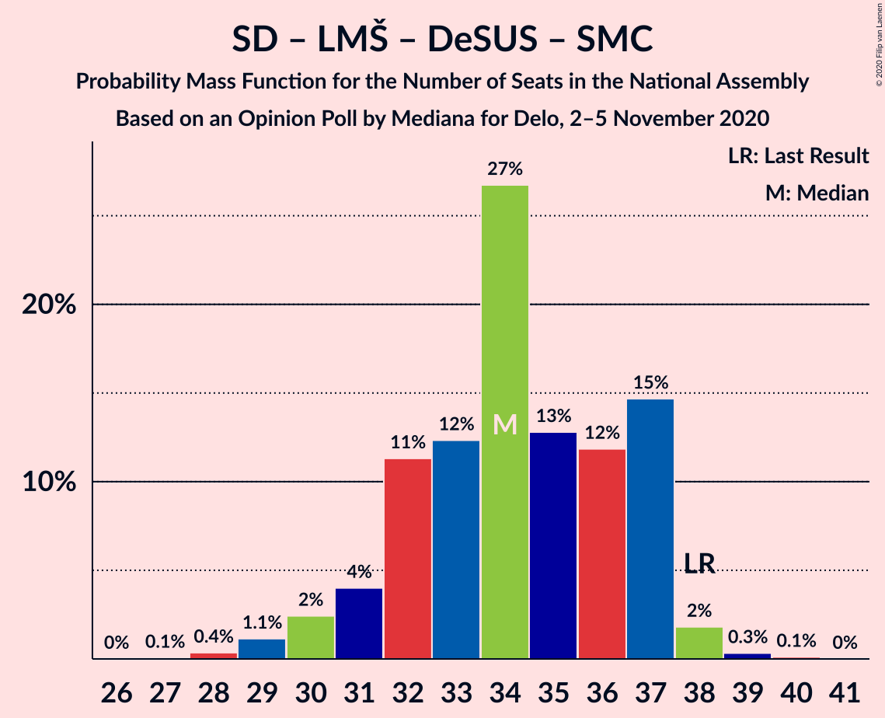

| Number of Seats | Probability | Accumulated | Special Marks |
|:---------------:|:-----------:|:-----------:|:-------------:|
| 27 | 0.1% | 100% |  |
| 28 | 0.4% | 99.9% |  |
| 29 | 1.1% | 99.6% |  |
| 30 | 2% | 98% |  |
| 31 | 4% | 96% |  |
| 32 | 11% | 92% |  |
| 33 | 12% | 81% |  |
| 34 | 27% | 68% |  |
| 35 | 13% | 42% | Median |
| 36 | 12% | 29% |  |
| 37 | 15% | 17% |  |
| 38 | 2% | 2% | Last Result |
| 39 | 0.3% | 0.5% |  |
| 40 | 0.1% | 0.1% |  |
| 41 | 0% | 0% |  |

### Socialni demokrati – Lista Marjana Šarca

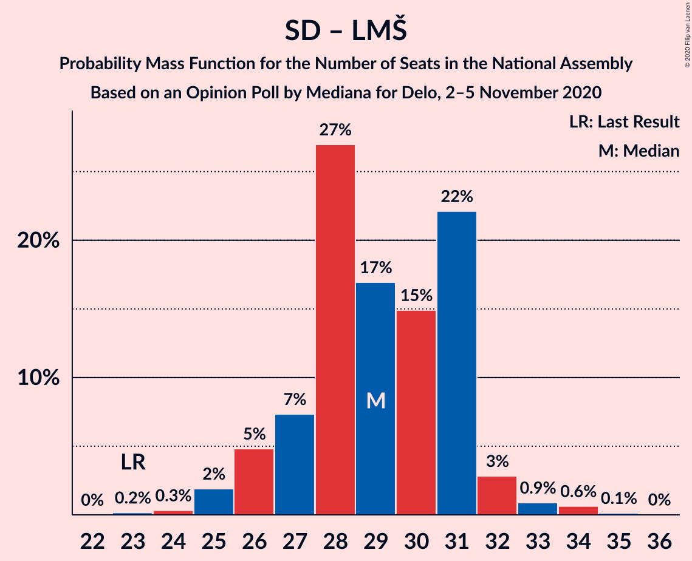

| Number of Seats | Probability | Accumulated | Special Marks |
|:---------------:|:-----------:|:-----------:|:-------------:|
| 23 | 0.2% | 100% | Last Result |
| 24 | 0.3% | 99.8% |  |
| 25 | 2% | 99.5% |  |
| 26 | 5% | 98% |  |
| 27 | 7% | 93% |  |
| 28 | 27% | 85% |  |
| 29 | 17% | 58% |  |
| 30 | 15% | 42% | Median |
| 31 | 22% | 27% |  |
| 32 | 3% | 5% |  |
| 33 | 0.9% | 2% |  |
| 34 | 0.6% | 0.8% |  |
| 35 | 0.1% | 0.2% |  |
| 36 | 0% | 0% |  |

### Socialni demokrati – Lista Marjana Šarca – Stranka modernega centra

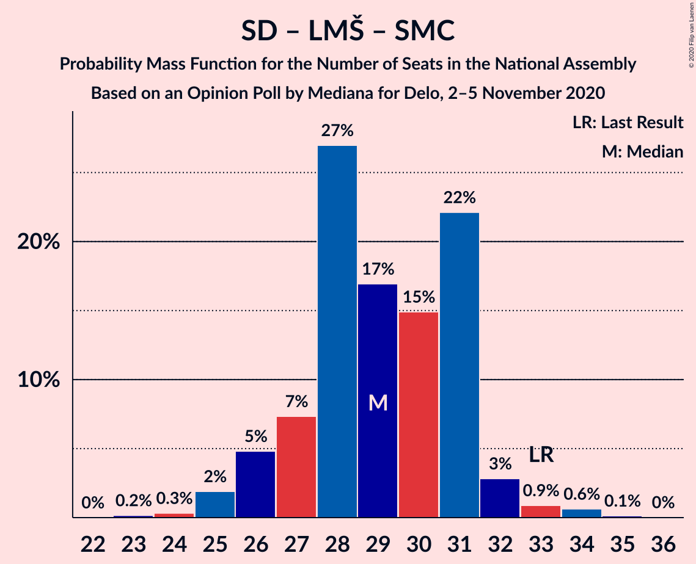

| Number of Seats | Probability | Accumulated | Special Marks |
|:---------------:|:-----------:|:-----------:|:-------------:|
| 23 | 0.2% | 100% |  |
| 24 | 0.3% | 99.8% |  |
| 25 | 2% | 99.5% |  |
| 26 | 5% | 98% |  |
| 27 | 7% | 93% |  |
| 28 | 27% | 85% |  |
| 29 | 17% | 58% |  |
| 30 | 15% | 42% | Median |
| 31 | 22% | 27% |  |
| 32 | 3% | 5% |  |
| 33 | 0.9% | 2% | Last Result |
| 34 | 0.6% | 0.8% |  |
| 35 | 0.1% | 0.2% |  |
| 36 | 0% | 0% |  |

### Socialni demokrati – Demokratična stranka upokojencev Slovenije – Stranka modernega centra

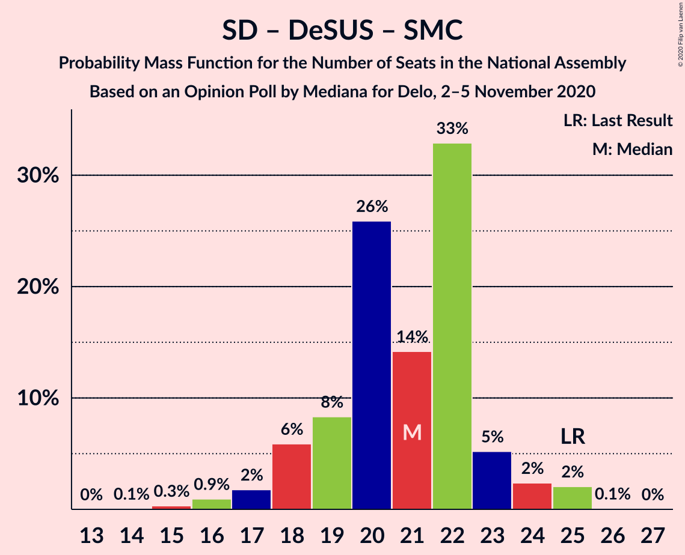

| Number of Seats | Probability | Accumulated | Special Marks |
|:---------------:|:-----------:|:-----------:|:-------------:|
| 14 | 0.1% | 100% |  |
| 15 | 0.3% | 99.9% |  |
| 16 | 0.9% | 99.6% |  |
| 17 | 2% | 98.7% |  |
| 18 | 6% | 97% |  |
| 19 | 8% | 91% |  |
| 20 | 26% | 83% |  |
| 21 | 14% | 57% | Median |
| 22 | 33% | 43% |  |
| 23 | 5% | 10% |  |
| 24 | 2% | 5% |  |
| 25 | 2% | 2% | Last Result |
| 26 | 0.1% | 0.1% |  |
| 27 | 0% | 0% |  |

## Technical Information

### Opinion Poll

+ **Polling firm:** Mediana
+ **Commissioner(s):** Delo
+ **Fieldwork period:** 2–5 November 2020

### Calculations

+ **Sample size:** 720
+ **Simulations done:** 1,048,576
+ **Error estimate:** 1.33%

