# Opinion Poll by Ninamedia for Dnevnik, Večer, 10–12 November 2020

<a href="#voting-intentions">Voting Intentions</a> | <a href="#seats">Seats</a> | <a href="#coalitions">Coalitions</a> | <a href="#technical-information">Technical Information</a>

## Voting Intentions

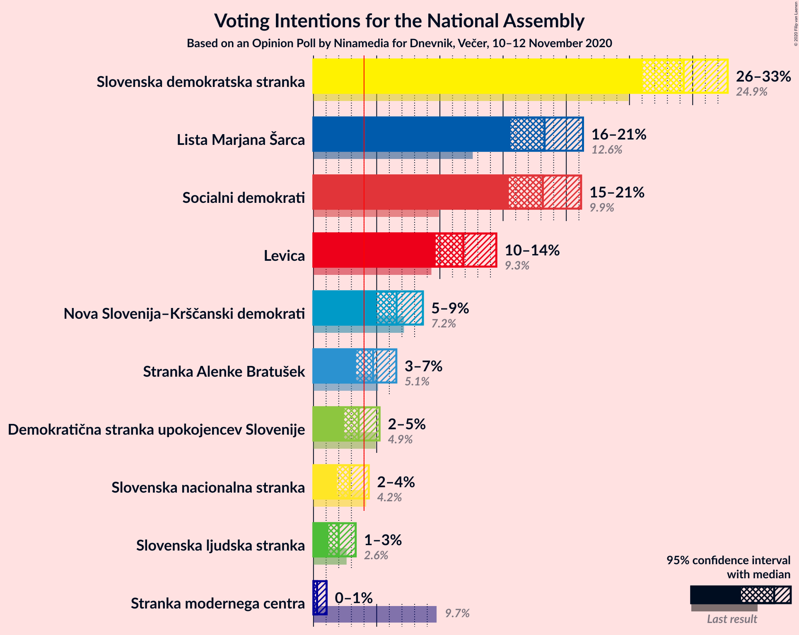

### Confidence Intervals

| Party | Last Result | Poll Result | 80% Confidence Interval | 90% Confidence Interval | 95% Confidence Interval | 99% Confidence Interval |
|:-----:|:-----------:|:-----------:|:-----------------------:|:-----------------------:|:-----------------------:|:-----------------------:|
| Slovenska demokratska stranka | 24.9% | 29.3% | 27.1–31.6% |26.6–32.2% |26.0–32.8% |25.0–33.9% |
| Lista Marjana Šarca | 12.6% | 18.3% | 16.5–20.3% |16.0–20.8% |15.6–21.3% |14.8–22.3% |
| Socialni demokrati | 9.9% | 18.1% | 16.4–20.1% |15.9–20.7% |15.5–21.2% |14.6–22.2% |
| Levica | 9.3% | 11.9% | 10.4–13.6% |10.0–14.1% |9.7–14.5% |9.0–15.3% |
| Nova Slovenija–Krščanski demokrati | 7.2% | 6.6% | 5.5–7.9% |5.2–8.3% |5.0–8.7% |4.5–9.4% |
| Stranka Alenke Bratušek | 5.1% | 4.7% | 3.8–5.9% |3.6–6.2% |3.4–6.6% |3.0–7.2% |
| Demokratična stranka upokojencev Slovenije | 4.9% | 3.6% | 2.8–4.6% |2.6–5.0% |2.4–5.2% |2.1–5.8% |
| Slovenska nacionalna stranka | 4.2% | 2.9% | 2.2–3.8% |2.0–4.1% |1.9–4.4% |1.6–4.9% |
| Slovenska ljudska stranka | 2.6% | 2.0% | 1.5–2.9% |1.3–3.1% |1.2–3.3% |1.0–3.8% |
| Stranka modernega centra | 9.7% | 0.3% | 0.2–0.8% |0.1–0.9% |0.1–1.0% |0.0–1.3% |

*Note:* The poll result column reflects the actual value used in the calculations. Published results may vary slightly, and in addition be rounded to fewer digits.

## Seats

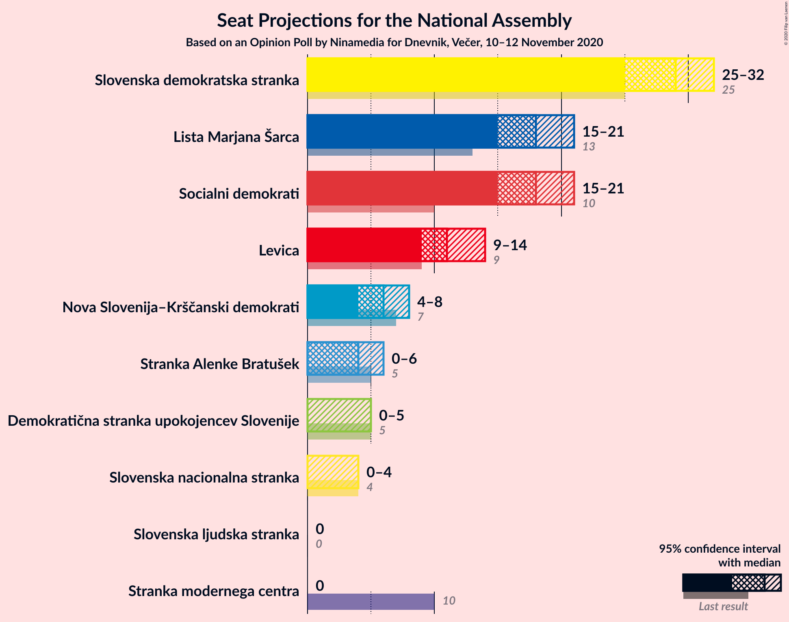

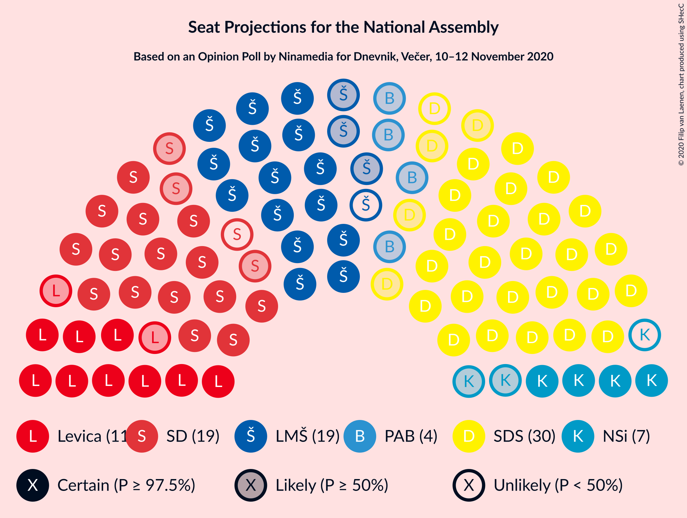

### Confidence Intervals

| Party | Last Result | Median | 80% Confidence Interval | 90% Confidence Interval | 95% Confidence Interval | 99% Confidence Interval |
|:-----:|:-----------:|:------:|:-----------------------:|:-----------------------:|:-----------------------:|:-----------------------:|
| <a href="#slovenska-demokratska-stranka">Slovenska demokratska stranka</a> | 25 | 29 | 26–31 |26–32 |25–32 |24–34 |
| <a href="#lista-marjana-šarca">Lista Marjana Šarca</a> | 13 | 18 | 16–20 |16–21 |15–21 |14–22 |
| <a href="#socialni-demokrati">Socialni demokrati</a> | 10 | 18 | 15–20 |15–20 |15–21 |14–22 |
| <a href="#levica">Levica</a> | 9 | 11 | 10–13 |9–14 |9–14 |9–15 |
| <a href="#nova-slovenija–krščanski-demokrati">Nova Slovenija–Krščanski demokrati</a> | 7 | 6 | 5–8 |5–8 |4–8 |4–9 |
| <a href="#stranka-alenke-bratušek">Stranka Alenke Bratušek</a> | 5 | 4 | 0–5 |0–6 |0–6 |0–7 |
| <a href="#demokratična-stranka-upokojencev-slovenije">Demokratična stranka upokojencev Slovenije</a> | 5 | 0 | 0–4 |0–4 |0–5 |0–5 |
| <a href="#slovenska-nacionalna-stranka">Slovenska nacionalna stranka</a> | 4 | 0 | 0 |0–4 |0–4 |0–4 |
| <a href="#slovenska-ljudska-stranka">Slovenska ljudska stranka</a> | 0 | 0 | 0 |0 |0 |0 |
| <a href="#stranka-modernega-centra">Stranka modernega centra</a> | 10 | 0 | 0 |0 |0 |0 |

### Slovenska demokratska stranka

*For a full overview of the results for this party, see the [Slovenska demokratska stranka](party-slovenskademokratskastranka.html) page.*

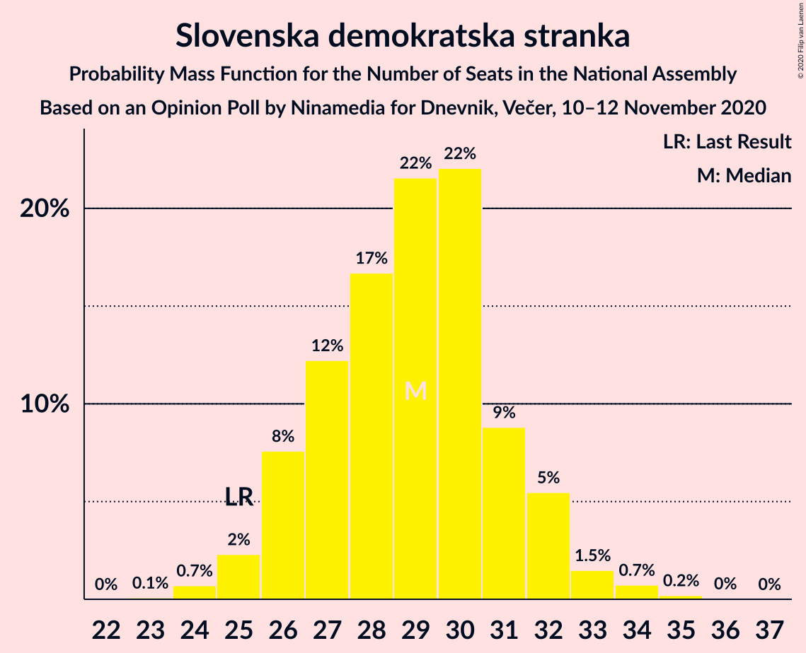

| Number of Seats | Probability | Accumulated | Special Marks |
|:---------------:|:-----------:|:-----------:|:-------------:|
| 23 | 0.1% | 100% |  |
| 24 | 0.7% | 99.9% |  |
| 25 | 2% | 99.2% | Last Result |
| 26 | 8% | 97% |  |
| 27 | 12% | 89% |  |
| 28 | 17% | 77% |  |
| 29 | 22% | 60% | Median |
| 30 | 22% | 39% |  |
| 31 | 9% | 17% |  |
| 32 | 5% | 8% |  |
| 33 | 1.5% | 2% |  |
| 34 | 0.7% | 1.0% |  |
| 35 | 0.2% | 0.3% |  |
| 36 | 0% | 0.1% |  |
| 37 | 0% | 0% |  |

### Lista Marjana Šarca

*For a full overview of the results for this party, see the [Lista Marjana Šarca](party-listamarjanašarca.html) page.*

| Number of Seats | Probability | Accumulated | Special Marks |
|:---------------:|:-----------:|:-----------:|:-------------:|
| 13 | 0.1% | 100% | Last Result |
| 14 | 0.8% | 99.9% |  |
| 15 | 3% | 99.1% |  |
| 16 | 13% | 96% |  |
| 17 | 20% | 82% |  |
| 18 | 26% | 63% | Median |
| 19 | 25% | 37% |  |
| 20 | 4% | 12% |  |
| 21 | 7% | 8% |  |
| 22 | 1.1% | 1.4% |  |
| 23 | 0.3% | 0.4% |  |
| 24 | 0% | 0% |  |

### Socialni demokrati

*For a full overview of the results for this party, see the [Socialni demokrati](party-socialnidemokrati.html) page.*

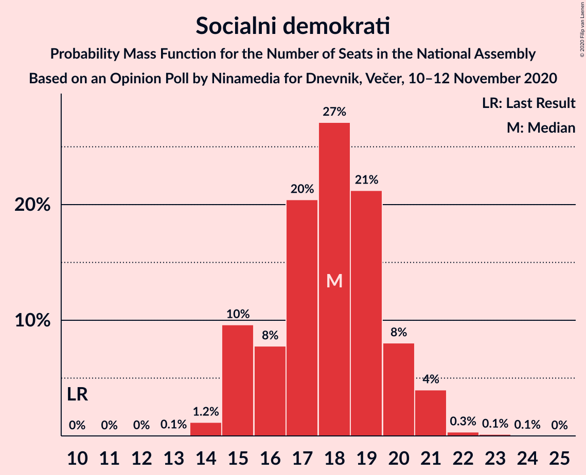

| Number of Seats | Probability | Accumulated | Special Marks |
|:---------------:|:-----------:|:-----------:|:-------------:|
| 10 | 0% | 100% | Last Result |
| 11 | 0% | 100% |  |
| 12 | 0% | 100% |  |
| 13 | 0.1% | 100% |  |
| 14 | 1.2% | 99.9% |  |
| 15 | 10% | 98.7% |  |
| 16 | 8% | 89% |  |
| 17 | 20% | 81% |  |
| 18 | 27% | 61% | Median |
| 19 | 21% | 34% |  |
| 20 | 8% | 13% |  |
| 21 | 4% | 5% |  |
| 22 | 0.3% | 0.5% |  |
| 23 | 0.1% | 0.2% |  |
| 24 | 0.1% | 0.1% |  |
| 25 | 0% | 0% |  |

### Levica

*For a full overview of the results for this party, see the [Levica](party-levica.html) page.*

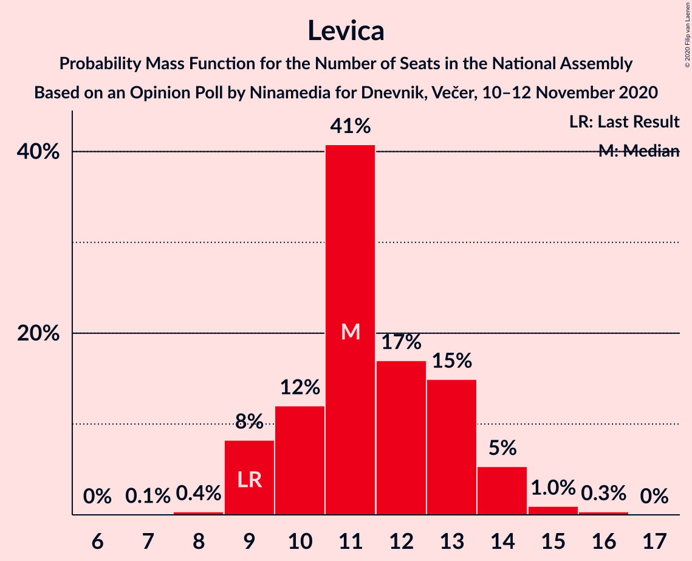

| Number of Seats | Probability | Accumulated | Special Marks |
|:---------------:|:-----------:|:-----------:|:-------------:|
| 7 | 0.1% | 100% |  |
| 8 | 0.4% | 99.9% |  |
| 9 | 8% | 99.6% | Last Result |
| 10 | 12% | 91% |  |
| 11 | 41% | 79% | Median |
| 12 | 17% | 39% |  |
| 13 | 15% | 22% |  |
| 14 | 5% | 7% |  |
| 15 | 1.0% | 1.3% |  |
| 16 | 0.3% | 0.4% |  |
| 17 | 0% | 0% |  |

### Nova Slovenija–Krščanski demokrati

*For a full overview of the results for this party, see the [Nova Slovenija–Krščanski demokrati](party-novaslovenija–krščanskidemokrati.html) page.*

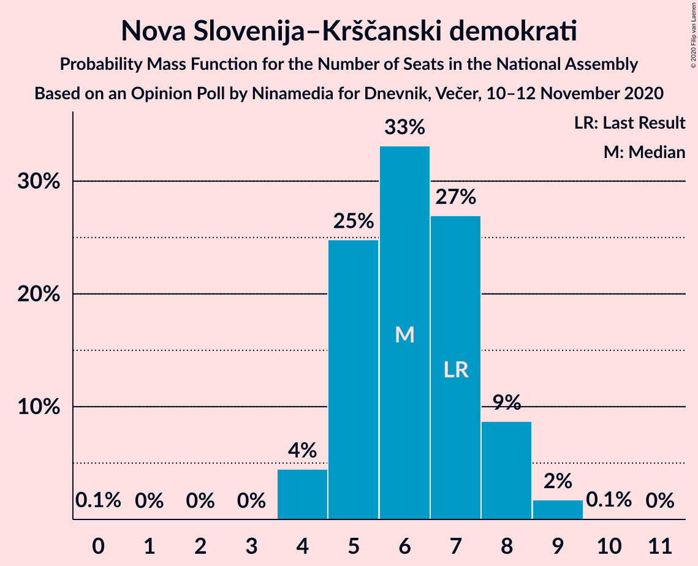

| Number of Seats | Probability | Accumulated | Special Marks |
|:---------------:|:-----------:|:-----------:|:-------------:|
| 0 | 0.1% | 100% |  |
| 1 | 0% | 99.9% |  |
| 2 | 0% | 99.9% |  |
| 3 | 0% | 99.9% |  |
| 4 | 4% | 99.9% |  |
| 5 | 25% | 95% |  |
| 6 | 33% | 71% | Median |
| 7 | 27% | 38% | Last Result |
| 8 | 9% | 11% |  |
| 9 | 2% | 2% |  |
| 10 | 0.1% | 0.1% |  |
| 11 | 0% | 0% |  |

### Stranka Alenke Bratušek

*For a full overview of the results for this party, see the [Stranka Alenke Bratušek](party-strankaalenkebratušek.html) page.*

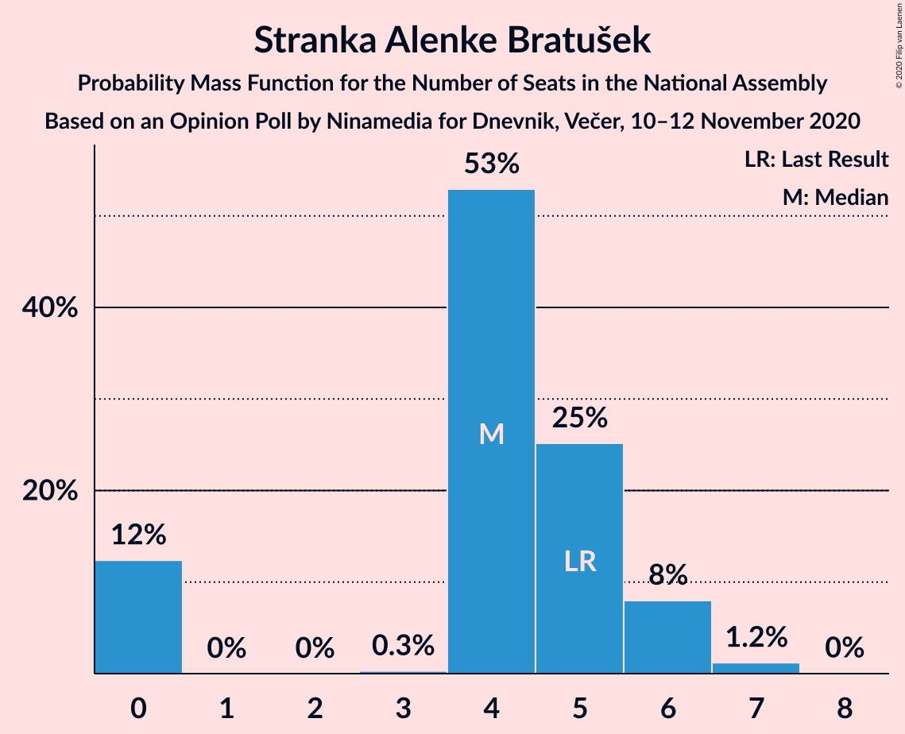

| Number of Seats | Probability | Accumulated | Special Marks |
|:---------------:|:-----------:|:-----------:|:-------------:|
| 0 | 12% | 100% |  |
| 1 | 0% | 88% |  |
| 2 | 0% | 88% |  |
| 3 | 0.3% | 88% |  |
| 4 | 53% | 87% | Median |
| 5 | 25% | 34% | Last Result |
| 6 | 8% | 9% |  |
| 7 | 1.2% | 1.2% |  |
| 8 | 0% | 0% |  |

### Demokratična stranka upokojencev Slovenije

*For a full overview of the results for this party, see the [Demokratična stranka upokojencev Slovenije](party-demokratičnastrankaupokojencevslovenije.html) page.*

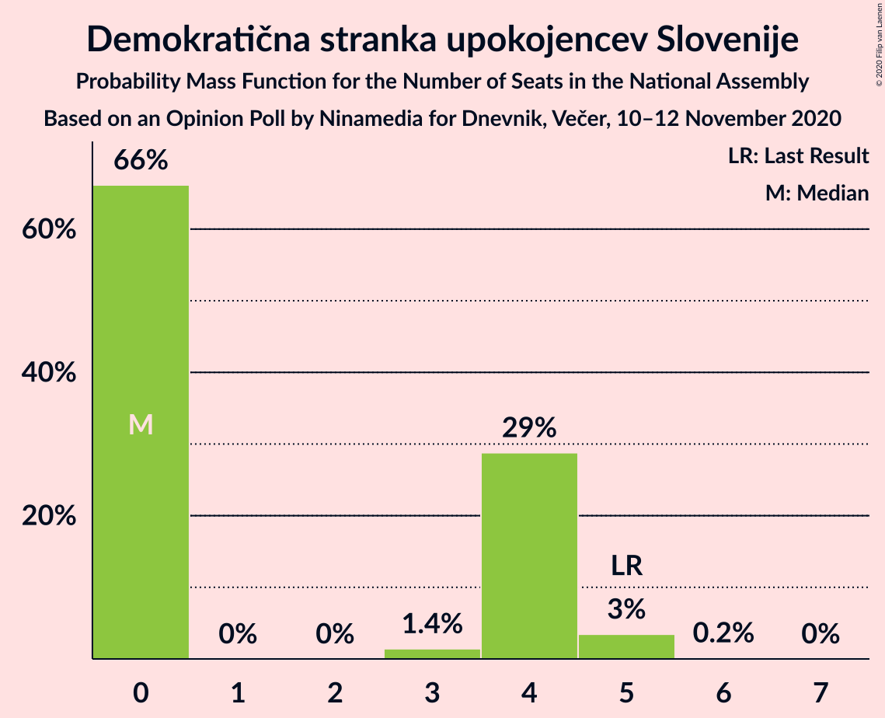

| Number of Seats | Probability | Accumulated | Special Marks |
|:---------------:|:-----------:|:-----------:|:-------------:|
| 0 | 66% | 100% | Median |
| 1 | 0% | 34% |  |
| 2 | 0% | 34% |  |
| 3 | 1.4% | 34% |  |
| 4 | 29% | 32% |  |
| 5 | 3% | 4% | Last Result |
| 6 | 0.2% | 0.2% |  |
| 7 | 0% | 0% |  |

### Slovenska nacionalna stranka

*For a full overview of the results for this party, see the [Slovenska nacionalna stranka](party-slovenskanacionalnastranka.html) page.*

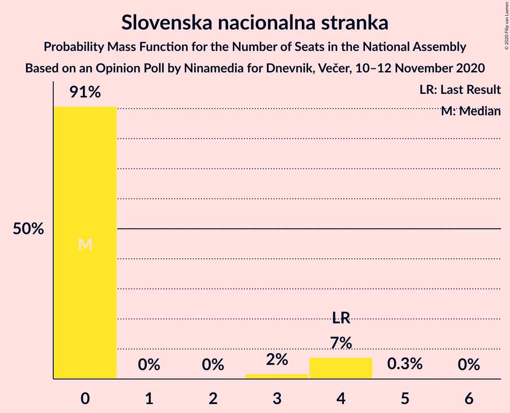

| Number of Seats | Probability | Accumulated | Special Marks |
|:---------------:|:-----------:|:-----------:|:-------------:|
| 0 | 91% | 100% | Median |
| 1 | 0% | 9% |  |
| 2 | 0% | 9% |  |
| 3 | 2% | 9% |  |
| 4 | 7% | 8% | Last Result |
| 5 | 0.3% | 0.3% |  |
| 6 | 0% | 0% |  |

### Slovenska ljudska stranka

*For a full overview of the results for this party, see the [Slovenska ljudska stranka](party-slovenskaljudskastranka.html) page.*

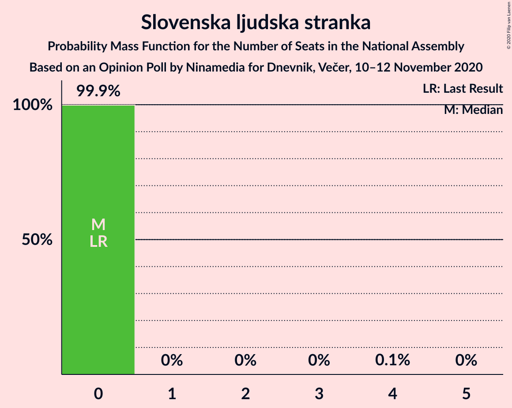

| Number of Seats | Probability | Accumulated | Special Marks |
|:---------------:|:-----------:|:-----------:|:-------------:|
| 0 | 99.9% | 100% | Last Result, Median |
| 1 | 0% | 0.1% |  |
| 2 | 0% | 0.1% |  |
| 3 | 0% | 0.1% |  |
| 4 | 0.1% | 0.1% |  |
| 5 | 0% | 0% |  |

### Stranka modernega centra

*For a full overview of the results for this party, see the [Stranka modernega centra](party-strankamodernegacentra.html) page.*

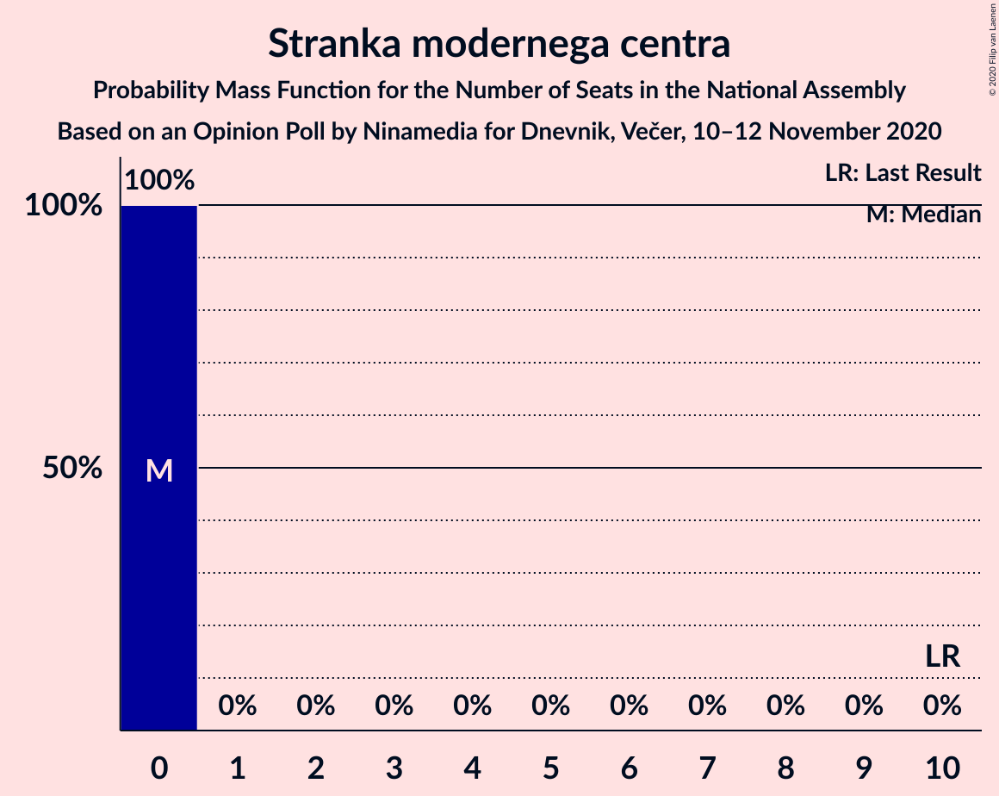

| Number of Seats | Probability | Accumulated | Special Marks |
|:---------------:|:-----------:|:-----------:|:-------------:|
| 0 | 100% | 100% | Median |
| 1 | 0% | 0% |  |
| 2 | 0% | 0% |  |
| 3 | 0% | 0% |  |
| 4 | 0% | 0% |  |
| 5 | 0% | 0% |  |
| 6 | 0% | 0% |  |
| 7 | 0% | 0% |  |
| 8 | 0% | 0% |  |
| 9 | 0% | 0% |  |
| 10 | 0% | 0% | Last Result |

## Coalitions

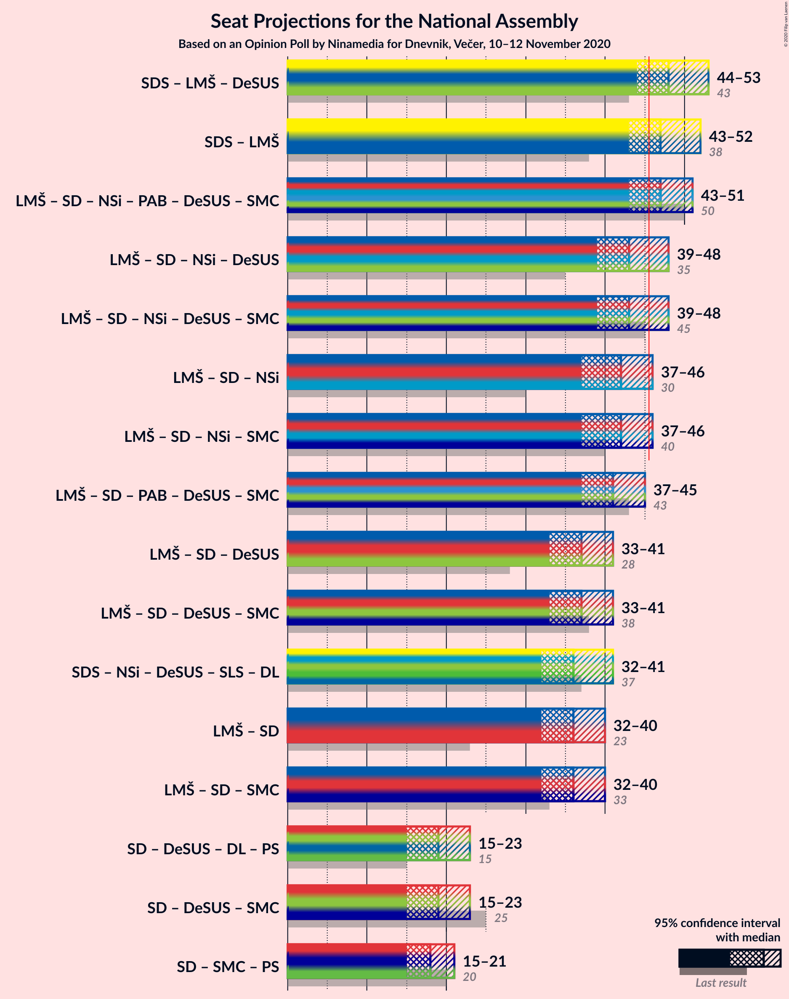

### Confidence Intervals

| Coalition | Last Result | Median | Majority? | 80% Confidence Interval | 90% Confidence Interval | 95% Confidence Interval | 99% Confidence Interval |
|:---------:|:-----------:|:------:|:---------:|:-----------------------:|:-----------------------:|:-----------------------:|:-----------------------:|
| Slovenska demokratska stranka – Lista Marjana Šarca – Demokratična stranka upokojencev Slovenije | 43 | 48 | 85% | 45–52 | 44–53 | 44–53 | 43–54 |
| Slovenska demokratska stranka – Lista Marjana Šarca | 38 | 47 | 72% | 44–50 | 44–51 | 43–52 | 42–53 |
| Lista Marjana Šarca – Socialni demokrati – Nova Slovenija–Krščanski demokrati – Stranka Alenke Bratušek – Demokratična stranka upokojencev Slovenije – Stranka modernega centra | 50 | 47 | 79% | 44–50 | 44–51 | 43–51 | 41–52 |
| Lista Marjana Šarca – Socialni demokrati – Nova Slovenija–Krščanski demokrati – Demokratična stranka upokojencev Slovenije | 35 | 43 | 20% | 40–46 | 40–47 | 39–48 | 38–49 |
| Lista Marjana Šarca – Socialni demokrati – Nova Slovenija–Krščanski demokrati – Demokratična stranka upokojencev Slovenije – Stranka modernega centra | 45 | 43 | 20% | 40–46 | 40–47 | 39–48 | 38–49 |
| Lista Marjana Šarca – Socialni demokrati – Nova Slovenija–Krščanski demokrati | 30 | 42 | 5% | 39–45 | 38–45 | 37–46 | 36–47 |
| Lista Marjana Šarca – Socialni demokrati – Nova Slovenija–Krščanski demokrati – Stranka modernega centra | 40 | 42 | 5% | 39–45 | 38–45 | 37–46 | 36–47 |
| Lista Marjana Šarca – Socialni demokrati – Stranka Alenke Bratušek – Demokratična stranka upokojencev Slovenije – Stranka modernega centra | 43 | 41 | 1.4% | 38–45 | 37–45 | 37–45 | 35–46 |
| Lista Marjana Šarca – Socialni demokrati – Demokratična stranka upokojencev Slovenije | 28 | 37 | 0% | 34–40 | 34–41 | 33–41 | 32–43 |
| Lista Marjana Šarca – Socialni demokrati – Demokratična stranka upokojencev Slovenije – Stranka modernega centra | 38 | 37 | 0% | 34–40 | 34–41 | 33–41 | 32–43 |
| Lista Marjana Šarca – Socialni demokrati | 23 | 36 | 0% | 33–38 | 33–40 | 32–40 | 30–41 |
| Lista Marjana Šarca – Socialni demokrati – Stranka modernega centra | 33 | 36 | 0% | 33–38 | 33–40 | 32–40 | 30–41 |
| Socialni demokrati – Demokratična stranka upokojencev Slovenije – Stranka modernega centra | 25 | 19 | 0% | 17–22 | 16–23 | 15–23 | 14–25 |

### Slovenska demokratska stranka – Lista Marjana Šarca – Demokratična stranka upokojencev Slovenije

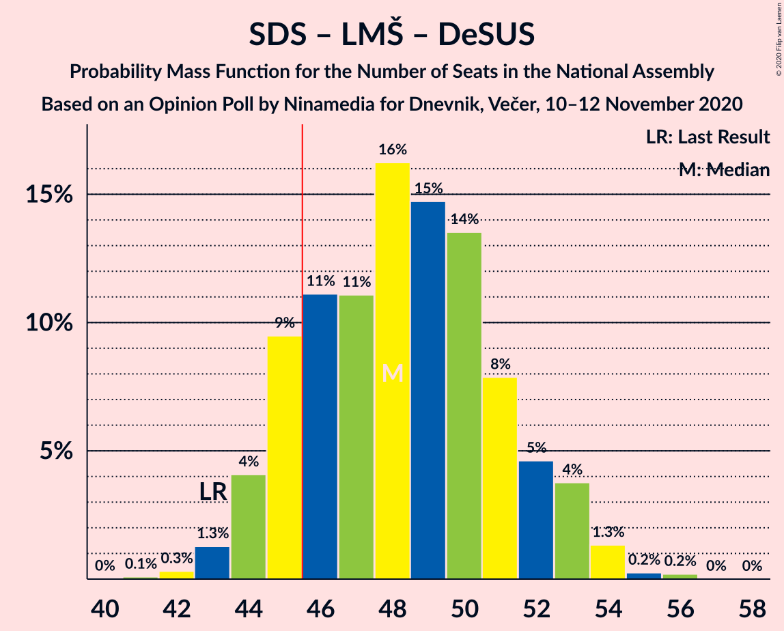

| Number of Seats | Probability | Accumulated | Special Marks |
|:---------------:|:-----------:|:-----------:|:-------------:|
| 41 | 0.1% | 100% |  |
| 42 | 0.3% | 99.9% |  |
| 43 | 1.3% | 99.6% | Last Result |
| 44 | 4% | 98% |  |
| 45 | 9% | 94% |  |
| 46 | 11% | 85% | Majority |
| 47 | 11% | 74% | Median |
| 48 | 16% | 63% |  |
| 49 | 15% | 46% |  |
| 50 | 14% | 32% |  |
| 51 | 8% | 18% |  |
| 52 | 5% | 10% |  |
| 53 | 4% | 6% |  |
| 54 | 1.3% | 2% |  |
| 55 | 0.2% | 0.5% |  |
| 56 | 0.2% | 0.2% |  |
| 57 | 0% | 0% |  |

### Slovenska demokratska stranka – Lista Marjana Šarca

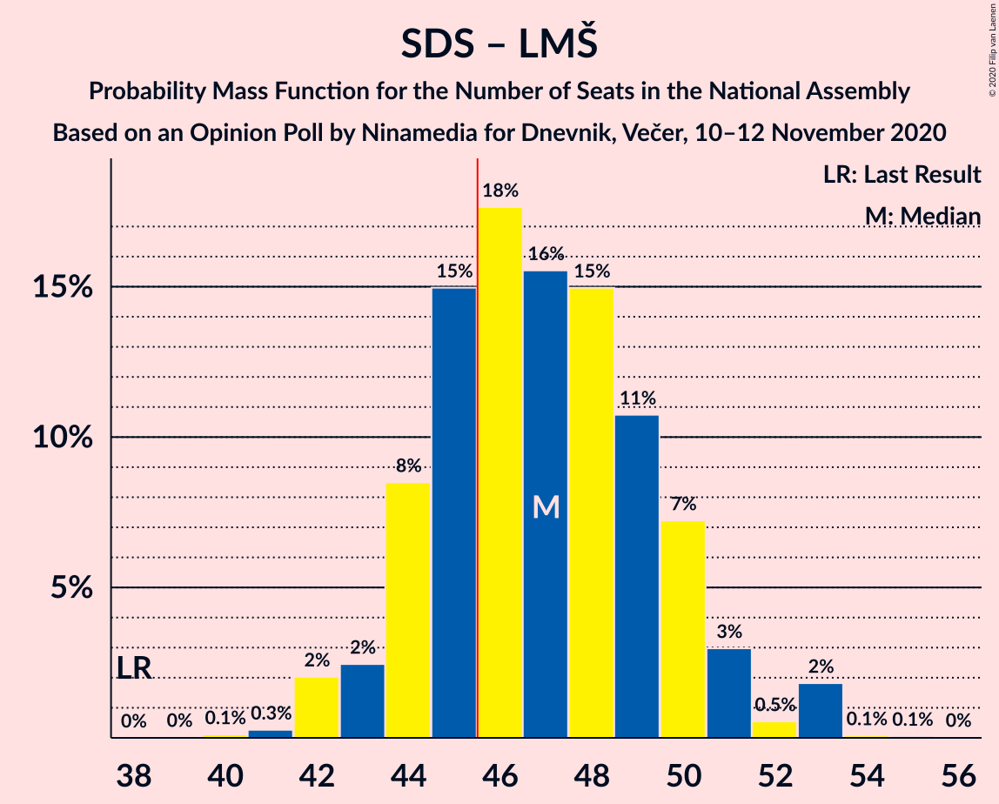

| Number of Seats | Probability | Accumulated | Special Marks |
|:---------------:|:-----------:|:-----------:|:-------------:|
| 38 | 0% | 100% | Last Result |
| 39 | 0% | 100% |  |
| 40 | 0.1% | 100% |  |
| 41 | 0.3% | 99.9% |  |
| 42 | 2% | 99.6% |  |
| 43 | 2% | 98% |  |
| 44 | 8% | 95% |  |
| 45 | 15% | 87% |  |
| 46 | 18% | 72% | Majority |
| 47 | 16% | 54% | Median |
| 48 | 15% | 38% |  |
| 49 | 11% | 23% |  |
| 50 | 7% | 13% |  |
| 51 | 3% | 6% |  |
| 52 | 0.5% | 3% |  |
| 53 | 2% | 2% |  |
| 54 | 0.1% | 0.2% |  |
| 55 | 0.1% | 0.1% |  |
| 56 | 0% | 0% |  |

### Lista Marjana Šarca – Socialni demokrati – Nova Slovenija–Krščanski demokrati – Stranka Alenke Bratušek – Demokratična stranka upokojencev Slovenije – Stranka modernega centra

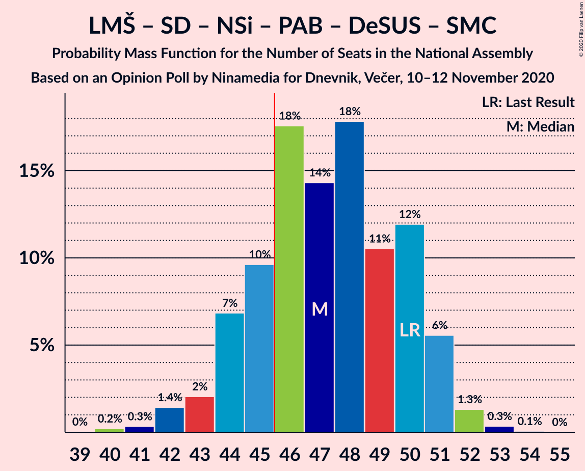

| Number of Seats | Probability | Accumulated | Special Marks |
|:---------------:|:-----------:|:-----------:|:-------------:|
| 40 | 0.2% | 100% |  |
| 41 | 0.3% | 99.8% |  |
| 42 | 1.4% | 99.4% |  |
| 43 | 2% | 98% |  |
| 44 | 7% | 96% |  |
| 45 | 10% | 89% |  |
| 46 | 18% | 79% | Median, Majority |
| 47 | 14% | 62% |  |
| 48 | 18% | 48% |  |
| 49 | 11% | 30% |  |
| 50 | 12% | 19% | Last Result |
| 51 | 6% | 7% |  |
| 52 | 1.3% | 2% |  |
| 53 | 0.3% | 0.4% |  |
| 54 | 0.1% | 0.1% |  |
| 55 | 0% | 0% |  |

### Lista Marjana Šarca – Socialni demokrati – Nova Slovenija–Krščanski demokrati – Demokratična stranka upokojencev Slovenije

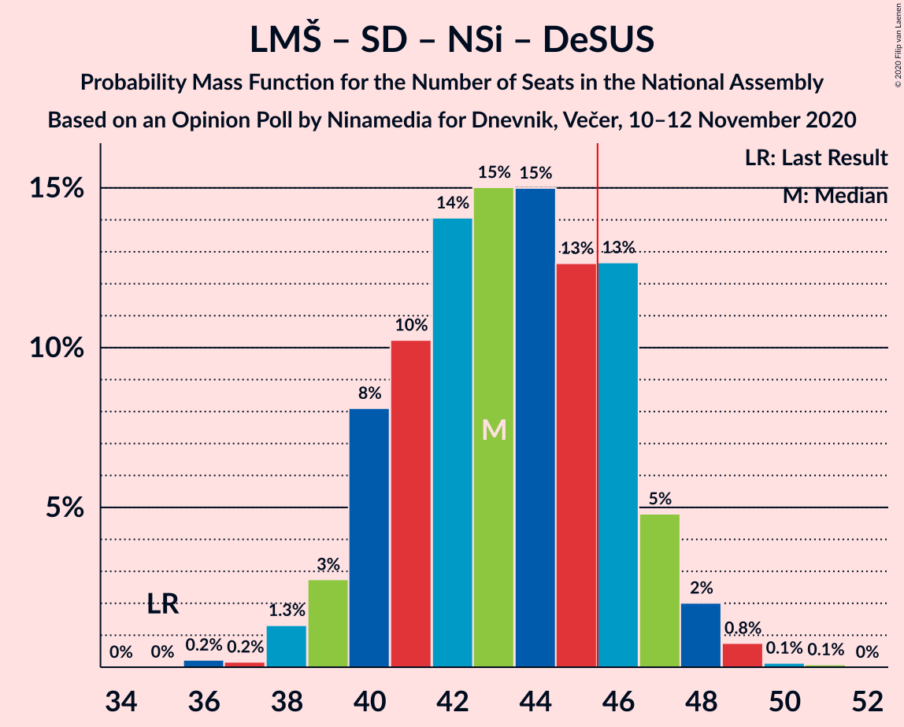

| Number of Seats | Probability | Accumulated | Special Marks |
|:---------------:|:-----------:|:-----------:|:-------------:|
| 35 | 0% | 100% | Last Result |
| 36 | 0.2% | 100% |  |
| 37 | 0.2% | 99.8% |  |
| 38 | 1.3% | 99.6% |  |
| 39 | 3% | 98% |  |
| 40 | 8% | 96% |  |
| 41 | 10% | 87% |  |
| 42 | 14% | 77% | Median |
| 43 | 15% | 63% |  |
| 44 | 15% | 48% |  |
| 45 | 13% | 33% |  |
| 46 | 13% | 20% | Majority |
| 47 | 5% | 8% |  |
| 48 | 2% | 3% |  |
| 49 | 0.8% | 1.0% |  |
| 50 | 0.1% | 0.2% |  |
| 51 | 0.1% | 0.1% |  |
| 52 | 0% | 0% |  |

### Lista Marjana Šarca – Socialni demokrati – Nova Slovenija–Krščanski demokrati – Demokratična stranka upokojencev Slovenije – Stranka modernega centra

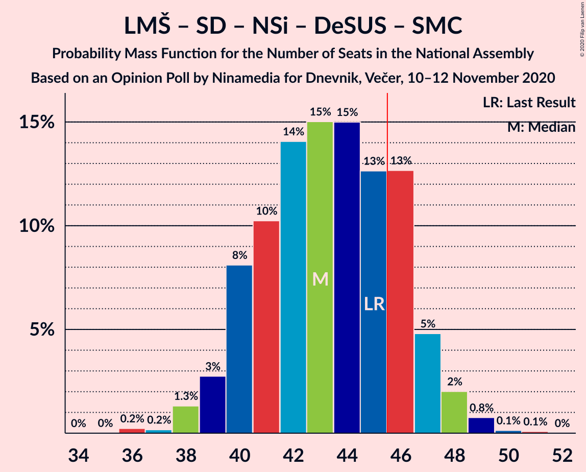

| Number of Seats | Probability | Accumulated | Special Marks |
|:---------------:|:-----------:|:-----------:|:-------------:|
| 36 | 0.2% | 100% |  |
| 37 | 0.2% | 99.8% |  |
| 38 | 1.3% | 99.6% |  |
| 39 | 3% | 98% |  |
| 40 | 8% | 96% |  |
| 41 | 10% | 87% |  |
| 42 | 14% | 77% | Median |
| 43 | 15% | 63% |  |
| 44 | 15% | 48% |  |
| 45 | 13% | 33% | Last Result |
| 46 | 13% | 20% | Majority |
| 47 | 5% | 8% |  |
| 48 | 2% | 3% |  |
| 49 | 0.8% | 1.0% |  |
| 50 | 0.1% | 0.2% |  |
| 51 | 0.1% | 0.1% |  |
| 52 | 0% | 0% |  |

### Lista Marjana Šarca – Socialni demokrati – Nova Slovenija–Krščanski demokrati

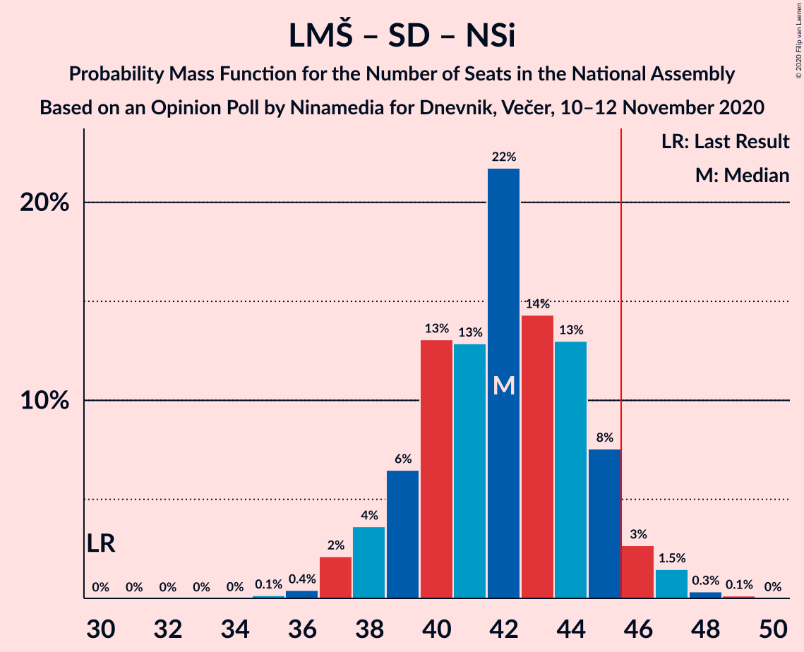

| Number of Seats | Probability | Accumulated | Special Marks |
|:---------------:|:-----------:|:-----------:|:-------------:|
| 30 | 0% | 100% | Last Result |
| 31 | 0% | 100% |  |
| 32 | 0% | 100% |  |
| 33 | 0% | 100% |  |
| 34 | 0% | 100% |  |
| 35 | 0.1% | 100% |  |
| 36 | 0.4% | 99.8% |  |
| 37 | 2% | 99.4% |  |
| 38 | 4% | 97% |  |
| 39 | 6% | 94% |  |
| 40 | 13% | 87% |  |
| 41 | 13% | 74% |  |
| 42 | 22% | 61% | Median |
| 43 | 14% | 40% |  |
| 44 | 13% | 25% |  |
| 45 | 8% | 12% |  |
| 46 | 3% | 5% | Majority |
| 47 | 1.5% | 2% |  |
| 48 | 0.3% | 0.5% |  |
| 49 | 0.1% | 0.2% |  |
| 50 | 0% | 0% |  |

### Lista Marjana Šarca – Socialni demokrati – Nova Slovenija–Krščanski demokrati – Stranka modernega centra

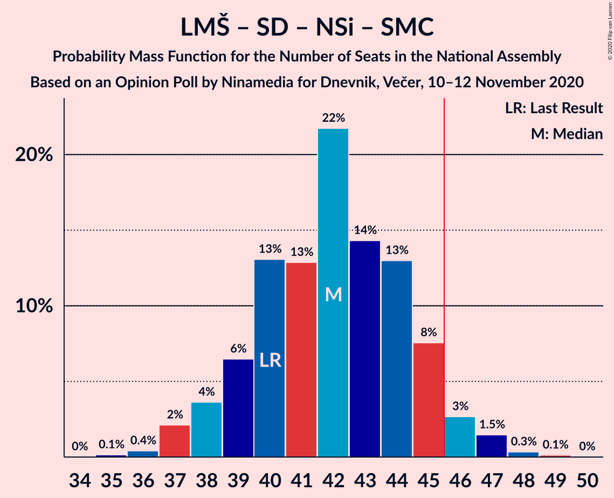

| Number of Seats | Probability | Accumulated | Special Marks |
|:---------------:|:-----------:|:-----------:|:-------------:|
| 35 | 0.1% | 100% |  |
| 36 | 0.4% | 99.8% |  |
| 37 | 2% | 99.4% |  |
| 38 | 4% | 97% |  |
| 39 | 6% | 94% |  |
| 40 | 13% | 87% | Last Result |
| 41 | 13% | 74% |  |
| 42 | 22% | 61% | Median |
| 43 | 14% | 40% |  |
| 44 | 13% | 25% |  |
| 45 | 8% | 12% |  |
| 46 | 3% | 5% | Majority |
| 47 | 1.5% | 2% |  |
| 48 | 0.3% | 0.5% |  |
| 49 | 0.1% | 0.2% |  |
| 50 | 0% | 0% |  |

### Lista Marjana Šarca – Socialni demokrati – Stranka Alenke Bratušek – Demokratična stranka upokojencev Slovenije – Stranka modernega centra

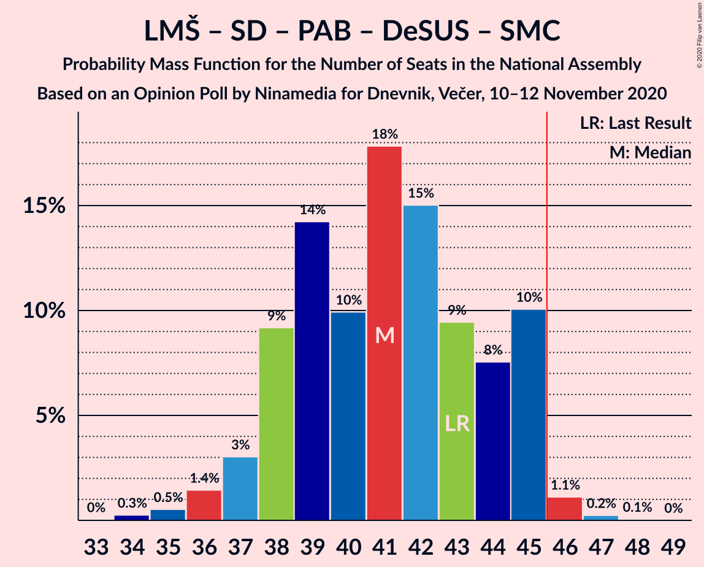

| Number of Seats | Probability | Accumulated | Special Marks |
|:---------------:|:-----------:|:-----------:|:-------------:|
| 33 | 0% | 100% |  |
| 34 | 0.3% | 99.9% |  |
| 35 | 0.5% | 99.7% |  |
| 36 | 1.4% | 99.2% |  |
| 37 | 3% | 98% |  |
| 38 | 9% | 95% |  |
| 39 | 14% | 86% |  |
| 40 | 10% | 71% | Median |
| 41 | 18% | 61% |  |
| 42 | 15% | 44% |  |
| 43 | 9% | 28% | Last Result |
| 44 | 8% | 19% |  |
| 45 | 10% | 11% |  |
| 46 | 1.1% | 1.4% | Majority |
| 47 | 0.2% | 0.3% |  |
| 48 | 0.1% | 0.1% |  |
| 49 | 0% | 0% |  |

### Lista Marjana Šarca – Socialni demokrati – Demokratična stranka upokojencev Slovenije

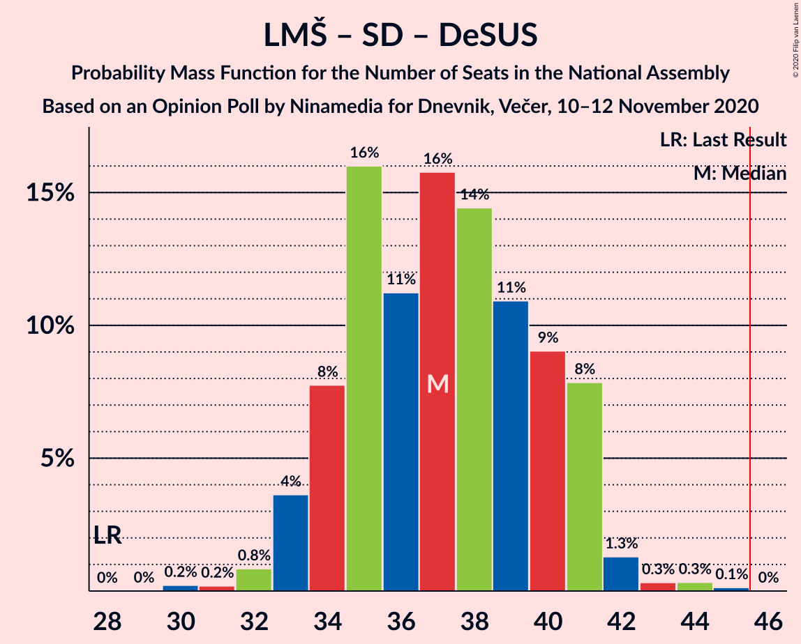

| Number of Seats | Probability | Accumulated | Special Marks |
|:---------------:|:-----------:|:-----------:|:-------------:|
| 28 | 0% | 100% | Last Result |
| 29 | 0% | 100% |  |
| 30 | 0.2% | 100% |  |
| 31 | 0.2% | 99.8% |  |
| 32 | 0.8% | 99.6% |  |
| 33 | 4% | 98.7% |  |
| 34 | 8% | 95% |  |
| 35 | 16% | 87% |  |
| 36 | 11% | 71% | Median |
| 37 | 16% | 60% |  |
| 38 | 14% | 44% |  |
| 39 | 11% | 30% |  |
| 40 | 9% | 19% |  |
| 41 | 8% | 10% |  |
| 42 | 1.3% | 2% |  |
| 43 | 0.3% | 0.8% |  |
| 44 | 0.3% | 0.5% |  |
| 45 | 0.1% | 0.1% |  |
| 46 | 0% | 0% | Majority |

### Lista Marjana Šarca – Socialni demokrati – Demokratična stranka upokojencev Slovenije – Stranka modernega centra

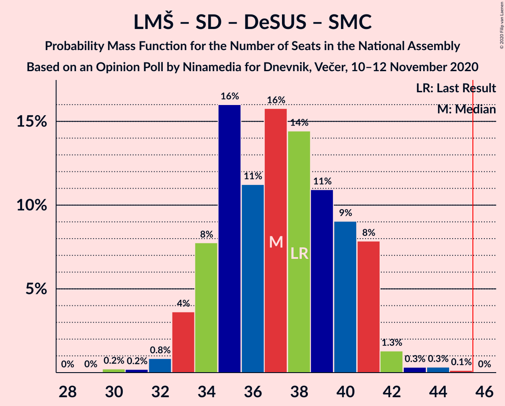

| Number of Seats | Probability | Accumulated | Special Marks |
|:---------------:|:-----------:|:-----------:|:-------------:|
| 30 | 0.2% | 100% |  |
| 31 | 0.2% | 99.8% |  |
| 32 | 0.8% | 99.6% |  |
| 33 | 4% | 98.7% |  |
| 34 | 8% | 95% |  |
| 35 | 16% | 87% |  |
| 36 | 11% | 71% | Median |
| 37 | 16% | 60% |  |
| 38 | 14% | 44% | Last Result |
| 39 | 11% | 30% |  |
| 40 | 9% | 19% |  |
| 41 | 8% | 10% |  |
| 42 | 1.3% | 2% |  |
| 43 | 0.3% | 0.8% |  |
| 44 | 0.3% | 0.5% |  |
| 45 | 0.1% | 0.1% |  |
| 46 | 0% | 0% | Majority |

### Lista Marjana Šarca – Socialni demokrati

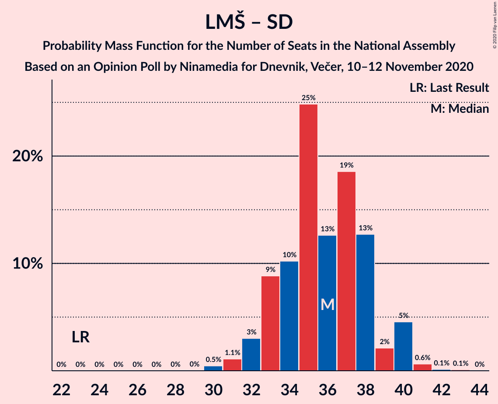

| Number of Seats | Probability | Accumulated | Special Marks |
|:---------------:|:-----------:|:-----------:|:-------------:|
| 23 | 0% | 100% | Last Result |
| 24 | 0% | 100% |  |
| 25 | 0% | 100% |  |
| 26 | 0% | 100% |  |
| 27 | 0% | 100% |  |
| 28 | 0% | 100% |  |
| 29 | 0% | 100% |  |
| 30 | 0.5% | 100% |  |
| 31 | 1.1% | 99.5% |  |
| 32 | 3% | 98% |  |
| 33 | 9% | 95% |  |
| 34 | 10% | 87% |  |
| 35 | 25% | 76% |  |
| 36 | 13% | 51% | Median |
| 37 | 19% | 39% |  |
| 38 | 13% | 20% |  |
| 39 | 2% | 8% |  |
| 40 | 5% | 5% |  |
| 41 | 0.6% | 0.9% |  |
| 42 | 0.1% | 0.3% |  |
| 43 | 0.1% | 0.1% |  |
| 44 | 0% | 0% |  |

### Lista Marjana Šarca – Socialni demokrati – Stranka modernega centra

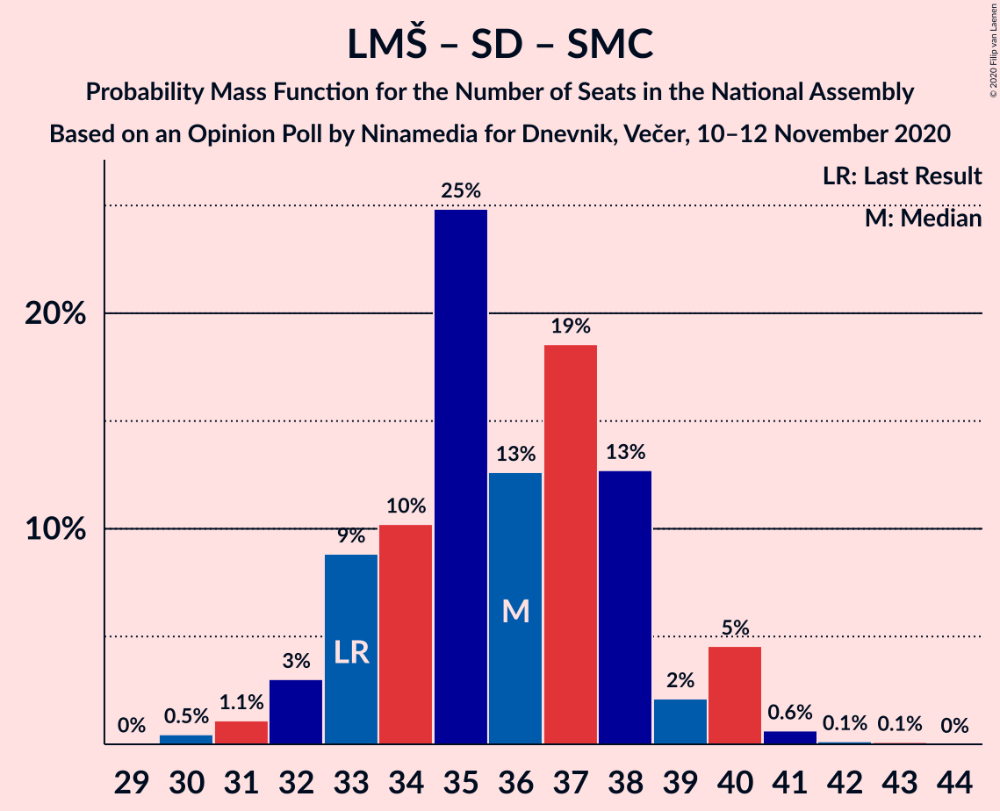

| Number of Seats | Probability | Accumulated | Special Marks |
|:---------------:|:-----------:|:-----------:|:-------------:|
| 30 | 0.5% | 100% |  |
| 31 | 1.1% | 99.5% |  |
| 32 | 3% | 98% |  |
| 33 | 9% | 95% | Last Result |
| 34 | 10% | 87% |  |
| 35 | 25% | 76% |  |
| 36 | 13% | 51% | Median |
| 37 | 19% | 39% |  |
| 38 | 13% | 20% |  |
| 39 | 2% | 8% |  |
| 40 | 5% | 5% |  |
| 41 | 0.6% | 0.9% |  |
| 42 | 0.1% | 0.3% |  |
| 43 | 0.1% | 0.1% |  |
| 44 | 0% | 0% |  |

### Socialni demokrati – Demokratična stranka upokojencev Slovenije – Stranka modernega centra

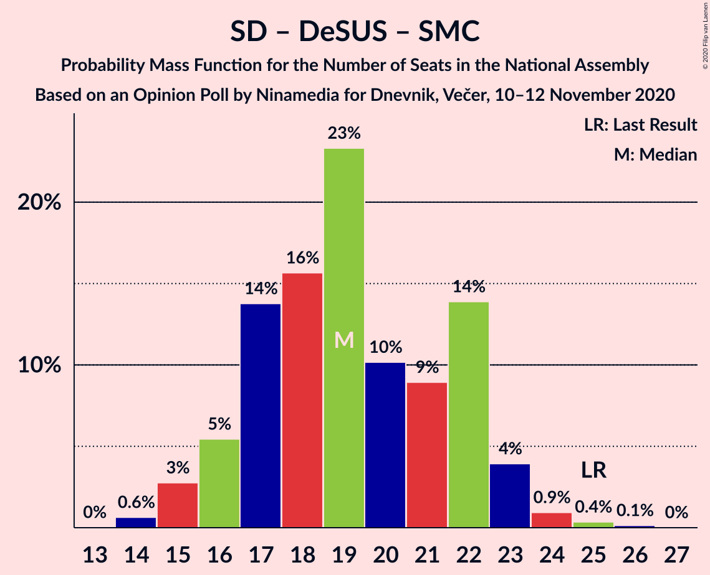

| Number of Seats | Probability | Accumulated | Special Marks |
|:---------------:|:-----------:|:-----------:|:-------------:|
| 14 | 0.6% | 100% |  |
| 15 | 3% | 99.3% |  |
| 16 | 5% | 97% |  |
| 17 | 14% | 91% |  |
| 18 | 16% | 77% | Median |
| 19 | 23% | 62% |  |
| 20 | 10% | 38% |  |
| 21 | 9% | 28% |  |
| 22 | 14% | 19% |  |
| 23 | 4% | 5% |  |
| 24 | 0.9% | 1.4% |  |
| 25 | 0.4% | 0.5% | Last Result |
| 26 | 0.1% | 0.2% |  |
| 27 | 0% | 0% |  |

## Technical Information

### Opinion Poll

+ **Polling firm:** Ninamedia
+ **Commissioner(s):** Dnevnik, Večer
+ **Fieldwork period:** 10–12 November 2020

### Calculations

+ **Sample size:** 700
+ **Simulations done:** 1,048,576
+ **Error estimate:** 2.97%

